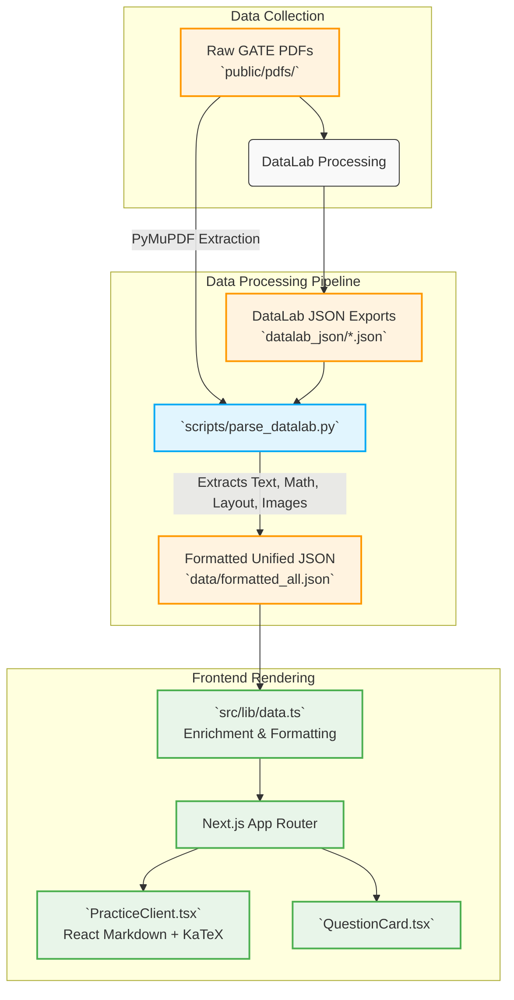

# GATE PYQ Practice Platform

This project is a modern Next.js application designed to process, structure, and render GATE Computer Science previous year questions (PYQs) and study notes from raw PDF materials. 

The platform features an automated pipeline that extracts data from PDF documents, parses it into structured JSON, and serves it through a sleek, highly-responsive frontend built with Next.js and Tailwind CSS.

## 📊 Data Flow Architecture

The data pipeline transitions the content from unstructured PDFs to a rich, interactive web experience.



### 1. Data Collection
- The original source material consists of GATE CS textbooks in PDF format (Volumes 1, 2, and 3) stored in `public/pdfs/` they are collected from Go-Pdfs Gateoverflow repo release.
- These PDFs are initially processed by **DataLab**, which performs OCR and structural analysis, converting the PDF pages into rich JSON documents containing bounding boxes, HTML fragments, math blocks (LaTeX), and base64-encoded images.
- These exported JSON files are placed in the `datalab_json/` directory.

### 2. Data Processing
- The core processing engine is `scripts/parse_datalab.py`. 
- This Python script merges the structural data from `datalab_json/` and layout features (like embedded image coordinates and explanation URLs) directly from the raw PDFs using `PyMuPDF`.
- It intelligently pieces together questions, their options, and correct answers from tables. It separates study notes from practice questions and embeds necessary diagram images.
- The output is a single, highly-structured database file: `data/formatted_all.json`.

### 3. Frontend Rendering
- The Next.js frontend imports `data/formatted_all.json` through `src/lib/data.ts`.
- `data.ts` performs on-the-fly enrichment: it extracts clean subtopic headers from question text, structures plaintext study notes into proper Markdown hierarchies, and prepares the data for rendering.
- The UI components (`PracticeClient.tsx` and `QuestionCard.tsx`) use `react-markdown` configured with `remark-math` and `rehype-katex` to seamlessly render complex mathematical formulas and tables directly in the browser.

---

## 🚀 How to Add New GATE PDFs (Step-by-Step)

If you have future releases of GATE PDFs or new volumes and want to integrate them into the platform, follow these steps:

### Step 1: Add the Raw PDFs
Place the new PDF files inside the `public/pdfs/` directory. Ensure they follow a consistent naming convention (e.g., `filter1_volume4.pdf`).

### Step 2: Generate DataLab JSON
Upload the new PDFs to your **DataLab** workspace for processing. Once DataLab finishes OCR and layout analysis, export the results as JSON and place them in the `datalab_json/` directory (e.g., `datalab-output-filter1_volume4.pdf.json`).

### Step 3: Update the Python Script Configuration
Open `scripts/parse_datalab.py` and locate the `volumes_config` array in the `__main__` block (around line 340). Add a new entry for your volume:

```python
volumes_config = [
    # ... existing volumes ...
    {
        "id": "volume4", 
        "name": "Volume 4", 
        "json": "datalab-output-filter1_volume4.pdf.json", 
        "pdf": "public/pdfs/filter1_volume4.pdf"
    }
]
```

### Step 4: Run the Parsing Script
Activate the Python virtual environment and run the parsing script to generate the updated `formatted_all.json` database.

```bash
# Activate virtual environment (Windows)
.\venv\Scripts\activate

# Or on macOS/Linux:
# source venv/bin/activate

# Install dependencies if you haven't already
pip install -r scripts/requirements.txt

# Run the parser
python scripts/parse_datalab.py
```

*Note: The script will output "Total Data parsed successfully" along with the number of questions extracted.*

### Step 5: Start the Frontend
Start the Next.js development server to verify the new content is rendering correctly.

```bash
npm run dev
# or
yarn dev
# or
pnpm dev
```
Open [http://localhost:3000](http://localhost:3000) to browse the new volumes and verify the rendering of mathematical equations and diagrams.
