# Table of Contents

able of Contents 1   
Contributors 10   
1 Discrete Mathematics: Combinatory (51) 12 Topic-wise Key Concepts 121212121213   
Balls In Bins Important Formulas, Theorems, and Results: Key Properties and Identities: Common Pitfalls or Tricky Points: Standard Problem-Solving Techniques or Shortcuts: Combinatory 13 Important Formulas, Theorems, and Results: 13 Key Properties and Identities: 134 Common Pitfalls o Tricky Points: Standard Problem-Solving Techniques or Shortcuts:   
Counting 14 Important Formulas, Theorems, and Results: 14141414 Key Properties and Identities: Common Pitfalls o Tricky Points: Standard Problem-Solving Techniques or Shortcuts:   
Generating Functions 14 Important Formulas, Theorems, and Results: 1415151515 Key Properties and Identities: Common Pitfalls or Tricky Points: Standard Problem-Solving Techniques o Shortcuts: Modular Arithmetic Important Formulas, Theorems, and Results: 156 Key Properties and Identities: Common Pitfalls or Tricky Points: Standard Problem- Solving Techniques or Shortcuts: 16   
Pigeonhole Principle 16 Important Formulas, Theorems, and Results: 17171717 Key Properties and Identities: Common Pitfalls o Tricky Points:   
ReStcaunrdraerdncPerobRlelma-tSiolnving Techniques or Shortcuts: Important Formulas, Theorems, and Results: 1717181818 Key Properties and Identities: Common Pitfalls or Tricky Points: Standard Problem-Solving Techniques or Shortcuts:   
Summation 18 Important Formulas, Theorems, and Results: 181819191919202021252627272729 Key Properties and Identities: Common Pitfalls or Tricky Points: Standard Problem-Solving Techniques o Shortcuts: Quick Formula Reference Important Tips for GATE 1.1 Balls In Bins (6) 1.2 Combinatory (18) 1.3 Counting (6) 1.4 Generating Functions (6) 1.5 Modular Arithmetic (2) 1.6 Pigeonhole Principle (2) 1.7 Recurrence Relation (7) 1.8 Summation (4) Answer Keys 30   
2 Discrete Mathematics: Graph Theory (88) 31313132323334 Topic-wise Key Concepts   
Counting   
Degree of Graph Graph Algorithms Graph Coloring Graph Connectivity   
Graph Isomorphism 34353636373738384141435152525555   
Graph Matching   
Graph Planarity   
Jaccard Coefficient   
Quick Formula Reference   
Important Tips for GATE   
2.1 Counting (3)   
2.2 Degree of Graph (13)   
2.3 Graph Algorithms (1)   
2.4 Graph Coloring (11)   
2.5 Graph Connectivity (40)   
2.6 Graph Isomorphism (4)   
2.7 Graph Matching (2)   
2.8 Graph Planarity (13)   
2.9 Jaccard Coefficient (1)   
Answer Keys   
3 Discrete Mathematics: Mathematical Logic (78) 57   
Topic-wise Key Concepts 5757596062626263636363727381 Propositional Logic First Order Logic (Predicate Logic) Logical Reasoning (Inference)   
Quick Formula Reference Propositional Logic Equivalences Quantifier Equivalences Rules of Inference (Propositional Logic) Rules of Inference (First Order Logic)   
Important Tips for GATE   
3.1 First Order Logic (35)   
3.2 Logical Reasoning (3)   
3.3 Propositional Logic (40)   
Answer Keys   
4 Discrete Mathematics: Set Theory & Algebra (173) 82   
Topic-wise Key Concepts 82   
Set Theory 82828282828383 Definition and Core Idea: Important Formulas and Results: Key Properties and Identities: Common Pitfalls Tricky Points: Problem-Solving Techniques:   
Relations 83 Definition and Core Idea: 83838383838484 Important Formulas and Results: Key Properties and Identities: Common Pitfalls Tricky Points: Problem-Solving Techniques:   
Functions Definition and Core Idea: 8484848484 Important Formulas and Results: Key Properties and Identities: Common Pitfalls Tricky Points: Problem-Solving Techniques:   
Binary Operation 84 Definition and Core Idea: 84858585858585 Important Formulas and Results: Key Properties and Identities: Common Pitfalls Tricky Points: Problem-Solving Techniques:   
GrDoefuinpi iTonheanodryCore Idea: 85858686868686 Important Formulas and Results: Key Properties and Identities: Common Pitfalls Tricky Points: Problem-Solving Techniques:   
Identity Function Definition and Core Idea:

Important Formulas and Results: 86   
Key Properties and Identities: 86   
Common Pitfalls & Tricky Points: 86   
Problem-Solving Techniques: 86   
Lattice 86   
Definition and Core Idea: 867   
Important Formulas and Results:   
Key Properties and Identities: 87   
Common Pitfalls & Tricky Points: 87   
Problem-Solving Techniques: 87   
Mathematical Induction 87   
Definition and Core Idea: 87   
Important Formulas and Results: 87   
Key Properties and Identities: 88   
Common Pitfalls & Tricky Points: 88   
Problem- Solving Techniques: 88   
Number Theory 88   
Definition and Core Idea: 88   
Important Formulas and Results: 88   
Key Properties and Identities: 88   
Common Pitfalls & Tricky Points: 89   
Problem-Solving Techniques: 89   
Onto (Surjective Functions) 89   
Definition and Core Idea: 89   
Important Formulas and Results: 89   
Key Properties and Identities: 89   
Common Pitfalls & Tricky Points: 89   
Problem-Solving Techniques:   
Partial Order 89   
Definition and Core Idea: 89   
Important Formulas and Results: 90   
Key Properties and Identities: 90   
Common Pitfalls & Tricky Points: 90   
Problem-Solving Techniques: 90   
Polynomials 90   
Definition and Core Idea: 90   
Important Formulas and Results: 90   
Key Properties and Identities: 91   
Common Pitfalls & Tricky Points: 91   
Problem-Solving Techniques: 91   
Quick Formula Reference 91   
Important Tips for GATE 92   
4.1 Binary Operation (8) 92   
4.2 Countable Uncountable Set (2) 94   
4.3 Functions (30) 94   
4.4 Group Theory (33) 100   
4.5 Identify Function (1) 106   
4.6 Lattice (10) 106   
4.7 Mathematical Induction (2) 109   
4.8 Number Theory (7) 109   
4.9 Onto (1) 110   
4.10 Partial Order (10)   
4.11 Polynomials (4) 3   
4.12 Relations (38)   
4.13 Set Theory (27) 121   
Answer Keys 26   
5 Engineering Mathematics: Calculus (69) 28   
Topic-wise Key Concepts 128   
Limits 128   
Continuity 129   
Differentiation 130   
Maxima Minima 131   
Integration 132   
Definite Integral 133   
Polynomials 133   
Summation 134

# Quick Formula Reference

Definite Integral 136   
Polynomials 136   
Summation 136   
Important Tips for GATE 136   
5.1 Continuity (11) 137   
5.2 Definite Integral (4) 139   
5.3 Differentiation (11) 140   
5.4 Integration (11) 43   
5.5 Limits (15)   
5.6 Maxima Minima (14)   
5.7 Polynomials (2) 50   
5.8 Summation (1) 50   
Answer Keys 50   
Engineering Mathematics: Linear Algebra (112) 152   
Subject Overview 152   
Topic-wise Key Concepts 152   
Cartesian Coordinates 52   
Determinant 52   
Eigen Value 53   
Gaussian Elimination 54   
LU Decomposition 154   
Matrix 155   
Multiplicity 156   
Orthonormality 156   
Rank of Matrix 157   
Singular Value Decomposition (SVD) 157   
Statistics 158   
Subspace 158   
System of Equations 159   
Vector Space 60   
Quick Formula Reference 160   
Important Tips for GATE 61   
6.1 Cartesian Coordinates (1) 162   
6.2 Determinant (12) 62   
6.3 Eigen Value (33) 65   
6.4 Gaussian Elimination (1)   
6.5 Lu Decomposition (3)   
6.6 Matrix (24)   
6.7 Multiplicity (1)   
6.8 Orthonormality (2) 78   
6.9 Rank of Matrix (7) 79   
6.10 Singular Value Decomposition (1) 180   
6.11 Statistics (2) 180   
6.12 Subspace (1) 181   
6.13 System of Equations (17) 181   
6.14 Vector Space (7) 186   
Answer Keys 187   
7 Engineering Mathematics: Probability (125) 89   
Topic-wise Key Concepts 189   
Bayes Theorem 189   
Bayesian Network 189   
Bernoulli Distribution 190   
Binomial Distribution 190   
Chi Square Distribution 191   
Conditional Probability 191   
Continuous Distribution 192   
Expectation 192   
Exponential Distribution 193   
Independent Events 193   
Normal Distribution 194   
Poisson Distribution 94   
Probability 195   
Probability Density Function (PDF) 95   
Probability Distribution 196   
Random Variable 96   
Square Invariant 197   
Statistics 197   
Uniform Distribution 198   
Variance 98   
Quick Formula Reference 99   
Important Tips for GATE 200   
7.1 Bayes Theorem (3) 200   
7.2 Bayesian Network (2) 201   
7.3 Bernoulli Distribution (2) 203   
7.4 Binomial Distribution (6) 203   
7.5 Chi Square Distribution (1) 204   
7.6 Conditional Probability (14) 205   
Continuous Distribution (1)   
7.8 Expectation (15) 207   
7.9 Exponential Distribution (6)   
7.10 Independent Events (6) 12   
7.11 Normal Distribution (4) 213   
7.12 Poisson Distribution (5) 214   
7.13 Probability (31) 215   
7.14 Probability Density Function (1) 221   
7.15 Probability Distribution (1) 221   
7.16 Random Variable (10)   
7.17 Square Invariant (1) 223   
7.18 Statistics (3) 224   
7.19 Uniform Distribution (11) 224   
7.20 Variance (2) 226   
Answer Keys 226   
8 General Aptitude: Analytical Aptitude (48) 228   
Topic-wise Key Concepts 228   
Age Relation 228   
Analogy   
Code Words 22   
Coding Decoding 22   
Direction Sense 23   
Family Relationship 230   
nequality   
Logical Inference   
Logical Reasoning   
Number Relations   
Odd One 233   
Passage Reading   
Round Table Arrangement 233   
Seating Arrangement 3   
Sequence Series 234   
Statements Follow 235   
Quick Formula Reference 236   
Important Tips for GATE 236   
8.1 Age Relation (2) 237   
8.2 Analogy (1) 237   
8.3 Code Words (2) 237   
8.4 Coding Decoding (1) 238   
8.5 Direction Sense (5) 238   
8.6 Family Relationship (1) 239   
8.7 Logical Inference (1) 240   
8.8 Logical Reasoning (18) 240   
8.9 Number Relations (1) 2456   
8.10 Odd One (2)   
8.11 Passage Reading (2)   
8.12 Round Table Arrangement (1) 246   
8.13 Seating Arrangement (1) 246   
8.14 Sequence Series (3) 247   
8.15 Statements Follow (7) 247   
Answer Keys 249   
9 General Aptitude: Quantitative Aptitude (197) 250   
Topic-wise Key Concepts 250   
Absolute Value 250   
Age Relation 250   
Algebra 250   
Alligation Mixture 251   
Area 25   
Arithmetic Series 25   
Average   
Bar Graph   
Bayes Theorem 252   
Calendar 252   
Cartesian Coordinates 252   
Circle 252   
Clock Time 252   
Combinatory (Permutation and Combination) 253   
Compound Interest 253   
Conditional Probability 253   
Cones 253   
Contour Plots 254   
Cost Market Price 254   
Counting 254   
Cubes   
Currency Notes   
Curves   
Data Interpretation   
Digital Image Processing 255   
Factors 255   
Fractions 255   
Functions 255   
Geometry 255   
Graph Coloring 256   
Inequality 256   
LCM HCF 256   
Line Graph 256   
Lines 256   
Logarithms 257   
Maps   
Maxima Minima 257   
Mensuration 257   
Modular Arithmetic 25   
Number Representation 257   
Number Series 258   
Number System 258   
Number Theory 258   
Numerical Computation 258   
Percentage 258   
Permutation and Combination 259   
Pie Chart 259

Powers 259 Prime Numbers 259 Probability 259 Probability Density Function 260 Profit Loss 260 Quadratic Equations 260 Radar Chart 260 Ratio Proportion 260 Scatter Plot 26 Seating Arrangement 26 Sequence Series 261 Set Theory 261 Shortest Path 26 Speed Time Distance 262 Squares 6 Statistics   
System of Equations   
Tables Tabular Data 26 Triangles 263 Trigonometry 263 Unit Digit   
Venn Diagram   
Volume   
Work Time   
Quick Formula Reference 2 Important Tips for GATE 265 9.1 No Classified Topic (1) 265 9.2 Absolute Value (5) 26 9.3 Algebra (1) 266 9.4 Alligation Mixture (2) 266 9.5 Area (1) 266 9.6 Arithmetic Series (3) 267 9.7 Average (1) 268 9.8 Bar Graph (4) 268 9.9 Bayes Theorem (1) 269 9.10 Cartesian Coordinates (4)   
9.11 Circle (3)   
9.12 Clock Time (1) 2 9.13 Combinatory (5)   
9.14 Compound Interest (3)   
9.15 Conditional Probability (2)   
9.16 Contour Plots (2)   
9.17 Cost Market Price (4)   
9.18 Cubes (2)   
9.19 Currency Notes (1) 9.20 Data Interpretation (3)   
9.21 Digital Image Processing (1)   
9.22 Factors (3)   
9.23 Fractions (1) 27 9.24 Functions (7)   
9.25 Geometry (5) 280 9.26 Graph Coloring (1) 281 9.27 Line Graph (5) 282 9.28 Logarithms (6) 284 9.29 Maps (1) 285 9.30 Maxima Minima (4) 285 9.31 Mensuration (1) 286 9.32 Modular Arithmetic (1) 286 9.33 Number Representation (1) 286

9.34 Number Series (5) 287   
9.35 Number System (4) 287   
9.36 Number Theory (2) 288   
9.37 Numerical Computation (9) 289   
9.38 Percentage (8) 290   
9.39 Permutation and Combination (4) 292   
9.40 Pie Chart (5) 293   
9.41 Polynomials (1) 295   
9.42 Powers (1) 295   
9.43 Prime Numbers (1) 296   
9.44 Probability (17) 296   
9.45 Profit Loss (3) 239090   
9.46 Quadratic Equations (6)   
9.47 Radar Chart (1) 301   
9.48 Ratio Proportion (9) 301   
9.49 Sequence Series (4) 303   
9.50 Shortest Path (1) 303   
9.51 Speed Time Distance (4) 304   
9.52 Statistics (3) 305   
9.53 System of Equations (1) 3056   
9.54 Tables (1)   
9.55 Tabular Data (7)   
9.56 Triangles (3) 309   
9.57 Venn Diagram (7) 309   
9.58 Volume (1) 311   
9.59 Work Time (3)   
Answer Keys 312   
10 General Aptitude: Spatial Aptitude (19) 314   
Topic-wise Key Concepts 314   
1. 3D Structure 314   
2. Assembling 315   
3. Assembling Pieces 315   
4. Counting Figure 316   
5. Grouping 317   
6. Image Rotation 317   
7. Mirror Image 318   
8. Paper Folding 318   
9. Patterns In Three Dimensions 319   
10. Patterns In Two Dimensions 31   
Quick Formula Reference 320   
Important Tips for GATE 320   
10.1 3d Structure (1) 321   
10.2 Assembling (1) 2   
10.3 Assembling Pieces (1) 322   
10.4 Image Rotation (3) 323   
10.5 Mirror Image (1) 324   
10.6 Paper Folding (5) 324   
10.7 Patterns In Three Dimensions (3) 327   
10.8 Patterns In Two Dimensions (4) 328   
Answer Keys 330   
11 General Aptitude: Verbal Aptitude (165) 331   
Topic-wise Key Concepts 331   
Antonyms 331   
Articles   
Comparative Forms 332   
English Grammar 332   
Grammatical Error 333   
Incorrect Sentence Part 333   
Most Appropriate Word 333   
Narrative Sequencing 33   
Noun Verb Adjective 334   
Passage Reading 335   
Phrasal Verb 335   
Phrase Meaning 335   
Prepositions 3367   
Pronouns   
Sentence Ordering   
Statement Sufficiency 337   
Statements Follow 337   
Synonyms 3   
Tenses 338   
Verbal Reasoning 339   
Word Meaning 33   
Word Pairs 340   
Quick Formula Reference 340   
Important Tips for GATE 341   
11.1 Antonyms (7) 341   
11.2 Articles (2) 342   
11.3 Comparative Forms (2) 343   
11.4 English Grammar (5) 343   
11.5 Grammatical Error (6) 344   
11.6 Incorrect Sentence Part (5) 345   
11.7 Most Appropriate Word (47) 346   
11.8 Narrative Sequencing (1) 354   
11.9 Passage Reading (23) 355   
11.10 Phrase Meaning (5) 361   
11.11 Prepositions (1) 362   
11.12 Sentence Ordering (2) 362   
11.13 Statement Sufficiency (2) 363   
11.14 Statements Follow (1) 363   
11.15 Synonyms (13) 364   
11.16 Tenses (9) 366   
11.178 VWeorrbdalMReeaansinogn i(n5g) (15) 367712   
11.19 Word Pairs (14)   
Answer Keys

# Contributors

User , Answers   
Arjun Suresh 6823, 127   
Sachin Mittal 2139, 18   
Digvijay 1905, 26   
Akash Kanase 1875, 33   
Amar Vashishth 1822, 20   
Happy Mittal 1739, 21   
Deepak Poonia 1503, 24   
Rajarshi Sarkar 1381, 31   
Praveen Saini 1086, 16   
Manish Joshi 1052, 9   
Anu 942, 12   
Ankit Rokde 888, 15   
Srinath Jayachandran 824, 14   
Lakshman Patel (GATE 634, 18   
And Tech)   
Bhagirathi Nayak 625, 14   
Mithlesh Upadhyay 601, 5   
gatecse 597, 6   
ankitgupta.1729 595, 20   
suraj 563, 10   
Vikrant Singh 540, 7   
Anurag Pandey 497, 5   
Soumya Jain 493, 6   
srestha 478, 5   
Kathleen Bankson 475, 19   
Ayush Upadhyaya 473, 6   
Pooja Palod 450, 9   
Manu Thakur 430, 9   
Hira 417, 20   
zxy123 416, 12   
Madhur Rawat 412, 5   
Himanshu Agarwal 391, 6   
Sona Praneeth Akula 389, 6   
Ashwani Kumar 382, 4   
Shyam Singh 363, 5   
Leen Sharma 360, 9   
Kumar Shikhar Deep 358, 2   
Abhilash Panicker 336, 10   
Rajesh Pradhan 333, 5   
Prashant Singh 328, 8   
Shaik Masthan 320, 9   
dd 312, 5   
Pragy Agarwal 309,   
Palash 307,   
Ahwan Mishra 305, 2   
Manali 301, 5   
Keith Kr 286, 6   
Mari Ganesh Kumar 285, 3   
Satbir Singh 280, 16   
Nikhil Dhama 266, 7   
shreya ghosh 259, 7   
Saumya Bhattacharya 257, 3   
Tamoji Chatterjee 255, 3   
Hemant Parihar 246, 4   
SAKET NANDAN 234, 4   
Anoop Sonkar 234, 7   
Shubham Srivastava 226, 4   
HABIB MOHAMMAD 218, 3   
KHAN   
jayendra 216, 6   
Akash Verma 212, 9   
Bhaskar Saini 208, 7   
ryan sequeira 203, 3   
Sadbhavana Babar 202, 1   
Sandeep_Uniyal 197, 2   
Vicky rix 197, 3   
Bhavdeep Singh 197, 15   
Nijhawan   
Dhruv Patel 196, 3   
Divyanshu Shukla 194, 2   
Vicky Bajoria 192, 3   
Akash Dinkar 166, 6   
Jagdish Singh 164, 2   
Gate Keeda 163, 3   
Prateeksha Keshari 163, 3   
Gaurav Sharma 59 , 3   
dhruvhacks 156, 1   
neha pawar 1563, 32   
Sankaranarayanan P.N   
Ashish Deshmukh 148, 2   
richa07 144, 3   
Added   
314   
223   
165   
154   
112   
69   
69606021166

User Done Lakshman Patel (GATE 424 And Tech)   
Arjun Suresh 325 Milicevic3306 143 Pavan Singh 140 kenzou 103 Misbah 994 soujanyareddy13   
Naveen Kumar 72 gatecse 65 Shri 595 Shubham Sharma   
V S Silpa 50 shadymademe 31 Shaik Masthan 31 Hira 30 Krithiga2101 254 Akash Dinkar   
Deepak Poonia   
GO Classes for GATE 18 CSE   
Pooja Khatri 17161515141312121110999 Sukanya Das   
GO Editor   
goku4199   
Kavali Yedidyah Sagar   
jothee_new   
ankitgupta.1729   
Sujith K   
Satbir Singh   
Sachin Mittal   
Puja Mishra   
Rajarshi Sarkar   
꧁༒☬Ŀọŗ   
☬༒꧂   
Manoja Rajalakshmi 7 Aravindakshan   
Subarna Das 77666665 Pooja Palod   
Ankit Singh   
Ay_Kay_Ay   
sourav.   
Bhaskar Saini   
Manu Thakur   
Arjun

Vinay Rachapalli 143, 2   
2018 143, 3   
Subarna Das 143, 3   
papesh 142, 3

Syllabus: Combinatorics: Counting, Recurrence relations, Generating functions.

Mark Distribution in Previous GATE   

Welcome to the "Discrete Mathematics: Combinatory" chapter! This section is a cornerstone of computer science, providing the fundamental tools to count, arrange, and select objects, analyze algorithms, and understand probability. For the GATE Computer Science exam, combinatorics is crucial for topics like algorithm analysis (counting operations, permutations), data structures (hashing, tree traversals), probability, and even network protocols. Typically, you can expect 3-5 marks from this area, often in conjunction with probability or algorithm analysis. Questions range from direct application of formulas to more complex problem-solving scenarios requiring a combination of principles, sometimes involving tricky wording or subtle conditions like 'distinct' vs. 'identical' items, or 'empty vs. 'non-empty' containers.

# Topic-wise Key Concepts

# Balls In Bins

Definition and Core Idea: The "Balls In Bins" paradigm is a versatile model for various counting problems. It involves distributing a certain number of "balls" (items) into a certain number of "bins" (containers or categories), considering whether the balls are identical or distinct, and whether the bins are identical or distinct, and if bins can be empty or must contain at least one ball.

Important Formulas, Theorems, and Results:

1. Distinct Balls into Distinct Bins:

Any number of balls per bin: If there are $n$ distinct balls and $k$ distinct bins, each ball can go into any of the $k$ bins. Total ways: $k ^ { n }$ .   
At most one ball per bin (injective mapping): This is equivalent to permutations. Total ways:   
$\begin{array} { r } { P ( k , n ) = \frac { k ! } { ( k - n ) ! } } \\ { . . . = . . . } \end{array}$ if $k \geq n$ , and otherwise.

2. Identical Balls into Distinct Bins:

Any number of balls per bin (stars and bars): If there are $n$ identical balls and $k$ distinct bins, this is equivalent to finding non-negative integer solutions to $x _ { 1 } + x _ { 2 } + \cdot \cdot \cdot + x _ { k } = n$ . Total ways: $C ( n + k - 1 , k - 1 ) = C ( n + k - 1 , n )$ . At least one ball per bin (stars and bars with pre-allocation): First, place one ball in each bin, leaving $n - k$ balls to distribute. Total ways: $C ( ( n - k ) + k - 1 , k - 1 ) = C ( n - 1 , k - 1 )$ if $n \geq k$ , and 0 otherwise.

Distinct Balls into Identical Bins: This is related to Stirling Numbers of the Second Kind.

Any number of balls per bin: Sum of Stirling numbers of the second kind. Total ways: $\textstyle \sum _ { i = 1 } ^ { k } S ( n , i )$ .   
At least one ball per bin: Total ways: $S ( n , k )$ .

$$
S ( n , k ) = { \frac { 1 } { k ! } } \sum _ { j = 0 } ^ { k } ( - 1 ) ^ { j } C ( k , j ) ( k - j ) ^ { n }
$$

4. Identical Balls into Identical Bins: This is related to integer partitions.

Any number of balls per bin: The number of partitions of $n$ into at most $k$ parts, denoted $P ( n , k )$ . At least one ball per bin: The number of partitions of $n$ into exactly $k$ parts, denoted $P _ { k } ( n )$ . There is no simple closed-form formula; often solved using generating functions or recursion.

# Key Properties and Identities:

The "stars and bars" formula $C ( n + k - 1 , k - 1 )$ is fundamental for problems involving distributing identical items into distinct categories or finding non-negative integer solutions. Understanding the distinction between "distinct" and "identical" for both balls and bins is paramount.

# Common Pitfalls or Tricky Points:

Confusing Identical vs. Distinct: This is the most common error. Always identify if the items being distributed and the containers are distinguishable or not.   
Empty vs. Non-empty Bins: Pay close attention to whether bins are allowed to be empty or if they must contain at least one item. This changes the formula significantly.   
Overlapping Cases: Ensure that cases are mutually exclusive and exhaustive when breaking down a problem.

# Standard Problem-Solving Techniques or Shortcuts:

Mapping to Stars and Bars: Many problems can be rephrased as distributing identical items into distinct bins. For example, finding the number of no n-negative integer solutions to an equation.   
Inclusion-Exclusion Principle: For problems where "at least one" condition is difficult to apply directly, use inclusion-exclusion to subtract cases where bins are empty.   
Complementary Counting: Sometimes it's easier to count the total ways and subtract the "unwanted" ways.

# Combinatory

Definition and Core Idea: Combinatorics is the branch of discrete mathematics concerned with counting, arrangement, and selection of objects. It deals with permutations (arrangements where order matters) and combinations (selections where order does not matter), often involving constraints or repetitions.

Important Formulas, Theorems, and Results:

1. Permutations (Order Matters):

Permutations of $\scriptstyle n$ distinct items taken $k$ at a time: $\begin{array} { r } { P ( n , k ) = \frac { n ! } { ( n - k ) ! } } \end{array}$   
Permutations of $n$ distinct items taken $\scriptstyle n$ at a time: $P ( n , n ) = { \dot { n } } !$ .   
Permutations with Repetition (multiset permutations): For $\scriptstyle n$ items where there are $n _ { 1 }$ identical items of type 1, $n _ { 2 }$ of type 2, ..., $n _ { k }$ of type $k ,$ and $n _ { 1 } + n _ { 2 } + \cdot \cdot \cdot + n _ { k } = n$ . Total ways: $\frac { n ! } { n _ { 1 } ! n _ { 2 } ! . . . n _ { k } ! }$   
Circular Permutations: For $n$ distinct items arranged in a circle, total ways: $( n - 1 ) !$ . If arrangements are symmetric (e.g., beads on a necklace), divide by 2: $\frac { ( n - 1 ) ! } { 2 }$

2. Combinations (Order Does Not Matter):

Combinations of $\scriptstyle n$ distinct items taken $k$ at a time: $\begin{array} { r } { C ( n , k ) = { \binom { n } { k } } = \frac { n ! } { k ! ( n - k ) ! } } \end{array}$ . Combinations with Repetition (multiset combinations): Selecting $k$ items from $n$ types with repetition allowed. Total ways: $C ( n + k - 1 , k )$ . This is equivalent to the "identical balls into distinct bins" problem.

3. Binomial Theorem:

$$
( x + y ) ^ { n } = \sum _ { k = 0 } ^ { n } { \binom { n } { k } } x ^ { n - k } y ^ { k }
$$

# 4. Multinomial Theorem:

$$
( x _ { 1 } + x _ { 2 } + \cdot \cdot \cdot + x _ { m } ) ^ { n } = \sum _ { n _ { 1 } + \cdot \cdot \cdot + n _ { m } = n } \frac { n ! } { n _ { 1 } ! n _ { 2 } ! \cdot . . . n _ { m } ! } x _ { 1 } ^ { n _ { 1 } } x _ { 2 } ^ { n _ { 2 } } \cdot . . . x _ { m } ^ { n _ { m } }
$$

Key Properties and Identities:

Symmetry Identity: $C ( n , k ) = C ( n , n - k )$ . Pascal's Identity: $C ( n , k ) = C ( n - 1 , k ) + C ( n - 1 , k - 1 ) .$ Sum of Binomial Coefficients: $\textstyle \sum _ { k = 0 } ^ { n } C ( n , k ) = 2 ^ { n }$ . Hockey-stick Identity: $\begin{array} { r } { \sum _ { i = r } ^ { n } C ( i , \dot { r } ) = C ( n + 1 , r + 1 ) } \end{array}$ .

Common Pitfalls or Tricky Points:

Overcounting/Undercounting: Ensure each valid arrangement/selection is counted exactly once. This often happens when dealing with symmetry or identical items.   
"At Least" $/$ "At Most" Conditions: These often require complementary counting or casework.   
Distinguishing Permutations vs. Combinations: If the order of selection or arrangement matters, it's a permutation. If not, it's a combination.

# Standard Problem-Solving Techniques or Shortcuts:

Principle of Multiplication: If a task can be broken into a sequence of $k$ independent steps, and step $_ i$ can be performed in $n _ { i }$ ways, then the total number of ways is $n _ { 1 } \times n _ { 2 } \times \cdots \times n _ { k }$ .   
Principle of Addition: If a task can be performed in one of $k$ mutually exclusive ways, and way $_ i$ can be performed in $n _ { i }$ ways, then the total number of ways is $n _ { 1 } + n _ { 2 } + \cdots + n _ { k }$ .   
Complementary Counting: Count the total number of ways and subtract the number of "unwanted" ways. Useful for "at least one" type problems.   
Casework: Break down a complex problem into simpler, mutually exclusive cases and sum the results.

# Counting

Definition and Core Idea: Counting, in a broader sense, encompasses the fundamental principles used to determine the size of finite sets. It builds upon combinatory concepts and introduces powerful tools like the Principle of InclusionExclusion to handle complex scenarios involving overlapping sets.

Important Formulas, Theorems, and Results:

1. Principle of Inclusion-Exclusion (PIE):

。 For two sets: $| A \cup B | = | A | + | B | - | A \cap B | .$ . 。 For three sets: $| A \cup \dot { B } \cup \dot { C } | = | A | + | B | + | \dot { C } | - ( | A \cap B | + | A \cap C | + | B \cap C | ) + | A \cap B \cap C | .$ General form for $n$ sets: $\backslash [$ \left| $\mathsf { \backslash b i g c u p \_ f i = 1 } \mathsf { J } \mathsf { \backslash n ~ A \_ i \backslash r i g h t } \mathsf { I } = \mathsf { \backslash s u m \_ }$ {i} |A_i| \sum_{i

2. Derangements: A permutation of $n$ objects such that no object remains in its original position. The number of derangements of $\scriptstyle n$ objects, denoted Dn or $\ ! n \colon$

$$
D _ { n } = n ! \sum _ { k = 0 } ^ { n } { \frac { ( - 1 ) ^ { k } } { k ! } } = n ! \left( { \frac { 1 } { 0 ! } } - { \frac { 1 } { 1 ! } } + { \frac { 1 } { 2 ! } } - \cdots + { \frac { ( - 1 ) ^ { n } } { n ! } } \right)
$$

For large $\begin{array} { r } { \iota , D _ { n } \approx \frac { n ! } { e } } \end{array}$ .

# Key Properties and Identities:

PIE is essential for counting elements in the union of non-disjoint sets.   
Derangements are a specific application of PIE for permutations with no fixed points.

Common Pitfalls or Tricky Points:

Incorrectly Identifying Sets for PIE: Clearly define the properties that form the sets $A , B , C , \ldots$ and their intersections.   
Misapplying PIE: Ensure you are alternating signs correctly and covering all necessary intersections.   
"At Least One" vs. Exactly One": PIE typically helps with "at least one" conditions. For "exactly one," you might need to combine PIE with complementary counting or other techniques.

# Standard Problem-Solving Techniques or Shortcuts:

Casework: Break down complex problems into simpler, mutually exclusive scenarios. Complementary Counting: Count the total possibilities and subtract the undesirable ones. Often used in conjunction with PIE. Direct Application of PIE: For problems involving properties that overlap, PIE is usually the most direct approach.

# Generating Functions

Definition and Core Idea: A generating function is a formal power series where the coefficients represent the terms of a sequence. It provides powerful algebraic tool for solving recurrence relations, counting problems, and proving combinatorial identities by converting sequence operations into algebraic manipulations.

Important Formulas, Theorems, and Results:

1. Definition: For a sequence $a _ { 0 } , a _ { 1 } , a _ { 2 } , \dots$ , its ordinary generating function (OGF) is $\begin{array} { r } { G ( x ) = \sum _ { n = 0 } ^ { \infty } a _ { n } x ^ { n } } \end{array}$   
2. Common Generating Functions:

Constant sequence $\begin{array} { r } { 1 , 1 , 1 , . . . . G ( x ) = \sum _ { n = 0 } ^ { \infty } x ^ { n } = \frac { 1 } { 1 - x } } \end{array}$ .   
Arithmetic progression $\begin{array} { r } { 1 , a , a ^ { 2 } , . . . \langle G ( x ) = \sum _ { n = 0 } ^ { \infty } ( a x ) ^ { n } = \frac { 1 } { 1 - a x } } \end{array}$   
Binomial coefficients $C ( n , k )$ for fixed $\begin{array} { r } { : G ( x ) = \sum _ { k = 0 } ^ { n } C ( n , k ) x ^ { k } = ( 1 + x ) ^ { n } } \end{array}$ .   
Combinations with repetition $C ( n + k - 1 , k )$ for fixed : $\begin{array} { r } { \dot { G } ( x ) = \sum _ { k = 0 } ^ { \infty } C ( \dot { n } + k - 1 , k ) x ^ { k } = \frac { 1 } { ( 1 - x ) ^ { n } } . } \end{array}$ Sequence $\begin{array} { r } { a _ { n } = n \colon G ( x ) = \sum _ { n = 0 } ^ { \infty } n x ^ { n } = \frac { x } { ( 1 - x ) ^ { 2 } } } \end{array}$   
Sequence $\begin{array} { r } { a _ { n } = n ^ { 2 } { : } G ( x ) = \sum _ { n = 0 } ^ { \infty } n ^ { 2 } x ^ { n } = \frac { x ( 1 + x ) } { \left( 1 - x \right) ^ { 3 } } } \end{array}$

3. Operations on Generating Functions:

Addition: If $\begin{array} { r } { A ( x ) = \sum a _ { n } x ^ { n } } \end{array}$ $B ( x ) = \textstyle \sum b _ { n } x ^ { n }$ and $\begin{array} { r } { A ( x ) + B ( x ) = \sum ( a _ { n } + b _ { n } ) x ^ { n } } \end{array}$   
Multiplication (Convolution): If $\begin{array} { r } { A ( x ) = \sum a _ { n } x ^ { n } } \end{array}$ $\begin{array} { r } { B ( x ) = \sum b _ { n } x ^ { n } } \end{array}$ , then $\begin{array} { r } { \dot { A } ( x ) B ( x ) = \sum c _ { n } x ^ { n } } \end{array}$ where $\begin{array} { r } { c _ { n } = \sum _ { k = 0 } ^ { n } a _ { k } b _ { n - k } } \end{array}$ .ent choices.   
$\begin{array} { r } { G ^ { \prime } ( x ) = \sum _ { n = 1 } ^ { \infty } n a _ { n } x ^ { n - 1 } . \mathsf { S o } , x G ^ { \prime } ( x ) = \sum _ { n = 1 } ^ { \infty } n a _ { n } x ^ { n } } \end{array}$   
Integration: $\begin{array} { r } { \int G ( x ) d x = \sum _ { n = 0 } ^ { \infty } \frac { a _ { n } } { n + 1 } x ^ { n + 1 } } \end{array}$   
Shift: $\begin{array} { r } { x ^ { k } G ( x ) = \sum _ { n = 0 } ^ { \infty } a _ { n } x ^ { n + k } } \end{array}$ (shifts coefficients to the right). $\begin{array} { r } { \frac { G ( x ) - a _ { 0 } - \cdots - a _ { k - 1 } x ^ { k - 1 } } { x ^ { k } } = \sum _ { n = k } ^ { \infty } a _ { n } x ^ { n - k } } \end{array}$ (shifts coefficients to the left).

# Key Properties and Identities:

The coefficient of $x ^ { n }$ in a generating function $G ( x )$ is , denoted $[ x ^ { n } ] G ( x )$ .   
Generating functions are particularly useful for problems involving sums, combinations with repetition, and solving linear recurrence relations.

# Common Pitfalls or Tricky Points:

Forming the Correct GF: Carefully translate the problem's constraints (e.g., minimum/maximum number of items, distinct/identical items) into the terms of the generating function.   
Extracting Coefficients: This often requires partial fraction decomposition for rational functions or using generalized binomial theorem.   
Confusion with Exponential Generating Functions (EGFs): EGFs are used for permutations, while OGFs are for combinations. GATE typically focuses on OGFs.

Standard Problem-Solving Techniques or Shortcuts:

# Solving Recurrence Relations:

1. Write the recurrence relation.   
2. Multiply by $x ^ { n }$ and sum over all valid $n$ .   
3. Manipulate the sums to relate them to the generating function $G ( x )$ .   
4. Solve for $G ( x )$ as a rational function.   
5. Use partial fraction decomposition and known series expansions to find the coefficient of $x ^ { n }$   
Counting Combinations: Represent each type of item or choice as a factor in the generating function. The coefficient of $x ^ { n }$ in the product of these factors gives the number of ways to choose $n$ items.

# Modular Arithmetic

Definition and Core Idea: Modular arithmetic is a system of arithmetic for integers, where numbers "wrap around" when they reach a certain value—the modulus. It's fundamental in cryptography, number theory, and hashing, and is used in GATE for problems involving remainders, large powers, and divisibility.

# Important Formulas, Theorems, and Results:

1. Congruence Relation: $a \equiv b$ (mod $m$ $m$ divides $( a - b )$ , or equivalently, $a$ and $b$ have the same remainder when divided by $m$ .

2. Basic Properties:

$\begin{array}{c} { \begin{array} { l } { \circ } \end{array} } | { \mathsf { f } } { \boldsymbol { a } } \equiv { \boldsymbol { b } } { \mathrm { ~ ( m o d ~ } } m { \mathrm { ) } } { \mathrm { ~ a n d ~ } } { \boldsymbol { c } } \equiv  \\ { \circ { \boldsymbol { a } } + { \boldsymbol { c } } \equiv { \boldsymbol { b } } + { \boldsymbol { d } } { \mathrm { ~ ( m o d ~ } } m { \mathrm { ) } } } \\ { \circ { \boldsymbol { a } } - { \boldsymbol { c } } \equiv { \boldsymbol { b } } - { \boldsymbol { d } } { \mathrm { ~ ( m o d ~ } } m { \mathrm { ) } } } \\ { \circ { \boldsymbol { a } } { \mathrm { c } } \equiv { \boldsymbol { b } } { \boldsymbol { d } } { \mathrm { ~ ( m o d ~ } } m { \mathrm { ) } } } \end{array} $ $c \equiv d { \mathrm { ~ ( m o d ~ } } m { \mathrm { ) } }$ , then:

$a ^ { k } \equiv b ^ { k }$ (mod $\boldsymbol { m }$ ） for any positive integer $k$ .

3. Modular Inverse: An integer $a ^ { - 1 }$ is the modular multiplicative inverse of $a$ modulo $m$ if $a a ^ { - 1 } \equiv 1 { \pmod { m } }$ . 。 An inverse exists if and only if $\operatorname* { g c d } ( a , m ) = 1$ . 。 Can be found using the Extended Euclidean Algorithm.

4. Euler's Totient Function $\phi ( n )$ : Counts the number of positive integers up to $n$ that are relatively prime to $n$ If $n = p _ { 1 } ^ { k _ { 1 } } p _ { 2 } ^ { k _ { 2 } } \ldots p _ { r } ^ { k _ { r } }$ (prime factorization), then $\begin{array} { r } { \phi ( n ) = n \left( 1 - \frac { 1 } { p _ { 1 } } \right) \left( 1 - \frac { 1 } { p _ { 2 } } \right) \ldots \left( 1 - \frac { 1 } { p _ { r } } \right) } \end{array}$ . If $p$ is prime, $\phi ( p ) = p - 1$ . 0 If $p$ is prime, $\phi ( p ^ { k } ) = p ^ { k } - p ^ { k - 1 }$ .

5. Fermat's Little Theorem: If $p$ is a prime number, then for any integer $a$ not divisible by $p , a ^ { p - 1 } \equiv 1 { \mathrm { ~ ( m o d ~ } } p \in$ . Also, $a ^ { p } \equiv a$ (mod $p$ for any integer $a$ .

6. Euler's Theorem: If $n$ and $a$ are coprime positive integers, then $a ^ { \phi ( n ) } \equiv 1 { \pmod { n } }$ . (Fermat's Little Theorem is a special case of Euler's Theorem when $n$ is prime).

7. Chinese Remainder Theorem (CRT): (Conceptually important, full formula rarely needed for GATE) If integers $n _ { 1 } , n _ { 2 } , \ldots , n _ { k }$ are pairwise coprime, then for any given integers $a _ { 1 } , a _ { 2 } , \ldots , a _ { k }$ , there exists an integer $x$ that solves the system of congruences:

$$
\begin{array} { c c } { { x \equiv a _ { 1 } } } & { { ( \mathrm { m o d } ~ n _ { 1 } ) } } \\ { { x \equiv a _ { 2 } } } & { { ( \mathrm { m o d } ~ n _ { 2 } ) } } \end{array}
$$

$$
x \equiv a _ { k } { \pmod { n _ { k } } }
$$

Moreover, all solutions $x$ are congruent modulo $N = n _ { 1 } n _ { 2 } \dots n _ { k }$ .

# Key Properties and Identities:

+ Modular arithmetic allows us to work with remainders, simplifying calculations involving very large numbers. The concept of modular inverse is critical for division in modular arithmetic (multiplication by inverse).   
Fermat's Little Theorem and Euler's Theorem are powerful for simplifying large exponents modulo a number.

# Common Pitfalls or Tricky Points:

Division: Division is not directly defined. Instead, multiply by the modular inverse. If the inverse doesn't exist (i.e., $\operatorname* { g c d } ( a , m ) \neq 1 ;$ , division is not possible.   
Negative Results: If a calculation yields a negative number, add the modulus until it's positive. E.g.,   
$- 5 \equiv 2 { \pmod { 7 } }$ .   
Large Exponents: Always reduce the exponent modulo $\phi ( m )$ (if $\operatorname* { g c d } ( a , m ) = 1 \quad$ ) or modulo $m - 1$ (if $m$ is prime and $\operatorname* { g c d } ( a , m ) = 1 ,$ ) to simplify calculations using Euler's or Fermat's theorem.

Standard Problem-Solving Techniques or Shortcuts:

Repeated Squaring (Exponentiation by Squaring): Efficiently compute $a ^ { b }$ (mod $m$ by repeatedly squaring the base and reducing modulo $m$ .   
Example: $a ^ { b } = a ^ { b / 2 } \cdot a ^ { b / 2 }$ if $b$ is even, $a ^ { b } = a \cdot a ^ { ( b - 1 ) / 2 } \cdot a ^ { ( b - 1 ) / 2 }$ if $b$ is odd.

Finding Modular Inverse: Extended Euclidean Algorithm: For $a x + m y = \operatorname* { g c d } ( a , m )$ . If $\operatorname* { g c d } ( a , m ) = 1$ , then $a x \equiv 1$ (mod $\mathbf { \nabla } m$ , so $x$ is the inverse. Fermat's Little Theorem: If $m$ is prime, $a ^ { m - 2 } \equiv a ^ { - 1 }$ (mod m). Euler's Theorem: F $\operatorname* { g c d } ( a , m ) = 1$ , $a ^ { \phi ( m ) - 1 } \equiv a ^ { - 1 }$ $( \mathrm { m o d } \ m )$ .

Properties of Congruence: Apply addition, subtraction, multiplication properties to simplify expressions before taking the final modulo.

# Pigeonhole Principle

Definition and Core Idea: The Pigeonhole Principle (PHP) is a fundamental concept stating that if $\scriptstyle n$ items are put into containers, with $n > m$ , then at least one container must contain more than one item. It's a simple yet powerful tool for proving existence in combinatorial problems.

Important Formulas, Theorems, and Results:

1. Basic Pigeonhole Principle: If $\scriptstyle n$ pigeons are placed into $m$ pigeonholes, and $n > m$ , then at least one pigeonhole contains more than one pigeon.   
2. Generalized Pigeonhole Principle: If $n$ pigeons are placed into $m$ pigeonholes, then at least one pigeonhole must contain at least $\lceil n / m \rceil$ pigeons.

# Key Properties and Identities:

PHP is an existence principle; it tells you that something must happen, but not how to find it or how many times it happens.   
It's often used in proofs to show that a certain condition must hold true.

# Common Pitfalls or Tricky Points:

Identifying Pigeons and Pigeonholes: The most crucial step is correctly defining what constitutes a "pigeon" and a "pigeonhole" in the context of the problem. This often requires creative thinking.   
Applying Generalized PHP: Ensure you correctly calculate $\lceil n / m \rceil$ .   
"At Least" vs. "Exactly": PHP guarantees " at least" a certain number; it doesn't guarantee "exactly."

# Standard Problem-Solving Techniques or Shortcuts:

Creative Definitions: The key is to define pigeons and pigeonholes in a way that makes the principle applicable. Pigeons are often the items being distributed or selected. Pigeonholes are often categories, properties, or possible outcomes.   
Proof by Contradiction: Sometimes, assuming the opposite of what you want to prove (i.e., no pigeonhole has   
more than $k$ pigeons) can lead to a contradiction using PHP.   
Small Examples: Test with small numbers to understand the problem structure and how to define   
pigeons/pigeonholes.

# Recurrence Relation

Definition and Core Idea: A recurrence relation is an equation that defines a sequence where each term is given as a function of its preceding terms. They are fundamental in algorithm analysis (e.g., complexity of recursive algorithms), combinatorics (e.g., Fibonacci numbers), and discrete probability.

Important Formulas, Theorems, and Results:

1. Linear Homogeneous Recurrence Relations with Constant Coefficients:

$$
a _ { n } = c _ { 1 } a _ { n - 1 } + c _ { 2 } a _ { n - 2 } + \cdots + c _ { k } a _ { n - k }
$$

Characteristic Equation: $r ^ { k } - c _ { 1 } r ^ { k - 1 } - c _ { 2 } r ^ { k - 2 } - \cdot \cdot \cdot - c _ { k } = 0 .$   
Distinct Roots: If $r _ { 1 } , r _ { 2 } , \ldots , r _ { k }$ are distinct roots, the general solution is $a _ { n } = A _ { 1 } r _ { 1 } ^ { n } + A _ { 2 } r _ { 2 } ^ { n } + \cdot \cdot \cdot + A _ { k } r _ { k } ^ { n }$ . Repeated Roots: If a root $r$ has multiplicity $m$ , its contribution to the general solution is   
$( A _ { 1 } + A _ { 2 } n + \cdots + A _ { m } n ^ { m - 1 } ) r ^ { n }$ .   
The constants $A _ { i }$ are determined by the initial conditions.

# 2. Linear Non-Homogeneous Recurrence Relations:

$$
a _ { n } = c _ { 1 } a _ { n - 1 } + \cdots + c _ { k } a _ { n - k } + F ( n )
$$

The general solution is $a _ { n } = a _ { n } ^ { ( h ) } + a _ { n } ^ { ( p ) }$ , where $a _ { n } ^ { ( h ) }$ is the homogeneous solution and $a _ { n } ^ { ( p ) }$ is a particular solution.

Finding $a _ { n } ^ { ( p ) }$ : Guess a form fo r based on $F ( n )$ .

If $F ( n )$ is a polynomial of degree $d$ , guess $P ( n ) = C _ { d } n ^ { d } + \cdot \cdot \cdot + C _ { 0 }$ . If $^ 1$ is a root of the characteristic equation with multiplicity , multiply by $n ^ { s }$ . If $F ( n )$ is an exponential $C \cdot b ^ { n }$ , guess $A \cdot b ^ { n }$ . If $b$ is a root of the characteristic equation with multiplicity $s$

multiply by $n ^ { s }$

3. Master Theorem (for Divide and Conquer Recurrences): For recurrences of the form $T ( n ) = a T ( n / b ) + f ( n )$ where $a \geq 1 , b > 1$ , and ${ f ( n ) }$ is asymptotically positive. 1. If $f ( n ) = O ( n ^ { \log _ { b } a - \epsilon } )$ for some $\epsilon > 0$ , then $T ( n ) = \Theta ( n ^ { \log _ { b } a } )$ . 2. If $f ( n ) = \Theta ( n ^ { \log _ { b } a } )$ , then $T ( n ) = \Theta ( n ^ { \log _ { b } a } \log n )$ . 3. If $f ( n ) = \Omega ( n ^ { \log _ { b } a + \epsilon } )$ for some $\epsilon > 0$ , AND $a f ( n / b ) \leq c f ( n )$ for some $c < 1$ and sufficiently large $\scriptstyle n$ (regularity condition), then $T ( n ) = \Theta ( f ( n ) )$ .

# Key Properties and Identities:

The order of a recurrence relation is the difference between the largest and smallest indices.   
Linear recurrence relations with constant coefficients are solvable using the characteristic equation method.   
The Master Theorem provides a quick way to find asymptotic bounds for many divide-and-conquer algorithms.

Common Pitfalls or Tricky Points:

Incorrect Characteristic Equation: Ensure all terms are on one side and coefficients are correct.   
Handling Repeated Roots: Don't forget the $n , n ^ { 2 }$ factors for repeated roots.   
Finding Particular Solutions: The guess for an must be adjusted i f it overlaps with the homogeneous solution.   
Boundary Conditions: Always use initial conditions to find the constants $A _ { i }$ in the general solution.   
Master Theorem Conditions: Carefully check all three cases and the regularity condition for case 3.

Standard Problem-Solving Techniques or Shortcuts:

Characteristic Equation Method: The standard approach for linear homogeneous recurrences.   
Substitution Method: For simpler recurrences, guess a solution and prove it by induction.   
Generating Functions: A powerful general method for solving linear recurrences (see Generating Functions section).   
Master Theorem: For divide-and-conquer algorithms, this is the fastest way to find the asymptotic complexity.

# Summation

Definition and Core Idea: Summation involves finding the sum of a sequence of numbers, often expressed using sigma notation. It's crucial for analyzing algorithm complexity, calculating probabilities, and working with series in various mathematical contexts.

Important Formulas, Theorems, and Results:

1. Arithmetic Series: Sum of an arithmetic progression $a , a + d , a + 2 d , \ldots , a + ( n - 1 ) d .$

$$
\sum _ { i = 0 } ^ { n - 1 } ( a + i d ) = { \frac { n } { 2 } } ( 2 a + ( n - 1 ) d )
$$

If $a = 1 , d = 1$ , sum of first $n$ integers: $\begin{array} { r } { \sum _ { i = 1 } ^ { n } i = \frac { n ( n + 1 ) } { 2 } } \end{array}$

2. Geometric Series: Sum of a geometric progression $a , a r , a r ^ { 2 } , \ldots , a r ^ { n - 1 }$

$$
\sum _ { i = 0 } ^ { n - 1 } a r ^ { i } = a { \frac { 1 - r ^ { n } } { 1 - r } } \quad ( { \mathrm { i f ~ } } r \neq 1 )
$$

Infinite Geometric Series: If $| r | < 1$ , then $\textstyle \sum _ { i = 0 } ^ { \infty } a r ^ { i } = { \frac { a } { 1 - r } }$ .

3. Sum of Squares:

$$
\sum _ { i = 1 } ^ { n } i ^ { 2 } = { \frac { n ( n + 1 ) ( 2 n + 1 ) } { 6 } } 
$$

4. Sum of Cubes:

$$
\sum _ { i = 1 } ^ { n } i ^ { 3 } = { \bigg ( } { \frac { n ( n + 1 ) } { 2 } } { \bigg ) } ^ { 2 }
$$

5. Harmonic Series: $\begin{array} { r } { H _ { n } = \sum _ { i = 1 } ^ { n } \frac { 1 } { i } . H _ { n } \approx \ln n + \gamma } \end{array}$ , where $\gamma \approx 0 . 5 7 7$ (Euler-Mascheroni constant).   
6. Telescoping Sums: A sum where intermediate terms cancel out.

$$
\sum _ { i = 1 } ^ { n } ( a _ { i } - a _ { i + 1 } ) = ( a _ { 1 } - a _ { 2 } ) + ( a _ { 2 } - a _ { 3 } ) + \cdot \cdot \cdot + ( a _ { n } - a _ { n + 1 } ) = a _ { 1 } - a _ { n + 1 }
$$

# Key Properties and Identities:

Linearity: $\textstyle \sum ( c \cdot a _ { i } + d \cdot b _ { i } ) = c \sum a _ { i } + d \sum b _ { i }$ .   
Changing the limits of summation requires careful adjustment of the terms.

# Common Pitfalls or Tricky Points:

Off-by-One Errors: Incorrectly determining the number of terms in a series (e.g., summing from $i = 0$ to $n - 1$ vs.   
$i = 1$ to $n$ ).   
Incorrectly Identifying Series Type: Make sure it's truly arithmetic, geometric, or another standard type before applying formulas.   
Convergence of Infinite Series: For infinite geometric series, ensure $| r | < 1$ .

Standard Problem-Solving Techniques or Shortcuts:

Direct Formula Application: For standard series (arithmetic, geometric, sums of powers), memorize and apply the formulas.   
Telescoping: Look for terms that can be expressed as differences, leading to cancellation.   
Splitting Sums: Break a complex sum into multiple simpler sums using linearity.   
Changing Index: Adjust the summation index to match standard formulas (e.g., starting from 0 or 1).   
Integral Approximation: For sums that don't have a closed form, integrals can provide good upper and lower bounds (e.g., for harmonic series).

# Quick Formula Reference

# Permutations:

$\begin{array} { l } { { \mathrm { ~ , ~ } P ( n , k ) = \frac { n ! } { ( n - k ) ! } } } \\ { { \mathrm { ~ , ~ } P ( n , n ) = n ! } } \end{array}$ □ Permutations with Repetition: $\frac { n ! } { n _ { 1 } ! n _ { 2 } ! . . n _ { k } ! }$ Circular Permutations: $( n - 1 )$ ！

Combinations: $\begin{array} { r } { C ( n , k ) = { \binom { n } { k } } = \frac { n ! } { k ! ( n - k ) ! } } \end{array}$ Combinations with Repetition: $C ( n + k - 1 , k )$ Symmetry: $C ( n , k ) = C ( n , n - k )$ Pascal's Identity: $C ( n , k ) = C ( n - 1 , k ) + C ( n - 1 , k - 1 )$ 0 Sum: $\textstyle \sum _ { k = 0 } ^ { n } C ( n , k ) = 2 ^ { n }$

# Balls In Bins:

。 Distinct Balls, Distinct Bins (any per bin): $k ^ { n }$   
。 Distinct Balls, Distinct Bins (at most one per bin): $P ( k , n )$   
。 Identical Balls, Distinct Bins (any per bin): $C ( n + k - 1 , k - 1 )$   
Identical Balls, Distinct Bins (at least one per bin): $C ( n - 1 , k - 1 )$   
0 Distinct Balls, Identical Bins (at least one per bin): $S ( \boldsymbol n , \boldsymbol k )$ (Stirling numbers of 2nd kind)

Principle of Inclusion-Exclusion (PIE): ${ \begin{array} { r l } & { { \dot { \vert A ^ { \cdot } \cup B \vert } } = \vert A \vert + \vert B \vert - \vert A \cap { \dot { B } } \vert } \\ & { { \dot { \vert A \cup B \cup C \vert } } = \vert A \vert + \vert B \vert + \vert C \vert - ( \vert A \cap B \vert + \vert A \cap C \vert + \vert B \cap C \vert ) + \vert A \cap B \cap C \vert } \\ & { { \mathrm { r a n g e m e n t s : ~ } } D _ { n } = n ! \sum _ { k = 0 } ^ { n } { \frac { ( - 1 ) ^ { k } } { k ! } } \approx { \frac { n ! } { e } } } \end{array} }$

De Generating Functions:

$$
{ \begin{array} { r l } & { \circ { \frac { 1 } { 1 - x } } = \sum _ { n = 0 } ^ { \infty } x ^ { n } } \\ & { \circ { \frac { 1 } { 1 - a x } } = \sum _ { n = 0 } ^ { \infty } ( a x ) ^ { n } } \\ & { \circ \left( 1 + x \right) ^ { n } = \sum _ { k = 0 } ^ { n } C ( n , k ) x ^ { k } } \\ & { \circ { \frac { 1 } { ( 1 - x ) ^ { n } } } = \sum _ { k = 0 } ^ { \infty } C ( n + k - 1 , k ) x ^ { k } } \\ & { \circ { \frac { x } { ( 1 - x ) ^ { 2 } } } = \sum _ { n = 0 } ^ { \infty } n x ^ { n } } \end{array} }
$$

# Modular Arithmetic:

A Fermat's Little Theorem (p prime, $\operatorname* { g c d } ( a , p ) = 1 $ ): =1 (mod p) Euler's Theorem $( \operatorname* { g c d } ( a , n ) = 1 )$ : $a ^ { \phi ( n ) } \equiv 1$ (mod n) Euler's Totient Function: $\begin{array} { r } { \phi ( n ) = n \prod _ { p | n , p \mathrm { p r i m e } } ( 1 - \frac { 1 } { p } ) } \end{array}$

# Pigeonhole Principle:

Basic: If $\scriptstyle n$ pigeons in $m$ holes and $n > m$ , at least one hole has ${ > } 1$ pigeon.   
Generalized: At least one hole has $\lceil n / m \rceil$ pigeons.

Recurrence Relations: Homogeneous Linear: $a _ { n } = c _ { 1 } a _ { n - 1 } + \cdot \cdot \cdot + c _ { k } a _ { n - k }$ (solve characteristic equation $r ^ { k } - c _ { 1 } r ^ { k - 1 } - \cdot \cdot \cdot - c _ { k } = 0 )$ . 。 Master Theorem: For $T ( n ) = a T ( n / b ) + f ( n )$ . Compare $f ( n )$ with

# Summation Formulas:

。 Arithmetic Series: $\begin{array} { r } { \sum _ { i = 0 } ^ { n - 1 } ( a + i d ) = \frac { n } { 2 } ( 2 a + ( n - 1 ) d ) } \end{array}$ 0 Sum of friircst $\scriptstyle n$ riinetse: $\begin{array} { r } { \sum _ { i = 1 } ^ { n } i = \frac { n ( n + 1 ) } { 2 } } \end{array}$ Geome Se $\begin{array} { r } { \sum _ { i = 0 } ^ { n - 1 } a r ^ { i } = a \frac { 1 - r ^ { \overline { { n } } } } { 1 - r } } \end{array}$ 0 Infinite Geometric Series $\begin{array} { r } { ( | r | < 1 ) ! \sum _ { i = 0 } ^ { \infty } a r ^ { i } = \frac { a } { 1 - r } } \end{array}$ 0 Sum of Squares: $\begin{array} { r } { \sum _ { i = 1 } ^ { n } i ^ { 2 } = \frac { n ( n + 1 ) ( 2 n + 1 ) } { 6 } } \end{array}$ 。 Sum of Cubes: $\begin{array} { r } { \sum _ { i = 1 } ^ { n } i ^ { 3 } = \left( \frac { n ( n + 1 ) } { 2 } \right) ^ { 2 } } \end{array}$

# Important Tips for GATE

1. Read Carefully: Pay extreme attention to keywords like "distinct," "identical," "at least," "at most," "with replacement," "without replacement," "ordered," "unordered," "empty bins allowed," etc. These words dictate which formula or technique to use.

2. Visualize and Simplify: For combinatorics and PHP problems, try to draw small examples or simplify the problem to a smaller scale to understand the underlying structure. This helps in correctly identifying pigeons/pigeonholes or the counting method.   
3. Master the Basics: Ensure you are fluent with fundamental permutations, combinations, and the stars and bars technique. Many complex problems are built upon these basic principles.   
4. Practice with PYQs: Solve previous year GATE questions diligently. This helps you understand the common patterns, tricky phrasing, and expected depth of knowledge. Pay attention to how different concepts are combined in a single question.   
5. Complementary Counting: For "at least" or "not allowed" type problems, consider using complementary counting (Total ways Unwanted ways). This can often simplify the problem significantly compared to direct counting.   
6. Time Management for Recurrence Relations: For recurrence relations, if it's a divide-and-conquer type, try the Master Theorem first. If it's a linear recurrence, be quick with characteristic equations and solving for constants using initial conditions.   
7. Modular Arithmetic for Large Numbers: Always reduce intermediate results modulo $m$ in modular arithmetic. For large exponents, use Fermat's Little Theorem or Euler's Theorem to reduce the exponent modulo $\phi ( m )$ (or $p - 1$ if i prime).   
8. Don't Be Afraid of Casework: If a problem seems too complex for a single formula, break it down into mutually exclusive cases. Calculate each case separately and sum the results. Ensure cases are exhaustive.

A multiset is an unordered collection of elements where elements may repeat any number of times. The size of a multiset is the number of elements in it, counting repetitions.

a. What is the number of multisets of size that can be constructed from n distinct elements so that at least one element occurs exactly twice?   
b. How many multisets can be constructed from n distinct elements?

gatecse-2000 combinatory normal descriptive counting balls-in-bins

a. In how many ways can a given positive integer $n \geq 2$ be expressed as the sum of  positive integers (which are not necessarily distinct). For example, for $n = 3$ , the number of ways is , i.e., $^ { 1 + 2 , 2 + 1 }$ . Give only the answer without any explanation.

b. In how many ways can a given positive integer $n \geq 3$ be expressed as the sum of  positive integers (which are not necessarily distinct). For example, for $n = 4$ , the number of ways is , i.e., $^ { 1 + 2 + 1 , 2 + 1 + 1 }$ and ${ \bf 1 } + { \bf 1 } + { \bf 2 }$ . Give only the answer without explanation.

c. In how many ways can a given positive integer $n \geq k$ be expressed as the sum of $k$ positive integers (which are not necessarily distinct). Give only the answer without explanation.

$m$ identical balls are to be placed in $n$ distinct bags. You are given that $m \geq k n$ , where $k$ is a natural number $\geq 1$ . In how many ways can the balls be placed in the bags if each bag must contain at least $k$ balls?

$\begin{array} { c } { { { \binom { m - k } { n - 1 } } } } \\ { { { \binom { m - 1 } { n - k } } } } \end{array}$ $\begin{array} { l } { { \mathsf { B . } \left( \begin{array} { c } { { m - k n + n - 1 } } \\ { { n - 1 } } \end{array} \right) } } \\ { { \mathsf { D . } \left( \begin{array} { c } { { m - k n + n + k - 2 } } \\ { { n - k } } \end{array} \right) } } \end{array}$

gatecse-2003 combinatory balls-in-bins normal

The number of arrangements of six identical balls in three identical bins is

gatecse-2022 numerical-answers combinatory balls-in-bins one-mark

# 1.1.6 Balls In Bins: GATE IT 2004 Question: 35

In how many ways can we distribute 5 distinct balls, $B _ { 1 } , B _ { 2 } , \ldots , B _ { 5 }$ in distinct cells, $C _ { 1 } , C _ { 2 } , \ldots , C _ { 5 }$ such that Ball $B _ { i }$ is not in cell $C _ { i }$ , $\forall i = 1 , 2 , \ldots 5$ and each cell contains exactly one ball?

A. B. C. 120 D. 3125

gateit-2004 combinatory normal balls-in-bins

The number of ways in which $_ { A ^ { \prime } s , 5 B ^ { \prime } s }$ and $C ^ { \prime } s$ can be arranged in a row is:

A. B. C. $\textstyle \left( { \frac { 1 5 } { 5 } } \right)$ D. 15!(5!3!).

gate1990 normal combinatory

Find the number of binary strings $w$ of length $2 n$ with an equal number of $1 ^ { \prime } s$ and $0 \mathit { ^ n }$ and the property that every prefix of $w$ has at least as many $0 \mathit { ^ { \prime } s }$ as $1 ^ { \prime } s$

gate1991 combinatory normal descriptive catalan-number

How many sub strings of different lengths (non-zero) can be formed from a character string of length ?

A. n B. $n ^ { 2 }$ C. 2n D. $\frac { n ( n + 1 ) } { 2 }$

gate1998 combinatory normal

Two girls have picked roses, sunflowers and  daffodils. What is the number of ways they can divide the flowers among themselves?

A. 1638 B. 2100 C. 2640 D. None of the above

gate1999 combinatory normal

How many -digit even numbers have all digits distinct?

A. 2240 B. 2296 C. 2620 D. 4536

gatecse-2001 combinatory normal

# 1.2.6 Combinatory: GATE CSE 2003 Question: 4

Let $A$ be a sequence of  distinct integers sorted in ascending order. How many distinct pairs of sequences, $B$ and $C$ are there such that

i. each is sorted in ascending order, ii. $B$ has and $\boldsymbol { C }$ has elements, and iii. the result of merging $B$ and $\boldsymbol { C }$ gives $A$

A. B. C. D. 256

# 1.2.7 Combinatory: GATE CSE 2003 Question: 5

$n$ couples are invited to a party with the condition that every husband should be accompanied by his wife. However, a wife need not be accompanied by her husband. The number of different gatherings possible at the party is

A. $^ { 2 n } \mathrm { C } _ { n } \times 2 ^ { n }$ B. $3 ^ { n }$ C. $\frac { ( 2 n ) ! } { 2 ^ { n } }$ D. $^ { 2 n } \mathrm { C } _ { n }$

Mala has the colouring book in which each English letter is drawn two times. She wants to paint each these  prints with one of $k$ colours, such that the colour pairs used to colour any two letters are different. Both prints of a letter can also be coloured with the same colour. What is the minimum value of $k$ that satisfies this requirement?

A. B. C. D.

gatecse-2004 combinatory

Suppose that a robot is placed on the Cartesian plane. At each step it is allowed to move either one unit up or one unit right, i.e., if it is at $( i , j )$ then it can move to either $( i + 1 , j )$ or $( i , j + 1 )$ .

How many distinct paths are there for the robot to reach the point  starting from the initial position $( 0 , 0 ) \ ?$

A. 20C10 B. C. 210 D. None of the above

gatecse-2007 combinatory

Suppose that a robot is placed on the Cartesian plane. At each step it is allowed to move either one unit up or one unit right, i.e., if it is at $( i , j )$ then it can move to either $( i + 1 , j )$ or $( i , j + 1 )$ .

Suppose that the robot is not allowed to traverse the line segment from $( 4 , 4 )$ to $( 5 , 4 )$ . With this constraint, how many distinct paths are there for the robot to reach starting from $( 0 , 0 ) \mathrm { { \acute { \Omega } } }$ ?

A. $2 ^ { 9 }$ $\begin{array} { l } { { { \sf B } . \ 2 ^ { 1 9 } } } \\ { { { \sf D } . \ ^ { 2 0 } { \sf C } _ { 1 0 } - ^ { 8 } { \sf C } _ { 4 } \times ^ { 1 1 } { \sf C } _ { 5 } } } \end{array}$   
C. $^ 8 \mathrm { C } _ { 4 } \times ^ { 1 1 } \mathrm { C } _ { 5 }$

A pennant is a sequence of numbers, each number being or . An $n$ pennant is a sequence of numbers with sum equal to $\scriptstyle n$ . For example, $( 1 , 1 , 2 )$ is a pennant. The set of all possible pennants is , the set of all possible pennants is (2), $( 1 , 1 )$ and the set of all pennants is . Note that the pennant $( 1 , 2 )$ is not the same as the pennant $( 2 , 1 )$ . The number of pennants is

$$
\begin{array} { c } { { 1 . \ | A | = n 2 ^ { n - 1 } } } \\ { { | 1 . \ | A | = \Sigma _ { k = 1 } ^ { n } k \left( { n \atop k } \right) } } \end{array}
$$

Which of the above statements is/are TRUE?

A. Only B. Only II C. Both and II D. Neither I nor II

gatecse-2019 engineering-mathematics discrete-mathematics combinatory one-mark

The number of permutations of the characters in LILAC so that no character appears in its original position, the two L’s are indistinguishable, is

gatecse-2020 numerical-answers combinatory two-marks

L e t be the set of all ternary strings defined over the alphabet $\{ a , b , c \}$ . Consider all strings in that contain at least one occurrence of two consecutive symbols, that is, $^ { \circ } \mathrm { a a } ^ { \prime \prime }$ , or $" \mathrm { c c } ^ { \prime \prime }$ . The number of such strings of length that are possible is (Answer in integer).

gatecse2025-set1 combinatory numerical-answers one-mark

Consider $4 \times 4$ matrices with their elements from $\{ \mathbf { 0 } , \mathbf { 1 } \}$ . The number of such matrices with even number o s in every row and every column is

A. 512 B. 1025 C. 1023 D. 255

gatecse-2026-set1 combinatory one-mark

# 1.2.17 Combinatory: GATE IT 2005 Question: 46

A line $L$ in a circuit is said to have a $s t u c k - a t - 0$ fault if the line permanently has a logic value . Similarly a line $L$ in a circuit is said to have a $s t u c k - a t - 1$ fault if the line permanently has a logic value . A circuit is said to have a multiple 一 fault if one or more lines have stuck at faults. The total number of distinct multiple $s t u c k - a t$ faults possible in a circuit with $N$ lines is

A. $3 ^ { N }$ $\mathsf { B } . \mathsf { \pmb { \mathscr { 3 } } } ^ { N } - 1 \qquad \mathsf { C } . \mathsf { \pmb { \mathscr { 2 } } } ^ { N } - 1$ D.

gateit-2005 combinatory normal

# Answer key☟

# 1.2.18 Combinatory: GATE IT 2008 Question: 25

In how many ways can $b$ blue balls and $r$ red balls be distributed in $\scriptstyle n$ distinct boxes?

$$
\begin{array} { r l } & { \mathsf { A . ~ } \frac { ( n + b - 1 ) ! ( n + r - 1 ) ! } { ( n - 1 ) ! b ! ( n - 1 ) ! r ! } } \\ & { \mathsf { B . ~ } \frac { \left( n + ( b + r ) - 1 \right) ! } { ( n - 1 ) ! ( n - 1 ) ! ( b + r ) ! } } \\ & { \mathsf { C . ~ } \frac { n ! } { b ! r ! } } \end{array}
$$

$$
\lambda . \frac { ( n + ( b + r ) - 1 ) ! } { n ! ( b + r - 1 ) }
$$

gateit-2008 combinatory normal

The number of rooted binary trees with $n$ nodes is,

A. Equal to the number of ways of multiplying $( n + 1 )$ matrices.   
B. Equal to the number of ways of arranging $n$ out of $\mathbf { \bar { 2 } } n$ distinct elements.   
C. Equal to $\textstyle { \frac { 1 } { ( n + 1 ) } } { \binom { 2 n } { n } }$ .   
D. Equal to $n !$ .

gate1990 normal combinatory catalan-number multiple-selects counting

Match the pairs in the following questions by writing the corresponding letters only.

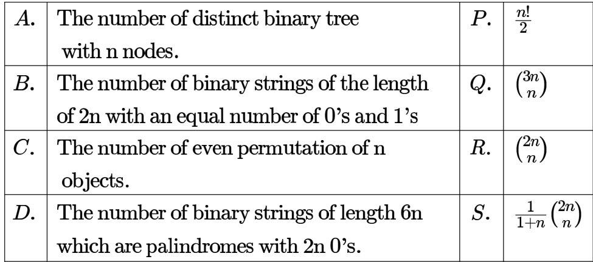

The number of substrings (of all lengths inclusive) that can be formed from a character string of length $\scriptstyle n$ is

A. n B. $n ^ { 2 }$ C. $\scriptstyle { \frac { n ( n - 1 ) } { 2 } }$ D. $\textstyle { \frac { n ( n + 1 ) } { 2 } }$

gate1994 combinatory counting normal

Let $\boldsymbol { S }$ be a set consisting of elements. The number of tuples of the form $( A , B )$ such that $A$ and $B$ are subsets of $\boldsymbol { S }$ , and $A \subseteq B$ is

gatecse-2021-set2 combinatory counting numerical-answers two-marks

Let $U = \{ 1 , 2 , . . . , n \}$ where $\scriptstyle n$ is a large positive integer greater than Let $k$ be a positive integer less than $n$ . Let $A , B$ be subsets of $U$ with $| A | = | B | = k$ and $A \cap B = \emptyset$ . We say that a permutation of $U$ separates $A$ from $B$ if one of the following is true.

. All members of $A$ appear in the permutation before any of the members of $B$ .   
. All members of $B$ appear in the permutation before any of the members of $A$ .

How many permutations of $U$ separate $A$ from $B ?$

A. $\begin{array} { l } { { { \sf B . } \left( \begin{array} { l } { { n } } \\ { { 2 k } } \end{array} \right) ( n - 2 k ) ! } } \\ { { { \sf D . } 2 \left( \begin{array} { l } { { n } } \\ { { 2 k } } \end{array} \right) ( n - 2 k ) ! ( k ! ) ^ { 2 } } } \end{array}$ $\binom { n } { 2 k } ( n - 2 k ) ! ( k ! ) ^ { 2 }$

gatecse-2023 combinatory counting two-marks

What is the generating function $G ( z )$ for the sequence of Fibonacci numbers?

gate1987 combinatory generating-functions descriptive

Let $\begin{array} { r } { G ( x ) = \frac { 1 } { ( 1 - x ) ^ { 2 } } = \displaystyle \sum _ { i = 0 } ^ { \infty } g ( i ) x ^ { i } } \end{array}$ , where $| x | < 1$ . What is $g ( i ) \ ?$

A. B. $_ { i + 1 }$ C. D.

gatecse-2005 normal generating-functions

The coefficient of $x ^ { 1 2 }$ in $( x ^ { 3 } + x ^ { 4 } + x ^ { 5 } + x ^ { 6 } + . . . ) ^ { 3 }$ is gatecse-2016-set1 combinatory generating-functions normal numerical-answers

Which one of the following is a closed form expression for the generating function of the sequence $\left\{ a _ { n } \right\}$ where $a _ { n } = 2 n + 3$ for all $n = 0 , 1 , 2 , \ldots ?$

A $\frac { 3 } { ( 1 - x ) ^ { 2 } }$ $\mathsf { B } . \frac { 3 x } { ( 1 - x ) ^ { 2 } }$ $\frac { 2 - x } { ( 1 - x ) ^ { 2 } }$ $\frac { 3 - x } { ( 1 - x ) ^ { 2 } }$

gatecse-2018 generating-functions normal combinatory one-mark

Which one of the following is the closed form for the generating function of the sequence $\{ a _ { n } \} _ { n \geq 0 }$ defined below?

$$
a _ { n } = \left\{ { \begin{array} { c c } { n + 1 , } & { { \mathrm { ~ n ~ i s ~ o d d } } } \\ { 1 , } & { { \mathrm { o t h e r w i s e } } } \end{array} } \right.
$$

A. $\begin{array} { r } { \frac { x ( 1 + x ^ { 2 } ) } { ( 1 - x ^ { 2 } ) ^ { 2 } } + \frac { 1 } { 1 - x } } \end{array}$ B. $\begin{array} { r } { \frac { x ( 3 - x ^ { 2 } ) } { ( 1 - x ^ { 2 } ) ^ { 2 } } + \frac { 1 } { 1 - x } } \end{array}$ $\begin{array} { r } { \frac { 2 x } { ( 1 - x ^ { 2 } ) ^ { 2 } } + \frac { 1 } { 1 - x } } \end{array}$ D. $\frac { x } { ( 1 - x ^ { 2 } ) ^ { 2 } } + \frac { 1 } { 1 - x }$

gatecse-2022 combinatory generating-functions two-marks

# Answer key☟

The value of the expression (mod in the range  to , is

gatecse-2016-set2 modular-arithmetic normal numerical-answers

The value of $3 ^ { 5 1 }$ mod 5 is

gatecse-2019 numerical-answers combinatory modular-arithmetic one-mark

The minimum number of cards to be dealt from an arbitrarily shuffled deck of cards to guarantee that three cards are from same suit is

A. B. C. 9 D.

gatecse-2000 easy pigeonhole-principle combinatory

The Fibonacci sequence $\{ f _ { 1 } , f _ { 2 } , f _ { 3 } \ldots f _ { n } \}$ is defined by the following recurrence:

$$
f _ { n + 2 } = f _ { n + 1 } + f _ { n } , n \geq 1 ; f _ { 2 } = 1 : f _ { 1 } = 1
$$

Prove by induction that every third element of the sequence is even.

gate1996 recurrence-relation proof descriptive

Let $a _ { n }$ be the number of $n$ -bit strings that do NOT contain two consecutive $1 ^ { \prime } s$ . Which one of the following is the recurrence relation for $a _ { n }$ ?

A. $a _ { n } = a _ { n - 1 } + 2 a _ { n - 2 }$ B. $a _ { n } = a _ { n - 1 } + a _ { n - 2 }$   
C. $a _ { n } = 2 a _ { n - 1 } + a _ { n - 2 }$ D. $a _ { n } = 2 a _ { n - 1 } + 2 a _ { n - 2 }$

gatecse-2016-set1 combinatory recurrence-relation easy

Consider the recurrence relation $a _ { 1 } = 8 , a _ { n } = 6 n ^ { 2 } + 2 n + a _ { n - 1 }$ . Let $a _ { 9 9 } = K \times 1 0 ^ { 4 }$ . The value of $K$ is

gatecse-2016-set1 combinatory recurrence-relation normal numerical-answers

Consider the following recurrence:

$$
\begin{array} { l c l } { { f ( 1 ) } } & { { = } } & { { 1 ; } } \\ { { f ( 2 n ) } } & { { = } } & { { 2 f ( n ) - 1 , ~ \mathrm { f o r } \ n \geq 1 ; } } \\ { { f ( 2 n + 1 ) } } & { { = } } & { { 2 f ( n ) + 1 , ~ \mathrm { f o r } \ n \geq 1 . } } \end{array}
$$

Then, which of the following statements is/are

A. $f ( 2 ^ { n } - 1 ) = 2 ^ { n } - 1$ $\begin{array} { l } { { \mathsf { B } . ~ f ( 2 ^ { n } ) = 1 } } \\ { { \mathsf { D } . ~ f ( 2 ^ { n } + 1 ) = 2 ^ { n } + 1 } } \end{array}$   
C. $f ( 5 \cdot 2 ^ { n } ) = 2 ^ { n + 1 } + 1$

gatecse-2022 combinatory recurrence-relation multiple-selects two-marks

# Answer key☟

The Lucas sequence $L _ { n }$ is defined by the recurrence relation:

$$
L _ { n } = L _ { n - 1 } + L _ { n - 2 } , ~ \mathrm { f o r } ~ n \geq 3 ,
$$

with $L _ { 1 } = 1$ and $L _ { 2 } = 3$ .

Which one of the options given is TRUE?

CA. $\begin{array} { r } { L _ { n } = \left( \frac { 1 + \sqrt { 5 } } { 2 } \right) ^ { n } + \left( \frac { 1 - \sqrt { 5 } } { 2 } \right) ^ { n } } \end{array}$ B. $\begin{array} { r } { L _ { n } = \left( \frac { 1 + \sqrt { 5 } } { 2 } \right) ^ { n } - \left( \frac { 1 - \sqrt { 5 } } { 3 } \right) ^ { n } } \end{array}$   
$\begin{array} { r } { L _ { n } = \left( \frac { 1 + \sqrt { 5 } } { 2 } \right) ^ { n } + \left( \frac { 1 - \sqrt { 5 } } { 3 } \right) ^ { n } } \end{array}$ D. $\begin{array} { r } { L _ { n } = \left( \frac { 1 + \sqrt { 5 } } { 2 } \right) ^ { n } - \left( \frac { 1 - \sqrt { 5 } } { 2 } \right) ^ { n } } \end{array}$

Let $H _ { 1 } , H _ { 2 } , H _ { 3 }$ ... be harmonic numbers. Then, for $n \in Z ^ { + }$ , $\textstyle \sum _ { j = 1 } ^ { n } H _ { j }$ can be expressed as

A. $n H _ { n + 1 } - ( n + 1 )$ $\begin{array} { l } { { \textsf { B . } ( n + 1 ) H _ { n } - n } } \\ { { \textsf { D . } ( n + 1 ) H _ { n + 1 } - ( n + 1 ) } } \end{array}$   
C. $n H _ { n } - n$

gateit-2004 recurrence-relation combinatory normal

# Answer key☟

Consider the sequence $\langle x _ { n } \rangle$ $n \geq 0$ defined by the recurrence relation ${ { x } _ { n + 1 } } = c . { { x } _ { n } ^ { 2 } } - 2$ , where $c > 0$ Suppose there exists a non-empty, open interval $( a , b )$ such that for all $x _ { 0 }$ satisfying $a < x _ { 0 } < b$ , the sequence converges to a limit. The sequence converges to the value?

A. $\textstyle { \frac { 1 + { \sqrt { 1 + 8 c } } } { 2 c } }$ B $\cdot \ { \frac { 1 - { \sqrt { 1 + 8 c } } } { 2 c } }$ C. 2 D. $\scriptstyle { \frac { 2 } { 2 c - 1 } }$

gateit-2007 combinatory normal recurrence-relation

How many substrings (of all lengths inclusive) can be formed from a character string of length $n ?$ Assume all characters to be distinct, prove your answer.

gate1989 descriptive combinatory normal proof counting summation Answer key☟

Use the patterns given to prove that

$\mathsf { A . ~ } \sum _ { i = 0 } ^ { n - 1 } ( 2 i + 1 ) = n ^ { 2 }$ (You are not permitted to employ induction) et

B. Use the result obtained in (A) to prove that $\sum _ { i = 1 } ^ { n } i = { \frac { n ( n + 1 ) } { 2 } } \qquad $

gate1994 combinatory proof summation descriptive

# Answer key☟

# 1.8.3 Summation: GATE CSE 2008 Question: 24

Let $P = \sum _ { i \mathrm { o d d } } ^ { 1 \le i \le 2 k } i$ and $Q = \sum _ { i \mathrm { e v e n } } ^ { 1 \leq i \leq 2 k } i$ , where $k$ is a positive integer. Then

A. $P = Q - k$ ${ \sf B } . { \cal P } { = } { \cal Q } + k { \qquad } { \sf C } . { \cal P } { = } { \cal Q }$ D $\scriptstyle . { \cal P } = { \cal Q } + 2 k$

$$
\sum _ { x = 1 } ^ { 9 9 } { \frac { 1 } { x ( x + 1 ) } } = - \qquad .
$$

gatecse-2015-set1 combinatory normal numerical-answers summation

# Answer key ☟

# Answer Keys

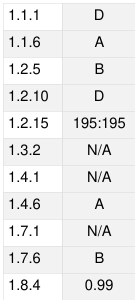

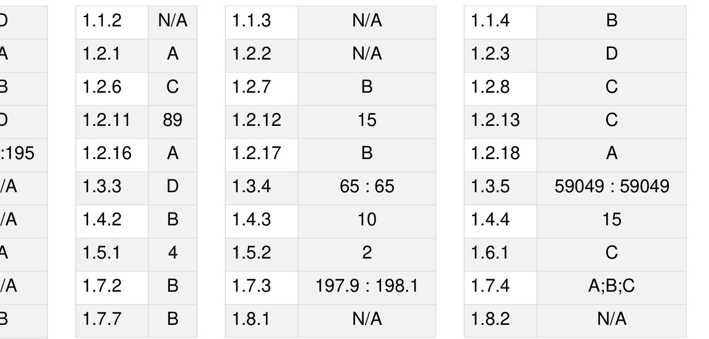

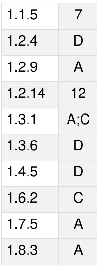

Syllabus: Connectivity, Matching, Coloring.

Mark Distribution in Previous GATE   
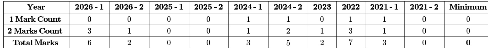

Welcome to the Graph Theory chapter, a cornerstone of Discrete Mathematics and a frequently tested area in the GATE Computer Science examination. Graph Theory provides a powerful framework for modeling relationships and processes across various domains, from social networks and transportation systems to computer networks and algorithm design. For GATE CS, this subject typically carries a weightage of 5-8 marks, often integrated with Data Structures and Algorithms. Questions range from direct application of definitions and formulas, analysis of graph properties, tracing graph algorithms, to problem-solving scenarios involving connectivity, coloring, and planarity. A strong grasp of graph theory fundamentals is crucial not only for scoring well but also for understanding advanced topics in computer science.

# Topic-wise Key Concepts

# Counting

Counting in graph theory involves determining the number of possible graphs, paths, cycles, or specific structures within graphs. It often relies on fundamental combinatorial principles.

Definition and Core Idea: This topic focuses on enumerating different types of graphs or substructures within them, using principles of permutations, combinations, and other combinatorial techniques. It's about understanding how many ways a graph can be formed or how many specific patterns exist.

Important Formulas, Theorems, and Results:

1. Number of simple labeled graphs with $n$ vertices:

$$
2 ^ { \binom { n } { 2 } } = 2 ^ { n ( n - 1 ) / 2 }
$$

This is because for each pair of $n$ vertices, there can either be an edge or not.

2. Number of simple directed labeled graphs with $n$ vertices:

$$
2 ^ { n ( n - 1 ) }
$$

For each ordered pair of distinct vertices $( u , v )$ , there can be an edge from $u$ to $v$ , or not.

3. Number of spanning trees in a complete graph $K _ { n }$ (Cayley's Formula):

$$
n ^ { n - 2 }
$$

This formula is critical for counting trees on a given set of labeled vertices.

4. Number of spanning trees in a general graph (Matrix Tree Theorem): This theorem uses the Laplacian matrix of a graph, but its direct application is usually beyond GATE scope; Cayley's formula is more common.

5. Number of paths of length $k$ between two vertices in an adjacency matrix: The $( i , j )$ -th entry of $A ^ { k }$ (where $A$ is the adjacency matrix) gives the number of paths of length $k$ from vertex $i$ to vertex $j$ .

# Key Properties and Identities:

Understanding the difference between labeled and unlabeled graphs is crucial. GATE questions usually imply labeled graphs unless specified.   
。 Basic combinatorial identities like $\begin{array} { r } { \binom { n } { k } = \frac { n ! } { k ! ( n - k ) ! } } \end{array}$ and $\begin{array} { r } { P ( n , k ) = \frac { n ! } { ( n - k ) ! } } \end{array}$ are fundamental. The Inclusion-Exclusion Principle can be used for more complex counting problems, especially when dealing with properties that overlap.

Common Pitfalls or Tricky Points:

Overcounting or Undercounting: Ensure each distinct configuration is counted exactly once. Distinguishing Labeled vs. Unlabeled: Most GATE questions assume labeled vertices unless stated otherwise, which simplifies counting. Unlabeled graph counting is significantly harder. Specific Graph Types: Be careful when counting paths/cycles in specific graph types like trees, complete graphs, or bipartite graphs.

Standard Problem-Solving Techniques or Shortcuts:

Direct Application of Formulas: For simple graphs, complete graphs, and spanning trees, direct formula application is common.   
Combinatorial Arguments: Break down the problem into smaller, manageable choices and multiply/add the possibilities.   
Recurrence Relations: For counting paths or specific structures, sometimes a recurrence relation can be formulated and solved.

# Degree of Graph

The degree of a vertex is a fundamental property that quantifies its connectivity within a graph. It's essential for understanding graph structure and validating basic graph properties.

Definition and Core Idea: The degree of a vertex $v$ , denoted $\deg ( v )$ or $d ( v )$ , is the number of edges incident to it.   
For directed graphs, we distinguish between in-degree (edges pointing to $v$ ) and out-degree (edges pointing from $v$ ).   
Important Formulas, Theorems, and Results:   
1. Handshaking Lemma (for undirected graphs): The sum of the degrees of all vertices in any undirected graph is equal to twice the number of edges.

$$
\sum _ { v \in V } \deg ( v ) = 2 | E |
$$

This is a cornerstone theorem in graph theory.

2. For directed graphs: The sum of in-degrees equals the sum of out-degrees, and both are equal to the total number of edges.

$$
\sum _ { v \in V } \operatorname { i n - d e g } ( v ) = \sum _ { v \in V } \operatorname { o u t - d e g } ( v ) = | E |
$$

3. Number of odd-degree vertices: In any undirected graph, the number of vertices with odd degree must be even. This is a direct consequence of the Handshaking Lemma.

4. Maximum degree $\Delta ( G )$ and Minimum degree $\delta ( G )$ : These denote the maximum and minimum degrees among all vertices in grap h , respectively.

# Key Properties and Identities:

。 The Handshaking Lemma is a powerful tool for checking the validity of a degree sequence or finding the numbe of edges. A graph cannot exist if its degree sequence violates the Handshaking Lemma or has an odd number of odd  
degree vertices.   
。 For a simple graph with $n$ vertices, the maximum degree of any vertex is $n - 1$ .

# Common Pitfalls or Tricky Points:

Self-loops: In some contexts, a self-loop at a vertex contributes 2 to its degree. GATE questions usually specify if self-loops are allowed or assume simple graphs (no self-loops, no multiple edges). Multiple Edges: multiple edges are allowed between two vertices, each edge contributes to the degree. Directed vs. Undirected: Always be clear whether the graph is directed or undirected when calculating degrees.

Standard Problem-Solving Techniques or Shortcuts:

Direct Application of Handshaking Lemma: Often used to find the number of edges given a degree sequence, or to determine if a given degree sequence is possible. 。 Parity Check: Quickly identify impossible degree sequences by checking the number of odd-degree vertices.

# Graph Algorithms

Graph algorithms are systematic procedures for solving problems on graphs, such as finding paths, spanning trees, or optimal routes. They are central to computer science applications.

Definition and Core Idea: These are algorithms designed to traverse, search, analyze, and optimize properties of graphs. They form the backbone of many real-world applications, from network routing to social network analysis.

Important Algorithms, Formulas, and Complexities:

1. Breadth-First Search (BFS): Explores a graph layer by layer. Purpose: Find shortest path in unweighted graphs, find connected components. Time Complexity: $O ( V + E )$ for adjacency list, $O ( V ^ { 2 } )$ for adjacency matrix.   
2. Depth-First Search (DFS): Explores as far as possible along each branch before backtracking. Purpose: Find connected components, topological sort, detect cycles, find bridges/articulation points.

Time Complexity: $O ( V + E )$ for adjacency list, $O ( V ^ { 2 } )$ for adjacency matrix.

3. Dijkstra's Algorithm: Finds the shortest paths from a single source vertex to all other vertices in a graph with non-negative edge weights. Purpose: Single-source shortest path. Time Complexity: $O ( E \log V )$ with a Fibonacci heap, $O ( E + V \log V )$ with a binary heap, $O ( V ^ { 2 } )$ with adjacency matrix.

4. Prim's Algorithm: Finds a Minimum Spanning Tree (MST) in a weighted, undirected graph. Purpose: MST. Time Complexity: $O ( E \log V )$ with a binary heap, $O ( V ^ { 2 } )$ with adjacency matrix.

5. Kruskal's Algorithm: Finds a Minimum Spanning Tree (MST) in a weighted, undirected graph. Purpose: MST. Time Complexity: $O ( E \log E )$ or $O ( E \log V )$ using a Disjoint Set Union (DSU) data structu

6. Bellman-Ford Algorithm: Finds the shortest paths from a single source vertex to all other vertices, even with negative edge weights. Detects negative cycles. 1 Purpose: Single-source shortest path with negative weights. Time Complexity: $O ( V E )$ .

7. Floyd-Warshall Algorithm: Finds all-pairs shortest paths in a weighted graph, can handle negative weights but not negative cycles. Purpose: All-pairs shortest path. Time Complexity: $O ( V ^ { 3 } )$ .

8. Topological Sort: Linear ordering of vertices such that for every directed edge $( u , v )$ , $u$ comes before $v$ . Applicable only to Directed Acyclic Graphs (DAGs). Purpose: Ordering tasks with dependencies. Time Complexity: $O ( V + E )$ (using DFS or Kahn's algorithm).

Ford-Fulkerson Algorithm (and Edmonds-Karp): Finds the maximum flow in a flow network. Purpose: Maximum flow. Time Complexity: Ford-Fulkerson is not polynomial in general; Edmonds-Karp is $O ( V E ^ { 2 } )$ .

Key Properties and Identities:

Greedy Algorithms: Prim's, Kruskal's, Dijkstra's are greedy algorithms that make locally optimal choices.   
Dynamic Programming: Floyd-Warshall and Bellman-Ford use dynamic programming principles.   
Connectivity: BFS/DFS can determine if a graph is connected or find its connected components.   
Cycles: DFS can detect cycles in both directed and undirected graphs.

Common Pitfalls or Tricky Points:

Negative Edge Weights: Dijkstra's fails with negative edge weights; use Bellman-Ford or Floyd-Warshall. Disconnected Graphs: Algorithms like Dijkstra's might not reach all vertices if the graph is disconnected from the source.   
Choosing the Right Algorithm: Understand the constraints (weighted/unweighted, directed/undirected, negative weights, single-source/all-pairs) to select the appropriate algorithm.   
Adjacency List vs. Matrix: Be aware of how the graph representation affects time complexity.

Standard Problem-Solving Techniques or Shortcuts:

Tracing: Practice tracing algorithms step-by-step on small graphs to understand their mechanics. Recognizing Patterns: Identify if a problem can be mapped to a standard graph algorithm (e.g., "minimum cost to connect al cities" suggests MST). Complexity Analysis: Be able to derive or recall the time and space complexity for common algorithms.

# Graph Coloring

Graph coloring assigns labels (colors) to graph elements subject to certain constraints, often used to model scheduling or resource allocation problems.

Definition and Core Idea: Vertex coloring assigns a color to each vertex such that no two adjacent vertices have the same color. The minimum number of colors required for a graph $G$ is called its chromatic number, denoted $\chi ( G )$ .

Important Formulas, Theorems, and Results:

1. Chromatic Number $\chi ( G )$ : The smallest integer $k$ such that $G$ is $k$ -colorable.   
2. Lower Bound: For any graph $G$ , $\chi ( G ) \geq \omega ( G )$ , where $\omega ( G )$ is the clique number (size of the largest clique).   
3. Upper Bound (Brooks' Theorem): For a connected graph $\dot { G }$ that is neither a complete graph nor an odd cycle, $\chi ( G ) \leq \Delta ( G )$ , where $\Delta ( G )$ is the maximum degree. In general, $\chi ( G ) \leq \Delta ( G ) + 1$ .   
4. Bipartite Graphs: A graph is bipartite if and only if it contains no odd-length cycles. If a graph is bipartite and has at least one edge, then $\chi ( G ) = 2$ .

5. Planar Graphs (Four Color Theorem): Every planar graph is 4-colorable. Thus, for any planar graph $G$ , $\chi ( G ) \leq 4 .$ .

6. Chromatic Polynomial $P ( G , k )$ : A polynomial whose value at integer $k$ is the number of ways to color $G$ using at most $k$ colors. For a graph with $n$ vertices, $P ( G , k )$ is a polynomial in $k$ of degree $n$ .

Key Properties and Identities:

A graph is 2-colorable if and only if it is bipartite.   
。 If a graph contains a clique of size $k$ , then at least $k$ colors are needed.   
□ The chromatic number of a complete graph is $n$ .   
The chromatic number of a cycle graph $C _ { n }$ is 2 if $\scriptstyle n$ is even, and 3 if $n$ is odd.

Common Pitfalls or Tricky Points:

Minimum vs. Any Coloring: The goal is to find the minimum number of colors, not just any valid coloring. Identifying Cliques: Finding the largest clique $( \omega ( G ) )$ can be hard, but it provides a lower bound for $\chi ( G )$ . Edge Coloring $( \chi ^ { \prime } ( G ) )$ : Similar concept but for edges (adjacent edges have different colors). Vizing's Theorem states $\Delta ( G ) \leq \chi ^ { \prime } ( G ) \leq \Delta ( G ) + 1$ . GATE usually focuses on vertex coloring.

Standard Problem-Solving Techniques or Shortcuts:

Greedy Coloring: Assign colors iteratively to vertices in some order (e.g., decreasing degree). While not always optimal, it's a common heuristic. Identify Cliques and Odd Cycles: These structures directly give lower bounds for the chromatic number. Trial and Error/Backtracking: For small graphs, try to color with 2, then 3, etc., until a valid coloring is found.

# Graph Connectivity

Graph connectivity measures how robust a graph is to the removal of vertices or edges. It's crucial for network reliability and fault tolerance.

Definition and Core Idea: Connectivity refers to the property of a graph being "connected," meaning there's a path between any two vertices. More generally, it quantifies how many vertices or edges must be removed to disconnect the graph.

Important Formulas, Theorems, and Results:

1. Connected Graph: A graph is connected if there is a path between every pair of distinct vertices.   
2. Connected Components: Maximal connected subgraphs.   
3. Cut Vertex (Articulation Point): A vertex whose removal increases the number of connected components.   
4. Cut Edge (Bridge): An edge whose removal increases the number of connected components.   
5. Vertex Connectivity $\kappa ( G )$ : The minimum number of vertices whose removal disconnects $G$ or reduces it to a trivial graph. A graph is $k$ -connected if $\kappa ( G ) \geq k$ .   
6. Edge Connectivity $\lambda ( G )$ : The minimum number of edges whose removal disconnects $G$ . A graph is $k$ -edgeconnected if $\lambda ( G ) \geq k$ .   
7. Relationship: For any graph $G$ , $\kappa ( G ) \leq \lambda ( G ) \leq \delta ( G )$ , where $\delta ( G )$ is the minimum degree of $G$ .

8. Menger's Theorem: For any two non-adjacent vertices $u$ and $v$ in a graph $G$ , the maximum number of vertexdisjoint paths between $u$ and $v$ is equal to the minimum number of vertices whose removal separates $u$ and $v$ . (Similar theorem for edge-disjoint paths and edge cuts).

Key Properties and Identities:

A tree with more than one vertex has $\kappa ( G ) = 1$ and $\lambda ( G ) = 1$ .   
A complete graph $K _ { n }$ has $\kappa ( K _ { n } ) = n \dot { - } \dot { 1 }$ and $\lambda ( K _ { n } ) { \dot { = } } n - 1$ .   
If a graph has a bridge, its edge connectivity is 1. If it has an articulation point, its vertex connectivity is (unless it's $K _ { 2 }$ ).

Common Pitfalls or Tricky Points:

。 Trivial Graph: For a complete graph $K _ { n }$ , removing $n - 1$ vertices disconnects it into a trivial graph (single vertex), so $\kappa ( K _ { n } ) = n - 1$ .   
Distinguishing Vertex vs. Edge Connectivity: Carefully read whether the question asks for vertex or edge removal.   
Disconnected Graphs: For a disconnected graph, $\kappa ( G ) = 0$ and $\lambda ( G ) = 0$ .

Standard Problem-Solving Techniques or Shortcuts:

。 BFS/DFS: Can be used to find connected components, bridges, and articulation points.   
。 Trial and Error: For small graphs, try removing vertices/edges to find the minimum set that disconnects the graph.   
Apply $\kappa ( G ) \leq \lambda ( G ) \leq \delta ( G )$ : This inequality provides quick bounds.

# Graph Isomorphism

Graph isomorphism determines if two graphs are structurally identical, regardless of their vertex labeling or drawing style. It's a fundamental concept for comparing graphs.

Definition and Core Idea: Two graphs $G _ { 1 } = ( V _ { 1 } , E _ { 1 } )$ and $G _ { 2 } = ( V _ { 2 } , E _ { 2 } )$ are isomorphic if there exists a bijective function $f : V _ { 1 } \to V _ { 2 }$ such that for any pair of vertices $u , v \in V _ { 1 }$ , $\{ u , v \} \in E _ { 1 }$ if and only if $\{ f ( u ) , f ( v ) \} \in E _ { 2 }$ . Essentially, they have the same structure.

Important Properties (Invariants):   
1. Number of Vertices: $| V _ { 1 } | = | V _ { 2 } |$ .   
2. Number of Edges: $\left. E _ { 1 } \right. = \left. E _ { 2 } \right.$ .   
3. Degree Sequence: Both graphs must have the same degree sequence (multiset of degrees).   
4. Number of Connected Components: Must be the same.   
5. Cycle Lengths: The number of cycles of each specific length must be the same.   
6. Connectivity: Same vertex and edge connectivity.   
7. Chromatic Number: Must be the same.   
8. Presence of Subgraphs: If $G _ { 1 }$ contains a subgraph $H$ , then $G _ { 2 }$ must also contain $H$ .

Key Properties and Identities:

。 If any of the invariants differ, the graphs are definitely NOT isomorphic.   
。 If all invariants are the same, the graphs MIGHT be isomorphic, but it's not a guarantee (e.g., regular graphs can have the same degree sequence but be non-isomorphic).   
The Graph Isomorphism Problem (determining if two graphs are isomorphic) is in NP, but its exact complexity class is unknown (neither $\mathsf { P }$ nor NP-complete is proven). For GATE, problems are usually small enough to solve by inspection or invariant checking.

Common Pitfalls or Tricky Points:

Proving Non-Isomorphism: This is generally easier; just find one invariant that differs. Proving Isomorphism: This requires finding an explicit bijective mapping $f$ , which can be challenging. Often, it involves matching vertices with identical properties (e.g., same degree, same neighborhood structure). Visual Deception: Graphs drawn differently can be isomorphic, and graphs drawn similarly can be nonisomorphic.

Standard Problem-Solving Techniques or Shortcuts:

。 Check Invariants Systematically: Start with simple invariants like number of vertices, edges, and degree sequence. If any differ, stop.   
Match Vertices by Properties: Look for unique vertices (e.g., a vertex with degree 1, or a vertex part of a unique cycle structure) and try to map them.   
Adjacency Matrix Comparison: If two graphs are isomorphic, their adjacency matrices can be made identical by permuting rows and columns. This is computationally intensive for humans but conceptually useful.

# Graph Matching

Graph matching is about finding a set of edges that do not share any common vertices, often used in assignment problems or resource allocation.

Definition and Core Idea: A matching $M$ in a graph $G$ is a set of edges such that no two edges in $M$ share a common vertex. A vertex is matched (or covered) if it is an endpoint of an edge in $M$ ; otherwise, it is unmatched.

Important Formulas, Theorems, and Results:

1. Maximum Matching: A matching with the largest possible number of edges.   
2. Perfect Matching: A matching that covers all vertices of the graph. A perfect matching can only exist if $| V |$ is even.   
3. Augmenting Path: A path that starts and ends at unmatched vertices, and whose edges alternate between being in the current matching and not in the current matching. An augmenting path can be used to increase the size of a matching.   
4. Hall's Marriage Theorem (for Bipartite Graphs): A bipartite graph $G = ( U \cup V , E )$ has a matching that covers all vertices in $U$ if and only if for every subset $A \subseteq U$ , $| N ( A ) | \geq | \dot { A } |$ , where $N ( A )$ is the set of neighbors of vertices in $A .$ .   
5. Tutte's Theorem (for General Graphs): A graph $G$ has a perfect matching if and only if for every subset $S \subseteq V$ , the number of odd components in $G - S$ is less than or equal to $| S |$ . (This is more complex and less common in GATE than Hall's).

# Key Properties and Identities:

The size of a maximum matching in a bipartite graph can be found using network flow algorithms (e.g., by converting to a max-flow problem).   
。 Every perfect matching is a maximum matching, but not vice-versa.   
， A graph can have multiple maximum matchings.

Common Pitfalls or Tricky Points:

Confusing Matching with Vertex Cover or Edge Cover: These are related but distinct concepts. A vertex cover is a set of vertices that touch all edges. An edge cover is a set of edges that touch all vertices (only exists if no isolated vertices). General vs. Bipartite Graphs: Finding maximum matchings in general graphs is more complex (e.g., Edmonds' blossom algorithm) than in bipartite graphs. GATE usually focuses on bipartite matching or simpler cases. Existence of Perfect Matching: A perfect matching requires an even number of vertices.

Standard Problem-Solving Techniques or Shortcuts:

Greedy Approach: While not always optimal for maximum matching, a greedy approach (e.g., pick an edge, remove its endpoints, repeat) can give a good starting point.   
Augmenting Paths: For bipartite graphs, the concept of augmenting paths is key. Start with an empty matching, find an augmenting path, update the matching, and repeat until no more augmenting paths exist. This S the basis of the Hopcroft-Karp algorithm.   
Applying Hall's Theorem: For bipartite graphs, use Hall's condition to check for the existence of a matching covering one side.

# Graph Planarity

Graph planarity deals with whether a graph can be drawn on a plane without any edges crossing. It has applications in circuit design and network visualization.

Definition and Core Idea: A graph is planar if it can be drawn in the plane without any edges crossing each other (except at vertices). Such a drawing is called a planar embedding.

Important Formulas, Theorems, and Results:

1. Euler's Formula for Planar Graphs: For any connected planar graph with $V$ vertices, $E$ edges, and $F$ faces (regions),

$$
V - E + F = 2
$$

This formula is fundamental for planar graphs.

2. Corollaries of Euler's Formula (for simple connected planar graphs with $V \geq 3 )$ :

If $G$ has no cycles o length 3 (i.e., no $K _ { 3 }$ subgraph), then $E \le 2 V - 4$ .   
In general, $\dot { E } \le 3 V - 6$ .   
There is at least one vertex with degree at most 5 $( \delta ( G ) \leq 5 )$ .

3. Kuratowski's Theorem: A graph is planar if and only if it does not contain a subgraph that is a subdivision of $K _ { 5 }$ (complete graph on 5 vertices) or (complete bipartite graph with 3 vertices in each partition). A subdivision of a graph is obtained by replacing edges with paths.

Key Properties and Identities: 。 $K _ { 5 }$ and K3,3 are non-planar. 。 Any graph that contains $K _ { 5 }$ or $K _ { 3 , 3 }$ as a minor (or subdivision) is non-planar. 。 The dual of a planar graph is also planar.

Common Pitfalls or Tricky Points:

Misapplying Euler's Formula: Remember it's for connected planar graphs. For disconnected graphs, $V - E + F = 1 + k ,$ where $k$ is the number of connected components.   
Identifying Subdivisions: Recognizing $K _ { 5 }$ or $K _ { 3 , 3 }$ subdivisions can be tricky. Look for 5 vertices all connected to each other (possibly via paths) or 6 vertices arranged in a bipartite manner.   
Different Drawings: A graph might look non-planar in one drawing but be planar in another. The definition requires existence of a planar drawing.

Standard Problem-Solving Techniques or Shortcuts:

Check Euler's Formula Corollaries: If $E > 3 V - 6$ (or $E > 2 V - 4$ if no triangles), the graph is definitely non-planar. This is a quick check for non-planarity.   
Look for $K _ { 5 }$ or Subdivisions: Try to simplify the graph by removing degree-2 vertices (which don't affect planarity for Kuratowski's theorem) or identifying dense subgraphs.   
Redrawing: For small graphs, try to redraw them to eliminate crossings.

# Jaccard Coefficient

The Jaccard Coefficient is a statistical measure used to gauge the similarity between two sets, finding applications in data mining, machine learning, and graph analysis (e.g., comparing neighbor sets).

Definition and Core Idea: The Jaccard Coefficient (or Jaccard Index) measures the similarity between two finite

sets, $A$ and $B$ , as the size of their intersection divided by the size of their union. It quantifies the overlap between the sets.

Important Formulas, Theorems, and Results: 1. Jaccard Coefficient $J ( A , B )$ :

$$
J ( A , B ) = { \frac { | A \cap B | } { | A \cup B | } }
$$

2. Jaccard Distance $D _ { J } ( A , B )$ : Measures dissimilarity.

$$
D _ { J } ( A , B ) = 1 - J ( A , B ) = { \frac { | A \cup B | - | A \cap B | } { | A \cup B | } }
$$

Key Properties and Identities:

The Jaccard Coefficient ranges from 0 to 1. $J ( A , B ) = 1$ if $A = B$ (perfect similarity). $J ( A , B ) = 0$ if $A \cap B = \emptyset$ (no similarity).   
It is symmetric: $J ( A , B ) = J ( B , A )$ .   
。 It is sensitive to the size of the union; a large union with a small intersection leads to a low coefficient.

Common Pitfalls or Tricky Points:

Miscalculating Intersection or Union: Ensure correct set operations, especially when dealing with lists that might contain duplicates (convert to sets first).   
Empty Sets: If both sets are empty, the Jaccard coefficient is usually defined as (perfect similarity). If one is empty and the other is not, it's 0.   
。 Application Context: In graph theory, it's often used to compare the neighborhood sets of two vertices to determine their "structural similarity" or to compare sets of features associated with graph nodes.

Standard Problem-Solving Techniques or Shortcuts:

。 Direct Calculation: Identify the elements in the intersection and union, then apply the formula. Venn Diagrams: For small sets, a Venn diagram can help visualize the intersection and union.

# Quick Formula Reference

Counting Simple Labeled Graphs (  vertices): $2 ^ { \binom { n } { 2 } }$   
Counting Simple Directed Labeled Graphs (  vertices) :   
Cayley's Formula (Spanning Trees in $K _ { n }$ ): nn-2   
Handshaking Lemma (Undirected): $\begin{array} { r } { \sum _ { v \in V } \deg ( v ) = 2 | E | } \end{array}$   
Handshaking Lemma (Directed): $\begin{array} { r } { \sum _ { v \in V } \mathbf { \bar { i } } \mathbf { \bar { n } } \mathbf { - d e g } ( v ) = \sum _ { v \in V } \mathbf { o u t - d e g } ( v ) = | E | } \end{array}$ Mev   
BFS/DFS Time Complexity: $O ( V + { \bar { E } } )$ (adj list), $O ( V ^ { 2 } )$ (adj matrix)   
Dijkstra's Time Complexity: $O ( E \log V )$ (binary heap), $O ( V ^ { 2 } )$ (adj matrix)   
Prim's/Kruskal's Time Complexity (MST): $O ( E \log V )$ or $\scriptstyle { \dot { O } } ( E \log E )$   
Bellman-Ford Time Complexity: $O ( V E )$   
Floyd-Warshall Time Complexity: $O ( V ^ { 3 } )$   
Topological Sort Time Complexity: ${ \dot { O } } ( { \dot { V } } + E )$   
Chromatic Number Lower Bound: $\chi ( { \dot { G } } ) \geq \omega ( G )$ (clique number)   
Chromatic Number Upper Bound (Brooks' Theorem): $\chi ( G ) \leq \Delta ( G )$ (for non-complete, non-odd cycle   
connected graphs), else $\chi ( G ) \leq \Delta ( G ) + 1$   
Bipartite Graph Chromatic Number: ${ \dot { \chi } } ( G ) = 2$ (if connected and has edges)   
Planar Graph Chromatic Number (Four Color Theorem): $\chi ( G ) \leq 4$   
Connectivity Relationship: $\kappa ( G ) \leq \lambda ( G ) \leq \delta ( G )$   
Euler's Formula (Connected Planar Graph): $V - \stackrel { \cdot } { E } + F = 2$   
Planarity Condition (Simple Connected Planar, $V \geq 3 )$ ): $E \le 3 V - 6$   
Planarity Condition (Simple Connected Planar, no $K _ { 3 }$ , $V \geq 3 )$ : $E \le 2 V - 4$   
Kuratowski's Theorem: Planar iff no $K _ { 5 }$ or K3,3 subdivision   
Jaccard Coefficient: $\begin{array} { r } { J ( A , B ) = \frac { | A \cap B | } { | A \cup B | } } \end{array}$   
Jaccard Distance: $D _ { J } ( A , B ) = \boldsymbol { \mathrm { 1 } } - \boldsymbol { \mathrm { J } } ( A , B )$

# Important Tips for GATE

1. Master Definitions and Basic Properties: Many GATE questions test fundamental definitions (e.g., what is a bridge, what is a perfect matching) and direct consequences of theorems. Ensure you know what each term means precisely.   
2. Practice Drawing and Visualizing Graphs: For problems involving planarity, isomorphism, or connectivity, sketching the graph and trying different layouts can be immensely helpful. Don't rely solely on abstract representations.   
3. Understand Algorithm Mechanics and Complexity: Don't just memorize complexities; understand how BFS, DFS, Dijkstra's, Prim's, and Kruskal's work step-by-step. Be prepared to trace them on small examples and identify their time/space complexities for both adjacency list and matrix representations.   
4. Pay Attention to Graph Types and Constraints: Is the graph directed or undirected? Weighted or unweighted? Simple or multi-graph? Does it allow self-loops? These details significantly impact which formulas or algorithms apply. For example, Dijkstra's fails with negative edge weights.   
5. Use Invariants for Isomorphism: When checking for isomorphism, systematically compare invariants like number of vertices, edges, degree sequence, and cycle lengths. If any invariant differs, the graphs are not isomorphic. This is a powerful shortcut.   
6. Be Wary of Common Pitfalls: Remember that Euler's formula applies to connected planar graphs. Dijkstra's doesn't work with negative weights. A greedy coloring isn't always optimal. Keep these exceptions in mind.   
7. Time Management for Tracing Problems: For algorithm tracing questions, work carefully and systematically. Use scratch paper to keep track of visited nodes, distances, or parent pointers. Avoid rushing, as a single error can invalidate the entire trace.   
8. Review Special Graph Types: Be familiar with properties of common graphs like complete graphs $( K _ { n } )$ , complete bipartite graphs ( ), cycle graphs $( C _ { n } )$ , path graphs $( P _ { n } )$ , and trees. Their specific properties often appear in questions.

# 2.1 Counting (3)

# 2.1.1 Counting: GATE CSE 2001 Question: 2.15

How many undirected graphs (not necessarily connected) can be constructed out of a given se $V = \{ v _ { 1 } , v _ { 2 } , . . . v _ { n } \}$ of $n$ vertices?

A. $\scriptstyle { \frac { n ( n - 1 ) } { 2 } }$ B. $2 ^ { n }$ C. n! D. $2 ^ { \frac { n ( n - 1 ) } { 2 } }$

gatecse-2001 graph-theory normal counting

# Answer key☟

How many graphs on $n$ labeled vertices exist which have at least $\frac { ( n ^ { 2 } - 3 n ) } { 2 }$ edges ?

A. $\begin{array} { c } { { \displaystyle \left( \frac { n ^ { 2 } - 3 n } { 2 } \right) } } \\ { { \mathsf { B } . \quad \displaystyle \sum _ { k = 0 } ^ { \sum } . . ( n ^ { 2 } - n ) } C _ { k } } \\ { { \mathsf { D } . \quad \displaystyle \sum _ { k = 0 } ^ { n } . \left( \frac { n ^ { 2 } - n } { 2 } \right) } } \end{array}$   
C. $\left( { \frac { n ^ { 2 } - n } { 2 } } \right) _ { C _ { n } }$

gatecse-2004 graph-theory combinatory normal counting

# Answer key☟

# 2.1.3 Counting: GATE CSE 2012 Question: 38

Let $G$ be a complete undirected graph on  vertices. If vertices of $G$ are labeled, then the number of distinct cycles of length  in $G$ is equal to

A. B. C. D. 360

gatecse-2012 graph-theory normal marks-to-all counting

Show that the number of odd-degree vertices in a finite graph is even.

gate1987 graph-theory degree-of-graph descriptive proof

Show that all vertices in an undirected finite graph cannot have distinct degrees, if the graph has at least two vertices.

gate1991 graph-theory degree-of-graph descriptive proof

Prove that in finite graph, the number of vertices of odd degree is always even.

gate1995 graph-theory degree-of-graph proof descriptive

A graph $G = ( V , E )$ satisfies $\left| E \right| \leq 3 \left| V \right| - 6$ . The min-degree of $G$ is defined as $\mathbf { m i n } _ { v \in V }$ {degree (u)} Therefore, min-degree of $G$ cannot be

A. B. C. D. 6

gatecse-2003 graph-theory normal degree-of-graph

The $2 ^ { n }$ vertices of a graph $G$ corresponds to all subsets of a set of size $n$ , for $n \geq 6$ . Two vertices of $G$ are adjacent if and only if the corresponding sets intersect in exactly two elements.   
The number of vertices of degree zero in $G$ is:

A. B. n C. n+1 D.

gatecse-2006 graph-theory normal degree-of-graph

The $2 ^ { n }$ vertices of a graph $G$ corresponds to all subsets of a set of size $\scriptstyle n$ , for $n \geq 6$ . Two vertices of $G$ are adjacent if and only if the corresponding sets intersect in exactly two elements.

The maximum degree of a vertex in $G$ is:

A. $\left( { \frac { n } { 2 } } \right) . 2 ^ { \frac { n } { 2 } }$ B. $\mathsf { C } . \ 2 ^ { n - 3 } \times 3$ D. $2 ^ { n - 1 }$

gatecse-2006 graph-theory normal degree-of-graph

Let $G = ( V , E )$ be a graph. Define $\xi ( G ) = \sum _ { d } i _ { d } \ast d .$ , where $i _ { d }$ is the number of vertices of degree $d$ in $G$ . If $\boldsymbol { S }$ and $T$ are two different trees with $\xi ( S ) = \xi ( T )$ , then

$| S | = 2 | T |$ $\begin{array} { r } { \mathsf { B . } \left| S \right| = \left| T \right| - 1 } \\ { \mathsf { D . } \left| S \right| = \left| T \right| + 1 } \end{array}$ $\vert S \vert = \vert T \vert$

gatecse-2010 graph-theory normal degree-of-graph

# Answer key☟

The degree sequence of a simple graph is the sequence of the degrees of the nodes in the graph in decreasing order. Which of the following sequences can not be the degree sequence of any graph?

I. 7,6,5,4,4,3,2, 1 II. III. IV.

A. I and II B. III and IV C. IV only D. II and IV

gatecse-2010 graph-theory degree-of-graph

Answer key☟

Which of the following statements is/are TRUE for undirected graphs?

P: Number of odd degree vertices is even.   
Q: Sum of degrees of all vertices is even.

A. P only B. Q only C. Both P and Q D. Neither P nor Q

gatecse-2013 graph-theory easy degree-of-graph

# Answer key☟

# 2.2.11 Degree of Graph: GATE CSE 2014 Set 1 Question: 52

An ordered $n$ tuple $( d _ { 1 } , d _ { 2 } , \ldots , d _ { n } )$ with $d _ { 1 } \geq d _ { 2 } \geq . . . \geq d _ { n }$ is called graphic if there exists a simple undirected graph with $\scriptstyle n$ vertices having degrees $d _ { 1 } , d _ { 2 } , \ldots , d _ { n }$ respectively. Which one of the following - tuples is NOT graphic?

A. (1,1,1,1,1,1) $\begin{array} { c } { { \mathsf { B . ~ } ( 2 , 2 , 2 , 2 , 2 , 2 , 2 ) } } \\ { { \mathsf { D . ~ } ( 3 , 2 , 1 , 1 , 1 , 0 ) } } \end{array}$ C. (3,3,3,1,0,0)

gatecse-2014-set1 graph-theory normal degree-of-graph

For a vertex $v \in V$ , which of the following constraints will always ensure that $v \in S$ ?

A. The degree of $v$ is at least $k + 1$ B. The vertex $v$ is on a path of length $k + 1$ C. The vertex $v$ is on a cycle of length $k + 1$ D. The vertex $v$ is a part of a clique of size $k$ gatecse-2026-set1 graph-theory two-marks degree-of-graph multiple-selects

An undirected, unweighted, simple graph $G ( V , E )$ is said to be -colorable if there exists a function $c : V  \{ 0 , 1 \}$ such that for every $( u , v ) \in E , c ( u ) \neq c ( v )$ .

Which of the following statements about -colorable graphs is/are true?

A. If $G$ is -colorable, then $G$ may contain cycles of odd length   
B. If $G$ is -colorable, then $G$ may contain cycles of even length   
C. An optimal algorithm for testing whether $G$ is -colorable runs in time $\Theta ( | V | + | E | )$ , if $G$ is represented as an adjacency list   
D. An optimal algorithm for testing whether $G$ is -colorable runs in time $\Theta ( | E | \log | V | )$ , if $G$ is represented as an adjacency list

gatecse-2026-set1 graph-theory graph-algorithms two-marks multiple-selects

The minimum number of colours required to colour the vertices of a cycle with $n$ nodes in such a way that no two adjacent nodes have the same colour is

A. $\begin{array} { l } { { \mathsf { B . ~ 3 } } } \\ { { \mathsf { D . ~ } n - 2 \left\lfloor \frac { n } { 2 } \right\rfloor + 2 } } \end{array}$   
C.

gatecse-2002 graph-theory graph-coloring normal

The minimum number of colours required to colour the following graph, such that no two adjacent vertices are assigned the same color, is

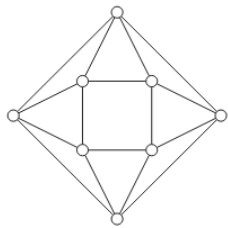

A. B. C. D.

What is the chromatic number of an $n$ vertex simple connected graph which does not contain any odd length cycle? Assume $n > 2$

A. B. C. D. n

gatecse-2009 graph-theory graph-coloring normal

The minimum number of colours that is sufficient to vertex-colour any planar graph is gatecse-2016-set2 graph-theory graph-coloring normal numerical-answers

The chromatic number of the following graph is

id

Graph $G$ is obtained by adding vertex to and making $\pmb { s }$ adjacent to every vertex of $K _ { 3 , 4 }$ . The minimum number of colours required to edge-colour $G$ is

gatecse-2020 numerical-answers graph-theory graph-coloring two-marks

Let $G$ be a simple, finite, undirected graph with vertex set $\{ v _ { 1 } , \ldots , v _ { n } \}$ . Let $\Delta ( G )$ denote the maximum degree of $G$ and let $\mathbb { N } = \{ 1 , 2 , \ldots \}$ denote the set of all possible colors. Color the vertices of $G$ using the following greedy strategy: for $i = 1 , \ldots , n$

$\mathrm { c o l o r } ( v _ { i } ) \gets \operatorname* { m i n } \left\{ j \in \mathbb { N } \right.$ : no neighbour of $v _ { i }$ is colored $j \}$ Which of the following statements is/are TRUE?

A. This procedure results in a proper vertex coloring of $G$ .   
B. The number of colors used is at most $\Delta ( G ) + 1$ .   
C. The number of colors used is at most $\Delta ( G )$ .   
D. The number of colors used is equal to the chromatic number of $G$ .

gatecse-2023 graph-theory graph-coloring multiple-selects two-marks

B. $G$ contains an independent set of size at least $n / k$ C. $G$ contains at least $k ( k - 1 ) / 2$ edges D. $G$ contains a vertex of degree at least $k$

gatecse-2024-set1 multiple-selects graph-theory graph-coloring two-marks

The chromatic number of a graph is the minimum number of colours used in a proper colouring of the graph. The chromatic number of the following graph is

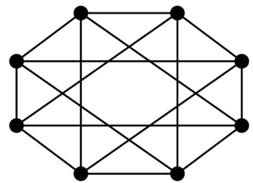

Consider the undirected graph $G$ defined as follows. The vertices of $G$ are bit strings of length $n$ . We have an edge between vertex $u$ and vertex $v$ if and only if $u$ and $v$ differ in exactly one bit position (in other words, $v$ can be obtained from $u$ by flipping a single bit). The ratio of the chromatic number of $G$ to the diameter of $G$ is, $\frac { 1 } { ( 2 ^ { n - 1 } ) }$ $\begin{array} { l } { { \mathsf { B } . } } \end{array} \left( \frac { 1 } { n } \right)$ C. () D.

gateit-2006 graph-theory graph-coloring normal

What is the chromatic number of the following graph?

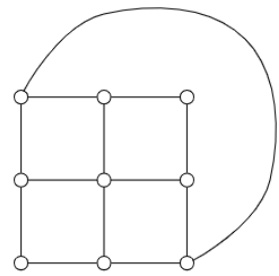

A. B. C. D.

gateit-2008 graph-theory graph-coloring easy

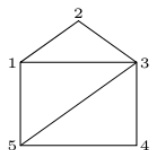

Specify an adjacency-lists representation of the undirected graph given above.

gate1987 graph-theory easy graph -connectivity descriptive

Write the adjacency matrix representation of the graph given in below figure.

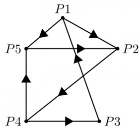

gate1988 descriptive graph-theory graph-connectivity

A graph which has the same number of edges as its complement must have number of vertices congruent to or modulo .

The maximum number of possible edges in an undirected graph with $\scriptstyle n$ vertices and $k$ components is

gate1991 graph-theory graph-connectivity normal fill-in-the-blanks

How many edges can there be in a forest with $p$ components having $\scriptstyle n$ vertices in all?

gate1992 graph-theory graph-connectivity descriptive

# The number of distinct simple graphs with up to three nodes is

A. B. 10 C. 7 D. 9 gate1994 graph-theory graph-connectivity combinatory normal isro2008 counting

# The number of edges in a regular graph of degree $d$ and $\scriptstyle n$ vertices is

gate1994 graph-theory easy graph-connectivity fill-in-the-blanks

An independent set in a graph is a subset of vertices such that no two vertices in the subset are connected by an edge. An incomplete scheme for a greedy algorithm to find a maximum independent set in a tree is given below:

V: Set of all vertices in the tree;   
$| | : = \boldsymbol { \Phi }$   
while $\lor \neq \Phi$ do   
begin select a vertex $\boldsymbol { \mathsf { u } } \in \mathsf { V }$ such that $\mathsf { V } : = \mathsf { V } - \{ \mathsf { u } \}$ ; if u is such that then $\vert : = \vert \cup \vert$ {u}   
end;   
Output(I);

A. Complete the algorithm by specifying the property of vertex $u$ in each case. B. What is the time complexity of the algorithm?

gate1994 graph-theory normal descriptive graph-connectivity

The minimum number of edges in a connected cyclic graph on vertices is:

A. B. n C. n+1 D. None of the above

gate1995 graph-theory graph-connectivity easy

Let $G$ be a connected, undirected graph. A cut in $G$ is a set of edges whose removal results in $G$ being broken into two or more components, which are not connected with each other. The size of a cut is called its cardinality. A min-cut of $G$ is a cut in $G$ of minimum cardinality. Consider the following graph:

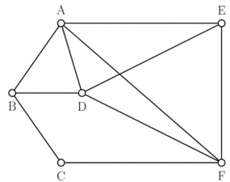

a. Which of the following sets of edges is a cut? $\{ ( A , B ) , ( E , F ) , ( B , D ) , ( A , E ) , ( A , D ) \}$ ii. $\{ ( B , D ) , ( C , F ) , ( A , B ) \}$   
b. What is cardinality of min-cut in this graph?   
c. Prove that if a connected undirected graph $G$ with $\scriptstyle n$ vertices has a min-cut of cardinality $k ,$ then $G$ has at least $\textstyle \left( { \frac { n \times k } { 2 } } \right)$ edges.

The maximum number of edges in a $n$ -node undirected graph without self loops is

A. $n ^ { 2 }$ $\mathsf { B } . \mathrm { ~ } \frac { n ( n - 1 ) } { 2 }$ C. n-1 D. $\textstyle { \frac { ( n + 1 ) ( n ) } { 2 } }$ gatecse-2002 graph-theory easy isro2008 isro2016 graph-connectivity

Let  be an arbitrary graph with $n$ nodes and $k$ components. If a vertex is removed from , the number o components in the resultant graph must necessarily lie down between

A. $k$ and $\scriptstyle n$ B. $k - 1$ and $k + 1$ C. $k - 1$ and $n - 1$ D. $k + 1$ and $n - k$ gatecse-2003 graph-theory graph-connectivity normal isro2009

# 2.5.15 Graph Connectivity: GATE CSE 2004 Question: 81

Let $G _ { 1 } = ( V , E _ { 1 } )$ and $G _ { 2 } = ( V , E _ { 2 } )$ be connected graphs on the same vertex set $V$ with more than two vertices. If $\mathsf { \bar { \Pi } } G _ { 1 } \cap \mathsf { \bar { G } } _ { 2 } = ( V , E _ { 1 } \mathsf { \bar { \Pi } } \cap E _ { 2 } )$ is not a connected graph, then the graph $G _ { 1 } \cup G _ { 2 } = ( V , E _ { 1 } \cup E _ { 2 } )$

A. cannot have a cut vertex B. must have a cycle C. must have a cut-edge (bridge) D. has chromatic number strictly greater than those of $G _ { 1 }$ and $G _ { 2 }$

gatecse-2004 graph-theory difficult graph-connectivity

# 2.5.16 Graph Connectivity: GATE CSE 2005 Question: 11

Let $G$ be a simple graph with vertices and  edges. The size of the minimum vertex cover of $G$ is . Then, the size of the maximum independent set of $G$ is:

A. B. 8 C. less than D. more than

gatecse-2005 graph-theory normal graph-connectivity

The $2 ^ { n }$ vertices of a graph $G$ corresponds to all subsets of a set of size $\scriptstyle n$ , for $n \geq 6$ . Two vertices of $G$ are adjacent if and only if the corresponding sets intersect in exactly two elements.

The number of connected components in $G$ is:

A. B. $_ { n + 2 }$ C. D. $\frac { 2 ^ { n } } { n }$

gatecse-2006 graph-theory normal graph-connectivity

Which of the following graphs has an Eulerian circuit?

A. Any $k$ -regular graph where $k$ is an B. A complete graph on  vertices. even number.   
C. The complement of a cycle on D. None of the above vertices.

gatecse-2007 graph-theory normal graph-connectivity

# Answer key☟

# 2.5.19 Graph Connectivity: GATE CSE 2008 Question: 42

$G$ is a graph on $n$ vertices and $2 n - 2$ edges. The edges of $G$ can be partitioned into two edge-disjoin spanning trees. Which of the following is NOT true for $G ?$

A. For every subset of $k$ vertices, the induced subgraph has at most $2 k - 2$ edges.   
B. The minimum cut in has at least 2 edges.   
C. There are at least  edge-disjoint paths between every pair of vertices.   
D. There are at least  vertex-disjoint paths between every pair of vertices.

The line graph $L ( G )$ of a simple graph $G$ is defined as follows:

There is exactly one vertex $v ( e )$ in $L ( G )$ for each edge $e$ in $G$ .   
For any two edges $e$ and $e ^ { \prime }$ in $G$ , $L ( G )$ has an edge between $v ( e )$ and $v ( e ^ { \prime } )$ , if and only if $e$ and $e ^ { \prime }$ are incident with the same vertex in $G$ .

Which of the following statements is/are TRUE?

(P) The line graph of a cycle is a cycle.   
(Q) The line graph of a clique is a clique.   
(R) The line graph of a planar graph is planar.   
(S) The line graph of a tree is a tree.

A. $P$ only B. $P$ and $R$ only C. only D. $^ { P , Q }$ and $\boldsymbol { s }$ only gatecse-2013 graph-theory normal graph-connectivity

$| b - d | \leq 1$ . The number of edges in this graph is gatecse-2014-set1 graph-theory numerical-answers normal graph-connectivity

# The maximum number of edges in a bipartite graph on 12 vertices is

gatecse-2014-set2 graph-theory graph-connectivity numerical-answers normal

# 2.5.23 Graph Connectivity: GATE CSE 2014 Set 3 | Question: 51

If $G$ is the forest with $\scriptstyle n$ vertices and $k$ connected components, how many edges does $G$ have?

A. $\mathsf { B } . \mathsf { \Gamma } \textstyle \left\lceil { \frac { n } { k } } \right\rceil$ C. n-k [ $) . \ n - k + 1$

gatecse-2014-set3 graph-theory graph-connectivity normal

# 2.5.24 Graph Connectivity: GATE CSE 2015 Set 2 Question: 50

In a connected graph, a bridge is an edge whose removal disconnects the graph. Which one of the following statements s true?

A. A tree has no bridges   
B. A bridge cannot be part of a simple cycle   
C. Every edge of a clique with size $\geq 3$ is a bridge (A clique is any complete subgraph of a graph)   
D. A graph with bridges cannot have cycle

Let $G$ be an undirected complete graph on $n$ vertices, where $n > 2$ . Then, the number of different Hamiltonian cycles in $G$ is equal to

A. B. $( n - 1 ) !$ C. D. $\frac { ( n - 1 ) ! } { 2 }$ gatecse-2019 engineering-mathematics discrete-mathematics graph-theory graph-connectivity one-mark

Let $G$ be any connected, weighted, undirected graph.

I. $G$ has a unique minimum spanning tree, if no two edges of $G$ have the same weight. II. $G$ has a unique minimum spanning tree, if, for every cut of $G$ , there is a unique minimum-weight edge crossing the cut.

Which of the following statements is/are TRUE?

A. I only B. II only C. Both I and II D. Neither nor II e-2019 engineering-mathematics discrete-mathematics graph-theory graph-connectivity two-marks minimum-spanning-tree algorithms graph$\dim ( G ) = { \underset { u , v \in V } { \operatorname* { m a x } } } \nmid$ [the length of shortest path between $u$ and $\boldsymbol { v } \}$

Let $M$ be the adjacency matrix of $G$ .

Define graph $G _ { 2 }$ on the same set of vertices with adjacency matrix $N$ , where

$$
N _ { i j } = \left\{ \begin{array} { l l } { 1 } & { \mathrm { i f } \ M _ { i j } > 0 \ \mathrm { o r } \ P _ { i j } > 0 , \ \mathrm { w h e r e } \ P = M ^ { 2 } } \\ { 0 } & { \mathrm { o t h e r w i s e } } \end{array} \right.
$$

Which one of the following statements is true?

A. $\mathrm { d i a m } ( G _ { 2 } ) \leq \lceil \mathrm { d i a m } ( G ) / 2 \rceil$ B. $\lceil \dim ( G ) / 2 \rceil < \dim ( G _ { 2 } ) < \dim ( G )$ C. diam $( G _ { 2 } ) = \dim ( G )$ D. $\mathrm { d i a m } ( G ) < \mathrm { d i a m } ( G _ { 2 } ) \leq 2 \mathrm { d i a m } ( G )$

Consider a simple undirected graph of  vertices. If the graph is disconnected, then the maximum number of edges it can have is

gatecse-2022 numerical-answers graph-theory graph-connectivity one-mark

Consider a simple undirected unweighted graph with at least three vertices. If $A$ is the adjacency matrix o the graph, then the number of cycles in the graph is given by the trace of

A. $A ^ { 3 }$ B. $A ^ { 3 }$ divided by C. $A ^ { 3 }$ divided by 3 D. $A ^ { 3 }$ divided by

gatecse-2022 graph-theory graph-connectivity two-marks

Answer key☟

Which of the properties hold for the adjacency matrix $A$ of a simple undirected unweighted graph having $\scriptstyle n$ vertices?

A. The diagonal entries of $A ^ { 2 }$ are the degrees of the vertices of the graph.   
B. If the graph is connected, then none of the entries of $A ^ { n - 1 } + I _ { n }$ can be zero.   
C. If the sum of all the elements of $A$ is at most $2 ( n - 1 )$ then the graph must be acyclic.   
D. If there is at least a  in each of $A$ rows and columns, then the graph must be connected.

every spanning tree in has even weight. Which of the following statements is/are TRUE for every such graph ?

A. All edges in have even weight   
B. All edges in have even weight  all edges in have odd weight   
C. In each cycle  in , all edges in  have even weight   
D. In each cycle in , either all edges in  have even weight  all edges in  have odd weight

gatecse-2024-set2 graph-theory multiple-selects graph-connectivity two-marks

​Let  be the adjacency matrix of a simple undirected graph . Suppose is its own inverse. Which one of the following statements is always TRUE?

A. is a cycle B. is a perfect matching C. is a complete graph D. There is no such graph G

gatecse-2024-set2 graph-theory graph-connectivity one-mark

What is the number of vertices in an undirected connected graph with edges, vertices of degree vertices of degree and remaining of degree ?

A. B. C. D.

gateit-2004 graph-theory graph-connectivity normal

What is the maximum number of edges in an acyclic undirected graph with  vertices?

A. B. n C. n+1 D. 2n-1

gateit-2004 graph-theory graph-connectivity normal

# 2.5.36 Graph Connectivity: GATE IT 2005 Question: 56

Let $G$ be a directed graph whose vertex set is the set of numbers from to . There is an edge from a vertex $\mathbf { \chi } _ { i }$ to a vertex $j$ iff either $j = i + 1$ or $j = 3 i$ The minimum number of edges in a path in $G$ from vertex 1 to vertex is

A. B. C. D. 99

gateit-2005 graph-theory graph-connectivity normal