What is the largest integer such that every simple connected graph with $n$ vertices and $n$ edges contains at least  different spanning trees ?

A. B. C. D. n

gateit-2007 graph-theory graph-connectivity tricky

$G$ is a simple undirected graph. Some vertices of $G$ are of odd degree. Add a node $v$ to $G$ and make i adjacent to each odd degree vertex of $G$ The resultant graph is sure to be

A. regular B. complete C. Hamiltonian D. Euler

gateit-2008 graph-theory graph-connectivity normal

What is the size of the smallest (Maximal Independent Set) of a chain of nine nodes?

A. B. C. D. 2

gateit-2008 normal graph-connectivity

Which of the following graphs is isomorphic to

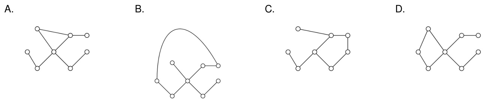

The following simple undirected graph is referred to as the Peterson graph.

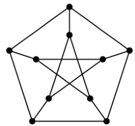

Which of the following statements is/are TRUE?

A. The chromatic number of the graph is B. The graph has a Hamiltonian path. C. The following graph is isomorphic to the Peterson graph.

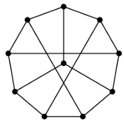

D. The size of the largest independent set of the given graph is (A subset of vertices of a graph form an independent set if no two vertices of the subset are adjacent.)

How many perfect matching are there in a complete graph of vertices?

A. B. C. D. 60

gatecse-2003 graph-theory graph-matching normal

Which of the following graphs is/are planar?

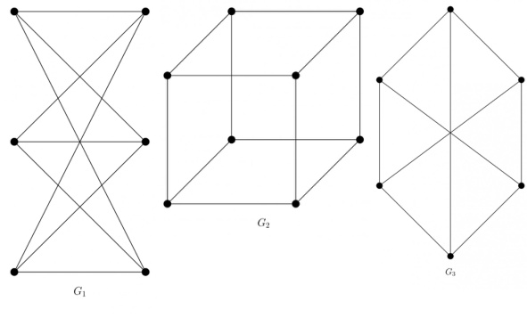

gate1989 normal graph-theory graph-planarity descriptive

A graph is planar if and only if,

A. It does not contain a subgraph homeomorphic to $k _ { 5 }$ and . B. It does not contain a subgraph isomorphic to $k _ { 5 }$ and . C. It does not contain a subgraph isomorphic to $k _ { 5 }$ or D. It does not contain a subgraph homeomorphic to $k _ { 5 }$ or $k _ { 3 , 3 }$ .

gate1990 normal graph-theory graph-planarity multiple-selects

# Maximum number of edges in a planar graph with vertices is

gate1992 graph-theory graph -planarity easy fill-in-the-blanks

A non-planar graph with minimum number of vertices has

A. edges, vertices B. edges,  vertices C. edges, 5 vertices D. edges, vertices

gate1992 graph-theory normal graph-planarity

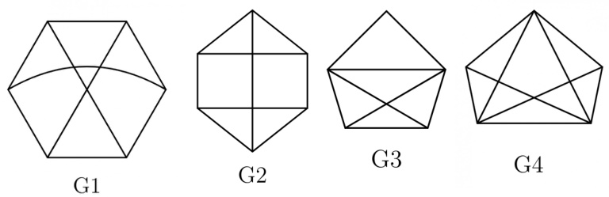

A. G1 B. G2 C. G3 D. G4

gatecse-2005 graph-theory graph-planarity normal

Which of the following statements is true for every planar graph on  vertices?

CA. The graph is connected B. The graph is Eulerian The graph has a vertex-cover of D. The graph has an independent set size at most $\frac { 3 n } { 4 }$ of size at least $\frac { n } { 3 }$

gatecse-2008 graph-theory normal graph-planarity

K4 and Q3 are graphs with the following structures.

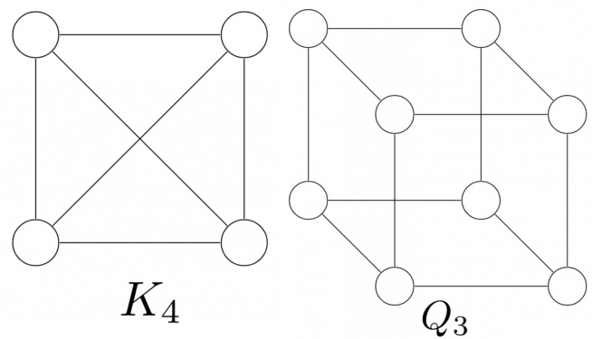

Which one of the following statements is TRUE in relation to these graphs?

A. K4 is a planar while Q3 is not B. Both K4 and Q3 are planar C. Q3 is planar while K4 is not D. Neither K4 nor Q3 is planar

gatecse-2011 graph-theory graph-planarity normal

B. In any planar embedding, the number of faces is less than $\textstyle { \frac { n } { 2 } } + 2$ C. There is a planar embedding in which the number of faces is less than D. There is a planar embedding in which the number of faces is at most $\frac { \ d n \pi } { \delta + 1 }$

Let G be a connected planar graph with vertices. If the number of edges on each face is three, then the number of edges in G is

gatecse-2015-set1 graph-theory graph-connectivity normal graph-planarity numerical-answers

In an undirected connected planar graph $G$ , there are eight vertices and five faces. The number of edges in $G$ is

gatecse-2021-set1 graph-theory graph-planarity numerical-answers easy one-mark

Consider a complete graph $K _ { n }$ with $n$ vertices ( $n > 4$ ). Note that multiple spanning trees can constructed over . Each of these spanning trees is represented as a set of edges. The Jaccard coefficient between any two sets is defined as the ratio of the size of the intersection of the two sets to the size of the union of the two sets.

Which one of the following options gives the lowest possible value for the Jaccard coefficient between any two spanning trees of Kn ?

A. $\textstyle { \frac { 1 } { n } }$ ${ \mathsf { B } } . \mathsf { \Pi } _ { 2 n - 3 } ^ { 1 }$ C. 0 D. $\textstyle { \frac { 1 } { n - 1 } }$

gatecse-2026-set2 graph-theory jaccard-coefficient two-marks

# Answer Keys

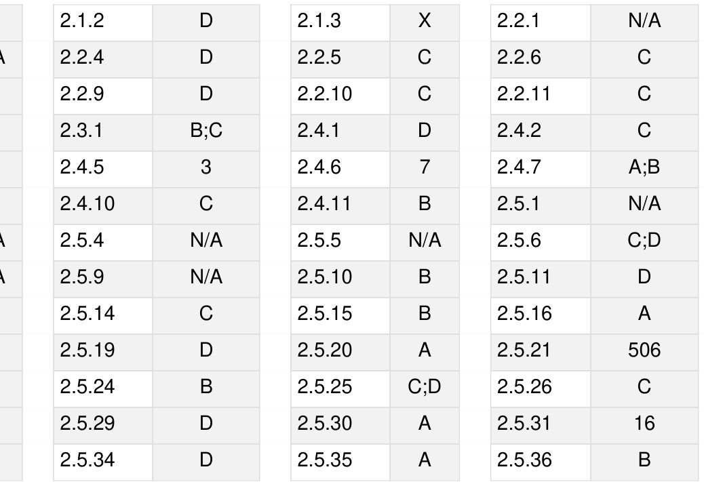

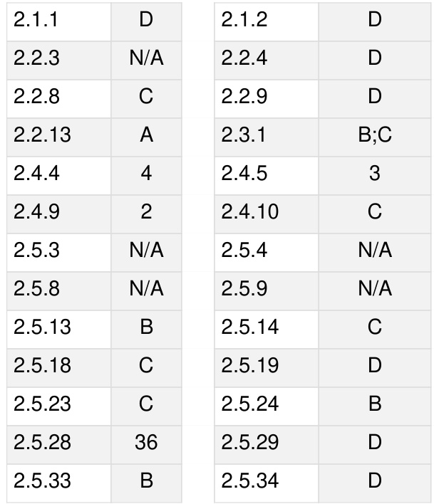

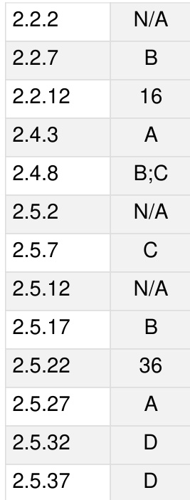

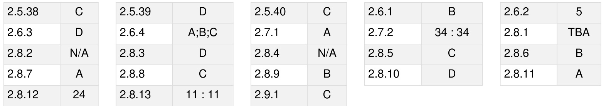

Syllabus: Propositional and first order logic.

Mark Distribution in Previous GATE   
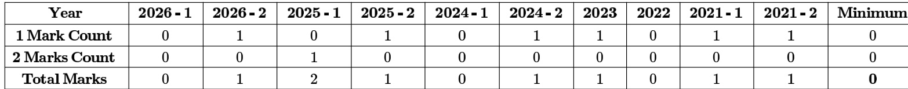

Welcome to the "Discrete Mathematics: Mathematical Logic" chapter of your GATE Computer Science exam preparation. This section is designed to provide a comprehensive, exam-focused overview of the fundamental concepts, formulas, and problem-solving techniques you'll need to master. Mathematical Logic is the bedrock of computer science, providing the formal tools to reason about computation, verify program correctness, design circuits, and understand artificial intelligence. For the GATE CS exam, this subject typically carries a weightage of 5-8 marks. Questions often involve determining the validity of arguments, checking logical equivalence, translating natural language statements into logical expressions, and identifying tautologies or contradictions. A strong grasp of these concepts is indispensable not just for direct questions but also for understanding the logical underpinnings of other topics like set theory, relations, and algorithms.

# Topic-wise Key Concepts

# Propositional Logic

Propositional Logic, also known as propositional calculus, is the study of propositions (declarative sentences that are either true or false, but not both) and their combinations using logical connectives. It forms the most basic level of logical reasoning, focusing on the truth values of simple statements and how they combine to determine the truth values of complex statements.

Definition and Core Idea: A proposition is a statement that is unequivocally true or false. Propositional logic uses symbols to represent propositions and logical connectives to form compound propositions, allowing us to analyze their truth values systematically.

Important Formulas, Theorems, and Results:

# 1. Logical Connectives:

Negation (NOT): $\neg p$ (read as "not ${ \mathsf { p } } "$ )   
Conjunction (AND): $p \wedge q$ (read as "p and q")   
Disjunction (OR): $p \vee q$ (read as "p o r q")   
Implication (IF...THEN): $p \to q$ (read as "if $\mathsf { p }$ then q" or "p implies q")   
Biconditional (IF AND ONLY IF): $p  q$ (read as "p if and only if q")   
Exclusive OR (XOR): $p \oplus q$ (read as "p xor q")   
NAND: $p$ 个 $\cdot q \equiv \neg ( p \land q )$   
NOR: $p \downarrow q \equiv \neg ( p \vee q )$

2. Truth Tables: Essential for defining connectives and evaluating compound propositions.

$\neg p$ : T if p is F, F if $\mathsf { p }$ is $\intercal$ .   
$p \wedge q$ : T if both $\mathsf { p }$ and q are $\intercal$ , else F.   
· $p \vee q$ : T if p is $\intercal$ or q is T (or both), else F.   
■ $p \to q$ : F only if $\mathsf { p }$ is T and q is F, else T.   
■ $p  q$ : T if $\mathsf { p }$ and q have the same truth value, else F. $p \oplus q$ : T if $\mathsf { p }$ and q have different truth values, else F.

3. Tautology, Contradiction, Contingency:

Tautology: A compound proposition that is always true, regardless of the truth values of its atomic propositions. Example: $p \lor \lnot p$ .   
Contradiction (or Absurdity): A compound proposition that is always false. Example: $p \wedge \neg p$ . Contingency: A compound proposition that is neither a tautology nor a contradiction (i.e., its truth value depends on the truth values of its atomic propositions).

4. Logical Equivalence $\circledequiv \}$ : Two propositions $P$ and $Q$ are logically equivalent if $P  Q$ is a tautology. This means they always have the same truth value.

5. Laws of Logic (Logical Equivalences): Identity Laws: $\begin{array} { c } { { \bf { \sigma } } \cdot { \bf { \sigma } } p \wedge { \bf { \bar { \sigma } } } T \equiv p } \\ { { \bf { \sigma } } \cdot { p } \vee { \cal F } \equiv p } \end{array}$

Domination Laws: $\begin{array} { c } { { \bullet p \vee T \equiv T } } \\ { { \bullet p \wedge F \equiv F } } \end{array}$

Idempotent Laws: $\boldsymbol { \cdot } \stackrel { p \vee p } { \boldsymbol { \cdot } \stackrel { p } { p } } \stackrel { = p } { \left. \wedge \right.} p $

Double Negation Law: $\neg ( \neg p ) \equiv p$

Commutative Laws: $\begin{array} { c } { { \bullet p \vee q \equiv q \vee p } } \\ { { \bullet p \wedge q \equiv q \wedge p } } \end{array}$

Associative Laws: $\begin{array} { l } { \bullet \left( p \vee q \right) \vee r \equiv p \vee \left( q \vee r \right) } \\ { \bullet \left( p \wedge q \right) \wedge r \equiv p \wedge \left( q \wedge r \right) } \end{array}$

Distributive Laws: $\begin{array} { c } { \bullet p \wedge ( q \vee r ) \equiv ( p \wedge q ) \vee ( p \wedge r ) } \\ { \bullet p \vee ( q \wedge r ) \equiv ( p \vee q ) \wedge ( p \vee r ) } \end{array}$

De Morgan's Laws: $\begin{array} { c } { { \bullet \neg ( p \wedge q ) \equiv \neg p \vee \neg q } } \\ { { \bullet \neg ( p \vee q ) \equiv \neg p \wedge \neg q } } \end{array}$

Absorption Laws: $\left. \begin{array} { l l } { \cdot p \vee ( p \wedge q ) \equiv p } \\ { \cdot p \wedge ( p \vee q ) \equiv p } \end{array} \right.$

Inverse Laws (Complement Laws): $\begin{array} { c } { { \cdot p \vee \neg p \equiv \dot { T } } } \\ { { \cdot p \wedge \neg p \equiv F } } \end{array}$

Implication Equivalences: $\begin{array} { l } { \bullet p \to q \equiv \neg p \vee q } \\ { \bullet p \to q \equiv \neg q \to \neg p ( \complement \circ \cap \uplus \uplus \uplus \uplus \uplus ) } \\ { \bullet \neg ( p \to q ) \equiv p \wedge \neg q } \end{array}$

Biconditional Equivalences: $\begin{array} { l } { \cdot p  q \equiv ( p  q ) \wedge ( q  p ) } \\ { \cdot p  q \equiv ( \neg p \vee q ) \wedge ( \neg q \vee p ) } \\ { \cdot p  q \equiv \neg p  q } \\ { \cdot p  q \equiv ( p \wedge q ) \vee ( \neg p \wedge \neg q ) } \end{array}$

6. Conjunctive Normal Form (CNF) and Disjunctive Normal Form (DNF)

Literal: A propositional variable or its negation (e.g., $p , \lnot q )$ .   
□ Clause: A disjunction of literals (e.g., $p \vee \neg q \vee r )$ .   
CNF: A conjunction of clauses (e.g., $( p \lor \neg q ) \land ( r \lor s ) )$ .   
Minterm: A conjunction of literals where each variable appears exactly once (e.g., $p \land \lnot q \land r )$ .   
Maxterm: A disjunction of literals where each variable appears exactly once (e.g., $p \vee \neg q \vee r )$ .   
DNF: A disjunction of minterms (e.g., $( p \land \neg q ) \lor ( r \land s ) )$ .   
Any propositional formula can be converted into an equivalent CNF or DNF.

Key Properties and Identities: All the laws of logic listed above are crucial identities for simplification and proving equivalence. Understanding the truth conditions for each connective is fundamental.

Common Pitfalls or Tricky Points:

Confusing implication $( p \to q )$ 1 with causation or "if and only if". Remember $p \to q$ is false only when $p$ is true and $q$ is false.   
。 Incorrectly applying De Morgan's Laws, especially with more complex expressions.   
。 Misinterpreting the biconditional; implies mutual implication.   
。 Errors in constructing truth tables, particularly for propositions with many variables.   
。 Assuming logical equivalence based on partial truth values.

Standard Problem-Solving Techniques or Shortcuts:

。 Truth Tables: The most direct method for small propositions to check tautology, contradiction, or equivalence.   
。 Logical Equivalences: Use the laws of logic to simplify expressions or prove equivalence without truth tables. This is often faster for complex expressions. Substitution: Replace sub-expressions with their known equivalents. Proof by Contradiction: To show $P$ is a tautology, assume $\neg P$ is true and derive a contradiction. To show   
$P \equiv Q$ , assume $\neg ( P  Q )$ is true and derive a contradiction. Conversion to CNF/DNF: Useful for standardization and for certain proof methods like resolution.

# First Order Logic (Predicate Logic)

First Order Logic (FOL), also known as Predicate Logic, extends propositional logic by allowing us to express more complex statements about objects, their properties, and relationships. It introduces predicates, variables, and quantifiers, enabling reasoning about "all" or "some" elements within a domain.

Definition and Core Idea: FOL allows us to break down propositions into predicates (properties or relations) and arguments (variables or constants). It introduces quantifiers $\forall$ for "for all" and  for "there exists") to make statements about collections of objects, providing a richer expressive power than propositional logic.

Important Formulas, Theorems, and Results:

1. Components of FOL:

Predicates: Represent properties or relations (e.g., $P ( x )$ for $" \times$ is prime", $L ( x , y )$ for $" \times$ loves y").   
Variables: Placeholders for objects $( \boldsymbol { \Theta } . \boldsymbol { \mathfrak { g } } . , \boldsymbol { x } , \boldsymbol { y } , z )$ .   
Constants: Specific objects (e.g., "Socrates", "5").   
Functions: Map objects to other objects (e.g., $f ( x )$ for "father of $\mathsf { x } "$ ).   
Quantifiers: Universal Quantifier $( \forall )$ : "For all", "for every", "for each". $\forall x P ( x )$ means $P ( x )$ is true for every $x$ in the domain. Existential Quantifier $\textcircled { \exists }$ : "There exists", "for some", "for at least one". $\exists x P ( x )$ means there is at least one $x$ in the domain for which $P ( x )$ is true.

2. Scope of Quantifiers, Free and Bound Variables:

The scope of a quantifier is the part of the formula to which it applies. A variable is bound if it is within the scope of a quantifier using that variable. A variable is free if it is not bound by any quantifier. A formula with no free variables is called a sentence or closed formula and has a definite truth value.

3. Quantifier Equivalences (Negation Rules):

$\lnot \forall { x } P ( { x } ) \equiv \exists { x } \lnot P ( { x } )$ (It is not true that all $\mathsf { x }$ have property $\mathsf { P }$ if and only if there exists an $\mathsf { x }$ that does not have property P).   
$\lnot \exists x P ( x ) \equiv \forall x \lnot P ( x )$ (It is not true that there exists an $\mathsf { x }$ with property $\mathsf { P }$ if and only if all x do not have property P).

# 4. Distributive Properties of Quantifiers:

$\forall x ( P ( x ) \land Q ( x ) ) \equiv \forall x P ( x ) \land \forall x Q ( x )$   
$\exists x ( P ( x ) \lor Q ( x ) ) \equiv \exists x P ( x ) \lor \exists x Q ( x )$   
Important Non-Equivalences: $\forall x ( P ( x ) \lor Q ( x ) )$ is NOT equivalent to $\forall x P ( x ) \lor \forall x Q ( x )$ . (e.g., "Every number is even or odd" is true, but "Every number is even or every number is odd" is false). $\exists x ( P ( x ) \land Q ( x ) )$ is NOT equivalent to $\exists x P ( x ) \land \exists x Q ( x )$ . (e.g., "There is a number that is both even and prime" (2) is true, but "There is an even number and there is a prime number" is also true, but the existence of one doesn't imply the other is the same number).

5. Interchange of Quantifiers:

$\forall x \forall y P ( x , y ) \equiv \forall y \forall x P ( x , y )$   
$\exists x \exists y P ( x , y ) \equiv \exists y \exists x P ( x , y )$   
Order Matters for Mixed Quantifiers: $\forall x \exists y P ( x , y )$ (For every x, there exists a y such that $\mathsf { P } ( \mathsf { x } , \mathsf { y } ) )$ is NOT equivalent to $\exists y \forall x P ( x , y )$ (There exists a y such that for every x, $\mathsf { P } ( \mathsf { x } , \mathsf { y } ) )$ . Example: Let $P ( x , y )$ be $" x$ loves y". $\forall x \exists y L ( x , y )$ means "Everyone loves someone". $\exists y \forall x L ( x , y )$ means "There is someone whom everyone loves". These are clearly different.

6. Prenex Normal Form (PNF): A formula is in PNF if all quantifiers are at the beginning of the formula, followed by a quantifier-free formula (called the matrix). Any FOL formula can be converted to an equivalent PNF.

Key Properties and Identities: The quantifier negation rules are fundamental for manipulating and simplifying FOL expressions. Understanding the implications of quantifier order is critical.

Common Pitfalls or Tricky Points:

Incorrect Translation: Translating natural language statements into FOL is a major source of errors. Pay close   
attention to words like "all", "some", "no", "only if", "unless". "All A are B": $\forall x ( A ( x )  B ( x ) )$ (NOT $\forall { \tilde { x } } ( A ( x ) \land B ( x ) ) )$ "Some A are B": $\exists x ( A ( x ) \land B ( x ) )$ (NOT $\exists x ( A ( x )  B ( x ) ) )$ "No A are B": $\forall x ( A ( x ) {  } \neg B ( x ) )$ or $\neg \exists x ( A ( x ) \land B ( x ) )$   
。 Scope Errors: Misplacing parent heses or incorrectly determining the scope of a quantifier.   
。 Variable Binding: Confusing free and bound variables, or using the same variable name for different purposes   
in nested scopes.

Order of Mixed Quantifiers: Assuming $\forall x \exists y P ( x , y )$ is the same as $\exists y \forall x P ( x , y )$ .

Standard Problem-Solving Techniques or Shortcuts:

Step-by-step Translation: Break down complex natural language sentences into smaller parts, translate each, and then combine them. Identify predicates, variables, and connectives first.   
Applying Quantifier Equivalences: Use negation rules to simplify expressions or move negations inwards. Domain Awareness: Always consider the domain of discourse when evaluating truth values or translating. Counterexamples: To show a statement is false or not equivalent, try to find a specific example in a small domain that makes it false.

# Logical Reasoning (Inference)

Logical Reasoning, or Inference, is the process of deriving conclusions from a set of premises using valid rules. It focuses on the structure of arguments to determine whether a conclusion necessarily follows from the premises, regardless of the actual truth of the premises.

Definition and Core Idea: An argument a sequence of propositions, where the first propositions are premises and the final proposition is the conclusion. An argument is valid if, whenever all its premises are true, the conclusion must also be true. The goal is to determine if an argument's structure guarantees the truth of its conclusion given true premises.

Important Formulas, Theorems, and Results:

1. Argument Validity: An argument with premises $P _ { 1 } , P _ { 2 } , . . . , P _ { n }$ and conclusion $C$ is valid if the proposition $( P _ { 1 } \land P _ { 2 } \land \dotsc \land P _ { n } )  C$ is a tautology.   
2. Rules of Inference (for Propositional Logic): These are fundamental valid argument forms. ■ Modus Ponens (Law of Detachment):

$$
\begin{array} { c } { { p  q } } \\ { { \frac { p } { \therefore q } } } \end{array}
$$

Equivalent to $( ( p \to q ) \land p ) \to q$ being a tautology.

Modus Tollens:

$$
\frac { p \to q } { \therefore q }
$$

Equivalent to $( ( p \to q ) \land \lnot q ) \to \lnot p$ being a tautology.

Hypothetical Syllogism:

$$
\displaystyle { \frac { p \to q } { \therefore p \to r } }
$$

Equivalent to $( ( p \to q ) \land ( q \to r ) ) \to ( p \to r )$ being a tautology.

Disjunctive Syllogism:

$$
\displaystyle \frac { p \vee q } { \therefore q }
$$

Equivalent to $( ( p \lor q ) \land \lnot p ) \to q$ being a tautology.

Addition:

$$
\frac { p } { \therefore p \lor q }
$$

Simplification:

$$
\frac { p \wedge q } { \therefore p }
$$

Conjunction:

Resolution:

$$
\frac { p } { \phantom { i } \cdot \phantom { } p \wedge q }
$$

$$
\begin{array} { l } { p \vee q } \\ { \xrightarrow [ \therefore p \vee r ] { \neg q \vee r } } \end{array}
$$

This is particularly useful in automated theorem proving and for converting to CNF. Constructive Dilemma:

$$
 \begin{array} { c } { ( p  q ) \wedge ( r  s ) } \\ {  p \vee r  } \\ {  \therefore q \vee s  } \end{array} 
$$

Destructive Dilemma:

$$
\begin{array} { r } { \frac { ( p  q ) \wedge ( r  s ) } { \underset { \cdots  p \lor \neg r } { \neg q \lor \neg s } } } \end{array}
$$

3. Rules of Inference (for First Order Logic):

Universal Instantiation (UI): If $\forall x P ( x )$ is true, then $P ( c )$ is true for any arbitrary individual $c$ in the domain.

$$
\frac { \forall x P ( x ) } { \therefore P ( c ) }
$$

Universal Generalization (UG): If $P ( c )$ is true for an arbitrary individual $c$ in the domain, then $\forall x P ( x )$ is true.

$$
\frac { P ( c ) \mathrm { f o r a n a r b i t r a r y } c } { \therefore \forall x P ( x ) }
$$

Existential Instantiation (EI): If $\exists x P ( x )$ is true, then $P ( c )$ is true for some specific individual $c$ in the domain. This $c$ must be a new constant not previously used in the proof.

$$
\frac { \exists x P ( x ) } { \therefore P ( c ) { \mathrm { ( f o r s o m e n e w c ) } } }
$$

Existential Generalization (EG): f $P ( c )$ is true for some specific individual $c$ in the domain, then $\exists x P ( x )$ is true.

$$
\frac { P ( c ) { \mathrm { f o r } } { \mathrm { s o m e } } { \mathrm { s p e c i f i c } } c } { \therefore \exists x P ( x ) }
$$

# 4. Proof Methods:

Direct Proof: Assume premises are true, and use inference rules and logical equivalences to derive the conclusion.

Indirect Proof (Proof by Contradiction): To prove $C$ from premises $P _ { 1 } , . . . , P _ { n }$ , assume $\neg C$ is true along with $P _ { 1 } , \ldots , P _ { n }$ , and derive a contradiction $( F )$ .

Proof by Contraposition: To prove $p \to q$ , prove its contrapositive $\neg q \to \neg p$ .

Key Properties and Identities: The validity of each inference rule is a key property. Understanding that these rules preserve truth is fundamental.

Common Pitfalls or Tricky Points:

Fallacies: Invalid argument forms that resemble valid ones.

Fallacy of Affirming the Consequent: $( ( p \to q ) \land q ) \to p$ (NOT a tautology). Example: "If it rains, the ground is wet. The ground is wet. Therefore, it rained." (Could be wet from a sprinkler). Fallacy of Denying the Antecedent: $( ( p \to q ) \land \lnot p ) \to \lnot q$ (NOT a tautology). Example: "If it rains, the ground is wet. It did not rain. Therefore, the ground is not wet." (Could be wet from a sprinkler).

Confusing Validity with Soundness: A valid argument can have false premises and a false conclusion. A sound argument is a valid argument with all true premises (and thus, a true conclusion). GATE questions usually focus on validity.   
Incorrect Application of Quantifier Rules: Especially with EI and UG, ensure the constant chosen for instantiation is new (for EI) or truly arbitrary (for UG).   
Circular Reasoning: Assuming the conclusion (or something equivalent to it) as a premise.

Standard Problem-Solving Techniques or Shortcuts:

Formal Proofs: List premises and then systematically apply inference rules and logical equivalences to derive the conclusion, citing the rule for each step.   
Truth Tables (for small arguments): Convert the argument into a single conditional statement   
$( P _ { 1 } \land \dots \land P _ { n } ) \to C$ and check if it's a tautology.   
Resolution Principle: Convert all premises and the negation of the conclusion into CNF clauses. Add the negation of the conclusion as a clause. If an empty clause $( \boxed { \begin{array} { r l } \end{array} }$ can be derived through resolution, the original argument is valid.   
Look for Fallacies: If an argument resembles a common fallacy, it's likely invalid.

# Quick Formula Reference

# Propositional Logic Equivalences

· $\neg ( \neg p ) \equiv p$ (Double Negation)   
· $p \vee q \equiv q \vee p$ (Commutative)   
· $p \wedge q \equiv q \wedge p$ (Commutative) $( p \vee q ) \vee r \equiv p \vee ( q \vee r )$ (Associative) $( p \wedge q ) \wedge r \equiv p \wedge ( q \wedge r )$ (Associative)   
. $p \wedge ( q \vee r ) \equiv ( p \wedge q ) \vee ( p \wedge r )$ (Distributive)   
$p \vee ( q \wedge r ) \equiv ( p \vee q ) \wedge ( p \vee r )$ (Distributive) $\neg ( p \wedge q ) \equiv \neg p \vee \neg q$ (De Morgan's) $\neg ( p \vee q ) \equiv \neg p \wedge \neg q$ (De Morgan's)   
· $p \to q \equiv \neg p \lor q$   
· $p \to q \equiv \neg q \to \neg p$ (Contrapositive) $\neg ( p \to q ) \equiv p \land \neg q$   
· $p  q \equiv ( p \to q ) \land ( q \to p )$   
· $p  q \equiv ( p \land q ) \lor ( \neg p \land \neg q )$   
(Inverse Law)   
·p>-p=F (Inverse Law)   
· $\bar { p } \vee T \equiv T$ (Domination Law)   
· ${ \bf \bar { p } } \land F \equiv F$ (Domination Law)   
· $\bar { p } \land T \equiv p$ (Identity Law)   
· $p \vee F \equiv p$ (Identity Law)   
· $p \vee p \equiv p$ (Idempotent Law)   
${ \mathbf { \nabla } } \cdot { \boldsymbol { p } } \wedge { \boldsymbol { p } } \equiv { \boldsymbol { p } }$ (Idempotent Law)   
${ \pmb { p } } \vee ( { \pmb { p } } \wedge { \pmb q } ) \equiv { \pmb { p } }$ (Absorption Law)   
· $p \wedge ( p \vee q ) \equiv p$ (Absorption Law)

# Quantifier Equivalences

$$
\begin{array} { l } { \bullet \neg \forall x P ( x ) \equiv \exists x \neg P ( x ) } \\ { \bullet \neg \exists x P ( x ) \equiv \forall x \neg P ( x ) } \end{array}
$$

$$
\begin{array} { l } { \forall x ( P ( x ) \wedge Q ( x ) ) \equiv \forall x P ( x ) \wedge \forall x Q ( x ) } \\ { \exists x ( P ( x ) \vee Q ( x ) ) \equiv \exists x P ( x ) \vee \exists x Q ( x ) } \\ { \forall x \forall y P ( x , y ) \equiv \forall y \forall x P ( x , y ) } \\ { \exists x \exists y P ( x , y ) \equiv \exists y \exists x P ( x , y ) } \end{array}
$$

# Rules of Inference (Propositional Logic)

Modus Ponens: $( p \to q ) \land p \implies q$   
Modus Tollens: $( p \to q ) \land q \implies \neg p$   
Hypothetical Syllogism: $( p \to q ) \land ( q \to r ) \implies p \to r$   
Disjunctive Syllogism: $( p \vee q ) \wedge \neg p \implies q$   
Addition: $p \implies p \lor q$   
Simplification: $p \wedge q \implies p$   
Conjunction: $p , q \implies p \wedge q$   
Resolution: $( p \vee q ) \wedge ( \neg q \vee r ) \implies p \vee r$

Rules of Inference (First Order Logic)

Universal Instantiation (UI): $\forall x P ( x ) \implies P ( c )$ Universal Generalization (UG): $P ( c )$ for arbitrary $c \implies \forall x P ( x )$ Existential Instantiation (EI): $\exists x P ( x ) \implies P ( c )$ (for new_c) Existential Generalization (EG): $P ( c )$ for specific ${ \dot { c } } \implies \exists x P ( x )$

# Important Tips for GATE

1. Master Truth Tables: They are the foundation. Be able to quickly construct and interpret truth tables for any compound proposition, especially for 2-3 variables. This helps in verifying tautologies, contradictions, and equivalences.

2. Memorize Key Equivalences and Inference Rules: Speed and accuracy in GATE questions heavily rely on yo ability to recall and apply De Morgan's laws, implication equivalences, and the common rules of inference (Modu Ponens, Modus Tollens, etc.) without hesitation.

3. Practice Natural Language Translation: A significant portion of GATE questions involves translating English sentences into logical expressions (and vice-versa). Pay close attention to keywords like "all", "some", "no", "only if", "unless", and the correct use of quantifiers and connectives.

4. Understand Quantifier Scope and Order: Incorrectly interpreting the scope of quantifiers or swapping the order of mixed quantifiers ( vs. ) is a very common mistake. Always visualize the domain and what each quantifier implies.

5. Distinguish Validity from Soundness: GATE questions usually ask about the validity of an argument (whether the conclusion logically follows from the premises), not its soundness (which also requires premises to be true in the real world). Focus on the logical structure.

6. Systematic Approach to Proofs: When asked to prove an argument's validity, don't guess. Start with the premises and systematically apply inference rules and logical equivalences, one step at a time, until you reach the conclusion. Clearly state the rule used for each step.

7. Identify Common Fallacies: Be aware of fallacies like "Affirming the Consequent" and "Denying the Antecedent". If an argument structure matches a known fallacy, you can quickly identify it as invalid.

8. Time Management: Some logical reasoning problems can be lengthy, especially those involving formal proofs or complex translations. If a question seems too time-consuming, make an educated guess or mark it for review if time permits, and move on to other questions.

Consider the following first order formula:

$$
\begin{array} { r } { \boxed { \begin{array} { c } { \forall x \forall y : ( R ( x , y ) \implies \neg R ( y , x ) ) } \\ { \bigwedge } \\ { \forall x \forall y \forall z : ( R ( x , y ) \wedge R ( y , z ) \implies R ( x , z ) ) } \\ { \bigwedge } \\ { \forall x : - R ( x , x ) } \end{array} } } \end{array}
$$

Does it have finite models?

Is it satisfiable? If so, give a countable model for it.

gate1991 mathematical-logic first-order-logic descriptive

Which of the following predicate calculus statements is/are valid?

A. $( \forall ( x ) ) P ( x ) \lor ( \forall ( x ) ) Q ( x ) \implies ( \forall ( x ) ) ( P ( x ) \lor Q ( x ) )$ B. $( \exists ( x ) ) P ( x ) \land ( \exists ( x ) ) Q ( x ) \implies ( \exists ( x ) ) ( P ( x ) \land Q ( x ) )$ C. $( \forall ( x ) ) ( P ( x ) \lor Q ( x ) ) \implies ( \forall ( x ) ) P ( x ) \lor ( \forall ( x ) )$ c))Q(x) D. $( \exists ( x ) ) ( P ( x ) \lor Q ( x ) ) \implies \tilde { ( \forall ( x ) ) } P ( x ) \lor ( \exists ( x ) ) Q ( x )$

gate1992 mathematical-logic normal first-order-logic

# Answer key☟

Which of the following is a valid first order formula? (Here $\alpha$ and $\beta$ are first order formulae with $x$ as their only free variable)

A. $( ( \forall x ) [ \alpha ] \Rightarrow ( \forall x ) [ \beta ] ) \Rightarrow ( \forall x ) [ \alpha \Rightarrow \beta ]$   
B. $( \forall x ) [ \alpha ] \Rightarrow ( \exists x ) [ \alpha \land \beta ]$   
C. $( ( \forall x ) [ \alpha \lor \beta ] \Rightarrow ( \exists x ) [ \alpha ] ) \Rightarrow ( \forall x ) [ \alpha ]$   
D. $( \forall x ) [ \alpha \Rightarrow \bar { \beta } ] \Rightarrow ( ( ( \forall \bar { x } ) [ \alpha ] ) \Rightarrow ( \forall \bar { x } ) [ \beta ] )$

gatecse-2003 mathematical-logic first-order-logic normal

Answer key ☟

$P _ { x } = { \mathrm { ' } } x$ is a prime number'   
$Q _ { x y } = \mathfrak { y }$ divides $\boldsymbol { x } ^ { \prime }$   
$I _ { 2 }$ same as $I _ { 1 }$ except that $P _ { x } = : x$ is a composite number'.

Which of the following statements is true?

A. $I _ { 1 }$ satisfies $\alpha$ , $I _ { 2 }$ does not B. $I _ { 2 }$ satisfies $\alpha$ , $I _ { 1 }$ does not C. Neither $I _ { 1 }$ nor $I _ { 2 }$ satisfies $\alpha$ D. Both $I _ { 1 }$ and $I _ { 2 }$ satisfies $\alpha$

Identify the correct translation into logical notation of the following assertion.

Some boys in the class are taller than all the girls

Note: $( x , y )$ is true if $x$ is taller than $y$ .

A. $( \exists x ) ( \mathrm { b o y } ( x ) \to ( \forall y ) ( \mathrm { g i r l } ( y ) \land \mathrm { t a l l e r } ( x , y ) ) )$   
B. $( \exists x ) ( \log ( x ) \land ( \forall y ) ( \operatorname { g i r l } ( y ) \land \operatorname { t a l l e r } ( x , y ) ) )$   
C. $( \exists x ) ( \mathrm { b o y } ( x ) \to ( \forall y ) ( \mathrm { g i r l } ( y ) \to \mathrm { t a l l e r } ( x , y ) ) )$   
D. $( \exists x ) ( \log ( x ) \land ( \forall y ) ( \mathrm { g i r l } ( y ) \to \mathrm { t a l l e r } ( x , y ) ) )$

gatecse-2004 mathematical-logic easy isro2007 first-order-logic

What is the first order predicate calculus statement equivalent to the following?

"Every teacher is liked by some student"

A. $\forall ( x )$ [teacher $( x ) \to \exists ( y )$ [student $\mathbf { \phi } ( y )  \operatorname { l i k e s } { ( y , x ) } ] ]$ B. $\forall ( x )$ teacher $( x ) \to \exists ( y )$ [student $( y ) \land \operatorname { l i k e s } { ( y , x ) } ]$ C. E $( y ) \forall ( x )$ [teacher $( x ) $ [student $( y ) \land \operatorname { l i k e s } \left( y , x \right) ]$ 1 D. $\forall ( x )$ [teacher $( x ) \land \exists ( y )$ [student $( y )  \operatorname* { l i k e s } ( y , x ) ]$ ] gatecse-2005 mathematical-logic easy first-order-logic

Let $\operatorname { G r a p h } ( x )$ be a predicate which denotes that $x$ is a graph. Let Connected $( x )$ be a predicate which denotes that $x$ is connected. Which of the following first order logic sentences DOES NOT represent the statement:

"Not every graph is connected"

$$
{ \begin{array} { r l } { \cdot \forall x { \Bigl ( } \operatorname { G r a p h } ( x ) \implies \operatorname { C o n n e c t e d } ( x ) { \Bigr ) } \qquad } & { \qquad \mathbb { B } . \ \exists x { \Bigl ( } \operatorname { G r a p h } ( x ) \land \neg \operatorname { C o m n e c t e d } ( x ) { \Bigr ) } } \\ { \cdot \forall x { \Bigl ( } \neg \operatorname { G r a p h } ( x ) \lor \operatorname { C o n n e c t e d } ( x ) { \Bigr ) } \qquad } & { \qquad \mathbb { D } . \ \forall x { \Bigl ( } \operatorname { G r a p h } ( x ) \implies \neg \operatorname { C o n n e c t e d } ( x ) { \Bigr ) } } \end{array} }
$$

gatecse-2007 mathematical-logic easy first-order-logic

# Answer key☟

Let and be two predicates such that $\operatorname { f s a } ( x )$ means $x$ is a finite state automaton and $\operatorname { p d a } ( y )$ means that $y$ is a pushdown automaton. Let  be another predicate such that $( a , b )$ means $a$ and $b$ are equivalent. Which of the following first order logic statements represent the following?

Each finite state automaton has an equivalent pushdown automaton

A. $\left( \forall x \operatorname { f s a } \left( x \right) \right) \implies \left( \exists y \operatorname { p d a } \left( y \right) \wedge \operatorname { e q u i v a l e n t } \left( x , y \right) \right)$ B. $\lnot \forall y ( \exists x \operatorname { f s a } ( x ) \implies \mathrm { p d a } ( y ) \land \mathrm { e q u i v a l e n t } ( x , y ) )$ C. Axy $\left( \operatorname { f s a } \left( x \right) \wedge \operatorname { p d a } \left( y \right) \wedge \operatorname { e q u i v a l e n t } \left( x , y \right) \right)$ D. $\forall x$ 3y $\left( \operatorname { f s a } \left( y \right) \wedge \operatorname { p d a } \left( x \right) \wedge \operatorname { e q u i v a l e n t } \left( x , y \right) \right)$

Which one of the following is the most appropriate logical formula to represent the statement? "Gold and silver ornaments are precious".

The following notations are used:

$G ( x ) : x$ is a gold ornament $S ( x ) : x$ is a silver ornament $P ( x ) : x$ is precious

A. $\forall x ( P ( x ) \implies ( G ( x ) \land S ( x ) ) )$ B. $\forall x ( ( G ( x ) \land S ( x ) ) \implies P ( x ) )$   
C. $\exists x ( ( G ( x ) \land S ( x ) ) \implies P ( x ) )$ D. $\forall x ( ( G ( x ) \lor S ( x ) ) \implies P ( x ) )$

gatecse-2009 mathematical-logic easy first-order-logic

# Answer key☟

Suppose the predicate $F ( x , y , t )$ is used to represent the statement that person $x$ can fool person $y$ at time $t$ .

Which one of the statements below expresses best the meaning of the formula,

$$
\forall x \exists y \exists t ( \neg F ( x , y , t ) )
$$

A. Everyone can fool some person at some time B. No one can fool everyone all the time C. Everyone cannot fool some person all the time D. No one can fool some person at some time

gatecse-2010 mathematical-logic easy first-order-logic

Which one of the following options is CORRECT given three positive integers $x , y$ and $z$ , and a predicate

$$
P \left( x \right) = \neg \left( x = 1 \right) \land \forall y \left( \exists z \left( x = y * z \right) \Rightarrow \left( y = x \right) \lor ( y = 1 ) \right)
$$

A. $P ( x )$ being true means that $x$ is a prime number   
B. $P ( x )$ being true means that $x$ is a number other than   
C. $P ( x )$ is always true irrespective of the value of $x$   
D. $P ( x )$ being true means that $x$ has exactly two factors other than and $x$

gatecse-2011 mathematical-logic normal first-order-logic

What is the correct translation of the following statement into mathematical logic?

“Some real numbers are rational”

CA. $\exists x ( \mathrm { r e a l } ( x ) \lor \mathrm { r a t i o n a l } ( x ) )$ B. $\forall x ( \mathrm { r e a l } ( x )  \mathrm { r a t i o n a l } ( x ) )$ $\begin{array} { r l } & { \mathrel { \mathop { \ = } } \hphantom { \sum } \overline { { \operatorname { \ i c a l } } } ( \mathrm { r e a l } ( x ) \wedge \mathrm { r a t i o n a l } ( x ) ) } \end{array}$ D. $\exists x ( { \mathrm { r a t i o n a l } } ( x ) \to { \mathrm { r e a l } } ( x ) )$

gatecse-2012 mathematical-logic easy first-order-logic

# Answer key☟

What is the logical translation of the following statement?

"None of my friends are perfect."

A. $\exists x ( F ( x ) \land \neg P ( x ) )$ B $3 . \ \exists x ( \lnot F ( \pmb { x } ) \land P ( \pmb { x } ) )$ C. $\exists x ( \lnot F ( x ) \land \lnot P ( { \dot { x } } ) )$ D. $\neg \exists { \dot { x } } ( F ( x ) \land P ( x ) )$

gatecse-2013 mathematical-logic easy first-order-logic

# Answer key☟

Consider the statement "Not all that glitters is gold”

Predicate glitters $( x )$ is true if $x$ glitters and predicate ${ \mathfrak { g o l d } } ( x )$ is true if $x$ is gold. Which one of the following logical formulae represents the above statement?

A. $\forall x : \operatorname { g l i t t e r s } ( x ) \Rightarrow \neg \operatorname { g o l d } ( x )$   
B. $\forall x : \operatorname { g o l d } ( x ) \Rightarrow \operatorname { g l i t t e r s } ( x )$   
C. $\exists x : \operatorname { g o l d } ( x ) \land \neg \operatorname { g l i t t e r s } ( x )$   
D. $\exists x : \operatorname { g l i t t e r s } ( x ) \land \neg \operatorname { g o l d } ( x )$

The CORRECT formula for the sentence, "not all Rainy days are Cold" is

A. $\forall d ( \mathrm { R a i n y } ( d ) \land \neg \mathrm { C o l d } ( d ) )$ B $\cdot \forall d ( \cdot \mathrm { R a i n y } ( d ) \to \mathrm { C o l d } ( d ) )$ C. $\exists d ( \neg \mathrm { R a i n y } ( d ) \to \mathrm { C o l d } ( d ) )$ D. $\exists d ( \mathrm { R a i n y } ( d ) \land \neg \mathrm { C o l d } ( d ) )$

gatecse-2014-set3 mathematical-logic easy first-order-logic

Which one of the following well-formed formulae is a tautology?

A. Aaay $R ( x , y )  \exists y \forall x R ( x , y )$   
B. 9 $\forall x [ \exists y R ( x , y )  S ( x , y ) ]  \forall x$ 3y $S ( x , y )$   
C. $\mathbb { H } \boldsymbol { x }$ 3y $( P ( x , y ) \right. R ( x , y ) ) ] \left. [ \forall x \exists y ( \neg P ( x , y ) \lor R ( x , y ) ) ]$ D. $\forall x \forall y P ( x , y )  \forall x \forall y P ( y , x )$

gatecse-2015-set2 mathematical-logic normal first-order-logic

Answer key☟

Which one of the following well-formed formulae in predicate calculus is NOT valid ?

A. $( \forall _ { x } p ( x ) \implies \forall _ { x } q ( x ) ) \implies ( \exists _ { x } { \neg p ( x ) } \lor \forall _ { x } q ( x ) )$   
B. $( \exists x p ( x ) \lor \exists x q ( x ) ) \implies \exists x ( p ( x ) \lor q ( x ) )$   
C. $\exists x ( p ( x ) \land q ( x ) ) \implies ( \exists x p ( x ) \land \exists x q ( x ) )$   
D. $\forall x ( p ( x ) \lor q ( x ) ) \implies ( \forall x p ( x ) \lor \forall x q ( x ) )$

gatecse-2016-set2 mathematical-logic first-order-logic normal

# Answer key ☟

A. IV only B. and IV only C. II only D. II and III only

Consider the first-order logic sentence

$$
\varphi \equiv \exists s \exists t \exists u \forall v \forall w \forall x \forall y \psi ( s , t , u , v , w , x , y )
$$

where $\psi ( s , t , u , v , w , x , y , )$ is a quantifier-free first-order logic formula using only predicate symbols, and possibly equality, but no function symbols. Suppose $\varphi$ has a model with a universe containing elements. Which one of the following statements is necessarily true?

A. There exists at least one model of $\varphi$ with universe of size less than or equal to B. There exists no model of $\varphi$ with universe of size less than or equal to C. There exists no model of $\varphi$ with universe size of greater than D. Every model of $\varphi$ has a universe of size equal to 7

Consider the first order predicate formula $\varphi$ : $\forall x [ ( \forall z z | x \Rightarrow ( ( z = x ) \lor ( z = 1 ) ) ) \to \exists w ( w > x ) \land ( \forall z z | w \Rightarrow ( ( w = z ) \lor ( z = 1 ) ) ) ]$ Here $a \mid b$ denotes that $' a$ divides $b ^ { \prime }$ where $\mathbf { \Delta } a$ and $b$ are integers. Consider the following sets:

$S _ { 1 } : \{ 1 , 2 , 3 , \ldots , 1 0 0 \}$ $S _ { 2 }$ Set of all positive integers $S _ { 3 }$ Set of all integers

Which of the above sets satisfy $\varphi ?$

A. $S _ { 1 }$ and $S _ { 2 }$ B. $S _ { 1 }$ and $S _ { 3 }$ C. $S _ { 2 }$ and $S _ { 3 }$ D. ${ \mathbf { } } S _ { 1 } , S _ { 2 }$ and $S _ { 3 }$ gatecse-2019 discrete-mathematics mathematical-logic first-order-logic two-marks normal

# Answer key☟

Which one of the following predicate formulae is NOT logically valid? Note that $W$ is a predicate formula without any free occurrence of $x$ .

A. $\forall x ( p ( x ) \lor W ) \equiv \forall x p ( x ) \lor W$   
B. $\exists x ( p ( x ) \land W ) \equiv \exists x p ( x ) \land W$   
C. $\forall x ( p ( x )  W ) \equiv \forall x p ( x )  W$   
D. $\exists x ( p ( x ) \to W ) \equiv \forall x p ( x ) \to W$

more) option(s) would imply Geetha's conjecture?

A. $\exists x ( P ( x ) \land \forall y Q ( x , y ) )$ B. $\forall x \forall y Q ( x , y )$ C. 3 $\begin{array} { r } { { \mathsf { \Pi } } _ { \nparallel \nw { x } ( P ( x ) } \xrightarrow { } Q ( x , y ) ) } \end{array}$ D. $\exists x ( P ( x ) \land \exists y Q ( x , y ) )$

gatecse-2023 mathematical-logic first-order-logic multiple-selects one-mark difficult

Which of the following predicate logic formulae/formula is/are CORRECT representation(s) of the statement: "Everyone has exactly one mother"?

The meanings of the predicates used are:

mother $( y , x ) : y$ is the mother of $x$ noteq $( x , y ) : x$ and $y$ are not equal

A. AA $\therefore \exists y \exists z ( \mathrm { m o t h e r } ( y , x ) \land \lnot \mathrm { m o t h e r } ( z , x ) )$ B. Vx3y[moth $\operatorname { \mathfrak { x r } } ( y , x ) \wedge \forall z ( \operatorname { n o t e q } ( z , y ) \to \neg \neg \neg \neg \neg \neg \neg \neg ) ) ]$ C. AcAy $[ \mathrm { m o t h e r } ( y , x ) \to \exists z ( \mathrm { m o t h e r } ( z , x ) \land \lnot \mathrm { n o t e } q ( z$ ，y] D. ∀xEy[mother(y,x) ^ -z(noteq(z,y) > mother(z,x))} gatecse2025-set1 mathematical-logic first-order-logic multiple-selects two-marks

Let $P ( x )$ be an arbitrary predicate over the domain of natural numbers. Which ONE of the following statements is TRUE?

A. $( P ( 0 ) \land ( \forall x [ P ( x ) \Rightarrow P ( x + 1 ) ] ) ) \Rightarrow \forall x P ( x ) )$   
B. $( P ( 0 ) \land ( \forall x [ P ( x ) \Rightarrow P ( x - 1 ) ] ) ) \Rightarrow \forall x P ( x ) )$   
C. $( P ( \operatorname { 1 0 0 0 } ) \land ( \forall x [ P ( x ) \Rightarrow P ( x - \operatorname { 1 } ) ] ) ) \Rightarrow \forall x \dot { P } ( x ) )$   
D. ${ \bigl ( } P ( 1 0 0 0 ) \land { \bigl ( } \forall x [ P ( x ) \Rightarrow P ( x + 1 ) ] { \bigr ) } { \bigr ) } \Rightarrow \forall x P ( x ) { \bigr ) }$

gatecse2025-set2 mathematical-logic first-order-logic one-mark

For two different persons $x$ and $y$ , the predicate $M ( x , y )$ denotes that $x$ knows $y$ . Consider the following statement.

There is a person who does not know anyone else, but that person is known by everyone else.

Which one of the following expressions represents the above statement?

A. $( \exists y ) ( \forall x ) ( ( x \neq y ) \to ( M ( x , y ) \land \neg M ( y , x ) ) )$   
B. $( \forall y ) ( \exists x ) ( ( x \neq y ) \to ( M ( x , y ) \land \neg M ( y , x ) ) )$   
C. $( \exists y ) ( \exists x ) ( ( x \neq y ) \to ( M ( x , y ) \land \neg M ( y , x ) ) )$   
D. $( \forall y ) ( \forall x ) ( ( x \neq y )  ( M ( x , y ) \land \neg M ( y , x ) ) )$

Let $a ( x , y ) , b ( x , y , )$ and $c ( x , y )$ be three statements with variables $x$ and $y$ chosen from some universe. Consider the following statement:

$$
( \exists x ) ( \forall y ) [ ( a ( x , y ) \land b ( x , y ) ) \land \lnot c ( x , y ) ]
$$

Which one of the following is its equivalent?

A. $( \forall x ) ( \exists y ) [ ( a ( x , y ) \lor b ( x , y ) ) \to c ( x , y ) ]$   
B. $( \exists x ) ( \forall y ) [ ( a ( x , y ) \lor b ( x , y ) ) \land \lnot c ( x , y ) ]$   
C. $\neg ( \forall x ) ( \exists y ) [ ( a ( x , y ) \land b ( x , y ) ) \to c ( x , y ) ]$   
D. $\lnot ( \forall x ) ( \exists y ) [ ( a ( x , y ) \lor b ( x , y ) )  c ( x , y ) ]$

gateit-2004 mathematical-logic normal discrete-mathematics first-order-logic

Let $P ( x )$ and $Q ( x )$ be arbitrary predicates. Which of the following statements is always TRUE?

$$
\begin{array} { r l } & { \left( \left( \forall x \left( P \left( x \right) \lor Q \left( x \right) \right) \right) \right) \implies \left( \left( \forall x P \left( x \right) \right) \lor \left( \forall x Q \left( x \right) \right) \right) } \\ & { \left( \forall x \left( P \left( x \right) \implies Q \left( x \right) \right) \right) \implies \left( \left( \forall x P \left( x \right) \right) \implies \left( \forall x Q \left( x \right) \right) \right) } \\ & { \left( \forall x \left( P \left( x \right) \right) \implies \forall x \left( Q \left( x \right) \right) \right) \implies \left( \forall x \left( P \left( x \right) \implies Q \left( x \right) \right) \right) } \\ & { \left( \forall x \left( P \left( x \right) \right) \Leftrightarrow \left( \forall x \left( Q \left( x \right) \right) \right) \right) \implies \left( \forall x \left( P \left( x \right) \Leftrightarrow Q \left( x \right) \right) \right) } \end{array}
$$

gateit-2005 mathematical-logic first-order-logic normal

Consider the following first order logic formula in which $R$ is a binary relation symbol.

$$
\forall x \forall y ( R ( x , y ) \implies R ( y , x ) )
$$

The formula is

A. satisfiable and valid B. satisfiable and so is its negation C. unsatisfiable but its negation is D. satisfiable but its negation is valid unsatisfiable

gateit-2006 mathematical-logic normal first-order-logic

Which one of these first-order logic formulae is valid?

A. $\forall x ( P ( x ) \implies Q ( x ) ) \implies ( \forall x P ( x ) \implies \forall x Q ( x ) )$ B. $\begin{array} { r } { \mathrm { l } x \left( P \left( x \right) \vee Q \left( x \right) \right) \ \stackrel { { } } { \longrightarrow } \ ( \exists x \dot { P } \left( x \right) \ \stackrel { { } } { \longrightarrow } \ \exists x Q \left( x \right) } \end{array}$ c）) C. ${ \mathrm { l } } x \left( P \left( x \right) \wedge Q \left( x \right) \right) \iff \left( \exists x P \left( x \right) \wedge \exists x Q \left( x \right) \right) { \mathrm { ~ } }$ D. $\forall x \exists y P ( x , y ) \implies \exists y \forall x P ( x , y )$

gateit-2007 mathematical-logic normal first-order-logic

A. $[ \beta \to ( \exists x , \alpha ( x ) ) ] \to [ \forall x , \beta \to \alpha ( x ) ]$   
B. $[ \exists x , \beta \to \alpha ( x ) ] \to [ \beta \to ( \forall x , \alpha ( x ) ) ]$   
C. $[ ( \exists x , \alpha ( x ) ) \to ^ { * } \beta ] \to [ \forall x , \alpha ( x ) \to ^ { * } \beta ]$   
D. $[ ( \forall x , \alpha ( x ) ) \to \beta ] \to [ \forall x , \alpha ( x ) \to \beta ]$

gateit-2008 first-order-logic normal

Which of the following is the negation of $[ \forall x , \alpha  ( \exists y , \beta  ( \forall u , \exists v , y ) ) ]$

A. $\bigl [ \exists x , \alpha \to ( \forall y , \beta \to ( \exists u , \forall v , y ) ) \bigr ]$   
B. $[ \exists x , \alpha \to ( \forall y , \beta \to ( \exists u , \forall v , \lnot y ) ) ]$   
C. $\left[ \forall x , \neg \alpha \to ( \exists y , \neg \beta \to ( \forall u , \exists v , \neg y ) ) \right]$   
D. $\left[ \exists x , \alpha \land ( \forall y , \beta \land ( \exists u , \forall v , \lnot y ) ) \right]$

gateit-2008 mathematical-logic normal first-order-logic

Consider the following logical inferences.

$I _ { 1 }$ : If i t rains then the cricket match will not be played.   
The cricket match was played.   
Inference: There was no rain. $I _ { 2 }$ : If it rains then the cricket match will not be played.   
It did not rain.   
Inference: The cricket match was played.

Which of the following is TRUE?

A. Both $I _ { 1 }$ and $I _ { 2 }$ are correct inferences B. $I _ { 1 }$ is correct but $I _ { 2 }$ is not a correct inference C. $I _ { 1 }$ is not correct but $I _ { 2 }$ is a correct inference D. Both $I _ { 1 }$ and $I _ { 2 }$ are not correct inferences

Consider the following two statements.

$S _ { 1 }$ : If a candidate is known to be corrupt, then he will not be elected $S _ { 2 }$ : If a candidate is kind, he will be elected

Which one of the following statements follows from $S _ { 1 }$ and $S _ { 2 }$ as per sound inference rules of logic?

A. If a person is known to be corrupt, he is kind B. If a person is not known to be corrupt, he is not kind C. If a person is kind, he is not known to be corrupt D. If a person is not kind, he is not known to be corrupt

In a room there are only two types of people, namely and .  people always tell truth and  people always lie. You give a fair coin to a person in that room, without knowing which type he is from and tell him to toss it and hide the result from you till you ask for it. Upon asking the person replies the following

"The result of the toss is head if and only if am telling the truth"

Which of the following options is correct?

A. The result is head B. The result is tail C. If the person is of , then the D. If the person is of , then the result is tail result is tail

gatecse-2015-set3 mathematical-logic difficult logical-reasoning

Show that the conclusion $( r  q )$ ） follows from the premises $p , ( p \to q ) \lor ( p \land ( r \to q ) )$

gate1987 mathematical-logic propositional-logic proof descriptive

# Define the validity of a well-formed formula(wff)?

gate1988 descriptive mathematical-logic propositional-logic

Which of the following well-formed formulas are equivalent?

A. $P \to Q$ $\begin{array} { l l } { { \mathsf { B . } \mathsf { \Pi } \neg Q \to \neg P } } \\ { { \mathsf { D . } \neg Q \to P } } \end{array}$ C. $\neg P \lor Q$   
gate1989 normal mathematical-logic propositional-logic multiple-selects

Indicate which of the following well-formed formulae are valid:

A. $( P \Rightarrow Q ) \land ( Q \Rightarrow R ) \Rightarrow ( P \Rightarrow R )$   
B. $( P \Rightarrow Q ) \Rightarrow ( \neg P \Rightarrow \neg Q )$   
C. $( P \land ( \neg P \lor \neg Q ) ) \Rightarrow Q$   
D. $( P \Rightarrow R ) \lor ( Q \Rightarrow R ) \Rightarrow ( ( P \lor Q ) \Rightarrow R )$

gate1990 normal mathematical-logic propositional-logic multiple-selects

Which of the following is/are a tautology?

A. $a \vee b  b \wedge c$ B. $a \wedge b \to b \vee c$   
C. $a \vee b  ( b  c )$ D. $a  b  ( b  c )$

gate1992 mathematical-logic easy propositional-logic

# Answer key☟

# 3.3.7 Propositional Logic: GATE CSE 1992 Question: 15.a

Use Modus ponens $( A , A \to B | = B )$ or resolution to show that the following set is inconsistent:

1. $Q ( x ) \to P ( x ) \lor \sim R ( a )$   
2. $R ( a ) \lor \sim Q ( a )$   
3. $Q ( a )$   
4. $\sim P ( y )$

where $x$ and $y$ are universally quantified variables, $a$ is a constant and $P , Q , R$ are monadic predicates.

gate1992 normal mathematical-logic propositional-logic descriptive

Show that proposition $C$ is a logical consequence of the formula

$$
A \land ( A \to ( B \lor C ) ) \land ( B \to \lnot A )
$$

# using truth tables.

gate1993 mathematical-logic normal propositional-logic proof descriptive

# Answer key☟

The proposition $p \wedge ( \sim p \vee q )$ is:

A. a tautology B. logically equivalent to $p \land q$ C. logically equivalent to $p \vee q$ D. a contradiction E. none of the above

gate1993 mathematical-logic easy propositional-logic

# Answer key☟

$$
( p \land q ) \lor ( \lnot q \land r )
$$

where $\wedge$ is logical and, is inclusive or and $\lnot$ is negation.

gate1995 mathematical-logic propositional-logic normal descriptive

If the proposition $\neg p \to q$ is true, then the truth value of the proposition $\lnot p \lor ( p \to q )$ , where $\urcorner$ is negation, is inclusive OR and $$ is implication, is

A. True B. Multiple Values C. False D. Cannot be determined

gate1995 mathematical-logic normal propositional-logic

# Answer key☟

Which of the following is NOT True? (Read $\wedge$ as AND, $\vee$ as OR, $\lnot$ as NOT, $ \mathsf { a s }$ one way implication and $$ as two way implication)

A. $( ( x \to y ) \land x ) \to y$ B. $( ( \neg x \to y ) \land ( \neg x \to \neg y ) ) \to x$ C. $( x  ( x \lor y ) )$ D. $( ( x \lor y )  ( \neg x \to \neg y ) )$ 0

gate1996 mathematical-logic normal propositional-logic

# Answer key☟

Which of the following propositions is a tautology?

A. $( p \lor q ) \to p$ B. $p \vee ( q  p )$   
C. $p \vee ( p  q )$ D. $p \to ( p \to q )$

gate1997 mathematical-logic easy propositional-logic

Answer key☟

What is the converse of the following assertion?

stay only if you go

A. stay if you go B. If I stay then you go C. If you do not go then do not stay D. If I do not stay then you go

gate1998 mathematical-logic easy propositional-logic

Let $a , b , c , d$ be propositions. Assume that the equivalence $a \Leftrightarrow ( b \lor \lnot b )$ and $b \Leftrightarrow c$ hold. Then the truthvalue of the formula $( a \land b ) \to ( a \land c ) \lor d$ is always

A. True B. False C. Same as the truth-value of $b$ D. Same as the truth-value of $d$

gatecse-2000 mathematical-logic normal propositional-logic

# Answer key☟

Consider two well-formed formulas in propositional logic

$$
F _ { 1 } : P \Rightarrow \neg P \qquad F _ { 2 } : ( P \Rightarrow \neg P ) \lor ( \neg P \Rightarrow P )
$$

Which one of the following statements is correct?

A. $F _ { 1 }$ is satisfiable, $F _ { 2 }$ is valid B. $F _ { 1 }$ unsatisfiable, $F _ { 2 }$ is satisfiable C. $F _ { 1 }$ is unsatisfiable, $F _ { 2 }$ is valid D. $F _ { 1 }$ and $F _ { 2 }$ are both satisfiable gatecse-2001 mathematical-logic easy propositional-logic

# Answer key☟

# 3.3.19 Propositional Logic: GATE CSE 2002 Question: 1.8

" I f $X$ then $Y$ unless $Z "$ is represented by which of the following formulas in propositional logic? (" " is negation, $" \wedge "$ is conjunction, and $" \to "$ is implication)

A. $( X \land \lnot Z ) \to Y$ $\begin{array} { c } { { \mathsf { B . } \left( X \wedge Y \right) { \to } { \neg Z } } } \\ { { \mathsf { D . } \left( X { \to } Y \right) { \wedge } { \neg Z } } } \end{array}$   
C. $\dot { X } \to ( Y \wedge \neg Z )$

gatecse-2002 mathematical-logic normal propositional-logic

# Answer key☟

Determine whether each of the following is a tautology, a contradiction, or neither ( $" V "$ is disjunction, " " is conjunction, $" \to "$ is implication, $" \neg "$ is negation, and $"  "$ is biconditional (if and only if).

1. $A  ( A \lor A )$   
2. $( A \lor B )  B$   
3. $\tilde { A } \wedge ( \neg ( A \vee B ) )$

gatecse-2002 mathematical-logic easy descriptive propositional-logic

# Answer key☟

The following resolution rule is used in logic programming. Derive clause $( P \lor Q )$ from clauses $( P \lor R ) , ( Q \lor \neg R )$ Which of the following statements related to this rule is FALSE?

A. $( ( P \lor R ) \land ( Q \lor \neg R ) ) \Rightarrow ( P \lor Q )$ is logically valid B. $( P \lor Q ) \Rightarrow ( ( P \lor R ) \land ( Q \lor \neg R ) )$ is logically valid C. $( P \lor Q )$ is satisfiable if and only if $( P \lor R ) \land ( Q \lor \neg R )$ is satisfiable D. $( P \lor Q ) \Rightarrow \mathrm { F A L S E }$ if and only if both $P$ and $Q$ are unsatisfiable

The following propositional statement is $( P \implies ( Q \lor R ) ) \implies ( ( P \land Q ) \implies R )$

A. satisfiable but not valid B. valid C. a contradiction D. None of the above gatecse-2004 mathematical-logic normal propositional-logic

Let $P , Q$ ， and $R$ be three atomic propositional assertions. Let $X$ denote $( P \lor Q ) \to R$ and $Y$ denote $( P \to R ) \lor ( Q \to R )$ · Which one of the following is a tautology?

A. $X \equiv Y$ ${ \mathsf { B } } . \ X \to Y \qquad { \mathsf { C } } . \ Y \to X$ $\mathsf { D } . \neg Y \to X$

gatecse-2005 mathematical-logic propositional-logic normal

Consider the following propositional statements:

$$
\begin{array} { r } { \bullet \ P _ { 1 } : ( ( A \wedge B ) \to C ) ) \equiv ( ( A \to C ) \wedge ( B \to C ) ) } \\ { \bullet P _ { 2 } : ( ( A \vee B ) \to C ) ) \equiv ( ( A \to C ) \vee ( B \to C ) ) } \end{array}
$$

Which one of the following is true?

A. $P _ { 1 }$ is a tautology, but not $P _ { 2 }$ B. $P _ { 2 }$ is a tautology, but not $P _ { 1 }$ C. $P _ { 1 }$ and $P _ { 2 }$ are both tautologies D. Both $P _ { 1 }$ and $P _ { 2 }$ are not tautologies

gatecse-2006 mathematical-logic normal propositional-logic

$P$ and $Q$ are two propositions. Which of the following logical expressions are equivalent?

I. $P \lor \lnot Q$   
II. $\neg ( \neg P \land Q )$   
III. $( P \land Q ) \lor ( P \land \lnot Q ) \lor ( \lnot P \land \lnot Q )$   
IV. $( P \land Q ) \lor ( P \land \lnot Q ) \lor ( \lnot P \land Q )$

A. Only and II B. Only I, II and III C. Only I, II and IV D. All of I, II, III and IV gatecse-2008 normal mathematical-logic propositional-logic

Which one of the following propositional logic formulas is TRUE when exactly two of $p , q$ and $r$ are TRUE?

A. $( ( p  q ) \land r ) \lor ( p \land q \land \sim r )$   
B. $( \sim ( p  q ) \land r ) \lor ( p \land q \land \sim r )$   
C. $( ( p \to q ) \land r ) \lor ( p \land q \land \sim r )$   
D. $( \sim ( p  q ) \land r ) \land ( p \land q \land \sim r )$

gatecse-2014-set1 mathematical-logic normal propositional-logic

Answer key ☟

Which one of the following Boolean expressions is NOT a tautology?

A. $( ( a  b ) \land ( b  c ) )  ( a  c )$   
B. $( a  c )  ( \sim b  ( a \wedge c ) )$   
C. $( a \land b \land c ) \to ( c \lor a )$   
D. $\dot { a }  ( b  a )$

gatecse-2014-set2 mathematical-logic propositional-logic normal

Answer key☟

Consider the following statements:

P: Good mobile phones are not cheap Q: Cheap mobile phones are not good

L: P implies Q M: Q implies P N: P is equivalent to Q

Which one of the following about L, M, and N is CORRECT?

A. Only L is TRUE. B. Only M is TRUE.   
C. Only N is TRUE. D. L, M and N are TRUE.

gatecse-2014-set3 mathematical-logic easy propositional-logic

Let $p , q , r , s$ represents the following propositions.

$p : x \in \{ 8 , 9 , 1 0 , 1 1 , 1 2 \}$ ${ \boldsymbol { q } } : { \boldsymbol { x } }$ is a composite number. $r : x$ is a perfect square. $s : x$ is a prime number.

The integer $x \ge 2$ which satisfies $\lnot \left( \left( p \Rightarrow q \right) \land \left( \lnot r \lor \lnot s \right) \right)$ is gatecse-2016-set1 mathematical-logic normal numerical-answers propositional-logic

Consider the following expressions:

i. false ii. $Q$ iii. true iv. $P \lor Q$ v. $\neg Q \lor P$

The number of expressions given above that are logically implied by $P \land ( P \Rightarrow Q )$ is gatecse-2016-set2 mathematical-logic normal numerical-answers propositional-logic

# Answer key☟

The statement $( \neg p ) \Rightarrow ( \neg q )$ is logically equivalent to which of the statements below?

I. $p \Rightarrow q$   
II. $q \Rightarrow p$   
III. $( \neg q ) \lor p$   
IV. $( \neg p ) \lor q$

A. only B. and IV only C. II only D. II and III only gatecse-2017-set1 mathematical-logic propositional-logic easy

Let , $p , q$ and $r$ be propositions and the expression $( p \to q ) \to r$ be a contradiction. Then, the expression $( r \to p ) \to q$ is

A. a tautology B. a contradiction C. always TRUE when $p$ is FALSE D. always TRUE when $q$ is TRUE

gatecse-2017-set1 mathematical-logic propositional-logic

Answer key☟

# 3.3.35 Propositional Logic: GATE CSE 2017 Set 2 Question: 11

Let $p , q , r$ denote the statements ”It is raining”, “It is cold”, and “It is pleasant”, respectively. Then the statement “It is not raining and it is pleasant, and it is not pleasant only $\dot { I } \dot { f }$ it is raining and it is cold” is represented by

A. $( \neg p \land r ) \land ( \neg r \to ( p \land q ) )$ $3 . \ ( \neg p \land r ) \land ( ( p \land q ) \to \neg r )$   
C. $( \neg p \land r ) \lor ( ( p \land q ) \to \neg \dot { r } )$ D. $( \neg p \land r ) \lor ( r  ( p \land q ) )$

gatecse-2017-set2 mathematical-logic propositional-logic

Let and $q$ be two propositions. Consider the following two formulae in propositional logic.

$$
\begin{array} { c } { { \bullet S _ { 1 } : ( \neg p \wedge ( p \vee q ) )  q } } \\ { { \bullet S _ { 2 } : q  ( \neg p \wedge ( p \vee q ) ) } } \end{array}
$$

Which one of the following choices is correct?

A. Both $S _ { 1 }$ and $S _ { 2 }$ are tautologies. B. $S _ { 1 }$ is a tautology but $S _ { 2 }$ is not a tautology C. $S _ { 1 }$ is not a tautology but $S _ { 2 }$ is a tautology D. Neither $S _ { 1 }$ nor $S _ { 2 }$ is a tautology

gatecse-2021-set1 mathematical-logic propositional-logic one-mark

Choose the correct choice(s) regarding the following proportional logic assertion $\boldsymbol { S }$ :

$$
S : ( ( P \land Q ) \to R ) \to ( ( P \land Q ) \to ( Q \to R ) )
$$

A. $\boldsymbol { S }$ is neither a tautology nor a contradiction   
B. $\boldsymbol { S }$ is a tautology   
C. $\boldsymbol { S }$ is a contradiction   
D. The antecedent of $\boldsymbol { S }$ is logically equivalent to the consequent of $\boldsymbol { S }$

gatecse-2021-set2 multiple-selects mathematical-logic propositional-logic one-mark

# Answer key☟

​Let $p$ and $q$ be the following propositions:

$p$ : Fail grade can be given.   
$q$ Student scores more than $5 0 \%$ marks.

Consider the statement: "Fail grade cannot be given when student scores more than $5 0 \%$ marks."

Which one of the following is the CORRECT representation of the above statement in propositional logic?

A. $q \to \neg p$ $\begin{array} { l } { { \mathsf { B . } q \to p } } \\ { { \mathsf { D . } \neg p \to q } } \end{array}$   
C.

gatecse-2024-set2 mathematical-logic propositional-logic one-mark

Let $p , q , r$ and be four primitive statements. Consider the following arguments:

$$
\begin{array} { r l } & { \bullet P \colon [ ( \neg p \vee q ) \wedge ( r  s ) \wedge ( p \vee r ) ]  ( \neg s  q ) } \\ & { \bullet Q : [ ( \neg p \wedge q ) \wedge [ q  ( p  r ) ] ]  \neg r } \\ & { \bullet R : [ [ ( q \wedge r )  p ] \wedge ( \neg q \vee p ) ]  r } \\ & { \bullet S : [ p \wedge ( p  r ) \wedge ( q \vee \neg r ) ]  q } \end{array}
$$

Which of the above arguments are valid?

A. $P$ and $Q$ only B. $P$ and $R$ only C. $P$ and $\boldsymbol { s }$ only D. ${ \mathbf { } } P , Q , R$ and $\boldsymbol { s }$

gateit-2004 mathematical-logic normal propositional-logic

# Answer Keys

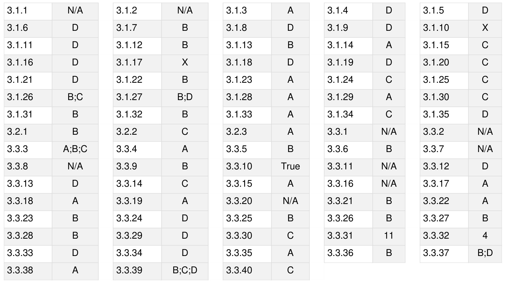

Syllabus: Sets, Relations, Functions, Partial orders, Lattices, Monoids, Groups.

Mark Distribution in Previous GATE   
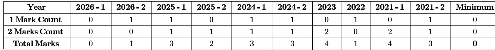

Welcome to the "Discrete Mathematics: Set Theory & Algebra" chapter, a cornerstone of computer science that underpins many advanced topics. This section is crucial for the GATE Computer Science exam, typically accounting for 8-12 marks. Questions often test your foundational understanding of definitions, properties, and the application of theorems, ranging from direct formula recall to multi-step problem-solving involving logical deduction. Mastering these concepts is not just about scoring well; it's about building the analytical and problem-solving skills essential for a career in computing.

# Topic-wise Key Concepts

# Set Theory

Set theory is the fundamental language for describing collections of objects. It provides the basis for understanding relations, functions, and many other discrete structures.

# Definition and Core Idea:

A set is a well-defined collection of distinct objects, called elements. Sets are typically denoted by capital letters, and their elements are enclosed in curly braces. The core idea is to classify and manipulate collections of items.

# Important Formulas and Results:

Cardinality: The number of elements in a set $A$ is denoted by $| A |$ .   
Power Set: The set of all subsets of $A$ , denoted $P ( A )$ . If $| A | = n$ , then $| P ( A ) | = 2 ^ { n }$ .   
Principle of Inclusion-Exclusion: For two sets: $| A \cup B | = | A | + | B | - | A \cap B |$ For three sets: $\begin{array} { r } { | A \cup B \cup C | = | A | + | B | + | C | - | A \cap B | - | A \cap C | - | B \cap C | + | A \cap B \cap C | } \end{array}$

# Key Properties and Identities:

Commutative Laws: $\begin{array} { c } { { A \cup B = B \cup A } } \\ { { A \cap B = B \cap A } } \end{array}$

Associative Laws: $\begin{array} { c } { { \circ \ ( A \cup B ) \cup C = A \cup ( B \cup C ) } } \\ { { \circ \ ( A \cap B ) \cap C = A \cap ( B \cap C ) } } \end{array}$

Distributive Laws: $\begin{array} { r } { \circ A \cup ( B \cap C ) = ( A \cup B ) \cap ( A \cup C ) } \\ { \circ A \cap ( B \cup C ) = ( A \cap B ) \cup ( A \cap C ) } \end{array}$

De Morgan's Laws: $\begin{array} { c } { { \overline { { { A \cup B } } } = \overline { { { A } } } \cap \overline { { { B } } } } } \\ { { \overline { { { A \cap B } } } = \overline { { { A } } } \cup \overline { { { B } } } } } \end{array}$

Idempotent Laws: $\begin{array} { c } { { \circ \dot { A ^ { \cup } } A = A } } \\ { { \circ \dot { A } \cap A = A } } \end{array}$

Identity Laws: 0 $A \cup \varnothing = A$ $A \cap U = A$ (where $U$ is the universal set)

Complement Laws:

$$
\begin{array} { l } { \circ A \cup \overline { { A } } = U } \\ { \circ A \cap \overline { { A } } = \emptyset } \\ { \circ \overline { { \emptyset } } = U } \\ { \circ \overline { { U } } = \emptyset } \\ { \circ \overline { { \overline { { A } } } } = A } \end{array}
$$

# Common Pitfalls & Tricky Points:

Confusing elements with sets containing those elements (e.g., $a \in \{ a \}$ but $a \neq \{ a \} )$ ).   
Misinterpreting the empty set $\varnothing$ . Remember $\varnothing$ is a subset of every set, and $P ( \emptyset ) = \{ \emptyset \}$ .   
Errors in applying De Morgan's Laws or Inclusion-Exclusion for complex scenarios.

# Problem-Solving Techniques:

. Use Venn diagrams for visualizing set operations and proving identities for up to three sets.   
. For formal proofs, use element-wise arguments (e.g., to prove $A \subseteq B$ , show that if $x \in A$ , then $\pmb { x } \in B$ ).   
Apply the Principle of Inclusion-Exclusion systematically for counting problems involving overlapping sets.

# Relations

A relation describes how elements from one set relate to elements of another set (or the same set). It's a fundamenta concept for modeling connections and dependencies.

# Definition and Core Idea:

A relation $R$ from set $A$ to set $B$ is a subset of the Cartesian product $A \times B$ . If $( a , b ) \in R$ , we say $\mathbf { \Delta } _ { a }$ is related to $b$ often written $a R b$ . The core idea is to define specific associations between elements.

# Important Formulas and Results:

Number of relations: If $| A | = m$ and $| B | = n$ , the number of relations from $A$ to $B$ is $2 ^ { m n }$ .   
Types of Relations on a Set $A$ :   
1. Reflexive: For all $a \in A$ , $( a , a ) \in R$   
2. Irreflexive: For all $a \in A$ , $( a , a ) \notin R$ .   
3. Symmetric: For all $a , b \in { \dot { A } }$ , if $( a , b ) \in R$ , then $( b , a ) \in R$ .   
4. Antisymmetric: For all $a , b \in A$ , if $( a , b ) \in R$ and $( b , a ) \in R$ , then $a = b$ .   
5. Asymmetric: For all $a , b \in A ,$ if $( a , \dot { b } ) \dot { \in { \cal R } }$ , then $( b , a ) \not \in R$ . (Implies irreflexive and antisymmetric). 6. Transitive: For all $a , b , c \in A$ , if $( a , b ) \in R$ and $( b , c ) \in R ,$ then $( a , c ) \in R$ .   
Equivalence Relation: A relation that is Reflexive, Symmetric, and Transitive.   
Equivalence Class: If $R$ is an equivalence relation on $A$ , the equivalence class of an element $a \in A$ is $[ a ] _ { R } = \{ x \in A \mid ( x , a ) \in R \}$ . Equivalence classes partition the set $A$ .   
Partial Order Relation: A relation that is Reflexive, Antisymmetric, and Transitive. (See Partial Order section for more details).

# Key Properties and Identities:

The inverse of a relation $R$ is $R ^ { - 1 } = \{ ( b , a ) \mid ( a , b ) \in R \}$ . Composition of relations: If $R _ { 1 } : A  { \bf \bar { B } }$ and $\dot { R _ { 2 } } : \dot { B }  \dot { C }$ , then $R _ { 2 } \circ R _ { 1 } = \{ ( a , c ) \mid \exists b \in B , ( a , b ) \in R _ { 1 }$ and $( b , c ) \in R _ { 2 } \}$ .

# Common Pitfalls $\alpha$ Tricky Points:

Confusing symmetric with antisymmetric. A relation can be neither, both (only if it contains only pairs $( a , a ) )$ , or one but not the other.   
Verifying transitivity requires checking all possible chains $( a , b )$ and $( b , c )$ .   
Forgetting to check reflexivity for equivalence or partial order relations.

# Problem-Solving Techniques:

. Represent relations using directed graphs (digraphs) or adjacency matrices, especially for small sets.   
. To prove a relation is of a certain type, systematically check each property by definition.   
. For equivalence relations, identify the equivalence classes to understand the partition of the set.

# Functions

Functions are special types of relations where each input maps to exactly one output. They are central to all areas of mathematics and computer science.

# Definition and Core Idea:

A function $f$ from set $A$ (domain) to set $B$ (codomain), denoted $f : A  B$ , assigns to each element $x \in A$ exactly one element $y \in B$ . The core idea is a deterministic mapping from inputs to outputs.

# Important Formulas and Results:

Range: The set of all actual output values, $\operatorname { r a n g e } ( f ) = \{ f ( x ) \mid x \in A \} . \operatorname { N o t e } \operatorname { t h a t } \operatorname { r a n g e } ( f ) \subseteq B .$ Types of Functions:   
1. Injective (One-to-one): If $f ( x _ { 1 } ) = f ( x _ { 2 } ) \implies x _ { 1 } = x _ { 2 }$ for all $x _ { 1 } , x _ { 2 } \in A$ . Each element in the codomain is mapped to by at most one element in the domain.   
2. Surjective (Onto): For every $y \in B$ , there exists at least one $x \in A$ such that $f ( x ) = y .$ The range of $f$ is equal to its codomain $B$ .   
3. Bijective (One-to-one and Onto): A function that is both injective and surjective.

Inverse Function: A function $f : A  B$ has an inverse function $f ^ { - 1 } : B \to A$ if and only if $f$ is bijective. Then $f ^ { - 1 } ( y ) = x \iff f ( x ) = y .$ .

Composition of Functions: If $f : A  B$ and $g : B  C$ , then $( g \circ f ) : A \to C$ is defined as $( g \circ f ) ( x ) = g ( f ( x ) )$ .

Number of Functions: If $| A | = m$ and $| B | = n$ : Total functions from $A$ to $B \colon n ^ { m }$ Injective functions from $A$ to $\begin{array} { r } { B \colon P ( n , m ) = \frac { n ! } { ( n - m ) ! } } \end{array}$ if $m \leq n ,$ else 0. Bijective functions from $A$ to $B \colon n !$ if $m = n$ , else 0. Surjective functions from $A$ to $B \colon n ! \cdot S ( m , n )$ , where $S ( m , n )$ is the Stirling number of the second kind. Alternatively, using Inclusion-Exclusion: $\textstyle \sum _ { k = 0 } ^ { n } ( - 1 ) ^ { k } { \binom { n } { k } } ( n - k ) ^ { m }$ .

# Key Properties and Identities:

Composition of functions is associative: $( h \circ g ) \circ f = h \circ ( g \circ f ) .$ .   
If $f$ is bijective, then $f ^ { - 1 } \circ f = I _ { A }$ and $f \circ f ^ { - 1 } = I _ { B }$ , where $I _ { A }$ and $I _ { B }$ are identity functions on sets $A$ and $B$ respectively.

# Common Pitfalls & Tricky Points:

Confusing the codomain with the range.   
Incorrectly assuming a function has an inverse when it's not bijective.   
Proving surjectivity requires showing that every element in the codomain has a preimage, not just some.

# Problem-Solving Techniques:

To prove injectivity, assume $f ( x _ { 1 } ) = f ( x _ { 2 } )$ and algebraically show $x _ { 1 } = x _ { 2 }$   
To prove surjectivity, take an arbitrary $y$ from the codomain and show there exists an $x$ in the domain such that $f ( x ) = y .$   
When counting functions, carefully identify the constraints (injective, surjective, bijective).

# Binary Operation

A binary operation combines two elements from a set to produce a third element within the same set. It's the foundation

for algebraic structures like groups and rings.

# Definition and Core Idea:

A binary operation $*$ on a set $\boldsymbol { S }$ is a function $* : S \times S \to S$ . For any $a , b \in S$ , $a * b$ is a unique element in $\boldsymbol { S }$ . The core idea is to define an internal way to combine elements.

# Important Formulas and Results:

# Properties of a Binary Operation:

1. Closure: For all $a , b \in S$ , $a * b \in S$ . (This is inherent in the definition).   
2. Associativity: For all $a , b , c \in S$ , $( a * b ) * c = a * ( b * c )$ .   
3. Commutativity: For all $a , b \in S$ , $a * b { \dot { = } } b * a$ .   
4. Identity Element: An element $e \in S$ such that for all $a \in S$ , $a * e = e * a = a$ . If it exists, it is unique.   
5. Inverse Element: For an element $a \in S$ , an element $a ^ { - 1 } \in S$ is its inverse if $a * a ^ { - 1 } = a ^ { - 1 } * a = e$ , where $e$   
is the identity element. If an identity exists, inverses are unique for each element.

# Key Properties and Identities:

. If an identity element exists, it is unique.   
If an identity element exists and the operation is associative, then inverses are unique.

# Common Pitfalls & Tricky Points:

Forgetting to check closure: the result of the operation must always be in the original set.   
Misidentifying the identity element or assuming it always exists.   
Assuming commutativity or associativity when not explicitly stated or proven.

# Problem-Solving Techniques:

To check properties, test with arbitrary elements or counterexamples.   
For finite sets, construct a Cayley table (operation table) to check properties visually.

# Group Theory

Group theory studies algebraic structures called groups, which are sets equipped with a binary operation satisfying specific axioms. It's fundamental in cryptography, coding theory, and physics.

# Definition and Core Idea:

A group $( G , * )$ is a set $G$ together with a binary operation $^ *$ that satisfies four axioms:

1. Closure: For all $a , b \in G , a * b \in G .$   
2. Associativity: For all $\quad _ { 1 } , _ { b , c \in G , ( a * b ) * c } = a * ( b * c )$ .   
3. Identity Element: There exists an element $e \in G$ such that for all $a \in G$ , $a * e = e * a = a .$ .   
4. Inverse Element: For each $a \in G$ , there exists an element $a ^ { - 1 } \in G$ such that $a * a ^ { - 1 } = a ^ { - 1 } * a = e$ .

The core idea is to formalize symmetry and transformations.

# Important Formulas and Results:

Related Structures:

Semigroup: A set with an associative binary operation. Monoid: A semigroup with an identity element. Abelian Group (Commutative Group): A group where the operation is commutative $( a * b = b * a )$ .   
Subgroup: A non-empty subset $H$ of a group $G$ is a subgroup if $H$ is itself a group under the same operation. Subgroup Test: $H$ is a subgroup of $G$ if for all $a , b \in H$ , $a * b ^ { - 1 } \in H$ .   
Cyclic Group: A group is cyclic if there exists an element $g \in G$ such that every element of $G$ can be written as   
a power of (i.e., $G = \{ g ^ { n } \mid n \in \mathbb { Z } \} )$ . $g$ is called a generator.   
Order of an element: The smallest positive integer $\scriptstyle n$ such that $a ^ { n } = e$ . If no such $\scriptstyle n$ exists, the element has infinite

order.

Lagrange's Theorem: If $G$ is a finite group and $H$ is a subgroup of $G$ , then the order of $H$ divides the order of $G$ (i.e., $| H |$ divides $| G | )$ .

# Key Properties and Identities:

The identity element is unique. Every element has a unique inverse. $\begin{array} { l } { { \bullet ( a ^ { - 1 } ) ^ { - 1 } = a } } \\ { { \bullet ( a \ast b ) ^ { - 1 } = b ^ { - 1 } \ast a ^ { - 1 } } } \end{array}$

# Common Pitfalls & Tricky Points:

Forgetting to check all four group axioms, especially the existence of inverses for every element.   
. Confusing the order of an element with the order of the group.   
Misapplying Lagrange's Theorem (it states a necessary condition for a subgroup, not a sufficient one).

# Problem-Solving Techniques:

To prove a set with an operation is a group, systematically verify all four axioms.   
To find subgroups, look for subsets that are closed under the operation and contain the identity and inverses.   
Use Lagrange's Theorem to quickly rule out potential subgroup orders.

# Identity Function

The identity function is a fundamental concept in functions and algebraic structures, acting as a neutral element for function composition.

# Definition and Core Idea:

For any set $A$ , the identity function on $A$ , denoted $I _ { A }$ or $i d _ { A }$ , is a function $I _ { A } : A \to A$ such that for every element $x \in A$ , $I _ { A } ( x ) = x$ . The core idea is a mapping that leaves elements unchanged.

# Important Formulas and Results:

If $f : A  B$ is any function, then $f \circ I _ { A } = f$ and $I _ { B } \circ f = f$ .   
If $f : A  B$ is a bijective function, then its inverse $f ^ { - 1 } : B \to A$ satisfies $f ^ { - 1 } \circ f = I _ { A }$ and $f \circ f ^ { - 1 } = I _ { B }$ .

# Key Properties and Identities:

The identity function is always bijective (one-to-one and onto).   
It serves as the identity element for the operation of function composition.

# Common Pitfalls & Tricky Points:

Confusing the identity function with a constant function (e.g., $f ( x ) = c )$ ).   
Forgetting that the identity function is specific to a set $A$ .

# Problem-Solving Techniques:

Use the properties of the identity function when simplifying compositions or proving inverse relationships.

# Lattice

Lattices are special types of partially ordered sets where every pair of elements has a unique "least upper bound" and "greatest lower bound. They are crucial in areas like logic, set theory, and computer science for modeling hierarchical structures.

# Definition and Core Idea:

A poset $( L , \preceq )$ is a lattice if for every pair of elements $a , b \in L$ , both their least upper bound (LUB or join, denoted $a \vee b )$ and greatest lower bound (GLB or meet, denoted $a \wedge b$ ) exist and are unique. The core idea is a structure where elements always have well-defined "closest" common superiors and inferiors.

# Important Formulas and Results:

Join (Supremum): $a \vee b = \operatorname* { s u p } \{ a , b \}$ .   
Meet (Infimum): $a \wedge b = \operatorname* { i n f } \{ a , b \}$ .   
Types of Lattices: Distributive Lattice: A lattice where the distributive laws hold: $a \wedge ( b \vee c ) = ( a \wedge b ) \vee ( a \wedge c )$ $a \lor ( b \land c ) = ( a \lor b ) \land ( a \lor c )$ Complemented Lattice: A bounded lattice (has a greatest element and a least element ) where every element has a complement $a ^ { \prime }$ such that $a \wedge a ^ { \prime } = 0$ and $\boldsymbol { a } \lor \boldsymbol { a } ^ { \prime } = 1$ . Boolean Algebra: A distributive and complemented lattice.

# Key Properties and Identities:

Idempotent Laws: $a \wedge a = a$ , $a \vee a = a$   
Commutative Laws: $a \wedge b = b \wedge a , a \vee b = b \vee a$   
Associative Laws: $( a \wedge b ) \wedge c = a \wedge ( b \wedge c ) , ( a \vee b ) \vee c = a \vee ( b \vee c )$   
Absorption Laws: $a \wedge ( a \vee b ) = a , a \vee ( a \wedge b ) = a$   
Duality Principle: If a statement is true for a lattice, its dual (exchanging $\wedge$ with ,  with $\succeq$ , with ) is also true.

# Common Pitfalls & Tricky Points:

. Not every poset is a lattice. A poset fails to be a lattice if any pair of elements lacks a unique LUB or GLB. Distinguishing between maximal/minimal elements and greatest/least elements in a poset (a lattice always has a greatest and least element if it's bounded).

# Problem-Solving Techniques:

. Draw Hasse diagrams to visually identify LUBs and GLBs for all pairs.   
To check for distributivity, look for sublattices isomorphic to $N _ { 5 }$ (pentagon lattice) or $M _ { 3 }$ (diamond lattice) in the Hasse diagram (they are non-distributive).

# Mathematical Induction

Mathematical Induction is a powerful proof technique used to establish the truth of a statement for all natural numbers (or a subset thereof). It's essential for proving properties of algorithms, data structures, and number theory results.

# Definition and Core Idea:

The Principle of Mathematical Induction states that to prove a statement $P ( n )$ is true for all integers $n \geq n _ { 0 }$

1. Base Case: Show that $P ( n _ { 0 } )$ is true.   
2. Inductive Hypothesis: Assume that $P ( k )$ is true for some arbitrary integer $k \geq n _ { 0 }$ .   
3. Inductive Step: Show that $P ( k + 1 )$ is true, using the inductive hypothesis.

The core idea is like a chain reaction: if the first domino falls, and falling dominoes always knock over the next one, then all dominoes will fall.

# Important Formulas and Results:

Principle of Strong Induction:

1. Base Case: Show that $P ( n _ { 0 } )$ is true.   
2. Inductive Hypothesis: Assume that $P ( j )$ is true for all integers $j$ such that $n _ { 0 } \leq j \leq k _ { \mathrm { { i } } }$ , for some arbitrary integer $k \geq n _ { 0 }$ .   
3. Inductive Step: Show that $P ( k + 1 )$ is true, using the inductive hypothesis.

# Key Properties and Identities:

Both standard and strong induction are equivalent in power; strong induction is often more convenient for proofs where $P ( k + 1 )$ depends on more than just $P ( k )$ .

# Common Pitfalls & Tricky Points:

Incorrect base case: The statement must hold for the starting value.   
Assuming what needs to be proven in the inductive step. The inductive hypothesis must be explicitly used.   
Not clearly stating the inductive hypothesis or the inductive step.   
Algebraic errors during the inductive step.

# Problem-Solving Techniques:

Clearly label each step: Base Case, Inductive Hypothesis, Inductive Step.   
In the inductive step, try to manipulate the expression for $P ( k + 1 )$ to isolate an instance of $P ( k )$ that can be substituted using the hypothesis.   
For inequalities, sometimes it's easier to prove $P ( k + 1 ) - P ( k ) \geq 0$ or similar.

# Number Theory

Number theory is the study of integers and their properties, including divisibility, prime numbers, and modular arithmetic.   
It has direct applications in cryptography, error correction codes, and algorithm analysis.

# Definition and Core Idea:

Number theory explores the relationships and properties of integers. The core idea is to understand the structure and behavior of numbers under various operations.

# Important Formulas and Results:

Divisibility: $a | b$ means $a$ divides $b$ (i.e., $b = k a$ for some integer $k$ ).   
Division Algorithm: For integers $a$ (dividend) and $d$ (divisor) with $d > 0$ , there exist unique integers $q$ (quotient)   
and $r$ (remainder) such that $a = d q + r$ , where $0 \leq r < d$ .   
Greatest Common Divisor (GCD): $\operatorname* { g c d } ( a , b )$ is the largest integer that divides both $a$ and $b$ . Euclidean Algorithm: An efficient method to compute GCD. $\operatorname* { g c d } ( a , b ) = \operatorname* { g c d } ( b , a$ (mod . Bézout's Identity: For any integers $a , b$ there exist integers $x , y$ such that $a x + b y = \operatorname* { g c d } ( a , b )$ .

Least Common Multiple (LCM): $\textstyle \operatorname { l c m } ( a , b )$ is the smallest positive integer divisible by both $a$ and $b$ . Relationship: $\operatorname* { g c d } ( a , b ) \cdot \operatorname { l c m } ( a , b ) { \dot { = } } | { \dot { a } } b |$ .

Prime Numbers: A positive integer greater than 1 with exactly two positive divisors: 1 and itself. Fundamental Theorem of Arithmetic: Every integer greater than 1 can be uniquely represented as a product of prime numbers (up to the order of factors).

Modular Arithmetic: $a \equiv b$ (mod $\textmu m$ means $m | ( a - b )$ . This is an equivalence relation. Properties: ${ \begin{array} { r } { \bullet \  \operatorname { f } \ a \equiv b \ ( { \bmod { \ m } } ) \ a \cap \operatorname { d } c \equiv d \ ( { \bmod { \ m } } ) , \operatorname { t h e n } a + c \equiv \operatorname { d } } \\ { \bullet \ ( a \ \operatorname { ( m o d \ m ) } + b \ ( { \bmod { \ m } } ) ) \ ( { \bmod { \ m } } ) = ( a + b ) \ ( { \bmod { \ m } } ) } \\ { \bullet \ ( a \ ( { \bmod { \ m } } ) \cdot b \ ( { \bmod { \ m } } ) ) \ ( { \bmod { \ m } } ) = ( a \cdot b ) \ ( { \bmod { \ m } } ) } \end{array} }$ $a + c \equiv b + d$ $( { \bmod { m } } )$ (mod $\mathbf { \nabla } m$ and $a c \equiv b d { \mathrm { ~ ( m o d ~ } } m { \mathrm { ) } } .$ . m)

Fermat's Little Theorem: If $p$ is a prime number and $a$ is an integer not divisible by $p$ , then $a ^ { p - 1 } \equiv 1 { \pmod { p } }$ Also, $a ^ { p } \equiv a { \mathrm { ~ ( m o d ~ } } p { \mathrm { ) } }$ for any integer $a$ .

Euler's Totient Function $\phi ( n )$ : Counts the number of positive integers up to $\scriptstyle n$ that are relatively prime to $n$ . If $n = p _ { 1 } ^ { k _ { 1 } } p _ { 2 } ^ { k _ { 2 } } \ldots p _ { r } ^ { k _ { r } }$ is the prime factorization of $\scriptstyle n$ , then $\begin{array} { r } { \phi ( n ) = n \left( 1 - \frac { 1 } { p _ { 1 } } \right) \left( 1 - \frac { 1 } { p _ { 2 } } \right) \ldots \left( 1 - \frac { 1 } { p _ { r } } \right) } \end{array}$ . If $p$ is prime, $\phi ( p ) = p - 1$ .

Euler's Theorem: If $n$ is a positive integer and $a$ is an integer relatively prime to $n$ (i.e., $\operatorname* { g c d } ( a , n ) = 1 \qquad $ ), then $a ^ { \phi ( n ) } \equiv 1 { \mathrm { ~ ( m o d ~ } } n ) .$

# Key Properties and Identities:

Congruence modulo $m$ is an equivalence relation.

The set of integers modulo $n$ , $\mathbb { Z } _ { n } = \{ 0 , 1 , . . . , n - 1 \}$ , forms a ring under addition and multiplication modulo . If $\scriptstyle n$ is prime, $\mathbb { Z } _ { n }$ is a field.

# Common Pitfalls & Tricky Points:

Mistakes in applying modular arithmetic, especially with negative numbers or division. Remember division is not always well-defined in modular arithmetic (requires modular inverse).   
Confusing prime numbers with relatively prime numbers.   
Incorrectly calculating $\phi ( n )$ for composite numbers.

# Problem-Solving Techniques:

Use the Euclidean algorithm for GCD and extended Euclidean algorithm for modular inverses.   
Simplify large powers in modular arithmetic using Fermat's Little Theorem or Euler's Theorem.   
For divisibility problems, use properties of congruences.

# Onto (Surjective Functions)

Onto functions, also known as surjective functions, ensure that every element in the codomain is "hit" by at least one element from the domain. This property is vital for understanding mappings that cover their entire target set.

# Definition and Core Idea:

A function $f : A  B$ is said to be onto (or surjective) if for every element $y \in B$ (the codomain), there exists at least one element $x \in A$ (the domain) such that $f ( x ) = y .$ . The core idea is that the function's range completely fills its codomain.

# Important Formulas and Results:

A function $f : A  B$ is surjective if and only if $\left( f \right) = B$ .   
If $A$ and are finite sets, and $f : A  B$ is surjective, then $\left| A \right| \geq \left| B \right|$ .   
The number of surjective functions from a set of size $m$ to a set of size $n$ is given by $\textstyle \sum _ { k = 0 } ^ { n } ( - 1 ) ^ { k } { \binom { n } { k } } ( n - k ) ^ { m }$ .

# Key Properties and Identities:

If $f$ and $g$ are surjective, then $g \circ f$ is surjective.   
If $g \circ f$ is surjective, then $g$ must be surjective (but $f$ need not be).

# Common Pitfalls & Tricky Points:

Confusing surjectivity with injectivity. An onto function doesn't require unique preimages. Failing to demonstrate a preimage for an arbitrary element in the codomain, instead just showing some elements have preimages.

# Problem-Solving Techniques:

To prove a function $f : A  B$ is surjective, pick an arbitrary $y \in B$ , then show how to construct an $x \in A$ such that $f ( x ) = y .$ This often involves solving $y = f ( x )$ for $x$ .   
For finite sets, compare the cardinalities of the domain and codomain. If $\vert A \vert < \vert B \vert$ , no surjective function from $A$ to $B$ can exist.

# Partial Order

Partial order relations define a sense of relative order among elements in a set, but not necessarily for every pair. They are crucial for modeling hierarchies, dependencies, and precedence in computer science (e.g., task scheduling, class inheritance).

# Definition and Core Idea:

A relation $R$ on a set $A$ is a partial order relation if it is reflexive, antisymmetric, and transitive. A set $A$ with a partial order relation $\preceq$ is called a partially ordered set (poset), denoted $( A , { \preceq } )$ . The core idea is to establish an ordering where some elements might be incomparable.

# Important Formulas and Results:

Properties of Partial Order:

1. Reflexive: For all $a \in A , a \preceq a .$   
2. Antisymmetric: For all $a , b \in A$ , if $a \preceq b$ and $b \preceq a .$ , then $a = b$ .   
3. Transitive: For all $a , b , c \in A$ , if $a \preceq b$ and $b \preceq c .$ , then $a \preceq c$ .   
Comparability: Two elements $a , b \in A$ are comparable if $a \preceq b$ or $b \preceq a$ . Otherwise, they are incomparable.   
Total Order (Linear Order): A partial order where every pair of elements is comparable.   
Hasse Diagram: A graphical representation of a finite poset, where: Elements are represented by nodes. An edge goes upwards from $a$ to $b$ if $a \preceq b$ and there is no $c$ such that $ { \boldsymbol { a } } \preceq \boldsymbol { c } \preceq \boldsymbol { b }$ (i.e., $b$ covers ). Reflexive loops and transitive edges are omitted.

Elements in a Poset:

Maximal Element: An element $a$ such that there is no $b \in A$ with $a \preceq b$ and $a \neq b$ .   
。 Minimal Element: An element $a$ such that there is no $b \in A$ with $b \preceq a$ and $a \neq b .$ .   
Greatest Element (Maximum): An element $g$ such that for all $x \in A , x \preceq g$ . (If it exists, it is unique).   
Least Element (Minimum): An element $l$ such that for all $x \in A , l \preceq x$ . (If it exists, it is unique).   
Upper Bound: For a subset $S \subseteq A$ , an element $u \in A$ is an upper bound of $\boldsymbol { S }$ if $\begin{array} { r } { \pmb { s } \preceq \pmb { u } } \end{array}$ for all $\pmb { s } \in S$ .   
。 Lower Bound: For a subset $S \subseteq A$ , an element $l \in A$ is a lower bound of $\boldsymbol { S }$ if $l \preceq s$ for all $s \in S$ .   
Least Upper Bound (LUB Supremum): The least element among all upper bounds of $\boldsymbol { S }$ , denoted $\operatorname* { s u p } ( S )$ .   
Greatest Lower Bound (GLB Infimum): The greatest element among all lower bounds of $\boldsymbol { S }$ , denoted $\operatorname { i n f } ( S )$

# Key Properties and Identities:

A greatest element is always a maximal element, but a maximal element is not necessarily the greatest. Similarly for least and minimal elements.   
A finite poset always has at least one maximal and one minimal element.

# Common Pitfalls & Tricky Points:

Confusing maximal/minimal elements with greatest/least elements. A poset can have multiple maximal elements but at most one greatest element.   
Errors in drawing Hasse diagrams, especially omitting necessary edges or including redundant ones.   
Incorrectly identifying LUBs or GLBs for subsets.

# Problem-Solving Techniques:

To verify a partial order, systematically check reflexivity, antisymmetry, and transitivity. Draw Hasse diagrams to visualize the order and identify special elements (maximal, minimal, greatest, least, LUB, GLB). For LUB/GLB, first find all upper/lower bounds, then identify the least/greatest among them.

# Polynomials

Polynomials are fundamental algebraic expressions used extensively in computer science for modeling, interpolation, error correction, and algorithm analysis (e.g., complexity). In discrete mathematics, they often appear in contexts like finite fields and generating functions.

# Definition and Core Idea:

A polynomial in a variable $x$ is an expression of the form $P ( x ) = a _ { n } x ^ { n } + a _ { n - 1 } x ^ { n - 1 } + \cdots + a _ { 1 } x + a _ { 0 }$ , where $a _ { i }$ are coefficients (often real or complex numbers, but can be from finite fields in discrete math) and $n$ is a non-negative integer called the degree of the polynomial (if $a _ { n } \neq 0$ ). The core idea is to represent relationships using sums of powers of a variable.

# Important Formulas and Results:

· Degree: The highest power of $x$ with a non-zero coefficient.   
. Root (or Zero): A value $c$ such that $P ( c ) = 0$ .   
Polynomial Division Algorithm: For polynomials $P ( x )$ (dividend) and $D ( x )$ (divisor) with $D ( x ) \neq 0$ , there exist unique polynomials $Q ( x )$ (quotient) and $R ( x )$ (remainder) such that $P ( x ) { \stackrel { . . } { = } } D ( x ) Q ( x ) + R { \dot { ( x ) } }$ , where $\deg ( R ( x ) ) < \deg ( D ( x ) )$ or $R ( x ) = 0$ .   
. Remainder Theorem: If a polynomial $P ( x )$ is divided by $( x - c )$ , the remainder is $P ( c )$ .   
· Factor Theorem: $( x - c )$ is a factor of F $P ( x )$ if and only if $P ( c ) = 0$ (i.e., $c$ is a root of $P ( x ) )$ .   
Fundamental Theorem of Algebra: Every non -constant polynomial with complex coefficients has at least one complex root. Consequently, a polynomial of degree $\scriptstyle n$ has exactly $n$ complex roots (counting multiplicity). Vieta's Formulas: Relate the coefficients of a polynomial to the sums and products of its roots. For a quadratic $a x ^ { 2 } + b x + c = 0$ with roots $r _ { 1 } , r _ { 2 } ; r _ { 1 } + r _ { 2 } = - b / a , r _ { 1 } r _ { 2 } = c / a .$ .

# Key Properties and Identities:

A polynomial of degree $n$ has at most $n$ distinct roots.   
Polynomials form a ring under addition and multiplication.

# Common Pitfalls & Tricky Points:

Algebraic errors in polynomial division or evaluating polynomials.   
Forgetting to count root multiplicities when applying the Fundamental Theorem of Algebra.   
Not considering the domain of coefficients (e.g., real vs. complex vs. finite field).

# Problem-Solving Techniques:

： Use synthetic division for quick division by $( x - c )$ .   
Apply the Remainder and Factor Theorems to find roots or factors efficiently.   
For problems involving roots, Vieta's formulas can often provide shortcuts.

# Quick Formula Reference

Set Theory: |P(A)| = 2lAl $| A \cup B | = | A | + | B | - | A \cap B |$ T De Morgan's Laws: ${ \overline { { A \cup B } } } = { \overline { { A } } } \cap { \overline { { B } } } , { \overline { { A \cap B } } } = { \overline { { A } } } \cup { \overline { { B } } }$

Relations: Number of relations from $A$ to $B { : 2 ^ { | A | | B | } }$ Equivalence Relation: Reflexive, Symmetric, Transitive. 。 Partial Order: Reflexive, Antisymmetric, Transitive.

Functions (from $| A | = m$ to $| B | = n )$ : Total functions: $n ^ { m }$ Injective functions: $\begin{array} { r } { P ( n , m ) = \frac { n ! } { ( n - m ) ! } } \end{array}$ (if $m \leq n )$ Bijective functions: $\boldsymbol { n ! }$ (if $m = n$ ) Surjective functions: $\textstyle \sum _ { k = 0 } ^ { n } ( - 1 ) ^ { k } { \binom { n } { k } } ( n - k ) ^ { m }$ C Identity function $I _ { A } ( x ) = x$

# Group Theory:

Group Axioms: Closure, Associativity, Identity, Inverse. Lagrange's Theorem: $| H |$ divides $| G |$ for subgroup $H$ of group $G$

Lattice: 。 Poset where every pair has unique LUB (join ) and GLB (meet $\Lambda )$ . Distributive Lattice: $a \wedge ( b \vee c ) = ( a \wedge b ) \vee ( a \wedge c )$ , etc.

Mathematical Induction: 。 Base Case $P ( n _ { 0 } )$ , Inductive Hypothesis $P ( k )$ , Inductive Step $P ( k + 1 )$

Number Theory: C Division Algorithm: $a = d q + r , 0 \leq r < d$ 。 $\operatorname* { g c d } ( a , b ) \cdot \operatorname { l c m } ( a , b ) = | a b |$ Fermat's Little Theorem: $a ^ { p - 1 } \equiv 1$ (mod $p$ (for prime $p , p \dag a )$

0 Euler's Totient Function: $\begin{array} { r } { \phi ( n ) = n \prod _ { p \mid n , p } } \end{array}$ prime $\scriptstyle \left( 1 - { \frac { 1 } { p } } \right)$ Euler's Theorem: $a ^ { \phi ( n ) } \equiv 1$ (mod (for $\operatorname* { g c d } ( a , n ) = 1 )$

# Polynomials:

Remainder Theorem: $P ( x )$ $: ) \ ( { \mathrm { m o d } } \ ( x - c ) ) = P ( c )$ 0 Factor Theorem: $( x - c )$ is a factor $\iff P ( c ) = 0$

# Important Tips for GATE

1. Master Definitions and Properties: Many GATE questions directly test your understanding of definitions (e.g., what makes a relation symmetric?) and properties (e.g., De Morgan's laws). Memorize them thoroughly.   
2. Practice with Hasse Diagrams: For partial orders and lattices, drawing Hasse diagrams is crucial. Practice identifying maximal/minimal elements, greatest/least elements, and LUB/GLB from diagrams.   
3. Systematic Verification: When asked to check if a structure is a group, a relation is an equivalence relation, or a function is bijective, systematically go through each axiom/property. Don't skip steps or assume properties.   
4. Number Theory Shortcuts: Familiarize yourself with the Euclidean algorithm for GCD, modular arithmetic properties, and theorems like Fermat's Little Theorem and Euler's Theorem. These are vital for efficiently solving problems involving large numbers or powers.   
5. Inclusion-Exclusion Principle: This principle is frequently tested for counting problems in set theory and functions (especially surjective functions). Practice applying it for 2, 3, and general cases.   
6. Mathematical Induction Structure: Always clearly state your base case, inductive hypothesis, and inductive step. Ensure your inductive step explicitly uses the inductive hypothesis to avoid circular reasoning.   
7. Cardinality vs. Countability: Understand the difference between finite, countably infinite, and uncountable sets. Be familiar with standard examples (e.g., $\mathbb { N , Z , Q }$ are countable; $\mathbb { R }$ ， $P ( \mathbb { N } )$ are uncountable) and Cantor's diagonalization argument.   
8. Watch for "If and Only If": Pay close attention to conditions that are "if and only if" (iff) as they imply equivalence and are often key to proving properties or identifying specific structures.

The number of possible commutative binary operations that can be defined on a set of $\scriptstyle n$ elements (for a given $n$ ) is

On the set $N$ of non-negative integers, the binary operation is associative and non-commutative.

gate1994 set-theory&algebra normal group-theory binary-operation fill-in-the-blanks

Consider the set $\{ a , b , c \}$ with binary operators $+$ and $^ *$ defined as follows:

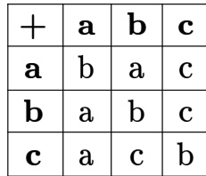

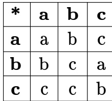

For example, $a + c = c , c + a = a , c * b = c$ and $b * c = a$ .

Given the following set of equations:

$$
\begin{array} { c } { { \bullet \ ( a * x ) + ( a * y ) = c } } \\ { { \bullet \ ( b * x ) + ( c * y ) = c } } \end{array}
$$

The number of solution(s) (i.e., pair(s) $( x , y )$ that satisfy the equations) is

A. B. C. D.

gatecse-2003 set-theory&algebra normal binary- operation

A logical binary relation $\odot$ , is defined as follows:

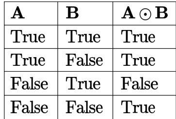

Let $\sim$ be the unary negation (NOT) operator, with higher precedence then $\odot$ . Which one of the following is equivalent to $A \land B$ ?

A. $( \sim A \odot B )$ $\begin{array} { l } { { \mathsf { B . } \sim ( A { \odot } \sim B ) } } \\ { { \mathsf { D . } \sim ( \sim A { \odot } B ) } } \end{array}$   
C. $\sim ( \sim A \odot \sim B )$

gatecse-2006 set-theory&algebra binary-operation propositional-logic mathematical-logic

# Answer key☟

A binary operation $\oplus$ on a set of integers is defined a $\scriptstyle { \mathfrak { x } } \oplus y = x ^ { 2 } + y ^ { 2 }$ . Which one of the following statements is TRUE about $\oplus$ ?

A. Commutative but not associative B. Both commutative and associative C. Associative but not commutative D. Neither commutative nor associative

gatecse-2013 set-theory&algebra easy binary- operation

The binary operator $\neq$ is defined by the following truth table.

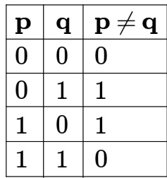

Which one of the following is true about the binary operator $\neq ?$

A. Both commutative and associative B. Commutative but not associative C. Not commutative but associative D. Neither commutative nor associative

gatecse-2015-set1 set-theory&algebra easy binar y-operation boolean-algebra

# Answer key☟

$$
\bullet \left( S _ { 2 } \right) Q \# R = \left( R \# Q \right)
$$

Which are the following is/are true for the Boolean variables $P , Q$ and $R ?$

A. Only $S _ { 1 }$ is true B. Only $S _ { 2 }$ is true C. Both $S _ { 1 }$ and $S _ { 2 }$ are true D. Neither $S _ { 1 }$ nor $S _ { 2 }$ are true

gatecse-2015-set3 set-theory&algebra binary-operation normal

For the set $N$ of natural numbers and a binary operation $f : N \times N \to N ;$ ， an element $z \in N$ is called an identity for $f$ if $f ( a , z ) = a = f ( z , a )$ ， for all $a \in N$ . Which of the following binary operations have an identity?

I. $f ( x , y ) = x + y - 3$   
II. $f ( x , y ) = \operatorname* { m a x } ( x , y )$   
III. $f ( x , y ) = x ^ { y }$

A. and II only B. II and III only C. and III only D. None of these

gateit-2006 set-theory&algebra easy binary-operation

Every subset of a countable set is countable.   
State whether the above statement is true or false with reason.

gate1994 set-theory&algebra normal set-theory countable-uncountable-set true-false

Let $N$ be the set of natural numbers. Consider the following sets,

$P$ Set of Rational numbers (positive and negative) $\boldsymbol { Q } : \mathsf { S e t }$ of functions from $\{ 0 , 1 \}$ to $N$ $R$ ： Set of functions from $N$ to $\{ 0 , 1 \}$ $\boldsymbol { S }$ Set of finite subsets of $N$

Which of the above sets are countable?

A. $Q$ and $\boldsymbol { s }$ only B. $P$ and $\boldsymbol { S }$ only C. $P$ and only D. $^ { P , Q }$ and $\boldsymbol { s }$ only gatecse-2018 set-theory&algebra countable-uncountable-set normal two-marks

Find the number of single valued functions from set $A$ to another set $B$ given that the cardinalities of the sets $A$ and $B$ are $m$ and $n$ respectively.

gate1989 descriptive functions set-theory&algebra

Let $A$ and $B$ be sets with cardinalities $\scriptstyle m$ and $\scriptstyle n$ respectively. The number of one-one mappings from $A$ to $B$ , when $m < n$ , is

A. $m ^ { n }$ B. n Pm C. $^ m C _ { n }$ D. nCm E. $^ m P _ { n }$

gate1993 set-theory&algebra functions easy

# 4.3.5 Functions: GATE CSE 1996 Question: 1.3

Suppose $X$ and $Y$ are sets and $| X |$ and $| Y |$ are their respective cardinality. It is given that there are exactly functions from $X$ to $Y$ . From this one can conclude that

A. $| X | = 1 , | Y | = 9 7$ B. $| X | = 9 7 , | Y | = 1$ C. $| X | = 9 \dot { 7 } , | \dot { Y } | = 9 7$ D. None of the above

gate1996 set-theory&algebra functions normal

Answer key☟

# 4.3.6 Functions: GATE CSE 1996 Question: 2.1

Let $R$ denote the set of real numbers. Let $f : R \times R \to R \times R$ be a bijective function defined by $f ( x , y ) = ( x + y , x - y )$ . The inverse function of $f$ is given by

A. $\begin{array} { r } { f ^ { - 1 } ( x , y ) = \left( \frac { 1 } { x + y } , \frac { 1 } { x - y } \right) } \end{array}$ B $\cdot \ f ^ { - 1 } ( x , y ) = ( x - y , x + y )$ C. $\textstyle f ^ { - 1 } ( x , y ) = { \bigl ( } { \frac { x + y } { 2 } } , { \frac { x - y } { 2 } } { \bigr ) }$ $f ^ { - 1 } ( x , y ) = \left[ 2 \left( x - y \right) , 2 \left( x + y \right) \right]$

gate1996 set-theory&algebra functions normal

# Answer key☟

# 4.3.7 Functions: GATE CSE 1997 Question: 13

Let $F$ be the set of one-to-one functions from the set $\{ 1 , 2 , \ldots , n \}$ to the set $\{ 1 , 2 , \ldots , m \}$ where $m \ge n \ge 1$ .

a. How many functions are members of $F ?$ b. How many functions $f$ in $F$ satisfy the property $f ( i ) = 1$ for some $i , 1 \le i \le n ?$ c. How many functions $f$ in $F$ satisfy the property $f ( i ) < f ( j )$ for all $i , j ~ 1 \le i \le j \le n ?$

The number of functions from an $m$ element set to an $n$ element set is

A. $m + n$ B. C. nm D. m\*n

gate1998 set-theory&algebra combinatory functions easy

# Answer key☟

Let $f : A  B$ a function, and let E and F be subsets of $A$ . Consider the following statements about images.

$$
\begin{array} { r } { \cdot S _ { 1 } : f ( E \cup F ) = f ( E ) \cup f ( F ) } \\ { \cdot S _ { 2 } : f ( E \cap F ) = f ( E ) \cap f ( F ) } \end{array}
$$

Which of the following is true about S1 and S2?

A. Only $S _ { 1 }$ is correct B. Only $S _ { 2 }$ is correct C. Both $S _ { 1 }$ and $S _ { 2 }$ are correct D. None of $S _ { 1 }$ and $S _ { 2 }$ is correct

gatecse-2001 set-theory&algebra functions normal

# Answer key☟

# 4.3.10 Functions: GATE CSE 2001 Question:

Consider the function $h : N \times N \to N$ so that $h ( a , b ) = ( 2 a + 1 ) 2 ^ { b } - 1$ , where $N = \{ 0 , 1 , 2 , 3 , . . . \}$ is the set of natural numbers.

a. Prove that the function $h$ is an injection (one-one). b. Prove that it is also a Surjection (onto)

gatecse-2001 functions set-theory&algebra normal descriptive

Let $f : A  B$ be an injective (one-to-one) function. Define $g : 2 ^ { A } \to 2 ^ { B }$ as:   
$g ( C ) = \{ f ( x ) \mid x \in C \}$ , for all subsets $C$ of $A$ .   
Define $h : 2 ^ { B } \to 2 ^ { A }$ as: $h ( D ) = \{ x \mid x \in A , f ( x ) \in D \}$ , for all subsets $D$ of $B$ . Which of the following statements is always true? A. $g ( h ( D ) ) \subseteq D$ $\begin{array} { l } { { \mathsf { B . } } ~ g ( h ( D ) ) \supseteq D } \\ { { \mathsf { D . } } ~ g ( h ( D ) ) \cap ( B - D ) \neq \phi } \end{array}$   
C. $g ( h ( D ) ) \cap D = \phi$

gatecse-2003 set-theory&algebra functions difficult

# Answer key☟

Let $f : B \to C$ and $g : A  B$ be two functions and $\boldsymbol { | \mathrm { e t } h = f o g }$ . Given that $h$ is an onto function which one of the following is TRUE?

A. $f$ and $g$ should both be onto B. $f$ should be onto but $g$ need not to functions be onto   
C. should be onto but $f$ need not be D. both $f$ and $g$ need not be onto onto

gatecse-2005 set-theory&algebra functions normal

# 4.3.14 Functions: GATE CSE 2006 Question: 2

Let $X , Y , Z$ be sets of sizes $x , y$ and $z$ respectively. Let $W { = } X \times Y$ and $E$ be the set of all subsets of $W$ . The number of functions from Zt to $E$ is

A. z2y B. z ×2y C. z2x+y D. $2 ^ { x y z }$

gatecse-2006 set-theory&algebra normal functions

# 4.3.15 Functions: GATE CSE 2006 Question: 25

Let $S = \{ 1 , 2 , 3 , \dotsc , m \} , m > 3$ · Let $X _ { 1 } , . . . , X _ { n }$ be subsets of $\boldsymbol { S }$ each of size Define a function $f$ from $\boldsymbol { S }$ to the set of natural numbers as, $f ( i )$ is the number of sets $X _ { j }$ that contain the element $i$ · That is $f ( i ) = | \{ j \mid i \in X _ { j } \} |$ then $\textstyle \sum _ { i = 1 } ^ { m } f ( i )$ is:

A. B. C. 2m+1 D. 2n+1

gatecse-2006 set-theory&algebra normal functions

# 4.3.16 Functions: GATE CSE 2007 Question: 3

What is the maximum number of different Boolean functions involving $n$ Boolean variables?

A. $n ^ { 2 }$ B. $2 ^ { n }$ C. $2 ^ { 2 ^ { n } }$ D. $2 ^ { n ^ { 2 } }$

gatecse-2007 combinatory functions normal

# 4.3.17 Functions: GATE CSE 2012 Question: 37

How many onto (or surjective) functions are there from an $n$ -element $( n \geq 2 )$ set to a -element set?

A. $2 ^ { n }$ B. $2 ^ { n } { - } 1$ C. $2 ^ { n } { - 2 }$ D. $2 ( 2 ^ { n } { - } 2 )$

gatecse-2012 set-theory&algebra functions normal

Let $X$ and $Y$ be finite sets and $f : X \to Y$ be a function. Which one of the following statements is TRUE?

A. For any subsets $A$ and $B$ of $X$ ， $| f ( A \cup B ) | = | f ( A ) | + | f ( B ) |$ B. For any subsets $A$ and $B$ of $X$ ， $f ( A \cap B ) = f ( A ) \cap f ( B )$ C. For any subsets $A$ and $B$ of $X$ ， $| f ( A \cap B ) | = \operatorname* { m i n } \{ | f ( A ) | , | f ( B ) | \}$ D. For any subsets $\boldsymbol { S }$ and $T$ of $Y$ ， $f ^ { - 1 } ( S \cap T ) = f ^ { - 1 } ( S ) \cap f ^ { - 1 } ( T )$

Consider the set of all functions $f : \{ 0 , 1 , \ldots , 2 0 1 4 \}  \{ 0 , 1 , \ldots , 2 0 1 4 \}$ such that $f \left( f \left( i \right) \right) = i$ , for all $0 \leq i \leq 2 0 1 4 .$ . Consider the following statements:

$P$ . For each such function it must be the case that for every $f ( i ) = i$ .   
$Q$ . For each such function it must be the case that for some $_ i$ ， $f ( i ) = i$ .   
$R$ . Each function must be onto.

Which one of the following is CORRECT?

A. $P , Q$ and $R$ are true B. Only $Q$ and $R$ are true C. Only $P$ and $Q$ are true D. Only $R$ is true

gatecse-2014-set3 set-theory&algebra functions normal

If $g ( x ) = 1 - x$ and $\textstyle h ( x ) = { \frac { x } { x - 1 } }$ then $\textstyle { \frac { g ( h ( x ) ) } { h ( g ( x ) ) } }$ is:

A. $\frac { h ( x ) } { g ( x ) }$ B. C. $\textstyle { \frac { g ( x ) } { h ( x ) } }$ $\frac { x } { ( 1 - x ) ^ { 2 } }$

gatecse-2015-set1 set-theory&algebra functions normal

The number of onto functions (surjective functions) from set $X = \{ 1 , 2 , 3 , 4 \}$ to set $Y = \{ a , b , c \}$ is

Let $X$ and $Y$ denote the sets containing and  distinct objects respectively and denote the set of all possible functions defined from $X$ to $Y$ . Let $f$ be randomly chosen from $F$ . The probability of $f$ being oneto-one is

gatecse-2015-set2 set-theory&algebra functions normal numerical-answers

Let $R = \{ i \mid \exists j : f ( j ) = i \}$ be the set of distinct values that $f$ takes. The maximum possible size of $R$ is

Consider the following sets, where $n \geq 2$ :

: Set of all $n \times n$ matrices with entries from the set $\{ a , b , c \}$ $S _ { 2 }$ : Set of all functions from the set $\{ 0 , 1 , 2 , . . . , n ^ { 2 } - \mathrm { { 1 } } \}$ to the set $\{ 0 , 1 , 2 \}$

Which of the following choice(s) is/are correct?

A. There does not exist a bijection from $S _ { 1 }$ to $S _ { 2 }$ B. There exists a surjection from $S _ { 1 }$ to $S _ { 2 }$ C. There exists a bijection from $S _ { 1 }$ to $S _ { 2 }$ D. There does not exist an injection from $S _ { 1 }$ to $S _ { 2 }$

L e t $f : A  B$ be an onto (or surjective) function, where $A$ and $B$ are nonempty sets. Define an equivalence relation $\sim$ on the set $A$ as

$$
a _ { 1 } \sim a _ { 2 } \mathrm { i f } f \left( a _ { 1 } \right) = f \left( a _ { 2 } \right) ,
$$

where $a _ { 1 } , a _ { 2 } \in A$ . Let ${ \mathcal { E } } = \{ [ x ] : x \in A \}$ be the set of all the equivalence classes under $\sim$ . Define a new mapping $F : { \mathcal { E } } \to B$ as

$$
F ( [ x ] ) = f ( x ) , \quad { \mathrm { f o r ~ a l l ~ t h e ~ e q u i v a l e n c e ~ c l a s s e s ~ } } [ x ] { \mathrm { ~ i n ~ } } \mathcal { E } .
$$

Which of the following statements is/are TRUE?

A. $F$ is NOT well-defined. B. $F$ is an onto (or surjective) function.   
C. $F$ is a one-to-one (or injective) D. $F$ is a bijective function. function.

Let $f$ be a function from a set $A$ to a set $B$ , $g$ a function from $B$ to $\boldsymbol { C }$ , and $h$ a function from $A$ to $\boldsymbol { C }$ , such that $h ( a ) = g ( f ( a ) )$ for all $a \in A$ · Which of the following statements is always true for all such functions $f$ and ?

A. $g$ is onto $\implies h$ is onto B. $h$ is onto $\implies f$ is onto C. $h$ is onto $\implies g$ is onto D. $h$ is onto $\implies f$ and $g$ are onto

gateit-2005 set-theory&algebra functions normal

Given a boolean function $f ( x _ { 1 } , x _ { 2 } , \ldots , x _ { n } )$ ， which of the following equations is NOT true?

$$
\begin{array} { r l } & { f ( x _ { 1 } , x _ { 2 } , \ldots , x _ { n } ) = x _ { 1 } ^ { \prime } f ( x _ { 1 } , x _ { 2 } , \ldots , x _ { n } ) + x _ { 1 } f ( x _ { 1 } , x _ { 2 } , \ldots , x _ { n } ) } \\ & { f ( x _ { 1 } , x _ { 2 } , \ldots , x _ { n } ) = x _ { 2 } f ( x _ { 1 } , x _ { 2 } , \ldots , x _ { n } ) + x _ { 2 } ^ { \prime } f ( x _ { 1 } , x _ { 2 } , \ldots , x _ { n } ) } \\ & { f ( x _ { 1 } , x _ { 2 } , \ldots , x _ { n } ) = x _ { n } ^ { \prime } f ( x _ { 1 } , x _ { 2 } , \ldots , 0 ) + x _ { n } f ( x _ { 1 } , x _ { 2 } , \ldots , 1 ) } \\ & { f ( x _ { 1 } , x _ { 2 } , \ldots , x _ { n } ) = f ( 0 , x _ { 2 } , \ldots , x _ { n } ) + f ( 1 , x _ { 2 } , \ldots , x _ { n } ) } \end{array}
$$

Show that if $G$ is a group such that $( a * b ) ^ { 2 } = a ^ { 2 } * b ^ { 2 }$ for all $^ { a , b }$ belonging to $G$ , then $G$ is an abelian.

gate1988 descriptive group-theory

# Answer key☟

Match the pairs in the following questions:

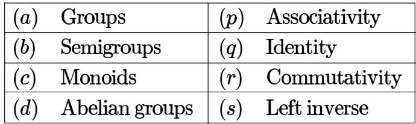

gate1990 match-the-following set-theory&algebra group-theory easy