Some group $( G , o )$ is known to be abelian. Then, which one of the following is true for $G ?$

A. g=g-1 for every $g \in G$ B. $g = g ^ { 2 }$ for every $g \in G$ C. $( g o h ) ^ { 2 } = g ^ { 2 } o h ^ { 2 }$ for every $g , h \in G$ D. $G$ is of finite order

gate1994 set-theory&algebra group-theory normal

# Answer key ☟

Let $A$ be the set of all non-singular matrices over real number and let $^ *$ be the matrix multiplication operation. Then

A. $A$ is closed under $^ *$ but $\langle A , * \rangle$ is not a semigroup.   
B. $\langle A , * \rangle$ is a semigroup but not a monoid.   
C. $\langle A , * \rangle$ is a monoid but not a group.   
D. $\langle A , * \rangle$ is a a group but not an abelian group.

gate1995 set-theory&algebra group-theory

# Answer key☟

Let $G _ { 1 }$ and $G _ { 2 }$ be subgroups of a group .

A. Show that $G _ { 1 } \cap G _ { 2 }$ is also a subgroup of .   
B. Is $G _ { 1 } \cup G _ { 2 }$ always a subgroup of $G ?$ .

gate1995 set-theory&algebra group-theory normal descriptive proof

# Answer key☟

Which of the following statements is FALSE?

A. The set of rational numbers is an abelian group under addition B. The set of integers in an abelian group under addition C. The set of rational numbers form an abelian group under multiplication D. The set of real numbers excluding zero is an abelian group under multiplication

gate1996 set-theory&algebra group-theory normal

# Answer key☟

# 4.4.9 Group Theory: GATE CSE 1996 Question: 2.4

Which one of the following is false?

A. The set of all bijective functions on a finite set forms a group under function composition   
B. The set $\{ 1 , 2 , \ldots p - 1 \}$ forms a group under multiplication mod , where $p$ is a prime number   
C. The set of all strings over a finite alphabet forms a group under concatenation   
D. A subset $ { \boldsymbol { S } } \neq \emptyset$ of $G$ is a subgroup of the group $\langle G , * \rangle$ if and only if for any pair of elements $a , b \in S , a * b ^ { - 1 } \in S$

Let $( Z , * )$ be an algebraic structure where $Z$ is the set of integers and the operation $^ *$ is defined by $n * { \dot { m } } = \operatorname* { m a x } ( n , m )$ . Which of the following statements is true for $( Z , * ) ?$

A. $^ { ( Z , * ) }$ is a monoid B. $^ { ( Z , * ) }$ i an Abelian group C. $( Z , * )$ is a group D. None of the above gate1997 set-theory&algebra group-theory normal

Let $( A , * )$ be a semigroup, Furthermore, for every $a$ and $b$ in $A$ , if $a \neq b$ then $a * b \neq b * a$ .

a. Show that for every $a$ in $A$ , $a * a = a$ b. Show that for every $a$ , $b$ in $A$ , $a * b * a = a$ c. Show that for every $a , b , c$ in $A$ , $a * b * c = a * c$ gate1998 set-theory&algebra group-theory descriptive

Let $G$ be a finite group and $H$ be a subgroup of $G$ . For $a \in G$ , define $a H = \left\{ a h \mid h \in H \right\}$ .

a. Show that $\left| a H \right| = \left| b H \right|$ · b. Show that for every pair of elements $a , b \in G$ , either $a H = b H$ or $a H$ and $b H$ are disjoint. c. Use the above to argue that the order of $H$ must divide the order of $G$

gate1999 set-theory&algebra group-theory descriptive proof

Let $S = \{ 0 , 1 , 2 , 3 , 4 , 5 , 6 , 7 \}$ and $\otimes$ denote multiplication modulo  that is, ${ \boldsymbol { x } } \otimes { \boldsymbol { y } } = ( { \boldsymbol { x } } { \boldsymbol { y } } )$ mod 8 a. Prove that $( \{ 0 , 1 \} , \otimes )$ is not a group. b. Write three distinct groups $( G , \otimes )$ where $G \subset S$ and $G$ has elements.

gatecse-2000 set-theory&algebra descriptive group-theory

# Answer key☟

# 4.4.14 Group Theory: GATE CSE 2002 Question: 1.6

Which of the following is true?

A. The set of all rational negative numbers forms a group under multiplication.   
B. The set of all non-singular matrices forms a group under multiplication.   
C. The set of all matrices forms a group under multiplication.   
D. Both B and C are true.

gatecse-2002 set-theory&algebra group-theory normal

A. does not form a group   
B. forms a non-commutative group   
C. does not have a right identity element   
D. forms a group if the empty string is removed from $\Sigma ^ { * }$

gatecse-2003 set-theory&algebra group-theory normal

The following is the incomplete operation table of a element group.

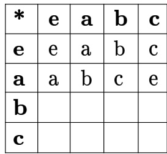

The last row of the table is

A. B. cbae C. cbea D. ceab gatecse-2004 set-theory&algebra group-theory normal

The set $\{ 1 , 2 , 4 , 7 , 8 , 1 1 , 1 3 , 1 4 \}$ is a group under multiplication modulo . The inverses of and  are respectively:

A. and B. and C. and D. and

gatecse-2005 set-theory&algebra normal group-theory

# Answer key☟

Consider the set $H$ of all $3 * 3$ matrices of the type

$$
\left( { \begin{array} { l l l } { a } & { f } & { e } \\ { 0 } & { b } & { d } \\ { 0 } & { 0 } & { c } \end{array} } \right)
$$

where $\scriptstyle a , b , c , d , e$ and $f$ are real numbers and $a b c \neq 0$ · Under the matrix multiplication operation, the set $H$ is:

A. a group B. a monoid but not a group C. a semi group but not a monoid D. neither a group nor a semi group

gatecse-2005 set-theory&algebra group-theory normal

How many different non-isomorphic Abelian groups of order 4 are there?

A. B. C. D.

gatecse-2007 group-theory normal

Which one of the following is NOT necessarily a property of a Group?

A. Commutativity B. Associativity C. Existence of inverse for every D. Existence of identity element

gatecse-2009 set-theory&algebra easy group-theory

For the composition table of a cyclic group shown below:

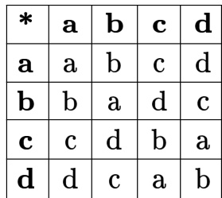

Which one of the following choices is correct?

A. $^ { a , b }$ are generators B. $^ { \mathbf { \alpha } _ { b , c } }$ are generators C. $^ { c , d }$ are generators D. $^ { d , a }$ are generators

gatecse-2009 set-theory&algebra normal group-theory

# 4.4.23 Group Theory: GATE CSE 2010 Question: 4

Consider the set $S = \{ 1 , \omega , \omega ^ { 2 } \}$ , where $\omega$ and are cube roots of unity. If $^ *$ denotes the multiplication operation, the structure $( S , * )$ forms

A. A Group B. A Ring C. An integral domain D. A field

where $e$ is the identity element. The maximum number of elements in such a group is

# Let $G$ be a finite group on  elements. The size of a largest possible proper subgroup of $G$ is

gatecse-2018 group-theory numerical-answers set-theory&algebra one-mark

Let $G$ be an arbitrary group. Consider the following relations on $G$ :

· $R _ { 1 } : \forall a , b \in G$ ， $a R _ { 1 } b$ if and only if $\exists g \in G$ such that $a = g ^ { - 1 } b g$ · $R _ { 2 } : \forall a , b \in G$ ， $a R _ { 2 } b$ if and only if $a = b ^ { - 1 }$

Which of the above is/are equivalence relation/relations?

A. $R _ { 1 }$ and $R _ { 2 }$ B. $R _ { 1 }$ only C. $R _ { 2 }$ only D. Neither $R _ { 1 }$ nor $R _ { 2 }$ gatecse-2019 engineering-mathematics discrete-mathematics set-theory&algebra group-theory one-mark

Let $G$ be a group of elements. Then the largest possible size of a subgroup of $G$ other than $G$ itself is

gatecse-2020 numerical-answers group-theory easy one-mark

Let $G$ be a group of order , and $H$ be a subgroup of $G$ such that $1 < | H | < 6$ . Which one of the following options is correct?

A. Both $G$ and $H$ are always cyclic B. $G$ may not be cyclic, but $H$ is always cyclic C. $G$ is always cyclic, but $H$ may not D. Both $G$ and $H$ may not be cyclic be cyclic

gatecse-2021-set1 set-theory&algebra group-theory two-marks

Which of the following statements is/are for a group $\boldsymbol { G ? }$

A. If for all $x , y \in G$ ， $( x y ) ^ { 2 } = x ^ { 2 } y ^ { 2 }$ ， then $G$ is commutative.   
B. If for all $x \in G$ G, $x ^ { 2 } = 1$ then $G$ is commutative. Here,  is the identity element of $G$ · C. If the order of $G$ is then $G$ is commutative.   
D. If $G$ is commutative, then a subgroup of $G$ need not be commutative.

gatecse-2022 set-theory&algebra group-theory multiple-selects one-mark

$$
A \Delta B = ( A - B ) \cup ( B - A ) .
$$

Let $H = ( 2 ^ { X } , \Delta )$ . Which of the following statements about $H$ is/are correct?

A. $H$ is a group.   
B. Every element in $H$ has an inverse, but $H$ is NOT a group.   
C. For every $A \in 2 ^ { X }$ ， the inverse of $A$ is the complement of $A$ .   
D. For every $A \in 2 ^ { X }$ ， the inverse of $A$ is $A$ .

gatecse-2023 set-theory&algebra group-theory multiple-selects two-marks

Consider the operators $\diamond$ and  defined by $a \diamond b = a + 2 b , a \square b = a b .$ , for positive integers. Which of the following statements is/are TRUE?

A. Operator $\diamond$ obeys the associative law B. Operator $\sqsubseteq$ obeys the associative law C. Operator $\diamond$ over the operator $\sqsubseteq$ obeys the distributive law D. Operator $\sqsubseteq$ over the operator $\diamond$ obeys the distributive law gatecse-2024-set1 multiple-selects set-theory&algebra group-theory two-marks

Let $Z _ { n }$ be the group of integers $\{ 0 , 1 , 2 , \ldots , n - 1 \}$ with addition modulo $\scriptstyle n$ as the group operation. The number of elements in the group ${ \tilde { Z } } _ { 2 } \times Z _ { 3 } \times Z _ { 4 }$ that are their own inverses is

gatecse-2024-set2 numerical-answers set-theory&algebra group-theory two-marks

$A = \{ 0 , 1 , 2 , 3 , . . . \}$ is the set of non-negative integers. Let $F$ be the set of functions from $A$ to itself. For any two functions, $f _ { 1 } , f _ { 2 } \in \mathbb { F }$ , we define

$$
\left( f _ { 1 } \odot f _ { 2 } \right) ( n ) = f _ { 1 } ( n ) + f _ { 2 } ( n )
$$

for every number $\scriptstyle n$ in $A$ . Which of the following is/are CORRECT about the mathematical structure $( \mathrm { F } , \odot )$ ?

A. $( \mathrm { F } , \odot )$ is an Abelian group.   
B. $( \mathrm { F } , \odot )$ is an Abelian monoid.   
C. $( F , \odot )$ is a non-Abelian group.   
D. $( \mathrm { F } , \odot )$ is a non-Abelian monoid.

gatecse2025-set1 set-theory&algebra identify-function group-theory multiple-selects easy two-marks

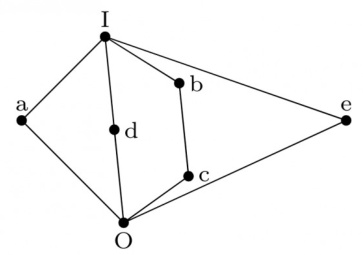

Show that the elements of the lattice $( N , \triangleleft )$ , where $N$ is the set of positive intergers and $a \leq b$ if and only if $a$ divides $b$ , satisfy the distributive property.

gate1990 descriptive set-theory&algebra lattice

Consider the set of integers $\{ 1 , 2 , 3 , 4 , 6 , 8 , 1 2 , 2 4 \}$ together with the two binary operations LCM (lowest common multiple) and GCD (greatest common divisor). Which of the following algebraic structures does this represent?

A. group B. ring C. field D. lattice

gate1992 set-theory&algebra partial-order lattice normal

The Hasse diagrams of all the lattices with up to four elements are (write all the relevant Hasse diagrams)

gate1994 set-theory&algebra lattice normal fill-in-the-blanks

In the lattice defined by the Hasse diagram given in following figure, how many complements does the element ‘ ’ have?

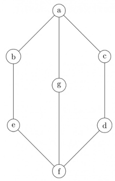

A. B. C. D.

$S = \{ ( 1 , 2 ) , ( 2 , 1 ) \}$ is binary relation on set $A = \{ 1 , 2 , 3 \}$ . Is it irreflexive? Add the minimum number o ordered pairs to $\mathsf { S }$ to make it an equivalence relation. Give the modified $\boldsymbol { S }$ .

Let $S = \{ a , b \}$ and let $\boxed { \ d S } ( S )$ be the powerset of $\boldsymbol { S }$ . Consider the binary relation $\subseteq$ (set inclusion)' on $\bigstar \bigstar$ . Draw the Hasse diagram corresponding to the lattice $( \bigcirc ( S ) , \subseteq )$

gatecse-2002 set-theory&algebra normal lattice descriptive

The following is the Hasse diagram of the poset $[ \{ a , b , c , d , e \} ,$ 人

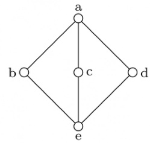

The poset is

A. not a lattice B. a lattice but not a distributive lattice C. a distributive lattice but not a D. a Boolean algebra Boolean algebra

gatecse-2005 set-theory&algebra lattice normal

Suppose $L = \{ p , q , r , s , t \}$ is a lattice represented by the following Hasse diagram:

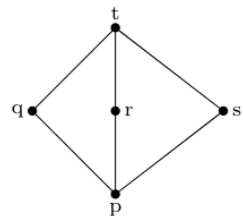

For any $x , y \in L$ , not necessarily distinct , $x \vee y$ and $x \wedge y$ are join and meet of $x , y$ , respectively. Let $L ^ { 3 } = \{ ( x , y , z ) : x , y , z \in L \}$ be the set of all ordered triplets of the elements of $L$ . Let ${ p } _ { r }$ be the probability that an element $( x , y , z ) \in L ^ { 3 }$ chosen equiprobably satisfies $x \vee ( y \wedge z ) = ( x \vee y ) \wedge ( x \vee z )$ . Then

A. $p _ { r } = 0$ $\begin{array} { l } { { \mathsf { B . } } { \mathsf { \Pi } } { p _ { r } = 1 } } \\ { { \mathsf { D . } } { \frac { 1 } { 5 } } { < p _ { r } < 1 } } \end{array}$   
C. $\textstyle 0 < p _ { r } \leq { \frac { 1 } { 5 } }$

# Answer key☟

# 4.6.9 Lattice: GATE CSE 2017 Set 2 Question: 21

# ordering

Consider the set $X = \{ a , b , c , d , e \}$ under partial $R = \{ ( a , a ) , ( a , b ) , ( a , c ) , ( a , d ) , ( a , e ) , ( \bar { b } , b ) , ( b , c ) , ( \bar { b } , e ) , ( c , c ) , ( c , e ) , ( d , d ) , ( d , e ) , ( e , e ) \}$ The Hasse diagram of the partial order $( X , R )$ is shown below.

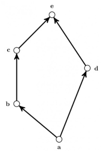

The minimum number of ordered pairs that need to be added to $R$ to make $( X , R )$ a lattice is

Consider the following Hasse diagrams.

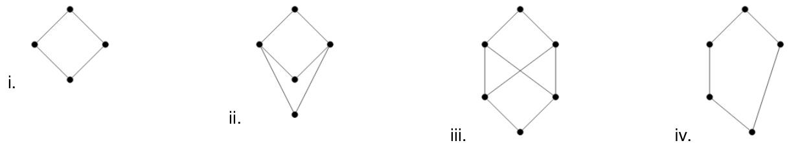

Which all of the above represent a lattice?

A. (i) and (iv) only B. (ii) and (iii) only C. (iii) only D. (i), (ii) and (iv) only

gateit-2008 set-theory&algebra lattice normal

# Prove using mathematica induction for $n \geq 5 , 2 ^ { n } > n ^ { 2 }$

gate1995 set-theory&algebra proof mathematical-induction descriptive

Consider the following sequence:

$s _ { 1 } = s _ { 2 } = 1$ and $s _ { i } = 1 + \operatorname* { m i n } \left( s _ { i - 1 } , s _ { i - 2 } \right) \mathrm { f o r } i > 2$ .   
Prove by induction on $\scriptstyle n$ that $\begin{array} { l } { s _ { n } = \left\lceil \frac { n } { 2 } \right\rceil } \end{array}$ .

gatecse-2000 set-theory&algebra mathematical-induction descriptive

# The number of distinct positive integral factors of  is

gatecse-2014-set2 set-theory&algebra easy numerical-answers number-theory

The number of divisors of  is gatecse-2015-set2 set-theory&algebra number- theory easy numerical-answers

Let $n = p ^ { 2 } q .$ , where $p$ and $q$ are distinct prime numbers. How many numbers m satisfy $1 \leq m \leq n$ and $( m , n ) = 1 !$ Note that $( m , n )$ is the greatest common divisor of $m$ and $n$ .

A. $p ( q - 1 )$ $\begin{array} { l } { { { \mathsf { B . ~ } } p q } } \\ { { { \mathsf { D . ~ } } p ( p - 1 ) ( q - 1 ) } } \end{array}$   
C. $\left( p ^ { 2 } - 1 \right) \left( q - 1 \right)$

gateit-2005 set-theory&algebra normal number-theory

The minimum positive integer $p$ such that $3 ^ { p }$ $( \mathbf { m o d 1 7 } ) = 1$ is

A. B. C. D.

gateit-2007 set-theory&algebra normal number-theory

The exponent of 11 in the prime factorization of is

A. B. C. 29 D.

gateit-2008 set-theory&algebra normal number-theory

4.8.7 Number Theory: GATE1991-15,a

Show that the product of the least common multiple and the greatest common divisor of two positive integers $a$ and $b$ is ${ a \times b }$ .

gate1991 set-theory&algebra normal number-theory proof descriptive

If the longest chain in a partial order is of length $n$ , then the partial order can be written as a of antichains.

gate1991 set-theory&algebra partial-order normal fill-in-the-blanks

The less-than relation, $<$ on real number is

A. a partial ordering since it is asymmetric and reflexive B. a partial ordering since it is antisymmetric and reflexive C. not a partial ordering because it is not asymmetric and not reflexive D. not a partial ordering because it is not antisymmetric and reflexive E. none of the above

gate1993 set-theory&algebra partial-order easy

# 4.10.3 Partial Order: GATE CSE 1996 Question: 1.2

Let $X = \{ 2 , 3 , 6 , 1 2 , 2 4 \}$ , Let $\leq$ be the partial order defined by $X \leq Y$ if $x$ divides $y$ . Number of edges in the Hasse diagram of $( X , \leq )$ is

A. 3 B. 4 C. 9 D. None of the above

gate1996 set-theory&algebra partial-order normal

# 4.10.4 Partial Order: GATE CSE 1997 Question: 6.1

A partial order $\leq$ is defined on the set $S = \{ x , a _ { 1 } , a _ { 2 } , . . . , a _ { n } , y \}$ as $x \leq _ { i } a _ { i }$ for all $\textit { i }$ and $a _ { i } \leq y$ for all $_ i$ where $n \geq 1$ . The number of total orders on the set S which contain the partial order $\leq$ is

A. B. n+2 C. n D.

gate1997 set-theory&algebra partial-order normal

Suppose $A = \{ a , b , c , d \}$ and $\Pi _ { 1 }$ is the following partition of A $\Pi _ { 1 } = \{ \{ a , b , c \} \{ d \} \}$

a. List the ordered pairs of the equivalence relations induced by $\Pi _ { 1 }$ .   
b. Draw the graph of the above equivalence relation.   
c. Let $\Pi _ { 2 } = \left\{ \left\{ a \right\} , \left\{ b \right\} , \left\{ c \right\} , \left\{ d \right\} \right\}$ $\Pi _ { 3 } = \{ \{ a , b , c , d \} \}$ and $\Pi _ { 4 } = \{ \{ a , b \} , \{ c , d \} \}$ Draw a Poset diagram of the poset, $\langle \{ \Pi _ { 1 } , \Pi _ { 2 } , \Pi _ { 3 } , \Pi _ { 4 } \}$ refines ).

Let $( S , \leq )$ be a partial order with two minimal elements a and b, and a maximum element c. Let P: $\mathsf { S } \to$ {True, False} be a predicate defined on S. Suppose that $\mathsf { P } ( \mathsf { a } ) = \mathsf { T r u e }$ , ${ \mathsf { P } } ( { \mathsf { b } } ) =$ False and $\mathsf { P } ( \mathsf { x } ) \Longrightarrow \mathsf { P } ( \mathsf { y } )$ for a l l $x , y \in S$ satisfying $x \leq y$ , where $\implies$ stands for logical implication. Which of the following statements CANNOT be true?

A. $\mathsf { P } ( \mathsf { x } ) =$ True for all $\mathsf { x } \in \mathsf { S }$ such that $x \neq b$ B. $\mathsf { P } ( \mathsf { x } ) =$ False for all $\mathsf { x } \in \mathsf { S }$ such that ${ \sf x } \neq { \sf a }$ and $\mathsf { x } \neq \mathsf { c }$ C. $\mathsf { P } ( \mathsf { x } ) =$ False for all $\mathsf { x } \in \mathsf { S }$ such that ${ \sf b } \leq { \sf x }$ and $\mathsf { x } \neq \mathsf { c }$ D. $\mathsf { P } ( \mathsf { x } ) =$ False for all $\mathsf { x } \in \mathsf { S }$ such that a $\leq \mathsf { x }$ and ${ \mathsf { b } } \leq { \mathsf { x } }$ gatecse-2003 set-theory&algebra partial-order normal propositional-logic

The inclusion of which of the following sets into   
$S = \left\{ \left\{ 1 , 2 \right\} , \left\{ 1 , 2 , 3 \right\} , \left\{ 1 , 3 , 5 \right\} , \left\{ 1 , 2 , 4 \right\} , \left\{ 1 , 2 , 3 , 4 , 5 \right\} \right\}$   
is necessary and sufficient to make $\boldsymbol { S }$ a complete lattice under the partial order defined by set containment?

CA. $\begin{array} { r l } { { } } & { { } \mathsf { B . ~ } \{ 1 \} , \{ 2 , 3 \} } \\ { { } } & { { } \mathsf { D . ~ } \{ 1 \} , \{ 1 , 3 \} , \{ 1 , 2 , 3 , 4 \} , \{ 1 , 2 , 3 , 5 \} } \end{array}$

# Answer key☟

Consider the set $S = \{ a , b , c , d \}$ Consider the following partitions $\pi _ { 1 } , \pi _ { 2 } , \pi _ { 3 } , \pi _ { 4 }$ on   
$S : \pi _ { 1 } = \{ { \overline { { a b c d } } } \}$ ， $\pi _ { 2 } = \{ \overline { { a b } } , \overline { { c d } } \}$ $\pi _ { 3 } = \{ \overline { { a b c } } , \overline { { d } } \}$ ， $\pi _ { 4 } = \{ \bar { a } , \bar { b } , \bar { c } , \bar { d } \}$ .   
Let $\prec \mathsf { b e }$ the partial order on the set of partitions $S ^ { \prime } = \{ \pi _ { 1 } , \pi _ { 2 } , \pi _ { 3 } , \pi _ { 4 } \}$ defined as follows: $\pi _ { i } \prec \pi _ { j }$ if and only if $\pi _ { i }$ refines $\pi _ { j }$ . The poset diagram for $( S ^ { \prime } , \prec )$ is:

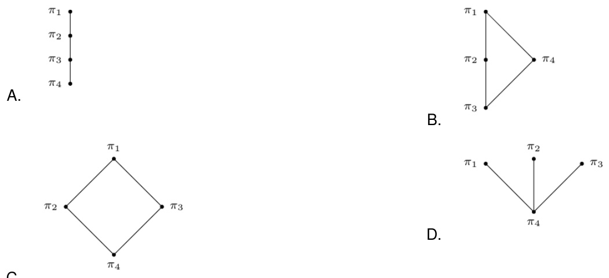

C.

gatecse-2007 set-theory&algebra normal partial-order descriptive

# Answer key☟

A partial order $P$ is defined on the set of natural numbers as follows. Here $\textstyle { \frac { x } { y } }$ denotes integer division.

i. $( 0 , 0 ) \in { \cal P }$ · ii. $( a , b ) \in P$ if and only $( a \% 1 0 ) \leq ( b \% 1 0 )$ and $\textstyle { \big ( } { \frac { a } { 1 0 } } , { \frac { b } { 1 0 } } { \big ) } \in P .$

Consider the following ordered pairs:

i. (101,22) ii. (22,101) iii. (145,265) iv. (0,153)

Which of these ordered pairs of natural numbers are contained in $P$ ?

A. (i) and (iii) B. (ii) and (iv) C. (i) and (iv) D. (iii) and (iv)

gateit-2007 set-theory&algebra partial-order normal

A polynomial $p ( { \boldsymbol { x } } )$ is such that $p ( 0 ) = 5 , p ( 1 ) = 4 , p ( 2 ) = 9$ and $p ( 3 ) = 2 0$ . The minimum degree should have is

A. B. C. D. .4

gate1997 set-theory&algebra normal polynomials

# Answer key☟

A polynomial $p ( { \boldsymbol { x } } )$ satisfies the following:

$$
\begin{array} { l } { { \displaystyle \bullet p ( 1 ) = p ( 3 ) = p ( 5 ) = 1 } } \\ { { \displaystyle \bullet p ( 2 ) = p ( 4 ) = - 1 } } \end{array}
$$

The minimum degree of such a polynomial is

A. B. C. D. 4

gatecse-2000 set-theory&algebra normal polynomials

# 4.11.3 Polynomials: GATE CSE 2014 Set 2 Question: 5

A non-zero polynomial $f ( x )$ of degree 3 has roots at $x = 1$ , $x = 2$ and $x = 3$ . Which one of the following must be TRUE?

A. $f ( 0 ) f ( 4 ) < 0$ $\begin{array} { l } { { \mathsf { B . } \ f ( 0 ) f ( 4 ) > 0 } } \\ { { \mathsf { D . } \ f ( 0 ) + f ( 4 ) < 0 } } \end{array}$   
C. $f ( 0 ) + { \dot { f } } ( 4 ) > 0$

gatecse-2014-set2 set-theory&algebra polynomials normal

# Answer key☟

equation in the same base $b$ are $x = 5$ and $x = 6$ . Then $b =$

State whether the following statements are TRUE or FALSE:

The union of two equivalence relations is also an equivalence relation.

gate1987 set-theory&algebra relations true-false

# How many binary relations are there on a set $A$ with $\scriptstyle n$ elements?

gate1987 set-theory&algebra relations descriptive

How many true inclusion relations are there of the form $A \subseteq B$ , where $A$ and $B$ are subsets of a set $\boldsymbol { S }$ with elements?

gate1987 set-theory&algebra relations descriptive

The transitive closure of the relation $\{ ( 1 , 2 ) , ( 2 , 3 ) , ( 3 , 4 ) , ( 5 , 4 ) \}$ on the set $\{ 1 , 2 , 3 , 4 , 5 \}$ is

gate1989 set-theory&algebra relations descriptive

Let $\boldsymbol { S }$ be the set of all integers and let $n > 1$ be a fixed integer. Define for $a , b \in S , a R b$ iff $a - b$ is a multiple of $\scriptstyle n$ . Show that $R$ is an equivalence relation and find its equivalence classes for $n = 5$ .

gate1992 set-theory&algebra normal relations descriptive

Amongst the properties {reflexivity, symmetry, anti-symmetry, transitivity} the relation $R = \{ ( x , y ) \in N ^ { 2 } | x \neq y \}$ satisfies

gate1994 set-theory&algebra normal relations fill-in-the-blanks

Let $R$ be a non-empty relation on a collection of sets defined by ${ } _ { A } R _ { B }$ if and only if $A \cap B = \phi$ . Then, (pick the true statement)

A. $A$ is reflexive and transitive B. $R$ is symmetric and not transitive C. $R$ is an equivalence relation D. $R$ is not reflexive and not symmetric

gate1996 set-theory&algebra relations normal

# 4.12.9 Relations: GATE CSE 1996 Question: 8

Let $F$ be the collection of all functions $f : \{ 1 , 2 , 3 \}  \{ 1 , 2 , 3 \}$ . If $f$ and $g \in F$ , define an equivalence relation $\sim$ by $f \sim g$ if and only if $f ( 3 ) = g ( 3 )$ .

a. Find the number of equivalence classes defined by $\sim$ .   
b. Find the number of elements in each equivalence class.

gate1996 set-theory&algebra relations functions normal descriptive

Let $R$ be a reflexive and transitive relation on a set $A$ . Define a new relation $E$ on $A$ as

$$
E = \{ ( a , b ) \mid ( a , b ) \in R { \mathrm { a n d } } ( b , a ) \in R \}
$$

Prove that $E$ is an equivalence relation on $A$

Define a relation $\leq$ on the equivalence classes of $E$ as $E _ { 1 } \leq E _ { 2 }$ if such that $a \in E _ { 1 } , b \in E _ { 2 }$ and $( a , b ) \in R$ . Prove that $\leq$ is a partial order.

gate1997 set-theory&algebra relations normal proof descriptive

The number of equivalence relations of the set $\{ 1 , 2 , 3 , 4 \}$ is

A. B. C. D. 4

gate1997 set-theory&algebra relations normal group-theory

# 4.12.12 Relations: GATE CSE 1998 Question: 1.6

Suppose $A$ is a finite set with $n$ elements. The number of elements in the largest equivalence relation of A is

A. n B. $n ^ { 2 }$ C. 1 D. $n + 1$

gate1998 set-theory&algebra relations easy

Answer key☟

A. Both assertions are true   
B. Assertions (i) is true but assertions (ii) is not true C. Assertions (ii) is true but assertions (i) is not true D. Neither (i) nor (ii) is true

Prove by induction that the expression for the number of diagonals in a polygon of $n$ sides is $\frac { n ( n - 3 ) } { 2 }$

gate1998 set-theory&algebra descriptive relations

Let $R$ be a binary relation on $A = \{ a , b , c , d , e , f , g , h \}$ represented by the following two componen digraph. Find the smallest integers $m$ and $n$ such that $m < n$ and $R ^ { m } = R ^ { n }$ .

gate1998 descriptive set-theory&algebra relations

The binary relation $R = \left\{ ( 1 , 1 ) , ( 2 , 1 ) , ( 2 , 2 ) , ( 2 , 3 ) , ( 2 , 4 ) , ( 3 , 1 ) , ( 3 , 2 ) , ( 3 , 3 ) , ( 3 , 4 ) \right\}$ on the se $A = \{ 1 , 2 , 3 , 4 \}$ is

A. reflexive, symmetric and transitive B. neither reflexive, nor irreflexive but transitive C. irreflexive, symmetric and transitive D. irreflexive and antisymmetric

gate1998 set-theory&algebra easy relations

The number of binary relations on a set with $n$ elements is:

A. $n ^ { 2 }$ B. $2 ^ { n }$ C. D. None of the above

gate1999 set-theory&algebra relations combinatory easy a. Mr. X claims the following:

If a relation R is both symmetric and transitive, then R is reflexive. For this, Mr. X offers the following proof: “From xRy, using symmetry we get yRx. Now because R is transitive xRy and yRx together imply xRx. Therefore, R is reflexive”.

b. Give an example of a relation R which is symmetric and transitive but not reflexive.

gate1999 set-theory&algebra relations normal descriptive

A relation $R$ is defined on the set of integers as  iff $( x + y )$ is even. Which of the following statements is true?

A. $R$ is not an equivalence relation B. $R$ is an equivalence relation having 1 equivalence class C. $R$ is an equivalence relation having 2 equivalence classes D. $R$ is an equivalence relation having equivalence classes

Consider the following relations:

$R _ { 1 } \left( a , b \right)$ iff $( a + b )$ is even over the set of integers $R _ { 2 } \left( a , b \right)$ iff $( a + b )$ is odd over the set of integers $R _ { 3 } \left( a , b \right)$ iff $a . b > 0$ over the set of non-zero rational numbers $R _ { 4 } \left( a , b \right)$ iff $| a - b | \leq 2$ over the set of natural numbers

Which of the following statements is correct?

A. $R _ { 1 }$ and $R _ { 2 }$ are equivalence relations, $R _ { 3 }$ and $R _ { 4 }$ are not B. $R _ { 1 }$ and $R _ { 3 }$ are equivalence relations, $R _ { 2 }$ and $R _ { 4 }$ are not C. $R _ { 1 }$ and $R _ { 4 }$ are equivalence relations, $R _ { 2 }$ and $R _ { 3 }$ are not D. $R _ { 1 } , R _ { 2 } , R _ { 3 }$ and $R _ { 4 }$ all are equivalence relations

gatecse-2001 set-theory&algebra normal relations

# C. Which is larger for all possible $n , N _ { r }$ or $N _ { f }$

Consider the binary relation: $S = \{ ( x , y ) \mid y = x + 1 { \mathrm { a n d } } x , y \in \{ 0 , 1 , 2 \} \}$ The reflexive transitive closure is $\boldsymbol { S }$ is

$$
\begin{array} { l } { \{ ( x , y ) \mid y > x \mathrm { a n d } x , y \in \{ 0 , 1 , 2 \} \} } \\ { \{ ( x , y ) \mid y \geq x \mathrm { a n d } x , y \in \{ 0 , 1 , 2 \} \} } \\ { \{ ( x , y ) \mid y < x \mathrm { a n d } x , y \in \{ 0 , 1 , 2 \} \} } \\ { \{ ( x , y ) \mid y \leq x \mathrm { a n d } x , y \in \{ 0 , 1 , 2 \} \} } \end{array}
$$

gatecse-2004 set-theory&algebra easy relations

Let $R$ and dSb $\boldsymbol { S }$ be any two equivalence relations on a non-empty set $A$ . Which one of the following statements is TRUE?

A. $R \cup S$ , $R \cap S$ are both equivalence relations B. $R \cup S$ is an equivalence relation C. $R \cap S$ is an equivalence relation D. Neither $R \cup S$ nor $R \cap S$ are equivalence relations gatecse-2005 set-theory&algebra normal relations

The time complexity of computing the transitive closure of a binary relation on a set of $\boldsymbol { n }$ elements is known to be:

A. $O ( n )$ B. O(n log n) ${ \mathsf { C . ~ } } O \left( n ^ { \frac { 3 } { 2 } } \right)$ D. 0(n3)

gatecse-2005 set-theory&algebra normal relations

Answer key☟

A relation $R$ is defined on ordered pairs of integers as follows:

Then $R$ is:

A. Neither a Partial Order nor an Equivalence Relation   
B. A Partial Order but not a Total Order   
C. A total Order   
D. An Equivalence Relation

Let $\boldsymbol { S }$ be a set of $n$ elements. The number of ordered pairs in the largest and the smallest equivalence relations on $\boldsymbol { S }$ are:

A. $\scriptstyle n$ and $\scriptstyle n$ B. $n ^ { 2 }$ and $\scriptstyle n$ C. $n ^ { 2 }$ and D. $\scriptstyle n$ and

gatecse-2007 set-theory&algebra normal relations

# 4.12.29 Relations: GATE CSE 2009 Question: 4

Consider the binary relation $R = \{ ( x , y ) , ( x , z ) , ( z , x ) , ( z , y ) \}$ on the set $\{ x , y , z \}$ . Which one of the following is TRUE?

A. $R$ is symmetric but NOT B. $R$ is NOT symmetric but antisymmetric antisymmetric C. is both symmetric and D. $R$ is neither symmetric nor antisymmetric antisymmetric

gatecse-2009 set-theory&algebra easy relations

Answer key☟

# 4.12.30 Relations: GATE CSE 2010 Question: 3

What is the possible number of reflexive relations on a set of  elements?

A. B. C. 220 D. 225

gatecse-2010 set-theory&algebra easy relations

Let $R$ be the relation on the set of positive integers such that $a R b$ and only if $\mathbf { \Delta } _ { a }$ and $b$ are distinct and let have a common divisor other than Which one of the following statements about $R$ is true?

A. $R$ is symmetric and reflexive but not transitive B. $R$ is reflexive but not symmetric not transitive C. $R$ is transitive but not reflexive and not symmetric D. $R$ is symmetric but not reflexive and not transitive gatecse-2015-set2 set-theory&algebra relations normal

Let $R$ be a relation on the set of ordered pairs of positive integers such that $( ( p , q ) , ( r , s ) ) \in R$ if and only if $p - s = q - r$ . Which one of the following is true about $R ?$

A. Both reflexive and symmetric B. Reflexive but not symmetric C. Not reflexive but symmetric D. Neither reflexive nor symmetric

gatecse-2015-set3 set-theory&algebra relations normal

Answer key☟

A. Both $P$ and $Q$ are true. B. $P$ is true and $Q$ is false.   
C. $P$ is false and $Q$ is true. D. Both $P$ and $Q$ are false.

Let $\mathcal { R }$ be the set of all binary relations on the set $\{ 1 , 2 , 3 \}$ . Suppose a relation is chosen from $\mathcal { R }$ at random. The probability that the chosen relation is reflexive (round off to decimal places) is

gatecse-2020 numerical-answers probability relations one-mark

A relation $R$ is said to be circular if $a \mathrm { R } b$ and $b \mathrm { R c }$ together imply . Which of the following options is/are correct?

A. If a relation $\boldsymbol { S }$ is reflexive and symmetric, then $\boldsymbol { S }$ is an equivalence relation.   
B. If a relation $\boldsymbol { S }$ is circular and symmetric, then $\boldsymbol { S }$ is an equivalence relation.   
C. If a relation $\boldsymbol { S }$ is reflexive and circular, then $\boldsymbol { S }$ is an equivalence relation.   
D. If a relation $\boldsymbol { S }$ is transitive and circular, then $\boldsymbol { S }$ is an equivalence relation.

gatecse-2021-set1 multiple-selects set-theory&algebra relations two-marks

​Let $\mathcal { F }$ be the set of all functions from $\{ 1 , . . . , n \}$ to $\{ 0 , 1 \}$ . Define the binary relation $\leqslant$ on $\mathcal { F }$ as follows: $\forall f , g \in { \mathcal { F } } , f \preccurlyeq g$ if and only if $\forall x \in \{ 1 , \ldots , n \}$ ， $f ( x ) \leq g ( x )$ , where $0 \leq 1$ . Which of the following statement(s) is/are TRUE?

A. $\preccurlyeq$ is a symmetric relation B. $( { \mathcal { F } } , \preccurlyeq )$ is a partial order C. $( { \mathcal { F } } , \preccurlyeq )$ is a lattice D. $\preccurlyeq$ is an equivalence relation gatecse2025-set2 set-theory&algebra functions relations multiple-selects two-marks

Let $R$ be a binary relation on the set $\{ 1 , 2 , . . . , 1 0 \}$ , where $( x , y ) \in R$ if the product of $x$ and $y$ is square o an integer. Which of the following properties is/are satisfied by $R ^ { \prime }$ ?

A. Reflexive B. Symmetric C. Transitive D. Antisymmetric

gatecse-2026-set2 set-theory&algebra relations multiple-selects one-mark

B. $R _ { 1 } R _ { 2 } = \{ ( 1 , 2 ) , ( 1 , 3 ) , ( 3 , 2 ) , ( 5 , 2 ) , ( 7 , 3 ) \}$   
C. $R _ { 1 } R _ { 2 } = \{ ( 1 , 2 ) , ( 3 , 2 ) , ( 3 , 4 ) , ( 5 , 4 ) , ( 7 , 2 ) \}$   
D. $R _ { 1 } R _ { 2 } = \{ ( 3 , 2 ) , ( 3 , 4 ) , ( 5 , 1 ) , ( 5 , 3 ) , ( 7 , 1 ) \}$

Out of a group of persons, eat vegetables, eat fish and eat eggs.  persons eat all three. How many persons eat at least two out of the three dishes?

gate1993 set-theory&algebra easy set-theory descriptive

# 4.13.2 Set Theory: GATE CSE 1993 Question: 8.3

Let $\boldsymbol { s }$ be an infinite set and $S _ { 1 } \ldots , S _ { n }$ be sets such that $S _ { 1 } \cup S _ { 2 } \cup \ldots \cup S _ { n } = S$ . Then

A. at least one of the sets $S _ { i }$ is a finite set B. not more than one of the sets $S _ { i }$ can be finite C. at least one of the sets $S _ { i }$ is an infinite D. not more than one of the sets $S _ { i }$ can be infinite E. None of the above

gate1993 set-theory&algebra normal set-theory

Let A be a finite set of size n. The number of elements in the power set of $A \times A$ is:

A. $2 ^ { 2 ^ { n } }$ B . C. $( 2 ^ { n } ) ^ { 2 }$ D. $\left( 2 ^ { 2 } \right) ^ { n }$

# E. None of the above

gate1993 set-theory&algebra easy set-theory

The number of subsets $\{ 1 , 2 , \ldots , n \}$ with odd cardinality is

gate1994 set-theory&algebra easy set-theory fill-in-the-blanks

# 4.13.5 Set Theory: GATE CSE 1995 Question: 1.20

The number of elements in the power set $P ( S )$ of the set $S = \{ \{ \emptyset \} , 1 , \{ 2 , 3 \} \}$ is:

A. 2 B. 4 C. 8 D. None of the above

gate1995 set-theory&algebra normal set-theory

Let $A$ and $B$ be sets and let $A ^ { c }$ and $B ^ { c }$ denote the complements of the sets $A$ and $B$ . The set $( A - B ) \cup ( B - A ) \cup ( A \cap B )$ is equal to

A. $A \cup B$ B. $A ^ { c } \cup B ^ { c }$ C. AnB D. $A ^ { c } \cap B ^ { c }$

gate1996 set-theory&algebra easy set-theory

# Answer key☟

# 4.13.8 Set Theory: GATE CSE 1998 Question: 2.4

In a room containing  people, there are people who speak English,  people who speak Hindi and people who speak Kannada. 9 persons speak both English and Hindi, persons speak both Hindi and Kannada whereas  persons speak both Kannada and English. How many speak all three languages?

A. B. C. D. 6

gate1998 set-theory&algebra easy set-theory

# 4.13.9 Set Theory: GATE CSE 2000 Question: 2.6

Let $P ( S )$ denotes the power set of set $\boldsymbol { S }$ · Which of the following is always true?

A. $P ( P ( S ) ) = P ( S )$ $. \ P ( S ) \cap P ( P ( S ) ) = \{ \emptyset \}$   
C. $P ( S ) \cap S = P ( S )$ D. $S \not \in P ( S )$

gatecse-2000 set-theory&algebra easy set-theory

# 4.13.10 Set Theory: GATE CSE 2000 Question: 6

Let $\boldsymbol { S }$ be a set of $\scriptstyle n$ elements $\{ 1 , 2 , \ldots , n \}$ and $G$ a graph with $2 ^ { n }$ vertices, each vertex corresponding to a distinct subset of $\boldsymbol { S }$ Two vertices are adjacent iff the symmetric difference of the corresponding sets has exactly 2 elements. Note: The symmetric difference of two sets $R _ { 1 }$ and $R _ { 2 }$ is defined as $( R _ { 1 } \setminus R _ { 2 } ) \cup ( R _ { 2 } \setminus R _ { 1 } )$

Every vertex in $G$ has the same degree. What is the degree of a vertex in $G ?$

How many connected components does $G$ have?

gatecse-2000 set-theory&algebra normal descriptive set-theory

Consider the following statements:

$S _ { 1 }$ There exists infinite sets $A$ , $B$ , $\boldsymbol { C }$ such that $A \cap ( B \cup C )$ is finite.   
$S _ { 2 }$ There exists two irrational numbers $x$ and y such that $( x + y )$ is rational.

Which of the following is true about $S _ { 1 }$ and $S _ { 2 }$ ?

A. Only $S _ { 1 }$ is correct B. Only $S _ { 2 }$ is correct C. Both $S _ { 1 }$ and $S _ { 2 }$ are correct D. None of $S _ { 1 }$ and $S _ { 2 }$ is correct

Answer key☟

b. Let $\operatorname { s u m } ( n ) = 0 + 1 + 2 + \ldots + n$ for all natural numbers n. Give an induction proof to show that the following equation is true for all natural numbers $\scriptstyle m$ and $n$ :

$$
\operatorname { s u m } ( m + n ) = \operatorname { s u m } ( m ) + \operatorname { s u m } ( n ) + m n
$$

gatecse-2001 set-theory&algebra normal set-theory descriptive

Let $A , B$ and $\boldsymbol { C }$ be non-empty sets and let $X = ( A - B ) - C$ and $Y = ( A - C ) - ( B - C )$ · Which one of the following is TRUE?

A. $X = Y$ B. $X \subset Y$ C. $Y \subset X$ D. None of these

gatecse-2005 set-theory&algebra easy set-theory

Let $\scriptstyle { E , F }$ and $G$ be finite sets. Let

Which one of the following is true?

A. $X \subset Y$ B. $X \supset Y$ C. $X = Y$ D. $X - Y \neq \emptyset$ and $Y - X \neq \emptyset$

gatecse-2006 set-theory&algebra normal set-theory

# Answer key☟

# 4.13.15 Set Theory: GATE CSE 2006 Question: 24

Given a set of elements $N = 1 , 2 , \ldots , n$ and two arbitrary subsets $A \subseteq N$ and $B \subseteq N$ , how many of the n! permutations $\pi$ from $N$ to $N$ satisfy $\operatorname* { m i n } ( \pi ( A ) ) = \operatorname* { m i n } ( \pi ( B ) )$ , where $\mathrm { m i n } ( S )$ is the smallest integer in the set of integers $\boldsymbol { S }$ , and $\pi ( \mathsf { S } )$ is the set of integers obtained by applying permutation $\pi$ to each element of $S ?$

A. $( n - | A \cup B | ) | A | | B |$ $\begin{array} { r l } & { \mathsf { B . \ } \big ( | A | ^ { 2 } + | B | ^ { 2 } \big ) n ^ { 2 } } \\ & { \mathsf { D . \ } \frac { | A \cap B | ^ { 2 } } { n \mathrm { C } _ { | A \cup B | } } } \end{array}$   
C. $n ! { \frac { | A \cap B | } { | A \cup B | } }$

gatecse-2006 set-theory&algebra normal set-theory

Answer key☟

I $\mathsf { f } P , Q , R$ are subsets of the universal set U, then

$$
( P \cap Q \cap R ) \cup ( P ^ { c } \cap Q \cap R ) \cup Q ^ { c } \cup R ^ { c }
$$

is

A. $Q ^ { c } \cup R ^ { c }$ $\mathsf { B . ~ } _ { \mathsf { U } } \cup Q ^ { c } \cup R ^ { c }$   
C. ${ \dot { P } } ^ { c } \cup Q ^ { c } \cup R ^ { c }$

gatecse-2008 normal set-theory&algebra set-theory

Answer key☟

Consider the following two statements:

$S 1$ : There is a subset of $\boldsymbol { S }$ that is larger than every other subset.   
$S 2$ : There is a subset of $\boldsymbol { S }$ that is smaller than every other subset.

Which one of the following is CORRECT?

A. Both $S 1$ and $S 2$ are true B. $S 1$ is true and $S 2$ is false C. $S 2$ is true and $S 1$ is false D. Neither $S 1$ nor $S 2$ is true

gatecse-2014-set2 set-theory&algebra normal set-theory

For a set $A$ , the power set of $A$ is denoted by $2 ^ { A }$ . If $A = \{ 5 , \{ 6 \} , \{ 7 \} \}$ , which of the following options are TRUE?

I. $\varnothing \in 2 ^ { A }$   
II. $\varnothing \subseteq 2 ^ { A }$   
III. $\{ 5 , \{ 6 \} \} \in 2 ^ { A }$   
IV. $\{ 5 , \{ 6 \} \} \subseteq 2 ^ { A }$

A. and III only B. II and III only C. I, II and III only D. I, II and IV only

gatecse-2015-set1 set-theory&algebra set-theory normal

The cardinality of the power set of $\{ 0 , 1 , 2 , . . . , 1 0 \}$ is gatecse-2015-set2 set-theory&algebra set-theory easy numerical-answers

Suppose $U$ is the power set of the set $S = \{ 1 , 2 , 3 , 4 , 5 , 6 \}$ . For any $T \in U$ , let $| T |$ denote the number of elements in $T$ and $T ^ { \prime }$ denote the complement of $T$ . For any $T , R \in U$ let $T \backslash R$ be the set of all elements in $T$ which are not in $R$ . Which one of the following is true?

A. $\forall X \in U$ ， $( | X | = | X ^ { \prime } | )$   
B. $\exists X \in U$ $U , \exists Y \in U , ( | X | = 5 , | Y | = 5$ and $X \cap Y = \phi { \mathrm { ) } }$ .C. $\forall X \in U , \forall Y \in U , ( | X | = 2 , | Y | = 3$ and $X \backslash Y = \phi ,$ 0D. $\forall X \in U$ , $\forall Y \in U$ ， $( X \backslash Y = Y ^ { \prime } \backslash X ^ { \prime } )$

gatecse-2015-set3 set-theory&algebra set-theory normal

The number of integers between and  (both inclusive) that are divisible by  or  or  is

gatecse-2017-set1 set-theory&algebra normal numerical-answers set-theory

For two $n$ -dimensional real vectors $P$ and , the operation $s ( P , Q )$ is defined as follows:

$$
s ( P , Q ) = \sum _ { i = 1 } ^ { n } ( P [ i ] \cdot Q [ i ] )
$$

Let $\mathcal { L }$ be a set of -dimensional non-zero real vectors such that for every pair of distinct vectors $P , Q \in { \mathcal { L } }$ , $s ( P , Q ) = 0$ . What is the maximum cardinality possible for the set $\mathcal { L }$ ?

A. B. C. D. 100

gatecse-2021-set2 set-theory&algebra set-theory two-marks

# Answer key☟

# 4.13.24 Set Theory: GATE IT 2004 Question: 2

In a class of students, students have taken Programming Language course, 85 students have taken Data Structures course, 65 students have taken Computer Organization course; students have taken both Programming Language and Data Structures, students have taken both Programming Language and Computer Organization; students have taken both Data Structures and Computer Organization, students have taken all the three courses.

How many students have not taken any of the three courses?

A. B. C. D.

gateit-2004 set-theory&algebra easy set-theory

# 4.13.25 Set Theory: GATE IT 2005 Question: 33

Let $A$ be a set with $n$ elements. Let $C$ be a collection of distinct subsets of $A$ such that for any two subsets $S _ { 1 }$ and $S _ { 2 }$ in $C$ , either $S _ { 1 } \subset S _ { 2 }$ or $S _ { 2 } \subset S _ { 1 }$ . What is the maximum cardinality of $C ?$

A. $n$ $\ \mathsf { B } . \ n + 1$ $\mathsf { C } . \ 2 ^ { n - 1 } + \mathbf { 1 }$ D. n!

gateit-2005 set-theory&algebra normal set-theory

# 4.13.26 Set Theory: GATE IT 2006 Question: 23

$\textsf { L e t } P , \ Q$ and $R$ be sets let $\triangle$ denote the symmetric difference operator defined a $P \Delta Q = ( P \cup Q ) - ( P \cap Q )$ · Using Venn diagrams, determine which of the following is/are TRUE?

I $. P \Delta ( Q \cap R ) = ( P \Delta Q ) \cap ( P \Delta R )$ II. $P \cap ( Q \cap R ) = ( P \cap Q ) \Delta ( P \Delta R )$

A. I only B. II only C. Neither nor II D. Both and II

What is the cardinality of the set of integers $X$ defined below? $X = \{ n \mid 1 \leq n \leq 1 2 3 , n$ is not divisible by either ,  or

A. B. C. D.

gateit-2006 set-theory&algebra normal set-theory

# Answer key☟

# Answer Keys

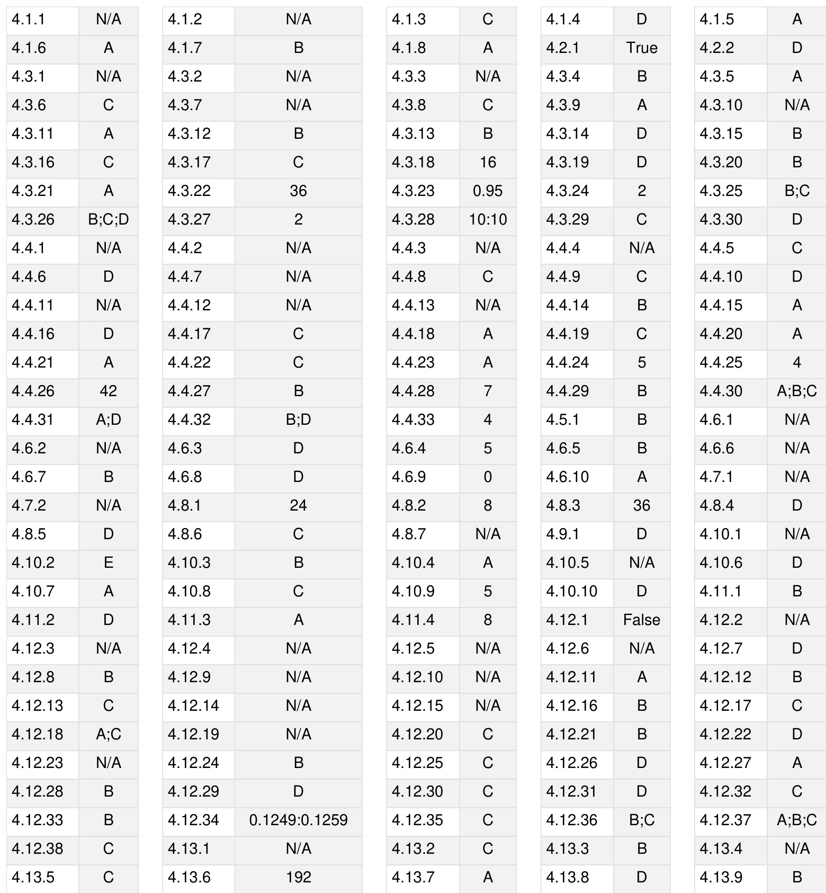

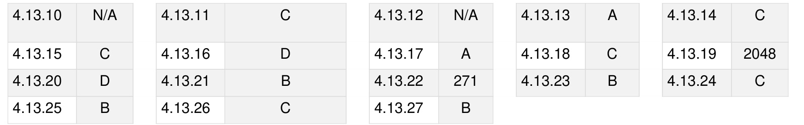

Syllabus: Limits, Continuity, and Differentiability, Maxima and minima, Mean value theorem, Integration.

MarkDistributioninPrevious GATE   
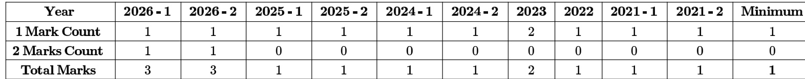

Welcome to the "Engineering Mathematics: Calculus" chapter, a cornerstone of your GATE Computer Science preparation. This section is designed as a comprehensive, exam-focused reference to equip you with the essential concepts, formulas, and problem -solving strategies required to excel in the calculus portion of the GATE exam. Calculus is not merely a collection of mathematical techniques; it is the language of change and optimization, fundamental to understanding algorithms, data structures, probability, and various computational models. A solid grasp of calculus concepts will not only help you score well in the dedicated Engineering Mathematics section but also enhance your analytical abilities for other subjects. Typically, Engineering Mathematics accounts for $8 - 1 0 \%$ of the total GATE marks, with Calculus being a significant component of this weightage. Questions usually range from direct application of formulas and theorems to conceptual problems involving limits, continuity, differentiation, and integration, often requiring a blend of analytical reasoning and careful calculation. Expect a mix of Multiple Choice Questions (MCQ), Multiple Select Questions (MSQ), and Numerical Answer Type (NAT) questions.

# Topic-wise Key Concepts

Limits

Definition and Core Idea: A limit describes the behavior of a function as its input approaches a certain value. It tells us what value the function 'tends to' or 'approaches' as the independent variable gets arbitrarily close to a specific point, without necessarily reaching it.

Important Formulas, Theorems, and Results:

1. Algebra of Limits: If $\scriptstyle \operatorname* { l i m } _ { x \to a } f ( x ) = L$ and $\quad \operatorname* { l i m } _ { x \to a } g ( x ) = M$ , then: $\begin{array} { r } { \operatorname* { l i m } _ { x  a } [ f ( x ) \pm g ( x ) ] = L \pm \tilde { M } } \end{array}$ $\begin{array} { r } { \operatorname* { l i m } _ { x \to a } [ { f ( x ) } \cdot { g ( x ) } ] = L \cdot M } \end{array}$ $\begin{array} { r } { \operatorname* { l i m } _ { x \to a } \frac { f ( x ) } { g ( x ) } = \frac { L } { M } } \end{array}$ provided $M \neq 0$ $\begin{array} { r } { , \operatorname* { l i m } _ { x  a } [ \stackrel { . } { c } \cdot \stackrel { . } { f } ( x ) ] = c \cdot L } \end{array}$

2. Standard Limits:

$$
\begin{array} { r l } & { \sin \mathbf { \phi } _ { x  0 } \frac { \sin x } { \sin x } = 1 } \\ & { \phantom { \frac { 1 } { 1 } } \sin \mathbf { \phi } _ { x  0 } \frac { \cos x } { \sin x } = 1 } \\ & { \phantom { \frac { 1 } { 1 } } \cos \mathbf { \phi } _ { x  0 } \frac { \sin x } { \sin x } = \frac { 1 } { 2 } } \\ & { \phantom { \frac { 1 } { 1 } } \sin \mathbf { \phi } _ { x  0 } \frac { e ^ { - x } } { e ^ { x } - 1 } = 1 } \\ & { \phantom { \frac { 1 } { 1 } } \sin \mathbf { \phi } _ { x  0 } \frac { e ^ { x } - 1 } { e ^ { x } - 1 } = \ln a } \\ & { \phantom { \frac { 1 } { 1 } } \sin \mathbf { \phi } _ { x  0 } \frac { \sin ( 1 + x ) } { e ^ { x } - e ^ { x } } = 1 a ^ { x - 1 } } \\ & { \phantom { \frac { 1 } { 1 } } \sin \mathbf { \phi } _ { x  a } \frac { e ^ { x } - e ^ { x } } { e ^ { x } - a } = n a ^ { n - 1 } } \\ & { \phantom { \frac { 1 } { 1 } } \sin \mathbf { \phi } _ { x  0 } ( 1 + \frac { 1 } { x } ) ^ { x } = e } \\ & { \phantom { \frac { 1 } { 1 } } \sin \mathbf { \phi } _ { x  0 } ( 1 + \frac { 1 } { e ^ { x } } ) ^ { x } = e ^ { k } } \\ & { \phantom { \frac { 1 } { 1 } } \sin \mathbf { \phi } _ { x  a } \frac { 1 } { e ^ { x } - 1 } \sin \theta + e ^ { k } } \end{array}
$$

3. L'Hopital's Rule: If $\begin{array} { r } { \operatorname* { l i m } _ { x \to a } \frac { f ( x ) } { g ( x ) } } \end{array}$ is of the indeterminate form $\frac { 0 } { 0 }$ or $\frac { \infty } { \infty }$ then $\begin{array} { r } { \operatorname* { l i m } _ { x \to a } \frac { f ( x ) } { g ( x ) } = \operatorname* { l i m } _ { x \to a } \frac { f ^ { \prime } ( x ) } { g ^ { \prime } ( x ) } } \end{array}$ provided ， the latter limit exists. This can be applied repeatedly. 4. Squeeze Theorem (Sandwich Theorem): If $g ( x ) \leq f ( x ) \leq h ( x )$ for all $x$ in an open interval containing $c$ (except possibly at $c$ itself), and if $\begin{array} { r } { \operatorname* { l i m } _ { x  c } g ( x ) = L } \end{array}$ and $\scriptstyle \operatorname* { l i m } _ { x \to c } h ( x ) = L$ , then $\scriptstyle \operatorname* { l i m } _ { x \to c } f ( x ) = L$ .

# Key Properties and Identities:

Indeterminate forms: $\begin{array} { c } { { \frac { 0 } { 0 } , \frac { \infty } { \infty } , 0 \cdot \infty , \infty - \infty , 1 ^ { \infty } , 0 ^ { 0 } , \infty ^ { 0 } } } \end{array}$ . These require special techniques like L'Hopital's Rule or algebraic manipulation.

One-sided limits: For a limit to exist, the left-hand limit $( \operatorname* { l i m } _ { x \to a ^ { - } } f ( x ) )$ and the right-hand limit $( \operatorname* { l i m } _ { x \to a ^ { + } } f ( x ) )$ must be equal.

# Common Pitfalls or Tricky Points:

Applying L'Hopital's Rule when the limit is not an indeterminate form.   
. Incorrectly handling one-sided limits, especially for piecewise functions or functions with square roots.   
Errors in algebraic simplification before applying standard limits.   
Misinterpreting limits involving infinity (e.g., $\textstyle { \frac { 1 } { \infty } } = 0$ , but $\propto \cdot 0$ is indeterminate).

# Standard Problem-Solving Techniques or Shortcuts:

Direct Substitution: Always try this first. If it yields a finite value, that's the limit.   
Factorization and Cancellation: For $\frac { 0 } { 0 }$ forms involving polynomials, factorize the numerator and denominator to   
cancel common terms.   
Rationalization: For expressions involving square roots, multiply by the conjugate to simplify.   
Using Standard Limits: Manipulate the expression to fit one of the standard limit forms.   
L'Hopital's Rule: Apply for $\frac { 0 } { 0 }$ or $\frac { \infty } { \infty }$ forms. Remember to differentiate numerator and denominator separately.   
Transforming Indeterminate Forms: $0 \cdot \infty \implies { \frac { 0 } { 1 / \infty } }$ or $\frac { \infty } { 1 / 0 }$ $\cdot \infty - \infty \implies$ combine terms, rationalize, or find a common denominator. $\circ { \bf 1 } ^ { \infty } , 0 ^ { 0 } , \infty ^ { 0 } \implies$ take natural logarithm: If $y = [ f ( x ) ] ^ { g ( x ) }$ , then $\ln y = g ( x ) \ln f ( x )$ . Then find $y$ and exponentiate the result.

# Continuity

Definition and Core Idea: A function is continuous at a point if its graph has no breaks, jumps, or holes at that point. Informally, you can draw the graph without lifting your pen. Formally, it means the function's value at the point is equal to its limit as the input approaches that point.

Important Formulas, Theorems, and Results:

1. Conditions for Continuity at a Point $x = a$ : A function $f ( x )$ is continuous at $x = a$ if and only if all three conditions are met:

a. $f ( a )$ is defined (the function exists at $a$ ).   
b. $\operatorname* { l i m } _ { x \to a } f ( x )$ exists (the limit exists at $a$ ). This implies $\begin{array} { r } { \operatorname* { l i m } _ { x \to a ^ { - } } f ( x ) = \operatorname* { l i m } _ { x \to a ^ { + } } f ( x ) . } \end{array}$ c. $\begin{array} { r } { \operatorname* { l i m } _ { x \to a } f ( x ) = f ( a ) } \end{array}$ (the limit equals the function value).

2. Continuity on an Interval: A function is continuous on an open interval $( a , b )$ if it is continuous at every point in the interval. It is continuous on a closed interval $[ a , b ]$ if it is continuous on $( a , b )$ , continuous from the right at $a$ ( $\begin{array} { r } { \operatorname* { l i m } _ { x \to a ^ { + } } f ( x ) = f ( a ) ) } \end{array}$ , and continuous from the left at $b \left( \operatorname* { l i m } _ { x \to b ^ { - } } f ( x ) = f ( b ) \right)$ .

3. Intermediate Value Theorem (IVT): If $f$ is continuous on the closed interval $[ a , b ]$ and $k$ is any number between $f ( a )$ and $f ( b )$ , then there exists at least one number $c$ in $( a , b )$ such that $f ( c ) = k$ .

4. Extreme Value Theorem (EVT): If $f$ is continuous on a closed interval $[ a , b ]$ , then $f$ attains both an absolute maximum value and an absolute minimum value on that interval.

# Key Properties and Identities:

The sum, difference, product, and quotient (where the denominator is non-zero) of continuous functions are continuous.   
The composition of continuous functions is continuous: If $g$ is continuous at $\mathbf { \Delta } _ { a }$ and $f$ is continuous at $g ( a ) .$ , then $( f \circ g ) ( x ) = f ( g ( x ) )$ is continuous at $a$   
Polynomials, exponential functions $( e ^ { x } , a ^ { x } )$ , logarithmic functions $( \ln x , \log _ { a } x )$ , trigonometric functions $\sin x , \cos x )$ , and rational functions (where the denominator is non-zero) are continuous in their domains.

# Common Pitfalls or Tricky Points:

Piecewise Functions: Pay close attention to the points where the definition of the function changes. These are the critical points to check for continuity.   
Removable Discontinuities: Occur when $\scriptstyle \operatorname* { l i m } _ { x \to a } f ( x )$ exists but is not equal to $f ( a )$ , or $f ( a )$ is undefined (e.g., holes in the graph).   
Jump Discontinuities: Occur when the left-hand and right-hand limits exist but are not equal (e.g., step functions). Infinite Discontinuities: Occur when one or both of the one-sided limits are infinite (e.g., vertical asymptotes).   
Forgetting to check all three conditions for continuity.

# Standard Problem-Solving Techniques or Shortcuts:

For piecewise functions, evaluate the function value at the transition point, and calculate both the left-hand and righthand limits at that point. Equate them to find unknown constants.   
Identify the domain of the function first. Discontinuities often occur at points where the function is undefined (e.g., denominator is zero, negative under square root).   
For functions involving absolute values, rewrite them as piecewise functions.

# Differentiation

Definition and Core Idea: Differentiation is the process of finding the derivative of a function. The derivative represents the instantaneous rate of change of a function with respect to its independent variable. Geometrically, it gives the slope of the tangent line to the function's graph at a given point.

Important Formulas, Theorems, and Results:

1. Definition of Derivative: $\begin{array} { r } { f ^ { \prime } ( x ) = \operatorname* { l i m } _ { h \to 0 } \frac { f ( x + h ) - f ( x ) } { h } } \end{array}$   
2. Basic Differentiation Rules:

$\begin{array} { r } { \frac { d } { d x } ( c ) = 0 } \end{array}$ (where $c$ is a constant) $ \begin{array} { r l } { { \boldsymbol { \downarrow } } } & { = \mathbf { 0 } , } \\ { { \frac { d } { d t } } \left( \mathbf { 0 } \right) = \mathbf { 0 } , } \\ { { \frac { d } { d t } } \left( t \right) = \mathbf { 0 } , } \\ { = { \frac { d } { d t } } \left( t \right) = \mathbf { 0 } , } \\ { = { \frac { d } { d t } } \left( t \right) = \mathbf { 0 } , } \\ { = { \frac { d } { d t } } \left( t \right) = \mathbf { 0 } , } \\ { = { \frac { d } { d t } } \left( \mathbf { 0 } \right) = { \frac { d } { d t } } \left( \mathbf { 0 } \right) = { \frac { d } { d t } } \left( \mathbf { 0 } \right) } \\ { { \frac { d } { d t } } \left( t \right) = \mathbf { 0 } , } \\ { = { \frac { d } { d t } } \left( t \right) = \mathbf { 0 } , } \\ { = { \frac { d } { d t } } \left( t \right) = \mathbf { 0 } , } \\ { = { \frac { d } { d t } } \left( t \right) = \mathbf { 0 } , } \\ { = { \frac { d } { d t } } \left( \mathbf { 0 } \right) = \mathbf { 0 } , } \\ { = { \frac { d } { d t } } \left( t \right) = \mathbf { 0 } , } \\ { = { \frac { d } { d t } } \left( t \right) = \mathbf { 0 } , } \\ { = { \frac { d } { d t } } \left( t \right) = \mathbf { 0 } , } \\ { = { \frac { d } { d t } } \left( t \right) = \mathbf { 0 } , } \\ { = { \frac { d } { d t } } \left( t \right) = \mathbf { 0 } , } \\ { = { \frac { d } { d t } } \left( t \right) = \mathbf { 0 } , } \\ { = { \frac { d } { d t } } \left( t \right) = \mathbf { 0 } , } \\ { = { \frac { d } { d t } } \left( t \right) = { \frac { d } { d t } } \left( t \right) = { \frac { d } { d t } } \left( t \right) } \\ { { \frac { d } { d t } } \left( t \right) = { \frac { d } { d t } } \left( t \right) = { \frac { d } { d t } } \left( t \right) } \\ & { = { \frac { d } { d t } } \left( t \right) = { \frac { d } { d t } } \left( t \right) = { \frac { d } { d t } } \left( t \right) } \\ & { = { \frac { d } { d t } } \left( t \right) = { \frac { d } { d t } } \left( t \right) = { \frac { d } { d t } } } \\ & { = { \frac { d } { d t } } \left( t \right) = { \frac { d } { d t } } } \\ & { = { \frac { d } { d t } } \left( t \right) = { \frac { d } { d t } } \left( t \right) = { \frac { d } { d t } } \left( t \right) } \\ &  =  \frac { d } { d }  \end{array}$

3. Rules of Differentiation:

Constant Multiple Rule: $\begin{array} { r } { { \frac { d } { d x } } [ c f ( x ) ] = c { \frac { d } { d x } } [ f ( x ) ] } \end{array}$ Sum/Difference Rule: $\begin{array} { r } { \frac { d } { d x } [ f ( x ) \pm g ( x ) ] = \frac { d } { d x } [ f ( x ) ] \pm \frac { d } { d x } [ g ( x ) ] } \end{array}$ Product Rule: ${ \scriptstyle { \frac { d } { d x } } } [ f ( x ) { \overbrace { g ( x ) } } ] = f ^ { \prime } ( x ) g ( x ) + f ( x ) g ^ { \prime } ( x )$ Quotient Rule: $\begin{array} { r } { { \frac { d } { d x } } \Big [ { \frac { f ( x ) } { g ( x ) } } \Big ] = { \frac { f ^ { \prime } ( x ) g ( x ) - f ( x ) g ^ { \prime } ( x ) } { \left[ g ( x ) \right] ^ { 2 } } } } \end{array}$ Chain Rule: $\begin{array} { r } { \frac { d } { d x } [ f ( g ( x ) ) ] = f ^ { \prime } ( g ( x ) ) \cdot g ^ { \prime } ( x ) } \end{array}$

4. Implicit Differentiation: Used when $y$ is not explicitly defined as a function of $x$ . Differentiate both sides of the equation with respect to $x$ , treating $y$ as a function of $x$ (i.e., use the chain rule for terms involving $y \mathrm { , }$ ).

5. Rolle's Theorem: If $f$ is continuous on $[ a , b ]$ , differentiable on $( a , b )$ , and $f ( a ) = f ( b )$ , then there exists at least one $c \in ( a , b )$ such that $f ^ { \prime } ( c ) = 0$ .

6. Mean Value Theorem (Lagrange's MVT): If $f$ is continuous on $[ a , b ]$ and differentiable on $( a , b )$ , then there exists at least one $c \in ( a , b )$ such that $\begin{array} { r } { f ^ { \prime } ( c ) = \frac { f ( b ) - f ( a ) } { b - a } } \end{array}$

7. Cauchy's Mean Value Theorem : If and $g$ are continuous on $[ a , b ]$ and differentiable on $( a , b )$ , and $g ^ { \prime } ( x ) \neq 0$ for any $x \in ( a , b )$ , then there exists at least one $c \in ( a , b )$ such that $\begin{array} { r } { \frac { f ^ { \prime } ( c ) } { g ^ { \prime } ( c ) } = \frac { f ( b ) - f ( a ) } { g ( b ) - g ( a ) } } \end{array}$

# Key Properties and Identities:

Differentiability implies continuity, but continuity does not imply differentiability (e.g., $| x |$ at $x = 0$ ).

Higher-order derivatives: $\begin{array} { r } { f ^ { \prime \prime } ( x ) = \frac { d } { d x } ( f ^ { \prime } ( x ) ) , f ^ { \prime \prime \prime } ( x ) = \frac { d } { d x } ( f ^ { \prime \prime } ( x ) ) } \end{array}$ , etc.

# Common Pitfalls or Tricky Points:

Forgetting the chain rule, especially with composite functions like $\sin ( 2 x )$ or .   
Errors in applying the product or quotient rule.   
. Mistakes in implicit differentiation, particularly when differentiating terms involving $y$ (e.g., $\begin{array} { r } { \frac { d } { d x } ( y ^ { 2 } ) = 2 y \frac { d y } { d x } ) } \end{array}$ .   
Confusing the derivative of $a ^ { x }$ with $x ^ { a }$ .   
Not simplifying expressions before differentiating when possible.

# Standard Problem-Solving Techniques or Shortcuts:

Logarithmic Differentiation: For functions of the form $y = [ f ( x ) ] ^ { g ( x ) }$ or complex products/quotients, take the natural logarithm of both sides before differentiating implicitly.   
Parametric Differentiation: If $x = f ( t )$ and $y = g ( t )$ , then $\begin{array} { r } { \frac { d y } { d x } = \frac { d y / d t } { d x / d t } } \end{array}$ .   
Derivative of Inverse Function: If $y = f ^ { - 1 } ( x )$ , then $\begin{array} { r } { \frac { d y } { d x } = \frac { 1 } { f ^ { \prime } ( y ) } } \end{array}$   
Practice recognizing common derivative patterns for speed.

# Maxima Minima

Definition and Core Idea: Maxima and minima (collectively called extrema) refer to the highest and lowest values a function attains within a given interval or its entire domain. A local maximum/minimum is the highest/lowest point in its immediate neighborhood, while a global (absolute) maximum/minimum is the highest/lowest point over the entire domain/interval.

Important Formulas, Theorems, and Results:

1. Critical Points: A critical point of a function $f ( x )$ is a point $c$ in the domain of $f$ where either $f ^ { \prime } ( c ) = 0$ or $f ^ { \prime } ( c )$ is undefined. Local extrema can only occur at critical points or endpoints of a closed interval.

2. First Derivative Test: Let $c$ be a critical point of a continuous function $f$ . 。 If $f ^ { \prime } ( x )$ changes from positive to negative at $c$ , then $f$ has a local maximum at $c$ . If $f ^ { \prime } ( x )$ changes from negative to positive at $c$ , then $f$ has a local minimum at $c$ . If $f ^ { \prime } ( x )$ does not change sign at $c$ , then $f$ has neither a local maximum nor a local minimum at $c$

3. Second Derivative Test: Let $c$ be a critical point where $f ^ { \prime } ( c ) = 0$ and $f ^ { \prime \prime } ( c )$ exists. If $f ^ { \prime \prime } ( c ) > 0$ , then $f$ has a local minimum at $c$ . If $f ^ { \prime \prime } ( c ) < 0$ , then $f$ has a local maximum at $c$ . If $f ^ { \prime \prime } ( c ) = 0$ , the test is inconclusive (use the First Derivative Test).

4. Concavity: If $f ^ { \prime \prime } ( x ) > 0$ on an interval, $f$ is concave up (graph opens upwards). If $f ^ { \prime \prime } ( x ) < 0$ on an interval, $f$ is concave down (graph opens downwards).

5. Inflection Point: A point where the concavity of the function changes. This occurs where $f ^ { \prime \prime } ( x ) = 0$ or $f ^ { \prime \prime } ( x )$ is undefined, and $f ^ { \prime \prime } ( x )$ changes sign.

# Key Properties and Identities:

For global extrema on a closed interval $[ a , b ]$ , evaluate $f ( x )$ at all critical points in $( a , b )$ and at the endpoints $a$ and $b$ . The largest of these values is the absolute maximum, and the smallest is the absolute minimum.

# Common Pitfalls or Tricky Points:

Forgetting to check endpoints when finding global extrema on a closed interval.   
Misinterpreting the results of the second derivative test, especially when $f ^ { \prime \prime } ( c ) = 0$ .   
Not considering points where $f ^ { \prime } ( x )$ is undefined as critical points.   
Errors in algebraic manipulation while finding critical points or second derivatives.   
Confusing local extrema with global extrema.

# Standard Problem-Solving Techniques or Shortcuts:

# Optimization Problems:

1. Understand the problem and identify the quantity to be maximized or minimized.

2. Draw a diagram if helpful.   
3. Introduce variables and write the primary equation for the quantity to be optimized.   
4. Write a secondary equation (constraint) relating the variables.   
5. Use the secondary equation to express the primary equation in terms of a single independent variable.   
6. Find the domain of this function.   
7. Differentiate the function, find critical points, and apply the First or Second Derivative Test.   
8. Verify the solution makes sense in the context of the problem.   
For simple functions, sometimes the graph can quickly indicate extrema.

# Integration

Definition and Core Idea: Integration is the reverse process of differentiation, also known as antidifferentiation. It finds the function whose derivative is the given function. Geometrically, definite integration calculates the area under the curve of a function between two specified limits.

Important Formulas, Theorems, and Results:

# 1. Basic Integration Formulas (Indefinite Integrals):

$$
{ \begin{array} { r l } & { { \boldsymbol { \cdot } } \int x ^ { 0 } d x = { \frac { x ^ { - 1 } } { x ^ { 2 } } } + C . { \mathrm { t a n } } \rho ^ { - + } - 1 } \\ & { = \int { \frac { 1 } { x } } \ d x = \ln | x | + C } \\ & { = \int e ^ { - t } d x = e ^ { - t } C } \\ & { \cdot } \int \rho e ^ { - t } d x = { \frac { e ^ { - t } } { x ^ { 2 } } } + C } \\ & { = \int \rho e ^ { - t } d x = { \frac { e ^ { - t } } { x ^ { 2 } } } + C } \\ & { = \int \rho \sin x d y = - \cos x + C } \\ & { \cdot } \\ & { = \int \rho \cos x d x = \sin x + C } \\ & { = \int \rho \cos x d x = \cos x + C } \\ & { \cdot } \\ & { = \int \rho \sin ^ { 2 } x d x = \cos x d x } \\ & { = \int \rho \sin x d x = \cos x + C } \\ & { - \int \rho \cos x \cos \left( x \right) d x = - \cos x \times C } \\ & { = \int { \frac { 1 } { x } } { \frac { 1 } { x ^ { 2 } - x ^ { 2 } } } d x = \sin ^ { - 1 } \left( { \frac { x } { x } } \right) + C } \\ & { = \int { \frac { 1 } { x ^ { 2 } - x ^ { 2 } } } d x = { \frac { 1 } { x ^ { 2 } } } \left( { \frac { 1 } { x } } \right) + C } \\ & { \cdot } \end{array} 
$$

2. Properties of Indefinite Integrals: $\begin{array} { r l } & { \dot { \int } [ f ( x ) \pm g ( x ) ] d x = \int f ( x ) d x \pm \int g ( x ) d x } \\ & { \int c f ( x ) d x = c \int f ( x ) d x } \end{array}$

3. Integration by Substitution (u-substitution): If $u = g ( x )$ , then $\begin{array} { r } { d u = g ^ { \prime } ( x ) d x . \int f ( g ( x ) ) g ^ { \prime } ( x ) d x = \int f ( u ) d u . } \end{array}$ 4. Integration by Parts: $\textstyle { \int u d v = u v - \int v d u }$ . Often remembered by the mnemonic "LIATE" (Logarithmic, Inverse trig, Algebraic, Trigonometric, Exponential) for choosing $u$ .

# Key Properties and Identities:

Always include the constant of integration $+ C$ for indefinite integrals.   
Trigonometric identities are often crucial for simplifying integrands before integration.

# Common Pitfalls or Tricky Points:

Forgetting the constant of integration $+ C$ .   
Incorrectly choosing $u$ and $d v$ in integration by parts.   
Errors in algebraic manipulation or trigonometric identities.   
Not recognizing when substitution is appropriate.   
Confusing integration formulas with differentiation formulas (e.g., $\textstyle \int { \frac { 1 } { x } } d x$ vs. $\textstyle { \frac { d } { d x } } \ln x )$

# Standard Problem-Solving Techniques or Shortcuts:

Direct Integration: If the integrand matches a basic formula.   
Substitution: Look for a function and its derivative within the integrand. Let the inner function be .   
Integration by Parts: Use for products of functions (e.g., $x \sin x , \ln x )$ .   
Partial Fractions: For rational functions (polynomials divided by polynomials), decompose into simpler fractions that are easier to integrate. (Briefly mention as it's a common technique).

Trigonometric Identities: Use identities to simplify powers of trig functions or products of trig functions.

# Definite Integral

Definition and Core Idea: A definite integral represents the net signed area between the graph of a function and the xaxis over a specified interval $[ a , b ]$ . It is evaluated by finding the antiderivative of the function and then evaluating it at the upper and lower limits of integration.

Important Formulas, Theorems, and Results:

1. Fundamental Theorem of Calculus (Part 1): If $f$ is continuous on $[ a , b ]$ , then the function $\textstyle G ( x ) = \int _ { a } ^ { x } f ( t ) d t$ has a derivative at every point in $( a , b )$ , and $G ^ { \prime } ( x ) = f ( x )$ .   
2. Fundamental Theorem of Calculus (Part 2): If $f$ is continuous on $[ a , b ]$ and $F$ is any antiderivative of $f$ on $[ a , b ]$ , then $\begin{array} { r } { \int _ { a } ^ { b } f ( x ) d x = F ( b ) - F ( a ) . } \end{array}$ .

3. Properties of Definite Integrals:

$\textstyle \int _ { a } ^ { b } f ( x ) d x = - \int _ { b } ^ { a } f ( x ) d x$   
$\begin{array} { r } { \dot { \int _ { a } ^ { a } f ( x ) } d x = 0 } \end{array}$   
$\textstyle { \int _ { a } ^ { b } c f ( x ) d x = c \int _ { a } ^ { b } f ( x ) d x }$   
$\begin{array} { r } { \int _ { a } ^ { b } [ f ( x ) \pm g ( x ) ] d x = \int _ { a } ^ { b } f ( x ) d x \pm \int _ { a } ^ { b } g ( x ) d x } \end{array}$   
$\textstyle \int _ { a } ^ { b } f ( x ) d x = \int _ { a } ^ { c } f ( x ) d x + \int _ { c } ^ { b } f ( x ) d x$ , where <c<b   
$\begin{array} { r } { \int _ { 0 } ^ { a } f ( x ) d x = \int _ { 0 } ^ { a } f ( a - x ) d x } \end{array}$ (useful for simplifying integrals)   
Even/Odd Functions: $f ( x )$ is an even function $( f ( - x ) = f ( x ) )$ , then $\textstyle \int _ { - a } ^ { a } f ( x ) d x = 2 \int _ { 0 } ^ { a } f ( x ) d x$ . If $f ( x )$ is an odd function $( f ( - x ) = - f ( x ) )$ , then $\textstyle \int _ { - a } ^ { a } f ( x ) d x = 0$ .

# Key Properties and Identities:

The definite integral evaluates to a numerical value, not a function.   
The constant of integration $+ C$ is not included in definite integrals because it cancels out ( $F ( b ) + C - ( F ( a ) + C ) = F ( b ) - F ( a ) )$ .

# Common Pitfalls or Tricky Points:

. Incorrectly applying the limits of integration (upper limit minus lower limit).   
Sign errors when evaluating $F ( b ) - F ( a )$ .   
Forgetting to change the limits of integration when using substitution for definite integrals.   
Not recognizing even/odd function properties to simplify integrals over symmetric intervals.   
Improper integrals (involving infinite limits or discontinuities within the interval) are less common in GATE CS but good to be aware of.

# Standard Problem-Solving Techniques or Shortcuts:

Direct Application of FTC: Find the antiderivative and evaluate at the limits.   
Substitution: If using substitution, either change the limits of integration to be in terms of  or revert back to $x$ before applying the original limits.   
Properties of Definite Integrals: Use properties like linearity, interval splitting, and even/odd function rules to simplify the integral before evaluation.   
Symmetry: For integrals over $[ - a , a ]$ , check if the integrand is even or odd.

# Polynomials

Definition and Core Idea: A polynomial is an expression consisting of variables and coefficients, involving only the operations of addition, subtraction, multiplication, and non-negative integer exponents of variables. They are fundamental building blocks in calculus as they are continuous and differentiable everywhere.

# Important Formulas, Theorems, and Results:

1. General Form: $P ( x ) = a _ { n } x ^ { n } + a _ { n - 1 } x ^ { n - 1 } + \cdots + a _ { 1 } x + a _ { 0 }$ , where $a _ { i }$ are coefficients and $n$ is a non-negative integer (degree). 2. Remainder Theorem: If a polynomial $P ( x )$ is divided by $( x - a )$ , the remainder is $P ( a )$ .

3. Factor Theorem: $( x - a )$ is a factor of a polynomial $P ( x )$ if and only if $P ( a ) = 0$ (i.e., $a$ is a root of the polynomial).

4. Fundamental Theorem of Algebra: Every non-constant single-variable polynomial with complex coefficients has at least one complex root. Consequently, a polynomial of degree $\scriptstyle n$ has exactly $n$ roots (counting multiplicity) in the complex numbers.

5. Vieta's Formulas (for quadratic and cubic):

For $a x ^ { 2 } + b x + c = 0$ with roots $\alpha , \beta$ : a+β=-b ■ αβ=c   
$\mathsf { F o r } a x ^ { 3 } + \bar { b } x ^ { 2 } + c x + d = 0$ with roots $\alpha , \beta , \gamma$ :   
$\begin{array} { l } { { \bullet ~ \alpha + \beta + \gamma = - { \frac { b } { a } } } } \\ { { \bullet ~ \alpha \beta + \beta \gamma + \gamma \alpha = { \frac { c } { a } } } } \\ { { \bullet ~ \alpha \beta \gamma = - { \frac { d } { a } } } } \end{array}$

# Key Properties and Identities:

Polynomials are continuous and infinitely differentiable everywhere.   
The degree of a polynomial determines the maximum number of roots it can have.   
If a polynomial has real coefficients, then any complex roots must occur in conjugate pairs.

# Common Pitfalls or Tricky Points:

Errors in polynomial division or synthetic division.   
Misapplying Vieta's formulas (e.g., sign errors).   
Not considering multiplicity of roots.   
Confusing roots with factors.

# Standard Problem-Solving Techniques or Shortcuts:

Synthetic Division: A quick method for dividing a polynomial by a linear factor $( x - a )$ . Rational Root Theorem: Helps find potential rational roots of a polynomial with integer coefficients. Factoring: Look for common factors, use grouping, or quadratic formula for quadratic factors. Derivative for Repeated Roots: If $\mathbf { \Delta } _ { a }$ is a root of $P ( x )$ with multiplicity $k > 1$ , then $\mathbf { \Delta } _ { a }$ is also a root of $P ^ { \prime } ( x )$ with multiplicity $k - 1$

# Summation

Definition and Core Idea: Summation is the process of adding a sequence of numbers or terms. It is often represented using sigma notation $\textcircled{2}$ . In calculus, summation is foundational to understanding series, Riemann sums (for integration), and numerical methods.

Important Formulas, Theorems, and Results:

1. Arithmetic Progression (AP) Sum: For an AP with first term $a$ , common difference $d _ { \ i }$ and $\scriptstyle n$ terms: $\begin{array} { r } { S _ { n } = \frac { n } { 2 } [ 2 a + ( n - 1 ) d ] } \end{array}$ $\begin{array} { r } { S _ { n } = \frac { \tilde { n } } { 2 } [ a + l ] } \end{array}$ , where $\mathbf { \xi } _ { l }$ is the last term.

2. Geometric Progression (GP) Sum: For a GP with first term $a$ , common ratio $r$ , and $n$ terms: $\begin{array} { r } { S _ { n } = \frac { a ( r ^ { n } - 1 ) } { r - 1 } } \end{array}$ for $r \neq 1$ $\begin{array} { r } { S _ { n } = \frac { a ( 1 - r ^ { n } ) } { 1 - r } } \end{array}$ for $r \neq 1$ Sum to Infinity for GP: $\textstyle S _ { \infty } = { \frac { a } { 1 - r } }$ , for $| r | < 1$

3. Standard Summation Formulas:

$$
\begin{array} { r l } & { \circ \sum _ { i = 1 } ^ { n } c = n c } \\ & { \circ \sum _ { i = 1 } ^ { n } i = \frac { n ( n + 1 ) } { 2 } } \\ & { \circ \sum _ { i = 1 } ^ { n } i ^ { 2 } = \frac { n ( n + 1 ) ( 2 n + 1 ) } { 6 } } \\ & { \circ \sum _ { i = 1 } ^ { n } i ^ { 3 } = \left( \frac { n ( n + 1 ) } { 2 } \right) ^ { 2 } } \end{array}
$$

# Key Properties and Identities:

Linearity of Summation:

$\begin{array} { l } { \circ \sum _ { i = 1 } ^ { n } ( a _ { i } \pm b _ { i } ) = \sum _ { i = 1 } ^ { n } a _ { i } \pm \sum _ { i = 1 } ^ { n } b _ { i } } \\ { \circ \sum _ { i = 1 } ^ { n } c \cdot a _ { i } = c \cdot \sum _ { i = 1 } ^ { n } a _ { i } } \end{array}$ Telescoping Sums: Sums where intermediate terms cancel out, e.g., $\scriptstyle \sum _ { i = 1 } ^ { n } ( a _ { i } - a _ { i + 1 } )$ .

# Common Pitfalls or Tricky Points:

Off-by-one errors in summation limits.   
Confusing AP and GP formulas.   
Incorrectly applying the sum to infinity formula (only valid for $| r | < 1 )$ .   
Errors in algebraic manipulation when simplifying complex summations.

# Standard Problem-Solving Techniques or Shortcuts:

Identify Series Type: Determine if it's an AP, GP, or a combination.   
Use Standard Formulas: Apply the formulas for $\textstyle \sum i , \sum i ^ { 2 } , \sum i ^ { 3 }$ .   
Split and Combine: Use linearity to break down complex summations into simpler ones.   
Method of Differences (Telescoping Sums): Express each term as a difference of two consecutive terms to simplify the sum.   
Generating Functions: (Advanced, less common for direct GATE CS questions, but good for understanding series).

# Quick Formula Reference

# Limits

${ \begin{array} { r l } & { \bullet \operatorname* { l i m } _ { x  0 } { \frac { \sin x } { x } } = 1 } \\ & { \bullet \operatorname* { l i m } _ { x  0 } { \frac { \cos x } { \cos x } } = 1 } \\ & { \bullet \operatorname* { l i m } _ { x  0 } { \frac { 1 - \cos x } { e ^ { x } - 1 } } = { \frac { 1 } { 2 } } } \\ & { \bullet \operatorname* { l i m } _ { x  0 } e ^ { \frac { e ^ { x } - 1 } { x } } = 1 } \\ & { \bullet \operatorname* { l i m } _ { x  0 } { \frac { e ^ { x } - 1 } { x } } = \ln \alpha } \\ & { \bullet \operatorname* { l i m } _ { x  0 } { \frac { \ln ( 1 + x ) } { x } } = 1 } \\ & { \bullet \operatorname* { l i m } _ { x  a } { \frac { e ^ { x } - a ^ { a } } { x - a ^ { a } } } = n a ^ { n - 1 } } \\ & { \bullet \operatorname* { l i m } _ { x  0 } ( 1 + { \frac { 1 } { x } } ) ^ { x } = e } \\ & { \bullet \operatorname* { l i m } _ { x  0 } ( 1 + x ) ^ { 1 / x } = e } \end{array} }$ L'Hopital's Rule: If $\frac { f ( x ) } { g ( x ) }$ is $\frac { 0 } { 0 }$ or , then $\begin{array} { r } { \operatorname* { l i m } \frac { f ( x ) } { g ( x ) } = \operatorname* { l i m } \frac { f ^ { \prime } ( x ) } { g ^ { \prime } ( x ) } } \end{array}$

# Continuity

Continuous at $x = a$ if: $f ( a )$ defined, $\scriptstyle \operatorname* { l i m } _ { x \to a } f ( x )$ exists, and $\begin{array} { r } { \operatorname* { l i m } _ { x \to a } f ( x ) = f ( a ) } \end{array}$

# Differentiation

Let $u , v$ be functions of $x , c$ be a constant.

$$
{ \begin{array} { r l } & { * { \frac { d } { d z } } ( c ) = 0 } \\ & { * { \frac { d } { d z } } ( c ^ { n } ) = n c ^ { n - 1 } } \\ & { * { \frac { d } { d z } } ( e ^ { \pi } ) = e ^ { \pi } } \\ & { * { \frac { d } { d z } } ( a ^ { \pi } ) = a ^ { \pi } \ln a } \\ & { * { \frac { d } { d z } } ( \ln x ) = { \frac { z } { z } } } \\ & { * { \frac { d } { d z } } ( \sin x ) = \cos x } \\ & { * { \frac { d } { d z } } ( \cos x ) = - \sin x } \\ & { * { \frac { d } { d z } } ( \tan x ) = \sec ^ { 2 } x } \\ & { * { \frac { d } { d z } } ( c u ) = c { \frac { d } { d z } } } \\ & { * { \frac { d } { d z } } ( a \pm v ) = { \frac { d x } { d x } } + \vdots } \\ & { * { \frac { d } { d z } } ( a \pm v ) = a { \frac { d x } { d z } } } \end{array} }
$$

$\begin{array} { r } { \frac { d } { d x } \big ( \frac { u } { v } \big ) = \frac { v \frac { d u } { d x } - u \frac { d v } { d x } } { v ^ { 2 } } } \end{array}$ $\begin{array} { r } { \frac { d } { d x } [ f ( g ( x ) ) ] = f ^ { \prime } ( g ( x ) ) \cdot g ^ { \prime } ( x ) } \end{array}$ (Chain Rule) Rolle's Theorem: $f ( a ) = f ( b ) \implies \exists c \in ( a , b )$ s.t. $f ^ { \prime } ( c ) = 0$ Mean Value Theorem: $\exists c \in ( a , b )$ s.t. $\begin{array} { r } { f ^ { \prime } ( c ) = \frac { f ( b ) - f ( a ) } { b - a } } \end{array}$

# Maxima Minima

Critical points: $f ^ { \prime } ( x ) = 0$ or $f ^ { \prime } ( x )$ undefined.   
First Derivative Test: Sign change of $f ^ { \prime } ( x )$ at critical point.   
Second Derivative Test: If $f ^ { \prime } ( c ) = 0$ : $f ^ { \dot { \prime } \prime } ( \acute { c } ) > 0 \implies$ local min; $f ^ { \prime \prime } ( c ) < 0 \implies$ local max.

# Integration (Indefinite)

${ \begin{array} { r l } & { \bullet \int k d x = k x + C } \\ & { \bullet \int x ^ { n } d x = { \frac { x ^ { n + 1 } } { n + 1 } } + C , \mathsf { t o r } n \neq - 1 } \\ & { \bullet \int { \frac { x } { a } } d x = \ln | x | + C } \\ & { \bullet \int \epsilon ^ { x } d x = e ^ { x } + C } \\ & { \bullet \int a ^ { x } d x = { \frac { n ^ { n } } { a ^ { 2 } } } + C } \\ & { \bullet \int \sin x d x = - \cos x + C } \\ & { \bullet \int \cos x d x = \sin x + C } \\ & { \bullet \int \frac { \cos ^ { 2 } x d x } { - { \sqrt { \frac { 1 } { a ^ { 2 } } - \partial ^ { 2 } } } } d x = \sin ^ { - 1 } \left( { \frac { x } { a } } \right) + C } \\ & { \bullet \int { \frac { 1 } { a ^ { 2 } } } - 2 d x = { \frac { 1 } { a } } \tan ^ { - 1 } \left( x \right) + C } \\ & { \bullet \left. \theta \varphi \alpha \right. \Phi \exp \mathsf { R } \hbar \alpha \mathbf { 1 } \cdot \left\{ x \ d w = w \cdot \right. } \end{array} }$ $\textstyle { \int u d v = u v - \int v d u }$

# Definite Integral

Fundamental Theorem of Calculus: $\begin{array} { r } { \int _ { a } ^ { b } f ( x ) d x = F ( b ) - F ( a ) } \end{array}$ where $F ^ { \prime } ( x ) = f ( x )$ . $\textstyle \int _ { a } ^ { b } f ( x ) d x = - \int _ { b } ^ { a } f ( x ) d x$   
$\textstyle \int _ { a } ^ { b } f ( x ) d x = \int _ { a } ^ { c } f ( x ) d x + \int _ { c } ^ { b } f ( x ) d x$   
$\begin{array} { r } { \int _ { 0 } ^ { a } f ( x ) d x = \int _ { 0 } ^ { a } f ( a - x ) d x } \end{array}$   
Even function $\begin{array} { r } { ( \breve { f } ( - x ) = f ( x ) ) \colon \int _ { - a } ^ { a } f ( x ) d x = 2 \int _ { 0 } ^ { a } f ( x ) d x } \end{array}$   
Odd function $( f ( - x ) = - f ( x ) )$ : $\textstyle \int _ { - a } ^ { a } f ( x ) d x = 0$

# Polynomials

Remainder Theorem: $P ( x )$ divided by $( x - a )$ has remainder $P ( a )$ . Factor Theorem: $( x - a )$ is a factor of ${ \dot { P } } ( x )$ iff $P ( a ) = 0$ . Vieta's Formulas (for $a x ^ { 2 } + b x + c = 0 ,$ ): $\alpha + \beta = - b / a , \alpha \beta = c / a$

# Summation

AP Sum: $\begin{array} { r } { S _ { n } = \frac { n } { 2 } [ 2 a + ( n - 1 ) d ] } \end{array}$ or $\begin{array} { r } { S _ { n } = \frac { n } { 2 } [ a + l ] } \end{array}$   
GP Sum: $\begin{array} { r } { S _ { n } = \frac { \overline { { a } } ( r ^ { n } - 1 ) } { r - 1 } } \end{array}$   
GP Sum to Infinity: $\textstyle S _ { \infty } = { \frac { a } { 1 - r } }$ for $| r | < 1$   
$\begin{array} { r l } { ~ } & { \cdot \sum _ { i = 1 } ^ { n } i = \frac { n ( n + 1 ) } { 2 } } \\ { ~ } & { \cdot \sum _ { i = 1 } ^ { n } i ^ { 2 } = \frac { n ( n + 1 ) ( 2 n + 1 ) } { 6 } } \\ { ~ } & { \cdot \sum _ { i = 1 } ^ { n } i ^ { 3 } = \left( \frac { n ( n + 1 ) } { 2 } \right) ^ { 2 } } \end{array}$

# Important Tips for GATE

1. Master the Fundamentals: Calculus builds upon basic algebra, trigonometry, and functions. Ensure your foundation in these areas is strong to avoid silly mistakes.

2. Practice with PYQs: Solve previous year's GATE questions extensively. This helps you understand the typical question patterns, difficulty levels, and time constraints.

3. Understand Concepts, Don't Just Memorize: While formulas are crucial, knowing \*why\* they work (e.g., the geometric interpretation of derivatives and integrals) will help you tackle trickier conceptual questions and apply them correctly in unfamiliar scenarios.

4. Pay Attention to Domains and Conditions: For limits, continuity, and differentiability, always check the domain o the function and any specific conditions (e.g., $g ( x ) \neq 0$ for quotient rule, $| r | < 1$ for infinite GP sum). Piecewise functions are common traps.

5. Be Careful with Signs and Constants: A common source of error in differentiation and integration is incorrect signs or forgetting the constant of integration $( + C )$ for indefinite integrals. Double-check your calculations.

6. Time Management: Some calculus problems can be lengthy. Learn to identify problems that might take too much time and mark them for review. Practice solving problems within a strict time limit. Shortcuts like L'Hopital's rule or properties of definite integrals can save valuable time.

7. Visualize Functions: For problems involving maxima/minima or definite integrals, sketching a rough graph of the function can often provide intuition and help verify your analytical results.

8. Review Properties of Even/Odd Functions: These properties are frequently tested in definite integral problems, especially over symmetric intervals like $[ - a , a ]$ , and can significantly simplify calculations.

✍ Practice Test: Test 7 (14Q)

Let $f$ be a function defined by

$$
f ( x ) = { \left\{ \begin{array} { l l } { x ^ { 2 } } & { { \mathrm { f o r ~ } } x \leq 1 } \\ { a x ^ { 2 } + b x + c } & { { \mathrm { f o r ~ } } 1 } \\ { x + d } & { { \mathrm { f o r ~ } } x > 2 } \end{array} \right. } l t x \leq 2
$$

Find the values for the constants $a , b , c$ and $d$ so that $f$ is continuous and differentiable everywhere on the real line.

gate1996 calculus continuity differentiation normal descriptive

Consider the function $y = \left| x \right|$ in the interval . In this interval, the function is

A. continuous and differentiable B. continuous but not differentiable C. differentiable but not continuous D. neither continuous nor differentiable

gate1998 calculus continuity differentiation easy

# Answer key☟

Which one of the following functions is continuous at $x = 3 \vdots$ ？

$$
{ \begin{array} { l l } { f ( x ) = { \left\{ \begin{array} { l l } { 2 , } & { { \mathrm { i f ~ } } x = 3 } \\ { x - 1 , } & { { \mathrm { i f ~ } } x > 3 } \\ { { \frac { x + 3 } { 3 } } , } & { { \mathrm { i f ~ } } x < 3 } \end{array} \right. } } \\ { f ( x ) = { \left\{ \begin{array} { l l } { 4 , } & { { \mathrm { i f ~ } } x = 3 } \\ { 8 - x , } & { { \mathrm { i f ~ } } x \neq 3 } \\ { x + 3 , } & { { \mathrm { i f ~ } } x \leq 3 } \end{array} \right. } } \\ { f ( x ) = { \left\{ \begin{array} { l l } { x - 4 , } & { { \mathrm { i f ~ } } x > 3 } \\ { x - 2 , } & { { \mathrm { i f ~ } } x \neq 3 } \end{array} \right. } } \end{array} }
$$

gatecse-2013 calculus continuity normal

# Answer key☟

A function $f ( x )$ is continuous in the interval . It is known that $f ( 0 ) = f ( 2 ) = - 1$ and $f ( 1 ) = 1$ . Which one of the following statements must be true?

A. There exists a $y$ in the interval $( 0 , 1 )$ such that $f ( y ) = f ( y + 1 )$ B. For every $y$ in the interval $( 0 , 1 ) , f ( y ) = f ( 2 - y )$ C. The maximum value of the function in the interval $( 0 , 2 )$ is D. There exists a $y$ in the interval $( 0 , 1 )$ such that $f ( y ) = - f ( 2 - y )$

Let f(x)=x-(） and $A$ denote the area of region bounded by $f ( x )$ and the $\mathsf { X }$ -axis, when $x$ varies from $^ { - 1 }$ to . Which of the following statements is/are TRUE?

I. $f$ is continuous in $[ - 1 , 1 ]$ II. $f$ is not bounded in $[ - 1 , 1 ]$ III. $A$ is nonzero and finite

A. II only B. III only C. II and III only D. I, II and III

gatecse-2015-set2 calculus continuity functions normal

$$
f ( x ) = { \left\{ \begin{array} { l l } { c _ { 1 } e ^ { x } - c _ { 2 } \log _ { \mathrm { e } } { \left( { \frac { 1 } { x } } \right) } , } & { \quad { \mathrm { i f ~ } } x > 0 } \\ { 3 } & { \quad { \mathrm { o t h e r w i s e } } } \end{array} \right. }
$$

where $c _ { 1 } , c _ { 2 } \in \mathbb { R }$ .

If $f$ is continuous at $x = 0$ , then $c _ { 1 } + c _ { 2 } = \_$ (answer in integer)

gatecse-2026-set1 calculus continuity numerical-answers one-mark

Consider a function $f : ( 0 , 1 )  \{ 0 , 1 \}$ defined as follows.   
For a real number $r \in ( 0 , 1 ) , f ( r ) = 1$ if the second digit after the decimal point in $r$ is one of the four digits and . Otherwise, $f ( r )$ is equal to .

The number of points in $( 0 , 1 )$ at which $f$ is discontinuous is (answer in integer)

gatecse-2026-set2 calculus continuity numerical-answers two-marks

​Let $f : \mathbb { R } \to \mathbb { R }$ be a function. Note: $\mathbb { R }$ denotes the set of real numbers.

$$
f ( x ) = \left\{ \begin{array} { c l l } { { - x , } } & { { \mathrm { i f ~ } x } } & { { l t - 2 } } \\ { { a x ^ { 2 } + b x + c , } } & { { \mathrm { i f ~ } x \in [ - 2 , 2 ] } } \\ { { x , } } & { { \mathrm { i f ~ } x > 2 } } \end{array} \right.
$$

Which ONE of the following choices gives the values of $a , b , c$ that make the function $f$ continuous and differentiable?

A. $\scriptstyle a = { \frac { 1 } { a } } , b = 0 , c = 1$ $\begin{array} { l l } { { \mathsf { B . } ~ a = \frac { 1 } { 2 } , b = 0 , c = 0 } } \\ { { \mathsf { D . } ~ a = 1 , b = 1 , c = - 4 } } \end{array}$   
C. $\pmb { a } = \vec { 0 } , b = 0 , c = 0$

gate-ds-ai-2024 calculus continuity differentiation two-marks

The function $y = \lvert 2 - 3 x \rvert$

A. is continuous $\forall x \in R$ and differentiable $\forall x \in R$ B. is continuous $\forall x \in R$ and differentiable $\forall x \in R$ except at $\textstyle { x = { \frac { 3 } { 2 } } }$ C. is continuous $\forall x \in R$ and differentiable $\forall x \in R$ except at $\textstyle { x = { \frac { 2 } { 3 } } }$ D. is continuous $\forall x \in R$ except $x = 3$ and differentiable $\forall x \in R$

The value of the definite integral

$$
\int _ { - 3 } ^ { 3 } \int _ { - 2 } ^ { 2 } \int _ { - 1 } ^ { 1 } \left( 4 x ^ { 2 } y - z ^ { 3 } \right) \mathrm { d } z \mathrm { d } y \mathrm { d } x
$$

is (Rounded off to the nearest integer)

gatecse-2023 calculus definite-integral numerical-answers one-mark

Let $f ( x )$ be a continuous function from $\mathbb { R }$ to $\mathbb { R }$ such that

$$
f ( x ) = 1 - f ( 2 - x )
$$

Which one of the following options is the CORRECT value of $\begin{array} { r } { \int _ { 0 } ^ { 2 } f ( x ) d x ? } \end{array}$

A. B. C. D.

gatecse-2024-set2 calculus definite-integral one-mark

# Answer key☟

​The value of $x$ such that $x > 1$ , satisfying the equation $\textstyle \int _ { 1 } ^ { x } t \ln t d t = { \frac { 1 } { 4 } }$ is

A. $\sqrt { e }$ B. C . D. e-1

gatecse2025-set2 calculus definite-integral one-mark

# Answer key☟

For a real number $a$ , let $\begin{array} { r } { I ( a ) = \int _ { - 1 } ^ { 1 } \left( 3 x ^ { 2 } - a x + 1 \right) d x } \end{array}$ . Which of the following statements is/are true?

A. The value of $I ( a )$ is independent of the value of $a$   
B. The value of $\boldsymbol { { I } } ( \boldsymbol { a } )$ can vary with the value of $a$   
C. There exists $a \in ( - \infty , + \infty )$ such that $\boldsymbol { { I } } ( \boldsymbol { a } )$ is a positive real number D. There exists $a \in ( - \infty , + \infty )$ such that $\boldsymbol { { I } } ( \boldsymbol { a } )$ is a negative real number

gatecse-2026-set2 calculus definite-integral multiple-selects one-mark

The function $f ( x ) = x \sin x$ satisfies the following equation:

$$
f ^ { \prime \prime } ( x ) + f ( x ) + t \cos x = 0
$$

The value of $t$ is

gatecse-2014-set1 calculus easy numerical-answers differentiation

Let the function

$$
f ( \theta ) = \left| \begin{array} { c c c } { { \sin \theta } } & { { \cos \theta } } & { { \tan \theta } } \\ { { \sin ( \frac { \pi } { 6 } ) } } & { { \cos ( \frac { \pi } { 6 } ) } } & { { \tan ( \frac { \pi } { 6 } ) } } \\ { { \sin ( \frac { \pi } { 3 } ) } } & { { \cos ( \frac { \pi } { 3 } ) } } & { { \tan ( \frac { \pi } { 3 } ) } } \end{array} \right|
$$

where

$\theta \in \left[ { \frac { \pi } { 6 } } , { \frac { \pi } { 3 } } \right]$ and $f ^ { \prime } ( \theta )$ denote the derivative of $f$ with respect to $\theta$ . Which of the following statements is/are TRUE?

I. There exists $\theta \in \left( { \frac { \pi } { 6 } } , { \frac { \pi } { 3 } } \right)$ such that $f ^ { \prime } ( \theta ) = 0$ II. There exists $\theta \in \big ( \frac { \bar { \pi } } { 6 } , \frac { \bar { \pi } } { 3 } \big )$ such that $f ^ { \prime } ( \theta ) \neq 0$

A. I only B. II only C. Both and II D. Neither nor II

gatecse-2014-set1 calculus differentiation normal

Let $f ( x )$ be a polynomial and $g ( x ) = f ^ { \prime } ( x )$ be its derivative. If the degree of $( f ( x ) + f ( - x ) )$ is , then the degree of $( g ( x ) - g ( - x ) )$ is

gatecse-2016-set2 calculus normal numerical-answers differentiation Answer key☟

# 5.3.5 Differentiation: GATE CSE 2017 Set 2 Question: 10

${ \textsf { f } } f ( x ) = R \sin ( { \frac { \pi x } { 2 } } ) + S , f ^ { \prime } \left( { \frac { 1 } { 2 } } \right) = { \sqrt { 2 } }$ and $\begin{array} { r } { \int _ { 0 } ^ { 1 } f ( x ) d x = \frac { 2 R } { \pi } } \end{array}$ then the constants $R$ and $\boldsymbol { S }$ are

A. $\textstyle { \frac { 2 } { \pi } }$ and $\frac { \mathbf { 1 6 } } { \pi }$ B. $\textstyle { \frac { 2 } { \pi } }$ and 0 C. $\textstyle { \frac { 4 } { \pi } }$ and 0 D. and 16 元

gatecse-2017-set2 engineering-mathematics calculus differentiation

# Answer key☟

# 5.3.6 Differentiation: GATE CSE 2024 Set 1 Question:

Let $f : \mathbb { R } \to \mathbb { R }$ be a function such that $f ( x ) = \operatorname* { m a x } \left. x , x ^ { 3 } \right. , x \in \mathbb { R } ,$ where $\mathbb { R }$ is the set of all rea numbers. The set of all points where $f ( x )$ is NOT differentiable is

A. $\{ - 1 , 1 , 2 \}$ $\mathsf { B } . \ \{ - 2 , - 1 , 1 \} \qquad \mathsf { C } . \ \{ 0 , 1 \}$ $\mathsf { D } . \ \{ \mathrm { - } 1 , 0 , 1 \}$

Consider the given function $f ( x )$ .

$$
f ( x ) = { \left\{ \begin{array} { l l } { a x + b } & { { \mathrm { f o r ~ } } x < 1 } \\ { x ^ { 3 } + x ^ { 2 } + 1 } & { { \mathrm { f o r ~ } } x \geq 1 } \end{array} \right. }
$$

If the function is differentiable everywhere, the value of $b$ must be (rounded off to one decimal place)

gatecse2025-set1 calculus differentiation numerical-answers one-mark

# Answer key☟

Let $f : \mathbb { R } \to \mathbb { R }$ be defined as follows:

$$
f ( x ) = \left( { \frac { | x | } { 2 } } - x \right) \left( x - { \frac { | x | } { 2 } } \right)
$$

Which of the following statements is/are true?

A. $f$ has a local maximum B. $f$ has a local minimum C. $f ^ { \prime }$ is continuous over $\mathbb { R }$ D. $f ^ { \prime }$ is not differentiable over $\mathbb { R }$ gatecse-2026-set1 two-marks differentiation calculus multiple-selects

# 5.3.9 Differentiation: GATE DA 2025 Question: 14

Consider two functions $f : \mathbb { R } \to \mathbb { R }$ and $g : \mathbb { R } \to ( 1 , \infty )$ . Both functions are differentiable at a point $c$ . Which of the following functions is/are ALWAYS differentiable at $c ?$ The symbol $\cdot$ denotes product and the symbol $\circ$ denotes composition of functions.

A. $\scriptstyle f \pm g$ $\mathsf { B } . ~ f \cdot g$ C. $\mathsf { D } . \ f \circ g + g \circ f$

gateda-2025 calculus differentiation limits multiple-selects one-mark

# 5.3.10 Differentiation: GATE DA 2025 Question: 4

Let $f ( x ) = { \frac { e ^ { x } - e ^ { - x } } { 2 } }$ ： $\boldsymbol { x } \in \mathbb { R }$ . Let $f ^ { ( k ) } ( a )$ denote the $k ^ { t h }$ derivative of $f$ evaluated at $\mathbf { \Delta } _ { a }$ . What is the value of $f ^ { ( 1 0 ) } ( 0 ) ?$ (Note: ! denotes factorial)

A. 0 B. C. 1 D.

gateda -2025 calculus differentiation one-mark

Answer key☟

# 5.3.11 Differentiation: GATE DA 2025 Question: 41

Let $f : \mathbb { R } \to \mathbb { R }$ be a twice-differentiable function and suppose its second derivative satisfies $f ^ { \prime \prime } ( x ) > 0$ for all $x \in \mathbb { R }$ . Which of the following statements is/are ALWAYS correct?

A. $f$ has a local minima   
B. There does not exist $x$ and $y , x \neq y$ , such that $f ^ { \prime } ( x ) = f ^ { \prime } ( y ) = 0$   
C. $f$ has at most one global minimum   
D. $f$ has at most one local minimum

The value of the double integral $\textstyle \int _ { 0 } ^ { 1 } \int _ { 0 } ^ { \frac { 1 } { x } } { \frac { x } { 1 + y ^ { 2 } } }$ is gate1993 calculus integration normal fill-in-the-blanks

Answer key☟

a. Find the points of local maxima and minima, if any, of the following function defined in $0 \leq x \leq 6$ .

$$
x ^ { 3 } - 6 x ^ { 2 } + 9 x + 1 5
$$

b. Integrate

$$
\int _ { - \pi } ^ { \pi } x \cos x d x
$$

gate1998 calculus maxima-minima integration normal descriptive

Let $\textstyle S = \sum _ { i = 3 } ^ { 1 0 0 } i \log _ { 2 } i$ , and $\begin{array} { r } { T = \int _ { 2 } ^ { 1 0 0 } x \log _ { 2 } x d x } \end{array}$ . Which of the following statements is true?

A. $S > T$ B. $S = T$   
C. $S < T$ and $2 S > T$ D. $2 S \leq T$

gatecse-2000 calculus integration normal

Answer key☟

# 5.4.4 Integration: GATE CSE 2009 Question: 25

$$
\textstyle \int _ { 0 } ^ { \pi / 4 } ( 1 - \tan x ) / ( 1 + \tan x ) d x
$$

A. 0 B. 1 C. ln2 D. 1/2ln 2

gatecse-2009 calculus integration normal

$$
\int _ { 0 } ^ { \pi } x ^ { 2 } \cos x d x
$$

A. $- 2 \pi$ B. $\pi$ C. 一T D. 2π

gatecse-2014-set3 calculus limits integration normal

# Answer key☟

If $\begin{array} { r } { \int ^ { 2 \pi } | x \sin x | d x = k \pi } \\ { 0 } \end{array}$ , then the value of $k$ is equal to

gatecse-2014-set3 calculus integration limits numerical-answers easy

Answer key☟

# Compute the value of:

$$
\int _ { \frac { 1 } { \pi } } ^ { \frac { 2 } { \pi } } \frac { \cos ( 1 / x ) } { x ^ { 2 } } d x
$$

gatecse-2015-set1 calculus integration normal numerical-answers

If for non-zero $x$ ， $\begin{array} { r } { a f ( x ) + b f ( \frac { 1 } { x } ) = \frac { 1 } { x } - 2 5 } \end{array}$ where $a \neq b$ then $\begin{array} { l } { \mathbf { \Delta } _ { 1 } ^ { 2 } f ( x ) d x } \\ { \mathbf { \Delta } _ { 1 } ^ { 3 } } \end{array}$ is

$\textstyle { \frac { 1 } { a ^ { 2 } - b ^ { 2 } } } \left[ a ( \ln 2 - 2 5 ) + { \frac { 4 7 b } { 2 } } \right]$ $3 . { \frac { 1 } { a ^ { 2 } - b ^ { 2 } } } \left[ a ( 2 \ln 2 - 2 5 ) - { \frac { 4 7 b } { 2 } } \right]$ C. $\textstyle { \frac { 1 } { a ^ { 2 } - b ^ { 2 } } } \left[ a ( 2 \ln 2 - 2 5 ) + { \frac { 4 7 b } { 2 } } \right]$ D $\cdot \ \textstyle { \frac { 1 } { a ^ { 2 } - b ^ { 2 } } } \left[ a ( \ln 2 - 2 5 ) - { \frac { 4 7 b } { 2 } } \right]$

gatecse-2015-set3 calculus integration normal

# Answer key☟

# 5.4.10 Integration: GATE CSE 2018 Question: 16

The value of $\begin{array} { r } { \int _ { 0 } ^ { \pi / 4 } x \cos ( x ^ { 2 } ) d x } \end{array}$ correct to three decimal places (assuming that $\pi = 3 . 1 4 )$ is

gatecse-2018 calculus integration normal numerical-answers one-mark Answer key☟

# 5.4.11 Integration: GATE IT 2005 Question: 35

What is the value o f $\begin{array} { r } { \int _ { 0 } ^ { 2 \pi } ( x - \pi ) ^ { 2 } ( \sin x ) d x } \end{array}$

A. B. 0 C. D. T

gateit-2005 calculus integration normal

Answer key☟

x(e-1) + 2(cos x - 1) lim is x→0 x(1 一 COs x)

gate1993 limits calculus normal fill-in-the-blanks

Compute without using power series expansion $\operatorname* { l i m } _ { x \to 0 } { \frac { \sin x } { x } }$

gate1995 calculus limits numerical-answers

# 5.5.3 Limits: GATE CSE 2008 Question:

$\operatorname* { l i m } _ { x \to \infty } { \frac { x - \sin x } { x + \cos x } }$ equals

A. B. C. 8 D. 18

gatecse-2008 calculus limits easy

# Answer key☟

# 5.5.4 Limits: GATE CSE 2010 Question: 5

What is the value of $\operatorname* { l i m } _ { n  \infty } ( 1 - { \frac { 1 } { n } } ) ^ { 2 n } ?$

A. B. e-2 C. $e ^ { - 1 / 2 }$ D.

gatecse-2010 calculus limits normal

# 5.5.5 Limits: GATE CSE 2015 Set 1 Question: 4

$\operatorname* { l i m } _ { x \to \infty } \ x$ 1 cx is

A. 8 B. 0 C. 1 D. Not defined

gatecse-2015-set1 calculus limits normal

Answer key☟

# 5.5.6 Limits: GATE CSE 2015 Set 3 Question:

The value of $\operatorname* { l i m } _ { x \to \infty } ( 1 + x ^ { 2 } ) ^ { e ^ { - x } }$ is

A. B. $\textstyle { \frac { 1 } { 2 } }$ C. D. 8

gatecse-2015-set3 calculus limits normal

Answer key☟

The value of $\operatorname* { l i m } _ { x \to 1 } { \frac { x ^ { 7 } - 2 x ^ { 5 } + 1 } { x ^ { 3 } - 3 x ^ { 2 } + 2 } }$

A. is B. is $^ { - 1 }$ C. is D. does not exist

gatecse-2017-set1 calculus limits normal

Answer key☟

A. B. 53/12 C. 108/7 D. Limit does not exist

Answer key☟

Consider the following expression.

$$
\operatorname* { l i m } _ { x \to - 3 } { \frac { \sqrt { 2 x + 2 2 } - 4 } { x + 3 } }
$$

The value of the above expression (rounded to 2 decimal places) is

gatecse-2021-set1 calculus limits numerical-answers one-mark

The value of the following limit is

$$
\operatorname* { l i m } _ { x \to 0 ^ { + } } { \frac { \sqrt { x } } { 1 - e ^ { 2 { \sqrt { x } } } } }
$$

gatecse-2022 numerical-answers calculus limits one-mark

Answer key☟

$$
\operatorname* { l i m } _ { t \to + \infty } { \sqrt { t ^ { 2 } + t } } - t =
$$

# (Round off to one decimal place)

Evaluate the following limit:

$$
\operatorname* { l i m } _ { x \to 0 } { \frac { \ln \bigl ( \bigl ( x ^ { 2 } + 1 \bigr ) \cos x \bigr ) } { x ^ { 2 } } } =
$$

gate-ds-ai-2024 calculus numerical-answers limits engineering-mathematics two-mark

# 5.5.15 Limits: GATE Data Science and Artificial Intelligence 2024 Sample Paper Question: 5

$$
\begin{array} { r } { \operatorname* { l i m } _ { x \to 2 } \frac { \sqrt { x } - \sqrt { 2 } } { x - 2 } } \end{array}
$$

A. B. $\sqrt { 2 }$ C. $\frac { 1 } { 2 { \sqrt { 2 } } }$ D. $\frac { 1 } { \sqrt { 2 } }$

gateda-sample-paper-2024 calculus limits Answer key☟

✍ Practice Tests: Test 1 (15Q) Test 2 (15Q) Test 3 (6Q)

If $f ( x _ { i } ) . f ( x _ { i + 1 } ) < 0$ then

A. There must be a root of $f ( x )$ between $\boldsymbol { x } _ { i }$ and B. There need not be a root of ${ \dot { f } } ( x )$ between $\boldsymbol { x } _ { i }$ and C. There fourth derivative of $f ( x )$ with respect to $x$ vanishes at $\boldsymbol { x } _ { i }$ D. The fourth derivative of $f ( x )$ with respect to $x$ vanishes at

gate1987 calculus maxima-minima

In the interval $[ 0 , \pi ]$ the equation $\scriptstyle x = \cos x$ has

A. No solution B. Exactly one solution C. Exactly two solutions D. An infinite number of solutions

gate1995 calculus normal maxima-minima

A. 6 B. 10 C. 12 D. 5.5

A point on a curve is said to be an extremum if it is a local minimum or a local maximum. The number o distinct extrema for the curve $3 x ^ { 4 } - 1 6 x ^ { 3 } + 2 4 x ^ { 2 } + 3 7$ is

A. B. C. D.

gatecse-2008 calculus maxima-minima easy

# Answer key☟

# 5.6.6 Maxima Minima: GATE CSE 2012 Question: 9

Consider the function $f ( x ) = \sin ( x )$ in the interval $\begin{array} { r } { x = \left[ \frac { \pi } { 4 } , \frac { 7 \pi } { 4 } \right] } \end{array}$ . The number and location(s) of the local minima of this function are

A. One, at $\frac { \pi } { 2 }$ B $\begin{array} { l } { \displaystyle \cdot \mathsf { O n e } , \mathsf { a t } \frac { 3 \pi } { 2 } } \\ { \displaystyle \cdot \mathsf { T w o } , \mathsf { a t } \frac { \pi } { 4 } \mathsf { a n d } \frac { 3 \pi } { 2 } } \end{array}$ C. Two, at $\frac { \pi } { 2 }$ and $\frac { 3 \pi } { 2 }$ D

gatecse-2012 calculus maxima-minima normal

# Answer key☟

# 5.6.7 Maxima Minima: GATE CSE 2015 Set 2 GA Question: 3

Consider a function $f ( x ) = 1 - | x |$ on $- 1 \leq x \leq 1$ . The value of $x$ at which the function attains a maximum, and the maximum value of the function are:

A. $\mathtt { B } . \mathtt { - } 1 , 0$ C. 0,1 D. -1,2 gatecse-2015-set2 set-theory&algebra functions normal maxima-minima

Consider the functions

I.   
II. $x ^ { 2 } - \sin x$   
III. $\sqrt { x ^ { 3 } + 1 }$

Which of the above functions is/are increasing everywhere in ?

A. Ⅲ only B. Ⅱ only C. Ⅱ and Ⅲ only D. and Ⅲ only gatecse-2020 engineering-mathematics calculus maxima-minima one-mark

C. $f ( x )$ does not have a local D. $f ( x )$ has a local minimum. minimum.

Consider the function $f ( x ) = \frac { x ^ { 3 } } { 3 } + \frac { 7 } { 2 } x ^ { 2 } + 1 0 x + \frac { 1 3 3 } { 2 } , x \in [ - 8 , 0 ]$ . Which of the following statements is/are correct?

A. The maximum value of $f$ is attained at $x = - 5$ B. The minimum value of $f$ is attained at $x = - 2$ C. The maximum value of $f$ is $\frac { 1 3 3 } { 2 }$ D. The minimum value of the derivative of $f$ is attained $x = - { \frac { 7 } { 2 } }$ gateda-2025 calculus maxima-minima multiple-selects two-marks

# Answer key☟

Let $f ( x ) = x ^ { 3 } - 3 x ^ { 2 } + 2$ be a function defined on . Which of the following statements is/are correct?

A. $f ( x )$ has exactly two roots in B. $f ( x )$ has a minimum at  only. $[ - 0 . 9 , 0 ]$ .   
C. $f ( x )$ has maximum at 0 only. D. $f ( x )$ has a root at .

gateda-2026 calculus maxima-minima multiple-selects one-mark

# Answer key☟

​Consider the function $f : \mathbb { R } \to \mathbb { R }$ where $\mathbb { R }$ is the set of all real numbers.

$$
f ( x ) = { \frac { x ^ { 4 } } { 4 } } - { \frac { 2 x ^ { 3 } } { 3 } } - { \frac { 3 x ^ { 2 } } { 2 } } + 1
$$

Which of the following statements is/are TRUE?

A. $x = 0$ is a local maximum of $f$ B. $x = 3$ is a local minimum of f f C. $x = - 1$ is a local maximum of D. $x = 0$ is a local minimum of $f$

gate-ds-ai-2024 calculus maxima-minima multiple-selects two-marks

If $f ( x )$ is defined as follows, what is the minimum value of $f ( x )$ for $x \in ( 0 , 2 ]$ ?

$$
f ( x ) = { \left\{ \begin{array} { l l } { { \frac { 2 5 } { 8 x } } } & { { \mathrm { ~ w h e n ~ } } x \leq { \frac { 3 } { 2 } } } \\ { x + { \frac { 1 } { x } } } & { { \mathrm { ~ o t h e r w i s e } } } \end{array} \right. }
$$

A. B. $2 { \scriptstyle { \frac { 1 } { 1 2 } } }$ C. D. $2 { \frac { 1 } { 2 } }$

gateit-2008 calculus maxima-minima normal

Answer key☟

# 5.7.1 Polynomials: GATE CSE 1987 Question: 1-xxii

The equation ${ \bf 7 } x ^ { 7 } + 1 4 x ^ { 6 } + 1 2 x ^ { 5 } + 3 x ^ { 4 } + 1 2 x ^ { 3 } + 1 0 x ^ { 2 } + 5 x + 7 = 0$ has

A. All complex roots B. At least one real root C. Four pairs of imaginary roots D. None of the above

gate1987 calculus polynomials

# Answer key☟

# 5.7.2 Polynomials: GATE CSE 1995 Question: 2.8

If the cube roots of unity are ${ \bf 1 } , \omega$ and $\omega ^ { 2 }$ , then the roots of the following equation are

$$
( x - 1 ) ^ { 3 } + 8 = 0
$$

A. ${ \bf - 1 } , { \bf 1 } + { \bf 2 } \omega , { \bf 1 } + { \bf 2 } \omega ^ { 2 }$ B. $1 , 1 - 2 \omega , 1 - 2 \omega ^ { 2 }$   
C. $- 1 , 1 - 2 \omega , 1 - 2 \omega ^ { 2 }$ $\ u _ { 2 \cdot } - 1 , 1 + 2 \omega , - 1 + 2 \omega ^ { 2 }$

gate1995 calculus normal polynomials

# Answer key☟

The value of $\textstyle \sum _ { i = 0 } ^ { \infty } \sum _ { j = 1 } ^ { \infty } 2 ^ { - i } 3 ^ { - j }$ is (Answer in integer)

gateda-2026 calculus numerical-answers one-mark summation

# Answer key☟

# Answer Keys

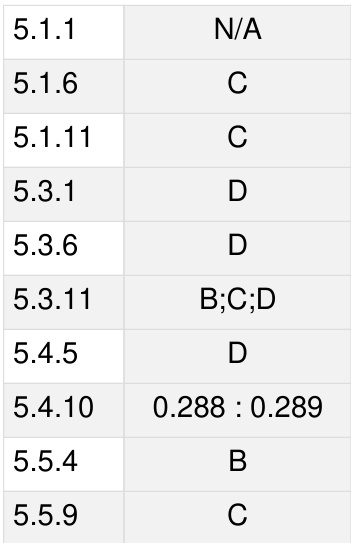

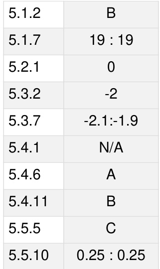

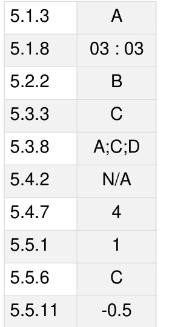

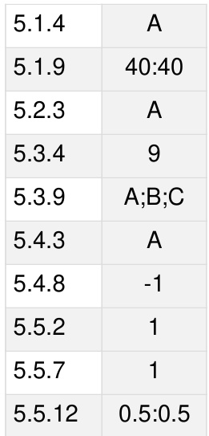

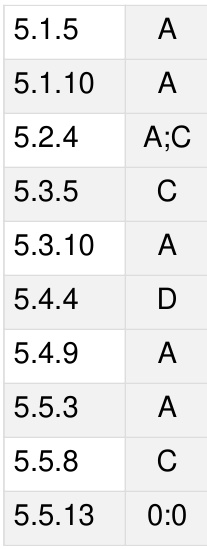