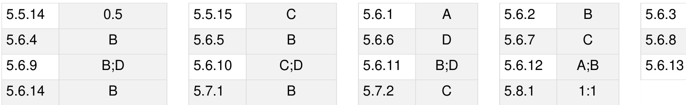
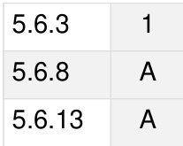
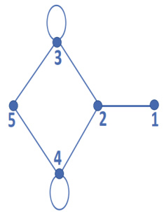
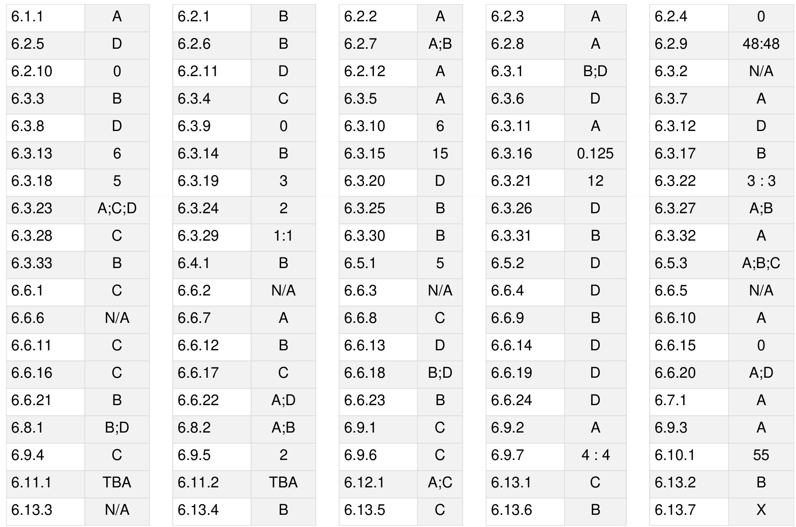
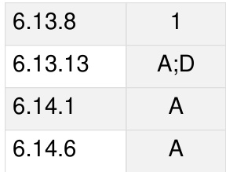
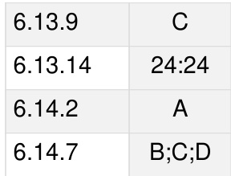
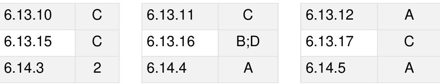
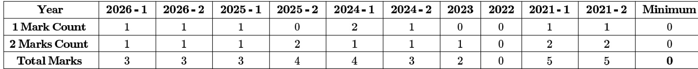

Syllabus: Matrices, determinants, System of linear equations, Eigenvalues and eigenvectors, LU decomposition.

MarkDistributioninPrevious GATE   

Welcome to the "Engineering Mathematics: Linear Algebra" chapter of your GATE Computer Science preparation. This section serves as a comprehensive, exam-focused reference to help you master the fundamental concepts and prob lem-solving techniques essential for success.

# Subject Overview

Linear Algebra is the branch of mathematics concerning vector spaces and linear mappings between such spaces. It is a cornerstone of modern computing, underpinning areas like machine learning (e.g., PCA, SVMs, neural networks), computer graphics, data science, algorithm design, and optimization. For GATE CS, Linear Algebra typically contributes a significant portion of the Engineering Mathematics section, often carrying 3-5 marks out of the total 8-10 marks allocated to mathematics. Questions can range from direct computational problems (e.g., finding determinants, eigenvalues, ranks) to conceptual understanding (e.g., properties of vector spaces, subspaces, consistency of systems of equations) and application-based scenarios. Proficiency in this subject is not just about scoring marks but also about building a strong mathematical foundation for advanced computer science topics.

# Topic-wise Key Concepts

# Cartesian Coordinates

Cartesian coordinates provide a way to uniquely specify the position of a point in a space using numerical values. In 2D, a point is defined by its distance from two perpendicular axes $( \mathsf { x } , \mathsf { y } )$ , and in 3D, by its distance from three mutually perpendicular axes $( \mathsf { x } , \mathsf { y } , \mathsf { z } )$ .

Definition: A system that uses an ordered set of numbers (coordinates) to specify the location of a point in a space.   
For a 2D plane, it's $( x , y )$ ; for 3D space, it's $( x , y , z )$ .

Distance Formula (2D): The distance between two points $P _ { 1 } ( x _ { 1 } , y _ { 1 } )$ and $P _ { 2 } ( x _ { 2 } , y _ { 2 } )$ is given by:

$$
d = { \sqrt { ( x _ { 2 } - x _ { 1 } ) ^ { 2 } + ( y _ { 2 } - y _ { 1 } ) ^ { 2 } } }
$$

Distance Formula (3D): The distance between two points $P _ { 1 } ( x _ { 1 } , y _ { 1 } , z _ { 1 } )$ and $P _ { 2 } ( x _ { 2 } , y _ { 2 } , z _ { 2 } )$ is given by:

$$
d = { \sqrt { ( x _ { 2 } - x _ { 1 } ) ^ { 2 } + ( y _ { 2 } - y _ { 1 } ) ^ { 2 } + ( z _ { 2 } - z _ { 1 } ) ^ { 2 } } }
$$

Midpoint Formula (2D): The midpoint $M$ of a line segment connecting $P _ { 1 } ( x _ { 1 } , y _ { 1 } )$ and $P _ { 2 } ( x _ { 2 } , y _ { 2 } )$ is:

$$
M = \left( { \frac { x _ { 1 } + x _ { 2 } } { 2 } } , { \frac { y _ { 1 } + y _ { 2 } } { 2 } } \right)
$$

# Properties:

0 Allows geometric problems to be translated into algebraic ones.   
。 Forms the basis for vector representation and operations.

# Common Pitfalls:

Confusing x and y coordinates, especially when dealing with transformations. 。 Incorrectly applying distance or midpoint formulas.

# Problem-Solving Techniques:

Visualize the points and vectors in the coordinate system. 。 Break down complex geometric problems into simpler algebraic calculations.

# Determinant

The determinant is a scalar value that can be computed from the elements of a square matrix. It provides crucial information about the matrix, such as its invertibility and the volume scaling factor of the linear transformation it represents.

Definition: A scalar value associated with a square matrix $A$ , denoted as $\operatorname* { d e t } ( A )$ or $| A |$ . Formulas:   
1. For a $\mathbf { 2 } \times \mathbf { 2 }$ matrix: If $A = { \left( \begin{array} { l l } { a } & { b } \\ { c } & { d } \end{array} \right) }$ , then $| A | = a d - b c$ .   
2. For a $\mathbf { 3 \times 3 }$ matrix (Sarrus' Rule): If $A = { \left( \begin{array} { l l l } { a } & { b } & { c } \\ { d } & { e } & { f } \\ { g } & { h } & { i } \end{array} \right) } ~ .$ then $| A | = a ( e i - f h ) - b ( d i - f g ) + c ( d h - e g ) .$ . This can also be wr $a { \left| \begin{array} { l l } { e } & { f } \\ { h } & { i } \end{array} \right| } - b { \left| \begin{array} { l l } { d } & { f } \\ { g } & { i } \end{array} \right| } + c { \left| \begin{array} { l l } { d } & { e } \\ { g } & { h } \end{array} \right| } .$   
3. General $n \times n$ matrix (Laplace Expansion/Cofactor $\begin{array} { r } { | A | = \sum _ { j = 1 } ^ { n } ( - 1 ) ^ { i + j } a _ { i j } M _ { i j } } \end{array}$ (along row ) or $\begin{array} { r } { | A | = \sum _ { i = 1 } ^ { n } ( - 1 ) ^ { i + j } a _ { i j } M _ { i j } } \end{array}$ (along column $\dot { \jmath } )$ where $M _ { i j }$ is the minor (determinant of the submatrix obtained by deleting row $\textit { i }$ and column $j )$ .

Properties: $\operatorname* { d e t } ( A ^ { T } ) = \operatorname* { d e t } ( A )$ $\operatorname* { d e t } ( A B ) = \operatorname* { d e t } ( A ) \operatorname* { d e t } ( B )$ $\operatorname* { d e t } ( k A ) = k ^ { n } \operatorname* { d e t } ( A )$ for an $n \times n$ matrix $A$ and scalar $k$ . If a matrix has a row or column of zeros, its determinant is 0. If a matrix has two identical rows or columns, its determinant is 0. If a matrix is triangular (upper or lower), its determinant is the product of its diagonal elements. Swapping two rows/columns changes the sign of the determinant. Adding a multiple of one row/column to another row/column does not change the determinant. A square matrix $A$ is invertible if and only if $\operatorname* { d e t } ( A ) \neq 0$ . $\begin{array} { r } { \operatorname* { d e t } ( A ^ { - 1 } ) = \frac { 1 } { \operatorname* { d e t } ( A ) } } \end{array}$

# Common Pitfalls:

Sign errors in cofactor expansion. 。 Incorrectly applying properties, especially for scalar multiplication $\operatorname* { d e t } ( k A )$ 。 Assuming $\operatorname* { d e t } ( A + B ) = \operatorname* { d e t } ( A ) + \operatorname* { d e t } ( B )$ (which is generally false).

# Problem-Solving Techniques:

For larger matrices, use row/column operations to create zeros and simplify the calculation before applying cofactor expansion (e.g., make it triangular).   
Exploit properties (e.g., identical rows/columns, triangular form) to quickly find the determinant.   
Choose the row or column with the most zeros for cofactor expansion.

# Eigen Value

Eigenvalues are special scalar values associated with a square matrix that characterize its fundamental properties. When a linear transformation is applied to an eigenvector, the eigenvector's direction remains unchanged, only its magnitude is scaled by the corresponding eigenvalue.

Definition: For a square matrix $A$ , a scalar $\lambda$ is an eigenvalue if there exists a non-zero vector $\mathbf { v }$ (eigenvector) such that $A \mathbf { v } = \lambda \mathbf { v }$ .

Formulas/Theorems:

1. Characteristic Equation: To find eigenvalues, solve the equation $\operatorname* { d e t } ( A - \lambda I ) = 0$ , where $I$ is the identity matrix of the same dimension as $A$ .   
2. Cayley-Hamilton Theorem: Every square matrix satisfies its own characteristic equation. If $P ( \lambda ) = \operatorname* { d e t } ( A - \lambda I )$ is the characteristic polynomial, then $P ( A ) = 0$ . This is useful for finding powers of a matrix or its inverse.   
3. Sum of Eigenvalues: The sum o the eigenvalues of a matrix $A$ is equal to its trace (sum of diagonal elements): $\sum \lambda _ { i } = \operatorname { t r a c e } ( A )$ .   
4. Product of Eigenvalues: The product of the eigenvalues of a matrix $A$ is equal to its determinant: $\Pi \lambda _ { i } = \operatorname* { d e t } ( A )$ .

# Properties:

If $\lambda$ is an eigenvalue of $A$ , then $\lambda ^ { k }$ is an eigenvalue of $A ^ { k }$ .   
If $\lambda$ is an eigenvalue of $A$ , then $1 / \lambda$ is an eigenvalue of $A ^ { - 1 }$ (if $A$ is invertible). If $\lambda$ is an eigenvalue of $A$ , then $k \lambda$ is an eigenvalue of $k A$ .   
The eigenvalues of a symmetric matrix are always real.   
Eigenvectors corresponding to distinct eigenvalues are linearly independent.   
For a real symmetric matrix, eigenvectors corresponding to distinct eigenvalues are orthogonal.   
The eigenvalues of a triangular matrix (upper or lower) are its diagonal entries.   
A matrix $A$ is singular (non-invertible) if and only if 0 is an eigenvalue of $A$ .

# Common Pitfalls:

Algebraic errors when solving the characteristic equation.   
Forgetting to check for non-zero eigenvectors.   
Confusing algebraic and geometric multiplicity.

# Problem-Solving Techniques:

Always start by setting up the characteristic equation $\operatorname* { d e t } ( A - \lambda I ) = 0$   
。 For $\mathbf { 2 \times 2 }$ matrices, use $\lambda ^ { 2 } - \operatorname { t r a c e } ( A ) \lambda + \operatorname* { d e t } ( A ) = 0$ .   
。 Use the sum and product of eigenvalues properties to verify your calculated eigenvalues or to find a missing eigenvalue.   
。 For eigenvectors, substitute each eigenvalue back into $( A - \lambda I ) \mathbf { v } = \mathbf { 0 }$ and solve the resulting system of equations.

# Gaussian Elimination

Gaussian elimination is an algorithm used to solve systems of linear equations, find the rank of a matrix, compute the inverse of a matrix, and calculate determinants. It transforms a matrix into row echelon form using elementary row operations.

Definition: A systematic procedure to transform a matrix into row echelon form (or reduced row echelon form) using elementary row operations.   
Elementary Row Operations:   
1. Swapping two rows $( R _ { i }  R _ { j } )$   
2. Multiplying a row by a non-zero scalar $( k R _ { i } \to R _ { i } )$ ).   
3. Adding a multiple of one row to another row $( R _ { i } + k R _ { j }  R _ { i } )$ ).

Row Echelon Form (REF): A matrix is in REF if: All non-zero rows are above any rows of all zeros. 。 The leading entry (pivot) of each non-zero row is in a column to the right of the leading entry of the row above it. 。 All entries in a column below a leading entry are zeros.

Reduced Row Echelon Form (RREF): A matrix is in RREF if it is in REF The leading entry in each non-zero row is 1 (called a leading 1). 。 Each column containing a leading · has zeros everywhere else.

# Applications:

Solving systems of linear equations.   
Finding the rank of a matrix.   
Computing the inverse of a matrix (by augmenting $[ A | I ]$ and reducing to $[ I | A ^ { - 1 } ] )$ .   
Calculating determinants (by keeping track of row operations).

Common Pitfalls:

。 Arithmetic errors during row operations.   
。 Forgetting to apply operations to the augmented part of the matrix when solving systems or finding inverses.   
。 Incorrectly identifying pivot elements.

# Problem-Solving Techniques:

0 Always aim to create zeros below the pivot elements first. Work column by column from left to right. Use fractions carefully; sometimes it's better to multiply a row to avoid fractions temporarily.   
。 For solving systems, use back-substitution after reaching REF.

# LU Decomposition

LU decomposition factors a square matrix $A$ into the product of a lower triangular matrix $L$ and an upper triangular matrix $U$ . This factorization is particularly useful for efficiently solving multiple systems of linear equations with the same coefficient matrix, as it simplifies the process into two triangular systems.

Definition: A factorization of a square matrix $A$ into the product of a lower triangular matrix $L$ (with 1s on the diagonal) and an upper triangular matrix $U$ , such that $A = L U$ .   
Process:

1. Use Gaussian elimination to transform $A$ into an upper triangular matrix $U$ .   
2. The lower triangular matrix $L$ is constructed using the multipliers used in the Gaussian elimination process. If $R _ { i } - k R _ { j }  R _ { i }$ was used, then $\begin{array} { r } { L _ { i j } = k } \end{array}$ . The diagonal elements of $L$ are 1s.   
3. If row swaps are needed, a permutation matrix $P$ is introduced, such that $P A = L U$ .

Solving $A \mathbf { x } = \mathbf { b }$ using LU Decomposition:   
1. Substitute $A = L \bar { U } ; L U { \bf x } = { \bf b }$ .   
2. Let $U \mathbf { x } = \mathbf { y }$ .   
3. Solve $\mathbf { \Delta } L \mathbf { y } = \mathbf { b }$ for $\mathbf { y }$ using forward substitution (since $L$ is lower triangular).   
4. Solve $U \mathbf { x } = \mathbf { y }$ for $\mathbf { x }$ using backward substitution (since $U$ is upper triangular

Properties: Not all matrices have an LU decomposition without pivoting (row swaps). If $A$ is non-singular and all its leading principal minors are non-zero, then $A$ has a un

Common Pitfalls: Incorrectly forming $L$ from the multipliers. Errors in forward or backward substitution. Forgetting the permutation matrix $P$ if row swaps are involved.

# Problem-Solving Techniques:

Carefully track the multipliers used in Gaussian elimination to construct $L$ .   
Practice forward and backward substitution for efficiency.   
Recognize when pivoting is necessary (e.g., if a pivot element becomes zero).

# Matrix

A matrix is a rectangular array of numbers, symbols, or expressions arranged in rows and columns. Matrices are fundamental to linear algebra, representing linear transformations, systems of equations, and data structures.

Definition: A rectangular array of numbers (or functions) arranged in $\scriptstyle m$ rows and $\scriptstyle n$ columns. Denoted a   
Types of Matrices: Square Matrix: $m = n$ . Row Matrix: $m = 1$ . Column Matrix (Vector): $n = 1$ . Identity Matrix $( I )$ : Square matrix with 1s on the main diagonal and 0s elsewhere. $A I = I A = A$ . Zero Matrix ( ): All elements are 0. $A + 0 = A$ . Diagonal Matrix: Square matrix where all non-diagonal elements are 0. Scalar Matrix: A diagonal matrix where all diagonal elements are equal. Symmetric Matrix: $A = A ^ { T }$ . Skew-Symmetric Matrix: $A = - A ^ { T }$ . Diagonal elements are 0. Orthogonal Matrix: $A A ^ { T } = A ^ { T } A = I$ , which implies $A ^ { - 1 } = A ^ { T }$ . Determinant is $\pm 1$ . Invertible/Non-singular Matrix: A square matrix $A$ for which there exists a matrix $A ^ { - 1 }$ such that $A A ^ { - 1 } = A ^ { - 1 } A = I .$ $\operatorname* { d e t } ( A ) \neq 0$ . Singular Matrix: A square matrix $A$ for which $\operatorname* { d e t } ( A ) = 0$ . It does not have an inverse.

Operations:

1. Addition/Subtraction: Element-wise, only for matrices of the same dimensions. $( A + B ) _ { i j } = A _ { i j } + B _ { i j }$ .   
2. Scalar Multiplication: Multiply each element by the scalar. $( k A ) _ { i j } = k A _ { i j }$   
3. Matrix Multiplication: $\begin{array} { r } { ( A B ) _ { i j } = \sum _ { k = 1 } ^ { p } A _ { i k } B _ { k j } } \end{array}$ . Requires number of columns of $A$ to equal number of rows of $B$ . Resulting matrix has dimensions $m \times q$ if $A$ is $m \times p$ and is $p \times q$ .   
4. Transpose $( A ^ { T } )$ : Rows become columns and columns become rows. $( A ^ { T } ) _ { i j } = A _ { j i }$ .   
5. Inverse $( A ^ { - 1 } )$ : For a $\mathbf { 2 \times 2 }$ matrix $\begin{array} { r } { A = \left( \begin{array} { c c } { a } & { b } \\ { c } & { d } \end{array} \right) , A ^ { - 1 } = \frac { 1 } { a d - b c } \left( \begin{array} { c c } { d } & { - \bar { b } } \\ { - c } & { a } \end{array} \right) } \end{array}$ For general $n \times n$ , $\begin{array} { r } { A ^ { - 1 } = \frac { 1 } { \operatorname* { d e t } ( A ) } \mathrm { \mathbf { a d j } } ( A ) . } \end{array}$ , where $\operatorname { a d j } ( A )$ is the adjugate matrix (transpose of the cofactor matrix).

# Properties:

Matrix addition is commutative: $A + B = B + A$ .   
Matrix multiplication is associative: $( A B ) C = A ( B C )$ .   
Matrix multiplication is generally NOT commutative: $A B \neq B A$ $( A + B ) ^ { T } = A ^ { T } + B ^ { T }$   
$\mathbf { \nabla } _ { \rho } ( A B ) ^ { T } = B ^ { T } A ^ { T }$ .   
$\acute { ( A ^ { - 1 } ) } ^ { - 1 } = A .$

$( A B ) ^ { - 1 } = B ^ { - 1 } A ^ { - 1 } .$ ${ \mathrm { ~ } } \circ ( A ^ { T } ) ^ { - 1 } = ( A ^ { - 1 } ) ^ { T } .$

Common Pitfalls: Incorrect dimensions for addition or multiplication. Assuming commutativity for matrix multiplication. Errors in calculating inverses, especially for larger matrices.

# Problem-Solving Techniques:

。 Always check dimensions before performing operations.   
For matrix multiplication, visualize the dot products of rows and columns.   
。 For inverses, use the adjugate formula for $2 \times 2$ and Gaussian elimination for larger matrices.

# Multiplicity

Multiplicity refers to how many times an eigenvalue appears as a root of the characteristic polynomial (algebraic multiplicity) and the dimension of its corresponding eigenspace (geometric multiplicity). These concepts are crucial for understanding diagonalizability of a matrix.

# Definition:

Algebraic Multiplicity (AM): The number of times an eigenvalue $\lambda$ appears as a root of the characteristic polynomial $\operatorname* { d e t } ( A - \lambda I ) = 0$ .   
。 Geometric Multiplicity $( \mathsf { G M } )$ : The dimension of the eigenspace corresponding to $\lambda$ , which is the number of linearly independent eigenvectors associated with $\lambda$ . It is given by $n - \operatorname { r a n k } ( A - \lambda I )$ , where $n$ is the dimension of the matrix.

Properties/Theorems: For any eigenvalue $\lambda , \mathbf { 1 } \leq \mathrm { G M } ( \lambda ) \leq \mathrm { A M } ( \lambda )$ . A matrix $A$ is diagonalizable if and only if for every eigenvalue $\lambda$ , $\mathrm { A M } ( \lambda ) = \mathrm { G M } ( \lambda )$ . If all eigenvalues are distinct, then $\mathrm { A M } ( \lambda ) = \mathrm { G M } ( \lambda ) = 1$ for all $\lambda$ , and the matrix is diagonalizable.

# Common Pitfalls:

Confusing AM and GM.   
Incorrectly calculating the rank of $( A - \lambda I )$ .   
Assuming diagonalizability based only on AM without checking GM.

# Problem-Solving Techniques:

。 First, find all eigenvalues and their algebraic multiplicities by solving $\operatorname* { d e t } ( A - \lambda I ) = 0$ .   
。 For each eigenvalue, calculate the rank of $( A - \lambda I )$ to find its geometric multiplicity.   
Compare AM and GM for each eigenvalue to determine diagonalizability.

# Orthonormality

Orthonormality describes a set of vectors that are mutually orthogonal (perpendicular) and each has a unit length (normalized). Orthonormal bases simplify many calculations in linear algebra, particularly in projections and coordinate transformations.

# Definition:

Orthogonal Vectors: Two vectors and  are orthogonal if their dot product is zero: $\mathbf { u } \cdot \mathbf { v } = \mathbf { u } ^ { T } \mathbf { v } = 0 .$ Normalized Vector: A vector $\mathbf { u }$ is normalized if its length (magnitude) is 1: $\mathbf { \partial } : | | \mathbf { u } | | = \sqrt { \mathbf { u } \cdot \mathbf { u } } = 1$ . Orthonormal Set: A set of vectors $\{ \mathbf { v } _ { 1 } , \mathbf { v } _ { 2 } , \ldots , \mathbf { v } _ { k } \}$ is orthonormal if they are mutually orthogonal and each vector is normalized. That is, $\mathbf { v } _ { i } \cdot \mathbf { v } _ { j } = \delta _ { i j }$ (Kronecker delta), where $\delta _ { i j } = 1$ if $i = j$ and  if $i \neq j$ .

Gram-Schmidt Orthonormalization Process: A procedure to transform a set of linearly independent vectors $\{ \mathbf { x } _ { 1 } , \ldots , \mathbf { x } _ { k } \}$ into an orthonormal set $\{ \mathbf { u } _ { 1 } , . . . , \mathbf { u } _ { k } \}$ .   
1. $\mathbf { v } _ { 1 } = \mathbf { x } _ { 1 }$   
2. $\begin{array} { r l } & { \dot { \mathbf { v } _ { 2 } } = \dot { \mathbf { x } _ { 2 } } - \operatorname { p r o j } _ { \mathbf { v } _ { 1 } } \mathbf { x } _ { 2 } = \mathbf { x } _ { 2 } - \frac { \mathbf { x } _ { 2 } \cdot \mathbf { v } _ { 1 } } { \left\| \mathbf { v } _ { 1 } \right\| ^ { 2 } } \mathbf { v } _ { 1 } } \\ & { \mathbf { v } _ { 3 } = \mathbf { x } _ { 3 } - \operatorname { p r o j } _ { \mathbf { v } _ { 1 } } \mathbf { x } _ { 3 } - \operatorname { p r o j } _ { \mathbf { v } _ { 2 } } \mathbf { x } _ { 3 } = \mathbf { x } _ { 3 } - \frac { \mathbf { x } _ { 3 } \cdot \mathbf { v } _ { 1 } } { \left\| \mathbf { v } _ { 1 } \right\| ^ { 2 } } \mathbf { v } _ { 1 } - \frac { \mathbf { x } _ { 3 } \cdot \mathbf { v } _ { 2 } } { \left\| \mathbf { v } _ { 2 } \right\| ^ { 2 } } \mathbf { v } _ { 2 } } \end{array}$   
3.   
4. Continue for all vectors.   
5. Normalize each $\begin{array} { r } { \mathbf { v } _ { i : } \mathbf { u } _ { i } = \frac { \mathbf { v } _ { i } } { \left\| \mathbf { v } _ { i } \right\| } } \end{array}$

# Properties:

。 An orthonormal set of vectors is always linearly independent.   
U If $Q$ is an orthogonal matrix (columns form an orthonormal set), then $Q ^ { T } Q = I$ , and $Q ^ { - 1 } = Q ^ { T }$ . For an orthogonal matrix $Q$ , $| | Q \mathbf { x } | | = | | \mathbf { x } | |$ (preserves length).   
。 For an orthogonal matrix $Q , ( Q \mathbf { x } ) \cdot ( Q \mathbf { y } ) = \mathbf { x } \cdot \mathbf { y }$ (preserves dot product and angle).

# Common Pitfalls:

Arithmetic errors in Gram-Schmidt, especially with projections.   
Forgetting to normalize vectors after making them orthogonal.   
Confusing orthogonal with orthonormal.

# Problem-Solving Techniques:

Systematically apply the Gram-Schmidt process, calculating one orthogonal vector at a time.   
Double-check dot products to ensure orthogonality.   
Always normalize the final set of orthogonal vectors.

# Rank of Matrix

The rank of a matrix is a fundamental property that measures the "linear independence" present in its rows and columns. It indicates the dimension of the vector space spanned by its rows or columns, and is crucial for understanding the solvability of linear systems.

Definition: The maximum number of linearly independent row vectors (row rank) or column vectors (column rank) in a matrix. The row rank is always equal to the column rank.   
Calculation Methods:   
1. Using Row Echelon Form: The rank of a matrix is the number of non-zero rows in its row echelon form. 2. Using Determinants (Minors): The rank of a matrix $A$ is the largest integer $r$ such that there exists an $\boldsymbol { r } \times \boldsymbol { r }$ submatrix of $A$ with a non-zero determinant.

# Properties/ Theorems:

For an $m \times n$ matrix $A , \operatorname { r a n k } ( A ) \leq \operatorname* { m i n } ( m , n )$ .   
$\operatorname { r a n k } ( A ) = 0$ if and only if $A$ is a zero matrix.   
$\operatorname { r a n k } ( A ) = \operatorname { r a n k } ( A ^ { T } )$ .   
$\circ \ \operatorname { r a n k } ( A B ) \leq \operatorname* { m i n } ( \operatorname { r a n k } ( A ) , \operatorname { r a n k } ( B ) )$ .   
Rank-Nullity Theorem: For an $m \times n$ matrix $A , \operatorname { r a n k } ( A ) + \operatorname { n u l l i t y } ( A ) = n$ , where $( A )$ is the   
dimension of the null space (kernel) of $A .$   
A square matrix $A$ of size $n \times n$ is invertible i and only if $\operatorname { r a n k } ( A ) = n$ .   
For a system $A \mathbf { x } = \mathbf { b }$ : Consistent if $\operatorname { r a n k } ( A ) = \operatorname { r a n k } ( [ A | \mathbf { b } ] )$ . Unique solution if $\operatorname { r a n k } ( A ) = \operatorname { r a n k } ( [ A | \mathbf { b } ] ) = n$ (number of variables). Infinitely many solutions $\operatorname { r a n k } ( A ) = \operatorname { r a n k } ( [ A | \mathbf { b } ] ) < n$ . Inconsistent f $\operatorname { r a n k } ( A ) \neq \operatorname { r a n k } ( [ A | \mathbf { b } ] )$ .

# Common Pitfalls:

Errors in Gaussian elimination leading to incorrect row echelon form.   
Misinterpreting the number of non-zero rows.   
。 Not considering the augmented matrix for system consistency.

# Problem-Solving Techniques:

The most reliable method is to reduce the matrix to row echelon form using Gaussian elimination and count the number of non-zero rows.   
。 For smaller matrices, checking determinants of submatrices can be faster.   
Use the Rank-Nullity Theorem to find nullity if rank is known, or vice versa.

# Singular Value Decomposition (SVD)

Singular Value Decomposition is a powerful matrix factorization technique that decomposes any $m \times n$ matrix $A$ into three matrices: $U , { \boldsymbol { \Sigma } } ,$ and $V ^ { T }$ It generalizes the concept of eigenvalues and eigenvectors to non-square matrices and has broad applications in data compression, noise reduction, and recommender systems.

Definition: Any $m \times n$ matrix $A$ can be factored as $\boldsymbol { A } = \boldsymbol { U \Sigma V } ^ { T }$ , where: $U$ is an $m \times m$ orthogonal matrix whose columns are the left singular vectors of $A$ . $\Sigma$ is an $m \times n$ diagonal matrix with non-negative real numbers on the diagonal, called singular values $\textstyle ( \sigma _ { i } )$ , arranged in decreasing order. The non-zero singular values are $\sigma _ { 1 } \geq \sigma _ { 2 } \geq \cdots \geq \sigma _ { r } > 0$ , where $r = { \mathrm { r a n k } } ( A )$ $V$ is an $n \times n$ orthogonal matrix whose columns are the right singular vectors of $A . V ^ { T }$ is its transpose.

# Relationship to Eigenvalues:

The singular values $\sigma _ { i }$ of $A$ are the square roots of the eigenvalues of $A ^ { T } A ( \mathsf { o r } A A ^ { T } )$ .   
。 The columns of $V$ are the eigenvectors of $A ^ { T } A$ .   
The columns of $U$ are the eigenvectors of .

# Properties/Applications:

。 SVD exists for any matrix (square or rectangular).   
。 The number of non-zero singular values is equal to the rank of the matrix.   
。 Low-rank approximation: By keeping only the largest singular values and corresponding singular vectors, SVD can approximate a matrix with fewer components, useful for data compression. Pseudo-inverse: The SVD can be used to compute the Moore-Penrose pseudo-inverse of a matrix. Principal Component Analysis (PCA): SVD is closely related to PCA, where singular vectors correspond to   
principal components.

# Common Pitfalls:

Confusing singular values with eigenvalues.   
。 Incorrectly calculating eigenvectors for $A ^ { T } A$ or $A A ^ { T }$ .   
。 Not arranging singular values in decreasing order.

# Problem-Solving Techniques:

Calculate $A ^ { T } A ( \mathsf { o r } A A ^ { T } )$ .   
Find the eigenvalues of $A ^ { T } A .$ . The square roots of these eigenvalues are the singular values $\sigma _ { i }$ .   
Find the eigenvectors of $A ^ { T } A$ These form the columns of $V$ .   
。 Find the eigenvectors of $A A ^ { T }$ . These form the columns of $U$ .   
。 Alternatively, $\begin{array} { r } { U _ { i } = \frac { 1 } { \sigma _ { i } } A V _ { i } } \end{array}$ .

# Statistics

While a broad field, within the context of linear algebra for GATE CS, statistics primarily involves concepts like mean, variance, covariance, and their matrix representations. These are crucial for understanding data analysis techniques like PCA, which heavily rely on linear algebra.

Definition (Linear Algebra Context): Focuses on the mathematical tools (vectors, matrices) used to analyze and model data, particularly in multivariate statistics.

Key Concepts:

1. Mean: For a vector $\mathbf { x } = [ x _ { 1 } , . . . , x _ { n } ] ^ { T }$ , the mean is $\begin{array} { r } { \overline { { \pmb { x } } } = \frac { 1 } { n } \sum _ { i = 1 } ^ { n } x _ { i } } \end{array}$ .   
2. Variance: A measure of how spread out the data is. For a vector $\mathbf { x }$ , $\begin{array} { r } { \mathrm { V a r } ( \mathbf { x } ) = \frac { 1 } { n - 1 } \sum _ { i = 1 } ^ { n } ( x _ { i } - \bar { x } ) ^ { 2 } } \end{array}$ . 3. Covariance: A measure of how two variables change together. For two vectors $\mathbf { x }$ and $\mathbf { y }$ ,   
$\begin{array} { r } { \mathrm { C o v } ( \mathbf { x } , \mathbf { y } ) = \frac { 1 } { n - 1 } \sum _ { i = 1 } ^ { n } ( x _ { i } - \bar { x } ) ( y _ { i } - \bar { y } ) } \end{array}$ .   
4. Covariance Matrix: For a dataset with $p$ variables and $n$ observations, the covariance matrix $\Sigma$ is a $\boldsymbol { p } \times \boldsymbol { p }$ symmetric matrix where $\Sigma _ { i j } = \mathrm { C o v } ( \mathbf { x } _ { i } , \mathbf { x } _ { j } )$ and $\Sigma _ { i i } = \mathrm { V a r } ( \mathbf { x } _ { i } )$ .

$$
\Sigma = \frac { 1 } { n - 1 } X ^ { T } X
$$

where $X$ is the data matrix with columns centered (mean subtracted).

5. Principal Component Analysis (PCA): A dimensionality reduction technique that uses the eigenvectors of the covariance matrix (or SVD of the data matrix) to find orthogonal directions (principal components) of maximum variance in the data.

# Properties:

Covariance matrix is always symmetric and positive semi-definite. 。 Eigenvalues of the covariance matrix represent the variance along the principal components. Eigenvectors of the covariance matrix are the principal components.

# Common Pitfalls:

Confusing variance with standard deviation.   
0 Incorrectly calculating covariance or covariance matrix.   
0 Not centering data before calculating covariance matrix for PCA.

# Problem-Solving Techniques:

Understand the definitions of mean, variance, and covariance.   
。 For PCA, compute the covariance matrix, then find its eigenvalues and eigenvectors. Relate SVD to PCA: SVD of the centered data matrix directly gives principal components and singular values related to variance.

# Subspace

A subspace is a subset of a vector space that itself satisfies the properties of a vector space. It must contain the zero vector, be closed under vector addition, and closed under scalar multiplication. Subspaces are fundamental building

blocks for understanding the structure of vector spaces.

Definition: A subset $W$ of a vector space $V$ is a subspace of $V$ if $W$ is itself a vector space under the operations defined on $V$ .   
Conditions for a Subspace: A non-empty subset $W$ of a vector space $V$ is a subspace if and only if:   
1. The zero vector of $V$ is in $W _ { \mathbf { \lambda } } ( \mathbf { 0 } \in W )$ .   
2. is closed under vector addition: If $\mathbf { v } \in W$ , then $\mathbf { u } + \mathbf { v } \in W$ .   
3. is closed under scalar multiplication: If $\mathbf { u } \in W$ and $c$ is any scalar, then $c \mathbf { u } \in W$ .

Important Subspaces Associated with a Matrix $A$ :

Column Space $( \operatorname { C o l } ( A ) )$ : The span of the column vectors of $A$ . It is a subspace of (if $A$ is $m \times n )$ .   
$\dim ( \operatorname { C o l } ( A ) ) = \operatorname { r a n k } ( A )$ .   
Row Space $( \operatorname { R o w } ( A ) )$ : The span of the row vectors of $A$ . It is a subspace of . $\dim ( \operatorname { R o w } ( A ) ) = \operatorname { r a n k } ( A )$   
Null Space $( \operatorname { N u l l } ( { \dot { A } } )$ or $\operatorname { K e r } ( A ) )$ : The set of all vectors $\mathbf { x }$ such that $\pmb { A } \mathbf { x } = \mathbf { 0 }$ . It is a subspace of $\mathbb { R } ^ { n }$ .   
$\dim ( \mathrm { N u l l } ( A ) ) = \operatorname { n u l l i t y } ( A )$ .   
Left Null Space $( \mathrm { N u l l } ( A ^ { T } ) )$ : The set of all vectors  such that $A ^ { T } \mathbf { y } = \mathbf { 0 }$ . It is a subspace of .

Properties:

The intersection of two subspaces is always a subspace.   
The union of two subspaces is generally not a subspace.   
The sum of two subspaces $W _ { 1 } + W _ { 2 } = \{ \mathbf { w } _ { 1 } + \mathbf { w } _ { 2 } \mid \mathbf { w } _ { 1 } \in W _ { 1 } , \mathbf { w } _ { 2 } \in W _ { 2 } \}$ is a subspace.

# Common Pitfalls:

Forgetting to check all three conditions for a subspace (especially the zero vector).   
Confusing the column space with the null space.   
Assuming the union of subspaces is a subspace.

# Problem-Solving Techniques:

。 To check if a set is a subspace, verify the three conditions.   
。 To find a basis for the column space, identify the pivot columns of the original matrix after reducing to REF.   
。 To find a basis for the null space, solve $\pmb { A } \mathbf { x } = \mathbf { 0 }$ and express the solution in terms of free variables.   
。 To find a basis for the row space, use the non-zero rows of the REF of the matrix.

# System of Equations

A system of linear equations is a collection of one or more linear equations involving the same set of variables. Linear algebra provides powerful tools to determine the existence and nature of solutions (unique, infinite, or no solution) for such systems.

Definition: A set of equations of the form $a _ { 1 1 } x _ { 1 } + \cdot \cdot \cdot + a _ { 1 n } x _ { n } = b _ { 1 }$ , ..., $, a _ { m 1 } x _ { 1 } + \cdot \cdot \cdot + a _ { m n } x _ { n } = b _ { m }$ . This can   
be written in matrix form as $A \mathbf { x } = \mathbf { b }$ , where $A$ is the coefficient matrix, $\mathbf { x }$ is the vector of variables, and is the   
constant vector.   
Types of Systems: Homogeneous System: $A \mathbf { x } = \mathbf { 0 }$ . Always consistent (has at least the trivial solution $\mathbf { x } = \mathbf { 0 }$ ). Non-homogeneous System: $A \mathbf { x } = \mathbf { b }$ where $\mathbf { b } \neq \mathbf { 0 }$ .

Consistency and Number of Solutions (using Rank):

1. Consistent System: A system has at least one solution i $\operatorname { \dot { \operatorname { r a n k } } } ( A ) = \operatorname { r a n k } ( [ A | \mathbf { b } ] )$ . Unique Solution: If $\operatorname { r a n k } ( A ) = \operatorname { r a n k } ( [ A | \mathbf { b } ] ) = n$ (number of variables). Infinitely Many Solutions: If $\operatorname { r a n k } ( A ) = \operatorname { r a n k } ( [ A | \mathbf { b } ] ) < n$ . The number of free variables is $n - \mathrm { r a n k } ( A )$ .

2. Inconsistent System: A system has no solution if $\operatorname { r a n k } ( { \tilde { A } } ) \neq \operatorname { r a n k } ( [ A | \mathbf { b } ] )$ .

Solution Methods:

Gaussian Elimination/Row Reduction: Transform the augmented matrix $\left[ A | { \bf b } \right]$ into row echelon form to solve by back-substitution. Matrix Inverse Method: If $A$ is square and invertible, $\mathbf { x } = A ^ { - 1 } \mathbf { b }$ . (Only for unique solutions). Cramer's Rule: For a square system with a unique solution, $\begin{array} { r } { x _ { i } = \frac { \operatorname* { d e t } ( A _ { i } ) } { \operatorname* { d e t } ( A ) } } \end{array}$ where $A _ { i }$ is the matrix formed by replacing the $_ i$ -th column of $A$ with . (Computationally expensive for larger systems).

Properties of Homogeneous Systems:

0 Always has the trivial solution $\mathbf { x } = \mathbf { 0 }$ .   
。 Has non-trivial solutions if and only if $\operatorname* { d e t } ( A ) = 0$ (for square $A$ ) or $\operatorname { r a n k } ( A ) < n$ .   
。 The set of all solutions forms the null space of $A$ .

# Common Pitfalls:

Arithmetic errors during row operations.   
Incorrectly determining consistency or number of solutions.

0 Applying Cramer's rule or inverse method when not applicable (e.g., non-square matrix, singular matrix).

# Problem-Solving Techniques:

。 Always form the augmented matrix $\left[ A | \mathbf { b } \right]$ .   
。 Use Gaussian elimination to reduce the augmented matrix to row echelon form.   
Analyze the rank of $A$ and $\left[ A | \mathbf { b } \right]$ to determine consistency and number of solutions.   
For homogeneous systems, look for non-trivial solutions if $\operatorname* { d e t } ( A ) = 0$ or $\operatorname { r a n k } ( A ) < n$ .

# Vector Space

A vector space is a fundamental algebraic structure consisting of a set of vectors, along with two operations: vector addition and scalar multiplication, which satisfy a set of ten axioms. It provides a generalized framework for working with vectors beyond simple geometric arrows.

Definition: A non -empty set $V$ of objects, called vectors, on which two operations are defined: vector addition (denoted by $+$ ) and scalar multiplication (denoted by juxtaposition), subject to ten axioms. The scalars are typically real numbers $( \mathbb { R } )$ or complex numbers $\left( \mathbb { C } \right)$ .

Axioms of a Vector Space: For all $\mathbf { \updownarrow } , \mathbf { \dot { v } } , \mathbf { \dot { w } } \in V$ and all scalars $c , d$ :   
1. $\mathbf { u } + \mathbf { v } \in V$ (Closure under addition)   
2. $\mathbf { u } + \mathbf { v } = \mathbf { v } + \mathbf { u }$ (Commutativity of addition)   
3. $( \mathbf { u } + \mathbf { v } ) + \mathbf { w } = \mathbf { u } + ( \mathbf { v } + \mathbf { w } )$ (Associativity of addition)   
4. There exists a zero vector $\mathbf { 0 } \in V$ such that $\mathbf { u } + \mathbf { 0 } = \mathbf { u }$ (Additive identity)   
5. For each $\mathbf { u } \in V$ , there exists an additive inverse $- \mathbf { u } \in V$ such that $\mathbf { u } + \left( - \mathbf { u } \right) = \mathbf { 0 }$ (Additive inverse)   
6. $c \mathbf { u } \in V$ (Closure under scalar multiplication)   
7. $c ( \mathbf { u } + \mathbf { v } ) = c \mathbf { u } + c \mathbf { v }$ (Distributivity of scalar over vector addition)   
8. $( c + d ) \mathbf { u } = c \mathbf { u } + d \mathbf { u }$ (Distributivity of scalar over scalar addition)   
9. $c ( d \mathbf { u } ) = ( c d ) \mathbf { u }$ (Associativity of scalar multiplication)

10. $\mathbf { 1 } \mathbf { u } = \mathbf { u }$ (Multiplicative

Key Concepts:

Span: The set of all possible linear combinations of a set of vectors $\{ \mathbf { v } _ { 1 } , . . . , \mathbf { v } _ { k } \}$ . Denoted as   
$\operatorname { s p a n } \{ \mathbf { v } _ { 1 } , \ldots , \mathbf { v } _ { k } \}$ . It is always a subspace.   
Linear Independence: A set of vectors $\{ \mathbf { v } _ { 1 } , \ldots , \mathbf { v } _ { k } \}$ is linearly independent if the only solution to   
$c _ { 1 } \mathbf { v } _ { 1 } + \ldots + c _ { k } \mathbf { v } _ { k } = \mathbf { 0 }$ is $c _ { 1 } = \cdots = c _ { k } = 0$ .   
Basis: A set of vectors in a vector space $V$ that is linearly independent and spans $V$ . The number of vectors in a basis is unique and is called the dimension of the vector space.   
。 Dimension: The number of vectors in any basis for a vector space $V$ , denoted as $\dim ( V )$ .

# Examples of Vector Spaces:

$\mathbb { R } ^ { n }$ (n-dimensional real coordinate space) 。 The set of all $m \times n$ matrices. 。 The set of all polynomials of degree at most $n$ . 。 The set of all continuous functions on an interval.

# Common Pitfalls:

Forgetting to check all axioms when verifying if a set is a vector space.   
。 Confusing a vector space with a subspace.   
。 Incorrectly determining linear independence or a basis.

# Problem-Solving Techniques:

To check if a set is a vector space, verify all ten axioms.   
To check linear independence, set up the equation $c _ { 1 } \mathbf { v } _ { 1 } + \ldots + c _ { k } \mathbf { v } _ { k } = \mathbf { 0 }$ and solve the resulting system of linear equations.   
To find a basis, identify a linearly independent set that spans the space. For $\mathbb { R } ^ { n }$ , this often involves finding pivot columns of a matrix formed by the vectors.

# Quick Formula Reference

# Determinant:

$\mathbf { 2 } \times \mathbf { 2 } \colon | A | = a d - b c$ for $A = { \binom { a b } { c d } }$   
Properties: $| A ^ { T } | = | A | , | A B | = | A | | B | , | k A | = k ^ { n } | A | , | A ^ { - 1 } | = 1 / | A |$   
Invertible iff $| A | \neq 0$

Matrix Operations: Matrix Multiplication: $\begin{array} { r } { ( A B ) _ { i j } = \sum _ { k } A _ { i k } B _ { k j } } \end{array}$

Inverse $\begin{array} { r } { 2 \times 2 { : } A ^ { - 1 } = \frac { 1 } { a d - b c } \binom { d } { - c } \quad { a } } \end{array}$ General Inverse: $\begin{array} { r } { A ^ { - 1 } = \frac { 1 } { \operatorname* { d e t } ( A ) } \widehat { \sf a d j } ( A ) } \end{array}$ Transpose Properties: $( A + \dot { B } ) ^ { T } = A ^ { T } + B ^ { T }$ , $( A B ) ^ { T } = B ^ { T } A ^ { T }$ Inverse Properties: $( A ^ { - 1 } ) ^ { - 1 } = A , ( A B ) ^ { - 1 } = B ^ { - 1 } A ^ { - 1 }$

# Eigenvalues & Eigenvectors:

Characteristic Equation: $\operatorname* { d e t } ( A - \lambda I ) = 0$   
Sum of Eigenvalues: $\Sigma \lambda _ { i } \doteq \mathrm { t r a c e } ( \lambda )$   
Product of Eigenvalues: $\Pi \lambda _ { i } = \operatorname* { d e t } ( \boldsymbol { \dot { A } } )$   
Cayley-Hamilton Theorem: $P ( A ) = 0$ where $P ( \lambda )$ is the characteristic polynomial. Algebraic Multiplicity (AM): Number of times $\lambda$ is a root.   
Geometric Multiplicity $( \mathtt { G M } ) \colon \dim ( \mathrm { N u l l } ( A - \lambda I ) ) = n - \mathrm { r a n k } ( A - \lambda I )$   
Diagonalizable if $\mathrm { A M } ( \lambda ) = \mathrm { G M } ( \lambda )$ for all $\lambda$ .

# Rank of Matrix:

Number of non-zero rows in REF. $\operatorname { r a n k } ( A ) \leq \operatorname* { m i n } ( m , n )$ for $m \times n$ matrix. Rank-Nullity Theorem: $\operatorname { i n k } ( A ) + \operatorname { n u l l i t y } ( A ) = n$ (number of columns). System $A \mathbf { x } = \mathbf { b }$ consistent if $\operatorname { r a n k } ( A ) = \operatorname { r a n k } ( [ A | \mathbf { b } ] )$ . 。 Unique solution if $\operatorname { r a n k } ( A ) = \operatorname { r a n k } ( [ A | \mathbf { b } ] ) = n$ . 。 Infinite solutions if $\operatorname { r a n k } ( A ) = \operatorname { r a n k } ( [ A | \mathbf { b } ] ) < n$ . 。 No solution if $\operatorname { r a n k } ( A ) \neq \operatorname { r a n k } ( [ A | \mathbf { b } ] )$ .

LU Decomposition: $A = L \bar { U }$ (or $P A = L U$ with permutation matrix $P$ ) Solve $A \mathbf { x } = \mathbf { b }$ by $\mathbf { \Delta } \mathbf { L } \mathbf { y } = \mathbf { b }$ (forward substitution) then $U \mathbf { x } = \mathbf { y }$ (backward substitution)

Orthonormality: Orthogonal: ${ \mathbf { u } } \cdot { \mathbf { v } } = 0$ Normalized: $| | \mathbf { u } | | = 1$ Orthonormal: $\mathbf { \ddot { u } } _ { i } \cdot \mathbf { u } _ { j } = \delta _ { i j }$ Orthogonal Matrix ${ \dot { Q } } \colon Q ^ { T } { \dot { Q } } = I \implies Q ^ { - 1 } = Q ^ { T }$

Singular Value Decomposition (SVD): $\boldsymbol { A } = \boldsymbol { U \Sigma V ^ { T } }$ Singular values $\sigma _ { i }$ are $\sqrt { \lambda _ { i } ( A ^ { T } A ) }$ . Columns of $V$ are eigenvectors of $A ^ { T } A$ . Columns of $U$ are eigenvectors of .

# Subspace Conditions:

Contains zero vector.   
Closed under addition.   
Closed under scalar multiplication.

# Important Tips for GATE

1. Master the Basics: Ensure a strong understanding of fundamental definitions (e. g. matrix types, vector space axioms, linear independence). Many conceptual questions test these directly.

2. Practice Gaussian Elimination: This is a core algorithm. Practice it diligently for solving systems, finding rank, and computing inverses. Accuracy and speed are crucial here.

3. Understand Eigenvalue/Eigenvector Properties: Don't just memorize formulas. Understand \*why\* the sum of eigenvalues equals the trace and the product equals the determinant. These properties are often used as shortcuts or for verification.

4. Pay Attention to Matrix Dimensions: Always check if matrix operations (addition, multiplication) are valid based on dimensions. This prevents common errors, especially in matrix multiplication.

5. Rank-Nullity Theorem is Your Friend: This theorem is incredibly useful for quickly finding the nullity if the rank is known, or vice versa, and for analyzing the nature of solutions to linear systems.

6. Beware of Calculation Errors: Linear algebra problems often involve extensive calculations. Use the virtual calculator carefully and double-check intermediate steps. Simple arithmetic mistakes are a common reason for losing marks.

7. Distinguish Between Similar Concepts: Clearly differentiate between algebraic and geometric multiplicity, orthogonal and orthonormal vectors, and the various matrix subspaces (column space, null space, row space).

8. Practice Previous Year Questions: Solve as many GATE previous year questions as possible. This will familiarize you with the typical question patterns, difficulty levels, and time constraints. Focus on understanding the solution approach rather than just getting the answer.

Let $P _ { 1 } , P _ { 2 } , . . . , P _ { n }$ be $\scriptstyle n$ points in the plane such that no three of them are collinear. For every pair of points $P _ { i }$ and , let $L _ { i j }$ be the line passing through them. Let $L _ { a b }$ be the line with the steepest gradient amongst all $\frac { n ( n - 1 ) } { 2 }$ lines.

Which one of the following properties should necessarily be satisfied ?

A. $P _ { a }$ and are adjacent to each other with respect to their $x$ -coordinate B. Either $P _ { a }$ or $P _ { b }$ has the largest or the smallest $y$ -coordinate among all the points C. The difference between $x$ -coordinates $P _ { a }$ and $P _ { b }$ is minimum D. None of the above

✍ Practice Tests: Test 1 (15Q) Test 2 (4Q)

The determinant of the matrix $\left[ { \begin{array} { c c c c } { 6 } & { - 8 } & { 1 } & { 1 } \\ { 0 } & { 2 } & { 4 } & { 6 } \\ { 0 } & { 0 } & { 4 } & { 8 } \\ { 0 } & { 0 } & { 0 } & { - 1 } \end{array} } \right]$

A. B. -48 C. 0 D.

gate1997 linear-algebra normal determinant

The determinant of the matrix

$$
\left[ { \begin{array} { l l l l } { 2 } & { 0 } & { 0 } & { 0 } \\ { 8 } & { 1 } & { 7 } & { 2 } \\ { 2 } & { 0 } & { 2 } & { 0 } \\ { 9 } & { 0 } & { 6 } & { 1 } \end{array} } \right]
$$

A. B. 0 C. D. gatecse-2000 linear-algebra easy determinant

# Answer key☟

${ \begin{array} { r l } { \operatorname { A } } & { x ( x + 1 ) \quad x + 1 } \\ { \operatorname { A } } & { y ( y + 1 ) \quad y + 1 } \\ { \operatorname { 1 } } & { z ( z + 1 ) \quad z + 1 } \\ { \operatorname { C } } & { x - y \quad x ^ { 2 } - y ^ { 2 } } \\ { \operatorname { C } } & { y - z \quad y ^ { 2 } - z ^ { 2 } } \\ { \operatorname { 1 } } & { z \quad z ^ { 2 } } \end{array} }$ ${ \begin{array} { r l } & { \mathbf { B \cdot } \left| { \begin{array} { r l } { 1 } & { x + 1 } & { x ^ { 2 } + 1 } \\ { 1 } & { y + 1 } & { y ^ { 2 } + 1 } \\ { 1 } & { z + 1 } & { z ^ { 2 } + 1 } \end{array} } \right| } \\ & { \mathbf { D \cdot } \left| { \begin{array} { r l } { 2 } & { x + y } & { x ^ { 2 } + y ^ { 2 } } \\ { 2 } & { y + z } & { y ^ { 2 } + z ^ { 2 } } \\ { 1 } & { z } & { z ^ { 2 } } \end{array} } \right| } \end{array} }$

gatecse-2013 linear-algebra normal determinant

# Answer key☟

If the matrix $A$ is such that

$$
A = { \left[ \begin{array} { l } { 2 } \\ { - 4 } \\ { 7 } \end{array} \right] } \left[ 1 \quad 9 \quad 5 \right]
$$

then the determinant of $A$ is equal to

gatecse-2014-set2 linear-algebra numerical-answers easy determinant

# Answer key☟

# 6.2.5 Determinant: GATE CSE 2019 Question: 9

Let $X$ be a square matrix. Consider the following two statements on $X$ .

I. $X$ is invertible II. Determinant of $X$ is non-zero

Which one of the following is TRUE?

A. implies II; II does not imply I B. II implies I; does not imply II C. does not imply II; II does not D. and II are equivalent statements imply

gatecse-2019 engineering-mathematics linear -algebra determinant one-mark

Let

$$
A = { \left[ \begin{array} { l l l l } { 1 } & { 2 } & { 3 } & { 4 } \\ { 4 } & { 1 } & { 2 } & { 3 } \\ { 3 } & { 4 } & { 1 } & { 2 } \\ { 2 } & { 3 } & { 4 } & { 1 } \end{array} \right] }
$$

and

$$
B = { \left[ \begin{array} { l l l l } { 3 } & { 4 } & { 1 } & { 2 } \\ { 4 } & { 1 } & { 2 } & { 3 } \\ { 1 } & { 2 } & { 3 } & { 4 } \\ { 2 } & { 3 } & { 4 } & { 1 } \end{array} \right] }
$$

Let $\operatorname* { d e t } ( A )$ and $\operatorname* { d e t } ( B )$ denote the determinants of the matrices $A$ and $B$ respectively. Which one of the options given below is

A. $\operatorname* { d e t } ( A ) = \operatorname* { d e t } ( B )$

B. $\operatorname* { d e t } ( B ) = - \operatorname* { d e t } ( A )$   
C. $\operatorname* { d e t } ( A ) = 0$   
D. $\operatorname* { d e t } ( A B ) = \operatorname* { d e t } ( A ) + \operatorname* { d e t } ( B )$

gatecse-2023 linear-algebra determinant one-mark easy

Let $A$ be an $n \times n$ matrix over the set of all real numbers $\mathbb { R } .$ . Let $B$ be a matrix obtained from $A$ by swapping two rows. Which of the following statements is/are TRUE?

A. The determinant of $B$ is the negative of the determinant of $A$ B. If $A$ is invertible, then $B$ is also invertible C. If $A$ is symmetric, then $B$ is also symmetric D. If the trace of $A$ is zero, then the trace of $B$ is also zero

gatecse-2024-set2 linear-algebra multiple-selects matrix determinant two-marks

Let $L , M$ , and $N$ be non-singular matrices of order  satisfying the equations $L ^ { 2 } = L ^ { - 1 }$ , $M = L ^ { 8 }$ and $N = L ^ { 2 }$ .

Which ONE of the following is the value of the deteminant of $( M - N ) ?$

A. B. C. D.

gatecse2025-set2 linear-algebra determinant easy one-mark

The determinant of a $4 \times 4$ matrix $A$ is . The value of the determinant of $2 A$ is (answer in integer)

gatecse-2026-set2 linear-algebra determinant numerical-answers two-marks

Consider the $\mathbf { 3 \times 3 }$ matrix $M = \left[ \begin{array} { l l l } { 1 } & { 2 } & { 3 } \\ { 3 } & { 1 } & { 3 } \\ { 4 } & { 3 } & { 6 } \end{array} \right] .$

The determinant of $\left( M ^ { 2 } + 1 2 M \right)$ is gate-ds-ai-2024 numerical-answers matrix determinant linear-algebra easy one-mark

# Answer key☟

$$
A = { \left[ \begin{array} { l l l l l l l l } { 3 } & { 1 } & { 0 } & { 0 } & { 0 } & { \ldots } & { 0 } & { 0 } & { 0 } \\ { 1 } & { 3 } & { 1 } & { 0 } & { 0 } & { \ldots } & { 0 } & { 0 } & { 0 } \\ { 0 } & { 1 } & { 3 } & { 1 } & { 0 } & { \ldots } & { 0 } & { 0 } & { 0 } \\ { 0 } & { 0 } & { 1 } & { 3 } & { 1 } & { \ldots } & { 0 } & { 0 } & { 0 } \\ { \ldots } \\ { \ldots } \\ { 0 } & { 0 } & { 0 } & { 0 } & { 0 } & { \ldots } & { 1 } & { 3 } & { 1 } \\ { 0 } & { 0 } & { 0 } & { 0 } & { 0 } & { \ldots } & { 0 } & { 1 } & { 3 } \end{array} \right] } _ { n \times n }
$$

What is the value of the determinant of $A ?$

$$
\begin{array} { r l } & { \left( \frac { 5 + \sqrt { 3 } } { 2 } \right) ^ { n - 1 } \left( \frac { 5 \sqrt { 3 } + 7 } { 2 \sqrt { 3 } } \right) + \left( \frac { 5 - \sqrt { 3 } } { 2 } \right) ^ { n - 1 } \left( \frac { 5 \sqrt { 3 } - 7 } { 2 \sqrt { 3 } } \right) } \\ & { \left( \frac { 7 + \sqrt { 5 } } { 2 } \right) ^ { n - 1 } \left( \frac { 7 \sqrt { 5 } + 3 } { 2 \sqrt { 5 } } \right) + \left( \frac { 7 - \sqrt { 5 } } { 2 } \right) ^ { n - 1 } \left( \frac { 7 \sqrt { 5 } - 3 } { 2 \sqrt { 5 } } \right) } \\ & { \left( \frac { 3 + \sqrt { 7 } } { 2 } \right) ^ { n - 1 } \left( \frac { 3 \sqrt { 7 } + 5 } { 2 \sqrt { 7 } } \right) + \left( \frac { 3 - \sqrt { 7 } } { 2 } \right) ^ { n - 1 } \left( \frac { 3 \sqrt { 7 } - 5 } { 2 \sqrt { 7 } } \right) } \\ & { \left( \frac { 3 + \sqrt { 5 } } { 2 } \right) ^ { n - 1 } \left( \frac { 3 \sqrt { 5 } + 7 } { 2 \sqrt { 5 } } \right) + \left( \frac { 3 - \sqrt { 5 } } { 2 } \right) ^ { n - 1 } \left( \frac { 3 \sqrt { 5 } - 7 } { 2 \sqrt { 5 } } \right) } \end{array}
$$

# Answer key☟

The determinant of the matrix given below is

$$
\left[ { \begin{array} { c c c c } { 0 } & { 1 } & { 0 } & { 2 } \\ { - 1 } & { 1 } & { 1 } & { 3 } \\ { 0 } & { 0 } & { 0 } & { 1 } \\ { 1 } & { - 2 } & { 0 } & { 1 } \end{array} } \right]
$$

A. B. 0 C. D.

gateit-2005 linear-algebra normal determinant

# Answer key☟

✍ Practice Tests: Test 1 (15Q) Test 2 (15Q) Test 3 (15Q) Test 4 (13Q)

# 6.3.1 Eigen Value: GATE CSE 1993 Question: 01.1

The eigen vector (s) of the matrix

$$
\scriptstyle { \left[ { \begin{array} { l l l } { 0 } & { 0 } & { \alpha } \\ { 0 } & { 0 } & { 0 } \\ { 0 } & { 0 } & { 0 } \end{array} } \right] } , \alpha \neq 0
$$

is (are)

A. $( 0 , 0 , \alpha )$ B. $( \alpha , 0 , 0 )$ C. (0,0,1) D. $( 0 , \alpha , 0 )$

gate1993 eigen-value linear-algebra easy multiple-selects

Obtain the eigen values of the matrix

$$
A = { \left[ \begin{array} { l l l l } { 1 } & { 2 } & { 3 4 } & { 4 9 } \\ { 0 } & { 2 } & { 4 3 } & { 9 4 } \\ { 0 } & { 0 } & { - 2 } & { 1 0 4 } \\ { 0 } & { 0 } & { 0 } & { - 1 } \end{array} \right] }
$$

gatecse-2002 linear-algebra eigen-value normal descriptive

# Answer key ☟

# 6.3.3 Eigen Value: GATE CSE 2005 Question: 49

What are the eigenvalues of the following $2 \times 2$ matrix?

$$
\left( { \begin{array} { l l } { 2 } & { - 1 } \\ { - 4 } & { 5 } \end{array} } \right)
$$

A. $^ { - 1 }$ and B. and C. and D. and

gatecse-2005 linear-algebra eigen-value easy

# Answer key☟

# 6.3.4 Eigen Value: GATE CSE 2007 Question: 25

Let A be a $4 \times 4$ matrix with eigen values -5,-2,1,4. Which of the following is an eigen value of the matrix $\textstyle { \left[ \begin{array} { l l } { A } & { I } \\ { I } & { A } \end{array} \right] }$ where $\boldsymbol { \mathit { I } }$ is the $4 \times 4$ identity matrix?

A. $- 5$ B. C. D.

gatecse-2007 eigen-value linear-algebra difficult

# Answer key☟

# 6.3.5 Eigen Value: GATE CSE 2008 Question: 28

How many of the following matrices have an eigenvalue 1?

and

A. one B. two C. three D. four

gatecse-2008 eigen-value linear-algebra easy

# Answer key☟

Consider the matrix as given below.

$$
\left[ { \begin{array} { l l l } { 1 } & { 2 } & { 3 } \\ { 0 } & { 4 } & { 7 } \\ { 0 } & { 0 } & { 3 } \end{array} } \right]
$$

Which one of the following options provides the CORRECT values of the eigenvalues of the matrix?

A. 1,4,3 B. C. 7,3,2 D. 1,2,3

gatecse-2011 linear-algebra eigen-value easy

# 6.3.8 Eigen Value: GATE CSE 2012 Question: 11

Let A be the $\mathbf { 2 } \times \mathbf { 2 }$ matrix with elements $a _ { 1 1 } = a _ { 1 2 } = a _ { 2 1 } = + 1$ and $a _ { 2 2 } = - 1$ Then the eigenvalues of the matrix $A ^ { 1 9 }$ are

A. and -1024 B. $\boldsymbol { 1 0 2 4 \sqrt { 2 } }$ and $- 1 0 2 4 { \sqrt { 2 } }$ C. $4 \sqrt { 2 }$ and $- 4 \sqrt { 2 }$ D. $\mathrm { 5 1 2 } \sqrt { 2 }$ and $- 5 1 2 { \sqrt { 2 } }$

gatecse-2012 linear-algebra eigen-value easy

The value of the dot product of the eigenvectors corresponding to any pair of different eigenvalues of a $4 - b y - 4$ symmetric positive definite matrix is

gatecse-2014-set1 linear-algebra eigen-value numerical-answers normal Answer key☟

The product of the non-zero eigenvalues of the matrix is

$$
{ \left( \begin{array} { l l l l l } { 1 } & { 0 } & { 0 } & { 0 } & { 1 } \\ { 0 } & { 1 } & { 1 } & { 1 } & { 0 } \\ { 0 } & { 1 } & { 1 } & { 1 } & { 0 } \\ { 0 } & { 1 } & { 1 } & { 1 } & { 0 } \\ { 1 } & { 0 } & { 0 } & { 0 } & { 1 } \end{array} \right) }
$$

gatecse-2014-set2 linear-algebra eigen-value normal numerical-answers

# Answer key☟

# 6.3.11 Eigen Value: GATE CSE 2014 Set 3 Question: 4

Which one of the following statements is TRUE about every $n \times n$ matrix with only real eigenvalues?

A. If the trace of the matrix is positive and the determinant of the matrix is negative, at least one of its eigenvalues is negative.   
B. If the trace of the matrix is positive, all its eigenvalues are positive.   
C. If the determinant of the matrix is positive, all its eigenvalues are positive.   
D. If the product of the trace and determinant of the matrix is positive, all its eigenvalues are positive.

Consider the following $2 \times 2$ matrix $A$ where two elements are unknown and are marked by $a$ and $b$ . The eigenvalues of this matrix are $^ { - 1 }$ and  What are the values of $a$ and $b ?$

$$
A = { \binom { 1 } { b } } \ { 4 } )
$$

A. $a = 6 , b = 4$ B. $a = 4 , b = 6$ C. $a = 3 , b = 5$ D $\mathbf { \partial } . \ a = 5 , b = 3$

The larger of the two eigenvalues of the matrix $\left[ { \begin{array} { l l } { 4 } & { 5 } \\ { 2 } & { 1 } \end{array} } \right]$ is gatecse-2015-set2 linear-algebra eigen-value easy numerical-answers

In the given matrix $\left[ { \begin{array} { l l l } { 1 } & { - 1 } & { 2 } \\ { 0 } & { 1 } & { 0 } \\ { 1 } & { 2 } & { 1 } \end{array} } \right]$ one of the eigenvalues is The eigenvectors corresponding to the eigenvalue are

A. $\{ a \left( 4 , 2 , 1 \right) | a \neq 0 , a \in \mathbb { R } \}$   
B. $\{ a \left( - 4 , 2 , 1 \right) | a \neq 0 , a \in \mathbb { R } \}$   
C. $\left\{ a \left( { \sqrt { 2 } } , 0 , 1 \right) \mid a \neq 0 , a \in \mathbb { R } \right\}$   
D. $\{ a \left( - { \sqrt { 2 } } , 0 , 1 \right) | a \neq 0 , a \in { \mathrm { \overline { { \mathbb { R } } } } } \}$

Two eigenvalues of a $\mathbf { 3 \times 3 }$ real matrix $P$ are $( 2 + { \sqrt { - 1 } } )$ and . The determinant of $P$ is

gatecse-2016-set1 linear-algebra eigen-value numerical-answers normal

Suppose that the eigenvalues of matrix $A$ are . The determinant of $\left( A ^ { - 1 } \right) ^ { T }$ is

gatecse-2016-set2 linear-algebra eigen-value normal numerical-answers

If the characteristic polynomial of a $\mathbf { 3 \times 3 }$ matrix $M$ over $\mathbb { R }$ (the set of real numbers) is $\lambda ^ { 3 } - 4 \lambda ^ { 2 } + a \lambda + 3 0$ ， $a \in \mathbb { R }$ , and one eigenvalue of $M$ is s2, then the largest among the absolute values of the eigenvalues of $M$ is

gatecse-2017-set2 engineering-mathematics linear-algebra numerical-answers eigen-value

Consider a matrix $A = u v ^ { T }$ where $u = { \binom { 1 } { 2 } } , v = { \binom { 1 } { 1 } }$ Note that $v ^ { T }$ denotes the transpose of $v$ . The largest eigenvalue of $A$ is

gatecse-2018 linear-algebra eigen-value normal numerical-answers one-mark

Consider a matrix P whose only eigenvectors are the multiples of $\textstyle { \left[ { \begin{array} { l } { 1 } \\ { 4 } \end{array} } \right] }$ Consider the following statements.

I. P does not have an inverse II. P has a repeated eigenvalue III. P cannot be diagonalized

Which one of the following options is correct?

A. Only and III are necessarily true B. Only II is necessarily true C. Only and II are necessarily true D. Only II and III are necessarily true

gatecse-2018 linear-algebra matrix eigen-value normal two-marks

Consider the following matrix:

$$
R = { \left[ \begin{array} { l l l l } { 1 } & { 2 } & { 4 } & { 8 } \\ { 1 } & { 3 } & { 9 } & { 2 7 } \\ { 1 } & { 4 } & { 1 6 } & { 6 4 } \\ { 1 } & { 5 } & { 2 5 } & { 1 2 5 } \end{array} \right] }
$$

The absolute value of the product of Eigen values of $R$ is

gatecse-2019 numerical-answers engineering-mathematics linear-algebra eigen-value two-marks

The largest eigenvalue of the above matrix is

gatecse-2021-set1 linear-algebra matrix eigen-value numerical-answers two-marks

​Which of the following is/are the eigenvector(s) for the matrix given below?

$$
\left( { \begin{array} { r r r r } { - 9 } & { - 6 } & { - 2 } & { - 4 } \\ { - 8 } & { - 6 } & { - 3 } & { - 1 } \\ { 2 0 } & { 1 5 } & { 8 } & { 5 } \\ { 3 2 } & { 2 1 } & { 7 } & { 1 2 } \end{array} } \right)
$$

C . $\begin{array} { r } { \mathsf { B . ~ } \left( \begin{array} { l } { 1 } \\ { 0 } \\ { - 1 } \\ { 0 } \end{array} \right) } \\ { \mathsf { D . ~ } \left( \begin{array} { l } { 0 } \\ { 1 } \\ { - 3 } \\ { 0 } \end{array} \right) } \end{array}$

gatecse-2022 linear-algebra eigen-value multiple-selects two-marks

# Answer key☟

Let $A$ be the adjacency matrix of the graph with vertices $\{ 1 , 2 , 3 , 4 , 5 \}$ ·

Let $\lambda _ { 1 } , \lambda _ { 2 } , \lambda _ { 3 } , \lambda _ { 4 }$ , and $\lambda _ { 5 }$ be the five eigenvalues of $A$ . Note that these eigenvalues need not be distinct. The value of $\lambda _ { 1 } + \lambda _ { 2 } + \lambda _ { 3 } + \lambda _ { 4 } + \lambda _ { 5 } = _ { _ - }$

$$
A = { \left[ \begin{array} { l l } { 1 } & { ~ 1 } \\ { 1 } & { - 1 } \end{array} \right] }
$$

What are the eigenvalues of the matrix $A ^ { 1 3 }$ ?

A. 1,-1 B. ${ \sqrt [ 2 ] { 2 } } , - 2 { \sqrt { 2 } }$   
C. $4 { \sqrt { 2 } } , - 4 { \sqrt { 2 } }$ D. $6 4 { \sqrt { 2 } } , - 6 4 { \sqrt { 2 } }$

gatecse2025-set1 linear-algebra matrix eigen-value easy two-marks

# Answer key☟

Let $A = I _ { n } + x x ^ { \top }$ where $I _ { n }$ is the $n \times n$ identity matrix and $\boldsymbol { x } \in \mathbb { R } ^ { n } , \boldsymbol { x } ^ { \top } \boldsymbol { x } = 1$ . Which of the following options is/are correct?

A. Rank of $A$ is $n$ B. $A$ is invertible C. is an eigenvalue of $A$ D. $A ^ { - 1 }$ has a negative eigenvalue

gateda-2025 linear-algebra matrix eigen-value multiple-selects one-mark

# Answer key☟

Let be the eigenvalues of the matrix $\left[ { \begin{array} { c c c } { 1 } & { 0 } & { 0 } \\ { 0 } & { \cos t } & { \sin t } \\ { 0 } & { - \sin t } & { \cos t } \end{array} } \right]$ where $t \in [ - \pi , \pi ]$ is in radians.

Which one of the following options lists all the possible values of $t$ satisfying $\gamma _ { 1 } + \gamma _ { 2 } + \gamma _ { 3 } = 1 + \sqrt { 2 } ?$

CA. $\begin{array} { c } { { \left\{ { \frac { \pi } { 3 } } , - { \frac { \pi } { 4 } } \right\} } } \\ { { \left\{ { \frac { \pi } { 4 } } , - { \frac { \pi } { 4 } } \right\} } } \end{array}$ $\begin{array} { c } { { \textsf { B . } \left\{ \frac { \pi } { 4 } , - \frac { \pi } { 3 } \right\} } } \\ { { \textsf { D . } \left\{ \frac { \pi } { 3 } , - \frac { \pi } { 3 } \right\} } } \end{array}$

gateda-2026 linear-algebra matrix eigen-value two-marks

# Answer key☟

Let $\begin{array} { r } { A = \left( I _ { n } - \frac { 1 } { n } \mathbf { 1 } \mathbf { 1 } ^ { T } \right) } \end{array}$ be a matrix, where $\mathbf { 1 } = ( 1 , 1 , 1 , . . . , 1 ) ^ { T } \in \mathbb { R } ^ { n }$ and $I _ { n }$ is the identity matrix of order $n$ .

The value of $\operatorname* { m a x } _ { S } x ^ { T } A x$ , where $S = \{ x \in \mathbb { R } ^ { n } \mid x ^ { T } x = 1 \}$ , is . (Answer in integer)

gateda-2026 linear-algebra eigen-value numerical-answers two-marks ​Consider the matrix $M = { \left[ \begin{array} { l l } { 2 } & { - 1 } \\ { 3 } & { 1 } \end{array} \right] }$ Which ONE of the following statements is TRUE?

A. The eigenvalues of $M$ are non-negative and real.   
B. The eigenvalues of $M$ are complex conjugate pairs.   
C. One eigenvalue of $M$ is positive and real, and another eigenvalue of $M$ is zero.   
D. One eigenvalue of $M$ is non-negative and real, and another eigenvalue of $M$ is negative and real.

For matrix $H = \left[ { \begin{array} { l l } { 9 } & { - 2 } \\ { - 2 } & { 6 } \end{array} } \right]$ one of the eigenvalues is . Then, the other eigenvalue is

A. B. 10 C. D. 6

# Answer key☟

What are the eigenvalues of the matrix $P$ given below

$$
P = { \left( \begin{array} { l l l } { a } & { 1 } & { 0 } \\ { 1 } & { a } & { 1 } \\ { 0 } & { 1 } & { a } \end{array} \right) }
$$

A. $a , a - \sqrt { 2 } , a + \sqrt { 2 }$ B. $^ { a , a , a }$ C. 0,a,2a D. -a,2a,2a

gateit-2006 linear-algebra eigen-value normal

# Answer key☟

# 6.3.33 Eigen Value: GATE IT 2007 Question: 2

Let $A$ be the matrix $\left[ \begin{array} { l l } { 3 } & { 1 } \\ { 1 } & { 2 } \end{array} \right]$ What is the maximum value of $x ^ { T } A x$ where the maximum is taken over all $x$ that are the unit eigenvectors of $A ?$

A. B. $\textstyle { \frac { ( 5 + { \sqrt { 5 } } ) } { 2 } }$ C. D. $\scriptstyle { \frac { ( 5 - { \sqrt { 5 } } ) } { 2 } }$

gateit-2007 linear-algebra eigen-value normal

# Answer key☟

The number of additions and multiplications involved in performing Gaussian elimination on any $n \times n$ upper triangular matrix is of the order

A. $O ( n )$ B. 0(n2) C. 0(n3) D. 0(n4)

gateda-2025 linear-algebra matrix gaussian -elimination one-mark

# Answer key☟

Consider solving the following system of simultaneous equations using decomposition.

$$
\begin{array} { c } { { x _ { 1 } + x _ { 2 } - 2 x _ { 3 } = 4 } } \\ { { { } } } \\ { { x _ { 1 } + 3 x _ { 2 } - x _ { 3 } = 7 } } \\ { { { } } } \\ { { 2 x _ { 1 } + x _ { 2 } - 5 x _ { 3 } = 7 } } \end{array}
$$

where $L$ and $U$ are denoted as

$$
L = \left( \begin{array} { c c c } { { L _ { 1 1 } } } & { { 0 } } & { { 0 } } \\ { { L _ { 2 1 } } } & { { L _ { 2 2 } } } & { { 0 } } \\ { { L _ { 3 1 } } } & { { L _ { 3 2 } } } & { { L _ { 3 3 } } } \end{array} \right) , U = \left( \begin{array} { c c c } { { U _ { 1 1 } } } & { { U _ { 1 2 } } } & { { U _ { 1 3 } } } \\ { { 0 } } & { { U _ { 2 2 } } } & { { U _ { 2 3 } } } \\ { { 0 } } & { { 0 } } & { { U _ { 3 3 } } } \end{array} \right)
$$

Which one of the following is the correct combination of values for $L _ { 3 2 }$ ， $U _ { 3 3 }$ and $x _ { 1 }$ ？

A. $L _ { 3 2 } = 2$ 2 $U _ { 3 3 } = - \textstyle \frac { 1 } { 2 } , x _ { 1 } = - 1$ B $\ : \ : L _ { 3 2 } = 2 , U _ { 3 3 } = 2 , x _ { 1 } = - 1 \ :$ C. $L _ { 3 2 } = - \frac { 1 } { 2 }$ ， $U _ { 3 3 } = 2 , x _ { 1 } = 0$ D. $L _ { 3 2 } = - \textstyle { \frac { 1 } { 2 } } , U _ { 3 3 } = - \textstyle { \frac { 1 } { 2 } } , x _ { 1 } = 0$

gatecse-2022 linear-algebra lu-decomposition matrix system-of-equations two-marks

# Answer key ☟

Consider a system of linear equations $P X = Q$ where $\boldsymbol { P } \in \mathbb { R } ^ { 3 \times 3 }$ and $\mathbf { Q } \in \mathbb { R } ^ { 3 \times 1 }$ Suppose $P$ has an LU decomposition, $P = L U$ , where

$$
L = \left[ \begin{array} { c c c } { 1 } & { 0 } & { 0 } \\ { l _ { 2 1 } } & { 1 } & { 0 } \\ { l _ { 3 1 } } & { l _ { 3 2 } } & { 1 } \end{array} \right] \mathrm { ~ a n d } U = \left[ \begin{array} { c c c } { u _ { 1 1 } } & { u _ { 1 2 } } & { u _ { 1 3 } } \\ { 0 } & { u _ { 2 2 } } & { u _ { 2 3 } } \\ { 0 } & { 0 } & { u _ { 3 3 } } \end{array} \right] .
$$

Which of the following statement(s) is/are TRUE?

A. The system $P X = Q$ can be solved by first solving $L Y = Q$ and then $U X = Y$ .   
B. If $P$ is invertible, then both $L$ and $U$ are invertible.   
C. If $P$ is singular, then at least one of the diagonal elements of $U$ is zero.   
D. If $P$ is symmetric, then both $L$ and $U$ are symmetric.

gatecse2025-set2 linear-algebra system-of-equations matrix lu-decomposition multiple-selects two-marks

# Answer key☟

✍ Practice Tests: Test (15Q) Test 2 (15Q) Test 3 (15Q)

# 6.6.1 Matrix: GATE CSE 1987 Question: 1-xxiii

A square matrix is singular whenever

A. The rows are linearly independent B. The columns are linearly independent C. The row are linearly dependent D. None of the above

gate1987 linea r-algebra matrix

# Answer key☟

$$
A = { \left[ \begin{array} { l l l } { 2 } & { 5 } & { 9 } \\ { 4 } & { 6 } & { 5 } \\ { 8 } & { 2 } & { 3 } \end{array} \right] }
$$

Compute $\mathbf { \delta } _ { L , U }$ and $P$ using Gaussian elimination with partial pivoting.

gate1988 normal descriptive linear-algebra matrix

# Answer key☟

${ \mathrm {  ~ f ~ } } A = { \left( \begin{array} { l l l l } { 1 } & { 0 } & { 0 } & { 1 } \\ { 0 } & { - 1 } & { 0 } & { - 1 } \\ { 0 } & { 0 } & { i } & { i } \\ { 0 } & { 0 } & { 0 } & { - i } \end{array} \right) }$ the matrix $A ^ { 4 }$ , calculated by the use of Cayley-Hamilton theorem or otherwise, is

gate1993 linear-algebra normal matrix fill-in-the-blanks

# Answer key☟

# 6.6.4 Matrix: GATE CSE 1994 Question: 1.2

Let $A$ and $B$ be real symmetric matrices of size $n \times n$ . Then which one of the following is true?

A. $A A ^ { \prime } = I$ [ $3 . \ A = A ^ { - 1 }$ $\therefore \ A B = B A$ D. $( A B ) ^ { \prime } = B A$

gate1994 linear-algebra normal matrix

# Answer key☟

# 6.6.5 Matrix: GATE CSE 1994 Question: 3.12

Find the inverse of the matrix $\left[ { \begin{array} { l l l } { 1 } & { 0 } & { 1 } \\ { - 1 } & { 1 } & { 1 } \\ { 0 } & { 1 } & { 0 } \end{array} } \right]$

gate1994 linear-algebra matrix easy descriptive

# Answer key☟

# 6.6.6 Matrix: GATE CSE 1996 Question: 10

L e t a11 a12 and B= b11 b12 be two matrices such that $A B = I$ . Let C=1 a22 b21 b22 0 1 and $C D = I .$ . Express the elements of $D$ in terms of the elements of $B$ .

gate1996 linear-algebra matrix normal descriptive

# Answer key☟

# 6.6.7 Matrix: GATE CSE 1996 Question: 2.6

The matrices $\begin{array} { r l } { \left[ \cos \theta \quad } & { { } - \sin \theta \right] } \\ { \sin \theta \quad } & { { } \cos \theta } \end{array}$ and $\left[ { \begin{array} { l l l } { a } & { } & { 0 } \\ { 0 } & { } & { b } \end{array} } \right]$ commute under multiplication

A. if $a = b \mathrm { o r } \theta = n \pi , n$ an integer B. always C. never D. if $a \cos \theta = b \sin \theta$

gate1996 linear-algebra normal matrix

Let $A = ( a _ { i j } )$ be an $n$ -rowed square matrix and $I _ { 1 2 }$ be the matrix obtained by interchanging the first and second rows of the $n$ -rowed Identity matrix. Then $A I _ { 1 2 }$ is such that its first

A. Row is the same as its second row B. Row is the same as the second row of $A$   
C. Column is the same as the second D. Row is all zero column of $A$

gate1997 linear-algebra easy matrix

# Answer key☟

# 6.6.9 Matrix: GATE CSE 1998 Question: 2.2

$$
{ \mathsf { C o n s i d e r \ t h e \ t o u l l o w i n g \ d e t e r m i n a n t } } \Delta = { \left| \begin{array} { l l l } { 1 } & { a } & { b c } \\ { 1 } & { b } & { c a } \\ { 1 } & { c } & { a b } \end{array} \right| }
$$

Which of the following is a factor of $\Delta ?$

A. $a + b$ B. C. $a + b + c$ D. abc

gate1998 linear-algebra matrix normal

# Answer key☟

# 6.6.10 Matrix: GATE CSE 2001 Question: 1.1

Consider the following statements:

S1: The sum of two singular $n \times n$ matrices may be non-singular S2: The sum of two $n \times n$ non-singular matrices may be singular

Which one of the following statements is correct?

A. $S 1$ and $S 2$ both are true B. $S 1$ is true, $S 2$ is false C. $S 1$ is false, $S 2$ is true D. $S 1$ and $S 2$ both are false

gatecse-2001 linear-algebra normal matrix

# Answer key☟

# 6.6.11 Matrix: GATE CSE 2004 Question: 26

The number of different $n \times n$ symmetric matrices with each element being either 0 or 1 is: (Note: power $( 2 , X )$ is same as $2 ^ { X }$ )

A. power $^ { ( 2 , n ) }$ B. power $( 2 , n ^ { 2 } )$ C. $\textstyle { \mathrm { p o w e r } } \left( 2 , { \frac { ( n ^ { 2 } + n ) } { 2 } } \right)$ D. $\mathrm { p o w e r } \left( 2 , { \frac { ( n ^ { 2 } - n ) } { 2 } } \right)$

gatecse-2004 linear-algebra normal matrix

Answer key☟

# 6.6.12 Matrix: GATE CSE 2004 Question: 27

Let $A , B , C , D$ be $n \times n$ matrices, each with non-zero determinant. If $A B C D = I$ , then $B ^ { - 1 }$ is

A. $D ^ { - 1 } C ^ { - 1 } A ^ { - 1 }$ B. CDA C. ADC D. Does not necessarily exist

In an $M \times N$ matrix all non-zero entries are covered in $a$ rows and $b$ columns. Then the maximum numbe of non-zero entries, such that no two are on the same row or column, is

A. $\leq a + b$ $\begin{array} { l } { \textsf { B } . \leq \operatorname* { m a x } ( a , b ) } \\ { \textsf { D } . \leq \operatorname* { m i n } ( a , b ) } \end{array}$   
C. $\bar { \leq } \operatorname* { m i n } ( M - a , N - b )$

# Answer key☟

$F$ is an $n \times n$ real matrix. $b$ is an $n \times 1$ real vector. Suppose there are two $n \times 1$ vectors, $u$ and $v$ suc that, $u \neq v$ and $F u = b , F v = b$ . Which one of the following statements is false?

AB. Determinant of $F$ is zero. There are an infinite number of solutions to $F x = b$ C. There is an $\boldsymbol { x } \neq \boldsymbol { 0 }$ such that $F x = 0$ D. $F$ must have two identical rows

3 445   
Perform the following operations on the matrix 7 9 105   
[13 2 195

i. Add the third row to the second row ii. Subtract the third column from the first column.

The determinant of the resultant matrix is gatecse-2015-set2 linear-algebra matrix easy numerical-answers

Consider the following two statements with respect to the matrices $A _ { m \times n } , B _ { n \times m }$ and Dnxn:

Statement $1 : t r ( \mathrm { A B } ) = t r ( \mathrm { B A } )$ Statement $2 : t r ( \mathrm { C D } ) = t r ( \mathrm { D C } )$

where $t r ( )$ represents the trace of a matrix. Which one of the following holds?

A. Statement 1 is correct and Statement 2 is wrong.   
B. Statement 1 is wrong and Statement  is correct.   
C. Both Statement and Statement are correct.   
D. Both Statement and Statement are wrong.

C. $\left( \begin{array} { c c } { { 6 2 5 } } & { { 0 } } \\ { { 0 } } & { { 6 2 5 } } \end{array} \right)$ $\mathsf { D } . \left( \begin{array} { c c } { 3 1 2 5 } & { 0 } \\ { 0 } & { 3 1 2 5 } \end{array} \right)$

# Answer key☟

Let $n > 1$ . Consider an $n \times n$ matrix $M$ with its elements from $\mathbb { R }$ . Let the vector $( 0 , 1 , 0 , 0 , \ldots , 0 ) \in \mathbb { R } ^ { n }$ be in the null space of $M$ .

Which of the following options is/are always correct?

A. Determinant of $M$ is   
B. Determinant of $M$ is   
C. Rank of $M$ is   
D. There are at least two non-zero vectors in the null space of $M$

gatecse-2026-set1 linear-algebra matrix multiple-selects one-mark

​Let $A \in \mathbb { R } ^ { n \times n }$ be such that $A ^ { 3 } = A$ . Which one of the following statements is ALWAYS correct?

A. $A$ is invertible B. Determinant of $A$ is C. The sum of the diagonal elements D. $A$ and $A ^ { 2 }$ have the same rank of $A$ is

gateda -2025 linear-algebra matrix two-marks

# Answer key☟

# 6.6.20 Matrix: GATE DA 2025 Question: 42

A n $n \times n$ matrix $A$ with real entries satisfies the property: $\| A x \| ^ { 2 } = \| x \| ^ { 2 }$ , for all $\boldsymbol { x } \in \mathbb { R } ^ { n }$ , where $\| \cdot \|$ denotes the Euclidean norm. Which of the following statements is/are ALWAYS correct?

A. $A$ must be orthogonal B. $A = I$ , where $\boldsymbol { \mathit { I } }$ denotes the identity matrix, is the only solution   
C. The eigenvalues of $A$ are either D. $A$ has full rank $+ 1$ or $^ { - 1 }$

gateda-2025 linear-algebra matrix multiple-selects two-marks

# 6.6.21 Matrix: GATE DA 2026 Question: 11

Let $M = \left( \begin{array} { c c } { { \cos \theta } } & { { - \sin \theta } } \\ { { \sin \theta } } & { { \cos \theta } } \end{array} \right)$ be a $2 \times 2$ matrix, where $\textstyle \theta = { \frac { 2 \pi } { 5 } }$ , and $I _ { 2 } = { \binom { 1 } { 0 } }$ Which of the following options is equal to M2026 ?

A. M² B. C. $M ^ { - 1 }$ D. $I _ { 2 }$

gateda-2026 linear-algebra matrix one-mark

If matrix $X = \left[ \begin{array} { c c } { { a } } & { { 1 } } \\ { { - a ^ { 2 } + a - \bot } } & { { 1 - a } } \end{array} \right]$ and $X ^ { 2 } - X + I = O$ ( $\boldsymbol { I }$ is the identity matrix and $O$ is the zero matrix), then the inverse of $X$ is

$\begin{array} { c } { { { \left[ \begin{array} { l l } { { 1 - a } } & { { - 1 } } \\ { { a ^ { 2 } } } & { { a } } \end{array} \right] } } } \\ { { { \left[ \begin{array} { l l } { { - a } } & { { 1 } } \\ { { - a ^ { 2 } + a - 1 } } & { { 1 - a } } \end{array} \right] } } } \end{array}$ $\begin{array} { c } { { \mathsf { B . } \left[ \begin{array} { c c } { { 1 - a } } & { { - 1 } } \\ { { a ^ { 2 } - a + 1 } } & { { a } } \end{array} \right] } } \\ { { \mathsf { D . } \left[ \begin{array} { c c } { { a ^ { 2 } - a + 1 } } & { { a } } \\ { { 1 } } & { { 1 - a } } \end{array} \right] } } \end{array}$

gateit-2004 linear-algebra matrix normal

# Answer key☟

# 6.6.24 Matrix: GATE IT 2008 Question: 29

If $M$ is a square matrix with a zero determinant, which of the following assertion (s) is (are) correct?

S1: Each row of $M$ can be represented as a linear combination of the other rows   
S2: Each column of $M$ can be represented as a linear combination of the other columns   
S3: $M X = 0$ has a nontrivial solution   
S4: $M$ has an inverse

A. $S 3$ and $S 2$ B. $\mathit { s 1 }$ and C. S1 and D. $^ { S 1 , S 2 }$ and $S 3$

gateit-2008 linea r-algebra normal matrix

For $n > 1$ , the maximum multiplicity of any eigenvalue of an $n \times n$ matrix with elements from $\mathbb { R }$ is

A. n B. n-1 C. D.

gatecse-2026-set1 eigen-value multiplicity linear-algebra one-mark

# Answer key☟

Which of the following statements is/are correct?

A. $\mathbb { R } ^ { n }$ has a unique set of orthonormal basis vectors B. $\mathbb { R } ^ { n }$ does not have a unique set of orthonormal basis vectors C. Linearly independent vectors in $\mathbb { R } ^ { n }$ are orthonormal D. Orthonormal vectors $\mathbb { R } ^ { n }$ are linearly independent

gateda-2025 linear-algebra vector-space orthonormality multiple-selects one-mark

C. Determinant of $A$ is D. is invertible gateda-2025 linear-algebra orthonormality vector-space matrix multiple-selects two-marks ✍ Practice Tests: Test 1 (15Q) Test 2 (6Q)

[0 0 -37 The rank of matrix 9 35 is: 311

A. B. C. D.

gate1994 linear-algebra matrix rank-of-matrix easy

# Answer key☟

The rank of the following $( n + 1 ) \times ( n + 1 )$ matrix, where $a$ is a real number is

$$
{ \left[ \begin{array} { l l l l l } { 1 } & { a } & { a ^ { 2 } } & { \dots } & { a ^ { n } } \\ { 1 } & { a } & { a ^ { 2 } } & { \dots } & { a ^ { n } } \\ { \vdots } & { \vdots } & { \vdots } & & { \vdots } \\ { \vdots } & { \vdots } & { \vdots } & & { \vdots } \\ { 1 } & { a } & { a ^ { 2 } } & { \dots } & { a ^ { n } } \end{array} \right] }
$$

A. B. 2 C. n D. Depends on the value of $\textbf { \em a }$

gate1995 linear-algebra matrix normal rank-of-matrix

# Answer key☟

The rank of the matrix given below is:

$$
\left[ { \begin{array} { c c c c } { 1 } & { 4 } & { 8 } & { 7 } \\ { 0 } & { 0 } & { 3 } & { 0 } \\ { 4 } & { 2 } & { 3 } & { 1 } \\ { 3 } & { 1 2 } & { 2 4 } & { 2 1 } \end{array} } \right]
$$

A. B. C. D. 4

gate1998 linear-algebra matrix normal rank-of-matrix

# Answer key☟

$$
P = { \left[ \begin{array} { l l l } { 1 } & { 1 } & { - 1 } \\ { 2 } & { - 3 } & { 4 } \\ { 3 } & { - 2 } & { 3 } \end{array} \right] } { \mathrm { ~ a n d ~ } } Q = { \left[ \begin{array} { l l l } { - 1 } & { - 2 } & { - 1 } \\ { 6 } & { 1 2 } & { 6 } \\ { 5 } & { 1 0 } & { 5 } \end{array} \right] } { \mathrm { ~ b e ~ t w o ~ m a t r i c e s . ~ } }
$$

Then the rank of $P + Q$ is gatecse-2017-set2 linear-algebra rank-of-matrix numerical-answers

Let $A$ and $B$ be two $n \times n$ matrices over real numbers. Let rank $( M )$ and $\operatorname* { d e t } ( M )$ denote the rank and determinant of a matrix $M$ , respectively. Consider the following statements.

I. $\operatorname { r a n k } ( A B ) = \operatorname { r a n k } \left( A \right) \operatorname { r a n k } \left( B \right)$   
II. $\operatorname* { d e t } ( A B ) = \operatorname* { d e t } ( A ) \operatorname* { d e t } ( B )$   
III. $\operatorname { r a n k } ( A + B ) \leq \operatorname { r a n k } \left( A \right) + \operatorname { r a n k } \left( B \right)$   
IV. $\operatorname* { d e t } ( A + B ) \leq \operatorname* { d e t } ( A ) + \operatorname* { d e t } ( B )$

Which of the above statements are TRUE?

A. and II only B. I and IV only C. II and III only D. III and IV only

gatecse-2020 linear-algebra matrix two-marks rank-of-matrix

Suppose that $P$ is $\mathsf { a } 4 \times 5$ matrix such that every solution of the equation $\scriptstyle \mathrm { P x = 0 }$ is a scalar multiple of $\begin{array} { r } { [ 2 \quad 5 \quad 4 \quad 3 \quad 1 ] ^ { T } } \end{array}$ . The rank of $P$ is

gatecse-2021-set2 numerical-answers linear -algebra matrix rank-of-matrix one-mark

# Answer key☟

# 6.10

# Singular Value Decomposition (1)

✍ Practice Test: Test 1 (5Q)

# 6.10.1 Singular Value Decomposition: GATE DS&AI 2024 Question: 51

Let and let $\sigma _ { 1 } , \sigma _ { 2 } , \sigma _ { 3 } , \sigma _ { 4 } , \sigma _ { 5 }$ be the singular values of the matrix $\mathrm { M } = \mathrm { u } \mathrm { u } ^ { \mathrm { T } }$ (where $\mathtt { u ^ { \mathrm { T } } }$ is the transpose of  ). The value of $\textstyle \sum _ { i = 1 } ^ { 5 } \sigma _ { i }$ is

gate-ds-ai-2024 linear-algebra singular-value-decomposition numerical-answers two-marks

(II) Let $A$ be an $n \times n$ real matrix. If $A ^ { 2 } \mathbf { x } = \mathbf { b }$ has a solution for every $\mathbf { b } \in \mathbb { R } ^ { n }$ , then $A \mathbf { x } = \mathbf { b }$ also has a solution for every $\mathbf { b } \in \mathbb { R } ^ { n }$ .

Which of the above statements is/are true?

A. & Only (I) B. & Only (II) C. & Both (I) and (II) D. & Neither (I) nor (II)

Let $A$ be the $\mathbf { 2 } \times \mathbf { 2 }$ real matrix having eigenvalues 1 and $^ { - 1 }$ , with corresponding eigenvectors $\left[ \begin{array} { l } { \frac { \sqrt { 3 } } { 2 } } \\ { \frac { 1 } { 2 } } \end{array} \right]$ and $\left[ \begin{array} { l } { \frac { - 1 } { 2 } } \\ { \frac { \sqrt { 3 } } { 2 } } \end{array} \right] ;$ respectively. $A ^ { 2 0 2 1 } = { \left[ \begin{array} { l l } { a } & { b } \\ { c } & { d } \end{array} \right] }$ then $a + b + c + d$ equals (round off to 2 decimal places).

Select all choices that are subspaces of ${ \mathbb R } ^ { 3 }$

Note: $\mathbb { R }$ denotes the set of real numbers.

$\begin{array}{c} \left\{ \mathbf { x } = { \left[ \begin{array} { l } { x _ { 1 } } \\ { x _ { 2 } } \\ { x _ { 3 } } \end{array} \right] } \in \mathbb { R } ^ { 3 } : \mathbf { x } = \alpha \left[ { 1 } \\ { 0 } \end{array} \right] + \beta \left[ { 0 } ^ { 1 } \right] , \alpha , \beta \in \mathbb { R } \right\}$ B. $\cdot \left\{ \mathbf { x } = \left[ \begin{array} { l } { x _ { 1 } } \\ { x _ { 2 } } \\ { x _ { 3 } } \end{array} \right] \in \mathbb { R } ^ { 3 } : \mathbf { x } = \alpha ^ { 2 } \left[ \begin{array} { l } { 1 } \\ { 2 } \\ { 0 } \end{array} \right] + \beta ^ { 2 } \left[ \begin{array} { l } { 1 } \\ { 0 } \\ { 1 } \end{array} \right] , \alpha , \beta \in \mathbb { R } \right\}$ $\cdot \left\{ \mathbf { x } = { \left[ \begin{array} { l } { x _ { 1 } } \\ { x _ { 2 } } \\ { x _ { 3 } } \end{array} \right] } \in \mathbb { R } ^ { 3 } : 5 x _ { 1 } + 2 x _ { 3 } = 0 , 4 x _ { 1 } - 2 x _ { 2 } + 3 x _ { 3 } = 0 \right\}$ D. $\mathbf { \partial } \cdot \left\{ \mathbf { x } = { \left[ \begin{array} { l } { x _ { 1 } } \\ { x _ { 2 } } \\ { x _ { 3 } } \end{array} \right] } \in \mathbb { R } ^ { 3 } : 5 x _ { 1 } + 2 x _ { 3 } + 4 = 0 \right\}$

Let $A x = b$ be a system of linear equations where $A$ is an $m \times n$ matrix and $b$ is a $m \times 1$ column vector and $X$ is an $n \times 1$ column vector of unknowns. Which of the following is false?

A. The system has a solution and only if, both $A$ and the augmented matrix $[ A b ]$ have the same rank.   
B. If $m < n$ and $b$ is the zero vector, then the system has infinitely many solutions.   
C. If $m = n$ and $b$ is a non-zero vector, then the system has a unique solution.   
D. The system will have only a trivial solution when $m = n$ , $b$ is the zero vector and $\operatorname { r a n k } ( A ) = n$ .

Consider the following set of equations

$$
\begin{array} { l } { \cdot { x } + 2 y = 5 } \\ { \cdot 4 x + 8 y = 1 2 } \\ { \cdot 3 x + 6 y + 3 z = 1 5 } \end{array}
$$

This set

A. has unique solution B. has no solution C. has finite number of solutions D. has infinite number of solutions

gate1998 linear-algebra system-of-equations easy

Derive the expressions for the number of operations required to solve a system of linear equations in $n$ unknowns using the Gaussian Elimination Method. Assume that one operation refers to a multiplication followed by an addition.

gate1998 linea r-algebra system-of-equations descriptive

Consider the following system of linear equations

$$
{ \left( \begin{array} { l l l } { 2 } & { 1 } & { - 4 } \\ { 4 } & { 3 } & { - 1 2 } \\ { 1 } & { 2 } & { - 8 } \end{array} \right) } { \left( \begin{array} { l } { x } \\ { y } \\ { z } \end{array} \right) } = { \left( \begin{array} { l } { \alpha } \\ { 5 } \\ { 7 } \end{array} \right) }
$$

Notice that the second and the third columns of the coefficient matrix are linearly dependent. For how many values of $\alpha$ , does this system of equations have infinitely many solutions?

A. B. C. D. 3

gatecse-2003 linear-algebra system-of-equations normal

# Answer key☟

C. unique D. none

gatecse-2004 linear-algebra system-of-equations normal

Consider the following system of linear equations

$$
\begin{array} { c } { 2 x _ { 1 } - x _ { 2 } + 3 x _ { 3 } = 1 } \\ { 3 x _ { 1 } + 2 x _ { 2 } + 5 x _ { 3 } = 2 } \\ { - x _ { 1 } + 4 x _ { 2 } + x _ { 3 } = 3 } \end{array}
$$

The system of equations has

A. no solution B. a unique solution C. more than one but a finite number D. an infinite number of solutions of solutions

gatecse-2005 linear-algebra system-of-equations normal

The following system of equations

$$
\begin{array} { r l } & { \bullet \ : x _ { 1 } + x _ { 2 } + 2 x _ { 3 } = 1 } \\ & { \bullet \ : x _ { 1 } + 2 x _ { 2 } + 3 x _ { 3 } = 2 } \\ & { \bullet \ : x _ { 1 } + 4 x _ { 2 } + \alpha x _ { 3 } = 4 } \end{array}
$$

has a unique solution. The only possible value(s) for $\alpha$ is/are

A. 0 B. either  or C. one of , or $^ { - 1 }$ D. any real number

gatecse-2008 easy linear-algebra system-of-equations

Consider the following system of equations:

$$
\begin{array} { l } { \cdot 3 x + 2 y = 1 } \\ { \cdot 4 x + 7 z = 1 } \\ { \cdot x + y + z = 3 } \\ { \cdot x - 2 y + 7 z = 0 } \end{array}
$$

The number of solutions for this system is

gatecse-2014-set1 linear-algebra system-of-equations numerical-answers normal

Consider the systems, each consisting of  linear equations in variables.

I. If $m < n ,$ then all such systems have a solution.   
II. If $m > n ,$ then none of these systems has a solution.   
III. If $m = n ,$ , then there exists a system which has a solution.

Which one of the following is CORRECT?

A.  and  are true. B. Only  and  are true.   
C. Only is true. D. None of them is true.

gatecse-2016-set2 linear-algebra system-of-equations normal

# 6.13.11 System of Equations: GATE CSE 2017 Set 1 Question: 3

Let $c _ { 1 } . . . . c _ { n }$ be scalars, not all zero, such that $\scriptstyle \sum _ { i = 1 } ^ { n } c _ { i } a _ { i } = 0$ where $a _ { i }$ are column vectors in $R ^ { n }$ .

Consider the set of linear equations   
$A x = b$   
where $A = \left[ a _ { 1 } . \ldots a _ { n } \right]$ and $\textstyle b = \sum _ { i = 1 } ^ { n } a _ { i }$ . The set of equations has A. a unique solution at $x = J _ { n }$ where $J _ { n }$ denotes a $n$ -dimensional vector of all 1. B. no solution   
C. infinitely many solutions   
D. finitely many solutions

gatecse-2017-set1 linear-algebra system-of-equations normal

​Let $A$ be any $n \times m$ matrix, where $m > n$ . Which of the following statements is/are TRUE about the system of linear equations $A x = 0 ?$

A. There exist at least $m - n$ linearly independent solutions to this system   
B. There exist $m - n$ linearly independent vectors such that every solution is a linear combination of these vectors   
C. There exists a non-zero solution in which at least $m - n$ variables are   
D. There exists a solution in which at least $\boldsymbol { n }$ variables are non-zero

gatecse-2024-set1 multiple-selects linear-algebra system-of-equations two-marks

Consider the system of linear equations given below.

$$
\begin{array} { c } { { a x + y = b } } \\ { { 1 6 x + a y = 2 4 } } \end{array}
$$

Suppose the values of $\mathbf { \Delta } _ { a }$ and $b$ are chosen such that the system of linear equations produce multiple solutions. Then the product of $a$ and $b$ is (answer in integer)

gatecse-2026-set2 linear-algebra system-of-equations numerical-answers one-mark

The sum of the elements in each row of $A \in \mathbb { R } ^ { n \times n }$ is 1. If $B = A ^ { 3 } - 2 A ^ { 2 } + A$ , which one of the following statements is correct (for $\boldsymbol { x } \in \mathbb { R } ^ { n }$ )?

A. The equation $B x = 0$ has no solution B. The equation $B x = 0$ has exactly two solutions C. The equation $B x = 0$ has infinitely many solutions D. The equation $B x = 0$ has a unique solution

gateda-2025 linear-algebra system-of-equations one-mark ​Which of the following statements is/are TRUE?

Note: $\mathbb { R }$ denotes the set of real numbers.

A. There exist $\mathbf { M } \in \mathbb { R } ^ { 3 \times 3 }$ ， $ { \mathbf { p } } \in \mathbb { R } ^ { 3 }$ , and q ∈R such that $\mathbf { M } \mathbf { x } = \mathbf { p }$ has a unique solution and $\mathbf { x } = \mathbf { q }$ has infinite solutions.   
B. There exist $\mathbf { M } \in \mathbb { R } ^ { 3 \times 3 }$ ， $ { \mathbf { p } } \in \mathbb { R } ^ { 3 }$ , and $\mathbf { q } \in \mathbb { R } ^ { 3 }$ such that $\mathbf { M } \mathbf { x } = \mathbf { p }$ has no solutions and $\mathbf { M } \mathbf { x } = \mathbf { q }$ has infinite solutions.   
C. There exist $\mathbf { M } \in \mathbb { R } ^ { 2 \times 3 }$ ， $ { \mathbf { p } } \in \mathbb { R } ^ { 2 }$ , and $\mathbf { q } \in \mathbb { R } ^ { 2 }$ such that $\mathbf { M } \mathbf { x } = \mathbf { p }$ has a unique solution and $\mathbf { M } \mathbf { x } = \mathbf { q }$ has infinite solutions.   
D. There exist $\mathbf { M } \in \mathbb { R } ^ { 3 \times 2 }$ ， $ { \mathbf { p } } \in \mathbb { R } ^ { 3 }$ , and $\mathbf { q } \in \mathbb { R } ^ { 3 }$ such that $\mathbf { M } \mathbf { x } = \mathbf { p }$ has a unique solution and $\mathbf { M } \mathbf { x } = \mathbf { q }$ has no solutions.

✍ Practice Tests: Test 1 (15Q) Test 2 (15Q) Test 3 (5Q)

A unit vector perpendicular to both the vectors $a = 2 i - 3 j + k$ and $\textstyle b = i + j - 2 k$ is:

A. $\begin{array} { r } { \frac { 1 } { \sqrt { 3 } } ( i + j + k ) } \end{array}$ B $\cdot \ \frac { 1 } { 3 } ( i + j - k )$ C $ ; \frac { 1 } { 3 } ( i - j - k )$ D $\cdot \frac { 1 } { \sqrt { 3 } } \left( i + j - k \right)$

gate1995 linear-algebra normal vector-space

Consider the set of (column) vectors defined by

$$
X = \left\{ x \in R ^ { 3 } \mid x _ { 1 } + x _ { 2 } + x _ { 3 } = 0 , { \mathrm { w h e r e ~ } } x ^ { T } = [ x _ { 1 } , x _ { 2 } , x _ { 3 } ] ^ { T } \right\}
$$

.Which of the following is TRUE?

A. $\begin{array} { r l } & { \left\{ { [ 1 , - 1 , 0 ] ^ { T } , [ 1 , 0 , - 1 ] ^ { T } } \right\} } \\ & { \left\{ { [ 1 , - 1 , 0 ] ^ { T } , [ 1 , 0 , - 1 ] ^ { T } } \right\} } \\ & { X . } \end{array}$ is a basis for the subspace $X$ .   
B. is a linearly independent set, but it does not span $X$ and therefore is not a basis of C. $X$ is not a subspace of $R ^ { 3 }$ .   
D. None of the above

I f $V _ { 1 }$ and $V _ { 2 }$ are -dimensional subspaces of a -dimensional vector space $V$ , then the smallest possible dimension of $V _ { 1 } \cap V _ { 2 }$ is

gatecse-2014-set3 linear-algebra vector-space normal numerical-answers

Let $u$ and $v$ be two vectors in $\mathbf { R } ^ { 2 }$ whose Euclidean norms satisfy $\left\| u \right\| = 2 \left\| v \right\|$ . What is the value of $\alpha$ such that $\boldsymbol { w } = \boldsymbol { u } + \alpha \boldsymbol { v }$ bisects the angle between $u$ and $v$ ?

A. B. $\textstyle { \frac { 1 } { 2 } }$ C. D.

gatecse-2017-set1 linear-algebra normal vector-space

# Answer key☟

Consider a set $S _ { 1 } = \left\{ x = ( x _ { 1 } , x _ { 2 } , x _ { 3 } ) ^ { T } \in \mathbb { R } ^ { 3 } \mid x ^ { T } x \leq 1 6 \right\}$ . Let $S _ { 2 }$ be another set which is a subspace of ${ \mathbb R } ^ { 3 }$ with dimension two.   
Which of the following gives the area of $S _ { 1 } \cap S _ { 2 }$ ?

A. 16π B. C. $4 \pi ^ { 2 }$ D. $1 6 \pi ^ { 2 }$

gateda-2026 linear-algebra vector-space one-mark

# Answer key☟

​Let $\mathbb { R }$ be the set of real numbers, $U$ be a subspace of ${ \mathbb R } ^ { 3 }$ and $\mathbf { M } \in \mathbb { R } ^ { 3 \times 3 }$ be the matrix corresponding to the projection on to the subspace $U$ .

Which of the following statements is/are TRUE?

A. If $U$ is a -dimensional subspace of ${ \mathbb R } ^ { 3 }$ , then the null space of $\mathbf { M }$ is a -dimensional subspace.   
B. If $U$ is a -dimensional subspace of ${ \mathbb R } ^ { 3 }$ , then the null space of $\mathbf { M }$ is a -dimensional subspace.   
C. $M ^ { 2 } = M$   
D. $M ^ { 3 } = M$

# Answer Keys

Syllabus: Random variables, Uniform, Normal, Exponential, Poisson and Binomial distributions. Mean, median, mode and standard deviation. Conditional probability and Bayes theorem

MarkDistributioninPrevious GATE   

Welcome to the "Engineering Mathematics: Probability" chapter, a cornerstone for any aspiring GATE Computer Science candidate. This subject delves into the mathematical framework for quantifying uncertainty, analyzing random phenomena, and making informed decisions in the face of incomplete information. For GATE CS, a solid understanding of probability is indispensable, as it forms the theoretical bedrock for crucial areas like algorithms (randomized algorithms, average-case analysis), data structures (hash tables, skip lists), machine learning (classification, regression, neural networks, Bayesian inference), artificial intelligence, networking (queueing theory, packet loss), and even operating systems (scheduling, resource allocation). Typically, probability questions constitute a significant portion of the Engineering Mathematics section, often contributing 3-5 marks directly, with concepts frequently integrated into 1- mark or 2-mark questions across other CS topics. Questions can range from direct formula application and conceptual understanding to problem-solving involving combinations of distributions and theorems, often requiring careful interpretation of scenarios.

# Topic-wise Key Concepts

# Bayes Theorem

Definition and Core Idea: Bayes' Theorem describes the probability of an event, based on prior knowledge of conditions that might be related to the event. It's a fundamental concept for updating beliefs or probabilities as new evidence becomes available, forming the basis of Bayesian inference.

# Important Formulas, Theorems, and Results:

1. Bayes' Theorem: For two events $A$ and $B$ , where $P ( B ) > 0$ ,

$$
P ( A | B ) = { \frac { P ( B | A ) P ( A ) } { P ( B ) } }
$$

where $P ( B )$ can be expanded using the law of total probability:

$$
P ( B ) = P ( B | A ) P ( A ) + P ( B | A ^ { c } ) P ( A ^ { c } )
$$

More generally, for a partition $A _ { 1 } , A _ { 2 } , \ldots , A _ { n }$ of the sample space,

$$
P ( A _ { i } | B ) = \frac { P ( B | A _ { i } ) P ( A _ { i } ) } { \sum _ { j = 1 } ^ { n } P ( B | A _ { j } ) P ( A _ { j } ) }
$$

# Key Properties and Identities:

。 Allows for the calculation of posterior probability $P ( A | B )$ from prior probability $P ( A )$ and likelihood $P ( B | A )$ .   
Crucial for diagnostic testing, spam filtering, and machine learning algorithms (e.g., Naive Bayes).

Common Pitfalls or Tricky Points: 。 Confusing $P ( A | B )$ with $P ( B | A )$ . 。 Incorrectly calculating the denominator $P ( B )$ by not considering all mutually exclusive and exhaustive cases. 。 Not identifying the correct prior probabilities $P ( A _ { i } )$ and conditional probabilities $P ( B | A _ { i } )$ .

Standard Problem-Solving Techniques or Shortcuts:

Clearly define events $A$ and $B$ . Break down the problem into identifying $P ( A )$ , $P ( B | A )$ , and $P ( B | A ^ { c } )$ (or $P ( B | A _ { i } ) )$ .   
。 Use tree diagrams to visualize conditional probabilities and total probability.

# Bayesian Network

Definition and Core Idea: A Bayesian Network (BN) is a probabilistic graphical model that represents a set of random

variables and their conditional dependencies via a directed acyclic graph (DAG). Nodes represent random variables, and directed edges represent conditional dependencies, allowing for efficient representation and inference of joint probability distributions.

Important Formulas, Theorems, and Results:

1. Joint Probability Distribution: For a Bayesian Network with nodes $X _ { 1 } , \ldots , X _ { n }$ , the joint probability distribution is given by the product of the conditional probability distributions of each node given its parents:

$$
P ( X _ { 1 } , \ldots , X _ { n } ) = \prod _ { i = 1 } ^ { n } P ( X _ { i } | \mathrm { P a r e n t s } ( X _ { i } ) )
$$

2. Conditional Independence: A node is conditionally independent of its non-descendants given its parents.

Key Properties and Identities:

Provides a compact representation of joint probability distributions, especially for many variables.   
Facilitates inference (e.g., calculating $P ( X | E )$ where $E$ is evidence).   
The graph structure explicitly shows the assumed conditional independencies.

# Common Pitfalls or Tricky Points:

Misinterpreting the direction of edges or the meaning of conditional independence.   
Incorrectly applying the chain rule for joint probability without respecting the network's structure.   
Confusing marginal independence with conditional independence.

Standard Problem-Solving Techniques or Shortcuts:

Identify parents for each node to write down the joint probability.   
。 Use d-separation rules to determine conditional independencies graphically. For inference, apply variable elimination or message passing algorithms (though GATE questions are usually   
simpler, focusing on structure and basic inference).

# Bernoulli Distribution

Definition and Core Idea: The Bernoulli distribution is a discrete probability distribution for a random variable that takes value with probability $p$ (success) and value 0 with probability $_ { 1 - p }$ (failure). It models a single trial of an experiment with only two possible outcomes.

Important Formulas, Theorems, and Results:

1. Probability Mass Function (PMF): For a Bernoulli random variable $X$ ,

$$
P ( X = x ) = p ^ { x } ( 1 - p ) ^ { 1 - x } \quad { \mathrm { f o r ~ } } x \in \{ 0 , 1 \} \quad
$$

2. Mean (Expectation): $E [ X ] = p$   
3. Variance: $\operatorname { V a r } ( X ) = p ( 1 - p )$

Key Properties and Identities: 。 It's the simplest discrete distribution. 0 The sum of independent Bernoulli trials follows a Binomial distribution.

Common Pitfalls or Tricky Points: Confusing Bernoulli with Binomial (Bernoulli is a single trial, Binomial is multiple trials). Incorrectly identifying $p$ (probability of success).

Standard Problem-Solving Techniques or Shortcuts: Identify the "success" event and its probability $p$ . Directly apply formulas for mean and variance.

# Binomial Distribution

Definition and Core Idea: The Binomial distribution models the number of successes in a fixed number of independent Bernoulli trials, each with the same probability of success $p$ . It is a discrete probability distribution.

Important Formulas, Theorems, and Results: 1. Probability Mass Function (PMF): For $X \sim B ( n , p )$ ,

$$
P ( X = k ) = { \binom { n } { k } } p ^ { k } ( 1 - p ) ^ { n - k } \quad { \mathrm { f o r ~ } } k \in \{ 0 , 1 , \ldots , n \}
$$

where $\begin{array} { r } { \binom { n } { k } = \frac { n ! } { k ! ( n - k ) ! } } \end{array}$ is the binomial coefficient.

2. Mean (Expectation): $E [ X ] = n p$   
3. Variance: $\operatorname { V a r } ( X ) = \dot { n p } ( \bar { 1 } - p ) \bar { }$   
4. Standard Deviation: $\sigma = { \sqrt { n p ( 1 - p ) } }$

Key Properties and Identities:

Sum of $\scriptstyle n$ independent Bernoulli random variables.   
Symmetric i f $p { = } 0 . 5$ , skewed otherwise.   
Approximated by Poisson distribution when $n$ is large and $p$ is small (and is moderate).   
Approximated by Normal distribution when $\scriptstyle n$ is large (and $n p > 5$ , $n ( 1 - p ) > 5 \backslash$ ).

# Common Pitfalls or Tricky Points:

Incorrectly identifying $n$ (number of trials) or $p$ (probability of success).   
Miscalculating binomial coefficients.   
Confusing "at least," "at most," "exactly" in problem statements (e.g., $P ( X \geq k )$ vs. $P ( X = k ) )$ .

# Standard Problem-Solving Techniques or Shortcuts:

Identify if the problem involves a fixed number of independent trials with two outcomes. 。 Use the complement rule for "at least" or "at most" probabilities (e.g., $P ( X \geq k ) = 1 - P ( X < k ) )$ . 。 Memorize mean and variance formulas.

# Chi Square Distribution

Definition and Core Idea: The Chi-Square ( ) distribution is a continuous probability distribution that arises in statistics, particularly in hypothesis testing and confidence interval estimation. It is the distribution of a sum of the squares of independent standard normal random variables.

Important Formulas, Theorems, and Results:

1. Definition: If $Z _ { 1 } , Z _ { 2 } , \ldots , Z _ { k }$ are independent standard normal random variables (i.e., $Z _ { i } \sim N ( 0 , 1 ) )$ , then the random variable $\textstyle X = \sum _ { i = 1 } ^ { k } Z _ { i } ^ { 2 }$ follows a Chi-Square distribution with $k$ degrees of freedom, denoted $X \sim \chi ^ { 2 } ( k )$ .

2. Probability Density Function (PDF):

$$
f ( x ; k ) = { \frac { 1 } { 2 ^ { k / 2 } \Gamma ( k / 2 ) } } x ^ { ( k / 2 ) - 1 } e ^ { - x / 2 } \quad \mathrm { f o r } x > 0
$$

where $\Gamma$ is the Gamma function.

3. Mean (Expectation): $E [ X ] = k$   
4. Variance: $\mathrm { V a r } ( X ) = 2 \bar { k }$

Key Properties and Identities:

。 Skewed to the right, but becomes more symmetric as $k$ increases.   
。 Used in goodness-of-fit tests, tests of independence, and for variance estimation.   
。 The sum of independent chi-square random variables is also a chi-square random variable with degrees of freedom equal to the sum of their individual degrees of freedom.

# Common Pitfalls or Tricky Points:

。 Incorrectly identifying the degrees of freedom $k$   
。 Confusing the $Z _ { i } ^ { 2 }$ definition with other squared terms.   
。 GATE questions usually focus on its properties or its role in statistical tests rather than direct PDF calculations.

# Standard Problem-Solving Techniques or Shortcuts:

Understand that it's a sum of squared standard normal variables.   
Memorize mean and variance in terms of degrees of freedom.   
Recognize its application in hypothesis testing contexts (e.g., for categorical data).

# Conditional Probability

Definition and Core Idea: Conditional probability is the probability of an event occurring given that another event has already occurred. It quantifies how the probability of an event changes when new information is available.

# Important Formulas, Theorems, and Results:

1. Definition: For two events $A$ and $B$ , with $P ( B ) > 0$ , the conditional probability of $A$ given $B$ is:

$$
P ( A | B ) = { \frac { P ( A \cap B ) } { P ( B ) } }
$$

2. Multiplication Rule of Probability:

$$
P ( A \cap B ) = P ( A | B ) P ( B ) = P ( B | A ) P ( A )
$$

3. Law of Total Probability: If $A _ { 1 } , A _ { 2 } , \ldots , A _ { n }$ form a partition of the sample space, then for any event $B$

$$
P ( B ) = \sum _ { i = 1 } ^ { n } P ( B | A _ { i } ) P ( A _ { i } )
$$

Key Properties and Identities: 。 If $A$ and $B$ are independent, $P ( A | B ) = P ( A )$ . $P ( A | A ) = 1$ . $P ( A ^ { c } | B ) = 1 - P ( A | B )$ .

Common Pitfalls or Tricky Points: Incorrectly identifying $P ( A \cap B )$ or $P ( B )$ Confusing $P ( A | B )$ with $P ( B | A )$ or ${ \dot { P } } ( A \cap B )$ . Not recognizing when events are independent, which simplifies calculations.

Standard Problem-Solving Techniques or Shortcuts:

Clearly define the events $A$ and $B$ .   
。 Use Venn diagrams or tree diagrams to visualize the sample space and events.   
。 Break down complex problems into simpler conditional probabilities.

# Continuous Distribution

Definition and Core Idea: A continuous probability distribution describes the probabilities of a random variable taking on values in a continuous range (e.g., real numbers). Unlike discrete distributions, the probability of a continuous random variable taking on any single exact value is zero.

Important Formulas, Theorems, and Results:

1. Probability Density Function (PDF): $f ( x )$ such that $f ( x ) \geq 0$ for all $x$ , and $\begin{array} { r } { \int _ { - \infty } ^ { \infty } f ( x ) d x = 1 } \end{array}$   
2. Probability of an Interval: $\textstyle P ( a \leq X \leq b ) = \int _ { a } ^ { b } f ( x ) d x$ .   
3. Cumulative Distribution Function (CDF): $\begin{array} { r } { F ( \breve { x } ) = \dot { P } ( X \leq x ) = \int _ { - \infty } ^ { x } f ( t ) d t . } \end{array}$   
4. Relationship between PDF and CDF: $\begin{array} { r } { f ( x ) = \frac { d } { d x } F ( x ) } \end{array}$ (where $F ( x )$ is differentiable).   
5. Mean (Expectation): $\begin{array} { r } { E [ X ] = \int _ { - \infty } ^ { \infty } x f ( x ) d x } \end{array}$ .   
6. Variance: $\begin{array} { r } { \mathrm { V a r } ( X ) = E [ X ^ { 2 } ] - ( E [ X ] ) ^ { 2 } = \int _ { - \infty } ^ { \infty } ( x - E [ X ] ) ^ { 2 } f ( x ) d x . } \end{array}$

Key Properties and Identities: 。 $P ( X = x ) = 0$ for any specific value $x$ . 。 The area under the PDF curve over its entire range is $1$ . 。 The CDF is non-decreasing and ranges from 0 to $1$ .

# Common Pitfalls or Tricky Points:

Confusing PDF with PMF (for discrete distributions).   
Incorrectly calculating integrals for probabilities, mean, or variance.   
Forgetting that $P ( a \leq X \leq b ) = P ( a < X < b )$ for continuous distributions.

Standard Problem-Solving Techniques or Shortcuts:

Always check if the given function is a valid PDF (non-negative and integrates to 1).   
Use integration for calculating probabilities and moments.   
Understand the relationship between PDF and CDF.

# Expectation

Definition and Core Idea: The expectation (or expected value, mean) of a random variable is the weighted average of all possible values that the random variable can take, with the weights being their respective probabilities. It represents the "long-run average" or central tendency of the random variable.

Important Formulas, Theorems, and Results: 1. For Discrete Random Variable $X$ :

$$
E [ X ] = \sum _ { x } x P ( X = x )
$$

2. For Continuous Random Variable $X$ :

$$
E [ X ] = \int _ { - \infty } ^ { \infty } x f ( x ) d x
$$

3. Expectation of a Function of a Random Variable $g ( X )$ Discrete: $\begin{array} { r } { E [ g ( X ) ] = \sum _ { x } g ( x ) P ( X = x ) } \end{array}$ Continuous: $\begin{array} { r } { E [ g ( X ) ] = \int _ { - \infty } ^ { \infty } g ( x ) f ( x ) d x } \end{array}$

4. Linearity of Expectation: For any random variables $X , Y$ and constants $\textstyle { a , b }$ :

$$
E [ a X + b Y ] = a E [ X ] + b E [ Y ]
$$

5. Expectation of Product (for Independent Variables): If $X$ and $Y$ are independent, then $E [ X Y ] = E [ X ] E [ Y ]$ .

Key Properties and Identities: 。 $E [ c ] = c$ for a constant $c$ . $E [ { \dot { X } } - E [ X ] ] = 0$ . Expectation is a linear operator.

Common Pitfalls or Tricky Points: Confusing $E [ X ^ { 2 } ]$ with $( E [ X ] ) ^ { 2 }$ . They are generally not equal. Applying $E [ { \bar { X } } Y ] { \bf \bar { \Psi } } = E [ { \bar { X } } ] { \bf E } [ Y ]$ when $X$ and $Y$ are not independent. 。 Incorrectly summing or integrating over the wrong range.

Standard Problem-Solving Techniques or Shortcuts: Identify whether the variable is discrete or continuous. Use linearity of expectation extensively, as it holds even for dependent variables. For complex functions, break them down using linearity.

# Exponential Distribution

Definition and Core Idea: The Exponential distribution is a continuous probability distribution that describes the time between events in a Poisson process, i.e., a process in which events occur continuously and independently at a constant average rate. It is memoryless, meaning the past duration does not affect future duration.

Important Formulas, Theorems, and Results:

1. Probability Density Function (PDF): For $X \sim \operatorname { E x p } ( \lambda )$ ,

$$
f ( x ; \lambda ) = \lambda e ^ { - \lambda x } \quad { \mathrm { f o r ~ } } x \geq 0
$$

where $\lambda > 0$ is the rate parameter.

2. Cumulative Distribution Function (CDF):

$$
F ( x ; \lambda ) = P ( X \leq x ) = 1 - e ^ { - \lambda x } \quad { \mathrm { f o r ~ } } x \geq 0
$$

3. Mean (Expectation): $\begin{array} { r } { E [ X ] = \frac { 1 } { \lambda } } \end{array}$   
4. Variance: $\begin{array} { r } { \mathrm { V a r } ( X ) = \frac { 1 } { \lambda ^ { 2 } } } \end{array}$   
5. Memoryless Property: $P ( X > s + t | X > s ) = P ( X > t )$ for any $s , t \geq 0$ .

Key Properties and Identities:

。 Models waiting times, lifetimes of components, etc.   
。 Its rate parameter $\lambda$ is the inverse of the mean.   
。 The only continuous distribution with the memoryless property.

# Common Pitfalls or Tricky Points:

Confusing the rate parameter $\lambda$ with the mean $1 / \lambda .$ 。 Incorrectly applying the memoryless property or forgetting its implications. 。 Errors in integration for probabilities or moments if not using CDF.

Standard Problem-Solving Techniques or Shortcuts:

Identify problems involving "time until" an event or "lifetime" with a constant rate.   
Directly use CDF for $P ( X \leq x )$ or $P ( X > x )$ .   
Apply the memoryless property to simplify conditional probability questions.

# Independent Events

Definition and Core Idea: Two events are independent if the occurrence of one does not affect the probability of the other occurring. Their probabilities multiply to give the probability of both occurring.

# Important Formulas, Theorems, and Results:

1. Definition: Events $A$ and $B$ are independent if and only if:

$$
P ( A \cap B ) = P ( A ) P ( B )
$$

2. Equivalent Conditions: If $P ( B ) > 0$ , then $A$ and $B$ are independent if and only if $P ( A | B ) = P ( A )$ . Similarly, if $P ( A ) > 0$ , then $P ( B | A ) \stackrel { \cdot } { = } \dot { P } ( B )$ .

3. Independence of Complements: If $A$ and $B$ are independent, then and $B ^ { c }$ , $A ^ { c }$ and $B$ , and $A ^ { c }$ and $B ^ { c }$ are also independent.

Key Properties and Identities:

Simplifies calculations involving joint probabilities.   
Crucial assumption for many statistical models and distributions (e.g., Binomial, Poisson).

# Common Pitfalls or Tricky Points:

Confusing independent events with mutually exclusive events (disjoint events). Mutually exclusive events cannot be independent unless one has zero probability.   
Assuming independence when it's not explicitly stated or logically implied.   
Incorrectly applying the product rule for dependent events.

# Standard Problem-Solving Techniques or Shortcuts:

。 Always check the definition $P ( A \cap B ) = P ( A ) P ( B )$ to verify independence. If events are independent, use the simplified conditional probability $P ( A | B ) = P ( A )$

# Normal Distribution

Definition and Core Idea: The Normal (or Gaussian) distribution is a symmetric, bell-shaped continuous probability distribution that is ubiquitous in natural and social sciences. It is characterized by its mean $( \mu )$ and standard deviation $\sigma )$ ), and is central to the Central Limit Theorem.

Important Formulas, Theorems, and Results:

1. Probability Density Function (PDF): For $X \sim N ( \mu , \sigma ^ { 2 } ) .$ ,

$$
f ( x ; \mu , \sigma ) = { \frac { 1 } { \sigma { \sqrt { 2 \pi } } } } e ^ { - { \frac { 1 } { 2 } } \left( { \frac { x - \mu } { \sigma } } \right) ^ { 2 } } \quad { \mathrm { f o r ~ } } - \infty < x < \infty
$$

2. Mean (cEex: $E [ X ] = \mu$   
3. Varian $\mathrm { V a r } ( X ) = \sigma ^ { 2 }$

4. Standard Deviation: $\operatorname { S D } ( X ) = \sigma$

5. Standard Normal Distribution: A normal distribution with $\mu = 0$ and $\sigma = 1$ denoted $Z \sim N ( 0 , 1 )$ .

6. Standardization: If $X \sim N ( \mu , \sigma ^ { 2 } )$ , then $Z = { \frac { X - \mu } { \sigma } } \sim N ( 0 , 1 )$ .

7. Empirical Rule (68-95-99.7 Rule): Approximately $6 8 \%$ of data falls within $1 \sigma$ of the mean, $9 5 \%$ within $2 \sigma$ , and $9 9 . 7 \%$ within $3 \sigma$ .

# Key Properties and Identities:

Symmetric about its mean.   
。 The mean, median, and mode are all equal to $\mu$ .   
Sum of independent normal random variables is also normal.   
Central Limit Theorem: The sum/average of a large number of independent and identically distributed random variables, regardless of their original distribution, tends towards a normal distribution.

# Common Pitfalls or Tricky Points:

。 Not standardizing correctly before using Z-tables (if tables were provided, though GATE usually tests concepts).   
。 Confusing variance $\sigma ^ { 2 }$ with standard deviation $\sigma$ .   
Assuming normality when not justified, especially for small sample sizes.

# Standard Problem-Solving Techniques or Shortcuts:

Convert any normal variable to a standard normal variable using $Z = ( X - \mu ) / \sigma$ .   
。 Use the symmetry of the normal distribution: $P ( Z < - z ) = P ( Z > z )$ .   
。 Apply the empirical rule for quick estimations.

# Poisson Distribution

Definition and Core Idea: The Poisson distribution is a discrete probability distribution that expresses the probability of a given number of events occurring in a fixed interval of time or space if these events occur with a known constant mean rate and independently of the time since the last event.

Important Formulas, Theorems, and Results:

1. Probability Mass Function (PMF): For $X \sim \mathrm { P o i s } ( \lambda )$ ,

$$
P ( X = k ) = { \frac { e ^ { - \lambda } \lambda ^ { k } } { k ! } } \quad { \mathrm { f o r ~ } } k \in \{ 0 , 1 , 2 , \ldots \} 
$$

where $\lambda > 0$ is the average rate of events in the interval.

2. Mean (Expectation): $E [ X ] = \lambda$   
3. Variance: $\operatorname { V a r } ( X ) = \lambda$

Key Properties and Identities:

。 Models rare events.   
。 The mean and variance are equal $( \lambda )$ .   
。 Can approximate the Binomial distribution when $n$ is large and $p$ is small, with $\lambda = n p$ .   
。 The sum of independent Poisson random variables is also a Poisson random variable (with rate parameter equal to the sum of individual rates).

Common Pitfalls or Tricky Points:

Incorrectly identifying $\lambda$ (the average rate for the specified interval). Ensure $\lambda$ is consistent with the time/space unit of the problem.   
Miscalculating factorials or powers of $\lambda$ .   
Confusing "at least," "at most," "exactly" in problem statements.

Standard Problem-Solving Techniques or Shortcuts:

Identify problems involving counts of events over a fixed interval.   
O Use the complement rule for "at least" probabilities. Remember that mean and variance are both $\lambda$ .

# Probability

Definition and Core Idea: Probability is a numerical measure of the likelihood of an event occurring. It is a value between 0 and 1, where 0 indicates impossibility and indicates certainty. It forms the foundation for understanding randomness and uncertainty.

Important Formulas, Theorems, and Results:

1. Axioms of Probability: For any event $A$ , $0 \leq P ( A ) \leq 1$ . $P ( S ) = { \bf 1 }$ where $\boldsymbol { S }$ is the sample space. For a sequence of mutually exclusive events $\begin{array} { r } { A _ { 1 } , A _ { 2 } , . . . , P ( \bigcup _ { i = 1 } ^ { \infty } A _ { i } ) = \sum _ { i = 1 } ^ { \infty } P ( A _ { i } ) . } \end{array}$

2. Complement Rule: $P ( A ^ { c } ) = \mathbf { 1 } - P ( A )$ .

3. Addition Rule: $P ( A \cup B ) = P ( A ) + \dot { P } ( B ) - P ( A \cap B )$ .

4. For Mutually Exclusive Events: If $A \cap B = \emptyset$ , then $P ( A \cup B ) = P ( A ) + P ( B )$ .

Key Properties and Identities: 。 Probabilities are non-negative. The sum of probabilities of all possible outcomes is 1. 中 The probability of the impossible event is 0.

Common Pitfalls or Tricky Points:

Incorrectly identifying the sample space or events.   
Misapplying the addition rule without accounting for overlaps.   
Confusing "and" $( \cap )$ with "or" ( ).

Standard Problem-Solving Techniques or Shortcuts:

。 Clearly define the sample space and events. O Use Venn diagrams for visualizing events and their intersections/unions 0 For equally likely outcomes, $\begin{array} { r } { P ( A ) = \frac { \mathrm { N u m b e r o f o u t c o m e s i n A } } { \mathrm { T o t a l n u m b e r o f o u t c o m e s } } } \end{array}$

# Probability Density Function (PDF)

Definition and Core Idea: The Probability Density Function (PDF), denoted $f ( x )$ , is a function associated with continuous random variables. It describes the relative likelihood for the random variable to take on a given value. The area under the PDF curve over an interval gives the probability that the variable falls within that interval.

Important Formulas, Theorems, and Results:

1. Properties of a PDF: $f ( x ) \geq 0$ for all $x$ . $\begin{array} { r } { \int _ { - \infty } ^ { \infty } f ( x ) d x = 1 } \end{array}$ .

2. Probability Calculation: $\textstyle P ( a \leq X \leq b ) = \int _ { a } ^ { b } f ( x ) d x$ .

3. Relationship with CDF: $\begin{array} { r } { f ( x ) = \frac { d } { d x } F ( x ) } \end{array}$ , where $F ( x )$ is the Cumulative Distribution Function.

Key Properties and Identities: The PDF itself does not give a probability; rather, its integral over an interval does. For continuous variables, $P ( X = x ) = 0$ .

Common Pitfalls or Tricky Points: Interpreting $f ( x )$ as $P ( X = x )$ . This is incorrect for continuous variables. Forgetting to check if the PDF integrates to 1 over its entire domain. Errors in integration limits or the function itself.

# Standard Problem-Solving Techniques or Shortcuts:

0 Always verify the two properties of a PDF.   
0 Use integration to find probabilities over intervals.   
。 If given a CDF, differentiate to find the PDF.

# Probability Distribution

Definition and Core Idea: A probability distribution is a mathematical function that describes all possible values and likelihoods that a random variable can take within a given range. It can be discrete (Probability Mass Function, PMF) or continuous (Probability Density Function, PDF).

Important Formulas, Theorems, and Results:

1. For Discrete Distributions (PMF $P ( X = x ) )$ : $0 \leq P ( X = x ) \leq 1$ for all $x$ . $\begin{array} { r } { \sum _ { x } P ( X = x ) = 1 } \end{array}$ .

2. For Continuous Distributions (PDF $f ( x ) )$ : $f ( x ) \geq 0$ for all $x$ . $\begin{array} { r } { \int _ { - \infty } ^ { \infty } f ( x ) d x = 1 } \end{array}$ .

3. Cumulative Distribution Function (CDF): $F ( x ) = P ( X \leq x )$ . For discrete: $\begin{array} { r } { F ( x ) = \sum _ { t < x } P ( X = t ) } \end{array}$ . For continuous: $\textstyle F ( x ) = { \bar { \int } } _ { - \infty } ^ { x } f ( t ) d t$ .

Key Properties and Identities: O Completely characterizes a random variable's behavior. CDF is non-decreasing, $F ( - \infty ) = 0$ , $F ( \infty ) = 1$ . 。 Allows calculation of probabilities, expected values, and variances.

# Common Pitfalls or Tricky Points:

Confusing PMF and PDF. Incorrectly applying summation for continuous or integration for discrete. 。 Not understanding the difference between $P ( X = x )$ and $P ( X \leq x )$ .

Standard Problem-Solving Techniques or Shortcuts:

Identify whether the random variable is discrete or continuous.   
。 Use the appropriate function (PMF/PDF) and its properties to solve problems.   
0 Understand the relationship between PMF/PDF and CDF.

# Random Variable

Definition and Core Idea: A random variable is a variable whose value is a numerical outcome of a random phenomenon. It is a function that maps outcomes from a sample space to real numbers. Random variables can be discrete (taking countable values) or continuous (taking values in an interval).

Important Formulas, Theorems, and Results:

1. Discrete Random Variable: Takes on a finite or countably infinite number of values (e.g., number of heads in coin flips).   
2. Continuous Random Variable: Takes on any value within a given interval (e.g., height, temperature).   
3. Probability Distribution: Each random variable has an associated probability distribution (PMF or PDF) that describes the probabilities of its possible values.

Key Properties and Identities:

Transforms qualitative outcomes into quantitative values.   
Allows for mathematical analysis of random phenomena.   
The sum, difference, product, or quotient of random variables is also a random variable.

# Common Pitfalls or Tricky Points:

Confusing the random variable itself with the values it can take.   
。 Not correctly defining the sample space before defining the random variable.   
0 Misidentifying whether a variable is discrete or continuous.

# Standard Problem-Solving Techniques or Shortcuts:

Clearly define the random variable and its possible values.   
Determine if it's discrete or continuous to choose the correct probability distribution type.   
Map real-world scenarios to appropriate random variable definitions.

# Square Invariant

Definition and Core Idea: While "Square Invariant" is not a standard term for a probability distribution or theorem, in the context of probability and statistics, it most likely refers to properties or transformations related to the square of a random variable, particularly in the calculation of moments or variance, or in the context of distributions like the ChiSquare distribution which involves sums of squared normal variables. It implies that certain properties hold true even after squaring the variable or that a transformation involving squaring preserves some characteristic.

Important Formulas, Theorems, and Results:

1. Second Moment: $\begin{array} { r } { E [ X ^ { 2 } ] = \sum x ^ { 2 } P ( X = x ) } \end{array}$ (discrete) or $\textstyle \int x ^ { 2 } f ( x ) d x$ (continuous). This is a key "square" quantity.   
2. Variance Definition: $\operatorname { V a r } ( X ) = E [ ( X - E [ X ] ) ^ { 2 } ] = E [ X ^ { 2 } ] - ( E [ X ] ) ^ { 2 }$ . This formula shows how $E [ X ^ { 2 } ]$ is used to calculate variance.   
3. Chi-Square Distribution: Defined as the sum o squares of independent standard normal random variables, $\begin{array} { r } { X = \sum _ { i = 1 } ^ { k } Z _ { i } ^ { 2 } \sim \chi ^ { 2 } ( k ) } \end{array}$ . This is a direct application of squaring random variables.

4. Properties of Variance: $\operatorname { V a r } ( a X ) = a ^ { 2 } \operatorname { V a r } ( X )$ . This shows how scaling affects the variance (a square property).

# Key Properties and Identities:

$E [ X ^ { 2 } ]$ is always non-negative.   
Variance measures the spread of a distribution in squared units.   
。 The Chi-Square distribution is fundamental for statistical inference involving variances.

# Common Pitfalls or Tricky Points:

Confusing $E [ X ^ { 2 } ]$ with $( E [ X ] ) ^ { 2 }$ . They are distinct and generally not equal.   
。 Incorrectly calculating $E [ X ^ { 2 } ]$ by not squaring the values before applying expectation.   
Misinterpreting the degrees of freedom in Chi-Square related problems.

# Standard Problem-Solving Techniques or Shortcuts:

。 When calculating variance, always compute $E [ X ]$ and $E [ X ^ { 2 } ]$ separately.   
。 Recognize that problems involving sums of squared normal variables point towards the Chi-Square distribution.   
。 Remember that variance is always non-negative.

# Statistics

Definition and Core Idea: Statistics is the science of collecting, analyzing, interpreting, presenting, and organizing data. In the context of probability, statistics involves using data from a sample to make inferences about a larger population, often relying on probability distributions to quantify uncertainty.

Important Formulas, Theorems, and Results:

2. Measures of Dispersion:

Variance $( \sigma ^ { 2 }$ or $s ^ { 2 }  { \mathrm { : } }$ ): Average of the squared differences from the mean.   
Standard Deviation $\overleftarrow { \boldsymbol { \sigma } }$ or ): Square root of variance, in original units.   
Range: Max value Min value.

3. Sample vs. Population: Population Mean: $\mu = E [ X ]$ Sample Mean: $\begin{array} { r } { \bar { X } = \frac { 1 } { n } \sum _ { i = 1 } ^ { n } X _ { i } } \end{array}$

Population Variance: $\sigma ^ { 2 } = E [ ( X - \mu ) ^ { 2 } ]$ Sample Variance: $\begin{array} { r } { s ^ { 2 } = \frac { 1 } { n - 1 } \sum _ { i = 1 } ^ { n } ( X _ { i } - \bar { X } ) ^ { 2 } } \end{array}$ (unbiased estimator)

# Key Properties and Identities:

Statistics provides tools to summarize and interpret data.   
Probability distributions are models for the underlying data generation process.   
Central Limit Theorem is a bridge between probability and statistics.

# Common Pitfalls or Tricky Points:

Confusing population parameters $( \mu , \sigma ^ { 2 } )$ with sample statistics $( { \bar { x } } , s ^ { 2 } )$ .   
Using $n$ instead of $n - 1$ in the denominator for sample variance (for unbiased estimation).   
Misinterpreting the meaning of different measures (e.g., mean vs. median for skewed data).

Standard Problem-Solving Techniques or Shortcuts:

Identify whether the problem refers to a population or a sample. Know the definitions and formulas for common descriptive statistics. Understand how probability distributions are used to model observed dat

# Uniform Distribution

Definition and Core Idea: The Uniform distribution is a continuous probability distribution where all values within a given interval $[ a , b ]$ are equally likely. It has a constant probability density over its support and zero elsewhere.

Important Formulas, Theorems, and Results: 1. Probability Density Function (PDF): For $X \sim U ( a , b )$ ,

$$
f ( x ) = { \left\{ \begin{array} { l l } { { \frac { 1 } { b - a } } } & { { \mathrm { f o r } } a \leq x \leq b } \\ { 0 } & { { \mathrm { o t h e r w i s e } } } \end{array} \right. }
$$

2. Cumulative Distribution Function (CDF):

$$
F ( x ) = { \left\{ \begin{array} { l l } { 0 } & { { \mathrm { f o r ~ } } x < a } \\ { { \frac { x - a } { b - a } } } & { { \mathrm { f o r ~ } } a \leq x \leq b } \\ { 1 } & { { \mathrm { f o r ~ } } x > b } \end{array} \right. }
$$

3. Mean (Expectation): $\begin{array} { r } { E [ X ] = \frac { a + b } { 2 } } \end{array}$   
4. Variance: $\operatorname { V a r } ( X ) = { \frac { ( b - a ) ^ { 2 } } { 1 2 } }$

Key Properties and Identities: 。 All outcomes within the interval $[ a , b ]$ are equally probable. 。 Often used as a null hypothesis or a simple model when no other information is available.

Common Pitfalls or Tricky Points: 0 Incorrectly identifying the interval $[ a , b ]$ . 。 Errors in calculating probabilities for sub-intervals (e.g., $\begin{array} { r } { P ( c \leq X \leq d ) = { \frac { d - c } { b - a } } ) } \end{array}$ . Forgetting the constant $1 / 1 2$ in the variance formula.

Standard Problem-Solving Techniques or Shortcuts:

Draw the PDF as a rectangle for visualization.   
Probabilities are simply the ratio of the length of the sub-interval to the length of the total interval.   
Memorize mean and variance formulas.

# Variance

Definition and Core Idea: Variance is a measure of the spread or dispersion of a set of data points around their mean. It quantifies how much the values of a random variable deviate from its expected value, on average. A higher variance indicates greater variability.

Important Formulas, Theorems, and Results: 1. Definition: $\operatorname { V a r } ( X ) = E [ ( X - E [ X ] ) ^ { 2 } ]$ 2. Computational Formula: $\operatorname { V a r } ( X ) = E [ X ^ { 2 } ] - ( E [ X ] ) ^ { 2 }$ 3. For Discrete Random Variable $X$ :

$$
\operatorname { V a r } ( X ) = \sum _ { x } ( x - E [ X ] ) ^ { 2 } P ( X = x ) = \sum _ { x } x ^ { 2 } P ( X = x ) - ( E [ X ] ) ^ { 2 }
$$

# 4. For Continuous Random Variable $X$ :

$$
\operatorname { V a r } ( X ) = \int _ { - \infty } ^ { \infty } ( x - E [ X ] ) ^ { 2 } f ( x ) d x = \int _ { - \infty } ^ { \infty } x ^ { 2 } f ( x ) d x - ( E [ X ] ) ^ { 2 }
$$

# 5. Properties of Variance:

$\mathrm { V a r } ( c ) = 0$ for a constant $c$ .   
$\operatorname { V a r } ( a X ) = a ^ { 2 } \operatorname { V a r } ( X )$ for a constant $a$ .   
$\operatorname { V a r } ( X + c ) = \operatorname { V a r } ( X )$ for a constant $c$ .   
$\operatorname { V a r } ( a X + b ) = a ^ { 2 } \operatorname { V a r } ( X )$ .   
1 For independent random variables $X , Y \colon \operatorname { V a r } ( X + Y ) = \operatorname { V a r } ( X ) + \operatorname { V a r } ( Y ) .$ For independent random variables $X , Y ; \operatorname { V a r } ( X - Y ) = \operatorname { V a r } ( X ) + \operatorname { V a r } ( Y ) .$ .

6. Standard Deviation: $\operatorname { S D } ( X ) = { \sqrt { \operatorname { V a r } ( X ) } }$

Key Properties and Identities:

Variance is always non-negative. 0 It is expressed in squared units of the random variable. 0 It measures the average squared deviation from the mean

# Common Pitfalls or Tricky Points:

Forgetting to square the deviations or the constant $a$ when applying properties.   
Assuming $\operatorname { V a r } ( X + Y ) = \operatorname { V a r } ( X ) + \operatorname { V a r } ( Y )$ when $X$ and $Y$ are not independent (this requires covariance terms).   
Confusing variance with standard deviation.

# Standard Problem-Solving Techniques or Shortcuts:

。 Always use the computational formula $\operatorname { V a r } ( X ) = E [ X ^ { 2 } ] - ( E [ X ] ) ^ { 2 }$ as it's often easier.   
。 Leverage the properties of variance to simplify calculations for linear transformations or sums of independent variables.   
Calculate $E [ X ]$ first, then $E [ X ^ { 2 } ]$ .

# Quick Formula Reference

Basic Probability Addition Rule: $P ( A \cup B ) = P ( A ) + P ( B ) - P ( A \cap B )$ Complement Rule: $P ( A ^ { c } ) = \mathbf { 1 } - P ( A )$

Conditional Probability Definition: $\begin{array} { r } { P ( A | B ) = \frac { P ( A \cap B ) } { P ( B ) } } \end{array}$ Multiplication Rule: $P ( A \cap B ) = P ( A | B ) P ( B )$ Law of Total Probability: $\begin{array} { r } { P ( B ) = \sum _ { i = 1 } ^ { n } { \cal P } ( B | A _ { i } ) P ( A _ { i } ) } \end{array}$

Independent Events Condition: $P ( A \cap B ) = P ( A ) P ( B )$ or $P ( A | B ) = P ( A )$

Bayes Theorem Formula: $\begin{array} { r } { P ( A | B ) = \frac { P ( B | A ) P ( A ) } { P ( B ) } } \end{array}$

Expectation (Mean) Discrete: $\begin{array} { r } { E [ X ] = \sum _ { x } x P ( X = x ) } \end{array}$ Continuous: $\begin{array} { r } { E [ X ] = \int _ { - \infty } ^ { \infty } x f ( x ) d x } \end{array}$ Linearity: $E [ a X + b Y ] = a E [ X ] + b E [ Y ]$

# Variance

0 Definition: $\operatorname { V a r } ( X ) = E [ ( X - E [ X ] ) ^ { 2 } ]$ Computational: $\operatorname { V a r } ( X ) = E [ X ^ { 2 } ] - ( E [ X ] ) ^ { 2 }$ Properties: $\operatorname { V a r } ( a X + b ) = a ^ { 2 } \operatorname { V a r } ( X )$ O For independent $: \operatorname { V a r } ( X \pm Y ) = \operatorname { V a r } ( X ) + \operatorname { V a r } ( Y )$ Standard Deviation: $\operatorname { S D } ( X ) = { \sqrt { \operatorname { V a r } ( X ) } }$

Bernoulli Distribution $( X \in \{ 0 , 1 \} , P ( X = 1 ) = p )$ PMF: $P ( X = x ) = p ^ { x } ( 1 - p ) ^ { 1 - x }$ Mean: $E [ X ] = p$ Variance: $\bar { \mathrm { V a r } } ( X ) = p ( 1 - p )$

Binomial Distribution $( X \sim B ( n , p ) )$

PMF: $\textstyle P ( X = k ) = { \binom { n } { k } } p ^ { k } ( 1 - p ) ^ { n - k }$ 0 Mean: $E [ X ] = n p$ Variance: $\operatorname { V a r } ( X ) = n p ( 1 - p )$ Poisson Distribution $( X \sim \operatorname { P o i s } ( \lambda ) )$ PMF: $\begin{array} { r } { P ( X = k ) = \frac { e ^ { - \lambda } \lambda ^ { k } } { k ! } } \end{array}$ Mean: $E [ X ] = \lambda$ Variance: ${ \bar { \mathsf { V a r } } } ( X ) = \lambda$ Uniform Distribution $( X \sim U ( a , b ) )$ PDF: $\textstyle f ( x ) = { \frac { 1 } { b - a } }$ for $a \leq x \leq b$ , else 0 Mean: $\begin{array} { r } { E [ X ] = \frac { a + b } { 2 } } \end{array}$ ExpVoanrieantciael: $\begin{array} { r } { \mathrm { V a r } ( X ) = \frac { ( b - a ) ^ { 2 } } { \underline { { 1 } } \underline { { 2 } } } } \end{array}$ $( \overset { \underset { \mathrm { 1 2 } } { } } { X } \sim \mathrm { E x p } ( \lambda ) )$ 0 PDF: $f ( x ) = \lambda e ^ { - \lambda x }$ for $x \ge 0$ , else 0 CDF: $F ( x ) = 1 - e ^ { - \lambda x }$ for $x \ge 0$ 0 Mean: $\begin{array} { r } { E [ X ] = \frac { 1 } { \lambda } } \end{array}$ 。 Variance: $\begin{array} { r } { \mathrm { V a r } ( \dot { X } ) = \frac { 1 } { \lambda ^ { 2 } } } \end{array}$ Memoryless: $P ( X > \mathscr { s } + t | X > \mathscr { s } ) = P ( X > t )$ Normal Distribution $( X \sim N ( \mu , \sigma ^ { 2 } ) )$ PDF: ）=yne（ Mean: $E [ X ] = { \dot { \mu } }$ Variance: $\mathrm { V a r } ( X ) = \sigma ^ { 2 }$ Standardization: $Z = { \frac { X - \mu } { \sigma } } \sim N ( 0 , 1 )$ $( X \sim \chi ^ { 2 } ( k ) )$

Definition: Sum of $k$ squared independent standard normal variables. Mean: $E [ X ] = k$ 0 Variance: ${ \dot { \operatorname { V a r } } } ( X ) = 2 k$

# Important Tips for GATE

1. Master the Fundamentals: Ensure a strong grasp of basic probability axioms, conditional probability, and independence. Many complex problems are built upon these foundational concepts. Don't rush through them.   
2. Understand Discrete vs. Continuous: Clearly distinguish between discrete and continuous random variables. Know when to use summation (PMF) versus integration (PDF), and remember that $P ( X = x ) = 0$ for continuous variables.   
3. Memorize Key Distribution Properties: For each distribution (Bernoulli, Binomial, Poisson, Uniform, Exponential, Normal, Chi-Square), memorize their PMF/PDF, mean, and variance. This saves crucial time in the exam.   
4. Practice Conditional Probability and Bayes' Theorem: These are frequently tested. Practice problems that require careful identification of events and application of the formulas, especially those involving multiple stages or diagnostic scenarios.   
5. Pay Attention to Keywords: Words like "at least," "at most," "exactly," "given that," "independent," and "without replacement" significantly alter problem interpretation and solution approach. Read questions carefully.   
6. Leverage Linearity of Expectation and Variance Properties: $E [ a X + b Y ] = a E [ X ] + b E [ Y ]$ is powerful as it holds even for dependent variables. For variance, remember $\operatorname { V a r } ( a X + b ) = a ^ { 2 } \operatorname { V a r } ( X )$ and $\operatorname { V a r } ( X \pm Y ) = \operatorname { V a r } ( X ) + \operatorname { V a r } ( Y )$ only for independent variables.   
7. Don't Confuse Mean and Variance Parameters: For Exponential distribution, $\lambda$ is the rate, mean is $1 / \lambda$ For Normal, $\mu$ is mean, $\sigma ^ { 2 }$ is variance (not $\sigma$ ). Small errors here are common pitfalls.   
8. Practice Problem Solving: The best way to prepare is to solve a wide variety of problems from previous GATE papers and standard textbooks. Focus on understanding the logic behind each step, not just getting the answer.