$P ( L _ { G } )$ denotes the probability of Guwahati having medium and low temperatures respectively. Similarly, we use $P ( H _ { D } )$ ， $P ( M _ { D } )$ and $P ( L _ { D } )$ for Delhi. The following table gives the conditional probabilities for Delhi’s temperature given Guwahati’s temperature.

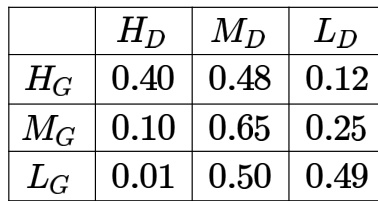

Consider the first row in the table above. The first entry denotes that if Guwahati has high temperature $( H _ { G } )$ then the probability of Delhi also having a high temperature (HD) is  i.e., $P ( H _ { D } \mid H _ { G } ) = 0 . 4 0$ . Similarly, the next two entries are $P ( M _ { D } \mid H _ { G } ) = 0 . 4 8$ and $P ( L _ { D } \mid H _ { G } ) = 0 . 1 2 .$ . Similarly for the other rows.

If it is known that $P ( H _ { G } ) = 0 . 2$ ， $P ( M _ { G } ) = 0 . 5 \$ , and $P ( L _ { G } ) = 0 . 3$ , then the probability (correct to two decimal places) that Guwahati has high temperature given that Delhi has high temperature is

A sender  transmits a signal, which can be one of the two kinds: $H$ and $L$ with probabilities and respectively, to a receiver .

In the graph below, the weight of edge $( u , v )$ is the probability of receiving $v$ when $u$ is transmitted, where $u , v \in \{ H , L \}$ . For example, the probability that the received signal is $L$ given the transmitted signal was $H$ , is .

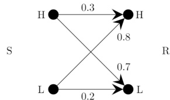

If the received signal is $H$ the probability that the transmitted signal was $H$ (rounded to decimal places) is

There are three boxes containing white balls and black balls.

Box - contains black and white balls.   
Box- contains black and white balls.   
Box -  contains  black and white balls.

In a random experiment, one of these boxes is selected, where the probability of choosing Box- is $\textstyle { \frac { 1 } { 2 } }$ , Box-2 is $\textstyle { \frac { 1 } { 6 } }$ , and Box- 3 is $\textstyle { \frac { 1 } { 3 } }$ . A ball is drawn at random from the selected box. Given that the ball drawn is white, the probability that it is drawn from Box-  is (Round off to two decimal places)

​Consider five random variables $U , V , W , X$ , and $Y$ whose joint distribution satisfies:

$$
P ( U , V , W , X , Y ) = P ( U ) P ( V ) P ( W \mid U , V ) P ( X \mid W ) P ( Y \mid W )
$$

Which ONE of the following statements is FALSE?

A. $Y$ is conditionally independent of $V$ given B. $X$ is conditionally independent of $U$ given $W$ C. $U$ and $V$ are conditionally independent given $W$ D. $Y$ and $X$ are conditionally independent given

Given the following Bayesian Network consisting of four Bernoulli random variables and the associated conditional probability tables:

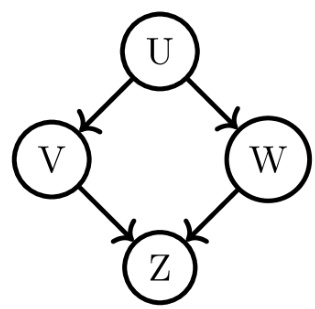

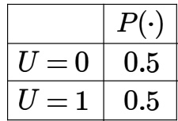

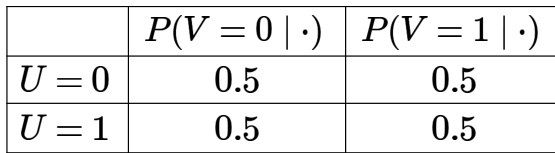

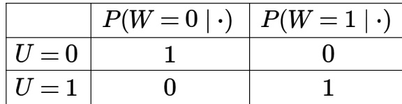

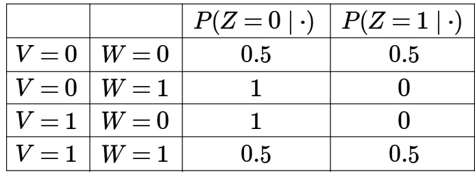

The value of $P ( U = 1 , V = 1 , W = 1 , Z = 1 ) = \phantom { 1 }$ (rounded off to three decimal places).

​A random variable $X$ is said to be distributed as Bernoulli $( \theta )$ , denoted by $X \sim$ Bernoulli( $\theta$ ), if

$$
P ( X = 1 ) = \theta , \quad P ( X = 0 ) = 1 - \theta
$$

f o r $0 < \theta < 1$ . Let $Y = \sum _ { i = 1 } ^ { 3 0 0 } X _ { i }$ , where $X _ { i } \sim \operatorname { B e r n o u l l i } ( \theta ) , i = 1 , 2 , \dotsc , 3 0 0$ be independent and identically distributed random variables with $\theta = 0 . 2 5$ . The value of $P ( 6 0 \leq Y \leq 9 0 )$ , after approximation through Central Limit Theorem, is given by Recall that $\phi ( x ) = { \frac { 1 } { \sqrt { 2 \pi } } } \int _ { - \infty } ^ { x } e ^ { - { \frac { t ^ { 2 } } { 2 } } } d t \Biggr )$

A. C. $\phi ( 2 ) - \phi ( - 2 )$ B. $\phi ( 1 ) - \phi ( - 1 )$   
$\phi ( { \bf 3 } ) - \phi ( { \bf - 3 } )$ D. $\phi ( 9 0 ) - \dot { \phi } ( 6 0 )$

L e t be a matrix such that each of its elements follows $( p = 0 . 5 0 )$ distribution independently.

The probability that the row-sum of the second row and the column-sum of the third column are both equal to is (Rounded off to two decimal places)

gateda-2026 probability bernoulli-distribution numerical-answers two-marks

A random bit string of length n is constructed by tossing a fair coin n times and setting a bit to 0 or 1 depending on outcomes head and tail, respectively. The probability that two such randomly generated strings are not identical is:

A. $\frac { 1 } { 2 ^ { n } }$ $\mathsf { B } . \mathrm { ~ } 1 - \frac { \mathrm { ~ 1 ~ } } { n }$ C. D.

gatecse-2005 probability binomial-distribution easy

For each element in a set of size $2 n$ , an unbiased coin is tossed. The $2 n$ coin tosses are independent. An element is chosen if the corresponding coin toss was a head. The probability that exactly $n$ elements are chosen is

A $\frac { 2 n _ { \mathbf { C } _ { n } } } { 4 ^ { n } }$ B. $\frac { 2 n _ { \mathrm { C } _ { n } } } { 2 ^ { n } }$ C. $\textstyle { \frac { 1 } { 2 n \mathrm { C } _ { n } } }$ D. 1

gatecse-2006 probability binomial-distribution normal

# Answer key☟

An unbiased coin is tossed repeatedly until the outcome of two successive tosses is the same. Assuming that the trials are independent, the expected number of tosses is

A. B. C. D. 6

gateit-2005 probability binomial-distribution expectation normal

When a coin is tossed, the probability of getting a Head i $\scriptstyle { \mathsf { i } } p , 0 < p < 1$ . Let $N$ be the random variable denoting the number of tosses till the first Head appears, including the toss where the Head appears. Assuming that successive tosses are independent, the expected value of $N$ is

$\mathsf { B } . \mathrm { ~ \frac { 1 } { ( 1 - p ) } ~ }$ $\mathsf { C . \ } \frac { 1 } { p ^ { 2 } }$ $\mathsf { D } . \mathrm { ~ \frac { 1 } { ( 1 - p ^ { 2 } ) } ~ }$

gateit-2006 probability binomial-distribution expectation normal

Suppose there are two coins. The first coin gives heads with probability $\frac { 5 } { 8 }$ when tossed, while the second coin gives heads with probability $\frac { 1 } { 4 }$ One of the two coins is picked up at random with equal probability and tossed. What is the probability of obtaining heads ?

$\left( { \frac { 7 } { 8 } } \right)$ ${ \mathsf { B } } . \left( { \frac { 1 } { 2 } } \right)$ ()

gateit-2007 probability normal binomial-distribution

# Answer key ☟

A. $\textstyle \sum _ { i = 1 } ^ { n } X _ { i } ^ { 2 }$ follows Chi-square distribution with $n$ degrees of freedom.   
B. $\scriptstyle \sum _ { i = 1 } ^ { n } ( X _ { i } - { \bar { X } } ) ^ { 2 }$ follows Chi-square distribution with $( n - 1 )$ degrees of freedom.   
C. $X _ { 1 } { } ^ { 2 } + X _ { n } { } ^ { 2 }$ follows exponential distribution with mean .   
D. $( { \sqrt { n } } { \bar { X } } ) ^ { 2 }$ follows Chi-square distribution with degrees of freedom.

gateda-2026 random-variable normal-distribution chi-square-distribution multiple-selects two-marks

Answer key☟

✍ Practice Tests: Test (15Q) Test 2 (15Q) Test 3 (15Q)

# .6.1 Conditional Probability: GATE CSE 1994 Question: 1.4, ISRO2017-2

Let $A$ and $B$ be any two arbitrary events, then, which one of the following is TRUE?

A. $P ( A \cap B ) = P ( A ) P ( B )$ B. $P ( A \cup B ) = P ( A ) + P ( B )$   
C. $P ( A \mid B ) = P ( A \cap B ) P ( B )$ D. $P ( A \cup B ) \leq P ( A ) + P ( B )$

The probability of an event $B$ is $P _ { 1 }$ . The probability that events $A$ and $B$ occur together is $P _ { 2 }$ while the probability that $A$ and $\bar { B }$ occur together is $P _ { 3 }$ . The probability of the event $A$ in terms of $P _ { 1 } , P _ { 2 }$ and $P _ { 3 }$ is

Let $P ( E )$ denote the probability of the event $E$ . Given $P ( A ) = \mathbf { 1 }$ , $P ( B ) = { \frac { 1 } { 2 } }$ the values of $P ( A \mid B )$ and $P ( B \mid A )$ respectively are

$\left( { \frac { 1 } { 4 } } \right) , \left( { \frac { 1 } { 2 } } \right)$ ${ \mathsf { B } } . \left( { \frac { 1 } { 2 } } \right) , \left( { \frac { 1 } { 4 } } \right)$ $\mathsf { c . } \left( \frac { 1 } { 2 } \right) , 1$ $\mathsf { D } . \quad 1 , \left( \frac { 1 } { 2 } \right)$

gatecse-2003 probability easy conditional-probability

# 7.6.4 Conditional Probability: GATE CSE 2005 Question: 51

Box $P$ has red balls and  blue balls and box $Q$ has 3 red balls and  blue ball. A ball is selected follows: (i) select a box (ii) choose a ball from the selected box such that each ball in the box is equally likely to be chosen. The probabilities of selecting boxes $P$ and $Q$ are $\frac 1 3$ and $\displaystyle { \frac { 2 } { 3 } }$ respectively. Given that a ball selected in the above process is a red ball, the probability that it came from the box

4 5 2 19   
B. C. 1   
19 19 30

gatecse-2005 probability conditional-probability normal

A. 0.24 B. 0.36 C. 0.4 D. 0.6

gatecse-2008 probability normal conditional-probability

An unbalanced dice (with  faces, numbered from to ) is thrown. The probability that the face value is is $9 0 \%$ of the probability that the face value is even. The probability of getting any even numbered face is the same. If the probability that the face is even given that it is greater than is , which one of the following options is closest to the probability that the face value exceeds ?

A. 0.453 B. 0.468 C. 0.485 D. 0.492

gatecse-2009 probability normal conditional-probability

# 7.6.7 Conditional Probability: GATE CSE 2011 Question: 3

If two fair coins are flipped and at least one of the outcomes is known to be a head, what is the probability that both outcomes are heads?

() ${ \mathsf { B } } . \left( { \frac { 1 } { 4 } } \right)$ $\mathsf { C . } \left( \frac { 1 } { 2 } \right)$ D.

gatecse-2011 probability easy conditional-probability

# Answer key☟

Suppose a fair six-sided die is rolled once. If the value on the die i s  or  the die is rolled a second time. What is the probability that the sum total of values that turn up is at least  ?

A. 10 B. 5 C. 2 D. 1 21 12

# Answer key☟

# 7.6.9 Conditional Probability: GATE CSE 2016 Set 2 Question: 05

Suppose that a shop has an equal number of LED bulbs of two different types. The probability of an LED bulb lasting more than  hours given that it is of Type 1 is , and given that it is of Type 2 is . The probability that an LED bulb chosen uniformly at random lasts more than  hours is

gatecse-2016-set2 probability conditional-probability normal numerical-answers

$P$ and $Q$ are considering to apply for a job. The probability that $P$ applies for the job is $\frac 1 4$ ， the probability that $P$ applies for the job given that $Q$ applies for the job is $\frac { 1 } { 2 }$ and the probability that $Q$ applies for the job given that $P$ applies for the job is $\frac 1 3$ Then the probability that $P$ does not apply for the job given that $Q$ does not apply for this job is

. $\left( { \frac { 4 } { 5 } } \right)$ ${ \mathsf { B } } . \ \left( { \frac { \mathsf { 5 } } { 6 } } \right)$ $\mathsf { C } . \left( \frac { 7 } { 8 } \right)$ D.

A bag contains  red balls and  blue balls. Two balls are drawn randomly without replacement. Given that the first ball drawn is red, the probability (rounded off to decimal places) that both balls drawn are red is

Suppose an unbiased coin is tossed 6 times. Each coin toss is independent of all previous coin tosses. Let $E _ { 1 }$ be the event that among the second, fourth, and sixth coin tosses, there are at least two heads. Let $E _ { 2 }$ be the event that among the first, second, third, and fifth coin tosses, there are equal number of heads and tail

The conditional probability $\mathbf { P } ( E _ { 1 } \mid E _ { 2 } )$ is equal to (rounded off to one decimal place)

A clinic specializes in testing for a disease . The result of the test can be either positive or negative.

A study revealed that if a person suffers from the disease , the test result in that clinic comes out positive $8 0 \%$ of the time, and negative $2 0 \%$ of the time. If a person is not suffering from the disease , the test comes out positive $1 0 \%$ of the time and negative $9 0 \%$ of the time. It is also known that among the general population, the disease occurs in $3 0 \%$ of the individuals.

If a person tests positive for $\mathrm { \Delta D }$ in that clinic, the probability that he/she actually suffers from the disease is (Rounded off to two decimal places)

gateda-2026 probability conditional-probability numerical-answers two-marks

In a certain town, the probability that it will rain in the afternoon is known to be . Moreover, meteorological data indicates that if the temperature at noon is less than or equal to $2 5 ^ { \circ } C$ , the probability that it will rain in the afternoon is . The temperature at noon is equally likely to be above $2 5 ^ { \circ } C$ , or at/below $2 5 ^ { \circ } C$ . What is the probability that it will rain in the afternoon on a day when the temperature at noon is above $2 5 ^ { \circ } C ?$

A. B. 0.6 C. 0.8 D. 0.9

gateit-2006 probability normal conditional-probability

Suppose that the expectation of a random variable $X$ is . Which of the following statements is true?

A. There is a sample point at which $X$ has the value .   
B. There is a sample point at which $X$ has value greater than .   
C. There is a sample point at which $X$ has a value greater than equal to .   
D. None of the above.

gate1999 probability expectation easy

# Answer key☟

# 7.8.2 Expectation: GATE CSE 2004 Question: 74

An examination paper has  multiple choice questions of one mark each, with each question having four choices. Each incorrect answer fetches $- 0 . 2 5$ marks. Suppose students choose all their answers randomly with uniform probability. The sum total of the expected marks obtained by all these students is

A. B. 2550 C. 7525 D. 9375

gatecse-2004 probability expectation normal

# Answer key☟

# 7.8.3 Expectation: GATE CSE 2006 Question: 18

We are given a set $X = \{ X _ { 1 } , \ldots , X _ { n } \}$ where $X _ { i } = 2 ^ { i }$ . A sample $S \subseteq X$ is drawn by selecting each $X _ { i }$ independently with probability $\begin{array} { r } { P _ { i } = \frac { 1 } { 2 } } \end{array}$ The expected value of the smallest number in sample $\boldsymbol { S }$ is:

A. $\textstyle { \left( { \frac { 1 } { n } } \right) }$ B. 2 C. D. n

gatecse-2006 probability expectation normal

# 7.8.4 Expectation: GATE CSE 2011 Question: 18

If the difference between the expectation of the square of a random variable $\left( E \left[ X ^ { 2 } \right] \right)$ and the square of the expectation of the random variable $( E \left[ X \right] ) ^ { 2 }$ is denoted by $R$ , then

A. $R = 0$ ${ \sf B } . { \cal R } < 0 \qquad \mathrm { ~  ~ \sf ~ \subset ~ } { \sf R } \geq 0$ D. R>0

gatecse-2011 probability random-variable expectation normal

# Answer key☟

# 7.8.5 Expectation: GATE CSE 2013 Question: 24

Consider an undirected random graph of eight vertices. The probability that there is an edge between a pair of vertices is $\frac 1 2$ What is the expected number of unordered cycles of length three?

$\frac 1 8$ B. 1 C. 7 D. 8

gatecse-2013 probability expectation normal

# Answer key☟

# 7.8.6 Expectation: GATE CSE 2014 Set 2 | Question: 2

Each of the nine words in the sentence $\deg ^ { \mathfrak { N } }$ is written on separate piece of paper. These nine pieces of paper are kept in a box. One of the pieces is drawn at random from the box. The expected length of the word drawn is (The answer should be rounded to one decimal place.)

gatecse-2014-set2 probability expectation numerical-answers easy

For any discrete random variable $X$ , with probability mass function $P ( X = j ) = p _ { j } , p _ { j } \ge 0 , j \in \{ 0 , \ldots , N \}$ , and $\Sigma _ { j = 0 } ^ { N } p _ { j } = 1$ , define the polynomial function $g _ { x } ( z ) = \Sigma _ { j = 0 } ^ { N } p _ { j } z ^ { j }$ . For a certain discrete random variable $Y$ , there exists a scalar $\beta \in [ 0 , 1 ]$ such that $g _ { y } ( z ) = ( \bar { 1 } - \beta + \beta z ) ^ { N }$ . The expectation of $Y$ is

A. $N \beta ( 1 - \beta )$ B. $N \beta$   
C. $N ( 1 - \beta )$ D. Not expressible in terms of $N$ and $\beta$ alone

gatecse-2017-set2 probability random-variable difficult expectation

# Answer key☟

Consider the two statements.

$S _ { 1 }$ ： There exist random variables $X$ and $Y$ such that $( \mathbb { E } [ ( X - \mathbb { E } ( X ) ) ( Y - \mathbb { E } ( Y ) ) ] ) \ ^ { 2 } > { \mathsf { V a r } } [ X ] { \mathsf { V a r } } [ Y ]$ S For all random variables $X$ and $Y , \mathsf { C o v } [ X , Y ] = \mathbb { E } \left[ \left| X - \mathbb { E } [ X ] \right| \left| Y - \mathbb { E } [ Y ] \right| \right]$

Which one of the following choices is correct?

A. Both $S _ { 1 }$ and $S _ { 2 }$ are true B. $S _ { 1 }$ is true, but $S _ { 2 }$ is false C. $S _ { 1 }$ is false, but $S _ { 2 }$ is true D. Both $S _ { 1 }$ and $S _ { 2 }$ are false gatecse-2021-set1 probability random-variable difficult two-marks expectation

# Answer key☟

In an examination, a student can choose the order in which two questions (QuesA and ) must be attempted.

If the first question is answered wrong, the student gets zero marks.   
. If the first question is answered correctly and the second question is not answered correctly, the student gets the   
marks only for the first question. If both the questions are answered correctly, the student gets the sum of the marks of the two questions.

The following table shows the probability of correctly answering a question and the marks of the question respectively.

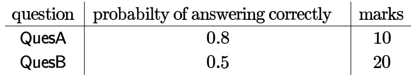

Assuming that the student always wants to maximize her expected marks in the examination, in which order should she attempt the questions and what is the expected marks for that order (assume that the questions are independent)?

A. First and then . Expected marks .   
B. First  and then QuesA. Expected marks .   
C. First  and then . Expected marks .   
D. First  and then QuesB. Expected marks .

$\mathsf { L } \mathsf { e } \mathsf { t } X$ be a random variable which takes values in the set $\{ 1 , 2 , 3 , 4 , 5 , 6 , 7 , 8 \}$ . Further, $\operatorname* { P r } ( X = 1 ) = \operatorname* { P r } ( X = 2 ) = \operatorname* { P r } ( X = 5 ) = \operatorname* { P r } ( X = 7 ) = { \frac { 1 } { 6 } }$ and $\operatorname* { P r } ( X = 3 ) = \operatorname* { P r } ( X = 4 ) = \operatorname* { P r } ( X = 6 ) = \operatorname* { P r } ( X = 8 ) = { \frac { 1 } { 1 2 } }$

The expected value of $X$ , denoted by $E [ X ]$ , is equal to (rounded off to two decimal places)

gatecse-2026-set1 numerical-answers two-marks probability expectation

# 7.8.11 Expectation: GATE DA 2025 Question:

Suppose $X$ and $Y$ are random variables. The conditional expectation of $X$ given $Y$ is denoted b $E [ X \mid Y ]$ . Then $E [ E [ X \mid Y ] ]$ equals

A. $E [ X \mid Y ]$ ${ \mathsf { B } } . \ { \frac { E [ X ] } { E [ Y ] } }$ C. E[X] D. E[Y]

gateda-2025 probability random-variable expectation one-mark

Let $X = a Z + b$ , where $Z$ is a standard normal random variable, and $^ { a , b }$ are two unknown constants. It is given that

$$
E [ X ] = 1 , \quad E [ ( X - E [ X ] ) Z ] = - 2 , \quad E \left[ ( X - E [ X ] ) ^ { 2 } \right] = 4
$$

where $E [ X ]$ denotes the expectation of random variable $X$ . The values of $a , b$ are:

A. $a = - 2 , b = 1$ $\mathrm { ~ \mathsf ~ { ~ B ~ } ~ } . \mathrm { ~ } a = 2 , b = - 1 \qquad \mathrm { ~ \mathsf ~ { ~ C ~ } ~ } . \mathrm { ~ } a = - 2 , b = - 1 \qquad \mathrm { ~ \mathsf ~ { ~ D ~ } ~ } . \mathrm { ~ } a = 1 , b = 1$

gateda-2025 probability expectation random-variable one-mark

A bag contains white balls and  black balls. In a random experiment, $n$ balls are drawn from the bag one at a time with replacement. Let $S _ { n }$ denote the total number of black balls drawn in the experiment.

The expectation of $S _ { 1 0 0 }$ denoted by $E \left[ S _ { 1 0 0 } \right] =$ (Round off to one decimal place)

gateda-2025 probability expectation numerical-answers two-marks

# 7.8.14 Expectation: GATE DS&AI 2024 Question: 26

​A fair six-sided die (with faces numbered  ) is repeatedly thrown independently. What is the expected number of times the die is thrown until two consecutive throws of even numbers are seen?

A. B. C. 6 D.

gate-ds-ai-2024 probability expectation two-marks

Then, $E [ Y \mid X = 1 . 5 ]$ is

The lifetime of a component of a certain type is a random variable whose probability density function is exponentially distributed with parameter . For randomly picked component of this type, the probability that its lifetime exceeds the expected lifetime (rounded to decimal places) is

gatecse-2021-set1 probability random-variable numerical-answers one-mark exponential-distribution

# 7.9.2 Exponential Distribution: GATE DA 2025 Question: 11

It is given that $P ( X \geq 2 ) = 0 . 2 5$ for an exponentially distributed random variable $X$ with $E [ X ] = { \frac { 1 } { \lambda } }$ , where $E [ X ]$ denotes the expectation of $X$ . What is the value of $\lambda ?$ (ln denotes natural logarithm)

A. ln2 B. ln4 C. ln3 D. ln 0.25

gateda-2025 probability exponential-distribution expectation one-mark

​For $\boldsymbol { x } \in \mathbb { R }$ , the floor function is denoted by $f ( x ) = \lfloor x \rfloor$ and defined as follows

$$
\lfloor x \rfloor = k , \quad k \leq x < k + 1 ,
$$

where $k$ is an integer. Let $Y = \lfloor X \rfloor$ , where $X$ is an exponentially distributed random variable with mean $\frac { 1 } { \ln 1 0 }$ where denotes natural logarithm. For any positive integer $\ell$ , one can write the probability of the event $Y { \equiv } \bar { \ell }$ as follows

$$
P ( Y = \ell ) = q ^ { \ell } ( 1 - q )
$$

The value of $q$ is

A. 0.1 B. 0.01 C. 0.5 D. 0.434

$$
f _ { X } ( x ) = { \left\{ \begin{array} { l l } { \lambda e ^ { - \lambda x } , } & { x \geq 0 } \\ { 0 , } \end{array} \right. }
$$

I f $5 E ( X ) = \operatorname { V a r } ( X )$ , where $E ( X )$ and $\operatorname { V a r } ( X )$ indicate the expectation and variance of $X$ , respectively, the value of $\lambda$ is (rounded off to one decimal place).

gate-ds-ai-2024 numerical-answers probability random-variable exponential-distribution two-marks

Let $X$ and $Y$ be two exponentially distributed and independent random variables with mean $\alpha$ and $\beta$ respectively. If $Z = \mathsf { m i n } \left( X , Y \right)$ , then the mean of $Z$ is given by

$\left( { \frac { 1 } { \alpha + \beta } } \right)$ $\mathsf { B } . \mathrm { \ m i n } ( \alpha , \beta )$ $\left( { \frac { \alpha \beta } { \alpha + \beta } } \right)$ D.

gateit-2004 probability exponential-distribution random-variable normal

# Answer key☟

✍ Practice Test: Test + (13Q)

Let $A , B$ ， and $\boldsymbol { C }$ be independent events which occur with probabilities  and  respectively. The probability of occurrence of at least one of the event is

gate1994 probability normal numerical-answers independent-events

Consider two events $E _ { 1 }$ and $E _ { 2 }$ such that probability of $E _ { 1 }$ , $\begin{array} { r } { P _ { r } [ E _ { 1 } ] = \frac { 1 } { 2 } } \end{array}$ , probability of $E _ { 2 }$ , $\begin{array} { r } { P _ { r } [ E _ { 2 } ] = \frac { 1 } { 3 } } \end{array}$ , and probability of $E _ { 1 }$ , and $\begin{array} { r } { E _ { 2 } , P _ { r } [ E _ { 1 } a n d E _ { 2 } ] = \frac { 1 } { 5 } } \end{array}$ . Which of the following statements is/are true?

A. $P _ { r } [ E _ { 1 } \mathrm { o r } E _ { 2 } ]$ is $\textstyle { \frac { 2 } { 3 } }$ B. Events $E _ { 1 }$ and $E _ { 2 }$ are independent C. Events $E _ { 1 }$ and $E _ { 2 }$ are not independent D $\begin{array} { r } { { \bf \nabla } . { P } _ { r } [ E _ { 1 } \mid E _ { 2 } ] = \frac { 4 } { 5 } { \bf \nabla } } \end{array}$

gate1999 probability normal independent-events

Consider a random experiment where two fair coins are tossed. Let $A$ be the event that denotes  on both the throws, $B$ be the event that denotes on the first throw, and $C$ be the event that denotes on the second throw. Which of the following statements is/are

A. $A$ and $B$ are independent. B. $A$ and $C$ are independent.   
C. $B$ and $C$ are independent. D. $\operatorname { P r o b } ( B \mid C ) = \operatorname { P r o b } ( B )$

gatecse-2023 probability independent-events multiple-selects two-marks

Consider a coin-toss experiment where the probability of head showing up is $p$ . In the $i ^ { \mathrm { t h } }$ coin toss, let $X _ { i } = 1$ if head appears, and $X _ { i } = 0$ if tail appears. Consider

$$
{ \hat { p } } = { \frac { 1 } { n } } \sum _ { i = 1 } ^ { n } X _ { i }
$$

where $\scriptstyle n$ is the total number of independent coin tosses. Which of the following statements is/are correct?

A. $E [ \hat { p } ] = p$ B. $E [ { \hat { p } } ] = { \frac { p } { n } }$ C. A s $\scriptstyle n$ increases, variance of $\hat { p }$ D. Variance of $\hat { p }$ does not depend on decreases n

gateda-2025 probability independent-events multiple-selects two-marks

Three fair coins are tossed independently. $T$ is the event that two or more tosses result in heads. $\boldsymbol { S }$ is the event that two or more tosses result in tails.

What is the probability of the event ${ \cal T } \cap { \cal S } ?$

A. B. 0.5 C. 0.25 D.

gate-ds-ai-2024 probability independent-events one-mark

✍ Practice Test: Test (7Q)

# 7.11.1 Normal Distribution: GATE CSE 2008 Question: 29

Let $X$ be a random variable following normal distribution with mean $+ 1$ and variance . Let $Y$ be another normal variable with mean $^ { - 1 }$ and variance unknown. If $P ( X \leq - 1 ) = P ( Y \geq 2 )$ the standard deviation of $Y$ is

A. B. C. $\sqrt { 2 }$ D. gatecse-2008 random-variable normal-distribution probability normal

Let $X$ be a Gaussian random variable with mean 0 and variance $\sigma ^ { 2 }$ . Let $Y = \operatorname* { m a x } \left( X , 0 \right)$ where $( a , b )$ is the maximum of $a$ and $b$ . The median of $Y$ is

Suppose a random variable $Z$ follows $( \mu = 0 , \sigma ^ { 2 } = 1 )$ distribution with probability density function $g ( z )$ and cumulative distribution function $G ( z )$ . Another random variable $Y$ follows $t _ { 1 }$ distribution with probability density function $h ( y )$ and cumulative distribution function $H ( y )$ . Let $c$ be the positive real number for which $g ( c ) = h ( c )$ .

Which of the following statements is/are correct?

A. $G ( 0 ) = H ( 0 )$ ${ \mathsf { B } } . \ G ( c ) < H ( c )$ $\complement . \ G ( - c ) < H ( - c ) \qquad \ \mathsf { D .       } \ g ( 0 ) = h ( 0 )$

gateda-2026 probability random-variable normal-distribution multiple-selects one-mark

# Answer key☟

$P _ { n } ( t )$ is the probability of $n$ events occurring during a time interval $t$ . How will you express $P _ { 0 } ( t + h )$ in terms of $P _ { 0 } ( h )$ , if $P _ { 0 } ( t )$ has stationary independent increments? (Note: $P _ { t } ( t )$ is the probability density function).

gate1989 descriptive probability poisson-distribution

Suppose $p$ is the number of cars per minute passing through a certain road junction between PM and PM, and $p$ has a Poisson distribution with mean . What is the probability of observing fewer than cars during any given minute in this interval?

$\frac { 8 } { ( 2 e ^ { 3 } ) }$ ${ \mathsf { B } } . ~ { \frac { \mathsf { 9 } } { ( 2 e ^ { 3 } ) } }$ $\mathsf { C } . \ \frac { 1 7 } { ( 2 e ^ { 3 } ) }$ $\frac { 2 6 } { ( 2 e ^ { 3 } ) }$

gatecse-2013 probability poisson-distribution normal

$$
L = \operatorname* { l i m } _ { n \to \infty } \sum _ { k = 0 } ^ { n } { \frac { e ^ { - n } n ^ { k } } { k ! } }
$$

Which of the following is the value of

A. 0.5 B. 1.0 C. D.

gateda-2026 probability poisson-distribution two-marks

# Answer key☟

In a multi-user operating system on an average, requests are made to use a particular resource per hour. The arrival of requests follows a Poisson distribution. The probability that either one, three or five requests are made in  minutes is given by

A. $6 . 9 \times 1 0 ^ { 6 } \times e ^ { - 2 0 }$ B. $1 . 0 2 \times 1 0 ^ { 6 } \times e ^ { - 2 0 }$   
C. $6 . 9 \times 1 0 ^ { 3 } \times e ^ { - 2 0 }$ D. $1 . 0 2 \times 1 0 ^ { 3 } \times e ^ { - 2 0 }$

gateit-2007 probability poisson-distribution normal

# Answer key☟

✍ Practice Tests: Test 1 (15Q) Test 2 (15Q) Test 3 (15Q) Test 4 (15Q) Test 5 (15Q)

The probability that a number selected at random between  and  (both inclusive) will not contain the digit  is:

16 . 27 18 一 B A D. 25 25

gate1995 probability normal

# 7.13.2 Probability: GATE CSE 1995 Question: 2.14

A bag contains  white balls and black balls. Two balls are drawn in succession. The probability that one of them is black and the other is white is:

A. $\textstyle { \frac { 2 } { 3 } }$ B. C. $\textstyle { \frac { 1 } { 2 } }$ D. $\textstyle { \frac { 1 } { 3 } }$

gate1995 probability normal

# Answer key☟

# 7.13.3 Probability: GATE CSE 1996 Question: 1.5

Two dice are thrown simultaneously. The probability that at least one of them will have facing up is

A. $\frac { 1 } { 3 6 }$ B. $\begin{array} { l } { { \frac { 1 } { 3 } } } \end{array}$ C. 25 D. 11   
36 36

gate1996 probability easy

# Answer key☟

# 7.13.4 Probability: GATE CSE 1996 Question: 2.7

The probability that top and bottom cards of a randomly shuffled deck are both aces is

A. $\textstyle { \frac { 4 } { 5 2 } } \times { \frac { 4 } { 5 2 } }$ B. $\textstyle { \frac { 4 } { 5 2 } } \times { \frac { 3 } { 5 2 } }$   
C. $\textstyle { \frac { 4 } { 5 2 } } \times { \frac { 3 } { 5 1 } }$ D. $\textstyle { \frac { 4 } { 5 2 } } \times { \frac { 4 } { 5 1 } }$

The probability that it will rain today is . The probability that it will rain tomorrow is . The probability that it will rain either today or tomorrow is . What is the probability that it will rain today and tomorrow?

A. 0.3 B. 0.25 C. 0.35 D.

gate1997 probability easy

# Answer key☟

# 7.13.6 Probability: GATE CSE 1998 Question: 1.1

A die is rolled three times. The probability that exactly one odd number turns up among the three outcomes is

6 38 12

gate1998 probability easy

# Answer key☟

# 7.13.7 Probability: GATE CSE 2001 Question: 2.4

Seven (distinct) car accidents occurred in a week. What is the probability that they all occurred on the same day?

B. C. D. 1 1 1 77

gatecse-2001 probability normal

# Answer key☟

# 7.13.8 Probability: GATE CSE 2004 Question: 25

If a fair coin is tossed four times. What is the probability that two heads and two tails will result?

A. $\textstyle { \frac { 3 } { 8 } }$ B. $\textstyle { \frac { 1 } { 2 } }$ C. $\textstyle { \frac { 5 } { 8 } }$ D.

gatecse-2004 probability easy

# Answer key☟

# 7.13.9 Probability: GATE CSE 2010 Question: 26

Consider a company that assembles computers. The probability of a faulty assembly of any computer is $p$ . The company therefore subjects each computer to a testing process. This testing process gives the correct result for any computer with a probability of . What is the probability of a computer being declared faulty?

A. $p q + ( 1 - p ) ( 1 - q )$ B. $( 1 - q ) p$ $\complement . \ ( 1 - p ) q$ D.

gatecse-2010 probability easy

# Answer key☟

# 7.13.10 Probability: GATE CSE 2010 Question: 27

What is the probability that divisor of $1 0 ^ { 9 9 }$ is a multiple of $1 0 ^ { 9 6 } ?$

$\left( { \frac { 1 } { 6 2 5 } } \right)$ ${ \mathsf { B } } . ~ \left( { \frac { 4 } { 6 2 5 } } \right)$ $\mathsf { C . } \left( \frac { 1 2 } { 6 2 5 } \right)$ 16   
625

# Answer key☟

A deck of cards (each carrying a distinct number from to ) is shuffled thoroughly. Two cards are then removed one at a time from the deck. What is the probability that the two cards are selected with the number on the first card being one higher than the number on the second card?

. C. D.

gatecse-2011 probability normal

Four fair six-sided dice are rolled. The probability that the sum of the results being  is $\frac { X } { 1 2 9 6 }$ The value of $X$ is

gatecse-2014-set1 probability numerical-answers normal

The security system at an IT office is composed of  computers of which exactly four are working. check whether the system is functional, the officials inspect four of the computers picked at random (without replacement). The system is deemed functional if at least three of the four computers inspected are working. Let the probability that the system is deemed functional be denoted by $p$ · Then $1 0 0 p = .$

gatecse-2014-set2 probability numerical-answers normal

The probability that a given positive integer lying between and  (both inclusive) is NOT divisible by , or  is

Let $\boldsymbol { S }$ be a sample space and two mutually exclusive events $A$ and $B$ be such that $A \cup B = S$ . If $P ( . )$ denotes the probability of the event, the maximum value of $P ( A ) P ( B )$ is

gatecse-2014-set3 probability numerical-answers normal

Two people, $P$ and $Q$ , decide to independently roll two identical dice, each with faces, numbered to . The person with the lower number wins. In case of a tie, they roll the dice repeatedly until there is no tie. Define a trial as a throw of the dice by $P$ and $Q$ . Assume that all numbers on each dice are equi-probable and that all trials are independent. The probability (rounded to 3 decimal places) that one of them wins on the third trial is

gatecse-2018 probability normal numerical-answers one-mark

A bag has $r$ red balls and $b$ black balls. All balls are identical except for their colours. In a trial, a ball is randomly drawn from the bag, its colour is noted and the ball is placed back into the bag along with another ball of the same colour. Note that the number of balls in the bag will increase by one, after the trial. A sequence of four such trials is conducted. Which one of the following choices gives the probability of drawing a red ball in the fourth trial?

$\frac { r } { r + b }$   
B. $\frac { r } { r + b + 3 }$   
C r+3   
D. $\left( { \frac { r } { r + b } } \right) \left( { \frac { r + 1 } { r + b + 1 } } \right) \left( { \frac { r + 2 } { r + b + 2 } } \right) \left( { \frac { r + 3 } { r + b + 3 } } \right)$

gatecse-2021-set2 probability normal two-marks

Let $A$ and $B$ be two events in a probability space with $P ( A ) = 0 . 3 , P ( B ) = 0 . 5$ , and $P ( A \cap B ) = 0 . 1$ Which of the following statements is/are TRUE?

A. The two events $A$ and $B$ are independent   
B. $P ( A \cup B ) = 0 . 7$   
C. $P ( A \cap B ^ { c } ) = 0 . 2$ , where $B ^ { c }$ is the complement of the event $B$   
D. $P ( A ^ { c } \cap B ^ { c } ) = 0 . 4$ where $A ^ { c }$ and $B ^ { c }$ are the complements of the events $A$ and $B$ , respectively

gatecse-2024-set1 multiple-selects probability one-mark

A box contains coins:  regular coins and  fake coin. When a regular coin is tossed, the probability $P _ { \ l }$ head $) { = } 0 . 5$ and for a fake coin, $P ( \mathsf { h e a d } ) { = } 1$ . You pick a coin at random and toss it twice, and get two heads. The probability that the coin you have chosen is the fake coin is (rounded off to two decimal places)

gatecse2025-set1 probability numerical-answers one-mark

# Answer key☟

# 7.13.22 Probability: GATE CSE 2026 Set 1 Question:

An urn contains one red ball and one blue ball. At each step, a ball is picked uniformly at random from the urn, and this ball together with another ball of the same color is put back in the urn. The probability that there are equal number of red and blue balls after two steps is

A. B. 1/3 C. D.

gatecse-2026-set1 probability one-mark

# Answer key☟

# 7.13.23 Probability: GATE DA 2025 Question: 35

A random experiment consists of throwing  fair dice, each die having six faces numbered to . An event $A$ represents the set of all outcomes where at least one of the dice shows a . Then, $P ( A ) =$

A. B. $\mathsf { C . ~ } 1 - \left( \frac { 5 } { 6 } \right) ^ { 1 0 0 } \qquad \mathsf { D . ~ } \left( \frac { 5 } { 6 } \right) ^ { 1 0 0 }$

gateda-2025 probability two-marks

# Answer key☟

Suppose that a computer program provides a non-negative and integer-valued random solution to the equation $n _ { 1 } + n _ { 2 } + n _ { 3 } + n _ { 4 } = 2 0$ .

Which of the following is the probability that all of $n _ { 1 } , n _ { 2 } , n _ { 3 } , n _ { 4 }$ in the provided solution are positive?

A. ${ \binom { 1 9 } { 3 } } / { \binom { 2 3 } { 3 } }$ $\begin{array} { c } { { \mathsf { B . ~ } \left( \begin{array} { c } { { 2 0 } } \\ { { 4 } } \end{array} \right) / \left( \begin{array} { c } { { 2 4 } } \\ { { 4 } } \end{array} \right) } } \\ { { \mathsf { D . ~ } \left( \begin{array} { c } { { 1 9 } } \\ { { 4 } } \end{array} \right) / \left( \begin{array} { c } { { 2 4 } } \\ { { 4 } } \end{array} \right) } } \end{array}$   
C. $\textstyle { \binom { 2 0 } { 3 } } / \binom { 2 3 } { 3 }$

gateda-2026 probability one-mark

# Answer key☟

# 7.13.25 Probability: GATE DA 2026 Question: 9

Let $M$ be a randomly chosen non-empty subset of $S = \{ 1 , 2 , 3 , \ldots , 2 0 2 6 \}$ Which of the following is the probability that the product of all the elements of $M$ is even?

A. $2 ^ { 1 0 1 3 }$ (21013 -1) /22026 $\begin{array} { l } { { \mathsf { B . ~ 2 ^ { 1 0 1 3 } } / 2 ^ { 2 0 2 6 } } } \\ { { \mathsf { D . ~ 1 } / \left( 2 ^ { 2 0 2 6 } - 1 \right) } } \end{array}$ C. $2 ^ { 1 0 1 3 } \left( 2 ^ { 1 0 1 3 } - 1 \right) / \left( 2 ^ { 2 0 2 6 } - 1 \right)$

gateda-2026 probability one-mark

# Answer key☟

# 7.13.27 Probability: GATE Data Science and Artificial Intelligence 2024 Sample Paper Question:

A fair coin is flipped twice and it is known that at least one tail is observed. The probability of getting two tails is

A. $\textstyle { \frac { 1 } { 2 } }$ B. $\begin{array} { l } { { \frac { 1 } { 3 } } } \end{array}$ C. $\textstyle { \frac { 2 } { 3 } }$ D.

# Answer key ☟

In a population of $N$ families, $5 0 \%$ of the families have three children, $3 0 \%$ of the families have two children and the remaining families have one child. What is the probability that a randomly picked child belongs to a family with two children?

A. $\left( { \frac { 3 } { 2 3 } } \right)$ ${ \mathsf { B } } . \ \left( { \frac { 6 } { 2 3 } } \right)$ C. D.

gateit-2004 probability normal

# Answer key ☟

# 7.13.29 Probability: GATE IT 2005 Question:

A bag contains  blue marbles, green marbles and red marbles. A marble is drawn from the bag, its colour recorded and it is put back in the bag. This process is repeated  times. The probability that no two of the marbles drawn have the same colour is

A. $\left( { \frac { 1 } { 3 6 } } \right)$ ${ \mathsf { B } } . \left( { \frac { 1 } { 6 } } \right)$ $\mathsf { C . } \left( \frac { 1 } { 4 } \right)$ ${ \sf D . } \left( \frac { 1 } { 3 } \right)$

gateit-2005 probability normal

# Answer key☟

# 7.13.30 Probability: GATE IT 2008 Question: 2

A sample space has two events $A$ and $B$ such that probabilities $P ( A \cap B ) = { \frac { 1 } { 2 } } , P ( A ^ { \prime } ) = { \frac { 1 } { 3 } } , P ( B ^ { \prime } ) = { \frac { 1 } { 3 } }$ What is $P ( A \cup B )$ ?

A. $\left( { \frac { 1 1 } { 1 2 } } \right)$ ${ \sf B } . \left( \frac { 1 0 } { 1 2 } \right)$ $\mathsf { C } . \left( \frac { \mathsf { 9 } } { 1 2 } \right)$ D.

gateit-2008 probability easy

# Answer key☟

# 7.13.31 Probability: GATE IT 2008 Question: 23

What is the probability that in a randomly chosen group of $r$ people at least three people have the same birthday?

$$
\begin{array} { r l } & { \mathrm { A . ~ 1 - } \frac { 3 6 5 - 3 6 4 . . . \left( 3 6 5 - r + 1 \right) } { 3 6 5 ^ { r } } } \\ & { \mathrm { B . ~ } \frac { 3 6 5 \cdot 3 6 4 . . . \left( 3 6 5 - r + 1 \right) } { 3 6 5 ^ { r } } + ^ { r } C _ { 1 } \cdot 3 6 5 \cdot \frac { 3 6 4 . 3 6 3 . . . \left( 3 6 4 - \left( r - 2 \right) + 1 \right) } { 3 6 4 ^ { r + 2 } } } \\ & { \mathrm { C . ~ 1 - } \frac { 3 6 5 \cdot 3 6 4 . . . \left( 3 6 5 - r + 1 \right) } { 3 6 5 ^ { r } } - ^ { r } C _ { 2 } \cdot 3 6 5 \cdot \frac { 3 6 4 \cdot 3 6 3 . . . \left( 3 6 4 - \left( r - 2 \right) + 1 \right) } { 3 6 4 ^ { r - 2 } } } \\ & { \mathrm { D . ~ } \frac { 3 6 5 \cdot 3 6 4 . . . \left( 3 6 5 - r + 1 \right) } { 3 6 5 ^ { r } } } \end{array}
$$

# 7.14.1 Probability Density Function: GATE CSE 2003 Question: 60, ISRO2007-45

A program consists of two modules executed sequentially. Let $f _ { 1 } ( t )$ and $f _ { 2 } ( t )$ respectively denote the probability density functions of time taken to execute the two modules. The probability density function of the overall time taken to execute the program is given by

A. $f _ { 1 } ( t ) + f _ { 2 } ( t )$ $\begin{array} { r l } & { \mathsf { B . ~ } \int _ { 0 } ^ { t } f _ { 1 } ( x ) f _ { 2 } ( x ) d x } \\ & { \mathsf { D . ~ } \operatorname* { m a x } \{ f _ { 1 } ( t ) , f _ { 2 } ( t ) \} } \end{array}$   
C. $\begin{array} { r } { \int _ { 0 } ^ { t } f _ { 1 } ( x ) f _ { 2 } ( t - x ) d x } \end{array}$

gatecse-2003 probability normal isro2007 probability-density-function

# Answer key☟

# 7.15.1 Probability Distribution: GATE CSE 2025 Set 1 Question: 48

Consider a probability distribution given by the density function $P ( x )$ .

$$
P ( x ) = \left\{ \begin{array} { c } { { C x ^ { 2 } , \mathrm { f o r } 1 \leq x \leq 4 } } \\ { { 0 , \mathrm { f o r } x < 1 \mathrm { o r } x > 4 } } \end{array} \right.
$$

The probability that $x$ lies between and , i.e., $P ( 2 \leq x \leq 3 )$ is (rounded off to three decimal places)

gatecse2025-set1 probability probability-distribution numerical-answers two-marks

# Answer key☟

✍ Practice Tests: Test (15Q) Test 2 (15Q) Test 3 (11Q)

# 7.16.1 Random Variable: GATE CSE 2005 Question: 12, ISRO2009-64

Let $f ( x )$ be the continuous probability density function of a random variable $x$ , the probability that $a < x \overset { \cdot } { \leq } b$ , is :

A. $f ( b - a )$ $\begin{array} { l } { { \mathsf { B . } } } \\ { { \mathsf { \Pi } } _ { b } ^ { b } } \\ { { \mathsf { D . } } } \end{array} \overset { \textstyle \mathfrak { J } ( b ) - \mathfrak { f } ( a ) } { \underbrace { \int \substack { x f ( x ) d x } } }$   
C. $\displaystyle { \mathop { J } _ { a } ^ { b } f ( x ) d x }$

gatecse-2005 probability random-variable easy isro2009

# Answer key☟

Consider a random variable $X$ that takes values $+ 1$ and $^ { - 1 }$ with probability  each. The values of the cumulative distribution function $F ( x )$ at $x = - 1$ and $+ 1$ are

A. and B. and C. and 1 D. and

gatecse-2012 probability random-variable easy

# 7.16.4 Random Variable: GATE CSE 2015 Set 3 Question: 37

Suppose $X _ { i }$ for $i = { 1 , 2 , 3 }$ are independent and identically distributed random variables whose probability mass functions are $\begin{array} { r } { P r [ X _ { i } = 0 ] = P r [ X _ { i } = 1 ] = \frac { 1 } { 2 } } \end{array}$ for $i = { 1 , 2 , 3 }$ . Define another random variable $Y = X _ { 1 } X _ { 2 } \oplus X _ { 3 }$ , where $\oplus$ denotes XOR. Then ${ \bf \bar { \it P r } } [ \bar { Y } = 0 \mid X _ { 3 } = 0 ] = \_$

gatecse-2015-set3 probability random-variable normal numerical-answers

# Answer key☟

The probability density function $f ( x )$ of a random variable $X$ which takes real values is

$$
f ( x ) = { \frac { 1 } { 3 { \sqrt { 2 \pi } } } } \mathrm { e x p } \left( - { \frac { x ^ { 2 } } { 1 8 } } \right) , \quad x \in ( - \infty , + \infty )
$$

Which one of the following statements is correct about the random variable $X$ ?

A. $X$ is an exponential random B. $X$ is a normal random variable variable   
C. $X$ is a Poisson random variable D. $X$ is a uniform random variable   
gatecse-2026-set2 probability random-variable one-mark

# Answer key☟

​Consider the cumulative distribution function (CDF) of a random variable $X$

$$
F _ { X } ( x ) = { \left\{ \begin{array} { l l } { 0 } & { x \leq - 1 } \\ { { \frac { 1 } { 4 } } ( x + 1 ) ^ { 2 } } & { - 1 \leq x \leq 1 } \\ { 1 } & { x \geq 1 } \end{array} \right. }
$$

The value of $P \left( X ^ { 2 } \leq 0 . 2 5 \right)$ is

A. 0.625 B. 0.25 C. 0.5 D. 0.5625

gateda-2025 probability random-variable two-marks

# Answer key☟

$$
F _ { X } ( x ) = { \left\{ \begin{array} { l l } { 0 } & { x \leq t } \\ { \displaystyle { \frac { x - t } { 4 - t } } } & { t \leq x \leq 4 } \\ { 1 } & { x \geq 4 } \end{array} \right. }
$$

If the median of $X$ is 3 , then what is the value of $t$ ?

A. B. C. D. 0

gateda-2025 probability random-variable one-mark

Let $X$ be a discrete valued random variable with cumulative distribution function $F ( x )$ . Which of the following statements is/are correct?

A. $F ( x )$ is always a positive function. B. $F ( x )$ is a non-decreasing function.   
C. $F ( x )$ has jump discontinuity. D. $F ( x )$ is a left continuous function.

gateda-2026 random-variable probability multiple-selects two-marks

​Consider the following statements:

i. The mean and variance of a Poisson random variable are equal.   
ii. For a standard normal random variable, the mean is zero and the variance is one.

Which ONE of the following options is correct?

A. Both and are true B. is true and  is false C. is true and is false D. Both and are false

gate-ds-ai-2024 probability random-variable one-mark

Two fair coins are tossed independently. $X$ is a random variable that takes a value of  if both tosses are heads and otherwise. $Y$ is a random variable that takes a value of  if at least one of the tosses is heads and otherwise.

The value of the covariance of $X$ and $Y$ is (rounded off to three decimal places).

gate-ds-ai-2024 probability random-variable numerical-answers two-marks

For a given biased coin, the probability that the outcome of a toss is a head is . This coin is tossed times. Let $X$ denote the random variable whose value is the number of times that head appeared in these  tosses. The standard deviation of $X$ (rounded to decimal place) is

gatecse-2021-set2 numerical-answers probability random-variable one-mark statistics

Let $x$ and $y$ be random variables, not necessarily independent, that take real values in the interval . Let $z = x y$ and let the mean values of $x , y , z$ be $\bar { x } , \bar { y } , \bar { z }$ , respectively. Which one of the following statements is TRUE?

A. $\bar { z } = \bar { x } \bar { y }$ $\begin{array} { l } { { \textsf { B . } \bar { z } \leq \bar { x } \bar { y } } } \\ { { \textsf { D . } \bar { z } \leq \bar { x } } } \end{array}$   
C. $\bar { z } \ge \bar { x } \bar { y }$

gatecse-2024-set2 probability random-variable statistics two-marks

For a given data set $\{ x _ { 1 } , x _ { 2 } , . . . , x _ { n } \}$ , where $n = 1 0 0$ , it is known that

$$
{ \frac { 1 } { 2 0 0 0 } } \sum _ { i = 1 } ^ { n } \sum _ { j = 1 } ^ { n } ( x _ { i } - x _ { j } ) ^ { 2 } = 9 9
$$

Let us denote $\begin{array} { r } { \overline { { \pmb { x } } } = \frac { 1 } { n } \sum _ { i = 1 } ^ { n } x _ { i } } \end{array}$ The value of $\textstyle { \frac { 1 } { 9 9 } } \sum _ { i = 1 } ^ { n } ( x _ { i } - { \bar { x } } ) ^ { 2 }$ is (Answer in integer)

gateda-2026 numerical-answers two-marks statistics

✍ Practice Tests: Test 1 (15Q) Test 2 (3Q)

Two friends agree to meet at a park with the following conditions. Each will reach the park between $4 { : } 0 0 ~ \mathsf { p m }$ and 5:00 pm and will see if the other has already arrived. If not, they will wait for 10 minutes or the end of the hour whichever is earlier and leave. What is the probability that the two will not meet?

gate1998 probability normal numerical-answers uniform-distribution

A point is randomly selected with uniform probability in the $X - Y$ plane within the rectangle with corners at $( 0 , 0 ) , ( 1 , 0 ) , ( 1 , 2 )$ and $( 0 , 2 )$ If $p$ is the length of the position vector of the point, the expected value of $p ^ { 2 }$ is

$\left( { \frac { 2 } { 3 } } \right)$ B. $\mathsf { C . } \left( \frac { 4 } { 3 } \right)$ D.

gatecse-2004 probability uniform-distribution expectation normal

Suppose we uniformly and randomly select a permutation from the  permutations of What is the probability that appears at an earlier position than any other even number in the selected permutation?

$\left( { \frac { 1 } { 2 } } \right)$ () D. None of these 20！

gatecse-2007 probability easy uniform-distribution

Suppose you break a stick of unit length at a point chosen uniformly at random. Then the expected length of the shorter stick is

gatecse-2014-set1 probability uniform-distribution expectation numerical-answers normal

Suppose $Y$ is distributed uniformly in the open interval $( 1 , 6 )$ . The probability that the polynomia $3 x ^ { 2 } + 6 x Y + 3 Y + 6$ has only real roots is (rounded off to decimal place)

gatecse-2019 numerical-answers engineering-mathematics probability uniform-distribution two-marks

For $n > 2$ , let $a \in \{ 0 , 1 \} ^ { n }$ be a non-zero vector. Suppose that $x$ is chosen uniformly at random from $\{ 0 , 1 \} ^ { n }$ . Then, the probability that is an odd number is

gatecse-2020 numerical-answers probability uniform-distribution two-marks

The expected length of the subinterval that contains  is (rounded off to two decimal places)

gatecse2025-set2 probability uniform-distribution numerical-answers two-marks

Let $X$ be a random variable that follows Uniform $( - 1 , 1 )$ distribution. The conditional distribution of the random variable $Y$ given $X = x$ is the Uniform $( x ^ { 2 } - 0 . 1 , x ^ { 2 } + 0 . 1 )$ distribution.

The value of correlation $( X , Y )$ is (Answer in integer)

Let $X$ be a random variable uniformly distributed in the interval and $Y$ be a random variable uniformly distributed in the interval . If $X$ and $Y$ are independent of each other, the probability $P ( X \geq Y )$ is (rounded off to three decimal places).

gate-ds-ai-2024 numerical-answers random-variable probability uniform-distribution two-marks

✍ Practice Test: Test 1 (5Q)

Let , where $X$ is a normal random variable with mean $\mu$ and variance $\sigma ^ { 2 }$ . The variance of $Y$ is

A. B. C. D. 4

gateda-2025 probability random-variable variance two-marks

Let $X$ and $Y$ be two independent random variables. $X$ follows Bernoulli $( p = 0 . 3 )$ distribution and $Y$ follows $( \mu = 0 , \sigma ^ { 2 } = 1 0 0 )$ distribution.

Which of the following options is the variance of $( 2 X - 1 ) Y ?$

A. 100 B. 90 C. 49 D.

gateda-2026 probability random-variable normal-distribution variance two-marks

# Answer key☟

# Answer Keys

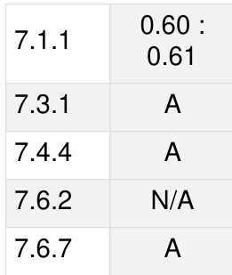

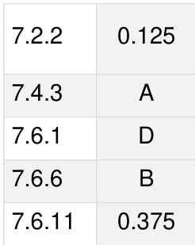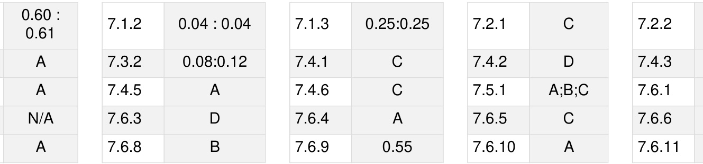

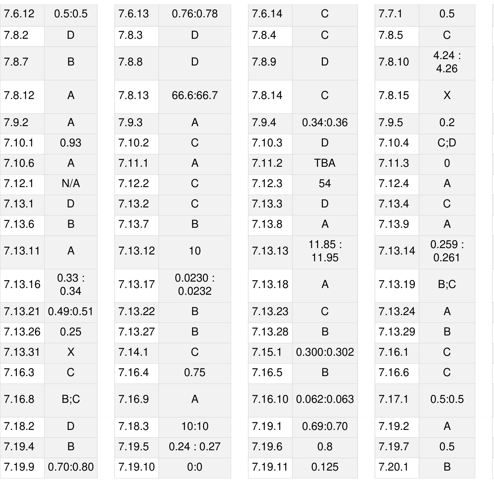

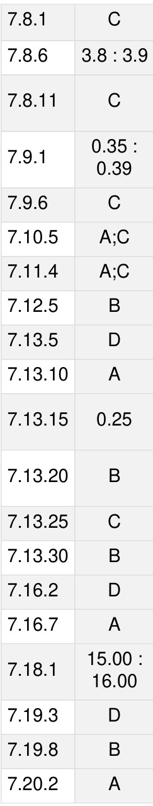

Logic: deduction and induction, Analogy, Numerical relations and reasoning

Mark Distribution in Previous GATE   

Welcome to the "General Aptitude: Analytical Aptitude" chapter, a crucial component of your GATE Computer Science exam preparation. This section is designed to sharpen your logical reasoning, problem-solving abilities, and critical thinking skills, which are not only vital for the exam but also fundamental to a successful career in computer science. Analytical Aptitude questions typically form a significant portion of the 15 marks allocated to the General Aptitude section in GATE, often appearing as Multiple Choice Questions (MCQs), Multiple Select Questions (MSQs), or Numerical Answer Type (NAT) questions. Mastering these topics will not only boost your overall score but also enhance your ability to approach complex computational problems with a structured and logical mindset.

# Topic-wise Key Concepts

# Age Relation

Definition and Core Idea: Age relation problems involve determining the current or past/future ages of individuals based on given conditions, often expressed as ratios, sums, or differences. The core idea is to translate these verbal conditions into algebraic equations.

# Important Formulas and Results:

1. If the current age of a person is $x$ years, then their age $\scriptstyle n$ years ago was $( x - n )$ years. 2. If the current age of a person is $x$ years, then their age $n$ years hence (in the future) will be $( x + n )$ years. 3. If the ratio of ages of two persons A and B is $a : b$ , their ages can be represented as $a x$ and $b x$ for some constant $x$ .

# Key Properties and Identities:

。 The difference in ages between two people remains constant throughout their lives.   
。 Ratios of ages change over time, but the underlying age values can be determined by setting up equations.

# Common Pitfalls or Tricky Points:

Confusing "ago" with "hence" when setting up equations.   
Incorrectly applying ratios (e.g., assuming the constant $x$ in $a x : b x$ is the same for different time periods without adjustment).   
Making calculation errors in solving linear equations.

# Standard Problem-Solving Techniques or Shortcuts:

Assign variables $( \mathsf { e } . \mathsf { g } . , \boldsymbol { x } , \boldsymbol { y } )$ to the current ages of the individuals involved.   
。 Formulate linear equations based on the given conditions.   
0 Solve the system of equations. For ratio problems, use a common multiplier.   
。 Always check if the calculated ages are logically consistent (e.g., no negative ages).

# Analogy

Definition and Core Idea: Analogy questions test your ability to identify the relationship between a given pair of items (words, numbers, letters, or symbols) and then find another pair that shares the exact same relationship. The core idea is pattern recognition and logical extension.

Important Formulas and Results: No mathematical formulas. The "results" are types of relationships:   
1. Synonym/Antonym: e.g., GOOD BAD :: HAPPY : SAD   
2. Part-Whole: e.g., FINGER HAND :: TOE FOOT   
3. Cause-Effect: e.g., FIRE ASH :: EVENT MEMORY   
4. Worker-Tool: e.g., CARPENTER SAW :: WRITER PEN   
5. Product-Raw Material: e.g., SHOE : LEATHER :: WINE : GRAPES   
6. Quantity-Unit: e.g., LENGTH METER :: MASS KILOGRAM   
7. Gender: e.g., LION : LIONESS :: NEPHEW NIECE   
8. Study-Topic: e.g., BIOLOGY LIFE :: GEOLOGY EARTH   
9. Function: e.g., KNIFE : CUT :: ERASER ERASE

10. Degree of Intensity: e.g., WARM HOT :: ANNOY ENRAGE

Key Properties and Identities:

The relationship must be consistent and precise.   
Consider the order of elements in the pair; it often matters.   
Relationships can be direct or indirect, but should be the strongest possible link.

# Common Pitfalls or Tricky Points:

Choosing an option with a weak or secondary relationship. Overthinking and finding obscure connections.   
。 Not considering all options before making a choice.   
Ignoring the direction of the relationship (e.g., tool-worker vs. worker-tool).

# Standard Problem-Solving Techniques or Shortcuts:

Clearly identify the relationship between the first pair. Express it as a sentence (e.g., "A is a type of B," "A causes B").   
。 Apply the exact same relationship to the options provided.   
If multiple options seem plausible, look for the most specific and direct relationship.   
Consider different categories of relationships (functional, structural, categorical, etc.).

# Code Words

Definition and Core Idea: Code word problems involve deciphering a hidden rule used to transform one set of words or letters into another. The core idea is to identify the pattern of transformation and apply it to a new word.

Important Formulas and Results: No mathematical formulas. "Results" are common coding patterns: 1. Letter Shifting: Each letter is shifted by a fixed number of positions in the alphabet (e.g., A becomes C, B becomes D).   
2. Letter Reversal: The order of letters in the word is reversed.   
3. Substitution: Specific letters are replaced by other specific letters or symbols.   
4. Position-based Coding: Letters are coded based on their position in the word or alphabet.   
5. Mixed Patterns: A combination of the above, e.g., shifting and reversing.

Key Properties and Identities: 0 The coding rule is consistent throughout the given examples. The rule can be simple (e.g., $+ 1$ shift) or complex (e.g., vowel-consonant specific shifts).

Common Pitfalls or Tricky Points:

Missing subtle patterns, especially when multiple rules are combined 0 Assuming a simple rule when a more complex one is in play. 。 Not considering the alphabet's cyclical nature (e.g., $Z + 1 = \mathsf { A } _ { \prime } ^ { \prime }$ ).

# Standard Problem-Solving Techniques or Shortcuts:

。 Write down the alphabet and its numerical positions $( A { = } 1 , \mathsf { B } { = } 2 , . . . , \mathsf { Z } { = } 2 6 )$ .   
Compare the original word with its coded form letter by letter.   
。 Look for common differences in positions, reversals, or direct substitutions.   
。 Test your identified rule with any other given examples before applying it to the question.

# Coding Decoding

Definition and Core Idea: Coding-decoding problems are an extension of code words, often involving numbers, symbols, or more intricate letter manipulations. The core idea remains to identify the underlying coding rule and apply it to decode a message or encode a new one.

Important Formulas and Results: No specific formulas, but common methods:

1. Alphabet Position Values: Using $A = 1 , B = 2 , \dotsc , Z = 2 6$ and performing arithmetic operations.   
2. Opposite Letter Coding: Replacing a letter with its opposite (e.g., A with Z, B with Y).   
3. Symbol Substitution: Each letter or digit is replaced by a unique symbol.   
4. Matrix/Grid Coding: Letters are coded based on their position in a predefined grid.   
5. Mixed Operations: Combining letter shifts with numerical operations or symbol substitutions.

Key Properties and Identities:

□ The coding scheme is logical and consistent.   
0 Often, the same letter/number will have the same code throughout a problem.

Common Pitfalls or Tricky Points: Overlooking multiple layers of coding (e.g., shift then reverse). 0 Miscalculating numerical positions or applying incorrect arithmetic. 。 Assuming a simple pattern when a more complex one exists.

Standard Problem-Solving Techniques or Shortcuts:

。 For letter-to-number codes, always write down the alphabet with its numerical positions.   
。 Look for common letters in different coded words to deduce their codes. Identify if the code is based on position, value, type (vowel/consonant), or a combination.   
Systematically test hypotheses about the coding rule.

# Direction Sense

Definition and Core Idea: Direction sense problems involve determining the relative position and direction of a person or object after a series of movements. The core idea is to visualize or diagram the movements and apply principles of geometry.

# Important Formulas and Results:

1. Pythagorean Theorem: For finding the shortest distance between two points when movements form a rightangled triangle. If a person moves $x$ units in one perpendicular direction and $y$ units in another, the shortest distance $d$ from the starting point is given by d=yx²+ .   
23. Cardinal Directions: North (N), South (S), East West $( \mathsf { W } )$ . Intermediate Directions: Northeast (NE), Northwest (NW), Southeast (SE), Southwest (SW).

Key Properties and Identities:

A right turn means a 90-degree clockwise rotation. A left turn means a 90-degree anti-clockwise rotation. "Facing North" and "moving North" are distinct concepts.   
Shadow problems: In the morning, shadow falls to the West. In the evening, shadow falls to the East. At noon, no shadow (or directly below).

# Common Pitfalls or Tricky Points:

Confusing left/right turns, especially when facing different directions.   
[ Misinterpreting "from" and "to" in distance calculations.   
Calculation errors in applying the Pythagorean theorem.   
Not distinguishing between "distance travelled" and "shortest distance from start".

# Standard Problem-Solving Techniques or Shortcuts:

。 Draw a clear diagram. Use a cross $\left( + \right)$ to represent cardinal directions.   
Start from a central point and mark each movement.   
。 Use coordinates $( \mathsf { x } , \mathsf { y } )$ to track position, where North is $+ \mathsf { y }$ , South is -y, East is $+ x$ , West is -x.   
。 For shortest distance, identify if a right-angled triangle is formed.

# Family Relationship

Definition and Core Idea: Family relationship problems require you to deduce the relationship between two individuals based on a series of statements describing their familial connections. The core idea is to construct a mental or physical family tree.

Important Formulas and Results: No mathematical formulas. "Results" are standard family relations:   
1. Parent: Father/Mother   
2. Sibling: Brother/Sister   
3. Spouse: Husband/Wife   
4. Child: Son/Daughter   
5. Grandparent: Father's/Mother's Father/Mother   
6. Grandchild: Son's/Daughter's Son/Daughter   
7. Uncle/Aunt: Parent's Brother/Sister   
8. Nephew/Niece: Sibling's Son/Daughter   
9. Cousin: Uncle's/Aunt's Child   
10. In-laws: Relations by marriage (e.g., Father-in-law, Sister-in-law).

Key Properties and Identities: 0 Relationships are reciproca (e.g., if A is B's father, B is A's child). 0 Gender is crucial; do not assume gender unless explicitly stated or implied.

# Common Pitfalls or Tricky Points:

Confusing genders (e.g., assuming "cousin" implies male or female).   
Misinterpreting complex statements with multiple "of"s (e.g., "my father's only son's wife").   
Making assumptions not explicitly stated in the problem.   
Overlooking the possibility of multiple relationships for a single individual.

# Standard Problem-Solving Techniques or Shortcuts:

。 Draw a family tree diagram. Use symbols for gender (e.g., $^ +$ for male, for female) and relationships (e.g., horizontal line for siblings, vertical line for parent-child, double horizontal line for marriage). Break down complex statements into smaller, manageable parts.

D Start from a definite relationship and build outwards.   
0 Work backwards from the person whose relationship is being asked.

# Inequality

Definition and Core Idea: Inequality problems involve comparing quantities using relational operators like greater than $( > )$ , less than $( < )$ , greater than or equal to $( \geq )$ , less than or equal to $( \leq )$ , and not equal to $( \neq )$ . The core idea is to deduce valid conclusions from a set of given inequality statements.

# Important Formulas and Results:

1. Transitivity: If $a > b$ and $b > c$ , then $a > c$ . Similarly for $< , \ge , \le$ .   
2. Addition/Subtraction: If $a > b$ , then $a + c > b + c$ and $a - c > b - c .$   
3. Multiplication/Division by Positive: If $a > b$ and $c > 0$ , then $a c > b c$ and $\begin{array} { r } { \frac { a } { c } > \frac { b } { c } } \end{array}$   
4. Multiplication/Division by Negative: If $a > b$ and $c < 0$ , then $a c < b c$ and $\textstyle { \frac { a } { c } } < { \frac { b } { c } }$ (Note: The inequality sign reverses).   
5. Combining Inequalities: If $a > b$ and $c > d$ , then $a + c > b + d$ . If $a > b$ and $c < d$ , no definite conclusion can be drawn about $a + c$ vs $b + d$ .

Key 0 and 。 The direction of the inequality sign is crucial. 。 An equality sign $\ c ( = )$ can be treated as both $\geq$ and . 0 If there is a break in the chain of comparison (e.g., $A > B$ and $C < B )$ , direct comparison between $A$ and $C$ might not be possible without more information.

# Common Pitfalls or Tricky Points:

Incorrectly reversing the inequality sign when multiplying or dividing by a negative number.   
Assuming a direct relationship between two variables when the chain of comparison is broken.   
Confusing strict inequalities $( > , < )$ with non-strict ones $( \geq , \leq )$ .

# Standard Problem-Solving Techniques or Shortcuts:

0 Combine the given statements into a single chain of inequalities (e.g., $A > B \ge C < D \}$ .   
。 Identify common elements to link different statements. For conclusions, trace the path between the two variables in question. If a consistent direction of inequality   
exists, the conclusion is valid.   
If the path involves opposing inequality signs (e.g., $A > B < C )$ ), no definite conclusion can be drawn.

# Logical Inference

Definition and Core Idea: Logical inference involves drawing valid conclusions from a set of given premises (statements) using established rules of logic. The core idea s to determine what must be true if the premises are true, without introducing external information.

Important Formulas and Results: No mathematical formulas. "Results" are rules of inference:

1. Modus Ponens: If P then Q. P. Therefore, Q. $( ( P \to Q ) \land P ) \to Q$   
2. Modus Tollens: If P then Q. Not Q. Therefore, Not P. $( ( P \to Q ) \land \neg Q ) \to \neg P$   
3. Hypothetical Syllogism: If P then Q. If Q then R. Therefore, If P then R. $( ( P \to Q ) \land ( Q \to R ) ) \to ( P \to R )$   
4. Disjunctive Syllogism: P or Q. Not P. Therefore, Q. $( ( P \lor Q ) \land \neg P ) \to \operatorname { \dot { Q } }$   
5. Conjunction: P. Q. Therefore, P and Q. $( P \land Q ) \to { \dot { ( } } P \land Q { \dot { ) } }$   
6. Simplification: P and Q. Therefore, P. $( P \land Q ) \to P$

Key Properties and Identities:

。 A conclusion is logically valid if it necessarily follows from the premises, regardless of whether the premises themselves are true in reality.   
。 Validity is about the structure of the argument, not the truth of its content.

# Common Pitfalls or Tricky Points:

。 Making assumptions not explicitly stated in the premises.   
Confusing correlation with causation.   
Committing logical fallacies (e.g., affirming the consequent, denying the antecedent).   
Drawing conclusions that are merely possible, not necessary.

# Standard Problem-Solving Techniques or Shortcuts:

。 Represent statements symbolically (e.g., P for "It is raining," Q for "The ground is wet").   
Use Venn diagrams for categorical propositions (All A are B, Some A are B, No A are B).   
Test each conclusion against the premises to see if it must be true.

Eliminate options that introduce new information or are only possibly true.

# Logical Reasoning

Definition and Core Idea: Logical reasoning is a broad category encompassing various types of puzzles and problems that require deductive or inductive thinking to arrive at a solution. It tests your ability to analyze information, identify patterns, and draw sound conclusions. The core idea is systematic analysis and deduction.

Important Formulas and Results: No specific mathematical formulas. "Results" are principles of reasoning: 1. Deductive Reasoning: Moving from general principles to specific conclusions (guaranteed if premises are true). 2. Inductive Reasoning: Moving from specific observations to general conclusions (probabilistic). 3. Abductive Reasoning: Inferring the simplest or most likely explanation for an observation.

Key Properties and Identities:

Consistency: The solution must not contradict any given statement.   
。 Completeness: All conditions must be satisfied.   
。 Uniqueness: Often, there is only one correct solution (though some problems may have multiple).

Common Pitfalls or Tricky Points:

Jumping to conclusions without considering all possibilities.   
Misinterpreting complex statements or conditions.   
Failing to account for all constraints.   
Getting overwhelmed by the amount of information.

# Standard Problem-Solving Techniques or Shortcuts:

0 Break down the problem into smaller, manageable parts. Use tables, grids, or diagrams to organize information and track deductions.   
Start with the most definite statements or constraints. Use elimination: rule out options that contradict any condition. Test hypotheses: try a possible solution and see if it fits all conditions.

# Number Relations

Definition and Core Idea: Number relation problems involve identifying the underlying pattern or relationship between numbers in a given sequence, set, or pair. The core idea is to discover the rule that governs the numbers and apply it to find missing terms or solve related questions.

# Important Formulas and Results:

1. Arithmetic Progression (AP): $n$ -th term: $a _ { n } = a _ { 1 } + ( n - 1 ) d$ , where $a _ { 1 }$ is the first term and $d$ is the common difference. Sum of $n$ terms: $\begin{array} { r } { S _ { n } = \frac { n } { 2 } ( 2 a _ { 1 } + ( n - 1 ) d ) } \end{array}$ or $\begin{array} { r } { S _ { n } = \frac { n } { 2 } ( a _ { 1 } + a _ { n } ) } \end{array}$ .

2. Geometric Progression $( \mathsf { G P } )$ : $n$ -th term: $a _ { n } = a _ { 1 } r ^ { n - 1 }$ , where $a _ { 1 }$ is the first term and $r$ is the common ratio. Sum of $n$ terms: $\begin{array} { r } { S _ { n } = \frac { a _ { 1 } ( r ^ { n } - 1 ) } { r - 1 } } \end{array}$ (for $r \neq 1 \mathrm { { \mathrm { i } } }$ ).

3. Harmonic Progression (HP): A sequence is an HP if the reciprocals of its terms form an AP.

# 4. Special Number Series:

Squares: $1 , 4 , 9 , 1 6 , . . . , n ^ { 2 }$   
Cubes: $1 , 8 , 2 7 , 6 4 , . . . , n ^ { 3 }$   
Prime Numbers: 2,3,5,7,11,.   
Fibonacci Sequence: $F _ { n } = F _ { n - 1 } + F _ { n - 2 }$ (e.g., )

# Key Properties and Identities:

Patterns can involve addition, subtraction, multiplication, division, squares, cubes, prime numbers, or combinations.   
。 Sometimes patterns involve alternating operations or multiple interleaved series. Digit sums or specific properties of digits can also form patterns.

# Common Pitfalls or Tricky Points:

Assuming a simple AP or GP when the pattern is more complex (e.g., double difference series).   
。 Missing alternating patterns or interleaved series.   
0 Calculation errors, especially with larger numbers or multiple operations. Not considering all types of number properties (primes, squares, cubes).

# Standard Problem-Solving Techniques or Shortcuts:

。 Calculate differences between consecutive terms. If not constant, calculate differences of differences (secondorder differences).   
。 Calculate ratios between consecutive terms.   
。 Check for squares, cubes, or prime numbers.   
0 Look for alternating patterns or two interleaved series. Consider operations on digits (sum of digits, product of digits). Test your identified pattern with all given terms before predicting the next.

# Odd One

Definition and Core Idea: "Odd One Out" problems require you to identify the item (word, number, letter, or figure) that does not belong to a group, based on a shared characteristic among the others. The core idea is classification and identifying the exception.

Important Formulas and Results: No mathematical formulas. "Results" are common classification criteria:

1. Category: All items belong to a specific category except one (e.g., fruits, vegetables, animals).   
2. Property: All items share a common property except one (e.g., all are prime numbers, all are even).   
3. Function: All items serve a similar function except one (e.g., tools for cutting, modes of transport).   
4. Structure/Pattern: All items follow a specific structural or sequential pattern except one (e.g., letter series,   
number series).   
5. Relationship: All items have a specific relationship with each other except one.

Key Properties and Identities: The shared characteristic must be consistent and evident for the majority of the items. The "odd one" will lack this specific characteristic.

# Common Pitfalls or Tricky Points:

。 Finding a superficial or weak connection for the "odd one" instead of a strong common property for the rest.   
。 Not considering all possible patterns or categories.   
Overlooking a more obvious pattern in favor of a complex one.   
Subjectivity: sometimes multiple patterns might exist, but usually one is intended.

# Standard Problem-Solving Techniques or Shortcuts:

Analyze each item individually to identify its properties.   
。 Look for a common theme, category, or pattern that applies to at least three (or more, if applicable) of the items.   
The item that does not fit this common theme is the odd one out.   
Consider different types of relationships: semantic, numerical, alphabetical, functional.

# Passage Reading

Definition and Core Idea: Passage reading (or reading comprehension) problems involve reading a given text and answering questions based solely on the information provided in that passage. The core idea is to understand the main idea, identify supporting details, and draw logical inferences from the text.

Important Formulas and Results: No mathematical formulas. "Results" are reading comprehension strategies:   
1. Main Idea: The central theme or argument of the passage.   
2. Supporting Details: Facts, examples, or explanations that elaborate on the main idea.   
3. Inference: A conclusion logically derived from the text, but not explicitly stated.   
4. Author's Tone: The author's attitude towards the subject matter (e.g., critical, objective, enthusiastic).

Key Properties and Identities:

。 All answers must be directly supported by the passage.   
Avoid bringing in outside knowledge or personal opinions.   
Distinguish between what is explicitly stated and what can be logically inferred.

# Common Pitfalls or Tricky Points:

Misinterpreting details or the main idea.   
。 Making assumptions not supported by the text.   
Falling for distractors that are partially true or true in general but not in the context of the passage. Time pressure leading to superficial reading.

Standard Problem-Solving Techniques or Shortcuts:

。 Read the questions first: This helps you know what to look for while reading the passage.   
。 Skim the passage for the main idea: Read the first and last sentences of each paragraph.   
。 Read the passage carefully: Pay attention to keywords, transition words, and specific details.   
。 Locate answers: For specific detail questions, find the relevant sentence(s) in the passage.   
。 Infer carefully: For inference questions, ensure your conclusion is a necessary consequence of the text.   
。 Eliminate options: Rule out options that are clearly incorrect, not mentioned, or contradict the passage.

# Round Table Arrangement

Definition and Core Idea: Round table arrangement problems involve arranging people or objects around a circular table or in a circular formation based on given conditions. The core idea is to understand relative positioning in a circle and apply principles of circular permutations.

# Important Formulas and Results:

1. Circular Permutations (Distinct items): For $n$ distinct items arranged in a circle, the number of arrangements is $( n - 1 ) !$ . This is because in a circle, the starting point is arbitrary, so we fix one person's position and arrange the remaining $( n - 1 )$ people linearly.   
2. Circular Permutations (Symmetric items): If clockwise and anti-clockwise arrangements are considered the same (e.g., arranging beads in a necklace), the number of arrangements is $\frac { ( n - 1 ) ! } { 2 }$

Key Properties and Identities:

In a circular arrangement, "left" and "right" are relative to the person's facing direction.   
"Opposite" means directly across the table.   
Fixing one person's position eliminates rotational symmetry and converts the problem into a linear arrangement for the remaining people.

# Common Pitfalls or Tricky Points:

Confusing left/right turns in a circular setup.   
Misinterpreting "between" (e.g., "A is between B and C" means B-A-C or C-A-B).   
Not fixing a reference point, leading to overcounting arrangements.   
Assuming a specific number of seats when not explicitly stated.

Standard Problem-Solving Techniques or Shortcuts:

。 Draw a circle and mark the number of seats.   
Always start by fixing one person's position (e.g., at the "top" of the circle) to establish a reference.   
。 Place individuals with definite positions or relationships first (e.g., "A is opposite B").   
0 Use symbols or abbreviations for people.   
。 Deduce relative positions step-by-step, eliminating possibilities.   
。 For "left" and "right", imagine yourself sitting in that person's position.

# Seating Arrangement

Definition and Core Idea: Seating arrangement problems involve arranging people or objects in a linear row, multiple rows, or other geometric shapes (excluding circles, which are covered separately) based on given conditions. The core idea is to deduce the exact positions by satisfying all constraints.

# Important Formulas and Results:

1. Linear Permutations: For $n$ distinct items arranged in a line, the number of arrangements is .   
2. Adjacent Items: If certain items must sit together, treat them as a single block and arrange the block and other items, then arrange items within the block.   
Key Properties and Identities: In a linear arrangement, "left" and "right" are absolute (from the perspective of an observer facing the arrangement). If people are facing each other in two rows, their left/right directions will be opposite.

# Common Pitfalls or Tricky Points:

Misinterpreting "immediate left/right" versus "left/right" (which can mean anywhere to the left/right).   
Confusing "between" (e.g., "A is between B and C" means B-A-C, not necessarily immediately).   
Incorrectly handling "facing each other" in multi-row arrangements.   
Not considering all possible scenarios before finalizing an arrangement.

Standard Problem-Solving Techniques or Shortcuts:

Draw a diagram representing the seating arrangement (e.g., a line for a single row, two parallel lines for two rows).   
Start with definite information (e.g., "A is at one end").   
。 Place individuals with clear relationships first (e.g., "B is immediately to the left of C").   
。 Use symbols or abbreviations.   
。 For complex conditions, create multiple possible scenarios and eliminate those that contradict other statements 。 Pay close attention to words like "only," "not," "exactly," which impose strict constraints.

# Sequence Series

Definition and Core Idea: Sequence and series problems involve identifying the pattern in a given set of numbers or letters arranged in a specific order and then finding the missing term, the next term, or a specific term in the sequence. The core idea is to discover the rule that generates the sequence.

Important Formulas and Results:

Arithmetic Progression (AP): $n$ -th term: $a _ { n } = a _ { 1 } + ( n - 1 ) d$ Sum of $n$ terms: $\begin{array} { r } { S _ { n } = \frac { n } { 2 } ( 2 a _ { 1 } + ( n - 1 ) d ) } \end{array}$ or $\begin{array} { r } { S _ { n } = \frac { n } { 2 } ( a _ { 1 } + a _ { n } ) } \end{array}$

2. Geometric Progression $( \mathsf { G P } )$ : $n$ -th term: $a _ { n } = a _ { 1 } r ^ { n - 1 }$ Sum of $n$ terms: $\begin{array} { r } { S _ { n } = \frac { a _ { 1 } ( r ^ { n } - 1 ) } { r - 1 } } \end{array}$ (for $r \neq 1 \mathrm { { \mathrm { i } } }$

3. Harmonic Progression (HP): A sequence whose reciprocals form an AP.

4. Fibonacci Sequence: $F _ { n } = F _ { n - 1 } + F _ { n - 2 }$ (starting with $F _ { 0 } = 0 , F _ { 1 } = 1 \rangle$

Other Common Patterns: Squares: $1 , 4 , 9 , 1 6 , \ldots$ Cubes: 1,8,27,64, Prime numbers: Double difference series (differences between terms form an AP/GP). Alternating series (two patterns interleaved). Series based on operations on digits (sum of digits, product of digits).

# Key Properties and Identities:

Patterns can involve arithmetic operations, powers, roots, prime numbers, or combinations.   
Letter series often use alphabetical positions $\scriptstyle \mathsf { A } = 1$ , $\scriptstyle { \mathsf { B } } = 2$ , etc.) and apply numerical patterns.   
Sometimes the pattern is a combination of two or more simple patterns.

# Common Pitfalls or Tricky Points:

Assuming a simple pattern $( \mathsf { A P / G P } )$ when a more complex one (e.g., double difference, alternating) is present. Calculation errors, especially with larger numbers or multiple steps.   
。 Not considering all possible types of numerical relationships (powers, primes, etc.).   
。 In letter series, forgetting the cyclical nature of the alphabet (Z to A).

Standard Problem-Solving Techniques or Shortcuts:

。 Calculate the differences between consecutive terms. If not constant, calculate the differences of these differences.   
。 Calculate the ratios between consecutive terms.   
。 Check if terms are squares, cubes, or related to prime numbers.   
。 Look for alternating patterns or two interleaved series.   
。 For letter series, convert letters to their numerical positions and look for numerical patterns.   
。 Test your identified pattern with all given terms to ensure consistency.

# Statements Follow

Definition and Core Idea: "Statements Follow" problems (often syllogisms) present a set of statements (premises) and ask you to determine which of the given conclusions logically and necessarily follow from these statements. The core idea is to deduce conclusions strictly based on the provided information, without using external knowledge.

Important Formulas and Results: No mathematical formulas. "Results" are principles of syllogistic reasoning: 1. Categorical Propositions:

All A are B (Universal Affirmative) No A are B (Universal Negative) Some A are B (Particular Affirmative) Some A are not B (Particular Negative)

2. Rules for Validity: A conclusion is valid if it necessarily follows from the premises.

3. Venn Diagrams: A visual tool to represent categorical propositions and test the validity of conclusio

Key Properties and Identities:

The truth of the premises is assumed for the purpose of testing validity. □ A conclusion is valid if it is impossible for the premises to be true and the conclusion false. 0 "Some" implies "at least one" and does not exclude "all."

# Common Pitfalls or Tricky Points:

。 Making assumptions based on real-world knowledge that are not stated in the premises.   
0 Confusing "some" with "all" or "most.   
。 Drawing conclusions that are merely possible, not necessary.   
。 Misinterpreting the negation of a statement (e.g., the negation of "All A are B" is "Some A are not B," not "No A are B").

# Standard Problem-Solving Techniques or Shortcuts:

。 Use Venn Diagrams: Draw overlapping circles for each category mentioned in the statements. Shade or mark regions to represent the information.

Combine Statements: Look for a common term between two statements to link them. 。 Test Each Conclusion: Check if the conclusion S necessarily true based on your diagram or combined statements. I f there's any possibility for the conclusion to be false while premises are true, it's invalid. Avoid External Knowledge: Stick strictly to the information given in the statements. 。 Focus on Necessity: The conclusion must necessarily follow, not just possibly.

# Quick Formula Reference

Age Relation: 。 Age $n$ years ago: $x - n$ 。 Age  years hence: $x + n$ 。 Age difference is constant.

Direction Sense: Shortest distance (Pythagorean): $d = { \sqrt { x ^ { 2 } + y ^ { 2 } } }$ Right turn $= 9 0 ^ { \circ }$ clockwise; Left turn $= 9 0 ^ { \circ }$ anti-clockwise.

Inequality: Transitivity: $a > b , b > c \implies a > c$ Multiply/Divide by negative: Reverse inequality sign $( a > b , c < 0 \implies a c < b c )$

Logical Inference: Modus Ponens: $( ( P \to Q ) \land P ) \to Q$ Modus Tollens: $( ( P \to Q ) \land \neg Q ) \to \neg P$ Hypothetical Syllogism: $( ( P \to Q ) \land ( Q \to R ) ) \to ( P \to R )$

Number Relations & Sequence Series: AP: $\begin{array} { r } { a _ { n } = a _ { 1 } + ( n - 1 ) d , S _ { n } = \frac { n } { 2 } ( 2 a _ { 1 } + ( n - 1 ) d ) } \end{array}$ GP: $a _ { n } = a _ { 1 } r ^ { n - 1 }$ $\begin{array} { r } { S _ { n } = \frac { a _ { 1 } ( r ^ { n } - 1 ) } { r - 1 } } \end{array}$ HP: Reciprocals form an AP. Fibonacci: $F _ { n } = F _ { n - 1 } + F _ { n - 2 }$

Round Table Arrangement: 。 $n$ distinct items: $( n - 1 ) !$ arrangements Symmetric items (e.g., necklace): $\frac { ( n - 1 ) ! } { 2 }$ arrangements

Seating Arrangement: 。 $\scriptstyle n$ distinct items in a line: $n !$ arrangements Treat adjacent items as a block for permutation calculations.

General (Analogy, Coding, Odd One, Family, Passage, Statements Follow): Focus on pattern recognition, logical deduction, and strict adherence to given information. 。 Use diagrams (family tree, Venn diagrams, direction maps) to visualize and organize information. Avoid external assumptions.

# Important Tips for GATE

1. Read Carefully and Comprehensively: Many errors in Analytical Aptitude stem from misreading the question or statements. Pay close attention to keywords like "only," "all," "some," "not," "immediate," "opposite," and "between."

2. Visualize and Diagram: For topics like Direction Sense, Family Relationship, Seating Arrangement, Round Ta Arrangement, and Statements Follow, drawing clear diagrams (maps, family trees, tables, Venn diagrams) is invaluable. It helps organize information and prevents errors.

3. Break Down Complex Problems: Don't get overwhelmed by lengthy problem descriptions. Break them into smaller, manageable statements. Address definite information first, then deduce relative positions or conditions.

4. Avoid External Assumptions: In logical reasoning and inference problems, stick strictly to the information provided in the statements. Do not bring in real-world knowledge or personal opinions unless explicitly required (e.g., general knowledge analogies).

5. Practice Pattern Recognition: For Number Relations, Sequence Series, Coding-Decoding, and Analogy, consistent practice helps you quickly identify common patterns (AP, GP, squares, cubes, prime numbers, letter shifts, types of relationships).

6. Time Management: Analytical Aptitude questions can be time-consuming. If a problem seems overly complex or you're stuck, mark it and move on. Return to it if time permits. Sometimes, eliminating options can be faster than finding the direct answer.

7. Check Your Work: Before finalizing an answer, quickly cross-verify your solution against all given conditions. This is especially crucial for arrangement problems where a single misplaced person can invalidate the entire setup.

8. Understand Negations: Be clear about what constitutes a negation of a statement. For instance, the negation of "All A are B" is "Some A are not B," not "No A are B." This is vital for logical inference and statements follow

questions.

Hari(H), Gita $( G )$ , Irfan(I) and Saira(S) are siblings (i.e., brothers and sisters). All were born on $1 ^ { \mathrm { s t } }$ January. The age difference between any two successive siblings (that is born one after another) is less than three years. Given the following facts:

i. Hari's age $+$ Gita's age $>$ Irfan's age $+$ Saira's age   
ii. The age difference between Gita and Saira is one year. However Gita is not the oldest and Saira is not the youngest.   
iii. There are no twins.

In what order they were born (oldest first)?

A. HSIG B. SGHI C. IGSH D. IHSG gatecse-2010 analytical-aptitude logical-reasoning normal age-relation

# 8.1.2 Age Relation: GATE2013 CE: GA-10

Abhishek is elder to Savar. Savar is younger to Anshul. Which of the given conclusions is logically valid and s inferred from the above statements?

A. Abhishek is elder to Anshul B. Anshul is elder to Abhishek C. Abhishek and Anshul are of the D. No conclusion follows same age

gate2013-ce logical-reasoning age-relation easy

Water :  : Food : Choose the $\mathrm { \bf P }$ and $\mathbf { Q }$ combination from the options below to form a meaningful analogy.

A. $\mathbf { P } =$ Thirst; $\mathbf { Q } =$ Hunger B. $\mathbf { P } =$ Drink; $\mathbf { Q } =$ Hunger C. $\mathbf { P } =$ Thirst; $\mathbf { Q } =$ Satiated D. $\mathbf { P } =$ Wet; $\mathbf { Q } =$ Critic

gatecse-2026-set2 analytical-aptitude analogy two-marks

# Answer key☟

✍ Practice Test: Test (5Q)

If IMAGE and FIELD are coded as FHBNJ and EMFJG respectively then, which one among the given options is the most appropriate code for BEACH?

A. CEADP B. IDBFC C. JGIBC D. IBCEC

gatecse2025-set2 analytical-aptitude coding-decoding two-marks

# Answer key☟

✍ Practice Test: Test 1 (14Q)

# 8.5.1 Direction Sense: GATE CSE 2015 Set 2 GA Question: 7

Four branches of a company are located at and is north of  at a distance of ${ \bf 4 k m ; P }$ is south of  at a distance of $2 \mathrm { k m }$ is southeast of  by $1 \mathrm { k m }$ . What is the distance between and $\mathbf { P }$ in ?

A. 5.34 B. 6.74 C. 28.5 D. 45.49

gatecse-2015-set2 analytical-aptitude normal direction-sense

# 8.5.2 Direction Sense: GATE CSE 2017 Set 2 GA Question: 3

There are five buildings called $V$ , , $X$ , $Y$ and $Z$ in a row (not necessarily in that order). $V$ is to the West of $W$ . $Z$ is to the East of $X$ and the West of $V$ . is to the West of $Y$ . Which is the building in the middle?

A. B. C. D.

gatecse-2017-set2 analytical-aptitude direction-sense normal

# Answer key☟

# 8.5.3 Direction Sense: GATE CSE 2019 GA Question: 10

Three of the five students are allocated to a hostel put in special requests to the warden, Given the floor plan of the vacant rooms, select the allocation plan that will accommodate all their requests.

Request by X: Due to pollen allergy, want to avoid a wing next to the garden.   
Request by Y: I want to live as far from the washrooms as possible, since am very much sensitive to smell. Request by Z: believe in Vaastu and so want to stay in South-West wing.   
The shaded rooms are already occupied. WR is washroom

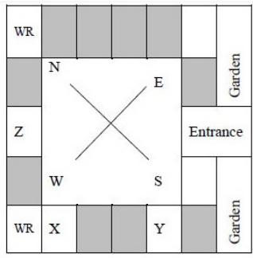

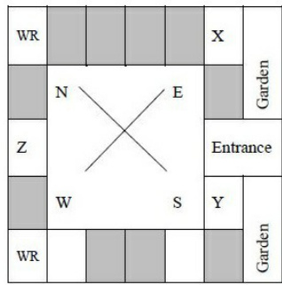

B.

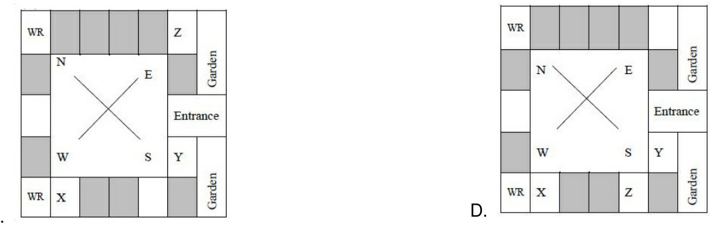

According to the map shown in the figure, which one of the following statements is correct? Note: The figure shown is representative.

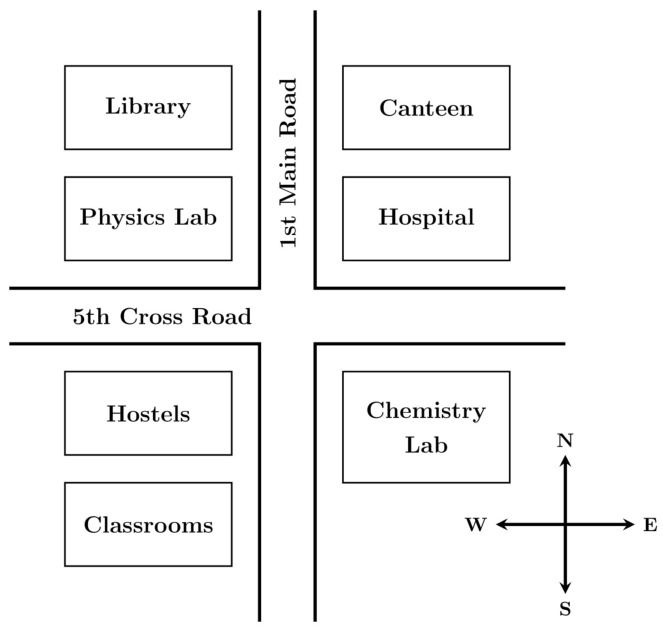

A. The library is located to the northwest of the canteen.   
B. The hospital is located to the east of the chemistry lab.   
C. The chemistry lab is to the southeast of physics lab.   
D. The classrooms and canteen are next to each other.

Consider the relationships among Q,R,S and  :

is the brother of .   
is the daughter of .   
is the sister of .   
is the mother of .

The following statements are made based on the relationships given above.

1. is the grandmother of .   
2. is the uncle of and .   
3. has only one son.   
4. Q has only one daughter.

Which one of the following options is correct?

A. Both (1) and  are true. B. Both and are true. C. Only  is true. D. Only  is true. gatecse2025-set1 analytical-aptitude logical-reasoning family-relationship one-mark

# Answer key☟

# 8.7.1 Logical Inference: GATE CSE 2025 Set 2 GA Question: 6

​Based only on the conversation below, identify the logically correct inference:   
"Even if I had known that you were in the hospital, would not have gone there to see you", Ramya told Josephine. A. Ramya knew that Josephine was in the hospital.   
B. Ramya did not know that Josephine was in the hospital.   
C. Ramya and Josephine were once close friends; but now, they are not.   
D. Josephine was in the hospital due to an injury to her leg.

gatecse2025-set2 analytical-aptitude logical-inference two-marks

# Answer key☟

I $\mathbf { 1 3 7 + 2 7 6 = 4 3 5 }$ how much is 731 + 672?

A. 534 B. 1403 C. 1623 D. 1513

gatecse-2010 analytical-aptitude normal logical-reasoning

C. $P$ -Home, $Q$ -Power, $T$ -Defense, $\boldsymbol { S }$ -Telecom, $U$ -Finance D. $Q$ -Home, $U$ -Power, $T$ -Defense, $R$ -Telecom, $P$ -Finance

There are three boxes. One contains apples, another contains oranges and the last one contains both apples and oranges. All three are known to be incorrectly labeled. If you are permitted to open just one box and then pull out and inspect only one fruit, which box would you open to determine the contents of all three boxe

A. The box labeled ‘Apples’ B. The box labeled ‘Apples and Oranges’ C. The box labeled ‘Oranges’ D. Cannot be determined

gatecse-2017-set2 analytical-aptitude normal tricky logical-reasoning

# Answer key☟

# 8.8.4 Logical Reasoning: GATE CSE 2021 Set 2 GA Question: 10

Six students , with distinct heights, compare their heights and make the following observations.

:  is taller than . Observation : $\mathbf { Q }$ is the shortest of all. Observation :  is taller than only one student. Observation IV: is taller than but is not the tallest

The number of students that are taller than $\mathbf { R }$ is the same as the number of students shorter than

A. B. C. D.

gatecse-2021-set2 analytical-aptitude logical-reasoning two-marks

A survey for a certain year found that $9 0 \%$ of pregnant women received medical care at least once before giving birth. Of these women, $6 0 \%$ received medical care from doctors, while $4 0 \%$ received medical care from other healthcare providers.

Given this information, which one of the following statements can be inferred with certainty?

A. More than half of the pregnant women received medical care at least once from a doctor.   
B. Less than half of the pregnant women received medical care at least once from a doctor.   
C. More than half of the pregnant women received medical care at most once from a doctor.   
D. Less than half of the pregnant women received medical care at most once from a doctor.

gatecse-2023 analytical-aptitude logical-reasoning one-mark

Combinatorics deals with problems involving counting. For example, "How many distinct arrangements of distinct objects in spaces on a circle are possible?" is a typical problem in combinatorics. This kind of counting is sometimes used in the modeling of several physical phenomena. Often, in such models, the different combinatorial possibilities are assigned probability values. Assigning probabilities enables the computation of the average values of physical quantities.

Consider the following statements:

P ： Combinatorics is always invoked in the modeling of physical phenomena.   
Modeling some physical phenomena involves assigning probabilities to combinatorial possibilities in order to compute average values of physical quantities.

Based on the passage above, what can be inferred about statements P and Q?

A. P is False and Q is False B. P is False and Q is True C. P is True and Q is False D. P is True and Q is True gatecse-2026-set1 analytical-aptitude logical-reasoning combinatory two-marks

In the  summer Olympics' Javelin throw finals, Neeraj Chopra exhibited a spectacular performance to win the gold medal. The silver medal was won by Jakub Vadlejch and the bronze medal was won by Vitezlav Vesely. There were six rounds of throws with each athlete having one throw per round. The best of all the throws o each athlete is considered for the medal. Following were the observations about the throws:

i. The first and second rounds were dominated by Neeraj Chopra with a gold medal performance in his second throw, while the other two athletes did not have any medal winning throws in these rounds.   
ii. The throws in the last round by both Jakub Vadlejch and Vitezlav Vesely were fouls and were not considered for scoring.   
iii. After four rounds, Vitezlav Vesely was in the second position and could not improve upon his best throw in the succeeding rounds.   
iv. In the fourth round, the throw by Jakub Vadlejch was the best in that round.

In which round did Vitezlav Vesely have his best throw?

A. Third B. Fourth C. Fifth D. Sixth

gatecse-2026-set1 analytical-aptitude logical-reasoning two-marks

# 8.8.9 Logical Reasoning: GATE CSE 2026 Set 2 GA Question: 5

'When it is raining, peacocks dance.

Based only on this sentence, which one of the following options is necessarily true?

A. Peacocks dance only when it is raining.   
B. When peacocks dance, it is raining.   
C. When peacocks are not dancing, it is not raining.   
D. When it is not raining, peacocks do not dance.

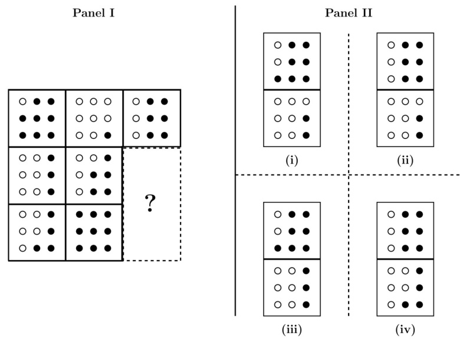

A. (i) B. (ii) C. (ii) D. (iv)

The figure in Panel  below is a grid of cells with four rows and four columns. The numbers on the top and on the left represent the number of cells that are to be shaded in that column and row, respectively. Which one of the options shown in Panel  below represents the grid shaded correctly?

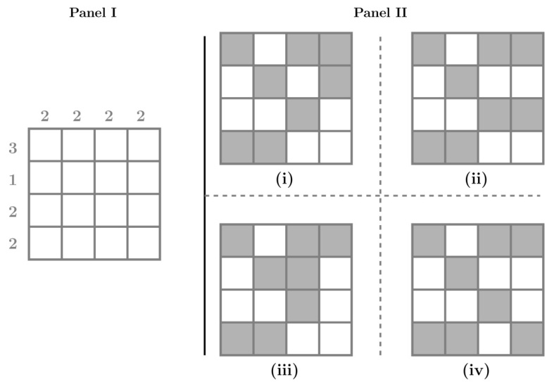

A. (i) B. (ii) C. (ii) D. (iv)

gatecse-2026-set2 analytical-aptitude two-marks logical-reasoning

Rishi and Swathi are students of Class . Pavan and Tanvi are students of Class . Rishi and Pavan are boys. Swathi and Tanvi are girls. The four students played a total of three games of chess. The games were played one after another. A player who lost a game did not participate in any more games. It was observed tha

I. the first game was the only game where two students of the same class played against each other, II. the students of Class won more games than the students of Class , and III. the boys won two games and the girls won one game.

The student who did not lose any game is

A. Pavan B. Rishi C. Swathi D. Tanvi

gateda-2026 analytical-aptitude logical-reasoning two-marks

# 8.8.14 Logical Reasoning: GATE2011 GG: GA-8

Three sisters $( R , S ,$ and $T$ received a total of  toys during Christmas. The toys were initially divided among them in a certain proportion. Subsequently, $R$ gave some toys to $\boldsymbol { S }$ which doubled the share of $\boldsymbol { S }$ . Then $\boldsymbol { S }$ in turn gave some of her toys to $T$ , which doubled $T ^ { \prime } { \mathsf { s } }$ share. Next, some of ${ T ^ { \prime } } { \mathsf { s } }$ toys were given to $R$ , which doubled the number of toys that $R$ currently had. As a result of all such exchanges, the three sisters were left with equal number o toys. How many toys did $R$ have originally?

A. B. 9 C. D.

gate2011-gg logical-reasoning analytical-aptitude

# 8.8.15 Logical Reasoning: GATE2011 MN: GA-63

$L , M$ and $N$ are waiting in a queue meant for children to enter the zoo. There are 5 children between $L$ and $M$ , and children between $M$ and $N$ . If there are children ahead of $N$ and children behind $L$ , then what is the minimum number of children in the queue?

A. B. C. 41 D. 40

analytical-aptitude gate2011-mn logical-reasoning

# 8.8.16 Logical Reasoning: GATE2012 AR: GA-8

Ravi is taller than Arun but shorter than Iqbal. Sam is shorter than Ravi. Mohan is shorter than Arun. Balu is taller than Mohan and Sam. The tallest person can be

A. Mohan B. Ravi C. Balu D. Arun

gate2012-ar logical-reasoning

Anuj, Bhola, Chandan, Dilip, Eswar and Faisal live on different floors in a six-storeyed building (the ground floor is numbered , the floor above it , and so on) Anuj lives on an even-numbered floor, Bhola does not live on an odd numbered floor. Chandan does not live on any of the floors below Faisal's floor. Dilip does not live on floor number . Eswar does not live on a floor immediately above or immediately below Bhola. Faisal lives three floors above Dilip. Which of the following floor-person combinations is correct?

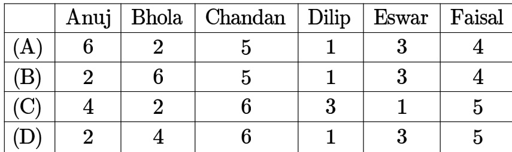

In the $4 \times 4$ array shown below, each cell of the first three rows has either a cross $( X )$ or a number.

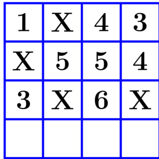

The number in a cell represents the count of the immediate neighboring cells (left, right, top, bottom, diagonals) NOT having a cross $X$ ). Given that the last row has no crosses $( X )$ , the sum of the four numbers to be filled in the last row is

A. B. 10 C. D. 9

gatecse-2024-set2 analytical-aptitude number-relations two-marks

# Answer key☟

# 8.10

✍ Practice Test: Test 1 (6Q)

In a recently conducted national entrance test, boys constituted $6 5 \%$ of those who appeared for the test.   
Girls constituted the remaining candidates and they accounted for $6 0 \%$ of the qualified candidates.

Which one of the following is the correct logical inference based on the information provided in the above passage?

A. Equal number of boys and girls qualified   
B. Equal number of boys and girls appeared for the test   
C. The number of boys who appeared for the test is less than the number of girls who appeared   
D. The number of boys who qualified the test is less than the number of girls who qualified

gatecse-2022 analytical-aptitude logical-reasoning passage-reading two-marks

# 8.11.2 Passage Reading: GATE CSE 2023 GA Question: 6

The country of Zombieland is in distress since more than $7 5 \%$ of its working population is suffering from serious health issues. Studies conducted by competent health experts concluded that a complete lack of physical exercise among its working population was one of the leading causes of their health issues. As one of the measures to address the problem, the Government of Zombieland has decided to provide monetary incentives to those who ride bicycles to work.

Based only on the information provided above, which one of the following statements can be logically inferred with certainty?

A. All the working population of Zombieland will henceforth ride bicycles to work.   
B. Riding bicycles will ensure that all of the working population of Zombieland is free of health issues.   
C. The health experts suggested to the Government of Zombieland to declare riding bicycles as mandatory.   
D. The Government of Zombieland believes that riding bicycles is a form of physical exercise.

✍ Practice Test: Test (9Q)

# .12.1 Round Table Arrangement: GATE CSE 2017 Set 1 GA Question:

Six people are seated around a circular table. There are at least two men and two women. There are at least three right-handed persons. Every woman has a left-handed person to her immediate right. None of the women are right-handed. The number of women at the table is

A. B. C. D. Cannot be determined

gatecse-2017-set1 analytical-aptitude round-table-arrangement

A. Rahul and Murali B. Srinivas and Arul C. Srinvas and Murali D. Srinivas and Rahul

gatecse-2017-set1 analytical-aptitude logical-reasoning seating-arrangement

# Answer key☟

✍ Practice Tests: Test 1 (15Q) Test 2 (1Q)

If $P = 3$ , $R = 2 7$ , $T = 2 4 3$ , then $Q + S =$

A. B. C. 90 D. 110

gatecse-2020 analytical-aptitude logical-reasoning sequence-series two-marks

Answer key☟

# 8.14.2 Sequence Series: GATE CSE 2024 Set 2 GA Question: 5

​In the sequence $6 , 9 , 1 4 , x$ ,30, 41, a possible value of $x$ is

A. B. C. D.

gatecse-2024-set2 analytical-aptitude sequence-series one-mark

# 8.14.3 Sequence Series: GATE2010 MN: GA-7

Given the sequence $A , B , B , C , C , C , D , D , D , D , \ldots$ etc that is one $A$ two $B ^ { \prime } s$ three $C ^ { \prime } s$ four $D _ { s }$ five $E ^ { \prime } s$ and so on, the letter in the sequence will be

A. B. C. D. W

general-aptitude logical-reasoning gate2010-mn sequence-series

# Answer key☟

✍ Practice Tests: Test 1 (15Q) Test 2 (15Q) Test 3 (7Q)

# 8.15.1 Statements Follow: GATE CSE 2016 Set 1 GA Question: 08

Consider the following statements relating to the level of poker play of four players .

I. $P$ always beats $Q$ II. $R$ always beats $\boldsymbol { S }$ III. $\boldsymbol { S }$ loses to $P$ only sometimes. IV. $R$ always loses to $Q$

Which of the following can be logically inferred from the above statements?

i. $P$ is likely to beat all the three other players ii. $\boldsymbol { S }$ is the absolute worst player in the set

A. (i). only B. (ii) only C. (i) and (ii) only' D. neither (i) nor (ii)

# 8.15.2 Statements Follow: GATE CSE 2016 Set 2 GA Question: 08

All hill-stations have a lake. Ooty has two lakes. Which of the statement(s) below is/are logically valid and can be inferred from the above sentences?

i. Ooty is not a hill-station.   
ii. No hill-station can have more than one lake.

A. (i) only. B. (ii) only. C. Both (i) and (ii) D. Neither (i) nor (ii)

gatecse-2016-set2 analytical-aptitude easy statements-follow

Given below are two statements and , and two conclusions  and

Statement All bacteria are microorganisms.   
Statement 2: All pathogens are microorganisms.   
Conclusion I: Some pathogens are bacteria.   
Conclusion All pathogens are not bacteria.

Based on the above statements and conclusions, which one of the following options is logically ?

A. Only conclusion is correct B. Only conclusion  is correct C. Either conclusion or  is correct D. Neither conclusion nor is correct

Given below are four statements.

Statement $1 : \mathsf { A l l }$ students are inquisitive.   
Statement Some students are inquisitive.   
Statement No student is inquisitive.   
Statement 4 Some students are not inquisitive.

From the given four statements, find the two statements that  simultaneously, assuming that there is at least one student in the class.

A. Statement and Statement B. Statement 1 and Statement 2 1 C. Statement and Statement D. Statement 3 and Statement gatecse-2022 analytical-aptitude logical-reasoning statements-follow one-mark

# 8.15.5 Statements Follow: GATE DS&AI 2024 GA Question: 6

Thousands of years ago, some people began dairy farming. This coincided with a number of mutations in a particular gene that resulted in these people developing the ability to digest dairy milk.

Based on the given passage, which of the following can be inferred?

A. All human beings can digest dairy milk.   
B. No human being can digest dairy milk.   
C. Digestion of dairy milk is essential for human beings.   
D. In human beings, digestion of dairy milk resulted from a mutated gene.

# Answer key☟

Some scientists are professors

Which of the given conclusions is logically valid and is inferred from the above arguments?

A. All scientists are researchers B. All professors are scientists C. Some researchers are scientists D. No conclusion follows

gate2013-ae analytical-aptitude logical-reasoning statements-follow

In a group of four children, Som is younger to Riaz. Shiv is elder to Ansu. Ansu is youngest in the group. Which of the following statements is/are required to find the eldest child in the group?

# Statements

1. Shiv is younger to Riaz.   
2. Shiv is elder to Som.

A. Statement by itself determines the eldest child.   
B. Statement by itself determines the eldest child.   
C. Statements 1 and  are both required to determine the eldest child.   
D. Statements and are not sufficient to determine the eldest child.

# Answer Keys

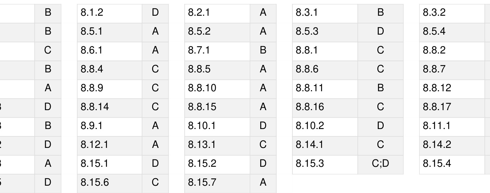

Syllabus: Numerical computation, Numerical estimation, Numerical reasoning and data interpretation

Mark Distribution in Previous GATE   
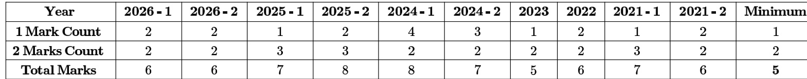

Welcome to the Quantitative Aptitude section of your GATE Computer Science preparation! This chapter is designed to equip you with the essential mathematical and logical reasoning skills crucial for success in the General Aptitude section of the GATE exam. Quantitative Aptitude tests your ability to solve numerical problems, interpret data, and apply fundamental mathematical concepts efficiently and accurately. Typically, this section carries a significant weightage, often contributing 8-10 marks out of the total 15 marks for General Aptitude, with questions ranging from direct formula application to complex problem-solving and data interpretation. Mastering these topics is not just about scoring in aptitude; also sharpens your analytical thinking, which is invaluable for the core Computer Science subjects.

# Topic-wise Key Concepts

# Absolute Value

The absolute value of a real number $x$ , denoted $| x |$ , is its non-negative value regardless of its sign. It represents the distance of $x$ from zero on the number line.

Definition: $| x | = x$ if $x \ge 0$ , and $| x | = - x$ if $x < 0$ . Properties:   
1. $| x | \geq 0$   
2. $| - x | = | x |$   
3. $| x y | = | x | | y |$   
4. $| x / y | = | x | / | y |$ (for $y \neq 0$ )   
5. Triangle Inequality: $| x + y | \leq | x | + | y |$

# Solving Equations/Inequalities:

$| x | = a \implies x = a$ or $x = - a$ (for $a \geq 0$ ) 2. $| x | < a \implies - a < x < a$ (for $a > 0$ ) 3. $| x | > a \implies x < - a \mathrm { o r } x > a$ (for $a \geq 0$ )

Pitfall: Forgetting to consider both positive and negative cases when removing the absolute value sig Technique: Isolate the absolute value term, then apply the appropriate definition or rule.

# Age Relation

Age relation problems involve finding the current or future/past ages of individuals based on given conditions, usually forming linear equations.

Core Idea: Translate word problems into algebraic equations involving variables for ages.   
Technique: Assign variables (e.g., $x$ for current age), form equations based on the relationships (e.g., "A is twice as old as $\mathsf { B } " \implies A = 2 B )$ , and solve the system of equations.   
Pitfall: Misinterpreting phrases like $" \times$ years ago" or $" \times$ years hence".

# Algebra

Algebra deals with symbols and rules for manipulating these symbols. It involves basic operations, factorization, and algebraic identities.

# Identities:

1. $( a + b ) ^ { 2 } = a ^ { 2 } + 2 a b + b ^ { 2 }$   
2. $( a - b ) ^ { 2 } = a ^ { 2 } - 2 a b + b ^ { 2 }$   
3. $a ^ { 2 } - b ^ { 2 } = ( a - b ) ( a + b )$   
4. $( a + b ) ^ { 3 } = a ^ { 3 } + b ^ { 3 } + 3 a b ( a + b )$