5. $( a - b ) ^ { 3 } = a ^ { 3 } - b ^ { 3 } - 3 a b ( a - b )$   
6. $a ^ { 3 } + b ^ { 3 } = ( a + b ) ( a ^ { 2 } - a b + b ^ { 2 } )$   
7. $a ^ { 3 } - b ^ { 3 } = ( a - b ) ( a ^ { 2 } + a b + b ^ { 2 } )$   
8. $a ^ { 3 } + b ^ { 3 } + c ^ { 3 } - 3 a b c = ( a + b + c ) ( a ^ { 2 } + b ^ { 2 } + c ^ { 2 } - a b - b c - c a )$   
9. If $a + b + c = 0$ , then $a ^ { 3 } + b ^ { 3 } + c ^ { 3 } = 3 a b c$

Pitfall: Sign errors, incorrect order of operations (PEMDAS/BODMAS).   
Technique: Simplify expressions using identities, factorize, and solve equations systematically.

# Alligation Mixture

Alligation is a rule that helps determine the ratio in which two or more ingredients of different prices must be mixed to produce a mixture of a desired price.

Formula:

Technique: Use the "alligation cross" diagram to visualize and solve problems quickly.   
Pitfall: Incorrectly identifying the cheaper, dearer, or mean price.

# Area

Area is the measure of the extent of a two-dimensional surface or shape.

# Formulas:

1. Square: $s ^ { 2 }$ (where $s$ is side)   
2. Rectangle: $l \times w$ (where $l$ is length, $w$ is width)   
3. Circle: $\pi r ^ { 2 }$ (where $r$ is radius)   
4. Triangle: $\frac { 1 } { 2 } \times \mathrm { b a s e } \times \mathrm { h e i g h t }$ (or Heron's formula: $\sqrt { s ( s - a ) ( s - b ) ( s - c ) }$ where $\pmb { \mathscr { s } } = ( a + b + c ) / 2 )$ 5. Parallelogram: $\times$ height   
6. Trapezoid: ${ \frac { 1 } { 2 } } \times ( { \mathrm { s u m ~ o f ~ p a r a l l e l ~ s i d e s } } ) \times { \mathrm { h e i g h t } }$   
7. Rhombus: $\frac { \bar { 1 } } { 2 } \times d _ { 1 } \times d _ { 2 }$ (where $d _ { 1 } , d _ { 2 }$ are diagonals)   
Pitfall: Using perimeter formulas instead of area, or incorrect units.   
Technique: Identify the shape, recall the correct formula, and ensure consistent units.

# Arithmetic Series

An arithmetic series is the sum of terms in an arithmetic progression, where the difference between consecutive terms is constant (common difference $d )$ .

# Formulas:

1. $n$ -th term: $a _ { n } = a _ { 1 } + ( n - 1 ) d$   
2. Sum of $\scriptstyle n$ terms: $\begin{array} { r } { S _ { n } = \overset { n } { 2 } ( { a } _ { 1 } + { a } _ { n } ) } \end{array}$ or $\begin{array} { r } { S _ { n } = \frac { n } { 2 } ( 2 a _ { 1 } + ( n - 1 ) d ) } \end{array}$ Pitfall: Off-by-one errors when calculating $n$ , especially when given ranges. Technique: Clearly identify $a _ { 1 } , d ,$ and $n$ .

# Average

The average (arithmetic mean) is the sum of a set of values divided by the number of values.

Formula: Average $\ b =$ Numberfquantses   
Weighted Average: Weighted $\mathbf { \dot { A } v e r a g e } = \frac { \sum ( w _ { i } x _ { i } ) } { \sum w _ { i } }$   
Technique: Use the formula directly. For weighted averages, ensure correct weights are applied. Pitfall: Confusing average with median or mode.

# Bar Graph

A bar graph uses rectangular bars to represent data, with the length or height of the bars proportional to the values they

represent.

Core Idea: Visual representation of discrete data for comparison.   
Technique: Carefully read labels, scales, and legends. Compare bar heights/lengths to answer questions about quantities, differences, or ratios.   
Pitfall: Misinterpreting scales or units on the axes.

# Bayes Theorem

Bayes' Theorem describes the probability of an event, based on prior knowledge of conditions that might be related to the event.

Formula: $\begin{array} { r } { P ( A | B ) = \frac { P ( B | A ) P ( A ) } { P ( B ) } } \end{array}$   
Key Terms: $P ( A | B )$ is posterior probability, $P ( B | A )$ is likelihood, $P ( A )$ is prior probability, $P ( B )$ is evidence. Pitfall: Confusing conditional probabilities $P ( A | B )$ and $P ( B | A )$ .   
Technique: Break down the problem into individual probabilities and substitute into the formula.

# Calendar

Calendar problems involve determining the day of the week for a given date or finding specific dates based on calendar logic.

Core Idea: Based on the concept of "odd days" (remainder when days are divided by 7). Key Concepts:   
1. Ordinary $\mathsf { y e a r } = 3 6 5 \mathrm { d a y s } = 5 2 \mathrm { w }$ eeks $+ 1$ odd day   
2. Leap year $= 3 6 6$ days $= 5 2$ weeks $+ 2$ odd days   
3. Leap year rules: Divisible by 4, unless it's a century year not divisible by 400.   
4. Odd days for centuries: 100 years $= 5$ odd days, 200 years $= 3$ , 300 years $= 1$ 1, 400 years $= 0$ . Technique: Calculate total odd days from a reference date (e.g., Jan 1, 0001) to the target date. Pitfall: Incorrectly identifying leap years or counting odd days.

# Cartesian Coordinates

Cartesian coordinates define the position of a point in a plane using two perpendicular axes $\mathsf { \bar { x } }$ and y).

# Key Formulas:

1. Distance between $( x _ { 1 } , y _ { 1 } )$ and $( x _ { 2 } , y _ { 2 } ) \colon D = { \sqrt { ( x _ { 2 } - x _ { 1 } ) ^ { 2 } + ( y _ { 2 } - y _ { 1 } ) ^ { 2 } } }$   
2. Midpoint of a segment: $\begin{array} { r } { M = \left( \frac { x _ { 1 } + x _ { 2 } } { 2 } , \frac { y _ { 1 } + y _ { 2 } } { 2 } \right) } \end{array}$   
3. Section Formula (dividing in ratio $m : n )$ : $\left( { \frac { m x _ { 2 } + n x _ { 1 } } { m + n } } , { \frac { m y _ { 2 } + n y _ { 1 } } { m + n } } \right)$   
4. Area of triangle with vertices $( x _ { \perp } , y _ { \perp } ) , ( x _ { 2 } , y _ { 2 } ) , ( x _ { 3 } , y _ { 3 } ) \colon \frac { 1 } { 2 } | x _ { 1 } ( y _ { 2 } - y _ { 3 } ) + x _ { 2 } ( y _ { 3 } - y _ { 1 } ) + x _ { 3 } ( y _ { 1 } - y _ { 2 } ) |$ Pitfall: Sign errors in distance or section formula.   
Technique: Plot points if helpful, apply formulas carefully.

# Circle

A circle is the set of all points in a plane that are equidistant from a central point.

# Formulas:

1. Circumference: $C = 2 \pi r = \pi d$   
2. Area: $A = \pi r ^ { 2 }$   
3. Equation of a circle (center $( h , k )$ , radius $r$ ): $( x - h ) ^ { 2 } + ( y - k ) ^ { 2 } = r ^ { 2 }$ 4. Area of sector: ${ \frac { \theta } { 3 6 0 ^ { \circ } } } \times \pi r ^ { 2 }$ (where $\theta$ is central angle in degrees)   
5. Length of arc: $\frac { \breve { \theta } ^ { \textrm { \scriptsize } } } { 3 6 0 ^ { \circ } } \times 2 \pi r$   
Pitfall: Confusing radius with diameter, or circumference with area.   
Technique: Identify given parameters and apply the correct formula.

# Clock Time

Clock time problems involve calculating angles between clock hands, or determining exact times based on relative speeds of hands.

# Key Rates:

1. Hour hand: $0 . 5 ^ { \circ }$ per minute   
2. Minute hand: $6 ^ { \circ }$ per minute   
3. Relative speed: $5 . 5 ^ { \circ }$ per minute (minute hand gains on hour hand)   
FTeorchmnuilqaufeo:rCaanlgcluelabtettwheepno shitaionndso aetaHc hhoaunrsd rMelamtivneuteos1: $| 3 0 H - { \textstyle { \frac { 1 1 } { 2 } } } M |$ difference. Pitfall: Not considering the hour hand's movement within the hour.

# Combinatory (Permutation and Combination)

Combinatory deals with counting arrangements (permutations) and selections (combinations) of objects.

# Formulas:

1. Permutation (arrangement of $k$ items from ): 二 n! (n-k)! 2. Combination (selection of $k$ items from $n$ ): $\begin{array} { r } { C ( n , k ) = \frac { \dot { n } ! } { k ! ( n - k ) ! } } \end{array}$ 3. $n ! = n \times ( n - 1 ) \times \cdots \times 1 , 0 ! = 1$ . Key Principle: Permutation is about order, combination is not. "Arrangement" implies permutation, "selection" or "group" implies combination. . Pitfall: Confusing permutation with combination. Technique: Determine if order matters. Use multiplication principle for sequential events, addition principle for mutually exclusive events.

# Compound Interest

Compound interest is interest calculated on the initial principal, which also includes all of the accumulated interest from previous periods on a deposit or loan.

# Formulas:

1. Amount (compounded annually): $\begin{array} { r } { A = P \big ( 1 + \frac { R } { 1 0 0 } \big ) ^ { T } } \end{array}$   
2. Compound Interest (CI): $C I = A - P$   
3. Amount (compounded $\scriptstyle n$ times a year): $\begin{array} { r } { A = P \big ( 1 + \frac { R } { 1 0 0 n } \big ) ^ { n T } } \end{array}$   
4. Amount (compounded continuously): $A = P e ^ { R T / 1 0 0 }$   
Pitfall: Confusing simple interest with compound interest, or incorrect compounding frequency. Technique: Identify principal (P), rate (R), time $( \mathsf { T } )$ , and compounding frequency.

# Conditional Probability

Conditional probability is the probability of an event occurring given that another event has already occurred.

Formula: $\begin{array} { r } { P ( A | B ) = \frac { P ( A \cap B ) } { P ( B ) } } \end{array}$ (where $P ( B ) > 0 )$   
Key Idea: The sample space is reduced to event B.   
Pitfall: Misidentifying the intersection event or the conditioning event.   
Technique: Clearly define events A and B, find their intersection, and the probability of B.

# Cones

A cone is a three-dimensional geometric shape that tapers smoothly from a flat base (usually circular) to a point called the apex or vertex.

# Formulas:

1. Volume: $\textstyle V = { \frac { 1 } { 3 } } \pi r ^ { 2 } h$   
2. Curved Surface Area (CSA): $C S A = \pi r l$ (where $l$ is slant height, $l = \sqrt { r ^ { 2 } + h ^ { 2 } } )$ ， 3. Total Surface Area (TSA): $T S A = \pi r ( l + r )$   
Pitfall: Confusing height $( h )$ with slant height $( l )$ .   
Technique: Use Pythagorean theorem to find $l$ if $r$ and $h$ are given.

# Contour Plots

Contour plots (or isoline maps) display three-dimensional data on a two-dimensional plane, where lines connect points of equal value.

Core Idea: Visualize a third variable (e.g., elevation, temperature) over a surface.   
Technique: Interpret the density and values of contour lines. Closely spaced lines indicate a steep gradient, widely spaced lines indicate a gentle gradient.   
Pitfall: Misinterpreting the values represented by the lines or the gradient.

# Cost Market Price

These problems involve concepts of cost price (CP), selling price (SP), market price (MP), profit, loss, and discount.

# Formulas:

1. Profit $= { \mathrm { S P } } - { \mathrm { C P } }$ (if $\mathbf { S P } > \mathbf { C P } .$ )   
2. $\mathrm { L o s s } = \mathrm { C P } - \mathrm { S P }$ (if $\mathrm { C P } > \mathrm { S P } ,$ )   
3. Profit/Loss $\smash { \downarrow \% = \frac { \mathrm { P r o f i t / L o s s } } { \hbar \Omega } \times 1 0 0 }$   
4. Discount 二 MP 一 SP   
5. Discount $\textstyle \langle \mathcal { Y } _ { 0 } = \frac { \mathrm { D i s c o u n t } } { \mathrm { M P } } \times 1 0 0 \$   
6. $\begin{array} { r } { \mathrm { S P } { = } \mathrm { C P } \times ( 1 { \pm } \frac { \mathrm { P r o f i t } / \mathrm { L o s s } \backslash \% } { 1 0 0 } ) } \end{array}$   
7. $\begin{array} { r } { \mathrm { S P } = \mathrm { M P } \times ( 1 - \frac { \mathrm { D i s c o u n t } \times \% } { 1 0 0 } ) } \end{array}$

Pitfall: Calculating profit/loss $\%$ on SP instead of CP, or discount $\%$ on CP instead of MP.   
Technique: Clearly identify CP, SP, MP, and the base for percentage calculations.

# Counting

Counting principles involve determining the number of possible outcomes for various events.

# Principles:

1. Addition Principle: If event A can occur in  ways and event B in  ways, and they are mutually exclusive, then A or B can occur in $m + n$ ways.   
2. Multiplication Principle: If event A can occur in  ways and event B in  ways, then A and B can occur in $m \times n$ ways.   
Technique: Break down complex counting problems into simpler, sequential or mutually exclusive steps.   
Pitfall: Overcounting or undercounting by misapplying the principles.

# Cubes

A cube is a three-dimensional solid object bounded by six square faces, facets or sides, with three meeting at each vertex.

# Formulas:

1. Volume: $V = a ^ { 3 }$ (where $a$ is side length)   
2. Surface Area: $S A = 6 a ^ { 2 }$   
3. Diagonal of a face: $a { \sqrt { 2 } }$   
4. Main Diagonal of the cube: $a { \sqrt { 3 } }$   
Pitfall: Confusing surface area with volume, or face diagonal with main diagonal. Technique: Visualize the cube and its dimensions.

# Currency Notes

Problems involve calculating the total value of currency notes of different denominations or determining the number of notes of each denomination given a total amount.

Core Idea: Form linear equations based on the value and count of notes.   
Technique: Assign variables to the number of notes of each denomination and set up equations.   
Pitfall: Calculation errors with large numbers or multiple denominations.

# Curves

In quantitative aptitude, "curves" generally refer to the graphs of functions, requiring interpretation of their shape, slope, and points of interest.

Core Idea: Visual representation of relationships between variables.   
Technique: Analyze the trend (increasing/decreasing), points of maxima/minima, and intersections.   
Pitfall: Misinterpreting the axes or the units.

# Data Interpretation

Data interpretation involves extracting, analyzing, and drawing conclusions from various forms of data presentation like tables, charts (bar, pie, line, scatter, radar), and graphs.

Core Idea: Critical analysis of presented data to answer specific questions.   
Technique: Read titles, labels, scales, and legends carefully. Perform calculations (percentages, ratios, averages) based on the data.   
Pitfall: Rushing calculations, misreading data points, or making assumptions not supported by the data.

# Digital Image Processing

While a CS topic, in QA it might appear as basic numerical problems related to image size, resolution, or data storage.

Core Idea: Image represented as a grid of pixels.   
Key Concepts:   
1. Resolution: Width $\times$ Height (in pixels)   
2. Color Depth: Bits per pixel (e.g., 8-bit for 256 colors, 24-bit for true color) 3. Image Size (uncompressed): Resolution $\times$ Color Depth (in bits)   
Technique: Apply multiplication principles for calculating total bits/bytes. Pitfall: Unit conversions (bits to bytes, KB to MB).

# Factors

Factors (or divisors) of a number are integers that divide the number evenly without leaving a remainder.

Core Idea: Finding numbers that multiply to give the original number. Properties:   
1. For $N = p _ { 1 } ^ { a _ { 1 } } p _ { 2 } ^ { a _ { 2 } } \cdot \cdot \cdot p _ { k } ^ { a _ { k } }$ (prime factorization):   
2. Number of factors: $( \ l _ { a _ { 1 } } ^ { \prime } + 1 ) ( \ l _ { a _ { 2 } } + 1 ) \ l . . . ( \ l _ { a _ { k } } + 1 )$   
3. Sum of factors: $( 1 + p _ { 1 } + \cdots + p _ { 1 } ^ { a _ { 1 } } ) ( 1 + p _ { 2 } + \cdots + p _ { 2 } ^ { a _ { 2 } } ) \ldots$   
Technique: Prime factorization is key to finding number and sum of factors. Pitfall: Missing factors, especially and the number itself.

# Fractions

Fractions represent a part of a whole, expressed as a ratio of two integers (numerator/denominator).

Operations: Addition, subtraction, multiplication, division.   
Properties: Equivalent fractions, proper/improper fractions, mixed numbers.   
Technique: Find common denominators for addition/subtraction. Invert and multiply for division. Simplify fractions.   
Pitfall: Errors in finding common denominators or simplifying.

# Functions

A function is a relation between a set of inputs and a set of permissible outputs with the property that each input is related to exactly one output.

Core Idea: Mapping inputs to outputs. $y = f ( x )$ .   
Key Concepts: Domain (set of inputs), Range (set of outputs), types (linear, quadratic, polynomial).   
Technique: Evaluate functions at given points, understand their graphs, and solve for unknowns.   
Pitfall: Incorrectly applying function rules or misinterpreting domain/range restrictions.

# Geometry

Geometry deals with the properties and relations of points, lines, surfaces, solids, and higher dimensional analogs.

Core Idea: Understanding shapes, angles, and spatial relationships.   
Key Theorems: Pythagorean theorem, properties of parallel lines and transversals, angle sum property of triangles, similar/congruent triangles.   
Technique: Draw diagrams, identify knowns and unknowns, apply relevant theorems and formulas.   
Pitfall: Assuming properties not explicitly stated or derivable.

# Graph Coloring

Graph coloring assigns colors to elements of a graph subject to certain constraints. In QA, it's usually simplified to finding the minimum number of colors for a small graph.

Core Idea: Assign colors to vertices such that no two adjacent vertices share the same color.   
Technique: Start coloring from a vertex with high degree; systematically assign colors, avoiding conflicts with neighbors.   
Pitfall: Missing a valid coloring or not finding the minimum.

# Inequality

Inequalities are mathematical statements comparing two expressions using symbols lik $\yen 123,456,7$ .

# Properties:

1. Adding/subtracting a number from both sides does not change the inequality direction.   
2. Multiplying/dividing by a positive number does not change the inequality direction.   
3. Multiplying/dividing by a negative number reverses the inequality direction.   
Technique: Solve like equations, but remember to flip the sign when multiplying/dividing by a negative number. For quadratic inequalities, use sign analysis of factors.   
Pitfall: Forgetting to reverse the inequality sign.

# LCM HCF

LCM (Least Common Multiple) is the smallest positive integer divisible by each of a given set of integers. HCF (Highest Common Factor) or GCD (Greatest Common Divisor) is the largest positive integer that divides each of a given set of integers.

# Formulas:

1. For two numbers $a$ and $b$ $\because \operatorname { L C M } ( a , b ) \times \operatorname { H C F } ( a , b ) = a \times b$ 2. To find LCM/HCF: Use prime factorization method. Technique: Prime factorization is the most reliable method. Pitfall: Confusing LCM with HCF, especially in word problems.

# Line Graph

A line graph displays information as a series of data points connected by straight line segments, showing trends over time or categories.

. Core Idea: Visualizing trends and changes over a continuous variable.   
Technique: Observe the slope of the lines to understand rates of change, identify peaks and troughs.   
Pitfall: Misinterpreting the scale or the meaning of the trend.

# Lines

Lines in coordinate geometry are one-dimensional figures with properties like slope, intercepts, and equations.

# Formulas:

1. Slope $( m )$ of a line through $( x _ { 1 } , y _ { 1 } )$ and $( x _ { 2 } , y _ { 2 } )$ : $\begin{array} { r } { m = \frac { y _ { 2 } - y _ { 1 } } { x _ { 2 } - x _ { 1 } } } \end{array}$   
2. Equation of a line (slope-intercept form): $y = m x + c$ (where $c$ is y-intercept)   
3. Equation of a line (point-slope form): $y - y _ { 1 } = m ( x - x _ { 1 } )$   
4. Parallel lines: $m _ { 1 } = m _ { 2 }$   
5. Perpendicular lines: $m _ { 1 } m _ { 2 } = - 1$   
Pitfall: Sign errors in slope calculation, confusing parallel with perpendicular conditions.

Technique: Identify slope and a point, then use the appropriate equation form.

# Logarithms

Logarithms are the inverse operation to exponentiation. The logarithm of a number $x$ to the base $b$ is the exponent to which $b$ must be raised to produce $x$ .

Definition: $\log _ { b } a = c \iff b ^ { c } = a$   
Properties:   
1. $\log _ { b } ( x y ) = \log _ { b } x + \log _ { b } y$   
2. $\log _ { b } ( x / y ) = \log _ { b } x - \log _ { b } y$   
3. $\log _ { b } x ^ { n } = n \log _ { b } x$ C   
4. $\log _ { b } b = 1 , \log _ { b } \dot { 1 } = 0$   
5. Change of Base: $\begin{array} { r } { \log _ { b } a = { \frac { \log _ { c } a } { \log _ { c } b } } } \end{array}$   
Pitfall: Misapplying properties, especially for addition/subtraction.   
Technique: Convert between logarithmic and exponential forms, use properties to simplify.

# Maps

Map problems involve interpreting scale, distances, and directions on maps.

Core Idea: Scale represents the ratio of a distance on the map to the corresponding distance on the ground. Formula: $\ b =$ Actual Distance $\times$ Scale   
Technique: Pay close attention to the scale (e.g., 1:100000 or $1 \ { \mathsf { c m } } = 1 0 \ { \mathsf { k m } } ,$ ) and units.   
Pitfall: Incorrect unit conversions.

# Maxima Minima

Finding the maximum or minimum value of a function or expression.

Core Idea: Identifying the highest or lowest point a function can reach.   
For Quadratic Function $f ( x ) = a x ^ { 2 } + b x + c \mathrm { . }$   
1. Vertex at $x = - b / ( 2 a )$   
2. If $a > 0$ minimum value at vertex.   
3. If $a < 0$ , maximum value at vertex.   
General Technique (Calculus-based, if applicable): Find derivative $f ^ { \prime } ( x )$ , set to zero to find critical points. Use second derivative test for max/min.   
Pitfall: Confusing local maxima/minima with global maxima/minima.

# Mensuration

Mensuration is the branch of mathematics that deals with the measurement of geometric figures and their parameters like length, area, and volume. This topic consolidates formulas for various 2D and 3D shapes.

Core Idea: Applying geometric formulas to calculate dimensions, areas, and volumes.   
Technique: Refer to specific topics like Area, Volume, Cones, Cubes, Circles, Triangles for detailed formulas.   
Pitfall: Incorrectly applying formulas or unit conversions.

# Modular Arithmetic

Modular arithmetic is a system of arithmetic for integers, where numbers "wrap around" when reaching a certain value —the modulus.

Definition: $a \equiv b$ (mod $m$ ） means $a$ and $b$ have the same remainder when divided by $m$ , or $m$ divides $( a - b )$ Properties:   
1. If $a \equiv b$ (mod and $c \equiv d$ $( \mathrm { m o d } \ m )$ , then $a + c \equiv b + d$ $( \bmod m )$ and $a c \equiv b d { \mathrm { ~ ( m o d ~ } } m { \mathrm { ) } } .$ . 2. $( a \times b ) { \mathrm { ~ ( m o d ~ } } m ) = ( ( a { \mathrm { ~ ( m o d ~ } } m ) ) \times ( b { \mathrm { ~ ( m o d ~ } } m ) ) )$ (mod $m$ ）   
Technique: Use properties to simplify large numbers before finding remainders. Useful for unit digit problems. Pitfall: Incorrectly handling negative numbers in modulo operations.

# Number Representation

Number representation deals with how numbers are written and interpreted, often involving different bases (e.g., decimal, binary).

Core Idea: Converting numbers between different bases.   
Technique: For base-10 to base-B, repeatedly divide by B and collect remainders. For base-B to base-10, use positional notation (sum of digits $\times$ base to power of position).   
Pitfall: Errors in powers of the base or order of remainders.

# Number Series

Number series problems involve identifying the pattern in a sequence of numbers and finding the next term or a missing term.

Types: Arithmetic, geometric, difference series, squares/cubes, prime numbers, alternating patterns, Fibonacci-like. Technique: Look for common differences, common ratios, differences of differences, squares/cubes, or   
combinations of operations.   
Pitfall: Overlooking subtle patterns or assuming a simple pattern too quickly.

# Number System

The number system classifies numbers (natural, whole, integers, rational, irrational, real, complex) and includes concepts like divisibility rules, prime/composite numbers.

Divisibility Rules: (e.g., by 2, 3, 4, 5, 6, 8, 9, 10, 11).   
Classification:   
1. Natural Numbers: $\{ 1 , 2 , 3 , \ldots \}$   
2. Whole Numbers: $\{ 0 , 1 , 2 , 3 , \ldots \}$   
3. Integers: $\{ \dots , - 2 , - 1 , 0 , 1 , 2 , \dots \}$   
4. Rational Numbers: $\{ p / q \mid p , q$ are integers, $q \neq 0 \}$   
5. Irrational Numbers: Non-terminating, non-repeating decimals (e.g., $\sqrt { 2 } , \pi )$ 6. Real Numbers: Rational $^ +$ Irrational   
Technique: Apply divisibility rules, understand properties of number types. Pitfall: Confusing different sets of numbers (e.g., integers vs. whole numbers).

# Number Theory

Number theory is a branch of pure mathematics devoted primarily to the study of integers and integer-valued functions, including primes, divisibility, and modular arithmetic.

Core Idea: Properties of integers. (Overlaps with Factors, Prime Numbers, Modular Arithmetic).   
Key Concepts: Prime numbers, composite numbers, factors, multiples, HCF, LCM, divisibility.   
Technique: Use prime factorization, apply divisibility rules, understand modular arithmetic.   
Pitfall: Misapplying theorems or properties.

# Numerical Computation

Numerical computation involves performing calculations accurately and efficiently, often with approximations, rounding, and significant figures.

Core Idea: Precision and accuracy in calculations.   
Technique: Estimate answers, use approximations (e.g., $\pi \approx 2 2 / 7$ or 3.14), understand rules for significant figures and rounding.   
Pitfall: Rounding too early, leading to accumulated errors.

# Percentage

Percentage is a way of expressing a number or ratio as a fraction of 100. It is often denoted using the percent sign, $" \% "$ .

# Formulas:

1. Value $\mathbf { \tau } = \mathbf { B a s e } \times { \frac { \mathbf { P e r c e n t a g e } } { 1 0 0 } }$   
2. Percentage ${ \mathrm { C h a n g e } } = { \frac { \mathrm { { \sc ~ c n a n g e } } } { \mathrm { { O r i g i n a l V a l u e } } } } \times 1 0 0$ Change

3. Successive Percentage Change: If an item changes by $x \%$ then by $y \%$ , net change is $( x + y + \textstyle { \frac { x y } { 1 0 0 } } ) \%$ .   
. Pitfall: Calculating percentage change based on the wrong base value.   
Technique: Convert percentages to decimals or fractions for calculations.

# Permutation and Combination

Refer to "Combinatory" section for details.

# Pie Chart

A pie chart is a circular statistical graphic, which is divided into slices to illustrate numerical proportion.

Core Idea: Visualizing parts of a whole as proportions.   
Properties: The sum of all percentages in a pie chart must be $100 \%$ , and the sum of all central angles must be $3 6 0 ^ { \circ }$ .   
Technique: Relate percentages to degrees $\mathbf { \cdot } \mathbf { 1 } \% = 3 . 6 ^ { \circ }$ ). Calculate proportions and compare sectors.   
Pitfall: Misinterpreting the size of sectors or the total quantity.

# Polynomials

A polynomial is an expression consisting of variables and coefficients, that involves only the operations of addition, subtraction, multiplication, and non-negative integer exponents of variables.

Key Concepts: Degree, roots (zeros), factors.   
Theorems: 1. Remainder Theorem: If a polynomial $P ( x )$ is divided by $( x - a )$ , the remainder is $P ( a )$ .   
2. Factor Theorem: $( x - a )$ is a factor of $P ( x )$ if and only if $P ( a ) = 0$ .   
Technique: Factorization, synthetic division, applying remainder/factor theorems.   
Pitfall: Errors in algebraic manipulation or sign errors.

# Powers

Powers (or exponents) indicate the number of times a base number is multiplied by itself.

# Rules of Exponents:

1. $x ^ { a } \cdot x ^ { b } = x ^ { a + b }$   
2. $x ^ { a } / x ^ { b } = x ^ { a - b }$   
3. $( x ^ { a } ) ^ { b } = x ^ { a b }$   
4. $( x y ) ^ { a } = x ^ { a } y ^ { a }$   
5. $( x / y ) ^ { a } = x ^ { a } / y ^ { a }$   
6. $x ^ { 0 } = 1$ (for $\boldsymbol { x } \neq \boldsymbol { 0 }$ )   
7. $x ^ { - a } = 1 / x ^ { a }$   
8. $x ^ { 1 / n } = \sqrt [ n ] { x }$   
Pitfall: Incorrectly applying rules, especially with negative exponents or fractions.   
Technique: Simplify expressions using exponent rules, convert to common base if possible.

# Prime Numbers

A prime number is a natural number greater than 1 that has no positive divisors other than 1 and itself.

# Properties:

1. 2 is the only even prime number.   
2. Every integer greater than 1 is either prime or can be uniquely expressed as a product of primes (Fundamental Theorem of Arithmetic).   
Technique: To check if $N$ is prime, test divisibility by primes up to .   
Pitfall: Confusing 1 as a prime number (it's not).

# Probability

Probability is the measure of the likelihood that an event will occur.

Formula: 二 TNaNumreOute   
Properties:   
1. $0 \leq P ( E ) \leq 1$   
2. $P ( \operatorname { n o t } E ) = 1 - P ( E )$   
3. $P ( A \cup B ) = P ( A ) + P ( B ) - P ( A \cap B )$   
4. For independent events: ${ \cal P } ( A \cap B ) = { \cal P } ( A ) { \cal P } ( B )$ Technique: Clearly define the sample space and the event. Use counting techniques (P&C) to find favorable and total outcomes.   
Pitfall: Incorrectly identifying sample space or favorable outcomes, or assuming independence when events are dependent.

# Probability Density Function

For continuous random variables, the Probability Density Function (PDF) describes the relative likelihood for the random variable to take on a given value. The probability of the variable falling within a range is given by the integral of the PDF over that range.

Core Idea: For continuous variables, $\begin{array} { r } { P ( a \leq X \leq b ) = \int _ { a } ^ { b } f ( x ) d x . } \end{array}$   
Property: $\begin{array} { r } { \int _ { - \infty } ^ { \infty } f ( x ) d x = 1 } \end{array}$   
Technique: Understand that for continuous variables, $P ( X = x ) = 0$ . Focus on areas under the curve. Pitfall: Treating PDF values directly as probabilities (they are not).

# Profit Loss

Refer to "Cost Market Price" section for details.

# Quadratic Equations

A quadratic equation is a polynomial equation of the second degree, typically written as $a x ^ { 2 } + b x + c = 0$ .

# Formulas:

1. Quadratic Formula (roots): $\begin{array} { r } { x = \frac { - b \pm \sqrt { b ^ { 2 } - 4 a c } } { 2 a } } \end{array}$   
2. Discriminant: $D = b ^ { 2 } - 4 a c$ If $D > 0$ two distinct real roots. If $D = 0$ , two equal real roots. If $D < 0$ , no real roots (complex roots).   
3. Sum of roots: $\alpha + \beta = - b / a$   
4. Product of roots: $\alpha \beta = c / a$ Technique: Factorization, completing the square, or using the quadratic formula.   
Pitfall: Sign errors in the quadratic formula or discriminant.

# Radar Chart

A radar chart (or spider chart) displays multivariate data in the form of a two-dimensional chart of three or more quantitative variables represented on axes starting from the same point.

Core Idea: Comparing multiple attributes of one or more items.   
Technique: Compare the area covered by different polygons or the values along each axis.   
Pitfall: Overcrowding with too many variables or items, making comparisons difficult.

# Ratio Proportion

Ratio is a comparison of two quantities by division. Proportion states that two ratios are equal.

# Formulas:

1. Ratio: $a : b = a / b$   
2. Proportion: $a : b : : c : d \implies a / b = c / d \implies a d = b c$ (product of extremes $\mathbf { \sigma } = \mathbf { \sigma }$ product of means)   
3. Direct Proportion: $y = k x$   
4. Inverse Proportion: $y = k / x$

Technique: Simplify ratios, use cross-multiplication for proportions, apply unitary method for direct/inverse proportion problems. Pitfall: Incorrectly setting up ratios or proportions, especially in word problems.

# Scatter Plot

A scatter plot uses Cartesian coordinates to display values for two variables for a set of data. The data is displayed as a collection of points, each having the value of one variable determining the position on the horizontal axis and the value of the other variable determining the position on the vertical axis.

Core Idea: Visualizing the relationship (correlation) between two variables.   
Technique: Observe the trend of points (positive, negative, or no correlation), strength of correlation (tightness of points).   
Pitfall: Inferring causation from correlation.

# Seating Arrangement

Seating arrangement problems involve arranging people or objects in a specific order (linear, circular, etc.) based on given conditions.

Core Idea: Logical deduction and application of permutation principles.   
Technique: Draw diagrams, start with fixed positions or most restrictive conditions, use elimination. For circular arrangements, fix one person's position first.   
Pitfall: Missing a condition, or misinterpreting "left/right" in circular arrangements.

# Sequence Series

A sequence is an ordered list of numbers. A series is the sum of the terms of a sequence. (Refer to Arithmetic Series for specific formulas).

Core Idea: Identifying patterns and calculating sums.   
Types: Arithmetic, Geometric, Harmonic, special series (squares, cubes).   
Geometric Series: 1. $n$ -th term: $a _ { n } = a r ^ { n - 1 }$   
2. Sum of $\scriptstyle n$ terms: $\begin{array} { r } { S _ { n } = \frac { a ( r ^ { n } - 1 ) } { r - 1 } } \end{array}$ (for $r \neq 1 \}$ ) 3. Sum to infinity: $\begin{array} { r } { S _ { \infty } = \frac { a } { 1 - r } } \end{array}$ (for $| r | < 1 )$   
Technique: Determine the type of sequence, find the common difference/ratio, and apply the correct formula.   
. Pitfall: Confusing arithmetic and geometric series formulas.

# Set Theory

Set theory deals with collections of objects (sets) and their properties and operations.

Key Concepts: Union $( \cup )$ , Intersection $( \cap )$ , Complement $\cdot \cdot ^ { \prime }$ or $A ^ { c }$ ), Difference $( A - B )$ , Subset $( \subseteq )$ , Cardinality $| A | )$ .   
Formulas:   
1. $| A \cup B | = | A | + | B | - | A \cap B |$   
2. $\left| A \cup B \cup C \right| = \left| A \right| + \left| B \right| + \left| C \right| - \left| A \cap B \right| - \left| A \cap C \right| - \left| B \cap C \right| + \left| A \cap B \cap C \right|$   
Technique: Use Venn diagrams to visualize and solve problems involving multiple sets.   
Pitfall: Double-counting or missing elements in set operations.

# Shortest Path

While a CS algorithm topic, in QA, it might involve finding the shortest distance between two points on a simple grid or a small, explicitly given graph.

Core Idea: Finding the minimum distance or cost to travel between two nodes.   
Technique: For simple graphs, inspect paths and sum edge weights. For grids, use Manhattan distance or Euclidean distance depending on movement rules.   
Pitfall: Missing a shorter path or incorrectly calculating path length.

# Speed Time Distance

These problems relate speed, time, and distance, often involving relative motion, trains, or boats.

# Formulas:

1. Distance $= { \mathrm { S p e e d } } \times { \mathrm { T i m e } }$   
2. Average Speed $\ c =$ Total Distance   
Total Time   
3. Relative Speed (same direction): $\left| S _ { 1 } - S _ { 2 } \right|$   
4. Relative Speed (opposite direction): $S _ { 1 } + \mathrm { \bar { { S } } } _ { 2 }$   
5. Conversion: $1 \mathrm { k m / h r } = 5 / 1 8 \mathrm { m / s }$   
Technique: Ensure consistent units. For relative speed, determine if objects are moving towards or away from each other.   
Pitfall: Unit conversion errors, or misapplying relative speed concepts.

# Squares

A square is a regular quadrilateral, which means it has four equal sides and four equal angles ${ \mathfrak { g } } { \mathfrak { d } } ^ { \circ }$ each).

Formulas:   
1. Area: $s ^ { 2 }$   
2. Perimeter: $4 s$   
3. Diagonal: $\textstyle { s { \sqrt { 2 } } }$   
Properties: All sides equal, all angles $9 0 ^ { \circ }$ , diagonals bisect each other at $9 0 ^ { \circ }$ Technique: Apply formulas directly. Recognize perfect squares.   
Pitfall: Confusing square properties with other quadrilaterals.

# Statistics

Statistics involves the collection, analysis, interpretation, presentation, and organization of data.

# Key Measures:

1. Mean: Average of all values.   
2. Median: Middle value when data is ordered.   
3. Mode: Most frequent value.   
4. Range: Max value Min value.   
5. Standard Deviation: Measure of data dispersion (basic understanding).   
Technique: Calculate measures of central tendency and dispersion. Interpret basic statistical graphs.   
Pitfall: Confusing mean, median, and mode.

# System of Equations

A system of equations is a set of two or more equations containing common variables, which are to be solved simultaneously.

Core Idea: Finding values for variables that satisfy all equations simultaneously.   
Techniques: 1. Substitution: Solve one equation for a variable, substitute into others.   
2. Elimination: Add/subtract equations to eliminate a variable.   
3. Matrix methods: For larger systems (less common in basic QA).   
Pitfall: Algebraic errors during substitution or elimination.

# Tables Tabular Data

Tables organize data into rows and columns, providing a structured way to present information.

Core Idea: Extracting specific data points and performing calculations based on row/column totals or individual entries.   
Technique: Carefully read row and column headers, identify the required data, and perform calculations (sum, average, percentage, ratio).   
Pitfall: Misreading data from the wrong row/column, or incorrect calculations.

# Triangles

A triangle is a polygon with three edges and three vertices. It is one of the basic shapes in geometry.

# Properties:

1. Sum of angles $= 1 8 0 ^ { \circ }$ .   
2. Triangle Inequality: Sum of any two sides is greater than the third side.   
3. Types: Equilateral, Isosceles, Scalene, Right-angled, Acute, Obtuse.

Formulas: 1. Area: ${ \frac { 1 } { 2 } } \times \mathrm { b a s e } \times \mathrm { h e i g h t }$ (or Heron's formula) 2. Pythagorean Theorem (for right triangle): $a ^ { 2 } + b ^ { 2 } = c ^ { 2 }$

Technique: Draw diagrams, identify triangle type, apply relevant theorems (e.g., Pythagorean, similar triangles).   
Pitfall: Assuming a triangle is right-angled or isosceles without sufficient information.

# Trigonometry

Trigonometry deals with the relationships between the sides and angles of triangles, particularly right-angled triangles.

Ratios (SOH CAH TOA):1. $\begin{array} { r } { \sin \theta = \frac { \mathrm { O p p o s i t e } } { \mathrm { H y p o t e n u s e } } } \end{array}$ 2. $\begin{array} { r } { \cos \theta = \frac { \mathrm { A d j a c e n t } } { \mathrm { H y p o t e n u s e } } } \end{array}$ 3. $\begin{array} { r } { \tan \theta = { \frac { \mathrm { O p p o s i t e } } { \mathrm { A d j a c e n t } } } = { \frac { \sin \theta } { \cos \theta } } } \end{array}$

Identities: 1. sin²0+cos²0=1 2. 0-tan²0=1 3. $\csc ^ { 2 } \theta - \cot ^ { 2 } \theta = 1$

Standard Angles: Memorize values for $0 ^ { \circ }$ . $3 0 ^ { \circ }$ $0 ^ { \circ } , 4 5 ^ { \circ } , 6 0 ^ { \circ } , 9 0 ^ { \circ } .$   
Technique: Draw right triangles, label sides, apply appropriate ratios.   
Pitfall: Confusing ratios, or incorrect use of identities.

# Unit Digit

Finding the unit digit of large powers or complex expressions.

Core Idea: The unit digit of powers of a number follows a cycle.   
Technique: Identify the cyclicity of the unit digit of the base number (e.g., 2: 2,4,8,6; 3: 3,9,7,1; 4: 4,6; 5: 5; 6: 6; 7: 7,9,3,1; 8: 8,4,2,6; 9: 9,1). Divide the exponent by the cycle length and use the remainder.   
Pitfall: Errors in determining the cycle or using the remainder.

# Venn Diagram

Venn diagrams are graphical representations used to show relationships between sets. (Refer to Set Theory for formulas).

Core Idea: Visualizing set operations and relationships.   
Technique: Draw overlapping circles (or other shapes) to represent sets. Fill in the numbers in each region based on the given information, starting from the innermost intersection.   
Pitfall: Incorrectly placing numbers in regions or misinterpreting the meaning of overlapping areas.

# Volume

Volume is the amount of three-dimensional space occupied by an object or substance.

Formulas:   
1. Cube: $a ^ { 3 }$   
2. Cuboid: $l \times w \times h$   
3. Cylinder: $\pi r ^ { 2 } h$   
4. Cone: ${ \scriptstyle { \frac { 1 } { 3 } } } \pi r ^ { 2 } h$   
5. Sphere: $\scriptstyle { \frac { 4 } { 3 } } \pi r ^ { 3 }$

6. Hemisphere: ${ \scriptstyle { \frac { 2 } { 3 } } } \pi r ^ { 3 }$

Technique: Identify the 3D shape, recall the correct formula, ensure consistent units.   
Pitfall: Confusing volume with surface area, or using incorrect dimensions.

# Work Time

Work-time problems involve calculating the time taken to complete a task by individuals or groups, often working at different rates.

Core Idea: Work $\mathbf { \sigma } = \mathbf { \sigma }$ Rat $\mathsf { \Pi } _ { \mathsf { e } \times \mathsf { I } }$ ime. Rate is typically "work per unit time".   
Formulas:   
1. If A takes $x$ days, A's 1-day work ${ \mathbf { \Pi } } = 1 / x$ .   
2. If A and B work together, their combined 1-day work $\mathbf { \Phi } = \mathbf { 1 } / x + \mathbf { 1 } / y$ .   
3. Efficiency $\propto \frac { 1 } { \mathrm { T i m e } }$   
4. $\mathrm { M e n } \times \mathrm { D a y s } \times \mathbf { \overline { { H o u r s } } } / \mathrm { W o r k } = \mathrm { C o n s }$ (for multiple workers)   
Technique: Convert all work rates to a common unit (e.g., work per day). Use LCM method for efficiency. Pitfall: Incorrectly adding/subtracting rates, or misinterpreting "together" vs. "alone" work.

# Quick Formula Reference

Absolute Value: $| x | = a \implies x = \pm a ;$ \(|x|a \implies $x < - a$ \text{ or $\} \times > a \backslash \}$ )   
Algebraic Identities: $( a + b ) ^ { 2 } = a ^ { 2 } + 2 a b + b ^ { 2 } , a ^ { 2 } - b ^ { 2 } = ( a - b ) ( a + b ) , a ^ { 3 } + b ^ { 3 } = ( a + b ) ( a ^ { 2 } - a b + b ^ { 2 } )$   
Alligation: $\begin{array} { r } { \frac { Q _ { C } } { Q _ { D } } = \frac { P _ { D } - \dot { P } _ { M } } { P _ { M } - P _ { C } } } \end{array}$   
Area: Square $s ^ { 2 }$ , Rectangle $l w$ , Circle $\pi r ^ { 2 }$ , Triangle ${ \scriptstyle { \frac { 1 } { 2 } } } b h$   
Arithmetic Series: $\begin{array} { r } { a _ { n } = a _ { 1 } + ( n - 1 ) d , S _ { n } = \frac { n } { 2 } ( a _ { 1 } ^ { \circ } + a _ { n } ) } \end{array}$   
Average: $\frac { \sum x } { n }$   
Bayes Theorem: $\begin{array} { r } { P ( A | B ) = \frac { P ( B | A ) P ( A ) } { P ( B ) } } \end{array}$   
Cartesian Coordinates: Distance $\sqrt { ( x _ { 2 } - x _ { 1 } ) ^ { 2 } + ( y _ { 2 } - y _ { 1 } ) ^ { 2 } }$ Midpoint $\textstyle { \big ( } { \frac { x _ { 1 } + x _ { 2 } } { 2 } } , { \frac { y _ { 1 } + y _ { 2 } } { 2 } } { \big ) }$   
Circle: Circumference $2 \pi r$ , Area   
Clock Angle: $\lvert 3 0 H - \frac { 1 1 } { 2 } M \rvert$   
Combinations: $\begin{array} { r } { C ( n , k ) \stackrel { - } { = } \frac { n ! } { k ! ( n - k ) ! } } \end{array}$   
Permutations: $\begin{array} { r } { P ( n , k ) = \frac { \dot { n } ! } { ( n - k ) ! } } \end{array}$   
Compound Interest: $A = P ( 1 + R / 1 0 0 ) ^ { T }$   
Conditional Probability: $\begin{array} { r } { P ( A | B ) = \frac { P ( A \cap B ) } { P ( B ) } } \end{array}$   
Cone: Volume ${ \scriptstyle { \frac { 1 } { 3 } } } \pi r ^ { 2 } h$ , CSA , TSA $\pi r ( l + r )$   
Cost/Profit/Loss: $/ \mathrm { L o s s } \ \% = \frac { \mathrm { P r o f i t / L o s s } } { \mathrm { C P } } \times 1 0 0 , \mathrm { D i s c o u n t } \ \backslash \ \% = \frac { \mathrm { D i s c o u n t } } { \mathrm { M P } } \times 1 0 0 \$   
Cube: Volume $a ^ { 3 }$ , Surface Area $6 a ^ { 2 }$   
Factors: For $N = p _ { 1 } ^ { a _ { 1 } } \ldots p _ { k } ^ { a _ { k } }$ , No. of factors $( a _ { 1 } + 1 ) \dots ( a _ { k } + 1 )$   
Geometric Series: $a _ { n } = a r ^ { n - 1 }$ , $\begin{array} { r } { S _ { n } = \frac { a ( r ^ { n } - 1 ) } { r - 1 } } \end{array}$   
LCM HCF: $\operatorname { L C M } ( a , b ) \times \operatorname { H C F } ( a , b ) = { \dot { a } } \times { \dot { b } }$   
Lines: Slope $\begin{array} { r } { m = \frac { y _ { 2 } - y _ { 1 } } { x _ { 2 } - x _ { 1 } } } \end{array}$ $y = m x + c .$ Parallel $m _ { 1 } = m _ { 2 }$ , Perpendicular $m _ { 1 } m _ { 2 } = - 1$   
Logarithms: $\log ( x y ) = \log x + \log y , \log ( x / y ) = \log x - \log y , \log x ^ { n } = n \log x$   
Percentage: $= \mathbf { B a s e } \times { \frac { \mathbf { P e r c e n t a g e } } { 1 0 0 } }$   
Probability: $\begin{array} { r } { P ( E ) = \frac { \mathrm { F a v o r a b l e } } { \mathrm { T o t a l } } } \end{array}$   
RQautaiodrPartiocpEorqtiuoatni: $\scriptstyle x = { \frac { - b \pm { \sqrt { b ^ { 2 } - 4 a c } } } { 2 a } }$ f roots $- b / a$ , Product of roots $c / a$ $a : b : : c : d \overset { } { \Longrightarrow } \ a d = b c$   
Set Theory: $| A \cup B | = | A | + | B | - | A \cap B |$   
Speed Time Distance: $D = S \times T$ , Relative Speed (same) $\lvert S _ { 1 } - S _ { 2 } \rvert$ (opposite) $S _ { 1 } + S _ { 2 }$   
Trigonometry: $\sin \theta = O / H$ , $\cos \theta = A / H$ , $\scriptstyle \mathtt { n } \theta = O / A , \sin ^ { 2 } \theta + \cos ^ { 2 } \theta = 1$   
Volume: Cube $a ^ { 3 }$ , Cuboid , Cylinder $\pi r ^ { 2 } h$ , Cone ${ \scriptstyle { \frac { 1 } { 3 } } } \pi r ^ { 2 } h$ , Sphere $\scriptstyle { \frac { 4 } { 3 } } \pi r ^ { 3 }$   
Work Time: Work $\mathbf { \sigma } = \mathbf { \sigma }$ Rate $\times$ Time

# Important Tips for GATE

1. Master Fundamentals: Ensure a strong grasp of basic arithmetic, algebra, geometry, and data interpretation. Many complex problems are built upon these foundational concepts.   
2. Memorize Formulas: Quantitative Aptitude is heavily formula-driven. Create flashcards or a dedicated notebook for all key formulas and identities. Regular revision is crucial.   
3. Practice Data Interpretation: DI questions are common and can be time-consuming. Practice reading various charts (bar, pie, line, scatter, radar) and tables accurately and quickly. Pay attention to scales and units.   
4. Time Management: Aptitude questions often have quick solutions if the right approach is identified. Don't get stuck on one question; if it's taking too long, mark it for review and move on.   
5. Unit Consistency: Always check and convert units to be consistent within a problem (e.g., km/hr to $\mathsf { m } / \mathsf { s }$ , cm to meters) to avoid common calculation errors.   
6. Approximation Skills: For questions with close options or complex calculations, develop the ability to estimate and approximate to quickly narrow down choices.   
7. Identify Question Type: Quickly categorize the problem (e.g., P&C, Profit/Loss, Speed-Time) to recall the relevant formulas and problem-solving strategies.   
8. Review Common Pitfalls: Be aware of typical mistakes like sign errors in algebra, confusing permutations with combinations, or misinterpreting relative speed. Consciously check for these during practice.

# 9.1 No Classified Topic (1)

# 9.1.1 GATE CSE 2026 Set 2 | GA Question: 4

The values of Stock and Stock on a particular day are Rs. and Rs. , respectively. An investor invests Rs. in Stock and Rs. in Stock . He sells all the stocks the next day when the value of Stock is Rs. and Stock is Rs. . The profit made by the investor is Rs.

A. B. 5 C. D.

gatecse-2026-set2 quantitative-aptitude one-mark

# Answer key☟

✍ Practice Test: Test (10Q)

# 9.2.1 Absolute Value: GATE CSE 2014 Set 2 GA Question: 8

If $x$ is real and $\left| x ^ { 2 } - 2 x + 3 \right| = 1 1$ , then possible values of $\left| - x ^ { 3 } + x ^ { 2 } - x \right|$ include

A. B. 2,14 C. 4,52 D. 14,52

gatecse-2014-set2 quantitative-aptitude normal absolute-value

# Answer key☟

The expression $\frac { ( x + y ) - | x - y | } { 2 }$ is equal to

A. The maximum of $x$ and $y$ B. The minimum of $x$ and $y$ C. 1 D. None of the above gatecse-2017-set1 general-aptitude quantitative-aptitude maxima-minima absolute-value easy

# 9.2.3 Absolute Value: GATE2011 AG: GA-7

Given that $\begin{array} { r } { f ( y ) = \frac { | y | } { y } } \end{array}$ and $q$ is non-zero real number, the value of $| f ( q ) - f ( - q ) |$ is

A. B.   
C. D.

I $\dot { \mathbf { \nabla } } \left| - 2 X + 9 \mathbf { \nabla } \right| = 3$ then the possible value of $\vert - X \vert - X ^ { 2 }$ would be:

A. B . C. D.

gate2013-ae quantitative-aptitude absolute-value

Answer key☟

# 9.2.5 Absolute Value: GATE2013 CE: GA-7

If $\lvert 4 X - 7 \rvert = 5$ then the values of $\mid X \mid - \mid - X \mid$ is:

$\mathbf { \boldsymbol { 2 } } , \left( \frac { 1 } { 3 } \right)$ $3 . \ \left( { \frac { 1 } { 2 } } \right) , 3$ $\therefore ( \frac { 3 } { 2 } ) , 9$ (2),9

gate2013-ce quantitative-aptitude absolute-value

# Answer key☟

✍ Practice Tests: Test 1 (15Q) Test 2 (12Q)

# 9.3.1 Algebra: GATE2011 MN: GA-61

If $\frac { ( 2 y + 1 ) } { ( y + 2 ) } < 1$ then which of the following alternatives gives the CORRECT range of $y$ ?

A. $- 2 < y < 2$ $\begin{array} { r } { \mathsf { B } . \mathrm { ~ - 2 } < y < 1 } \\ { \mathsf { D } . \mathrm { ~ } - 4 < y < 1 } \end{array}$   
C. $- 3 < y < 1$

quantitative-aptitude gate2011-mn algebra

# Answer key☟

# 9.4 Alligation Mixture (2)

✍ Practice Test: Test 1 (8Q)

A container originally contains litres of pure spirit. From this container, 1 litre of spirit replaced with litre of water. Subsequently, 1 litre of the mixture is again replaced with litre of water and this process is repeated one more time. How much spirit is now left in the container?

A. litres B. litres C. litres D. 7.29 litres

gatecse-2011 quantitative-aptitude normal alligation-mixture

# 9.4.2 Alligation Mixture: GATE2010 TF: GA-9

A tank has liters of water At the end of every hour, the following two operations are performed in sequence $i$ water equal to $m \%$ of the current contents of the tank is added to the tank i water equal to $n \%$ of the current contents of the tank is removed from the tank At the end of  hours, the tank contains exactly liters of water The relation between $m$ and $\scriptstyle n$ is

A. $m = n$ B. $m > n$ C. $m < n$ D. None of the previous general-aptitude quantitative-aptitude gate2010-tf alligation-mixture

In the diagram, the lines QR and ST are parallel to each other. The shortest distance between these two lines is half the shortest distance between the point $\mathsf { P }$ and line QR. What is the ratio of the area of the triangle PST to the area of the trapezium SQRT?

Note: The figure shown is representative.

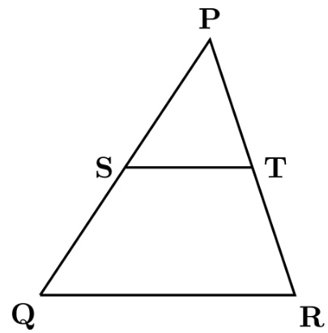

3 2 D. 12 gatecse2025-set1 quantitative-aptitude geometry area two-marks

# Answer key☟

✍ Practice Test: Test (10Q)

What will be the maximum sum of ?

A. 502 B. 504 C. 506 D. 500

gatecse-2013 quantitative-aptitude easy arithmetic-series

# Answer key☟

# 9.6.2 Arithmetic Series: GATE CSE 2015 Set 2 | GA Question: 6

If the list of letters $P , R , S , T , U$ is an arithmetic sequence, which of the following are also in arithmetic sequence?

$_ { ! . ~ 2 P , 2 R , 2 S , 2 T , 2 U }$   
II. $P - 3 , R - 3 , \dot { S } - 3 , T - 3 , U - 3$   
III. $P ^ { 2 } , R ^ { 2 } , S ^ { 2 } , T ^ { 2 } , U ^ { 2 }$

A. I only B. I and II C. II and III D. I and III

gatecse-2015-set2 quantitative-aptitude normal arithmetic-series

$$
\begin{array} { l } { { \displaystyle \mathsf { c . } \frac { 4 } { 8 1 } \big [ \mathbf { 1 0 } ^ { n + 1 } - 9 n - 1 0 \big ] } } \\ { { \displaystyle \mathsf { D . } \frac { 4 } { 8 1 } \big [ \mathbf { 1 0 } ^ { n } - 9 n - 1 0 \big ] } } \end{array}
$$

general-aptitude quantitative-aptitude gate2011-ag arithmetic-series

# Answer key

✍ Practice Test: Test (13Q)

# 9.7.1 Average: GATE CSE 2025 Set 1 GA Question: 3

The average marks obtained by a class in an examination were calculated as . However, while checking the marks entered, the teacher found that the marks of one student were entered incorrectly as instead of . After correcting the marks, the average becomes . How many students does the class have?

A. B. C. D.

gatecse2025-set1 quantitative-aptitude average one-mark

# Answer key☟

✍ Practice Tests: Test 1 (15Q) Test 2 (4Q)

# 9.8.1 Bar Graph: GATE CSE 2015 Set 3 GA Question: 10

The exports and imports (in crores of $R s$ .) of a country from the year  to  are given in the following bar chart. In which year is the combined percentage increase in imports and exports the highest?

Exports I Imports m 2000 2001 2002 2003 2004 2005 2006 200

The total revenue of a company during is shown in the bar graph. If the total expenditure of the company in each year is  million rupees, then the aggregate profit or loss (in percentage) on the total expenditure of the company during  is

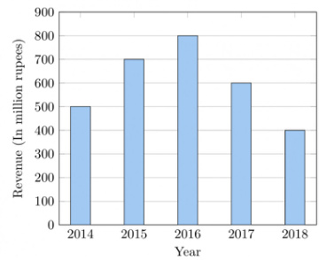

A. $1 6 . 6 7 \%$ profit B. $1 6 . 6 7 \%$ loss C. $2 0 \%$ profit D. $2 0 \%$ loss

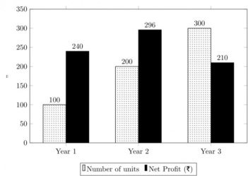

The number of units of a product sold in three different years and the respective net profits are presented in the figure above. The cost/unit in Year was $\yen 1$ , which was half the cost/unit in Year . The cost/unit in Year was one-third of the cost/unit in Year . Taxes were paid on the selling price at $1 0 \%$ , $1 3 \%$ , and $1 5 \%$ respectively for the three years. Net profit is calculated as the difference between the selling price and the sum of cost and taxes paid in that year.

The ratio of the selling price in Year to the selling price in Year  is

A. B. C. D. gatecse-2021-set2 quantitative-aptitude data-interpretation bar-graph two-marks

The number of patients per shift $( X )$ consulting Dr. Gita in her past  shifts is shown in the figure. If the amount she earns is $\yen 1000(X-0.2 )$ , what is the average amount (in $\mathfrak { F }$ ) she has earned per shift in the past shifts?

Note: The figure shown is representative.

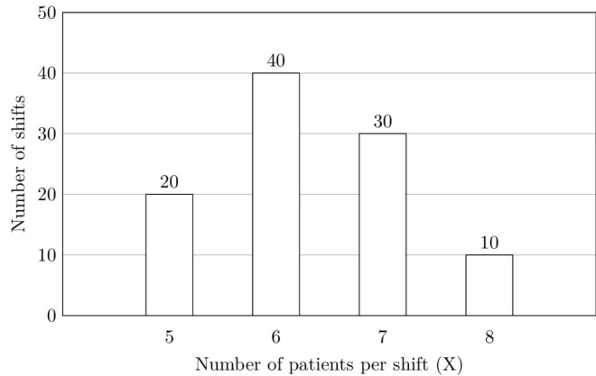

A. 6,100 B. 6,300 C. 6,000 D. 6,500 gateda-2025 quantitative-aptitude bar-graph data-interpretation two-marks

A. 0.288 B. 0.334 C. 0.667 D. 0.720

✍ Practice Test: Test (10Q)

# 9.10.1 Cartesian Coordinates: GATE CSE 2020 GA Question: 9

Two straight lines are drawn perpendicular to each other in $X - Y$ plane. If $\alpha$ and $\beta$ are the acute angles the straight lines make with the ${ \bf X } _ { \bf \overline { { \Lambda } } }$ axis, then $\alpha + \beta$ is

A. $6 0 ^ { \circ }$ B. $9 0 ^ { \circ }$ C. 120° D. 180°

gatecse-2020 quantitative-aptitude geometry cartesian-coordinates two-marks

# Answer key☟

A function $y ( x )$ is defined in the interval on the $x -$ axis as

$$
y ( x ) = { \left\{ \begin{array} { l l } { 2 } & { { \mathrm { i f } } \quad 0 \leq x < { \frac { 1 } { 3 } } } \\ { 3 } & { { \mathrm { i f } } \quad { \frac { 1 } { 3 } } \leq x < { \frac { 3 } { 4 } } } \\ { 1 } & { { \mathrm { i f } } \quad { \frac { 3 } { 4 } } \leq x \leq 1 } \end{array} \right. }
$$

Which one of the following is the area under the curve for the interval $[ 0 , 1 ]$ on the $x -$ axis?

A. $\textstyle { \frac { 5 } { 6 } }$ B. $\frac { 6 } { 5 }$ C. 13 6 D. $\frac { 6 } { 1 3 }$

gatecse-2022 quantitative-aptitude cartesian-coordinates area one-mark

Answer key☟

# 9.10.3 Cartesian Coordinates: GATE2012 AE: GA-9

Two points $( 4 , p )$ and $( 0 , q )$ lie on a straight line having a slope of $3 / 4 .$ The value of $( p - q )$ is

A. B. 0 C. D. 4

gate2012-ae quantitative-aptitude cartesian-coordinates geometry

Answer key☟

If $y = 5 x ^ { 2 } + 3$ , then the tangent at $x = 0$ , $y = 3$

A. passes through $\scriptstyle x = 0 , y = 0$ B. has a slope of $+ 1$ C. is parallel to the $x$ -axis D. has a slope of -1

gate2014-ae quantitative-aptitude geometry cartesian-coordinates

# Answer key

✍ Practice Test: Test (10Q)

# 9.11.1 Circle: GATE CSE 2018 GA Question:

The area of a square is $d$ . What is the area of the circle which has the diagonal of the square as its diameter?

A. B. C. 1πd² .

The figure below shows an annular ring with outer and inner as $b$ and $\mathbf { \Delta } _ { a }$ respectively. The annular space has been painted in the form of blue colour circles touching the outer and inner periphery of annular space. If maximum $n$ number of circles can be painted, then the unpainted area available in annular space is

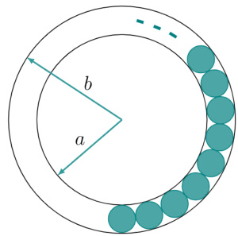

A. $\textstyle \pi [ ( b ^ { 2 } - a ^ { 2 } ) - { \frac { n } { 4 } } ( b - a ) ^ { 2 } ]$ B. $\pi [ ( b ^ { 2 } - a ^ { 2 } ) - n ( b - a ) ^ { 2 } ]$   
C. $\textstyle \pi [ ( b ^ { 2 } - a ^ { 2 } ) + { \frac { \bar { n } } { 4 } } ( b - a ) ^ { 2 } ]$ D. $\pi [ ( b ^ { 2 } - a ^ { 2 } ) + n ( b - a ) ^ { 2 } ]$

gatecse-2020 quantitative-aptitude geometry circle area two-marks

In the given figure, $P , Q$ , and $R$ are three points on a circle of radius cm with $O$ as its center, ${ \overline { { P Q } } } = { \overline { { R Q } } }$ , and $\angle P Q R = 4 5 ^ { \circ }$ . The figure is representative. The area of the shaded region is $\mathrm { c m ^ { 2 } }$ .

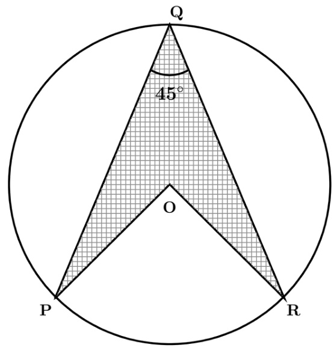

A. B. $\boldsymbol { 2 5 \sqrt { 2 } }$ C. 50√2 D. 100

gateda-2026 quantitative-aptitude geometry circle area two-marks

closest to $6 0 ^ { \circ }$ ?

A.  a.m. B. a.m. C. a.m. D. a.m.

gatecse-2014-set2 quantitative-aptitude normal clock-time

# Answer key☟

✍ Practice Test: Test (13Q)

Given digits  how many distinct  digit numbers greater than can be formed?

A. B. C. 52 D.

gatecse-2010 quantitative-aptitude combinatory normal

Answer key☟

# 9.13.2 Combinatory: GATE CSE 2016 Set 2 GA Question: 09

In a $2 \times 4$ rectangle grid shown below, each cell is rectangle. How many rectangles can be observed in the grid?

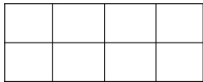

A. B. C. D.

gatecse-2016-set2 quantitative-aptitude normal combinatory

Arun, Gulab, Neel and Shweta must choose one shirt each from a pile of four shirts coloured red, pink, and white respectively. Arun dislikes the colour red and Shweta dislikes the colour white. Gulab and Neel like all the colours. In how many different ways can they choose the shirts so that no one has a shirt with a colour he or she dislikes?

A. B. C. D.

gatecse-2017-set1 combinatory quantitative-aptitude

9.13.4 Combinatory: GATE2011 MN: GA-59

In how many ways  scholarships can be awarded to  applicants, when each applicant can receive any number of scholarships?

A. B. C. D.

quantitative-aptitude gate2011-mn combinatory

9.13.5 Combinatory: GATE2012 AR: GA-5

Ten teams participate in a tournament. Every team plays each of the other teams twice. The total number of matches to be played is

A. B. C. 60 D. 90

✍ Practice Test: Test (5Q)

# 9.14.1 Compound Interest: GATE DS&AI 2024 GA Question: 8

​Person and Person  invest in three mutual funds , and . The amounts they invest in each of these mutual funds are given in the table.

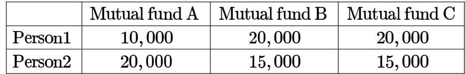

At the end of one year, the total amount that Person gets is $\yen 500$ more than Person . The annual rate of return for the mutual funds and $\mathrm { C }$ is $1 5 \%$ each. What is the annual rate of return for the mutual fund ?

A. $7 . 5 \%$ B. $1 0 \%$ C. $1 5 \%$ D. $2 0 \%$

gate-ds-ai-2024 quantitative-aptitude compound-interest two-marks

# Answer key☟

A person invest Rs.1000 at $1 0 \%$ annual compound interest for  years At the end of two years, the whole amount is invested at an annual simple interest of $1 2 \%$ for years The total value of the investment finally is

A. 1776 B. 1760 C. 1920 D. 1936

general-aptitude quantitative-aptitude gate2010-mn compound-interest

The population of a new city is  million and is growing at $2 0 \%$ annually. How many years would it take to double at this growth rate?

A.  years B. years C. years D. years

gate2014-ag quantitative-aptitude compound-interest normal

# Answer key☟

# 9.15 Conditional Probability (2)

A contour line joins locations having the same height above the mean sea level. The following is a contour plot of a geographical region. Contour lines are shown at $2 5 ~ \mathsf { m }$ intervals in this plot. If in a flood, the water level rises to $5 2 5 \mathrm { { m } }$ , which of the villages $P , Q , R , S , T$ get submerged?

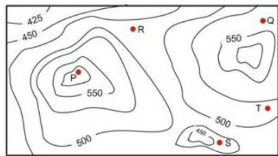

A. B. P,Q,T C. R,S,T D. Q,R,S

gatecse-2017-set1 general-aptitude quantitative-aptitude data-interpretation normal contour-plots

# Answer key☟

An air pressure contour line joins locations in a region having the same atmospheric pressure. The following is an air pressure contour plot of a geographical region. Contour lines are shown at  bar intervals in this plot.

If the possibility of a thunderstorm is given by how fast air pressure rises or drops over a region, which of the following regions is most likely to have a thunderstorm?

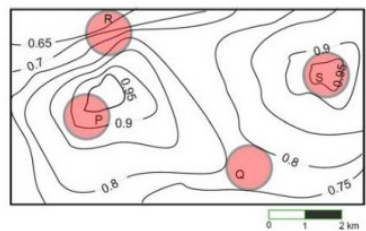

A. B. C. D. S

gatecse-2017-set2 quantitative-aptitude data-interpretation normal contour-plots

# Answer key☟

The cost function for a product in a firm is given by $5 q ^ { 2 }$ , where $q$ is the amount of production. The firm can sell the product at a market price of $\yen 50$ per unit. The number of units to be produced by the firm such that the profit is maximized is

A. B. C. D.

gatecse-2012 quantitative-aptitude cost-market-price normal

# 9.17.3 Cost Market Price: GATE CSE 2019 GA Question: 4

Ten friends planned to share equally the cost of buying a gift for their teacher. When two of them decided not to contribute, each of the other friends had to pay Rs. more. The cost of the gift was Rs.

A. 666 B. 3000 C. 6000 D. 12000

gatecse-2019 general-aptitude quantitative-aptitude cost-market-price one-mark

A foundry has a fixed daily cost of whenever it operates and a variable cost of $8 0 0 Q$ ,where $Q$ is the daily production in tonnes. What is the cost of production in  per tonne for a daily production of tonnes.

gate2014-ae quantitative-aptitude cost-market-price numerical-answers

A cube is built using  cubic blocks of side one unit. After it is built, one cubic block is removed from ever corner of the cube. The resulting surface area of the body (in square units) after the removal is

a. b. c. 72 d.

gatecse-2016-set1 quantitative-aptitude geometry normal cubes

# 9.18.2 Cubes: GATE CSE 2021 Set 2 GA Question: 3

If $\theta$ is the angle, in degrees, between the longest diagonal of the cube and any one of the edges of the cube, then, $\theta =$

A. $\textstyle { \frac { 1 } { 2 } }$ B. $\frac { 1 } { \sqrt { 3 } }$ C. $\frac { 1 } { \sqrt { 2 } }$ D. $\textstyle { \frac { \sqrt { 3 } } { 2 } }$ gatecse-2021-set2 quantitative-aptitude mensuration cubes one-mark

Answer key☟

$P , Q , R$ and $\boldsymbol { s }$ are four types of dangerous microbes recently found in a human habitat. The area circle with its diameter printed in brackets represents the growth of a single microbe surviving human immunity system within  hours of entering the body. The danger to human beings varies proportionately with the toxicity, potency and growth attributed to a microbe shown in the figure below:

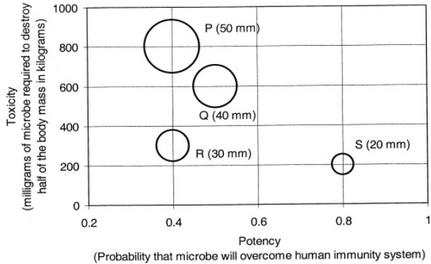

A pharmaceutical company is contemplating the development of a vaccine against the most dangerous microbe. Which microbe should the company target in its first attempt?

A. B. $Q$ C. D. S

gatecse-2011 quantitative-aptitude data-interpretation normal

Figures and represent intercity highway systems. The black dots represent cities and the line segments between them represent intercity highways.

A salesperson needs to make a trip. She needs to start from a city, visit each of the remaining cities exactly once, and finally return to the same city from which she started.

Which one of the following options is then true?

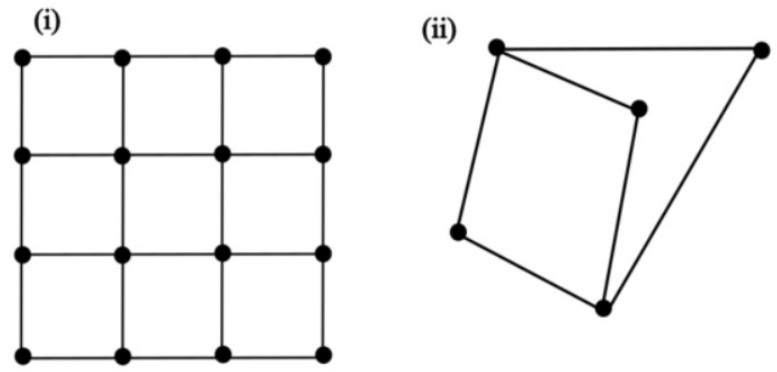

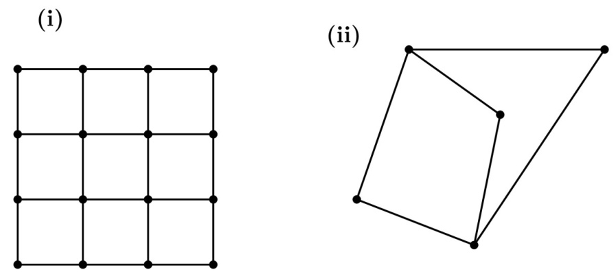

A. Such a trip is possible for , but not for .   
B. Such a trip is possible for , but not for .   
C. Such a trip is possible for both  and .   
D. Such a trip is possible neither for nor for .

Weight of a person can be expressed as a function of their age. The function usually varies from person to person. Suppose this function is identical for two brothers, and it monotonically increases till the age of 50 years and then it monotonically decreases. Let $a _ { 1 }$ and $a _ { 2 }$ (in years) denote the ages of the brothers and $a _ { 1 } < a _ { 2 }$

Which one of the following statements is correct about their age on the day when they attain the same weight?

A. $a _ { 1 } < a _ { 2 } < 5 0$ B. $a _ { 1 } < 5 0 < a _ { 2 }$ C. D. Either $a _ { 1 } = 5 0$ or $a _ { 2 } = 5 0$

gateda-2025 quantitative-aptitude data-interpretation two-marks

Answer key☟

​A $4 \times 4$ digital image has pixel intensities $( U )$ as shown in the figure. The number of pixels with $U \leq 4$ is:

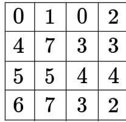

A. B. S C. D. 9 gateda-2025 quantitative-aptitude digital-image-processing easy one-mark

# Answer key☟

A. B. C. D.

# Answer key☟

What would be the smallest natural number which when divided either by or by or by leaves a remainder of in each case?

A. 3047 B. 6047 C. 7987 D. 63847

gatecse-2018 quantitative-aptitude factors one-mark

9.22.3 Factors: GATE2010 MN: GA-8

Consider the set of integers $\{ 1 , 2 , 3 , . . . , 5 0 0 0 \}$ The number of integers that is divisible by neither  nor is

A. 1668 B. 2084 C. 2500 D. 2916

general-aptitude quantitative-aptitude gate2010-mn factors

In appreciation of the social improvements completed in a town, a wealthy philanthropist decided to Rs to each male senior citizen in the town and  to each female senior citizen. Altogether, there $\frac { 8 } { 9 } ^ { 1 }$ h 2rd $\frac { 2 } { 3 } ^ { \mathrm { { r } } }$ were 300 senior citizens eligible for this gift. However, only of the eligible men and of the eligible women claimed the gift.How much money (in Rupees) did the philanthropist give away in total?

A. 1,50,000 B. 2,00,000 C. 1,75,000 D. 1,51,000

gatecse-2018 quantitative-aptitude fractions normal two-marks

# Answer key☟

# 9.24

# Functions (7)

✍ Practice Tests: Test 1 (15Q) Test 2 $( 7 \alpha )$

If $p , q , r , s$ are distinct integers such that:

$\begin{array} { l } { f ( p , q , r , s ) = \operatorname* { m a x } \left( p , q , r , s \right) } \\ { g ( p , q , r , s ) = \operatorname* { m i n } \left( p , q , r , s \right) } \end{array}$   
$h ( p , q , r , s ) = :$ remainderof $\frac { ( p \times q ) } { ( r \times s ) }$ if $( p \times q ) > ( r \times s )$   
or remainder of $\frac { ( r \times s ) } { ( p \times q ) }$ if $( r \times s ) > ( p \times q )$   
Also a function $f g h ( p , q , r , s ) = f ( p , q , r , s ) \times g ( p , q , r , s ) \times h ( p , q , r , s )$   
Also the same operations are valid with two variable functions of the form $f ( p , q )$   
What is the value of $f g \left( h \left( 2 , 5 , 7 , 3 \right) , 4 , 6 , 8 \right) ?$

A function $f ( x )$ is linear and has a value of  at $x = - 2$ and at $x = 3$ . Find its value at $x = 5$ .

A. B. C. 43 D.

gatecse-2015-set3 quantitative-aptitude normal functions

Choose the most appropriate equation for the function drawn as thick line, in the plot below.

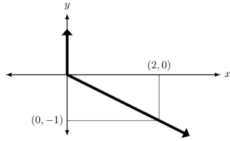

A. $\scriptstyle x = y - | y |$ B. $x = - ( y - | y | )$ $\begin{array} { r } { \mathsf { C } . ~ x = y + | y | \qquad \mathsf { D } . ~ x = - ( y + | y | ) } \end{array}$

gatecse-2015-set3 quantitative-aptitude normal functions

Consider two functions of time $\mathit { \Omega } ( t )$ ，

$$
\begin{array} { c } { f ( t ) = 0 . 0 1 t ^ { 2 } } \\ { g ( t ) = 4 t } \end{array}
$$

where $0 < t < \infty$ ·

Now consider the following two statements:

i. For some $t > 0 , g ( t ) > f ( t )$ .   
ii. There exists a $T$ ， such that $\dot { f } ( t ) > g ( t )$ for all $t > T$ .

Which one of the following options is

A. only (i) is correct B. only (ii) is correct C. both (i) and (ii) are correct D. neither (i) nor (ii) is correct

gatecse-2023 quantitative-aptitude functions two-marks

# 9.24.5 Functions: GATE CSE 2023 GA Question: 9

$f ( x )$ and $g ( y )$ are functions of $x$ and $y$ , respectively, and $f ( x ) = g ( y )$ for all values of $x$ and $y$ . Which one of the following options is necessarily for a $x$ and

A. $f ( x ) = 0$ and $g ( y ) = 0$ B. $f ( x ) = g ( y ) = ($ constant C. $f ( x ) \neq$ constant and $g ( y ) \neq$ D. $f ( x ) + g ( y ) = f ( x ) - g ( y )$ opt

gatecse-2023 quantitative-aptitude functions two-marks

A. $f _ { 4 }$ B. $f _ { 3 }$ C. $f _ { 2 }$ D. $f _ { 1 }$

Let $f ( x ) = x - [ x ]$ where $x \geq 0$ and $[ x ]$ is the greatest integer not larger than $x$ · Then $f ( x )$ is a

A. monotonically increasing function B. monotonically decreasing function C. linearly increasing function between two integers D. linearly decreasing function between two integers gate2012-ar quantitative-aptitude functions normal ✍ Practice Tests: Test 1 (15Q) Test 2 (15Q) Test 3 (4Q)

When a point inside of a tetrahedron (a solid with four triangular surfaces) is connected by straight lines to its corners, how many (new) internal planes are created with these lines?

gatecse-2014-set1 quantitative-aptitude geometry combinatory normal numerical-answers

A rectangular paper sheet of dimensions $5 4 \mathrm { c m } \times 4 \mathrm { c m }$ is taken. The two longer edges of the sheet are joined together to create a cylindrical tube. A cube whose surface area is equal to the area of the sheet is also taken.

Then, the ratio of the volume of the cylindrical tube to the volume of the cube is

A. $\mathsf { B } . \ 2 / \pi$ C. 3/π D.

gatecse-2024-set1 quantitative-aptitude geometry two-marks

In the Given figure, PQRS is a square of side cm and PLMN is a rectangle. The corner L of the rectangle is on the side QR. Side MN of the rectangle passes through the corner S of the square.

What is the area (in $c m ^ { 2 }$ ) of the rectangle PLMN? Note: The figure shown is representative.

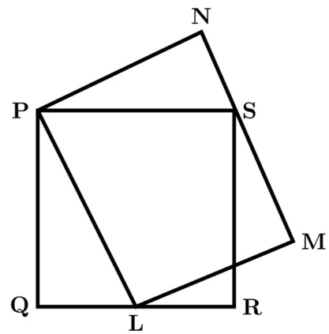

A. $2 { \sqrt { 2 } }$ B. C. D.

In the given figure, the numbers associated with the rectangle, triangle, and ellipse are and , respectively. Which one among the given options is the most appropriate combination of , and  ?

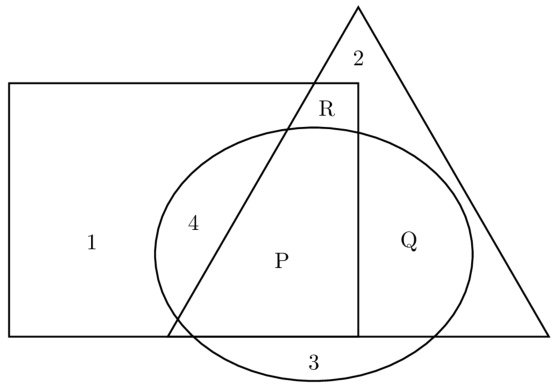

A. $P = 6 ; Q = 5 ; R = 3$ B. $P = 5 ; Q = 6 ; R = 3$   
C. $P = 3 ; Q = 6 ; R = 6$ D. $P = 5 ; { \dot { Q } } = 3 ; R = 6$

gateda-2025 quantitative-aptitude geometry one-mark

# Answer key

A regular dodecagon ( -sided regular polygon) is inscribed in a circle of radius $r$ cm as shown in the figure. The side of the dodecagon is $d \mathrm { c m }$ . All the triangles (numbered to ) in the figure are used to form squares of side $r$ and each numbered triangle is used only once to form a square.

The number of squares that can be formed and the number of triangles required to form each square, respectively, are:

Note: The figure shown is representative.

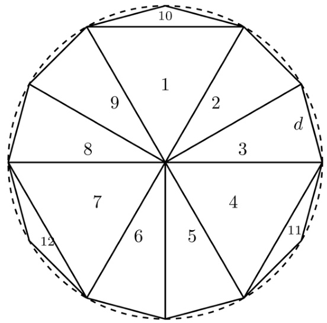

A. B. 4;3 C. 3;3 D.

The  parts of the given figure are to be painted such that no two adjacent parts with shared boundaries (excluding corners) have the same color. The minimum number of colors required is

双

A. B. C. D. 6

✍ Practice Test: Test (12Q)

The ratio of male to female students in a college for five years is plotted in the following line graph. If the number of female students doubled in , by what percent did the number of male students increase in 2009?

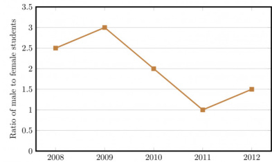

The ratio of male to female students in a college for five years is plotted in the following line graph. If the number of female students in  and  is equal, what is the ratio of male students in  to male students in ?

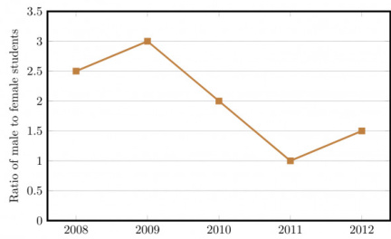

A. B. C. 1.5:1 D. 2.5 : 1

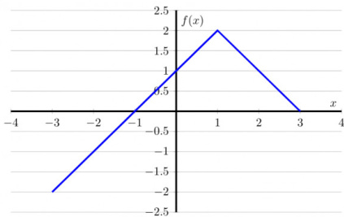

$f ( x ) = 1 - \left| x - 1 \right|$ DB. $\begin{array} { r } { f ( x ) = 1 + | x - 1 | } \\ { f ( x ) = 2 + | x - 1 | } \end{array}$ ${ \hat { f } } ( x ) = 2 - | x - 1 |$

gatecse-2016-set2 quantitative-aptitude data-interpretation normal line-graph

# Answer key☟

The fuel consumed by a motorcycle during a journey while traveling at various speeds is indicated in the graph below.

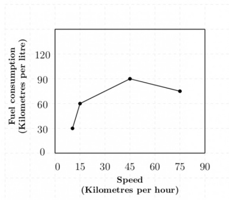

The distances covered during four laps of the journey are listed in the table below

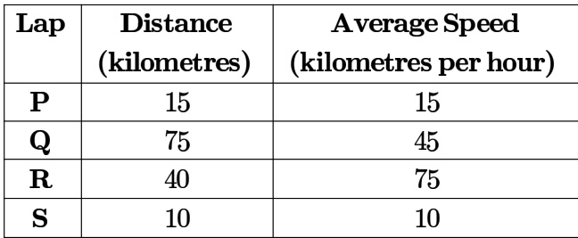

From the given data, we can conclude that the fuel consumed per kilometre was least during the lap

A. B. $Q$ C. D. S

general-aptitude quantitative-aptitude gate2011-ag data-interpretation line-graph

# Answer key☟

Which of the following are true? (k percentile is the value such that k percent of the data fall below that value)

i. On average, it rains more in July than in December   
ii. Every year, the amount of rainfall in August is more than that in January iii. July rainfall can be estimated with better confidence than February rainfall iv. In August, there is at least $5 0 0 \mathsf { m m }$ of rainfall

A. (i) and (ii) B. (i) and (iii) C. (ii) and (iii) D. (iii) and (iv)

gate2014-ae quantitative-aptitude data-interpretation line-graph

# Answer key☟

# 9.28 Logarithms (6)

✍ Practice Tests: Test 1 (15Q) Test 2 (4Q)

# 9.28.1 Logarithms: GATE CSE 2011 Question: 57

$\mathrm { \Delta t l o g ( P ) = ( 1 / 2 ) l o g ( Q ) = ( 1 / 3 ) l o g ( R ) , }$ then which of the following options is TRUE?

A. $\mathrm { P ^ { 2 } = Q ^ { 3 } R ^ { 2 } }$ B $\mathbf { Q } ^ { 2 } = \mathbf { P } \mathbf { R }$ ${ \mathsf { C } } . \ { \mathsf { Q } } ^ { 2 } = { \mathsf { R } } ^ { 3 } { \mathsf { P } }$ D $\therefore \mathrm { R } = \mathrm { P } ^ { 2 } \mathrm { Q } ^ { 2 }$

gatecse-2011 quantitative-aptitude normal logarithms

# Answer key☟

# 9.28.2 Logarithms: GATE CSE 2018 GA Question: 7

If $p q r \neq 0$ and $p ^ { - x } = \frac { 1 } { q } , q ^ { - y } = \frac { 1 } { r } , r ^ { - z } = \frac { 1 } { p } .$ what is the value of the product  ?

A. ${ \mathsf { B } } . ~ { \frac { 1 } { p q r } }$ C. D. pqr

gatecse-2018 quantitative-aptitude ratio-proportion two-marks logarithms

For positive non-zero real variables $p$ and $q$ , if $\log \left( p ^ { 2 } + q ^ { 2 } \right) = \log p + \log q + 2 \log 3 ,$ then, the value of $\frac { p ^ { 4 } { + } q ^ { 4 } } { p ^ { 2 } q ^ { 2 } }$ is

A. B. C. D.

gatecse-2024-set1 quantitative-aptitude logarithms one-mark

# Answer key☟

Consider two distinct positive real numbers $m , n ,$ , with $m > n$ . Let $x = n ^ { \log _ { 1 0 } ( m ) }$ and $y = m ^ { \log _ { 1 0 } ( n ) }$ . The relation between $x$ and $y$ is

A. $x > y$ B. x<y C. x=y $\mathsf { D } . \ x = \log _ { 1 0 } ( y )$

gateda-2026 quantitative-aptitude logarithms one-mark

Answer key☟

# 9.28.6 Logarithms: GATE2012 AR: GA-6

A value of $x$ that satisfies the equation $\log x + \log ( x - 7 ) = \log ( x + 1 1 ) + \log 2 \operatorname { i }$ is

A. B. C. D.

The diagram below shows a river system consisting of segments, marked $P , Q , R , S , T , U$ ， and $V$ It splits the land into 5 zones, marked $\mathbf { \bar { \Gamma } } _ { Z 1 , Z 2 , Z 3 , Z \bar { 4 } . }$ and $Z 5$ . We need to connect these zones using the least number of bridges, Out of the following options, which one is correct?

Note: The figure shown is representative.

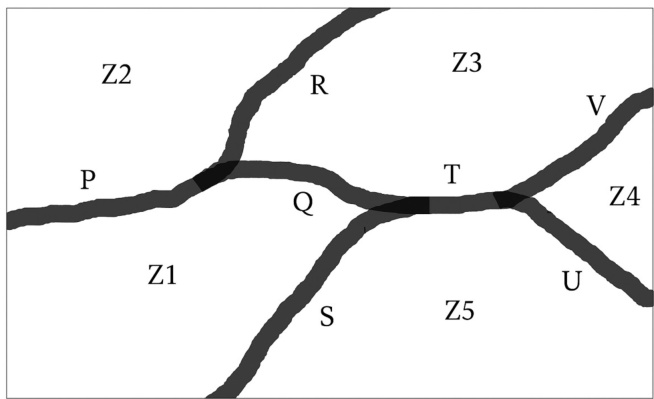

A. Bridges on $P , Q$ and $T$ B. Bridges on $P , Q , S$ and $T$ C. Bridges on $Q , R , T$ and $V$ D. Bridges on $P , Q , S , U$ and $V$

gatecse2025-set2 quantitative-aptitude maps two-marks

The number of roots of $e ^ { x } + 0 . 5 x ^ { 2 } - 2 = 0$ in the range  is

A. B. C. D.

gatecse-2017-set2 quantitative-aptitude normal maxima-minima calculus

# 9.30.3 Maxima Minima: GATE2010 TF: GA-5

Consider the function $f ( x ) = \operatorname* { m a x } ( 7 - x , x + 3 )$ In which range does $f$ take its minimum value

A. $- 6 \leq x < - 2$ $\begin{array} { l } { { \mathsf { B } . \quad - 2 \leq x < 2 } } \\ { { \mathsf { D } . \ 6 \leq x < 1 0 } } \end{array}$ C. $2 \leq x < 6$   
general-aptitude quantitative-aptitude gate2010-tf maxima-minima functions

# 9.30.4 Maxima Minima: GATE2013 CE: GA-6

$X$ and $Y$ are two positive real numbers such that $2 X + Y \leq 6$ and $X + 2 Y \leq 8 . 1$ or which of the   
following values of   
$( X , Y )$ the function $f ( X , Y ) = 3 X + 6 Y$ will give maximum value ?

A. $\left( { \frac { 4 } { 3 } } , { \frac { 1 0 } { 3 } } \right)$ ${ \mathsf { B } } . \ \left( { \frac { 8 } { 3 } } , { \frac { 2 0 } { 3 } } \right)$ $\mathsf { C } . \left( \frac { 8 } { 3 } , \frac { 1 0 } { 3 } \right)$ $\mathsf { D } . \left( \frac { 4 } { 3 } , \frac { 2 0 } { 3 } \right)$

# Answer key☟

A rectangle has a length $L$ and a width $W$ where $\mathbf { L } > \mathbf { W }$ . If the width, $W$ is increased by $1 0 \%$ , which one of the following statements is correct for all values of $L$ and

A. Perimeter increases by $1 0 \%$ . B. Length of the diagonals increases by $1 0 \%$ . C. Area increases by $1 0 \%$ . D. The rectangle becomes a square.

gateda-2025 quantitative-aptitude mensuration one-mark

Answer key☟

I $\mathbf { \lceil ( 1 . 0 0 1 ) ^ { 1 2 5 9 } = 3 . 5 2 }$ and $( 1 . 0 0 1 ) ^ { 2 0 6 2 } \substack { = 7 . 8 5 }$ , then $( 1 . 0 0 1 ) ^ { 3 3 2 1 } =$

A. 2.23 B. 4.33 C. 11.37 D. 27.64

gate2012-cy quantitative-aptitude modular-arithmetic

# Answer key☟

✍ Practice Test: Test (10Q)

Find the sum of the expression

$$
\scriptstyle { \frac { 1 } { \sqrt { 1 } + { \sqrt { 2 } } } } + { \frac { 1 } { \sqrt { 2 } + { \sqrt { 3 } } } } + { \frac { 1 } { \sqrt { 3 } + { \sqrt { 4 } } } } + \dotsc \dotsc \dotsc \dotsc \dotsc + { \frac { 1 } { \sqrt { 8 0 } + { \sqrt { 8 1 } } } }
$$

A. B. C. 9 D.

gatecse-2013 quantitative-aptitude normal number-series

# Answer key☟

The value of $\sqrt { 1 2 + { \sqrt { 1 2 + { \sqrt { 1 2 + \ldots } } } } }$ is

A. 3.464 B. 3.932 C. 4.000 D. 4.444

gatecse-2014-set2 quantitative-aptitude easy number-series

# 9.34.3 Number Series: GATE CSE 2014 Set 3 | GA Question: 4

Which number does not belong in the series below? 2,5,10,17,26, 37,50, 64

A. B. C. 64 D.

gatecse-2014-set3 quantitative-aptitude number-series easy

# Answer key☟

# 9.34.4 Number Series: GATE2010 TF: GA-7

Consider the series ${ \textstyle { \frac { 1 } { 2 } } } + { \textstyle { \frac { 1 } { 3 } } } - { \textstyle { \frac { 1 } { 4 } } } + { \textstyle { \frac { 1 } { 8 } } } + { \textstyle { \frac { 1 } { 9 } } } - { \textstyle { \frac { 1 } { 1 6 } } } + { \textstyle { \frac { 1 } { 3 2 } } } + { \textstyle { \frac { 1 } { 2 7 } } } - { \textstyle { \frac { 1 } { 6 4 } } } + \dots . . . .$ The sum of the infinite series above is

A. B. $\textstyle { \frac { 5 } { 6 } }$ C. $\textstyle { \frac { 1 } { 2 } }$ D. 0

general-aptitude quantitative-aptitude gate2010-tf number-series

9.34.5 Number Series: GATE2013 EE: GA-10

Find the sum to $' _ { n ^ { \prime } }$ terms of the series $\mathbf { 1 0 + 8 4 + 7 3 4 + . . }$

A. $\frac { 9 ( 9 ^ { n } + 1 ) } { 1 0 } + 1$ $\mathsf { B } . \ \frac { 9 ( 9 ^ { n } - 1 ) } { 8 } + 1$ C. $\frac { 9 ( 9 ^ { n } - 1 ) } { 8 } + n$ D. 9(9n-1) +n²

# Answer key☟

A. 1634 B. 1737 C. 3142 D. 3162

$X$ is a  digit number starting with the digit  followed by the digit . Then the number $X ^ { 3 }$ will have

A. digits B. 91 digits C. digits D. digits

$P , Q , R , S , X$ , and $Y$ are distinct single-digit whole numbers taking values from  to . $P Q$ is a two-digit number with $Q$ being in the units place and $P$ in the tens place. Similarly, $R S$ is a two-digit number.

It is known that $P Q$ and $R S$ are consecutive numbers and $( P Q ) ^ { 2 } + ( R S ) ^ { 2 } = X Y P$ , with $X Y P$ being a threedigit number.

The value of $Y$ is

A. B. C. 6 D.

gateda-2026 quantitative-aptitude two-marks number-system

A positive integer $m$ in base  when represented in base has the representation $p$ and in base has the representation $q$ · We get $p - q = 9 9 0$ where the subtraction is done in base Which of the following is necessarily true

A. $m \geq 1 4$ B. $\mathtt { C . ~ 6 \le m } \le 8$ D.

general-aptitude quantitative-aptitude gate2010-mn number-system

# Answer key☟

✍ Practice Test: Test 1 (7Q)

# 9.36.1 Number Theory: GATE CSE 2025 Set 2 GA Question: 3

​If $P e ^ { x } = Q e ^ { - x }$ for all real values of $x$ , which one of the following statements is true?

A. $P = Q = 0$ ${ \mathsf { B } } . \ P = Q = 1$ $\complement . \ P = 1 ; Q = - 1 \ \qquad \ \mathsf { D } . \ \frac { P } { Q } = 0$

gatecse2025-set2 quantitative-aptitude mathematical-logic one-mark number-theory

✍ Practice Tests: Test (15Q) Test 2 (3Q)

$$
{ \mathfrak { f } } \left( z + { \frac { 1 } { z } } \right) ^ { 2 } = { \mathfrak { g } } { \mathfrak { g } } , { \mathsf { c o m p u t e } } \left( z ^ { 2 } + { \frac { 1 } { z ^ { 2 } } } \right) .
$$

gatecse-2014-set1 quantitative-aptitude easy numerical-answers numerical-computation

Answer key☟

# 9.37.2 Numerical Computation: GATE CSE 2014 Set 2 GA Question: 4

What is the average of all multiples of  from to 198?

A. 90 B. 100 C. 110 D. 120

gatecse-2014-set2 quantitative-aptitude easy numerical-computation factors

# 9.37.3 Numerical Computation: GATE CSE 2017 Set 1 GA Question: 4

Find the smallest number $y$ such that $y \times 1 6 2$ is a perfect cube.

A. B. C. D.

gatecse-2017-set1 general-aptitude quantitative-aptitude easy numerical-computation

# .37.4 Numerical Computation: GATE CSE 2017 Set 2 GA Question: 4

A test has twenty questions worth marks in total. There are two types of questions. Multiple choice questions are worth marks each and essay questions are worth  marks each. How many multiple choice questions does the exam have?

A. B. C. D.

gatecse-2017-set2 quantitative-aptitude numerical-computation

# 9.37.5 Numerical Computation: GATE CSE 2026 Set 1 GA Question: 3

Consider a knock-out women's badminton singles tournament where there are no ties. The loser in each game is eliminated from the tournament. Every player plays until she is defeated or remains the last undefeated player. The last undefeated player is declared the winner of the tournament. If there are players in the beginning of the tournament, how many games should be played in total to declare the winner of the tournament?

A. B. C. 63 D. gatecse-2026-set1 quantitative-aptitude numerical-computation easy one-mark

# 9.37.6 Numerical Computation: GATE CSE 2026 Set 1 | GA Question: 4

A student needs to enroll for a minimum of  credits. A student cannot enroll for more than  credits. credits are divided amongst project and three distinct sets of courses namely, core courses, specialization courses, and elective courses. It is compulsory for a student to enroll for exactly credits of core courses and exactly credits of project. In addition, a student has to enroll for a minimum of credits of specialization courses. The maximum credits of elective courses that a student can enroll for is

A. B. C. D.

For positive real numbers $\boldsymbol { S }$ and $K$ , the function $H _ { K } ( S )$ is defined as: $H _ { K } ( S ) = \operatorname* { m a x } ( S - K , 0 )$ . The max function is defined as:

$$
\operatorname* { m a x } ( a , b ) = { \left\{ \begin{array} { l l } { a , } & { { \mathrm { w h e n } } a > b } \\ { b , } & { { \mathrm { w h e n } } a \leq b } \end{array} \right. }
$$

The graph below shows the plot of a function $N ( S )$ versus $\boldsymbol { S }$ . $N ( S )$ can be expressed as

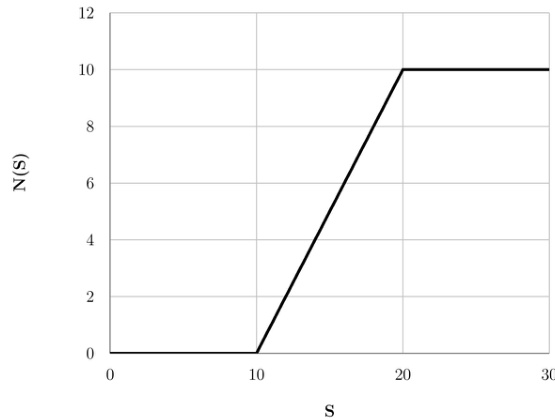

A. $H _ { 1 0 } ( S ) - H _ { 2 0 } ( S )$ B. $H _ { 1 0 } ( S ) - 2 H _ { 2 0 } ( S )$   
C. $- H _ { 1 0 } ( S ) + H _ { 2 0 } ( S )$ D. $H _ { \mathrm { 1 5 } } ( S ) - H _ { \mathrm { 2 0 } } ( \dot { S } )$

A student is answering a multiple choice examination with  questions with a marking scheme as follows marks for each correct answer ， $\romannumeral 2$ ） $- { \frac { 1 } { 4 } }$ for a wrong answer ,i) $- \frac { 1 } { 8 }$ for a question that has not been attempted If the student gets  marks in the test then the least possible number of questions the student has NOT answered is

A. B. C. D. general-aptitude quantitative-aptitude gate2010-tf numerical-computation

Round-trip tickets to a tourist destination are eligible for a discount of $1 0 \%$ on the total fare. In addition, groups of or more get a discount of $5 \%$ on the total fare. If the one way single person fare is  , a group of  tourists purchasing round-trip tickets will be charged $R s$

gatecse-2014-set1 quantitative-aptitude easy numerical-answers percentage

# 9.38.2 Percentage: GATE CSE 2014 Set 3 | GA Question: 8

The Gross Domestic Product $( G D P )$ in Rupees grew at $7 \%$ during . For international comparison, the $G D P$ is compared in US Dollars $( U S D )$ after conversion based on the market exchange rate. During the period $2 0 1 2 - 2 0 1 3$ the exchange rate for the $U S D$ increased from . to / USD. India's GDP in USD during the period $2 0 1 2 - 2 0 1 3$

A. increased by $5 \%$ B. decreased by $1 3 \%$ C. decreased by $2 0 \%$ D. decreased by $1 1 \%$ gatecse-2014-set3 quantitative-aptitude normal percentage

# 9.38.3 Percentage: GATE CSE 2024 Set 1 GA Question: 4

The number of coins of $\mathfrak  F 1 , yen 123$ , and $\yen 10$ denominations that a person has are in the ratio ${ \mathfrak { z } } : 3 : 1 3 .$ Of the total amount, the percentage of money in $\yen 5$ coins is

A. $2 1 \%$ $5 . 1 4 \frac { 2 } { 7 } \%$ C. $1 0 \%$ D. $3 0 \%$

gatecse-2024-set1 quantitative-aptitude percentage one-mark

# Answer key ☟

# 9.38.4 Percentage: GATE2011 AG: GA-4

There are two candidates $P$ and $Q$ in an election. During the campaign, $4 0 \%$ of the voters promised to for $P$ and rest for $Q$ However, on the day of election $1 5 \%$ of the voters went back on their promise to vote for $P$ and instead voted for $Q$ · $2 5 \%$ of the voters went back on their promise to vote for $Q$ and instead voted for $P$ Suppose $P$ lost by  votes then what was the total number of voters?

A. 100 B. 110 C. 90 D.

general-aptitude quantitative-aptitude gate2011-ag percentage

The total runs scored by four cricketers $P , Q , R$ and S in years  and  are given in the following table;

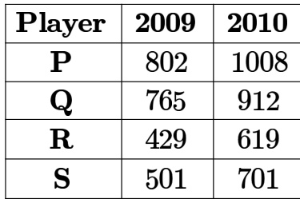

The player with the lowest percentage increase in total runs is

A. B. $Q$ C. D. S

gate2012-ae quantitative-aptitude percentage

The data given in the following table summarizes the monthly budget of an average household.

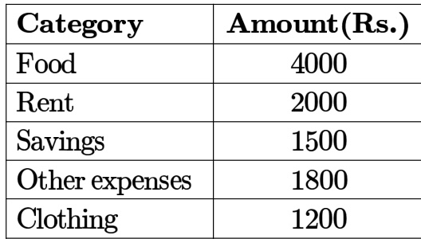

The approximate percentage of the monthly budget NOT spent on savings is

A. $1 0 \%$ B. $1 4 \%$ C. $8 1 \%$ D. $8 6 \%$

gate2012-cy quantitative-aptitude percentage

In the summer of , in New Delhi, the mean temperature of Monday to Wednesday was $4 1 ^ { \circ } C$ and of Tuesday to Thursday was $4 3 ^ { \circ } C$ . If the temperature on Thursday was $1 5 \%$ higher than that of Monday, then the temperature in $^ { \circ } C$ on Thursday was

A. 40 B. 43 C. 46 D. 49

gate2013-ee quantitative-aptitude percentage

# 9.38.8 Percentage: GATE2014 AE: GA-9

One percent of the people of country $X$ are taller than  ft. Two percent of the people of country $Y$ are taller than ft. There are thrice as many people in country $X$ as in countr y Taking both countries together, what is the percentage of people taller than ft?

A. B. C. D. 1.25

gate2014-ae percentage quantitative-aptitude

# Answer key☟

# 9.39 Permutation and Combination (4)

✍ Practice Test: Test 1 (14Q)

# 9.39.1 Permutation and Combination: GATE CSE 2024 Set 2 GA Question: 2

Two wizards try to create a spell using all the four elements, water, air, fire , and earth. For this, they decide to mix all these elements in all possible orders. They also decide to work independently. After trying all possible combination of elements, they conclude that the spell does not work.

How many attempts does each wizard make before coming to this conclusion, independently?

A. B. C. D.

A shop has  distinct flavors of ice-cream. One can purchase any number of scoops of any flavor. The order in which the scoops are purchased is inconsequential. If one wants to purchase 3 scoops of ice-cream, in how many ways can one make that purchase?

A. B. C. D.

gatecse2025-set1 quantitative-aptitude permutation-and-combination two-marks

# Answer key☟

# 9.39.3 Permutation and Combination: GATE DA 2026 GA Question: 7

Five integers are picked from to , with possible repetitions, such that their mean is , median is , and they have a single mode of .

Ignoring permutations, the number of ways to pick these five integers is

A. B. C. D. .3

gateda-2026 quantitative-aptitude permutation-and-combination two-marks

# 9.39.4 Permutation and Combination: GATE DS&AI 2024 GA Question: 3

How many -digit positive integers divisible by  can be formed using only the digits $\{ 1 , 3 , 4 , 6 , 7 \}$ , such that no digit appears more than once in a number?

A. B. C. D.

gate-ds-ai-2024 quantitative-aptitude permutation-and-combination one-mark

# Answer key☟

✍ Practice Tests: Test 1 (15Q) Test 2 (7Q)

# 9.40.1 Pie Chart: GATE CSE 2015 Set 1 | GA Question: 9

The pie chart below has the breakup of the number of students from different departments in an engineering college for the year . The proportion of male to female students in each department is ${ \cdot } 5 : 4 .$ There are males in Electrical Engineering. What is the difference between the numbers of female students in the civil department and the female students in the Mechanical department?

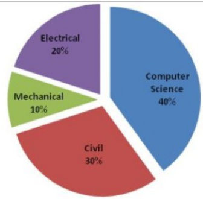

Macronutrient energy contribution

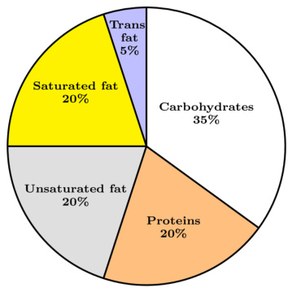

The typical energy density $\mathbf { ( k c a l / g ) }$ of these macronutrients is given in the table.

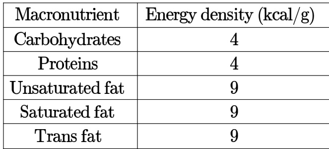

The total fat (all three types), in grams, this person consumes is

A. 44.4 B. 77.8 C. 100 D. 3,600

gatecse-2024-set1 quantitative-aptitude pie-chart two-marks

The pie charts depict the shares of various power generation technologies in the total electricity generation of a country for the years  and .

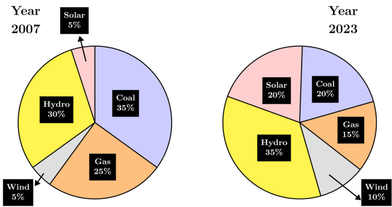

The renewable sources of electricity generation consist of Hydro, Solar and Wind. Assuming that the total electricity generated remains the same from to , what is the percentage increase in the share of the renewable sources of electricity generation over this period?

A. $2 5 \%$ B. $5 0 \%$ C. $7 7 . 5 \%$ D. $6 2 . 5 \%$

gatecse-2024-set2 quantitative-aptitude pie-chart two-marks

# Answer key☟

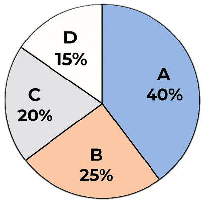

Based on the data provided, the total number of valid votes received by the candidates and  is

A. 45,000 B. 49,500 C. 51,750 D. 54,000

gate-ds-ai-2024 quantitative-aptitude pie-chart one-mark

The total exports and revenues from the exports of a country are given in the two pie charts below. The pie chart for exports shows the quantity of each item as a percentage of the total quantity of exports. The pie chart for the revenues shows the percentage of the total revenue generated through export of each item. The total quantity of exports of all the items is lakh tonnes and the total revenues are  crore rupees. What is the ratio of the revenue generated through export of Item 1 per kilogram to the revenue generated through export of Item per kilogram?

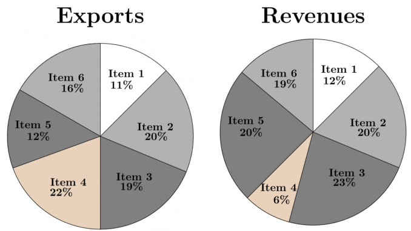

A. B. 2:1 C. 1:4 D. 4:1 gate2014-ag quantitative-aptitude data-interpretation pie-chart ratio-proportion normal

# Answer key☟

# 9.41

# Polynomials (1)

✍ Practice Test: Test 1 (5Q)

# 9.41.1 Polynomials: GATE CSE 2016 Set 1 | GA Question: 09

If $f ( x ) = 2 x ^ { 7 } + 3 x - 5$ , which of the following is a factor of $f ( x ) ?$

A. $( x ^ { 3 } + 8 )$ B. $( x - 1 )$ C. (2x-5) D. (x+1)

gatecse-2016-set1 quantitative-aptitude polynomials normal

If a real variable $x$ satisfies $\mathbf { 3 ^ { \mathit { x } ^ { 2 } } } = 2 7 \times \mathbf { 9 ^ { \mathit { x } } }$ , then the value of $\frac { 2 ^ { x ^ { 2 } } } { \left( 2 ^ { x } \right) ^ { 2 } }$ is:

A. $2 ^ { - 1 }$ B. $2 ^ { 0 }$ C. D.

gateda-2025 quantitative-aptitude powers two-marks

# Answer key☟

# 9.43.1 Prime Numbers: GATE CSE 2025 Set 2 GA Question: 5

Let $p _ { 1 }$ and $p _ { 2 }$ denote two arbitrary prime numbers. Which one of the following statemetns is correct for all values of $p _ { 1 }$ and $p _ { 2 }$ ?

A. $p _ { 1 } + p _ { 2 }$ not a prime number B. $p _ { 1 } p _ { 2 }$ is not a prime number C. $p _ { 1 } + p _ { 2 } + 1$ is a prime number D. $p _ { 1 } p _ { 2 } + 1$ is a prime number

gatecse2025-set2 quantitative-aptitude easy prime-numbers one-mark

# Answer key☟

✍ Practice Tests: Test 1 (15Q) Test 2 (15Q) Test 3 (10Q)

# 9.44.1 Probability: GATE CSE 2015 Set 1 GA Question: 10

The probabilities that a student passes in mathematics, physics and chemistry are $m , p$ and $c$ respectively. Of these subjects, the student has $7 5 \%$ chance of passing in at least one, a $5 0 \%$ chance of passing in at least two and a $4 0 \%$ chance of passing in exactly two. Following relations are drawn in :

I. $p + m + c = 2 7 / 2 0$   
II. $p + m + c = 1 3 / 2 0$   
III. $( p ) \times ( m ) \times ( c ) = 1 / 1 0$ A. Only relation I is true. B. Only relation II is true.   
C. Relations II and III are true. D. Relations and III are true.

gatecse-2015-set1 quantitative-aptitude probability

# Answer key☟

# 9.44.2 Probability: GATE CSE 2015 Set 1 GA Question: 3

Given Set $A = 2 , 3 , 4 , 5$ and Set $B = 1 1$ ,12,13,14,15, two numbers are randomly selected, one from each set. What is the probability that the sum of the two numbers equals ?

A. 0.20 B. 0.25 C. 0.30 D. 0.33

gatecse-2015-set1 quantitative-aptitude probability normal

# Answer key☟

# 9.44.3 Probability: GATE CSE 2017 Set 1 GA Question: 5

The probability that a $k$ -digit number does NOT contain the digits  or  is

A. $0 . 3 ^ { k }$ B. 0.6k C. D.

There are  red socks, green socks and  blue socks.You choose socks. The probability that they are o the same colour is

1 7 14 4 B. C. D 30 15

# Answer key ☟

A six sided unbiased die with four green faces and two red faces is rolled seven times. Which of the following combinations is the most likely outcome of the experiment?

A. Three green faces and four red B. Four green faces and three red faces. faces.   
C. Five green faces and two red D. Six green faces and one red face faces.

gatecse-2018 quantitative-aptitude probability normal two-marks

# Answer key☟

# 9.44.6 Probability: GATE CSE 2021 Set GA Question: 8

There are five bags each containing identical sets of ten distinct chocolates. One chocolate is picked from each bag.

The probability that at least two chocolates are identical is

A. 0.3024 B. 0.4235 C. 0.6976 D. 0.8125

gatecse-2021-set1 quantitative-aptitude probability two-marks

A box contains five balls of same size and shape. Three of them are green coloured balls and two of them are orange coloured balls. Balls are drawn from the box one at a time. If a green ball is drawn, it is not replaced. If an orange ball is drawn, it is replaced with another orange ball.

First ball is drawn. What is the probability of getting an orange ball in the next draw?

A. $\textstyle { \frac { 1 } { 2 } }$ B. C. 10 D. 230

gatecse-2022 quantitative-aptitude probability two-marks

# 9.44.8 Probability: GATE CSE 2025 Set 1 GA Question: 8

A fair six-faced dice, with the faces labelled ‘  ’, ‘  ’, ‘  ’, ‘  ’, ‘  ’, and ’, is rolled thrice. What is the probability of rolling exactly once?

75 1 25 B. 6 ） 216 18 216

gatecse2025-set1 quantitative-aptitude probability easy two-marks

# Answer key☟

# 9.44.9 Probability: GATE CSE 2026 Set 1 GA Question: 10

An unbiased six-faced dice whose faces are marked with numbers 1,2,3,4,5, and is rolled twice in succession and the number on the top face is recorded each time. The probability that the number appearing in the second roll is an integer multiple of the number appearing in the first roll is

A. $\textstyle { \frac { 1 } { 6 } }$ B. C. D.

An unbiased six-faced dice whose faces are marked with numbers 2, ,3,4,5, and  is rolled twice in succession and the number on the top face is recorded each time. The probability that the sum of the two recorded numbers is a prime number is

A. $\frac { 3 } { 3 6 }$ B. 36 C. 15 36 D. 36 19

gatecse-2026-set2 quantitative-aptitude probability two-marks

# Answer key☟

# 9.44.11 Probability: GATE CSE 2026 Set 2 | GA Question: 3

A day can only be cloudy or sunny. The probability of a day being cloudy is , independent of the condition on other days. What is the probability that in any given four days, there will be three cloudy days and one sunny day?

A. B. C. D. 3/8

gatecse-2026-set2 quantitative-aptitude probability one-mark

The probability of a boy or a girl being born is $_ { 1 / 2 }$ . For a family having only three children, what is the probability of having two girls and one boy?

A. B. C. D.

gate-ds-ai-2024 quantitative-aptitude probability two-marks

# 9.44.13 Probability: GATE2012 AE: GA-6

Two policemen, $A$ and $B _ { : }$ , fire once each at the same time at an escaping convict. The probability that $A$ hits the convict is three times the probability that $B$ hits the convict. If the probability of the convict not getting injured is , the probability that $B$ hits the convict is

A. 0.14 B. 0.22 C. 0.33 D. 0.40

gate2012-ae quantitative-aptitude probability

# 9.44.14 Probability: GATE2012 AR: GA-9

A smuggler has capsules in which five are filled with narcotic drugs and the rest contain the original medicine. All the capsules are mixed in a single box, from which the customs officials picked two capsules at random and tested for the presence of narcotic drugs. The probability that the smuggler will be caught is

A. 0.50 B. 0.67 C. 0.78 D. 0.82

gate2012-ar quantitative-aptitude probability

# 9.44.15 Probability: GATE2012 CY: GA-7

$A$ and $B$ are friends. They decide to meet between 1:00 pm and 2:00 pm on a given day. There is a condition that whoever arrives first will not wait for the other for more than 15 minutes. The probability that they will meet on that day is

A. B. 1/16 C. 7/16 D. 9/16

What is the chance that a leap year, selected at random, will contain  Saturdays?

A. B. 3/7 C. D.

gate2013-ee quantitative-aptitude probability

In any given year, the probability of an earthquake greater than Magnitude 6 occurring in the Garhwal Himalayas is . The average time between successive occurrences of such earthquakes is years.

gate2014-ag quantitative-aptitude probability numerical-answers normal

✍ Practice Test: Test (14Q)

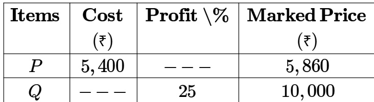

Details of prices of two items $P$ and $Q$ are presented in the above table. The ratio of cost of item $P$ to cost of item $Q$ is $3 : 4 .$ Discount is calculated as the difference between the marked price and the selling price. The profi percentage is calculated as the ratio of the difference between selling price and cost, to the cost

$$
( \mathrm { P r o f i t } ^ { \% } = \frac { \mathrm { S e l l i n g } \mathrm { p r i c e } - \mathrm { C o s t } } { \mathrm { C o s t } } \times 1 0 0 )
$$

The discount on item $Q$ , as a percentage of its marked price, is

A. B. 12.5 C. D.

gatecse-2021-set1 quantitative-aptitude profit-loss two-marks

# 9.45.2 Profit Loss: GATE CSE 2024 Set 2 GA Question: 7

A person sold two different items at the same price. He made $1 0 \%$ profit in one item, and $1 0 \%$ loss in the other item. In selling these two items, the person made a total of

A. $1 \%$ profit B. $2 \%$ profit C. $1 \%$ loss D. $2 \%$ loss

gatecse-2024-set2 quantitative-aptitude profit-loss two-marks

A. B. C. D.

✍ Practice Test: Test (13Q)

# 9.46.1 Quadratic Equations: GATE CSE 2014 Set 1 GA Question: 5

The roots of $a x ^ { 2 } + b x + c = 0$ are real and positive. $^ { a , b }$ and $c$ are real. Then $a x ^ { 2 } + b \mid x \mid + c = 0$ has

A. no roots B. real roots C. 3 real roots D. real roots

gatecse-2014-set1 quantitative-aptitude quadratic-equations normal

# Answer key☟

In a quadratic function, the value of the product of the roots $( \alpha , \beta )$ is . Find the value of

$$
\frac { \alpha ^ { n } + \beta ^ { n } } { \alpha ^ { - n } + \beta ^ { - n } }
$$

A. $n ^ { 4 }$ B. $4 ^ { n }$ C. 22n-1 D.

gatecse-2016-set2 quantitative-aptitude quadratic-equations normal

# 9.46.3 Quadratic Equations: GATE CSE 2021 Set 2 GA Question: 4

$\lceil \left( x - { \frac { 1 } { 2 } } \right) ^ { 2 } - \left( x - { \frac { 3 } { 2 } } \right) ^ { 2 } = x + 2 .$ , then the value of $x$ is:

A. B. 4 C. 6 D.

gatecse-2021-set2 quantitative-aptitude quadratic-equations one-mark

Let $r$ be a root of the equation $x ^ { 2 } + 2 x + 6 = 0$ . Then the value of the expression $( r + 2 ) ( r + 3 ) ( r + 4 ) ( r + 5 )$ is

A. B. C. 126 D. -126

gatecse-2022 quantitative-aptitude quadratic-equations one-mark