The set of values of $p$ for which the roots of the equation $3 x ^ { 2 } + 2 x + p ( p - 1 ) = 0$ are of opposite sign is

A. $( - \infty , 0 )$ B. (0,1) C. $( 1 , \infty )$ D. $( 0 , \infty )$

The quality of services delivered by a company consists of six factors as shown below in the radar diagram. The dots in the figure indicate the score for each factor on a scale of  to The standardized coefficient for each factor is given in the parentheses. The contribution of each factor to the overall service quality is directly proportional to the factor score and its standardized coefficient.

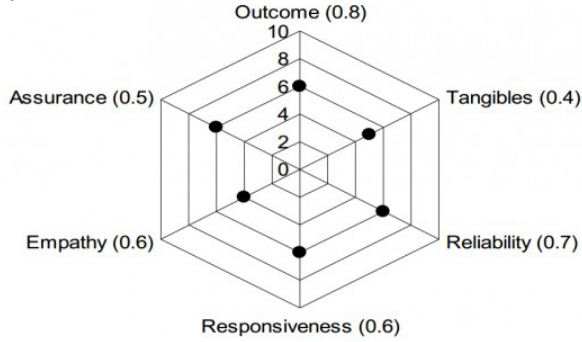

The lowest contribution among all the above factors to the overall quality of services delivered by the company is

A. $1 0 \%$ B. $2 0 \%$ C. $2 4 \%$ D. $4 0 \%$ gate2011-gg difficult quantitative-aptitude data-interpretation radar-chart

# Answer key☟

✍ Practice Tests: Test 1 (15Q) Test 2 (15Q) Test 3 (3Q)

# 9.48.1 Ratio Proportion: GATE CSE 2016 Set 1 GA Question: 10

In a process, the number of cycles to failure decreases exponentially with an increase in load. At a load of units, it takes cycles for failure. When the load is halved, it takes  for failure.The load for which the failure will happen in is

A. 40.00 B. 46.02 C. 60.01 D. 92.02

gatecse-2016-set1 quantitative-aptitude ratio-proportion normal

​The ratio of boys to girls in a class is  to . Among the options below, an acceptable value for the total number of students in the class is:

A. B. 37 C. D.

gatecse-2021-set1 quantitative-aptitude ratio-proportion one-mark

The number of students in three classes is in the ratio $3 : 1 3 : 6$ . If  students are added to each class, the ratio changes to $1 5 : 3 5 : 2 1$ .

The total number of students in all the three classes in the beginning was:

A. B. 66 C. 88 D. 110

gatecse-2021-set2 ratio-proportion quantitative-aptitude two-marks

If two distinct non-zero real variables $x$ and $y$ are such that $( x + y )$ is proportional to $( x - y )$ then the value of $\textstyle { \frac { x } { y } }$

A. depends on B. depends only on $x$ and not on $y$ C. depends only on $y$ and not on $x$ D. is a constant

gatecse-2024-set1 quantitative-aptitude ratio-proportion one-mark

# 9.48.6 Ratio Proportion: GATE2011 AG: GA-8

Three friends, $R , S$ and $T$ shared toffee from a bowl. $R$ took ${ \frac { 1 } { 3 } } ^ { \mathrm { r d } }$ of the toffees, but returned four to the bowl. $\boldsymbol { s }$ took $\frac { 1 } { 4 } ^ { \mathrm { t h } }$ of what was left but returned three toffees to the bowl. $T$ took half of the remainder but returned two back into the bowl. If the bowl had  toffees left, how may toffees were originally there in the bow

A. B. 31 C. 48 D.

general-aptitude quantitative-aptitude gate2011-ag ratio-proportion

# 9.48.7 Ratio Proportion: GATE2011 GG: GA-4

If students require a total of  pages of stationery in  days, then  students will require  pages of stationery in

A. days B. m/100 days C. days D. days

gate2011-gg quantitative-aptitude ratio-proportion

# 9.48.8 Ratio Proportion: GATE2013 AE: GA-1

If $3 \leq X \leq 5$ and $8 \leq Y \leq 1 1$ then which of the following options is TRUE?

$\begin{array} { l } { \displaystyle \left( \frac { 3 } { 5 } \leq \frac { X } { Y } \leq \frac { 8 } { 5 } \right) } \\ { \displaystyle \left( \frac { 3 } { 1 1 } \leq \frac { X } { Y } \leq \frac { 8 } { 5 } \right) } \end{array}$ $\begin{array} { r } { \mathsf { B . } \left( \displaystyle \frac { 3 } { 1 1 } \leq \displaystyle \frac { X } { Y } \leq \displaystyle \frac { 5 } { 8 } \right) } \\ { \mathsf { D . } \left( \displaystyle \frac { 3 } { 5 } \leq \displaystyle \frac { X } { Y } \leq \displaystyle \frac { 8 } { 1 1 } \right) } \end{array}$

# Answer key☟

The smallest angle of a triangle is equal to two thirds of the smallest angle of a quadrilateral. The between the angles of the quadrilateral is $3 : 4 : 5 : 6$ The largest angle of the triangle is twice its smallest angle. What is the sum, in degrees, of the second largest angle of the triangle and the largest angle of the quadrilateral?

gate2014-ae quantitative-aptitude ratio-proportion numerical-answers

# Answer key☟

# 9.49

# Sequence Series (4)

✍ Practice Tests: Test 1 (15Q) Test 2 (1Q)

Given the sequence of terms, CG FK , the next term is

A. OV B. OW C. D.

gatecse-2012 quantitative-aptitude sequence-series easy

What is the missing number in the following sequence?

2, 12, 60, 240, 720, 1440, ，0

A. 2880 B. 1440 C. 720 D.

gatecse-2018 quantitative-aptitude sequence-series easy one-mark

A series of natural numbers $F _ { 1 } , F _ { 2 } , F _ { 3 } , F _ { 4 } , F _ { 5 } , F _ { 6 } , F _ { 7 } , \ldots$ obeys $F _ { n + 1 } = F _ { n } + F _ { n - 1 }$ for all integers $n \geq 2$ .   
If $F _ { 6 } = 3 7$ and $F _ { 7 } = 6 0$ then what is $F _ { 1 }$ ？

A. B. C. D.

gatecse-2023 quantitative-aptitude sequence-series one-mark

​The sum of the following infinite series is

$$
2 + { \frac { 1 } { 2 } } + { \frac { 1 } { 3 } } + { \frac { 1 } { 4 } } + { \frac { 1 } { 8 } } + { \frac { 1 } { 9 } } + { \frac { 1 } { 1 6 } } + { \frac { 1 } { 2 7 } } + \cdots
$$

A. B. 7/2 C. 13/4 D. 9/2

gate-ds-ai-2024 quantitative-aptitude sequence-series one-mark

Answer key☟

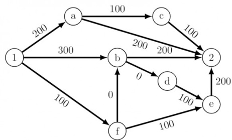

The cost of travel on an edge between two nodes is given in rupees. Nodes $^ { \circ } a ^ { \prime } , ^ { \circ } b ^ { \prime } , ^ { \circ } c ^ { \prime } , ^ { \circ } d ^ { \prime } , ^ { \circ } e ^ { \prime }$ and $' f '$ are toll booths. The toll price at toll booths marked $^ { \mathfrak { s } } a ^ { \mathfrak { s } }$ and $^ { \mathfrak { s } } e ^ { \mathfrak { s } }$ is Rs. , and is Rs. for the other toll booths. Which is the cheapest route from node to node ?

A. $1 - a - c - 2$ $\begin{array} { c c c c } { { } } & { { } } & { { \mathsf { B . ~ 1 - f - b - 2 } \qquad } } & { { \mathsf { C . ~ 1 - b - 2 } } } & { { \mathsf { D . ~ 1 - f - e - 2 } } } \end{array}$

gatecse-2020 quantitative-aptitude graph-theory shortest-path one-mark

# Answer key☟

✍ Practice Tests: Test 1 (15Q) Test 2 (11Q)

# 9.51.1 Speed Time Distance: GATE CSE 2013 Question: 64

A tourist covers half of his journey by train at $6 0 \mathrm { { k m / h } }$ , half of the remainder by bus at $3 0 \mathrm { k m / h }$ and the rest by cycle at $\mathbf { 1 0 k m / h }$ . The average speed of the tourist in $\mathrm { { k m / h } }$ during his entire journey is

A. B. 30 C. 24 D.

gatecse-2013 quantitative-aptitude easy speed-time-distance

Two cars at the same time from the same location and go in the same direction. The speed of the first car is $5 0 \ k \mathrm { m } / \mathsf { h }$ and the speed of the second car is $6 0 ~ \mathsf { k m / h }$ . The number of hours it takes for the distance between the two cars to be $2 0 \kappa \mathrm { m }$ is

A. B. C. D.

gatecse-2019 general-aptitude quantitative-aptitude speed-time-distance one-mark

# Answer key☟

Velocity of an object fired directly in upward direction is given by $V = 8 0 - 3 2 t$ , where $t$ (time) is in seconds. When will the velocity be between $3 2 m / s e c$ and $6 4 m / s e c ?$

CA. $\left( 1 , { \frac { 3 } { 2 } } \right)$ $\begin{array} { c } { { \mathsf { B . } } } \\ { { \mathsf { D . } } } \end{array} \left( \begin{array} { l } { { \mathsf { 1 } } } \\ { { \mathsf { 2 } } } \end{array} , { \mathsf { 1 } } \right)$ $\left( { \frac { 1 } { 2 } } , { \frac { 3 } { 2 } } \right)$

✍ Practice Test: Test (11Q)

Which of the following assertions are CORRECT?

P: Adding  to each entry in a list adds  to the mean of the list . Q: Adding  to each entry in a list adds  to the standard deviation of the list + R: Doubling each entry in a list doubles the mean of the list S: Doubling each entry in a list leaves the standard deviation of the list unchanged

A. , B. , C. , D. ,

gatecse-2012 quantitative-aptitude statistics normal

# 9.52.2 Statistics: GATE CSE 2024 Set 1 GA Question: 3

Consider the following sample of numbers: 9,18,11,14,15,17,10,69,11,13 The median of the sample is

A. 13.5 B. C. 11 D. 18.7

gatecse-2024-set1 quantitative-aptitude statistics one-mark

9.52.3 Statistics: GATE2012 AE: GA-5

The arithmetic mean of five different natural numbers is . The largest possible value among the numbers is

A. B. 40 C. 50 D. 60

gate2012-ae statistics quantitative-aptitude

Answer key☟

The number of solutions for the following system of inequalities is

X1≥0   
X≥0   
X1+X2≤10   
2X1 +2X2 ≥ 22

A. B. infinite C. D.

gate2011-gg quantitative-aptitude system-of-equations

Answer key☟

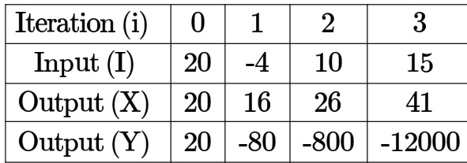

A. $X ( i ) = X ( i - 1 ) + I ( i ) ; \ Y ( i ) = Y ( i - 1 ) I ( i ) ; \ i >$ 0B. $X ( i ) = X ( i - 1 ) I ( i ) ; Y ( i ) = Y ( i - 1 ) + I ( i$ ； i>0C. $X ( i ) = X ( i - 1 ) I ( i )$ ； $\begin{array} { r } { Y ( i ) = Y ( i - 1 ) I ( i ) } \end{array}$ ； i>0D. $X ( i ) = X ( i - 1 ) + I ( i )$ ； $Y ( i ) = Y ( i - 1 ) I ( i - 1 ) ; i > 0$

✍ Practice Test: Test 7 (12Q)

In a survey, respondents were asked whether they own a vehicle or not. If yes, they were further asked to mention whether they own a car or scooter or both. Their responses are tabulated below. What percent of respondents do not own a scooter?

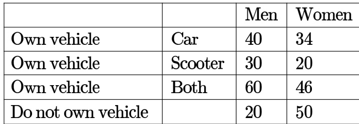

gatecse-2014-set1 quantitative-aptitude normal numerical-answers data-interpretation tabular-data

# Answer key☟

The table below has question-wise data on the performance of students in an examination. The marks fo each question are also listed. There is no negative or partial marking in the examination.

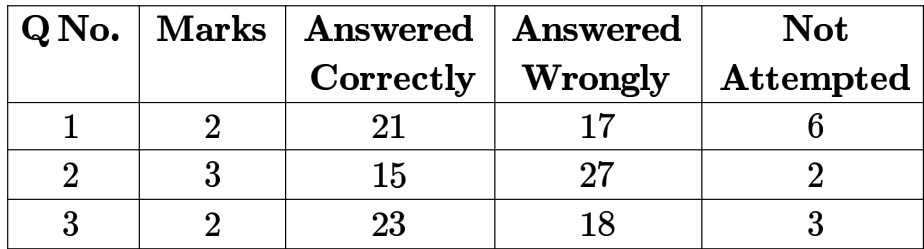

What is the average of the marks obtained by the class in the examination?

A. B. 1.74 C. 3.02 D. 3.91

gatecse-2014-set3 quantitative-aptitude normal data-interpretation tabular-data

# Answer key☟

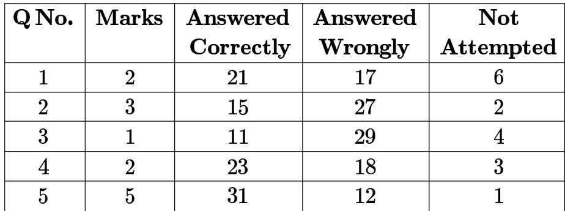

What is the average of the marks obtained by the class in the examination?

A. 2.290 B. 2.970 C. 6.795 D. 8.795

gatecse-2015-set1 quantitative-aptitude easy data-interpretation tabular-data

A shaving set company sells different types of razors- Elegance, Smooth, Soft and Executive. Elegance sells at , Smooth at , Soft at 78 and Executive at  per piece. The table below shows the numbers of each razor sold in each quarter of a year.

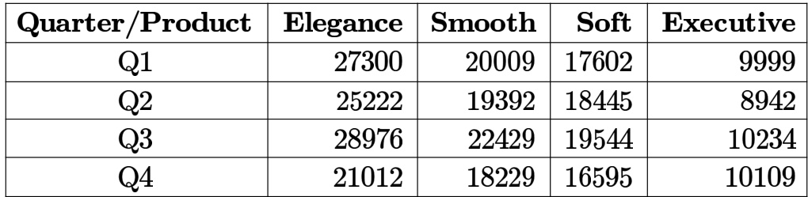

Which product contributes the greatest fraction to the revenue of the company in that year?

A. Elegance B. Executive C. Smooth D. Soft

gatecse-2016-set1 quantitative-aptitude data-interpretation easy tabular-data

Four archers P, Q, R, and S try to hit a bull’s eye during a tournament consisting of seven rounds. As illustrated in the figure below, a player receives points for hitting the bull's eye, 5 points for hitting within the inner circle and point for hitting within the outer circle.

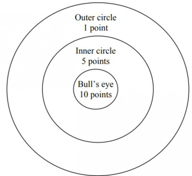

The final scores received by the players during the tournament are listed in the table below.

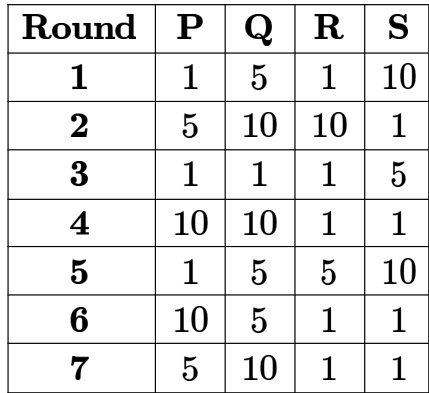

The most accurate and the most consistent players during the tournament are respectively

A. P and S B. Q and R C. Q and Q D. R and Q

gate2011-mn data-interpretation quantitative-aptitude tabular-data

Following table gives data on tourist from different countries visiting India in the year

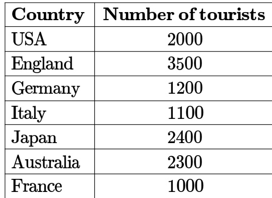

Which two countries contributed to the one third of the total number of tourists who visited India in ?

A. USA and Japan B. USA and Australia C. England and France D. Japan and Australia

gate2013-ae quantitative-aptitude data-interpretation normal tabular-data

Following table provides figures(in rupees) on annual expenditure of a firm for two years - and .

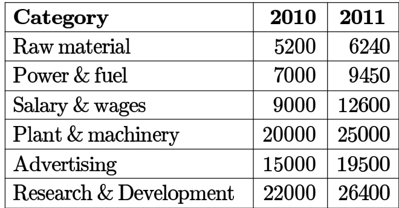

In , which of the two categories have registered increase by same percentage?

A. Raw material and Salary & wages. B. Salary & wages and Advertising. C. Power & fuel and Advertising. D. Raw material and research & Development.

# 9.56.1 Triangles: GATE CSE 2015 Set 2 | GA Question: 8

In a triangle $P Q R , P S$ is the angle bisector o $\angle Q P R$ and $\angle Q P S = 6 0 ^ { \circ }$ . What is the length of $P S$ ?

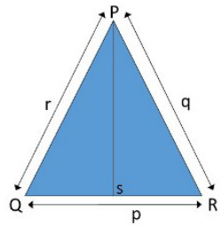

A. DB.   
C. $\sqrt { ( q ^ { 2 } + r ^ { 2 } ) }$

gatecse-2015-set2 quantitative-aptitude geometry difficult triangles

In the figure below, $\angle D E C + \angle B F C$ is equal to

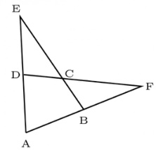

A. ∠BCD-∠BAD B. $\angle B A D + \angle B C F$   
C. $\angle B A D + \angle B C D$ D. $\angle C B A + \angle A D C$

gatecse-2018 quantitative-aptitude geometry normal triangles two-marks

# Answer key☟

The corners and mid-points of the sides of a triangle are named using the distinct letters and but not necessarily in the same order. Consider the following statements:

The line joining $\mathbf { P }$ and is parallel to the line joining $\mathbf { Q }$ and P is placed on the side opposite to the corner . and  cannot be placed on the same side.

Which one of the following statements is correct based on the above information?

A. cannot be placed at a corner B. cannot be placed at a corner C. cannot be placed at a mid-point D. cannot be placed at a corner

gatecse-2022 quantitative-aptitude geometry triangles two-marks

persons are in a room. of them play hockey, of them play football and of them play both hockey and football. Then the number of persons playing neither hockey nor football is:

A. B. C. D.

gatecse-2010 quantitative-aptitude easy set-theory&algebra venn- diagram

# 9.57.2 Venn Diagram: GATE CSE 2016 Set 2 GA Question: 06

Among  faculty members in an institute, are connected with each other through Facebook and are connected through Whatsapp. faculty members do not have Facebook or Whatsapp accounts. The numbers of faculty members connected only through Facebook accounts is

A. B. C. 65 D. 90

gatecse-2016-set2 quantitative-aptitude venn-diagram easy

# Answer key☟

In the given diagram, teachers are represented in the triangle, researchers in the circle and administrators in the rectangle. Out of the total number of the people, the percentage of administrators shall be in the range of

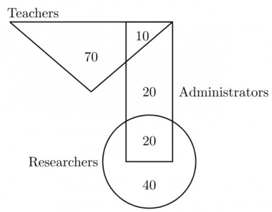

A.  to B. to C.  to D. to gatecse-2019 general-aptitude quantitative-aptitude venn-diagram two-marks

In a college, there are three student clubs,  students are only in the Drama club,  students are only in the Dance club, students are only in Maths club, 40 students are in both Drama and Dance clubs, students are in both Dance and Maths clubs, students are in both Drama and Maths clubs, and  students are in all clubs. If $7 5 \%$ of the students in the college are not in any of these clubs, then the total number of students in the college is

A. 1000 B. 975 C. 900 D. 225 gatecse-2019 general-aptitude quantitative-aptitude venn-diagram two-marks

# Answer key☟

# 9.57.5 Venn Diagram: GATE CSE 2024 Set 2 GA Question: 3

In an engineering college of students,  like neither their core branches nor other branches The number of students who like their core branches i s of the number of students who like other branches. The number of students who like both their core and other branches is .

The number of students who like their core branches is

A. 1,800 B. 3,500 C. 1,600 D. 1,500

A gathering of linguists discovered that  knew Kannada Telugu and Tamil 7 knew only Telugu and Tamil knew only Kannada and Tamil ， 6 knew only Telugu and Kannada If the number of linguists who knew Tamil is and those who knew Kannada is also  how many linguists knew only Telugu

A. B. 10 C. D. 8

general-aptitude quantitative-aptitude gate2010-tf venn-diagram

# Answer key☟

# 9.57.7 Venn Diagram: GATE2011 GG: GA-7

In a class of students in an M.Tech programme, each student is required to take at least one subject from the following three:

M600: Advanced Engineering Mathematics C600: Computational Methods for Engineers E600: Experimental Techniques for Engineers

The registration data for the M.Tech class shows that students have taken M600, students have taken C600, and  students have taken E600. What is the maximum possible number of students in the class who have taken all the above three subjects?

A. B. C. 40 D. gate2011-gg quantitative-aptitude set-theory&algebra venn-diagram

We have  rectangular sheets of paper,  and , of dimensions $6 \mathrm { c m } \times 1$ cm each. Sheet  is rolled to form an open cylinder by bringing the short edges of the sheet together. Sheet $\mathbf { N }$ is cut into equal square patches and assembled to form the largest possible closed cube. Assuming the ends of the cylinder are closed, the ratio of the volume of the cylinder to that of the cube is

A. π2 3 D. gatecse-2021-set1 quantitative-aptitude mensuration volume two-marks

# Answer key☟

✍ Practice Tests: Test (15Q) Test 2 (8Q)

Alternatively, if he uses only trucks, then all the orders are cleared at the end of the day. What is the minimum number of trucks required so that there will be no pending order at the en d of day?

A. B. C. D.

gatecse-2011 quantitative-aptitude normal work-time

The current erection cost of a structure is Rs. If the labour wages per day increase by $1 / 5$ of the current wages and the working hours decrease by $\mathbf { 1 } / 2 4$ of the current period, then the new cost of erection in Rs. is

A. 16,500 B. 15,180 C. 11,000 D. 10,120

gatecse-2013 quantitative-aptitude normal work-time

# Answer key☟

# Answer Keys

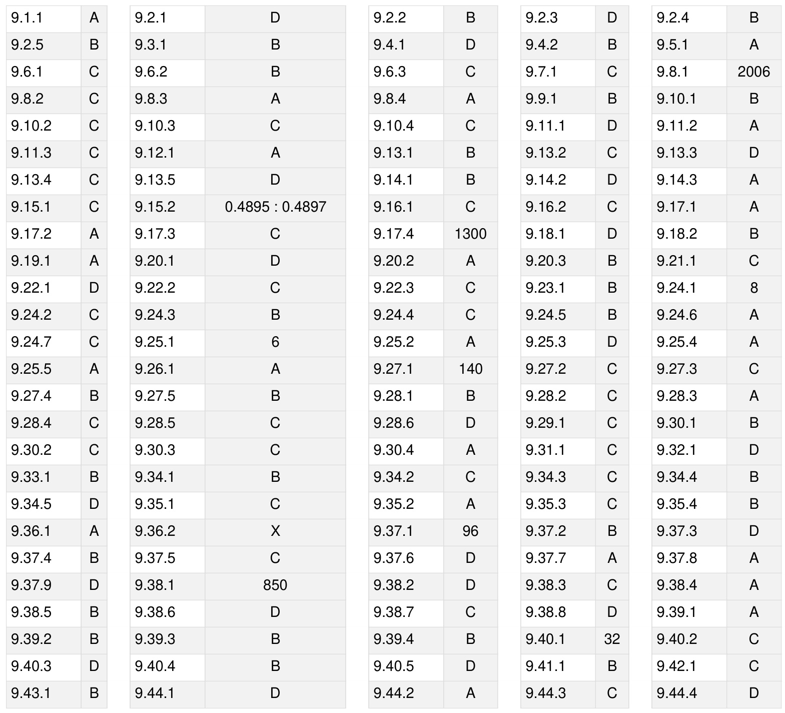

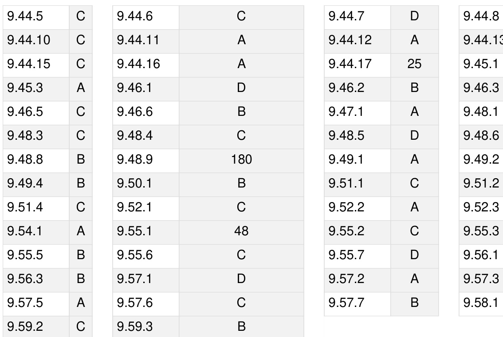

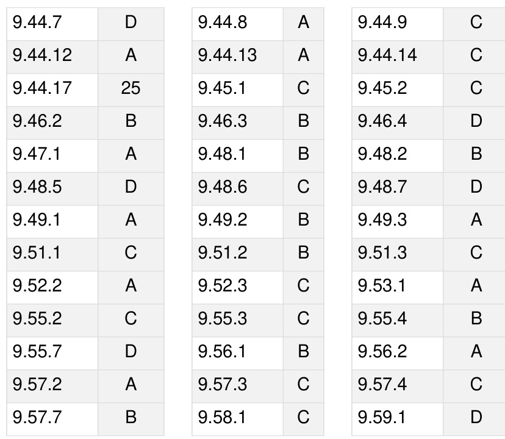

Transformation of shapes: translation, rotation, scaling, mirroring, assembling, and grouping, Paper folding, cutting, and patterns in 2 and 3 dimensions

MarkDistribution in Previous GATE   

Welcome to the "General Aptitude: Spatial Aptitude" chapter of your GATE Computer Science exam preparation. This section is designed to equip you with the essential concepts, strategies, and quick references needed to excel in spatial reasoning questions. Spatial aptitude tests your ability to visualize, interpret, and manipulate objects and patterns in two and three dimensions. For GATE CS, mastering this area is crucial not just for the General Aptitude section, but also for developing fundamental visualization skills that are indirectly beneficial in areas like computer graphics, data structures, and algorithms. Typically, you can expect 1-3 questions from Spatial Aptitude in the General Aptitude section, contributing 2-5 marks. Questions often involve identifying patterns, mentally rotating shapes, understanding mirror images, or assembling figures, usually presented as Multiple Choice Questions (MCQs).

# Topic-wise Key Concepts

# 1. 3D Structure

Definition and Core Idea: This topic involves understanding and visualizing three-dimensional objects from their twodimensional representations (like orthographic or isometric views) or vice-versa. It requires the ability to mentally construct, deconstruct, and manipulate 3D shapes, identifying their hidden faces, edges, and vertices.

Important Formulas, Theorems, and Results:

Euler's Formula for Polyhedra: For any simple (convex) polyhedron, the number of vertices $( V )$ , edges $( E )$ , and faces $( F )$ are related by the formula:

$$
V - E + F = 2
$$

This formula is fundamental for checking the consistency of polyhedral structures.

Common Polyhedra Properties: Cube: $V = 8$ , $E = 1 2$ , $F = 6$ Cuboid: $V = 8$ , $E = 1 2$ , $F = 6$ Triangular Prism: $V = 6 , E = 9 , F = 5$ Square Pyramid: $V = 5$ $= 5 , E = 8 , F = 5$ Tetrahedron: $V = 4 , E = 6 , F = 4$

Key Properties and Identities:

Orthographic Projections: These are 2D views (Front, Top, Side) that show the true shape and size of one face of an object, without perspective distortion.   
Isometric Views: A 3D representation where all three axes are equally foreshortened, giving a sense of depth and volume. Parallel lines remain parallel.   
Nets of 3D Shapes: 2D pattern that can be folded to form a 3D shape. Understanding nets is crucial for visualizing how faces connect.   
Hidden Lines: In 2D representations of 3D objects, dashed lines often represent edges that are not directly visible from the chosen viewpoint.

# Common Pitfalls or Tricky Points:

Misinterpreting hidden lines or confusing different orthographic views.   
Incorrectly counting faces, edges, or vertices, especially when parts are hidden or joined.   
Difficulty in visualizing the folding/unfolding of complex nets.   
Confusing isometric projection with perspective projection.

# Standard Problem-Solving Techniques or Shortcuts:

. Mental Rotation and Manipulation: Practice mentally rotating and viewing objects from different angles. Feature Tracking: Focus on a unique corner, edge, or patterned face and track its position across different views or during folding.   
Elimination Strategy: Quickly eliminate options that clearly violate geometric principles or don't match specific features.   
Auxiliary Views: If struggling, mentally sketch an additional view to clarify the structure.   
Nets to 3D: For nets, identify adjacent faces and opposite faces. Opposite faces never share an edge.

# 2. Assembling

Definition and Core Idea: This topic involves combining given 2D or 3D components to form a complete shape or object, or identifying which set of components can form a specified shape. It tests your spatial reasoning to fit parts together precisely without overlap or gaps.

Important Formulas, Theorems, and Results: No specific mathematical formulas are typically used. The core idea relies on geometric principles of congruence, tessellation, and conservation of area/volume.

# Key Properties and Identities:

Congruence: Pieces must match exactly in shape and size to fit together.   
Tessellation: The ability of shapes to fit together without gaps or overlaps to cover a surface (for 2D assembling).   
Conservation of Area/Volume: The total area (for 2D) or volume (for 3D) of the assembled figure must equal the sum of the areas/volumes of its constituent pieces.   
Edge/Face Matching: The edges or faces that meet must be identical in length and shape.   
Symmetry: Recognizing symmetry in the target shape or individual pieces can aid assembly.

# Common Pitfalls or Tricky Points:

Overlooking small details or subtle differences in piece shapes.   
Assuming pieces can be resized, distorted, or flipped (unless explicitly allowed).   
Not considering all possible orientations (rotations and reflections) for each piece.   
Difficulty in visualizing how irregular shapes fit into complex outlines.

# Standard Problem-Solving Techniques or Shortcuts:

Start with Distinctive Pieces: Begin by placing pieces with unique shapes, sharp corners, or specific patterns that have limited fitting options.   
Work from the Edges/Corners: For outline-based problems, try to fill the outer boundaries first.   
Identify Complementary Shapes: Look for pieces whose contours fit together like puzzle pieces.   
Mental Rotation and Translation: Actively rotate and slide pieces mentally to test fits.   
Elimination: If a piece clearly doesn't fit in any orientation, eliminate the option containing it.

# 3. Assembling Pieces

Definition and Core Idea: This topic is a specific type of assembling, often focusing on arranging a set of smaller, usually irregular, 2D pieces to form a larger, specified 2D figure. It's akin to solving a jigsaw puzzle or tangram, requiring visualization of how shapes fit together, including rotation and reflection.

Important Formulas, Theorems, and Results: No specific formulas. The principles are geometric matching and conservation of area.

Key Properties and Identities:

Area Conservation: The sum of the areas of the individual pieces must equal the area of the final assembled figure.   
Edge and Vertex Matching: Edges of adjacent pieces must align perfectly, and vertices must meet precisely.   
No Overlap or Gaps: The assembled figure must be solid, with no parts of pieces overlapping and no empty spaces within the boundary.   
Orientation Flexibility: Pieces can usually be rotated and/or reflected unless specified otherwise.

# Common Pitfalls or Tricky Points:

Incorrectly assuming a piece can be flipped (reflected) when only rotation is allowed, or vice-versa.   
Misjudging the size or shape of internal gaps that need to be filled.   
Difficulty in visualizing how multiple irregular pieces combine to form a regular outline.   
Overlooking that pieces might need to be rotated by angles other than 90 degrees.

# Standard Problem-Solving Techniques or Shortcuts:

. Focus on Unique Features: Identify pieces with distinct curves, sharp angles, or long straight edges.   
Largest Piece First: Often, starting with the largest or most complex piece helps define the initial structure.   
Work from the Outside In: Try to form the outer boundary of the target figure first.   
Consider Negative Space: Sometimes, it's easier to visualize the shape of the 'hole' that needs to be filled by the remaining pieces.   
Trial and Error (Mental): Mentally try fitting pieces, eliminating options as you go.

# 4. Counting Figure

Definition and Core Idea: This involves systematically counting the number of specific geometric shapes (e.g., triangles, squares, rectangles, cubes) within a complex, often overlapping, figure. The core idea is to develop a structured approach to avoid double-counting or missing any figures.

Important Formulas, Theorems, and Results:

Number of Squares in an $n \times n$ Grid:

$$
\sum _ { k = 1 } ^ { n } k ^ { 2 } = { \frac { n ( n + 1 ) ( 2 n + 1 ) } { 6 } }
$$

For example, in a $\mathbf { 3 \times 3 }$ grid, it's $\mathbf { 3 } ^ { 2 } + \mathbf { 2 } ^ { 2 } + \mathbf { 1 } ^ { 2 } = \mathbf { 9 } + 4 + 1 = \mathbf { 1 } 4$ squares.

Number of Rectangles in an $n \times m$ Grid:

$$
\left( { \frac { n ( n + 1 ) } { 2 } } \right) \times \left( { \frac { m ( m + 1 ) } { 2 } } \right)
$$

This counts all possible rectangles, including squares.

Number of Triangles in a Simple Base with $\scriptstyle n$ Segments: If a base line is divided into $\scriptstyle n$ segments and a common vertex is connected to all endpoints, the number of triangles formed is:

$$
\frac { n ( n + 1 ) } { 2 }
$$

This applies to triangles sharing a common vertex and lying on the same base line. More complex configurations require specific counting methods.

Number of Cubes in a Stack: For a stack of unit cubes, count cubes layer by layer, or by identifying visible and hidden cubes based on the structure.

# Key Properties and Identities:

Hierarchical Counting: Often, figures can be counted by their size (e.g., 1-unit squares, 2x2 squares, etc.) or by the number of smaller units they encompass.   
Systematic Listing: Labeling vertices or sections can help in systematically listing and counting figures without repetition.   
Symmetry: If a figure is symmetrical, counting one part and multiplying can be a shortcut, but be careful with figures on the axis of symmetry.

# Common Pitfalls or Tricky Points:

Double -counting figures or missing smaller, embedded figures.   
Not having a systematic approach, leading to confusion and errors.   
Difficulty in visualizing overlapping shapes, especially triangles or rectangles.   
For 3D figures, forgetting to count hidden cubes or structures.

# Standard Problem-Solving Techniques or Shortcuts:

Size-Based Counting: Count all figures of the smallest size, then combinations of two, three, and so on, up to the largest possible figure.   
Vertex/Line-Based Counting: For triangles, identify a common vertex and count the number of base segments.   
For rectangles, count horizontal and vertical lines.   
Decomposition: Break down complex figures into simpler, countable components. Labeling: Assign numbers or letters to distinct regions or vertices to help track counted figures.   
Pattern Recognition: For grids, apply the formulas directly.

# 5. Grouping

Definition and Core Idea: This topic involves identifying a common characteristic or underlying rule among a set of figures and grouping them accordingly, or identifying the 'odd one out' that does not share the common property. It primarily tests pattern recognition and classification based on visual attributes.

Important Formulas, Theorems, and Results: No specific formulas. Relies purely on observational skills and logica deduction.

Key Properties and Identities:

Number of Elements/Sides: Counting internal components, sides of a polygon, or lines.   
Symmetry: Presence or absence of rotational, reflectional, or point symmetry.   
Orientation: The direction or alignment of figures or their internal components.   
Shading/Filling Patterns: Whether parts are filled, hollow, or have specific textures.   
Relative Positions: The spatial relationship between different elements within a figure (e.g., inside/outside, left/right).   
Transformations: Whether figures are related by rotation, reflection, or translation.   
Connectivity: Whether elements are connected or separate.

# Common Pitfalls or Tricky Points:

Focusing on superficial differences rather than fundamental commonalities.   
Missing subtle patterns or rules that apply to most figures.   
Not considering all possible attributes (e.g., only looking at shape, not shading or orientation).   
Assuming a simple rule when a more complex one is at play.

# Standard Problem-Solving Techniques or Shortcuts:

Attribute Listing: For each figure, list all observable attributes (e.g., number of sides, type of lines, shading, orientation of internal arrow).   
Compare and Contrast: Systematically compare each figure with the others to find commonalities or unique features.   
Hypothesis Testing: Formulate a hypothesis about a potential grouping rule and test it against all figures. Look for Deviations: When finding the odd one out, identify the property that one figure lacks or possesses uniquely.   
Consider Transformations: Check if figures can be grouped based on being rotations or reflections of each othe

# 6. Image Rotation

Definition and Core Idea: This topic involves mentally rotating a 2D or 3D object to match a given orientation or to predict its appearance after a specified rotation. It tests your ability to visualize how shapes and their internal components change position relative to each other during rotation.

Important Formulas, Theorems, and Results: No specific formulas, but understanding angular rotation (e.g., $9 0 ^ { \circ }$ , $1 8 0 ^ { \circ }$ , $2 7 0 ^ { \circ }$ clockwise/anticlockwise) is key.

Key Properties and Identities:

Relative Positions: The spatial relationship between different parts of the object remains constant during rotation Only the object's overall orientation changes.   
Clockwise vs. Anticlockwise: Distinguish between the direction of rotation.   
Degrees of Rotation: Standard rotations are often multiples of 90 degrees. A 180-degree rotation results in an inverted image (upside down). A 360-degree rotation returns the object to its original orientation.   
Fixed Point/Axis: Rotation occurs around a central point (for 2D) or an axis (for 3D).

# Common Pitfalls or Tricky Points:

Incorrectly rotating parts of the image independently instead of the whole figure.   
Confusing clockwise with anticlockwise rotation.   
Misjudging the exact angle of rotation, especially for non-90-degree rotations.   
Difficulty in tracking multiple features simultaneously during rotation.

# Standard Problem-Solving Techniques or Shortcuts:

Focus on a Distinctive Feature: Pick a unique part of the figure (e.g., an arrow, a specific corner, a shaded region) and track its movement during rotation.   
Mental Overlay: Imagine overlaying the rotated figure onto the original to check alignment.   
Use Reference Points: Mentally fix a point on the figure and observe its path during rotation.   
. Elimination: Quickly rule out options that are clearly not rotations (e.g., reflections, altered shapes).   
Practice with Physical Objects: If struggling, use a physical object (like a matchbox or a drawn shape on paper) and rotate it to build intuition.

# 7. Mirror Image

Definition and Core Idea: This topic involves determining the appearance of an object o figure when reflected across a mirror line (which can be vertical, horizontal, or diagonal). The core idea is to understand the concept of lateral inversion.

Important Formulas, Theorems, and Results: No specific formulas. The principle is geometric reflection.

Key Properties and Identities:

Lateral Inversion (Vertical Mirror): For a vertical mirror, left becomes right, and right becomes left. The top and bottom parts remain in their respective positions.   
Vertical Inversion (Horizontal Mirror): For a horizontal mirror, top becomes bottom, and bottom becomes top. The left and right parts remain in their respective positions.   
Distance Preservation: Every point in the original figure is the same perpendicular distance from the mirror line as its corresponding point in the mirror image.   
Symmetry: If a figure has reflectional symmetry along the mirror line, its mirror image will be identical to the original. Text/Numbers: Letters and numbers appear reversed in a mirror image (e.g., 'b' becomes 'd', 'p' becomes 'q', '6' becomes '9'). Some letters (A, H, I, M, O, T, U, V, W, X, Y) are symmetrical and appear unchanged in a vertical mirror.

# Common Pitfalls or Tricky Points:

Confusing mirror image with rotation (especially 180-degree rotation, which looks similar to a horizontal mirror image followed by a vertical mirror image).   
Incorrectly reflecting across diagonal mirror lines, which requires more complex visualization.   
Misinterpreting internal patterns or text within the figure.   
Forgetting that the 'depth' or 'front-back' orientation is also inverted in a 3D mirror image.

# Standard Problem-Solving Techniques or Shortcuts:

Imagine Folding: Mentally fold the paper along the mirror line. The image should appear on the other side.   
Point-by-Point Reflection: For complex figures, reflect key points or vertices one by one.   
Feature Tracking: Pick a distinctive feature (e.g., an arrow, a shaded corner) and visualize its reflected position.   
. Elimination: Rule out options that show rotation or distortion instead of reflection.   
Practice with Letters/Numbers: Familiarize yourself with the mirror images of common letters and digits.

# 8. Paper Folding

Definition and Core Idea: This topic involves visualizing a sequence of folds made on a piece of paper and then predicting the pattern of holes or cuts when the paper is unfolded, or vice-versa. The core idea is to mentally reverse the folding process, understanding how cuts/holes multiply and reflect across each fold line.

Important Formulas, Theorems, and Results: No specific formulas. Relies on principles of symmetry and reflection. Key Properties and Identities:

Symmetry: Each fold line acts as a mirror line. When the paper is unfolded, any cut or hole will be reflected across that fold line.   
Number of Layers: A cut made through multiple layers of folded paper will result in multiple holes upon unfolding, corresponding to the number of layers cut.   
Order of Unfolding: The paper must be unfolded in the reverse order of folding. The last fold made is the first one to be unfolded.   
Position of Cuts: The position of a cut relative to the edges and previous fold lines is crucial.

# Common Pitfalls or Tricky Points:

Incorrectly reversing the order of folds during unfolding.   
Missing reflections across fold lines, especially when multiple folds are involved.   
Misjudging the number of layers a cut passes through.   
Difficulty in visualizing the exact shape and position of holes after multiple reflections.   
Confusing the orientation of the paper after each fold.

# Standard Problem-Solving Techniques or Shortcuts:

Work Backward: Start from the final folded and cut state and mentally unfold the paper step-by-step, applying reflection at each fold line.   
Draw Each Stage: If the problem is complex, quickly sketch the paper at each stage of unfolding, marking the reflections of the cuts.   
Identify Fold Lines as Mirror Lines: Each fold line becomes an axis of symmetry for the cuts/holes when unfolded. . Focus on a Single Cut/Hole: Track how one specific cut or hole multiplies and reflects across the folds. Eliminate Options: Use the first few unfolding steps to eliminate options that don't match the expected pattern.

# 9. Patterns In Three Dimensions

Definition and Core Idea: This topic involves identifying sequences or transformations of 3D objects, predicting the next object in a series, or identifying relationships between 3D patterns. It extends 2D pattern recognition skills to three dimensions, often involving rotation, translation, and changes in internal features of 3D shapes.

Important Formulas, Theorems, and Results: No specific formulas. Relies on understanding 3D geometry and transformations.

Key Properties and Identities:

3D Transformations:

Rotation: Around X, Y, or Z axes (e.g., a cube rotating on its edge or face). Translation: Movement along an axis. Scaling: Change in size (less common in GATE spatial aptitude). Internal Features: Patterns, markings, or smaller objects within the 3D structure can also follow a sequence of changes. Structural Changes: Addition or removal of smaller cubes or components from a larger 3D structure. Perspective Changes: How the 2D representation of a 3D object changes with different viewpoints.

# Common Pitfalls or Tricky Points:

Difficulty in visualizing complex 3D changes from static 2D representations.   
Missing subtle transformations or changes in internal elements.   
Confusing rotations around different axes.   
Overlooking hidden changes in the back or underside of the 3D object.

# Standard Problem-Solving Techniques or Shortcuts:

Focus on One Aspect at a Time: Analyze the pattern of change for one specific feature (e.g., the top face, a specific corner, an internal dot) before combining observations.   
Mentally Manipulate: Actively imagine the 3D objects moving or transforming.   
Look for Consistent Rules: Identify a clear, repeatable rule or sequence of operations that applies to all given figures in the series.   
Use a Reference Point/Axis: Mentally fix a point or an axis on the object to track its movement or rotation. Elimination: Rule out options that clearly do not follow the established pattern.

# 10. Patterns In Two Dimensions

Definition and Core Idea: This topic involves identifying the underlying rule or sequence in a series of 2D figures and predicting the next figure, or finding the odd one out. It requires recognizing transformations (rotation, reflection, translation), changes in number, size, shading, or arrangement of elements within the figures.

Important Formulas, Theorems, and Results: No specific formulas. Relies on logical deduction and visual pattern recognition.

Key Properties and Identities:

Transformations: Rotation: Clockwise or anticlockwise, by specific degrees (e.g., $4 5 ^ { \circ }$ , 90°, 180°).

。 Reflection: Across a horizontal, vertical, or diagonal axis. Translation: Movement of the entire figure or its components in a specific direction.

Changes in Attributes:

Number: Increase or decrease in the count of elements.   
Size/Shape: Enlargement, reduction, or alteration of shapes.   
Shading/Filling: Alternating or progressive changes in shading.   
Arrangement: Changes in the relative positions of components.   
Connectivity: Elements joining or separating.

Alternating Patterns: A pattern that alternates between two or more states.

Progressive Patterns: A pattern that changes incrementally with each step.

# Common Pitfalls or Tricky Points:

Overlooking subtle changes in size, orientation, or shading.   
Assuming a simple pattern when a more complex, multi-layered rule is present.   
Not considering all possible transformations (e.g., only looking for rotation, ignoring reflection).   
Getting confused by multiple elements changing simultaneously.

# Standard Problem-Solving Techniques or Shortcuts:

Systematic Analysis: Break down the figure into its constituent elements. Analyze how each element (e.g., outer shape, inner shape, arrow, dot, shading) changes from one figure to the next.   
Track One Element at a Time: If multiple elements are changing, focus on one element's transformation throughout the series before moving to the next.   
Look for Cycles: Identify if a pattern repeats after a certain number of figures.   
Identify the Rule: Formulate a clear rule (e.g., "the inner square rotates 90 degrees clockwise, and the outer circle alternates shading").   
Test the Rule: Apply your hypothesized rule to the subsequent figures in the series to confirm its validity. Elimination: Use the identified pattern to quickly eliminate options that do not conform.

# Quick Formula Reference

This section consolidates the key formulas and mathematical results important for Spatial Aptitude problems.

Euler's Formula for Polyhedra: For any simple polyhedron, the relationship between vertices $( V )$ , edges $( E )$ , and faces $( F )$ is given by:

$$
V - E + F = 2
$$

Number of Squares in an $n \times n$ Grid: The total number of squares (of all sizes) in an $n \times n$ grid is:

$$
\sum _ { k = 1 } ^ { n } k ^ { 2 } = { \frac { n ( n + 1 ) ( 2 n + 1 ) } { 6 } }
$$

Number of Rectangles in an $n \times m$ Grid: The total number of rectangles (including squares) in an $n \times m$ grid is:

$$
\left( { \frac { n ( n + 1 ) } { 2 } } \right) \times \left( { \frac { m ( m + 1 ) } { 2 } } \right)
$$

Number of Triangles in a Simple Base with $n$ Segments: If a base line is divided into $n$ segments and a common vertex is connected to all endpoints, the number of triangles formed is:

$$
\frac { n ( n + 1 ) } { 2 }
$$

# Important Tips for GATE

Mastering Spatial Aptitude for GATE requires not just understanding concepts but also developing effective exam strategies. Here are some practical tips:

1. Visualize Actively, Don't Just Observe: Spatial aptitude is about mental manipulation. Don't just look at the figures; actively imagine them moving, rotating, folding, or reflecting. Close your eyes briefly if it helps to form a clearer mental image.

2. Adopt a Systematic Approach: Avoid haphazard guessing. For each problem type (e.g., counting, paper folding, pattern series), develop and follow structured method. This prevents errors like double-counting or missing steps.

3. Focus on Key Features and Reference Points: When dealing with rotations, reflections, complex patterns, identify a unique or distinctive element (e.g., a specific corner, an arrow, a shaded region). Track its movement or transformation throughout the sequence or across options.   
4. Leverage the Elimination Strategy: In multiple-choice questions, often several options can be quickly ruled out because they clearly violate a fundamental rule (e.g., a reflection instead of a rotation, an extra piece in an assembly). This narrows down your choices and increases your chances.   
5. Practice Under Time Constraints: Spatial aptitude questions can be time-consuming due to the mental effort required. Practice solving problems within strict time limits to improve your speed and efficiency. The more you practice, the faster your visualization skills will become.   
6. Clearly Differentiate Mirror Image from Rotation: These are common sources of confusion. Remember that a mirror image involves lateral inversion (left-right flip for a vertical mirror), while rotation changes orientation without flipping. A 180-degree rotation can sometimes look similar to a mirror image, so pay close attention.   
7. Don't Hesitate to Sketch (Mentally or Physically): For complex problems like paper folding or 3D structures, a quick mental or physical sketch of intermediate steps can significantly clarify the problem and prevent errors. This is especially useful for tracking reflections in paper folding.   
8. Start with Simpler Problems to Build Confidence: If you find a particular type of spatial problem challenging, begin with simpler variations to build your foundational understanding and confidence before tackling more complex ones. Gradually increase the difficulty.

# 10.1.1 3d Structure: GATE CSE 2026 Set 1 GA Question: 7

In Panel  of the figure below, the front view and top view of a structure are shown. Which one of the structures shown in Panel possesses the views shown in Panel

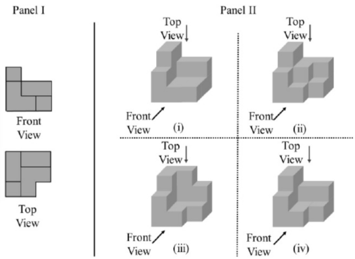

A. (i) B. (ii) C. (iii D. (iv)

gatecse-2026-set1 spatial-aptitude 3d-structure two-marks 一1\~

Which one of the figures labelled as , and S can be constructed by using each of the four pieces only once without overlaps?

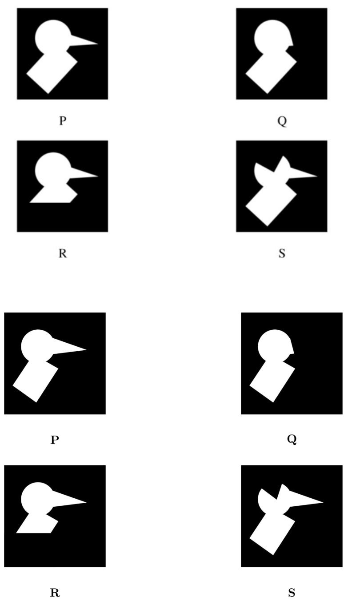

A. B. Q C. D. S

A jigsaw puzzle has pieces. One of the pieces is shown above. Which one of the given options for the missing piece when assembled will form a rectangle? The piece can be moved, rotated or flipped to assemble with the above piece.

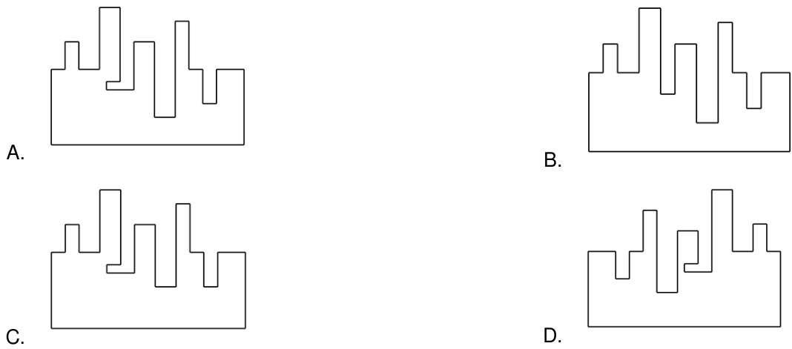

gatecse-2021-set2 spatial-aptitude assembling-pieces two-marks

Answer key☟ ✍ Practice Test: Test (7Q)

A palindrome is a word that reads the same forwards and backwards. In a game of words, a player has the following two plates painted with letters.

From the additional plates given in the options, which one of the combinations of additional plates would allow the player to construct a five-letter palindrome. The player should use all the five plates exactly once. The plates can be rotated in their plane.

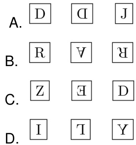

☆—小一

A. Operation 1: A clockwise rotation by $9 0 ^ { \circ }$ about an axis perpendicular to the plane of the figure A reflection along a horizontal line   
B. A counter clockwise rotation by $9 0 ^ { \circ }$ about an axis perpendicular to the plane of the figure A reflection along a horizontal line   
C. Operation A clockwise rotation by $9 0 ^ { \circ }$ about an axis perpendicular to the plane of the figure A reflection along a vertical line   
D. A counter clockwise rotation by $1 8 0 ^ { \circ }$ about an axis perpendicular to the plane of the figure Operation 2: A reflection along a vertical line

Three different views of a dice are shown in the figure below.

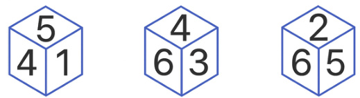

The piece of paper that can be folded to make this dice is ​The least number of squares to be added in the figure to make a line of symmetry is

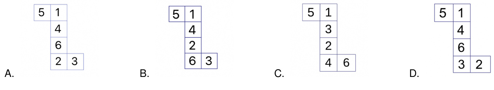

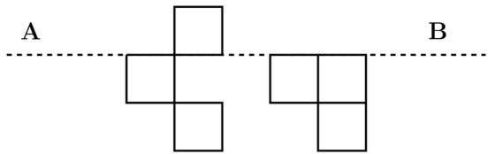

A. B. C. D.

gatecse-2024-set1 spatial-aptitude mirror-image two-marks

# Answer key☟

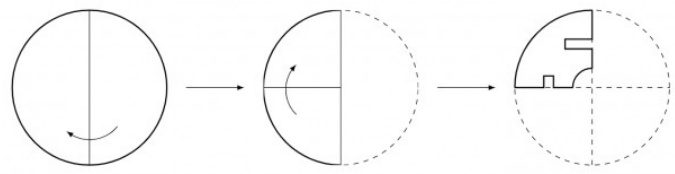

A circular sheet of paper is folded along the lines in the directions shown. The paper, after being punched in the final folded state as shown and unfolded in the reverse order of folding, will look like

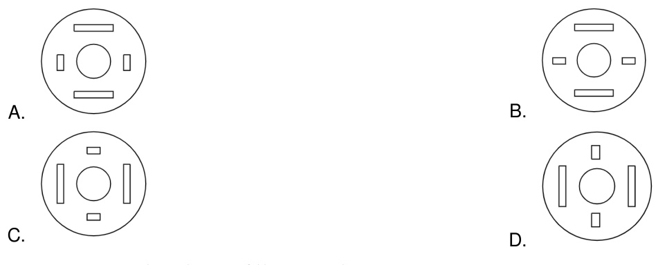

gatecse-2021-set1 spatial-aptitude paper-folding one-mark

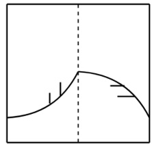

A transparent square sheet shown above is folded along the dotted line. The folded sheet will look like

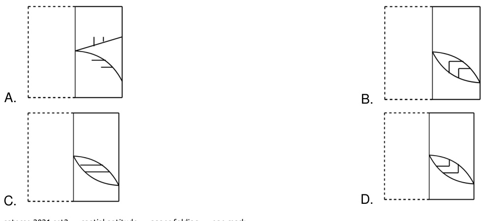

# 10.6.3 Paper Folding: GATE CSE 2024 Set 1 GA Question: 9

A rectangular paper of $2 0 \mathrm { c m } \times 8$ is folded  times. Each fold is made along the line of symmetry, which is perpendicular to its long edge. The perimeter of the final folded sheet (in ) is

A. B. C. D.

A square paper, shown in figure $( I )$ , is folded along the dotted lines as shown in the figures $( I I )$ and $( I I I )$ . Then a few cuts are made as shown in figure $( I V )$ . Which one of the following patterns will be obtained when the paper is unfolded?

Note: The figures shown are representative.

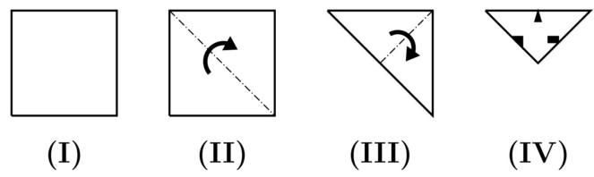

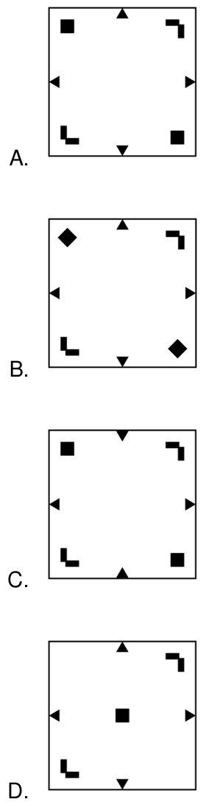

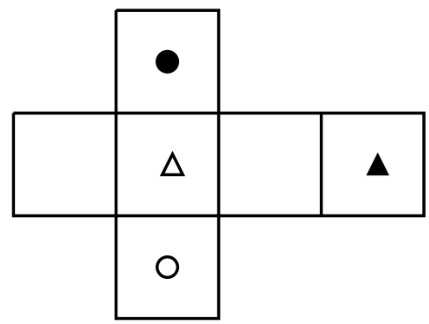

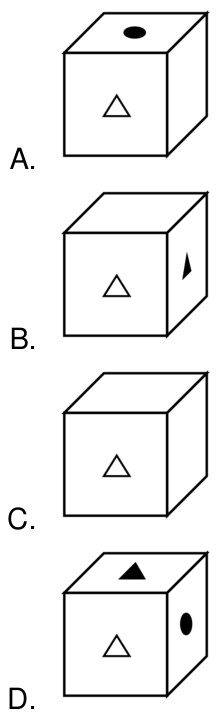

✍ Practice Test: Test (10Q)

Looking at the surface of a smooth -dimensional object from the outside, which one of the following options is

AB. The surface of the object must be concave everywhere. The surface of the object must be convex everywhere.   
C. The surface of the object may be concave in some places and convex in other places.   
D. The object can have edges, but no corners.

Visualize two identical right circular cones such that one is inverted over the other and they share a common circular base. If a cutting plane passes through the vertices of the assembled cones, what shape does the outer boundary of the resulting cross-section make?

A. A rhombus B. A triangle C. An ellipse D. A hexagon

gate-ds-ai-2024 spatial-aptitude patterns-in-three-dimensions two-marks

# Answer key☟

# 10.8.1 Patterns In Two Dimensions: GATE CSE 2021 Set GA Question: 2

A polygon is convex if, for every pair of points, and $\mathbf { Q }$ belonging to the polygon, the line segment  lies completely inside or on the polygon.

Which one of the following is a convex polygon?

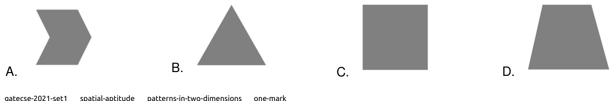

# Answer key☟

A plot of land must be divided between four families. They want their individual plots to be similar in shape, not necessarily equal in area. The land has equally spaced poles, marked as dots in the below figure. Two ropes, and are already present and cannot be moved.

What is the least number of straight ropes needed to create the desired plots? A single rope can pass through three poles that are aligned in a straight line.

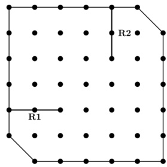

A. B. C. D. 3

：

Either one or both of the patterns can be used any number of times and in any orientation to construct a new pattern. Which one of the options below cannot be constructed by using only these two -tile patterns assuming there are no overlaps among them?

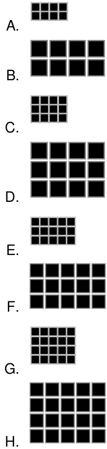

A black square PQRS has been cut into two parts. One part of it is shown in Panel Which one of the shapes in Panel  is the other part?

Panel I Panel II R H H 5 (i) (ii) L 5 (iii) (iv)

A. (i) B. 11 C. (ii) D. (iv)

# Answer Keys

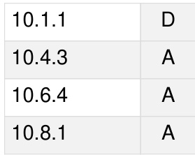

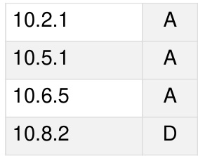

Syllabus: English grammar, Sentence completion. Verbal analogies, Word groups. Instructions, Critical reasoning and Verbal deduction

MarkDistribution in Previous GATE   
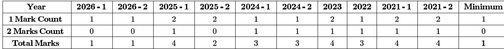

Welcome to the "General Aptitude: Verbal Aptitude" chapter of your GATE Computer Science exam preparation. This section is designed to equip you with the essential linguistic and reasoning skills necessary to excel in the verbal aptitude segment of the GATE exam. Verbal Aptitude assesses your comprehension of English language, grammar, vocabulary, and logical reasoning abilities, which are crucial not just for the exam but also for effective communication in your professional career. Typically, verbal aptitude questions constitute a significant portion (around 5-8 marks out of 15 for General Aptitude) and can range from direct vocabulary and grammar questions to more complex reading comprehension and logical deduction problems. Mastering these topics can significantly boost your overall GATE score.

# Topic-wise Key Concepts

# Antonyms

Definition and core idea: Antonyms are words that have opposite meanings. Understanding antonyms enhances vocabulary and comprehension by highlighting contrasts in meaning.

# Key properties and identities:

Antonyms can be absolute (e.g., hot/cold) or relative (e.g., happy/sad). 。 Often formed by adding prefixes (e.g., un-, dis-, in-, im-, non-) to a word. 。 Context is crucial; a word can have different antonyms depending on its u

# Common pitfalls:

Choosing a word that is merely different, not opposite. Ignoring prefixes/suffixes that might indicate an antonym. O Misinterpreting the nuance of the given word.

# Standard problem-solving techniques:

1. Understand the exact meaning of the given word.   
2. Look for prefixes that reverse meaning (e.g., capable $\scriptscriptstyle - >$ incapable).   
3. Consider the context if the word has multiple meanings.   
4. Eliminate options that are synonyms or unrelated.   
5. If unsure, try to use the options in a sentence to see which one creates an opposite meaning.

# Articles

Definition and core idea: Articles are words (a, an, the) that define whether a noun is specific or unspecific. They are determiners that precede nouns.

Important formulas, theorems, and results:

1. Indefinite Article 'a': Used before singular, countable nouns that begin with a consonant sound. E.g., $a$ , $a$ university (starts with 'y' sound).   
2. Indefinite Article 'an': Used before singular, countable nouns that begin with a vowel sound. E.g., , (starts with 'o sound).   
3. Definite Article 'the': Used before specific or unique nouns, or nouns that have been previously mentioned. E.g., , the book I read yesterday.   
4. Zero Article: No article is used before plural countable nouns, uncountable nouns, proper nouns, or abstract nouns when speaking generally. E.g., , students learn.

# Key properties and identities:

□ 'A' and 'an' are used for general or non-specific items. 'The' is used for specific or previously identified items.   
。 Sound, not spelling, determines 'a' vs. 'an'.

Common pitfalls: Confusing 'a' and 'an' based on spelling rather than sound.

Overusing 'the' with general nouns or proper nouns.   
Omitting articles where they are required for singular countable nouns.

# Standard problem-solving techniques:

1. Identify if the noun is singular/plural, countable/uncountable.   
2. Determine if the noun is specific or general in the context.   
3. Pay attention to the initial sound of the word following the article.   
4. Check for common phrases or idioms that require specific article usage.

# Comparative Forms

Definition and core idea: Comparative forms of adjectives and adverbs are used to compare two things, while superlative forms are used to compare three or more things.

Important formulas, theorems, and results:

1. One-syllable adjectives/adverbs: Add -er for comparative, -est for superlative. E.g., $t a l l  t a l l e r  t a l l e s t .$   
2. Two-syllable adjectives ending in -y: Change -y to $- \dot { I }$ and add -er/-est. E.g., $h a p p y  h a p p i e r  h a p p i e s t .$   
3. Two or more syllable adjectives/adverbs: Use more for comparative, most for superlative. E.g., beauti ful $$ more beautiful $$ most beautiful.   
4. Irregular forms: Some words have irregular comparative/superlative forms. E.g., $g o o d  b e t t e r  b e s t \$ $b a d  w o r s e  w o r s t$ ; /many → more → most.

5. Comparison structure: Comparative forms are often followed by than. E.g., $X$ is taller than $Y$ .

Key properties and identities: Do not use double comparatives/superlatives (e.g., "more happier" is incorrect). Ensure logical comparison (comparing like with like).

# Common pitfalls:

0 Using "more" or "most" with -er or -est endings. Incorrectly forming irregular comparatives/superlatives. Making illogical comparisons (e.g., "My car is faster than John")

# Standard problem-solving techniques:

1. Count the syllables of the adjective/adverb.   
2. Check for irregular forms.   
3. Ensure the comparison is grammatically and logically sound.

# English Grammar

Definition and core idea: English grammar refers to the set of structural rules governing the composition of clauses, phrases, and words in the English language. It ensures clarity and correctness in communication.

Important formulas, theorems, and results:

1. Basic Sentence Structure:  (SVO) is the most common structure. E.g., She reads a book.   
2. Parts of Speech: Nouns, Pronouns, Verbs, Adjectives, Adverbs, Prepositions, Conjunctions, Interjections. Each has specific roles.   
3. Subject-Verb Agreement: The verb must agree in number with its subject. E.g., $H e$ (singular); (plural).   
4. Tense Consistency: Maintain a consistent tense throughout a sentence or paragraph unless there's a specific reason to change.   
5. Parallelism: Similar items in a series or comparison should be in the same grammatical form. E.g., Helikes swimming, hiking,and cycling.

Key properties and identities: 。 Grammar provides the framework for meaningful sentences. Correct grammar prevents ambiguity and misinterpretation.

Common pitfalls:

Errors in subject-verb agreement, pronoun agreement, and tense usage.   
Lack of parallelism.   
Misplaced modifiers.   
Incorrect punctuation.

# Standard problem-solving techniques:

1. Break down the sentence into its core components (subject, verb, object).   
2. Identify the part of speech for each word.   
3. Check for agreement (subject-verb, pronoun-antecedent).   
4. Look for consistency in tense and structure.   
5. Read the sentence aloud to catch awkward phrasing or obvious errors.

# Grammatical Error

Definition and core idea: Grammatical errors are mistakes in the structure or usage of language that violate standard English grammar rules. Identifying and correcting them is key to effective communication.

# Key properties and identities:

Common error types include subject-verb agreement, pronoun agreement, tense consistency, parallelism, misplaced modifiers, comma splices, run-on sentences, fragment sentences, and incorrect word choice.

Common pitfalls: Overlooking subtle errors, especially in complex sentences. 0 Focusing only on obvious errors and missing nuanced ones. 。 Not knowing the specific rule being tested.

# Standard problem-solving techniques:

1. Read the sentence carefully, looking for any awkward phrasing.   
2. Check for subject-verb agreement (singular subject, singular verb; plural subject, plural verb).   
3. Verify pronoun-antecedent agreement (pronoun matches the noun it refers to in number and gender).   
4. Ensure tense consistency throughout the sentence.   
5. Look for parallel structure in lists or comparisons.   
6. Identify misplaced or dangling modifiers.   
7. Check for correct use of articles, prepositions, and conjunctions.   
8. Consider punctuation errors.

# Incorrect Sentence Part

Definition and core idea: This question type presents a sentence divided into several parts, one of which contains a grammatical error. The task is to identify the erroneous part.

# Key properties and identities:

Errors can span any grammatical rule: subject-verb agreement, tense, pronouns, articles, prepositions, parallelism, vocabulary, etc.   
Often, the error is subtle and requires careful attention to detail.

Common pitfalls: 。 Rushing through the sentence and missing the error. 0 Fixating on one type of error and ignoring others. 0 Assuming a part is correct because it "sounds" okay.

# Standard problem-solving techniques:

1. Read the entire sentence first to understand its meaning and flow.   
2. Examine each part individually, checking for common grammatical e

Subject-Verb Agreement: Does the verb match the subject in number?   
Tense: Is the tense consistent and appropriate for the context?   
Pronouns: Do pronouns agree with their antecedents in number, gender, and case?   
Articles/Prepositions: Are they used correctly?   
Parallelism: Are items in a list or comparison structured similarly?   
Word Choice/Vocabulary: Is the correct word used (e.g., affect vs. effect)?   
Modifiers: Are adjectives and adverbs placed correctly?

3. If no error is found, consider the "No Error" option if available

# Most Appropriate Word

Definition and core idea: This involves choosing the word that best fits the meaning and context of a given sentence or passage from a set of options.

# Key properties and identities:

。 Requires strong vocabulary and understanding of nuances in word meanings. Context is paramount; a word might be grammatically correct but semantically inappropriate.

Common pitfalls:

Choosing a word that is a near-synonym but doesn't fit the exact context.   
Ignoring the tone or register of the sentence.   
Misinterpreting the overall meaning of the sentence.

# Standard problem-solving techniques:

1. Read the sentence carefully to grasp its full meaning and tone.   
2. Consider the part of speech required for the blank (noun, verb, adjective, adverb).   
3. Substitute each option into the sentence.   
4. Evaluate which option makes the most sense semantically and grammatically.   
5. Look for collocations (words that naturally go together) or idiomatic expressions.   
6. Eliminate options that are clearly incorrect in meaning or grammar.

# Narrative Sequencing

Definition and core idea: This task involves arranging a set of jumbled sentences or paragraphs into a coherent and logical narrative sequence.

# Key properties and identities:

A coherent narrative follows a logical progression, often chronological, cause-and-effect, or problem-solution.   
Transition words and pronouns are crucial clues.

Common pitfalls: Ignoring transition words or pronoun references. Focusing only on the first sentence and not the overall flow. 。 Assuming a chronological order when a different logical order is intended.

Standard problem-solving techniques:

1. Identify the opening sentence: Look for sentences that introduce a topic, character, or setting, often without pronouns or conjunctions referring to previous sentences.

2. Identify transition words/phrases: Words like however, therefore, meanwhile, subsequently, in addition, finally, etc., indicate relationships between sentences.

3. Look for pronoun references: A pronoun (he, she, it, they, this, that) must refer back to a noun introduced in a previous sentence.

4. Establish cause-and-effect or chronological order: Determine if events follow a time sequence or if one event leads to another.

5. Identify the concluding sentence: Look for sentences that summarize or provide a final thought.

6. Form pairs: Try to identify two sentences that logically follow each other.

7. Read the assembled sequence: Once you have an order, read it through to ensure it flows logically and makes sense.

# Noun Verb Adjective

Definition and core idea: This topic focuses on understanding the definitions, functions, and interrelationships of nouns (naming words), verbs (action/state words), and adjectives (describing words).

# Important formulas, theorems, and results:

1. Noun: Names a person, place, thing, or idea. Can be subject or object. E.g., . 2. Verb: Expresses an action, occurrence, or state of being. E.g., . 3. Adjective: Modifies or describes a noun or pronoun. Answers questions like "which one?", "what kind?", "how many?". E.g., .

4. Common Suffixes:

Nouns: -tion, -sion, -ment, -ness, -ity, -ance, -ence, -er, -or (e.g.,   
information,development, happiness).   
Verbs: -ate, -ify, -ize, -en (e.g., activate, simplify, modernize).   
Adjectives: -ful, -less, -able, -ible, -ous, -ic, -al, -y (e.g., ).

Key properties and identities:

A word's function (noun, verb, adjective) can change based on context (e.g., "run" as a verb vs. "a run" as a noun). Understanding these parts of speech is fundamental to sentence construction and error identification.

# Common pitfalls:

。 Confusing words that have similar forms but different parts of speech (e.g., "advice" (noun) vs. "advise" (verb)).   
。 Incorrectly identifying the function of a word in a sentence.

# Standard problem-solving techniques:

1. Identify the word's role in the sentence (e.g., is it naming something, performing an action, or describing something?).   
2. Look for common suffixes that indicate a specific part of speech.   
3. Test the word by replacing it with a clear example of a noun, verb, or adjective to see if the sentence structure

remains valid.

# Passage Reading

Definition and core idea: This involves reading a given passage and answering comprehension questions based on its content, including main idea, specific details, inference, and author's tone.

# Key properties and identities:

。 Questions can be direct (explicitly stated in the text) or inferential (requiring logical deduction from the text).   
。 Understanding the main idea and supporting details is crucial.

Common pitfalls: Reading too slowly or too quickly without comprehension. Making assumptions not supported by the text. Getting bogged down by unfamiliar vocabulary. 0 Misinterpreting the author's intent or tone.

Standard problem-solving techniques:

1. Skim the passage first: Read quickly to get a general idea of the topic, main argument, and structure. Pay attention to the first and last sentences of paragraphs.   
2. Read the questions: Understand what information you need to find. This helps you focus your reading.   
3. Scan for keywords: For specific detail questions, scan the passage for keywords from the question.   
4. Read carefully for answers: When you locate relevant sections, read them thoroughly to understand the context and find the exact answer.   
5. Inferential questions: Look for clues, implications, and logical connections within the text. Avoid bringing in outside knowledge.   
6. Main idea questions: Often found in the introduction or conclusion, or can be derived from summarizing the key points.   
7. Vocabulary in context: Use surrounding words and sentences to deduce the meaning of unfamiliar words.

# Phrasal Verb

Definition and core idea: A phrasal verb is a verb combined with a preposition or an adverb (or both) to create a new meaning that is often different from the original verb's meaning.

# Important formulas, theorems, and results:

1. Verb + Preposition (e.g., $\mathbf { \sigma } = \mathbf { \sigma }$ care for)   
2. $V e r b + A d \bar { v } e r b$ ， (e.g., break down $\mathbf { \tau } = \mathbf { \tau }$ stop functioning)   
3. Verb + Adverb + (e.g., up to $\mathbf { \sigma } = \mathbf { \sigma }$ admire)

Key properties and identities: 。 Meanings are often idiomatic and cannot be deduced from the individual words. Can be separable (object can go between verb and particle) or inseparable.

Common pitfalls: Assuming the literal meaning of the words. Confusing similar-looking phrasal verbs. Incorrectly using separable/inseparable phrasal verbs.

# Standard problem-solving techniques:

1. Memorize common phrasal verbs and their meanings.   
2. Pay close attention to the context of the sentence to infer meaning.   
3. If unsure, try to replace the phrasal verb with a single-word synonym to see if it fits.

# Phrase Meaning

Definition and core idea: This involves understanding the meaning of idiomatic expressions, proverbs, or common phrases that often have a figurative meaning different from the literal interpretation of their individual words.

Key properties and identities: 。 Idioms are non-literal and culturally specific. 。 Context is vital for interpreting the correct nuance of a phrase.

Common pitfalls: 。 Interpreting phrases literally. Confusing similar-sounding idioms. 0 Not recognizing the figurative nature of the expression.

Standard problem-solving techniques:

1. Read the sentence containing the phrase carefully to understand the overall context.   
2. If the phrase is unfamiliar, try to infer its meaning from the surrounding words and the situation described.   
3. Consider the options provided and see which one logically fits the context.   
4. Eliminate options that represent a literal interpretation or are completely irrelevant.   
5. Familiarity with common idioms and proverbs is the best preparation.

# Prepositions

Definition and core idea: Prepositions are words that show the relationship between a noun or pronoun and other words in a sentence, indicating location, time, direction, or manner.

Important formulas, theorems, and results:

1. Prepositions of Place:

: for enclosed spaces, cities, countries (e.g., the room, ).   
■ : for surfaces, streets, specific days (e.g., , ).   
■ : for specific points, addresses, events (e.g., corner, ).

# 2. Prepositions of Time:

: for months, years, seasons, long periods (e.g., , ).   
■ : for specific days, dates (e.g., Friday, August ).   
□ : for specific times (e.g., , ).

3. Prepositions of Direction: to,into,onto, from,through,across. E.g., , jump into the water

4. Fixed Prepositional Phrases: Many verbs, adjectives, and nouns are followed by specific prepositions (e.g., afraid , , good ).

Key properties and identities:

Prepositions always introduce a prepositional phrase, which includes a noun or pronoun (the object of the preposition).   
Their usage is often idiomatic and requires memorization.

Common pitfalls:

Confusing prepositions with similar meanings (e.g., "between" vs. "amon 。 Incorrectly using fixed prepositional phrases. Omitting necessary prepositions or adding unnecessary ones.

Standard problem-solving techniques:

1. Identify the relationship the preposition is trying to express (place, time, direction, etc.).   
2. Check if the verb, adjective, or noun preceding the blank requires a specific preposition.   
3. Consider the context and the object of the preposition.   
4. Memorize common fixed prepositional phrases.

# Pronouns

Definition and core idea: Pronouns are words that replace nouns to avoid repetition. They must agree with the nouns they refer to (antecedents) in number, gender, and case.

Important formulas, theorems, and results:

1. Types of Pronouns:

Personal:  (subjective); (objective).   
Possessive: .   
Reflexive/Intensive: myself,yourself,himself,herself,itself,ourselves,yourselves,themselves.   
Relative: who,whom, whose,which,that.   
Demonstrative: .   
Indefinite: nothing, all, many, few.

2. Pronoun-Antecedent Agreement: A pronoun must agree with its antecedent in number (singular/plural) and gender (masculine/feminine/neuter). E.g., . Thestudents submitted their assignments.

3. Pronoun Case:

Subjective Case: Used when the pronoun is the subject of a verb (e.g., ). Objective Case: Used when the pronoun is the object of a verb or preposition (e.g., , Giveitto me).

Key properties and identities: 。 Pronouns clarify sentences by preventing redundancy. Correct pronoun usage is essential for grammatical accuracy.

# Common pitfalls:

。 Incorrect agreement in number or gender with the antecedent.   
Confusing subjective and objective cases (e.g., "between you and I" instead of "between you and me").   
Ambiguous pronoun reference (unclear what noun the pronoun refers to).   
。 Using "its" (possessive) vs. "it's" (it is).

# Standard problem-solving techniques:

1. Identify the pronoun and its antecedent (the noun it replaces).   
2. Check for agreement in number (singular/plural) and gender.   
3. Determine if the pronoun is acting as a subject or an object to choose the correct case.   
4. Ensure the pronoun's reference is clear and unambiguous.

# Sentence Ordering

Definition and core idea: Similar to Narrative Sequencing, this involves arranging jumbled parts of a single sentence (or a short paragraph) into a grammatically correct and logically coherent order.

# Key properties and identities:

Focuses on sentence structure, grammatical rules, and logical flow within a single sentence or a very short set of related sentences. Often involves identifying the subject, verb, and object, and then arranging modifiers correctly.

# Common pitfalls:

Creating grammatically incorrect structures.   
Producing a sentence that is grammatically correct but makes no logical sense.   
Misplacing modifiers, leading to ambiguity.

Standard problem-solving techniques:

1. Identify the subject and main verb: These usually form the core of the sentence.   
2. Look for introductory phrases/clauses: These often come at the beginning.   
3. Identify conjunctions: Words like and, but, or, because, while connect clauses or phrases.   
4. Check for pronoun references: Ensure pronouns follow their antecedents.   
5. Consider logical flow: What event or idea logically precedes another?   
6. Read the assembled sentence: Ensure it is grammatically correct, makes sense, and flows naturally.

# Statement Sufficiency

Definition and core idea: In this type of question, a question is given, followed by two or more statements. You need to determine whether the information in the statements is sufficient to answer the question.

# Key properties and identities:

。 Focus is on sufficiency, not necessarily on finding the answer itself.   
Statements are evaluated independently first, then together if neither is sufficient alone.

Common pitfalls: Trying to solve the question instead of just checking sufficiency. 。 Assuming information not explicitly given in the statements. 。 Incorrectly combining statements.

Standard problem-solving techniques:

1. Analyze the question: Understand exactly what information is required to answer it.   
2. Evaluate Statement 1 alone: Can the question be answered using only the information in Statement 1? Ignore Statement 2.   
3. Evaluate Statement 2 alone: Can the question be answered using only the information in Statement 2? Ignore Statement 1.   
4. Evaluate Statements 1 and 2 together: If neither statement alone is sufficient, check if combining them provides enough information.

5. Select the appropriate option:

Statement 1 alone is sufficient.   
Statement 2 alone is sufficient.   
Either Statement 1 alone or Statement 2 alone is sufficient.   
Both Statement and Statement 2 together are sufficient (but neither alone).   
Neither Statement 1 nor Statement 2 nor both together are sufficient.

# Statements Follow

Definition and core idea: This involves analyzing a set of given statements (premises) and determining which conclusion(s) logically follow from them, often based on principles of deductive reasoning.

Important formulas, theorems, and results:

1. Deductive Reasoning: If the premises are true, the conclusion must be true. Example: All A are B. All B are C. Therefore, All A are C.

2. Categorical Syllogisms: Often involve "All," "No," "Some" statements. All X are Y (Universal Affirmative) (Universal Negative) Some (Particular Affirmative) Some X are not (Particular Negative)

3. Venn Diagrams: A useful tool for visually representing relationships between categories and testing the validity of conclusions.

Key properties and identities: Conclusions must be derived solely from the given statements, without external knowledge. Focus on logical necessity, not probability or common sense.

# Common pitfalls:

Bringing in outside knowledge or personal opinions.   
Making assumptions not supported by the statements.   
Confusing "some" with "all" or "none.   
Errors in interpreting negative statements.

Standard problem-solving techniques:

1. Read statements carefully: Understand the exact meaning of each premise.   
2. Use Venn Diagrams: Draw circles to represent the categories and their relationships as described by the statements.   
3. Test each conclusion: Check i the conclusion is necessarily true based on your diagram or logical deduction. If there's even one scenario where the conclusion is false, it does not follow.   
4. Avoid assumptions: Stick strictly to the information provided in the statements.

# Synonyms

Definition and core idea: Synonyms are words that have the same or very similar meanings. Understanding synonyms expands vocabulary and allows for varied expression.

# Key properties and identities:

。 Few words are perfect synonyms; most have slightly different connotations or contexts of use.   
Can often be identified by root words, prefixes, and suffixes.

Common pitfalls: Choosing a word that is related but not a true synonym. Ignoring the context in which the word is used. Misinterpreting the nuance of the given word.

# Standard problem-solving techniques:

1. Understand the precise meaning of the given word.   
2. Consider the context if the word has multiple meanings.   
3. Look for words with similar roots or derivations.   
4. Substitute each option into a sentence where the original word is used to see which one fits best.   
5. Eliminate options that are antonyms or unrelated.

# Tenses

Definition and core idea: Tenses indicate the time an action occurs (past, present, future) and its aspect (simple, continuous, perfect, perfect continuous), showing whether an action is completed, ongoing, or habitual.

Important formulas, theorems, and results:

1. Simple Present: $S + V 1 + ( s / e s )$ (for 3rd person singular). Used for habits, facts, scheduled events. E.g., He walks.   
2. Present Continuous: $S + i s / a m / a r e + V - i n g$ . Used for actions happening now or temporary actions. E.g., $H e$ is walking.   
3. Present Perfect: $S + h a s / h a v e + V 3$ . Used for actions completed in the past but with present relevance. E.g., $H e$ has walked.   
4. Present Perfect Continuous: $S + h a s / h a v e + b e e n + V - i n g$ . Used for actions that started in the past and continue to the present. E.g., $H e$ has been walking.

5. Simple Past: $S + V 2$ . Used for completed actions in the past. E.g., .

6. Past Continuous: $S + w a s / w e r e + V - i n g$ . Used for actions ongoing in the past. E.g., $H e$ was walking. 7. Past Perfect: $S + h a d + V 3 .$ Used for an action completed before another past action. E.g., before arrived.

8. Past Perfect Continuous: $S + h a d + b e e n + V - i n g$ . Used for an action ongoing up to a point in the past. E.g., $H e$ for an hour when saw him.

9. Simple Future: $S + w i l l / s h a l l + V 1$ . Used for future actions. E.g., walk.

10. Future Continuous: $S + w i l l / s h a l l + b e + V - i n g$ . Used for actions ongoing at a specific time in the future. E.g., $H e$ will be walking.

11. Future Perfect: $S + w i l \bar { l } / s h a l l + h a v e + V 3$ . Used for actions that will be completed by a certain time in the future. E.g., $H e$ will have walked $1 0 \mathsf { k m }$ by then.

12. Future Perfect Continuous: $S + w i l l / s h a l l + h a v e + b e e n + V - i n g$ . Used for actions that will have been ongoing up to a point in the future. E.g., $H e$ for two hours.

# Key properties and identities:

Tense consistency is crucial within a sentence or paragraph.   
Time markers (e.g., yesterday, now, next week, since, for) often indicate the appropriate tense.

Common pitfalls: Incorrectly mixing tenses within a sentence. Confusing similar tenses (e.g., simple past vs. present perfect). Incorrect verb forms (V1, V2, V3).

# Standard problem-solving techniques:

1. Identify the time frame of the action (past, present, future).   
2. Determine the aspect (simple, continuous, perfect, perfect continuous) based on whether the action is   
completed, ongoing, or has relevance to another time.   
3. Look for time expressions or other verbs in the sentence that provide clues about the correct tense.   
4. Ensure tense consistency, especially in complex sentences or reported speech.

# Verbal Reasoning

Definition and core idea: Verbal Reasoning assesses the ability to understand and logically process information presented in words, including analogies, critical reasoning, and logical deduction from textual information.

# Key properties and identities:

Requires analytical thinking and the ability to identify patterns, relationships, and logical fallacies.   
Often involves drawing conclusions, identifying assumptions, or evaluating arguments.

# Common pitfalls:

Making assumptions not explicitly stated.   
Confusing correlation with causation.   
Allowing personal bias to influence judgment.   
Misinterpreting logical connectors (e.g., "if...then," "unless").

Standard problem-solving techniques:

1. Read carefully: Understand the exact meaning of all statements and the question.   
2. Identify the core argument/relationship: For analogies, determine the relationship between the first pair. For critical reasoning, identify the premise(s) and conclusion.   
3. Break down complex statements: Simplify sentences to their core logical components.   
4. Look for keywords: Words like therefore, because, however, if, then, unless, all, some, none are crucial for logical deduction.   
5. Test options: For multiple-choice questions, evaluate each option against the given information.   
6. Avoid outside knowledge: Base your reasoning strictly on the provided text.

# Word Meaning

Definition and core idea: This involves understanding the precise definition of a word, often in a given context, and choosing the option that best reflects that meaning.

# Key properties and identities:

。 Words can have multiple meanings; context determines the relevant one.   
。 Knowledge of root words, prefixes, and suffixes can help deduce meanings.

Common pitfalls: Choosing a common meaning of a word when the context implies a less common one. Misinterpreting the nuance or connotation of a word.

Ignoring contextua clues.

# Standard problem-solving techniques:

1. Read the sentence or phrase containing the word carefully.   
2. Try to infer the meaning of the word from its context (surrounding words, overall sentence meaning).   
3. Look for synonyms or antonyms within the sentence that might provide clues.   
4. Break down the word into its root, prefix, and suffix if applicable.   
5. Substitute each option into the sentence to see which one makes the most sense.   
6. Eliminate options that are clearly incorrect or irrelevant.

# Word Pairs

Definition and core idea: This question type presents a pair of words that share a specific relationship, and you must identify another pair of words from the options that shares the same relationship (analogies).

Important formulas, theorems, and results:   
1. Common Relationship Types: Synonym: Happy : Joyful Antonym: Hot Cold Part-Whole: Hand Cause-Effect: Rain Flood Tool-User: Writer Object-Function: Knife Cut Category-Member: Fruit Apple Intensity: Warm Hot Producer-Product: Baker Bread Action-Object: Read Book

# Key properties and identities:

。 The relationship must be consistent across both pairs.   
The order of words in the pair often matters (e.g., cause-effect is different from effect-cause).

# Common pitfalls:

Identifying a weak or incorrect relationship in the original pair.   
Finding a relationship in the options that is similar but not identical to the original.   
Ignoring the order of the words in the pair.

Standard problem-solving techniques:

1. Identify the precise relationship: Clearly define how the two words in the given pair are related. Be specific (e.g., "is a type of," "is used to," "is the opposite of").   
2. Formulate a sentence: Create a simple sentence that expresses the relationship (e.g., "A finger is a part of a hand").   
3. Apply the sentence to options: Test each option by plugging its words into your sentence. The option that fits best is likely the answer.   
4. Consider nuances: If multiple options seem plausible, re-evaluate the strength and specificity of the relationship.   
5. Check for order: Ensure the order of the words in the option pair matches the order of the relationship in the original pair.

# Quick Formula Reference

For Verbal Aptitude, "formulas" refer to core rules, structures, and patterns. Here's a consolidated list:

# Articles:

0 'a': Singular, countable, consonant sound.   
0 'an': Singular, countable, vowel sound.   
'the': Specific, unique, or previously mentioned.   
□ Zero Article: General plural/uncountable/abstract nouns, proper nouns.

Comparative Forms: 1-syllable: $A d j + - e r / - e s t$ 2-syllable ending in -y: $\dot { A d j } ( - y  - i ) + - e r / - e s t$ $^ { 2 + }$ syllables: $\mathit { \Delta } ^ { \prime } m o s t + A d j$ 。 Irregular: good → better $$ , $b a d  w o r s e  w o r s t$ , etc.

English Grammar (Core): Sentence Structure: ${ \dot { S } } + V + O$ (common).

Subject-Verb Agreement: $s \to$ SingularV PluralS → PluralV.   
Tense Consistency: Maintain consistent tense.   
Parallelism: Similar items in same grammatical form.

# Pronouns:

Agreement: Pronoun matches antecedent in number, gender.   
Case: Subjective $( I , h e , s h e , w e , t h e y )$ for subjects; Objective ( ) for objects.

Tenses (Basic Structures): Simple Present: $S + V 1 + ( s / e s )$ Present Continuous: $S + i s / a m / a r e + V - i n g$ Present Perfect: $S + h a s / h a v e + V 3$ Simple Past: $S + V 2$ Past Continuous: $S + w a s / w e r e + V - i n g$ Past Perfect: $S + h a d + V 3$ Simple Future: $S + w i l l / s h a l l + V 1$

. Phrasal Verbs: (often idiomatic meaning).   
Statement Sufficiency: Evaluate Statement 1 alone, then Statement 2 alone, then both together.   
Statements Follow (Deductive Logic): If  and Premise2 are true, then  MUST be true.   
Use Venn Diagrams.   
Word Pairs (Analogies): Identify the specific relationship $A : B$ and find $C : D$ with the same relationship.

# Important Tips for GATE

1. Build a Strong Vocabulary: Many questions (Synonyms, Antonyms, Word Meaning, Most Appropriate Word, Word Pairs, Phrasal Verbs, Phrase Meaning) directly test vocabulary. Read widely, use flashcards, and learn root words, prefixes, and suffixes.

2. Master Grammar Rules: Questions on Articles, Comparative Forms, English Grammar, Grammatical Error, Incorrect Sentence Part, Prepositions, Pronouns, and Tenses require a solid understanding of fundamental grammar. Practice identifying common errors.

3. Read Actively and Critically: For Passage Reading, Narrative Sequencing, and Verbal Reasoning, don't just read passively. Actively look for main ideas, supporting details, logical connections, transition words, and author's tone. Practice skimming and scanning.

4. Context is King: For vocabulary-based questions and even grammar, the context of the sentence or passage is crucial. A word's meaning or the correct grammatical form can change depending on its usage. Always read the full sentence.

5. Practice Time Management: Verbal Aptitude questions can be time-consuming, especially Passage Reading and Sentence Ordering. Practice solving questions under timed conditions to improve speed and accuracy. Don't get stuck on one question; move on and return if time permits.

6. Eliminate Options Strategically: For multiple-choice questions, if you're unsure of the answer, try to eliminate obviously incorrect options first. This increases your chances of selecting the correct answer, especially if negative marking is less severe.

7. Don't Overthink Verbal Reasoning: For Statement Sufficiency and Statements Follow, stick strictly to the information given in the statements. Do not bring in outside knowledge or make assumptions. Focus purely on logical deduction.

8. Review Common Pitfalls: Be aware of common errors like subject-verb agreement, pronoun-antecedent agreement, tense shifts, double comparatives, and literal interpretation of idioms. Regularly review these tricky areas.

# 11.1 Antonyms (7)

✍ Practice Test: Test 1 (7Q)

Choose the word that is opposite in meaning to the word “coherent”.

A. sticky B. well-connected C. rambling D. friendly

gatecse-2014-set3 verbal-aptitude antonyms easy

The antonym of the word protagonist is

A. agnostic B. antagonist C. arsonist D. anarchist

gatecse-2026-set1 verbal-aptitude antonyms easy one-mark

Answer key☟

Verbosity $\because$ Brevity :: Insolence Choose the word that best fills the blank.

A. Innocence B. Respect C. Solace D. Wealth

gateda-2026 verbal-aptitude antonyms one-mark

11.1.5 Antonyms: GATE2011 AG: GA-2

Choose the word from the questions given below that is most nearly opposite in meaning to the given word: Frequency

A. periodicity B. rarity C. gradualness D. persistency

general-aptitude verbal-aptitude gate2011-ag antonyms

11.1.6 Antonyms: GATE2011 GG: GA-2

Choose the word from the options given below that is most nearly opposite in meaning to the given word:

# Polemical

A. imitative B. conciliatory C. truthful D. ideological

11.1.7 Antonyms: GATE2011 MN: GA-56

Choose the word from the options given below that is most nearly opposite in meaning to the given word: Deference

A. aversion B. resignation C. suspicion D. contempt

verbal-aptitude gate2011-mn antonyms

A. the security guard at a university B. a security guard at the university C. a security guard at university D. the security guard at the university

gatecse-2016-set2 verbal-aptitude english-grammar normal articles

Ravi had younger brother who taught at university. He was widely regarded as honorable man.

Select the option with the correct sequence of articles to fill in the blanks.

A. a;a;an B. the; an; a C. a;an;a D. an; an; a

gatecse2025-set1 verbal-aptitude articles easy one-mark

# Answer key☟

✍ Practice Test: Test (7Q)

# 11.3.1 Comparative Forms: GATE CSE 2015 Set GA Question:

Didn't you buy when you went shopping?

A. any paper B. much paper C. no paper D. a few paper

gatecse-2015-set1 verbal-aptitude easy english-grammar comparative-forms

Gauri said that she can play the keyboard her sister.

A. as well as B. as better as C. as nicest as D. as worse as

gatecse-2021-set2 verbal-aptitude comparative-forms one-mark

# Answer key☟

✍ Practice Tests: Test 1 (15Q) Test 2 (11Q)

# 11.4.1 English Grammar: GATE CSE 2015 Set 2 | GA Question: □

We our friends's birthday and we how to make it up to him.

A. completely forgot --- don't just B. forgot completely don't just know know   
C. completely forgot --- just don't D. forgot completely --- just don't know know

gatecse-2015-set2 verbal-aptitude easy english-grammar

Saturn is to be seen on a clear night with the naked eye.

A. enough bright B. bright enough C. as enough bright D. bright as enough

Raman is confident of speaking English six months as he has been practising regularly the last three weeks

A. during, for B. for, since C. for, in D. within, for

gatecse-2020 verbal-aptitude english-grammar one-mark

Consider the following sentences:

i. Everybody in the class is prepared for the exam.   
ii. Babu invited Danish to his home because he enjoys playing chess.

Which of the following is the CORRECT observation about the above two sentences?

A. (i) is grammatically correct and is unambiguous B. is grammatically incorrect and is unambiguous C. (i) is grammatically correct and is ambiguous D. (i) is grammatically incorrect and  is ambiguous

✍ Practice Test: Test (11Q)

# 11.5.1 Grammatical Error: GATE CSE 2012 Question: 59

Choose the grammatically INCORRECT sentence:

A. They gave us the money back less the service charges of Three Hundred rupees.   
B. This country’s expenditure is not less than that of Bangladesh.   
C. The committee initially asked for a funding of Fifty Lakh rupees, but later settled for a lesser sum.   
D. This country’s expenditure on educational reforms is very less.

Out of the following sentences, select the most suitable sentence with respect to grammar and usage:

A. Since the report lacked needed information, it was of no use to them.   
B. The report was useless to them because there were no needed information in it.   
C. Since the report did not contain the needed information, it was not real useful to them.   
D. Since the report lacked needed information, it would not had been useful to them.

gatecse-2015-set2 verbal-aptitude normal english-grammar grammatical-error

# 11.5.4 Grammatical Error: GATE CSE 2016 Set 1 GA Question: 01

Out of the following four sentences, select the most suitable sentence with respect to grammar and usage.

A. will not leave the place until the minister does not meet me.   
B. will not leave the place until the minister doesn't meet me.   
C. will not leave the place until the minister meet me.   
D. will not leave the place until the minister meets me.

gatecse-2016-set1 verbal-aptitude english-grammar easy grammatical-error

Choose the grammatically CORRECT sentence:

A. He laid in bed till o’clock in the morning.   
B. He layed in bed till  o’clock in the morning.   
C. He lain in bed till  o’clock in the morning.   
D. He lay in bed till  o’clock in the morning.

gate2012-ar verbal-aptitude english-grammar easy grammatical-error

Choose the grammatically CORRECT sentence:

A. Two and two add four. B. Two and two become four.   
C. Two and two are four. D. Two and two make four.

gate2013-ee english-grammar verbal-aptitude grammatical-error

Answer key☟

# 11.6.1 Incorrect Sentence Part: GATE CSE 2014 Set 3 GA Question: 1

While trying to collect an envelope from under the table, Mr. X fell down I Ⅱ Ⅲ   
was losing consciousness. IV   
Which one of the above underlined parts of the sentence is NOT appropriate?

B. 1 C. III D. IV gatecse-2014-set3 verbal-aptitude easy english-grammar incorrect-sentence-part

Which one of the parts (A, B, C, D) in the sentence contains an ERROR?

No sooner had the doctor seen the results of the blood test, than he suggested the patient to see the specialist.

A. no sooner had B. results of the blood test C. suggested the patient D. see the specialist

gate2012-ar verbal-aptitude incorrect-sentence-part

One of the parts $( A , B , C , D )$ in the sentence given below contains an ERROR. Which one of the following is INCORRECT?

# I requested that he should be given the driving test today instead of tomorrow.

A. requested that B. should be given C. the driving test D. instead of tomorrow

gate2012-cy verbal-aptitude incorrect-sentence-part

All engineering students should learn mechanics, mathematics and how to do computation. II III IV

Which of the above underlined parts of the sentence is not appropriate?

a. I b. II c. III d. IV

The professor ordered to the students to go out of the class. I Ⅱ Ⅲ IV Which of the above underlined parts of the sentence is grammatically incorrect?

A. I B. II C. III D. IV

gate2013-ce incorrect-sentence-part verbal-aptitude

# Answer key☟

✍ Practice Tests: Test (15Q) Test 10 (3Q) Test 2 (15Q) Test 3 (15Q) Test 4 (15Q) Test 5 (15Q) Test 6 (15Q) Test 7 (15Q) Test 8 (15Q) Test 9 (15Q)

# 11.7.1 Most Appropriate Word: GATE CSE 2010 Question: 56

Choose the most appropriate word from the options given below to complete the following sentence: His rather casual remarks on politics his lack of seriousness about the subject.

A. masked B. belied C. betrayed D. suppressed

gatecse-2010 verbal-aptitude most-appropriate-word normal

A. uphold B. restrain C. cherish D. conserve

Choose the most appropriate word(s) from the options given below to complete the following sentence.   
contemplated Singapore for my vacation but decided against it.

A. to visit B. having to visit C. visiting D. for a visit

gatecse-2011 verbal-aptitude most-appropriate-word easy

# 11.7.4 Most Appropriate Word: GATE CSE 2011 Question: 59

Choose the most appropriate word from the options given below to complete the following sentence. If you are trying to make a strong impression on your audience, you cannot do so by being understated, tentative or

A. hyperbolic B. restrained C. argumentative D. indifferent

gatecse-2011 verbal-aptitude most-appropriate-word normal

# 11.7.5 Most Appropriate Word: GATE CSE 2012 Question: 57

Choose the most appropriate alternative from the options given below to complete the following sentence: Despite several the mission succeeded in its attempt to resolve the conflict.

A. attempts B. setbacks C. meetings D. delegations

gatecse-2012 verbal-aptitude easy most-appropriate-word

# 11.7.6 Most Appropriate Word: GATE CSE 2012 Question: 60

Choose the most appropriate alternative from the options given below to complete the following sentence: Suresh’s dog is the one was hurt in the stampede.

A. that B. which C. who D. whom

gatecse-2012 verbal-aptitude most-appropriate-word normal

# 1.7.7 Most Appropriate Word: GATE CSE 2014 Set 1 GA Question: 2

Choose the most appropriate word from the options given below to complete the following sentence.

She could not understand the judges awarding her the first prize, because she thought that her performance was quite

A. superb B. medium C. mediocre D. exhilarating

gatecse-2014-set1 verbal-aptitude most-appropriate-word easy

Choose the most appropriate phrase from the options given below to complete the following sentence. India is a post-colonial country because

A. it was a former British colony   
B. Indian Information Technology professionals have colonized the world   
C. India does not follow any colonial practices   
D. India has helped other countries gain freedom

A generic term that includes various items of clothing such as a skirt, a pair of trousers and a shirt is

A. fabric B. textile C. fiber D. apparel

gatecse-2015-set2 verbal-aptitude easy most-appropriate-word

# 11.7.10 Most Appropriate Word: GATE CSE 2015 Set 3 GA Question: 3

Extreme focus on syllabus and studying for tests has become such a dominant concern of Indian student that they close their minds to anything to the requirements of the exam.

A. related B. extraneous C. outside D. useful

gatecse-2015-set3 verbal-aptitude normal most-appropriate-word

# 11.7.11 Most Appropriate Word: GATE CSE 2016 Set 1 GA Question: 03

Archimedes said, "Give me a lever long enough and a fulcrum on which to place it, and I will move the world."   
The sentence above is an example of a statement.

A. figurative B. collateral C. literal D. figurine

gatecse-2016-set1 verbal-aptitude normal most-appropriate-word

Research in the workplace reveals that people work for many reasons

A. money beside B. beside money C. money besides D. besides money

gatecse-2017-set1 general-aptitude verbal-aptitude english-grammar most-appropriate-word

# 11.7.13 Most Appropriate Word: GATE CSE 2018 GA Question: 1

"From where are they bringing their books? bringing books from The words that best fill the blanks in the above sentence are

A. Their, they're, there B. They're, their, there C. There, their, they're D. They're, there,there

gatecse-2018 verbal-aptitude most-appropriate-word easy one-mark

# 11.7.14 Most Appropriate Word: GATE CSE 2018 GA Question: 2

A investigation can sometimes yield new facts, but typically organized ones are more successful. The word that best fills the blank in the above sentence is

A. meandering B. timely C. consistent D. systematic

The expenditure on the project as follows: equipment Rs. lakhs, salaries Rs. lakhs, and contingency Rs.  lakhs.

A. break down B. break C. breaks down D. breaks

gatecse-2019 general-aptitude verbal-aptitude most-appropriate-word one-mark

# 11.7.16 Most Appropriate Word: GATE CSE 2019 GA Question: 2

The search engine’s business model around the fulcrum of trust.

A. revolves B. plays C. sinks D. bursts

gatecse-2019 general-aptitude verbal-aptitude most-appropriate-word one-mark

# Answer key☟

# 11.7.17 Most Appropriate Word: GATE CSE 2019 GA Question: 5

A court is to a judge as is to a teacher

A. student B. a punishment C. a syllabus D. a school

gatecse-2019 general-aptitude verbal-aptitude most-appropriate-word one-mark

Answer key☟

# 11.7.18 Most Appropriate Word: GATE CSE 2022 GA Question:

The is too high for it to be considered

A. fair / fare B. faer fair C. fare fare D. fare / fair

gatecse-2022 verbal-aptitude most-appropriate-word one-mark

# 11.7.19 Most Appropriate Word: GATE CSE 2023 GA Question:

We reached the station late, and missed the train.

A. near B. nearly C. utterly D. mostly

gatecse-2023 verbal-aptitude most-appropriate-word one-mark

# 1.7.20 Most Appropriate Word: GATE CSE 2024 Set 1 GA Question:

${ \mathfrak { H } } ^ { \prime } \to ^ { \prime }$ denotes increasing order of intensity, then the meaning of the words [dry $$ arid $$ parched] is analogous to [diet $$ fast $$ Which one of the given options is appropriate to fill the blank?

A. starve B. reject C. feast D. deny

gatecse-2024-set1 verbal-aptitude most-appropriate-word one-mark

# 11.7.21 Most Appropriate Word: GATE CSE 2024 Set 1 GA Question: 6

In the given text, the blanks are numbered . Select the best match for all the blanks. Steve was advised to keep his head (i)  before heading (ii) to bat; for, while he had a head (iii) batting, he could only do so with a cool head  iv his shoulders.

A. (i) down (ii) down (iii) on (iv) for B. (i) on (ii) down (iii) for (iv) on C. (i) down (ii) out (iii) for (iv) on D. (i) on (ii) out (iii) on (iv) for

gatecse-2024-set1 verbal-aptitude most-appropriate-word two-marks

If $\because \cdot  \cdot$ denotes increasing order of intensity, then the meaning of the words [walk $$ jog $$ sprint] is analogous to [bothered $\longrightarrow \longrightarrow$ daunted].

Which one of the given options is appropriate to fill the blank?

A. phased B. phrased C. fazed D. fused

gatecse-2024-set2 verbal-aptitude most-appropriate-word one-mark

# 11.7.23 Most Appropriate Word: GATE CSE 2025 Set 1 GA Question: 2

The CEO's decision to downsize the workforce was considered because it sacrificed long-term stability to accommodate short-term gains.

Select the most appropriate option that can replace the word "myopic" without changing the meaning of the sentence.

A. visionary B. shortsighted C. progressive D. innovative

gatecse2025-set1 verbal-aptitude most-appropriate-word easy one-mark

Despite his initial hesitation, Rehman's to contribute to the success of the project never wavered.   
Select the most appropriate option to complete the above sentence.

A. ambivalence B. satisfaction C. resolve D. revolve

gatecse2025-set2 verbal-aptitude most-appropriate-word easy one-mark

# 11.7.25 Most Appropriate Word: GATE DA 2025 GA Question:

​Courage Bravery :: Yearning $\because$ Select the most appropriate option to complete the analogy.

A. Longing B. Yelling C. Yawning D. Glaring

gateda-2025 verbal-aptitude most-appropriate-word easy one-mark

# Answer key☟

# 11.7.26 Most Appropriate Word: GATE DS&AI 2024 GA Question:

${ \mathfrak { H } } ^ { \cdot } \to ^ { \cdot }$ denotes increasing order of intensity, then the meaning of the words [sick $$ infirm $$ moribund] is analogous to [silly $\longrightarrow \longrightarrow$ daft].

Which one of the given options is appropriate to fill the blank?

A. frown B. fawn C. vein D. vain