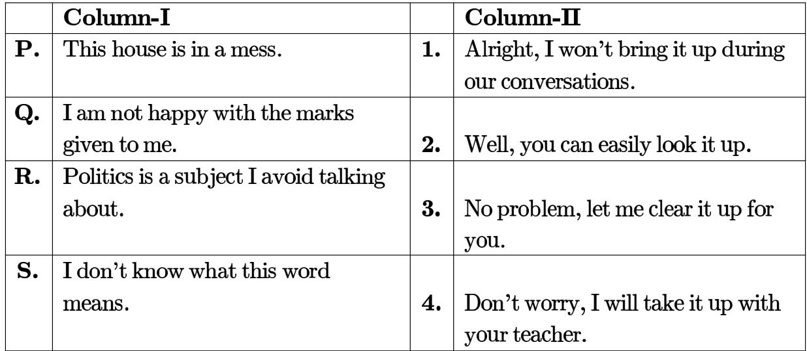
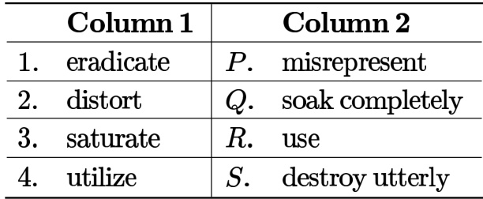
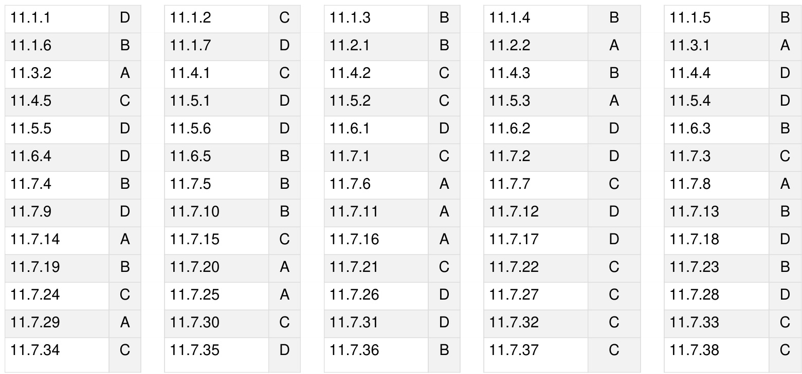
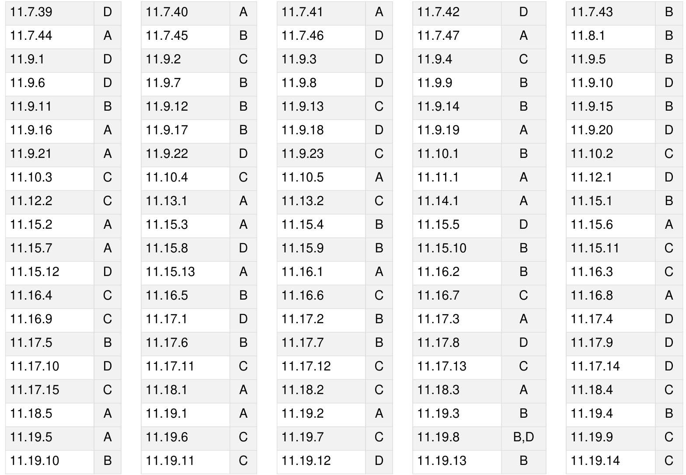

Choose the most appropriate word from the options given below to complete the following sentence The committee wrote a report  extolling only the strengths of the proposal

A. reasonable B. supportive C. biased D. fragmented

general-aptitude verbal-aptitude gate2010-mn most-appropriate-word

Choose the most appropriate word from the options given below to complete the following sentence If the country has to achieve real prosperity, it is that the fruits of progress reach all, and in equal measure

A. inevitable B. contingent C. oblivious D. imperative

general-aptitude verbal-aptitude gate2010-mn most-appropriate-word

Choose the most appropriate word from the options given below to complete the following sentence: The two child norm with for the violators will have significant implications for oar demographic profile

A. disincentives B. incitements C. restrictions D. restraints

general-aptitude verbal-aptitude gate2010-tf most-appropriate-word

Choose the most appropriate word from the options given below to complete the following sentence There is no fixed relation between food and famine  famines can occur with or without a substantial in food output

A. aberration B. weakening C. decline D. deterioration

general-aptitude verbal-aptitude gate2010-tf most-appropriate-word

Choose the most appropriate word from the options given below to complete the following sentence: Under ethical guidelines recently adopted by the India Medical Association, human genes are to be manipulated only to correct diseases for which treatments are unsatisfactory.

A. similar B. most C. uncommon D. available

general-aptitude verbal-aptitude gate2011-ag most-appropriate-word

Choose the most appropriate word or phrase from the options given below to complete the following sentence.

The environmentalists hope the lake to its pristine condition.

A. in restoring B. in the restoration of C. to restore D. restoring

Choose the most appropriate word from the options given below to complete the following sentence. Despite the mixture’s nature, we found that by lowering its temperature in the laboratory we could dramatically reduce reduce its tendency tendency to vaporize.

A. acerbic B. resilient C. volatile D. heterogeneous

gate2011-gg verbal-aptitude most-appropriate-word normal

Choose the most appropriate words from the options given below to complete the following sentence. Because she had a reputation for we were surprised and pleased when she greeted us so

A. insolence …… irately B. insouciance …… curtly C. graciousness …… amiably D. querulousness …… affably

gate2011-gg most-appropriate-word verbal-aptitude

Choose the most appropriate word(s) from the options given below to complete the following sentence.   
We lost confidence in him because he never the grandiose promises he had made.

A. delivered B. delivered on C. forgot D. reneged on

gate2011-mn verbal-aptitude most-appropriate-word

A. paucity B. propensity C. preponderance D. accuracy

Choose the most appropriate alternative from the options given below to complete the following sentence:

# The administrators went on to implement yet another unreasonable measure, arguing that the measures were already and one more would hardly make a difference.

A. reflective B. utopian C. luxuriant D. unpopular

gate2012-ae most-appropriate-word verbal-aptitude

Choose the most appropriate alternative from the options given below to complete the following sentence: To those of us who had always thought him timid, his came as a surprise.

A. intrepidity B. inevitability C. inability D. inertness

gate2012-ae verbal-aptitude most-appropriate-word

Choose the most appropriate pair of words from the options given below to complete the followingsentence: The high level of of the questions in the test was by an increase in the period of time allotted for answering them.

A. difficulty, compensated B. exactitude, magnified C. aptitude, decreased D. attitude, mitigated

gate2012-ar most-appropriate-word verbal-aptitude normal

Choose the most appropriate word from the options given below to complete the following sentence: Given the seriousness of the situation that he had to face, his was impressive.

A. beggary B. nomenclature C. jealousy D. nonchalance

gate2012-cy most-appropriate-word

Dare mistakes.

A. commit B. to commit C. committed D. committing

gate2013-ee most-appropriate-word easy verbal-aptitude

Choose the most appropriate word from the options given below to complete the following sentence.   
One of his biggest was his ability to forgive.

A. vice B. virtues C. choices D. strength

Choose the most appropriate word from the options given below to complete the following sentence.   
person suffering from Alzheimer’s disease short-term memory loss.

A. Experienced B. Has experienced C. Is experiencing D. Experiences

gate2014-ag verbal-aptitude most-appropriate-word normal

Choose the most appropriate word from the options given below to complete the following sentence. is the key to their happiness; they are satisfied with what they have.

A. Contentment B. Ambition C. Perseverance D. Hunger

gate2014-ag verbal-aptitude most-appropriate-word easy

Column-I has statements made by Shanthala; and, Column-II has responses given by Kanishk.

Identify the option that has the correct match between Column-I and Column-II.

A. $\mathrm { P - 2 ; Q - 3 ; R - 1 ; S - 4 }$   
B. $\mathrm { P - 3 ; Q - 4 ; R - 1 ; S - 2 }$

C. P-4;Q-1;R-2;S-3   
D.P-1;Q-2;R-4;S-3

Modern warfare has changed from large scale clashes of armies to suppression of civilian populations. Chemical agents that do their work silently appear to be suited to such warfare; and regretfully, there exist people in military establishments who think that chemical agents are useful tools for their cause.

Which of the following statements best sums up the meaning of the above passage:

A. Modern warfare has resulted in civil strife.   
B. Chemical agents are useful in modern warfare.   
C. Use of chemical agents in warfare would be undesirable.   
D. People in military establishments like to use chemical agents in war.

Few school curricula include a unit on how to deal with bereavement and grief, and yet all students at some point in their lives suffer from losses through death and parting.

Based on the above passage which topic would not be included in a unit on bereavement?

A. how to write a letter of condolence   
B. what emotional stages are passed through in the healing process   
C. what the leading causes of death are   
D. how to give support to a grieving friend

gatecse-2011 verbal-aptitude passage-reading normal

# 11.9.3 Passage Reading: GATE CSE 2013 Question: 63

After several defeats in wars, Robert Bruce went in exile and wanted to commit suicide. Just committing suicide, he came across a spider attempting tirelessly to have its net. Time and again, the spider failed but that did not deter it to refrain from making attempts. Such attempts by the spider made Bruce curious. Thus, Bruce started observing the near-impossible goal of the spider to have the net. Ultimately, the spider succeeded in having its net despite several failures. Such act of the spider encouraged Bruce not to commit suicide. And then, Bruce went back again and won many a battle, and the rest is history.

Which one of the following assertions is best supported by the above information?

A. Failure is the pillar of success. B. Honesty is the best policy. C. Life begins and ends with D. No adversity justifies giving up adventures. hope.

The Palghat Gap (or Palakkad Gap) a region about $3 0 \mathrm { k m }$ wide in the southern part of the Western in India, is lower than the hilly terrain to its north and south. The exact reasons for the formation of this gap are not clear. It results in the neighbouring regions of Tamil Nadu getting more rainfall from the South West monsoon and the neighbouring regions of Kerala having higher summer temperatures.

What can be inferred from this passage?

Select one:

A. The Palghat gap is caused by high rainfall and high temperatures in southern Tamil Nadu and Kerala   
B. The regions in Tamil Nadu and Kerala that are near the Palghat Gap are low-lying   
C. The low terrain of the Palghat Gap has a significant impact on weather patterns in neighbouring parts of Tamil Nadu and Kerala   
D. Higher summer temperatures result in higher rainfall near the Palghat Gap area

gatecse-2014-set1 verbal-aptitude passage-reading normal

# 11.9.5 Passage Reading: GATE CSE 2014 Set 2 GA Question: 6

The old city of Koenigsberg, which had a German majority population before World War 2, is now Kaliningrad. After the events of the war, Kaliningrad is now a Russian territory and has a predominantly Russian population. It is bordered by the Baltic Sea on the north and the countries of Poland to the south and west and Lithuania to the east respectively. Which of the statements below can be inferred from this passage?

A. Kaliningrad was historically Russian in its ethnic make up B. Kaliningrad is a part of Russia despite it not being contiguous with the rest of Russia C. Koenigsberg was renamed Kaliningrad, as that was its original Russian name D. Poland and Lithuania are on the route from Kaliningrad to the rest of Russia

# 11.9.6 Passage Reading: GATE CSE 2014 Set 2 GA Question: 7

Number of people diagnosed with dengue fever (contracted from the bite of a mosquito) in North India is twice the number diagnosed last year. Municipal authorities have concluded that measures to control the mosquito population have failed in this region.

Which one of the following statements, if true, does not contradict this conclusion?

A. A high proportion of the affected population has returned from neighbouring countries where dengue is prevalent   
B. More cases of dengue are now reported because of an increase in the Municipal Office's administrative efficiency   
C. Many more cases of dengue are being diagnosed this year since the introduction of a new and effective diagnostic test   
D. The number of people with malarial fever (also contracted from mosquito bites) has increased this year

gatecse-2014-set2 verbal-aptitude passage-reading normal

# 11.9.7 Passage Reading: GATE CSE 2014 Set 3 GA Question: 6

A dance programme is scheduled for $1 0 . 0 0 \ \mathsf { a . m }$ . Some students are participating in the programme they need to come an hour earlier than the start of the event. These students should be accompanied by a parent. Other students and parents should come in time for the programme. The instruction you think that is appropriate for this is

A. Students should come at a.m. and parents should come at  a.m.

B. Participating students should come at a.m. accompanied by a parent, and other parents and students should come by $1 0 . 0 0 { \sf a . m }$ .   
C. Students who are not participating should come by a.m. and they should not bring their parents. Participating students should come at  a.m.   
D. Participating students should come before  a.m. Parents who accompany them should come at $9 . 0 0 \ \mathsf { a . m }$ . All others should come at $1 0 . 0 0 { \sf a . m }$ .

By the beginning of the century, several hypotheses were being proposed, suggesting a paradigm shift in our understanding of the universe. However, the clinching evidence was provided by experimental measurements of the position of a star which was directly behind our sun.

Which of the following inference(s) may be drawn from the above passage?

i. Our understanding of the universe changes based on the positions of stars ii. Paradigm shifts usually occur at the beginning of centuries iii. Stars are important objects in the universe iv. Experimental evidence was important in confirming this paradigm shift

A. i, ii and iv B. iii only C. and iv D. iv only

gatecse-2014-set3 verbal-aptitude passage-reading easy

Most experts feel that in spite of possessing all the technical skills required to be a batsman of the order, he is unlikely to be so due to lack of requisite temperament. He was guilty of throwing away his wicket several time after working hard to lay a strong foundation. His critics pointed out that until he addressed his problem, success at the highest level will continue to elude him.

Which of the statement(s) below is/are logically valid and can be inferred from the above passage?

i. He was already a successful batsman at the highest level.   
ii. He was to improve his temperament in order to become a great batsman.   
iii. He failed to make many of his good starts count.   
iv. Improving his technical skills will guarantee success.

A. iii and iv B. ii and iii C. i, ii and iii D. ii only

gatecse-2015-set3 verbal-aptitude normal passage-reading

# Answer key☟

# 11.9.10 Passage Reading: GATE CSE 2016 Set 2 GA Question: 07

Computers were invented for performing only high-end useful computations. However, it is no understatement that they have taken over our world today. The internet, for example, is ubiquitous. Many believe that the internet itself is an unintended consequence of the original invention. With the advent of mobile computing on our phones, a whole new dimension is now enabled. One is left wondering if all these developments are good or, more importantly, required.

Which of the statement(s) below is/are logically valid and can be inferred from the above paragraph?

(i) The author believes that computers are not good for us.   
(ii) Mobile computers and the internet are both intended inventions.

A. (i) only B. (ii) only C. Both (i) and (ii) D. Neither (i) nor (ii)

gatecse-2016-set2 verbal-aptitude passage-reading normal

"The hold of the nationalist imagination on our colonial past is such that anything inadequately or improperly nationalist is just not history."

Which of the following statements best reflects the author's opinion?

A. Nationalists are highly imaginative.   
B. History is viewed through the filter of nationalism.   
C. Our colonial past never happened.   
D. Nationalism has to be both adequately and properly imagined.

gatecse-2017-set1 general-aptitude verbal-aptitude passage-reading

# 11.9.12 Passage Reading: GATE CSE 2022 GA Question: 6

Some people believe that “what gets measured, improves”. Some others believe that “what gets measured, gets gamed”. One possible reason for the difference in the beliefs is the work culture in organizations. In organizations with good work culture, metrics help improve outcomes. However, the same metrics are counterproductive in organizations with poor work culture.

Which one of the following is the logical inference based on the information in the above passage?

A. Metrics are useful in organizations with poor work culture B. Metrics are useful in organizations with good work culture C. Metrics are always counterproductive in organizations with good work culture D. Metrics are never useful in organizations with good work culture

gatecse-2022 verbal-aptitude passage-reading two-marks

# 11.9.13 Passage Reading: GATE CSE 2025 Set 1 GA Question: 6

"I put the brown paper in my pocket along with the chalks, and possibly other things. suppose every must have reflected how primeval and how poetical are the things that one carries in one's pocket: the pocket-knife, for instance the type of all human tools, the infant of the sword. Once I planned to write a book of poems entirely about the things in my pocket. But found it would be too long: and the age of the great epics is past."

(From G.K. Chesterton's "A Piece of Chalk") Based only on the information provided in the above passage, which one of the following statements is true?

A. The author of the passage carries a mirror in his pocket to reflect upon things.   
B. The author of the passage had decided to write a poem on epics.   
C. The pocket-knife is described as the infant of the sword.   
D. Epics are described as too inconvenient to write.

gatecse2025-set1 verbal-aptitude passage-reading two-marks

It has taken fifty-six long and frustrating, years to turn bronze, into gold for India’s Olympics aspirations Beijing marks a defining moment in India’s Olympic history From Delhi to Beijing is a long journey but one that our Olympians have undertaken with courage

Which of the following statement best sums up the meaning of the above passage

A. India’s participation in Olympics has been frustrating.   
B. Beijing Olympics was a landmark in India’s Olympic history.   
C. Our Olympians have undertaken a long journey to Beijing.   
D. India’s bronze medal turned into gold at Beijing.

The horse has played a little known but very important role in the field of medicine. Horses were injected with toxins of diseases until their blood built up immunities. Then a serum was made from their blood. Serums to fight with diphtheria and tetanus were developed this way.

It can be inferred from the passage, that horses were

A. given immunity to diseases B. generally quite immune to diseases   
C. given medicines to fight toxins D. given diphtheria and tetanus serums

general-aptitude verbal-aptitude gate2011-ag passage-reading

# In order to develop to full potential, a baby needs to be physically able to respond to the environment.

It can be inferred from the passage that

A. Full physical potential is needed in order for a baby to be able to respond to the environment.   
B. It is necessary for a baby to be able to physically respond to the environment for it to develop its full potential.   
C. Response to the environment of physically able babies needs to be developed to its full potential.   
D. A physically able baby needs to develop its full potential in order to respond to its environment.

In the early nineteenth century, theories of social evolution were inspired less by Biology than by the conviction of social scientists that there was a growing improvement in social institutions. Progress was taken for granted and social scientists attempted to discover its laws and phases.

Which one of the following inferences may be drawn with the greatest accuracy from the above passage? Social scientists

A. did not question that progress was B. did not approve of Biology. a fact. C. framed the laws of progress. D. emphasized Biology over Social Sciences.

The documents expose the cynicism of the government officials – and yet as the media website reflects, not a single newspaper has reported on their existence.

Which one of the following inferences may be drawn with the greatest accuracy from the above passage?

A. Nobody other than the government officials knew about the existence of the documents.   
B. Newspapers did report about the documents but nobody cared.   
C. Media reports did not show the existence of the documents.   
D. The documents reveal the attitude of the government officials.

One of the legacies of the Roman legions was discipline. In the legions, military law prevailed and discipline was brutal. Discipline on the battlefield kept units obedient, intact and fighting, even when the odds and conditions were against them.

Which one of the following statements best sums up the meaning of the above passage?

A. Thorough regimentation was the main reason for the efficiency of the Roman legions even in adverse circumstances.   
B. The legions were treated inhumanly as if the men were animals.   
C. Discipline was the armies inheritance from their seniors.   
D. The harsh discipline to which the legions were subjected to led to the odds and conditions being against them.

Moving into a world of big data will require us to change our thinking about the merits of exactitude. To apply the conventional mindset of measurement to the digital, connected world of the twenty-first century is to miss a crucial point. As mentioned earlier, the obsession with exactness is an artefact of the information-deprived analog era. When data was sparse, every data point was critical, and thus great care was taken to avoid letting any point bias the analysis. From “BIG DATA” Viktor Mayer-Schonberger and Kenneth Cukier. The main point of the paragraph is:

A. The twenty-first century is a digital world B. Big data is obsessed with exactness C. Exactitude is not critical in dealing with big data D. Sparse data leads to a bias in the analysis

gate2014-ag verbal-aptitude passage-reading normal

✍ Practice Test: Test (8Q)

# 11.10.1 Phrase Meaning: GATE CSE 2014 Set 1 GA Question: 7

Which of the following options is the closest in meaning to the phrase in bold in the sentence below? It is fascinating to see life forms cope with varied environmental conditions.

A. Adopt to B. Adapt to C. Adept in D. Accept with

verbal-aptitude gatecse-2014-set1 phrase-meaning easy

# 11.10.2 Phrase Meaning: GATE CSE 2014 Set 1 GA Question: 3

In a press meet on the recent scam, the minister said, "The buck stops here". What did the minister convey by the statement?

A. He wants all the money B. He will return the money C. He will assume final responsibility D. He will resist all enquiries

gatecse-2014-set1 verbal-aptitude normal phrase-meaning

# 11.10.3 Phrase Meaning: GATE CSE 2015 Set 1 GA Question: 2

Which of the following options is the closest in meaning of the sentence below? She enjoyed herself immensely at the party.

A. She had a terrible time at the party B. She had a horrible time at the party   
C. She had a terrific time at the party D. She had a terrifying time at the party

gatecse-2015-set1 verbal-aptitude easy phrase-meaning

# 11.10.4 Phrase Meaning: GATE CSE 2015 Set 1 GA Question: 7

Select the alternative meaning of the underlined part of the sentence.   
The chain snatchers took to their heels when the police party arrived.

A. Took shelter in a thick jungle B. Open indiscriminate fire

C. Took to flight D. Unconditionally surrendered

Nobody knows how the Indian cricket team is going to cope with the difficult and seamer-friendly wickets in Australia.

Choose the option which is closest in meaning to the underlined phrase in the above sentence.

A. Put up with. B. Put in with.   
C. Put down to. D. Put up against.

gatecse-2016-set2 verbal-aptitude phrase-meaning normal

# Answer key☟

# 11.11 Prepositions (1)

✍ Practice Test: Test (10Q)

'My friend and parted the door the cabin that I had rented the night.' Choose the option with the correct sequence of words to fill the blanks.

A. at; of; for B. for; at; of C. of; for; in D. in; of; for

gateda-2026 verbal-aptitude fill-in-the-blanks two-marks prepositions

# Answer key☟

✍ Practice Test: Test 1 (5Q)

# 11.12.1 Sentence Ordering: GATE CSE 2023 GA Question: 8

Which one of the following sentence sequences creates a coherent narrative?

i. Once on the terrace, on her way to her small room in the corner, she notices the man right away.   
ii. She begins to pant by the time she has climbed all the stairs.   
iii. Mina has bought vegetables and rice at the market, so her bags are heavy.   
iv. He was leaning against the parapet, watching the traffic below.

A. (i), (ii), (iv), (iii) B. (ii), (iii), (i), (iv) C. (iv), (ii), (i), (iii) D. (iii), (ii), (i), (iv)

gatecse-2023 verbal-aptitude sentence-ordering two-marks

Plate.

A. QPSR B. QSPR C. SPRQ D. SRPQ

gatecse-2024-set2 verbal-aptitude sentence-ordering two-marks

# 11.13.1 Statement Sufficiency: GATE CSE 2015 Set 1 | GA Question: 4

Based on the given statements, select the most appropriate option to solve the given question. If two floors in a certain building are feet apart, how many steps are there in a set of stairs that extends from the first floor to the second floor of the building?

Statements:

I. Each step is $3 / 4$ foot high.   
II. Each step is foot wide. A. Statements alone is sufficient, but statement II alone is not sufficient.   
B. Statements II alone is sufficient, but statement alone is not sufficient.   
C. Both statements together are sufficient, but neither statement alone is sufficient.   
D. Statements and II together are not sufficient.

Based on the given statements, select the most appropriate option to solve the given question. What will be the total weight of  poles each of same weight?

Statements:

I. One fourth of the weight of the pole is ${ \mathrm { 5 } } \mathrm { K g } .$ .   
II. The total weight of these poles is $1 6 0 \mathrm { K g }$ more than the total weight of two poles. A. Statement alone is not sufficient.   
B. Statement II alone is not sufficient.   
C. Either or II alone is sufficient.   
D. Both statements and II together are not sufficient.

✍ Practice Tests: Test 1 (15Q) Test 2 (15Q) Test 3 (7Q)

A. Statements and II follow. B. Statements and III follow.   
C. Statements II and III follow. D. All the statements follow.

gatecse-2015-set1 verbal-aptitude normal statements-follow

✍ Practice Tests: Test (15Q) Test 2 (6Q)

Which of the following options is the closest in meaning to the word given below: Circuitous

A. cyclic B. indirect C. confusing D. crooked

gatecse-2010 verbal-aptitude word-meaning normal synonyms

Which of the following options is the closest in the meaning to the word below: Inexplicable

A. Incomprehensible B. Indelible C. Inextricable D. Infallible

gatecse-2011 verbal-aptitude synonyms normal

Which one of the following options is the closest in meaning to the word given below? Mitigate

A. Diminish B. Divulge C. Dedicate D. Denote

gatecse-2012 verbal-aptitude synonyms easy

Answer key☟

Which one of the following options is the closest in meaning to the word given below? Nadir

A. Highest B. Lowest C. Medium D. Integration

gatecse-2013 verbal-aptitude synonyms normal

A. Accelerate B. Retard C. Provide D. Disable

Which of the following options is the closest in meaning to the word below Exhort

A. urge B. condemn C. restrain D. scold

general-aptitude verbal-aptitude gate2010-mn synonyms

11.15.8 Synonyms: GATE2010 TF: GA-1

Which of the following options is the closest in meaning to the word below Ephemeral

A. effeminate B. ghostlike C. soft D. short-lived

general-aptitude verbal-aptitude gate2010-tf synonyms

11.15.9 Synonyms: GATE2012 AR: GA-1

Which one of the following options is the closest in meaning to the word given below? Pacify

A. Excite B. Soothe C. Deplete D. Tire

gate2012-ar verbal-aptitude synonyms

Answer key☟

# 11.15.10 Synonyms: GATE2012 CY: GA-3

Which one of the following options is the closest in meaning to the word given below? Latitude

A. Eligibility B. Freedom C. Coercion D. Meticulousness

gate2012-cy verbal-aptitude synonyms

11.15.11 Synonyms: GATE2013 CE: GA-3

Which of the following options is the closest in meaning to the word given below: Primeval

A. Modern B. Historic C. Primitive D. Antique

gate2013-ce synonyms most-appropriate-word

Answer key☟

# 11.15.12 Synonyms: GATE2013 EE: GA-1

They were requested not to with others. Which one of the following options is the closest in meaning to the word ?

A. make out B. call out C. dig out D. fall out

A student is required to demonstrate a high level of comprehension of the subject, especially in the social sciences.   
The word closest in meaning to comprehension is

A. understanding B. meaning C. concentration D. stability

gate2014-ae synonyms verbal-aptitude

✍ Practice Tests: Test 1 (15Q) Test 2 (11Q)

11.16.1 Tenses: GATE CSE 2013 Question: 59

Were you a bird, you in the sky.

A. would fly B. shall fly C. should fly D. shall have flown

gatecse-2013 verbal-aptitude tenses normal

Answer key☟

Who was coming to see us this evening?

A. you said B. did you say C. did you say that D. had you said

gatecse-2014-set2 verbal-aptitude tenses normal

If she how to calibrate the instrument, she done the experiment.

A. knows, will have B. knew, had C. had known, could have D. should have known, would have

# 11.16.4 Tenses: GATE CSE 2017 Set 1 GA Question:

After Rajendra Chola returned from his voyage to Indonesia, he to visit the temple in Thanjavur.

A. was wishing B. is wishing C. wished D. had wished

gatecse-2017-set1 general-aptitude verbal-aptitude tenses english-grammar normal

# I ___ to have bought a diamond ring.

A. have a liking B. should have liked C. would like D. may like

Choose the most appropriate alternative from the options given below to complete the following sentence: Food prices again this month.

A. have raised B. have been raising C. have been rising D. have arose

Choose the most appropriate alternative from the options given below to complete the following sentence: If the tired soldier wanted to lie down, he the mattress out on the balcony.

A. should take B. shall take C. should have taken D. will have taken

gate2012-cy tenses verbal-aptitude

# 11.16.9 Tenses: GATE2013 AE: GA-2

The Headmaster to speak to you. Which of the following options is incorrect to complete the above sentence?

A. is wanting B. wants C. want D. was wanting

gate2013-ae verbal-aptitude english-grammar tenses

Answer key☟

Wanted Temporary, Part-time persons for the post of Field Interviewer to conduct personal interviews to collect and collate economic data. Requirements: High School-pass, must be available for Day, Evening and Saturday work. Transportation paid, expenses reimbursed.

Which one of the following is the best inference from the above advertisement?

A. Gender-discriminatory B. Xenophobic C. Not designed to make the post D. Not gender -discriminatory attractive

gatecse-2012 verbal-aptitude verbal-reasoning normal

# 11.17.2 Verbal Reasoning: GATE CSE 2014 Set 1 GA Question: 7

Geneticists say that they are very close to confirming the genetic roots of psychiatric illnesses such as depression and schizophrenia, and consequently, that doctors will be able to eradicate these diseases through early identification and gene therapy.

On which of the following assumptions does the statement above rely? Select one:

A. Strategies are now available for eliminating psychiatric illnesses   
B. Certain psychiatric illnesses have a genetic basis   
C. All human diseases can be traced back to genes and how they are expressed   
D. In the future, genetics will become the only relevant field for identifying psychiatric illnesses

# 11.17.3 Verbal Reasoning: GATE CSE 2015 Set 3 | GA Question: 6

Alexander turned his attention towards India, since he had conquered Persia.

Which one of the statements below is logically valid and can be inferred from the above sentence

A. Alexander would not have turned his attention towards India had he not conquered Persia.   
B. Alexander was not ready to rest on his laurels, and wanted to march to India.   
C. Alexander was not completely in control of his army and could command it to move towards India.   
D Since Alexander's kingdom extended to Indian borders after the conquest of Persia, he was keen to move further.

gatecse-2015-set3 verbal-aptitude normal verbal-reasoning

Indian currency notes show the denomination indicated in at least seventeen languages. If this is not an indication of the nation's diversity, nothing else is.

Which of the following can be logically inferred from the above sentences?

A. India is a country of exactly seventeen languages.   
B. Linguistic pluralism is the only indicator of a nation's diversity.   
C. Indian currency notes have sufficient space for all the Indian languages.   
D. Linguistic pluralism is strong evidence of India's diversity.

# 11.17.5 Verbal Reasoning: GATE CSE 2017 Set 2 GA Question: 6

“We lived in a culture that denied any merit to literary works, considering them important only when they were handmaidens to something seemingly more urgent – namely ideology. This was a country where all gestures, even the most private, were interpreted in political terms.

The author’s belief that ideology is not as important as literature is revealed by the word:

A. ‘culture’ B. ‘seemingly C. ‘urgent’ D. ‘political’

gatecse-2017-set2 passage-reading verbal-reasoning

# 11.17.6 Verbal Reasoning: GATE CSE 2019 GA Question: 6

The police arrested four criminals $\mathbf { \Gamma } _ { - } P , Q , R$ and $\boldsymbol { S }$ The criminals knew each other. They made the following statements:

$P$ says $" \mathsf { Q }$ committed the crime. $Q$ says $^ { \mathrm { * } } { \mathsf { S } }$ committed the crime. $R$ says “ I did not do it.” $\boldsymbol { S }$ says “What Q said about me is false”.

Assume only one of the arrested four committed the crime and only one of the statements made above is true. Who committed the crime?

A. B. C. D.

gatecse-2019 verbal-aptitude verbal-reasoning two-marks

“A recent High Court judgement has sought to dispel the idea of begging as a disease – which leads to its stigmatization and criminalization – and to regard it as a symptom. The underlying disease is the failure of the state to protect citizens who fall through the social security net.”

Which one of the following statements can be inferred from the given passage?

A. Beggars are lazy people who beg because they are unwilling to work B. Beggars are created because of the lack of social welfare schemes C. Begging is an offence that has to be dealt with firmly D. Begging has to be banned because it adversely affects the welfare of the state

The dawn of the st century witnessed the melting glaciers oscillating between giving too much and little to billions of people who depend on them for fresh water. The UN climate report estimates that without deep cuts to man-made emissions, at least $3 0 \%$ of the northern hemisphere’s surface permafrost could melt by the end of the century. Given this situation of imminent global exodus of billions of people displaced by rising seas, nation-states need to rethink their carbon footprint for political concerns, if not for environmental ones.

Which one of the following statements can be inferred from the given passage?

A. Nation-states do not have environmental concerns.   
B. Nation-states are responsible for providing fresh water to billions of people.   
C. Billions of people are responsible for man-made emissions.   
D. Billions of people are affected by melting glaciers.

# 11.17.9 Verbal Reasoning: GATE CSE 2020 GA Question: 6

Goods and Services Tax (GST) is an indirect tax introduced in India in  that is imposed on the supply of goods and services, and it subsumes all indirect taxes except few. It is a destination-based tax imposed on goods and services used, and it is not imposed at the point of origin from where goods come. GST also has a few components specific to state governments, central government and Union Territories (UTs).

Which one of the following statements can be inferred from the given passage?

A. GST is imposed on the production of goods and services.   
B. GST includes all indirect taxes.   
C. GST does not have a component specific to UT.   
D. GST is imposed at the point of usage of goods and services.

A. The proposed addresses the core problems that cause obesity B. If obesity reduces, poverty will naturally reduce, since obesity causes poverty C. are addressing the core problems and are likely to succeed D. are addressing the problem superficially

gatecse-2021-set1 verbal-aptitude verbal-reasoning passage-reading two-marks

Listening to music during exercise improves performance and reduces discomfort. Scientists researched whether listening to music while studying can help students learn better and the results were inconclusive. Students who needed external stimulation for studying fared worse while students who did not need any exte stimulation benefited from music.

Which one of the following statements is the inference of the above passage?

A. Listening to music has no effect on learning and a positive effect on physical exercise   
B. Listening to music has a clear positive effect both in physical exercise and on learning   
C. Listening to music has a clear positive effect on physical exercise. Music has a positive effect on learning only in some students   
D. Listening to music has a clear positive effect on learning in all students. Music has a positive effect only in some students who exercise

gatecse-2021-set2 verbal-aptitude verbal-reasoning passage-reading two-marks

Mahatama Gandhi was known for his humility as

A. he played an important role in humiliating exit of British from India. B. he worked for humanitarian causes.   
C. he displayed modesty in his interactions.   
D. he was a fine human being

Statement: You can always give me a ring whenever you need.

Which one of the following is the best inference from the above statement?

A. Because have a nice caller tune.   
B. Because have a better telephone facility.   
C. Because a friend in need is a friend indeed.   
D. Because you need not pay towards the telephone bills when you give me a ring.

gate2013-ee verbal-reasoning verbal-aptitude

# D. Nationalism in India is heterogeneous

Which of the following options is the closest in meaning to the sentence below? "As a woman, I have no country."

A. Women have no country.   
B. Women are not citizens of any country.   
C. Women’s solidarity knows no national boundaries.   
D. Women of all countries have equal legal rights.

gate2014-ag general-aptitude verbal-aptitude verbal-reasoning normal ✍ Practice Tests: Test 1 (15Q) Test 2 (4Q)

Match the columns.

A. 1:S, 2:P, 3:Q, 4:R C. 1:Q, 2:R, 3:S, 4:P

gatecse-2014-set2 verbal-aptitude word-meaning normal match-the-following

Choose the statement where underlined word is used correctly.

A. The industrialist had a personnel jet.   
B. write my experience in my personnel diary.   
C. All personnel are being given the day off.   
D. Being religious is a personnel aspect.

Find the odd one in the following group of words. mock, deride, praise, jeer

A. Mock B. Deride C. Praise D. Jeer

gatecse-2016-set2 verbal-aptitude word-meaning easy

Answer key☟

His knowledge of the subject was excellent but his classroom performance was

A. extremely poor B. good C. desirable D. praiseworthy

gatecse-2020 verbal-aptitude english-grammar word-meaning one-mark

# Answer key☟

✍ Practice Tests: Test 1 (15Q) Test 2 (15Q) Test 3 (5Q)

The question below consists of a pair of related words followed by four pairs of words. Select the pair that best expresses the relation in the original pair.

# Unemployed Worker

A. fallow land B. unaware sleeper C. wit : jester D. renovated house

gatecse-2010 verbal-aptitude word-pairs normal

Answer key☟

Complete the sentence:

Universalism is to particularism as diffuseness is to

A. specificity B. neutrality C. generality D. adaptation

gatecse-2013 verbal-aptitude normal word-pairs

Answer key☟

Which one of the following combinations is incorrect?

A. Acquiescence Submission B. Wheedle Roundabout C. Flippancy Lightness D. Profligate Extravagant

gatecse-2015-set1 verbal-aptitude difficult word-pairs

Answer key☟

Select the word that fits the analogy: Cook Cook :: Fly

A. Flyer B. Flying C. Flew D. Flighter

gatecse-2020 verbal-aptitude word-pairs one-mark

Answer key☟

is to surgery as writer is to Which one of the following options maintains a similar logical relation in the above sentence?

A. Plan, outline B. Hospital, library C. Doctor, book D. Medicine, grammar

gatecse-2021-set1 verbal-aptitude word-pairs one-mark

# 11.19.7 Word Pairs: GATE CSE 2021 Set 2 GA Question: 5

Pen : Write ：: Knife Which one of the following options maintains a similar logical relation in the above?

A. Vegetables B. Sharp C. Cut D. Blunt

gatecse-2021-set2 verbal-aptitude word-pairs one-mark easy

Answer key☟

Kind Often Frequently (By word meaning)

A. Mean B. Type C. Cruel D. Kindly

gatecse-2023 verbal-aptitude word-pairs one-mark

Answer key☟

# 11.19.9 Word Pairs: GATE CSE 2025 Set 2 GA Question: 2

​Bird Nest :: Bee

A. Kennel B. Hammock C. Hive D. Lair

gatecse2025-set2 verbal-aptitude word-pairs easy one-mark

# Erudition Scholar

A. steadfast mercurial B. competence strict C. skill craftsman D. nurse doctor general-aptitude verbal-aptitude gate2010-tf word-pairs

The question below consists of a pair of related words followed by four pairs of words. Select the pair tha best expresses the relation in the original pair:

# Gladiator Arena

A. dancer stage B. commuter train C. teacher classroom D. lawyer : courtroom general-aptitude verbal-aptitude gate2011-ag word-pairs

Select the pair that best expresses a relationship similar to that expressed in the pair: water: pipe::

A. cart: road B. electricity: wire C. sea: beach D. music: instrument

gate2013-ae verbal-aptitude word-pairs

Select the pair that best expresses a relationship similar to that expressed in the pair:

# Medicine: Health

A. Science: Experiment B. Wealth: Peace C. Education: Knowledge D. Money: Happiness

gate2013-ce word-pairs verbal-aptitude

# Answer Keys

