# Table of Contents

ontributors able of Contents 167777788991010101111   
Algorithms (358)   
Topic-wise Key Concepts   
Algorithm Design   
Algorithm Design Techniques   
Asymptotic Notations   
Bellman Ford   
Binary Heap   
Binary Search   
Binary Search Tree (BST)   
Binary Tree   
Breadth First Search (BFS)   
Bubble Sort   
Computer Science   
Depth First Search (DFS)   
Dijkstra's Algorithm 11   
Directed Acyclic Graph (DAG) 11   
Double Hashing 1212121313   
Dynamic Programming   
Graph Algorithms   
Graph Search   
Greedy Algorithms   
Hashing 131314141415151516161617171718   
Heap Sort   
Huffman Code   
Identify Function   
Insertion Sort   
Inversion   
Linear Probing   
Matrix Chain Ordering (Matrix Chain Multiplication)   
Maximum Minimum   
Merge Sort   
Merging   
Minimum Spanning Tree (MST)   
Number of Swap   
Prims Algorithm   
Quick Sort   
Recurrence Relation 18   
Recursion 18181919191920202021212121222325273232   
Searching   
Selection Sort   
Shortest Path   
Sorting   
Space Complexity   
Strongly Connected Components (SCC)   
Time Complexity   
Topo logical Sort   
Tree Traversal   
Uniform Hashing   
Quick Formula Reference   
Important Tips for GATE   
1.1 Algorithm Design (8)   
1.2 Algorithm Design Techniques (9)   
1.3 Asymptotic Notations (22)   
1.4 Bellman Ford (2)   
1.5 Binary Heap (1) 1.78 Binary TSreaerc(h1)Tree (3) .9 Breadth First Search (3) 33343435363637 .10 Bubble Sort (1)   
.11 Computer Science (1)   
1.12 Depth First Search (2)   
1.13 Dijkstras Algorithm (5)   
.14 Directed Acyclic Graph (2) 38 1.15 Double Hashing (2) 3492 1.16 Dynamic Programm ing (10)   
.17 Graph Algorithms (11)   
.18 Graph Search (23) 46 19 Greedy Algorithms (5) 51 .20 Hashing (6) 53 .21 Heap Sort (2) 54 .22 Huffman Code (6) 54 23 Identify Function (38) 56 .24 Insertion Sort (2) 68 .25 Inversion (2) 68 .26 Linear Probing (2) 69 .27 Matrix Chain Ordering (3) 69 .28 Maximum Minimum (1) 70707171 .29 Merge Sort (4)   
.30 Merging (2)   
.31 Minimum Spanning Tree (35)   
1.32 Number Swap (1 80 .33 Prims Algorithm (2) 818184939496 .34 Quick Sort (15)   
.35 Recurrence Relation (36)   
1.36 Recursion (5)   
1.37 Searching (8)   
1.38 Selection Sort (2)   
1.39 Shortest Path (8) 97 1.40 Sorting (22) 99 1.41 Space Complexity (1) 03 1.42 Strongly Connected Components (3) 04 1.43 Time Complexity (31) 04 .44 Topological Sort (4) 12 1.45 Tree Traversal (1) 13 .46 Uniform Hashing (1)   
Answer Keys   
2 Compiler Design (242)   
Subject Overview   
Topic-wise Key Concepts   
Abstract Syntax Tree (AST)   
Ambiguous Grammar   
Assembler   
Backpatching   
Basic Blocks   
Code Optimization   
Compilation Phases   
Compiler Tokenization (Lexical Analysis) 19 Directed Acyclic Graph (DAG)   
Expression Evaluation   
First and Follow 120 Grammar 120 2.1 Abstract Syntax Tree (1) 20 2.2 Ambiguous Grammar 2 121 2.3 Assembler (9) 121 2.4 Backpatching (1) 123 2.5 Basic Blocks (2)

2.6 Code Optimization (8) 123460   
2.7 Compilation Phases (13)   
2.8 Compiler tokenization (1)   
2.9 Directed Acyclic Graph (2) 130   
2.10 Expression Evaluation (2) 3   
2.11 First and Follow (6) 131   
2.12 Grammar (47) 13435   
2.13 Intermediate Code (11)   
2.14 LR Parser (20) 48   
2.156 Lienxkiceral(3A)nalysis (6) 153154155156157158   
2.17 Live Variable Analysis (3)   
2.18 Ll Parser (2)   
2.19 Macros (4)   
2.20 Operator Precedence (9)   
2.21 Parameter Passing (14)   
2.22 Parsing (22) 166   
2.23 Register Allocation (6) 171   
2.24 Runtime Environment (22) 17389   
2.25 Static Single Assignment (3)   
2.26 Symbol Table (1)   
2.27 Syntax Directed Translation (19) 179   
2.28 Variable Scope (2) 186   
2.29 Viable Prefix (1) 187   
Answer Keys 187

# 3 Programming and DS: Structures (238) 189

Topic-wise Key Concepts 189   
AVL Tree 189   
Abstract Data Type (ADT) 189   
Array 190   
Binary Heap 1901   
Binary Search Tree (BST)   
Binary Tree   
Data Structures   
Hashing 192   
Infix, Prefix, Postfix Notations 192   
Linked List 193   
Priority Queue 193   
Queue 193   
Stack 194   
Time Complexity 194   
Tree 195   
Tree Traversal 195   
Uniform Hashing 195   
Quick Formula Reference 196   
Important Tips for GATE 196   
3.1 AVL Tree (6) 197   
3.2 Abstract Data Type (1) 98   
3.3 Array (13) 98   
3.4 Binary Heap (30) 202   
3.5 Binary Search Tree (36) 208   
3.6 Binary Tree (53) 215   
3.7 Data Structures (4) 227   
3.8 Hashing (15) 228   
3.9 Infix Prefix (4) 231   
3.10 Linked List (24) 232   
3.11 Priority Queue (2) 239   
3.12 Queue (15) 239   
3.13 Stack (19) 244   
3.14 Time Complexity (1) 249   
3.15 Tree (13) 249   
3.16 Tree Traversal (1) 253   
3.17 Uniform Hashing (1) 253

Answer Keys 253

# 4 Programming and DS: Programming (1) 255

# Topic-wise Key Concepts

Basic Output Functions ( $\bar { \mathsf { C } } / \bar { \mathsf { C } } + \bar { \mathsf { + } }$ /Python) 255 Data Types and Type Casting 256 Operators and Expressions 2578 Control Flow Statements   
Functions 25690 Arrays and Pointers   
Strings 261 Storage Classes   
Macros and Preprocessor Directives 262

# Quick Formula Reference

$\bar { \mathbf { \bar { C } } } / \bar { \mathbf { C } } \bar { + } \bar { + }$ Operator Precedence and Associativity (Highest to Lowest)

C printf() Format Specifiers 263 Escape Sequences 264 Pointer Arithmetic $( \bar { \mathsf { C } } / \bar { \mathsf { C } } + \bar { \mathsf { + } } )$ C String Functions (from <string.h>) Storage Class Properties $( \bar { \mathsf { C } } / \bar { \mathsf { C } } + \bar { \mathsf { + } } )$ ) Important Tips for GATE 264 4.1 Output (1) 265 Answer Keys 265 5 Pro gramming: Programming in C (131) 266 Subject Overview 266 Topic-wise Key Concepts 266 Programming In C 266 Programming Constructs 266 Prog ramming Paradigms 267 Variable Binding 267 Type Checking 268 Output 268 Array 268 Strings 269 Pointers 269 Aliasing 269270270271271272272272273 Functions Parameter Passing Recursion Structure Union Identify Function SGwotitoch Case 273273274274275275275 Loop Invariants Runtime Environment Quick Formula Reference Important Tips for GATE 5.1 Aliasing (1) 5.2 Array (13) 5.3 Functions (2) 280 5.4 Goto (2) 281 5.5 Identify Function (6) 281 5.6 Loop Invariants (8) 283 5.7 Output (8) 286 5.8 Parameter Passing (12) 289 5.9 Pointers (15) 293 5.10 Programming Constructs (1) 298 5.11 Prog ramming In C (29) 298 5.12 Programming Paradigms (2) 308 5.13 Recursion (19) 308 5.14 Runtime Environment (1) 314 5.15 Strings (2) 315

5.16 Structure (5) 315   
5.17 Switch Case (2) 317   
5.18 Type Checking (1) 318   
5.19 Union (1) 318   
5.20 Variable Binding (1) 319   
Answer Keys 319   
Theory of Computation (293) 321   
Topic-wise Key Concepts 321   
Finite Automata (FA) 321   
Finite State Machines (FSM) 321   
Regular Expression (RE) 322   
Regular Grammar (RG) 322   
Regular Language (RL) 322   
Non Determinism 323   
Number of States 323   
Minimal State Automata 323   
Pumping Lemma (for Regular Languages) 323   
Closure Property 324   
Context Free Grammar (CFG) 324   
Context Free Language (CFL) 325   
Pushdown Automata (PDA) 325   
Dpda (Deterministic Pushdown Automata) 325   
Pumping Lemma (for CFLs) 326   
Turing Machine (TM) 326   
Recursive and Recursively Enumerable Languages 326   
Decidability 327   
Reduction 327   
Countable Uncountable Set 328   
Identify Class Language 328   
Medium (Computational Models) 328   
Quick Formula Reference 329   
Important Tips for GATE 329   
6.1 Closure Property (10) 330   
6.2 Context Free Grammar (2) 332   
6.3 Context Free Language (35) 332   
6.4 Countable Uncountable Set (3) 341   
6.5 Decidability (30) 342   
6.6 Dpda (1) 348   
6.7 Finite Automata (43) 349   
6.8 Finite State Machines (1) 364   
6.9 Identify Class Language (31) 364   
6.10 Medium (1) 37   
6.11 Minimal State Automata (25) 37   
6.12 Non Determinism (6) 376   
6.13 Number of States (2) 378   
6.14 Pumping Lemma (2) 378   
6.15 Pushdown Automata (15) 378   
6.16 Recursive and Recursively Enumerable Languages (16) 383   
6.17 Reduction (2) 387   
6.18 Regular Expression (29) 387   
6.19 Regular Grammar (3) 393   
6.20 Regular Language (35) 394   
6.21 Turing Machine (1) 401   
Answer Keys 402

# Contributors

User , Answers User Arjun Suresh 17841, 221 Kathleen Bankson Praveen Saini 4669, 61 Arjun Suresh Gate Keeda 2717, 58 GO Editor Akash Kanase 2145, 35 Ishrat Jahan Deepak Poonia 1739, 28 gatecse Digvijay 1649, 27 Misbah Rajesh Pradhan 1597, 22 Rucha Shelke Vikrant Singh 1515, 17 admin Amar Vashishth 1481, 20 Akash Kanase gatecse 1480, 20 Sandeep Singh Prashant Singh 1474, 28 Madhav kumar Sachin Mittal 1463, 18 khush tak dd 1248, 10 Bhagirathi Nayak 1239, 21 Rajarshi Sarkar 948, 22 Kalpna Bhargav 924, 11 Shaik Masthan 919, 24 Sankaranarayanan P.N 890, 19 Pooja Palod 850, 15 Ahwan Mishra 786, 9 Rishabh Gupta 767, 3 Hira 670, 28 Ankit Rokde 667, 10 Pragy Agarwal 641, 6 Manu Thakur 626, 10 Anurag Semwal 592, 7 Abhilash Panicker 528, 5 Mithlesh Upadhyay 520, 7 Monanshi Jain 506, 8 minal 490, 7 jayendra 472, 9 Akhil Nadh PC 459, 6 Anoop Sonkar 425, 6 ryan sequeira 414, 4 Sandeep_Uniyal 405, 7 Shubham Srivastava 394, 5 suraj 374, 6 Srinath Jayachandran 370, 2 Arnabi Bej 367, 4 Ashish Deshmukh 366, 2 Aditi Dan 364, 4

Added   
444   
267   
179   
123   
837733272726118

User Done   
Lakshman Patel (GATE 458   
And Tech)   
kenzou 450   
Milicevic3306 202   
Arjun Suresh 199   
gatecse 115   
Hira 108   
soujanyareddy13 108797672585348484640312625201818161514119998866655   
Naveen Kumar   
Pooja Khatri   
V S Silpa   
Shubham Sharma   
Shaik Masthan   
Misbah   
Shikha Mallick   
Shri 1   
Deepak Poonia   
shadymademe   
Akash Dinkar   
Umesh Shelke   
GO Editor   
Krithiga2101   
jothee_new   
Ankit Singh   
Sweta Kumari Rawani   
Abhrajyoti Kundu   
Sachin Mittal   
Kavali Yedidyah Sagar   
Sujith K   
srestha   
Mk Utkarsh   
Sukanya Das   
Ajay kumar soni   
chinmay jain   
goku4199   
Puja Mishra

Searching, Sorting, Hashing, Asymptotic worst case time and Space complexity, Algorithm design techniques: Greedy, Dynamic programming, and Divide‐and‐conquer, Graph search, Minimum spanning trees, Shortest paths.

Mark Distribution in Previous GATE   
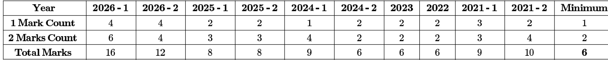

Welcome to the "Algorithms" chapter, a cornerstone of Computer Science and a high-scoring section in the GATE examination. This subject delves into the systematic procedures and computational methods used to solve problems, focusing on their efficiency and correctness. Mastering algorithms is crucial not only for theoretical understanding but also for practical application in software development and system design. In GATE CS, algorithms typically carry a significant weightage, often ranging from 10 to 15 marks, with questions spanning theoretical concepts, time and space complexity analysis, problem-solving, and application of various design techniques. Expect a mix of Multiple Choice Questions (MCQ), Multiple Select Questions (MSQ), and Numerical Answer Type (NAT) questions, requiring a deep understanding of underlying principles and the ability to analyze and compare different algorithmic approaches.

# Topic-wise Key Concepts

# Algorithm Design

Definition: Algorithm design is the process of creating a well-defined computational procedure to solve a specific problem. It involves understanding the problem, choosing appropriate data structures, and devising a step- by -step method that is correct, efficient, and terminates.

Properties/Identities:

Correctness: An algorithm must produce the correct output for all valid inputs.   
Efficiency: Measured by time and space complexity.   
Finiteness: Must terminate after a finite number of steps.   
Definiteness: Each step must be precisely defined.   
Input/Output: Must take zero or more inputs and produce one or more outputs.

# Pitfalls/Tricks:

Overlooking edge cases or constraints that might break the algorithm's logic.   
Designing an algorithm that is correct but too inefficient for practical use or given constraints.

# Techniques/Shortcuts:

Start with a brute-force solution, then optimize. 。 Break down complex problems into smaller, manageable subproblems. Consider different data structures and their impact on performance.

# Algorithm Design Techniques

Definition: These are general strategies or paradigms used to develop algorithms for a wide range of problems. Key techniques include Divide and Conquer, Greedy Algorithms, Dynamic Programming, Backtracking, and Branch and Bound.

Properties/Identities:

Divide and Conquer: Divide problem into subproblems, solve recursively, combine solutions. Greedy Algorithms: Make locally optimal choices at each step, hoping to find a global optimum. Dynamic Programming: Solves problems with overlapping subproblems and optimal substructure by storing results of subproblems.

Pitfalls/Tricks: 。 Mistaking a problem for one solvable by a greedy approach when it requires dynamic programming. 0 Incorrectly identifying optimal substructure or overlapping subproblems.

Techniques/Shortcuts: 0 For DP, identify the state, recurrence relation, and base cases. 。 For Greedy, prove the greedy choice property and optimal substructure.

# Asymptotic Notations

Definition: Mathematical notations used to describe the limiting behavior of a function when the argument tends towards a particular value or infinity, primarily used to classify algorithms by their running time or space requirements as input size grows.

# Formulas/Theorems:

Big-O Notation (Upper Bound): $f ( n ) = O ( g ( n ) )$ if there exist positive constants $c$ and $n _ { 0 }$ such that $0 \leq f ( n ) \leq c \cdot g ( n )$ for all $n \geq n _ { 0 }$ .   
Omega Notation (Lower Bound): $f ( n ) = \Omega ( g ( n ) )$ f there exist positive constants $c$ and $n _ { 0 }$ such that $0 \leq c \cdot g ( n ) \leq f ( n )$ for all $n \geq n _ { 0 }$ .   
Theta Notation (Tight Bound): $f ( n ) = \Theta ( g ( n ) )$ if there exist positive constants $_ { c _ { 1 } , c _ { 2 } }$ and $n _ { 0 }$ such that $0 \leq c _ { 1 } \cdot g ( n ) \leq f ( n ) \leq c _ { 2 } \cdot g ( n )$ for all $n \geq n _ { 0 }$ .   
0 Little-o Notation (Strict Upper Bound): $f ( n ) = o ( g ( n ) )$ $\begin{array} { r } { \operatorname* { l i m } _ { n \to \infty } \frac { f ( n ) } { g ( n ) } = 0 . } \end{array}$   
Little-omega Notation (Strict Lower Bound): $\begin{array} { r } { f ( n ) = \omega ( g ( n ) ) \operatorname * { l f } \operatorname* { l i m } _ { n  \infty } \frac { f ( n ) } { g ( n ) } = \infty . } \end{array}$

# Properties/Identities:

Reflexivity: $f ( n ) = O ( f ( n ) ) , f ( n ) = \Omega ( f ( n ) ) , f ( n ) = \Theta ( f ( n ) )$ .   
Transitivity: If $f ( n ) = O ( g ( n ) )$ and $g ( n ) = O ( h ( n ) )$ , then ${ \dot { f } } ( { \dot { n } } ) = O ( h ( n ) )$ . (Applies to all notations). Symmetry: $f ( n ) { \dot { = } } \Theta ( g ( n ) )$ iff $g ( n ) \stackrel { \cdot } { = } \Theta ( f ( n ) )$ .   
。 Transpose Symmetry: $f ( n ) = O ( g ( n ) )$ iff $\operatorname { \dot { \ g } } ( { n } ) = \Omega ( f ( n ) )$ . Similarly for $o$ and $\omega$ .   
Sum Rule: If $f ( n ) = O ( { \bar { g } } ( n ) )$ and $\dot { h } ( \dot { n } ) = \dot { O } ( \dot { g } ( n ) )$ , then $\dot { f } ( n ) + h ( n ) = O ( g ( n ) )$ . (Take the maximum order term).   
Product Rule: If $f ( n ) = O ( g ( n ) )$ and $h ( n ) = O ( p ( n ) )$ , then $f ( n ) \cdot h ( n ) = O ( g ( n ) \cdot p ( n ) ) .$

# Pitfalls/Tricks:

Confusing Big-O with Theta: Big-O is an upper bound, Theta is a tight bound. Ignoring constants and lower-order terms: Asymptotic notation focuses on growth rate. Assuming $O ( f ( n ) )$ means exactly ${ f ( n ) }$ operations; it means "at most proportional to $f ( n ) "$

# Techniques/Shortcuts:

For polynomials, the highest degree term dominates. E.g., $3 n ^ { 2 } + 5 n + 1 0 = O ( n ^ { 2 } ) .$ .   
Logarithms grow slower than any polynomial: $\log n = O ( n ^ { \epsilon } )$ for any $\epsilon > 0$ .   
Exponentials grow faster than any polynomial: $n ^ { k } = O ( a ^ { n } )$ for any $a > 1$ .

# Bellman Ford

Definition: A single-source shortest path algorithm that can handle graphs with negative edge weights. It works by repeatedly relaxing all edges in the graph, detecting negative cycles if they exist.

Formulas/Theorems:

。 Relaxation Step: For an edge $( u , v )$ with weight $w ( u , v )$ , if $d [ u ] + w ( u , v ) < d [ v ]$ , then $d [ v ] = d [ u ] + w ( u , v )$ Number of Iterations: $\left. V \right. - 1$ iterations are sufficient to find shortest paths in a graph with $| V |$ vertices, assuming no negative cycles reachable from the source.   
Negative Cycle Detection: After $| V | - 1$ iterations, if any edge can still be relaxed in the $| V |$ -th iteration, a negative cycle exists.

# Properties/Identities:

Works on directed and undirected graphs (undirected edges treated as two directed edges).   
0 Can detect negative cycles.   
。 Time Complexity: $O ( | V | \cdot | E | )$ . Space Complexity: $\dot { O } ( | V | )$ for distance array, $O ( | V | )$ for predecessor array. Incorrectly assuming it's faster than Dijkstra's for non-negative weights (Dijkstra's is $O ( E \log V )$ or $O ( E + \dot { V } \log V ) )$ .   
Forgetting to initialize distances (source to 0, others to infinity).

Techniques/Shortcuts: Visualize the relaxation process step-by-step. For negative cycle detection, run one extra iteration after $\left. V \right. - 1$ iterations.

# Binary Heap

Definition: A complete binary tree that satisfies the heap property: for a min-heap, every node's value is less than or equal to its children's values; for a max-heap, every node's value is greater than or equal to its children's values.

Typically implemented using an array.

Formulas/Theorems:

0 Parent of node $i$ : $\lfloor ( i - 1 ) / 2 \rfloor$ (for 0-indexed array).   
Left child of node : $\mathbf { \nabla } \cdot 2 i + 1$ (for 0-indexed array).   
0 Right child of node $_ i$ : $2 i + 2$ (for 0-indexed array).   
Height of a heap with $N$ nodes: $\lfloor \log _ { 2 } N \rfloor$ .

Properties/Identities:

Min-Heap: Root is the minimum element.   
Max-Heap: Root is the maximum element.   
Complete Binary Tree: All levels are completely filled except possibly the last level, which is filled from left to   
right.   
Operations Time Complexity: Insert: ${ \cal O } ( \log N )$ Delete-Min/Max: $O ( \log N )$ Build-Heap (from an array of $N$ elements): $O ( N )$

# Pitfalls/Tricks:

0 Confusing min-heap with max-heap properties.   
Incorrectly calculating parent/child indices, especially for -indexed vs. 0-indexed arrays.

# Techniques/Shortcuts:

。 When building a heap, start from the last non-leaf node and call \`heapify\` upwards.   
Heap sort uses a max-heap.

# Binary Search

Definition: An efficient algorithm for finding an item from a sorted list of items. It repeatedly divides the search interval in half, eliminating half of the remaining elements at each step.

Formulas/Theorems:

Recurrence Relation: $T ( N ) = T ( N / 2 ) + O ( 1 )$ . 0 Time Complexity: ${ \cal O } ( \log N )$ . Space Complexity: $O ( 1 )$ (iterative) or $O ( \log N )$ (recursive due to call stack).

Properties/Identities: 。 Requires the input array/list to be sorted. Can be used to find the first/last occurrence of an element, or the ceiling/floor.

Pitfalls/Tricks:

Forgetting to handle edge cases like empty arrays or target not found.   
Off-by-one errors in index calculations (e.g., $\mathbf { \hat { \Pi } } _ { \mathsf { m i d } } = \left( \left| 0 \mathbf { w } + \mathsf { h i g h } \right) / 2 \mathbf { \hat { \Pi } } \right)$ . Use \`mid $\mathbf { \sigma } = \mathbf { \sigma }$ low $^ +$ (high low) / 2 to prevent overflow.

# Techniques/Shortcuts:

。 Always ensure the search space is correctly updated ( $\mathsf { P } \mathsf { w } = \mathsf { m i d } + 1 \mathsf { \cdot }$ or $\cdot \mathrm { \textmu } | \mathfrak { g h } = \mathfrak { m i d } - 1 ^ { \cdot }$ ). For finding first/last occurrence, adjust the update logic to keep searching in the relevant half even after finding a match.

# Binary Search Tree (BST)

Definition: A binary tree where for each node, all values in its left subtree are less than the node's value, and all values in its right subtree are greater than the node's value. No duplicate values are typically allowed.

# Properties/Identities:

Inorder Traversal: Produces elements in sorted order.   
Average Time Complexity: Search, Insert, Delete: ${ \cal O } ( \log N )$   
Worst-Case Time Complexity (skewed tree): Search, Insert, Delete: $O ( N )$   
Space Complexity: $O ( N )$ for storing nodes.   
Pitfalls/Tricks: Forgetting to handle the case of deleting a node with two children (replace with inorder successor/predecessor). Assuming ${ \cal O } ( \log N )$ performance always; a skewed BST degrades to $O ( N )$ .   
Techniques/Shortcuts: 。 To find minimum, traverse left until null. To find maximum, traverse right until null.

For deletion, the inorder successor is the smallest node in the right subtree.

# Binary Tree

Definition: A tree data structure where each node has at most two children, referred to as the left child and the right child. It's a fundamental non-linear data structure.

# Formulas/Theorems:

Maximum nodes at level $i$ (root at level 0): $2 ^ { i }$ .   
Maximum nodes in a binary tree of height $h \colon 2 ^ { h + 1 } - 1$ .   
Minimum height of a binary tree with $N$ nodes: $\lceil \log _ { 2 } ( N + 1 ) \rceil - 1$ .

Properties/Identities:

。 Full Binary Tree: Every node has either 0 or 2 children.   
Complete Binary Tree: All levels are completely filled except possibly the last level, which is filled from left to right.   
。 Perfect Binary Tree: All internal nodes have two children and all leaves are at the same level. (A perfect binary tree is always full and complete).   
Skewed Binary Tree: All nodes have only one child (either left or right).

itfalls/ ricks Confusing different types of binary trees (full, complete, perfect). Incorrectly calculating height or number of nodes for specific tree type

Understand the relationship between height and number of nodes for different tree types.   
Practice drawing trees from traversals.

# Breadth First Search (BFS)

Definition: A graph traversal algorithm that explores all the neighbor nodes at the present depth before moving on to nodes at the next depth level. It uses a queue data structure.

# Properties/Identities:

。 Finds the shortest path in terms of number of edges (unweighted graphs).   
。 Guaranteed to visit all reachable vertices.   
。 Time Complexity: $O ( \left| V \right| + \left| E \right| )$ for adjacency list, $O ( | V | ^ { 2 } )$ for adjacency matrix.   
。 Space Complexity: ${ \ddot { O } } ( | V | )$ for queue and visited array.

# Pitfalls/Tricks:

Forgetting to mark nodes as visited to prevent cycles and redundant processing.   
Using BFS for weighted shortest paths (Dijkstra's is needed).

# Techniques/Shortcuts:

Think of BFS as "level-by-level" exploration.   
Useful for finding connected components, shortest path in unweighted graphs, and checking bipartiteness.

# Bubble Sort

Definition: A simple sorting algorithm that repeatedly steps through the list, compares adjacent elements and swaps them if they are in the wrong order. The pass through the list is repeated until no swaps are needed, which indicates that the list is sorted.

Formulas/Theorems:

Worst-case Time Complexity: $O ( N ^ { 2 } )$ (e.g., reverse sorted array).   
Average-case Time Complexity: $O ( N ^ { 2 } )$ .   
Best-case Time Complexity: $O ( N )$ (already sorted array, with optimization to stop if no swaps).   
Space Complexity: $O ( 1 )$ (in-place).   
Number of Swaps (Worst Case): $N ( N - 1 ) / 2$ .   
Number of Comparisons (Worst Case): $N ( N - 1 ) / 2$ .

Properties/Identities: Stable sorting algorithm. Adaptive (can detect if an array is sorted and stop early).

Pitfalls/Tricks: Often used as a baseline for comparison due to its simplicity and inefficiency. Not suitable for large datasets.

Techniques/Shortcuts: Understand its passes: after $k$ passes, the last $k$ elements are in their correct sorted positions.

# Computer Science

Definition: The study of computation and information, including theoretical foundations, algorithmic design, and practical implementation. Algorithms are a core theoretical and practical component.

Properties/Identities: Algorithms are fundamental to all areas of Computer Science.

# Depth First Search (DFS)

Definition: A graph traversal algorithm that explores as far as possible along each branch before backtracking. It use a stack (explicit or implicit via recursion).

# Properties/Identities:

Can be used to find paths between two nodes, detect cycles, find connected components, and perform topological sorting. Time Complexity: $O ( | V | + | E | )$ for adjacency list, $O ( | V | ^ { 2 } )$ for adjacency matrix. Space Complexity: ${ \ddot { O } } ( | V | )$ for recursion stack or explicit stack, and visited array.

Pitfalls/Tricks: Can lead to very deep recursion for long paths, potentially causing stack overflow. Does not guarantee shortest paths in unweighted graphs (BFS does).

# Techniques/Shortcuts:

中 Think of DFS as "going deep" before "going wide". Useful for cycle detection, topological sort, and finding strongly connected components.

# Dijkstra's Algorithm

Definition: A single-source shortest path algorithm for graphs with non-negative edge weights. It uses a greedy approach and a priority queue to efficiently find the shortest paths from a source vertex to all other vertices.

Formulas/Theorems:

Relaxation Step: Same as Bellman-Ford.   
Time Complexity: With min-priority queue (binary heap): $O ( | E | \log | V | )$ or $O ( | E | + | V | \log | V | )$ i using Fibonacci heap. With adjacency matrix (no priority queue, simple array scan): $O ( | V | ^ { 2 } )$ .

Space Complexity: $O ( | V | + | E | )$ for graph, $O ( | V | )$ for distances/predecessors.

# Properties/Identities:

Does not work correctly with negative edge weights.   
Greedy algorithm.   
Guaranteed to find the shortest path.

# Pitfalls/Tricks:

Applying it to graphs with negative edge weights (use Bellman-Ford instead). Forgetting to update distances in the priority queue (decrease-key operation)

Techniques/Shortcuts: Always pick the unvisited vertex with the smallest known distance. Visualize the "settling" of vertices.

# Directed Acyclic Graph (DAG)

Definition: A directed graph that contains no directed cycles. This property makes them useful for representing processes with dependencies, like task scheduling.

# Properties/Identities:

Can always be topologically sorted.   
No path can revisit a vertex.   
Every finite DAG has at least one source (in-degree 0) and at least one sink (out-degree 0).

# Pitfalls/Tricks:

Confusing DAGs with general directed graphs that might have cycles. Trying to apply algorithms that assume cycles (e.g., finding strongly connected components) without

modification.

Techniques/Shortcuts: Topological sort is a key algorithm for DAGs. Dynamic programming problems on graphs often involve DAGs.

# Double Hashing

Definition: A collision resolution technique in hashing that uses two hash functions. When a collision occurs with the first hash function, the second hash function is used to determine the step size for probing the hash table.

Formulas/Theorems:

Primary Hash Function: $h _ { 1 } ( k )$ .   
Secondary Hash Function: $\dot { h _ { 2 } } ( k ) . h _ { 2 } ( k )$ must never return 0. Often $h _ { 2 } ( k ) = R - ( k { \mathrm { ~ ( m o d ~ } } R ) )$ for a prime $R <$ table_size.   
Probe Sequence: $h ( k , i ) = ( h _ { 1 } ( k ) + i \cdot h _ { 2 } ( k ) )$ (mod $M$ , where $M$ is table size and $i$ is probe number (0, 1, 2, ...).

Properties/Identities: Minimizes clustering compared to linear probing. Provides better distribution of keys. Requires $h _ { 2 } ( k )$ to be relatively prime to $M$ to ensure all slots are probed.

# Pitfalls/Tricks:

Choosing a secondary hash function that can return 0 or is not relatively prime to the table size, leading to incomplete probing.   
Incorrectly implementing the modulo operation for negative results.

Techniques/Shortcuts: Ensure $M$ is a prime number and $R$ is a prime smaller than $M$ for $h _ { 2 } ( k ) = R - ( k { \mathrm { ~ ( m o d ~ } } R ) )$

# Dynamic Programming

Definition: An algorithmic technique for solving complex problems by breaking them down into simpler subproblems. It's applicable when subproblems overlap and the problem exhibits optimal substructure. Solutions to subproblems are stored to avoid recomputation (memoization or tabulation).

Properties/Identities:

Optimal Substructure: An optimal solution to the problem contains optimal solutions to its subproblems.   
Overlapping Subproblems: The same subproblems are encountered multiple times.   
Memoization (Top-down): Store results of subproblems as they are computed.   
Tabulation (Bottom-up): Solve subproblems in a specific order, typically filling a table.

Pitfalls/Tricks: Incorrectly identifying the state of the DP problem. Formulating an incorrect recurrence relation. Forgetting base cases or handling them improperly.

# Techniques/Shortcuts:

Define the state: What information is needed to solve a subproblem?   
Formulate the recurrence relation: How can a subproblem be solved using solutions to smaller subproblems? Identify base cases.   
Choose between memoization (recursive with caching) and tabulation (iterative).

# Graph Algorithms

Definition: A category of algorithms designed to solve problems on graphs, which are mathematical structures used to model pairwise relations between objects. This includes traversal, shortest path, minimum spanning tree, and connectivity problems.

Properties/Identities: Common representations: Adjacency matrix, adjacency list. Key problems: Shortest Path, MST, Graph Traversal, Connectivity.   
Pitfalls/Tricks: Not considering graph type (directed/undirected, weighted/unweighted, cyclic/acyclic) when choosing an algorithm. Memory limitations for dense graphs with adjacency matrices.

Techniques/Shortcuts:

Always consider the graph representation that best suits the problem and its constraints.   
Practice drawing graphs and tracing algorithms.

# Graph Search

Definition: Algorithms for systematically visiting all vertices and edges in a graph. The two primary methods are Breadth-First Search (BFS) and Depth-First Search (DFS).

# Properties/Identities:

。 BFS: Level-by-level, uses queue, finds shortest path in unweighted graphs. 。 DFS: Explores deeply, uses stack/recursion, useful for cycle detection, topological sort, SCC. Pitfalls/Tricks: 。 Forgetting to use a 'visited' array/set to prevent infinite loops in cyclic graphs. Choosing the wrong search algorithm for the problem (e.g., DFS for unweighted shortest path).

Techniques/Shortcuts: BFS is good for finding "closest" elements. 0 DFS is good for exploring "all paths" or "connectivity".

# Greedy Algorithms

Definition: An algorithmic paradigm that makes the locally optimal choice at each stage with the hope of finding a global optimum. It doesn't always guarantee the globally optimal solution but works for specific problems.

Properties/Identities:

Greedy Choice Property: A globally optimal solution can be reached by making a locally optimal (greedy) choice. Optimal Substructure: An optimal solution to the problem contains optimal solutions to its subproblems.

# Pitfalls/Tricks:

0 Applying greedy approach to problems where it doesn't yield an optimal solution (e.g., general shortest path with negative weights, 0/1 Knapsack).   
。 Not proving the greedy choice property and optimal substructure.

Techniques/Shortcuts: Common examples: Dijkstra's, Prim's, Kruskal's, Huffman Coding. Try to prove correctness by contradiction or exchange argument.

# Hashing

Definition: A technique used to map data of arbitrary size to fixed-size values (hash codes), typically used for efficient data retrieval in hash tables. Involves a hash function and collision resolution strategies.

Formulas/Theorems: 。 Hash Function: $h ( k ) = k$ (mod $M$ (division method), $h ( k ) = \lfloor M ( k A { \mathrm { ~ ( m o d ~ 1 ) } } ) \rfloor$ (multiplication method). 。 Load Factor: $\alpha = N / M$ , where $N$ is number of items, $M$ is table size.

Properties/Identities: Collision: When two different keys map to the same hash value. Collision Resolution: Open addressing (linear probing, quadratic probing, double hashing) or Separate chaining. Average Time Complexity (Search, Insert, Delete): $O ( 1 )$ (with good hash function and low load factor). Worst-case Time Complexity: $O ( N )$ (due to collisions).

Pitfalls/Tricks: Choosing a poor hash function that leads to many collisions (e.g., for string keys, summing ASCII values). Ignoring the impact of load factor on performance.

# Techniques/Shortcuts:

。 For division method, choose $M$ as a prime number not too close to a power of 2 or 10.   
Understand the trade-offs between different collision resolution techniques.

# Heap Sort

Definition: A comparison-based sorting algorithm that uses a binary heap data structure. It's an in-place algorithm that first builds a max-heap from the input data and then repeatedly extracts the maximum element and rebuilds the heap.

Formulas/Theorems:

Time Complexity: ${ \cal O } ( N \log N )$ for all cases (best, average, worst).   
0 Space Complexity: $\ O ( 1 )$ (in-place).

Properties/Identities: Not a stable sorting algorithm. Uses a max-heap. Build-heap step takes $O ( N )$ time. $N$ extractions take $N \cdot { \dot { O } } ( \log N )$ time.

Pitfalls/Tricks: Confusing the heap property (min-heap vs. max-heap) with the sorting order. Incorrectly implementing the \`heapify\` procedure.

# Techniques/Shortcuts:

Remember the two phases: build heap, then extract max and heapify. 。 The largest element is always at the root after heapify.

# Huffman Code

Definition: A particular type of optimal prefix code used for lossless data compression. It's a greedy algorithm that builds a binary tree based on the frequencies of characters, assigning shorter codes to more frequent characters.

# Properties/Identities:

Prefix Code: No code is a prefix of another code, allowing unambiguous decoding.   
Optimal: Produces the minimum possible expected code word length for a given set of character frequencies.   
。 Uses a min-priority queue to repeatedly combine the two lowest-frequency nodes.   
Time Complexity: $O ( N \log N )$ where $N$ is the number of unique characters.

Pitfalls/Tricks: 。 Incorrectly building the Huffman tree (e.g., not using a min-priority queue, or incorrect combination logic). Forgetting that it's a greedy algorithm.

# Techniques/Shortcuts:

Always combine the two nodes with the smallest frequencies. 。 The path from the root to a leaf defines the code word (e.g., lef $_ { ; = 0 }$ , right=1).

# Identify Function

Definition: In a general mathematical or programming context, an identity function (often denoted  or $I$ ) is a function that always returns the same value that was used as its argument. $f ( x ) = x$ . In algorithms, it might refer to a function used to uniquely identify elements or properties.

# Properties/Identities:

。 For any input $x$ , $f ( x ) = x$ . It's the neutral element for function composition: $( f \circ i d ) ( x ) = f ( x ) \operatorname { a n d } { \big ( } i d \circ f { \big ) } ( x ) = f ( x ) .$

Pitfalls/Tricks:

。 This term is very generic; in an algorithmic context, it's usually implied or part of a larger concept (e.g., an identity hash function, or an identity matrix).

# Insertion Sort

Definition: A simple sorting algorithm that builds the final sorted array (or list) one item at a time. It iterates through the input elements and removes one element at a time, finds the place where it belongs within the already sorted part, and inserts it there.

Formulas/Theorems:

Worst-case Time Complexity: $O ( N ^ { 2 } )$ (e.g., reverse sorted array).   
Average-case Time Complexity: $O ( N ^ { 2 } )$ .   
Best-case Time Complexity: $O ( N )$ (already sorted array).   
Space Complexity: $O ( 1 )$ (in-place).   
Number of Swaps (Worst Case): $N ( N - 1 ) / 2$ .   
Number of Comparisons (Worst Case): $N ( N - 1 ) / 2$ .

# Properties/Identities:

Stable sorting algorithm.   
Adaptive (efficient for nearly sorted arrays).   
Good for small datasets.   
Pitfalls/Tricks: Inefficient for large, unsorted arrays. Understanding the "shift" operation correctly.   
Techniques/Shortcuts: 0 Think of it like sorting a hand of playing cards. 。 The first element is considered sorted.

# Inversion

Definition: In an array $A$ , an inversion is a pair of indices $( i , j )$ such that $i < j$ and $A [ i ] > A [ j ]$ . It measures how "unsorted" an array is.

Formulas/Theorems: Maximum number of inversions in an array of size $\mathsf { V } { : } N ( N { - } 1 ) / 2$ (for a reverse-sorted array). Minimum number of inversions: 0 (for a sorted array).   
Properties/Identities: The number of inversions can be counted efficiently using a modified Merge Sort algorithm in $O ( N \log N )$ time.   
. Pitfalls/Tricks: 。 Confusing inversions with just any pair of elements that are out of order; the index order $i < j$ is crucial.   
Techniques/Shortcuts: 0 To count inversions, adapt Merge Sort: when merging two sorted halves, if an element from the right half i s taken before an element from the left half, it means all remaining elements in the left half form inversions with the taken element.

# Linear Probing

Definition: A collision resolution technique in open addressing hashing where, upon a collision, the algorithm searches for the next available slot sequentially in the hash table (e.g., at $h ( k ) + 1 , h ( k ) + 2 , \ldots )$ .

Formulas/Theorems: Probe Sequence: $h ( k , i ) = ( h ( k ) + i )$ (mod $M$ , where $M$ is table size and $i$ is probe number (0, 1, 2, ...).   
Properties/Identities: Simple to implement. Suffers from primary clustering: long runs of occupied slots build up, increasing average search time.   
Pitfalls/Tricks: Primary clustering significantly degrades performance, especially at high load factors. Deletion is tricky: simply removing an element can break search chains. Often requires "lazy deletion" or rehashing.   
Techniques/Shortcuts: Understand that it's the simplest but often least efficient open addressing method.

# Matrix Chain Ordering (Matrix Chain Multiplication)

Definition: A dynamic programming problem that seeks to find the most efficient way to multiply a sequence of matrices. The problem is not about performing the multiplications, but deciding the optimal parenthesization (order) to minimize the total number of scalar multiplications.

Formulas/Theorems: Recurrence Relation: Let $M [ i , j ]$ be the minimum number of scalar multiplications needed to compute the product $A _ { i } A _ { i + 1 } \ldots A _ { j }$ .

$$
M [ i , j ] = \operatorname* { m i n } _ { i \leq k < j } ( M [ i , k ] + M [ k + 1 , j ] + p _ { i - 1 } p _ { k } p _ { j } )
$$

where $A _ { i }$ has dimensions $p _ { i - 1 } \times p _ { i }$ .

。 Base Case: $M [ i , i ] = 0$ (single matrix requires no multiplications).   
0 Time Complexity: $O ( N ^ { 3 } )$ for $N$ matrices.   
Space Complexity: $O ( N ^ { 2 } )$ for the DP table.

# Properties/Identities:

Exhibits optimal substructure and overlapping subproblems. 0 The order of multiplication matters for efficiency, not for the result.

Pitfalls/Tricks:

。 Incorrectly setting up the dimensions array $p$ . If there are $N$ matrices $A _ { 1 } , . . . , A _ { N }$ , and $A _ { i }$ is $p _ { i - 1 } \times p _ { i }$ , then the array $p$ has $N + 1$ elements.   
Off-by-one errors in the recurrence relation indices.

Techniques/Shortcuts: 。 Fill the DP table diagonally, starting with chain length 2, then 3, and so on.

# Maximum Minimum

Definition: The problem of finding both the maximum and minimum elements in a given array or list. This can be done naively by iterating twice or more efficiently using a divide and conquer approach.

Formulas/Theorems:

Naive Approach (2N-2 comparisons): Iterate once for max, once for min.   
Divide and Conquer Approach (approx. 3N/2 comparisons): If array size is 1, max $\varXi$ min $\ c =$ element. If array size is 2, compare once. Recursively find max/min in two halves, then compare the two maxes and two mins.

Properties/Identities: The divide and conquer approach is more efficient in terms of comparisons.

Pitfalls/Tricks: Forgetting to handle base cases (array of size or 2) correctly in recursive solutions.

Techniques/Shortcuts:

Pairwise comparison: process elements in pairs, comparing them. Then compare the smaller of the pair with the current min, and the larger with the current max. This also achieves approx. 3N/2 comparisons.

# Merge Sort

Definition: A divide and conquer sorting algorithm that divides an unsorted list into $N$ sublists, each containing one element (a list of one element is considered sorted), then repeatedly merges sublists to produce new sorted sublists until there is only one sorted list remaining.

Formulas/Theorems:

Recurrence Relation: $T ( N ) = 2 T ( N / 2 ) + O ( N )$ (for dividing and merging).   
Time Complexity: $O ( N \mathrm { l o g } N )$ for all cases (best, average, worst).   
Space Complexity: ${ \dot { O } } ( N )$ (due to auxiliary array for merging).

Properties/Identities: Stable sorting algorithm. F Not an in-place algorithm (requires extra space). O Well-suited for external sorting.

# Pitfalls/Tricks:

Incorrectly implementing the merging step, which is crucial for correctness and efficiency.   
Forgetting to copy remaining elements from one half if the other half is exhausted during merge.

Techniques/Shortcuts: The merge step is the core: combine two sorted arrays into one sorted array. Can be used to count inversions.

# Merging

Definition: The process of combining two or more sorted lists (or arrays) into a single sorted list. This is a fundamental operation in algorithms like Merge Sort.

Formulas/Theorems:

。 Time Complexity: $O ( N + M )$ to merge two sorted lists of sizes $N$ and $M$ .   
。 Space Complexity: $\dot { O } ( N + \dot { M } )$ for the new merged list.

Properties/Identities: Requires input lists to be sorted. 。 The output list is also sorted.

Pitfalls/Tricks: Off-by-one errors when handling array boundaries and indices. Not correctly handling the case where one list is exhausted before the other.

Techniques/Shortcuts: 。 Use two pointers, one for each input list, and a third pointer for the merged list.

# Minimum Spanning Tree (MST)

Definition: For a connected, undirected, weighted graph, an MST is a subgraph that is a tree, connects all the vertices together, and has the minimum possible total edge weight. Algorithms include Prim's and Kruskal's.

# Formulas/Theorems:

Cut Property: For any cut (partition of vertices into two sets), if an edge crosses the cut and has strictly less weight than any other edge crossing the cut, then this edge must be in every MST. Cycle Property: If an edge is the heaviest edge in any cycle of a graph, then it cannot be part of an MST. 。 An MST of a graph with $| V |$ vertices always has $| V | - 1$ edges.

Properties/Identities: Both Prim's and Kruskal's are greedy algorithms. Prim's: Grows the MST from a starting vertex. 0 Kruskal's: Adds edges in increasing order of weight, avoiding cycles.

Pitfalls/Tricks:

Applying MST algorithms to disconnected graphs (they will find an MST for each connected component, forming a Minimum Spanning Forest).   
Confusing MST with shortest path problems.

Techniques/Shortcuts: 0 Prim's uses a min-priority queue. 0 Kruskal's uses a Disjoint Set Union (DSU) data structure.

# Number of Swap

Definition: A metric used to evaluate the efficiency of certain sorting algorithms, particularly comparison sorts. It counts how many times elements are exchanged during the sorting process.

Formulas/Theorems:

Bubble Sort (Worst Case): $N ( N - 1 ) / 2$ .   
0 Selection Sort (Worst Case): ${ \dot { N } } - 1$ .   
Insertion Sort (Worst Case): $N ( N - 1 ) / 2$ .   
Quick Sort (Worst Case): $O ( N ^ { 2 } )$ swaps.   
。 Heap Sort (Worst Case): ${ \cal O } ( \dot { N } \log N )$ swaps.

Properties/Identities:

A lower number of swaps generally indicates better performance, especially when swap operations are costly.   
Selection sort performs the minimum number of swaps among simple sorts.

Pitfalls/Tricks: Confusing swaps with comparisons. Both are important metrics but measure different aspects.

Techniques/Shortcuts: Memorize the worst-case swap counts for common sorting algorithms.

# Prims Algorithm

Definition: A greedy algorithm that finds a Minimum Spanning Tree (MST) for a weighted undirected graph. It starts from an arbitrary vertex and grows the MST by adding the cheapest edge that connects a vertex in the MST to a vertex outside the MST.

Formulas/Theorems: Time Complexity: With adjacency matrix (simple array scan): $O ( | V | ^ { 2 } )$ . With adjacency list and binary min-priority queue: ${ \dot { O } } ( | E | \log | V | )$ or $O ( | E | + | V | \log | V | )$ .

Space Complexity: $O ( | V | + | E | )$ for graph, $O ( | V | )$ for distances/parent array.

Properties/Identities: Greedy algorithm. Builds the MST by adding vertices one by one. Similar structure to Dijkstra's algorithm.

# Pitfalls/Tricks:

。 Forgetting to update edge weights in the priority queue when a shorter path to an unvisited vertex is found.   
。 Applying to directed graphs (MST is for undirected graphs).

Techniques/Shortcuts: □ Maintain a set of vertices already in the MST and a min-priority queue of edges connecting to vertices outside

the MST.

# Quick Sort

Definition: A highly efficient, in-place, divide and conquer sorting algorithm. It works by selecting a 'pivot' element from the array and partitioning the other elements into two sub-arrays, according to whether they are less than or greater than the pivot. The sub-arrays are then sorted recursively.

Formulas/Theorems:

。 Worst-case Time Complexity: $O ( N ^ { 2 } )$ (e.g., already sorted array with first/last element as pivot).   
0 Average-case Time Complexity: $\mathcal { O } ( \dot { N } \log N )$ .   
□ Best-case Time Complexity: $O ( N \log N )$ .   
。 Space Complexity: ${ \cal O } ( \log N )$ (average, for recursion stack) or $O ( N )$ (worst-case, for recursion stack).   
。 Recurrence Relation (Average Case): $T ( N ) = T ( k ) + T ( N - k - 1 ) + O ( N )$ , where $k$ is the size of one partition. For balanced partitions, $T ( N ) = 2 T ( N / 2 ) + O ( N )$ .

Properties/Identities: Not a stable sorting algorithm. In-place sorting algorithm. Performance heavily depends on pivot selection.

# Pitfalls/Tricks:

。 Poor pivot selection can lead to $O ( N ^ { 2 } )$ performance.   
。 Incorrect partitioning logic can lead to infinite recursion or incorrect sorting.

Techniques/Shortcuts: Randomized pivot selection helps achieve average-case performance reliably. Hoare's partition scheme is often more efficient than Lomuto's.

# Recurrence Relation

Definition: An equation that recursively defines a sequence or function, where each term or value is given as a function of preceding terms. Used to describe the time complexity of recursive algorithms.

# Formulas/Theorems:

Master Theorem: For recurrences of the form $T ( N ) = a T ( N / b ) + f ( N )$ where $a \geq 1 , b > 1$ .   
1. If $f ( N ) = O ( N ^ { \log _ { b } a - \epsilon } )$ for some $\epsilon > 0$ , then $T ( N ) = \Theta ( N ^ { \log _ { b } a } )$ .   
2. If $f ( N ) = \Theta ( N ^ { \log _ { b } a } )$ , then $T ( N ) = \Theta ( N ^ { \log _ { b } a } \log N )$ .   
3. If $f ( N ) = \Omega ( N ^ { \log _ { b } a + \epsilon } )$ for some $\epsilon > 0$ , AND $a f ( N / b ) \leq c f ( N )$ for some $c < 1$ and large $N$ , then $T ( \dot { N } ) \dot { = } \Theta ( \dot { f } ( N ) )$ .

# Properties/Identities:

Describes the growth rate of recursive algorithms. 0 Methods to solve: Substitution, Recursion Tree, Master Theorem.

Pitfalls/Tricks: Incorrectly applying the Master Theorem (e.g., when $f ( N )$ doesn't fit any case or the regularity condition is not met). Algebraic errors in substitution or recursion tree methods.

# Techniques/Shortcuts:

Memorize the three cases of the Master Theorem. O For simple recurrences, try expanding a few terms to find a pattern.

# Recursion

Definition: A programming technique where a function calls itself directly or indirectly to solve a problem. It involves a base case (stopping condition) and a recursive step (reducing the problem to a smaller instance of itself).

Properties/Identities:

Base Case: A condition that terminates the recursion.   
0 Recursive Step: The function calls itself with a modified (smaller) input.   
0 Often leads to elegant and concise code for problems with recursive structure.

# Pitfalls/Tricks:

Missing or incorrect base case leading to infinite recursion (stack overflow). High space complexity due to recursion stack. Performance overhead compared to iterative solutions due to function call stack management

Techniques/Shortcuts:

Always identify the base case first. Ensure that each recursive call moves closer to the base case. 美 For some problems, recursion can be converted to iteration using a stack.

# Searching

Definition: The process of finding a specific item (or items) within a collection of items. Common search algorithms include Linear Search and Binary Search.

Formulas/Theorems: Linear Search (Worst Case): $O ( N )$ comparisons. 。 Binary Search (Worst Case): $O ( \log N )$ comparisons.

Properties/Identities: Linear Search: Works on unsorted or sorted data. Binary Search: Requires sorted data.

Pitfalls/Tricks:

。 Using Linear Search on a large sorted array when Binary Search is applicable.   
。 Errors in Binary Search boundary conditions.

Techniques/Shortcuts: 0 Always check if data is sorted before choosing a search algorithm.

# Selection Sort

Definition: A simple sorting algorithm that repeatedly finds the minimum element from the unsorted part of the list and swaps it with the element at the current position. It maintains two subarrays: sorted and unsorted.

Formulas/Theorems:

Worst-case Time Complexity: $O ( N ^ { 2 } )$ .   
Average-case Time Complexity: $O ( N ^ { 2 } )$ .   
Best-case Time Complexity: $O ( N ^ { 2 } )$ .   
Space Complexity: $O ( 1 )$ (in-place).   
Number of Swaps (All Cases): $N - 1$ (minimum possible swaps for any comparison sort).   
Number of Comparisons (All Cases): $N ( N - 1 ) / 2$ .

Properties/Identities: Not a stable sorting algorithm. O Performs the minimum number of swaps among simple sorts

Pitfalls/Tricks: Its performance is consistently $O ( N ^ { 2 } )$ regardless of input order, unlike Bubble Sort or Insertion Sort.   
Techniques/Shortcuts: The key idea is to find the minimum and place it, then find the next minimum and place it, and so on.

# Shortest Path

Definition: The problem of finding a path between two vertices (or from a source to all other vertices) in a graph such that the sum of the weights of its constituent edges is minimized. Algorithms include BFS (unweighted), Dijkstra's (nonnegative weights), and Bellman-Ford (negative weights).

Properties/Identities:

Unweighted Graphs: BFS finds shortest path in terms of number of edges.   
Non-negative Weighted Graphs: Dijkstra's algorithm.   
Negative Weighted Graphs (no negative cycles): Bellman-Ford algorithm.   
All-Pairs Shortest Path: Floyd-Warshall algorithm.

Pitfalls/Tricks: Using the wrong algorithm for the given graph properties (e.g., Dijkstra's on negative weights) Not handling disconnected components or unreachable vertices.

Techniques/Shortcuts: 0 Always check for negative edge weights and negative cycles. Understand the relaxation principle.

# Sorting

Definition: The process of arranging elements of a list or array in a specific order (e.g., numerical, alphabetical, ascending, descending). It's a fundamental operation in computer science.

# Formulas/Theorems:

Comparison Sort Lower Bound: Any comparison-based sorting algorithm requires $\Omega ( N \log N )$ comparisons in the worst case.

Properties/Identities:

。 Stable Sort: Preserves the relative order of equal elements. 0 In-place Sort: Requires $O ( 1 )$ or ${ \cal O } ( \log N )$ auxiliary space. Adaptive Sort: Performance improves for partially sorted input

Pitfalls/Tricks: Confusing different sorting algorithm properties (stability, in-place, worst-case vs. average-case). Choosing an inefficient sort for specific data characteristics.

# Techniques/Shortcuts:

。 Know the time and space complexities, stability, and in-place nature of common sorts. For GATE, often questions involve comparing two sorts or analyzing a modified sort.

# Space Complexity

Definition: A measure of the amount of memory an algorithm needs to run to completion. It includes the space required for input, output, and temporary variables, often expressed using asymptotic notation.

Properties/Identities:

。 Auxiliary Space: The extra space used by the algorithm beyond the input data.   
In-place Algorithm: An algorithm that transforms input using only a small, constant amount of auxiliary space, typically $O ( 1 )$ or ${ \cal O } ( \log N )$ for recursion stack.

Pitfalls/Tricks: Forgetting to account for the recursion stack space in recursive algorithms. Confusing total space with auxiliary space.

Techniques/Shortcuts: Identify data structures created by the algorithm (arrays, queues, stacks, hash tables). For recursive calls, the maximum depth of the recursion stack contributes to space complexity.

# Strongly Connected Components (SCC)

Definition: In a directed graph, a strongly connected component (SCC) is a maximal subgraph such that for every pair of vertices $u$ and $v$ in the subgraph, there is a path from $u$ to $v$ and a path from $v$ to $u$ . Algorithms include Kosaraju's and Tarjan's.

# Properties/Identities:

SCCs partition the vertices of a directed graph.   
If we contract each SCC into a single vertex, the resulting graph is a Directed Acyclic Graph (DAG).   
Kosaraju's Algorithm: Two DFS passes (one on original graph, one on transpose graph).   
Tarjan's Algorithm: One DFS pass, uses discovery times and low-link values.

Formulas/Theorems: Time Complexity (Kosaraju's, Tarjan's): $O ( \left| V \right| + \left| E \right| )$ .

Pitfalls/Tricks: Confusing SCCs with connected components in undirected graphs. Incorrectly performing DFS on the transpose graph for Kosaraju's.

# Techniques/Shortcuts:

Kosaraju's: DFS on G to get finishing times, then DFS on $G$ transpose in decreasing order of finishing times.   
Tarjan's: Uses a stack and \`disc\` (discovery time) and \`low\` (lowest discovery time reachable) arrays.

# Time Complexity

Definition: A measure of the amount of time an algorithm takes to run as a function of the length of its input. It's typically expressed using asymptotic notations (Big-O, Omega, Theta).

# Properties/Identities:

Focuses on the growth rate of operations as input size $N$ increases.   
Usually refers to worst-case time complexity, but average-case and best-case are also important.   
Independent of machine specifics (CPU speed, memory access time).

# Pitfalls/Tricks:

Confusing constant factors with asymptotic growth.   
Incorrectly analyzing loops or recursive calls.   
Assuming best-case performance for general analysis.

# Techniques/Shortcuts:

。 Count dominant operations (comparisons, assignments, arithmetic operation 。 For nested loops, multiply loop counts. 。 For recursive functions, use recurrence relations and Master Theorem.

# Topological Sort

Definition: A linear ordering of vertices in a Directed Acyclic Graph (DAG) such that for every directed edge $( u , v )$ , vertex $u$ comes before vertex $v$ in the ordering. Not unique for all DAGs.

# Properties/Identities:

。 Only possible for DAGs.   
Can be implemented using DFS or Kahn's algorithm (using in-degrees and a queue).   
Time Complexity: $O ( | V | + | E | )$ .

Pitfalls/Tricks: Attempting to topologically sort a graph with cycles (it's impossible). Incorrectly handling multiple possible topological sorts.

Techniques/Shortcuts:

DFS-based: Perform DFS, then reverse the order of finishing times. 。 Kahn's Algorithm: Find all nodes with in-degree 0, add to queue. While queue not empty, dequeue, add to sorted list, decrement in-degree of neighbors. If neighbor's in-degree becomes 0, enqueue.

# Tree Traversal

Definition: The process of visiting each node in a tree data structure exactly once. Common methods include Inorder Preorder, Postorder (for binary trees), and Level-order traversal.

Properties/Identities:

Inorder (Left-Root-Right): For BSTs, gives sorted elements.   
Preorder (Root-Left-Right): Useful for creating a copy of the tree.   
Postorder (Left-Right-Root): Useful for deleting a tree.   
Level-order (BFS-like): Visits nodes level by level, uses a queue.   
Time Complexity: $O ( N )$ for a tree with $N$ nodes.   
Space Complexity: ${ \dot { O } } ( { \dot { H } } )$ for DFS-based (recursion stack, where $H$ is height), $O ( W )$ for BFS-based (queue, where  is max width).

Pitfalls/Tricks: Confusing the order of visits for different traversal types. 0 Incorrectly handling null nodes in recursive traversals.

Techniques/Shortcuts: Practice drawing the traversal paths on sample trees. Remember the "Root" position in the name (Pre-Root-Order, In-Root-Order, Post-Root-Order).

# Uniform Hashing

Definition: An idealized theoretical model for hashing where each key is equally likely to hash to any slot in the hash table, independent of where other keys hash. It implies a perfectly random distribution of keys.

# Properties/Identities:

。 Assumed for theoretical analysis of hashing algorithms (e.g., average case performance of open addressing).   
。 Difficult to achieve in practice with real-world data.   
。 Minimizes collisions and maximizes efficiency.

# Pitfalls/Tricks:

0 Assuming practical hash functions achieve uniform hashing, which is rarely true. Not understanding that it's a theoretical ideal, not a practical hash function.

Techniques/Shortcuts: 。 When analyzing hashing, remember that uniform hashing is the best-case scenario for collision distribution.

# Quick Formula Reference

# Asymptotic Notations:

Big-O: $f ( n ) = O ( g ( n ) ) \implies \exists c , n _ { 0 } > 0 :$ s.t. $0 \leq f ( n ) \leq c \cdot g ( n )$ for $n \geq n _ { 0 }$ .   
Omega: $f ( n ) = \Omega ( g ( n ) ) \implies \exists c , n _ { 0 } > 0$ s.t. $0 \leq c \cdot g ( n ) \leq f ( n )$ for $n \geq n _ { 0 }$ .   
Theta: $f ( n ) = \Theta ( g ( n ) ) \implies \exists c _ { 1 } , c _ { 2 } , n _ { 0 } > 0 \mathrm { ~ s . t . ~ } 0$ $0 \leq c _ { 1 } \cdot g ( n ) \leq f ( n ) \leq c _ { 2 } \cdot g ( n ) { \mathrm { f o r } } n \geq n _ { 0 } .$ .

Binary Heap: 0 Parent of $\mathbf { \chi } _ { i }$ (0-indexed): $\lfloor ( i - 1 ) / 2 \rfloor$ . 。 Left child of $i \colon 2 i + 1$ . 。 Right child of $i \colon 2 i + 2$ . 。 Height: $\lfloor \log _ { 2 } N \rfloor$ .

Binary Tree: Max nodes at level $i \colon 2 ^ { i }$ . Max nodes in height $h \colon 2 ^ { h + 1 } - 1$ . Min height with $N$ nodes: $\lceil \log _ { 2 } ( N + 1 ) \rceil - 1$ .

Hashing (Open Addressing): Linear Probing: $h ( k , i ) = ( h ( k ) + i )$ (mod . 。 Double Hashing: $h ( k , i ) = ( h _ { 1 } ( k ) + i \cdot h _ { 2 } ( k ) ) \ ( \mathrm { m o d } \ M )$ Load Factor: $\alpha = N / M$ .

Matrix Chain Ordering:

$$
M [ i , j ] = \operatorname* { m i n } _ { i \leq k < j } ( M [ i , k ] + M [ k + 1 , j ] + p _ { i - 1 } p _ { k } p _ { j } )
$$

Base Case: $M [ i , i ] = 0$

Recurrence Relation (Master Theorem): $T ( N ) = a T ( N / b ) + f ( N ) .$ 1. If $f ( N ) = O ( N ^ { \log _ { b } a - \epsilon } )$ $T ( N ) = \Theta ( N ^ { \log _ { b } a } ) .$ . 2. If $f ( N ) = \Theta ( N ^ { \log _ { b } a } ) , T ( N ) = \Theta ( N ^ { \log _ { b } a } \log N )$ . 3. If $f ( N ) = \Omega ( N ^ { \log _ { b } a + \epsilon } )$ and $a f ( N / b ) \leq c f ( N ) , T ( N ) = \Theta ( f ( N ) ) .$

Sorting Algorithm Complexities:

Algorithm Time (Worst) Time (Avg) Space Stable In-place Bubble Sort $O ( N ^ { 2 } )$ $O ( N ^ { 2 } )$ $O ( 1 )$ Yes Yes Insertion Sort $O ( N ^ { 2 } )$ $O ( N ^ { 2 } )$ $O ( { \bf 1 } )$ Yes Yes Selection Sort $O ( N ^ { 2 } )$ $O ( N ^ { 2 } )$ $O ( 1 )$ No Yes Merge Sort $O ( N \log N ) \ O ( N \log N ) O ( N )$ Yes No Quick Sort O(N2) $O ( N \log N ) O ( \log N ) \ltimes$ Yes Heap Sort $O ( N \log N ) ~ O ( N \log N ) O ( 1 )$ No Yes

# Graph Algorithm Complexities (Adjacency List):

BFS: $O ( | V | + | E | )$   
DFS: $O ( | V | + | E | )$   
Dijkstra's (Binary Heap): $O ( | E | \log | V | )$   
Bellman-Ford: $O ( | V | \cdot | E | )$   
Prim's (Binary Heap): $\dot { O } ( | \dot { E } | \log | V | )$   
Kruskal's (DSU): $O ( | E | \log | E | )$ or ${ \dot { O } } ( | E | \log | V | )$   
Topological Sort: $O ( | V | + | E | )$   
0 SCC (Kosaraju's/Tarjan's): $\operatorname { \dot { O } } ( | V | + | E | )$

# Important Tips for GATE

1. Master Asymptotic Notations: A significant portion of algorithm questions revolves around time and space complexity. Understand the definitions of ${ \cal O } , \Omega , \Theta , o , \omega$ thoroughly, and be adept at applying them to various code snippets and recurrence relations, especially using the Master Theorem.

2. Understand Algorithm Design Paradigms: Don't just memorize algorithms; understand why they work and which paradigm they belong to (Divide and Conquer, Greedy, Dynamic Programming). This helps in identifying the correct approach for new problems.

3. Practice Recurrence Relations: Solving recurrence relations is a frequently tested skill. Be comfortable with the substitution method, recursion tree method, and especially the Master Theorem. Pay attention to base cases and boundary conditions.

4. Graph Algorithms are Crucial: BFS, DFS, Dijkstra's, Bellman-Ford, Prim's, Kruskal's, Topological Sort, and SCCs are high-yield topics. Know their complexities, applications, and limitations (e.g., negative weights for

Let $T$ be a Depth First Tree of a undirected graph $G$ . An array $P$ indexed by the vertices of $G$ is given.   
$P [ V ]$ is the parent of vertex $V$ , in $T$ . Parent of the root is the root itself.

Give a method for finding and printing the cycle formed if the edge $( u , v )$ of $G$ not in $T$ (i.e., $e \in G - T )$ is now added to $T$ .

Time taken by your method must be proportional to the length of the cycle.

Describe the algorithm in a PASCAL $( C )$ – like language. Assume that the variables have been suitably declared.

gate1992 algorithms descriptive algorithm-design

# 1.1.2 Algorithm Design: GATE CSE 1994 Question: 7

An array $A$ contains $n$ integers in locations $A [ 0 ] , A [ 1 ] , \dotsc A [ n - 1 ]$ . It is required to shift the elements the array cyclically to the left by $K$ places, where $1 \leq K \leq n - 1$ . An incomplete algorithm for doing this in linear time, without using another array is given below. Complete the algorithm by filling in the blanks. Assume all variables are suitably declared.

min:=n;   
i=0;   
while do   
begin temp:=A[i]; j:=i; while do begin A[j]: $: =$ $\scriptstyle \mathbf { j } : = ( \mathbf { j } + \mathsf { K } )$ mod n; if j<min then min:=j; end; A[(n+i-K)mod n]:= i:=   
end;

gate1994 algorithms normal algorithm-design fill-in-the-blanks

An element in an array X is called a leader if it is greater than all elements to the right of it in $X$ . The bes algorithm to find all leaders in an array

A. solves it in linear time using a left to right pass of the array B. solves it in linear time using a right to left pass of the array C. solves it using divide and conquer in time $\Theta ( n \log n )$ D. solves it in time $\Theta ( n ^ { 2 } )$

gatecse-2006 algorithms normal algorithm-design

A. Takes $O ( 3 ^ { n } )$ and $\Omega ( 2 ^ { n } )$ time if hashing is permitted   
B. Takes $O ( n ^ { 3 } )$ and $\Omega ( n ^ { 2 . 5 } )$ time in the key comparison mode   
C. Takes $\Theta ( n )$ time and space   
D. Takes $O ( { \sqrt { n } } )$ time only if the sum of the $2 n$ elements is an even number

gatecse-2006 algorithms normal algorithm-design time-complexity

There are bags labeled to . All the coins in a given bag have the same weight. Some bags have coins of weight $1 0 \mathsf { g m }$ , others have coins of weight  gm. I pick  coins respectively from bags  to Their total weight comes out to  gm. Then the product of the labels of the bags having  gm coins is

gatecse-2014-set1 algorithms numerical-answers normal algorithm-design

Consider a sequence of elements: $A = [ - 5 , - 1 0 , 6 , 3 , - 1 , - 2 , 1 3 , 4 , - 9 , - 1 , 4 , 1 2 , - 3 , 0 ]$ . The sequence sum $S ( i , j ) = \Sigma _ { k = i } ^ { j } A [ k ]$ . Determine the maximum of $S ( i , j )$ , where $0 \leq i \leq j < 1 4$ . (Divide and conquer approach may be used.)

Answer:

Define $R _ { n }$ to be the maximum amount earned by cutting a rod of length $n$ meters into one or more pieces of integer length and selling them. For $i > 0$ , let $p [ i ]$ denote the selling price of a rod whose length is $i$ meters. Consider the array of prices:

$$
\operatorname { p } [ 1 ] = 1 , \operatorname { p } [ 2 ] = 5 , \operatorname { p } [ 3 ] = 8 , \operatorname { p } [ 4 ] = 9 , \operatorname { p } [ 5 ] = 1 0 , \operatorname { p } [ 6 ] = 1 7 , \operatorname { p } [ 7 ] = 1 8
$$

Which of the following statements is/are correct about $R _ { 7 } ?$

A. $R _ { 7 } = 1 8$   
B. $R _ { 7 } = 1 9$   
C. $R _ { 7 }$ is achieved by three different solutions   
D. $R _ { 7 }$ cannot be achieved by a solution consisting of three pieces

gatecse-2021-set1 multiple-selects algorithms algorithm-design two-marks

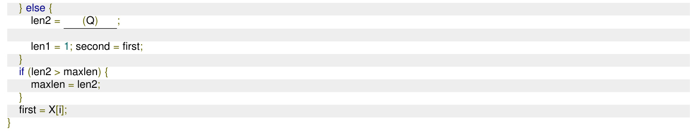

Which one of the following options gives the CORRECT missing expressions?

(Hint: At the end of the $_ i$ -th iteration, the value of is the length of the longest subarray ending with $\mathbf { X } [ i ]$ that contains all equal values, and is the length of the longest subarray ending with $\mathbf { X } [ i ]$ that contains at most two distinct values.)

A. (P) len1 +1 (Q） len2 +1   
B. (P)1 (Q） len1 +1   
C. (P)1 （Q） len2 +1   
D. (P) len2 +1 (Q） len1 +1

Consider the following problem. Given $\scriptstyle n$ positive integers $a _ { 1 } , a _ { 2 } \dots a _ { n }$ it is required to partition them in to two parts $A$ and $B$ such that, $\left| \sum _ { i \in A } a _ { i } - \sum _ { i \in B } a _ { i } \right|$ is minimised   
Consider a greedy algorithm for solving this problem. The numbers are ordered so that $a _ { 1 } \geq a _ { 2 } \geq . . . a _ { n }$ and at $i ^ { t h }$ step, $a _ { i }$ is placed in that part whose sum in smaller at that step. Give an example with $n = 5$ for which the solution produced by the greedy algorithm is not optimal.

Match the pairs in the following questions:

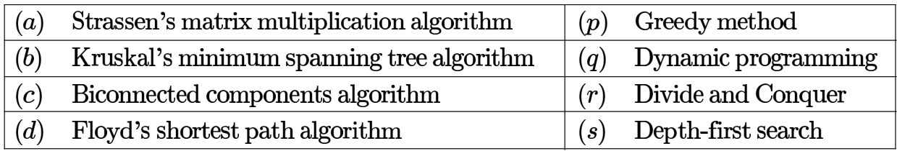

Merge sort uses:

A. Divide and conquer strategy B. Backtracking approach C. Heuristic search D. Greedy approach

gate1995 algorithms sorting easy algorithm-design-techniques merge-sort

# Answer key☟

The correct matching for the following pairs is

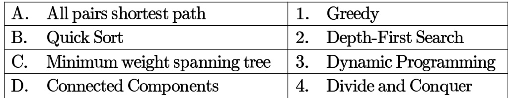

A. A-2 B-4 C-1 D-3 B. A-3 B-4 C-1 D-2 C. A-3 B-4 C-2 D-1 D. A-4 B-1 C-2 D-3

gate1997 algorithms normal algorithm-design-techniques easy match-the-following

Which one of the following algorithm design techniques is used in finding all pairs of shortest distances in a graph?

A. Dynamic programming B. Backtracking C. Greedy D. Divide and Conquer

gate1998 algorithms algorithm-design-techniques easy isro2008

# Answer key☟

# 1.2.7 Algorithm Design Techniques: GATE CSE 2015 Set Question: 6

Match the following:

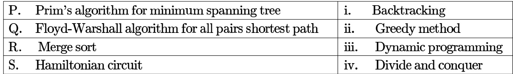

A. P-ii, Q-ii,R-iv, S-i B. P-i, Q-ii, R-iv, S-iii C. P-i, Q-m,-iv,S D. P-i, Q-i,R-, S-iv

gatecse-2015-set1 algorithms normal match-the-following algorithm-design-techniques

# Answer key☟

Match the above algorithms on the left to the corresponding design paradigm they follow.

A. 1-i, 2-iii, 3-i, 4-v B. 1-ii, 2-ii,3-i,4-v C. 1-ii, 2-i,3-i, 4-iv D. 1-iii, 2-ii,3-i, 4-v

gatecse-2015-set2 algorithms easy algorithm-design-techniques match-the-following

# Consider the following table:

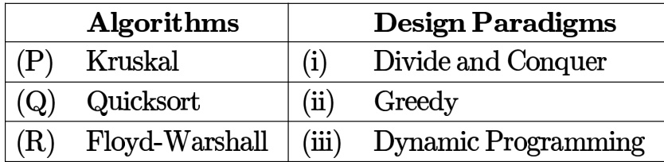

Match the algorithms to the design paradigms they are based on.

A. B. C. D. $( P )  ( i i ) , ( Q )  ( i i i ) , ( R )  ( i )$ $( P )  ( i i i ) , ( Q )  ( i ) , ( R )  ( i i )$ $( P )  ( i i ) , ( Q )  ( i ) , ( R )  ( i i i )$ $( P )  ( i ) , ( Q )  ( i i ) , ( R )  ( i i i )$

# Answer key☟

✍ Practice Tests: Test 1 (15Q) Test 2 (15Q) Test 3 (15Q) Test 4 (4Q)

Consider the following two functions:

$$
\begin{array} { l l } { g _ { 1 } ( n ) = \left\{ \begin{array} { l l } { n ^ { 3 } \mathrm { ~ f o r ~ } 0 \leq n \leq 1 0 , 0 0 } \\ { n ^ { 2 } \mathrm { ~ f o r ~ } n > 1 0 , 0 0 0 } \end{array} \right. } \\ { g _ { 2 } ( n ) = \left\{ \begin{array} { l l } { n \mathrm { ~ f o r ~ } 0 \leq n \leq 1 0 0 } \\ { n ^ { 3 } \mathrm { ~ f o r ~ } n > 1 0 0 } \end{array} \right. } \end{array}
$$

Which of the following is true?

A. $g _ { 1 } ( n )$ is $O ( g _ { 2 } ( n ) )$ B. $g _ { 1 } ( n )$ is $O ( n ^ { 3 } )$ C. $g _ { 2 } ( n )$ is $O ( g _ { 1 } ( n ) )$ D. $g _ { 2 } ( n )$ is $O ( n )$

gate1994 algorithms asymptotic-notations normal multiple-selects

# Answer key☟

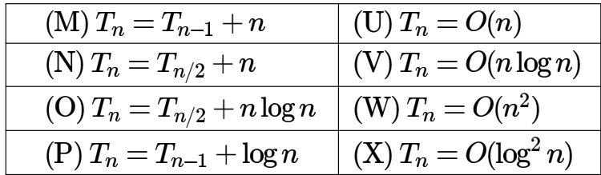

A. M-W, N-V, O-U, P-X B. M-W, N-U, O-X, P-VC. M-V, N-W, O-X, P-U D. M-W, N-U, O-V,P-X

gate1999 algorithms recurrence-relation asymptotic-notations normal match-the-following

Consider the following functions

$$
\begin{array} { l c r } { \cdot f ( n ) = 3 n { \sqrt { n } } } \\ { \cdot g ( n ) = 2 { \sqrt { n \log _ { 2 } n } } } \\ { \cdot h ( n ) = n ! } \end{array}
$$

Which of the following is true?

A. $h ( n )$ is $O ( f ( n ) )$ B. $h ( n )$ is $O ( g ( n ) )$ C. $g ( n )$ is not ${ \dot { O } } ( { \dot { f } } ( n ) )$ D. $f ( n )$ is $O ( g ( n ) )$

gatecse-2000 algorithms asymptotic-notations normal

L e t $f ( n ) = n ^ { 2 } \log n$ and $g ( n ) = n ( \log n ) ^ { 1 0 }$ be two positive functions of $n$ . Which of the following statements is correct?

A. $f ( n ) = O ( g ( n ) )$ and $g ( n ) \neq O ( f ( n ) )$ B. $g ( n ) = O ( f ( n ) )$ and $f ( n ) \neq O ( g ( n ) )$ C. $f ( n ) \neq O ( g ( n ) )$ and $g ( n ) \neq O { \dot { ( } } f ( n ) { \dot { ) } }$ D. $f \dot { ( n ) } = O \dot { ( g ( n ) ) }$ and $g ( n ) = O ( f ( n ) )$

gatecse-2001 algorithms asymptotic-notations time-complexity normal

# Answer key☟

Consider the following three claims:

I. $( n + k ) ^ { m } = \Theta ( n ^ { m } )$ where $k$ and $m$ are constants II. $2 ^ { n + 1 } = O ( 2 ^ { n } )$   
III. $2 ^ { 2 n + 1 } = \dot { O } ( 2 ^ { \dot { n } } )$

Which of the following claims are correct?

A. I and II B. I and III C. II and III D. I, II, and III

gatecse-2003 algorithms asymptotic-notations normal

Suppose $\begin{array} { r } { T ( n ) = 2 T ( \frac { n } { 2 } ) + n , T ( 0 ) = T ( 1 ) = 1 } \end{array}$ Which one of the following is FALSE?

A. $T ( n ) = O ( n ^ { 2 } )$ B. $T ( n ) = \Theta ( n \log n )$   
C. $T ( n ) = \Omega ( n ^ { 2 } )$ D. $T ( n ) = O ( n \log n )$

gatecse-2005 algorithms asymptotic-notations recurrence-relation normal

# Answer key☟

Consider the following functions:

$$
\begin{array} { l } { \cdot \ f ( n ) = 2 ^ { n } } \\ { \cdot g ( n ) = n ! } \\ { \cdot h ( n ) = n ^ { \log n } } \end{array}
$$

Which of the following statements about the asymptotic behavior of $f ( n ) , g ( n )$ and $h ( n )$ is true?

A. $f \left( n \right) = O \left( g \left( n \right) \right) ; g \left( n \right) = O \left( h \left( n \right) \right)$   
B. $f \left( n \right) = \Omega \left( g \left( n \right) \right) ; g ( n ) = O \left( h \left( n \right) \right)$   
C. $g \left( n \right) = O \left( f \left( n \right) \right) ; h \left( n \right) = O \left( f \left( n \right) \right)$   
D. $h \left( n \right) = O \left( f \left( n \right) \right) ; g \left( n \right) = \Omega \left( f \left( n \right) \right)$

Which of the given options provides the increasing order of asymptotic complexity of functions $f _ { 1 } , f _ { 2 } , f _ { 3 }$ and $f _ { 4 } { ? }$

$$
\begin{array} { l } { \cdot \ f _ { 1 } ( n ) = 2 ^ { n } } \\ { \cdot \ f _ { 2 } ( n ) = n ^ { 3 / 2 } } \\ { \cdot \ f _ { 3 } ( n ) = n \log _ { 2 } n } \\ { \cdot \ f _ { 4 } ( n ) = n ^ { \log _ { 2 } n } } \end{array}
$$

A. $f _ { 3 } , f _ { 2 } , f _ { 4 } , f _ { 1 }$ B. $f _ { 3 } , f _ { 2 } , f _ { 1 } , f _ { 4 }$   
C. $f _ { 2 } , f _ { 3 } , f _ { 1 } , f _ { 4 }$ D. $f _ { 2 } , f _ { 3 } , f _ { 4 } , f _ { 1 }$

gatecse-2011 algorithms asymptotic-notations normal

# Answer key☟

# 1.3.11 Asymptotic Notations: GATE CSE 2012 Question: 18

Let $W ( n )$ and $A ( n )$ denote respectively, the worst case and average case running time of an algorithm executed on an input of size $n$ . Which of the following is ALWAYS TRUE?

A. $A ( n ) = \Omega ( W ( n ) )$ B. $A ( n ) = \Theta ( W ( n ) )$   
C. $A ( n ) = \ O { \dot { ( } } W { \dot { ( n ) } } { \dot { ) } }$ D. $A ( n ) = \mathsf { o } ( \dot { W } ( \dot { n } ) ) \dot { }$

gatecse-2012 algorithms easy asymptotic-notations

# Answer key☟

# 1.3.12 Asymptotic Notations: GATE CSE 2015 Set 3 Question: 4

Consider the equality $\sum _ { i = 0 } ^ { n } i ^ { 3 } = X$ and the following choices for $X$ :

I. $\Theta ( n ^ { 4 } )$

II. $\Theta ( n ^ { 5 } )$   
III. $O ( n ^ { 5 } )$   
IV. $\Omega ( n ^ { 3 } )$

# The equality above remains correct if $X$ is replaced by

A. Only I B. Only II C. I or III or IV but not II D. II or III or IV but not I

gatecse-2015-set3 algorithms asymptotic-notations normal

# Answer key☟

# 1.3.13 Asymptotic Notations: GATE CSE 2015 Set 3 Question: 42

Let $f ( n ) = n$ and $g ( n ) = n ^ { ( 1 + \sin n ) }$ , where $n$ is a positive integer. Which of the following statements is/are correct?

I. $f ( n ) = O ( g ( n ) )$   
II. $f ( n ) = \Omega ( g ( n ) )$

A. Only I B. Only II C. Both and II D. Neither nor II

gatecse-2015-set3 algorithms asymptotic-notations normal

Answer key☟

# 1.3.14 Asymptotic Notations: GATE CSE 2017 Set 1 Question: 04

Consider the following functions from positive integers to real numbers:

$\begin{array} { r } { 1 0 , \sqrt { n } , n , \log _ { 2 } n , \frac { 1 0 0 } { n } . } \end{array}$ The CORRECT arrangement of the above functions in increasing order of asymptotic complexity is:

A. $\log _ { 2 } n , { \frac { 1 0 0 } { n } }$ , $\sqrt { n }$ , B. 100 , , $\sqrt { n }$ , C. , ${ \begin{array} { c } { { \frac { 1 0 0 } { n } } , { \sqrt { n } } , \log _ { 2 } n , n } \end{array} }$ D. 100 , , $\sqrt { n }$ , n

gatecse-2017-set1 algorithms asymptotic-notations normal

# Answer key☟

Consider the following three functions.

$$
f _ { 1 } = 1 0 ^ { n } \quad f _ { 2 } = n ^ { \log n } \quad f _ { 3 } = n ^ { \sqrt { n } }
$$

Which one of the following options arranges the functions in the increasing order of asymptotic growth rate?

A. $f _ { 3 } , f _ { 2 } , f _ { 1 }$ $\begin{array} { c } { { \mathsf { B . } f _ { 2 } , f _ { 1 } , f _ { 3 } } } \\ { { \mathsf { D . } f _ { 2 } , f _ { 3 } , f _ { 1 } } } \end{array}$   
C. $f _ { 1 } , f _ { 2 } , f _ { 3 }$

gatecse-2021-set1 algorithms asymptotic-notations one-mark

# Answer key☟

# 1.3.16 Asymptotic Notations: GATE CSE 2022 Question:

Which one of the following statements is  for all positive functions $f ( n ) \ ?$

A. $f ( n ^ { 2 } ) = \theta ( f ( n ) ^ { 2 } )$ when $f ( n )$ is a polynomial   
B. $f ( n ^ { 2 } ) = o ( f ( n ) ^ { 2 } )$   
C. $f ( n ^ { 2 } ) = O ( f ( n ) ^ { 2 } )$ when $f ( n )$ is an exponential function D. $f ( n ^ { 2 } ) = \Omega ( f ( n ) ^ { 2 } )$

Let $f$ and $g$ be functions of natural numbers given by $f ( n ) = n$ and $g ( n ) = n ^ { 2 }$ · Which of the following statements is/are

A. $f \in O ( g )$ $\begin{array} { c } { { \mathsf { B . } \ f \in \Omega ( g ) } } \\ { { \mathsf { D . } \ f \in \Theta ( g ) } } \end{array}$   
C. $f \in o ( g )$

# Consider functions Function_1 and  expressed in pseudocode as follows:

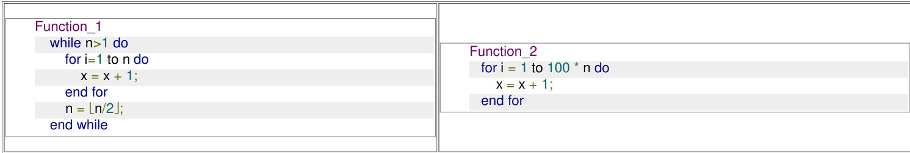

Let $f _ { 1 } ( n )$ and $f _ { 2 } ( n )$ denote the number of times the statement $\mathbf { \mu } ^ { \mathfrak { s } } \mathbf { x } = \mathbf { x } + \mathbf { 1 } ^ { \mathfrak { n } }$ is executed in Function_1 and respectively.

Which of the following statements is/are TRUE?

A. $f _ { 1 } ( n ) \in \Theta \left( f _ { 2 } ( n ) \right)$ B. $f _ { 1 } ( n ) \in o \left( f _ { 2 } ( n ) \right)$   
C. $f _ { 1 } ( n ) \in \omega ( f _ { 2 } ( n ) )$ D. $f _ { 1 } ( n ) \in O ( n )$

​Let $\mathrm { T } ( \mathbf { n } )$ be the recurrence relation defined as follows:

$$
\begin{array} { l } { T ( 0 ) = 1 , } \\ { T ( 1 ) = 2 , \mathrm { { a n d } } } \\ { T ( n ) = 5 T ( n - 1 ) - 6 T ( n - 2 ) \mathrm { { f o r } } n \geq 2 } \end{array}
$$

Which one of the following statements is TRUE?

A. $T ( n ) = \Theta \left( 2 ^ { n } \right)$ $\begin{array} { r } { \mathsf { B . ~ } T ( n ) = \Theta \left( n 2 ^ { n } \right) } \\ { \mathsf { D . ~ } T ( n ) = \Theta \left( n 3 ^ { n } \right) } \end{array}$   
C. $T ( n ) = \Theta \left( 3 ^ { n } \right)$

gatecse-2024-set2 algorithms recurrence-relation asymptotic-notations one-mark

C. $\log ( n ) , n ^ { 1 / 3 }$ ,log(n!), ,2l0g(n) D. $2 ^ { \log ( n ) }$ ,n1/3, $\log ( n ) , \log ( n ! )$

Let $f ( n ) , g ( n )$ and $h ( n )$ be functions defined for positive integers such that $f ( n ) { \stackrel { . } { = } } O ( g ( n ) ) , g ( n ) \neq O ( f ( n ) ) , g ( n ) = O ( h ( n ) )$ , and $h ( n ) = O ( g ( n ) )$ . Which one of the following statements is FALSE?

A. $f ( n ) + g ( n ) = O ( h ( n ) + h ( n ) )$ B. $f ( n ) = O ( h ( n ) )$   
C. $h ( n ) \neq O ( { \dot { f } } ( n ) )$ D. $f ( n ) h ( n ) \neq O ( g ( n ) h ( n ) )$

gateit-2004 algorithms asymptotic-notations normal

Answer key☟

Arrange the following functions in increasing asymptotic order:

a.   
b. $e ^ { n }$   
c.   
d.   
e. 1.0000001

A. a, d, c, e, b B. d, a, c, e, b C. a, c, d, e, b D. a, c, d, b, e

gateit-2008 algorithms asymptotic-notations normal

# Answer key☟

Which of the following statement(s) is/are correct regarding Bellman-Ford shortest path algorithm? P: Always finds a negative weighted cycle, if one exists. Q: Finds whether any negative weighted cycle is reachable from the source.

A. $P$ only B. $Q$ only C. Both $P$ and $Q$ D. Neither $P$ nor $Q$

gatecse-2009 algorithms graph-algorithms normal bellman-ford

Which of the following indices of $P$ do/does NOT correspond to any leaf node of the minheap?

A. B. C. $\scriptstyle { \frac { n - 3 } { 2 } }$ D. n

gatecse-2026-set1 algorithms binary-heap multiple-selects one-mark

# Answer key☟

✍ Practice Test: Test (6Q)

What is the worst-case number of arithmetic operations performed by recursive binary search on a sorted array of size ?

A. $\Theta ( { \sqrt { n } } )$ B. 0(log2(n)) C. $\Theta ( \dot { n } ^ { 2 } )$ D. (n)

gatecse-2021-set2 algorithms binary-search time-complexity one-mark

Answer key☟

For which of the following inputs does binary search take time $O ( \log n )$ in the worst case?

A. An array of $n$ integers in any order B. A linked list of $\scriptstyle n$ integers in any order C. An array of $n$ integers in increasing order D. A linked list of $n$ integers in increasing order gateda-2025 algorithms binary- search multiple-selects one-mark

Let A be a sorted array containing  distinct integers. You perform a recursive binary search on A to find an element . Suppose each comparison checks whether the middle element computed during the current recursive step is equal to, less than, or greater than .

The maximum number of comparisons that may have to be performed if  is not an element of $A$ is (Answer in integer)

gateda-2026 algorithms binary-search numerical-answers one-mark

Let $F ( n )$ denote the maximum number of comparisons made while searching for an entry in a sorted array of size $\scriptstyle n$ using binary search.

Which ONE of the following options is TRUE?

A. $F ( n ) = F ( \lfloor n / 2 \rfloor ) + 1$ B. $F ( n ) = F ( \lfloor n / 2 \rfloor ) + F ( \lceil n / 2 \rceil )$   
C. $F ( n ) = F ( \lfloor n / 2 \rfloor )$ D. $F ( n ) = F ( n - 1 ) + 1$

gate-ds-ai-2024 algorithms binary-search two-marks

Answer key☟

Which one of the following elements can NEVER be the third element that is inserted?

A. B. C. D.

gatecse-2026-set1 algorithms binary-search-tree two-marks

The following sequence corresponds to the preorder traversal of a binary search tree $T$ :

The position of the element in the postorder traversal of $T$ is (answer in integer) Note: The position begins with .

gatecse-2026-set1 numerical-answers two-marks binar y-search-tree algorithms

Consider a binary search tree (BST) with $\scriptstyle n$ leaf nodes $( n > 0 )$ . Given any node $V$ , the key present in the node is denoted as $\operatorname { V a l } ( V )$ . All the keys present in the given BST are distinct. The keys belong to the set of real numbers.

For a node $V$ , let $\operatorname { S u c } ( V )$ denote the node that is its inorder successor. If a node $V$ does not have an inorder successor, then $\operatorname { S u c } ( V )$ is . As there are no duplicates, if $\operatorname { S u c } ( V )$ is not , then $\operatorname { V a l } ( V ) < \operatorname { V a l } ( \operatorname { S u c } ( V ) )$ .

Corresponding to every leaf node $\mathbf { { { L } } } _ { i }$ that has a non-NULL $\operatorname { S u c } ( L _ { i } )$ , a new key $k _ { i }$ with the following property is to be inserted into the BST.

$$
\mathrm { V a l } ( L _ { i } ) < k _ { i } < V a l ( \mathrm { S u c } ( L _ { i } ) )
$$

Let $K$ represent the list of all such new keys to be inserted into the BST. Which of the following statements is/are true?

A. $K$ cannot have any duplicates   
B. $K$ will have at least one element   
C. After inserting all keys from $K$ , the height of the BST can increase at most by one   
D. Number of nodes in the BST will double after inserting all keys from $K$

gatecse-2026-set2 algorithms binary-search-tree multiple-selects two-marks

Let $G ( V , E )$ be an undirected and unweighted graph with vertices. Let $d ( u , v )$ denote the number edges in a shortest path between vertices $u$ and $v$ in $V$ . Let the maximum value of $d ( u , v ) , u , v \in V$ such that $u \neq v$ , be . Let $T$ be any breadth-first-search tree of $G$ . Which ONE of the given options is CORRECT for every such graph $G$ ?

A. The height of $T$ is exactly . B. The height of $T$ is exactly .   
C. The height of $T$ is at least . D. The height of $T$ is at least .

gatecse2025-set1 algorithms breadth-first-search shortest-path two-marks

Consider a directed graph $G = ( V , E )$ , where $V$ is the finite set of vertices and $E$ is the set of directed edges between the vertices. $G$ may contain cycles but there is no self-loop. Further, $G$ may not be strongly connected.

Let be the graph obtained by reversing the directions of all the edges in $G$ without changing the set of vertices. Assume that Breadth First Search (BFS) or Depth First Search (DFS) from any given vertex $v$ of a graph visits only the reachable vertices from $v$ in that graph.

Which of the following statements must always be true, regardless of the structure of $G ?$

A. If $u$ is a reachable vertex in the BFS of $G ^ { R }$ from $v$ , then $u$ is also a reachable vertex in the DFS of $G$ from $v$ .   
B. In $G ^ { R }$ , the BFS traversal from $v$ will visit exactly the same set of vertices as the DFS from $v$ in $G$ .   
C. The order of vertices visited in the BFS of $G ^ { R }$ from $v$ is the reverse of the order of vertices visited in the DFS of $G$ from $v$ .   
D. If $u$ is a reachable vertex in the DFS of $G$ from $v$ , then $v$ is also a reachable vertex in the BFS of from $u$ .

gateda-2026 algorithms graph-algorithms breadth-first-search depth-first-search two-marks

Consider a state space where the start state is number . The successor function for the state numbered $n$ returns two states numbered $n + 1$ and $n + 2 .$ . Assume that the states in the unexpanded state list are expanded in the ascending order of numbers and the previously expanded states are not added to the unexpanded state list.

Which ONE of the following statements about breadth-first search (BFS) and depth-first search (DFS) is true, when reaching the goal state number ?

A. BFS expands more states than DFS.   
B. DFS expands more states than BFS.   
C. Both BFS and DFS expand equal number of states.   
D. Both BFS and DFS do not reach the goal state number .

# 1.11.1 Computer Science: GATE CS Practice The "Master Theorem" (Algorithms)

Consider the following recurrence relation describing the running time of an algorithm:

$$
T ( n ) = 2 T \left( { \frac { n } { 2 } } \right) + { \frac { n } { \log n } }
$$

$$
( B a s e c o n d i t i o n : T ( 1 ) = 1 )
$$

What is the asymptotic tight bound $\Theta ( T ( n ) ) ?$

A. $\Theta ( n )$ B. $\Theta ( n \log n )$   
C. $\Theta ( n \log \log n )$ D. $\Theta ( n ( \log n ) ^ { 2 } )$

algorithms master-theorem recurrence-relation computer-science gate-preparation

# Answer key☟

✍ Practice Test: Test 1 (12Q)

Consider the following pseudocode for depth-first search (DFS) algorithm which takes a directed graph $G ( V , E )$ as input, where $d [ v ]$ and $f [ v ]$ are the discovery time and finishing time, respectively, of the vertex $v \in V$ .

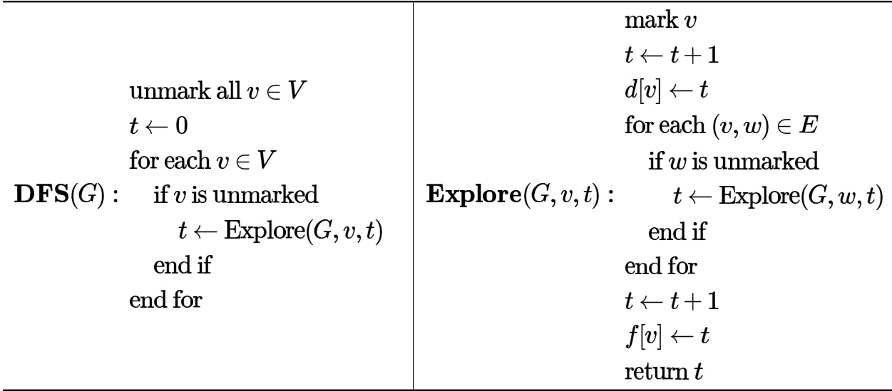

Suppose that the input directed graph $G ( V , E )$ is a directed acyclic graph (DAG). For an edge $( u , v ) \in E$ , which of the following options will NEVER be correct?

$d [ u ] < d [ v ] < f [ v ] < f [ u ]$ DB. $d [ v ] < d [ u ] < f [ u ] < f [ v ]$ $d [ v ] < f [ v ] < d [ u ] < f [ u ]$ $d [ u ] < d [ v ] < f [ u ] < f [ v ]$

Consider a directed graph $G = ( V , E )$ , where $V = \{ 0 , 1 , 2 , \ldots , 1 0 0 \}$ and $E = \{ ( i , j ) : 0 < j - i \leq 2$ for all $i , j \in V \}$ . Suppose the adjacency list of each vertex is in decreasing order of vertex number, and depth-first search  is performed at vertex . The number of vertices that will be discovered after vertex  is (Answer in integer)

gateda-2025 algorithms depth-first-search numerical-answers two-marks

# 1.13

# Dijkstras Algorithm (5)

✍ Practice Test: Test 1 (12Q)

Let $G$ be the directed, weighted graph shown in below figure

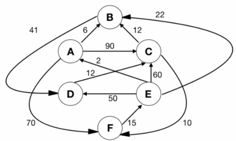

We are interested in the shortest paths from $A$ .

a. Output the sequence of vertices identified by the Dijkstra’s algorithm for single source shortest path when the algorithm is started at node $A$   
b. Write down sequence of vertices in the shortest path from $A$ to $E$   
c. What is the cost of the shortest path from $A$ to $E ?$

Suppose we run Dijkstra’s single source shortest path algorithm on the following edge-weighted directed graph with vertex $P$ as the source.

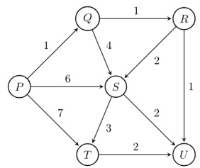

In what order do the nodes get included into the set of vertices for which the shortest path distances are finalized?

A. $P , Q , R , S , T , U$ B. P,Q,R,U,S,T C. P,Q,R,U,T,S D. P,Q,T,R,U,S

gatecse-2004 algorithms graph-algorithms normal dijkstras-algorithm

C. $O ( | V | \log | V | )$ [ $O ( ( | E | + | V | ) \log | V | )$

gatecse-2005 algorithms graph-algorithms normal dijkstras-algorithm

To implement Dijkstra’s shortest path algorithm on unweighted graphs so that it runs in linear time, the data structure to be used is:

A. Queue B. Stack C. Heap D. B-Tree

gatecse-2006 algorithms graph-algorithms easy dijkstras-algorithm

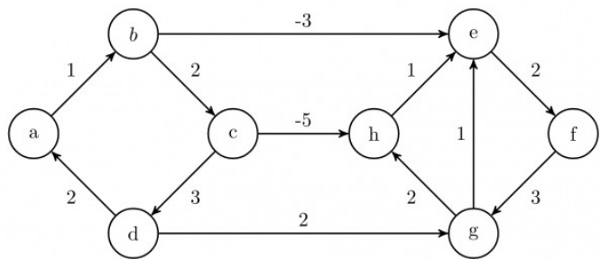

Dijkstra's single source shortest path algorithm when run from vertex $\mathbf { \Delta } _ { a }$ in the above graph, computes the correct shortest path distance to

A. only vertex $a$ B. only vertices $_ { a , e , f , g , h }$ C. only vertices $^ { a , b , c , d }$ D. all the vertices

gatecse-2008 algorithms graph-algorithms normal dijkstras-algorithm

# 1.14.1 Directed Acyclic Graph: GATE CSE 2021 Set 2 Question: 55

In a directed acyclic graph with a source vertex , the  of a directed path is defined to be product of the weights of the edges on the path. Further, for a vertex $v$ other than , the quality-score of $v$ is defined to be the maximum among the quality-scores of all the paths from  to $v$ . The quality-score of  is assumed to be .

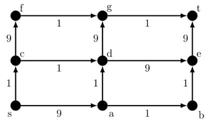

The sum of the quality-scores of all vertices on the graph shown above is gatecse-2021-set2 algorithms graph-algorithms directed-acyclic-graph numerical-answers two-marks

C. 0(nm) D. $\Theta ( n ^ { 3 } )$

gatecse-2026-set2 algorithms shortest-path directed-acyclic-graph time-complexity two-marks

Consider a double hashing scheme in which the primary hash function is $h _ { 1 } ( k ) = k { \bmod { 2 3 } }$ , and secondary hash function is $h _ { 2 } ( k ) = 1 + ( k { \bmod { 1 9 } } )$ . Assume that the table size i s . Then the address returned by probe in the probe sequence (assume that the probe sequence begins at probe ) for key value $k = 9 0$ is_

gatecse-2020 numerical-answers algorithms hashing one-mark double-hashing

In a double hashing scheme, $h _ { 1 } ( k ) = k { \bmod { 1 1 } }$ and $h _ { 2 } ( k ) = 1 + ( k \bmod 7 )$ are the auxiliary hash functions. The size $\scriptstyle m$ of the hash table is . The hash function for the $_ i$ -th probe in the open address table is $[ h _ { 1 } ( k ) + i h _ { 2 } ( k ) ]$ mod $m$ . The following keys are inserted in the given order: 79, 67,24.

The slot at which key  gets stored is (Answer in integer)

gatecse2025-set1 algorithms hashing double-hashing numerical-answers easy two-marks

# 1.16

# Dynamic Programming (10)

✍ Practice Test: Test 1 (13Q)

# 1.16.1 Dynamic Programming: GATE CSE 2008 Question: 80

The subset-sum problem is defined as follows. Given a set of $\scriptstyle n$ positive integers, $S = \{ a _ { 1 } , a _ { 2 } , a _ { 3 } , . . . , a _ { n } \}$ , and positive integer $W$ , is there a subset of $\boldsymbol { S }$ whose elements sum to $W ?$ A dynamic program for solving this problem uses a 2-dimensional Boolean array, $X$ , with $n$ rows and $W { + 1 }$ columns. $X [ i , j ] , 1 \le i \le n , 0 \le j \le W$ , is TRUE, if and only if there is a subset of $\{ a _ { 1 } , a _ { 2 } , \ldots , a _ { i } \}$ whose elements sum to $j$ .

Which of the following is valid for $2 \leq i \leq n$ , and $a _ { i } \leq j \leq W ?$

A. $X [ i , j ] = X [ i - 1 , j ] \vee X [ i , j - a _ { i } ]$   
B. $X \bar { \lbrack { i , j } \rbrack } = X \bar { \lbrack { i - 1 , j } \rbrack } \vee X \bar { \lbrack { i - 1 , j - a _ { i } } \rbrack }$   
C. $X [ i , j ] = X [ i - 1 , j ] \wedge X [ i , j - a _ { i } ]$   
D. $X [ i , j ] = X [ i - 1 , j ] \land X [ i - 1 , j - a _ { i } ]$

gatecse-2008 algorithms difficult dynamic-programming

# 1.16.2 Dynamic Programming: GATE CSE 2008 Question: 81

The subset-sum problem is defined as follows. Given a set of $n$ positive integers, $S = \{ a _ { 1 } , a _ { 2 } , a _ { 3 } , . . . , a _ { n } \}$ , and positive integer $W$ , is there a subset of $\boldsymbol { S }$ whose elements sum to $W ?$ A dynamic program for solving this problem uses a Boolean array, $X$ , with $n$ rows and $W { + 1 }$ columns. $X [ i , j ] , 1 \le i \le n , 0 \le j \le W$ , is TRUE, if and only if there is a subset of $\{ a _ { 1 } , a _ { 2 } , \ldots , a _ { i } \}$ whose elements sum to $j$ .

Which entry of the array $X$ , if TRUE, implies that there is a subset whose elements sum to ?

A. $X [ 1 , W ]$ $\mathsf { B } . \ X [ n , 0 ]$ $\mathsf { C } . \ X [ n , W ]$ $\mathsf { D } . \ X [ n - 1 , n ]$

gatecse-2008 algorithms normal dynamic-programming

A sub-sequence of a given sequence is just the given sequence with some elements (possibly none or all) left out. We are given two sequences $X [ m ]$ and $Y [ n ]$ of lengths $m$ and $n$ , respectively with indexes of $X$ and $Y$ starting from .

We wish to find the length of the longest common sub-sequence (LCS) of $X [ m ]$ and $Y [ n ]$ as $l ( m , n )$ , where an incomplete recursive definition for the function $I ( i , j )$ to compute the length of the LCS of ${ \bar { X } } [ m ]$ and ${ \dot { Y } } [ n ]$ is given below:

$$
\begin{array} { r l } { ( \mathsf { i } , \mathsf { j } ) } & { = 0 , \mathsf { i f \ e i t h e r \ i = 0 \ o r \ j = 0 } } \\ & { = \mathsf { e x p r 1 , \ i f \ i , j > 0 \ a n d \times } [ \mathsf { i - 1 } ] = \mathsf { Y } [ \mathsf { j - 1 } ] } \\ & { = \mathsf { e x p r 2 , \ i f \ i , j > 0 \ a n d \times } [ \mathsf { i - 1 } ] \neq \mathsf { Y } [ \mathsf { j - 1 } ] } \end{array}
$$

Which one of the following options is correct?

A. $\mathrm { e x p r 1 } = l ( i - 1 , j ) + 1$ B. $\mathrm { e x p r 1 } = l ( i , j - 1 )$   
C. $\mathrm { e x p r 2 } = \operatorname* { m a x } \left( l ( i - 1 , j ) , l ( i , j - 1 ) \right)$ $\rangle . \mathrm { \ e x p r { 2 } } = \operatorname* { m a x } \left( l \left( i - 1 , j - 1 \right) , l ( i , j ) \right)$

gatecse-2009 algorithms normal dynamic-programming recursion

# Answer key☟

A sub-sequence of a given sequence is just the given sequence with some elements (possibly none or all) left out. We are given two sequences $X [ m ]$ and $Y [ n ]$ of lengths $m$ and $n$ , respectively with indexes of $X$ and $Y$ starting from .

iWnceowmipslhetteorfiencdurtshive  ednegfitnhitiofntfhoer ltohnegfeusntctcionm $I ( i , j )$ utbo- sceoqmupeuntce th(LeCleSn)gotfh $X [ m ]$ LanCdS $Y [ n ]$ ${ \bar { X } } [ m ]$ $l ( m , n )$ ${ \dot { Y } } [ n ]$ ihsergeivean below:

$| ( { \dot { \mathsf { I } } } , { \dot { \mathsf { J } } } ) \ = 0$ , if either $\dot { \mathsf { I } } = 0$ or ${ \bf j } = 0$ $\boldsymbol { \mathbf { \rho } } = \mathsf { e x p r 1 }$ , if $\lvert \ j \rvert > 0$ and $\mathsf { X } [ \mathsf { i } - 1 ] = \mathsf { Y } [ \mathsf { j } - 1 ]$ $\mathsf { \Lambda } = \mathsf { e x p r } 2$ , if $\mathrm { i , j } > 0$ and $\mathsf { X } [ \mathsf { i } - 1 ] \neq \mathsf { Y } [ \mathsf { i } - 1$ ]

The value of $l ( i , j )$ could be obtained by dynamic programming based on the correct recursive definition of $l ( i , j )$ of the form given above, using an array $L [ \boldsymbol { M } , \boldsymbol { N } ]$ , where $M = m + 1$ and $N = n + 1$ , such that $L [ i , j ] = l ( i , j )$ . Which one of the following statements would be TRUE regarding the dynamic programming solution for the recursive definition of $l ( i , j ) ?$

A. All elements of $L$ should be initialized to 0 for the values of $l ( i , j )$ to be properly computed.   
B. The values of $l ( i , j )$ may be computed in a row major order or column major order of ${ \cal L } [ { \cal M } , { \cal N } ]$ .   
C. The values of $l ( i , j )$ cannot be computed in either row major order or column major order of $\mathbf { \Psi } _ { L [ M , N ] }$ .   
D. $L [ p , q ]$ needs to be computed before $L [ r , s ]$ if either $p < r$ or $q < s$ .

gatecse-2009 normal algorithms dynamic-programming recursion

An algorithm to find the length of the longest monotonically increasing sequence of numbers in an array $A [ 0 : n - 1 ]$ is given below.

Let , denote the length of the longest monotonically increasing sequence starting at index $i$ in the array.   
Initialize $L _ { n - 1 } = 1$ .

For all $i$ such that $0 \leq i \leq n - 2$

$$
L _ { i } = { \left\{ \begin{array} { l l } { 1 + L _ { i + 1 } } & { { \mathrm { ~ i f ~ A [ i ] < A [ i + 1 ] ~ } } } \\ { 1 } & { { \mathrm { ~ O t h e r w i s e } } } \end{array} \right. }
$$

Finally, the length of the longest monotonically increasing sequence is $( L _ { 0 } , L _ { 1 } , . . . , L _ { n - 1 } )$ Which of the following statements is TRUE?

A. The algorithm uses dynamic programming paradigm   
B. The algorithm has a linear complexity and uses branch and bound paradigm   
C. The algorithm has a non-linear polynomial complexity and uses branch and bound paradigm   
D. The algorithm uses divide and conquer paradigm

gatecse-2011 algorithms easy dynamic-programming

Consider two strings $\textit { \textbf { A } } = " q p q r r "$ and $\textit { B } = " p q p r q r p "$ . Let $x$ be the length of the longest common subsequence (not necessarily contiguous) between $A$ and $B$ and let $y$ be the number of such longest common subsequences between $A$ and $B$ . Then $x + 1 0 y =$

gatecse-2014-set2 algorithms normal numerical-answers dynamic-programming

# 1.16.8 Dynamic Programming: GATE CSE 2014 Set 3 Question: 37

Suppose you want to move from to  on the number line. In each step, you either move right by a distance or you take a shortcut. A shortcut is simply a pre-specified pair of integers $j \operatorname { w i t h } i < j .$ . Given a shortcut $( i , j )$ , if you are at position $\mathbf { \chi } _ { i }$ on the number line, you may directly move to $j$ . Suppose $T ( k )$ denotes the smallest number of steps needed to move from $k$ to . Suppose further that there is at most shortcut involving any number, and in particular, from 9 there is a shortcut to . Let $y$ and $z$ be such that $T ( 9 ) = 1 + \operatorname* { m i n } ( T ( y ) , T ( z ) )$ . Then the value of the product $y z$ is

gatecse-2014-set3 algorithms normal numerical-answers dynamic-programming

The Floyd-Warshall algorithm for all-pair shortest paths computation is based on

A. Greedy paradigm.   
B. Divide-and-conquer paradigm.   
C. Dynamic Programming paradigm.   
D. Neither Greedy nor Divide-and-Conquer nor Dynamic Programming paradigm.

gatecse-2016-set2 algorithms dynamic-programming easy

# 1.16.10 Dynamic Programming: GATE CSE 2026 Set 2 Question: 29

Consider a table $T _ { : }$ where the elements $T [ i ] [ j ] , 0 \leq i , j \leq n$ , represent the cost of the optimal solutions of different subproblems of a problem that is being solved using a dynamic programming algorithm. The recursive formulation to compute the table entries is as follows:

$$
\begin{array} { r l r l } & { T [ 0 ] [ k ] = T [ k ] [ 0 ] = 1 } & & { { \mathrm { f o r ~ } } k = 0 , 1 , 2 , \ldots , n } \\ & { T [ i ] [ j ] = 2 T [ i - 1 ] [ j ] + 3 T [ i ] [ j - 1 ] } & & { { \mathrm { f o r ~ } } 1 \leq i , j \leq n } \end{array}
$$

Consider the following two algorithms to compute entries of $T$ . Assume that for both the algorithms, for all $0 \leq i , j \leq n , T [ i ] [ j ]$ has been initialized to .   
Algorithm $B _ { 1 }$ : For $\bar { i } \bar { = } 1 , 2 , \ldots , n$

$$
\begin{array} { l } { { \mathrm { F o r } j = 1 , 2 , . . . , n } } \\ { { T [ i ] [ j ] = 2 T [ i - 1 ] [ j ] + 3 T [ i ] [ j - 1 ] } } \end{array}
$$

Algorithm $B _ { 2 } : \mathsf { F o r } s = 2 , 3 , \hdots , 2 n$

$$
\begin{array} { c } { { \mathrm { F o r } i = 1 , 2 , . . . , n } } \\ { { \mathrm { F o r } j = 1 , 2 , . . . , n } } \\ { { \mathrm { I f } \left( i + j = = s \right) } } \\ { { T [ i ] [ j ] = 2 T [ i - 1 ] [ j ] + 3 T [ i ] [ j - 1 ] } } \end{array}
$$

Algorithm $B _ { k } , k \in \{ 1 , 2 \}$ is said to be correct if and only if it calculates the correct values of $T [ i ] [ j ]$ , for all $0 \leq i , j \leq n$ , (as per the recursive formulation) at the end of the execution of the algorithm .

Which one of the following statements is true?

A. Both algorithms $B _ { 1 }$ and $B _ { 2 }$ are correct B. Algorithm $B _ { 1 }$ is correct, but algorithm $B _ { 2 }$ is incorrect C. Algorithm $B _ { 2 }$ is correct, but algorithm $B _ { 1 }$ is incorrect D. Both algorithms $B _ { 1 }$ and $B _ { 2 }$ are incorrect

✍ Practice Test: Test 1 (14Q)

Which of the following statements is false?

A. Optimal binary search tree construction can be performed efficiently using dynamic programming B. Breadth-first search cannot be used to find connected components of a graph C. Given the prefix and postfix walks over a binary tree, the binary tree cannot be uniquely constructed. D. Depth-first search can be used to find connected components of a graph

$$
A [ j , k ] = { \left\{ \begin{array} { l l } { 1 , } & { { \mathrm { i f ~ } } ( j , k ) \in E } \\ { 0 , } & { { \mathrm { o t h e r w i s e } } } \end{array} \right. }
$$

Consider the following algorithm:

for $\mathbf { i } = 1$ to n for j=1 to n for $\mathsf { k } = 1$ to n $\mathsf { A } [ \mathsf { j } , \mathsf { k } ] = \mathsf { m a x } ( \mathsf { A } [ \mathsf { j } , \mathsf { k } ] , \mathsf { A } [ \mathsf { j } , \mathsf { i } ] + \mathsf { A } [ \mathsf { i } , \mathsf { k } ] ) ;$ ;

Which of the following statements is necessarily true for all $j$ and $k$ after termination of the above algorithm?

A. $A [ j , k ] \leq n$   
B. If $A [ j , j ] \geq n - 1$ then $G$ has a Hamiltonian cycle   
C. If there exists a path from $j$ to $k , A [ j , k ]$ contains the longest path length from $j$ to $k$ D. If there exists a path from $j$ to $k$ , every simple path from $j$ to $k$ contains at most $A [ j , k ]$ edges

gatecse-2003 algorithms graph -algorithms normal

Let $\pmb { s }$ and $t$ be two vertices in a undirected graph $G = ( V , E )$ having distinct positive edge weights. Let $[ X , Y ]$ be a partition of $V$ such that $s \in X$ and $t \in Y$ . Consider the edge $e$ having the minimum weight amongst all those edges that have one vertex in $X$ and one vertex in $Y$ .

The edge $e$ must definitely belong to:

A. the minimum weighted spanning tree of $G$ B. the weighted shortest path from $\pmb { s }$ to $\mathbf { \Psi } _ { t }$ C. each path from $\pmb { s }$ to $\mathbf { \Psi } _ { t }$ D. the weighted longest path from $s$ to $t$

gatecse-2005 algorithms graph-algorithms normal

Let $\pmb { s }$ and $t$ be two vertices in a undirected graph $G = ( V , E )$ having distinct positive edge weights. Let $[ X , Y ]$ be a partition of $V$ such that $s \in X$ and $t \in Y$ . Consider the edge $e$ having the minimum weight amongst all those edges that have one vertex in $X$ and one vertex in $Y$ .

Let the weight of an edge $e$ denote the congestion on that edge. The congestion on a path is defined to be the maximum of the congestions on the edges of the path. We wish to find the path from $\pmb { s }$ to $t$ having minimum congestion. Which of the following paths is always such a path of minimum congestion?

A. a path from to $t$ in the minimum weighted spanning treeB. a weighted shortest path from $s$ to $t$ C. an Euler walk from $s$ to $t$ D. a Hamiltonian path from $s$ to $t$

gatecse-2005 algorithms graph-algorithms normal

# 1.17.5 Graph Algorithms: GATE CSE 2016 Set 2 Question: 41

In an adjacency list representation of an undirected simple graph $G = ( V , E )$ , each edge $( u , v )$ has adjacency list entries: $[ v ]$ in the adjacency list of $u$ , and $[ u ]$ in the adjacency list of $v$ . These are called twins of each other. A twin pointer is a pointer from an adjacency list entry to its twin. If $| E | = m$ and $| V | = n$ , and the memory size is not a constraint, what is the time complexity of the most efficient algorithm to set the twin pointer in each entry in each adjacency list?

A. $\Theta ( n ^ { 2 } )$ $\begin{array} { l } { { { \sf B . \Theta } \displaystyle \Theta \left( n + m \right) } } \\ { { { \sf D . \Theta } \displaystyle \Theta \left( n ^ { 4 } \right) } } \end{array}$   
C. $\Theta \left( m ^ { 2 } \right)$

Let $G = ( V , E )$ be  connected, undirected, edge-weighted graph. The weights of the edges in $E$ are positive and distinct. Consider the following statements:

I. Minimum Spanning Tree of $G$ is always unique.   
II. Shortest path between any two vertices of $G$ is always unique.

Which of the above statements is/are necessarily true?

A. I only B. II only C. both and II D. neither nor II

gatecse-2017-set1 algorithms graph-algorithms normal

Consider the following directed graph:

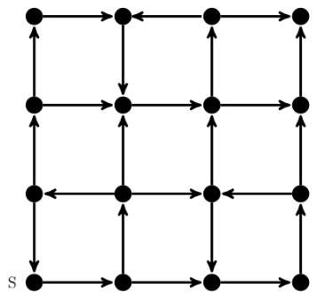

Which of the following is/are correct about the graph?

A. The graph does not have a topological order   
B. A depth-first traversal starting at vertex $\boldsymbol { S }$ classifies three directed edges as back edges   
C. The graph does not have a strongly connected component   
D. For each pair of vertices $u$ and , there is a directed path from $u$ to $v$

Let $G ( V , E )$ be an undirected, edge-weighted graph with integer weights. The weight of a path is the sum of the weights of the edges in that path. The length of a path is the number of edges in that path.

Let $s \in V$ be a vertex in $G$ . For every $u \in V$ and for every $k \geq 0$ , let $d _ { k } ( u )$ denote the weight of a shortest path (in terms of weight) from $\pmb { s }$ to of length at most $k$ . If there is no path from $\pmb { s }$ to $u$ of length at most $k$ , then $d _ { k } ( u ) = \infty$ .

Consider the statements:

S1: For every $k \geq 0$ and $u \in V , d _ { k + 1 } ( u ) \leq d _ { k } ( u ) .$ .

S2: For every $( u , v ) \in E$ , if $( u , v )$ is part of a shortest path (in terms of weight) from $\pmb { s }$ to $v$ , then for every $k \geq 0 , d _ { k } ( u ) \leq \dot { d } _ { k } ( \stackrel { \cdot } { v } )$ .

Which one of the following options is correct?

A. Only is true B. Only  is true C. Both  and  are true D. Neither nor is true

In the following table, the left column contains the names of standard graph algorithms and the right column contains the time complexities of the algorithms. Match each algorithm with its time complexity.

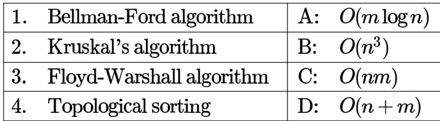

A. $\mathbf { 1 } {  } \mathrm { C }$ ， $2  \mathrm { A }$ ,3→B,4→D B $\mathbf { \varepsilon } _ { 3 . } ~ 1 {  } ~ \mathbf { B } , 2  \mathbf { D } , 3  \mathbf { C } , 4  \mathbf { A }$ C. $\mathbf { 1 } {  } \mathrm { C }$ ， $2  \mathrm { D }$ ,3→A,4→B D. $\mathbf { 1 } {  } \mathbf { B } , 2  \mathbf { A } , \mathbf { 3 }  \mathbf { C } , 4  \mathbf { D }$

A sink in a directed graph is a vertex such that there is an edge from every vertex $j \neq i$ to $\mathbf { \chi } _ { i }$ and there is edge from $i$ to any other vertex. A directed graph $G$ with $n$ vertices is represented by its adjacency matrix $A$ , where $A [ i ] [ j ] = 1$ if there is an edge directed from vertex $\mathbf { \chi } _ { i }$ to $j$ and otherwise. The following algorithm determines whether there is a sink in the graph $G$ .

$\boxed { \dot { \bf l } = 0 }$ ;   
do $\mathbf { j } = \mathbf { i } + 1$ ; while $( ( \mathsf { j } < \mathsf { n } ) \ l \& \mathsf { \& } \mathsf { \Lambda } \mathsf { E } 1 ) \ l \mathrm { + + }$ ; if $( \mathrm { j } < \mathsf { n } )$ E2; while $( \mathsf { j } < \mathsf { n } )$ ;   
flag $= 1$ ;   
for $( \mathrm { j } = 0 ; \mathrm { j } < \mathsf { n } ; \mathrm { j } + + )$ if $\mathrm { { ( j ! = i ) } }$ && E3) $\mathsf { f l a g } = 0$ ;   
if (flag) printf("Sink exists");   
else printf ("Sink does not exist");

Choose the correct expressions for $E _ { 1 }$ and $E _ { 2 }$

A. $E _ { 1 } : A [ i ] [ j ]$ and $E _ { 2 } : i = j$ ; B. $E _ { 1 } : ! A [ i ] [ j ]$ and $E _ { 2 } : i = j + 1$ ; C. $E _ { 1 } :  { \mathrm { ! } } A [ i ] [ j ]$ and $E _ { 2 } : i = j \colon$ D. $E _ { 1 } : A [ i ] [ j ]$ and $E _ { 2 } : i = j + 1$ ; gateit-2005 algorithms graph-algorithms normal

A sink in a directed graph is a vertex such that there is an edge from every vertex $j \neq i$ to $i$ and there is edge from $i$ to any other vertex. A directed graph with $n$ vertices is represented by its adjacency matrix $A$ , where $A [ i ] [ j ] = 1$ if there is an edge directed from vertex $\mathbf { \chi } _ { i }$ to $j$ and otherwise. The following algorithm determines whether there is a sink in the graph $G$ .

$\sqrt { { \bf i } = 0 }$ ;   
do { $\mathbf { j } = \mathbf { i } + 1$ ; while $( ( \mathsf { j } < \mathsf { n } ) \ l \& \mathsf { \& } \mathsf { E } \mathsf { 1 } ) \ l \mathrm { + + }$ ; if $( \mathsf { j } < \mathsf { n } )$ E2; while $( \mathsf { j } < \mathsf { n } )$ ;   
$\mathsf { f l a g } = 1$ ;   
for $( \ j = 0 ; \ j < \mathsf { n }$ ; $\mathbf { j } { + } + \mathbf { \lambda } )$ if $( \mathrm { j } ! = \mathrm { i } )$ && E3) flag $= 0$ ;   
if (flag) printf( "Sink exists") ;   
else printf ("Sink does not exist");

Choose the correct expression for $E _ { 3 }$

A. $( A [ i ] [ j ] \ \& \& \ ! A [ j ] [ i ] )$ B. (!A[][] && A[jl[l]) C. $( \mathsf { ! } A [ i ] [ j ] \parallel A [ j ] [ i ] )$ D. (A[][] 1 ！A[][])

gateit-2005 algorithms graph-algorithms normal ✍ Practice Tests: Test 1 (15Q) Test 2 (7Q)

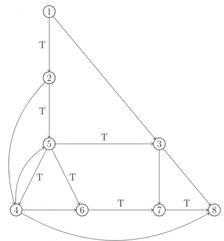

In the graph shown above, the depth-first spanning tree edges are marked with $\mathsf { a ^ { \prime } } T ^ { \prime }$ . Identify the forward, backward, and cross edges.

The most appropriate matching for the following pairs

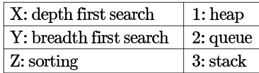

is:

A. Z-3 B. Y-1, Z-2 C. Y- 2, Z-1 D. Y-3, Z-1 gatecse-2000 algorithms easy graph-algorithms graph-search match-the-following

# Answer key☟

Let be an undirected graph. Consider a depth-first traversal of $G$ , and let $T$ be the resulting depth-first search tree. Let $u$ be a vertex in $G$ and let $v$ be the first new (unvisited) vertex visited after visiting $u$ in the traversal. Which of the following statement is always true?

A. $\{ u , v \}$ must be an edge in $G$ , and $u$ is a descendant of $v$ in $T$ B. $\{ u , v \}$ must be an edge in $G$ , and $v$ is a descendant of $u$ in $T$ C. If $\{ u , v \}$ is not an edge in $G$ then $u$ is a leaf in $T$ D. If $\{ u , v \}$ is not an edge in $G$ then $u$ and $v$ must have the same parent in $T$ gatecse-2000 algorithms graph-algorithms normal graph-search

A. $d ( r , u ) < d ( r , v )$ B. $d ( r , u ) > d ( r , v )$ C. $d ( r , u ) \leq d ( r , v )$ D. None of the above

Consider the following graph:

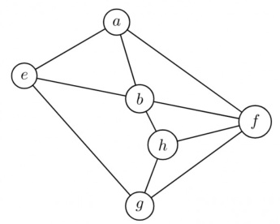

Among the following sequences:

I. abeghf II. abfehg III. abfhge IV. afghbe

Which are the depth-first traversals of the above graph?

A. I, II and IV only B. and IV only C. II, III and IV only D. I, III and IV only

gatecse-2003 algorithms graph-algorithms normal graph-search

Let $T$ be a depth first search tree in an undirected graph $G$ . Vertices $u$ and $\nu$ are leaves of this tree $T$ . The degrees of both and $\nu$ in $G$ are at least . which one of the following statements is true?

A. There must exist a vertex $w$ adjacent to both $u$ and $\nu$ in $G$ B. There must exist a vertex $w$ whose removal disconnects $u$ and $\nu$ in $G$ C. There must exist a cycle in $G$ containing $u$ and $\nu$ D. There must exist a cycle in $G$ containing $u$ and all its neighbours in $G$ gatecse-2006 algorithms graph -algorithms normal graph-search

The Breadth First Search algorithm has been implemented using the queue data structure. One possible order of visiting the nodes of the following graph is:

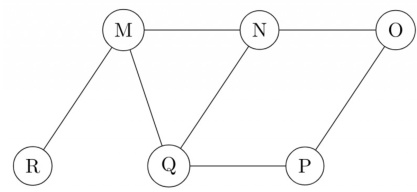

A. MNOPQR B. NQMPOR C. QMNPRO D. QMNPOR

Let $G$ be a graph with $n$ vertices and $m$ edges. What is the tightest upper bound on the running time of Depth First Search on $G$ , when $G$ is represented as an adjacency matrix?

A. $\Theta ( n )$ $\mathsf { B } . \ \Theta ( n + m )$ $\mathsf { C } . \Theta ( n ^ { 2 } )$ D. Θ(m2)

gatecse-2014-set1 algorithms graph-algorithms normal graph-search

Consider the tree arcs of a BFS traversal from a source node $W$ in an unweighted, connected, undirected graph. The tree $T$ formed by the tree arcs is a data structure for computing

A. the shortest path between every pair of vertices.   
B. the shortest path from  to every vertex in the graph.   
C. the shortest paths from to only those nodes that are leaves of $T$ .   
D. the longest path in the graph.

gatecse-2014-set2 algorithms graph-algorithms normal graph-search

# 1.18.10 Graph Search: GATE CSE 2014 Set 3 Question: 13

Suppose depth first search is executed on the graph below starting at some unknown vertex. Assume that a recursive call to visit a vertex is made only after first checking that the vertex has not been visited earlier. Then the maximum possible recursion depth (including the initial call) is

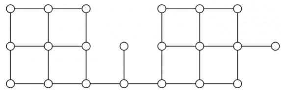

gatecse-2014-set3 algorithms graph-algorithms numerical-answers normal graph-searc

Let $G = ( V , E )$ be a simple undirected graph, and $s$ be a particular vertex in it called the source. For $x \in V$ , let $d ( x )$ denote the shortest distance in $G$ from $\pmb { s }$ to $x$ . A breadth first search (BFS) is performed starting at $s$ . Let $T$ be the resultant BFS tree. If $( u , v )$ is an edge of $G$ that is not in $T$ , then which one of the following CANNOT be the value of $d ( u ) - d ( v ) \colon$

A. B. C. D. gatecse-2015-set1 algorithms graph-algorithms normal graph-search of the following is a possible order of visiting the nodes in the graph below?

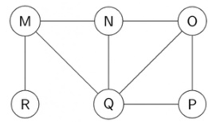

A. MNOPQR B. NQMPOR C. QMNROP D. POQNMR

gatecse-2017-set2 algorithms graph-algorithms graph-search

Let $G$ be a simple undirected graph. Let $T _ { D }$ be a depth first search tree of $G$ . Let $T _ { B }$ be a breadth first search tree of $G$ . Consider the following statements.

I. No edge of $G$ is a cross edge with respect to $T _ { D }$ . (A cross edge in $G$ is between two nodes neither of which is an ancestor of the other in $T _ { D }$ ). II. For every edge $( u , v )$ of $G$ , if $u$ is at depth $\mathbf { \chi } _ { i }$ and $v$ is at depth $j$ in $T _ { B }$ , then $\vert i - j \vert = 1$ .

Which of the statements above must necessarily be true?

A. I only B. II only C. Both I and II D. Neither nor II gatecse-2018 algorithms graph-algorithms graph-search normal two-marks

Let $U = \{ 1 , 2 , 3 \}$ . Let $2 ^ { U }$ denote the powerset of $U$ . Consider an undirected graph $G$ whose vertex set is $2 ^ { U }$ . For any $A , \mathring { B } \in 2 ^ { U } , ( A , B )$ is an edge in $G$ if and only if (i) $A \neq B$ , and (ii) either $A \subsetneq B$ or $B \subsetneq A$ . For any vertex $A$ in $G$ , the set of all possible orderings in which the vertices of $G$ can be visited in a Breadth First Search  starting from $A$ is denoted by $\pmb { { \cal B } } ( A )$ .

If $\varnothing$ denotes the empty set, then the cardinality of $\pmb { { \cal B } } ( \emptyset )$ is gatecse-2023 algorithms breadth-first-search numerical-answers two-marks graph-search

Let $G$ be a directed graph and $T$ a depth first search  spanning tree in $G$ that is rooted at a vertex $v$ . Suppose $T$ is also a breadth first search tree in $G$ , rooted at $v$ . Which of the following statements is/are TRUE for every such graph $G$ and tree $T ?$

A. There are no back-edges in $G$ with respect to the tree $T$ B. There are no cross-edges in $G$ with respect to the tree $T$ C. There are no forward-edge in $G$ with respect to the tree $T$ D. The only edges in $G$ are the edges in $T$

# Consider the following algorithm someAlgo that takes an undirected graph $G$ as input. someAlgo (G)

1. Let $v$ be any vertex in $G$ . Run BFS on $G$ starting at $v$ . Let $u$ be a vertex in $G$ at maximum distance from $v$ as given by the BFS.   
2. Run BFS on $G$ again with $u$ as the starting vertex. Let $z$ be the vertex at maximum distance from $u$ as given by the BFS.   
3. Output the distance between $u$ and $z$ in $G$ .

The output of someAlgo $( T )$ for the tree shown in the given figure is (Answer in integer)

Consider performing depth-first search (DFS) on an undirected and unweighted graph $G$ starting at vertex $\pmb { s }$ . For any vertex $u$ in $G , d [ u ]$ is the length of the shortest path from $\pmb { s }$ to $u$ . Let $( u , v )$ be an edge in $G$ such that $d [ u ] < d [ v ]$ . If the edge $( u , v )$ is explored first in the direction from to $v$ during the above DFS, then $( u , v )$ becomes a edge.

A. tree B. cross C. back D. gray gate-ds-ai-2024 graph-search depth-first-search algorithms one-mark

In a depth-first traversal of a graph $G$ with $\scriptstyle n$ vertices, $k$ edges are marked as tree edges. The number of connected components in $G$ is

A. B. $\mathsf { C } . \ n - k - 1$ D.

gateit-2005 algorithms graph-algorithms normal graph-search

Consider the depth-first-search of an undirected graph with vertices $P , Q$ , and $R$ . Let discovery time $d ( u )$ represent the time instant when the vertex $u$ is first visited, and finish time $f ( u )$ represent the time instant when the vertex $u$ is last visited. Given that

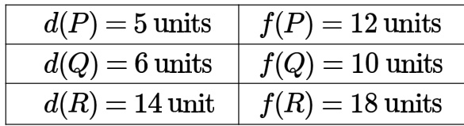

Which one of the following statements is TRUE about the graph?

A. There is only one connected component B. There are two connected components, and $P$ and $R$ are connected C. There are two connected components, and $Q$ and $R$ are connected D. There are two connected components, and $P$ and $Q$ are connected