A depth-first search is performed on a directed acyclic graph. Let $d [ u ]$ denote the time at which vertex $u$ is visited for the first time and $f [ u ]$ the time at which the DFS call to the vertex $u$ terminates. Which of the following statements is always TRUE for all edges $( u , v )$ in the graph ?

A. $d [ u ] < d [ v ]$ $\begin{array} { r } { \mathsf { B . ~ } d [ u ] < f [ v ] } \\ { \mathsf { D . ~ } f [ u ] > f [ v ] } \end{array}$ C. $f [ u ] < f [ v ]$ gateit-2007 algorithms graph-algorithms normal graph-search depth-first-search

Answer key☟

# 1.18.23 Graph Search: GATE IT 2008 Question: 47

Consider the following sequence of nodes for the undirected graph given below:

$\begin{array} { l } { { 1 . ~ a b e ~ f d g c } } \\ { { 2 . ~ a b e ~ f c g d } } \\ { { 3 . ~ a d g e b c f } } \\ { { 4 . ~ a d b c g e f } } \end{array}$

A Depth First Search (DFS) is started at node $\mathbf { \Delta } _ { a }$ . The nodes are listed in the order they are first visited. Which of the above is/are possible output(s)?

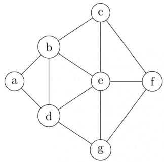

A. 1 and  only B. and  only C. and  only D. and only

gateit-2008 algorithms graph-algorithms normal graph-search depth-first-search

# Answer key☟

✍ Practice Test: Test (7Q)

The minimum number of record movements required to merge five files A (with  records), B (with records), C (with records), D (with records) and E (with  records) is:

A. B. 90 C. D. 65

gate1999 algorithms normal greedy-algorithms

# Answer key☟

A. B. 4 C. D. 6

gatecse-2003 algorithms normal greedy-algorithms

# Answer key☟

We are given 9 tasks $T _ { 1 } , T _ { 2 } , \ldots , T _ { 9 }$ . The execution of each task requires one unit of time. We can execute one task at a time. Each task $T _ { i }$ has a profit $P _ { i }$ and a deadline $d _ { i }$ . Profit $P _ { i }$ is earned if the task is completed before the end of the $d _ { i } ^ { t h }$ unit of time.

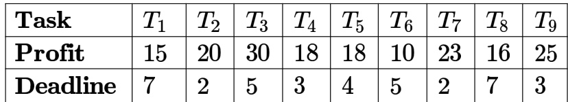

Are all tasks completed in the schedule that gives maximum profit?

A. All tasks are completed B. $T _ { 1 }$ and $T _ { 6 }$ are left out C. $T _ { 1 }$ and $ { T _ { 8 } }$ are left out D. $T _ { 4 }$ and $T _ { 6 }$ are left out

gatecse-2005 algorithms greedy-algorithms process-scheduling normal

# Answer key☟

We are given 9 tasks $T _ { 1 } , T _ { 2 } , \ldots , T _ { 9 }$ . The execution of each task requires one unit of time. We can execute one task at a time. Each task $T _ { i }$ has a profit $P _ { i }$ and a deadline $d _ { i }$ . Profit $P _ { i }$ is earned if the task is completed before the end of the $d _ { i } ^ { t h }$ unit of time.

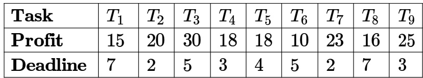

What is the maximum profit earned?

A. B. 165 C. 167 D.

gatecse-2005 algorithms greedy-algorithms process-scheduling normal

# Answer key☟

Consider the weights and values of items listed below. Note that there is only one unit of each item.

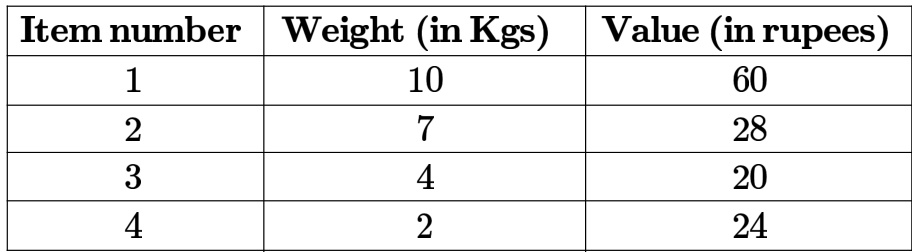

The task is to pick a subset of these items such that their total weight is no more than Kgs and their total value is maximized. Moreover, no item may be split. The total value of items picked by an optimal algorithm is denoted by . A greedy algorithm sorts the items by their value-to-weight ratios in descending order and packs them greedily, starting from the first item in the ordered list. The total value of items picked by the greedy algorithm is denoted by .

The value of $V _ { o p t } - V _ { g r e e d y }$ is

A hash table with ten buckets with one slot per bucket is shown in the following figure. The symbols $s 1$ to $S 7$ initially entered using a hashing function with linear probing. The maximum number of comparisons needed in searching an item that is not present is

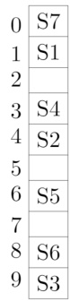

A. B. C. 6 D.

hashing isro2015 gate1989 algorithms normal

# Answer key☟

Consider a hash table with chaining scheme for overflow handling:

i. What is the worst-case timing complexity of inserting $n$ elements into such a table? ii. For what type of instance does this hashing scheme take the worst-case time for insertion?

Consider a dynamic hashing approach for -bit integer keys:

1. There is a main hash table of size .   
2. The  least significant bits of a key is used to index into the main hash table.   
3. Initially, the main hash table entries are empty.   
4. Thereafter, when more keys are hashed into it, to resolve collisions, the set of all keys corresponding to a main hash table entry is organized as a binary tree that grows on demand.   
5. First, the $3 ^ { \mathrm { r d } }$ least significant bit is used to divide the keys into left and right subtrees.   
6. To resolve more collisions, each node of the binary tree is further sub-divided into left and right subtrees based on the $4 ^ { \mathrm { t h } }$ least significant bit.   
7. A split is done only if it is needed, i.e., only when there is a collision.

Consider the following state of the hash table.

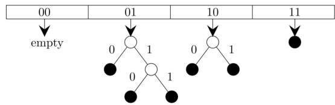

Which of the following sequences of key insertions can cause the above state of the hash table (assume the keys are in decimal notation)?

A. 5,9,4,13,10,7 B. 9,5,10,6,7,1

C. 10,9,6,7,5,13 D. 9,5,13,6,10,14 gatecse-202 1-set1 multiple-selects algorithms hashing two-marks

An algorithm has to store several keys generated by an adversary in a hash table. The adversary is malicious who tries to maximize the number of collisions. Let $k$ be the number of keys, $m$ be the number of slots in the hash table, and $k > m$ .

Which one of the following is the best hashing strategy to counteract the adversary?

A. Division method, i.e., use the hash function $h ( k ) = k { \bmod { m } } .$   
B. Multiplication method, i.e., use the hash function $h ( k ) = \lfloor m ( k A - \lfloor k A \rfloor ) \rfloor$ , where $A$ is a carefully chosen constant.   
C. Universal hashing method.   
D. If $k$ is a prime number, use Division method. Otherwise, use Multiplication method.

The keys 5,28. 19,15,26,33,12,17,10 are inserted into a hash table using the hash function $h ( k ) = k { \bmod { 9 } }$ . The collisions are resolved by chaining. After all the keys are inserted, the length of the longest chain is (answer in integer)

gatecse-2026-set2 algorithms hashing numerical-answers one-mark

A hash table contains  buckets and uses linear probing to resolve collisions. The key values are integers and the hash function used is . If the values  are inserted in the table, in what location would the key value  be inserted?

A. B. C. D. 6

gateit-2005 algorithms hashing easy

The number of elements that can be sorted in $\Theta ( \log n )$ time using heap sort is

A. $\Theta ( 1 )$ $\begin{array} { l } { { \Theta } . } \end{array} \Theta ( \sqrt { \log } n )$   
C. $\Theta \big ( \frac { \log n } { \log \log n } \big )$

gatecse-2013 algorithms sorting normal heap-sort

# 1.21.2 Heap Sort: GATE CSE 2024 Set 1 Question: 31

An array [82,101,90,11,111,75,33,131,44,93] is heapified. Which one of the following options represents the first three elements in the heapified array?

A. 82,90,101 B. 82,11,93 C. 131,11,93 D. 131,111,90

gatecse-2024-set1 algorithms heap-sort sorting two-marks

A language uses an alphabet of six letters, $\{ a , b , c , d , e , f \}$ . The relative frequency of use of each letter of the alphabet in the language is as given below:

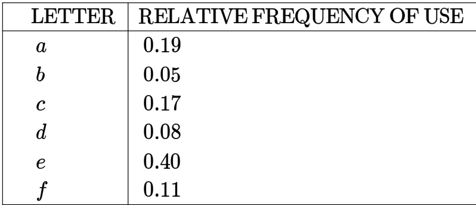

Design a prefix binary code for the language which would minimize the average length of the encoded words of the language.

descriptive gate1989 algorithms huffman-code

Suppose the letters $a , b , c , d , e ,$ $f$ have probabilities $\textstyle { \frac { 1 } { 2 } } , { \frac { 1 } { 4 } } , { \frac { 1 } { 8 } } , { \frac { 1 } { 1 6 } } , { \frac { 1 } { 3 2 } } , { \frac { 1 } { 3 2 } }$ , respectively. Which of the following is the Huffman code for the letter $\mathbf { \Delta } _ { a }$ $\iota , b , c , d , e , f ?$

A. , , , 1110, 11110, 11111 B. , , , , , C. , , , , , 0000 D. , , , , ,

gatecse-2007 algorithms greedy-algorithms normal huffman-code

# 1.22.3 Huffman Code: GATE CSE 2007 Question: 77

Suppose the letters $a , b , c , d , e ,$ $f$ have probabilities $\frac { 1 } { 2 } , \frac { 1 } { 4 } , \frac { 1 } { 8 } , \frac { 1 } { 1 6 } , \frac { 1 } { 3 2 } , \frac { 1 } { 3 2 }$ respectively. What is the average length of the Huffman code for the letters $a , b , c , d , e , f ?$

A. 3 B. 2.1875 C. 2.25 D. 1.9375

gatecse-2007 algorithms greedy-algorithms normal huffman-code

A message is made up entirely of characters from the set $X = \{ P , Q , R , S , T \}$ . The table of probabilities for each of the characters is shown below:

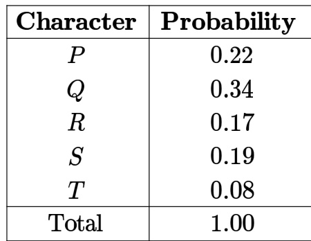

If a message of  characters over $X$ is encoded using Huffman coding, then the expected length of the encoded

message in bits is

gatecse-2017-set2 huffman-code numerical-answers algorithms

Consider the string . Each letter in the string must be assigned a binary code satisfying the following properties:

1. For any two letters, the code assigned to one letter must not be a prefix of the code assigned to the other letter. 2. For any two letters of the same frequency, the letter which occurs earlier in the dictionary order is assigned a code whose length is at most the length of the code assigned to the other letter.

Among the set of all binary code assignments which satisfy the above two properties, what is the minimum length of the encoded string?

A. B. C. 25 D.

gatecse-2021-set2 algorithms huffman-code two-marks

The characters $\mathbf { \Delta } _ { a }$ to $h$ have the set of frequencies based on the first  Fibonacci numbers as follows $a : 1 , b : 1 , c : 2 , d : 3 , e : 5 , f : 8 , g : 1 3 , h : 2 1$

A Huffman code is used to represent the characters. What is the sequence of characters corresponding to the following code?

110111100111010

A. fdheg B. ecgdf C. dchfg D. fehdg

gateit-2006 algorithms greedy-algorithms normal huffman-code

# Answer key☟

✍ Practice Tests: Test 1 (15Q) Test 2 (15Q) Test 3 (9Q)

What is the output produced by the following program, when the input is "HTGATE"

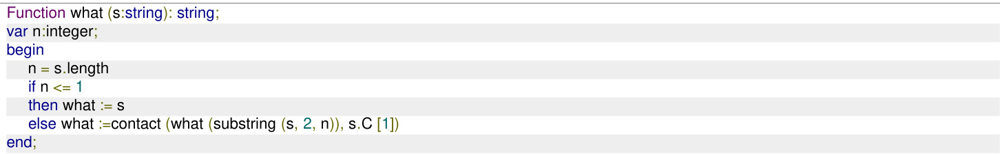

# Note

i. type string $\mid =$ record length:integer; C:array[1..100] of char end   
ii. Substring (s , i, j): this yields the string made up o f the through $j ^ { \mathrm { t h } }$ characters in s; for appropriately defined in $\mathbf { \chi } _ { i }$ and $j$ .   
iii. Contact $( s _ { 1 } , s _ { 2 } )$ : this function yields a string of length $s _ { 1 }$ length $+ \ : s _ { 2 }$ length obtained by concatenating $s _ { 1 }$ with $s _ { 2 }$ such that $s _ { 1 }$ precedes $s _ { 2 }$ .

The following program computes values of a mathematical function $f ( x )$ . Determine the form of $f ( x )$

main () int m, n; float $\mathsf { x }$ , y, t; scanf ("%f%d", &x, &n); $\mathbf { \boldsymbol { t } } = 1 ; \mathbf { \boldsymbol { y } } = 0 ; \mathbf { \boldsymbol { m } } = 1$ ; do $\mathbf { \boldsymbol { t } } ^ { \star } = ( \mathbf { \boldsymbol { \cdot } } \mathbf { \boldsymbol { x } } / \mathsf { m } ) ;$ $\begin{array} { r } { \mathsf { y } + = \mathsf { t } ; } \end{array}$ while $( \mathsf { m } + + < \mathsf { n } )$ ; printf ("The value of y is %f", y);

gate1990 descriptive algorithms identify-function

Consider the following Pascal function:

Function X(M:integer):integer;   
Var i:integer;   
Begin $\dot { \mathsf { I } } : = 0$ ; while i\* $\mathbf { \Omega } < \mathsf { M }$ do i:= i+1 $\mathsf { X } : = \mathsf { i }$   
end

The function call $X ( N )$ , if $N$ is positive, will return

A. $\lfloor \sqrt { N } \rfloor$ B. [√N] +1CE. $\lceil \sqrt { N } \rceil$ D. [√N]+1None of the above

gate1991 algorithms easy identify-function multiple-selects

What does the following code do?

var a, b: integer;   
begin $a : = a + b$ ; $b : = a - b$ ; $a : = a - b$ ;   
end;

A. exchanges $a$ and $b$ B. doubles $a$ and stores in $b$ C. doubles $b$ and stores in $a$ D. leaves $a$ and $b$ unchanged E. none of the above

gate1993 algorithms identify-function easy

begin if n mod $\scriptstyle 2 = 1$ then value $: =$ value $^ { \star } \times$ ; value $: =$ value $^ \star$ what $[ { \mathsf { x } } ^ { * } { \mathsf { x } }$ , n div 2); end; what $: =$ value; end;

In the following Pascal program segment, what is the value of X after the execution of the program segment?

$\sqrt { x : = - 1 0 }$ ; $\overline { { \mathsf { Y } : = 2 0 } }$ ;   
If ${ \sf X } > { \sf Y }$ then if $X < 0$ then X := abs(X) else X := 2\*X;

A. B. -20 C. -10 D. None

gate1995 algorithms identify-function easy

Assume that $X$ and $Y$ are non-zero positive integers. What does the following Pascal program segment do?

while X $\mathrm { \Phi } _ { < > }$ Y do   
if ${ \sf X } > { \sf Y }$ then $\mathsf { X } : = \mathsf { X } - \mathsf { Y }$   
else $\textsf { Y } { : = } \textsf { Y } - \textsf { X }$ ;   
write $( \mathsf { X } )$ ;

A. Computes the LCM of two numbers B. Divides the larger number by the smaller number C. Computes the GCD of two numbers D. None of the above

gate1995 algorithms identify-function normal

A. Consider the following Pascal function where $A$ and $B$ are non-zero positive integers. What is the value of ${ \bf G E T } ( { \bf 3 } , { 2 } ) \colon$

function GET(A,B:integer): integer;   
begin if $\scriptstyle \mathsf { B } = 0$ then $\mathsf { G E T } \mathrm { : = } 1$ else if $A < B$ then $\mathsf { G E T : = 0 }$ else $\mathtt { G E T : } = \mathtt { G E T } ( \mathtt { A } \ – \ \mathtt { 1 } , \textsf { B } ) + \mathtt { G E T } ( \mathtt { A } \ – \ \mathtt { 1 } , \mathtt { B } \ – \ \mathtt { 1 } )$   
end;

B. The Pascal procedure given for computing the transpose of an $N \times N , ( N > 1 )$ matrix $A$ of integers has an error. Find the error and correct it. Assume that the following declaration are made in the main program

const MAXSIZE $scriptstyle = 2 0$ ;   
type INTARR $\ c =$ array [1..MAXSIZE,1..MAXSIZE] of integer;   
Procedure TRANSPOSE (var A: INTARR; N : integer);   
var I, J, TMP: integer;   
begin for $\scriptstyle 1 : = 1$ to N – 1 do for $\mathsf { J } : = 1$ to N do begin $\mathsf { T M P } { \mathrel { : } } = \mathsf { A } [ \mathsf { l }$ , J]; $\mathsf { A } [ 1 , \mathsf { J } ] { : = \mathsf { A } }$ [J, I];

What value would the following function return for the input $\begin{array} { r } { x = 9 5 ? } \end{array}$

Function fun (x:integer):integer;   
Begin If $\mathsf { x } > 1 0 0$ then fun $= \mathsf { x } - 1 0$ Else fun $\mathbf { \Sigma } = \mathbf { \Sigma }$ fun(fun $( x + 1 1 )$ )   
End;

A. B. 90 C. 91 D. 92

gate1998 algorithms recursion identify-function normal

# Consider the following $\boldsymbol { C }$ function definition

int Trial (int a, int b, int c) if ( $( a > = b )$ ) && $( c < b )$ ) return b; else if $( a > = b )$ return Trial(a, c, b); else return Trial(b, a, c);

The functional Trial:

A. Finds the maximum of $a , b$ , and $c$ B. Finds the minimum of $a , b$ , and $c$ C. Finds the middle number of $a , b , c$ D. None of the above

gate1999 algorithms identify-function normal

Suppose you are given an array $s [ 1 . . . . n ]$ and a procedure reverse $( s , i , j )$ which reverses the order of elements in S between positions $\textit { i }$ and $j$ (both inclusive). What does the following sequence do, where $1 \leqslant k \leqslant n$ :

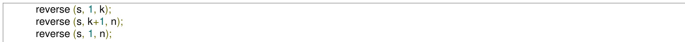

A. Rotates left by $k$ positions B. Leaves unchanged C. Reverses all elements of $\pmb { s }$ D. None of the above

gatecse-2000 algorithms normal identify-function

A. $x ^ { y }$ B. $e ^ { x }$ C. $\ln ( 1 + x )$ D. $x ^ { x }$

In the following $c$ program fragment, $j , k , n$ and TwoLog_n are integer variables, and $A$ is an array of integers. The variable $n$ is initialized to an integer $\geqslant 3$ , and TwoLog_n is initialized to the value of $2 ^ { * } \lceil \log _ { 2 } ( n ) \rceil$

for $( \boldsymbol { \mathsf { k } } = 3 ; \ \boldsymbol { \mathsf { k } } < = \boldsymbol { \mathsf { n } } ; \boldsymbol { \mathsf { k } } + + )$ $\mathsf { A } [ \mathsf { k } ] = 0$ ;   
for $k = 2$ ; $k < =$ TwoLog_n; $\mathbf { k } { + } { + }$ ) for $( \mathsf { j } = \mathsf { k } { + } 1 ; \mathsf { j } < = \mathsf { n } ; \mathsf { j } { + } { + } )$ $\mathsf { A } [ \mathsf { j } ] = \mathsf { A } [ \mathsf { j } ] \parallel ( \mathsf { j } \% \mathsf { k } )$ ;   
for $( \mathbf { j } = 3 ; \mathbf { j } < = \mathsf { n } ; \mathsf { j } + + )$ ) if (!A[j]) printf("%d", j);

The set of numbers printed by this program fragment is

A. $\{ m | m \leq n , ( \exists i ) [ m = i ! ] \}$ $\begin{array} { l } { { \mathsf { B . } \left\{ m \mid m \leq n , ( \exists i ) [ m = i ^ { 2 } ] \right\} } } \\ { { \mathsf { D . } \left\{ \right\} } } \end{array}$ C. $\{ m \mid m \leq n , \mathbf { m }$ is prime}

gatecse-2003 algorithms identify-function normal

# Consider the following C program

main() int x, y, m, n; scanf( $" \% d \textmd { } \textmd { ‰}$ , &x, &y); $/ ^ { \star }$ Assume $_ { x > 0 }$ and $y > 0 ^ { \star } 1$ $\mathsf { m } = \mathsf { X }$ ; $\mathsf { n } = \mathsf { y }$ ; while $( \mathsf { m } \downarrow = \mathsf { n } )$ if $( \mathsf { m } > \mathsf { n } )$ $\mathsf { m } = \mathsf { m } - \mathsf { n } ;$ ; else ${ \mathsf { n } } = { \mathsf { n } } - { \mathsf { m } }$ ; printf("%d", n);

The program computes

A. $x + y$ using repeated subtraction B. $x$ mod $y$ using repeated subtraction C. the greatest common divisor of $x$ and $y$ D. the least common multiple of $x$ and $y$

gatecse-2004 algorithms normal identify-function

# Consider the following C-program:

void foo (int n, int sum) { int $\mathbf k = 0 , \mathbf j = 0$ ; if $( \mathsf { n } = = 0 )$ ) return; $\textsf { k } = \textsf { n } \% ~ 1 0 ; ~ \mathsf { j } = \mathsf { n } / 1 0 ;$ ; $\mathsf { s u m } = \mathsf { s u m } + \mathsf { k } ;$ foo (j, sum); printf $( " \% 0 1 , " , \mathsf { k } )$ ;   
int main() int a = 2048, sum = 0; foo(a, sum); printf("%d\n", sum);

What does the above program print?

A. B.   
C. D.

gatecse-2005 algorithms identify-function recursion normal

A set $X$ can be represented by an array $x [ n ]$ as follows:

$$
x \left[ i \right] = { \left\{ \begin{array} { l l } { 1 } & { { \mathrm { i f ~ } } i \in X } \\ { 0 } & { { \mathrm { o t h e r w i s e } } } \end{array} \right. }
$$

Consider the following algorithm in which $x , y$ , and $z$ are Boolean arrays of size $n$ :

algorithm zzz(x[], y[], z[]) {   
int i;   
for $\mathrm { i } = 0$ ; i<n; $+ { + } \dot { \mathsf { I } } )$ 2   
z[i] $\mathbf { \Sigma } = \mathbf { \Sigma }$ (x[i] ∧ \~y[i]) ∨ (\~x[i] ∧ y[i]);

The set $Z$ computed by the algorithm is:

A. $( X \cup Y )$ B. (XnY) C. $( X - Y ) \cap ( Y - X )$ D. (X-Y)U(Y - X)

gatecse-2006 algorithms identify-function normal

Consider the following C-function in which $a [ n ]$ and $b [ m ]$ are two sorted integer arrays and $c [ n + m ]$ be another integer array,

void xyz(int a[], int b [], int c []){ int i,j,k; $\dot { \mathsf { I } } = \dot { \mathsf { J } } = \mathsf { k } = 0$ ; while $( \mathsf { i } < \mathsf { n } )$ && $( \mathrm { j } < \mathsf { m } )$ ) if $( \mathsf { a } [ \mathsf { i } ] < \mathsf { b } [ \mathsf { i } ] )$ ) ${ \mathsf { C } } [ { \mathsf { k } } { \mathsf { + } } { \mathsf { + } } ] = { \mathsf { a } } [ { \mathsf { i } } { \mathsf { + } } { \mathsf { + } } ]$ else ${ \mathsf { c } } [ { \mathsf { k } } + + ] = { \mathsf { b } } [ { \mathsf { j } } + + ]$ ;

Which of the following condition(s) hold(s) after the termination of the while loop?

i. $j < m , k = n + j - 1$ and $a [ n - 1 ] < b [ j ]$ if ${ i = n }$ ii. $i < n , k = m + i - 1$ and $b [ \bar { m } - 1 ] \leq a [ i ]$ if $j = m$

A. only (i) B. only (ii) C. either (i) or (ii) but not both D. neither (i) nor (ii)

gatecse-2006 algorithms identify-function normal

# Consider the program below:

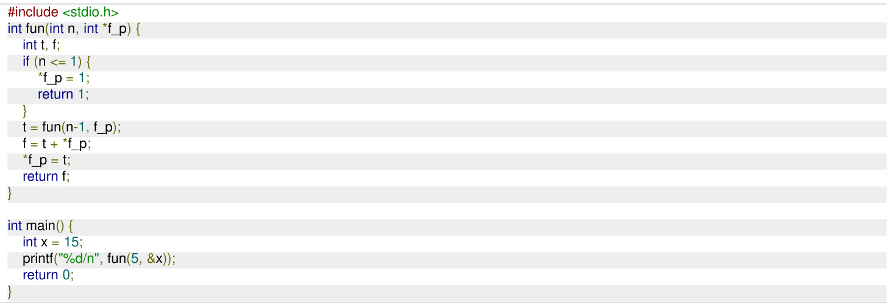

# The value printed is:

A. B. C. D. gatecse-2009 algorithms recursion identify-function normal

What is the value printed by the following C program?

#include<stdio.h>   
int f(int $^ { \ast } { \sf a }$ , int n) if $\mathbf { \tilde { n } _ { \lambda } } < = 0 \mathbf { \tilde { \Sigma } }$ ) return 0; else if $( ^ { \star } \mathsf { a } \ \% 2 = = 0$ ) return $\mathbf { \dot { a } } \mathbf { + } \mathsf { f } ( \mathsf { a } \mathbf { + } 1 , \mathsf { n } \mathbf { - } 1 )$ ; else return ${ { \bf { \dot { a } } } - { \bf { f } } ( { \bf { \dot { a } } } + 1 , { \bf { \dot { n } } } - 1 ) }$ ;   
int main() int $\mathsf { a } [ ] = \{ 1 2 , 7$ , 13, 4, 11, 6}; printf("%d", f(a, 6)); return 0;

A. B. C. D.

gatecse-2010 algorithms recursion identify-function normal

Consider the following recursive C function that takes two arguments.

unsigned int foo(unsigned int n, unsigned int r) { if $( n > 0 )$ return $( ( \mathsf { n ^ { o } / o r } ) + \mathsf { f o o } ( \mathsf { n / r } , \mathsf { r } ) )$ ; else return 0;

What is the return value of the function when it is called as ?

A. B. 8 C. D.

gatecse-2011 algorithms recursion identify-function normal

Consider the following function:

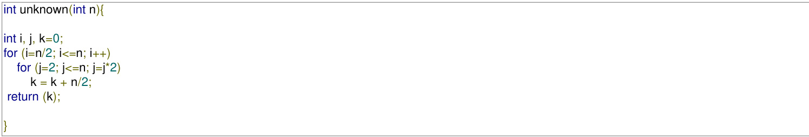

The return value of the function is

A. $\Theta ( n ^ { 2 } )$ B. $\Theta ( n ^ { 2 } \log { n } )$   
C. $\Theta ( n ^ { 3 } )$ D. $\Theta ( n ^ { 3 } \log n )$

gatecse-2013 algorithms identify-function normal

Consider the following C function in which size is the number of elements in the array E:

int MyX(int \*E, unsigned int size) int $\mathsf { Y } = 0$ ; int Z; int i, j, k; for(i = 0; i< size; i++) $\mathsf { Y } = \mathsf { Y } +$ E[i]; for(i=0; i < size; i++) for(j = i; j < size; j++) Z = 0; for(k = i; k <= j; k++) Z = Z + E[k]; if(Z > Y) Y = Z; return Y;

The value returned by the function MyX is the

A. maximum possible sum of elements in any sub-array of array E.   
B. maximum element in any sub-array of array E.   
C. sum of the maximum elements in all possible sub-arrays of array E.   
D. the sum of all the elements in the array E.

Consider the function func shown below:

int func(int num) int count $= 0$ ; while (num) count++; num $> > = 1$ ; return (count);

The value returned by func( ) is gatecse-2014-set2 algorithms identify-function numerical-answers easy

Let $A$ be the square matrix of size $n \times n$ . Consider the following pseudocode. What is the expected output?

$\scriptstyle \left| { \mathsf { C } } = 1 0 0 \right|$ ;   
for $\mathbf { i } { = } 1$ to n do for j=1 to n do Temp $\mathbf { \Sigma } = \mathbf { \Sigma }$ A[i][j] $+ \mathsf { C }$ ; A[i][j] $\mathbf { \Sigma } = \mathbf { \Sigma }$ A[j][i]; A[j][i] = Temp -C;   
for $\mathbf { i } { = } 1$ to n do for j=1 to n do output (A[i][j]);   
A. The matrix $A$ itself   
B. Transpose of the matrix $A$   
C. Adding  to the upper diagonal elements and subtracting  from lower diagonal elements of $A$   
D. None of the above

# Consider the following C function.

int fun1 (int n) {int i, j, k, p, $\mathsf { q } = 0$ ;for $( \mathsf { i } = 1 ; \mathsf { i } < \mathsf { n } ; + + \mathsf { i } )$ ${ \mathsf p } = 0$ ;for $( \mathbf { j } = \mathsf { n } ; \mathbf { j } > 1 ; \mathbf { j } = \mathbf { j } / 2 )$ $+ + { \mathsf { p } } _ { } ^ { \prime }$ for $( \mathsf { k } = 1 ; \mathsf { k } < \mathsf { p } ; \mathsf { k } = \mathsf { k } ^ { \ast } 2 )$ $+ + \mathsf { q } ;$ ：return q;

Which one of the following most closely approximates the return value of the function ?

A. $n ^ { 3 }$ B. $n ( \log n ) ^ { 2 }$ C. nlogn D. n log(log n)

gatecse-2015-set1 algorithms normal identify-function

int $\scriptstyle x = 1$ , k;   
if $( \mathsf { n } = = 1$ ) return x;   
for $\mathsf { k } { = } 1$ ; $k < n$ ; $+ + k )$ $\mathsf { X } = \mathsf { X } +$ fun(k) fun (n-k);   
return x;

The return value of is gatecse-2015-set2 algorithms identify-function recurrence-relation normal numerical-answers

Suppose $c = \langle c [ 0 ] , \ldots , c [ k - 1 ] \rangle$ is an array of length $k _ { : }$ where all the entries are from the set $\{ 0 , 1 \}$ . For any positive integers $a$ and $\scriptstyle n$ , consider the following pseudocode.

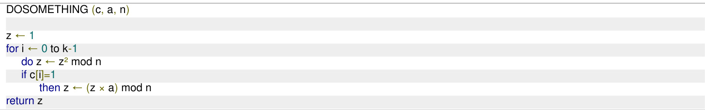

I $\scriptstyle { \mathfrak { f } } k = 4 , c = \langle 1 , 0 , 1 , 1 \rangle , a = 2 ,$ and $n = 8$ , then the output of DOSOMETHING(c, a, n) is

# Consider the following C function.

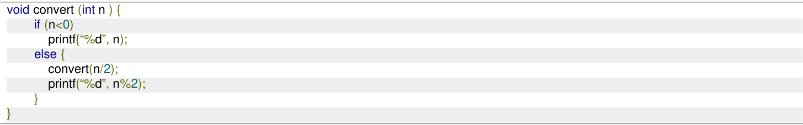

Which one of the following will happen when the function convert is called with any positive integer $n$ as argument?

A. It will print the binary representation of $\scriptstyle n$ and terminate B. It will print the binary representation of $n$ in the reverse order and terminate C. It will print the binary representation of $\scriptstyle n$ but will not terminate D. It will not print anything and will not terminate

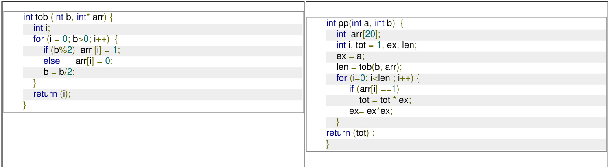

The value returned by $\overline { { p p ( 3 , 4 ) } }$ is

# Consider the following ANSI function:

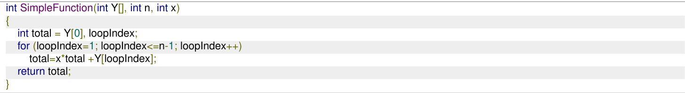

L e t be an array of elements with $Z [ i ] = 1$ , for all $i$ such that $0 \leq i \leq 9$ . The value returned by SimpleFunction(Z,10,2) is

gatecse-2021-set1 algorithms numerical-answers identify-function two-marks

# Consider the following ANSI function:

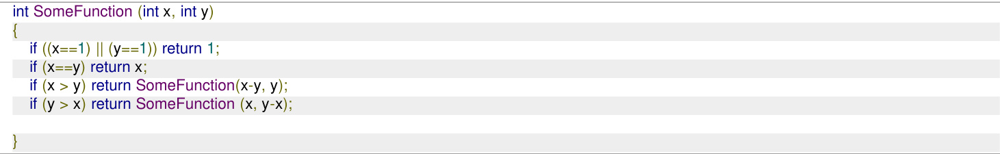

# The value returned by is

gatecse-2021-set2 numerical-answers algorithms identify-function output one-mark

Choose the correct alternative for statements $A$ and $B$

A. A: count [a[j]] $^ { + + }$ and B: count[b[j]]-- B. A: count [a[j]] $^ { + + }$ and B: count[b[j]] $^ { + + }$ C. A: count [a $[ i + + ] ] + +$ and B: count[b[j]]-- D. A: count [a[j]] $^ { + + }$ and B: count[b[ $+ + ] ] -$

What is the output printed by the following program?

#include <stdio.h>   
int f(int n, int k) { if $( \boldsymbol { \mathsf { n } } = = 0 )$ ) return 0; else if $( \boldsymbol { \mathsf { n } } \ \% \ 2 )$ 1 return $\mathfrak { f } ( \mathfrak { n } / 2 , 2 ^ { \star } \mathfrak { k } ) + \mathfrak { k }$ ; else return f(n/2, 2\*k) k;   
int main () { printf("%d", f(20, 1)); return 0;

A. B. C. D.

gateit-2005 algorithms identify-function normal

The following function computes the value of $\binom { m } { n }$ correctly for all legal values $m$ and $n$ $( m \geq 1 , n \geq 0$ and $| m > n \rangle$ )

int func(int m, int n) if (E) return 1; else retur $\mathsf { n } ( \mathsf { f u n c } ( \mathsf { m } - 1 , \mathsf { n } ) + \mathsf { f u n c } ( \mathsf { m } - 1 , \mathsf { n } - 1 ) )$ ;

In the above function, which of the following is the correct expression for E?

$\begin{array} { c } { { ( n = = 0 ) | | ( m = = 1 ) } } \\ { { ( n = = 0 ) | | ( m = = n ) } } \end{array}$ B. $( n = = 0 )$ && $( m = = 1 )$ 2D. $\scriptstyle \stackrel { \prime } { n } = = 0$ && ${ \bf \zeta } _ { m } = = n _ { \bf \zeta }$ ）

gateit-2006 algorithms identify-function normal

Consider the code fragment written in C below

void f (int n) if $( \mathsf { n } < = 1 )$ { printf ("%d", n); } else { f $( { \mathsf { n } } / { 2 } )$ ; printf ("%d", ${ \mathsf n } ^ { \circ } / { \mathsf o } 2 )$ ;

Which of the following implementations will produce the same output for $f ( 1 7 3 )$ as the above code?

# P1

# P2

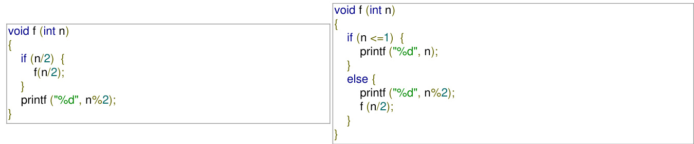

A. Both $P 1$ and $P 2$ B. $P 2$ only C. only D. Neither $P 1$ nor $P 2$

gateit-2008 algorithms recursion identify-function normal

The usual $\Theta ( n ^ { 2 } )$ implementation of Insertion Sort to sort an array uses linear search to identify the position where an element is to be inserted into the already sorted part of the array. If, instead, we use binary search to identify the position, the worst case running time will

A. remain $\Theta ( n ^ { 2 } )$ B. become $\Theta ( n ( \log n ) ^ { 2 } )$ C. become $\Theta ( n \log n )$ D. become $\Theta ( n ) { \dot { } }$

gatecse-2003 algorithms sorting time-complexity normal insertion-sort

# Answer key☟

In a permutation $a _ { 1 } . . . a _ { n }$ , of n distinct integers, an inversion is a pair $( a _ { i } , a _ { j } )$ such that $i < j$ and $a _ { i } > a _ { j }$ . If all permutations are equally likely, what is the expected number of inversions in a randomly chosen permutation of ?

$\frac { n ( n - 1 ) } { 2 }$ $\mathsf { B } . \ \frac { n ( n - 1 ) } { 4 }$ $\therefore \frac { n ( n + 1 ) } { 4 }$ $\mathsf { D } . \ 2 n [ \log _ { 2 } n ]$

gatecse-2003 algorithms sorting inversion normal

# 1.25.2 Inversion: GATE DA 2025 Question: 19

Suppose that insertion sort is applied to the array $[ 1 , 3 , 5 , 7 , 9 , 1 1 , x , 1 5 , 1 3$ and it takes exactly two swaps to sort the array. Select all possible values of $x$ .

A. B. C. 14 D.

gateda-2025 algorithms insertion-sort sorting multiple-selects easy one-mark inversion

# Answer key☟

✍ Practice Test: Test 1 (5Q)

# 1.26.1 Linear Probing: GATE CSE 2026 Set 1 Question: 14

Consider a hash table $P [ 0 , 1 , \ldots , 1 0 ]$ that is initially empty. The hash table is maintained using open addressing with linear probing. The hash function used is $h ( x ) = ( x + 7 ) { \bmod { 1 1 } }$ .

Consider the following sequence of insertions performed on $P$ :

Which of the following positions in the hash table is/are empty after these insertions are performed?

A. B. 10 C. D.

gatecse-2026-set1 algorithms hashing linear-probing multiple-selects one-mark

Consider a hash table of size 10 with indices $\{ 0 , 1 , \ldots , 9 \}$ , with the hash function

$$
h ( x ) = 3 x ( \mathrm { m o d } 1 0 )
$$

where linear probing is used to handle collisions. The hash table is initially empty and then the following sequence of keys is inserted into the hash table: . The indices where the keys and are stored are, respectively

A. and B. and C. and D. and

gateda-2025 algorithms hashing linear-probing easy one-mark

Four Matrices $M _ { 1 } , M _ { 2 } , M _ { 3 }$ and $M _ { 4 }$ of dimensions $p \times q$ ， $q \times r$ ， $\boldsymbol { r } \times \boldsymbol { s }$ and $s \times t$ respectively can multiplied in several ways with different number of total scalar multiplications. For example when multiplied as $( ( M _ { 1 } \times M _ { 2 } ) \times ( M _ { 3 } \times M _ { 4 } ) )$ , the total number of scalar multiplications is $p q r + r s t + p r t$ . When multiplied as $( ( M _ { 1 } \times M _ { 2 } ) \times M _ { 3 } ) \times M _ { 4 } )$ , the total number of scalar multiplications is $p q r + p r s + p s t$ .

I $\uparrow p = 1 0 , q = 1 0 0 , r = 2 0 , s = 5$ and $t = 8 0$ , then the minimum number of scalar multiplications needed is

A. 248000 B. 44000 C. 19000 D. 25000 gatecse-2011 algorithms dynamic-programming normal matrix-chain-ordering

Let $A _ { 1 } , A _ { 2 } , A _ { 3 }$ and A4 be four matrices of dimensions $1 0 \times 5 , 5 \times 2 0$ ， $2 0 \times 1 0$ and $1 0 \times 5$ respectively. The minimum number of scalar multiplications required to find the product $A _ { 1 } A _ { 2 } A _ { 3 } A _ { 4 }$ using the basic matrix multiplication method is

gatecse-2016-set2 dynamic-programming algorithms matrix-chain-ordering normal numerical-answers

Assumsceatlharat multipliycinatgioansm.atCriox $G _ { 1 }$ toifngd mtheen siporno $p \times q$ owf h anmoatthriecresm $G _ { 2 }$ sicoan $q \times r$ droenqeu irbeys $\scriptstyle n$ $G _ { 1 } G _ { 2 } { \bar { G } } _ { 3 } \dots G _ { n }$ parenthesizing in different ways. Define $G _ { i } G _ { i + 1 }$ as an explicitly computed pair for a given paranthesization if they are directly multiplied. For example, in the matrix multiplication chain $\bar { G _ { 1 } } \bar { G _ { 2 } } \dot { G _ { 3 } } G _ { 4 } G _ { 5 } G _ { 6 }$ using parenthesization $( G _ { 1 } ( G _ { 2 } G _ { 3 } ) ) ( G _ { 4 } ( G _ { 5 } G _ { 6 } ) ) , G _ { 2 } G _ { 3 }$ and $G _ { 5 } G _ { 6 }$ are only explicitly computed pairs.

Consider a matrix multiplication chain $F _ { 1 } F _ { 2 } F _ { 3 } F _ { 4 } F _ { 5 }$ , where matrices $F _ { 1 } , F _ { 2 } , F _ { 3 } , F _ { 4 }$ and $F _ { 5 }$ are of dimensions $\mathbf { 2 } \times \mathbf { 2 5 } , \mathbf { 2 5 } \times \mathbf { 3 } , \mathbf { 3 } \times \mathbf { 1 6 } , \mathbf { 1 6 } \times \mathbf { 1 }$ and $1 \times 1 0 0 0$ , respectively. In the parenthesization of $F _ { 1 } F _ { 2 } F _ { 3 } F _ { 4 } F _ { 5 }$ that minimizes the total number of scalar multiplications, the explicitly computed pairs is/are

A. $F _ { 1 } F _ { 2 }$ and $F _ { 3 } F _ { 4 }$ only B. $F _ { 2 } F _ { 3 }$ only C. $F _ { 3 } F _ { 4 }$ only D. $F _ { 1 } F _ { 2 }$ and $F _ { 4 } F _ { 5 }$ only gatecse-2018 algorithms dynamic-programming two-marks matrix-chain-ordering

The minimum number of comparisons required to find the minimum and the maximum of numbers is gatecse-2014-set1 algorithms numerical-answers normal maximum-minimum sorting

D. 15, 20, 47, 12, 17, 30, 40 gate1999 algorithms merge-sort normal isro2015 sorting

A list of $\scriptstyle n$ strings, each of length $n$ , is sorted into lexicographic order using the merge-sort algorithm. The worst case running time of this computation is

A. $O ( n \log { n } )$ $\mathsf { B } . \ O ( n ^ { 2 } \log n )$ $\mathsf { C . ~ } O ( n ^ { 2 } + \log n ) \qquad \mathsf { D . ~ } O ( n ^ { 2 } )$

gatecse-2012 algorithms sorting normal merge-sort

Assume that a mergesort algorithm in the worst case takes  seconds for an input of size . Which of the following most closely approximates the maximum input size of a problem that can be solved in  minutes?

A. B. 512 C. 1024 D. 2018

gatecse-2015-set3 algorithms sorting merge-sort

Consider an array A= [10,7,8,19,41,35,25,31]. Suppose the merge sort algorithm is executed o array $A$ to sort it in increasing order. The merge sort algorithm will carry out a total of merge operations.

A merge operation on sorted left array $L$ and sorted right array $R$ is said to be void if the output of the merge operation is the elements of array $L$ followed by the elements of array $R$ .

The number of void merge operations among these 7 merge operations is (answer in integer)

gatecse-2026-set2 algorithms merge-sort numerical-answers one-mark

Answer key☟

# Merging (2)

✍ Practice Test: Test (6Q)

# 1.30.1 Merging: GATE CSE 1995 Question: 1.16

For merging two sorted lists of sizes $m$ and $n$ into a sorted list of size $m + n ,$ , we require comparisons of

A. $O ( m )$ B. O(n) ${ \mathsf { C } } . { \cal O } ( m + n )$ [ $\phantom { - } ) . \ O ( \log m + \log n )$

gate1995 algorithms sorting normal merging

Kruskal’s algorithm for finding a minimum spanning tree of a weighted graph $G$ with $\scriptstyle n$ vertices and $m$ edges has the time complexity of:

A. $O ( n ^ { 2 } )$ B. 0(mn) （ $\therefore { \cal { O } } ( m + n )$ $\mathsf { D } . \ O ( m \log n )$ E. $O ( m ^ { 2 } )$

gate1991 algorithms graph-algorithms minimum-spanning-tree time-complexity multiple-selects

Complexity of Kruskal’s algorithm for finding the minimum spanning tree of an undirected graph containing $\scriptstyle n$ vertices and edges if the edges are sorted is

gate1992 minimum-spanning-tree algorithms time-complexity easy fill-in-the-blanks

How many minimum spanning trees does the following graph have? Draw them. (Weights are assigned to edges).

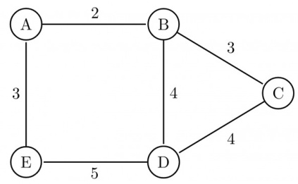

gate1995 algorithms graph-algorithms minimum-spanning-tree easy descriptive

A complete, undirected, weighted graph $G$ is given on the vertex $\{ 0 , 1 , . . . , n - 1 \}$ for any fixed ‘n’. Draw the minimum spanning tree of $G$ if

A. the weight of the edge $( u , v )$ is $\left| u - v \right|$ B. the weight of the edge $( u , v )$ is $u + v$

# 1.31.5 Minimum Spanning Tree: GATE CSE 1997 Question: 9

Consider a graph whose vertices are points in the plane with integer co-ordinates $( x , y )$ such that $1 \leq x \leq n$ and $1 \leq y \leq n$ , where $n \geq 2$ is an integer. Two vertices $( x _ { 1 } , y _ { 1 } )$ and $( x _ { 2 } , y _ { 2 } )$ are adjacent iff $\left| x _ { 1 } - x _ { 2 } \right| \leq 1$ and $\mid y _ { 1 } - y _ { 2 } \mid \le 1$ . The weight of an edge $\{ ( x _ { 1 } , y _ { 1 } ) , ( x _ { 2 } , y _ { 2 } ) \}$ is $\sqrt { ( x _ { 1 } - x _ { 2 } ) ^ { 2 } + ( y _ { 1 } - y _ { 2 } ) ^ { 2 } }$

A. What is the weight of a minimum weight-spanning tree in this graph? Write only the answer without any explanations.   
B. What is the weight of a maximum weight-spanning tree in this graph? Write only the answer without any explanations.

Let $G$ be an undirected connected graph with distinct edge weights. Let be the edge with maximum weight and $e _ { m i n }$ the edge with minimum weight. Which of the following statements is false?

A. Every minimum spanning tree of $G$ must contain emin   
B. If $e _ { m a x }$ is in a minimum spanning tree, then its removal must disconnect $G$   
C. No minimum spanning tree contains $e _ { m a x }$   
D. $G$ has a unique minimum spanning tree

gatecse-2000 algorithms minimum-spanning-tree normal

# 1.31.7 Minimum Spanning Tree: GATE CSE 2001 Question: 15

Consider a weighted undirected graph with vertex set $V = \{ n 1 , n 2 , n 3 , n 4 , n 5 , n 6 \}$ and edge set $E = \{ ( n 1 , n 2 , 2 ) , ( n 1 , n 3 , 8 ) , ( n 1 , n 6 , 3 ) , ( n 2 , n 4 , 4 ) , ( n 2 , n 5 , 1 2 ) , ( n 3 , n 4 , 7 ) , ( n 4 , n 5 , 9 ) , ( n 4 , n 6 , \bar { 4 } ) \}$ .

The third value in each tuple represents the weight of the edge specified in the tuple.

A. List the edges of a minimum spanning tree of the graph.   
B. How many distinct minimum spanning trees does this graph have?   
C. Is the minimum among the edge weights of a minimum spanning tree unique over all possible minimum spanning trees of graph?   
D. Is the maximum among the edge weights of a minimum spanning tree unique over all possible minimum spanning tree of a graph?

gatecse-2001 algorithms minimum-spanning-tree normal descriptive

What is the weight of a minimum spanning tree of the following graph?

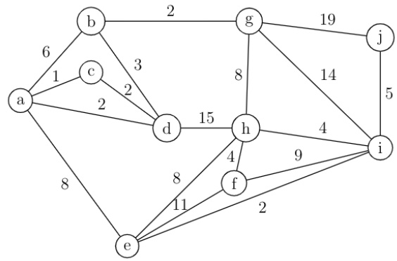

A. B. C. D. 41

gatecse-2003 algorithms minimum-spanning-tree normal

# 1.31.9 Minimum Spanning Tree: GATE CSE 2005 Question: 6

An undirected graph $G$ has $\scriptstyle n$ nodes. its adjacency matrix is given by an $n \times n$ square matrix whose (i) diagonal elements are 0’s and (ii) non-diagonal elements are 1’s. Which one of the following is TRUE?

A. Graph $G$ has no minimum spanning tree (MST) B. Graph $G$ has unique MST of cost $n - 1$ C. Graph $G$ has multiple distinct MSTs, each of cost $n - 1$ D. Graph $G$ has multiple spanning trees of different costs

Consider a weighted complete graph $G$ on the vertex set $\{ v _ { 1 } , v _ { 2 } , \ldots \ldots v _ { n } \}$ such that the weight of the edge $( v _ { i } , v _ { j } )$ is $2 | i - j |$ . The weight of a minimum spanning tree of $G$ is:

A. B. 2n-2 $\mathsf { C } . \mathsf { \binom { n } { 2 } }$ D. $n ^ { 2 }$

gatecse-2006 algorithms minimum-spanning-tree normal

Consider the following graph:

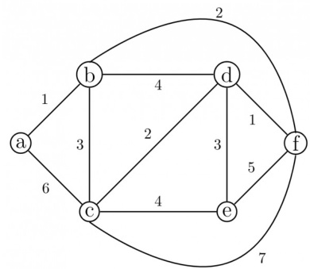

Which one of the following cannot be the sequence of edges added, in that order, to a minimum spanning tree using Kruskal’s algorithm?

A. $( a - b ) , ( d - f ) , ( b - f ) , ( d - c ) , ( d - e )$ $\begin{array} { c } { { \mathsf { B . } ( a - b ) , ( d - f ) , ( d - c ) , ( b - f ) , ( d - e ) } } \\ { { \mathsf { D . } ( d - f ) , ( a - b ) , ( b - f ) , ( d - e ) , ( d - c ) } } \end{array}$   
C. $( d - f ) , ( a - b ) , ( d - c ) , ( b - f ) , ( d - e )$

gatecse-2006 algorithms graph-algorithms minimum-spanning-tree normal

Let $\boldsymbol { w }$ be the minimum weight among all edge weights in an undirected connected graph. Let  be a specific edge of weight $w$ . Which of the following is FALSE?

A. There is a minimum spanning tree containing   
B. I f  is not in a minimum spanning tree $T$ , then in the cycle formed by adding to $T$ , all edges have the same weight.   
C. Every minimum spanning tree has an edge of weight $w$   
D. is present in every minimum spanning tree

gatecse-2007 algorithms minimum-spanning-tree normal

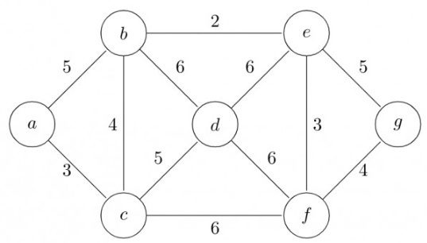

Which one of the following is NOT the sequence of edges added to the minimum spanning tree using Kruskal’s algorithm?

A. (b,e) (e,f) (a,c) (b,c) (f,g) (c,d) B. (b,e)(e,f) (a,c) (f,g) (b,c) (c,d) C. (b,e) (a,c) (e,f) (b,c) (f,g) (c,d) D. (b,e) (e,f) (b,c) (a,c) (f,g) (c,d)

# Answer key☟

Consider a complete undirected graph with vertex set $\{ 0 , 1 , 2 , 3 , 4 \}$ . Entry $W _ { i j }$ in the matrix $W$ below is the weight of the edge $\{ i , j \}$

$$
W { = } \left( \begin{array} { c c c c c } { { 0 } } & { { 1 } } & { { 8 } } & { { 1 } } & { { 4 } } \\ { { 1 } } & { { 0 } } & { { 1 2 } } & { { 4 } } & { { 9 } } \\ { { 8 } } & { { 1 2 } } & { { 0 } } & { { 7 } } & { { 3 } } \\ { { 1 } } & { { 4 } } & { { 7 } } & { { 0 } } & { { 2 } } \\ { { 4 } } & { { 9 } } & { { 3 } } & { { 2 } } & { { 0 } } \end{array} \right)
$$

What is the minimum possible weight of a spanning tree $T$ in this graph such that vertex  is a leaf node in the tree ?

A. B. C. 9 D.

gatecse-2010 algorithms minimum-spanning-tree normal

# Answer key☟

Consider a complete undirected graph with vertex set $\{ 0 , 1 , 2 , 3 , 4 \}$ . Entry $W _ { i j }$ in the matrix $W$ below is the weight of the edge $\{ i , j \}$

$$
W = \left( \begin{array} { c c c c c } { { 0 } } & { { 1 } } & { { 8 } } & { { 1 } } & { { 4 } } \\ { { 1 } } & { { 0 } } & { { 1 2 } } & { { 4 } } & { { 9 } } \\ { { 8 } } & { { 1 2 } } & { { 0 } } & { { 7 } } & { { 3 } } \\ { { 1 } } & { { 4 } } & { { 7 } } & { { 0 } } & { { 2 } } \\ { { 4 } } & { { 9 } } & { { 3 } } & { { 2 } } & { { 0 } } \end{array} \right)
$$

What is the minimum possible weight of a path $P$ from vertex to vertex 2 in this graph such that $P$ contains at most 3 edges?

A. B. C. 9 D. 10

An undirected graph $G ( V , E )$ contains $n \left( n > 2 \right)$ nodes named $v _ { 1 } , v _ { 2 } , \ldots , v _ { n }$ . Two nodes $v _ { i } , v _ { j }$ are connected if and only if $0 < \mid i - j \mid \leq 2$ . Each edge $( v _ { i } , v _ { j } )$ is assigned a weight $i + j$ . A sample graph with $n = 4$ is shown below.

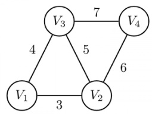

What will be the cost of the minimum spanning tree (MST) of such a graph with nodes?

A. $\textstyle { \frac { 1 } { 1 2 } } ( 1 1 n ^ { 2 } - 5 n )$ $\mathsf { B } . \ n ^ { 2 } - n + 1$ C. 6n-11 D. 2n+1

gatecse-2011 algorithms graph-algorithms minimum-spanning-tree normal

# Answer key☟

# 1.31.17 Minimum Spanning Tree: GATE CSE 2011 Question: 55

An undirected graph $G ( V , E )$ contains $n \left( n > 2 \right)$ nodes named $v _ { 1 } , v _ { 2 } , \ldots , v _ { n }$ . Two nodes $v _ { i } , v _ { j }$ are connected if and only if $0 < \mid i - j \mid \leq 2$ . Each edge $( v _ { i } , v _ { j } )$ is assigned a weight $i + j$ . A sample graph with $n = 4$ is shown below.

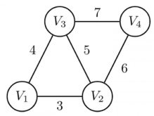

The length of the path from $v _ { 5 }$ to $v _ { 6 }$ in the MST of previous question with $n = 1 0$ is

A. B. C. D. 41

gatecse-2011 algorithms graph-algorithms minimum-spanning-tree normal

# Answer key☟

Let $G$ be a weighted graph with edge weights greater than one and $G ^ { \prime }$ be the graph constructed by squaring the weights of edges in $G$ . Let $T$ and $T ^ { \prime }$ be the minimum spanning trees of $G$ and $G ^ { \prime }$ , respectively, with total weights $t$ and $t ^ { \prime }$ Which of the following statements is TRUE?

A. $T ^ { \prime } = T$ with total weight $t ^ { \prime } = t ^ { 2 }$ B. $T ^ { \prime } = T$ with total weight ${ t / { \min } }$ C. $T ^ { \prime } \neq T$ but total weight $t ^ { \prime } = t ^ { 2 }$ D. None of the above

gatecse-2012 algorithms minimum-spanning-tree normal marks-to-all

# Answer key☟

# 1.31.19 Minimum Spanning Tree: GATE CSE 2014 Set 2 Question: 52

The number of distinct minimum spanning trees for the weighted graph below is

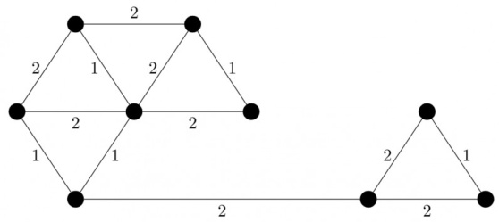

The graph shown below has edges with distinct integer edge weights. The minimum spanning tree (MST) is of weight and contains the edges: $\{ ( A , C ) , ( B , C ) , ( B , E ) , ( E , F ) , ( D , F ) \}$ . The edge weights of only those edges which are in the MST are given in the figure shown below. The minimum possible sum of weights of all edges of this graph S

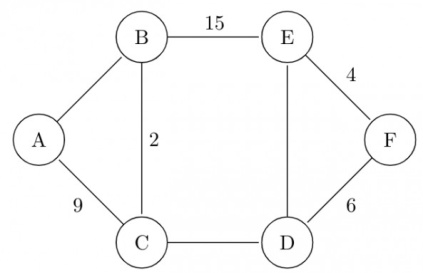

Let G be a connected undirected graph of  vertices and  edges. The weight of a minimum spanning tree of $G$ is . When the weight of each edge of $G$ is increased by five, the weight of a minimum spanning tree becomes

gatecse-2015-set3 algorithms minimum-spanning-tree easy numerical-answers

Let $G$ be a weighted connected undirected graph with distinct positive edge weights. If every edge weight is increased by the same value, then which of the following statements is/are TRUE?

$P$ : Minimum spanning tree of $G$ does not change.   
$Q$ : Shortest path between any pair of vertices does not change.

A. $P$ only B. $Q$ only C. Neither $P$ nor $Q$ D. Both $P$ and $Q$

Let $G$ be a complete undirected graph on  vertices, having  edges with weights being and . The maximum possible weight that a minimum weight spanning tree of $G$ can have is

gatecse-2016-set1 algorithms minimum-spanning-tree normal numerical-answers

# 1.31.24 Minimum Spanning Tree: GATE CSE 2016 Set 1 Question: 40

$G = ( V , E )$ is an undirected simple graph in which each edge has a distinct weight, and is a particular edge of $G$ . Which of the following statements about the minimum spanning trees $( M S T s )$ of $G$ is/are TRUE?

I. If $e$ is the lightest edge of some cycle in $G$ , then every MST of $G$ includes $e$ . II. If $e$ is the heaviest edge of some cycle in $G$ , then every MST of $G$ excludes $e$

A. I only. B. II only. C. Both and II. D. Neither nor II.

Consider the following undirected graph $G$ :

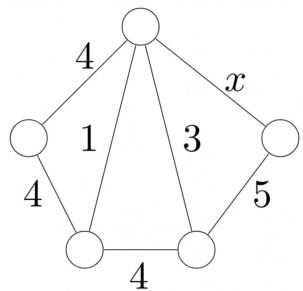

Choose a value for $x$ that will maximize the number of minimum weight spanning trees (MWSTs) of $G$ . The number of MWSTs of $G$ for this value of $x$ is

gatecse-2018 algorithms graph-algorithms minimum-spanning-tree numerical-answers two-marks

L e t $G = ( V , E )$ be a weighted undirected graph and let $T$ be a Minimum Spanning Tree (MST) of $G$ maintained using adjacency lists. Suppose a new weighed edge $( u , v ) \in V \times V$ is added to $G$ . The worst case time complexity of determining if $T$ is still an MST of the resultant graph is

A. C. $\begin{array} { l } { \Theta ( \mid E \mid + \mid V \mid ) } \\ { \Theta ( E \mid \log \mid V \mid ) } \end{array}$ $\mathsf { B . ~ } \Theta ( \mid E \mid \mid V \mid )$

gatecse-2020 algorithms minimum-spanning-tree graph-algorithms two-marks

Consider a graph $G = ( V , E )$ , where $V = \{ v _ { 1 } , v _ { 2 } , \ldots , v _ { 1 0 0 } \}$ , $E = \{ ( v _ { i } , v _ { j } ) \mid 1 \leq i < j \leq 1 0 0 \}$ , and weight of the edge $( v _ { i } , v _ { j } )$ is $| i - j |$ . The weight of minimum spanning tree of $G$ is

gatecse-2020 numerical-answers algorithms graph-algorithms two-marks minimum-spanning-tree

Consider the following undirected graph with edge weights as shown:

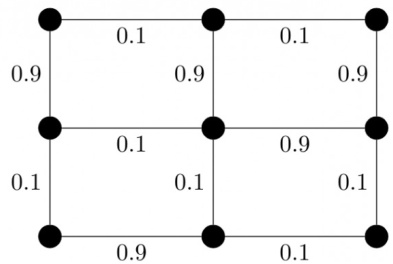

The number of minimum-weight spanning trees of the graph is gatecse-2021-set1 algorithms graph-algorithms minimum-spanning-tree numerical-answers one-mark

Which one of the following options is correct?

A. Both $S _ { 1 }$ and $S _ { 2 }$ are true B. $S _ { 1 }$ is true and $S _ { 2 }$ is false C. $S _ { 1 }$ is false and $S _ { 2 }$ is true D. Both $S _ { 1 }$ and $S _ { 2 }$ are false gatecse-2021-set2 algorithms graph-algorithms minimum-spanning-tree one-mark

Consider a simple undirected weighted graph $G$ all of whose edge weights are distinct. Which of the following statements about the minimum spanning trees of $G$ is/are

A. The edge with the second smallest weight is always part of any minimum spanning tree of $G$ .   
B. One or both of the edges with the third smallest and the fourth smallest weights are part of any minimum spanning tree of $G$ .   
C. Suppose $S \subseteq V$ be such that $S \neq \phi$ and $S \neq V$ . Consider the edge with the minimum weight such that one of its vertices is in $\boldsymbol { S }$ and the other in $V \backslash S .$ Such an edge will always be part of any minimum spanning tree of $G$ .   
D. $G$ can have multiple minimum spanning trees.

gatecse-2022 algorithms minimum-spanning-tree multiple-selects two-marks

# 1.31.31 Minimum Spanning Tree: GATE CSE 2022 Question: 48

Let $G ( V , E )$ be a directed graph, where $V = \{ 1 , 2 , 3 , 4 , 5 \}$ is the set of vertices and $E$ is the set of directed edges, as defined by the following adjacency matrix $A$ ·

$$
A [ i ] [ j ] = { \left\{ \begin{array} { l l } { 1 , } & { 1 \leq j \leq i \leq 5 } \\ { 0 , } & { { \mathrm { ~ o t h e r w i s e } } } \end{array} \right. }
$$

$A [ i ] [ j ] = 1$ indicates a directed edge from node $i$ to node $j$ A  o f rooted at $r \in V$ is defined as a subgraph $T$ of $G$ such that the undirected version of $T$ is a tree , and contains a directed path from $r$ to every other vertex in $V$ The number of such directed spanning trees rooted at vertex is

The number of distinct minimum-weight spanning trees of the following graph is

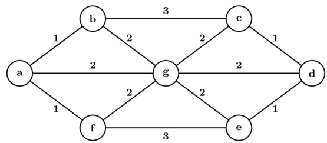

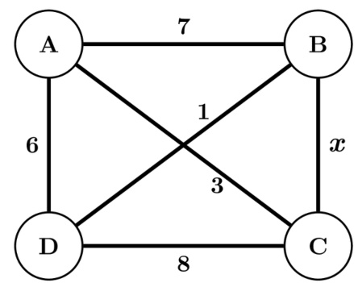

Let $G ( V , E )$ be a simple, undirected, edge-weighted graph with unique edge weights. Which of the following statements about the minimum spanning trees (MST) of $G$ is/are true?

A. In every cycle $\boldsymbol { C }$ of $G$ , the edge with the largest weight in $\boldsymbol { C }$ is not in any MST B. In every cycle $C$ of $G$ , the edge with the smallest weight in $\ b { C }$ is in every MST C. For every vertex $v \in V$ , the edge with the largest weight incident on $v$ i not in any MST D. For every vertex $v \in V$ , the edge with the smallest weight incident on $v$ is in every MST gatecse-2026-set1 two-marks algorithms minimum-spanning-tree multiple-selects

Let $G$ be a weighted undirected graph and e be an edge with maximum weight in . Suppose there is a minimum weight spanning tree in $G$ containing the edge . Which of the following statements is always TRUE?

A. There exists a cutset in $G$ having all edges of maximum weight.   
B. There exists a cycle in $G$ having all edges of maximum weight.   
C. Edge $e$ cannot be contained in a cycle.   
D. All edges in $G$ have the same weight.

The pseudocode of a function is given below:

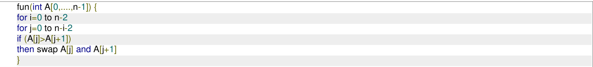

Let $A [ 0 , \ldots , 2 9 ]$ be an array storing  distinct integers in descending order. The number of swap operations that will be performed, if the function  is called with $A [ 0 , \ldots , 2 9 ]$ as argument, is (Answer in integer)

Consider the undirected graph below:

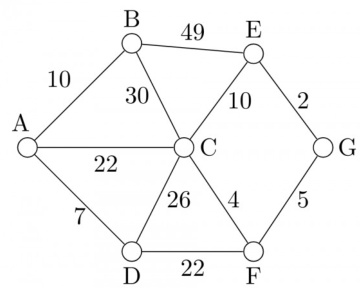

Using Prim's algorithm to construct a minimum spanning tree starting with node A, which one of the following sequences of edges represents a possible order in which the edges would be added to construct the minimum spanning tree?

A. (E, G), (C,F), (F, G), (A,D), (A,B), (A,C) B. (A,D),(A,B),(A,C),(C,F), (G,E),(F, G) C. (A,B), (A,D), (D,F), (F,G), (G,E), (F,C) D. (A,D), (A,B), (D,F), (F,C), (F,G), (G,E)

For the undirected, weighted graph given below, which of the following sequences of edges represents a correct execution of Prim's algorithm to construct a Minimum Span​ning Tree?

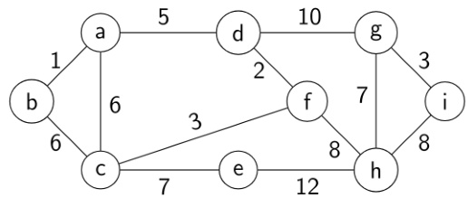

A. (a,b),(d,f), (f,c), (g,i), (d,a), (g,h), (c,e), (f,h) B. $( \mathbf { c } , \mathbf { f } )$ ,(f,d), (d,a), (a,b), (g,h), (h,f), (g,i) C. (d,f), (f,c), (d,a),(a,b), (c,e), (f,h), (g,h), (g,i) D. (h,g), (g,i), (h,f), (f,c), (f,d), (d,a), (a,b),(c,e)

An input files has records with keys as given below: 25 7 34 2 70 9 61 16 49 19 This is to be sorted in non-decreasing order.

i. Sort the input file using QUICKSORT by correctly positioning the first element of the file/subfile. Show the subfiles obtained at all intermediate steps. Use square brackets to demarcate subfiles. ii. Sort the input file using -way- MERGESORT showing all major intermediate steps. Use square brackets to demarcate subfiles.

Assume that the last element of the set is used as partition element in Quicksort. If $n$ distinct elements from the set $\left[ 1 \ldots n \right]$ are to be sorted, give an input for which Quicksort takes maximum time.

gate1992 algorithms sorting easy quick-sort descriptive

Quick-sort is run on two inputs shown below to sort in ascending order taking first element as pivot

${ \mathfrak { i . 1 , 2 , 3 , . . . n } }$ ii. $n , n - 1 , n - 2 , . . . , 2 , 1$

Let $C _ { 1 }$ and $C _ { 2 }$ be the number of comparisons made for the inputs (i) and (ii) respectively. Then,

CA. $C _ { 1 } < C _ { 2 }$ B. $C _ { 1 } > C _ { 2 }$ $C _ { 1 } = C _ { 2 }$ D. we cannot say anything for arbitrary $\scriptstyle n$

gate1996 algorithms sorting normal quick-sort

Randomized quicksort is an extension of quicksort where the pivot is chosen randomly. What is the wors case complexity of sorting n numbers using Randomized quicksort?

A. $O ( n )$ $\mathsf { B } . \ O ( n \log n )$ C. O(n2) D. O(n!)

gatecse-2001 algorithms sorting time-complexity easy quick-sort

# 1.34.6 Quick Sort: GATE CSE 2006 Question: 52

The median of $\scriptstyle n$ elements can be found in $O ( n )$ time. Which one of the following is correct about the complexity of quick sort, in which median is selected as pivot?

A. $\Theta ( n )$ $\begin{array} { l } { { \mathsf { B . ~ } \Theta ( n \log n ) } } \\ { { \mathsf { D . ~ } \Theta ( n ^ { 3 } ) } } \end{array}$   
C. $\Theta ( n ^ { 2 } )$

gatecse-2006 algorithms sorting easy quick-sort

# 1.34.7 Quick Sort: GATE CSE 2008 Question: 43

Consider the Quicksort algorithm. Suppose there is a procedure for finding a pivot element which splits the list into two sub-lists each of which contains at least one-fifth of the elements. Let $T ( n )$ be the number of comparisons required to sort $n$ elements. Then

A. $T ( n ) \leq 2 T ( n / 5 ) + n$ B. $T ( n ) \leq T ( n / 5 ) + T ( 4 n / 5 ) + n$   
C. $T ( n ) \leq 2 T ( 4 n / 5 ) + n$ D. $T ( n ) \leq 2 T ( n / 2 ) + n$

gatecse-2008 algorithms sorting easy quick-sort

# Answer key☟

# 1.34.8 Quick Sort: GATE CSE 2009 Question: 39

In quick-sort, for sorting $n$ elements, th e smallest element is selected as pivot using an $O ( n )$ time algorithm. What is the worst case time complexity of the quick sort?

A. $\Theta ( n )$ $\begin{array} { l } { { \mathsf { B . ~ } \Theta ( n \log n ) } } \\ { { \mathsf { D . ~ } \Theta ( n ^ { 2 } \log n ) } } \end{array}$   
C. $\Theta ( n ^ { 2 } )$

gatecse-2009 algorithms sorting normal quick-sort

# Answer key☟

# 1.34.9 Quick Sort: GATE CSE 2014 Set 1 Question: 14

Let $P$ be quicksort program to sort numbers in ascending order using the first element as the pivot. Let and $t _ { 2 }$ be the number of comparisons made by $\mathsf { P }$ for the inputs and respectively. Which one of the following holds?

A. $t _ { 1 } = 5$ B. $t _ { 1 } < t _ { 2 }$ C. D.

gatecse-2014-set1 algorithms sorting easy quick-sort

# 1.34.10 Quick Sort: GATE CSE 2014 Set 3 Question: 14

You have an array of $\scriptstyle n$ elements. Suppose you implement quicksort by always choosing the central element of the array as the pivot. Then the tightest upper bound for the worst case performance is

A. $O ( n ^ { 2 } )$ $\mathsf { B } . \ O ( n \log n )$ $\mathsf { C } . \ \Theta ( n \log n )$ D. O(n3)

gatecse-2014-set3 algorithms sorting easy quick-sort

# 1.34.11 Quick Sort: GATE CSE 2015 Set 1 Question: 2

Which one of the following is the recurrence equation for the worst case time complexity of the quick sort algorithm for sorting $n \left( \geq 2 \right)$ numbers? In the recurrence equations given in the options below, $c$ is a constant.

A. $T ( n ) = 2 T ( n / 2 ) + c n$ B. $T ( n ) = T ( n - 1 ) + T ( 1 ) + c n$   
C. $T ( n ) = 2 T ( n - 1 ) + c n$ D. $T ( n ) = T ( n / 2 ) \cdot { } c n$

gatecse-2015-set1 algorithms recurrence-relation sorting easy quick-sort

# 1.34.12 Quick Sort: GATE CSE 2015 Set 2 Question: 45

Suppose you are provided with the following function declaration in the C programming language.

int partition(int a[], int n);

The function treats the first element of $a [ ]$ as a pivot and rearranges the array so that all elements less than or equal to the pivot is in the left part of the array, and all elements greater than the pivot is in the right part. In addition, it moves the pivot so that the pivot is the last element of the left part. The return value is the number of elements in the left part.

The following partially given function in the C programming language is used to find the $k ^ { t h }$ smallest element in an array $a [ ]$ of size $\scriptstyle n$ using the partition function. We assume $k \leq n$ .

int kth _smallest (int a[], int n, int k) int left _end $\mathbf { \Sigma } = \mathbf { \Sigma }$ partition (a, n);

if (left_end $+ 1 = = 1$ ) { return a[left _end];   
}   
if (left _end+1 > k) { return kth _smallest else { return kth _smallest

The missing arguments lists are respectively

A. (a, left_end and left_end B. left_end and left_end left_end left_end left_end -1)   
C. $^ { ( a + }$ left_end left _end D. left_end left_end left _end and and left_end left_end

An array of distinct elements is to be sorted using quicksort. Assume that the pivot element is chosen uniformly at random. The probability that the pivot element gets placed in the worst possible location in the first round of partitioning (rounded off to  decimal places) is

gatecse-2019 numerical-answers algorithms quick-sort probability one-mark

Consider that the quick sort algorithm is used to sort an array of $\boldsymbol { n }$ distinct randomly ordered elements. In every call, the pivot is chosen as the first element of the current subarray.

Let $T ( n )$ denote the expected time to sort the array. Assume that the time to partition is linear in the size of the current subarray.

Which of the following recurrence relations correctly represents $T ( n )$ in this scenario?

A. $T ( n ) = T ( 1 ) + T ( n - 1 ) + O ( n )$ B. $\begin{array} { r } { T ( n ) = T \left( \frac { n } { 4 } \right) + T \left( \frac { 3 n } { 4 } \right) + O ( n ) } \end{array}$   
C. $\begin{array} { r } { T ( n ) = 2 T \left( \frac { n } { 2 } \right) + O ( n ) } \end{array}$ D. $\begin{array} { r } { T ( n ) = { \frac { 1 } { n } } \sum _ { k = 0 } ^ { n - 1 } [ T ( k ) + T ( n - k - 1 ) ] + O ( n ) } \end{array}$

gateda-2026 algorithms quick-sort recurrence-relation one-mark

Consider sorting the following array of integers in ascending order using an inplace Quicksort algorithm that uses the last element as the pivot.

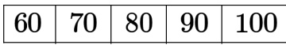

The minimum number of swaps performed during this Quicksort is gate-ds-ai-2024 numerical-answers algorithms quick-sort one-mark

Solve the recurrence equations:

$$
\begin{array} { l } { \displaystyle \cdot T ( n ) = T ( n - 1 ) + n } \\ { \displaystyle \cdot T ( 1 ) = 1 } \end{array}
$$

gate1987 algorithms recurrence-relation descriptive

Answer key☟

Solve the recurrence equations:

$$
\begin{array} { l } { \cdot \ T ( n ) = T ( { \frac { n } { 2 } } ) + 1 } \\ { \cdot \ T ( 1 ) = 1 } \end{array}
$$

gate1988 descriptive algorithms recurrence-relation

# Answer key☟

Find a solution to the following recurrence equation:

gate1989 descriptive algorithms recurrence-relation

Answer key☟

Express $T ( n )$ in terms of the harmonic number $H _ { n } = \sum _ { i = 1 } ^ { n } { \frac { 1 } { i } } , \quad n \geq$ , where $T ( n )$ satisfies the recurrence relation,

$$
\begin{array} { r } { T ( n ) = \frac { n + 1 } { n } T ( n - 1 ) + 1 , \mathrm { f o r } n \geq \sum \mathsf { a n d } T ( 1 ) = 1 } \end{array}
$$

What is the asymptotic behaviour of $T ( n )$ as a function of $\scriptstyle n$ ?

gate1990 descriptive algorithms recurrence-relation

Consider the function $F ( n )$ for which the pseudocode is given below

Function F(n)   
begin   
$| \mathsf { F } 1 \gets 1$   
if $( n = 1 )$ then $\mathsf { F } \gets 3$   
else For $\dot { \mathsf { I } } = 1$ to n do begin $\mathsf { C } \gets 0$ For $\mathbf { j } = 1$ to $\mathsf { n } - 1$ do begin $\mathsf { C } \gets \mathsf { C } + 1$ end $\mathsf { F } 1 = \mathsf { F } 1 ^ { \star } \mathsf { C }$ end   
$\mathsf { F } = \mathsf { F } \mathsf { 1 }$   
end

[  is a positive integer greater than zero]

A. Derive a recurrence relation for $F ( n )$

Consider the function $F ( n )$ for which the pseudocode is given below [  is a positive integer greater than zero]

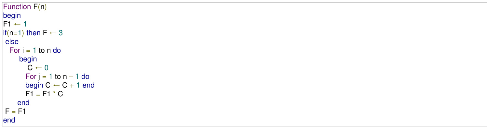

B. Solve the recurrence relation for a closed form solution of $F ( n )$ .

Consider the recursive algorithm given below:

procedure bubblesort (n);   
var i,j: index; temp $\because$ item;   
begin for $\mathrm { i } { : = } 1$ to n-1 do if $\mathsf { A } [ \mathsf { i } ] > \mathsf { A } [ \mathsf { i } + 1 ]$ then begin temp $\langle : = \mathsf { A } [ \mathsf { i } ]$ ; $\begin{array} { r } { \mathbb { W } [ \mathbf { i } ] : = \mathbb { A } [ \mathbf { i } + \mathbf { 1 } ] } \end{array}$ ; $\mathsf { A } [ \mathsf { i } + 1 ] : =$ temp; end; bubblesort (n-1)   
end

Let $a _ { n }$ be the number of times the ‘if… then…’ statement gets executed when the algorithm is run with value $n$ . Set up the recurrence relation by defining $\scriptstyle a _ { n }$ in terms of Solve for .

gate1993 algorithms recurrence-relation normal descriptive

The recurrence relation

$$
\begin{array} { l } { \cdot \ T ( 1 ) = 2 } \\ { \cdot \ T ( n ) = 3 T ( \frac { n } { 4 } ) + n } \end{array}
$$

has the solution $T ( n )$ equal to

A. $O ( n )$ ${ \mathsf { B } } . { \cal O } ( \log n )$ C. $O \left( n ^ { \frac { 3 } { 4 } } \right)$ D. None of the above

gate1996 algorithms recurrence-relation normal

# Answer key☟

# Consider the following function.

Function F(n, m:integer):integer;   
begin if $( \mathsf { n } < = 0 )$ ) or $( \mathsf { m } < = 0 )$ 1 then $\mathsf { F } { : = } 1$ else $\mathsf { F } { : } \mathsf { F } ( \mathsf { n } { - } 1 , \mathsf { m } ) + \mathsf { F } ( \mathsf { n } { - } 1 , \mathsf { m } { - } 1 )$ ;   
end;

Use the recurrence relation ${ \binom { n } { k } } = { \binom { n - 1 } { k } } + { \binom { n - 1 } { k - 1 } }$ to answer the following questions. Assume that ${ \mathbf { } } n , { \mathbf { } } m$ are positive integers. Write only the answers without any explanation.

a. What is the value of $F ( n , 2 ) ?$   
b. What is the value of $F ( n , m ) ?$   
c. How many recursive calls are made to the function $F$ , including the original call, when evaluating $F ( n , m )$ .

# Answer key☟

Let $T ( n )$ be the function defined by $T ( 1 ) = 1$ ， $T ( n ) = 2 T ( \lfloor { \frac { n } { 2 } } \rfloor ) + { \sqrt { n } }$ for $n \geq 2$ . Which of the following statements is true?

A. $T ( n ) = O { \sqrt { n } }$ B. $T ( n ) = O ( n )$ C. $T ( n ) = O ( \log n )$ D. None of the above

gate1997 algorithms recurrence-relation normal

# Answer key☟

The running time of the following algorithm Procedure $A ( n )$   
If $n \leqslant 2$ return ( ) else return $( A ( { \sqrt { n } } ) )$ ; is best described by

A. $O ( n )$ B. $. { \cal O } ( \log n )$ C. O(log log n) D. 0(1)

gatecse-2002 algorithms recurrence-relation normal

Consider the following recurrence relation

$T ( 1 ) = 1$ $T ( n + 1 ) = T ( n ) + \lfloor { \sqrt { n + 1 } } \rfloor$ for all $n \geq 1$ The value of $T ( m ^ { 2 } )$ for $m \geq 1$ is

A. $\textstyle { \frac { m } { 6 } } ( 2 1 m - 3 9 ) + 4$ B. $\begin{array} { c } { { \frac { m } { 6 } ( 4 m ^ { 2 } - 3 m + 5 ) } } \end{array}$   
C. $\textstyle { \frac { m } { 2 } } ( 3 m ^ { 2 . 5 } - 1 1 m + 2 0 ) - 5$ D. $\begin{array} { c } { { \frac { \dot { m } } { 6 } \big ( 5 m ^ { 3 } - 3 4 m ^ { 2 } + 1 3 7 m - 1 0 4 \big ) + \frac { 5 } { 6 } } } \end{array}$

gatecse-2003 algorithms time-complexity recurrence-relation difficult

The time complexity of the following C function is (assume $n > 0$ )

int recursive (int n) { i $\scriptstyle { \mathfrak { f } } ( { \mathfrak { n } } = = 1 )$ return (1); else return (recursive (n-1) $^ +$ recursive (n-1));

A. $O ( n )$ B. O(n log n) C. O(n2) D. 0(2n) gatecse-2004 algorithms recurrence-relation time-complexity normal isro2015

# Answer key☟

The recurrence equation $T ( 1 ) = 1$ $T ( n ) = 2 T ( n - 1 ) + n , n \geq 2$

evaluates to

A. $2 ^ { n + 1 } - n - 2$ B. $2 ^ { n } - n$ C. $2 ^ { n + 1 } - 2 n - 2$ D. $2 ^ { n } + n$

gatecse-2004 algorithms recurrence-relation normal

# Answer key☟

Which one of the following is true?

A. $T ( n ) = \Theta ( \log \log n )$ B. $T ( n ) = \Theta ( \log n )$   
C. $T ( n ) = \Theta ( { \sqrt { n } } )$ D. $T ( n ) = \Theta ( n )$

algorithms recurrence-relation isro2016 gatecse-2006

Let $\scriptstyle { { \mathfrak { x } } } _ { n }$ denote the number of binary strings of length that contain no consecutive s. Which of the following recurrences does $x _ { n }$ satisfy?

A. $x _ { n } = 2 x _ { n - 1 }$ $\begin{array} { l } { { \mathsf { B . } x _ { n } = x _ { \lfloor n / 2 \rfloor } + 1 } } \\ { { \mathsf { D . } x _ { n } = x _ { n - 1 } + x _ { n - 2 } } } \end{array}$   
C. ${ \pmb x } _ { n } = { \pmb x } _ { \lfloor n / 2 \rfloor } + n$

Let $\scriptstyle { \boldsymbol { x } } _ { n }$ denote the number of binary strings of length $n$ that contain no consecutive s. The value of $x _ { 5 }$ is

A. B. C. D.

gatecse-2008 algorithms recurrence-relation normal

The running time of an algorithm is represented by the following recurrence relation:

$$
T ( n ) = { \left\{ \begin{array} { l l } { n } & { n \leq 3 } \\ { T ( { \frac { n } { 3 } } ) + c n } & { { \mathrm { ~ o t h e r w i s e } } } \end{array} \right. }
$$

Which one of the following represents the time complexity of the algorithm?

A. $\Theta ( n )$ B. $\Theta ( n \log n )$   
C. $\Theta ( n ^ { 2 } )$ D. $\Theta ( n ^ { 2 } \log n )$

gatecse-2009 algorithms recurrence-relation time-complexity normal

# Answer key☟

# 1.35.22 Recurrence Relation: GATE CSE 2012 Question: 16

The recurrence relation capturing the optimal execution time of the Hanoi problem with $\scriptstyle n$ discs is

A. $T ( n ) = 2 T ( n - 2 ) + 2$ B. $T ( n ) = 2 T ( n - 1 ) + n$   
C. $T ( n ) = 2 T ( n / 2 ) \dot { + } 1$ D. $T ( n ) = 2 T ( n - 1 ) + 1$

gatecse-2012 algorithms easy recurrence-relation

Answer key☟

# 1.35.23 Recurrence Relation: GATE CSE 2014 Set 2 Question: 13

Which one of the following correctly determines the solution of the recurrence relation with $T ( 1 ) = 1 ?$

$$
T ( n ) = 2 T \left( { \frac { n } { 2 } } \right) + \log n
$$

A. $\Theta ( n )$ B. $\Theta ( n \log n )$ $\mathsf { C } . \Theta ( n ^ { 2 } )$ D. $\Theta ( \log n )$

Let $\mathsf { a } _ { n }$ represent the number of bit strings of length n containing two consecutive s. What is the recurrence relation for $a _ { n }$ ?

A. $a _ { n - 2 } + a _ { n - 1 } + 2 ^ { n - 2 }$ B. $a _ { n - 2 } + 2 a _ { n - 1 } + 2 ^ { n - 2 }$   
C. $2 a _ { n - 2 } + a _ { n - 1 } + 2 ^ { n - 2 }$ D. $2 a _ { n - 2 } + 2 a _ { n - 1 } + 2 ^ { n - 2 }$

gatecse-2015-set1 algorithms recurrence-relation normal

# 1.35.25 Recurrence Relation: GATE CSE 2015 Set 3 Question: 39

Consider the following recursive C function.

void get(int n) if $( \mathsf { n } { < } 1 )$ 9 return; get (n-1); get (n-3); printf("%d", n);

If  function is being called in  then how many times will the  function be invoked before returning to the ?

A. B. C. D.

gatecse-2015-set3 algorithms recurrence-relation normal

# Answer key☟

The given diagram shows the flowchart for a recursive function $A ( n )$ . Assume that all statements, except for the recursive calls, have $O ( 1 )$ time complexity. If the worst case time complexity of this function is $O ( n ^ { \alpha } )$ , then the least possible value (accurate up to two decimal positions) of $\alpha$ is

Flow chart for Recursive Function $A ( n )$ .

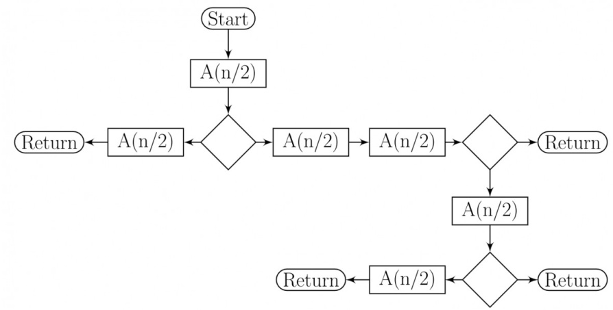

C. $\Theta ( { \sqrt { n } } )$ D. $\Theta ( n )$

For parameters $a$ and $b$ , both of which are $\omega ( 1 ) , T ( n ) = T ( n ^ { 1 / a } ) + 1$ , and $T ( b ) = 1$ . Then $T ( n )$ is

A. $\Theta ( \log _ { a } \log _ { b } n )$ $\begin{array} { l } { \mathsf { B . ~ } \Theta ( \log _ { a b } n ) } \\ { \mathsf { D . ~ } \Theta ( \log _ { 2 } \log _ { 2 } n ) } \end{array}$   
C. $\Theta ( \log _ { b } \log _ { a } \ n )$

gatecse-2020 algorithms recurrence-relation one-mark

Consider the following recurrence relation.

$$
T ( n ) = { \left\{ \begin{array} { l l } { T ( n / 2 ) + T ( 2 n / 5 ) + 7 n } & { { \mathrm { ~ i f ~ } } n > 0 } \\ { 1 } & { { \mathrm { ~ i f ~ } } n = 0 } \end{array} \right. }
$$

Which one of the following options is correct?

A. $T ( n ) = \Theta ( n ^ { 5 / 2 } )$ B. $T ( n ) = \Theta ( n \log n )$   
C. $T ( n ) = \Theta ( n )$ D. $T ( n ) = \Theta ( ( \log n ) ^ { 5 / 2 } )$

gatecse-2021-set1 algorithms recurrence-relation time-complexity two-marks

# Answer key☟

For constants $a \geq 1$ and $b > 1$ , consider the following recurrence defined on the non-negative integers:

$$
T ( n ) = a \cdot T \left( { \frac { n } { b } } \right) + f ( n )
$$

Which one of the following options is correct about the recurrence $T ( n ) ?$

A. If ${ f ( n ) }$ is $n \log _ { 2 } ( n )$ , then $T ( n )$ is $\Theta ( n \log _ { 2 } ( n ) )$   
B. If ${ f ( n ) }$ is $\frac { n } { \log _ { 2 } ( n ) }$ then $T ( n )$ is $\Theta ( \log _ { 2 } ( n ) )$   
C. If ${ f ( n ) }$ is $O ( n ^ { \log _ { b } ( a ) - \epsilon } )$ for some $\epsilon > 0$ , then $T ( n )$ is $\Theta ( n ^ { \log _ { b } ( a ) } )$   
D. If $f ( n )$ is $\Theta ( n ^ { \log _ { b } ( a ) } )$ , then $T ( n )$ is $\Theta ( n ^ { \log _ { b } ( a ) } )$

gatecse-2021-set2 algorithms recurrence-relation two-marks

# Answer key☟

Consider the following recurrence relation:

$$
T ( n ) = 2 T ( n - 1 ) + n 2 ^ { n } \mathrm { f o r } n > 0 , \quad T ( 0 ) = 1
$$

Which ONE of the following options is CORRECT?

A. $T ( n ) = \Theta \left( n ^ { 2 } 2 ^ { n } \right)$ $\begin{array} { r l } & { \mathsf { B . ~ } T ( n ) = \Theta \left( n 2 ^ { n } \right) } \\ & { \mathsf { D . ~ } T ( n ) = \Theta \left( 4 ^ { n } \right) } \end{array}$ C. $T ( n ) = \Theta \left( ( \log n ) ^ { 2 } 2 ^ { n } \right)$   
gatecse2025-set1 algorithms time-complexity recurrence-relation one-mark

# Answer key☟

# 1.35.33 Recurrence Relation: GATE CSE 2026 Set 2 Question: 15

Which of the following can be recurrence relation(s) corresponding to an algorithm with time complexity $\Theta ( n ) ?$

A. $T ( n ) = T ( n - 1 ) + 1$ ， $T ( 1 ) = 1$ B. $\begin{array} { r } { T ( n ) = 2 T \left( \frac { n } { 2 } \right) + 1 } \end{array}$ $T ( 1 ) = 1$ C. $\begin{array} { r } { T ( n ) = 2 T \left( \frac { n } { 2 } \right) + n , } \end{array}$ ， $T ( 1 ) = 1$ D. $T ( n ) = T ( n - 1 ) + n .$ ， $T ( 1 ) = 1$

gatecse-2026-set2 algorithms recurrence-relation multiple-selects one-mark

# Answer key☟

Consider a list of recursive algorithms and a list of recurrence relations as shown below. Each recurrence relation corresponds to exactly one algorithm and is used to derive the time complexity of the algorithm.

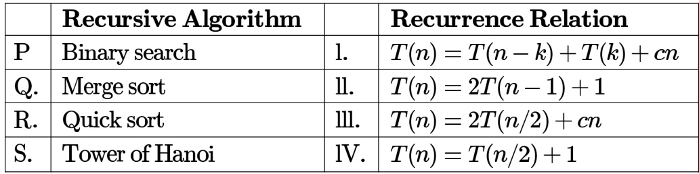

Which of the following is the correct match between the algorithms and their recurrence relations?

A. P-II, Q-I,R-IV, S-I B. P-IV, Q-II, R-I, S-II C. P-III, Q-II, R-IV, S-I D. P-IV, Q-II, R-I, S-III

gateit-2004 algorithms recurrence-relation normal match-the-following

# Answer key☟

Let $T ( n )$ be a function defined by the recurrence $T ( n ) = 2 T ( n / 2 ) + { \sqrt { n } }$ for $n \geq 2$ and $T ( 1 ) = 1$

Which of the following statements is TRUE?

A. $T ( n ) = \Theta ( \log n )$ B. $T ( n ) = \Theta ( { \sqrt { n } } )$   
C. $T ( n ) = \Theta ( n )$ D. $T ( n ) = \Theta ( { \bar { n } } \log n )$

gateit-2005 algorithms recurrence-relation easy

# Answer key☟

A. $\sqrt { ( n ) ( \log n + 1 ) }$ B. ${ \sqrt { ( n ) \log n } }$ C. $\sqrt { ( n ) \log { \sqrt { ( n ) } } }$ D. nlog√n

gateit-2008 algorithms recurrence-relation normal

# 1.36.1 Recursion: GATE CSE 1995 Question: 2.9

A language with string manipulation facilities uses the following operations head(s): first character of a string tail(s): all but exclude the first character of a string concat(s1, s2): s1s2

For the string " " what will be the output of

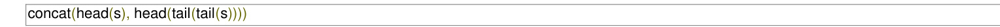

A. ac B. bc C. ab D. CC

gate1995 algorithms normal recursion

In the following C function, let $n \geq m$ int $\mathfrak { g c d } ( \mathsf { n } , \mathsf { m } )$ { if $( \mathsf { n } ^ { \circ } / \mathsf { o } \mathsf { m } = = 0 )$ ) return m; $\mathsf { n } = \mathsf { n } \% \mathsf { m }$ ; return ${ \mathfrak { g c d } } ( { \mathfrak { m } } , { \mathfrak { n } } )$ ;

How many recursive calls are made by this function?

A. $\Theta ( \log _ { 2 } n )$ B. Ω(n) C. $\Theta ( \log _ { 2 } \log _ { 2 } n )$ D. $\Theta ( { \sqrt { n } } )$

gatecse-2007 algorithms recursion time-complexity normal

# 1.36.3 Recursion: GATE CSE 2018 Question: 45

Consider the following program written in pseudo-code. Assume that $x$ and $y$ are integers.

Count (x, y) { if (y !=1 ) { if (x !=1) { print("\*"); Count (x/2, y); } else y=y-1; Count (1024, y);

The number of times that the statement is executed by the call is

# Consider the following ANSI program

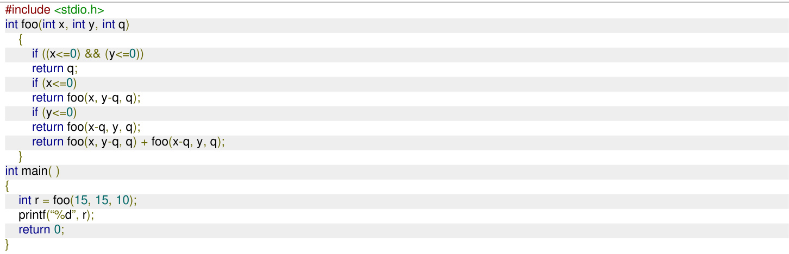

# The output of the program upon execution is

Consider the recursive functions represented by the following code segment:

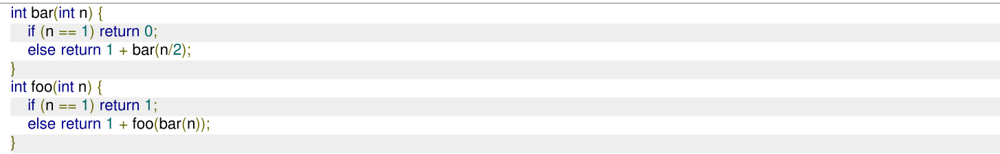

The smallest positive integer n for which returns  is (answer in integer)

Note: Ignore syntax errors (if any) in the function.

gatecse-2026-set1 algorithms recursion numerical-answers two-marks

Consider the following program that attempts to locate an element $x$ in an array $a \mathbb { I }$ using binary search. Assume $N > 1$ . The program is erroneous. Under what conditions does the program fail?

var i,j,k: integer; x: integer; a: array; [1..N] of integer;   
begin $\mathfrak { i } : = 1 ; \mathfrak { j } : = \mathfrak { n }$ ;   
repeat ${ \mathsf { k } } \langle ( { \mathsf { i } } + { \mathsf { j } } )$ div 2; if $\mathsf { a } [ \mathsf { k } ] < \mathsf { x }$ then $\vdots : = \mathsf { k }$ else $\mathbf { j } { : = } \mathbf { k }$   
until $( \mathsf { a } [ \mathsf { k } ] = \mathsf { x } )$ ) or $( \mathfrak { i } > = \mathfrak { j } )$ ;   
if $( \mathsf { a } [ \mathsf { k } ] = \mathsf { x } )$ ) then writeln $\ " x$ is in the array')   
else writeln $\ " x$ is not in the array')   
end;

The average number of key comparisons required for a successful search for sequential search on $\scriptstyle n$ items is

m n-1 $\frac { n + 1 } { 2 }$ D. None of the above 2

gate1996 algorithms easy isro2016 searching

Consider the following algorithm for searching for a given number $x$ in an unsorted array $A [ 1 . . n ]$ having $n$ distinct values:

1. Choose an $\mathbf { \chi } _ { i }$ at random from   
2. If $A [ i ] = x$ , then Stop else Goto 1;

Assuming that $x$ is present in $A$ , what is the expected number of comparisons made by the algorithm before it terminates?

A. B. C. D. n

gatecse-2002 searching normal

Consider the following C program that attempts to locate an element $x$ in an array $ { \boldsymbol { Y } } [ ]$ using binary search.   
The program is erroneous.

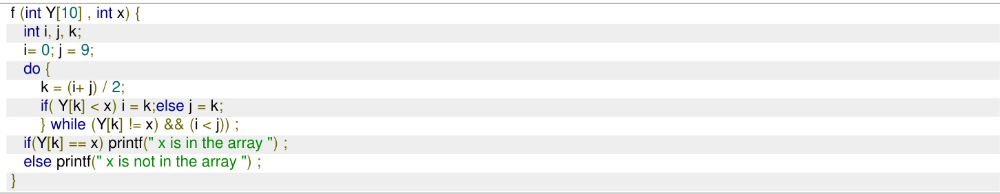

On which of the following contents of $Y$ and $x$ does the program fail?

A. $Y$ is[123456789 10] and $x < 1 0$   
B. $Y$ is  and $x < 1$   
C.  is and $x > 2$   
D.  is  and $2 < x < 2 0$ and $x$ is even

The correction needed in the program to make it work properly is

A. Change line 6 to: if $( Y [ k ] < x ) i = k + 1$ ; else $j = k - 1$ ;   
B. Change line 6 to: if $( Y [ k ] < x ) i = k - 1$ ; else $j = k + 1$ ;   
C. Change line 6 to: if $( Y [ k ] < x ) i = k ;$ ; else $j = k$ ;   
D. Change line 7 to: } while $( Y [ k ] = = x ) \& \& ( i < j ) )$ ;

gatecse-2008 algorithms searching normal

Let $A$ be an array of numbers consisting of a sequence of 's followed by a sequence of 's. The problem is to find the smallest index $\mathbf { \chi } _ { i }$ such that $A \left[ i \right]$ is by probing the minimum number of locations in $A$ . The worst case number of probes performed by an optimal algorithm is

gatecse-2017-set1 algorithms normal numerical-answers searching

Which of the following statements regarding Breadth First Search (BFS) and Depth First Search (DFS) on an undirected simple graph $G$ is/are TRUE?

A. A DFS tree of $G$ i is a Shortest Path tree of $G$ .   
B. Every non-tree edge of $G$ with respect to a DFS tree is a forward/back edge.   
C. If $( u , v )$ is a non-tree edge of $G$ with respect to a BFS tree, then the distances from the source vertex  to $u$ and $v$ in the BFS tree are within $\pm 1$ of each other.   
D. Both BFS and DFS can be used to find the connected components of $G$ .

atecse2025-set2 algorithms searching breadth-first-search depth-first-search multiple-selects one-mar

An array $A$ of length $\scriptstyle n$ with distinct elements is said to be bitonic if there is an index $1 \leq i \leq n$ such that $A [ 1 . . . i ]$ is sorted in the non-decreasing order and $A [ i + 1 \ldots n ]$ is sorted in the non-increasing order.

Which ONE of the following represents the best possible asymptotic bound for the worst-case number of comparisons by an algorithm that searches for an element in a bitonic array $A$ ?

A. $\Theta ( n )$ $\begin{array} { l } { { \mathsf { B . } \Theta ( \mathrm { 1 } ) } } \\ { { \mathsf { D . } \Theta ( \log n ) } } \end{array}$   
C. $\Theta \left( \log ^ { 2 } n \right)$

gatecse2025-set2 algorithms searching bitonic-array time-complexity two-marks

# Answer key☟

Which one of the following is the tightest upper bound that represents the number of swaps required to sor $\scriptstyle n$ numbers using selection sort?

A. $O ( \log n )$ B. ) C. O(nlogn) D. )

gatecse-2013 algorithms sorting easy selection-sort

# Answer key☟

✍ Practice Test: Test 1 (15Q)

Fill in the blanks in the following template of an algorithm to compute all pairs shortest path lengths in a directed graph $G$ with $n * n$ adjacency matrix . $A [ i , j ]$ equals if there is an edge in $G$ from $i$ to $j ,$ , and otherwise. Your aim in filling in the blanks is to ensure that the algorithm is correct.

INITIALIZATION: For $= 1$ ... n $\{ \mathsf { F o r j } = 1$ ... n { if $\mathsf { a } [ \mathsf { i } , \mathsf { j } ] = 0$ then P[i,j] $\mathbf { \sigma } = \mathbf { \sigma }$ else P[i,j] $\ c =$   
ALGORITHM: For $\dot { \mathsf { I } } = 1$ ... n {For $\dot { \mathsf { J } } = 1$ ... n {For $\mathsf { k } = 1$ ... n {P[__,__] $\mathbf { \Sigma } = \mathbf { \Sigma }$ min{ _}; } a. Copy the complete line containing the blanks in the Initialization step and fill in the blanks.   
b. Copy the complete line containing the blanks in the Algorithm step and fill in the blanks.   
c. Fill in the blank: The running time of the Algorithm is $O ( \_ )$ .

Let $G = ( V , E )$ be an undirected graph with a subgraph $G _ { 1 } = ( V _ { 1 } , E _ { 1 } )$ . Weights are assigned to edges o $G$ as follows.

$$
w ( e ) = { \left\{ \begin{array} { l l } { 0 , { \mathrm { ~ i f ~ } } e \in E _ { 1 } } \\ { 1 , { \mathrm { ~ o t h e r w i s e } } } \end{array} \right. }
$$

A single-source shortest path algorithm is executed on the weighted graph $( V , E , w )$ with an arbitrary vertex $v _ { 1 }$ of $V _ { 1 }$ as the source. Which of the following can always be inferred from the path costs computed?

A. The number of edges in the shortest paths from $v _ { 1 }$ to all vertices of $G$   
B. $G _ { 1 }$ is connected   
C. $V _ { 1 }$ forms a clique in $G$   
D. $G _ { 1 }$ is a tree

gatecse-2003 algorithms graph-algorithms normal shortest-path

# Answer key☟

C. Performing a DFS starting from $\boldsymbol { S }$ . D. Performing a BFS starting from $\boldsymbol { S }$ .

gatecse-2007 algorithms graph-algorithms easy shortest-path

Let $G = ( V , E )$ be a directed, weighted graph with weight function $w : E \to \mathbb { R }$ . For some function $f : V \to \mathbb { R }$ , for each $\mathsf { e d g e } ( u , v ) \in E$ , define $w ^ { \prime } ( u , v )$ as $w ( u , v ) + f ( u ) - f ( v )$ .

Which one of the options completes the following sentence so that it is TRUE? “The shortest paths in $G$ under $w$ are shortest paths under $w ^ { \prime }$ too,

A. for every $f : V \to \mathbb { R }$   
B. if and only if $\forall u \in V$ ， $f ( u )$ is positive   
C. if and only if $\forall u \in V$ ， $f ( u )$ is negative   
D. if and only if $f ( u )$ is the distance from $s$ to $u$ in the graph obtained by adding a new vertex $\pmb { s }$ to $G$ and edges of zero weight from $\pmb { s }$ to every vertex of $G$

gatecse-2020 algorithms graph-algorithms two-marks shortest-path

Let $G$ be any undirected graph with positive edge weights, and $T$ be a minimum spanning tree of $G$ . For any two vertices, $u$ and $v$ , let $d _ { 1 } ( u , v )$ and $d _ { 2 } ( u , v )$ be the shortest distances between $u$ and $v$ in $G$ and $T$ , respectively. Which ONE of the options is CORRECT for all possible $G , T , u$ and $v$ ?

A. $d _ { 1 } ( u , v ) = d _ { 2 } ( u , v )$ B. $d _ { 1 } ( u , v ) \leq d _ { 2 } ( u , v )$   
C. $d _ { 1 } ( u , v ) \geq d _ { 2 } ( u , v )$ D. $d _ { 1 } ( u , v ) \neq d _ { 2 } ( u , v )$

gatecse2025-set1 algorithms minimum-spanning-tree shortest-path one-mark

Let $\mathrm { G }$ be an edge-weighted undirected graph with positive edge weights. Suppose a positive constant $\alpha$ is added to the weight of every edge.

Which ONE of the following statements is TRUE about the minimum spanning trees (MSTs) and shortest paths (SPs) in before and after the edge weight update?

A. Every MST remains an MST, and every SP remains an SP.   
B. MSTs need not remain MSTs, and every SP remains an SP.   
C. Every MST remains an MST, and SPs need not remain SPs.   
D. MSTs need not remain MSTs, and SPs need not remain SPs.

It is given that $\displaystyle a - b - c - d$ is a shortest path between $a$ and $d ; e - f - g - h$ is a shortest path between $e$ and $h ; a - f - c - h$ is a shortest path between $\mathbf { \Delta } _ { a }$ and $h$ . Which of the following is/are NOT the edges of $G$ ?

A. $( b , d )$ $\texttt { B . } ( b , g )$ $\mathsf { C } . \mathsf { \Gamma } ( b , h )$ D. (e,g)

gateda-2025 algorithms shortest-path multiple-selects two-marks

# 1.39.8 Shortest Path: GATE IT 2007 Question: 3, UGCNET-June2012-III: 34

Consider a weighted, undirected graph with positive edge weights and let  be an edge in the graph. It is known that the shortest path from the source vertex $\pmb { s }$ to $u$ has weight 53 and the shortest path from $\pmb { s }$ to $v$ has weight 65. Which one of the following statements is always TRUE?

A. Weight $( u , v ) \leq 1 2$ B. Weight $( u , v ) = 1 2$ C. Weight $( u , v ) \geq 1 2$ D. Weight $\left( u , v \right) > 1 2$

gateit-2007 algorithms graph-algorithms normal ugcnetcse-june2012-paper3 shortest-path

Answer key☟

✍ Practice Tests: Test 1 (15Q) Test 2 (15Q) Test 3 (15Q) Test 4 (7Q)

1.40.1 Sorting: GATE CSE 1988 Question: 1iii

Quicksort is efficient than heapsort in the worst case.

gate1988 algorithms sorting fill-in-the-blanks easy

The complexity of comparison based sorting algorithms is:

A. $\Theta ( n \log n )$ B. $\Theta ( n )$ C. $\Theta \dot { ( n ^ { 2 } ) }$ D. $\Theta ( n _ { \bf { \dot { \nu } } } / \overline { { n } } )$ gate1990 normal algorithms sorting easy time-complexity multiple-selects

The minimum number of comparisons required to sort elements is

gate1991 normal algorithms sorting numerical-answers

# 1.40.4 Sorting: GATE CSE 1991 Question: 13

Give an optimal algorithm in pseudo-code for sorting a sequence of $n$ numbers which has only $k$ distinct numbers $k$ is not known a Priori). Give a brief analysis for the time-complexity of your algorithm.

gate1991 sorting time-complexity algorithms difficult descriptive

1.40.5 Sorting: GATE CSE 1992 Question: 02,ix

Following algorithm(s) can be used to sort $n$ in the range $[ \mathbf { 1 } \ldots n ^ { 3 } ]$ in $O ( n )$ time a. Heap sort b. Quick sort c. Merge sort d. Radix sort

A two dimensional array $A [ 1 . . n ] [ 1 . . n ]$ of integers is partially sorted $\forall i , j \in [ 1 . . n - 1 ] , A [ i ] [ j ] < A [ i ] [ j + 1 ]$ and $\bar { A } [ i ] [ j ] < A [ i + 1 ] [ j ]$

a. The smallest item in the array is at $A [ i ] [ j ]$ where $i = .$ and $j = \_$   
b. The smallest item is deleted. Complete the following $O ( n )$ procedure to insert item $x$ (which is guaranteed to be smaller than any item in the last row or column) still keeping $A$ partially sorted.   
procedure insert (x: integer);   
var i,j: integer;   
begin $\mathrm { i } { : = } 1$ ; $\mathrm { j } : = 1$ , A[i][j]: $\mathbf { \sigma } = \mathbf { X }$ ; while $\mathbf { \boldsymbol { x } } >$ or $\mathsf { x } >$ do if $\mathsf { A } [ \mathsf { i } + 1 ] [ \mathsf { j } ] < \mathsf { A } [$ i][j] then begin A[i][j] $: = A [ i + 1$ ][j]; $\mathsf { i } \cdot = \mathsf { i } + 1$ ; end else begin end A[i][j] $: =$   
end

gate1996 algorithms sorting normal descriptive

Give the correct matching for the following pairs:

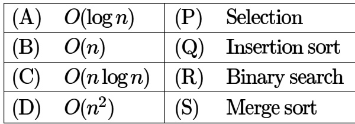

A. A-R B-P C-Q D-S B. A-R B-P C-S D-Q C. A-P B-R C-S D-Q D. A-P B-S C-R D-Q

gate1998 algorithms sorting easy match-the-following

# Answer key☟

A sorting technique is called stable if

A. it takes $O ( n \log { n } )$ time   
B. it maintains the relative order of occurrence of non-distinct elements   
C. it uses divide and conquer paradigm   
D. it takes $O ( n )$ space