An array contains four occurrences of , five occurrences of , and three occurrences of  in any order. The array is to be sorted using swap operations (elements that are swapped need to be adjacent).

a. What is the minimum number of swaps needed to sort such an array in the worst case? b. Give an ordering of elements in the above array so that the minimum number of swaps needed to sort the array is maximum.

gatecse-2000 algorithms sorting normal descriptive

Suppose there are $\lceil \log n \rceil$ sorted lists of $\lfloor n / \log n \rfloor$ elements each. The time complexity of producing a sorted list of all these elements is: (Hint:Use a heap data structure)

A. $O ( n \log \log n )$ $\begin{array} { r } { \mathsf { B . ~ } \Theta ( n \log n ) } \\ { \mathsf { D . ~ } \Omega \left( n ^ { 3 / 2 } \right) } \end{array}$   
C. $\Omega ( n \log n )$

gatecse-2005 algorithms sorting normal

# 1.40.12 Sorting: GATE CSE 2006 Question: 14, ISRO2011-14

Which one of the following in place sorting algorithms needs the minimum number of swaps?

A. Quick sort B. Insertion sort C. Selection sort D. Heap sort

gatecse-2006 algorithms sorting easy isro2011

# 1.40.13 Sorting: GATE CSE 2007 Question: 14

Which of the following sorting algorithms has the lowest worse-case complexity?

A. Merge sort B. Bubble sort C. Quick sort D. Selection sort

gatecse-2007 algorithms sorting time-complexity easy

The worst case running times of Insertion sort , Merge sort and Quick sort, respectively are:

A. $\Theta ( n \log n )$ , $\Theta ( n \log n )$ and $\Theta ( n ^ { 2 } )$ B. $\Theta ( n ^ { 2 } ) , \Theta ( n ^ { 2 } )$ and $\Theta ( n \log n )$ C. $\Theta ( n ^ { 2 } ) , \Theta ( n \log n )$ and $\Theta ( n \log n )$ D. $\Theta ( n ^ { 2 } ) , \Theta ( n \log n )$ and $\Theta ( n ^ { 2 } )$

gatecse-2016-set1 algorithms sorting easy

A. and II only B. and III only C. II and IV only D. and IV only gatecse-2016-set2 algorithms sorting time-complexity normal ambiguous

Consider the following array.

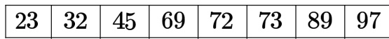

Which algorithm out of the following options uses the least number of comparisons (among the array elements) to sort the above array in ascending order?

A. Selection sort B. Mergesort C. Insertion sort D. Quicksort using the last element as pivot

gatecse-2021-set1 algorithms sorting one-mark

Let be an array containing integer values. The distance of is defined as the minimum number of elements in that must be replaced with another integer so that the resulting array is sorted in nondecreasing order. The distance of the array is

gatecse-2024-set2 numerical-answers algorithms sorting one-mark ​Consider an unordered list of $N$ distinct integers.

What is the minimum number of element comparisons required to find an integer in the list that is NOT the largest in the list?

A. B. C. D. 2N-1

gatecse2025-set2 algorithms sorting one-mark

Consider the problem of sorting the given array in ascending order:

$$
P = [ 1 , 2 , 3 , 5 , 4 ]
$$

Consider two sorting algorithms Bubble Sort  and Insertion Sort .   
Let $\mathbf { N 1 }$ be the total number of comparisons done by on the elements of $\mathrm { \bf P }$ and be the total number of comparisons done by $\mathbf { I S }$ on the elements of $\mathrm { \bf P }$ .

Which of the following options is/are correct?

A. $\mathbf { N 1 } = \mathbf { 1 0 }$ ， $\mathrm { N } 2 = 4$   
B. $\mathrm { N } 1 > \mathrm { N } 2$   
C. on $\mathbf { P }$ will perform only one swap   
D. Both  and  on $\mathbf { P }$ will make at least one unnecessary comparison (i.e., comparing elements that are already in correct order)

Consider the following sorting algorithms:

i. Bubble sort ii. Insertion sort iii. Selection sort

Which ONE among the following choices of sorting algorithms sorts the numbers in the array in increasing order after exactly two passes over the array?

A. only B. only C. (i) and only D. and (ii) only

gate-ds-ai-2024 algorithms sorting two-marks

# Answer key☟

# 1.40.21 Sorting: GATE IT 2005 Question: 59

Let $a$ and $b$ be two sorted arrays containing $n$ integers each, in non-decreasing order. Let $c$ be a sorted array containing $2 n$ integers obtained by merging the two arrays $\textbf { \em a }$ and $b$ . Assuming the arrays are indexed starting from , consider the following four statements

$\mid . \ a [ i ] \geq b [ i ] \Rightarrow c [ 2 i ] \geq a [ i ]$ $a [ i ] \geq b [ i ] \Rightarrow c [ 2 i ] \geq b [ i ]$ III. $a [ i ] \geq b [ i ] \Rightarrow c [ 2 i ] \leq a [ i ]$ IV. $a [ i ] \geq b [ i ] \Rightarrow c [ 2 i ] \leq b [ i ]$

Which of the following is TRUE?

A. only and II B. only and IV C. only II and III D. only III and IV

gateit-2005 algorithms sorting normal

If we use Radix Sort to sort $n$ integers in the range $\left( n ^ { k / 2 } , n ^ { k } \right]$ , for some $k > 0$ which is independent of $n$ the time taken would be?

A. $\Theta ( n )$ B. Θ(kn) $\mathsf { C . ~ } \Theta ( n \log n ) \qquad \mathsf { D . ~ } \Theta ( n ^ { 2 } )$

gateit-2008 algorithms sorting normal

# Answer key☟

double foo(int n) int i; double sum; if $( { \boldsymbol { \mathsf { n } } } = = { \boldsymbol { 0 } } )$ return 1.0; } else sum $= 0 . 0$ ; for(i = 0; i < n; i++) sum += foo(i); return sum;

The space complexity of the above code is?

A. 0(1) B. O(n) C. O(n!) D. nn

gatecse-2005 algorithms recursion normal space-complexity

# 1.42.1 Strongly Connected Components: GATE CSE 2008 Question: 7

The most efficient algorithm for finding the number of connected components in an undirected graph on $n$ vertices and $m$ edges has time complexity

A. $\Theta ( n )$ B. 0(m) $\mathsf { C } . \ \Theta ( m + n )$ D. 0(mn) gatecse-2008 algorithms graph-algorithms time-complexity normal strongly-connected-components

Let $G$ be a graph with  vertices, with each vertex labelled by a distinct permutation of the numbers $1 , 2 , \ldots , 1 0 { \bar { 0 } }$ · There is an edge between vertices $u$ and $v$ if and only if the label of $u$ can be obtained by swapping two adjacent numbers in the label of $v$ . Let $y$ denote the degree of a vertex in $G$ , and $z$ denote the number of connected components in $G$ . Then, $y + 1 0 z = \_$

gatecse-2018 algorithms graph-algorithms numerical-answers two-marks strongly-connected-components

Which of the following is the correct decomposition of the directed graph given below into its strongly connected components?

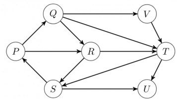

A. {P,Q,R,S},{T},{U},{V}B. {P,Q,R,S,T,V},{U}C. {P,Q,S,T,V},{R},{U}D. $\{ P , Q , R , S , T , U , V \}$

gateit-2006 algorithms graph-algorithms normal strongly-connected-components

var C:boardtype; {a child of board B} value:real;   
begin if B is a leaf then return (payoff(B)) else begin if mode $\mathbf { \Sigma } = \mathbf { \Sigma }$ MAX then value : $\mathrel { \mathop : } =$ -INF else value:INF; for each child C of board B do if mode $\mathbf { \Sigma } = \mathbf { \Sigma }$ MAX then value:=max (value, search (C, MIN)) else value:=min(value, search(C, MAX)) return(value) end   
end; (search)

Comment on the working principle of the above program. Suggest a possible mechanism for reducing the amount of search.

Match the pairs in the following:

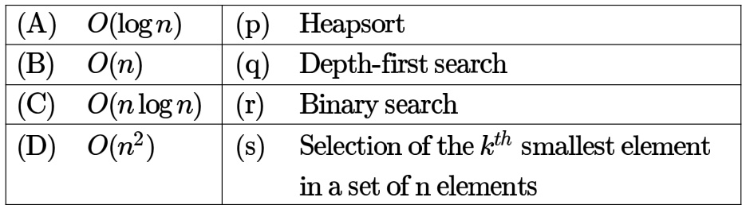

gate1989 match-the-following algorithms time-complexity $\sum _ { 1 \leq k \leq n } O ( n )$ , where $O ( n )$ stands for order $n$ is:

A. $O ( n )$ B. $O ( n ^ { 2 } )$ C. $O ( n ^ { 3 } )$ D. $O ( 3 n ^ { 2 } )$   
E. $O ( 1 . 5 n ^ { 2 } )$

gate1993 algorithms time-complexity easy

A. log2 n B. $\sqrt { n }$ C. D. n

Consider the following algorithms. Assume, procedure $A$ and procedure $B$ take $O ( 1 )$ and $O ( 1 / n )$ unit of time respectively. Derive the time complexity of the algorithm in $O _ { \ l }$ -notation.

algorithm what (n)   
begin if ${ \mathsf { n } } = 1$ then call A else begin what (n-1); call B(n) end   
end.

gate1999 algorithms time-complexity normal descriptive

# 1.43.7 Time Complexity: GATE CSE 2000 Question: 1.15

Let $\boldsymbol { S }$ be a sorted array of $n$ integers. Let $T ( n )$ denote the time taken for the most efficient algorithm to determined if there are two elements with sum less than  in $\boldsymbol { S }$ . Which of the following statement is true?

A. $T ( n )$ is $O ( 1 )$ $\begin{array} { l } { { \mathsf { B . } n { \leq } T ( n ) { \leq } n \log _ { 2 } n } } \\ { { \mathsf { D . } T ( n ) { = } \left( { \frac { n } { 2 } } \right) } } \end{array}$ C. $\begin{array} { r } { n \log _ { 2 } n \le T ( n ) < \frac { n } { 2 } } \end{array}$

gatecse-2000 easy algorithms time-complexity

The cube root of a natural number $n$ is defined as the largest natural number $m$ such that $( m ^ { 3 } \leq n )$ The complexity of computing the cube root of $\scriptstyle n$ ( $\boldsymbol { n }$ is represented by binary notation) is

A. $O ( n )$ but not $O ( n ^ { 0 . 5 } )$   
B. $O ( n ^ { 0 . 5 } )$ but not $O ( ( \log n ) ^ { k } )$ for any constant $k > 0$   
C. $O ( ( \log n ) ^ { k } )$ for some constant $k > 0$ , but not $O ( ( \log \log n ) ^ { m } )$ for any constant $m > 0$   
D. $O ( ( \log \log n ) ^ { k } )$ for some constant $k > 0 . 5$ , but not $O ( ( \log \log n ) ^ { 0 . 5 } ,$ ）

gatecse-2003 algorithms time-complexity normal

Two matrices $M _ { 1 }$ and $M _ { 2 }$ are to be stored in arrays $A$ and $B$ respectively. Each array can be stored either in row-major or column-major order in contiguous memory locations. The time complexity of an algorithm to compute $M _ { 1 } \times M _ { 2 }$ will be

A. best if $A$ is in row-major, and $B$ is in column-major order B. best if both are in row-major order C. best if both are in column-major order D. independent of the storage scheme

Let $A [ 1 , \ldots , n ]$ be an array storing a bit ( or ) at each location, and $f ( m )$ is a function whose time complexity is $\Theta ( m )$ . Consider the following program fragment written in a C like language:

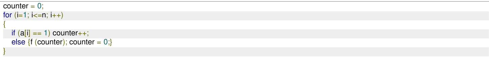

The complexity of this program fragment is

A. $\Omega ( n ^ { 2 } )$ B. $\Omega ( n \log { n } )$ and $O ( n ^ { 2 } )$ C. $\Theta ( n )$ D. o(n)

gatecse-2004 algorithms time-complexity normal

Answer key☟

# 1.43.11 Time Complexity: GATE CSE 2006 Question: 15

Consider the following C-program fragment in which $\textit { i }$ , $j$ and $n$ are integer variables.

$$
\mathsf { f o r } ( \mathrm { \sf ~ i } = \mathrm { \sf ~ n } , \mathrm { \sf ~ j } = 0 ; \mathrm { \sf ~ i } > 0 ; \mathrm { \sf ~ i } / = 2 , \mathrm { \sf ~ j } + = \mathrm { \sf ~ i } \mathrm { \sf ~ ) } ;
$$

Let $v a l ( j )$ denote the value stored in the variable $j$ after termination of the for loop. Which one of the following is true?

A. $v a l ( j ) = \Theta ( \log n )$ $\begin{array} { r l } & { \mathsf { B . ~ } v a l ( j ) = \Theta ( \sqrt { n } ) } \\ & { \mathsf { D . ~ } v a l ( j ) = \Theta ( n \log n ) } \end{array}$   
C. $v a l ( j ) = \Theta ( n )$

gatecse-2006 algorithms normal time-complexity

# 1.43.12 Time Complexity: GATE CSE 2007 Question: 15, ISRO2016-26

Consider the following segment of C-code:

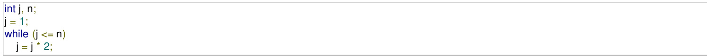

The number of comparisons made in the execution of the loop for any $n > 0$ is:

A. $\lceil \log _ { 2 } n \rceil + 1$ B.   
C. $\lceil \log _ { 2 } n \rceil$ D. $\left\lfloor \log _ { 2 } n \right\rfloor + 1$

gatecse-2007 algorithms time-complexity normal isro2016

An array of $n$ numbers is given, where $n$ is an even number. The maximum as well as the minimum of these $\scriptstyle n$ numbers needs to be determined. Which of the following is TRUE about the number of comparisons needed?

A. At least $2 n - c$ comparisons, for some constant $c$ are needed. B. At most $1 . 5 n - 2$ comparisons are needed. C. At least $n \log _ { 2 } n$ comparisons are needed D. None of the above

# Consider the following C program segment:

int IsPrime (n) int i, n; for $( \mathrm { i } { = } 2$ ; $\mathsf { i } { < } { = } \mathsf { s q r t } ( \mathsf { n } ) ; \mathsf { i } { + } { + } )$ if $( \boldsymbol { \mathsf { n } } ^ { \circ } / \mathsf { o } \dot { \boldsymbol { \mathsf { I } } } = = 0 )$ {printf("Not Prime $\backslash \boldsymbol { \mathsf { n } } ^ { \prime \prime } \rangle$ ; return 0;} return 1;

Let $T ( n )$ denote number of times the loop is executed by the program on input $n$ . Which of the following is TRUE?

A. $T ( n ) = O ( { \sqrt { n } } )$ and $T ( n ) = \Omega ( { \sqrt { n } } )$ B. $T ( n ) = O ( { \sqrt { n } } )$ and $T ( n ) = \Omega ( 1 )$ C. $T ( n ) = O ( n )$ and $T ( n ) = \Omega ( { \sqrt { n } } )$ D. None of the above

gatecse-2007 algorithms time- complexity normal

# Answer key☟

The minimum number of comparisons required to determine if an integer appears more than $\frac { n } { 2 }$ times in a sorted array of $\scriptstyle n$ integers is

A. $\Theta ( n )$ $\mathsf { B } . \Theta ( \log n )$ $\complement . \ \Theta ( \log ^ { * } n )$ D. Θ(1)

gatecse-2008 normal algorithms time-complexity

We have a binary heap on $n$ elements and wish to insert $\boldsymbol { n }$ more elements (not necessarily one afte another) into this heap. The total time required for this is

A. $\Theta ( \log n )$ $\mathsf { B } . \Theta ( n )$ $\mathsf { C } . \ \Theta ( n \log n )$ D. Θ(n2)

gatecse-2008 algorithms time- complexity normal

return $( 2 ^ { \star } \mathsf { f } 1 ( \mathsf { n } - 1 ) + 3 ^ { \star } \mathsf { f } 1 ( \mathsf { n } - 2 ) )$ ;int f2(int n)int i;int X[N], Y[N], Z[N];$\mathsf { X } [ 0 ] = \mathsf { Y } [ 0 ] = \mathsf { Z } [ 0 ] = 0$ ;$\mathsf { X } [ 1 ] = 1 ; \mathsf { Y } [ 1 ] = 2 ; \mathsf { Z } [ 1 ] = 3 ;$ $\mathsf { f o r } ( \mathsf { i } = 2 ; \mathsf { i } < = \mathsf { n } ; \mathsf { i } + + ) \{$ ${ \sf X } [ { \sf i } ] = { \sf Y } [ { \sf i } - 1 ] + { Z } [ { \sf i } - 2 ]$ ;${ \mathsf { Y } } [ { \mathsf { i } } ] = 2 ^ { \star }$ X[i];$Z [ \mathfrak { i } ] = 3 ^ { \ast }$ X[i];}return X[n];

The running time of $f 1 ( n )$ and $f 2 ( n )$ are

A. $\Theta ( n )$ and $\Theta ( n )$ B. $\Theta ( 2 ^ { n } )$ and $\Theta ( n )$ C. $\Theta ( n )$ and $\Theta ( 2 ^ { n } )$ D. $\Theta ( 2 ^ { n } )$ and $\Theta ( 2 ^ { n } )$

gatecse-2008 algorithms time-complexity normal

# Consider the following C functions:

int f1 (int n)$\mathsf { f } ( \mathsf { n } = = 0 \mathrm { ~ } | | \mathsf { n } = = 1 ;$ return n;elsereturn $( 2 ^ { \star } \mathsf { f } 1 ( \mathsf { n } - 1 ) + 3 ^ { \star } \mathsf { f } 1 ( \mathsf { n } - 2 ) .$ );  
int f2(int n)int i;int X[N], Y[N], Z[N];$\mathsf { X } [ 0 ] = \mathsf { Y } [ 0 ] = \mathsf { Z } [ 0 ] = 0$ ;$\mathsf { X } [ 1 ] = 1 ; \mathsf { Y } [ 1 ] = 2 ; \mathsf { Z } [ 1 ] = 3 ;$ $\mathsf { f o r } ( \mathsf { i } = 2 ; \mathsf { i } < = \mathsf { n } ; \mathsf { i } + + ) \{$ ${ \sf X } [ { \sf i } ] = { \sf Y } [ { \sf i } - 1 ] + { Z } [ { \sf i } - 2 ]$ ;$\mathsf { Y } [ \mathsf { i } ] = 2 ^ { \ast }$ X[i];$Z [ \mathfrak { j } ] = 3 ^ { * }$ X[i];}return X[n];

A. 1661 and 1640 B. and C. and D. and

gatecse-2008 normal algorithms time-complexity

Two alternative packages $A$ and $B$ are available for processing a database having $1 0 ^ { k }$ records. Package A requires $0 . 0 0 0 1 n ^ { 2 }$ time units and package $B$ requires ${ \bf 1 0 } n \log _ { 1 0 } n$ time units to process $\scriptstyle n$ records. What is the smallest value of $k$ for which package $B$ will be preferred over $A ?$

A. 12 B. 10 C. 6 D. 5 gatecse-2010 algorithms time-complexity easy

A. Half of the product of the consecutive integers.   
B. One-third of the product of the 3 consecutive integers.   
C. One-sixth of the product of the 3 consecutive integers.   
D. None of the above.

An algorithm performs $( \log N ) ^ { \frac { 1 } { 2 } }$ find operations , $N$ insert operations, $( \log N ) ^ { \frac { 1 } { 2 } }$ delete operations, and $( \log N ) ^ { \frac { 1 } { 2 } }$ decrease-key operations on a set of data items with keys drawn from a linearly ordered set For a delete operation, a pointer is provided to the record that must be deleted For the decrease-key operation, a pointer is provided to the record that has its key decreased. Which one of the following data structures is the most suited for the algorithm to use, if the goal is to achieve the best total asymptotic complexity considering all the operations?

A. Unsorted array B. Min heap C. Sorted array D. Sorted doubly linked list gatecse-2015-set1 algorithms data-structures normal time-complexity

# 1.43.23 Time Complexity: GATE CSE 2015 Set 2 Question: 22

An unordered list contains $\scriptstyle n$ distinct elements. The number of comparisons to find an element in this list that is neither maximum nor minimum is

A. $\Theta ( n \log n )$ ${ \mathsf { B } } . \Theta ( n )$ C. Θ(log n) D. 0(1)

gatecse-2015-set2 algorithms time-complexity easy

Match the algorithms with their time complexities:

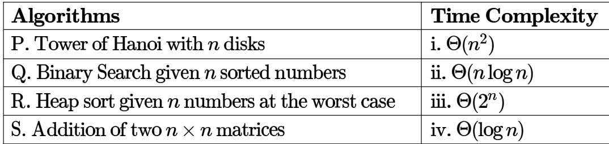

A. $P \to ( i i i )$ 一 (iu) r→ ? S→ (ii) B. $P \to ( i v )$ (ii) r→ S→ (ii) C. $P \to ( i i i )$ (iv) r→ s→ D. $P \to ( i v )$ Q → (iii) r→ S→i

for (j=1; j<n; j+=i) printf("%d %d", i, j);

Time complexity of  in terms of $\Theta$ notation is

A. $\Theta ( n { \sqrt { n } } )$ B. $\Theta ( n ^ { 2 } )$   
C. $\Theta ( n \log n )$ D. $\Theta ( n ^ { 2 } \log n )$

gatecse-2017-set2 algorithms time-complexity

# Answer key☟

# 1.43.26 Time Complexity: GATE CSE 2019 Question: 37

There are $\scriptstyle n$ unsorted arrays: $A _ { 1 } , A _ { 2 } , \ldots , A _ { n }$ . Assume that $\scriptstyle n$ is odd.Each of $A _ { 1 } , A _ { 2 } , \ldots , A _ { n }$ contains $\scriptstyle n$ distinct elements. There are no common elements between any two arrays. The worst-case time complexity of computing the median of the medians of $A _ { 1 } , A _ { 2 } , . . . , A _ { n }$ is

A. $O ( n )$ $\begin{array} { l } { { \mathsf { B . ~ } O ( n \log n ) } } \\ { { \mathsf { D . ~ } \Omega ( n ^ { 2 } \log n ) } } \end{array}$   
C. $O ( n ^ { 2 } )$

gatecse-2019 algorithms time-complexity two-marks

Answer key☟

# 1.43.27 Time Complexity: GATE CSE 2024 Set 1 Question: 7

Given an integer array of size $N$ , we want to check if the array is sorted (in either ascending or descending order). An algorithm solves this problem by making a single pass through the array and comparing each element of the array only with its adjacent elements. The worst-case time complexity of this algorithm is

A. both $\mathrm { { { O } } } ( N )$ and $\Omega ( N )$ B. $\mathbf { O } ( N )$ but $\Omega ( N )$ C. $\Omega ( N )$ but not ${ \mathrm { O } } ( N )$ D. neither ${ \bf O } ( N )$ nor $\dot { \Omega ( N ) }$

gatecse-2024-set1 algorithms time-complexity one-mark

Answer key☟

Consider the following recurrence relations: For all $n > 1$ ,

$$
\begin{array} { c } { { T _ { 1 } ( n ) = 4 T _ { 1 } \left( \frac { n } { 2 } \right) + T _ { 2 } ( n ) } } \\ { { T _ { 2 } ( n ) = 5 T _ { 2 } \left( \frac { n } { 4 } \right) + \Theta \left( \log _ { 2 } n \right) } } \end{array}
$$

Assume that for all $n \leq 1 , T _ { 1 } ( n ) = 1$ and $T _ { 2 } ( n ) = 1$ .

Which one of the following options is correct?

A. $T _ { 1 } ( n ) = \Theta \left( n ^ { 2 } \right)$ B. $T _ { 1 } ( n ) = \Theta \left( n ^ { 2 } \log _ { 2 } n \right)$   
C. $T _ { 1 } ( n ) = \Theta \left( n ^ { \mathrm { l o g } _ { 4 } 5 } \right)$ D. $T _ { 1 } ( n ) = \Theta \left( n ^ { \log _ { 4 } 5 } \log _ { 2 } n \right)$

gatecse-2026-set1 algorithms time-complexity one-mark

# Answer key☟

# 1.43.29 Time Complexity: GATE CSE 2026 Set 2 Question: 28

Consider an array $A$ of integers of size $\scriptstyle n$ . The indices of $A$ run from 1 to $n$ . An algorithm is to be designed to check whether $A$ satisfies the condition given below.

$\forall i , j \in \{ 1 , . . . , n - 1 \}$ such that $i > j , ( A [ i + 1 ] - A [ i ] ) > ( A [ j + 1 ] - A [ j ] )$   
Which one of the following gives the worst case time complexity of the fastest algorithm that can be designed for   
the problem? A. $\Theta ( n )$ $\begin{array} { l } { { \textsf { B . } \Theta ( \log ( n ) ) } } \\ { { \textsf { D . } \Theta ( n ^ { 2 } ) } } \end{array}$   
C. $\Theta ( n \log ( n ) )$

Exponentiation is a heavily used operation in public key cryptography. Which of the following options is the tightest upper bound on the number of multiplications required to compute $b ^ { n } \bmod { m } , 0 \leq \bar { b } , \bar { n } \leq m \uparrow$ 5

A. $O ( \log n )$ $\mathbf { \Sigma } _ { \mathsf { D . } } ^ { \mathsf { B . } } \mathbf { \Pi } _ { O ( n ) } ^ { O ( \sqrt { n } ) }$   
C. $O { \Bigg ( } { \frac { n } { \log n } } { \Bigg ) }$

gateit-2007 algorithms time-complexity normal

# Answer key☟

# 1.43.31 Time Complexity: GATE IT 2007 Question: 81

Let $P _ { 1 } , P _ { 2 } , . . . , P _ { n } \mathsf { b e } n$ points in the -plane such that no three of them are collinear. For every pair of points $P _ { i }$ and $P _ { j }$ , let $L _ { i j }$ be the line passing through them. Let be the line with the steepest gradient among all $n ( n { - } 1 ) / 2$ lines.

The time complexity of the best algorithm for finding $P _ { a }$ and $\boldsymbol { P _ { b } }$ is

A. $\Theta ( n )$ $\begin{array} { l } { { \Theta . \Theta ( n \mathrm { l o g } n ) } } \\ { { \mathsf { D . } \Theta ( n ^ { 2 } ) } } \end{array}$   
C. $\Theta \left( n \log ^ { 2 } n \right)$

gateit-2007 algorithms time-complexity normal

# Answer key☟

# 1.44 Topological Sort (4)

✍ Practice Test: Test (7Q)

Consider the DAG with $V = \{ 1 , 2 , 3 , 4 , 5 , 6 \}$ shown below.

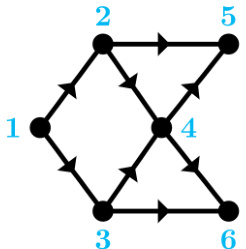

Which of the following is not a topological ordering?

A. B. C. D.

gatecse-2007 algorithms graph-algorithms topological-sort easy

# Answer key☟

B. Both PQRS and SRQP are topological orderings.   
C. Both PSRQ and SPRQ are topological orderings.   
D. PSRQ is the only topological ordering.

Consider the following directed graph:

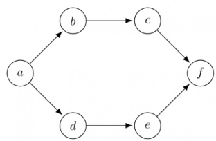

The number of different topological orderings of the vertices of the graph is

gatecse-2016-set1 algorithms graph-algorithms normal numerical-answers topological-sort

Consider the directed acyclic graph (DAG) below:

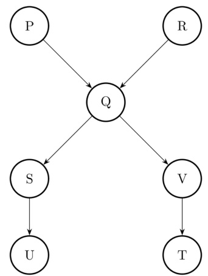

Which of the following is/are valid vertex orderings that can be obtained from a topological sort of the DAG?

A. PQRSTUV B. PRQV SUT C. PQRSVUT D. PRQSVTU

gate-ds-ai-2024 algorithms topological-sort directed-acyclic-graph multiple-selects two-marks

Suppose we are given $n$ keys, $m$ hash table slots, and two simple uniform hash functions $h _ { 1 }$ and $h _ { 2 }$ Further suppose our hashing scheme uses $h _ { 1 }$ for the odd keys and $h _ { 2 }$ for the even keys. What is the expected number of keys in a slot?

A. $\textstyle { \frac { m } { n } }$ B. $\textstyle { \frac { n } { m } }$ C. 2n D. $\frac { n } { 2 m }$ m

gatecse-2022 algorithms hashing uniform-hashing one-mark

# Answer key ☟

# Answer Keys

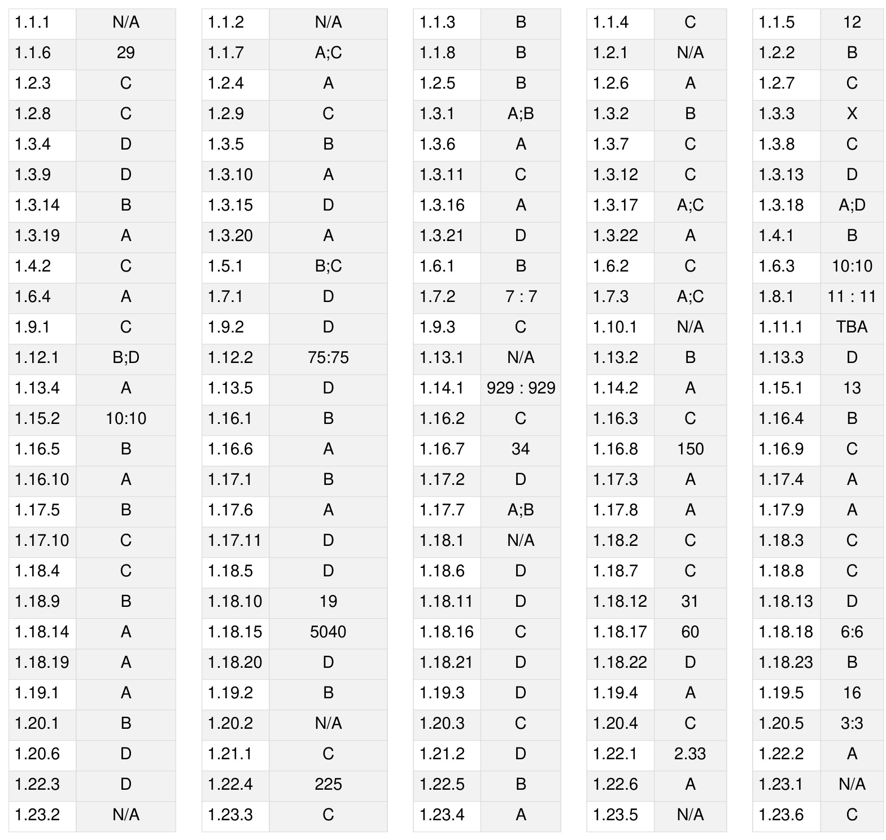

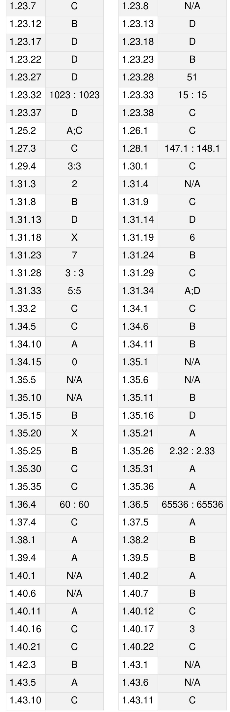

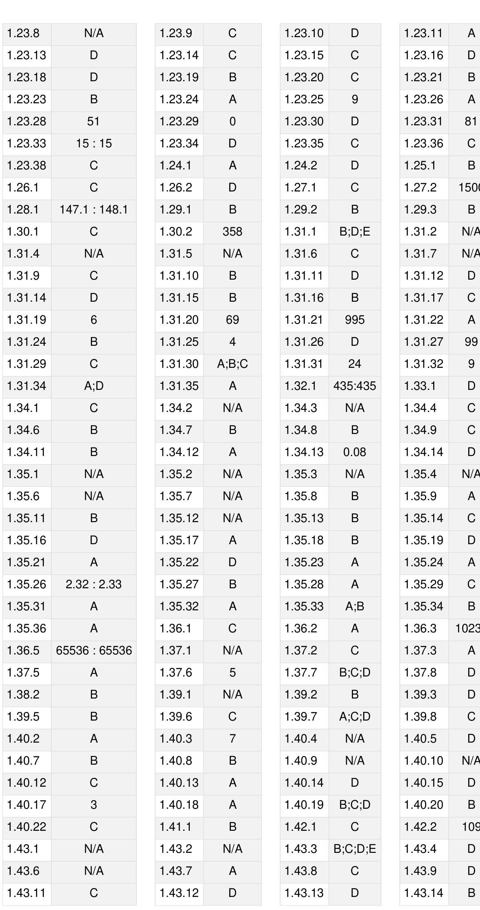

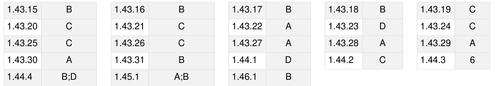

Lexical analysis, Parsing, Syntax-directed translation, Runtime environments, Intermediate code generation.

MarkDistributioninPrevious GATE   
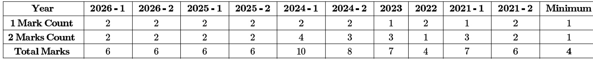

# Subject Overview

Compiler Design is a fundamental area of Computer Science that deals with the theory and practice of building compilers – programs that translate source code written in a high-level programming language into an equivalent lowlevel machine-understandable form (like assembly or machine code). Understanding compiler design is crucial for a GATE CS aspirant as it provides deep insights into how programming languages work, how software interacts with hardware, and the underlying mechanisms of program execution. This subject often carries a weightage of 6-10 marks in the GATE CS exam, typically involving 2-3 questions of 2 marks and 1-2 questions of 1 mark. Questions range from theoretical concepts (phases of compilation, definitions) and conceptual understanding (optimization techniques, runtime environment) to numerical problems (parsing table construction, FIRST/FOLLOW sets, DAG generation, register allocation). A strong grasp of this subject is vital not just for the exam, but also for a holistic understanding of computer systems.

# Topic-wise Key Concepts

# Abstract Syntax Tree (AST)

An AST is a tree representation of the abstract syntactic structure of source code, where each node denotes a construct in the source code. It abstracts away the concrete syntax (like parentheses or semicolons) and focuses on the essential structure and meaning of the program. ASTs are crucial for semantic analysis, intermediate code generation, and various optimization techniques.

# Key Properties:

。 Nodes represent operators and keywords, while leaves represent operands and identifiers. More compact than a parse tree, omitting unnecessary details like non-terminals that only derive other nonterminals. 。 Used as an intermediate representation for subsequent compiler phases.   
Common Pitfalls: Confusing AST with a parse tree. A parse tree shows every detail of the derivation; an AST   
shows only the essential structure.   
Standard Problem-Solving Technique: Given a grammar and an expression, construct its parse tree first, then   
derive the AST by eliminating redundant nodes and structuring it based on operator precedence and associativity.

# Ambiguous Grammar

A grammar is said to be ambiguous if there exists at least one string that can be generated by the grammar in more than one leftmost derivation, or more than one rightmost derivation, or has more than one parse tree. Ambiguity is undesirable in programming language grammars because it leads to multiple interpretations of the same program statement.

# Key Properties:

Causes difficulty for parsers as they cannot uniquely determine the structure of an input string. Common sources include dangling-else problem and lack of operator precedence/associativity rules. Common Pitfalls: Not being able to identify ambiguity. A common test is to find a string with two distinct parse trees. Standard Problem-Solving Technique: To resolve ambiguity, rewrite the grammar by introducing new nonterminals or by incorporating precedence and associativity rules directly into the grammar productions. For example for arithmetic expressions, introduce non-terminals like Term and Factor.

# Assembler

An assembler is a program that translates assembly language code into machine code. Assembly language uses mnemonics for operations and symbolic names for memory locations, making it more human-readable than raw machine code. Assemblers typically perform a one-to-one translation of assembly instructions to machine instructions.

Key Properties: Two-Pass Assembler:

1. Pass 1: Scans the source code to build a symbol table (mapping symbolic labels to memory addresses) and determines the length of machine instructions. 2. Pass 2: Uses the symbol table to translate assembly instructions into machine code, filling in operand addresses. 。 Handles pseudo-operations (directives) like ORG, EQU, START, END, which guide the assembly process but don't translate into machine instructions.

Common Pitfalls: Confusing assembler with compiler or linker. Assembler works at a lower level, translating assembly to machine code.   
Standard Problem-Solving Technique: Trace the assembly process, building a symbol table and calculating location counter values for each instruction and data item.

# Backpatching

Backpatching is a technique used in one-pass code generation, particularly for control flow statements (like if-else, while loops) and boolean expressions. It involves generating jump instructions with initially unspecified target addresses, which are later filled in (patched) once the true target address becomes known.

# Key Properties:

Uses lists of incomplete jumps (e.g., truelist, falselist, nextlist). : Creates a new list containing only i (an index into the list of quadruples). : Concatenates lists and , returning the combined list. backpatch $\left( \mathbf { p } , \mathrm { i } \right)$ : Inserts as the target label for each of the jumps in list . Standard Problem-Solving Technique: Trace the generation of three-address code for control flow statements, maintaining and updating , , and  as new quadruples are generated.

# Basic Blocks

A basic block is a sequence of consecutive statements in which flow of control enters at the beginning and leaves at the end without halt or possibility of branching except at the end. Basic blocks are fundamental units for many code optimization techniques.

Key Properties: No jumps into the middle of a basic block. 。 No jumps out of the middle of a basic block. The first statement is called a leader.

Standard Problem-Solving Technique:

1. Identify leaders: The first statement of the program is a leader. Any statement that is the target of a conditional or unconditional jump is a leader. Any statement immediately following a conditional or unconditional jump is a leader.

2. For each leader, its basic block consists of the leader and all subsequent statements up to, but not including, the next leader or the end of the program.

# Code Optimization

Code optimization is the phase of a compiler that attempts to improve the intermediate code or target code to make it run faster, use less memory, or consume less power, without changing the program' s observable behavior. It can be machine-independent or machine-dependent.

Key Types/Techniques: 。 Machine-Independent:

Peephole Optimization: Examines a small sliding window of instructions and replaces suboptimal sequences with better ones (e.g., redundant loads/stores, strength reduction).   
Common Subexpression Elimination (CSE): Identifies and removes redundant computations of the same expression.   
Dead Code Elimination: Removes code that is never executed or whose results are never used. ■ Constant Folding: Evaluates constant expressions at compile time (e.g., $2 ^ { * } 3 + 5$ becomes ).

Loop Optimizations: Loop invariant code motion, induction variable elimination, loop unrolling. Strength Reduction: Replacing expensive operations with cheaper ones (e.g., $\mathbf { x } ^ { * } 2$ with ${ \bf x } + { \bf x }$ or $\mathbf { x } < < 1$ ). Machine-Dependent: Register allocation, instruction scheduling. Key Property: Optimization must preserve the semantic equivalence of the program. Common Pitfalls: Misidentifying opportunities for optimization or applying an optimization that changes program behavior.

# Compilation Phases

The compilation process is typically divided into several phases, each performing a specific task in the translation of source code to target code. These phases operate sequentially, with the output of one phase serving as the input to the next.

Phases in Order:

1. Lexical Analysis (Scanning): Breaks source code into tokens.   
2. Syntax Analysis (Parsing): Checks grammar rules and builds a parse tree/AST.   
3. Semantic Analysis: Checks for type compatibility, undeclared variables, etc. (meaning of the program).   
4. Intermediate Code Generation: Creates an abstract machine-independent representation (e.g., three-address code).   
5. Code Optimization: Improves the intermediate or target code for efficiency.   
6. Code Generation: Translates intermediate code into target machine code (e.g., assembly).   
Supporting Components: Symbol Table Management: Stores information about identifiers, used across multiple phases. Error Handling: Detects and reports errors at each phase.   
Common Pitfalls: Confusing the order or specific responsibilities of each phase.

# Compiler Tokenization (Lexical Analysis)

Compiler tokenization, or Lexical Analysis, is the first phase of a compiler where the input stream of characters is grouped into meaningful sequences called tokens. Each token represents a basic unit of the language, such as keywords, identifiers, operators, or literals.

Core Idea: Converts a stream of characters into a stream of tokens.   
Key Properties: Tokens are defined by regular expressions. Lexical analyzers (scanners) are typically implemented using Finite Automata (NFA or DFA). Handles whitespace and comments, usually discarding them. Longest Match Rule: When multiple token patterns match a prefix of the input, the longest possible token is chosen. Precedence Rule: If multiple patterns match the same longest prefix, the pattern listed first (or with higher precedence) is chosen.   
Common Pitfalls: Incorrectly applying longest match or precedence rules.   
Standard Problem-Solving Technique: Given a string and a set of regular expressions for tokens, identify the   
sequence of tokens.

# Directed Acyclic Graph (DAG)

A DAG is a directed graph data structure used as an intermediate representation for basic blocks in compilers. Nodes in a DAG represent operations, and edges represent the flow of values between operations. It effectively highlights common subexpressions and the order of operations within a basic block.

# Key Properties:

Each node has a unique value. If an expression is computed multiple times, it corresponds to a single node in   
the DAG.   
。 Leaf nodes are identifiers or constants. Interior nodes are operators.   
。 Used for common subexpression elimination, dead code elimination, and reordering of operations.

# Standard Problem-Solving Technique:

1. For each statement $\mathbf { x } = \mathbf { y }$ : If  or are not in the DAG, create nodes for them. If is not in the DAG with children  and , create a node for it. Add as a label to the node representing .

2. If $\mathbf { x } = \mathbf { y }$ , make a label for the node representing .

# Expression Evaluation

Expression evaluation is the process of computing the value of an arithmetic or logical expression according to operator precedence and associativity rules. Compilers often convert infix expressions to postfix or prefix notation for easier evaluation using a stack-based approach.

# Key Notations:

Infix: Operators between operands (e.g. $\mathbf { \nabla } , \mathbf { a } + \mathbf { b } ^ { * } \mathbf { c } )$ . 。 Postfix (Reverse Polish Notation $\cdot$ RPN): Operators after operands (e.g., $\mathbf { c } ^ { * } + \mathbf { \mu }$ Prefix (Polish Notation): Operators before operands ( ${ \mathfrak { s } } . { \mathfrak { g } } . , + { \mathfrak { a } } ^ { * } { \mathfrak { b } } { \mathfrak { c } } )$ .

Key Properties: Precedence: Determines which operator is evaluated first (e.g., multiplication before addition). Associativity: Determines evaluation order for operators of the same precedence (e.g., left-to-right f ${ \mathfrak { r } } + , \bullet , \bullet$ , ; right-to-left for ).

Standard Problem-Solving Technique: Infix to Postfix/Prefix: Use a stack to manage operators based on precedence and associativity. Postfix Evaluation: Scan from left to right. Push operands onto a stack. When an operator is encountered, pop required operands, perform operation, push result back.

# First and Follow

FIRST and FOLLOW sets are crucial for constructing predictive (LL(1)) parsing tables and for resolving ambiguities in grammars. They help determine which production to apply or which token to expect next.

FIRST(X): The set of terminal symbols that begin strings derived from . If  can derive $\epsilon$ (empty string), then $\epsilon$ is in .   
FOLLOW(A): The set of terminal symbols that can immediately follow the non-terminal  in some sentential form. never contains .

Important Formulas/Rules: 1. FIRST for a terminal : $\mathrm { F I R S T } ( \mathbf { a } ) = \{ \mathbf { a } \}$ 2. FIRST for $\epsilon \colon \mathrm { F I R S T } ( \epsilon ) = \{ \epsilon \}$ .

3. FIRST for a non-terminal : For each production $\mathbf { A } \to \mathbf { X } _ { 1 } \mathbf { X } _ { 2 } \ldots \mathbf { X } _ { k }$ : A $\mathrm { \Delta \ d { \ F I R S T } ( X _ { 1 } ) - \{ \epsilon \} }$ to . I $\mathbf { \dot { \epsilon } } \in \operatorname { F I R S T } ( \mathbf { X } _ { i } )$ for all $\mathbf { i } = 1 \ldots \mathbf { j - 1 }$ , then add $\mathrm { F I R S T } ( \mathbf { X } _ { j } ) - \{ \epsilon \}$ to . If $\epsilon \in \mathrm { F I R S T } ( \mathrm { X } _ { i } )$ for all $\mathbf { i } = \mathbf { 1 } \ldots \mathbf { k } .$ , then add $\epsilon$ to .

# 4. FOLLOW for a non-terminal :

Place $\$ 8$ (end-marker) in  where is the start symbol.   
For each production $\mathbf { A } \to \alpha \mathbf { B } \beta$ : Add $\mathrm { \check { F } } \mathrm { I R S T } ( \beta ) - \{ \epsilon \}$ to .   
For each production $\mathbf { A } \to \alpha \mathbf { B }$ or $\mathbf { A } \to \alpha \mathbf { B } \beta$ where $\dot { \epsilon } \in \operatorname { F I R S T } ( \beta )$ : Add to . Common Pitfalls: Incorrectly handling $\epsilon$ productions, or not iterating until sets stabilize.   
Standard Problem-Solving Technique: Apply rules iteratively until no new terminals can be added to any set.

# Grammar

A grammar is a formal system that describes the syntax of a language. It consists of a set of terminal symbols (the basic symbols of the language), non-terminal symbols (syntactic variables), a start symbol, and a set of production rules that specify how non-terminals can be replaced by sequences of terminals and non-terminals.

Formal Definition: A Context-Free Grammar (CFG) is a 4-tuple $\mathbf { G } = ( \mathrm { V } , \mathrm { T } , \mathrm { P } , \mathrm { S } )$ , where: : Finite set of non-terminal symbols. : Finite set of terminal symbols $( \mathrm { V } \cap \mathrm { T } = \emptyset )$ . : Finite set of production rules of the form $\mathbf A \to \alpha$ , where $\mathbf { A } \in \mathbf { V }$ and $\alpha \in ( \mathrm { V } \cup \mathrm { T } ) ^ { * }$ . \( \text

# Abstract Syntax Tree (1)

# 2.1.1 Abstract Syntax Tree: GATE CSE 2015 Set 2 Question: 14

In the context of abstract-syntax-tree (AST) and control-flow-graph (CFG), which one of the following is TRUE?

A. In both AST and CFG, let node $N _ { 2 }$ be the successor of node $N _ { 1 }$ . In the input program, the code corresponding to $N _ { 2 }$ is present after the code corresponding to $N _ { 1 }$   
B. For any input program, neither AST nor CFG will contain a cycle   
C. The maximum number of successors of a node in an AST and a CFG depends on the input program   
D. Each node in AST and CFG corresponds to at most one statement in the input program

gatecse-2015-set2 compiler- design easy abstract-syntax-tree code-optimization

A context-free grammar is ambiguous if:

A. The grammar contains useless non-terminals.   
B. It produces more than one parse tree for some sentence.   
C. Some production has two non terminals side by side on the right-hand side.   
D. None of the above.

gate1987 compiler-design parsing ambiguous-grammar

Which of the following grammars is/are ambiguous?

A. $S \to a S b \mid \epsilon$ B. $E  E + E | E * E | i d$   
C. $S \to a S | \dot { S } a | \epsilon$ D. $S \to a S ~ | \epsilon$

gatecse-2026-set2 compiler-design ambiguous-grammar multiple-selects one-mark

Answer key☟

The purpose of instruction location counter in an assembler is gate1992 compiler-design assembler normal fill-in-the-blanks

Mention the pass number for each of the following activities that occur in a two pass assembler:

A. object code generation B. literals added to literal table C. listing printed D. address resolution of local symbols

gate1992 compiler-design assembler easy

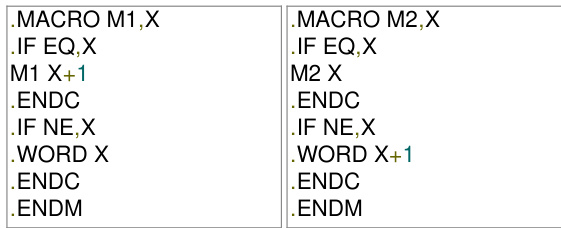

# Give an example call that does so.

gate1992 compile r-design assembler normal descriptive

A simple two-pass assembler does the following in the first pass:

A. It allocates space for the literals.   
B. It computes the total length of the program.   
C. It builds the symbol table for the symbols and their values.   
D. It generates code for all the load and store register instructions.   
E. None of the above.

State whether the following statements are True or False with reasons for your answer: Coroutine is just another name for a subroutine.

gate1994 compiler-design normal assembler true-false descriptive

State whether the following statements are True or False with reasons for your answer:

A two pass assembler uses its machine opcode table in the first pass of assembly.

gate1994 compiler-design normal assembler true-false descriptive

# State whether the following statements are True or False with reasons for your answer

A subroutine cannot always be used to replace a macro in an assembly language program.

gate1994 compiler-design normal assembler true-false descriptive

The pass numbers for each of the following activities

i. object code generation   
ii. literals added to literal table   
iii. listing printed   
iv. address resolution of local symbols that occur in a two pass assembler

respectively are

A. 1,2,1,2 B. 2,1,2,1 C. 2,1,1,2 D. 1,2,2,2

gate1996 compile r-design normal assembler

# Answer key☟

Consider the following statements about the use of backpatching in a compiler for intermediate code generation:

I. Backpatching can be used to generate code for Boolean expression in one pass.   
II. Backpatching can be used to generate code for flow-of-control statements in one pass.

Which ONE of the folloeing options is CORRECT?

A. Only I is correct B. Only II is correct C. Both and II are correct D. Neither nor II is correct

# Answer key☟

Refer to the given -address code sequence. This code sequence is split into basic blocks. The number of basic blocks is (Answer in integer)

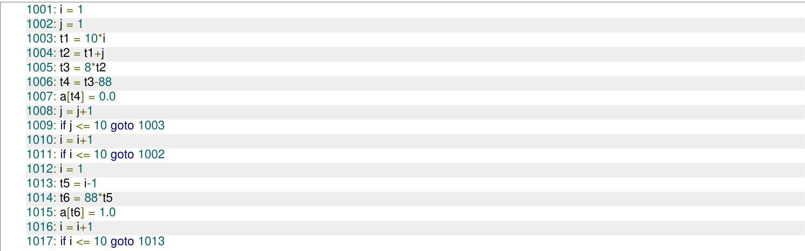

Consider the control flow graph given below.

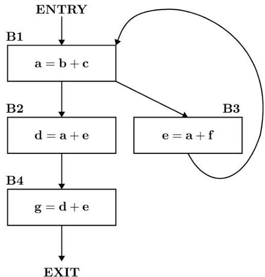

Which one of the following options is the set of live variables at the exit point of each basic block?

A. $\mathrm { B 1 } : \{ \mathrm { a , b , c , e , f } \} , \mathrm { B 2 } : \{ \mathrm { d , e } \} , \mathrm { B 3 } : \{ \mathrm { b , c , e , f } \} , \mathrm { B 4 } : \emptyset$ B. : $\varnothing$ , : $\{ { \mathsf { d } } , { \mathsf { e } } \}$ , : $\{ \mathsf { a } , \mathsf { c } , \mathsf { f } \}$ , : $\varnothing$ C. $\mathbf { B } 2 : \left\{ \mathbf { d } , \mathbf { e } \right\}$ ,B3 : {c,e,f},B4 : D. $\varnothing$ ， $\mathbf { B } 2 : \{ \mathrm { d } , \mathrm { e } , \mathrm { f } \}$ ,B3 : {a,b,c,e,f},B4:

✍ Practice Test: Test 7 (13Q)

Consider these two functions and two statements S1 and S2 about them.

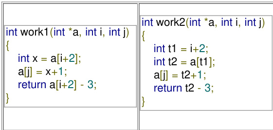

S1: The transformation form work1 to work2 is valid, i.e., for any program state and input arguments, work2 will compute the same output and have the same effect on program state as work1

S2: All the transformations applied to work1 to get work2 will always improve the performance (i.e reduce CPU time) of work2 compared to work1

A. S1 is false and S2 is false B. S1 is false and S2 is true C. S1 is true and S2 is false D. S1 is true and S2 is true

if $( \mathsf { i } \% 2 )$   
{ x += (4\*j + 5\*i); $y _ { \ L } + = \ L ( 7 + 4 ^ { \star } \mathbf { j } )$ ;

Which one of the following is false?

A. The code contains loop invariant computation B. There is scope of common sub-expression elimination in this code C. There is scope of strength reduction in this code D. There is scope of dead code elimination in this code

gatecse-2006 compiler-design code-optimization

# Answer key☟

Some code optimizations are carried out on the intermediate code because

A. They enhance the portability of the compiler to the target processor B. Program analysis is more accurate on intermediate code than on machine code C. The information from dataflow analysis cannot otherwise be used for optimization D. The information from the front end cannot otherwise be used for optimization

gatecse-2008 normal code-optimization compiler-design

Which one of the following is FALSE?

A. A basic block is a sequence of instructions where control enters the sequence at the beginning and exits at the end.   
B. Available expression analysis can be used for common subexpression elimination.   
C. Live variable analysis can be used for dead code elimination.   
D. $\pmb { x } = 4 * 5 \Rightarrow x = 2 0$ is an example of common subexpression elimination.

gatecse-2014-set1 compiler-design code-optimization normal

# 2.6.5 Code Optimization: GATE CSE 2014 Set 3 Question: 11

The minimum number of arithmetic operations required to evaluate the polynomi $P ( X ) = X ^ { 5 } + 4 X ^ { 3 } + 6 X + 5$ for a given value of $X$ , using only one temporary variable is

gatecse-2014-set3 compile r-design numerical-answers normal code-optimization

Assume that the variable $y$ points to a  (allocated on the heap) containing two fields and , and the local variables z, p,q, and are allotted registers. Common sub-expression elimination optimization is applied on the code. The number of addition and the dereference operations (of the form $\mathsf { y } \mathsf { - } \mathsf { \mathrm { > } } \mathsf { f } \mathsf { 1 }$ or $y - > f 2 )$ in the optimized code, respectively, are:

A. and 102 B. and C. and D. and

gatecse-2021-set2 code-optimization compiler-design two-marks

# 2.6.7 Code Optimization: GATE CSE 2025 Set 1 Question: 3

Which ONE of the following techniques used in compiler code optimization uses live variable analysis?

A. Run-time function call B. Register assignment to variables management   
C. Strength reduction D. Constant folding   
gatecse2025-set1 compiler-design code-optimization easy one-mark

Consider the control flow graph shown in the figure.

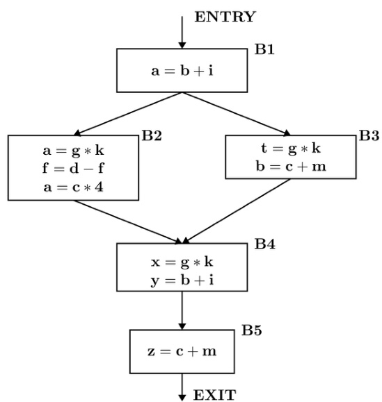

Which one of the following options correctly lists the set of redundant expressions (common subexpressions) in the basic blocks B  and B ?

Note: All the variables are integers.

A. B4: $\{ b + i \}$ B5: B. B4: $\left\{ g * k \right\}$ B5: C. B4: $\{ g * k , b + i \}$ B5: D. B4: B5:

In a compiler the module that checks every character of the source text is called:

A. The code generator. B. The code optimiser.   
C. The lexical analyser. D. The syntax analyser.

gate1987 compiler-design compilation-phases lexical-analysis

Match the pairs in the following questions:

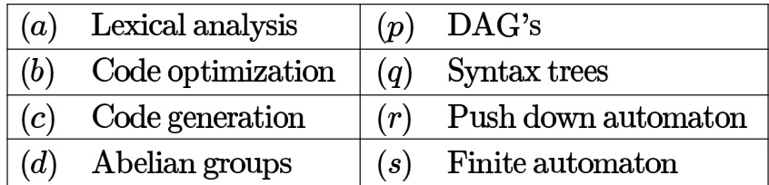

gate1990 match-the-following compiler-design compilation-phases

# Consider line number of the following C-program.

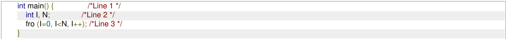

Identify the compiler’s response about this line while creating the object-module:

A. No compilation error B. Only a lexical error C. Only syntactic errors D. Both lexical and syntactic errors

gatecse-2005 compile r-design compilation-phases normal

Match all items in Group 1 with the correct options from those given in Group 2.

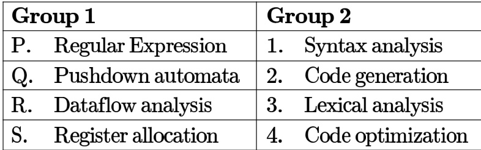

A. P-4, Q-1, R-2, S-3 B. P-3, Q-1, R-4, S-2   
C. P-3, Q-4,R-1, S-2 D. P-2, Q-1, R-4, S-3

gatecse-2009 compiler-design easy compilation-phases match-the-following

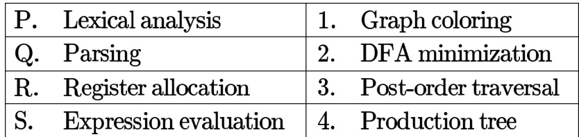

A. P-2, Q-3, R-1, S-4 B. P-2, Q-1, R-4, S-3  
C. P-2, Q-4, R-1, S-3 D. P-2, Q-3, R-4, S-1

gatecse-2015-set2 compiler-design normal compilation-phases match-the-following

# Answer key☟

Match the following:

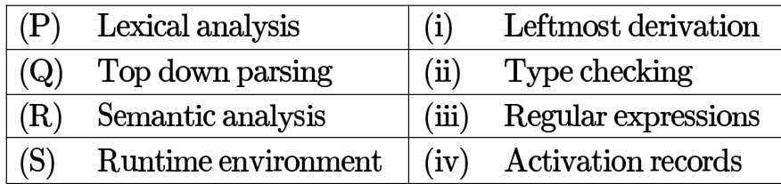

A. $\mathbf { P }  \mathbf { i }$ y $\mathbf { Q } $ ii, $\mathbf { R } $ iv, $\mathbf { S } $ iii B. $\mathbf { P } $ ii, $\mathbf { Q }  \mathbf { i } ,$ ， $\mathbf { R } $ ii, $\mathbf { S } $ ivC. $\mathbf { P }  \ddot { \mathbf { u } }$ ， $\mathbf { Q }  \mathbf { i } \mathbf { i }$ ， $\mathbf { R }  \mathbf { i } , \mathbf { S }  \mathbf { i v }$ D. $\mathbf { P }  \mathbf { i v }$ ， $\mathbf { Q }  \mathbf { i }$ ， $\mathbf { R }  \mathbf { i }$ ， $\mathbf { S } $ ii

gatecse-2016-set2 compiler-design easy match-the-following compilation-phases

# Answer key☟

Match the following according to input (from the left column) to the compiler phase (in the right column) that processes it:

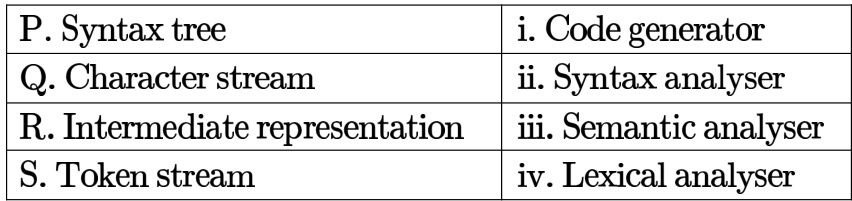

A.P-ii; Q-ii; R-iv; S- B. P-ii; Q-i; R-ii; S-iv C. P-i; Q-iv; R-i; S-ii D. P-i; Q-iv; R-ii; S-ii

gatecse-2017-set2 compiler-design match-the-following compilation-phases easy

# Answer key☟

Which one of the following statements is FALSE?

A. Context-free grammar can be used to specify both lexical and syntax rules   
B. Type checking is done before parsing   
C. High-level language programs can be translated to different Intermediate Representations   
D. Arguments to a function can be passed using the program stack

gatecse-2018 compiler-design easy compilation-phases one-mark

III. Errors violating the condition ‘any variable must be declared before its use’ are detected during syntax analysis. Which of the above statements is/are TRUE?

A. I only B. I and III only C. Ⅱ only D. None of Ⅰ, Ⅱ and Ⅲ gatecse-2020 compiler-design compilation-phases runtime-environment one-mark

Consider the following ANSI program:

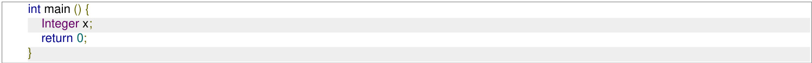

Which one of the following phases in a seven-phase $\boldsymbol { C }$ compiler will throw an error?

A. Lexical analyzer B. Syntax analyzer C. Semantic analyzer D. Machine dependent optimizer

gatecse-2021-set2 compilation-phases compiler-design one-mark

# 2.7.11 Compilation Phases: GATE CSE 2023 Question:

Consider the following statements regarding the front-end and back-end of a compiler.

S1: The front-end includes phases that are independent of the target hardware.   
S2: The back-end includes phases that are specific to the target hardware.   
S3: The back-end includes phases that are specific to the programming language used in the source code.   
Identify the CORRECT option. A. Only  is TRUE. B. Only  and S2 are TRUE.   
C. S1,S2, and S3 are all TRUE. D. Only  and are TRUE.

gatecse-2023 compiler-design compilation-phases one-mark ​Consider the following two sets:

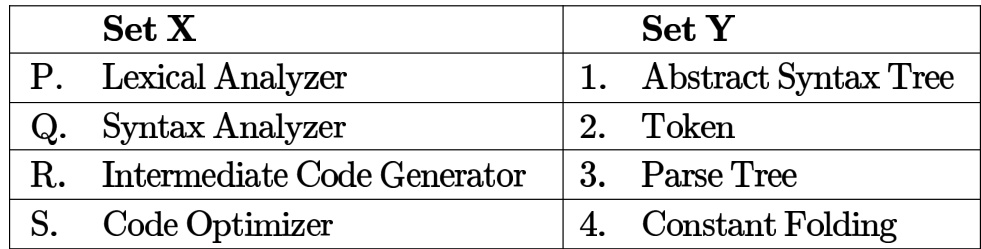

Which one of the following options is the CORRECT match from Set  to Set ?

A.P-4;Q-1;R-3;S-2 B. P-2;Q-3;R-1;S-4 C. P-2;Q-1;R-3;S-4 D. $\mathbf { P } - 4 ; \mathbf { Q } - 3 ; \mathbf { R } - 2 ; \mathbf { S } - 1$

# Consider the following C statements:

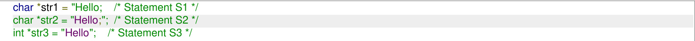

Which of the following options is/are correct?

A. S1 and have syntactic errors B. has a lexical error and  has a syntactic error C. has a lexical error and  has a semantic error D. has a syntactic error and  has a semantic error gatecse-2026-set1 compiler-design multiple-selects one-mark compilation-phases

A lexical analyzer uses the following token definitions

$$
\begin{array} { r l } & { \cdot \ l e t t e r \to [ A - Z a - z ] } \\ & { \cdot \ d i g i t \to [ 0 - 9 ] } \\ & { \cdot \ i d \to l e t t e r ( l e t t e r | d i g i t ) ^ { * } } \\ & { \cdot \ n u m b e r \to d i g i t ^ { + } } \\ & { \cdot \ w s \to ( b l a n k | t a b | n e w l i n e ) ^ { + } } \end{array}
$$

For the string given below,

the number of tokens (excluding ws) that will be produced by the lexical analyzer is (answer in integer)

Consider the basic block given below.

$$
\begin{array} { l } { \boxed { \hat { \mathbf { a } } = \mathbf { b } + \mathbf { c } } } \\ { \mathbf { c } = \mathbf { a } + \mathbf { d } } \\ { \boxed { \mathbf { d } = \mathbf { b } + \mathbf { c } } } \\ { \mathbf { e } = \mathbf { d } \cdot \mathbf { b } } \\ { \mathbf { a } = \bar { \mathbf { e } } + \mathbf { b } } \end{array}
$$

The minimum number of nodes and edges present in the DAG representation of the above basic block respectively are

A. and B. and C. 9 and D. and gatecse-2014-set3 compiler-design code-optimization directed-acyclic-graph normal

In a compiler, this code segment is represented internally as a directed acyclic graph . The number of nodes in the  is

To evaluate an expression without any embedded function calls

A. One stack is enough   
B. Two stacks are needed   
C. As many stacks as the height of the expression tree are needed   
D. A Turing machine is needed in the general case

Consider the expression tree shown. Each leaf represents a numerical value, which can either be or . Over all possible choices of the values at the leaves, the maximum possible value of the expression represented by the tree is

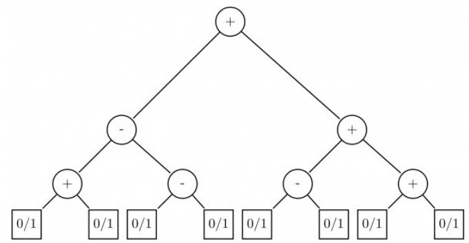

✍ Practice Test: Test 7 (12Q)

need to be filled are indicated as $\mathbf { \delta E 1 } , E 2$ and $E 3 . \varepsilon$ is the empty string, $\$ 1$ indicates end of input, and, separates alternate right hand sides of productions.

$$
\begin{array} { l } { \cdot S \to a A b B \mid b A a B \mid \varepsilon } \\ { \cdot A \to S } \\ { \cdot B \to S } \end{array}
$$

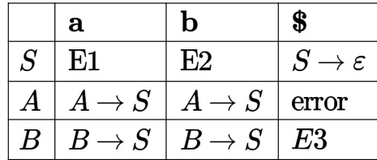

The FIRST and FOLLOW sets for the non-terminals $A$ and $B$ are

A. $\operatorname { F I R S T } ( A ) = \{ a , b , \varepsilon \} = \operatorname { F I R S T } ( B )$ $\mathrm { F O L L O W } ( A ) = \{ a , b \}$ $\mathrm { F O L L O W } ( B ) = \{ a , b , \ S \}$   
B. $\operatorname { F I R S T } ( A ) = \{ a , b , \ S \}$ $\mathrm { F I R S T } ( B ) = \{ a , b , \varepsilon \}$ $\operatorname { F O L L O W } ( A ) = \{ a , b \}$ $\mathrm { F O L L O W } ( B ) = \{ \mathfrak { G } \}$   
C. $\operatorname { F I R S T } ( A ) = \{ a , b , \varepsilon \} = \operatorname { F I R S T } ( B )$ $\operatorname { F O L L O W } ( A ) = \{ a , b \}$ $\mathrm { F O L L O W } ( B ) = \bar { \emptyset }$   
D. $\mathrm { F I R S T } ( A ) = \{ a , b \} = \mathrm { F I R S T } ( B )$ $\operatorname { F O L L O W } ( A ) = \{ a , b \}$ $\mathrm { F O L L O W } ( B ) = \{ a , b \}$

Consider the following grammar:

$$
\begin{array} { l } { \cdot P  x Q R S } \\ { \cdot Q  y z \mid z } \\ { \cdot R  w \mid \varepsilon } \\ { \cdot S  y } \end{array}
$$

What is FOLLOW $( Q )$ ?

A. $\{ R \}$ B. {} C. {w,y} D. $\{ w , \mathfrak { H } \}$

gatecse-2017-set1 compiler-design parsing easy first-and-follow

# Answer key☟

Let $a , b , d$ and $\$ 8$ be indexed as follows:

$$
{ \frac { | { a \ } { | \ { b \ } } | { d \ } \ } { 3 \ { | \ 2 \ } { 1 \ } { 0 } | } }
$$

Compute the FOLLOW set of the non-terminal B and write the index values for the symbols in the FOLLOW set in the descending order.(For example, if the FOLLOW set is $( a , b , d , \ S )$ then the answer should be )

gatecse-2019 numerical-answers compiler-design parsing one-mark first-and-follow

Consider the following grammar $G$ , with $\boldsymbol { S }$ as the start symbol. The grammar $G$ has three incomplete productions denoted by , and .

$$
\begin{array} { l } { S  d a T \mid } \\ { T  a S \vert b T \vert } \\ { R  ( 3 ) \mid \epsilon } \end{array}
$$

The set of terminals is $\{ a , b , c , d , f \}$ . The FIRST and FOLLOW sets of the different non-terminals are as follows.

$\operatorname { F I R S T } ( S ) = \{ c , d , f \}$ ， $\mathrm { F I R S T } ( T ) = \{ a , b , \epsilon \}$ ， $\mathrm { F I R S T } ( R ) = \{ c , \epsilon \}$ $\mathrm { F O L L O W } ( S ) = \mathrm { F O L L O W } ( T ) = \{ c , f , \ S \}$ ， $\operatorname { F O L L O W } ( R ) = \{ f \}$

Which one of the following options CORRECTLY fills in the incomplete productions?

A. (1) $S \to R f$ (2) $T \to \epsilon$ (3) $R \to c T R$ B. (1) $S \to f R$ (2) $T \to \epsilon$ (3) $R \to c T R$ C. (1) $S \to f R$ (2) $T  c T ( 3 ) R  c R$ D. (1) $S \to R f$ (2) $T  c T ( 3 ) R  c R$

Which of the following statement(s) is/are TRUE while computing  and  during top down parsing by a compiler?

A. For a production $A \to \epsilon , \epsilon$ will be added to $\operatorname { F i r s t } ( A )$ .   
B. If there is any input right end marker, it will be added to $\mathrm { F i r s t ( S ) }$ , where $\boldsymbol { S }$ is the start symbol.   
C. For a production $A \to \epsilon , \epsilon$ will be added to Follow .   
D. If there is any input right end marker, it will be added to $\mathbf { \nabla } \cdot ( S )$ , where  is the start symbol.

gatecse2025-set1 compiler-design first-and-follow parsing multiple-selects two-marks

# Answer key☟

Consider the following grammar:

$$
\cdot ^ { S \right. S } _ {  { \left. \left. \vert \left. \begin{array} { l } { \phantom { - } } \end{array} \right. \right. } }
$$

Indicate the shift-reduce and reduce-reduce conflict (if any) in the various states of the  parser.

gate1988 compiler-design descriptive grammar parsing

Show that grammar $G _ { 1 }$ is ambiguous using parse trees:

$$
S \to { \mathfrak { i f } } S { \mathfrak { t h e n } } S
$$

gate1990 descriptive compiler -design grammar

Consider the following grammar for arithmetic expressions using binary operators 一 and which are not associative

$$
\begin{array} { l } { \bullet E  E - T \mid T } \\ { \bullet T  T / F \mid F } \\ { \bullet F  ( E ) \mid i d } \end{array}
$$

( $E$ is the start symbol)

Does the grammar allow expressions with redundant parentheses as in $( i d / i d )$ or in $\displaystyle i d - ( i d / i d )$ ? If so, convert the grammar into one which does not generate expressions with redundant parentheses. Do this with minimum number of changes to the given production rules and adding at most one more production rule.

gate1991 grammar compiler-design normal descriptive

Consider the following grammar for arithmetic expressions using binary operators 一 and which are not associative

$$
\begin{array} { l } { \bullet E  E - T \mid T } \\ { \bullet T  T / F \mid F } \\ { \bullet F  ( E ) \mid i d } \end{array}
$$

( $E$ is the start symbol)

Does the grammar allow expressions with redundant parentheses as in $( i d / i d )$ or in $i d - ( i d / i d ) ?$ If so, convert the grammar into one which does not generate expressions with redundant parentheses. Do this with minimum number of changes to the given production rules and adding at most one more production rule.

Convert the grammar obtained above into one that is not left recursive.

gate1991 grammar compiler-design normal descriptive

If $G$ is a context free grammar and $w$ is a string of length $l$ in $L ( G )$ , how long is a derivation of $\boldsymbol { w }$ in $G$ , if $G$ is in Chomsky normal form?

A. B. 2l+1 C. 2l-1 D.

gate1992 compiler-design easy grammar

# Answer key

Which of the following features cannot be captured by context-free grammars?

A. Syntax of if-then-else statements B. Syntax of recursive procedures C. Whether a variable has been declared before its use D. Variable names of arbitrary length

# 2.12.8 Grammar: GATE CSE 1994 Question: 20

A grammar $G$ is in Chomsky-Normal Form (CNF) if all its productions are of the form $A  B C$ or $A \to a$ , where $A , B$ and $C$ , are non-terminals and $a$ is a terminal. Suppose $G$ is a CFG in CNF and $w$ is a string in $L ( G )$ of length $\scriptstyle n$ , then how long is a derivation of $w$ in $G ?$

gate1994 compiler-design grammar normal descriptive

Match the following items

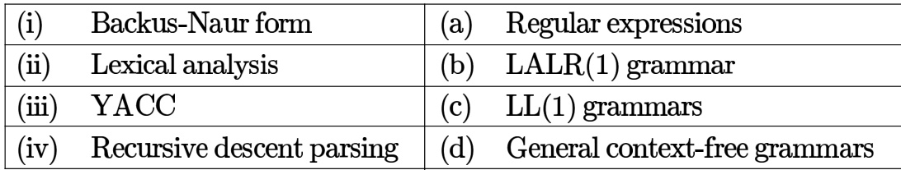

gate1994 compiler-design grammar normal match-the-following

Consider a grammar with the following productions

$$
\begin{array} { l } { \bullet S  a \alpha b \mid b \alpha c \mid a B } \\ { \bullet S  \alpha S \mid b } \\ { \bullet S  \alpha b b \mid a b } \\ { \bullet S \alpha  b d b \mid b } \end{array}
$$

The above grammar is:

A. Context free B. Regular C. Context sensitive D. $L R ( k )$

gate1995 compiler-design grammar normal

A. Translate the arithmetic expression $a ^ { * } - ( b + c )$ into syntax tree. B. A grammar is said to have cycles if it is the case that $A { \stackrel { + } { \Rightarrow } } A$ Show that no grammar that has cycles can be

Let $G$ be a context-free grammar where $G = ( \{ S , A , B , C \} , \{ a , b , d \} , P , S )$ with the productions in $P$ given below.

$$
\begin{array} { l } { \cdot S  A B A C } \\ { \cdot A  a A \mid \varepsilon } \\ { \cdot B  b B \mid \varepsilon } \\ { \cdot C  d } \end{array}
$$

( $\varepsilon$ denotes the null string). Transform the grammar $G$ to an equivalent context-free grammar $G ^ { \prime }$ that has no $\varepsilon$ productions and no unit productions. (A unit production is of the form $x \to y$ , and $x$ and $y$ are non terminals).

gate1996 compiler-design grammar normal descriptive

The grammar whose productions are

$\langle { \bf s t m t } \rangle $ if id then $\langle \mathrm { s t m t } \rangle$ $\langle { \bf s t m t } \rangle $ if id then $\langle \mathrm { s t m t } \rangle$ else (stmt) $\langle \mathrm { s t m t } \rangle  \mathrm { i d } : = \mathrm { i d }$

is ambiguous because

(a) the sentence

has more than two parse trees

(b) the left most and right most derivations of the sentence

give rise to different parse trees

(c) the sentence

has more than two parse trees

(d) the sentence

$$
\begin{array} { l } { { \cdot \ P  b P c } } \\ { { \cdot \ P  \varepsilon } } \\ { { \cdot Q  c Q d } } \\ { { \cdot Q  \varepsilon } } \\ { { \cdot R  d R e } } \\ { { \cdot R  \varepsilon } } \end{array}
$$

where $s , P , Q , R$ are non-terminal symbols with $\boldsymbol { S }$ being the start symbol; $b , c , d , e$ are terminal symbols and $\mathbf { \epsilon } ^ { \bullet } \mathbf { \epsilon } ^ { \bullet }$ is the empty string. This grammar generates strings of the form $b ^ { i } , c ^ { j } , d ^ { k } , e ^ { m }$ for some $i , j , k , m \ge 0$ .

a. What is the condition on the values of $i , j , k , m ?$ b. Find the smallest string that has two parse trees.

A. Let $G _ { 1 } = ( N , T , P , S _ { 1 } )$ be a CFG where, $N = \{ S _ { 1 } , A , B \} , T = \{ a , b \}$ and $P$ is given by

$$
\begin{array} { l } { { S _ { 1 } \to a S _ { 1 } b ~ \left| ~ S _ { 1 } \to a B b \right. } } \\ { { S _ { 1 } \to a A b ~ \left| ~ B \to B b \right. } } \\ { { A \to a A ~ \left| ~ B \to b ~ \right. } } \\ { { A \to a } } \end{array}
$$

What is $L ( G _ { 1 } ) \ ?$

B. Use the grammar in Part(a) to give a CFG for $L _ { 2 } = \{ a ^ { i } b ^ { j } a ^ { k } b ^ { l } \mid i , j , k , l \geq 1 , i = j \mathrm { o r } k = l \}$ by adding not more than 5 production rules.   
C. Is $L _ { 2 }$ inherently ambiguous?

Consider the grammar

$$
\begin{array} { l } { \displaystyle \cdot \ s \to A a \mid b } \\ { \displaystyle \cdot \ A \to A c \mid S d \mid \epsilon } \end{array}
$$

Construct an equivalent grammar with no left recursion and with minimum number of production rules.

gate1998 compiler-design grammar descriptive

Answer key☟

Which of the following statements is false?

A. An unambiguous grammar has same leftmost and rightmost derivation   
B. An LL(1) parser is a top-down parser   
C. LALR is more powerful than SLR   
D. An ambiguous grammar can never be LR(k) for any k

gatecse-2001 compiler-design grammar normal

Answer key☟

A. Remove left-recursion from the following grammar: $S \to S a \mid S b \mid a \mid b$ B. Consider the following grammar:

$S \to a S b S ~ | ~ b S a S ~ | ~ \epsilon$ Construct all possible parse trees for the string abab. Is the grammar ambiguous?

gatecse-2001 compile r-design grammar descriptive

Consider the grammar shown below

$$
\vdots { \begin{array} { l } { S  i E t S S ^ { \prime } \mid a } \\ { \mathrel { \mathop { S } } ^ { \prime }  e S \mid \epsilon } \\ { E  b } \end{array} }
$$

In the predictive parse table, $M$ of this grammar, the entries $M [ S ^ { \prime } , e ]$ and $M [ S ^ { \prime } , \mathfrak { H } ]$ respectively are

A. B. C. D. $\{ S ^ { \prime }  e S \}$ $\{ S ^ { \prime }  e S \}$ and $\{ S ^ { \prime }  \epsilon \}$ $\{ S ^ { \prime }  \epsilon \}$ and $\{ S ^ { \prime }  \epsilon \}$ $\{ S ^ { \prime }  e \overline { { S } } , S ^ { \prime } \stackrel { . } {  } \varepsilon \}$ and $\{ S ^ { \prime }  \epsilon \}$

gatecse-2003 compiler-design grammar normal parsing

Consider the translation scheme shown below.

·S→TR $\begin{array} { c } { R  + T \{ \mathrm { p r i n t } ( ^ { \circ } + ^ { \prime } ) ; \} R \mid \varepsilon } \\ { \cdot T  \mathsf { n u m } \ \{ \mathrm { p r i n t } ( \mathsf { n u m . v a l } ) ; \} } \end{array}$

Here num is a token that represents an integer and num.val represents the corresponding integer value. For an input string ${ \bf 9 } + { \bf 5 } + { \bf 2 } ^ { , }$ , this translation scheme will print

A. $\mathbf { 9 + 5 + 2 }$ $\begin{array} { c c c } { { { \bf { B . ~ 9 5 + 2 + } } } } & { { { { \bf { C . ~ 9 5 2 + + } } } } } & { { { { \bf { D . ~ + + 9 5 2 } } } } } \end{array}$

gatecse-2003 compiler-design grammar normal

# Answer key☟

# 2.12.23 Grammar: GATE CSE 2004 Question: 8

Which of the following grammar rules violate the requirements of an operator grammar? $P , Q , R$ are nonterminals, and $\boldsymbol { r } , \boldsymbol { s } , t$ are terminals.

I. $P \to Q R$   
II. $P \to Q s R$   
III. $P \to \varepsilon$   
IV. $P  Q t R r$

A. (I) only B. (I) and (III) only C. (II) and (III) only D. (III) and (IV) only

gatecse-2004 compiler-design grammar normal

# Answer key☟

Consider the following grammar G:

$\begin{array} { l } { S  b S \mid a A \mid b } \\ { A  b A \mid a B } \\ { B  b B \mid a S \mid a } \end{array}$   
Let $N _ { a } ( w )$ and $N _ { b } ( w )$ denote the number of a’s and b’s in a string $\omega$ respectively. The language $L ( G )$ over $\{ a , b \} ^ { + }$ generated by $G$ is A. $\{ w \mid N _ { a } ( w ) > 3 N _ { b } ( w ) \}$   
B. $\{ w \mid N _ { b } ( w ) > 3 N _ { a } ( w ) \}$   
C. $\{ w \mid N _ { a } ( w ) = 3 k , k \in \{ 0 , 1 , 2 , . . . \} \}$   
D. $\{ w \mid N _ { b } ( w ) = 3 k , k \in \{ 0 , 1 , 2 , \ldots \} \}$

gatecse-2004 compiler-design grammar normal

# Answer key☟

# 2.12.25 Grammar: GATE CSE 2005 Question: 14

The grammar $A \to A A \mid ( A ) \mid \epsilon$ is not suitable for predictive-parsing because the grammar is:

A. ambiguous B. left-recursive C. right-recursive D. an operator-grammar

Consider the grammar:

$$
E \to E + n \mid E \times n \mid n
$$

For a sentence $n + n \times n$ , the handles in the right-sentential form of the reduction are:

A. ${ \mathbf { } } n , E + n$ and $E + \boldsymbol { n } \times \boldsymbol { n }$ B. ${ \mathbf { } } n , E + n$ and $E + E \times n$ C. $n , n + n$ and $n + n \times n$ D. $n , E + n$ and $E \times n$

gatecse-2005 compiler-design grammar normal

Consider the following statements about the context free grammar

$$
G = \{ S  S S , S  a b , S  b a , S  \epsilon \}
$$

I. $G$ is ambiguous II. $G$ produces all strings with equal number of $a$ ’s and ’s III. $G$ can be accepted by a deterministic PDA.

Which combination below expresses all the true statements about $G ?$

A. I only B. and III only C. II and III only D. I, II and III

gatecse-2006 compiler-design grammar normal isro2016

Consider the following translation scheme.

$$
\begin{array} { r l } & { \bullet S  E R } \\ & { \bullet R  \ast E \{ \mathrm { p r i n t } ( \mathit { \iota } _ { \ast } \ast \mathit { \iota } _ { \rangle } ) ; \} R | \mathit { \iota } _ { \varepsilon } } \\ & { \bullet E  F + E \{ \mathrm { p r i n t } ( \mathit { \iota } _ { \cdot } ^ { \circ } + \mathit { \iota } _ { \rangle } ) ; \} | \mathit { \Pi } _ { F } } \\ & { \bullet F  ( S ) | i d \{ \mathrm { p r i n t } ( i d . v a l u e ) ; \} } \end{array}
$$

Here ${ i d }$ is a token that represents an integer and  represents the corresponding integer value. For an input $^ { 6 } 2 * 3 + 4 ^ { , }$ ， this translation scheme prints

A. $2 * 3 + 4$ ${ \mathsf { B } } . \ 2 * + 3 \ 4$ ${ \mathsf { C } } . \ 2 \ 3 * 4 +$ D. 234+\*

gatecse-2006 compiler-design grammar normal

# Answer key☟

# 2.12.29 Grammar: GATE CSE 2006 Question: 84

Which one of the following grammars generates the language $L = \{ a ^ { i } b ^ { j } \mid i \neq j \} ?$

A. $S \to A C \mid C B$ B. $S \to a S \mid S b \mid a \mid b$ C. $\begin{array} { l l } { { S  A C \mid C B } } & { { \qquad \mathrm { ~ D . ~ } S  A C \mid C B } } \\ { { \begin{array} { l } { { C  a C b \mid \varepsilon } } \\ { { A  a A \mid \varepsilon } } \\ { { B  B b \mid \varepsilon } } \end{array} } } & { { \qquad C  a C b \mid \varepsilon } } \end{array}$ $\begin{array} { l } { C  a C b \mid a \mid b } \\ { A  a A \mid \varepsilon } \\ { B  B b \mid \varepsilon } \end{array}$

The grammar

$$
\begin{array} { l } { \cdot S  A C \mid C B } \\ { \cdot C  a C b \mid \epsilon } \\ { \cdot A  a A \mid a } \\ { \cdot B  B b \mid b } \end{array}
$$

generates the language $L = \left\{ a ^ { i } b ^ { j } \mid i \neq j \right\}$ . In this grammar what is the length of the derivation (number of steps starting from $\boldsymbol { S }$ ) to generate the string $a ^ { l } b ^ { m }$ with $l \neq m$

A. $\mathrm { m a x } ( l , m ) + 2$ $\mathsf { B } . \ l + m + 2$ $\mathsf { C } . \ l + { m + 3 }$ $\mathsf { D } . \ \operatorname* { m a x } ( l , m ) + 3$

gatecse-2006 compiler-design grammar normal

# Answer key☟

Consider the grammar with non-terminals $N = \{ S , C , S _ { 1 } \}$ , terminals $T = \{ a , b , i , t , e \}$ , with $\boldsymbol { s }$ as the start symbol, and the following set of rules:

$$
\begin{array} { l } { S  i C t S S _ { 1 } \mid a } \\ { S _ { 1 }  e S \mid \epsilon } \\ { C  b } \end{array}
$$

The grammar is NOT LL(1) because:

A. it is left recursive B. it is right recursive C. it is ambiguous D. it is not context-free

gatecse-2007 compiler-design grammar normal

Consider the following two statements:

P: Every regular grammar is LL(1) Q: Every regular set has a LR(1) grammar

Which of the following is TRUE?

A. Both P and Q are true B. P is true and $\mathsf { Q }$ is false C. P is false and Q is true D. Both P and $\mathsf { Q }$ are false

gatecse-2007 compiler-design grammar normal

# Answer key☟

# 2.12.33 Grammar: GATE CSE 2007 Question: 78

Consider the CFG with $\{ S , A , B \}$ as the non-terminal alphabet, $\{ a , b \}$ as the terminal alphabet, $\boldsymbol { s }$ as the start symbol and the following set of production rules:

$$
\begin{array} { l l } { { S  a B } } & { { S  b A } } \\ { { B  b } } & { { A  a } } \\ { { B  b S } } & { { A  a S } } \\ { { B  a B B } } & { { A  b A A } } \end{array}
$$

Which of the following strings is generated by the grammar?

A. aaaabb B. aabbbb C. aabbab D. abbbba

Consider the CFG with $\{ S , A , B \}$ as the non-terminal alphabet, $\{ a , b \}$ as the terminal alphabet, $\boldsymbol { S }$ as the start symbol and the following set of production rules:

$$
\begin{array} { l l } { { S  a B } } & { { S  b A } } \\ { { B  b } } & { { A  a } } \\ { { B  b S } } & { { A  a S } } \\ { { B  a B B } } & { { A  b A A } } \end{array}
$$

For the string , how many derivation trees are there?

A. B. 2 C. D.

gatecse-2007 compiler- design grammar normal

# Answer key☟

Which of the following statements are true?

I. Every left-recursive grammar can be converted to a right-recursive grammar and vice-versa II. All -productions can be removed from any context-free grammar by suitable transformations III. The language generated by a context-free grammar all of whose productions are of the form $X  w$ or $X \to w Y$ (where, $w$ is a string of terminals and $Y$ is a non-terminal), is always regular IV. The derivation trees of strings generated by a context-free grammar in Chomsky Normal Form are always binary trees

A. I, II, III and IV B. II, III and IV only C. I, III and IV only D. I, II and IV only

gatecse-2008 normal compiler-design grammar

The grammar $S \to a S a \mid b S \mid c$ is

A. LL(1) but not LR(1) B. LR(1) but not LL(1) C. Both LL(1) and LR(1) D. Neither LL(1) nor LR(1)

gatecse-2010 compiler-design grammar normal

# Answer key☟

Which one of the following grammars is free from left recursion?

A. $S  A B$ $\begin{array} { l l } { { S  A b | B b | c } } & { { \qquad \mathbb { C } . \ S  A a | B \qquad \mathbb { D } . \ S  A a | B b | c } } \\ { { A  B d | \epsilon } } & { { \qquad \ A  B b | S c | \epsilon } } \\ { { B  e } } & { { \qquad \ B  d } } \end{array} \qquad \begin{array} { l } { { \Omega . \ S  A a | B b | c } } \\ { { \phantom { - } \ A  B d | \epsilon } } \\ { { \phantom { - } \ B  A e | \epsilon } } \end{array}$ $\begin{array} { l } { A  A a \mid b } \\ { B  c } \end{array}$

gatecse-2016-set2 compiler-design grammar easy

# Answer key☟

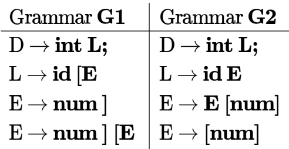

Which of the grammars correctly generate the declaration mentioned above?

A. Both G1 and G2 B. Only G1 C. Only G2 D. Neither G1 nor G2

gatecse-2016-set2 compiler-design grammar normal

Consider the following expression grammar $G$ :

$$
\begin{array} { l } { \cdot E \to E - T \mid T } \\ { \cdot T \to T + F \mid F } \\ { \cdot F \to ( E ) \mid i d } \end{array}
$$

Which of the following grammars is not left recursive, but is equivalent to $G ?$

A. $E \to E - T \mid T$ B. $\begin{array} { l c c } { { E  T E ^ { \prime } } } & { { \qquad } } & { { \complement . E  T X } } \\ { { E ^ { \prime }  - T E ^ { \prime } \mid \epsilon } } & { { } } & { { X  - T X \mid \epsilon } } \\ { { T  T + F \mid F } } & { { } } & { { T  F Y } } \\ { { F  ( E ) \mid i d } } & { { } } & { { Y  + F Y \mid \epsilon } } \\ { { } } & { { } } & { { F  ( E ) \mid i d } } \end{array}$ D. $E \to T X \mid ( T X )$ $\begin{array} { l } { T \to T + F \mid F } \\ { F \to ( E ) \mid i d } \end{array}$ $\begin{array} { l } { { X  - T X \mid + T X \mid \epsilon } } \\ { { { } } } \\ { { T  i d } } \end{array}$

# Answer key☟

Consider the augmented grammar given below:

$$
\begin{array} { l } { \cdot S ^ { \prime }  S } \\ { \cdot S  \langle L \rangle \ : | \ : i d } \\ { \cdot L  L , S \ : | \ : S } \end{array}
$$

Let $I _ { 0 } = \mathrm { C L O S U R E } ( \{ [ S ^ { \prime }  \cdot S ] \} )$ The number of items in the set $\mathrm { G O T O } ( I _ { 0 } , \langle )$ is_

gatecse-2019 numerical-answers compiler-design grammar two-marks

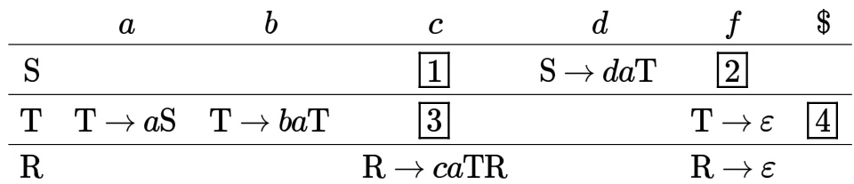

Which one of the following choices represents the correct combination for the numbered cells in the parsing table (“blank” denotes that the corresponding cell is empty)?

A. s→Rf ②s→Rf ③T→ε 4T→ε B. 1 blank ②s→Rf √ T→ε 4T→ε C. 1 S→Rf ② blank blank ④T→ε D. 1 blank ②s→Rf ③ blank 4 blank

Let $G = ( V , \Sigma , S , P )$ be a context-free grammar in Chomsky Normal Form with $\Sigma = \{ a , b , c \}$ and $V$ containing  variable symbols including the start symbol $\boldsymbol { S }$ . The string $w = a ^ { 3 0 } b ^ { 3 0 } c ^ { 3 0 }$ is derivable from $\boldsymbol { S }$ . The number of steps (application of rules) in the derivation $\ b { S }  ^ { * } \ b { w }$ is

gatecse-2024-set1 numerical-answers compile r-design grammar two-marks ​Consider a context-free grammar $\mathrm { G }$ with the following rules.

$$
S \to a S , S \to a S b S , S \to c
$$

Let $w \in L ( G )$ . Let ${ n _ { a } ( w ) , n _ { b } ( w ) , n _ { c } ( w ) }$ denote the number of times $a , b , c$ occur in $w$ , respectively. Which of the following statements is/are TRUE?

A. $n _ { a } ( w ) > n _ { b } ( w )$ $\begin{array} { r } { \mathsf { B } . \ n _ { a } ( w ) > n _ { c } ( w ) - 2 } \\ { \mathsf { D } . \ n _ { c } ( w ) = n _ { b } ( w ) * 2 } \end{array}$   
C. $n _ { c } ( w ) = n _ { b } ( w ) + 1$

# Answer key☟

Consider two grammars $G _ { 1 }$ and $G _ { 2 }$ with the production rules given below:

$$
\begin{array} { c } { { G _ { 1 } : S  i f E t h e n S \mid i f E t h e n S e l s e S \mid a } } \\ { { E  b } } \\ { { G _ { 2 } : S  i f E t h e n S \mid M } } \\ { { M  i f E t h e n M e l s e S \mid c } } \\ { { E  b } } \end{array}
$$

where $i f , t h e n , e l s e , a , b , c$ are the terminals. Which of the following option(s) is/are CORRECT?

A. $G _ { 1 }$ is not $L L ( 1 )$ and $G _ { 2 }$ is B. $G _ { 1 }$ is $L L ( 1 )$ and $G _ { 2 }$ is not $L L ( 1 )$ $L L ( 1 )$ C. $G _ { 1 }$ and $G _ { 2 }$ are not $L L ( 1 )$ D. $G _ { 1 }$ and $G _ { 2 }$ are ambiguous.

gatecse2025-set2 compiler-design grammar multiple-selects easy two-marks

Consider the context-free grammar

$$
\begin{array} { l } { E  E + E } \\ { E  ( E * E ) } \\ { E  i d } \end{array}
$$

where $E$ is the starting symbol, the set of terminals is $\{ i d , ( , + , ) , * \}$ , and the set of nonterminals is $\{ E \}$ . Which of the following terminal strings has more than one parse tree when parsed according to the above grammar?

A. $i d + i d + i d + i d$ $\begin{array} { c } { { \mathsf { B . ~ } i d + ( i d \ast ( i d \ast i d ) ) } } \\ { { \mathsf { D . ~ } \left( ( i d \ast i d + i d ) \ast i d \right) } } \end{array}$   
C. $( i d * ( i d * i d ) ) + i d$

gateit-2005 compiler-design grammar parsing easy

Answer key☟

# 2.12.46 Grammar: GATE IT 2007 Question: 9

Consider an ambiguous grammar $G$ and its disambiguated version $D$ Let the language recognized by the two grammars be denoted by $L ( G )$ and $L ( D )$ respectively. Which one of the following is true?

A. $L ( D ) \subset L ( G )$ B. $L ( D ) \supset L ( G )$ C. $L ( D ) = L ( G )$ D. $L ( D )$ is empty

gateit-2007 compiler-design grammar normal

Answer key☟

# 2.12.47 Grammar: GATE IT 2008 Question: 78

A CFG $G$ is given with the following productions where $\boldsymbol { S }$ is the start symbol, $A$ is a non-terminal and $a$ and $b$ are terminals.

$$
\cdot _ { \cdot } ^ { S  a S \mid A }
$$

Which of the following strings is generated by the grammar above?

A. aabbaba B. aabaaba C. abababb D. aabbaab

gateit-2008 parsing normal grammar

# Answer key☟

✍ Practice Test: Test (9Q)

Is the following code template for the if-then-else statement correct? if not, correct it.

if expression then statement 1   
else statement 2

# Template:

Code for expression (\*result in $E > O$ indicates true \*) Branch on $E > O$ to $L 1$ Code for statement $L 1$ : Code for statement

descriptive gate1989 compiler-design intermediate-code

Write address intermediate code (quadruples) for the following boolean expression in the sequence as it would be generated by a compiler. Partial evaluation of boolean expressions is not permitted. Assume the usual rules of precedence of the operators.

$$
( a + b ) > ( c + d ) { \mathrm { o r } } a > c { \mathrm { a n d } } b < d
$$

gate1992 compiler-design syntax-directed-translation intermediate-code descriptive

# Answer key☟

Generation of intermediate code based on an abstract machine model is useful in compilers because

A. it makes implementation of lexical analysis and syntax analysis easier B. syntax-directed translations can be written for intermediate code generation C. it enhances the portability of the front end of the compiler D. it is not possible to generate code for real machines directly from high level language programs

For a C program accessing $\mathbf { X } [ \mathbf { i } ] [ \mathbf { j } ] [ \mathbf { k } ]$ , the following intermediate code is generated by a compiler. Assume that the size of an integer is bits and the size of a character is 8 bits.

t0 = i ∗ 1024   
t1 = j ∗ 32   
t2 = k ∗ 4   
t3 = t1 + t0   
t4 = t3 + t2   
t5 = X[t4]

Which one of the following statements about the source code for the C program is CORRECT?

A. $\mathbf { x }$ is declared as "int ”.   
B. $\mathbf { x }$ is declared as "int ”.   
C. is declared as "char X[4] ”.   
D. is declared as "char ”.

One of the purposes of using intermediate code in compilers is to

A. make parsing and semantic analysis simpler.   
B. improve error recovery and error reporting.   
C. increase the chances of reusing the machine-independent code optimizer in other compilers.   
D. improve the register allocation.

gatecse-2014-set3 compiler-design intermediate-code easy

# 2.13.7 Intermediate Code: GATE CSE 2015 Set Question: 8

For computer based on three-address instruction formats, each address field can be used to specify which of the following:

(S1) A memory operand (S2) A processor register (S3) An implied accumulator register

A. Either $S 1$ or $S 2$ B. Either $S 2$ or $S 3$ C. Only $S 2$ and $S 3$ D. All of $S 1$ , $S 2$ and $S 3$ gatecse-2015-set1 compiler-design intermediate-code normal

Consider the intermediate code given below.

(1) i=1   
(2) j=1   
(3) t1 = 5 \* i   
(4) t2 = t1 + j   
(5) $\dag 3 = 4 ^ { \ast }$ t2   
(6) $\mathbf { { \dot { 1 4 } } } = \mathbf { { \dot { 1 3 } } }$   
(7) a[t4] $= - 1$   
(8) $\mathrm { j } = \mathrm { j } + 1$   
(9) if j $< = 5$ goto (3)   
(10) $\dot { \mathsf { I } } = \dot { \mathsf { I } } + \mathsf { I }$   
(11) if $\dot { \mathsf { I } } < 5$ goto (2)

The number of nodes and edges in control-flow-graph constructed for the above code, respectively, are

A. and B. and C. and D. and

gatecse-2015-set2 compiler-design intermediate-code normal

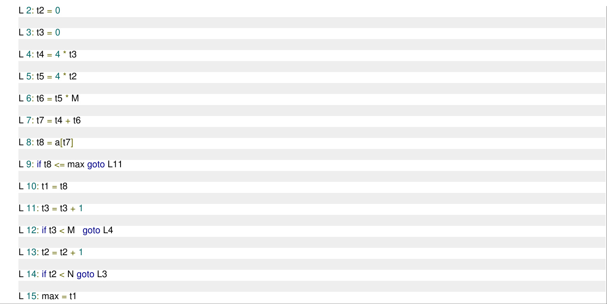

Which one of the following options CORRECTLY specifies the number of basic blocks and the number of instructions in the largest basic block, respectively?

A. and B. and C. and D. and

gatecse-2024-set1 compiler-design intermediate-code two-marks

# 2.13.11 Intermediate Code: GATE CSE 2024 Set 2 Question: 33

Consider the following expression: $x [ i ] = ( p + r ) * - s [ i ] + u / w$ . The following sequence shows the list o triples representing the given expression, with entries missing for triples , and .

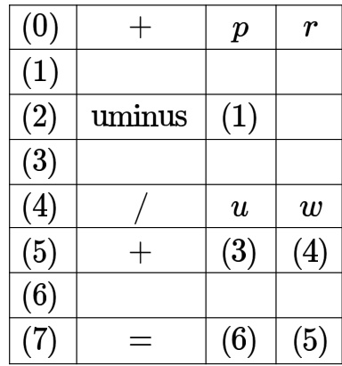

Which one of the following options fills in the missing entries CORRECTLY?

A. $ ( 1 ) = [ ] { \bf s } i$ (3) \* (6)[]= x i B. (1) $[ ] = \mathbf { s } i$ (3) 一 (0)(2) (6)=[]𝑥 (5) C. $ ( 1 ) = [ ] { \bf s } i$ (3) \* (6)[]= x (5) D. (1) $[ ] = \mathbf { s } i$ (3)- (0)(2) (6)=[] xi

Consider the and parsing tables for a context free grammar. Which of the following statement is/are true?

A. The goto part of both tables may be different. B. The shift entries are identical in both the tables. C. The reduce entries in the tables may be different. D. The error entries in tables may be different

gate1992 compiler-design normal parsing multiple-selects lr-parser

Which of the following statements is true?

A. SLR parser is more powerful than LALR B. LALR parser is more powerful than Canonical LR parser C. Canonical LR parser is more powerful than LALR parser D. The parsers SLR, Canonical CR, and LALR have the same power gate1998 compiler-design parsing normal lr-parser

Assume that the SLR parser for a grammar $G$ has $n _ { 1 }$ states and the LALR parser for $\mathsf { G }$ has $n _ { 2 }$ states. The relationship between $n _ { 1 }$ and $n _ { 2 }$ is

A. $n _ { 1 }$ is necessarily less than $n _ { 2 }$ B. $n _ { 1 }$ is necessarily equal to n2 C. $n _ { 1 }$ is necessarily greater than $n _ { 2 }$ D. None of the above

gatecse-2003 compiler-design parsing easy lr-parser

Consider the grammar:

$$
S \to ( S ) \mid a
$$

Let the number of states in SLR (1), LR(1) and LALR(1) parsers for the grammar be $n _ { 1 } , n _ { 2 }$ and $n _ { 3 }$ respectively. The following relationship holds good:

A. $n _ { 1 } < n _ { 2 } < n _ { 3 }$ $\begin{array} { c } { { \mathsf { B } . \ n _ { 1 } = n _ { 3 } < n _ { 2 } } } \\ { { \mathsf { D } . \ n _ { 1 } \geq n _ { 3 } \geq n _ { 2 } } } \end{array}$   
C. $n _ { 1 } = n _ { 2 } = n _ { 3 }$

gatecse-2005 compiler-design parsing normal lr-parser

Answer key☟

# 2.14.5 LR Parser: GATE CSE 2006 Question: 7

Consider the following grammar

$$
\begin{array} { l } { \cdot S  S * E } \\ { \cdot S  E } \\ { \cdot E  F + E } \\ { \cdot E  F } \\ { \cdot F  i d } \end{array}
$$

Consider the following LR(0) items corresponding to the grammar above

$$
S \to S * . E
$$

ii. $E  F . + E$   
iii. $E \to F + . E$

Given the items above, which two of them will appear in the same set in the canonical sets-of-items for the grammar?

A. i and ii B. ii and iii C. i and iii D. None of the above

gatecse-2006 compiler-design parsing normal lr-parser

# 2.14.6 LR Parser: GATE CSE 2008 Question: 55

An LALR(1) parser for a grammar G can have shift-reduce (S-R) conflicts if and only if

A. The SLR(1) parser for G has S-R conflicts B. The LR(1) parser for G has S-R conflicts C. The LR(0) parser for G has S-R conflicts D. The LALR(1) parser for G has reduce-reduce conflicts gatecse-2008 compiler-design parsing normal lr-parser

Consider the following two sets of items of an LR(1) grammar.

$$
\begin{array} { l } { X  c . X , c / d } \\ { X  . c X , c / d } \\ { X  . d , c / d } \end{array} | \begin{array} { l } { X  c . X , \ S } \\ { X  . c X , \ S } \\ { X  . d , \ S } \end{array} 
$$

Which of the following statements related to merging of the two sets in the corresponding parser is/are FALSE?

1. Cannot be merged since look aheads are different.   
2. Can be merged but will result in conflict.   
3. Can be merged but will result in  conflict.   
4. Cannot be merged since on will lead to two different sets.

A. 1 only B. only C. and only D. and

# 2.14.8 LR Parser: GATE CSE 2013 Question: 9

What is the maximum number of reduce moves that can be taken by a bottom-up parser for a grammar with no epsilon and unit-production (i.e., of type $A \to \epsilon$ and $A  a$ ) to parse a string with $n$ tokens?

A. $\mathsf { B } . \ n - 1$ C. 2n-1 D. 2n

gatecse-2013 compiler-design parsing normal lr-parser

# Answer key☟