On input symbol $<$ the set has

A. a shift-reduce conflict and a reduce-reduce conflict.   
B. a shift-reduce conflict but not a reduce- reduce conflict.   
C. a reduce-reduce conflict but not a shift-reduce conflict.   
D. neither a shift-reduce nor a reduce-reduce conflict.

gatecse-2014-set1 compiler-design parsing normal lr-parser

Among simple LR (SLR), canonical LR, and look-ahead LR (LALR), which of the following pairs identify the method that is very easy to implement and the method that is the most powerful, in that order?

gatecse-2015-set3 compiler-design parsing normal lr-parser

Which of the following statements about parser is/are CORRECT?

I. Canonical LR is more powerful than II. is more powerful than III. is more powerful than Canonical LR

A. I only B. II only C. III only D. II and III only

gatecse-2017-set2 compiler-design parsing lr-parser

Which one of the following kinds of derivation is used by LR parsers?

A. Leftmost B. Leftmost in reverse C. Rightmost D. Rightmost in reverse

gatecse-2019 compiler-design parsing one-mark lr-parser

Consider the following grammar.

$$
\displaystyle { \cdot } { S \to a S B } \mid d
$$

The number of reduction steps taken by a bottom-up parser while accepting the string  is

gatecse-2020 numerical-answers compiler-design lr-parser one-mark

A. $S _ { 1 }$ is true and $S _ { 2 }$ is false B. $S _ { 1 }$ is false and $S _ { 2 }$ is true C. $S _ { 1 }$ is true and $S _ { 2 }$ is true D. $S _ { 1 }$ is false and $S _ { 2 }$ is false

gatecse-2021-set1 compiler-design lr-parser one-mark

Consider the following augmented grammar with $\{ \# , \ @ , < , > , a , b , c \}$ as the set of terminals.

$$
\begin{array} { l } { { S ^ { \prime }  S } } \\ { { S  S \nmid c S } } \\ { { S  S S } } \\ { { S  S \odot } } \\ { { S  < S > } } \\ { { S  a } } \\ { { S  b } } \\ { { S  c } } \end{array}
$$

Let $I _ { 0 } = \mathrm { C L O S U R E } ( \{ S ^ { \prime }  \bullet S \} )$ . The number of items in the set $\mathrm { G O T O } ( \mathrm { G O T O } ( I _ { 0 } < ) , < )$ is

gatecse-2021-set2 compiler-design lr-parser numerical-answers two-marks

Consider the augmented grammar with $\{ + , * , ( , ) , \mathrm { i d } \}$ as the set of terminals.

$$
\begin{array} { l } { \cdot S ^ { \prime }  S } \\ { \cdot S  S + R \ : \vert \ : R } \\ { \cdot R  R \ast P \ : \vert \ : P } \\ { \cdot P  ( S ) \ : \vert \ : \mathrm { i d } } \end{array}
$$

I f $I _ { 0 }$ is the set of two $L R ( 0 )$ items $\{ [ S ^ { \prime }  S . ] , [ S  S . + R ] \}$ , then contains exactly items.

gatecse-2022 numerical-answers compiler-design parsing lr-parser one-mark

Which one of the following statements is

A. The $L A L R ( 1 )$ parser for a grammar $G$ cannot have reduce-reduce conflict if the $L R ( 1 )$ parser for $G$ does not have reduce-reduce conflict.   
B. Symbol table is accessed only during the lexical analysis phase.   
C. Data flow analysis is necessary for run-time memory management.   
D. $L R ( 1 )$ parsing is sufficient for deterministic context-free languages.

$$
\begin{array} { l } { S ^ { \prime }  S } \\ { S  S S \vert A a \vert b A c \vert B c \vert b B a } \\ { A  d \# } \\ { B  \bigoplus } \end{array}
$$

Let $I _ { 0 } = \mathrm { C L O S U R E } ( \{ S ^ { \prime }  \bullet S \} )$ . The number of items in the set $\mathrm { G O T O } ( I _ { 0 } , S )$ is

​Given a Context-Free Grammar as follows:

$$
\begin{array} { l } { S  A a | b A c | d c | b d a } \\ { A  d } \end{array}
$$

Which ONE of the following statements is TRUE?

A. is neither nor B. is , not C. is LALR(1), not SLR(1) D. is , also

gatecse2025-set2 compiler-design context-free-grammar parsing lr-parser two-marks

Consider the canonical $L R ( 0 )$ parsing of the grammar below using terminals $\{ a , b , c \}$ and non-terminals $\{ A , B , C , S \}$ with $\boldsymbol { S }$ as the start symbol.

$$
\begin{array} { c } { { S  A C B } } \\ { { A  a A \mid \epsilon } } \\ { { C  c C \mid \epsilon } } \\ { { B  b B \mid b } } \end{array}
$$

Which one of the following options gives the number of shift-reduce conflicts that will occur in the $L R ( 0 )$ ACTION table?

A. B. C. D.

gatecse-2026-set2 compiler-design lr-parser two-marks

D. None of the above

# The number of tokens in the following C statement is

printf("i=%d, &i=%x", i, &i);

A. B. C. D.

gatecse-2000 compiler-design lexical-analysis easy isro2015

Answer key☟

Which data structure in a compiler is used for managing information about variables and their attributes?

A. Abstract syntax tree B. Symbol table C. Semantic stack D. Parse table

gatecse-2010 compiler-design lexical-analysis easy

# Answer key☟

In a compiler, keywords of a language are recognized during

A. parsing of the program B. the code generation C. the lexical analysis of the program D. dataflow analysis

gatecse-2011 compiler-design lexical-analysis easy

The lexical analysis for a modern computer language such as Java needs the power of which one of the following machine models in a necessary and sufficient sense?

A. Finite state automata B. Deterministic pushdown automata C. Non-deterministic pushdown D. Turing machine automata

gatecse-2011 compiler-design lexical-analysis easy

Answer key☟

A lexical analyzer uses the following patterns to recognize three tokens $T _ { 1 } , T _ { 2 }$ , and $T _ { 3 }$ over the alphabet $\{ a , b , c \}$ .

$$
\begin{array} { l } { { \bullet T _ { 1 } : a ? ( b \mid c ) ^ { * } a } } \\ { { \bullet T _ { 2 } : b ? ( a \mid c ) ^ { * } b } } \\ { { \bullet T _ { 3 } : c ? ( b \mid a ) ^ { * } c } } \end{array}
$$

Note that $\cdot _ { x ? } ,$ means  or  occurrence of the symbol $x$ · Note also that the analyzer outputs the token that matches the longest possible prefix.

If the string  is processed by the analyzer, which one of the following is the sequence of tokens it outputs?

A. $T _ { 1 } T _ { 2 } T _ { 3 }$ B. TTT3 C. TTT3 D.

gatecse-2018 compiler-design lexical-analysis normal two-marks

A “link editor” is a program that:

A. matches the parameters of the macro-definition with locations of the parameters of the macro call B. matches external names of one program with their location in other programs   
C. matches the parameters of subroutine definition with the location of parameters of subroutine call. D. acts as a link between text editor and the user   
E. acts as a link between compiler and the user program

gate1991 compiler-design normal linker multiple-selects

Which of the following is NOT an advantage of using shared, dynamically linked libraries as opposed to using statistically linked libraries?

A. Smaller sizes of executable files   
B. Lesser overall page fault rate in the system   
C. Faster program startup   
D. Existing programs need not be re-linked to take advantage of newer versions of libraries

gatecse-2003 compiler-design runtime-environment linker easy

# 2.16.3 Linker: GATE CSE 2004 Question: 9

Consider a program $P$ that consists of two source modules $M _ { 1 }$ and $M _ { 2 }$ contained in two different files. If $M _ { 1 }$ contains a reference to a function defined in $M _ { 2 }$ the reference will be resolved at

A. Edit time B. Compile time C. Link time D. Load time

gatecse-2004 compiler-design easy linker

# Answer key☟

# 2.17.1 Live Variable Analysis: GATE CSE 2015 Set 1 Question: 50

A variable $x$ is said to be live at a statement $\mathbf { \boldsymbol { s } } _ { i }$ in a program if the following three conditions hold simultaneously:

i. There exists a hsftraotem nt $S _ { j }$ that uses $x$ ii. There is a pat $S _ { i }$ o ${ \dot { S } } _ { j }$ in the flow graph corresponding to the program iii. The path has no intervening assignment to $x$ including at $S _ { i }$ and $S _ { j }$

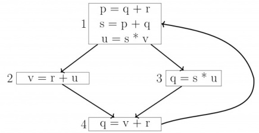

The variables which are live both at the statement in basic block and at the statement in basic block  of the above control flow graph are

A. p, s,u B. r, s,u C. r,u D.

gatecse-2015-set1 compiler-design live-variable-analysis normal

For a statement $\boldsymbol { S }$ in a program, in the context of liveness analysis, the following sets are defined:

$\mathrm { U S E } ( S )$ : the set of variables used in $\boldsymbol { s }$ $\mathbb { N } ( S )$ the set of variables that are live at the entry of $\boldsymbol { S }$ $\operatorname { o U T } ( S )$ : the set of variables that are live at the exit of $\boldsymbol { S }$

Consider a basic block that consists of two statements, $S _ { 1 }$ followed by $S _ { 2 }$ . Which one of the following statements is correct?

A. $\mathrm { O U T } ( S _ { 1 } ) = \mathbb { N } \left( S _ { 2 } \right)$ B. OUT $( S _ { 1 } ) = \mathbb { N } \left( S _ { 1 } \right) \cup$ USE $( S _ { 1 } )$ C. OUT $( S _ { 1 } ) = \mathbb { N } \left( S _ { 2 } \right) \cup \mathbf { O U T } \left( S _ { 2 } \right)$ D. OUT $( S _ { 1 } ) = \mathrm { U S E } \left( S _ { 1 } \right) \cup \mathrm { I N } \left( S _ { 2 } \right)$

Consider the control flow graph shown.

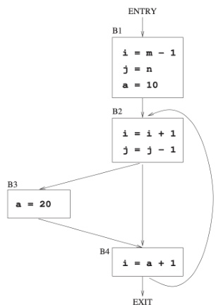

Which one of the following choices correctly lists the set of ive variables at the exit point of each basic block?

A. $\{ { \mathrm { a } } \}$ ,B3: $\{ { \bf { a } } \}$ ,B4: {a} B. $\{ { \mathrm { a } } \}$ ,B3: $\{ \mathbf { a } \}$ ,B4: {i} C. B1: $\{ \mathrm { a } , \mathrm { i } , \mathrm { j } \}$ ,B2: {a,i,j},B3: {a,i},B4: {a} D. B1: {a,i,j},B2: {a,j},B3: {a,j},B4: {a,i,j}

Consider the following context-free grammar where the start symbol is and the set of terminals is $\{ a , b , c , d \}$ .

$$
\begin{array} { l } { S  A a A b \mid B b B a } \\ { \ A  c S \mid \epsilon } \\ { B  d S \mid \epsilon } \end{array}
$$

The following is a partially-filled parsing table.

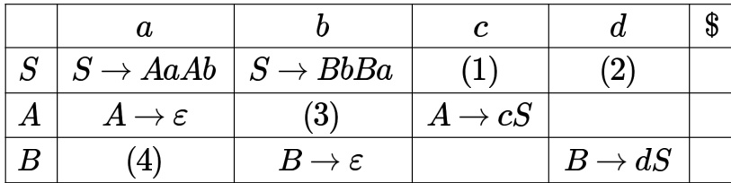

Which one of the following options represents the CORRECT combination for the numbered cells in the parsing table?

Note: In the options, "blank" denotes that the corresponding cell is empty.

A. (1) $S  A a A b$ (2) $S  B b B a$ (3) $A \to \epsilon$ (4)B→∈ B. (1 $S \to B b B a$ (2) $S  A a A b$ (③) $A \to \epsilon$ (4) $B \to \epsilon$ C. (1) $S  A a A b$ (2) $S \to B b B a$ 3 blank blank D. (1) $S \to B b B a$ $S  A a A b$ blank blank

Which of the following statements is/are true?

A. parser uses backtracking B. For a grammar to be , it must be left-recursive C. For a grammar to be $\operatorname { L L } ( 1 )$ , it must be left-factored D. The parsers are more powerful than the SLR parsers gatecse-2026-set1 compiler-design parsing ll-parser multiple-selects one-mark

Macro expansion is done in pass one instead of pass two in a two pass macro assembler because

What are $x$ and $y$ in the following macro definition?

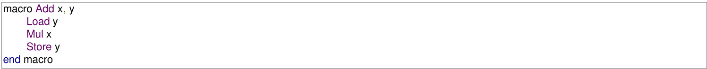

A. Variables B. Identifiers C. Actual parameters D. Formal parameters

gate1995 compiler-design macros easy

.ENDC   
.IF NE, X ;if $\mathsf X \neq \mathsf O$ then   
.WORD X ;address (X) is stored here   
.ENDC   
.ENDM

ii. .MACRO M2, X .IF EQ, X M2 X .ENDC .IF NE, X .WORD X + 1 .ENDC .ENDM

A. (ii) only B. (i) only C. both (i) and (ii) D. None of the above

gate1996 compiler-design macros normal

# Answer key☟

The conditional expansion facility of macro processor is provided to

A. test a condition during the execution of the expanded program   
B. to expand certain model statements depending upon the value of a condition during the execution of the expanded program   
C. to implement recursion   
D. to expand certain model statements depending upon the value of a condition during the process of macro expansion

✍ Practice Test: Test (7Q)

Consider the following grammar for arithmetic expressions using binary operators 一 and which are not associative

$$
\begin{array} { l } { \bullet E  E - T \mid T } \\ { \bullet T  T / F \mid F } \\ { \bullet F  ( E ) \mid i d } \end{array}
$$

( $E$ is the start symbol)

Is the grammar unambiguous? Is so, what is the relative precedence between 一 and ? If not, give an unambiguous grammar that gives / precedence over

A. $\mathbf { \omega } ^ { \mathfrak { 6 } } \oplus \mathbf { \vec { \rho } } $ is left associative while $" * "$ is right associative B. Both $\mathbf { \omega } ^ { \mathfrak { 6 } } \oplus \mathbf { \vec { \omega } } ^ { \mathfrak { 7 } }$ and $\therefore$ are left associative C. 田 is right associative while $" * "$ is left associative D. None of the above

Given the following expression grammar:

$$
\begin{array} { l } { E  E * F \mid F + E \mid F } \\ { F  F - F \mid i d } \end{array}
$$

Which of the following is true?

A. $^ *$ has higher precedence than $^ +$ B. 一 has higher precedence than $^ *$ C. $+$ and 1 have same precedence D. $^ +$ has higher precedence than $*$ gatecse-2000 operator-precedence normal compiler-design isro2015 ambiguous-grammar

A. Construct all the parse trees corresponding to $\displaystyle i + j * k$ for the grammar $\begin{array} { l } { E  E + E } \\ { E  E * E } \\ { E  i d } \end{array}$   
B. In this grammar, what is the precedence of the two operators $*$ and $+ ?$   
C. If only one parse tree is desired for any string in the same language, what changes are to be made so that the resulting LALR(1) grammar is unambiguous?

gatecse-2002 compiler- design parsing normal descriptive operator-precedence ambiguous-grammar

Consider two binary operators $\uparrow ^ { \cdot }$ and （ $\downarrow ^ { \cdot }$ with the precedence of operator $\downarrow$ being lower than that of the operator . Operator is right associative while operator $\downarrow$ is left associative. Which one of the following represents the parse tree for expression $( 7 \downarrow 3 \uparrow 4 \uparrow 3 \downarrow 2 )$

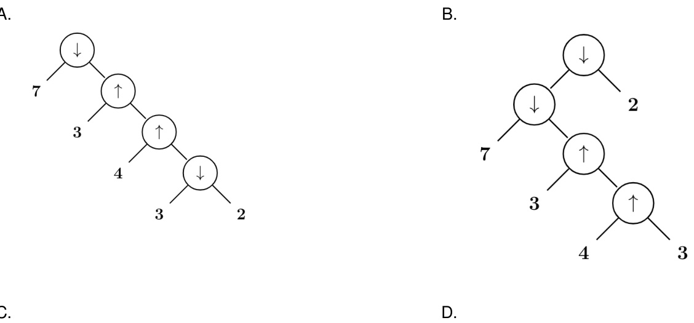

C.

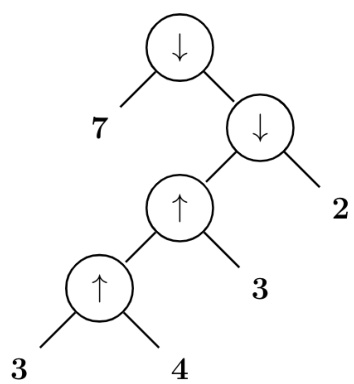

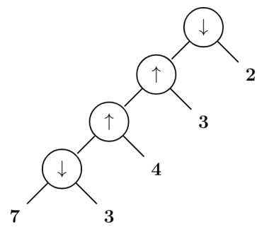

Consider the grammar defined by the following production rules, with two operators $^ *$ and $+$

$$
\begin{array} { l } { \cdot S  T * P } \\ { \cdot T  U | T * U } \\ { \cdot P  Q + P | Q } \\ { \cdot Q  I d } \\ { \cdot U  I d } \end{array}
$$

Which one of the following is TRUE?

A. $+$ is left associative, while $^ *$ is right associative B. $+$ is right associative, while $^ *$ is left associative C. Both $+$ and $^ *$ are right associative D. Both $^ +$ and $^ *$ are left associative

gatecse-2014-set2 compiler-design grammar normal operator-precedence ambiguous-grammar

The attribute of three arithmetic operators in some programming language are given below.

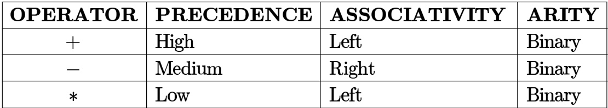

The value of the expression $^ { 2 - 5 + 1 - 7 * 3 }$ in this language is gatecse-2016-set1 compiler-design parsing normal numerical-answers operator-precedence

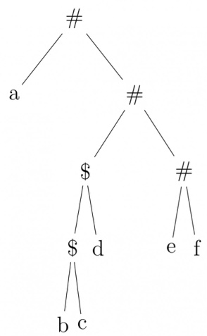

Which one of the following is correct for the given parse tree?

A. $\$ 1$ has higher precedence and is left associative; # is right associative B. # has higher precedence and is left associative; $\$ 1$ is right associative C. $\$ 1$ has higher precedence and is left associative; # is left associative D. $\$ 1$ has higher precedence and is right associative; # is left associative

Consider the operator precedence and associativity rules for the nteger arithmetic operators given in the table below.

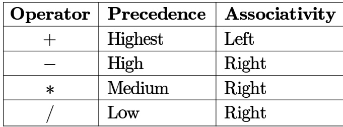

The value of the expression $\mathbf { 3 } + \mathbf { 1 } + \mathbf { 5 } * 2 / 7 + 2 - 4 - 7 - 6 / 2$ as per the above rules is

Consider the procedure declaration:

where the parameter passing mechanism is call-by-value-result. Is it correct if the call, P (A[i]), where A is an array and an integer, is implemented as below.

a. create a new local variable, say z; b. assign to z, the value of A [i];   
c. execute the body of P using z for d. set A [i] to z; k; Explain your answer. If this is incorrect implementation,   
suggest a correct one.

In which of the following case(s) is it possible to obtain different results for call-by-reference and call-byname parameter passing?

A. Passing an expression as a B. Passing an array as a parameter parameter C. Passing a pointer as a parameter D. Passing as array element as a parameter

What does the following program output?

program module (input, output);   
var a:array [1...5] of integer; i, j: integer;   
procedure unknown (var b: integer, var c: integer);   
var i:integer;   
begin for $\dot { \mathsf { I } } : = 1$ to 5 do a[i] $: = 1$ i; ${ \sf b } : = 0$ ; ${ \mathsf { c } } : = 0$ for $\dot { \mathsf { I } } : = 1$ to 5 do write (a[i]); writeln(); a[3]: $: = 1 1$ ; $\mathsf { a } [ 1 ] : = 1 1$ ; for $\mathrm { i } { : = } 1$ to 5 do a $[ \mathfrak { i } ] : = \mathsf { s q r } ( \mathsf { a } [ \mathfrak { i } ] )$ ; writeln(c,b); ${ \mathsf { b } } : = 5$ ; ${ \mathsf { c } } : = 6$ ;   
end;   
begin   
$\mathfrak { i } . = 1$ ; $\mathrm { j } : = 3$ ; unknown (a[i], a[j]);   
for $\mathrm { i } { : = } 1$ to 5 do write (a[i]);   
end;

gate1990 descriptive compiler-design runtime-environment parameter-passing

# Answer key☟

D. Although C does not support call-by-name parameter passing, the effect can be correctly simulated in C E. No feature of Pascal typing violates strong typing in Pascal.

Consider the following pseudo-code (all data items are of type integer):

procedure P(a, b, c); $\mathtt { a } : = 2$ ; ${ \mathsf { c } } : = { \mathsf { a } } + { \mathsf { b } }$ ;   
end {P}   
begin $\times : = 1$ ; $y : = 5$ ; $z : = 1 0 0$ ; $\mathsf { P } ( \mathsf { x } , \mathsf { x } ^ { \star } \mathsf { y } , z )$ ; Write $( ^ { \prime } \mathsf { X } = ^ { \prime } , \mathsf { X } , ^ { \prime } \mathsf { Z } = ^ { \prime } , \mathsf { Z } )$ );   
end

Determine its output, if the parameters are passed to the Procedure by

i. value ii. reference iii. name

gate1991 compiler-design parameter-passing normal runtime-environment descriptive

For the following code, indicate the output if a. static scope rules b. dynamic scope rules

# are used

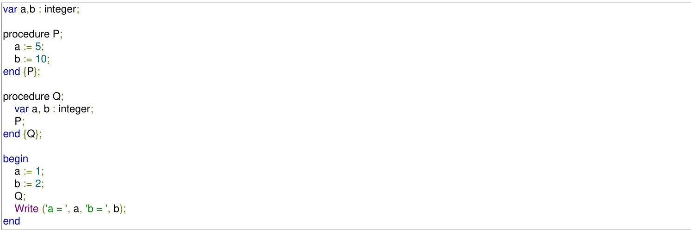

gate1991 runtime-environment normal compiler-design parameter-passing descriptive

and if $P$ is called by ; $P ( \boldsymbol { a } , \boldsymbol { b } )$ State precisely in a sentence what is pushed on stack for parameters $a$ and $b$ B. In the generated code for the body of procedure $P$ , how will the addressing of formal parameters $x$ and $y$ differ?

What is the value of $X$ printed by the following program?

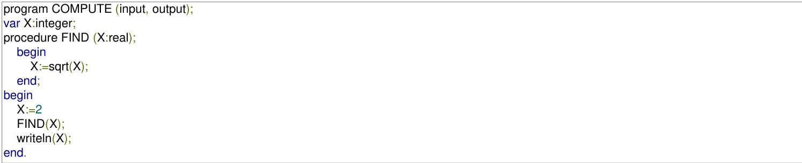

A. B. C. Run time error D. None of the above

gate1995 compiler-design parameter-passing runtime-environment easy

# Answer key☟

What will be the output of the following program assuming that parameter passing is

i. call by value ii. call by reference iii. call by copy restore

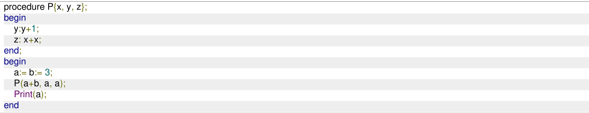

printed by the above program are

A. 115,220 B. 25,220 C. 25,15 D. 115,105

gatecse-2003 programming compiler-design parameter-passing runtime-environment normal

# Consider the following function

void swap(int a, int b) int temp; $\tan \mathsf { p } = \mathsf { a }$ ; $\mathtt { a } = \mathtt { b }$ ; $\boldsymbol { \mathsf { b } } =$ temp;

In order to exchange the values of two variables $x$ and $y$ .

A. call $s w a p ( x , y )$   
B. call $s w a p ( \\\& x , \& y )$   
C. swap $( x , y )$ cannot be used as it does not return any value   
D. $s w a p ( x , y )$ cannot be used as the parameters are passed by value

gatecse-2004 compiler-design programming-in-c parameter-passing easy isro2017 runtime-environment

What will be the output of the following pseudo-code when parameters are passed by reference and dynamic scoping is assumed?

$\sqrt { \mathsf { a } = 3 }$ ;   
void $\mathsf { n } ( \mathsf { x } )$ $\mathbf { \boldsymbol { x } } = \mathbf { \boldsymbol { x } } ^ { * }$ a; print $( { \sf x } )$ ; }   
void $\mathfrak { m } ( \mathfrak { y } )$ $\mathtt { \partial } \cdot \mathtt { a } = 1$ $\mathsf { a } = \mathsf { y } - \mathsf { a }$ ; ${ \mathfrak { n } } ( { \mathfrak { a } } )$ ; print (a); } void main $\mathrm { ( ) } \ \{ \mathsf { m } ( \mathsf { a } ) ; \}$

A. B. C. D.

gatecse-2016-set1 parameter-passing normal

# Answer key☟

Consider the program below in a hypothetical language which allows global variable and a choice of call b reference or call by value methods of parameter passing.

int i ;   
program main () int j = 60; $\dot { \mathsf { I } } = 5 0$ ; call f $( \mathfrak { i } , \mathfrak { j } )$ ; print i, j;   
procedure f (x, y) $\dot { \mathsf { I } } = 1 0 0$ ; $\mathsf { x } = 1 0$ ; $\mathsf { y } = \mathsf { y } + \mathsf { i }$ ;

Which one of the following options represents the correct output of the program for the two parameter passing mechanisms?

A. Call by value : $i = 7 0 , j = 1 0$ ; Call by reference : $i = 6 0 , j = 7 0$ B. Call by value : $i = 5 0$ ， $j = 6 0$ ; Call by reference : $i = 5 0$ ， $j = 7 0$

C. Call by value : $\dot { \iota } = 1 0 , j = 7 0$ ; Call by reference : $i = 1 0 0 , j = 6 0$ D. Call by value : $i = 1 0 0$ ， $j = 6 0$ ; Call by reference $: i = 1 0 , j = 7 0$

An operator precedence parser is a

A. Bottom-up parser. B. Top-down parser.   
C. Back tracking parser. D. None of the above.

gate1987 compiler-design parsing easy

Merging states with a common core may produce conflicts and does not produce conflicts in an LALR parser.

gate1989 descriptive compiler-design parsing

A simple Pascal like language has only three statements.

i. assignment statement e.g. x:=expression ii. loop construct e.g. for i: $\sqsupseteq$ expression to expression do statement iii. sequencing e.g. begin statement ;…; statement end

A. Write a context-free grammar (CFG) for statements in the above language. Assume that expression has already been defined. Do not use optional parenthesis and operator in CFG.   
B. Show the parse tree for the following statements:   
for j $: = 2$ to 10 do   
begin $\mathsf { x } : = \mathsf { e x p r 1 }$ ; $\mathsf { y } : = \mathsf { e x p r } 2 .$ ;   
end

gate1993 compiler-design parsing normal descriptive

Type checking is normally done during

A. lexical analysis B. syntax analysis C. syntax directed translation D. code optimization

gate1998 compiler-design parsing easy

A. An identifier in a programming language consists of up to six letters and digits of which the first character must be a letter. Derive a regular expression for the identifier.   
B. Build an $L L ( 1 )$ parsing table for the language defined by the $L L ( 1 )$ grammar with productions Program $$ begin ds $d$ semi $X$ end $\begin{array} { l } { X \to d \operatorname { s e m i } X \mid s Y } \\ { Y \to \operatorname { s e m i } s Y \mid \epsilon } \end{array}$

Which of the following is the most powerful parsing method?

A. LL (1) B. Canonical LR C. SLR D. LALR

# 2.22.8 Parsing: GATE CSE 2000 Question: 1.19, UGCNET-Dec2013-II: 30

Which of the following derivations does a top-down parser use while parsing an input string? The input is scanned from left to right.

A. Leftmost derivation B. Leftmost derivation traced out in reverse   
C. Rightmost derivation D. Rightmost derivation traced out in reverse

gatecse-2000 compiler-design parsing normal ugcnetcse-dec2013-paper2

Which of the following suffices to convert an arbitrary CFG to an LL(1) grammar?

A. Removing left recursion alone B. Factoring the grammar alone C. Removing left recursion and D. None of the above factoring the grammar

gatecse-2003 compiler-design parsing easy

# Statement for Linked Answer Questions 83a & 83b:

Consider the following expression grammar. The semantic rules for expression evaluation are stated next to each grammar production.

$$
\begin{array} { c } { E  n u m b e r } \\ { \mid E ^ { \enspace * } + ^ { \prime } E } \\ { \mid E ^ { \enspace * } \times ^ { \prime } E } \end{array} \mid E ^ { ( 1 ) } . v a l = R ^ { ( 2 ) } . v a l + E ^ { ( 3 ) } . v a l
$$

The above grammar and the semantic rules are fed to a yaac tool (which is an LALR(1) parser generator) for parsing and evaluating arithmetic expressions. Which one of the following is true about the action of yaac for the given grammar?

A. It detects recursion and eliminates recursion   
B. It detects reduce-reduce conflict, and resolves   
C. It detects shift-reduce conflict, and resolves the conflict in favor of a shift over a reduce action D. It detects shift-reduce conflict, and resolves the conflict in favor of a reduce over a shift action

Consider the following expression grammar. The semantic rules for expression evaluation are stated next to each grammar production.

$$
\begin{array} { c } { E  n u m b e r } \\ { \mid E ^ { \iota } + ^ { \prime } E } \\ { \mid E ^ { \iota } \times ^ { \prime } E } \end{array} | \begin{array} { l } { E . v a l = n u m b e r . v a l } \\ { E ^ { ( 1 ) } . v a l = E ^ { ( 2 ) } . v a l + E ^ { ( 3 ) } . v a l } \end{array} 
$$

Assume the conflicts of this question are resolved using yacc tool and an LALR(1) parser is generated for parsing arithmetic expressions as per the given grammar. Consider an expression $\mathbf { 3 \times 2 + 1 }$ . What precedence and associativity properties does the generated parser realize?

A. Equal precedence and left associativity; expression is evaluated to   
B. Equal precedence and right associativity; expression is evaluated to   
C. Precedence of $\cdot _ { \mathsf { X } } ,$ is higher than that of $\cdot _ { + } ,$ , and both operators are left associative; expression is evaluated to 7   
D. Precedence of $\cdot _ { + } ,$ is higher than that of $\cdot _ { \times } ,$ , and both operators are left associative; expression is evaluated to 9

Consider the following grammar:

$$
\begin{array} { l } { \cdot S  F R } \\ { \cdot R  { * S } \ : | \ : \varepsilon } \\ { \cdot F  i d } \end{array}
$$

In the predictive parser table $M$ of the grammar the entries $M [ S , i d ]$ and $M [ R , { \mathfrak { F } } ]$ respectively are

A. $\{ S \to F R \}$ and $\begin{array} { l } { \{ R  \varepsilon \} } \\ { \{ \begin{array} { l l } { \{ \begin{array} { l l } { \begin{array} { r l r } \end{array} } \end{array}  } \\ { \{ R  \ast S \} } \end{array} } \\ {  \begin{array} { r l } { \begin{array} { r l } { R  \varepsilon } \end{array} } \end{array}  } \end{array}$ B. $\{ S  F R \}$ and C. $ { \{ S  F R \} }$ and D. $\{ F  i d \}$ and

gatecse-2006 compiler-design parsing normal

Which one of the following is a top-down parser?

A. Recursive descent parser. B. Operator precedence parser.   
C. An LR(k) parser. D. An LALR(k) parser.

gatecse-2007 compiler-design parsing normal

# 2.22.15 Parsing: GATE CSE 2008 Question: 11

Which of the following describes a handle (as applicable to LR-parsing) appropriately?

A. It is the position in a sentential form where the next shift or reduce operation will occur   
B. It is non-terminal whose production will be used for reduction in the next step   
C. It is a production that may be used for reduction in a future step along with a position in the sentential form where the next shift or reduce operation will occur   
D. It is the production $p$ that will be used for reduction in the next step along with a position in the sentential form where the right hand side of the production may be found

gatecse-2008 compiler-design parsing normal

Which of the following statements are TRUE?

I. There exist parsing algorithms for some programming languages whose complexities are less than $\Theta ( n ^ { 3 } )$ II. A programming language which allows recursion can be implemented with static storage allocation. III. No L-attributed definition can be evaluated in the framework of bottom-up parsing. IV. Code improving transformations can be performed at both source language and intermediate code level.

A. and II B. and IV C. III and IV D. I, III and IV

gatecse-2009 compiler-design parsing normal

need to be filled are indicated as $\mathbf { \delta E 1 } , E 2$ and $E 3$ . $\varepsilon$ is the empty string, $\$ 1$ indicates end of input, and, separates alternate right hand sides of productions.

$$
\begin{array} { l } { \cdot S \to a A b B \mid b A a B \mid \varepsilon } \\ { \cdot A \to S } \\ { \cdot B \to S } \end{array}
$$

The appropriate entries for $\mathbf { \delta E 1 } , E 2$ and $E 3$ are

A. $\begin{array} { c c } { { E 1 : S \to a A b B , A \to S } } \\ { { E 2 : S \to b A a B , B \to S } } \\ { { E 3 : B \to S } } \end{array}$ B. $E 1 : S \to a A b B , S \to \varepsilon$ $E 2 : S  b A a B , S  \varepsilon$ $E 3 : S  \varepsilon$   
C. $\begin{array} { l } { E 1 : S  a A b B , S  \varepsilon } \\ { E 2 : S  b A a B , S  \varepsilon } \\ { E 3 : B  S } \end{array}$ D. $\begin{array} { l } { E 1 : A \to S , S \to \varepsilon } \\ { E 2 : B \to S , S \to \varepsilon } \\ { E 3 : B \to S } \end{array}$

Consider the following grammar $G$

$$
\begin{array} { l } { S  F \mid H } \\ { F  p \mid c } \\ { H  d \mid c } \end{array}
$$

Where $S , F$ , and $H$ are non-terminal symbols, $p , d$ , and $c$ are terminal symbols. Which of the following statement(s) is/are correct?

S1: LL(1) can parse all strings that are generated using grammar $G$ S2: LR(1) can parse all strings that are generated using grammar $G$

A. Only S1 B. Only S2 C. Both S1 and S2 D. Neither S1 and S2

gatecse-2015-set3 compiler-design parsing normal

# Answer key☟

Consider the following grammar:

stmt $$ if expr then expr else expr; stmt Ò   
expr $$ term relop term term   
term $$ id number   
${ \dot { \mathbf { i d } } } \to \mathbf { a } \mid \mathbf { b } \mid \mathbf { c }$ c   
number $ [ 0 - 9 ]$ where relop is a relational operator e.g. $, < , > , \ldots , \quad$ $\dot { \mathsf { O } }$ refers to the empty statement, and if, then, else are terminals.   
Consider a program $P$ following the above grammar containing ten if terminals. The number of control flow paths in $P$ is For example. the program   
if $e _ { 1 }$ then $e _ { 2 }$ else $e _ { 3 }$   
has control flow paths. $e _ { 1 } \to e _ { 2 }$ and $e _ { 1 } \to e _ { 3 }$ .

Which of the following is/are Bottom-Up Parser(s)?

A. Shift-reduce Parser B. Predictive Parser C. LL Parser D. LR Parser

gatecse-2024-set1 multiple-selects compiler-design parsing easy one-mark

Consider the context-free grammar

$$
\begin{array} { l } { \cdot E \to E + E } \\ { \cdot E \to ( E * E ) } \\ { \cdot E \to \mathrm { i d } } \end{array}
$$

where E is the starting symbol, the set of terminals is $\{ i d , ( , + , ) , * \}$ , and the set of non-terminals is $\{ E \}$ . For the terminal string $i d + i d + i d + i d$ , how many parse trees are possible?

A. B. 4 C. D.

gateit-2005 compiler-design parsing normal

# Answer key☟

$A$ CFG $G$ is given with the following productions where $\boldsymbol { S }$ is the start symbol, $A$ is a non-terminal and a and b are terminals.

$$
\cdot _ { \cdot } ^ { S  a S \mid A }
$$

For the string " " how many steps are required to derive the string and how many parse trees are there?

A. 6 and B. and 12 C. and D. and

gateit-2008 compiler-design parsing normal

# Answer key☟

# 2.23

# Register Allocation (6)

✍ Practice Test: Test 1 (7Q)

# 2.23.1 Register Allocation: GATE CSE 1997 Question: 4.9

The expression $( a * b ) * c o p \ldots$   
where ‘op’ is one of $\cdot _ { + } , \cdot _ { * } ^ { }$ and ‘ ’ (exponentiation) can be evaluated on a CPU with single register without   
storing the value of $( a * b )$ if

A. is $\cdot _ { + } ,$ or $\cdot _ { \ast } \cdot$ B. is ‘ ’ or ‘ ’ C. is ‘ ’ or $\cdot _ { + } ,$ D. not possible to evaluate without storing

gate1997 compiler-design register-allocation normal

If $E 1$ and $E 2$ do not have any com​mon sub expression, in order to get the shortest possible code

A. $E 1$ should be evaluated first   
B. $E 2$ should be evaluated first   
C. Evaluation of $E 1$ and $E 2$ should necessarily be interleaved   
D. Order of evaluation of $E 1$ and $E 2$ is of no consequence

The program below uses six temporary variables $a , b , c , d , e , f$ .

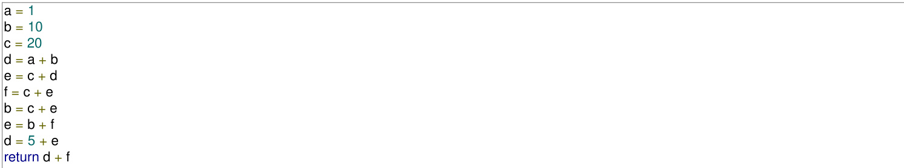

Assuming that all operations take their operands from registers, what is the minimum number of registers needed to execute this program without spilling?

A. B. C. D. 6

gatecse-2010 compiler-design register-allocation normal

# Answer key☟

Consider evaluating the following expression tree on a machine with load-store architecture in which memory can be accessed only through load and store instructions. The variables $a , b , c , d ,$ and $e$ are initially stored in memory. The binary operators used in this expression tree can be evaluated by the machine only when operands are in registers. The instructions produce result only in a register. If no intermediate results can be stored in memory, what is the minimum number of registers needed to evaluate this expression?

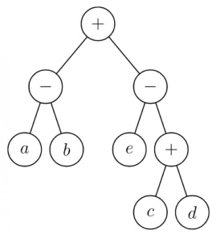

A. B. 9 C. D.

gatecse-2011 compiler-design register-allocation normal

else { ${ \mathsf { d } } = { \mathsf { d } } ^ { * } { \mathsf { d } }$ $\boldsymbol { \mathsf { e } } = \boldsymbol { \mathsf { e } } ^ { \ast } \boldsymbol { \mathsf { e } }$

Q.48 Suppose the instruction set architecture of the processor has only two registers. The only allowed compiler optimization is code motion, which moves statements from one place to another while preserving correctness. What is the minimum number of spills to memory in the compiled code?

A. 0 B. 1 C. 2 D. 3

gatecse-2013 normal compiler-design register-allocation

# 2.23.6 Register Allocation: GATE CSE 2017 Set 1 Question: 52

Consider the expression $( a - 1 ) * ( ( ( b + c ) / 3 ) + d )$ . Let $X$ be the minimum number of registers required by an optimal code generation (without any register spill) algorithm for a load/store architecture, in which

A. only load and store instructions can have memory operands and B. arithmetic instructions can have only register or immediate operands.

​The value of $X$ is

gatecse-2017-set1 compiler-design register-allocation normal numerical-answers

# Answer key☟

# 2.24

# Runtime Environment (22)

✍ Practice Tests: Test 1 (15Q) Test 2 (2Q)

# 2.24.1 Runtime Environment: GATE CSE 1988 Question: 2xii

Consider the following program skeleton and below figure which shows activation records of procedures involved in the calling sequence.

$$
p \to s \to q \to r \to q .
$$

Write the access links of the activation records to enable correct access and variables in the procedures from other procedures involved in the calling sequence

→Aces link (a,I) →a.I   
：   
司 →a，I   
$\mathrm { ~ r ~ }$ →a,I   
$^ { \mathrm { q } }$ →

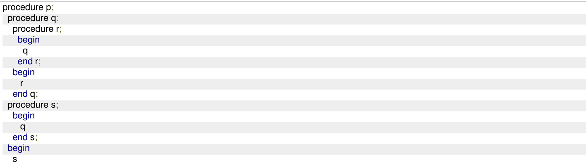

Will recursion work correctly in a language with static allocation of all variables? Explain.

gate1989 descriptive compiler-design runtime-environment

Indicate the result of the following program if the language uses (i) static scope rules and (ii) dynamic scope rules.

var x, y:integer; procedure A (var z:integer); var x:integer; begin $\ x : = 1$ ; B; $\scriptstyle z : = x$ end; procedure B; begin $\mathbf { \boldsymbol { x } } : = \mathbf { \boldsymbol { x } } + 1$ end; begin $x : = 5$ ; A(y); write (y) ...end.

gate1989 descriptive compiler-design runtime-environment

Match the pairs in the following questions:

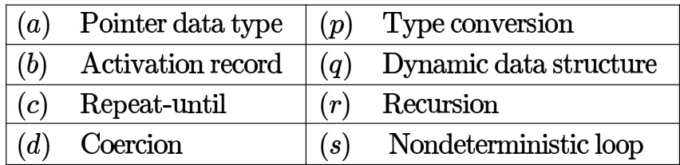

State whether the following statements are TRUE or FALSE with reason:

The Link-load-and-go loading scheme required less storage space than the link-and-go loading scheme.

gate1990 true-false compiler-design runtime-environment

A linker is given object modules for a set of programs that were compiled separately. What information need not be included in an object module?

A. Object code   
B. Relocation bits   
C. Names and locations of all external symbols defined in the object module   
D. Absolute addresses of internal symbols

gate1995 compiler-design runtime-environment normal

The correct matching for the following pairs is

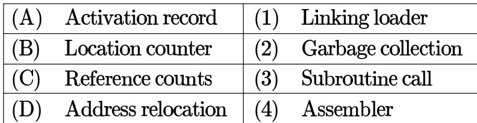

A. A-3 B-4 C-1D-2 B. A-4B-3 C-1D-2 C. A-4 B-3 C-2 D-1 D. A-3 B-4 C-2 D-1

gate1996 compiler-design easy runtime-environment

# Answer key ☟

Heap allocation is required for languages.

A. that support recursion B. that support dynamic data structure C. that use dynamic scope rules D. None of the above

gate1997 compiler-design easy runtime-environment

# Answer key☟

# 2.24.10 Runtime Environment: GATE CSE 1997 Question: 1.8

A language $L$ allows declaration of arrays whose sizes are not known during compilation. It is required to make efficient use of memory. Which one of the following is true?

A. A compiler using static memory allocation can be written for $L$ B. A compiler cannot be written for $L$ ; an interpreter must be used C. A compiler using dynamic memory allocation can be written for $L$ D. None of the above

gate1997 compiler-design easy runtime-environment

# 2.24.11 Runtime Environment: GATE CSE 1998 Question: 1.25, ISRO2008-41

In a resident – OS computer, which of the following systems must reside in the main memory under all situations?

A. Assembler B. Linker C. Loader D. Compiler

A linker reads four modules whose lengths are and words, respectively. If they are loaded in that order, what are the relocation constants?

A. 0,200,500,600 B. 0,200,1000,1600   
C. 200,500,600,800 D. 200,700,1300,2100

gate1998 compiler-design runtime-environment normal

Faster access to non-local variables is achieved using an array of pointers to activation records called a

A. stack B. heap C. display D. activation tree

gate1998 programming compiler-design normal runtime-environment

The process of assigning load addresses to the various parts of the program and adjusting the code and the data in the program to reflect the assigned addresses is called

A. Assembly B. parsing C. Relocation D. Symbol resolution

gatecse-2001 compiler-design runtime-environment easy

Dynamic linking can cause security concerns because

A. Security is dynamic   
B. The path for searching dynamic libraries is not known till runtime C. Linking is insecure   
D. Cryptographic procedures are not available for dynamic linking

gatecse-2002 compiler-design runtime-environment easy

Which of the following are true?

I. A programming language which does not permit global variables of any kind and has no nesting of procedures/functions, but permits recursion can be implemented with static storage allocation   
II. Multi-level access link (or display) arrangement is needed to arrange activation records only if the programming language being implemented has nesting o procedures/functions   
III. Recursion in programming languages cannot be implemented with dynamic storage allocation   
IV. Nesting procedures/functions and recursion require a dynamic heap allocation scheme and cannot be implemented with a stack-based allocation scheme for activation records   
V. Programming languages which permit a function to return a function as its result cannot be implemented with a stack-based storage allocation scheme for activation records

A. II and V only B. I, III and IV only C. I, II and V only D. II, III and V only

Which languages necessarily need heap allocation in the runtime environment?

A. Those that support recursion. B. Those that use dynamic scoping.   
C. Those that allow dynamic data D. Those that use global variables.

# 2.24.18 Runtime Environment: GATE CSE 2012 Question: 36

Consider the program given below, in a block-structured pseudo-language with lexical scoping and nesting of procedures permitted.

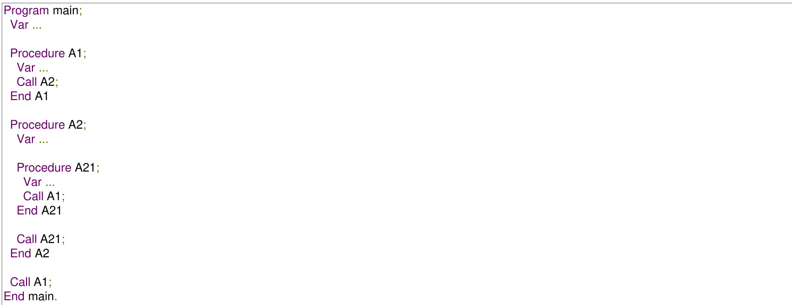

Consider the calling chain Mai $\mathrm { 1 }  \mathrm { A 1 }  \mathrm { A 2 }  \mathrm { A 2 1 }  \mathrm { A 1 }$

The correct set of activation records along with their access links is given by:

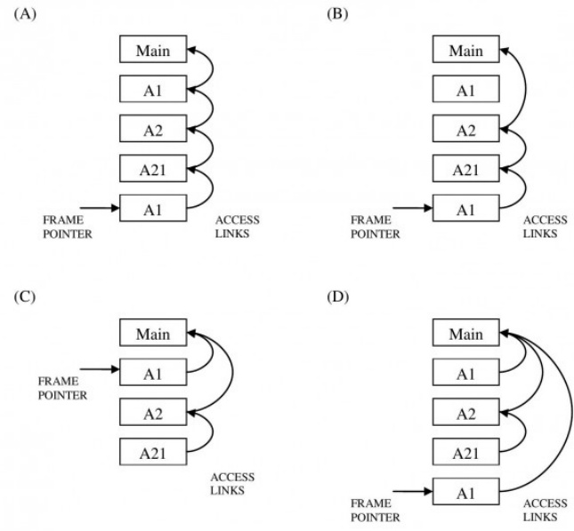

Which of the following statements are CORRECT?

1. Static allocation of all data areas by a compiler makes it impossible to implement recursion.   
2. Automatic garbage collection is essential to implement recursion.   
3. Dynamic allocation of activation records is essential to implement recursion.   
4. Both heap and stack are essential to implement recursion.

A. 1 and  only B. and  only C. and only D. 1 and  only

gatecse-2014-set3 compiler-design runtime-environment normal

# 2.24.21 Runtime Environment: GATE CSE 2021 Set 1 Question: 4

Consider the following statements.

$S _ { 1 }$ The sequence of procedure calls corresponds to a preorder traversal of the activation tree.   
$S _ { 2 }$ ： The sequence of procedure returns corresponds to a postorder traversal of the activation tree.

Which one of the following options is correct?

A. $S _ { 1 }$ is true and $S _ { 2 }$ is false B. $S _ { 1 }$ is false and $S _ { 2 }$ is true C. $S _ { 1 }$ is true and $S _ { 2 }$ is true D. $S _ { 1 }$ is false and $S _ { 2 }$ is false

gatecse-2021-set1 runtime-environment normal one-mark

# Consider the following program:

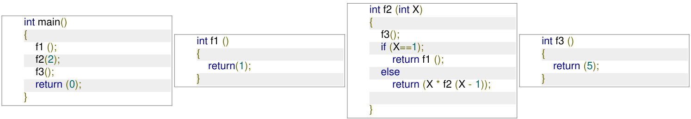

Which one of the following options represents the activation tree corresponding to the main function?

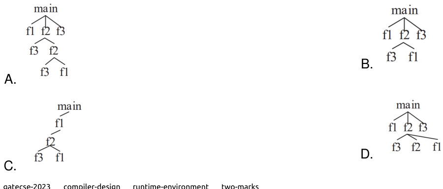

# Answer key☟

# The least number of temporary variables required to create a three-address code in static single assignment form for the expression $q + r / 3 + s - t * 5 + u * v / w$ is

gatecse-2015-set1 compiler-design intermediate-code normal numerical-answers static-single-assignment

Consider the following code segment.

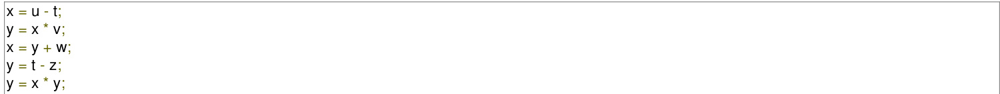

The minimum number of total variables required to convert the above code segment to static single assignment form is

gatecse-2016-set1 compile r-design static-single-assignment normal numerical-answers

Consider the following intermediate program in three address code

p = a - b q = p \* c p = u \* v q = p + q

# Which one of the following corresponds to a static single assignment form of the above code?

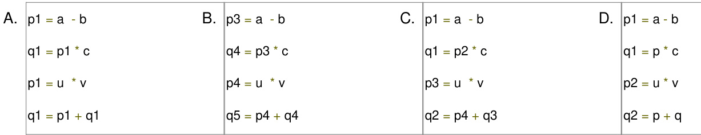

gatecse-2017-set1 compiler-design intermediate-code normal static-single-assignment

Answer key☟

Which ONE of the following statements is FALSE regarding the symbol table?

A. Symbol table is responsible for keeping track of the scope of variables.   
B. Symbol table can be implemented using a binary search tree.   
C. Symbol table is not required after the parsing phase.   
D. Symbol table is created during the lexical analysis phase.

gatecse2025-set1 compiler-design symbol-table easy one-mark

Write syntax directed definitions (semantic rules) for the following grammar to add the type of each identifier to its entry in the symbol table during semantic analysis. Rewriting the grammar is not permitted and semantic rules are to be added to the ends of productions only.

$$
\begin{array} { l } { { \langle { D \to T L } ; } } \\ { { \left. { T \to \mathrm { i n t } } \right. } } \\ { { \left. { T \to \mathrm { r e a l } } \right. } } \\ { { \left. { L \to L } , i d \right. } } \\ { { \left. { L \to i d } \right. } } \end{array}
$$

gate1992 compiler-design syntax-directed-translation normal descriptive

A shift reduce parser carries out the actions specified within braces immediately after reducing with the corresponding rule of grammar

$$
\begin{array} { l } { { \cdot S \right. x x W \left\{ \mathrm { p r i n t ^ { \left. \right\} T ^ { \backslash } } } } } \\ { { \cdot S \right. y \left\{ \mathrm { p r i n t ^ { \left. \right\} 2 ^ { \gg } } } } } \\ { { \cdot W \right. S z \left\{ \mathrm { p r i n t ^ { \left. \right\} 3 ^ { \gg } } } } } \end{array}
$$

What is the translation of  using the syntax directed translation scheme described by the above rules?

A. 23131 B. 11233 C. 11231 D. 33211

gate1995 compiler-design grammar syntax-directed-translation normal

# 2.27.3 Syntax Directed Translation: GATE CSE 1996 Question: 20

Consider the syntax-directed translation schema (SDTS) shown below:

· $E  E + E$ {print $^ { * } + \prime 3$ $E \to E * E$ {print “. $\ " \}$ · $E \to i d$ {print id.name}： $E \to ( E )$

An LR-parser executes the actions associated with the productions immediately after a reduction by the corresponding production. Draw the parse tree and write the translation for the sentence.

$( a + b ) * ( c + d )$ , using SDTS given above.

gate1996 compiler-design syntax-directed-translation normal descriptive

Consider the syntax directed translation scheme given in the following. Assume attribute evaluation with bottom-up parsing, i.e., attributes are evaluated immediately after a reduction.

$$
\begin{array} { r l r l } & { \bullet E  E _ { 1 } \ast T } & & { \{ E . v a l = E _ { 1 } . v a l \ast T . v a l \} } \\ & { \bullet E  T } & & { \{ E . v a l = T . v a l \} } \\ & { \bullet T  F - T _ { 1 } } & & { \{ T . v a l = F . v a l - T _ { 1 } . v a l \} } \\ & { \bullet T  F } & & { \{ T . v a l = F . v a l \} } \\ & { \bullet F  2 } & & { \{ F . v a l = 2 \} } \\ & { \bullet F  4 } & & { \{ F . v a l = 4 \} } \end{array}
$$

A. Using this  construct a parse tree for the expression $4 - 2 - 4 * 2$ and also compute its $E$ . B. It is required to compute the total number of reductions performed to parse a given input. Using synthesized attributes only, modify the given, without changing the grammar, to find $E$ , the number of reductions performed while reducing an input to $E$ .

The syntax of the repeat-until statement is given by the following grammar

$$
S \to \mathrm { r e p e a t } S _ { 1 } \mathrm { u n t i l } E
$$

where E stands for expressions, $\boldsymbol { S }$ and $S _ { 1 }$ stand for statements. The non-terminals $\boldsymbol { S }$ and $S _ { 1 }$ have an attribute code that represents generated code. The non-terminal E has two attributes. The attribute code represents generated code to evaluate the expression and store its value in a distinct variable, and the attribute varName contains the name of the variable in which the truth value is stored. The truth-value stored in the variable is 1 if E is true, 0 if E is false.

Give a syntax-directed definition to generate three-address code for the repeat-until statement. Assume that you can call a function newlabel() that returns a distinct label for a statement. Use the operator $\ " \}$ to concatenate two strings and the function gen(s) to generate a line containing the string s.

gatecse-2001 compiler-design syntax-directed-translation normal descriptive

In a bottom-up evaluation of a syntax directed definition, inherited attributes can

A. always be evaluated   
B. be evaluated only if the definition is L-attributed   
C. be evaluated only if the definition has synthesized attributes   
D. never be evaluated

Here,  is a function that generates the output code, and  is a function that returns the name of a new temporary variable on every call. Assume that $t _ { i } ^ { \prime } \mathsf { s }$ are the temporary variable names generated by . For the statement $^ { \ell } X : = Y + \dot { Z } ^ { \ell }$ ， the -address code sequence generated by this definition is

A. $X = Y + Z$ $\begin{array} { r l } & { \mathsf { B . ~ } t _ { 1 } = Y + Z ; X = t _ { 1 } } \\ & { \mathsf { D . ~ } t _ { 1 } = Y ; t _ { 2 } = Z ; t _ { 3 } = t _ { 1 } + t _ { 2 } ; X = t _ { 3 } } \end{array}$   
C. $t _ { 1 } = Y ; t _ { 2 } = t _ { 1 } + Z ; X = t _ { 2 }$

gatecse-2003 compiler-design syntax-directed-translation normal

# Answer key☟

Consider the grammar with the following translation rules and $E$ as the start symbol

$$
\begin{array} { r l r l } & { E  E _ { 1 } \# T } & & { \{ E . v a l u e = E _ { 1 } . v a l u e \ast T . v a l u e \} } \\ & { \quad | T } & & { \{ E . v a l u e = T . v a l u e \} } \\ & { T  T _ { 1 } \& F } & & { \{ T . v a l u e = T _ { 1 } . v a l u e + F . v a l u e \} } \\ & { \quad | F } & & { \{ T . v a l u e = F . v a l u e \} } \\ & { F  \mathrm { n u m } } & & { \{ F . v a l u e = n u m . v a l u e \} } \end{array}
$$

Compute E.value for the root of the parse tree for the expression: #  &  #  &

A. 200 B. 180 C. 160 D. 40

gatecse-2004 compiler-design grammar normal syntax-directed-translation

# Answer key☟

Consider the following Syntax Directed Translation Scheme , with non-terminals $\{ S , A \}$ and terminals $\{ a , b \}$ .

$$
\begin{array} { l c r } { { S  a A ~ \mathrm { \{ p r i n t 1 \} } } } \\ { { S  a ~ \mathrm { \{ p r i n t 2 \} } } } \\ { { A  S b ~ \mathrm { \{ p r i n t 3 \} } } } \end{array}
$$

Using the above $s D T S$ the output printed by a bottom-up parser, for the input  is:

A. 132 B. C. 231 D. syntax error

Consider the following grammar and the semantic actions to support the inherited type declaration attributes. Let $X _ { 1 } , X _ { 2 } , X _ { 3 } , X _ { 4 } , \bar { X } _ { 5 }$ , and $X _ { 6 }$ be the placeholders for the non-terminals $_ { D , T , L }$ or $L _ { 1 }$ in the following table:

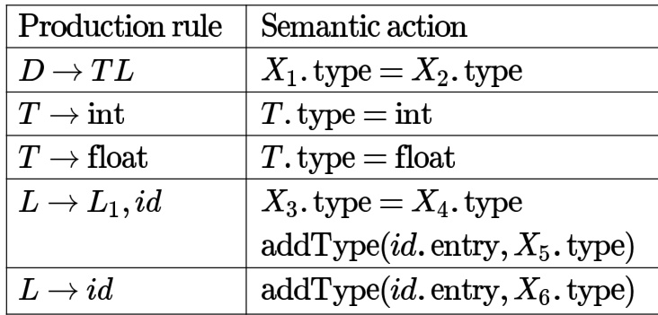

Which one of the following are appropriate choices for $X _ { 1 } , X _ { 2 } , X _ { 3 }$ and $X _ { 4 }$ ?

A. $X _ { 1 } = L$ ， $X _ { 2 } = T$ ， $X _ { 3 } = L _ { 1 }$ ， $X _ { 4 } = L$

B. $X _ { 1 } = T$ ， $X _ { 2 } = L$ ， $X _ { 3 } = L _ { 1 }$ ， $X _ { 4 } = T$ C. $X _ { 1 } = L$ ， $X _ { 2 } = L$ ， $X _ { 3 } = L _ { 1 }$ ， $X _ { 4 } = T$ D. $X _ { 1 } = T$ ， $X _ { 2 } = L$ ， $X _ { 3 } = T$ ， $X _ { 4 } = L _ { 1 }$

Consider the productions $A \to P Q$ and $A \to X Y$ . Each of the five non-terminals $A , P , Q , X$ and $Y$ has two attributes: $\pmb { s }$ is a synthesized attribute, and $\textit { i }$ is an inherited attribute. Consider the following rules.

Rule $1 : P . i = A . i + 2 , Q . i = P . i + A . i ;$ and $A . s = P . s + Q . { \mathrm { ~ } }$ S Rule $2 : X . i = A . i + Y$ and $Y . i = X . s + A . i$

Which one of the following is TRUE?

A. Both Rule and Rule are $L$ - B. Only Rule is $L$ -attributed. attributed. C. Only Rule is $L$ -attributed. D. Neither Rule nor Rule is $L$ - attributed.

Consider the following grammar (that admits a series of declarations, followed by expressions) and the associated syntax directed translation actions, given as pseudo-code

$$
\begin{array} { r l } { P } & {  \phantom { \frac { 1 } { 2 } } D ^ { * } E ^ { * } } \\ { D } & {  \phantom { \frac { 1 } { 2 } } \mathrm { i n t } \mathrm { I D } \{ \mathrm { r e c o r d ~ t h a t ~ } \mathrm { I D . l e x e m e ~ i s ~ o f ~ t y p e ~ i n t } \} } \\ { D } & {  \phantom { \frac { 1 } { 2 } } \mathrm { b o o l } \mathrm { I D } \{ \mathrm { r e c o r d ~ t h a t ~ } \mathrm { I D . l e x e m e ~ i s ~ o f ~ t y p e ~ b o o l } \} } \\ { E } & {  \phantom { \frac { 1 } { 2 } } E _ { 1 } + E _ { 2 } \{ \mathrm { c h e c k ~ t h a t ~ } E _ { 1 } . \mathrm { t y p e } = E _ { 2 } . \mathrm { t y p e } = \mathrm { i n t } ; \mathrm { s e t } \ E . \mathrm { t y p e } \ : = \mathrm { i n t } \} } \\ { E } & {  \phantom { \frac { 1 } { 2 } } \mathrm { 1 } E _ { 1 } \{ \mathrm { c h e c k ~ t h a t ~ } E _ { 1 } . \mathrm { t y p e } = \mathrm { b o o l } ; \mathrm { ~ s e t } E . \mathrm { t y p e } : = \mathrm { b o o l } \} } \\ { E } & {  \phantom { \frac { 1 } { 2 } } \mathrm { I D } \{ \mathrm { s e t } E . \mathrm { t y p e } \ : = \mathrm { i n t } \} } \end{array}
$$

With respect to the above grammar, which one of the following choices is correct?

A. The actions can be used to correctly type-check any syntactically correct program   
B. The actions can be used to type-check syntactically correct integer variable declarations and integer expressions   
C. The actions can be used to type-check syntactically correct boolean variable declarations and boolean expressions.   
D. The actions will lead to an infinite loop

Here and $\%$ are operators and  is a token that represents an integer and $\mathrm { \bullet \mathbf { v a l } }$ represents the corresponding integer value. The set of non-terminals is $\{ \mathsf { S } , \mathrm { T } , \mathrm { R } , \mathrm { P } \}$ and a subscripted non-terminal indicates an instance of the non-terminal.

Using this translation scheme, the computed value of $S _ { \mathrm { \cdot v a l } }$ for root of the parse tree for the expression $2 0 \# 1 0 \% 5 \# 8 \% 2 \% 2$ is

Consider the syntax directed translation given by the following grammar and semantic rules. Here $N , I , F$ and $B$ are non-terminals. $N$ is the starting non-terminal, and  and are lexical tokens corresponding to input letters $^ { 6 6 } \# ^ { 3 9 }$ $^ { 6 6 } 0 ^ { 9 }$ and $^ { 6 6 } 1 ^ { , 9 }$ ， respectively. $X$ denotes the synthesized attribute (a numeric value) associated with a non-terminal $X$ . $I _ { 1 }$ and $F _ { 1 }$ denote occurrences of $\boldsymbol { \mathit { I } }$ and $F$ on the right hand side of a production, respectively. For the tokens and $\mathbf { 1 } , \mathbf { 0 } . v a l = 0$ and $v a l = 1$ .

$$
{ \begin{array} { r l } { N  I \# F } & { N . v a l = I . v a l + F . v a l } \\ { I  I _ { 1 } B } & { I . v a l = ( 2 I _ { 1 } . v a l ) + B . v a l } \\ { I  B } & { I . v a l = { \mathbf { B } } . \mathbf { v a l } } \\ { F  B F _ { 1 } } & { F . v a l = { \frac { 1 } { 2 } } ( B . v a l + F _ { 1 } . v a l ) } \\ { F  B } & { { \mathrm { ~ F . v a l ~ } } = { \frac { 1 } { 2 } } B . v a l } \\ { B  \mathbf { 0 } } & { B . v a l = \mathbf { 0 } . v a l } \\ { B  \mathbf { 1 } } & { B . v a l = \mathbf { 1 } . v a l } \end{array} }
$$

The value computed by the translation scheme for the input string is (Rounded off to three decimal places)

​Consider the following syntax-directed definition (SDD).

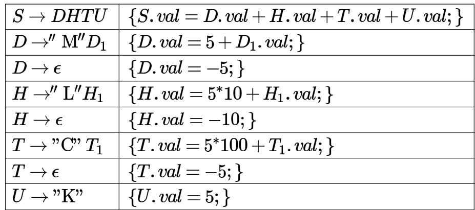

Given as the input, which one of the following options is the value computed by the (in the attribute $\boldsymbol { S . v a l } )$ ?

A. B. C. 55 D. 65 ​Which of the following statements is/are FALSE?

A. An attribute grammar is a syntax-directed definition  in which the functions in the semantic rules have no side effects B. The attributes in a -attributed definition cannot always be evaluated in a depth-first order C. Synthesized attributes can be evaluated by a bottom-up parser as the input is parsed D. All -attributed definitions based on  grammar can be evaluated using a bottom-up parsing strategy

​Given the following syntax directed translation rules:

$$
\begin{array} { r l } & { 1 { : } R  A B \{ B . i = R . i - 1 ; A . i = B . i ; R . i = A . i + 1 ; \} } \\ & { 2 { : } P  C D \{ P . i = C . i + D . i ; D . i = C . i + 2 ; \} } \\ & { 3 { : } Q  E F \{ Q . i = E . i + F . i ; \} } \end{array}
$$

Which ONE is the CORRECT option among the following?

A. Rule is $\boldsymbol { S }$ -attributed and $L$ -attributed; Rule is $\boldsymbol { S }$ -attributed and not $L$ -attributed; Rule is neither $\boldsymbol { S }$ - attributed nor $L$ -attributed.   
B. Rule is neither $\boldsymbol { S }$ -attributed not $L$ -attributed; Rule is $\boldsymbol { S }$ -attributed and $L$ -attributed; Rule is $\boldsymbol { S }$ -attributed and $L$ -attributed.   
C. Rule is neither $\boldsymbol { S }$ -attributed nor $L$ -attributed; Rule  is not $\boldsymbol { S }$ -attributed and is $L$ -attributed; Rule is $\boldsymbol { S }$ - attributed and $L$ -attributed.   
D. Rule 1 is $\boldsymbol { S }$ -attributed and not $L$ -attributed; Rule  is not $\boldsymbol { S }$ -attributed and is $L$ -attributed; Rule  is $\boldsymbol { S }$ -attributed and $L$ -attributed.

​Consider the following two syntax-directed definitions and  for type declarations.

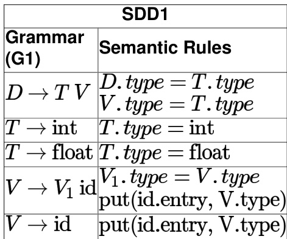

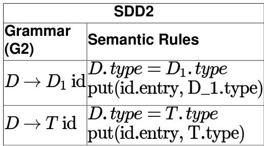

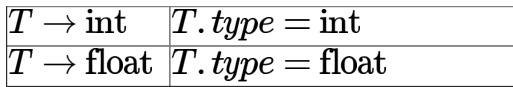

$D$ is the start symbol, and int, float and id are the three terminals. The non-terminal $V _ { 1 }$ is the same as $V$ and the non-terminal $D _ { 1 }$ is the same as $D$ . Here, the subscript is used to differentiate the grammar symbols on the two sides of a production. The function put updates the symbol table with the type information for an identifier.

Let $\mathrm { \bf P }$ and $\mathbf { Q }$ be the languages specified by grammars  and , respectively. Which of the following statements is/are true?

A. The languages $\mathrm { \bf P }$ and $\mathbf { Q }$ are the same   
B. is -attributed and contains only synthesized attributes   
C. SDD1 is -attributed and contains only inherited attributes   
D. The specifications of and are such that the same entries get added to the symbol table

Study the following program written in a block-structured language:

Var x, y:interger;   
procedure P(n:interger);   
begin $\scriptstyle x : = ( n + 2 ) / ( n - 3 )$ ;   
end;   
procedure Q   
Var x, y:interger;   
begin $\ x : = 3$ ; $y : = 4$ ; P(y); Write(x) __(1)   
end;   
begin $x : = 7$ ; $y : = 8$ ; Q;   
Write(x); __(2)   
end.

What will be printed by the write statements marked and in the program if the variables are statically scoped?

A. B. 6,7 C. 3,7 D. None of the above.

P(y); Write(x); (1) end; begin $x : = 7$ ; $y : = 8 :$ Q; Write(x); __(2) end.

A. B. 6,7 C. D. None of the above

gate1987 compiler-design variable-scope runtime-environment

# Answer key☟

Which one of the following is TRUE at any valid state in shift-reduce parsing?

A. Viable prefixes appear only at the bottom of the stack and not inside   
B. Viable prefixes appear only at the top of the stack and not inside   
C. The stack contains only a set of viable prefixes   
D. The stack never contains viable prefixes

gatecse-2015-set1 compiler-design parsing normal viable-prefix lr-parser

# Answer Keys

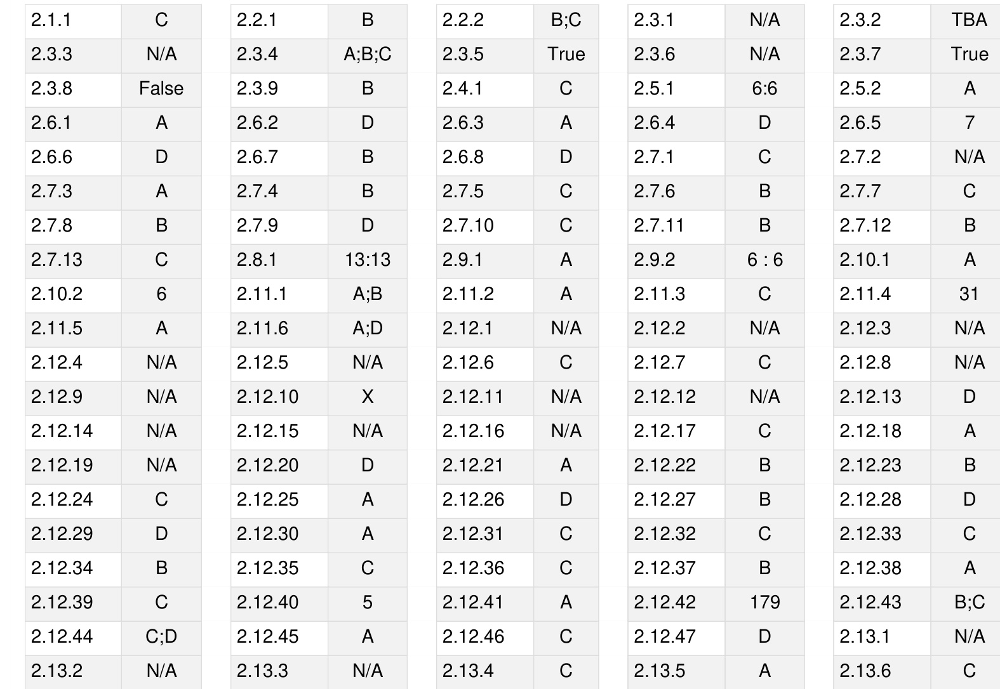

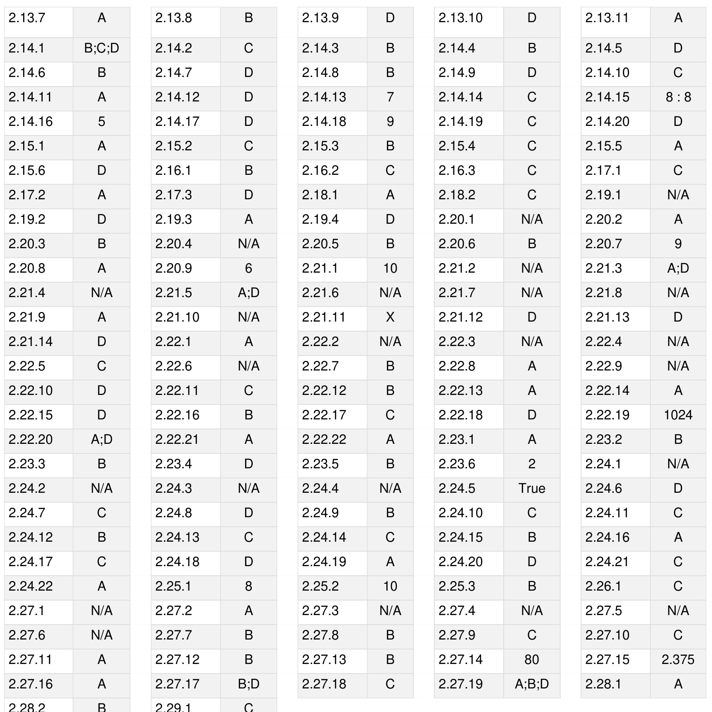

# Webpage

Stacks, Queues, Linked lists, Trees, Binary search trees, Binary heaps, Graphs.

Mark Distribution in Previous GATE   
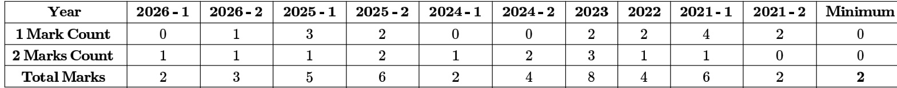

Welcome to the "Programming and Data Structures: Data Structures" chapter, a cornerstone of the GATE Computer Science syllabus. This subject is fundamental to understanding how data is organized, stored, and manipulated efficiently, which is crucial for designing optimal algorithms and software systems. For GATE CS, Data Structures typically carries a significant weightage, often contributing 8-12 marks, sometimes more, through a mix of Multiple Choice Questions (MCQs) and Numerical Answer Type (NAT) questions. Questions frequently test your understanding of core concepts, time and space complexity analysis of operations, properties of various data structures, and their applications in problem-solving. Expect problems involving tracing operations on specific data structures like AVL trees or heaps, analyzing the complexity of given code snippets, or determining the output of tree traversals.

# Topic-wise Key Concepts

# AVL Tree

An AVL tree is a self-balancing Binary Search Tree (BST) where the difference between the heights of the left and right subtrees for any node is at most 1. This strict balance ensures that the tree remains relatively balanced, preventing worst-case scenarios of skewed BSTs.

Balance Factor: For any node $N$ ,   
BalanceFactor $\cdot ( N ) = H e i g h t ( R i g h t S u b t r e e ( N ) ) - H e i g h t ( L e f t S u b t r e e ( N ) )$ . In an AVL tree,   
BalanceFactor $\mathbf { \chi } ( N ) \in \{ - 1 , 0 , 1 \}$ .   
Rotations: When an insertion or deletion causes a node to become unbalanced (balance factor becomes $\pm 2$ ),   
rotations are performed to restore balance. There are four types of rotations:   
1. LL Rotation (Left-Left): Occurs when an insertion into the left subtree of the left child causes imbalance. A single right rotation is performed.   
2. RR Rotation (Right-Right): Occurs when an insertion into the right subtree of the right child causes imbalance. A single left rotation is performed.   
3. LR Rotation (Left-Right): Occurs when an insertion into the right subtree of the left child causes imbalance. A left rotation on the child, followed by a right rotation on the parent.   
4. RL Rotation (Right-Left): Occurs when an insertion into the left subtree of the right child causes imbalance. A right rotation on the child, followed by a left rotation on the parent.   
Height of an AVL Tree: For an AVL tree with $\scriptstyle n$ nodes, its height $h$ is always $O ( \log n )$ . Specifically,   
$h < 1 . 4 4 \log _ { 2 } ( n + 2 )$ .   
Time Complexity: Insertion, deletion, and search operations all take $O ( \log n )$ time in the worst case due to the   
balanced nature.

Common Pitfalls: Incorrectly identifying the type of rotation needed, especially for LR and RL cases. Forgetting to update heights and balance factors after rotations. Tracing rotations correctly requires careful step-by-step analysis.

Problem-Solving Techniques: Practice tracing insertions/deletions and the subsequent rotations on small example AVL trees. Understand the pivot node and the child involved in the imbalance.

# Abstract Data Type (ADT)

An Abstract Data Type (ADT) is a mathematical model for data types, defining the data stored and the operations that can be performed on it, without specifying how these operations are implemented. It focuses on "what" an operation does rather than "how" it does it.

Abstraction: Hides the internal implementation details from the user. 。 Encapsulation: Bundles data and methods that operate on the data into a single unit. Examples: Stack, Queue, List, Priority Queue, Map, Set are all ADTs. A data structure (e.g., array, linked list) is a

concrete implementation of an ADT.

Common Pitfalls: Confusing an ADT with a data structure. An ADT is a logical concept, while a data structure is a physical implementation.

Problem-Solving Techniques: Identify the core operations and their logical behavior when asked to define or recognize an ADT.

# Array

An array is a collection of elements of the same data type, stored in contiguous memory locations. Elements are accessed using an integer index.

Address Calculation (1D Array): For an array $A$ starting at , with elements of size $\boldsymbol { S }$ , and lower bound $L _ { 0 }$ :

$$
A d d r e s s ( A [ i ] ) = B a s e A d d r e s s + ( i - L _ { 0 } ) \times S
$$

If $L _ { 0 } = 0$ , then $A d d r e s s ( A [ i ] ) = B a s e A d d r e s s + i \times S .$

Address Calculation (2D Array Row-Major Order): For an array $\boldsymbol { A } [ R ] [ \boldsymbol { C } ]$ (R rows, C columns), starting at , with element size $\boldsymbol { S }$ , and lower bounds $L _ { r o w } , L _ { c o l }$ :

$$
A d d r e s s ( A [ i ] [ j ] ) = B a s e A d d r e s s + ( ( i - L _ { r o w } ) \times C + ( j - L _ { c o l } ) ) \times S
$$

If $L _ { r o w } = 0 , L _ { c o l } = 0$ , then $A d d r e s s ( A [ i ] [ j ] ) = B a s e A d d r e s s + ( i \times C + j ) \times S .$

Address Calculation (2D Array Column-Major Order): For an array $A [ R ] [ C ]$ , starting at BaseAddress, with element size $\boldsymbol { S }$ , and lower bounds $L _ { r o w } , L _ { c o l }$

$$
\begin{array} { r l } & { \mathrm { \it ~ A d d r e s s } ( A [ i ] [ j ] ) = B a s e A d d r e s s + ( ( j - L _ { c o l } ) \times R + ( i - L _ { r o w } ) ) \times S } \\ & { = \mathrm { \it ~ \sum ~ t h e n ~ A d d r e s s } ( A [ i ] [ j ] ) = B a s e A d d r e s s + ( j \times R + i ) \times S . } \end{array}
$$

If $L _ { r o w } = 0 , L _ { c o l } = 0$

# Time Complexity:

Accessing an element: $O ( 1 )$   
Insertion/Deletion at end: $\dot { O } ( 1 )$ (if space available)   
Insertion/Deletion at beginning/middle: $O ( n )$ (requires shifting elements)

Common Pitfalls: Off-by-one errors in index calculations, especially with non-zero lower bounds. Confusing row-major with column-major order.

Problem-Solving Techniques: Carefully apply the address calculation formulas. Understand the memory layout for multi-dimensional arrays.

# Binary Heap

A binary heap is a complete binary tree that satisfies the heap property: for a min-heap, every parent node's value is less than or equal to its children's values; for a max-heap, every parent node's value is greater than or equal to its children's values. Heaps are typically implemented using an array.

# Array Representation (0-indexed):

0 Parent of node at index $_ i$ :x $\lfloor ( i - 1 ) / 2 \rfloor$ 。 Left child of node at inde : $\mathbf { \dot { 2 } } i + \mathbf { \dot { 1 } }$ 。 Right child of node at index $i \colon 2 i + 2$

Heap Properties: 0 Completeness: All levels are completely filled except possibly the last level, which is filled from left to right. 。 Heap Property: (Min-heap or Max-heap)

Time Complexity: Insert: $O ( \log n )$ (heapify-up) Delete-min/max (extract-root): $O ( \log n )$ (heapify-down) 。 Build Heap from an array of $n$ elements: $O ( n )$ Search: $O ( n )$ (Heaps are not designed for efficient search of arbitrary elements)

Common Pitfalls: Violating the completeness property. Incorrectly applying heapify-up or heapify-down logic.   
Confusing min-heap and max-heap properties.

Problem-Solving Techniques: Trace heap operations (insert, delete) step-by-step. For building a heap, start from the last non-leaf node and perform heapify-down upwards.

# Binary Search Tree (BST)

A Binary Search Tree (BST) is a binary tree where for every node, all values in its left subtree are less than the node's value, and all values in its right subtree are greater than the node's value. Duplicate values are typically not allowed or handled specifically (e.g., placed in the right subtree).

# BST Properties:

。 Left subtree values $<$ Root value   
。 Right subtree values $>$ Root value   
。 Both left and right subtrees are also BSTs.   
。 Inorder traversal of a BST yields elements in sorted order.

Time Complexity (Average Case): Search, Insertion, Deletion: $O ( \log n )$

Time Complexity (Worst Case Skewed Tree): Search, Insertion, Deletion: $O ( n )$ (occurs when elements are inserted in sorted or reverse-sorted order, leading to a linked list-like structure)

# Deletion Cases:

1. Node to be deleted is a leaf: Simply remove it.   
2. Node has one child: Replace the node with its child.   
3. Node has two children: Replace the node's value with its inorder predecessor (largest in left subtree) or inorder successor (smallest in right subtree), then delete the predecessor/successor node (which will have 0 or 1 child).

Common Pitfalls: Forgetting the worst-case $O ( n )$ complexity for skewed trees. Incorrectly handling deletion of nodes with two children. Not understanding that inorder traversal is key to sorted output.

Problem-Solving Techniques: Practice constructing BSTs and performing deletions. Understand the recursive nature of BST operations.

# Binary Tree

A binary tree is a tree data structure in which each node has at most two children, referred to as the left child and the right child.

Key Properties:

。 Full Binary Tree: Every node has either 0 or 2 children.   
Complete Binary Tree: All levels are completely filled except possibly the last level, which is filled from left to right.   
。 Perfect Binary Tree: All internal nodes have two children, and all leaf nodes are at the same level. (A perfect binary tree is always full and complete).   
Skewed Binary Tree: All nodes have only one child (either left or right), resembling a linked list.

# Formulas:

Maximum number of nodes at level $k$ (root at level 0): $2 ^ { k }$ Maximum number of nodes in a binary tree of height $h$ (max levels $h + 1$ ): $2 ^ { h + 1 } - 1$ Minimum height of a binary tree with $\scriptstyle n$ nodes: $\lceil \log _ { 2 } ( n + 1 ) \rceil - 1$ or $\lfloor \log _ { 2 } n \rfloor$ (for complete binary tree) 。 Number of leaf nodes $L$ and internal nodes $\boldsymbol { \mathit { I } }$ in a full binary tree: $L = I + 1$

Common Pitfalls: Confusing the definitions of full, complete, and perfect binary trees. Miscalculating height or number of nodes.

Problem-Solving Techniques: Draw examples to visualize properties. Apply formulas carefully based on the definition of the tree type.

# Data Structures

Data structures are specialized formats for organizing and storing data in a computer so that it can be accessed and modified efficiently. They provide a means to manage large amounts of data effectively for various applications.

Classification: Primitive vs. Non-Primitive: Primitive (int, char, float), Non-Primitive (Arrays, Linked Lists, Trees, Graphs). Linear vs. Non-Linear: Linear (Arrays, Linked Lists, Stacks, Queues), Non-Linear (Trees, Graphs).

。 Static vs. Dynamic: Static (fixed size at compile time, e.g., arrays), Dynamic (size can change at runtime, e.g., linked lists).

Importance: Choosing the right data structure is critical for optimal algorithm performance (time and space complexity).

Common Pitfalls: Not understanding the trade-offs between different data structures (e.g., array vs. linked list for insertion/deletion).

Problem-Solving Techniques: Analyze problem requirements (e.g., frequent insertions, fast searches, memory constraints) to select the most appropriate data structure.

# Hashing

Hashing is a technique used to map keys to array indices (hash table slots) for efficient data storage and retrieval. A hash function $h ( k )$ computes an index for a given key $k$ .

# Hash Functions:

Division Method: $h ( k ) = k$ (mod $m$ , where $m$ is the size of the hash table (often a prime number not close to a power of 2).   
Multiplication Method: $h ( k ) = \lfloor m ( k A { \mathrm { ~ ( m o d ~ 1 ) ) \rfloor } }$ , where $A$ is a constant $0 < A < 1$ (e.g.,   
$A \approx ( \sqrt { 5 } - 1 ) / 2 )$ .   
Mid-Square Method: Square the key, then extract some middle digits.   
Folding Method: Divide the key into parts, then combine them (e.g., add them).

Collision Resolution Techniques: When two different keys map to the same index.

Chaining: Each hash table slot points to a linked list of all keys that hash to that slot. Average case for search/insert/delete: $O ( 1 + \alpha )$ , where $\alpha$ is the load factor. Worst case: $O ( n )$ if all keys hash to the same slot.

Open Addressing: All elements are stored directly in the hash table. When a collision occurs, probe for an alternative empty slot.

Linear Probing: $h ( k , i ) = ( h ^ { \prime } ( k ) + i )$ $( \mathrm { m o d } \ m )$ , where $i = 0 , 1 , 2 , \ldots$ . Suffers from primary clustering. Quadratic Probing: $h ( k , i ) = ( h ^ { \prime } ( k ) + c _ { 1 } i + c _ { 2 } i ^ { 2 } )$ ） (mod $\boldsymbol { m }$ . Reduces primary clustering but can suffer from secondary clustering.   
■ Double Hashing: $h ( k , i ) = ( h _ { 1 } ( k ) + i \cdot h _ { 2 } ( k ) )$ (mod $m$ . Uses two hash functions to generate probe sequences, reducing clustering.

Load Factor $( \alpha )$ : $\alpha = n / m$ , where $\scriptstyle n$ is the number of elements and $m$ is the table size. For chaining: $\alpha$ can be greater than 1. For open addressing: $\alpha \leq 1$ .

Common Pitfalls: Choosing a non-prime table size for division method. Incorrectly applying probing sequences.   
Understanding the difference between primary and secondary clustering.

Problem-Solving Techniques: Trace insertions and searches with given hash functions and collision resolution strategies. Calculate load factor and analyze performance implications.

# Infix, Prefix, Postfix Notations

These are different ways to write arithmetic expressions, differing in the position of operators relative to their operands.

Infix Notation: Operator is between operands (e.g., $A + B )$ . This is the human-readable form.   
Prefix Notation (Polish Notation): Operator precedes its operands (e.g., $+ A B )$ .   
中 Postfix Notation (Reverse Polish Notation): Operator follows its operands (e.g., $A B + )$ .   
Properties: Prefix and Postfix notations do not require parentheses to define operator precedence or associativity, making them unambiguous for computer evaluation.

Conversion Rules:

Infix to Postfix/Prefix: Typically uses a stack. Operators are pushed onto the stack based on precedence and associativity. Operands are directly appended to the output. Evaluation of Postfix/Prefix: Also uses a stack. For postfix, operands are pushed; when an operator is encountered, pop two operands, perform the operation, and push the result. For prefix, scan from right to left.

Common Pitfalls: Incorrectly handling operator precedence and associativity during conversions. Mistakes in stack operations (push/pop order).

Problem-Solving Techniques: Practice conversions using the stack-based algorithms. Remember operator precedence (e.g., $\times , / > + , - )$ and associativity (most are left-associative, exponentiation is right-associative).

# Linked List

A linked list is a linear data structure where elements are not stored in contiguous memory locations. Instead, each element (node) contains data and a pointer (or link) to the next node in the sequence.

Types of Linked Lists:

Singly Linked List: Each node points to the next node. Traversal is unidirectional.   
0 Doubly Linked List: Each node has pointers to both the next and previous nodes. Traversal is bidirectional. Circular Linked List: The last node points back to the first node (or head). Can be singly or doubly circular.

# Time Complexity:

Insertion/Deletion at beginning: $O ( 1 )$ Insertion/Deletion at end: $O ( n )$ for singly linked list (requires traversal), $O ( 1 )$ if tail pointer is maintained. $O ( 1 )$ for doubly linked list if tail pointer is maintained. Insertion/Deletion at specific position: $O ( n )$ (requires traversal to find position) Search: $O ( n )$ Advantages: Dynamic size, efficient insertions/deletions at specific points (if pointer to previous node is available) Disadvantages: More memory overhead (for pointers), no random access $( O ( n )$ for access).

Common Pitfalls: Null pointer exceptions when traversing or manipulating the list. Incorrectly updating pointers during insertion/deletion, leading to lost nodes or broken links. Handling edge cases like empty list or single-node list.

Problem-Solving Techniques: Draw diagrams to visualize pointer changes. Pay close attention to the order of pointer updates. Always check for null pointers.

# Priority Queue

A Priority Queue is an Abstract Data Type (ADT) that functions like a queue but with an additional concept of "priority." Elements are retrieved based on their priority, not necessarily their insertion order. The element with the highest (or lowest) priority is always dequeued first.

Core Operations:

0 Insert (enqueue): Adds an element with a given priority. Extract-Min/Max (dequeue): Removes and returns the element with the highest (or lowest) priority.   
。 Peek: Returns the highest (or lowest) priority element without removing it.

Implementations:

Binary Heap: Most efficient implementation, providing $O ( \log n )$ for insert and extract-min/max.   
Unsorted Array/Linked List: $O ( 1 )$ insert, $O ( n )$ extract-min/max.   
Sorted Array/Linked List: $O ( n ) { \dot { } }$ insert, $O ( 1 )$ extract-min/max.

Common Pitfalls: Confusing a priority queue with a regular queue. Not understanding that the underlying data structure (e.g., heap) determines the complexity.

Problem-Solving Techniques: When a problem requires always processing the "most important" item next, a priority queue (implemented with a heap) is often the solution.

# Queue

A Queue is a linear Abstract Data Type (ADT) that follows the First-In, First-Out (FIFO) principle. Elements are added at one end (rear/tail) and removed from the other end (front/head).

Core Operations:

Enqueue: Adds an element to the rear of the queue.   
Dequeue: Removes and returns the element from the front of the queue.   
Front/Peek: Returns the element at the front without removing it.   
0 IsEmpty, IsFull: Checks the state of the queue.

Implementations:

Array-based: Can lead to "queue full" even if space is available (linear array). Circular array implementation solves this. 0 Linked List-based: More dynamic, no fixed size issues. Time Complexity (Array or Linked List): All core operations (enqueue, dequeue, front) are $O ( 1 )$ .

Common Pitfalls: Underflow (dequeuing from an empty queue) and Overflow (enqueuing into a full array-based queue). Incorrectly managing front and rear pointers in array implementations, especially circular queues.

Problem-Solving Techniques: Trace operations carefully. Understand how front and rear pointers move. For circula queues, remember the modulus operator for index calculations: $( i n d e x + 1 )$ (mod $S ) i z e$ .

# Stack

A Stack is a linear Abstract Data Type (ADT) that follows the Last-In, First-Out (LIFO) principle. Elements are added and removed only from one end, called the "top."

# Core Operations:

0 Push: Adds an element to the top of the stack.   
。 Pop: Removes and returns the element from the top of the stack.   
0 Peek/Top: Returns the element at the top without removing it.   
。 IsEmpty, IsFull: Checks the state of the stack.

Implementations:

Array-based: Uses a fixed-size array and a top pointer/index. Linked List-based: Each node points to the next, with the head of the list being the top of the stack. Time Complexity (Array or Linked List): All core operations (push, pop, peek) are $O ( 1 )$ . Applications: Function call stack, expression evaluation (infix to postfix/prefix conversion), undo/redo functionality, backtracking algorithms.

Common Pitfalls: Underflow (popping from an empty stack) and Overflow (pushing into a full array-based stack).   
Incorrectly managing the top pointer/index.

Problem-Solving Techniques: Trace stack operations. Recognize problems that naturally fit the LIFO principle (e.g., reversing a sequence, checking parenthesis balance).

# Time Complexity

Time complexity measures the amount of time an algorithm takes to run as a function of the input size $( n )$ . It's typically expressed using asymptotic notations to describe the growth rate for large $n$ .

# Asymptotic Notations:

Big-O Notation $( O )$ : Upper bound. $f ( n ) = O ( g ( n ) )$ if there exist positive constants $c$ and $n _ { 0 }$ such that $0 \leq f ( n ) \leq c \cdot g ( n )$ for all $n \geq n _ { 0 }$ . Describes the worst-case time.   
Big-Omega Notation $( \Omega )$ : Lower bound. $f ( n ) = \Omega ( g ( n ) )$ if there exist positive constants $c$ and such that $0 \leq c \cdot g ( n ) \leq f ( n )$ for all $n \geq n _ { 0 }$ . Describes the best-case time.   
Big-Theta Notation $\left( \Theta \right)$ : Tight bound. $f ( n ) = \Theta ( g ( n ) )$ if there exist positive constants $_ { c _ { 1 } , c _ { 2 } }$ and $n _ { 0 }$ such that $0 \leq c _ { 1 } \cdot g ( n ) \leq f ( n ) \leq c _ { 2 } \cdot g ( n )$ for all $n \geq n _ { 0 }$ . Describes average-case time or when best and worst cases are the same.   
Little-o Notation $( o )$ : Strict upper bound. $f ( n ) = o ( g ( n ) )$ if $\begin{array} { r } { \operatorname* { l i m } _ { n \to \infty } \frac { f ( n ) } { g ( n ) } = 0 . } \end{array}$   
Little-omega Notation $\omega$ : Strict lower bound. $f ( n ) = \omega ( g ( n ) )$ if $\begin{array} { r } { \operatorname* { l i m } _ { n \to \infty } \frac { f ( n ) } { g ( n ) } = \infty . } \end{array}$ .

Common Growth Rates (from fastest to slowest):

$$
O ( n ! ) , O ( 2 ^ { n } ) , O ( n ^ { 3 } ) , O ( n ^ { 2 } ) , O ( n \log n ) , O ( n ) , O ( \log n ) , O ( 1 )
$$

Master Theorem for Recurrence Relations: For recurrences of the form $T ( n ) = a T ( n / b ) + f ( n ) .$ , where $a \geq 1 , b > 1$ are constants, and $f ( n )$ is an asymptotically positive function:   
1. f $f ( n ) = O ( n ^ { \log _ { b } a - \epsilon } )$ for some constant $\epsilon > 0$ , then $T ( n ) = \Theta ( n ^ { \log _ { b } a } )$ .   
2. If $f ( n ) = \Theta ( n ^ { \log _ { b } a } )$ , then $T ( n ) = \Theta ( n ^ { \log _ { b } a } \log n )$ .   
3. If $f ( n ) = \Omega ( n ^ { \log _ { b } a + \epsilon } )$ for some constant $\epsilon > 0$ , AND if $a f ( n / b ) \leq c f ( n )$ for some constant $c < 1$ and all sufficiently large $\scriptstyle n$ , then $T ( n ) = \Theta ( f ( n ) )$ .

Common Pitfalls: Ignoring constant factors or lower-order terms (which are dropped in asymptotic analysis). Confusing best, worst, and average case complexities. Incorrectly applying Master Theorem conditions.

Problem-Solving Techniques: Analyze loops (number of iterations). For recursive functions, set up recurrence relations and solve them (often using Master Theorem or substitution method). Identify the dominant term in a sum of complexities.

# Tree

A tree is a non-linear, hierarchical data structure consisting of nodes connected by edges. It is a connected acyclic graph, meaning there are no cycles and all nodes are reachable from the root.

# Key Terminology:

Root: The topmost node of the tree.   
Parent: A node that has one or more child nodes.   
Child: A node directly connected to another node when moving away from the root.   
Sibling: Nodes that share the same parent.   
Leaf Node (External Node): A node with no children.   
Internal Node: A node with at least one child.   
Ancestors: All nodes on the path from the root to a node.   
Descendants: All nodes in the subtree rooted at a node.   
Depth: The length of the path from the root to a node (root is at depth 0).   
Height: The length of the longest path from a node to a leaf. The height of the tree is the height of its root.   
Degree of a Node: Number of children it has.   
Degree of a Tree: Maximum degree of any node in the tree.

Properties: A tree with $\scriptstyle n$ nodes has exactly $n - 1$ edges. 0 There is a unique path between any two nodes in a tree.

Common Pitfalls: Confusing tree terminology (e.g., depth vs. height, parent vs. child). Forgetting the $n - 1$ edges property.

Problem-Solving Techniques: Draw trees to visualize concepts. Understand recursive definitions for tree operations

# Tree Traversal

Tree traversal refers to the process of visiting each node in a tree exactly once in a systematic way. There are two main categories: Depth-First Search (DFS) and Breadth-First Search (BFS).

Depth-First Search (DFS) Traversal: Uses a stack (implicitly via recursion) to explore as far as possible along   
each branch before backtracking. Inorder Traversal (Left, Root, Right): Visits the left subtree, then the root, then the right subtree. For BSTs, this yields sorted elements. Preorder Traversal (Root, Left, Right): Visits the root, then the left subtree, then the right subtree. Useful for creating a copy of the tree. Postorder Traversal (Left, Right, Root): Visits the left subtree, then the right subtree, then the root. Useful for deleting a tree (deletes children before parent).   
Breadth-First Search (BFS) Traversal (Level Order Traversal): Visits nodes level by level, from left to right. Uses   
a queue. Starts at the root, then visits all nodes at depth 1, then all nodes at depth 2, and so on.

Common Pitfalls: Incorrectly applying the order of visits for DFS traversals. Difficulty in reconstructing a tree from give traversals (e.g., Inorder $^ +$ Preorder can reconstruct a unique BST).

Problem-Solving Techniques: Practice tracing all four traversal types on various trees. Remember the specific order for each. For tree reconstruction, use one traversal (e.g., Preorder) to find the root, then use another (e.g., Inorder) to partition the remaining elements into left and right subtrees.

# Uniform Hashing

Uniform Hashing is an idealized assumption used in the analysis of hashing algorithms. It states that each key is equally likely to hash to any slot in the hash table, independently of where other keys hash.

Key Property: If we have $n$ keys and  slots, the probability that a key hashes to any particular slot is $1 / m$   
Implications: Minimizes collisions in theory. Leads to the best possible average-case performance for hash tables. Under simple uniform hashing, the expected length of a chain in chaining is $\alpha = n / m$ . Under uniform hashing, the expected number of probes for unsuccessful search in open addressing is ${ \bf 1 } / ( 1 - \alpha )$ .

Common Pitfalls: Assuming uniform hashing holds true in practice. Real-world hash functions are rarely perfectly uniform, leading to deviations from theoretical performance.

Problem-Solving Techniques: Understand that uniform hashing is a theoretical model for analyzing the average-case performance of hashing. Use its properties to calculate expected values related to collisions or probes.

# Quick Formula Reference

Topic Formula/Concept AVL Tree BHaeliagnhtc: $H e i g h t ( R i g h t ) - H e i g h t ( L e f t ) \in \{ - 1 , 0 , 1 \}$ $O ( \log n )$ Array (1D) $A d d r e s s ( A [ i ] ) = B a s e A d d r e s s + ( i - L _ { 0 } ) \times S$ Array (2D - Row-Major) $A d d r e s s ( A [ i ] [ j ] ) = B a s e A d d r e s s + ( ( i - L _ { r o w } ) \times C + ( j - L _ { c o l } ) ) \times S$ Array (2D - Column-Major) $A d d r e s s ( A [ i ] [ j ] ) = B a s e A d d r e s s + ( ( j - L _ { c o l } ) \times R + ( i - L _ { r o w } ) ) \times S$ Parent of $_ i$ : $\lfloor ( i - 1 ) / 2 \rfloor$ Binary Heap (0-indexed) Left child of : $2 i + 1$ Right child of $i \colon 2 i + 2$ Max nodes at leve l : Binary Tree Max nodes in height $h$ tree: $2 ^ { h + 1 } - 1$ Min height for $\scriptstyle n$ nodes: $\lfloor \log _ { 2 } n \rfloor$ (complete tree) Full Binary Tree: $L = I { \bar { + } } 1$ Hashing (Division) $h ( k ) = k$ (mod m) Hashing (Multiplication) $h ( k ) = \lfloor m ( k A { \mathrm { ~ ( m o d ~ 1 ) } } ) \rfloor$ Hashing (Linear Probing) $h ( k , i ) = ( h ^ { \prime } ( k ) + i ) ~ ( \mathrm { m o d } ~ m )$ Hashing (Quadratic Probing) $h ( k , i ) = ( h ^ { \prime } ( k ) + c _ { 1 } i + c _ { 2 } i ^ { 2 } ) \ ( \mathrm { m o d } \ m )$ Hashing (Double Hashing) $h ( k , i ) = ( h _ { 1 } ( k ) + i \cdot h _ { 2 } ( k ) ) { \mathrm { ~ ( m o d ~ } } m )$ Hashing (Load Factor) $\alpha = n / m$ Time Complexity (Big-O) $f ( n ) = O ( g ( n ) )$ i $f ( n ) \leq c \cdot g ( n )$ for $n \geq n _ { 0 }$ Time Complexity (Big-Omega) $f ( n ) = \Omega ( g ( n ) )$ if $c \cdot g ( n ) \leq f ( n )$ for $n \geq n _ { 0 }$ Time Complexity (Big-Theta) $c _ { 1 } \cdot g ( n ) \leq f ( n ) \leq c _ { 2 } \cdot g ( n )$ for $n \geq n _ { 0 }$ Master Theorem (Case 1) If $f ( n ) = O ( n ^ { \log _ { b } a - \epsilon } )$ then $T ( n ) = \Theta ( n ^ { \log _ { b } a } )$ Master Theorem (Case 2) If $f ( n ) = \Theta ( n ^ { \log _ { b } a } )$ , then $T ( n ) = \Theta ( n ^ { \log _ { b } a } \log n )$ Master Theorem (Case 3) If $f ( n ) = \Omega ( n ^ { \log _ { b } a + \epsilon } )$ and $a f ( n / b ) \leq c f ( n )$ , then $T ( n ) = \Theta ( f ( n ) )$ Tree (General) $n$ nodes, $n - 1$ edges

# Important Tips for GATE

Master Time & Space Complexity: This is arguably the most crucial aspect. Be able to analyze the complexity of operations on all data structures and for given code snippets. Understand best, worst, and average cases. Practice applying the Master Theorem rigorously.

Understand ADT vs. Data Structure: Clearly differentiate between the abstract concept (ADT) and its concrete implementation (data structure). For example, a Stack is an ADT, while an array-based stack or linked-list based stack are data structures implementing the Stack ADT.

Visualize Operations: For tree-based structures (AVL, BST, Heap) and linked lists, always draw diagrams and trace operations step-by-step. This helps catch errors in pointer manipulation, rotations, or heapify processes.

Practice Tree Traversals: Be proficient in Inorder, Preorder, Postorder, and Level-order traversals. Understand their applications and how to reconstruct a tree from given traversals (e.g., Preorder $^ +$ Inorder).

Hashing Concepts are Key: Pay close attention to different hash functions, collision resolution techniques (chaining, linear probing, quadratic probing, double hashing), and their impact on performance (load factor, clustering). Be ready to trace insertions and searches.

Know Standard Implementations: Understand how basic ADTs like Stack and Queue are implemented using arrays and linked lists, including edge cases like underflow/overflow and circular array logic.

Identify Common Pitfalls: Be aware of typical mistakes like off-by-one errors in array indexing, null pointer exceptions in linked lists, incorrect balance factor calculations in AVL trees, or misinterpreting operator precedence in expression conversions.

Practice Problem-Solving: Data structures questions are often application-oriented. Practice a wide variety of problems to recognize when to use a particular data structure and how to apply its operations to solve the problem

efficiently.

✍ Practice Test: Test 1 (12Q)

# 3.1.1 AVL Tree: GATE CSE 1988 Question: 7ii

Mark the balance factor of each node on the tree given in the below figure and state whether it is heightbalanced.

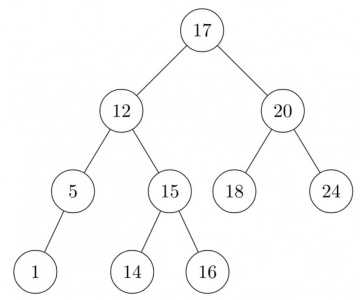

gate1988 data-structures normal descriptive avl-tree

In the balanced binary tree in the below figure, how many nodes will become unbalanced when a node is inserted as a child of the node “g”?

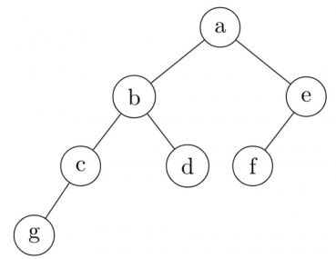

A. B. C. D.

gate1996 data-structures binary-tree avl-tree normal

A. Derive a recurrence relation for the size of the smallest AVL tree with height $h$ . B. What is the size of the smallest AVL tree with height ?

gate1998 data-structures avl-tree descriptive numerical-answers

# Answer key☟

# 3.1.4 AVL Tree: GATE CSE 2009 Question: 37,ISRO-DEC2017-55

What is the maximum height of any AVL-tree with 7 nodes? Assume that the height of a tree with a single node is .

A. B. 3 C. D. gatecse-2009 data-structures binary-search-tree normal isrodec2017 avl-tree

What is the worst case time complexity of insertin g elements into an AVL-tree with $\scriptstyle n$ elements initially?

A. $\Theta ( n ^ { 4 } )$ $\begin{array} { c } { { \mathsf { B . ~ } \Theta ( n ^ { 2 } ) } } \\ { { \mathsf { D . ~ } \Theta ( n ^ { 3 } ) } } \end{array}$   
C. $\Theta ( n ^ { 2 } \log n )$

gatecse-2020 binary-tree avl-tree one-mark

Answer key☟

Which of the following is TRUE?

A. The cost of searching an AVL tree is $\Theta ( \log n )$ but that of a binary search tree is $O ( n )$ B. The cost of searching an AVL tree is $\Theta ( \log n )$ but that of a complete binary tree is $\Theta ( n \log n )$ C. The cost of searching a binary search tree is ${ \dot { O } } ( \log n )$ but that of an AVL tree is $\Theta ( n ) $ D. The cost of searching an AVL tree is $\Theta ( n \log n )$ but that of a binary search tree is S $O ( n )$

gateit-2008 data-structures binary-search-tree easy avl-tree

An Abstract Data Type (ADT) is:

A. same as an abstract class   
B. a data type that cannot be instantiated   
C. a data type for which only the operations defined on it can be used, but none else   
D. all of the above

gatecse-2005 data-structures normal abstract-data-type

# Answer key☟

3.3 Array (13)

✍ Practice Test: Test 1 (9Q)

3.3.1 Array: GATE CSE 1993 Question: 12

The following Pascal program segments finds the largest number in a two-dimensional integer array $A [ 0 \ldots n - 1 , 0 \ldots n - 1 ]$ using a single loop. Fill up the boxes to complete the program and write against in your answer book Assume that max is a variable to store the largest value and $j$ are the indices to the array.

# begin

max: $: = | \mathsf { A } |$ , i:=0, j:=0; while |B| do begin if A[i, j]>max then max:=A[i, j]; if |C| then $\mathrm { j } : = \mathrm { j } + 1$ ; else begin j:=0; i:=|D| end end end

In 5 compact single dimensional array representation for lower triangular matrices (i.e all the elements above the diagonal are zero) of size $n \times n$ , non-zero elements, (i.e elements of lower triangle) of each row are stored one after another, starting from the first row, the index of the $( i , j ) ^ { t h }$ element of the lower triangular matrix in this new representation is:

A. $_ { i + j }$ $\mathsf { B } . \ i + j - 1$ $\begin{array} { r } { \mathsf { C } . \left( j - 1 \right) + \frac { i ( i - 1 ) } { 2 } \qquad \mathsf { D } . \ i + \frac { j ( j - 1 ) } { 2 } } \end{array}$

gate1994 data-structures array normal

# Answer key☟

# 3.3.3 Array: GATE CSE 1994 Question: 25

An array $A$ contains $\scriptstyle n$ integers in non-decreasing order, $A [ 1 ] \leq A [ 2 ] \leq \cdots \leq A [ n ]$ . Describe, using Pascal like pseudo code, a linear time algorithm to find $i , j$ such that $A [ i ] + A [ j ] = a$ given integer $M$ , i f such $i , j$ exist.

gate1994 data-structures array normal descriptive

# 3.3.4 Array: GATE CSE 1997 Question: 17

An array $A$ contains $n \geq 1$ positive integers in the locations $A [ 1 ] , A [ 2 ] , \ldots A [ n ]$ . The following program fragment prints the length of a shortest sequence of consecutive elements of $\bar { A , A [ i ] , A [ i + 1 ] , . . . , A [ j ] }$ such that the sum of their values ${ \mathfrak { i } } \geq M$ , a given positive number. It prints $\cdot _ { n + 1 } ,$ if no such sequence exists. Complete the program by filling in the boxes. In each case use the simplest possible expression. Write only the line number and the contents of the box.

begin   
$| { \mathrm { i } } { : = } 1 { \mathrm { j } } { : = } 1$ ;   
sum $: = \sqsubseteq$   
min:=n; finish:=false;   
while not finish do if ◻ then if $\mathsf { j } = \mathsf { n }$ then finish:=true else begin $\mathrm { j } = \mathrm { j } + 1$ ; sum $: =$ ◻ end else begin if(j-i) $\prec$ min then min:=j-i; sum: $: = :$ sum –A[i]; i:=i+1; end writeln $( \min + 1 )$ ;   
end.

gate1997 data-structures array normal descriptive

# Answer key☟

# 3.3.5 Array: GATE CSE 1998 Question: 2.14

Let $A$ be a two dimensional array declared as follows:

A: array [1 …. 10] [1 ….. 15] of integer;

Assuming that each integer takes one memory location, the array is stored in row-major order and the first element of the array is stored at location , what is the address of the element $A [ i ] [ j ] ?$

A. $1 5 i + j + 8 4$ $\begin{array} { c c c } { { 8 . ~ 1 5 j + i + 8 4 ~ } } & { { ~ \subset . ~ 1 0 i + j + 8 9 ~ } } & { { ~ \subset . ~ 1 0 j + i + 8 9 } } \end{array}$

An $n \times n$ array $v$ is defined as follows: $v [ i , j ] = i - j$ for all $i , j , i \le n , 1 \le j \le n$ The sum of the elements of the array $v$ is

A. 0 $\mathsf { B } . \ n - 1$ C $\cdot \ n ^ { 2 } - 3 n + 2$ D. $n ^ { 2 } \frac { ( n + 1 ) } { 2 }$

gatecse-2000 data-structures array easy

# 3.3.7 Array: GATE CSE 2000 Question: 15

Suppose you are given arrays $p [ 1 . . . . . N ]$ and $\ q [ 1 . . . . . N ]$ both uninitialized, that is, each location may contain an arbitrary value), and a variable count, initialized to . Consider the following procedures and is_set:

set(i) count $\ c =$ count + 1; q[count] ${ \bf \Psi } = \dot { \bf l }$ i; p[i] $\mathbf { \Sigma } = \mathbf { \Sigma }$ count;   
is _set(i) if $( { \mathsf { p } } [ { \mathsf { i } } ] \leq 0$ or p[i] $>$ count) return false; if (q[p[i]] $\neq \dot { \mathsf { I } }$ ) return false; return true;   
A. Suppose we make the following sequence of calls: $s e t ( 7 ) ; s e t ( 3 ) ; s e t ( 9 )$ ; After these sequence of calls, what is the value of count, and what do $\cdot q [ 1 ] , q [ 2 ] , q [ 3 ] , p [ 7 ] , p [ 3 ]$ and $p [ 9 ]$ contain?   
B. Complete the following statement "The first count elements of contain values such that set (_ has been called".   
C. Show that if $s e t ( i )$ has not been called for some $_ i$ , then regardless of what $p [ i ]$ contains, $i s \_ s e t ( i )$ will return false.

A program $P$ reads in integers in the range representing the scores of students. It then prints the frequency of each score above . What would be the best way for $P$ to store the frequencies?

A. An array of  numbers B. An array of  numbers C. An array of  numbers D. A dynamically allocated array of  numbers

gatecse-2005 data-structures array easy

# Answer key ☟

# 3.3.9 Array: GATE CSE 2013 Question: 50

The procedure given below is required to find and replace certain characters inside an input character supplied in array $A$ . The characters to be replaced are supplied in array , while their respective replacement characters are supplied in array . Array $A$ has a fixed length of five characters, while arrays and  contain three characters each. However, the procedure is flawed.

void find_and _replace (char $\overline { { ^ \star \mathsf { A } } }$ , char \*oldc, char \*newc) { for (int $\mathrm { i } { = } 0$ ; $\mathsf { i } _ { < 5 }$ ; $\mathbf { i } \mathbf { + } \mathbf { + }$ ) for $\scriptstyle \operatorname { i n t } \mathrm { i } = 0 ; \mathrm { j } < 3 ; \mathrm { j } + + )$ ) if $( \mathsf { A } [ \mathsf { i } ] = = \mathsf { o l d c } [ \mathsf { i } ] ] ,$ ) $\pmb { \ A } [ \mathbf { i } ] =$ newc[j];