The procedure is tested with the following four test cases.

1. $o l d c = { } ^ { 6 6 } a b c ^ { 3 3 }$ $n e w c = { ^ { * } d a b } ^ { , }$   
2. $o l d c = { ^ { 6 } c d e ^ { \mathfrak { N } } }$ • $n e w c = { } ^ { 6 4 } b c d ^ { 3 }$   
3. $o l d c = { ^ { 6 } } c a { ^ { 3 } }$ $n e w c = { ^ { * } c d a } ^ { * }$   
4. $o l d c = { } ^ { 6 6 } a b c ^ { 3 }$ $n e w c = { } ^ { 6 4 } b a c ^ { 3 }$

The tester now tests the program on all input strings of length five consisting of characters $\cdot a ^ { \prime } , \cdot b ^ { \prime } , \cdot c ^ { \prime } , \cdot d ^ { \prime }$ and ‘ ’ with duplicates allowed. If the tester carries out this testing with the four test cases given above, how many test cases will be able to capture the flaw?

A. Only one B. Only two C. Only three D. All four

gatecse-2013 data-structures array normal

The procedure given below is required to find and replace certain characters inside an input character supplied in array $A _ { \circ }$ . The characters to be replaced are supplied in array , while their respective replacement characters are supplied in array . Array $A$ has a fixed length of five characters, while arrays and  contain three characters each. However, the procedure is flawed.

void find and replace (char $^ { \star } { \sf A }$ , char \*oldc, char \*newc) { for (int $\mathrm { i } { = } 0$ ; i<5; $\mathbf { i } \mathbf { + } \mathbf { + }$ ) for $( \mathsf { i n t \ j = 0 } ; \mathsf { j < 3 } ; \mathsf { j + + } )$ if $( \mathsf { A } [ \mathsf { i } ] = = \mathsf { o l d c } [ \mathsf { i } ] )$ $\mathsf { A } [ \mathsf { i } ] =$ newc[j];

The procedure is tested with the following four test cases.

1. $o l d c = { ^ {  } a } b c ^ { \prime \prime }$ $n e w c = { ^ { * } d a b } ^ { , }$   
2. $o l d c = { ^ { 6 } c d e ^ { \mathfrak { N } } }$ $n e w c = { } ^ { 6 4 } b c d ^ { 3 }$   
3. 0 $l d c = { } ^ { 6 6 } b c a ^ { \ ' }$ $n e w c = { ^ { * } c d a } ^ { * }$   
4. $x d c = { ^ { 6 } a b c } ^ { \prime }$ $n e w c = { } ^ { 6 4 } b a c ^ { 3 }$

If array $A$ is made to hold the string “ ”, which of the above four test cases will be successful in exposing the flaw in this procedure?

A. None B. only C. 3 and  only D. only

gatecse-2013 data-structures array normal

Consider the C function given below. Assume that the array contains $n ( > 0 )$ elements, sorted in ascending order.

int ProcessArray(int \*listA, int x, int n) int i, j, k; $ { \mathbf { i } } = 0 ; \quad  { \mathbf { j } } =  { \mathsf { n } } - 1$ ; do { ${ \sf k } = ( \mathrm { i } + \mathrm { j } ) / 2$ ; if $( \mathsf { X } < = \mathsf { I i s t A } [ \mathsf { k } ] ) \mathrm { \Delta } \mathrm { j } = \mathsf { k } \mathrm { - } 1$ ; if $( \mathsf { I i s t A } [ \mathsf { k } ] < = \mathsf { X } ) \ \mathsf { i } = \mathsf { k } + 1$ ; } while $( \mathbf { i } < = \mathbf { j } )$ ; if (listA[k] $\begin{array} { r } { \mathbf { \Psi } = = \mathbf { \Psi } \times \mathbf { \Psi } } \end{array}$ ) return $\mathsf { \Omega } _ { | ( \mathsf { k } ) }$ ; else return -1;

Which one of the following statements about the function Process Array is CORRECT?

A. It will run into an infinite loop when $x$ is not in .   
B. It is an implementation of binary search.   
C. It will always find the maximum element in .   
D. It will return $^ { - 1 }$ even when $x$ is present in listA.

A Young tableau is a $2 D$ array of integers increasing from left to right and from top to bottom. Any unfilled entries are marked with $\infty$ , and hence there cannot be any entry to the right of, or below a . The following Young tableau consists of unique entries.

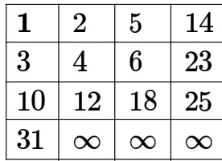

When an element is removed from a Young tableau, other elements should be moved into its place so that the resulting table is still a Young tableau (unfilled entries may be filled with a $\infty$ ). The minimum number of entries (other than ) to be shifted, to remove from the given Young tableau is

gatecse-2015-set2 databases array normal numerical-answers

Let $P$ be an array containing $n$ integers. Let $t$ be the lowest upper bound on the number of comparisons of the array elements, required to find the minimum and maximum values in an arbitrary array of $n$ elements. Which one of the following choices is correct?

A. $\scriptstyle t > 2 n - 2$ B. $\begin{array} { r } { t > 3 \lceil \frac { n } { 2 } \rceil } \end{array}$ and $t \leq 2 n - 2$ C. $t > n$ and $t \leq 3 \lceil \frac { n } { 2 } \rceil$ D. $t > \lceil \log _ { 2 } ( n ) \rceil$ and $t \leq n$

gatecse-2021-set1 data-structures array one-mark

# Answer key☟

✍ Practice Tests: Test 1 (15Q) Test 2 (15Q) Test 3 (15Q) Test 4 (2Q)

Match the pairs in the following questions:

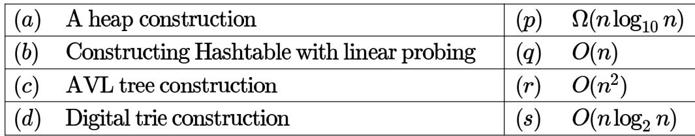

gate1990 match-the-following data-structures binary-heap

# Answer key☟

89,19,40,17,12,10,2,5,7,11,6,9,70

A. B. C. D. .3

gate1996 data-structures binary-heap easy

# Answer key☟

A. In binary tree, a full node is defined to be a node with  children. Use induction on the height of the binary tree to prove that the number of full nodes plus one is equal to the number of leaves.   
B. Draw the min-heap that results from insertion of the following elements in order into an initially empty min-heap: . Show the result after the deletion of the root of this heap.

gate1999 data-structures binary-heap normal descriptive

# Answer key☟

# 3.4.4 Binary Heap: GATE CSE 2001 Question: 1.15

Consider any array representation of an $n$ element binary heap where the elements are stored from index to index $\scriptstyle n$ of the array. For the element stored at index $i$ of the array $( i \leq n )$ , the index of the parent is

A. B. $\left\lfloor { \frac { i } { 2 } } \right\rfloor$ $\mathsf { C } . \mathsf { \Gamma } \lceil \frac { i } { 2 } \rceil$ $\mathsf { D } . \ \frac { ( i + 1 ) } { 2 }$

gatecse-2001 data-structures binary-heap easy

Answer key☟

In a min-heap with $\scriptstyle n$ elements with the smallest element at the root, the $7 ^ { t h }$ smallest element can be found in time

A. $\Theta ( n \log n )$ B. Θ(n) C. $\Theta ( \log n )$ D. 0(1)

gatecse-2003 data-structures binary-heap

The elements are inserted one by one in the given order into a maxHeap. The resultant maxHeap is

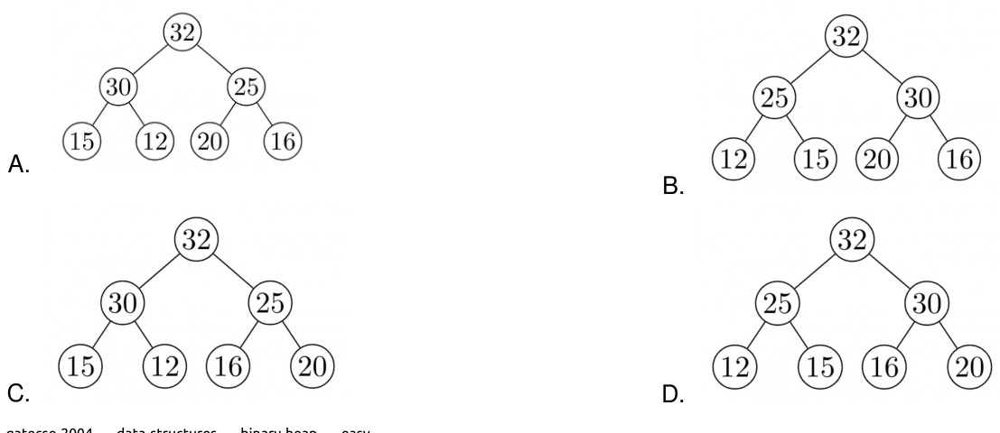

A priority queue is implemented as a Max-Heap. Initially, it has elements. The level-order traversal of the heap is: . Two new elements and  are inserted into the heap in that order. The level-order traversal of the heap after the insertion of the elements is:

A. 10,8,7,5,3,2,1 B. 10,8,7,2,3,1,5   
C. 10,8,7,1,2,3,5 D. 10,8,7,3,2,1,5

gatecse-2005 data-structures binary-heap normal

# Answer key☟

# 3.4.8 Binary Heap: GATE CSE 2006 Question: 10

In a binary max heap containing $n$ numbers, the smallest element can be found in time

A. $O ( n )$ B. $O ( \log n )$   
C. $O ( \log \log n )$ D. $O ( 1 )$

gatecse-2006 data-structures binary-heap easy

# 3.4.9 Binary Heap: GATE CSE 2006 Question: 76

Statement for Linked Answer Questions 76 & 77:

A -ary max heap is like a binary max heap, but instead of  children, nodes have  children. A -ary heap can be represented by an array as follows: The root is stored in the first location, $a [ 0 ]$ , nodes in the next level, from left to right, is stored from $a [ \mathbf { 1 } ]$ to $a [ 3 ]$ . The nodes from the second level of the tree from left to right are stored from $a [ 4 ]$ location onward. An item $x$ can be inserted into a -ary heap containing $\scriptstyle n$ items by placing $x$ in the location $a [ n ]$ and pushing it up the tree to satisfy the heap property.

Which one of the following is a valid sequence of elements in an array representing -ary max heap?

A. 1,3,5,6,8,9 B. 9,6,3,1,8,5   
C. 9,3,6,8,5,1 D. 9,5,6,8,3,1

gatecse-2006 data-structures binary-heap normal

Statement for Linked Answer Questions 76 & 77:

A -ary max heap is like a binary max heap, but instead of  children, nodes have  children. A -ary heap can be represented by an array as follows: The root is stored in the first location, $a [ 0 ]$ , nodes in the next level, from left to right, is stored from $a [ \mathbf { 1 } ]$ to $a [ 3 ]$ . The nodes from the second level of the tree from left to right are stored from $a [ 4 ]$ location onward. An item $x$ can be inserted into a -ary heap containing $\scriptstyle n$ items by placing $x$ in the location $a [ n ]$ and pushing it up the tree to satisfy the heap property.

76. Which one of the following is a valid sequence of elements in an array representing ary max heap?

A. 1,3,5,6,8,9 B. 9,6,3,1,8,5   
C. 9,3,6,8,5,1 D. 9,5,6,8,3,1

77. Suppose the elements  and are inserted, in that order, into the valid -ary max heap found in the previous question, Q.76. Which one of the following is the sequence of items in the array representing the resultant heap?

A. 10,7,9,8,3,1,5,2,6,4 B. 10,9,8,7,6,5,4,3,2,1   
C. 10,9,4,5,7,6,8,2,1,3 D. 10,8,6,9,7,2,3,4,1,5

Consider the process of inserting an element into a Heap, where the is represented by an array. Suppose we perform a binary search on the path from the new leaf to the root to find the position for the newly inserted element, the number of comparisons performed is:

A. $\Theta ( \log _ { 2 } n )$ B. $\Theta ( \log _ { 2 } \log _ { 2 } n )$   
C. $\Theta ( n )$ D. $\Theta ( n \log _ { 2 } n )$

gatecse-2007 data-structures binary-heap normal

Answer key☟

# 3.4.12 Binary Heap: GATE CSE 2009 Question: 59

Consider a binary max-heap implemented using an array. Which one of the following array represents a binary max-heap?

A. {25,12,16,13,10,8,14} B. {25,14,13,16,10,8,12} C. {25,14,16,13,10,8,12} D. {25,14,12,13,10,8,16}

gatecse-2009 data-structures binary-heap easy

# 3.4.13 Binary Heap: GATE CSE 2009 Question: 60

Consider a binary max-heap implemented using an array. What is the content of the array after two delete operations on $\{ 2 5 , 1 4 , 1 6 , 1 3 , 1 0 , 8 , 1 2 \}$

A. $\begin{array} { c } { { \{ 1 4 , 1 3 , 1 2 , 1 0 , 8 \} } } \\ { { \{ 1 4 , 1 3 , 8 , 1 2 , 1 0 \} } } \end{array}$ $\begin{array} { r } { \mathsf { B } . \ \{ 1 4 , 1 2 , 1 3 , 8 , 1 0 \} \ } \\ { \mathsf { D } . \ \{ 1 4 , 1 3 , 1 2 , 8 , 1 0 \} \ } \end{array}$   
C.

gatecse-2009 data-structures binary-heap normal

# Answer key☟

A max-heap is a heap where the value of each parent is greater than or equal to the value of its children. Which of the following is a max-heap?

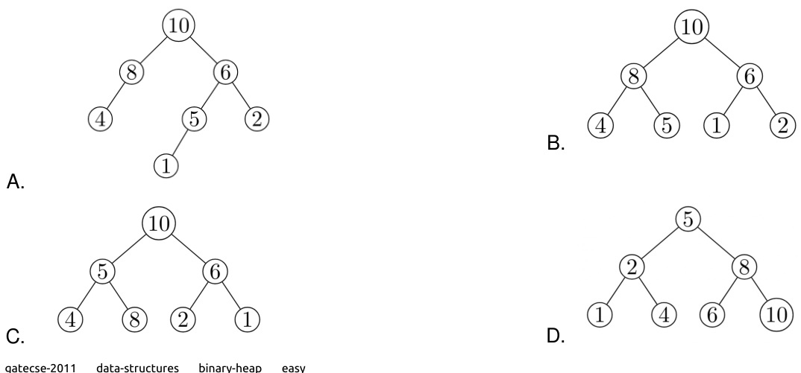

# Answer key☟

Consider a max heap, represented by the array: .

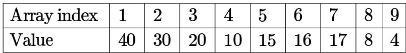

Now consider that a value  is inserted into this heap. After insertion, the new heap is

A. 40,30,20,10,15,16,17,8,4,35 B. 40,35,20,10,30,16,17,8,4,15   
C. 40,30,20,10,35,16,17,8,4,15 D. 40,35,20,10,15,16,17,8,4,30

gatecse-2015-set1 data-structures binary-heap easy

Consider a complete binary tree where the left and right subtrees of the root are max-heaps. The lower bound for the number of operations to convert the tree to a heap is

A. $\Omega ( \log n )$ B. $\Omega ( n )$   
C. $\Omega ( n \log n )$ D. $\Omega ( n ^ { 2 } )$

gatecse-2015-set2 data-structures binary-heap normal

Answer key☟

Consider the following array of elements.   
{89,19,50,17,12,15,2,5,7,11,6,9,100)   
The minimum number of interchanges needed to convert it into a max-heap is

A. B. C. D.

gatecse-2015-set3 data-structures binary-heap easy

# 3.4.19 Binary Heap: GATE CSE 2016 Set 1 Question: 37

An operator delete $( i )$ for a binary heap data structure is to be designed to delete the item in the -th node. Assume that the heap is implemented in an array and $\mathbf { \chi } _ { i }$ refers to the $i$ -th index of the array. If the heap tree has depth $d$ (number of edges on the path from the root to the farthest leaf ), then what is the time complexity to refix the heap efficiently after the removal of the element?

A. $O ( 1 )$ B. $O ( d )$ but not $O ( 1 )$ C. $O ( 2 ^ { d } )$ but not $O ( d )$ D. $O ( d 2 ^ { d } )$ but not $O ( 2 ^ { d } )$

gatecse-2016-set1 data-structures binary-heap normal

Consider the following statements:

I. The smallest element in a max-heap is always at a leaf node II. The second largest element in a max-heap is always a child of a root node III. A max-heap can be constructed from a binary search tree in $\Theta ( n )$ time IV. A binary search tree can be constructed from a max-heap in $\Theta ( n )$ time

Which of the above statements are TRUE?

A. I, II and III B. I, II and IV C. I, III and IV D. II, III and IV

gatecse-2019 data-structures binary-heap two-marks

# 3.4.23 Binary Heap: GATE CSE 2020 Question: 47

Consider the array representation of a binary min-heap containing elements. The minimum number o comparisons required to find the maximum in the heap is

gatecse-2020 numerical-answers binary-heap two-marks

# 3.4.24 Binary Heap: GATE CSE 2021 Set 2 Question: 2

​Let $H$ be a binary min-heap consisting of $n$ elements implemented as an array. What is the worst case time complexity of an optimal algorithm to find the maximum element in $H ?$

A. Θ(1) B. $\Theta ( \log n )$   
C. $\Theta ( n )$ D. $\Theta ( n \mathrm { l o g } n )$

gatecse-2021-set2 data-structures binary-heap time-complexity one-mark

# 3.4.25 Binary Heap: GATE CSE 2023 Question: 2

Which one of the following sequences when stored in an array at locations $A [ 1 ] , \ldots , A [ 1 0 ]$ forms a maxheap?

A. 23,17,10,6,13,14,1,5,7,12 B. 23,17,14,7,13,10,1,5,6,12   
C. 23,17,14,6,13,10,,5,7,15 D. 23,14,17,1,10,13,16,12,7,5

gatecse-2023 data-structures binary-heap one-mark

Consider a binary min-heap containing  distinct elements. Let $k$ be the index (in the underlying array) of the maximum element stored in the heap. The number of possible values of $k$ is

A. B. C. D.

gatecse-2024-set1 data-structures binary-heap two-marks

An array of integers of size $n$ can be converted into a heap by adjusting the heaps rooted at each node of the complete binary tree starting at the node $\lfloor ( n - 1 ) / 2 \rfloor$ , and doing this adjustment up to the root node (root node is at index ) in the order $\lfloor ( n - 1 ) / 2 \rfloor$ , $\lfloor ( n - 3 ) \bar { / 2 } \rfloor$ , ....., . The time required to construct a heap in this manner is

A. $O ( \log n )$ B. O(n) $\mathsf { C . ~ } O ( n \log \log n ) \qquad \mathsf { D . ~ } O ( n \log n )$

gateit-2004 data-structures binary-heap normal

# 3.4.29 Binary Heap: GATE IT 2006 Question: 44

Which of the following sequences of array elements forms a heap?

A. {23,17,14,6,13,10,1,12,7,5} B. {23,17,14,6,13,10,1,5,7,12} C. {23,17,14,7,13,10,1,5,6,12} D. {23,17,14,7,13,10,1,12,5,7}

gateit-2006 data-structures binary-heap easy

# Answer key☟

# 3.4.30 Binary Heap: GATE IT 2006 Question: 72

An array $X$ of $\scriptstyle n$ distinct integers is interpreted as a complete binary tree. The index of the first element of the array is . If only the root node does not satisfy the heap property, the algorithm to convert the complete binary tree into a heap has the best asymptotic time complexity of

A. $O ( n )$ ${ \mathsf { B } } . { \cal O } ( \log n )$ C. O(nlogn) D. O(n log log n)

gateit-2006 data-structures binary-heap easy

# Answer key☟

✍ Practice Tests: Test 1 (15Q) Test 2 (15Q) Test 3 (15Q) Test 4 (15Q)

A binary search tree is generated by inserting in order the following integers:

The number of nodes in the left subtree and right subtree of the root respectively is

A. (4,7) B. (7,4) C. (8,3) D. (3,8)

gate1996 data-structures binary-search-tree easy

# Answer key☟

A binary search tree contains the value . The tree is traversed in pre-order and the values are printed out. Which of the following sequences is a valid output?

A.53124786 B. 53126487   
C. D. 53124768

gate1997 data-structures binary-search-tree normal

A. Insert the following keys one by one into a binary search tree in the order specified.

Show the final binary search tree after the insertions.   
B. Draw the binary search tree after deleting  from it.   
C. Complete the statements $S 1$ , $S 2$ and $S 3$ in the following function so that the function computes the depth of a binary tree rooted at $t$ .   
typedef struct tnode{ int key; struct tnode \*left, \*right; \*Tree;   
int depth (Tree t) int x, y; if $( 1 = = N \mathsf { U L L }$ ) return 0; $\pmb { \mathrm { X } } =$ depth $\mathrm { ( \mathfrak { t } \mathrm { ~ \mathrm { > ~ } } }$ left);   
S1:   
S2: if $( { \tt X } > { \tt y } )$ return   
S3: else return

Suppose the numbers  are inserted in that order into an initially empty binary search tree. The binary search tree uses the usual ordering on natural numbers. What is the in-order traversal sequence of the resultant tree?

A.7510324689 B. 0243165987   
C.0123456789 D. 9864230157

gatecse-2003 binary- search-tree easy isro2009

A data structure is required for storing a set of integers such that each of the following operations can be done in $O ( \log n )$ time, where $\scriptstyle n$ is the number of elements in the set.

I. Deletion of the smallest element II. Insertion of an element if it is not already present in the set

Which of the following data structures can be used for this purpose?

A. A heap can be used but not a balanced binary search tree B. A balanced binary search tree can be used but not a heap C. Both balanced binary search tree and heap can be used D. Neither balanced search tree nor heap can be used

gatecse-2003 data-structures easy isro2009 binary-search-tree

# Answer key☟

# 3.5.8 Binary Search Tree: GATE CSE 2004 Question: 4, ISRO2009-26

The following numbers are inserted into an empty binary search tree in the given order: 10,1,3,5,15,12,16. What is the height of the binary search tree (the height is the maximum distance of a leaf node from the root)?

A. B. C. D. 6

gatecse-2004 data-structures binary-search-tree easy isro2009

# Answer key☟

A program takes as input a balanced binary search tree with $\boldsymbol { n }$ leaf nodes and computes the value of a function $g ( x )$ for each node $x$ . If the cost of computing $g ( x )$ is:

$$
\operatorname* { m i n } { \left( \operatorname* { n u m b e r } _ { \mathrm { { i n } l e f t - s u b t r e e ~ o f } x } \ , \ \operatorname { n u m b e r } _ { \mathrm { { i n } r i g h t - s u b t r e e ~ o f } x } \right) }
$$

Then the worst-case time complexity of the program is?

A. $\Theta ( n )$ $\begin{array} { l } { { \mathsf { B . } \Theta ( n \mathrm { l o g } n ) } } \\ { { \mathsf { D . } \Theta ( n ^ { \mathrm { 2 } } \mathrm { l o g } n ) } } \end{array}$   
C. $\Theta \dot { ( n ^ { 2 } ) }$

gatecse-2004 binary-search-tree normal data-structures

# Answer key☟

# 3.5.10 Binary Search Tree: GATE CSE 2005 Question: 33

Postorder traversal of a given binary search tree, $T$ produces the following sequence of keys 10,9,23,22,27,25,15,50,95,60,40,29 Which one of the following sequences of keys can be the result of an in-order traversal of the tree ?

A. 9,10,15,22,23,25,27,29,40,50,60,95   
B. 9,10,15,22,40,50,60,95,23,25,27,29   
C. 29,15,9,10,25,22,23,27,40,60,50,95   
D. 95,50,60,40,27,23,22,25,10,9,15,29

How many distinct binary search trees can be created out of  distinct keys?

A. B. C. D. gatecse-2005 data-structures binary-search-tree counting normal

# Answer key☟

You are given the postorder traversal, $P$ , of a binary search tree on the $n$ elements $1 , 2 , \ldots , n$ . You have to determine the unique binary search tree that has $P$ as its postorder traversal. What is the time complexity of the most efficient algorithm for doing this?

A. $\Theta ( \log n )$   
B. $\Theta ( n )$   
C. $\Theta ( n \mathrm { l o g } n )$   
D. None of the above, as the tree cannot be uniquely determined

gatecse-2008 data-structures binary-search-tree normal

Answer key☟

The worst case running time to search for an element in a balanced binary search tree with $n 2 ^ { n }$ elements is

A. $\Theta ( n \mathrm { l o g } n )$ B. $\Theta ( n 2 ^ { n } )$   
C. $\Theta ( n )$ D. $\Theta ( \log { n } )$

gatecse-2012 data-structures normal binary-search-tree

The preorder traversal sequence of a binary search tree is . Which one o the following is the postorder traversal sequence of the same tree?

A. 10,20,15,23,25,35,42,39,30 B. 15,10,25,23,20,42,35,39,30   
C. 15,20,10,23,25,42,35,39,30 D. 15,10,23,25,20,35,42,39,30

gatecse-2013 data-structures binary-search-tree normal

# 3.5.15 Binary Search Tree: GATE CSE 2013 Question: 7

Which one of the following is the tightest upper bound that represents the time complexity of inserting an object into a binary search tree of $\scriptstyle n$ nodes?

A. 0(1) ${ \mathsf { B } } . { \cal O } ( \log n )$ C. 0(n) D. O(n log n)

gatecse-2013 data-structures easy binary-search-tree

# 3.5.16 Binary Search Tree: GATE CSE 2014 Set 3 Question: 39

Suppose we have a balanced binary search tree $T$ holding $\scriptstyle n$ numbers. We are given two numbers $L$ and $H$ and wish to sum up all the numbers in $T$ that lie between $L$ and $H$ . Suppose there are $m$ such numbers in $T .$ . If the tightest upper bound on the time to compute the sum is $O ( n ^ { a } \log ^ { b } n + m ^ { c } \log ^ { d } n )$ , the value of $a + 1 0 b + 1 0 0 c + 1 0 0 0 d$ is

Which of the following is/are correct in order traversal sequence(s) of binary search tree(s)?

1. 3,5,7,8,15,19,25 II. 5,8,9,12,10,15,25 III. IV.

A. and IV only B. II and III only C. II and IV only D. II only

gatecse-2015-set1 data-structures binary -search-tree easy

Answer key☟

# 3.5.18 Binary Search Tree: GATE CSE 2015 Set 1 Question: 23

What are the worst-case complexities of insertion and deletion of a key in a binary search tree?

A. $\Theta ( \log n )$ for both insertion and deletion B. $\Theta ( n )$ for both insertion and deletion C. $\Theta ( n )$ for insertion and $\Theta ( \log n )$ for deletion D. $\Theta ( \log n )$ for insertion and $\Theta ( n )$ for deletion gatecse-2015-set1 data-structures binary-search-tree easy

# 3.5.19 Binary Search Tree: GATE CSE 2015 Set 3 Question: 13

While inserting the elements  in an empty binary search tree (BST) in the sequence shown, the element in the lowest level is

A. B. 67 C. 69 D.

gatecse-2015-set3 data-structures binary-search-tree easy

# 3.5.20 Binary Search Tree: GATE CSE 2016 Set 2 Question: 40

The number of ways in which the numbers can be inserted in an empty binary search tree, such that the resulting tree has height , is

Note: The height of a tree with a single node is .

gatecse-2016-set2 data-structures binary-search-tree normal numerical-answers

# 3.5.21 Binary Search Tree: GATE CSE 2017 Set 1 Question: 6

Let $T$ be a binary search tree with  nodes. The minimum and maximum possible heights of $T$ are: Note: The height of a tree with a single node is .

A. and respectively. B. and  respectively.   
C. and respectively. D. and respectively.

gatecse-2017-set1 data-structures binary-search-tree easy

# 3.5.22 Binary Search Tree: GATE CSE 2017 Set 2 Question: 36

The pre-order traversal of a binary search tree is given by . Then the post-order traversal of this tree is

A. 2,6,7,8,9,10,12,15,16,17,19,20   
B. 2,7,6,10,9,8,15,17,20,19,16,12   
C. 7,2,6,8,9,10,20,17,19,15,16,12   
D. 7,6,2,10,9,8,15,16,17,20,19,12

In a balanced binary search tree with $n$ elements, what is the worst case time complexity of reporting all elements in range $[ a , b ] ?$ Assume that the number of reported elements is $k$ .

A. $\Theta ( \log n )$ $\begin{array} { l } { { \mathsf { B . } \Theta ( \log n + k ) } } \\ { { \mathsf { D . } \Theta ( n \log k ) } } \end{array}$   
C. $\Theta ( k \mathrm { l o g } n )$

gatecse-2020 data-structures binary-search-tree two-marks

The preorder traversal of a binary search tree is . Which one of the following is the postorder traversal of the tree?

A. 10,11,12,15,16,18,19,20 B. 11,12,10,16,19,18,20,15   
C. 20,19,18,16,15,12,11,10 D. 19,16,18,20,11,12,10,15

gatecse-2020 binary-search-tree one-mark

# Answer key☟

# 3.5.25 Binary Search Tree: GATE CSE 2021 Set Question: 10

A binary search tree $T$ contains $n$ distinct elements. What is the time complexity of picking an element in $T$ that is smaller than the maximum element in $T ?$

A. $\Theta ( n \log n )$ ${ \mathsf { B } } . \ \Theta ( n )$ C. Θ(log n) D. Θ(1)

gatecse-2021-set1 data-structures binary-search-tree time-complexity one-mark

Suppose a binary search tree with  distinct elements is also a complete binary tree. The tree is stored using the array representation of binary heap trees. Assuming that the array indices start with the largest element of the tree is stored at index

gatecse-2022 numerical-answers data-structures binary-search-tree one-mark

# 3.5.27 Binary Search Tree: GATE CSE 2024 Set 2 Question: 29

You are given a set $V$ of distinct integers. A binary search tree $T$ is created by inserting all elements of $V$ one by one, starting with an empty tree. The tree $T$ follows the convention that, at each node, all values stored in the left subtree of the node are smaller than the value stored at the node. You are not aware of the sequence in which these values were inserted into $T$ , and you do not have access to $T$ .

Which one of the following statements is TRUE?

A. Inorder traversal of $T$ can be determined from $V$ B. Root node of $T$ can be determined from $V$ C. Preorder traversal of $T$ can be determined from D. Postorder traversal of $T$ can be determined from $V$

Which of the following statement(s) is/are TRUE for any binary search tree (BST) having $n$ distinct integers?

A. The maximum length of a path from the root node to any other node is $( n - 1 )$ .   
B. An inorder traversal will always produce a sorted sequence of elements.   
C. Finding an element takes $O \left( \log _ { 2 } n \right)$ time in the worst case.   
D. Every BST is also a Min-Heap.

gatecse2025-set1 data-structures binar y-search-tree multiple-selects one-mark

Suppose the values are inserted in that order into an initially empty binary search tree. Let $T$ be the resulting binary search tree. The number of edges in the path from the node containing  to the root node of $T$ is (Answer in integer)

gatecse2025-set2 data-structures binary-search-tree numerical-answers easy one-mark

The numbers ${ \bf 1 } , 2 , \ldots . . n$ are inserted in a binary search tree in some order. In the resulting tree, the right subtree of the root contains $p$ nodes. The first number to be inserted in the tree must be

A. $p$ B. p+1 C. $\mathsf { D } . \ n - p + 1$

gateit-2005 data-structures normal binary-search-tree

# Answer key☟

A binary search tree contains the numbers When the tree is traversed in pre-order and the values in each node printed out, the sequence of values obtained is If the tree is traversed in post-order, the sequence obtained would be

A. 8,7,6,5,4,3,2,1 B. 1,2,3,4,8,7,6,5   
C. 2,1,4,3,6,7,8,5 D. 2,1,4,3,7,8,6,5

gateit-2005 data-structures binary-search-tree normal

Answer key☟

Suppose that we have numbers between 1 and in a binary search tree and want to search for the number . Which of the following sequences CANNOT be the sequence of nodes examined?

A. $\begin{array} { l } { { \{ 1 0 , 7 5 , 6 4 , 4 3 , 6 0 , 5 7 , 5 5 \} } } \\ { { \{ 9 , 8 5 , 4 7 , 6 8 , 4 3 , 5 7 , 5 5 \} } } \end{array}$ B. $\begin{array} { l } { { \{ 9 0 , 1 2 , 6 8 , 3 4 , 6 2 , 4 5 , 5 5 \} } } \\ { { \{ 7 9 , 1 4 , 7 2 , 5 6 , 1 6 , 5 3 , 5 5 \} } } \end{array}$   
C. D.

gateit-2006 data-structures binary-search-tree normal

# 3.5.33 Binary Search Tree: GATE IT 2007 Question: 29

When searching for the key value in a binary search tree, nodes containing the key values are traversed, not necessarily in the order given. How many different orders are possible in which these key values can occur on the search path from the root to the node containing the value 6

A. B. C. 128 D. 5040

A Binary Search Tree (BST) stores values in the range  to . Consider the following sequence of keys.

I. 81,537,102, 439, 285,376, 305   
II. 52,97,121,195,242, 381,472   
III. 142,248,520, 386,345,270,307   
IV. 550,149,507,395, 463, 402,270

Suppose the BST has been unsuccessfully searched for key . Which all of the above sequences list nodes in the order in which we could have encountered them in the search?

A. II and III only B. and III only C. III and IV only D. III only

gateit-2008 data-structures binary-search-tree normal

A Binary Search Tree (BST) stores values in the range to . Consider the following sequence of keys.

I. 81,537,102, 439, 285,376,305   
II. 52,97,121,195,242,381,472   
III. 142,248,520, 386,345,270,307   
IV. 550,149,507, 395,463,402,270

Which of the following statements is TRUE?

A. I, II and IV are inorder sequences of three different BSTs B. I is a preorder sequence of some BST with  as the root C. II is an inorder sequence of some BST where is the root and is a leaf D. IV is a postorder sequence of some BST with  as the root

gateit-2008 data-structures binary-search-tree easy

How many distinct BSTs can be constructed with distinct keys?

A. B. C. 6 D.

gateit-2008 data-structures binary-search-tree normal

# Answer key☟

✍ Practice Tests: Test 1 (15Q) Test 2 (15Q) Test 3 (15Q) Test 4 (6Q)

Construct a binary tree whose preorder traversal is

and inorder traversal is

.NLKPRMSQT

gate1987 data-structures binary-tree descriptive

Define the height of a binary tree or subtree and also define a height-balanced (AVL) tree.

gate1988 normal descriptive data-structures binary-tree

# 3.6.5 Binary Tree: GATE CSE 1988 Question: 7iii

Consider the tree given in the below figure, insert  and show the new balance factors that would arise if the tree is not rebalanced. Finally, carry out the required rebalancing of the tree and show the new tree with the balance factors on each mode.

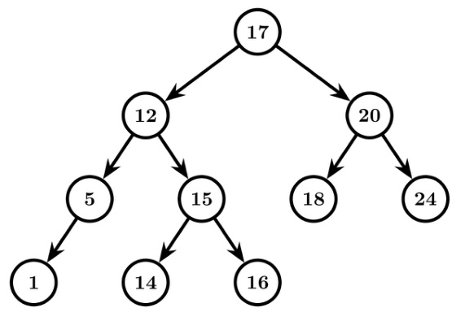

gate1988 normal descriptive data-structures binary-tree

Which one of the following statements (s) is/are FALSE?

A. Overlaying is used to run a program, which is longer than the address space of the computer.   
B. Optimal binary search tree construction can be performed efficiently by using dynamic programming.   
C. Depth first search cannot be used to find connected components of a graph.   
D. Given the prefix and postfix walls over a binary tree, the binary tree can be uniquely constructed.

normal gate1989 binary-tree multiple-selects

A. $\leq n ^ { 2 }$ always. B. $\geq n \log _ { 2 } n$ always. C. Equal to always. D. $O ( n )$ for some special trees. gate1990 normal data-structures binary-tree multiple-selects

The weighted external path length of the binary tree in figure is gate1991 binary-tree data-structures normal numerical-answers

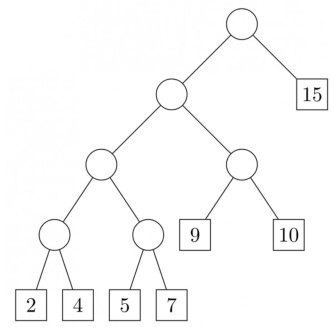

If the binary tree in figure is traversed in inorder, then the order in which the nodes will be visited is

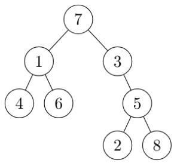

gate1991 binary-tree easy data-structures descriptive

Consider the binary tree in the figure below:

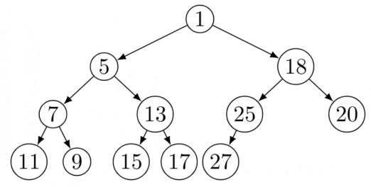

# What structure is represented by the binary tree?

gate1991 data-structures binary-tree time-complexity easy descriptive

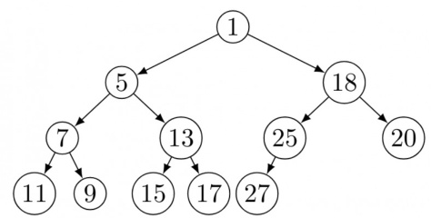

Give different steps for deleting the node with key so that the structure is preserved.

gate1991 data-structures binary-tree normal descriptive

Consider the binary tree in the figure below:

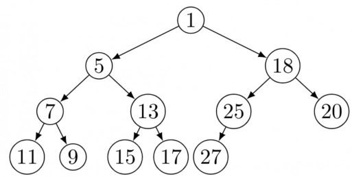

Outline a procedure in Pseudo-code to delete an arbitrary node from such a binary tree with nodes that preserves the structures. What is the worst-case time complexity of your procedure?

gate1991 normal data-structures binary-tree time-complexity descriptive

Prove by the principal of mathematical induction that for any binary tree, in which every non-leaf node has - descendants, the number of leaves in the tree is one more than the number of non-leaf nodes.

gate1993 data-structures binary-tree normal descriptive

A rooted tree with  nodes has its nodes numbered  to  in pre-order. When the tree is traversed in postorder, the nodes are visited in the order .

Reconstruct the original tree from this information, that is, find the parent of each node, and show the tree diagrammatically.

gate1994 data-structures binary-tree normal descriptive

Which of the following sequences denotes the post order traversal sequence of the below tree?

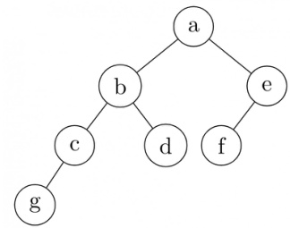

A. B.   
C. D.

gate1996 data-structures binary-tree easy

# Answer key☟

A size-balanced binary tree is a binary tree in which for every node the difference between the number of nodes in the left and right subtree is at most . The distance of a node from the root is the length of the path from the root to the node. The height of a binary tree is the maximum distance of a leaf node from the root.

A. Prove, by using induction on h, that a size-balance binary tree of height $h$ contains at least $2 ^ { h }$ nodes. B. In a size-balanced binary tree of height $h \geqslant 1$ , how many nodes are at distance $h - 1$ from the root? Write only the answer without any explanations.

gate1997 data-structures binary-tree normal descriptive proof

Draw the binary tree with node labels  for which the inorder and postorder traversals result in the following sequences:

Inorder: afbcdge Postorder: gate1998 data-structures binary-tree descriptive

D. None of the above

A weight-balanced tree is a binary tree in which for each node, the number of nodes in the left sub tree least half and at most twice the number of nodes in the right sub tree. The maximum possible height (number of nodes on the path from the root to the furthest leaf) of such a tree on n nodes is best described by which of the following?

A. log2 n $\mathsf { B } . \mathsf { l o g } _ { \frac { 4 } { 3 } } n$ C. log3 n D.

gatecse-2002 data-structures binary-tree normal

Draw all binary trees having exactly three nodes labeled $A , B$ and $\boldsymbol { C }$ on which preorder traversal gives the sequence $\scriptstyle C , B , A$ .

gatecse-2002 data-structures binary-tree easy descriptive

Consider the label sequences obtained by the following pairs of traversals on a labeled binary tree. Which o these pairs identify a tree uniquely?

I. preorder and postorder II. inorder and postorder III. preorder and inorder IV. level order and postorder

A. I only B. II, III C. III only D. IV only

gatecse-2004 data-structures binary-tree normal

# Consider the following C program segment

struct CellNode{ struct CellNode \*leftChild int element; struct CellNode \*rightChild; };   
int Dosomething (struct CellNode \*ptr) int value $= 0$ ; if(ptr $! =$ NULL) if (ptr $^ { - > }$ leftChild $! =$ NULL) value $= 1 +$ DoSomething (ptr $\scriptscriptstyle - >$ leftChild); if (ptr $^ { - > }$ rightChild $\ ! = \cdots$ NULL) value $\mathbf { \Sigma } = \mathbf { \Sigma }$ max(value, $1 +$ Dosomething (ptr $^ { - > }$ rightChild)); return(value);

The value returned by the function  when a pointer to the root of a non-empty tree is passed as argument is

A. The number of leaf nodes in the B. The number of nodes in the tree tree C. The number of internal nodes in D. The height of the tree

# the tree

A scheme for storing binary trees in an array $X$ is as follows. Indexing of $X$ starts at instead of . the root is stored at $X [ 1 ]$ . For a node stored at $X [ i ]$ , the left child, if any, is stored in $X [ 2 i ]$ and the right child, if any, in $X [ 2 i + 1 ]$ . To be able to store any binary tree on n vertices the minimum size of $X$ should be

A. $\log _ { 2 } n$ B. n C. 2n+1 D.

gatecse-2006 data-structures binary-tree normal

# 3.6.27 Binary Tree: GATE CSE 2007 Question: 12

The height of a binary tree is the maximum number of edges in any root to leaf path. The maximum number of nodes in a binary tree of height $h$ is:

A. $2 ^ { h } - 1$ $\mathsf { B } . \ 2 ^ { h - 1 } - 1$ C. D.

gatecse-2007 data-structures binary-tree easy

The maximum number of binary trees that can be formed with three unlabeled nodes is:

A. B. C. D.

gatecse-2007 data-structures binary-tree normal

The inorder and preorder traversal of a binary tree are dbeafcg and decfg, respectively The postorder traversal of the binary tree is:

A. debfgca B. edbgfca C. edbfgca D. defgbca

gatecse-2007 data-structures binary-tree normal ugcnetcse-june2015-paper2

# 3.6.30 Binary Tree: GATE CSE 2007 Question: 46

Consider the following C program segment where CellNode represents a node in a binary tree:

struct CellNode struct CellNode \*leftChild; int element; struct CellNode \*rightChild;   
};   
int Getvalue (struct CellNode \*ptr) { int value $= 0$ ; if (ptr $\mathsf { l } = \mathsf { N U L L }$ ) { if ((ptr->leftChild $\scriptstyle = =$ NULL) && (ptr->rightChild $\scriptstyle = =$ NULL)) value $= 1$ ; else value $\mathbf { \Sigma } = \mathbf { \Sigma }$ value $^ +$ GetValue(ptr->leftChild) $^ +$ GetValue(ptr->rightChild); return(value);

The value returned by  when a pointer to the root of a binary tree is passed as its argument is:

A. the number of nodes in the tree B. the number of internal nodes in the tree C. the number of leaf nodes in the tree D. the height of the tree

gatecse-2007 data-structures binary-tree normal

In a binary tree with $n$ nodes, every node has an odd number of descendants. Every node is considered to be its own descendant. What is the number of nodes in the tree that have exactly one child?

A. B. 1 C. (n-1) D.

gatecse-2010 data-structures binary-tree normal

We are given a set of $n$ distinct elements and an unlabeled binary tree with $n$ nodes. In how many ways can we populate the tree with the given set so that it becomes a binary search tree?

A. 0 B. 1 C. n! [ $) . \ { \frac { 1 } { n + 1 } } . ^ { 2 n } C _ { n }$

gatecse-2011 binary-tree normal

# 3.6.33 Binary Tree: GATE CSE 2012 Question: 47

The height of a tree is defined as the number of edges on the longest path in the tree. The function shown in the pseudo-code below is invoked as height (root) to compute the height of a binary tree rooted at the tree pointer root.

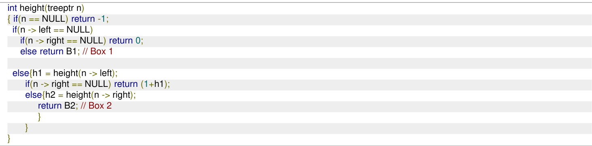

The appropriate expressions for the two boxes B1 and B2 are:

A. B1: $( 1 + \mathrm { h e i g h t } ( n  \mathrm { r i g h t } ) )$ ; B2: $( \mathbf { 1 } + \mathbf { m a x } ( h \mathbf { 1 } , h \mathbf { 2 } ) )$ B. B1: (height $( n \to \mathrm { r i g h t } ) \$ B2: $( 1 + \operatorname* { m a x } ( h 1 , h 2 ) )$ C. B1: ${ \mathrm { h e i g h t } } ( n \to { \mathrm { ~ r i g h t } } ) ; { \mathsf { B } } 2 { \cdot } { \mathrm { m a x } } ( h 1 , h 2 )$ D. B1: $( 1 + \mathrm { h e i g h t } ( n  \mathrm { r i g h t } ) ) ; \mathsf { B }$ 2: $\operatorname* { m a x } ( h 1 , h 2 )$

The height of a tree is the length of the longest root-to-leaf path in it. The maximum and minimum number o nodes in a binary tree of height  are

A. and , respectively B. and , respectively C. and , respectively D. 31 and , respectively

# A binary tree T has leaves. The number of nodes in T having two children is

gatecse-2015-set2 data-structures binary-tree easy numerical-answers

Consider a binary tree T that has leaf nodes. Then the number of nodes in T that have exactly two children are

gatecse-2015-set3 data-structures binary-tree normal numerical-answers

Consider the following New-order strategy for traversing a binary tree:

Visit the root;   
Visit the right subtree using New-order;   
Visit the left subtree using New-order;

The New-order traversal of the expression tree corresponding to the reverse polish expression

is given by:

A.+-167\*2^5-34\* B.-+1\*67^2-5\*34 C.-+1\*76^2-5\*43 D.176\*+2543\* -^- gatecse-2016-set2 data-structures binary-tree normal

Consider a complete binary tree with nodes. Let $A$ denote the set of first elements obtained by performing Breadth-First Search starting from the root. Let $B$ denote the set of first elements obtained by performing Depth-First Search  starting from the root.

The value of $\left| A - B \right|$ is gatecse-2021-set2 numerical-answers data-structures binary-tree one-mark

# 3.6.42 Binary Tree: GATE CSE 2023 Question: 37

Consider the function and the binary tree shown.

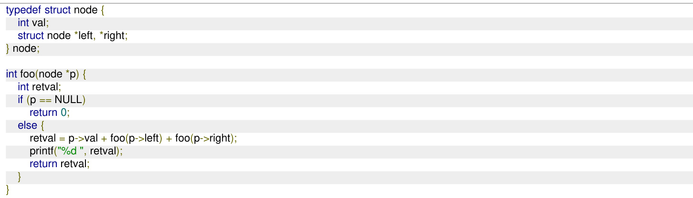

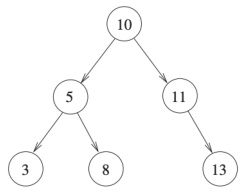

When is called with a pointer to the root node of the given binary tree, what will it print?

A.385131110 B. 358101113   
C. 3816 13 24 50 D. 3 16 8 50 24 13

gatecse-2023 data-structures binary-tree two-marks

Consider a binary tree $T$ in which every node has either zero or two children. Let $n > 0$ be the number of nodes in $T$ .

Which ONE of the following is the number of nodes in $T$ that have exactly two children?

A. $\scriptstyle { \frac { n - 2 } { 2 } }$ B. $\scriptstyle { \frac { n - 1 } { 2 } }$ C. $\textstyle { \frac { n } { 2 } }$ D. $\textstyle { \frac { n + 1 } { 2 } }$

gatecse2025-set2 data-structures binary-tree one-mark

# Answer key☟

iii. Postorder

Which of the following traversal options is/are sufficient to uniquely reconstruct the full binary tree?

A. (i) and (ii) B. (ii) and (ii) C. (i) and (ii) D. (ii) only

gate-ds-ai-2024 data-structures binary-tree multiple-selects one-mark

​Let $H , I , L$ , and $N$ represent height, number of internal nodes, number of leaf nodes, and the total number of nodes respectively in a rooted binary tree.

Which of the following statements is/are always TRUE?

A. $L \leq I + 1$ $\begin{array} { r l } & { \mathsf { B } . \ H + 1 \le N \le 2 ^ { H + 1 } - 1 } \\ & { \mathsf { D } . \ H \le L \le 2 ^ { H - 1 } } \end{array}$   
C. $H \leq I \leq 2 ^ { H } - 1$

gate-ds-ai-2024 data-structures binary-tree multiple-selects two-marks

Which one of the following binary trees has its inorder and preorder traversals as and , respectively?

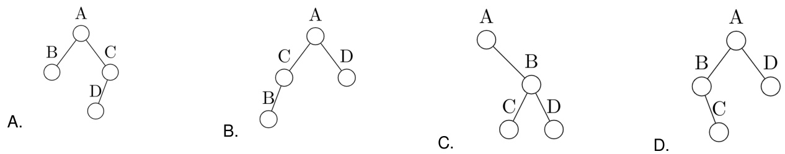

gateit-2004 binary-tree easy data-structures

# Answer key☟

In a binary tree, for every node the difference between the number of nodes in the left and right subtrees at most . If the height of the tree is $h > 0$ , then the minimum number of nodes in the tree is

A. $\mathsf { B } . \ 2 ^ { h - 1 } + 1$ $\mathsf { C } . \mathsf { \Omega } 2 ^ { h } - \mathsf { 1 }$ D.

gateit-2005 data-structures binary-tree normal

# Answer key☟

# 3.6.48 Binary Tree: GATE IT 2006 Question: 71

An array $X$ of $\scriptstyle n$ distinct integers is interpreted as a complete binary tree. The index of the first element of the array is . The index of the parent of element $X [ i ] , i \neq 0$ , is?

$\begin{array} { l } { \mathsf { A . ~ \left\lfloor \frac { \dot { i } } { 2 } \right\rfloor } } \\ { \mathsf { C . ~ \left\lceil \frac { \dot { i } } { 2 } \right\rceil } } \end{array}$ $\begin{array} { l } { { \mathsf { B } . \left[ \displaystyle \frac { i - 1 } { 2 } \right] } } \\ { { \mathsf { D } . \left[ \displaystyle \frac { i } { 2 } \right] - 1 } } \end{array}$

An array $X$ of n distinct integers is interpreted as a complete binary tree. The index of the first element of the array is . If the root node is at level , the level of element $X [ i ]$ , $i \neq 0$ , is

A. $\left\lfloor \log _ { 2 } i \right\rfloor$ $\begin{array} { l } { { \mathsf { B . \Pi } \left\lceil \log _ { 2 } ( i + 1 ) \right\rceil } } \\ { { \mathsf { D . \Pi } \left\lceil \log _ { 2 } i \right\rceil } } \end{array}$   
C. $\left[ \log _ { 2 } ( \bar { i } + 1 ) \right]$

gateit-2006 data-structures binary-tree normal

Answer key☟

# 3.6.50 Binary Tree: GATE IT 2006 Question: 9

In a binary tree, the number of internal nodes of degree  is , and the number of internal nodes of degree is . The number of leaf nodes in the binary tree is

A. B. C. D.

gateit-2006 data-structures binary-tree normal

The following three are known to be the preorder, inorder and postorder sequences of a binary tree. But it is not known which is which.

I. MBCAFHPYK II. KAMCBYPFH III. MABCKYFPH

Pick the true statement from the following.

A. and II are preorder and inorder sequences, respectively   
B. and III are preorder and postorder sequences, respectively   
C. II is the inorder sequence, but nothing more can be said about the other two sequences   
D. II and III are the preorder and inorder sequences, respectively

gateit-2008 data-structures normal binary-tree

A binary tree with $n > 1$ nodes has $n _ { 1 }$ , $n _ { 2 }$ and $n _ { 3 }$ nodes of degree one, two and three respectively. The degree of a node is defined as the number of its neighbours.

$n _ { 3 }$ can be expressed as

A. $n _ { 1 } + n _ { 2 } - 1$ $\begin{array} { c } { { \mathsf { B } . \ n _ { 1 } - 2 } } \\ { { \mathsf { D } . \ n _ { 2 } - 1 } } \end{array}$   
C. $[ ( ( n _ { 1 } + n _ { 2 } ) / 2 ) ]$

gateit-2008 data-structures binary-tree normal

# 3.6.53 Binary Tree: GATE IT 2008 Question: 77

A binary tree with $n > 1$ nodes has $n _ { 1 }$ , $n _ { 2 }$ and $n _ { 3 }$ nodes of degree one, two and three respectively. The degree of a node is defined as the number of its neighbours.

Starting with the above tree, while there remains a node $v$ of degree two in the tree, add an edge between the two neighbours of $v$ and then remove $v$ from the tree. How many edges will remain at the end of the process?

A. $2 * n _ { 1 } - 3$ $\begin{array} { l } { { \mathsf { B } . \ n _ { 2 } + 2 * n _ { 1 } - 2 } } \\ { { \mathsf { D } . \ n _ { 2 } + n _ { 1 } - 2 } } \end{array}$   
C. $n _ { 3 } - n _ { 2 }$

Let $G$ be the graph with vertices numbered to . Two vertices $\mathbf { \chi } _ { i }$ and $j$ are adjacent $\vert i - j \vert = 8$ or $| i - j | = 1 2$ . The number of connected components in $G$ is

A. B. C. D.

gate1997 data-structures normal graph-theory

# Answer key☟

Let $G = ( V , E )$ be a directed graph where $V$ is the set of vertices and $E$ the set of edges. Then which one of the following graphs has the same strongly connected components as $G$ ?

A. $G _ { 1 } = \left( V , E _ { 1 } \right)$ where $E _ { 1 } = \{ ( u , v ) \mid ( u , v ) \not \in E \}$   
B. $G _ { 2 } = \left( V , E _ { 2 } \right)$ where $E _ { 2 } = \{ ( u , v ) \mid ( v , u ) \in E \}$   
C. $G _ { 3 } = \left( V , E _ { 3 } \right)$ where $E _ { 3 } = \{ ( u , v ) |$ there is a path of length $\leq 2$ from $u$ to $v$ in $E \}$   
D. $G _ { 4 } = ( V _ { 4 } , E )$ where $V _ { 4 }$ is the set of vertices in $G$ which are not isolated

Consider the weighted undirected graph with  vertices, where the weight of edge $\{ i , j \}$ is given by the entry $W _ { i j }$ in the matrix .

$$
{ \mathsf { W } } { = } \left[ \begin{array} { l l l l } { 0 } & { 2 } & { 8 } & { 5 } \\ { 2 } & { 0 } & { 5 } & { 8 } \\ { 8 } & { 5 } & { 0 } & { x } \\ { 5 } & { 8 } & { x } & { 0 } \end{array} \right]
$$

The largest possible integer value of $x$ , for which at least one shortest path between some pair of vertices will contain the edge with weight $x$ is

gatecse-2016-set1 data-structures graph-theory normal numerical-answers ​Match the items in Column 1 with the items in Column in the following table:

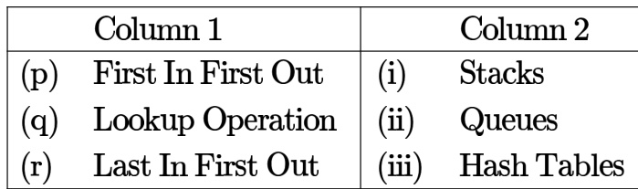

A. p -(ii),(q)-(i),(r)-(i) B. (ii)，(q)-(i）,(r)-(i） C. -(i),(q)-(ii),(r)-(ii) D -(i)，(q) (i),(r)- (ii)

✍ Practice Test: Test 1 (14Q)

# 3.8.1 Hashing: GATE CSE 1996 Question: 1.13

An advantage of chained hash table (external hashing) over the open addressing scheme is

A. Worst case complexity of search operations is less B. Space used is less C. Deletion is easier D. None of the above

gate1996 data-structures hashing normal

Insert the characters of the string $K R P C S N Y T J M$ into a hash table of size . Use the hash function

$$
h ( x ) = ( o r d ( x )  – o r d ( \mathit { \Omega } ^ { \omega } a ^ { \mathfrak { p } } ) + 1 ) \mod 1 0
$$

and linear probing to resolve collisions.

A. Which insertions cause collisions? B. Display the final hash table.

gate1996 data-structures hashing normal descriptive

# Answer key☟

Consider a hash table with $n$ buckets, where external (overflow) chaining is used to resolve collisions. The hash function is such that the probability that a key value is hashed to a particular bucket is $\textstyle { \frac { 1 } { n } }$ . The hash table is initially empty and $K$ distinct values are inserted in the table.

A. What is the probability that bucket number  is empty after the $K ^ { t h }$ insertion? B. What is the probability that no collision has occurred in any of the $K$ insertions? C. What is the probability that the first collision occurs at the $K ^ { t h }$ insertion?

gate1997 data-structures hashing probability normal descriptive

# 3.8.4 Hashing: GATE CSE 2004 Question: 7

Given the following input and the hash function $x$ mod , which of the following statements are true?

I. 9679,1989, 4199 hash to the same value II. 1471,6171 hash to the same value III. All elements hash to the same value IV. Each element hashes to a different value

A. I only B. II only C. and II only D. III or IV

Consider a hash table of size seven, with starting index zero, and a hash function $( 3 x + 4 )$ mod Assuming the hash table is initially empty, which of the following is the contents of the table when the sequence  is inserted into the table using closed hashing? Note that − denotes an empty location in the table.

A. $8 , - , - , - , - , - , 1 0$ $\begin{array} { c } { { 8 . ~ 1 , 8 , 1 0 , - , - , - , 3 } } \\ { { 0 . ~ 1 , 1 0 , 8 , - , - , - , 3 } } \end{array}$ C. , −, −, −, −, −,

gatecse-2007 data-structures hashing easy

# Answer key☟

The keys 12,18,13,2,3,23, 5 and are inserted into an initially empty hash table of length using open addressing with hash function $h ( k ) = k$ mod 10 and linear probing. What is the resultant hash table?

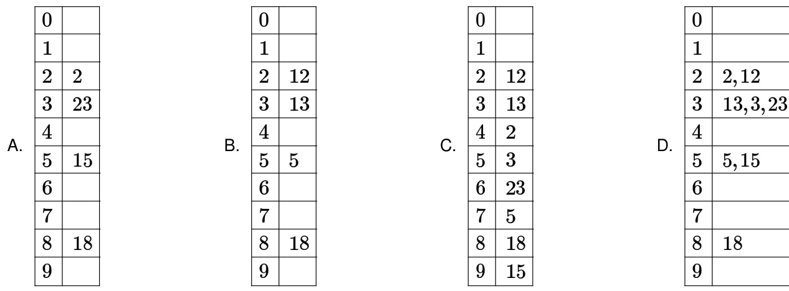

# Answer key☟

A hash table of length  uses open addressing with hash function $h ( k ) = k$ mod , and linear probing. After inserting 6 values into an empty hash table, the table is shown as below

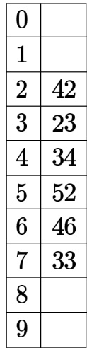

Which one of the following choices gives a possible order in which the key values could have been inserted in the table?

A. 46,42,34,52,23,33 B. 34,42,23,52,33,46   
C. 46,34,42,23,52,33 D. 42,46,33,23,34,52

A hash table of length uses open addressing with hash function $h ( k ) = k$ mod , and linea probing. After inserting 6 values into an empty hash table, the table is shown as below

How many different insertion sequences of the key values using the same hash function and linear probing will result in the hash table shown above?

A. B. C. 30 D. 40

data-structures hashing normal gatecse-2010

Consider a hash table with slots. The hash function S $h ( k ) = k$ mod . The collisions are resolved by chaining. The following keys are inserted in the order: . The maximum, minimum, and average chain lengths in the hash table, respectively, are

A. and B. and C. and D. and

gatecse-2014-set1 data-structures hashing normal

Consider a hash table with slots. Collisions are resolved using chaining. Assuming simple uniform hashing, what is the probability that the first  slots are unfilled after the first  insertions?

A. $( 9 7 \times 9 7 \times 9 7 ) / 1 0 0 ^ { 3 }$ B. $( 9 9 \times 9 8 \times 9 7 ) / 1 0 0 ^ { 3 }$   
C. $( 9 7 \times 9 6 \times 9 5 ) / 1 0 0 ^ { 3 }$ D. $( 9 7 \times 9 6 \times 9 5 / ( 3 ! \times 1 0 0 ^ { 3 } )$

gatecse-2014-set3 data-structures hashing probability normal

Which of the following statement(s) is TRUE?

I. A hash function takes a message of arbitrary length and generates a fixed length code.   
II. A hash function takes a message of fixed length and generates a code of variable length.   
III. A hash function may give the same hash value for distinct messages.

A. I only B. II and III only C. I and III only D. II only

gateit-2006 data-structures hashing normal

# 3.8.14 Hashing: GATE IT 2007 Question: 28

Consider a hash function that distributes keys uniformly. The hash table size is . After hashing of how many keys will the probability that any new key hashed collides with an existing one exceed .

A. B. 6 C. D. 10

gateit-2007 data-structures hashing probability normal

Consider a hash table of size that uses open addressing with linear probing. Let $h ( k ) = k$ mod be the hash function used. A sequence of records with keys

# 43 36 92 87114711314

is inserted into an initially empty hash table, the bins of which are indexed from zero to ten. What is the index of the bin into which the last record is inserted?

A. B. C. 6 D.

gateit-2008 data-structures hashing normal

Answer key☟

✍ Practice Test: Test (6Q)

Which of the following is essential for converting an infix expression to the postfix form efficiently?

A. An operator stack B. An operand stack C. An operand stack and an operator D. A parse tree stack

gate1997 normal infix-prefix stack data-structures

A. $a b c \times + d e f \sim$   
B. $a b c \times + d e \hat { \textbf { \textit { f } } ^ { \prime } } -$   
C. $a b + c \times d - e ^ { \mathbf { \gamma } \cdot \mathbf { \sigma } } f ^ { \mathbf { \gamma } }$   
D. $\_ + a \times b c \ \cdot \ \cdot \ d e f$

gatecse-2004 stack isro2009 infix-prefix

The following postfix expression with single digit operands is evaluated using a stack:

$$
8 2 3 ^ { \circ } / 2 3 * + 5 1 * -
$$

Note that is the exponentiation operator. The top two elements of the stack after the first $^ *$ is evaluated are

A. B. C. 3,2 D.

gatecse-2007 data-structures stack normal infix-prefix isro2016

# Answer key☟

# 3.10

# Linked List (24)

✍ Practice Tests: Test 1 (15Q) Test 2 (15Q) Test 3 (3Q)

# 3.10.1 Linked List: GATE CSE 1987 Question: 1-xv

In a circular linked list organization, insertion of a record involves modification of

A. One pointer. B. Two pointers.   
C. Multiple pointers. D. No pointer.

gate1987 data-structures linked-list

# 3.10.2 Linked List: GATE CSE 1987 Question: 6a

A list of $\scriptstyle n$ elements is commonly written as a sequence of $n$ elements enclosed in a pair of square brackets. For example. is a list of three elements and $\mathbb { I }$ is a nil list. Five functions are defined below:

$c a r ( l )$ returns the first element of its argument list $l$ ;   
$c d r ( l )$ returns the list obtained by removing the first element of the argument list $l$ ;   
$\cdot g l u \dot { e } ( a , l )$ returns a list $m$ such that $c a r ( m ) = a$ and $c d r ( m ) = l$ . $f ( x , \dot { y } ) \equiv \mathsf { i f } x = \mathbb { I }$ then $y$   
$g ( x ) \equiv \mathfrak { i f } x = \mathbb { I }$ $\begin{array} { r l } & { \mathrel { \phantom { = } } \bigcup \mathbin { \mathsf { u r e } } g l u e ( c a r ( x ) , f ( c d r ( x ) , y ) ) ; } \\ & { = \big \| \mathop { \mathsf { t h e n } } \big \| } \\ & { \mathrel { \phantom { = } } \mathsf { e l s e } f ( g ( c d r ( x ) ) , g l u e ( c a r ( x ) , \mathbb { I } ) ) } \end{array}$

What do the following compute?

a. $f ( [ 3 2 , 1 6 , 8 ] , [ 9 , 1 1 , 1 2 ] )$   
b. $g ( [ 5 , 1 , 8 , 9 ] )$

gate1987 data-structures linked-list descriptive

# Answer key☟

$d _ { 1 } , d _ { 2 } , \dotsc , d _ { j } , d , \dotsc , d _ { n }$ in order without using the header.

gate1993 data-structures linked-list normal descriptive

# 3.10.4 Linked List: GATE CSE 1994 Question: 1.17, UGCNET-Sep2013-II: 32

Linked lists are not suitable data structures for which one of the following problems?

A. Insertion sort B. Binary search C. Radix sort D. Polynomial manipulation gate1994 data-structures linked-list normal ugcnetsep2013ii

Which of the following statements is true?

I. As the number of entries in a hash table increases, the number of collisions increases.   
II. Recursive programs are efficient   
III. The worst case complexity for Quicksort is $O ( n ^ { 2 } )$   
IV. Binary search using a linear linked list is efficient

A. I and II B. II and III C. and IV D. and III

gate1995 data-structures linked-list hashing

# 3.10.6 Linked List: GATE CSE 1997 Question: 1.4

The concatenation of two lists is to be performed on $O ( 1 )$ time. Which of the following implementations of a list should be used?

A. Singly linked list B. Doubly linked list C. Circular doubly linked list D. Array implementation of list

gate1997 data-structures linked-list easy

Consider the following piece of 'C' code fragment that removes duplicates from an ordered list of integers.

Node \*remove- duplicates (Node\* head, int Node \*t1, $^ { * } \ t 2$ ; \*j=0; $\mathsf { t } 1 =$ head; if (t1 $\downarrow = N \cup L L$ ) $\uparrow 2 = \uparrow 1$ ->next; else return head; ${ { \bf { \dot { \tau } } } } { \bf { j } } = { 1 }$ ; i $( { \mathsf { t } } 2 = = { \mathsf { N U L L } } )$ ) return head; while $( \mathsf { t } 2 \mathsf { \ l } = \mathsf { N U L L } )$ 1 if (t1.val $\ ! =$ t2.val) (S1) { $( ^ { \star } \mathbf { j } ) + + \vdots$ ; t1 $ \mathsf { n e x t } = \mathsf { t } 2$ ; t1 = t2; -----> (S2) } t2 = t2 ->next; t1 -> next = NULL; return head;

Assume the list contains $n$ elements $( n \geq 2 )$ in the following questions.

a. How many times is the comparison in statement $S 1$ made? b. What is the minimum and the maximum number of times statements marked $S 2$ get executed? c. What is the significance of the value in the integer pointed to by $j$ when the function completes?

# Let $p$ be a pointer as shown in the figure in a single linked list.

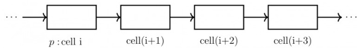

What do the following assignment statements achieve?

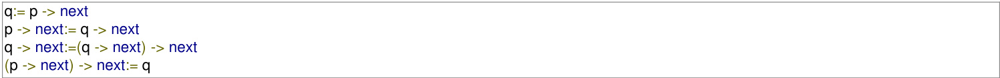

gate1998 data-structures linked-list normal descriptive

Write a constant time algorithm to insert a node with data $D$ just before the node with address $p$ of a singly linked list.

gate1999 data-structures linked-list descriptive

In the worst case, the number of comparisons needed to search a single linked list of length $\scriptstyle n$ for a given element is

A. logn B. n 2 C. log2 n -1 D. n

gatecse-2002 easy data-structures linked-list

Consider the function $f$ defined below.

struct item int data; struct item \* next;   
};   
int f(struct item ${ } ^ { \star } { \mathsf p }$ ) { return ( $( { \mathsf { p } } = = { \mathsf { N U L L } }$ ) $| |$ $1 \mid ( { \mathsf { p } } { \cdot } { > } { \mathsf { n e x t } } = = { \mathsf { N U L L } } ) \mid \mid$ $( ( p \neg { \mathsf { d a t a } } < = { \mathsf { p } } \neg { \mathsf { n e x t } } \to { \mathsf { d a t a } } ) \ \& \ \alpha$ $\scriptstyle \mathbf { f } ( { \mathsf { p } } - > { \mathsf { n e x t } } ) ) $ ;

For a given linked list $p$ , the function $f$ returns if and only if

A. the list is empty or has exactly one element B. the elements in the list are sorted in non-decreasing order of data value C. the elements in the list are sorted in non-increasing order of data value D. not all elements in the list have the same data value

A circularly linked list is used to represent a Queue. A single variable $p$ is used to access the Queue. To which node should $p$ point such that both the operations and can be performed in constant time?

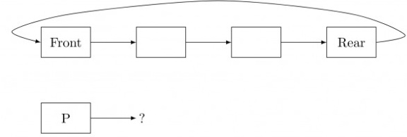

A. rear node B. front node C. not possible with a single pointer D. node next to front

gatecse-2004 data-structures linked-list normal

# Answer key☟

Suppose each set is represented as a linked list with elements in arbitrary order. Which of the operations among union, intersection, membership, cardinality will be the slowest?

A. union only B. intersection, membership C. membership, cardinality D. union, intersection

gatecse-2004 data-structures linked-list normal

# 3.10.14 Linked List: GATE CSE 2008 Question: 62

The following C function takes a single-linked list of integers as a parameter and rearranges the elements of the list. The function is called with the list containing the integers $^ { 1 , 2 , 3 , 4 , 5 , 6 , 7 }$ in the given order. What will be the contents of the list after function completes execution?

struct node int value; struct node \*next;   
void rearrange(struct node \*list) { struct node ${ { \bf { \dot { \rho } } } _ { \mathsf { p } , \mathsf { \dot { \rho } } } } _ { \mathsf { q } }$ int temp; if (!list $| |$ !list $\lnot > { \mathsf { n e x t } } )$ ) return; ${ \mathfrak { p } } =$ list; $\mathsf { q } = \mathsf { I i s t \mathrm { ~ \bar { \Omega } > } }$ next; while(q) { $\mathsf { t e m p } = \mathsf { p } \cdot >$ value; $p {  } { \mathsf { v a l u e } } = { \mathsf { q } }  { \mathsf { \iota } }$ alue; $\mathsf { q } \mathrm { - } \mathsf { > } \mathsf { V a l u e } =$ temp; ${ \mathsf p } = { \mathsf q }$ ->next; q = p? p ->next 0;

A. 1,2,3,4,5,6,7 B. 2,1,4,3,6,5,7   
C. 1,3,2,5,4,7,6 D. 2,3,4,5,6,7,1

Node \*p, \*q;   
if ((head $1 = = N \cup L L$ ) $| |$ (head $^ { - > }$ next $\scriptstyle = =$ NULL)) return head;   
${ \sf q } =$ NULL;   
${ \mathfrak { p } } =$ head;   
while (p->next != NULL) q=p; p=p->next;   
return head;

Choose the correct alternative to replace the blank line.

A. $\scriptstyle { \mathbf { q } } = { \mathbf { N U I L L } }$ ； $\mathbf { p }  \mathbf { n e x t } = \mathbf { h e a d } .$ ； $\mathbf { h e a d } = \mathbf { p }$ ;B. ${ \bf q } \to { \bf n e x t } = { \bf N U L L }$ ; head $\mathbf { \tau } = \mathbf { p }$ ； $\mathbf { p }  \mathbf { n e x t } = \mathbf { h e a d } ;$ C. head $\mathbf { \tau } = \mathbf { p }$ ; $\mathbf { p }  \mathbf { n e x t = q }$ ； ${ \bf q }  { \bf n e x t } = { \bf N U L L } ;$ ：D. ${ \bf q } \to { \bf n e x t } = { \bf N U L L }$ ； $\mathbf { p }  \mathbf { n e x t } = \mathbf { h e a d } ;$ ； $\mathbf { h e a d } = \mathbf { p }$ ;

$N$ items are stored in a sorted doubly linked list. For a delete operation, a pointer is provided to the record to be deleted. For a decrease-key operation, a pointer is provided to the record on which the operation is to be performed.

An algorithm performs the following operations on the list in this order: $\Theta ( N )$ delete, ${ \cal O } ( \log N )$ insert, $O ( \log N )$ find, and $\Theta ( N )$ decrease-key. What is the time complexity of all these operations put together?

A. $O ( \log ^ { 2 } N )$ B. O(N) C. O(N2) $\mathsf { D } . \ \Theta ( N ^ { 2 } \log N )$

gatecse-2016-set2 data-structures linked-list time-complexity normal algorithms

Consider the C code fragment given below.

typedef struct node int data; node\* next; node;   
void join(node\* m, node\* n) { node\* ${ \mathsf p } = { \mathsf n }$ ; while(p->next $\ ! =$ NULL) { ${ \mathsf { p } } = { \mathsf { p } } .$ p->next; } p->next = m;

Assuming that m and n point to valid NULL-terminated linked lists, invocation of join will

A. append list m to the end of list n for all inputs.   
B. either cause a null pointer dereference or append list m to the end of list n.   
C. cause a null pointer dereference for all inputs.   
D. append list n to the end of list m for all inputs.

What is the worst case time complexity of inserting $n$ elements into an empty linked list, if the linked list needs to be maintained in sorted order?

A. $\Theta ( n )$ $\mathsf { B } . \ \Theta ( n \log n )$ C. Θ(n2) D. Θ(1)

gatecse-2020 linked-list one-mark

Consider the problem of reversing a singly linked list. To take an example, given the linked list below,

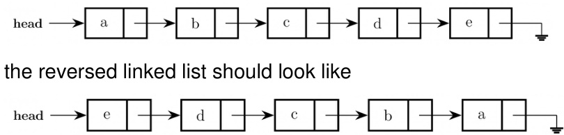

Which one of the following statements is about the time complexity of algorithms that solve the above problem in $O ( { \bf 1 } )$ space?

A. The best algorithm for the problem takes $\theta ( n )$ time in the worst case.   
B. The best algorithm for the problem takes $\theta ( n \log n )$ time in the worst case.   
C. The best algorithm for the problem takes $\theta ( n ^ { 2 } )$ time in the worst case.   
D. It is not possible to reverse a singly linked list in $O ( 1 )$ space.

Let  be a function that deletes a node in a singly-linked list given a pointer to the node and a pointer to the head of the list. Similarly, let DLLdel be another function that deletes a node in a doubly-linked list given a pointer to the node and a pointer to the head of the list.

Let $n$ denote the number of nodes in each of the linked lists. Which one of the following choices is  about the worst-case time complexity of  and

A. SLLdel is $O ( 1 )$ and is B. Bot h and are $O ( n )$ $O ( \log ( n ) )$ C. Bot h and are D. SLLdel is $O ( n )$ and DLLdel is $O ( 1 )$ 0(1)

F日 自 自 自 自 自 自 国国白丨国 □ 自 自 国 国

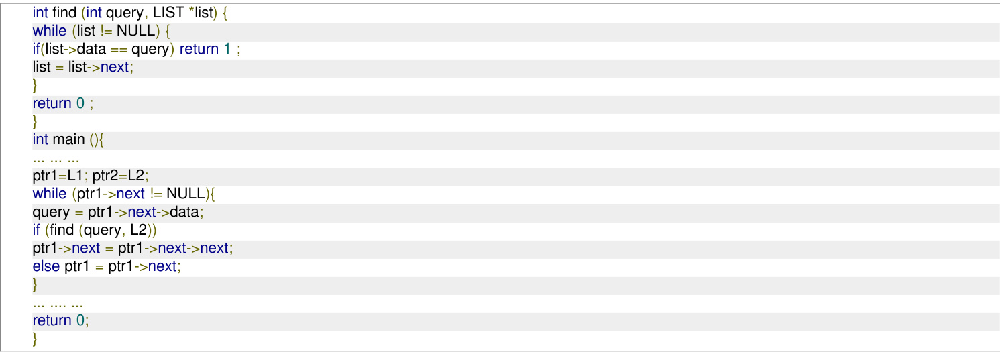

Consider the following code snippet in C language that computes the number of nodes in a non-empty singly linked list pointed to by the pointer variable head.

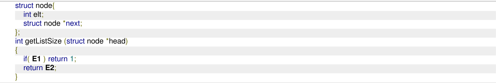

Which one of the following options gives the correct replacements for the expressions and E2?

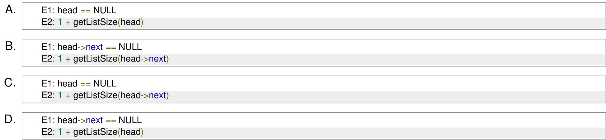

The following C function takes a singly-linked list of integers as a parameter and rearranges the elements of the list. The list is represented as pointer to a structure. The function is called with the list containing the integers $1 , 2 , 3 , 4 , 5 , \mathrm { \dot { 6 } } , 7$ in the given order. What will be the contents of the list after the function completes execution?

struct node {int value; struct node \*next;);   
void rearrange (struct node \*list) { struct node ${ { \bf { \dot { \rho } } } _ { \mathsf { p } , \mathsf { \Pi } } } ^ { * } { \bf { \dot { q } } }$ ; int temp; if (!list $| |$ !list $^ { - > }$ next) return; ${ \mathsf p } =$ list; $\mathsf { q } = \mathsf { I i s t \mathrm { ~ \ - > ~ } }$ next; while (q) { temp ${ \mathsf { \beta } } = { \mathsf { p } } \cdots { \mathsf { \beta } }$ value; $\mathsf { p }  \mathsf { v a l u e } = \mathsf { q } $ value; ${ \mathsf { q } } \gg$ value $\mathbf { \Sigma } = \mathbf { \Sigma }$ temp; ${ \mathsf p } = { \mathsf q } \to$ next; $\mathsf { q } = \mathsf { p } ? \mathsf { p } \to \mathsf { n e x t } : 0 ;$ ;

A. 1,2,3,4,5,6,7 B. C. 1,3,2,5,4,7,6 D. 2,3,4,5,6,7,1

gateit-2005 data-structures linked-list normal

A priority queue $Q$ is used to implement a stack that stores characters. PUSH (C) is implemented as INSERT $( Q , C , K )$ where $K$ is an appropriate integer key chosen by the implementation. POP is implemented as DELETEMIN $( Q )$ . For a sequence of operations, the keys chosen are in

A. non-increasing order B. non-decreasing order C. strictly increasing order D. strictly decreasing order

gate1997 data-structures stack normal priority-queue

Let $A$ be a priority queue for maintaining a set of elements. Suppose $A$ is implemented using a max-heap data structure. The operation $( A )$ extracts and deletes the maximum element from . The operation $( A , k e y )$ inserts a new element  in $A$ . The properties of a max-heap are preserved at the end of each of these operations.

When $A$ contains $n$ elements, which one of the following statements about the worst case running time of these two operations is

A. Both EXTRACT-MAX $( A )$ and $\mathrm { { I N S E R T } } ( A , k e y )$ run in $O ( 1 )$ .   
B. Both $( A )$ and $\mathrm { { I N S E R T } } ( A , k e y )$ run in $O ( \log ( n ) )$ .   
C. runs in $O ( 1 )$ whereas INSERT $( A , k e y )$ runs in $O ( n )$ .   
D. EXTRACT-MAX $( A )$ runs in $O ( 1 )$ whereas $( A , k e y )$ runs in $O ( \log ( n ) )$ .

Suggest a data structure for representing a subset $\boldsymbol { S }$ of integers from to $n$ . Following operations on the set $\boldsymbol { S }$ are to be performed in constant time (independent of cardinality of $\boldsymbol { S }$ ).

i. MEMBER $( X )$ Check whether $X$ is in the set $\boldsymbol { S }$ or not   
ii. FIND-ONE $( S )$ ： If $\boldsymbol { S }$ is not empty, return one element of the set $\boldsymbol { S }$ (any arbitrary element will do)   
ii. ADD $( X )$ ： Add integer $X$ to set $\boldsymbol { s }$   
ii. DELETE $( X )$ Delete integer X from $\boldsymbol { s }$

Give pictorial examples of your data structure. Give routines for these operations in an English like language. You may assume that the data structure has been suitable initialized. Clearly state your assumptions regarding initialization.

gate1992 data-structures normal descriptive queue

A queue $Q$ containing $n$ items and an empty stack $\boldsymbol { S }$ are given. It is required to transfer all the items from the queue to the stack, so that the item at the front of queue is on the TOP of the stack, and the order of all other items are preserved. Show how this can be done in $O ( n )$ time using only a constant amount of additional storage. Note that the only operations which can be performed on the queue and stack are Delete, Insert, Push and Pop. Do not assume any implementation of the queue or stack.

gate1994 data-structures queue stack normal descriptive Answer key☟

Consider the following statements:

i. First-in-first out types of computations are efficiently supported by STACKS.   
ii. Implementing LISTS on linked lists is more efficient than implementing LISTS on an array for almost all the basic LIST operations.   
iii. Implementing QUEUES on a circular array is more efficient than implementing QUEUES on a linear array with two indices.   
iv. Last-in-first-out type of computations are efficiently supported by QUEUES.

A. and are true B. $( i )$ and $( i i )$ are true C. $( i i i )$ and $( i v )$ are true D. $( i i )$ and $( \romannumeral 1 )$ are true gate1996 data-structures easy queue stack linked-list

# 3.12.4 Queue: GATE CSE 2001 Question: 2.16

What is the minimum number of stacks of size $\scriptstyle n$ required to implement a queue of size ?

A. One B. Two C. Three D. Four gatecse-2001 data-structures easy stack queue

if (stack-empty(S1)) then { print $^ { \mathrm { 4 } } \mathrm { Q }$ is empty”); return; } else while (!(stack-empty(S1))){ $\scriptstyle \mathsf { X } = \mathsf { p o p } ( \mathsf { S } 1 )$ ; push(S2,x); x=pop(S2);

Let $n$ insert and $m ( \leq n )$ delete operations be performed in an arbitrary order on an empty queue $Q$ . Let $x$ and $y$ be the number of push and pop operations performed respectively in the process. Which one of the following is true for all $m$ and $n ?$

A. $n + m \leq x < 2 n$ and $2 m \leq y \leq n + m$ B. $n + m \leq x < 2 n$ and $2 m \leq y \leq 2 n$ C. $2 m \leq x < 2 n$ and $2 m \leq y \leq n + m$ D. $2 m \leq x < 2 n$ and $2 m \leq y \leq 2 n$

Suppose a circular queue of capacity $( n - 1 )$ elements is implemented with an array of $n$ elements. Assume that the insertion and deletion operations are carried out using  and as array index variables, respectively. Initially, ${ \mathsf { R E A R } } = { \mathsf { F R O N T } } = 0$ . The conditions to detect queue full and queue empty ar

A. full $( \mathsf { R E A R + 1 } )$ mod $n { = } { = } \mathsf { F R O N T }$ empt $\mathrm { v } : \mathsf { R E A R } = = \mathsf { F R O N T }$ B. full $( \mathsf { R E A R + 1 } )$ mod $n { = } { = } \mathsf { F R O N T }$ empty $( \mathsf { F R O N T } + \mathbf { 1 } _ { }$ ） mod $n { = } { = }$ REAR C. fuli REAR $\scriptstyle = =$ FRONT empty $( \mathsf { R E A R + 1 } )$ ） mod $n { = } { = } \mathsf { F R O N T }$ D. full $( \mathsf { F R O N T } + 1 )$ mod $n { = } { }$ REAR empty REAR $\scriptstyle = =$ FRONT

Consider the following operation along with Enqueue and Dequeue operations on queues, where $k$ is global parameter.

MultiDequeue(Q){ ${ \mathfrak { m } } = { \mathfrak { k } }$ while $\mathsf { Q }$ is not empty) and $( \mathsf { m } > 0 )$ { Dequeue(Q) ${ \mathfrak { m } } = { \mathfrak { m } } - 1$

What is the worst case time complexity of a sequence of $n$ queue operations on an initially empty queue?

A. $\Theta ( n )$ B. 0(n+k) C. Θ(nk) D. Θ(n²)

gatecse-2013 data-structures algorithms normal queue

# Answer key☟

queue) ?

A. Both operations can be performed in $O ( 1 )$ time.   
B. At most one operation can be performed in $O ( 1 )$ time but the worst case time for the operation will be $\Omega ( n )$ . C. The worst case time complexity for both operations will be $\Omega ( n )$ .   
D. Worst case time complexity for both operations will be $\Omega ( \log n )$

Let $Q$ denote a queue containing sixteen numbers and $\boldsymbol { S }$ be an empty stack. $H e a d ( Q )$ returns the element at the head of the queue $Q$ without removing it from $Q$ . Similarly $T o p ( S )$ returns the element at the top of $\boldsymbol { S }$ without removing it from $\boldsymbol { S }$ . Consider the algorithm given below.

while Q is not Empty do   
if $\mathsf { s }$ is Empty OR Top(S) $\leq$ Head $( \mathsf { Q } )$ then $\ x { : = }$ Dequeue $( \mathsf { Q } )$ ; Push $( \mathsf { S } , \mathsf { x } )$ ;   
else $\mathsf { X } { : = } \mathsf { P o p } ( \mathsf { S } )$ ; Enqueue $( \mathsf { Q } , \mathsf { x } )$ ;   
end   
end

The maximum possible number of iterations of the while loop in the algorithm is gatecse-2016-set1 data-structures queue difficult numerical-answers

A circular queue has been implemented using a singly linked list where each node consists of a value and a single pointer pointing to the next node. We maintain exactly two external pointers FRONT and REAR pointing to the front node and the rear node of the queue, respectively. Which of the following statements is/are CORRECT for such a circular queue, so that insertion and deletion operations can be performed in $O ( 1 )$ time?

I. Next pointer of front node points to the rear node.   
II. Next pointer of rear node points to the front node. A. (I) only. B. (II) only.   
C. Both (I) and (II). D. Neither (I) nor (II).

gatecse-2017-set2 data-structures queue

# 3.12.11 Queue: GATE CSE 2018 Question: 3

A queue is implemented using a non-circular singly linked list. The queue has a head pointer and a pointer, as shown in the figure. Let $\scriptstyle n$ denote the number of nodes in the queue. Let 'enqueue' be implemented by inserting a new node at the head, and 'dequeue be implemented by deletion of a node from the tail.

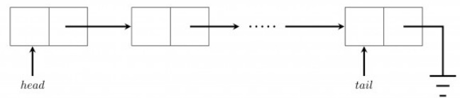

Which one of the following is the time complexity of the most time-efficient implementation of 'enqueue' and 'dequeue, respectively, for this data structure?

A. $\Theta ( 1 ) , \Theta ( 1 )$ B. $\Theta ( 1 ) , \Theta ( n )$ C. $\Theta ( n ) , \Theta ( 1 )$ D. $\Theta ( n ) , \Theta ( n )$ gatecse-2018 algorithms data-structures queue normal linked-list one-mark

Consider the queues $Q _ { 1 }$ containing four elements and $Q _ { 2 }$ containing none (shown as the  in the figure). The only operations allowed on these two queues are $\mathsf { \tilde { Q } } _ { }$ and $( \mathsf { Q } )$ . The minimum number of  operations on $Q _ { 1 }$ required to place the elements of $Q _ { 1 }$ in $Q _ { 2 } ^ { \mathrm { ~ ~ } }$ in reverse order (shown as the in the figure) without using any additional storage is

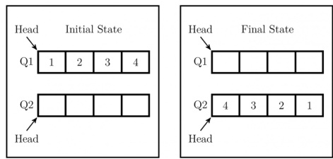

Consider a stack $\boldsymbol { s }$ and a queue $Q$ . Both of them are initially empty and have the capacity to store elements each. The elements $^ { 1 , 2 , 3 , 4 }$ and  arrive one by one, in that order. When an element arrives, it is assigned either to $\boldsymbol { S }$ (pushed on $\boldsymbol { S }$ ) or to $Q$ (enqueued to $Q$ ). Once all the five elements are stored, the output is generated in two steps. First, stack S is emptied by popping all elements. Then queue $Q$ is emptied by dequeueing all elements. The output obtained by following this process is .

Given the output, the objective is to predict whether an element was assigned to $\boldsymbol { S }$ or $Q$ .

Which of the following options is/are possible valid assignment(s) of the elements?

Note: In the options, the notation $x S$ denotes that element $x$ was assigned to $\boldsymbol { S }$ and $y Q$ denotes that element $y$ was assigned to $Q$ .

A. $1 S , 2 Q , 3 S , 4 S , 5 Q$ B. $1 Q , 2 Q , 3 S , 4 S , 5 Q$   
C. $1 Q , 2 Q , 3 Q , 4 S , 5 S$ D. $1 S , 2 S , 3 S , 4 Q , 5 Q$

gatecse-2026-set2 data-structures stack queue multiple-selects two-marks

# Answer key☟

The fundamental operations in a double-ended queue $D$ are:

insertFirst (e) Insert a new element $e$ at the beginning of $D$ .   
insertLast (e) Insert a new element $e$ at the end of D.   
removeFirst () Remove and return the first element of $D$ .   
removeLast () Remove and return the last element of $D$ .

In an empty double-ended queue, the following operations are performed:

insertFirst (10) insertLast (32) ${ \pmb a } \gets$ removeFirst () insertLast (28) insertLast (17) ${ \mathfrak { a } } \gets$ removeFirst () $\mathbf { a } \gets$ removeLast ()

The value of  is

Suppose you are given an implementation of a queue of integers. The operations that can be performed on the queue are:

i. isEmpty $( \mathbf { Q } )$ — returns true if the queue is empty, false otherwise.   
ii. delete $( \mathbf { Q } ) ^ { \dot { } }$ — deletes the element at the front of the queue and returns its value.   
iii. insert $( \mathrm { Q } , \mathrm { i } )$ — inserts the integer at the rear of the queue.

Consider the following function:

void (queue Q) {   
int i   
if (!isEmpty $( \mathsf { Q } )$ ) i = delete $( \mathsf { Q } )$ ; ${ \mathsf { f } } ( { \mathsf { Q } } )$ ; insert(Q, i);

What operation is performed by the above function $f$ ?

A. Leaves the queue $Q$ unchanged   
B. Reverses the order of the elements in the queue $Q$   
C. Deletes the element at the front of the queue $Q$ and inserts it at the rear keeping the other elements in the same order   
D. Empties the queue $Q$

gateit-2007 data-structures queue normal ✍ Practice Tests: Test 1 (15Q) Test 2 (10Q)

Compute the postfix equivalent of the following infix arithmetic expression $a + b * c + d * e \uparrow f$ where  represents exponentiation. Assume normal operator precedences.

gate1989 descriptive data-structures stack

Which of the following permutations can be obtained in the output (in the same order) using a stack assuming that the input is the sequence in that order?

A. $\mathbf { \Sigma } _ { \mathsf { D . ~ 5 , 4 , 3 , 1 , 2 } } ^ { \mathsf { B . ~ 3 , 4 , 5 , 2 , 1 } }$   
C.

gate1994 data-structures stack normal

Answer key☟

# 3.13.4 Stack: GATE CSE 1995 Question: 2.21

The postfix expression for the infix expression $A + B * ( C + D ) / F + D * E$ is:

A. $A B + C D + * F / D + E *$ B. $A B C D + * F / D E * + +$   
C. $A * B + C D / F * D E + +$ D. $A + * B C D / F * D E + +$

gate1995 data-structures stack easy

# Answer key☟

# 3.13.5 Stack: GATE CSE 2000 Question: 13

Suppose a stack implementation supports, in addition to PUSH and POP, an operation REVERSE, which reverses the order of the elements on the stack.

A. To implement a queue using the above stack implementation, show how to implement ENQUEUE using a single operation and DEQUEUE using a sequence of  operations.   
B. The following post fix expression, containing single digit operands and arithmetic operators $+$ and $*$ , is evaluated using a stack. $5 2 * 3 4 + 5 2 * * +$ Show the contents of the stack i. After evaluating $5 2 * 3 4 +$ ii. After evaluating $5 2 * 3 4 + 5 2$ iii. At the end of evaluation

gatecse-2000 data-structures stack normal descriptive

Let S be a stack of size $n \geq 1$ Starting with the empty stack, suppose we push the first $n$ natural numbers sequence, and then perform $\scriptstyle n$ pop operations. Assume that Push and Pop operations take $X$ seconds each, and $Y$ seconds elapse between the end of one such stack operation and the start of the next operation. For $m \geq 1$ , define the stack-life of $m$ as the time elapsed from the end of $P u s h ( m )$ to the start of the pop operation that removes $m$ from S. The average stack-life of an element of this stack is

A. $n ( X + Y )$ $\mathsf { B } . \mathsf {  { \mathsf { 3 } } } Y + 2 X \qquad \mathsf { C } . \mathsf {  { \mathsf { 3 } } } \left( X + Y \right) - X \qquad \mathsf {  { \mathsf { D } } . \mathsf {  { \mathsf { Y } } } } + 2 X$

gatecse-2003 data-structures stack normal

# 3.13.7 Stack: GATE CSE 2004 Question: 3

A single array $A [ 1 \ldots \mathrm { M A X S I Z E } ]$ is used to implement two stacks. The two stacks grow from opposite ends of the array. Variables and $( t o p 1 < t o p 2 )$ ） point to the location of the topmost element in each of the stacks. If the space is to be used efficiently, the condition for "stack full" is

A. $( t o p 1 = \mathrm { M A X S I Z E } / 2 )$ and $( t o p 2 = \mathrm { M A X S I Z E } / 2 + \tt B . ) t o p 1 + t o p 2 = \mathrm { M A X S I Z E }$ C. $\mathbf { \Lambda } ( t o p 1 = \mathrm { M A X S I Z E } / 2 )$ or $( t o p 2 = \mathrm { M A X S I Z E } )$ D. $t o p \mathbf { 1 } = t o p \mathbf { 2 } - \mathbf { 1 }$

The best data structure to check whether an arithmetic expression has balanced parentheses is a

A. queue B. stack C. tree D. list

gatecse-2004 data-structures easy stack

Suppose a stack implementation supports an instruction , which reverses the order of elements on the stack, in addition to the and instructions. Which one of the following statements is (with respect to this modified stack)?

A. A queue cannot be implemented using this stack.   
B. A queue can be implemented where  takes a single instruction and  takes a sequence of two instructions.   
C. A queue can be implemented where takes a sequence of three instructions and takes a single instruction.   
D. A queue can be implemented where both and  take a single instruction each.

# Consider the C program below

#include <stdio.h>   
int ${ } ^ { \star } { \sf A } ,$ stkTop;   
int stkFunc (int opcode, int val) static int size $_ { = 0 }$ , stkTop $_ { \ d = 0 }$ ; switch (opcode) case -1: size $\mathbf { \Sigma } = \mathbf { \Sigma }$ val; break; case 0: if (stkTop $<$ size A[stkTop $^ { + + }$ ]=val; break; default: if (stkTop) return A[--stkTop]; } return -1;   
int main() int B[20]; $\mathsf { A } { = } \mathsf { B }$ ; stkTop $= - 1$ ; stkFunc (-1, 10); stkFunc (0, 5); stkFunc (0, 10); printf $" \% 0 \text{‰}$ , stkFunc( $1 , 0 ) +$ stkFunc(1, 0));

The value printed by the above program is gatecse-2015-set2 data-structures stack easy numerical-answers push(54); push(52); pop(); push(55); push(62); S 二 pop();

Consider the following sequence of operations on an empty queue.

enqueue(21); enqueue(24); dequeue(); enqueue(28); enqueue(32); ${ \mathfrak { q } } =$ dequeue();

The value of $\mathsf { s } { \ + } \mathsf { q }$ is gatecse-2021-set1 data-structures stack easy numerical-answers one-mark

Consider a sequence $a$ of elements $a _ { 0 } = 1 , a _ { 1 } = 5 , a _ { 2 } = 7 , a _ { 3 } = 8 , a _ { 4 } = 9$ , and $a _ { 5 } = 2$ . The following operations are performed on a stack $\boldsymbol { S }$ and a queue $Q$ both of which are initially empty.

I. push the elements of $a$ from $a _ { 0 }$ to $a _ { 5 }$ in that order into $\boldsymbol { S }$ . II. the elements of $\mathbf { \Delta } _ { a }$ from $a _ { 0 }$ to $a _ { 5 }$ in that order into $Q$ .   
III. pop an element from $\boldsymbol { S }$ .   
IV. an element from $Q$ . V. an element from $\boldsymbol { S }$ .   
VI. an element from $Q$   
VII. an element from $Q$ and push the same element into $\boldsymbol { S }$ .   
VIII. Repeat operation $\mathrm { \Delta } \mathrm { \Psi } \mathrm { \Sigma } \mathrm { W I }$ three times.   
IX. an element from $\boldsymbol { S }$ . X. an element from $\boldsymbol { S }$ .

The top element of $\boldsymbol { S }$ after executing the above operations is ​Let  and  be two stacks. has capacity of  elements. has capacity of  elements. already has elements: , and , whereas  is empty, as shown below.

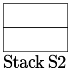

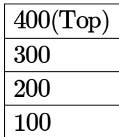
Stack S1

Only the following three operations are available:

PushToS2: Pop the top element from S1 and push it on S2.   
PushToS1: Pop the top element from S2 and push it on S1.   
GenerateOutput: Pop the top element from S1 and output it to the user.

Note that the pop operation is not allowed on an empty stack and the push operation is not allowed on a full stack. Which of the following output sequences can be generated by using the above operations?

A. 100,200,400,300 B. 200,300,400,100   
C. 400,200,100,300 D. 300,200,400,100

Consider a stack data structure into which we can PUSH and POP records. Assume that each record pushed in the stack has a positive integer key and that all keys are distinct.

We wish to augment the stack data structure with an $O ( 1 )$ time MIN operation that returns a pointer to the record with smallest key present in the stack

1. without deleting the corresponding record, and   
2. without increasing the complexities of the standard stack operations.

Which one or more of the following approach(es) can achieve it?

A. Keep with every record in the stack, a pointer to the record with the smallest key below it.   
B. Keep a pointer to the record with the smallest key in the stack.   
C. Keep an auxiliary array in which the key values of the records in the stack are maintained in sorted order.   
D. Keep a Min-Heap in which the key values of the records in the stack are maintained.

Consider the following pseudocode.

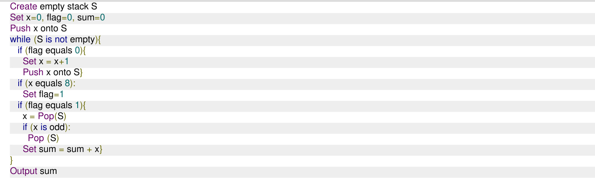

The value of  output by a program executing the above pseudocode is (Answer in integer)

gateda-2025 data-structures stack output numerical-answers two-marks

A program attempts to generate as many permutations as possible of the string, ' ' by pushing the characters $^ { a , b , c , d }$ in the same order onto a stack, but it may pop off the top character at any time. Which one of the following strings CANNOT be generated using this program?

A. abcd B. dcba C. cbad D. cabd

gateit-2004 data-structures normal stack

# Consider the following C program:

#include <stdio.h> #define EOF -1 void push (int); $/ ^ { \star }$ push the argument on the stack $^ { \star } /$ int pop (void); $/ ^ { \star }$ pop the top of the stack $^ { * } /$ void flagError $( )$ ; int main () $\{$ int c, m, n, r; while ((c = getchar ()) != EOF) { if (isdigit (c) ) push (c); else if $( ( { \mathsf { C } } = = { \mathsf { \Omega } } ^ { \prime } + { \mathsf { \Omega } } ) \parallel ( { \mathsf { C } } = = { \mathsf { \Omega } } ^ { \prime } { \star } ) )$ $\mathsf { m } = \mathsf { p o p } \left( \begin{array} { r l } \end{array} \right)$ ); $\boldsymbol { \mathsf { n } } = \mathsf { p o p } \left( \right)$ ; $\mathsf { r } = ( \mathsf { c } = = { \mathsf { \bar { \Phi } } } _ { + } ^ { \prime } ) ? \mathsf { n } + \mathsf { m } : \mathsf { n } ^ { * } \mathsf { m } ;$ push (r); } else if $( { \mathsf { c } } \mathrel { ! } = \mathrel { ' } \prime )$ flagError (); printf("% c", pop ());

What is the output of the program for the following input? $5 2 * 3 3 2 + * +$

A. B. C. 30 D. 150

gateit-2007 stack normal

A meld operation on two instances of a data structure combines them into one single instance of the same data structure. Consider the following data structures:   
P. Unsorted doubly linked list with pointers to the head node and tail node of the list.   
Q. Min-heap implemented using an array.   
R. Binary Search Tree.

Which ONE of the following options gives the worst-case time complexities for meld operation on instances of size $n$ of these data structures?

A. ${ \mathbf { P } } : \Theta ( 1 ) , { \mathbf { Q } } : \Theta ( n ) , { \mathbf { R } } : \Theta ( n )$ B. : $\mathfrak { h } ( \mathrm { 1 } ) , \mathrm { Q } : \Theta ( n \log n ) , \mathrm { R } : \Theta ( n )$ C $\cdot \ \mathbf { P } \mathrm { : } \Theta ( n ) , \mathbf { Q } \mathrm { : } \Theta ( n \log n ) , \mathbf { R } \mathrm { : } \Theta \left( n ^ { 2 } \right)$ D. $\mathrm { P : } \Theta ( 1 ) , \mathrm { Q : } \Theta ( n ) , \mathrm { R : } \Theta ( n \log \dot { n } )$

# Answer key☟

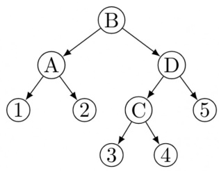  
Fig.4

(i) Show how to merge to the tree, $T _ { 1 }$ elements from tree $T _ { 2 }$ shown in Fig using node D of tree .

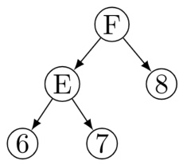  
Fig.5

(ii) What is the time complexity of a merge operation of balanced trees $T _ { 1 }$ and $T _ { 2 }$ where $T _ { 1 }$ and $T _ { 2 }$ are of height $h _ { 1 }$ and $h _ { 2 }$ respectively, assuming that rotation schemes are given. Give reasons.

gate1990 data-structures tree descriptive

A  tree is such that

a. All internal nodes have either 2 or children b. All paths from root to the leaves have the same length

The number of internal nodes of a 3 tree having leaves could be

AB. D. 7

gate1992 tree data-structures normal multiple-selects

A  tree is a tree in which every internal node has exactly three children. Use induction to prove that the number of leaves in a ary tree with $n$ internal nodes is $2 ( n + 1 )$ .

gate1994 data-structures tree proof descriptive