A complete $n$ -ary tree is one in which every node has  or $\scriptstyle n$ sons. If $x$ is the number of internal nodes of a complete $n$ -ary tree, the number of leaves in it is given by

A. $x ( n - 1 ) + 1$ B. xn 11 C. xn+1 D. $x ( n + 1 )$

gate1998 data-structures tree normal

# Answer key☟

# 3.15.6 Tree: GATE CSE 2002 Question: 2.9

The number of leaf nodes in a rooted tree of n nodes, with each node having or children is:

A. $\textstyle { \frac { n } { 2 } }$ B. $\frac { ( n - 1 ) } { 3 }$ C (n-1) D. (2n+1) 3

gatecse-2002 data-structures tree normal

Answer key☟

# 3.15.7 Tree: GATE CSE 2004 Question: 6

Level order traversal of a rooted tree can be done by starting from the root and performing

A. preorder traversal B. in-order traversal C. depth first search D. breadth first search

gatecse-2004 data-structures tree easy

# 3.15.8 Tree: GATE CSE 2005 Question: 36

In a complete $k$ -ary tree, every internal node has exactly $k$ children. The number of leaves in such a tree with $n$ internal node is:

A. $\begin{array} { c c c } { { \mathsf { B . } \ ( n - 1 ) k + 1 } } & { { \qquad } } & { { \mathsf { C . } \ n ( k - 1 ) + 1 } } \end{array} \qquad \begin{array} { c c } { { \mathsf { D . } \ n ( k - 1 ) } } & { { \qquad } } & { { \mathsf { D . } \ n ( k - 1 ) } } \end{array}$

gatecse-2005 data-structures tree normal

# Answer key☟

# 3.15.9 Tree: GATE CSE 2007 Question: 43

A complete $n - a r y$ tree is a tree in which each node has $n$ children or no children. Let $I$ be the number of internal nodes and $L$ be the number of leaves in a complete $n - a r y$ tree. If $L = 4 1$ and $I = 1 0$ , what is the value of $n ^ { \prime }$ ?

A. B. 4 C. D. 6

gatecse-2007 data-structures tree normal

Answer key☟

The order in which the nodes are visited during an in-order traversal of the tree is

A. SQPTRWUV B. SQPTUWRV C. SQPTWUVR D. SQPTRUWV

Consider the pseudocode given below. The function takes as argument a pointer to the root of an arbitrary tree represented by the  representation. Each node of the tree is of type .

typedef struct treeNode\* treeptr;   
struct treeNode treeptr leftMostChild, rightSibling;   
int DoSomething (treeptr tree) int value $_ { : = 0 }$ ; i (tree $\mid =$ NULL) { if (tree->leftMostChild $\scriptstyle = =$ NULL) value $= 1$ ; else value $\mathbf { \Sigma } = \mathbf { \Sigma }$ DoSomething(tree->leftMostChild); value $\mathbf { \Sigma } = \mathbf { \Sigma }$ value $^ +$ DoSomething(tree->rightSibling); } return(value);

When the pointer to the root of a tree is passed as the argument to , the value returned by the function corresponds to the

A. number of internal nodes in the B. height of the tree. tree.   
C. number of nodes without a right D. number of leaf nodes in the tree sibling in the tree.

Let $T$ be a tree with vertices. The sum of the degrees of all the vertices in $T$ is

gatecse-2017-set1 data-structures tree easy numerical-answers

A n in a connected graph is a vertex such that removing the vertex and its inciden edges disconnects the graph into two or more connected components.

Let $T$ be a  tree obtained by doing  in a connected undirected graph . Which of the following options is/are correct?

A. Root of $T$ can never be an articulation point in $G$ .   
B. Root of $T$ is an articulation point in $G$ if and only if it has  or more children.   
C. A leaf of $T$ can be an articulation point in $G$ .   
D. I f $u$ is an articulation point in $G$ such that $x$ is an ancestor of $u$ in $T$ and $y$ is a descendent of $u$ in $T$ , then all paths from $x$ to $y$ in $G$ must pass through $u$ .

✍ Practice Test: Test 1 (5Q)

The set $\mathbf { T }$ represents various traversals over binary tree. The set represents the order of visiting nodes during a traversal.

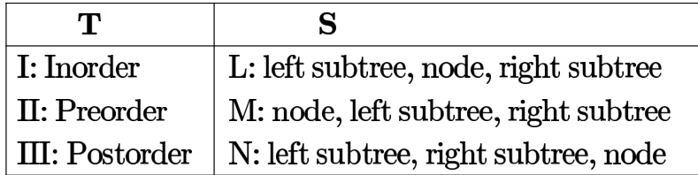

Which one of the following is the correct match from  to  ?

A. I-L,Ⅱ-M,I-N B.I-M,Ⅱ-L,I-N C.I-N,I-M,Ⅲ-L D.I-L,I-N,Ⅲ-M gatecse-2026-set2 data-structures tree-traversal one-mark

Consider performing uniform hashing on an open address hash table with load factor $\begin{array} { r } { \alpha = \frac { n } { m } < 1 } \end{array}$ where $\scriptstyle n$ elements are stored in the table with $m$ slots. The expected number of probes in an unsuccessful search is at most $\textstyle { \frac { 1 } { 1 - \alpha } }$ . Inserting an element in this hash table requires at most probes, on average.

A. $\begin{array} { r } { \ln \left( \frac { 1 } { 1 - \alpha } \right) } \end{array}$ $\begin{array} { r } { \textsf { B . } \frac { 1 } { 1 - \alpha } } \end{array}$ $\mathsf { C } . \mathsf { \Omega } ^ { 1 + \frac { \alpha } { 2 } }$ D. $\textstyle { \frac { 1 } { 1 + \alpha } }$ gate-ds-ai-2024 data-structures hashing uniform-hashing one-mark

# Answer key☟

# Answer Keys

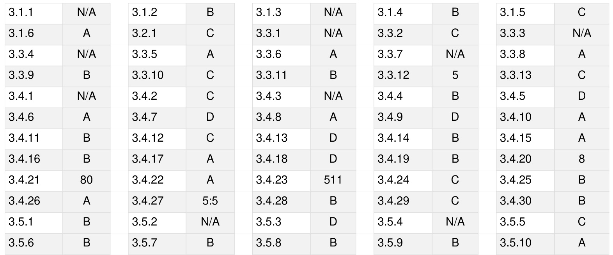

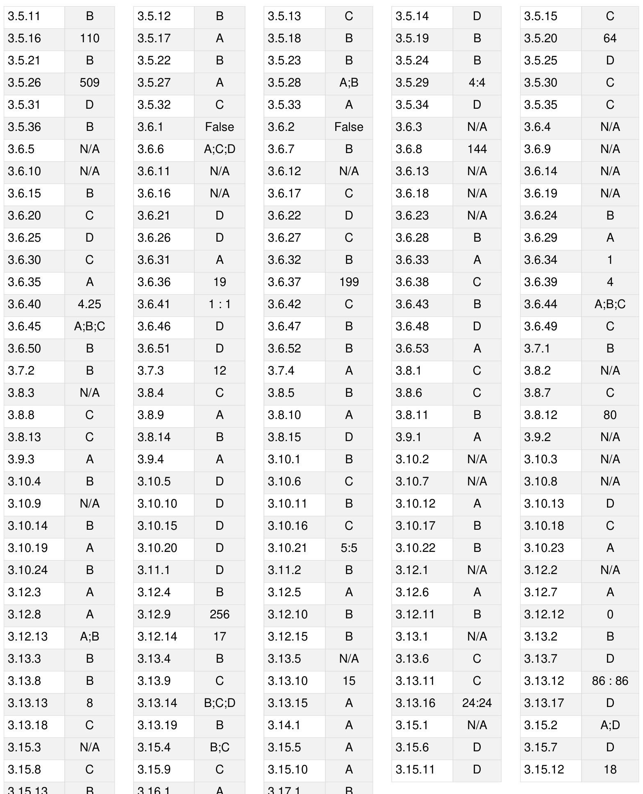

Programming in C. Recursion.

Mark Distribution in Previous GATE   
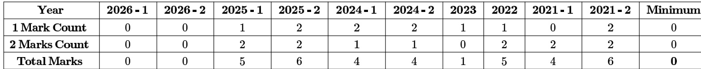

Welcome to the "Programming and DS: Prog ramming" chapter, specifically focusing on the crucial aspect of Output. This subject is fundamental to understanding how programs execute and interact with the user or external systems. For the GATE Computer Science exam, mastering output prediction is not merely about knowing syntax; it's about deeply comprehending the semantics of programming languages, including data types, operators, control flow, memory management, and function calls. Questions related to output prediction are ubiquitous in the GATE CS paper, often integrated into problems involving $\mathsf { C } / \mathsf { C } + + \prime$ /Python code snippets. They typically carry a weightage of 1-2 marks per question, but their underlying concepts are essential for solving larger programming problems. You can expect Multiple Choice Questions (MCQs), Multiple Select Questions (MSQs), and Numerical Answer Type (NAT) questions where you must accurately determine the final output of a given program or code segment.

# Topic-wise Key Concepts

# Basic Output Functions $\mathbf { \hat { C } } / \mathbf { C } + + \mathbf { \eta }$ /Python)

his section covers the primary mechanisms for displaying information to the console, which is critical for verifying program logic and understanding execution flow.

Definition and Core Idea: Output functions are library routines or built-in statements that send data from a program to a standard output device, typically the console. They allow programs to communicate results, status, or prompts to the user.

Important Formulas, Theorems, and Results: C - printf(): The standard output function in C. int printf(const char \*format, ...); Returns the number of characters printed, or a negative value on error.

Format Specifiers: These tell printf how to interpret and display the corresponding argument.   
■ $\% \mathsf { d }$ or $\% \mathrm { i }$ : Signed decimal integer   
■ $\% \mathrm { ~ }$ : Unsigned decimal integer   
■ $\\text{‰}$ : Unsigned octal integer   
■ $\% x$ or $\% x$ : Unsigned hexadecimal integer (lowercase/uppercase)   
■ %f: Decimal floating point (float or double)   
■ %lf: Used with scanf for double, but %f works for printf for both float and double due to default argument promotions.   
■ $\% \text{‰}$ or $\% E$ : Scientific notation (lowercase/uppercase 'e')   
■ $\% 9$ or $\% G$ : Shorter of %f or $\% 0$   
■ $\% c$ : Character $\\text{‰}$ : String (null-terminated character array)   
■ $\% 0$ : Pointer address (implementation-defined format) $\%$ : Prints a literal $\%$ character %n: Writes the number of characters written so far into the integer pointed to by the corresponding argument.

# Flags (optional):

-: Left-justify   
$+ \mathrm { . }$ Always print sign for signed numbers   
(space): Print space if no sign   
0: Pad with leading zeros   
#: Alternate form (e.g., $0 \times$ for hex, leading zero for octal, decimal point for floats)

Width (optional): Minimum field width.

Precision (optional): For floats, number of digits after decimal; for strings, max number of characters to print.

$^ { \circ + + }$ cout: The standard output stream object in $^ { \mathsf { C } + + }$ std::cout $\scriptstyle < <$ expression $\scriptstyle < <$ expression ...;

Uses operator overloading for various data types. No format specifiers like printf, but manipulators can be used.

# Manipulators:

std::endl: Inserts a newline character and flushes the buffer.   
std::fixed: Uses fixed-point notation for floating-point numbers.   
std::scientific: Uses scientific notation.   
std::setprecision(n): Sets the decimal precision (total digits for default, digits after decimal for fixed/scientific).   
std::setw(w): Sets field width for the next item.   
std::left, std::right: Justification.   
std::hex, std::oct, std::dec: Base conversion.

Python print(): The built-in function for output in Python. print(\*objects, $\mathsf { s e p } = 1$ end $\vert = ^ { \prime } \ln ^ { \prime }$ , file $\ c =$ sys.stdout, flush $\mid =$ False)

\*objects: One or more objects to be printed.   
sep $\ c = ^ { \prime }$ ': Separator between objects (default is space).   
end $= \ " \boldsymbol { \mathsf { m } } ^ { \prime }$ : String appended after the last object (default is newline).   
file $\vDash$ sys.stdout: Output stream (default is standard output).

# Formatted String Literals (f-strings) (Python $\pmb { 3 . 6 + }$ ):

f"text {variable name:format specifier} text"

Example: f"Value: {x:.2f}" for two decimal places.

Escape Sequences (Common to $\pmb { \complement } / \mathbf { C } + + I$ Python strings):

\n: Newline   
\t: Horizontal tab   
\b: Backspace   
\r: Carriage return   
\\: Backslash   
\': Single quote   
\": Double quote   
\0: Null character (string terminator in ${ \mathsf { C } } / { \mathsf { C } } + + { \mathsf { \Omega } }$ )   
\xhh: Hexadecimal value hh   
\ooo: Octal value ooo

# Key Properties and Identities:

0 printf returns the count of characters printed.   
。 cout returns a reference to std::cout, allowing chaining. print() in Python always returns None. String literals in ${ \mathsf { C } } / { \mathsf { C } } + +$ are null-terminated. Floating-point precision issues can lead to unexpected output.

Common Pitfalls or Tricky Points:

Mismatching format specifiers in C printf: Using $\% d$ for a float or %f for an int leads to undefined behavior, often printing garbage.   
Missing arguments for printf: If a format specifier is present but no corresponding argument, it can lead to crashes or printing garbage from the stack.   
Forgetting std::endl vs. $" \boldsymbol { \mathbf { \mathit { n } } } ^ { \prime }$ in $^ { \circ + + }$ : std::endl flushes the buffer, which can be slower. $" \boldsymbol { \mathsf { n } } ^ { \prime }$ just inserts a newline. Python print() default behavior: Forgetting sep or end arguments can lead to unintended spacing or newlines. Precision with floating-point numbers: Output might be truncated or rounded differently than expected due to internal representation.   
Buffer flushing: Output might not appear immediately if the buffer is not flushed (e.g., after printf without a newline, or cout without endl).

Standard Problem-Solving Techniques:

Trace format specifiers carefully: For C printf, ensure each format specifier matches the type and order of the arguments.   
Understand default output behavior: For $^ { \mathsf { C } + + }$ , know that cout automatically handles types. For Python, remember default $\mathsf { s e p } = 1$ and end $\vert = ^ { \prime } \ln ^ { \prime }$ .   
Dry run with specific values: Substitute variables with their values and mentally execute the output statement. Pay attention to escape sequences: These can drastically alter the visual layout of the output.

# Data Types and Type Casting

The way data is stored and interpreted directly influences its output. Type casting allows explicit conversion, which is a common source of tricky output questions.

Definition and Core Idea: Data types define the kind of values a variable can hold and the operations that can be performed on them. Type casting is the process of converting a value from one data type to another, either implicitly (automatic) or explicitly (programmer-specified).

Important Formulas, Theorems, and Results:

Integer Types $( C / { \bf C } + + )$ : char, short, int, long, long long (signed/unsigned variants). Sizes are implementation  
dependent but typically: char: byte   
■ short: 2 bytes int: 2 or 4 bytes (commonly 4) long: 4 or 8 bytes (commonly 4 on 32-bit, 8 on 64-bit) long long: 8 bytes

Floating-Point Types $( C / { \bf C } + + )$ : float, double, long double. float: 4 bytes (single precision) double: 8 bytes (double precision) long double: 10 or 16 bytes

Implicit Type Conversion (Promotion): Occurs automatically in expressions to prevent data loss. Smaller types are promoted to larger types (e.g., int to float, float to double).   
Example: int ${ \dot { \mathsf { I } } } = 5$ ; float ${ \mathfrak { f } } = 2 . 5$ ; float result $\mathbf { \sigma } = \mathbf { i } \mathbf { \sigma } + \mathbf { \sigma }$ f; (i is promoted to float).

Explicit Type Casting (C-style): (type)expression Example: int $\mathsf { X } = ( \mathsf { i n t } ) 3 . 1 4$ ; $\langle { \sf x }$ becomes 3)

Explicit Type Casting ( $( c + +$ -style):

static _cast<type>(expression): For safe and predictable conversions (e.g., numeric conversions). reinterpret_cast<type>(expression): For low-level, potentially unsafe conversions (e.g., pointer to integer). 。 Integer Division: In $\mathsf { C } / \mathsf { C } \mathrm { + } \mathsf { + } / \mathsf { P }$ ython 2, division of two integers results in an integer (truncates fractional part). Example: int $\mathtt { a } = 7 / 3$ ; (a becomes 2) In Python 3, performs float division, // performs integer (floor) division.

# Key Properties and Identities:

When a larger type is cast to a smaller type, data loss can occur (e.g., double to int truncates, int to char can lose higher-order bits).   
。 Unsigned integers wrap around on overflow/underflow.   
Character types are often treated as small integers in arithmetic operations (ASCII values).

Common Pitfalls or Tricky Points:

Integer division vs. floating-point division: $5 / 2$ is 2 in ${ \mathsf { C } } / { \mathsf { C } } + +$ , but $5 . 0 / 2$ is 2.5.   
Loss of precision/data: Casting a large int to a float can lose precision if the int value exceeds the float's representable range. Casting a negative number to an unsigned type can result in a large positive number.   
Character arithmetic: $\because A ^ { \prime } + 1$ results in 'B' (assuming ASCII).   
Order of operations with casting: (float)a b vs. (float)(a / b) yield different results if a and b are integers.

Standard Problem-Solving Techniques:

。 Identify implicit conversions: Trace expressions to see how types are promoted.   
0 Evaluate explicit casts carefully: Understand the potential for truncation or data loss.   
。 Pay attention to integer division: Always check if operands are integers or floats.   
。 Consider the range of data types: Especially for questions involving overflow/underflow or conversions between signed/unsigned types.

# Operators and Expressions

Operators combine variables and values to form expressions, whose evaluation order is governed by precedence and associativity, directly impacting the final output.

Definition and Core Idea: Operators are symbols that perform operations on one or more operands. An expression is a combination of operators, operands, and function calls that evaluates to a single value.

Important Formulas, Theorems, and Results:

Arithmetic Operators: $+ , - , \star , / , \%$ (modulus). $\%$ operator only works with integer operands.   
Relational Operators: $\scriptstyle = =$ (equal to), $\mathrel { \mathop : } =$ (not equal to), $< , > , < = , > =$ . ■ Return 0 (false) or (true) in ${ \mathsf { C } } / { \mathsf { C } } + +$ . Return True or False in Python.   
Logical Operators: ${ \mathsf { C } } / { \mathsf { C } } + +$ : && (AND), || (OR), ! (NOT). Short-circuit evaluation: && evaluates right operand only if left is true. $| |$ evaluates right operand only if left is false. ■ Python: and, or, not.

Bitwise Operators $( C / { \bf C } + + )$ : & (AND), (OR), / (XOR), $\sim$ (NOT), $\ll$ (left shift), $\gg$ (right shift).

■ $< < : x < < y$ is equivalent to $x \times 2 ^ { y }$ .   
$\cdot > > : \mathsf { X } > > \mathsf { y }$ is equivalent to $x / 2 ^ { y }$ . For signed numbers, right shift behavior (arithmetic vs. logical) can be implementation-defined for negative numbers.

Assignment Operators: $= , + = , - = , \mathbf { \varphi } ^ { \star } = , / = , \% = , \& = , / = , \uparrow = , < < = , > >$ .

Increment/Decrement Operators $( C / C + + ) : + +$ (increment), -- (decrement)

■ Prefix $( + + x )$ : Increments then uses the new value. Postfix $( x + + )$ : Uses the current value then increments.   
Conditional (Ternary) Operator $( C / { \bf C } + + )$ : condition ? expression1 expression2. If condition is true, expression1 is evaluated; otherwise, expression2 is evaluated.   
Comma Operator $( C / { \bf C } + + )$ : expression1, expression2. Evaluates expression1, discards its result, then evaluates expression2 and returns its result.   
Operator Precedence and Associativity: (See Quick Formula Reference for detailed table) Precedence determines which operator is evaluated first in an expression (e.g., before $^ +$ ). Associativity determines evaluation order for operators of the same precedence (e.g., left-to-right for arithmetic, right-to-left for assignment).

# Key Properties and Identities:

。 In ${ \mathsf { C } } / { \mathsf { C } } + +$ , any non-zero value is considered true in a boolean context; zero is false. 。 Side effects: Operators like $^ { + + }$ , --, and assignment operators modify the value of an operand. 。 Undefined behavior: Modifying a variable multiple times within the same expression without an intervening sequence point (e.g., $\dot { \mathsf { I } } = \dot { \mathsf { I } } + + \mathsf { + + } \dot { \mathsf { I } } \dot { \mathsf { I } } ,$ ) leads to undefined behavior.

# Common Pitfalls or Tricky Points:

。 $\mathbf { \tau } = \mathbf { \tau }$ vs. $\scriptstyle = =$ : Accidental assignment in a conditional (e.g., f $( \mathsf { X } = 0 )$ ) instead of if $( \mathsf { X } = = 0 )$ )). The assignment evaluates to 0 (false), so the block might not execute.   
Operator precedence errors: Misinterpreting the order of operations can lead to incorrect results (e.g., $1 + 2 ^ { \star } 3$ is 7, not 9).   
Side effects with increment/decrement: Understanding when the value is used and when it's updated (prefix vs. postfix) is crucial, especially in complex expressions.   
Short-circuiting: Logical operators $\& \&$ and $| |$ can prevent the evaluation of the right-hand operand, which can hide side effects or prevent errors (e.g., null pointer dereference).   
Bitwise operations on signed numbers: Right shift of negative numbers can be tricky due to sign extension. Comma operator: Often misunderstood; only the last expression's value is returned.

Standard Problem-Solving Techniques:

0 Parenthesize ambiguous expressions: If unsure about precedence, add parentheses.   
0 Trace side effects: Keep track of variable values \*before\* and \*after\* each operation, especially with $+ + / \mathrm { - }$ . Evaluate expressions step-by-step: Apply precedence and associativity rules rigorously. Understand short-circuiting: Determine if the right-hand side of a logical expression will be evaluated.

# Control Flow Statements

Control flow statements dictate the order in which instructions are executed, determining which parts of the code contribute to the final output.

Definition and Core Idea: Control flow statements manage the sequence of execution of program instructions. They include conditional statements (if-else, switch) for decision-making and loop statements (for, while, do-while) for repetition.

Important Formulas, Theorems, and Results: if-else $( C / \ C + + /$ Python): if (condition) $\{ \nearrow$ statements $^ { \star } /$ } else $\{ \nearrow$ statements \*/ } In Python, if condition: ... elif condition: ... else:

switch-case $( C / C + + )$ :   
switch (expression) case constant1: ... break; case constant2: ... break; default: ... } expression must evaluate to an integer type. break is crucial to exit the switch; otherwise, execution "falls through" to the next case.

for loop $( C / C + + )$ /Python): ${ \mathsf { C } } / { \mathsf { C } } + +$ : for (initialization; condition; update) { /\* statements \*/ } Python: for item in iterable: $/ ^ { \star }$ statements $^ { \star } /$

D while loop $( C / C + +$ /Python): while (condition) $\{ \nearrow$ statements $^ { \star } /$ } do-while loop $( C / C + + )$ : do $\{ \nearrow$ statements $^ { \star } / \}$ while (condition);

■ Guarantees at least one execution of the loop body. 。 break statement: Terminates the innermost loop or switch statement immediately. 0 continue statement: Skips the rest of the current iteration of the innermost loop and proceeds to the next iteration. 。 goto statement $( C / { \bf C } + + )$ : Unconditional jump to a labeled statement. Generally discouraged but can appear in GATE questions.

# Key Properties and Identities:

。 Conditions in ${ \mathsf { C } } / { \mathsf { C } } + +$ are evaluated as true if non-zero, false if zero.   
。 Loop termination conditions are critical.   
□ Scope of variables declared within loop headers or blocks.

# Common Pitfalls or Tricky Points:

Dangling else: An else always binds to the nearest preceding unmatched if.   
if (cond1) if (cond2) stmt1; else stmt2; (else binds to if (cond2))   
Missing break in switch: Leads to fall-through, executing subsequent case blocks.   
Infinite loops: Incorrect loop conditions or update statements (e.g., while(1) without a break, or for(;;)). Off-by-one errors in loops: Incorrect loop bounds (e.g., $< = \mathsf { N \ v s . < N } )$ .   
Loop variables scope: A variable declared in a for loop's initialization part is typically scoped to the loop itself (C99, $^ { \mathsf { C } + + }$ , Python).   
Side effects in loop conditions: while $( \mathfrak { i } + + < 1 0 )$ can be tricky.

Standard Problem-Solving Techniques:

Dry run loop iterations: Manually trace the values of loop variables and conditions for each iteration.   
Identify loop termination: Determine exactly when a loop will exit.   
Check for break and continue: These alter normal loop flow.   
Understand switch fall-through: Assume fall-through unless a break is present.   
Trace nested loops carefully: Inner loops complete all iterations for each iteration of the outer loop.

# Functions

Functions encapsulate reusable code, and their call mechanisms (pass by value/reference) and recursion significantly influence variable states and output.

Definition and Core Idea: A function is a block of organized, reusable code that performs a single, related action.   
They allow modular programming and abstraction.

Important Formulas, Theorems, and Results: Call by Value $( C / C + + )$ Python): Arguments are passed as copies. Changes to parameters inside the function do not affect the original arguments in the caller. Example (C): void func(int x) $\lbrace \ x = 1 0 ; \rbrace$ int main() { int $\mathtt { a } = 5$ ; func(a); printf("%d", a); // Output: 5 }

Call by Reference $\scriptstyle \mathbf { C } / \mathbf { C } + +$ using pointers/references): Arguments are passed by their memory addresses (pointers) or aliases (references). Changes to parameters inside the function directly affect the original arguments.

Example (C with pointers):

void func $( \mathsf { i n t } ^ { \star } \mathsf { x } ) \left\{ \mathsf { \Omega } ^ { \star } \mathsf { x } = 1 0 ; \right\}$ int main() $\{$ int $\mathtt { a } = 5$ ; func(&a); printf("%d", a); / Output: 10 }

Example $^ { \mathsf { C } + + }$ with references):

void func(int &x) $\lbrace \times = 1 0 ; \rbrace$ int main() $\{$ int $\mathtt { a } = 5$ ; func(a); std::cout $< < a$ ; // Output: 10 }

Recursion: A function calling itself.

Base Case: A condition that stops the recursion. Without it, infinite recursion occurs. Recursive Step: The function calls itself with a modified input, moving towards the base case. Function Prototypes $( C / { \bf C } + + )$ : Declare a function's return type, name, and parameter types before its definition. return_type function name(parameter_type1, parameter_type2, ...); Return Value: A function can return a single value using the return statement. If no return is specified for a non-void function, it's undefined behavior in ${ \mathsf { C } } / { \mathsf { C } } + +$ . Python functions implicitly return None if no return statement is reached.

Key Properties and Identities:

Local variables within a function have automatic storage duration and are destroyed upon function exit.   
Static local variables retain their value across function calls.   
Global variables are accessible from any function.   
Function call stack: Each function call creates a new stack frame for its local variables and parameters.

Common Pitfalls or Tricky Points:

Forgetting & or \* with pointers: Incorrectly passing by value when reference was intended, or dereferencing issues.   
Missing base case in recursion: Leads to stack overflow (infinite recursion).   
Incorrect base case logic: Can lead to incorrect results or infinite recursion.   
Returning address of local variable: A local variable's memory is deallocated after the function returns, making its address invalid (dangling pointer).   
Side effects in function calls: If a function modifies global variables or uses call-by-reference, it affects the program state outside the function.   
Order of evaluation of function arguments: In ${ \mathsf { C } } / { \mathsf { C } } + +$ , the order in which function arguments are evaluated is unspecified.

Standard Problem-Solving Techniques:

门 Trace function calls: Keep track of the call stack for recursive functions.   
Distinguish call by value vs. call by reference: Determine if the original arguments are modified.   
Identify base cases and recursive steps: Crucial for understanding recursive function behavior.   
Track variable scope and lifetime: Know which variables are accessible and when they exist.   
Dry run with small inputs: Especially for recursive functions, trace a few calls.

# Arrays and Pointers

Arrays and pointers are intimately related in ${ \mathsf { C } } / { \mathsf { C } } + +$ and are frequent subjects of output questions, often involving memory addresses and dereferencing.

Definition and Core Idea: An array is a collection of elements of the same data type stored in contiguous memory locations. A pointer is a variable that stores the memory address of another variable.

Important Formulas, Theorems, and Results:

Array Declaration $( C / { \bf C } + + )$ : type array name[size];   
Example: int arr[5];   
。 Array Indexing: Elements are accessed using array_name[index], where index ranges from 0 to size-1.   
。 Array-Pointer Duality $( C / { \bf C } + + )$ : An array name, when used in an expression (except with sizeof or &), decays into a pointer to its first element.   
arr is equivalent to &arr[0].   
arr[i] is equivalent to $^ { \star } ( \mathsf { a r r } + \mathsf { i } )$ .   
r Pointer Declaration $( C / { C } + + )$ : type \*pointer_ name;   
Example: int \*ptr; Address-of Operator $( C / C + + ) : \alpha$ returns the memory address of a variable.   
Dereference Operator $( C / { \bf C } + + )$ : accesses the value at the memory address stored in a pointer.

Pointer Arithmetic $( C / { \bf C } + + )$ :

■ ptr $+ \mathsf { n } \mathrm { : }$ Moves the pointer n \* sizeof(type) bytes forward.   
■ ptr - n: Moves the pointer $\mathfrak { n } ^ { \star }$ sizeof(type) bytes backward.   
■ ptr1 - ptr2: Difference between two pointers of the same type (results in number of elements between them).   
■ Increment/Decrement: $\mathsf { p t r } { + } { + }$ , ptr-- move by sizeof(type). Pointers to Pointers $( C / { \mathsf { C } } + + )$ : type \*\*ptr_to_ptr;   
Example: int $^ { \star \star } \mathsf { p } \mathsf { p }$ ;

# Dynamic Memory Allocation (C):

malloc(size _t size): Allocates size bytes. Returns void\*.   
calloc(size num, size size): Allocates num size bytes and initializes to zero.   
realloc(void \*ptr, size_t new size): Resizes previously allocated memory.   
free(void $\star _ { \mathsf { p t r } }$ ): Deallocates memory.

# Key Properties and Identities:

。 Arrays are stored contiguously.   
。 Pointers can be assigned, compared, and used in arithmetic.   
。 NULL pointer: A pointer that points to no valid memory location (often 0).   
。 sizeof(array_name) gives the total size of the array in bytes. sizeof(pointer_name) gives the size of the pointer variable itself (e.g., 4 or 8 bytes).

Common Pitfalls or Tricky Points:

Array out-of-bounds access: Accessing arr[size] or negative indices leads to undefined behavior

(reading/writing to arbitrary memory).

Dangling pointers: Pointers that point to deallocated memory.   
Wild pointers: Uninitialized pointers that point to arbitrary memory.   
Pointer type mismatch: Assigning a pointer of one type to another without explicit casting can lead to incorrect dereferencing.   
Confusion between array name and pointer: While arr decays to &arr[0], sizeof(arr) is different from sizeof(&arr[0]).   
Incorrect pointer arithmetic: Adding an integer to a pointer moves it by multiples of the pointed-to type's size. Memory leaks: Forgetting to free dynamically allocated memory.

Standard Problem-Solving Techniques:

0 Draw memory diagrams: Visualize memory addresses, array elements, and what pointers point to. Trace pointer values: Keep track of the address stored in each pointer variable.   
0 Trace dereferenced values: When \*ptr is used, find the value at that address.   
。 Calculate pointer arithmetic carefully: Remember to multiply by sizeof(type). Check array bounds: Ensure all array accesses are within 0 to size-1.

# Strings

Strings, often implemented as character arrays in ${ \mathsf { C } } / { \mathsf { C } } + +$ , involve specific functions and memory handling that are frequently tested.

Definition and Core Idea: A string is a sequence of characters. In ${ \mathsf { C } } / { \mathsf { C } } + +$ , strings are typically null-terminated character arrays. Python has a built-in immutable string type.

Important Formulas, Theorems, and Results $( C / { \mathsf { C } } _ { + + } )$ :

Declaration: char str[] $\mathbf { \sigma } = \mathbf { \sigma }$ "hello"; or char \*str $\mathbf { \sigma } = \mathbf { \sigma }$ "hello"; (read-only string literal).   
Null Termination: All C-style strings end with a null character $( \ " 0 \ " )$ .   
Standard Library Functions (from <string.h>): ■ size_t strlen(const char ${ } ^ { \star } { \mathsf { s } } _ { } ^ { \cdot }$ );: Returns the length of string s (excluding $" \mathrm { { \Omega } }$ ). char \*strcpy(char \*dest, const char $^ { \star } \mathsf { s r c } )$ ;: Copies src to dest. Returns dest. char \*strncpy(char \*dest, const char \*src, size_t n);: Copies at most n characters. Does not guarantee null termination if src is longer than n. char \*strcat(char \*dest, const char $^ { \star } \mathsf { s r c } )$ ;: Appends src to dest. Returns dest. char \*strncat(char \*dest, const char \*src, size_t n);: Appends at most n characters. int strcmp(const char $^ { \star } \mathsf { s } 1$ , const char $^ { \star } \mathsf { s } 2$ );: Compares s1 and s2 lexicographically. Returns ${ < } 0$ if s $1 < \mathsf { s } 2$ , 0 if $\mathsf { s } 1 = = \mathsf { s } 2$ , ${ > } 0$ if $\mathsf { s } 1 > \mathsf { s } 2$ . int strncmp(const char $^ { \star } \mathsf { s } 1$ , const char $^ { \star } \mathsf { s } 2$ , size_t n);: Compares at most n characters. char \*strstr(const char \*haystack, const char \*needle);: Finds the first occurrence of needle in haystack. Returns pointer to first occurrence or NULL. char \*strchr(const char $^ { \star } \mathsf { s }$ , int c);: Finds the first occurrence of character c in string s.

# Key Properties and Identities:

String literals are often stored in read-only memory. Modifying them leads to undefined behavior.   
strcpy and strcat do not perform bounds checking, making them vulnerable to buffer overflows.   
String comparison functions return integer values based on lexicographical order.

Common Pitfalls or Tricky Points:

。 Buffer Overflow: Copying a string larger than the destination buffer using strcpy or strcat.   
。 Missing Null Terminator: If a string is not null-terminated, functions like strlen or printf $( " \% 5 " )$ will read past the allocated memory, leading to crashes or garbage output. strncpy is particularly prone to this if n is less than the source string's length.   
Modifying String Literals: Attempting to change characters in char ${ } ^ { \star } \mathsf { s } =$ "hello"; results in a runtime error or undefined behavior. Use char $\mathsf { s } [ ] =$ "hello"; for modifiable strings.   
Incorrect comparison: Using $\scriptstyle = =$ to compare C-style strings compares their memory addresses, not their content. Use strcmp().   
Empty strings: An empty string 1 contains only a null terminator. strlen("") is 0.   
。

Standard Problem-Solving Techniques:

Trace memory for string operations: Visualize how characters are copied, concatenated, or modified in memory, including the null terminator.   
Check buffer sizes: Ensure destination buffers are large enough to accommodate source strings plus the null terminator.   
Use strcmp for content comparison: Never use $\scriptstyle = =$ for C-style strings.   
。 Be aware of strncpy behavior: It might not null-terminate if the source is too long.

# Storage Classes

Storage classes determine the scope, lifetime, and linkage of variables, which directly impacts their values and accessibility at different points in a program's execution.

. Definition and Core Idea: Storage classes in ${ \mathsf { C } } / { \mathsf { C } } + +$ specify the scope (visibility), lifetime (duration), and linkage (how names are shared across files) of variables and functions.

Important Formulas, Theorems, and Results:

。 auto (Automatic):

Scope: Local to the block in which it's declared.   
Lifetime: Created on entry to the block, destroyed on exit.   
Initialization: Contains garbage value if not explicitly initialized.   
Linkage: No linkage.   
Default for local variables.

□ static:

Local static variables:

Scope: Local to the block.   
Lifetime: Persists throughout the program's execution (initialized once).   
Initialization: Zero-initialized by default if not explicitly initialized.   
Linkage: No linkage.

Global static variables/functions: Scope: File scope. Lifetime: Program execution. Initialization: Zero-initialized by default. Linkage: Internal linkage (visible only within the file where declared).

0 extern (External):

Scope: Global (can be accessed from other files).   
Lifetime: Program execution.   
Initialization: Zero-initialized by default.   
Linkage: External linkage (can be shared across multiple files).   
Used to declare a variable/function defined in another file.

register:

Scope: Local to the block.   
Lifetime: Block execution.   
Initialization: Garbage value.   
Linkage: No linkage.   
Hint to the compiler to store the variable in a CPU register for faster access. Compiler may ignore this hint.   
Cannot take address of a register variable.

# Key Properties and Identities:

。 static variables are initialized only once, even if the function is called multiple times.   
。 Global variables (declared outside any function) have extern linkage by default.   
Uninitialized auto variables have indeterminate values; uninitialized static/extern variables are zero-initialized.

Common Pitfalls or Tricky Points:

Uninitialized auto variables: Using their values before initialization leads to garbage output or undefined behavior.   
Misunderstanding static local variables: Forgetting they retain their value across function calls.   
Scope confusion: Shadowing a global variable with a local variable of the same name.   
extern without definition: Declaring a variable extern but never defining it in any compilation unit will lead to a linker error.   
Taking address of register variable: This is an error.

Standard Problem-Solving Techniques:

Track variable lifetime: For each variable, determine when it comes into existence and when it's destroyed.   
。 Identify variable scope: Determine where each variable is accessible.   
。 Pay attention to initialization: Differentiate between default zero-initialization and indeterminate values.   
Trace function calls with static variables: Keep a separate record of static variable values that persist.

# Macros and Preprocessor Directives

Preprocessor directives modify the source code before compilation, which can subtly alter program behavior and output.

. Definition and Core Idea: Preprocessor directives are instructions to the ${ \mathsf { C } } / { \mathsf { C } } + +$ preprocessor to perform text substitutions or conditional compilation before the actual compilation phase.

Important Formulas, Theorems, and Results:

#define (Macro Definition):

Object-like macro: #define PI 3.14159 (simple text replacement). Function-like macro: #define MAX(a, b) $[ { \mathsf { a } } ) > ( { \mathsf { b } } )$ ? (a) (b)) (takes arguments). #include: Inserts the content of a specified file. #include <filename>: Searches standard library paths. #include "filename": Searches current directory first, then standard paths.

# Conditional Compilation:

#ifdef MACRO #ifndef MACRO: Checks if MACRO is defined/not defined.   
#if constant expression: Evaluates a constant integer expression.   
#elif constant _expression #else #endif.   
defined(MACRO): Operator used within #if to check if a macro is defined. #undef: Undefines a previously defined macro.   
#pragma: Provides compiler-specific directives.

# Key Properties and Identities:

Macros are simple text substitutions; they do not respect scope or type checking.   
0 Function-like macros are expanded inline, potentially leading to faster execution but also larger code size.   
Preprocessor directives are processed before compilation.

Common Pitfalls or Tricky Points:

Macro argument side effects: If a macro argument has a side effect (e.g., $\mathsf { M A X } ( \mathsf { i } + + , \mathsf { j } ) )$ , it might be evaluated multiple times, leading to unexpected results.   
Example: #define SQUARE(x) $( \textsf { x } ^ { \star } \textsf { x } )$ . SQUARE $( a + b )$ expands to $( a + b \cdot a + b )$ , which is $( { \mathsf { a } } + ( { \mathsf { b } } ^ { \star } { \mathsf { a } } ) + { \mathsf { b } } )$ due to operator precedence.   
Missing parentheses in macros: Crucial for correct evaluation, especially in function-like macros. Always parenthesize arguments and the entire macro definition.   
Correct: #define SQUARE(x) $( ( \mathsf { x } ) ^ { \star } ( \mathsf { x } ) )$   
Semicolons after macros: Don't put a semicolon after a macro definition unless it's part of the replacement text. Conditional compilation logic: Incorrect #ifdef/#ifndef or #if conditions can include/exclude wrong code blocks.

Standard Problem-Solving Techniques:

。 Mentally expand macros: Replace macro calls with their expanded text before evaluating the expression.   
。 Trace conditional compilation: Determine which code blocks are included based on macro definitions.   
。 Watch for side effects in macro arguments: Be extra careful when arguments involve $^ { + + }$ , --, or function calls.

# Quick Formula Reference

This section provides a consolidated list of essential formulas and rules for quick revision.

# $c / c + +$ Operator Precedence and Associativity (Highest to Lowest)

# Precedence

# Operators

(Highest) () [] . -> :: 2 ++ -- (postfix) (+ty+p--e)(prefix) + - (unary) \~ (dereference) & (address-of) sizeof 3 456789 \* / % + - (binary) << >> < <= > >= == != & (bitwise AND) 10 A (bitwise XOR) 112 (bitwise OR) && (logical AND) || (logical OR) 14 ?: (conditional) 15 $= + = - = \cdot = \cdot = \% = 8 = \vert = \cdot = < < = > > =$ 16 (Lowest) (comma)

Associativity Left-to-Right Left-to-Right Right-to-Left Left-to-Right Left-to-Right Left-to-Right Left-to-Right Left-to-Right Left-to-Right Left-to-Right Left-to-Right Left-to-Right Left-to-Right Right-to-Left Right-to-Left Left-to-Right

# C printf() Format Specifiers

$\% 0$ , %i: signed int   
%u: unsigned int   
$\\text{‰}$ : unsigned octal   
%x, %X: unsigned hexadecimal   
%f: float/double (decimal)   
%e, %E: float/double (scientific)   
%g, %G: float/double (shorter of %f or $\% 0$ )   
$\% c$ : char   
%s: string (char array)   
%p: pointer address   
$\%$ : literal $1 \%$   
%n: writes count of characters printed so fa

# Escape Sequences

\n: Newline \t: Tab \b: Backspace \r: Carriage return \\: Backslash \': Single quote \": Double quote \0: Null character

# Pointer Arithmetic $( C / { \bf C } + + )$

ptr $+ \mathsf { n }$ : Address of ptr $\boldsymbol { + } \boldsymbol { \mathsf { n } } ^ { \star }$ sizeof(\*ptr)   
ptr n: Address of ptr n sizeof(\*ptr)   
ptr1 ptr2: (address _of_ptr1 address of_ptr2) sizeof(\*ptr1)

# C String Functions (from <string.h>)

strlen(s): Length of string s (excluding '\0').   
strcpy(dest, src): Copies src to dest.   
strcat(dest, src): Appends src to dest.   
strcmp(s1, s2): Compares s1 and s2. Returns 0 if equal.

# Storage Class Properties $( C / { C } + + )$

auto: Local scope, block lifetime, garbage init, no linkage.   
static (local): Local scope, program lifetime, zero init, no linkage.   
static (global): File scope, program lifetime, zero init, internal linkage.   
extern: Global scope, program lifetime, zero init, external linkage.   
register: Local scope, block lifetime, garbage init, no linkage (cannot take address).

# Important Tips for GATE

1. Meticulous Dry Running: For every code snippet, mentally execute it line by line. Keep a scratchpad to track variable values, memory addresses (for pointers/arrays), and the exact output generated at each printf/cout/print() call.

2. Master Operator Precedence and Associativity: This is arguably the most common source of errors in output prediction. Memorize the table or at least the relative order of common operators (arithmetic, logical, bitwise, assignment, increment/decrement). When in doubt, use parentheses.

3. Watch for Side Effects and Sequence Points: Be extremely cautious with expressions involving increment/decrement operators $( + + , \ -- )$ or multiple assignments within a single statement (e.g., $\mathsf { a } = \mathsf { b } _ { + + } + + + \mathsf { c } _ { 3 } ^ { \cdot }$ ). If a variable is modified more than once without an intervening sequence point, the behavior is undefined, though GATE questions usually imply a specific, predictable (though tricky) outcome.

4. Understand Data Types and Type Casting: Pay close attention to integer division (truncation), implicit type promotions, and explicit type casts. Conversions between signed and unsigned integers, or between integer and floating-point types, can drastically change values.

5. Trace Control Flow Rigorously: For loops, identify the initialization, condition, and update parts. Determine the exact number of iterations. For if-else and switch-case, carefully evaluate conditions and watch for break statements (or their absence, leading to fall-through).

6. Demystify Pointers and Arrays: Draw memory diagrams to visualize array elements and what pointers are pointing to. Remember array-pointer duality, pointer arithmetic (sizeof the pointed-to type is crucial), and the difference between arr and &arr[0]. Be wary of out-of-bounds access.

7. Grasp Function Call Mechanisms: Clearly distinguish between call-by-value (copies are passed, originals unaffected) and call-by-reference (pointers/references, originals can be modified). For recursion, identify the base case and the recursive step, and trace a few calls to understand the pattern.

8. Preprocessor Directives and Macros: Mentally expand macros before evaluating the code. Be aware of common macro pitfalls like missing parentheses around arguments or the macro body, which can lead to unexpected operator precedence issues.

​Consider the following function definition.

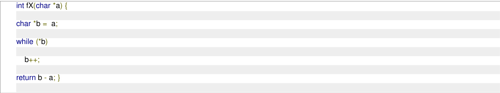

Which of the following statements is/are TRUE?

A. The function call fX("abcd") will always return a value   
B. Assuming a character array c is declared as char ${ \mathsf { c } } [ ] =$ "abcd" in main (), the function call fX(c) will always return a value   
C. The code of the function will not compile   
D. Assuming a character pointer c is declared as char $^ { \star } \mathsf { c } = ^ { \prime }$ "abcd" in main (), the function call fX(c) will always return a value

# Answer Keys

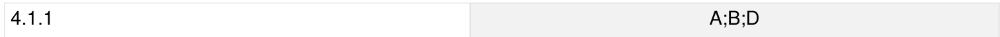

Welcome to the "Programming: Programming in C" chapter of your GATE Computer Science exam preparation. This section is designed to be a comprehensive, exam-focused reference, providing a quick yet thorough review of all essential concepts, formulas, and problem-solving techniques relevant to C programming for the GATE exam. Mastering C is fundamental not just for direct programming questions but also for understanding underlying principles of Data Structures, Algorithms, Operating Systems, and Computer Architecture. It forms the bedrock of many advanced computer science concepts.

# Subject Overview

The "Programming in C" subject is a cornerstone of the GATE Computer Science syllabus, focusing on the syntax, semantics, and practical application of the C programming language. It is crucial for building a strong foundation in computer science, as C's low-level memory management capabilities and efficiency make it indispensable for system programming, embedded systems, and high-performance computing. For GATE CS, this subject typically carries a weightage of 5-10 marks, often integrated with questions from Data Structures and Algorithms. Questions usually involve code snippets for output prediction, error identification, understanding memory allocation, pointer arithmetic, function calls, recursion, and conceptual questions on data types, control flow, and storage classes. A deep understanding of C helps in visualizing program execution and memory layout, which is vital for solving complex problems.

# Topic-wise Key Concepts

# Programming In C

Definition and Core Idea: C is a general-purpose, procedural, imperative computer programming language developed in the early 1970s by Dennis Ritchie at Bell Labs. It is known for its efficiency, low-level memory access, and portability, making it a popular choice for system programming and embedded systems.

# Key Properties and Identities:

。 Mid-level language: Combines features of high-level languages with the ability to manipulate memory directly.   
。 Procedural: Programs are structured as a sequence of function calls.   
Compiled: Source code is translated into machine code by a compiler.   
。 Strongly typed (but with implicit conversions): Variables have specific types, but C allows flexible type casting.   
Memory management: Manual memory allocation and deallocation using functions like malloc() and free().

# Common Pitfalls or Tricky Points:

Undefined behavior: Operations like accessing out-of-bounds array elements or dereferencing a dangling pointer can lead to unpredictable results.   
Memory leaks: Forgetting to free() dynamically allocated memory.   
Buffer overflows: Writing past the end of an allocated buffer.

# Standard Problem-Solving Techniques or Shortcuts:

Understand the compilation process (preprocessor, compiler, assembler, linker).   
Always initialize variables to avoid garbage values.   
Pay attention to operator precedence and associativity.

# Programming Constructs

Definition and Core Idea: Programming constructs are the fundamental building blocks that control the flow of execution in a program. They include sequential execution, selection (conditional statements), and iteration (loops).

Key Properties and Identities:

Sequential: Statements execute one after another.   
Selection: if-else: Executes a block of code based on a condition. if (condition) { // code else { // code } □ switch-case: Multi-way branching based on the value of an integer expression.   
Iteration (Loops): for loop: Used when the number of iterations is known. for (initialization; condition; increment/decrement) { // code } while loop: Executes as long as a condition is true (entry-controlled).   
while (condition) { // code }   
■ do-while loop: Executes at least once, then continues as long as a condition is true (exit-controlled). do { // code while (condition);

0 Jump Statements: break, continue, goto, return.

Common Pitfalls or Tricky Points:

Off-by-one errors in loops.   
Infinite loops due to incorrect loop conditions or missing increment/decrement.   
Forgetting break in switch-case, leading to fall-through.   
Using $\mathbf { \sigma } = \mathbf { \sigma }$ (assignment) instead of $\scriptstyle = =$ (comparison) in conditions.

Standard Problem-Solving Techniques or Shortcuts:

Trace the execution path of the program step-by-step for conditional and loop statements.   
For loops, identify the initial state, the termination condition, and how variables change in each iteration.

# Programming Paradigms

Definition and Core Idea: A programming paradigm is a fundamental style of computer programming, providing a way to classify programming languages based on their features. C primarily adheres to the procedural paradigm.

Key Properties and Identities:

Procedural Programming: Focuses on a sequence of instructions (procedures or functions) to perform computations. Data and functions are separate. C, Fortran, Pascal are examples.   
Imperative Programming: Programs explicitly state how the computation should be performed, detailing changes to the program state. C is an imperative language.   
Contrast with Object-Oriented (data and methods encapsulated) and Functional (computation as evaluation o mathematical functions, avoiding state changes) paradigms.

# Common Pitfalls or Tricky Points:

Confusing C's procedural nature with object-oriented concepts like classes and objects, which are not directly supported. Trying to apply functional programming principles (like immutability) where C's mutable state is fundamental.

Standard Problem-Solving Techniques or Shortcuts:

Understand that C programs are executed as a series of instructions that modify program state.   
Focus on function calls, parameter passing, and global/local variable interactions.

# Variable Binding

Definition and Core Idea: Variable binding refers to the process of associating attributes (like type, value, and storage location) with a variable name. This binding can occur at different stages of a program's lifecycle.

Key Properties and Identities:

Static Binding (Compile-time): Attributes are determined before runtime and remain fixed. E.g., type binding for most variables in C.   
Dynamic Binding (Run-time): Attributes are determined during program execution. E.g., value binding, or in some languages, type binding (polymorphism).

age Class Binding: Determines the scope and lifetime of a variable.

■ auto: Local to a block, created on entry, destroyed on exit (default for local variables).   
static: Local to a block/file, created once, persists throughout program execution.   
extern: Global variable, declared in one file, defined in another.   
register: Suggests storing variable in CPU register for faster access (compiler may ignore). Scope: Region of code where a variable is accessible (block scope, function scope, file scope, program scope).   
。 Lifetime: Period during which a variable exists in memory.

# Common Pitfalls or Tricky Points:

Confusing scope and lifetime: A variable might be alive but out of scope. Modifying static local variables across multiple function calls. 0 Shadowing: A local variable having the same name as a global variable.

# Standard Problem-Solving Techniques or Shortcuts:

Draw scope boxes for functions and blocks to visualize variable accessibility.   
Track variable values across function calls, especially for static variables.

# Type Checking

Definition and Core Idea: Type checking is the process of verifying and enforcing the type constraints of a programming language. It ensures that operations are applied to compatible data types, preventing common programming errors.

Key Properties and Identities:

Static Type Checking (Compile-time): Types are checked before program execution. C is primarily statically typed.   
Dynamic Type Checking (Run-time): Types are checked during program execution.   
Type Compatibility: Rules for when types can be used together (e.g., implicit conversions).   
Type Casting: Explicit conversion of one data type to another using (type)expression.   
Implicit Type Promotion (Integral Promotion): Smaller integer types (char, short) are promoted to int in expressions.   
Arithmetic Conversion: In binary operations, operands are converted to a common type (usually the "larger" or "wider" type).

# Common Pitfalls or Tricky Points:

Unexpected implicit type conversions, especially between signed and unsigned integers, or between integers and floating-point types, leading to loss of precision or incorrect results.   
。 Incorrect type casting, e.g., casting a pointer to an incompatible type and then dereferencing it.   
。 Integer division truncates the fractional part (e.g., $5 / 2 = 2 \AA$ ).

Standard Problem-Solving Techniques or Shortcuts:

Always be aware of the data types involved in an expression.   
Use explicit type casting when precision or specific type behavior is required.   
Remember that sizeof operator returns an unsigned integer type (size_t).

# Output

Definition and Core Idea: Output refers to the process of displaying information from a program to the user or writing it to a file. In C, standard output functions like printf(), puts(), and putchar() are commonly used.

# Key Properties and Identities:

printf(const char \*format, ...): Formatted output to standard output.

Format specifiers: $\% \mathsf { d }$ or $\% \mathrm { i }$ : signed decimal integer $\% \mathrm { ~ }$ : unsigned decimal integer %f: decimal floating point (double by default) $\\% c$ : character $\% s$ : string $\% 0$ : pointer address (hexadecimal) $\% x$ or $\% x$ : hexadecimal integer $\\text{‰}$ : octal integer $\%$ : print a literal $\%$ character

■ Modifiers: .precision, width, - (left-align), $^ +$ (sign), 0 (zero-pad), (long), ll (long long), h (short). 0 puts(const char \*str): Writes a string to standard output, followed by a newline. 。 putchar(int char_val): Writes a single character to standard output.

# Common Pitfalls or Tricky Points:

Mismatched format specifiers and argument types can lead to undefined behavior or incorrect output.   
。 Forgetting newline characters $\mathsf { \backslash n }$ in printf() (puts() adds it automatically).   
Buffer flushing issues, especially when mixing buffered and unbuffered I/O.

# Standard Problem-Solving Techniques or Shortcuts:

Carefully match each format specifier in printf() with its corresponding argument.   
Trace the exact values and types of variables being printed.   
Understand the effect of width and precision specifiers on output formatting.

# Array

Definition and Core Idea: An array is a collection of elements of the same data type, stored in contiguous memory locations. Elements are accessed using an index, typically starting from zero.

Key Properties and Identities: 0 Contiguous memory allocation.

。 Fixed size at compile time (for static arrays). Zero-indexed: The first element is at index 0. Array name decays to a pointer to its first element in most contexts. Address Calculation (1D Array):

$$
\operatorname { A d d r e s s } ( A [ i ] ) = \operatorname { B a s e A d d r e s s } + i \times \operatorname { s i z e o f } ( \operatorname { E l e m e n t T y p e } )
$$

门 Address Calculation (2D Array, Row-Major):

$$
\mathrm { A d d r e s s } ( A [ i ] [ j ] ) = \mathrm { B a s e A d d r e s s } + ( i \times \mathrm { c o l s } + j ) \times \mathrm { s i z e o f ( E l e m e n t T y p e ) }
$$

where cols is the number of columns in the array

Common Pitfalls or Tricky Points:

。 Array out-of-bounds access: Accessing elements beyond the declared size leads to undefined behavior.   
。 When an array is passed to a function, it decays into a pointer, losing its size information.   
sizeof(array_in function) will return the size of a pointer, not the array. Multidimensional arrays are stored in row-major order in C.

# Standard Problem-Solving Techniques or Shortcuts:

Draw memory diagrams to visualize array elements and their addresses. Always check loop bounds to prevent out-of-bounds access. Remember that array indexing A[i] is equivalent to pointer arithmetic $^ { \star } ( \mathsf { A } + \mathsf { i } )$

# Strings

Definition and Core Idea: In C, a string is a sequence of characters stored in a character array, terminated by a null character (\0). This null terminator marks the end of the string.

# Key Properties and Identities:

Declared as char array name[] or char \*pointer_name.   
Always null-terminated. The size of the array must be at least one greater than the number of characters in the   
string to accommodate \0.   
Standard library functions (from <string.h>): ■ strlen(const char $^ \star \mathsf { s }$ ): Returns the length of the string (excluding $\updownarrow 0$ ). strcpy(char \*dest, const char \*src): Copies src to dest. strncpy(char \*dest, const char \*src, size_t n): Copies at most n characters. Does not guarantee null termination if src is longer than n. strcat(char \*dest, const char \*src): Appends src to dest. strncat(char \*dest, const char \*src, size_t n): Appends at most n characters. strcmp(const char $^ { \star } \mathsf { s } 1$ , const char $^ { \star } \mathsf { s } 2$ ): Compares s1 and s2 lexicographically. Returns 0 if equal, ${ < } 0$ if s1 < s2, ${ > } 0$ if $\mathsf { s } 1 > \mathsf { s } 2$ . strncmp(const char $^ { \star } \mathsf { s } 1$ , const char $^ { \star } \mathsf { s } 2$ , size_t n): Compares at most n characters.

# Common Pitfalls or Tricky Points:

Buffer overflow: Using strcpy() or strcat() without ensuring the destination buffer is large enough. Always prefer strncpy() and strncat() with careful handling of null termination.   
Forgetting the null terminator $\updownarrow 0$ , leading to functions like strlen() reading past the allocated memory. Modifying string literals (e.g., char ${ } ^ { \star } \mathsf { s } =$ "hello"; $\mathsf { s } [ 0 ] = \mathsf { \ " H \ " }$ ) leads to undefined behavior, as string literals are often stored in read-only memory.

# Standard Problem-Solving Techniques or Shortcuts:

。 Always allocate sufficient memory for strings, considering the null terminator.   
。 When dealing with string manipulation, mentally trace the contents of the character arrays, including the \0.   
。 Be careful with pointer arithmetic on string pointers.

# Pointers

Definition and Core Idea: A pointer is a variable that stores the memory address of another variable. It allows for indirect access to data and is fundamental for dynamic memory management, arrays, and complex data structures in C.

Key Properties and Identities:

Declaration: type \*pointer_name;   
Address-of operator: $\&$ (returns the memory address of a variable).   
Dereference operator: (accesses the value at the address stored in a pointer).   
Pointer Arithmetic: Adding an integer to a pointer: ${ \mathsf p } + { \mathsf n }$ points to the memory location $n \times \mathrm { s i z e o f ( ^ { * } p ) }$ bytes away from p.

$$
\operatorname { A d d r e s s } ( p + n ) = \operatorname { A d d r e s s } ( p ) + n \times \operatorname { s i z e o f } ( { \mathfrak { * } } _ { \mathrm { p } } )
$$

Subtracting an integer from a pointer: ${ \mathsf p } - { \mathsf n }$ .   
Subtracting two pointers (of the same type): p q gives the number of elements between them.

$$
p - q = { \frac { \operatorname { A d d r e s s } ( p ) - \operatorname { A d d r e s s } ( q ) } { \operatorname { s i z e o f } ( { } ^ { * } { \mathrm { p } } ) } }
$$

Pointers can be compared for equality or order.

。 void\* (Generic Pointer): Can point to any data type but cannot be dereferenced directly or used in arithmetic without casting.   
NULL Pointer: A pointer that points to no valid memory location.

Common Pitfalls or Tricky Points:

Dangling Pointers: Pointers that point to memory that has been deallocated or is no longer valid.   
Wild Pointers: Uninitialized pointers that point to arbitrary memory locations.   
Dereferencing a NULL pointer or a wild pointer leads to segmentation faults or undefined behavior.   
Incorrect pointer arithmetic (e.g., adding incompatible types, or arithmetic on void\* without casting).   
Confusing ${ } ^ { \star } { \mathsf p }$ (value at address p) with p (the address itself).

# Standard Problem-Solving Techniques or Shortcuts:

Draw memory diagrams showing variable names, their addresses, and their values.   
Mentally trace pointer assignments and dereferencing operations.   
Always initialize pointers to NULL if they don't point to valid memory immediately.   
Check for NULL before dereferencing pointers.

# Aliasing

Definition and Core Idea: Aliasing occurs when multiple distinct names or pointers refer to the same memory location.   
In C, this often happens with pointers, array names, or when passing arguments by reference (using pointers).

# Key Properties and Identities:

If p1 and p2 are pointers and $\mathsf { p } \mathsf { 1 } = \mathsf { p } 2$ ;, then both p1 and p2 alias the same memory loca Modifying data through one alias will affect the data accessed through other aliases. Can occur with function parameters if pointers are passed.

# Common Pitfalls or Tricky Points:

Unexpected side effects: Changes made through one alias might inadvertently affect other parts of the program that use a different alias to the same data.   
。 Difficult to optimize for compilers due to potential data dependencies.   
Can lead to subtle bugs that are hard to trace.

# Standard Problem-Solving Techniques or Shortcuts:

Draw memory diagrams to explicitly show when multiple pointers point to the same location. 。 Be extra cautious when modifying data through pointers, especially when those pointers might be aliases. 。 In GATE questions, always consider i multiple variables/pointers might be referring to the same underlying memory.

# Functions

Definition and Core Idea: A function is a self-contained block of code that performs a specific task. Functions promote modularity, reusability, and readability in C programs.

Key Properties and Identities:

Declaration (Prototype): Specifies the function's return type, name, and parameter types (e.g., nt add(int a, int b);).   
。 Definition: Contains the actual code of the function.   
Call: Invokes the function's execution.   
Return Type: The data type of the value the function sends back to the caller. void if no value is returned.   
Parameters (Arguments): Values passed to the function.   
。 Local Variables: Declared inside a function, have function scope and automatic lifetime.   
Global Variables: Declared outside any function, have file scope and static lifetime.

# Common Pitfalls or Tricky Points:

。 Scope o local variables: Local variables cease to exist once the function returns. Returning a pointer to a local variable leads to a dangling pointer. 。 Side effects: Functions modifying global variables or parameters passed by reference (pointers) can lead to

hard-to-track bugs.

Function prototypes are crucial for correct compilation, especially when functions are defined after their calls.

Standard Problem-Solving Techniques or Shortcuts:

Trace function calls using a call stack model, keeping track of local variables and parameters for each active function.   
Clearly distinguish between parameters (formal arguments) and arguments (actual arguments).   
Understand how return values are passed back to the caller.

# Parameter Passing

Definition and Core Idea: Parameter passing refers to the mechanism by which arguments (actual parameters) are passed from the calling function to the called function (formal parameters).

# Key Properties and Identities:

Call by Value (C's default): A copy of the actual argument's value is passed to the formal parameter. Changes to the formal parameter inside the function do not affect the original actual argument in the caller.   
void func(int x) $\{ \textsf { X } = \textsf { X } + 1 ;  \} / / \textsf { X }$ is a copy   
Call by Reference (Simulated in C using Pointers): The address of the actual argument is passed. The formal parameter is a pointer. Changes made through the pointer inside the function directly modify the original actual argument in the caller.   
void func(int \*ptr) $\{ { } ^ { \star } \mathsf { p t r } = { } ^ { \star } \mathsf { p t r } + 1 ; \mathsf { \beta } / / \mathsf { \beta } ^ { \star } |$ \*ptr modifies original variable

Arrays are always passed by reference (decay to a pointer to their first element).

Common Pitfalls or Tricky Points:

Misunderstanding when a function can modify the caller's variables. Only possible with call by reference (pointers).   
Forgetting to dereference a pointer when intending to modify the original value in call by reference. Passing large structures by value can be inefficient due to copying.

# Standard Problem-Solving Techniques or Shortcuts:

。 When tracing code, explicitly note whether a variable is being passed by value (copy) or by reference (address). 。 For call by reference, always draw an arrow from the pointer parameter to the actual variable it points to in the caller's memory.

# Recursion

Definition and Core Idea: Recursion is a programming technique where a function calls itself, either directly or indirectly, to solve a problem. It's often used for problems that can be broken down into smaller, similar subproblems.

Key Properties and Identities:

Base Case: A condition that stops the recursion, preventing an infinite loop. Without a base case, recursion leads to stack overflow.   
。 Recursive Step: The part of the function that calls itself with a modified input, moving closer to the base case. 。 Every recursive function can be rewritten iteratively, and vice-versa.   
Often involves a call stack: Each recursive call adds a new frame to the stack.   
Tail Recursion: A special form where the recursive call is the last operation in the function. Some compilers ca optimize this to iterative code.

# Formulas and Results (for complexity analysis):

Recurrence relations are used to analyze the time and space complexity of recursive algorithms. E.g., for factorial: $T ( n ) = T ( n - 1 ) + O ( 1 )$ . Space complexity often depends on the maximum depth of the recursion stack.

# Common Pitfalls or Tricky Points:

Missing or incorrect base case, leading to infinite recursion and stack overflow.   
Excessive recursion depth can lead to stack overflow even with a correct base case.   
Difficulty in tracing complex recursive calls.   
Redundant computations in non-optimized recursive solutions (e.g., naive Fibonacci).

# Standard Problem-Solving Techniques or Shortcuts:

。 Identify the base case first.   
。 Assume the recursive call works correctly for smaller inputs.   
。 Trace the execution for small inputs, drawing the call stack to visualize the flow and variable states.   
。 For GATE, often involves predicting output or determining the number of function calls.

# Structure

Definition and Core Idea: A structure (struct) in C is a user-defined data type that groups together variables of different data types under a single name. It allows for creating complex data types that represent real-world entities.

# Key Properties and Identities:

Declared using the struct keyword.   
Members are stored in contiguous memory, but padding may be inserted by the compiler for alignment.   
Member Access: □ Dot operator (.) for structure variables: struct var.member Arrow operator $( \neg > )$ for pointers to structures: struct_ptr- $\mathrm { > }$ member (equivalent to (\*struct_ptr).member)   
sizeof(struct): The size of a structure is at least the sum of the sizes of its members, but due to padding, it can   
be larger. The compiler aligns members to optimize memory access.

$$
\operatorname { s i z e o f } ( { \mathrm { s t r u c t } } ) \geq \sum \operatorname { s i z e o f } ( { \mathrm { m e m b e r } } )
$$

Structures can contain members of other structure types or pointers to themselves (for linked lists, trees).

Common Pitfalls or Tricky Points:

Understanding memory alignment and padding, which affects sizeof() and memory efficiency.   
Confusing and $\begin{array} { r } { \mathrm { ~ - > ~ } } \end{array}$ operators.   
0 Passing structures by value can be inefficient for large structures; passing by pointer is often preferred.   
Self-referential structures (e.g., for linked lists) require careful handling of pointers.

Standard Problem-Solving Techniques or Shortcuts:

。 When calculating sizeof(struct), consider the alignment requirements of each member (usually to its own size or the largest member's size). 。 Draw diagrams for structures, especially those with pointers or nested structures, to visualize memory layout.

# Union

Definition and Core Idea: A union is a special user-defined data type in C that allows different data types to be stored n the same memory location. Only one member of the union can hold a value at any given time.

# Key Properties and Identities:

。 Declared using the union keyword.   
。 All members share the same memory space.   
0 sizeof(union): The size of a union is equal to the size of its largest member, ensuring enough space for any member.

$$
\mathrm { s i z e o f ( u n i o n ) } = \mathrm { m a x } ( \mathrm { s i z e o f ( m e m b e r _ { 1 } ) , s i z e o f ( m e m b e r _ { 2 } ) , . . . ) }
$$

Accessing a member that was not the last one written to results in undefined behavior (unless it's a "typepunning" scenario which is implementation-defined).

Common Pitfalls or Tricky Points:

。 Accessing an inactive member (a member that was not the last one assigned a value) leads to undefined behavior.   
Unions are primarily used for memory optimization or type punning (interpreting the same memory in different ways).   
Understanding that changing one member's value overwrites the previous member's value.

Standard Problem-Solving Techniques or Shortcuts:

When calculating sizeof(union), simply find the largest member's size.   
Mentally track which member of the union is currently "active" (last written to) to predict output.

# Switch Case

Definition and Core Idea: The switch-case statement is a multi-way branch control statement that allows a program to execute different blocks of code based on the value of a single expression.

# Key Properties and Identities:

The switch expression must evaluate to an integer type (char, short, int, long, long long, or an enumeration type).   
。 case labels must be constant integer expressions.   
。 break statement: Exits the switch block.   
default label: Optional, executed if no case matches.

Fall-through: If a break statement is omitted, execution "falls through" to the next case label.

Common Pitfalls or Tricky Points:

Forgetting break statements, leading to unintended fall-through and incorrect logic. This is a very common GATE question trap.   
。 Using non-integer expressions or non-constant values for case labels.   
Placing statements before the first case label (these will always execute).

Standard Problem-Solving Techniques or Shortcuts:

Carefully trace the execution path, paying close attention to the presence or absence of break statements.   
Identify the value of the switch expression and which case (or default) it matches.

# Goto

Definition and Core Idea: The goto statement provides an unconditional jump from one point in a function to another labeled point within the same function. It alters the normal sequential flow of control.

# Key Properties and Identities:

Syntax: goto label; and label: statement;   
0 The label must be within the same function.   
。 Can be used to break out of nested loops or handle error conditions.

# Common Pitfalls or Tricky Points:

Generally discouraged in modern programming practice as it can lead to "spaghetti code" that is difficult to read, debug, and maintain. 。 Jumping into a block can bypass variable initialization, leading to undefined behavior. Jumping out of a block can skip destructors (though C doesn't have explicit destructors like ${ \mathsf { C } } { + } { + }$ ).

# Standard Problem-Solving Techniques or Shortcuts:

When encountering goto, simply follow the jump to the specified label to trace the control flow.   
Understand its direct impact on program execution flow.

# Identify Function

Definition and Core Idea: This topic refers to the ability to analyze a given C function's code, its signature (return type, name, parameters), and its interactions with other parts of the program to determine its precise purpose, behavior, and potential side effects.

Key Properties and Identities:

Function Signature: return_type function_name(parameter _list); provides initial clues about what the function takes and what returns.   
Function Body: The statements within the function define its logic.   
Side Effects: Changes a function makes to the program state outside its local scope (e.g., modifying global variables, parameters passed by reference, performing I/O).   
Pure Functions: Functions that, given the same input, always return the same output and have no side effects. (Rare in C, but a useful concept).

# Common Pitfalls or Tricky Points:

Misinterpreting the purpose due to complex logic or subtle side effects.   
。 Not recognizing the impact of parameter passing mechanisms (call by value vs. call by reference).   
Overlooking hidden dependencies on global variables or external resources.

Standard Problem-Solving Techniques or Shortcuts:

Trace the function with a few sample inputs, noting the return value and any changes to external variables 。 Break down complex functions into smaller, understandable parts.   
。 Look for common patterns: mathematical operations, array/string manipulations, recursive calls, pointer operations.

# Loop Invariants

Definition and Core Idea: A loop invariant is a condition or property that holds true before the first iteration of a loop, remains true before each subsequent iteration, and is true after the loop terminates. It is a powerful tool for proving the correctness of loops and algorithms.

Key Properties and Identities:

。 Initialization: The invariant must be true before the first iteration of the loop. 。 Maintenance: If the invariant is true before an iteration, it must remain true after that iteration (before the next). Termination: When the loop terminates, the invariant, combined with the loop termination condition, should

imply the desired property of the algorithm.

Common Pitfalls or Tricky Points:

Identifying the correct loop invariant for a given problem. Rigorously proving all three properties (initialization, maintenance, termination). Confusing the loop invariant with the loop condition or the desired post-condition

# Standard Problem-Solving Techniques or Shortcuts:

。 For common algorithms (e.g., sorting, searching), try to recall standard loop invariants.   
。 To find an invariant, consider what property is preserved or incrementally built up by each iteration towards the final solution.   
0 Useful for understanding why an algorithm works, not just how.

# Runtime Environment

Definition and Core Idea: The runtime environment refers to the state of a program during its execution, including its memory layout, the call stack, heap, and interaction with the operating system. Understanding this is crucial for debugging and optimizing C programs.

Key Properties and Identities:

Memory Layout:

■ Text Segment: Stores compiled code (read-only).   
■ Data Segment: Stores global and static variables (initialized data). BSS Segment: Stores uninitialized global and static variables (zero-initialized by OS). Heap: Dynamically allocated memory (malloc(), calloc(), realloc(), free()). Grows upwards. Stack: Stores local variables, function parameters, and return addresses for function calls. Grows downwards.

。 Call Stack: A stack data structure that stores information about the active subroutines (functions) of a computer program. Each function call creates a "stack frame.

Common Pitfalls or Tricky Points:

Stack Overflow: Occurs when the call stack runs out of memory, often due to infinite recursion or very deep recursion.   
Memory Leaks: Dynamically allocated memory that is no longer referenced by the program but has not been deallocated using free().   
Segmentation Faults: Occur when a program tries to access a memory location that it is not allowed to access (e.g., dereferencing a NULL pointer, accessing out-of-bounds array memory).   
Returning pointers to local stack variables (dangling pointers).

Standard Problem-Solving Techniques or Shortcuts:

。 Draw the stack and heap to visualize memory allocation and deallocation.   
。 For recursive functions, trace the stack frames to understand memory usage.   
0 Always match every malloc() with a free() to prevent memory leaks.

# Quick Formula Reference

This section consolidates key formulas and results for quick revision.

Array Address Calculation (1D):

$$
\operatorname { A d d r e s s } ( A [ i ] ) = \operatorname { B a s e A d d r e s s } + i \times \operatorname { s i z e o f } ( { \mathrm { E l e m e n t T y p e } } )
$$

Array Address Calculation (2D, Row-Major):

$$
\mathrm { A d d r e s s } ( A [ i ] [ j ] ) = \mathrm { B a s e A d d r e s s } + ( i \times \mathrm { c o l s } + j ) \times \mathrm { s i z e o f ( E l e m e n t T y p e ) }
$$

Pointer Arithmetic (Addition):

$$
\operatorname { A d d r e s s } ( p + n ) = \operatorname { A d d r e s s } ( p ) + n \times \operatorname { s i z e o f } ( ^ { * } \operatorname { p } )
$$

Pointer Arithmetic (Subtraction):

$$
p - q = { \frac { \mathrm { A d d r e s s } ( p ) - \mathrm { A d d r e s s } ( q ) } { \mathrm { s i z e o f } ( { } ^ { * } { \mathrm { p } } ) } } \quad { \mathrm { ( f o r ~ s a m e ~ t y p e ~ p o i n t e r s ) } }
$$

sizeof(struct):

$$
{ \mathrm { s i z e o f ( s t r u c t ) } } \geq \sum { \mathrm { s i z e o f ( m e m b e r ) } } \quad { \mathrm { ( d u e ~ t o ~ p a d d i n g ) } }
$$

sizeof(union):

$$
{ \mathrm { s i z e o f ( u n i o n ) } } = \operatorname* { m a x } ( { \mathrm { s i z e o f ( m e m b e r } } _ { 1 } ) , { \mathrm { s i z e o f ( m e m b e r } } _ { 2 } ) , \dots )
$$

String Length: strlen(s) returns number of characters before $\updownarrow 0$ .   
Integer Division: $a / b$ truncates towards zero for positive integers. E.g., $5 / 2 = 2$ .   
Modulo Operator: $a \% b$ result sign is implementation-defined for negative operands, but typically matches the sign of $a$ .

# Important Tips for GATE

1. Master Pointers and Arrays: A significant portion of C questions revolves around pointers, array indexing, and their interaction. Practice drawing memory diagrams for complex pointer expressions and array manipulations. Understand array decay to pointers.

2. Trace Code Meticulously: For output prediction questions, mentally (or on scratch paper) trace the execution flow, variable values, and memory changes step-by-step. Pay close attention to loop conditions, conditional statements, and function calls.

3. Understand Scope and Lifetime: Differentiate between local, global, and static variables. Be aware of when variables are created and destroyed, especially for recursive functions and functions returning pointers to local variables.

4. Beware of Type Conversions and Operator Precedence: C's implicit type conversions can lead to unexpected results. Always be mindful of data types in expressions. Memorize common operator precedence rules (e.g., and / before $^ +$ and -; unary operators have high precedence).

5. Practice Recursion Tracing: Recursion questions are common. Practice tracing recursive calls, identifying the base case, and understanding how values are returned up the call stack. Watch out for stack overflow scenarios.

6. Look for Edge Cases and Undefined Behavior: GATE questions often test understanding of edge cases (e.g., empty strings, NULL pointers, array bounds) and undefined behavior (e.g., dereferencing NULL, modifying string literals, out-of-bounds access).

7. Memory Management: Understand the difference between stack and heap memory. Know how malloc(), calloc(), realloc(), and free() work, and the consequences of memory leaks or double- freeing.

8. Time Management: C programming questions can be time-consuming due to detailed tracing. If a question seems too complex, try to quickly identify the core concept being tested or make an educated guess based on common pitfalls. Don't get stuck on one question.

Aliasing in the context of programming languages refers to

A. multiple variables having the same memory location B. multiple variables having the same value C. multiple variables having the same identifier D. multiple uses of the same variable

What does the following fragment of C program print?

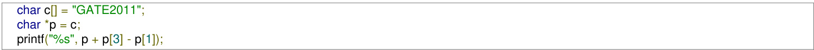

A. GATE2011 B. E2011 C. 2011 D. 011

gatecse-2011 programming programming-in-c normal array

What is the output of the following C code? Assume that the address of $x$ is (in decimal) and an integer requires four bytes of memory.

int main () { unsigned int x [4] [3] $\mathbf { \Sigma } = \mathbf { \Sigma }$ {{1, 2, 3}, {4, 5 6}, {7, 8, 9}, {10, 11, 12}}; printf $\because S _ { \Delta } u$ , %u, %u", $\textsf { x } + 3$ , $^ { \star } ( \mathsf { X } + 3 )$ , $^ { \star } ( \mathsf { X } + 2 ) + 3 )$ ;

A. 2036,2036,2036 B. 2012,4,2204   
C. 2036,10,10 D. 2012,4,6

gatecse-2015-set1 programming programming-in-c array normal

Consider the following two C code segments. $Y$ and $X$ are one and two dimensional arrays of size $n$ and $n \times n$ respectively, where $2 \leq n \leq 1 0$ . Assume that in both code segments, elements of $Y$ are initialized to  and each element $X [ i ] [ j ]$ of array $X$ is initialized to $i + j$ . Further assume that when stored in main memory all elements of $X$ are in same main memory page frame.

Code segment

// initialize elements of Y to 0   
// initialize elements of X[i][j] of $x$ to i+j   
for $( \mathsf { i } = 0$ ; i<n; $\mathbf { i } \mathbf { + } \mathbf { + }$ ) Y[i $\bf { \tau } ] \cdot \mathrm { = } \times [ 0 ] [ \dot { 1 } ]$ ;

# Code segment 2

// initialize elements of Y to 0   
// initialize elements of X[i][j] of $\mathsf { x }$ to i+j   
for $( \mathsf { i } = 0$ ; i<n; $\mathbf { i } \mathbf { + } \mathbf { + }$ ) Y[i] $+ = { \sf X } [ \dot { \sf I } ] [ 0 ]$ ;

Which of the following statements is/are correct?

S1: Final contents of array $Y$ will be same in both code segments S2: Elements of array $X$ accessed inside the for loop shown in code segment  are contiguous in main memory S3: Elements of array $X$ accessed inside the for loop shown in code segment  are contiguous in main memory

A. Only S2 is correct B. Only S3 is correct C. Only S1 and S2 are correct D. Only S1 and S3 are correct

gatecse-2015-set3 programming-in-c normal array int main() char ${ \mathsf { s } } 1 [ 7 ] = " 1 2 3 4 "$ , \*p; ${ \mathsf p } = { \mathsf s } 1 + 2$ ; ${ \bf \Pi } ^ { * } { \bf p } = { \bf \Pi } ^ { \prime } 0 { \bf \Pi } ^ { \prime }$ ; printf("%s" s1);

What will be printed by the program?

A. B. 120400 C. 1204 D. 1034

gatecse-2015-set3 programming programming-in-c normal array

5.2.6 Array: GATE CSE 2019 Question: 24

# Consider the following C program:

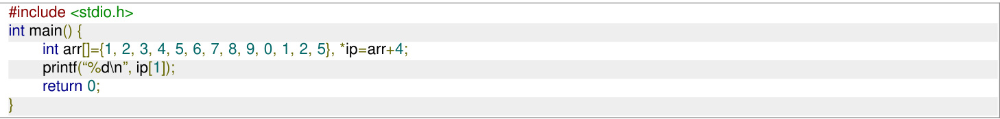

# The number that will be displayed on execution of the program is

gatecse-2019 numerical-answers programming-in-c programming array easy one-mark

# 5.2.7 Array: GATE CSE 2020 Question: 22

# Consider the following C program.

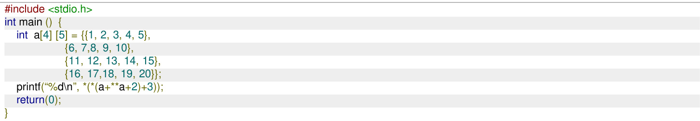

# The output of the program is

gatecse-2020 numerical-answers programming-in-c array one-mark

# 5.2.8 Array: GATE CSE 2021 Set 2 Question: 10

# Consider the following program.

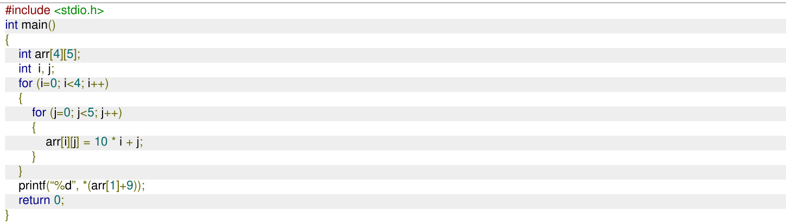

What is the output of the above program?

A. B. C. D.

What is printed by the following ANSI program?

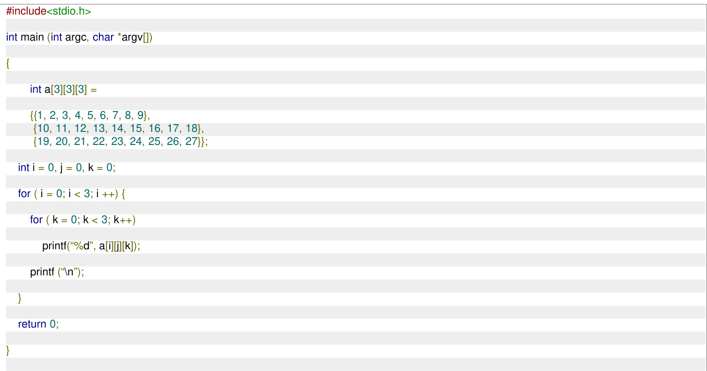

123

A. 10 11 12 19 20 21 147   
B. 101316 19 22 25 123   
C. 789 123   
D. 131415 252627

X for (i = 0; i < 4; ++i) for (j $= 0 ; \mathrm { j } < 4 ; + + \mathrm { j } )$ printf ("%d", M[i][j]);

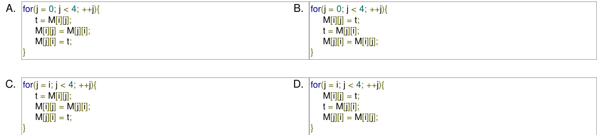

# 5.2.11 Array: GATE IT 2008 Question: 49

What is the output printed by the following C code?

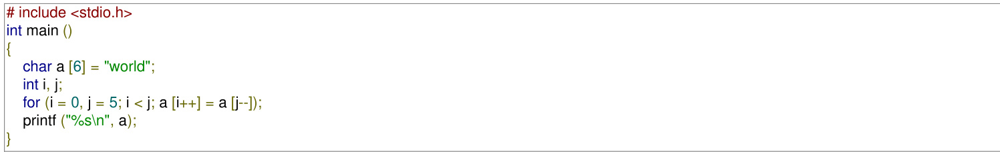

A. dlrow B. Null string C. dlrld D. worow

gateit-2008 programming programming-in-c normal array

Consider the C program given below. What does it print?

#include <stdio.h>   
int main () int i, j; int a [8] = {1, 2, 3, 4, 5, 6, 7, 8}; for(i = 0; i < 3; i++) { $\mathsf { a } [ \mathsf { i } ] = \mathsf { a } [ \mathsf { i } ] + 1$ ; i++; i--; for $( \mathrm { j } = 7 ; \mathrm { j } > 4 ; \mathrm { j } \mathrm { - } )$ { int i = j/2; a[i] = a[i] - 1; printf ("%d, %d", i, a[i]);

A. B. 2,4 C. 3,2 D.

gateit-2008 programming programming-in-c normal array

# Answer key☟

5.2.13 Array: GATE IT 2008 Question: 52

C program is given below:

# include <stdio.h> int main ()

int i, j;   
char a [2] $[ 3 ] = \{ \{ \mathsf { a } ^ { \prime }$ , 'b', $\langle { \bf c } ^ { \prime } \rangle$ , {'d', 'e', 'f'}};   
char b [3] [2];   
char ${ } ^ { \star } \mathsf { p } = { } ^ { \star } \mathsf { b }$ ：   
for $( \mathfrak { i } = 0 ; \mathfrak { i } < 2 ; \mathfrak { i } + + )$ { for $( { \mathfrak { j } } = 0 ; { \mathfrak { j } } < 3$ ; $\mathbf { j } { + } + \mathbf { \beta } )$ { ${ } ^ { \star } ( { \mathsf p } + 2 ^ { \star } { \mathsf j } + { \mathsf i } ) = { \mathsf a }$ [i] [j];

What should be the contents of the array b at the end of the program?

A. C d e ef B. be cf C. b df D. e d C bf

Consider the following C program:

#include<stdio.h>   
int f1(void);   
int f2(void);   
int f3(void);   
int $\scriptstyle x = 1 0$ ;   
int main() int $\scriptstyle x = 1$ ; $\textsf { X } + = \textsf { f } 1 ( \ l ) + \textsf { f } 2 \ l ( \ l ) + \textsf { f } 3 ( \ l ) + \textsf { f } 2 ( \ l ) ;$ ; printf("%d", x); return 0;   
int f1() int $x = 2 5$ ; $^ { x + + }$ ; return $\left| x ; \right\}$   
int f2() static int $\mathsf { x } = 5 0$ ; $^ { x + + }$ ; return x;}   
int f3() $\mathbf { \nabla } \times \mathbf { \dot { \tau } } = 1 0$ ; return x;}

The output of the program is gatecse-2015-set3 programming programming-in-c functions normal numerical-answers

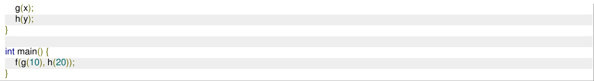

Which one of the following options is the CORRECT output of the above  program?

A. 20101020 B. 10202010 C. 20102010 D. 10201020

gatecse-2024-set2 programming programming-in-c functions one-mark

An unrestricted use of the "go to" statement is harmful because of which of the following reason (s):

A. It makes it more difficult to verify programs.   
B. It makes programs more inefficient.   
C. It makes it more difficult to modify existing programs.   
D. It results in the compiler generating longer machine code.

gate1989 normal programming goto

An unrestricted use of the " " statement is harmful because

A. it makes it more difficult to verify programs B. it increases the running time of the programs C. it increases the memory required for the programs D. it results in the compiler generating longer machine code

Consider the following high level programming segment. Give the contents of the memory locations for variables W, $X , Y$ and $Z$ after the execution of the program segment. The values of the variables $A$ and $B$ are $5 C H$ and $9 2 H$ , respectively. Also indicate error conditions if any.

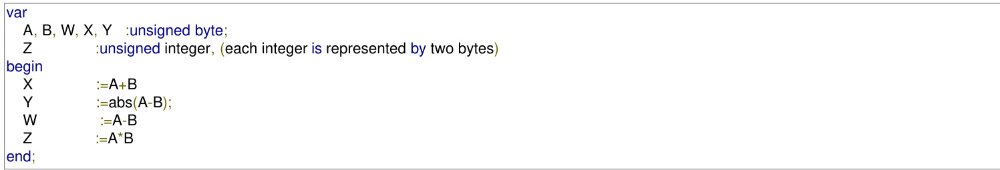

gate1995 programming identify-function descriptive

program side-effect (input, output); var x, result: integer; function (var x:integer):integer; begin ${ \sf x } : { \sf x } + 1 ; { \sf f } : = { \sf x } ;$ end begin $x : = 5$ ; result: $\scriptstyle = { \mathsf { f } } ( \mathbf { x } ) ^ { \star } \mathbf { f } ( \mathbf { x } )$ ; writeln(result); end

A. B. C. 36 D.

gate1998 programming normal identify-function

Consider the following function implemented in C:

void printxy(int x, int y) { int \*ptr; $\scriptstyle x = 0$ ; ptr $\scriptstyle \sum \alpha$ ; y=\*ptr; \*ptr=1; printf(“%d, %d”, x, y);

The output of invoking printxy $( 1 , 1 )$ is:

A. B. 0,1 C. 1,0 D.

gatecse-2017-set2 programming-in-c identify-function pointers

Consider the following snippet of a C program. Assume that swap $( \& x , \& y )$ exchanges the content of $x$ and $y$ :

int main () { int array[] $\mathbf { \Sigma } = \mathbf { \Sigma }$ {3, 5, 1, 4, 6, 2}; int done $_ { = 0 }$ ; int i; while $\scriptstyle \mathrm { \ c d o n e = = } 0$ ) done $^ { = 1 }$ ; for (i= $\scriptstyle 1 , \ i < = 4 , \ i + +$ ) { if (array[i] $\prec$ array[i+1]) { swap(&array[i], &array[i+1]); done $_ { : = 0 }$ ; for (i=5; $\mathrm { i } _ { > } = 1$ ; i--) { if (array[i] $>$ array[i-1]) { swap(&array[i], &array[i-1]); done $_ { = 0 }$ ; printf(“%d”, array[3]);

# The output of the program is

gatecse-2017-set2 programming algorithms numerical-answers identify-function

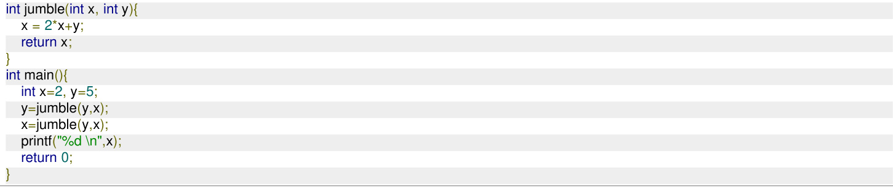

The value printed by the program is

gatecse-2019 programming-in-c numerical-answers identify-function one-mark

Let $x$ be an integer which can take a value of or . The statement

is equivalent to which one of the following ?

A. $\scriptstyle x = 1 + x$ ； B. $\begin{array} { r } { x = 1 - x ; } \end{array}$ C. x=x-1; D. $\begin{array} { r } { x = 1 \% x \colon } \end{array}$

gateit-2004 programming easy identify-function

List the invariant assertions at points $A , B , C , D$ and $E$ in program given below:

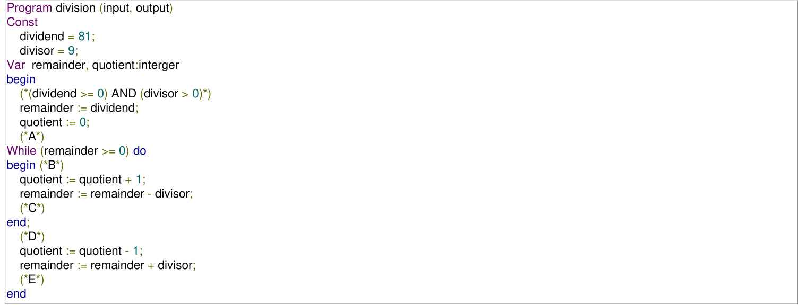

gate1987 programming loop-invariants descriptive

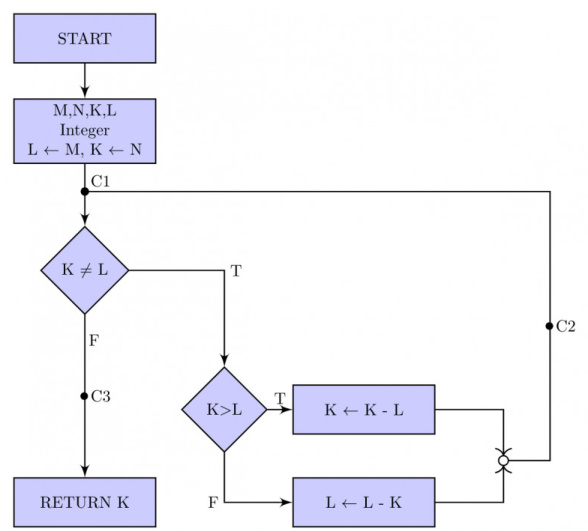

# Consider the two program segments below:

a. for i:=1 to f(x) by do S end

b. i:=1; While i<=f(x) do S i:=i+1 end

Under what conditions are these two programs equivalent? Treat $\boldsymbol { S }$ as any sequence of statements and $f$ as a function.

Consider the following PASCAL program segment:

if i mod $\overline { { 2 \ : = 0 } }$ then while $\dot { \mathsf { I } } > = 0$ do begin $\dot { \mathsf { I } } : = \dot { \mathsf { I } }$ div 2; if i mod $2 < > 0$ then $\dot { \mathsf { I } } : = \dot { \mathsf { I } } - \mathsf { 1 }$ else ${ \dot { \mathsf { I } } } : = { \dot { \mathsf { I } } } - 2$ ; end;

An appropriate loop-invariant for the while-loop is gate1991 programming loop-invariants normal fill-in-the-blanks

The loop invariant condition at the end of the $i ^ { t h }$ iteration is:

A. $n = d _ { 1 } d _ { 2 } \dots d _ { m - i }$ $\begin{array} { l } { { \dots d _ { m - i } \qquad \mathrm { a n d } \qquad \mathrm { r e v } = d _ { m } d _ { m - 1 } \dots d _ { m - i + 1 } } } \\ { { \mathrm { } _ { \mathrm { { } } } \dots d _ { m - 1 } d _ { m } \qquad \mathrm { o r } \qquad \mathrm { r e v } = d _ { m - i } \dots d _ { 2 } d _ { 1 } } } \end{array}$ B. $n = d _ { m - i + 1 } \ \dots \ d _ { m - 1 } d _ { m }$   
C. $n \neq { \mathrm { r e v } }$   
D. $n = d _ { 1 } d _ { 2 } \dots d _ { m }$ or $\mathrm { r e v } = d _ { m } \ldots d _ { 2 } d _ { 1 }$

Consider the following pseudo code, where $x$ and $y$ are positive integers.

begin ${ \mathfrak { q } } : = 0$ ${ \sf r } : = { \sf x }$ while $\boldsymbol { \mathsf { r } } \geq \boldsymbol { \mathsf { y } }$ do begin r := r - y ${ \mathsf { q } } : = { \mathsf { q } } + 1$ end   
end

The post condition that needs to be satisfied after the program terminates is

$$
\begin{array} { l } { \left\{ r = q x + y \wedge r < y \right\} } \\ { \left\{ x = q y + r \wedge r < y \right\} } \\ { \left\{ y = q x + r \wedge 0 < r < y \right\} } \\ { \left\{ q + 1 < r - y \wedge y > 0 \right\} } \end{array}
$$

The following function computes for positive integers $X$ and $Y$ .

int exp (int X, int Y) { int res $^ { = 1 }$ , $\sf { a } = \sf X$ , $\boldsymbol { \mathsf { b } } = \boldsymbol { \mathsf { Y } }$ ; while $( \boldsymbol { \mathsf { b } } \mathrel { ! } = \boldsymbol { 0 } )$ { if $( { \mathsf { b } } \ { \% } \ 2 = = 0$ ) $\{ \mathsf { a } = \mathsf { a } ^ { \star }$ a; ${ \mathsf { b } } = { \mathsf { b } } / { 2 } ;$ } else {res = res \* a; $\mathsf { b } = \mathsf { b } - \mathsf { 1 } ; \mathsf { j }$ return res;

Which one of the following conditions is TRUE before every iteration of the loop?

A. $X ^ { Y } = a ^ { b }$ B $( r e s * a ) ^ { Y } = ( r e s * X ) ^ { b }$ C. $X ^ { Y } = r e s * a ^ { b }$ D. $X ^ { Y } = ( r e s * a ) ^ { b }$

gatecse-2016-set2 programming loop-invariants normal

# Answer key☟

Which of the following conditions on the variables $x , y , q$ and $r$ before the execution of the fragment will ensure that the loop terminated in a state satisfying the condition $\scriptstyle x = = ( y * q + r ) ?$

A. $( q = = r )$ 】 && $( r = = 0 )$ ) B. $( x > 0 )$ &8 $\scriptstyle { \ u { \varepsilon } } \left( r = = x \right) \operatorname { \& } \& \left( y > 0 \right)$ C $\left( q = = 0 \right) \& \& \left( r = = x \right) \& \& \left( y > 0 \right)$ D. $\scriptstyle ( q = = 0$ ) &&(y>0)

# What is printed by the following ANSI C program?

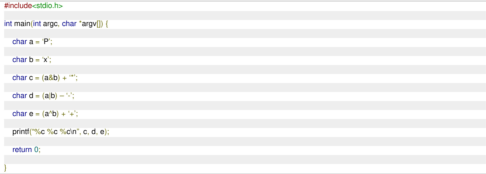

# ASCII encoding for relevant characters is given below

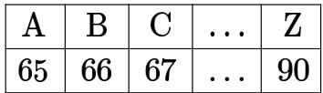

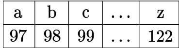

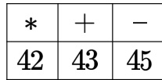

A. B. 122 75 83 C. D.

gatecse-2022 programming programming-in-c output two-marks

# Consider the following program:

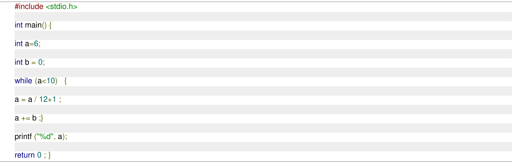

Which one of the following statements is CORRECT?

A. The program prints $9$ as output B. The program prints as output C. The program gets stuck in an D. The program prints as output infinite loop

# ​Consider the following program:

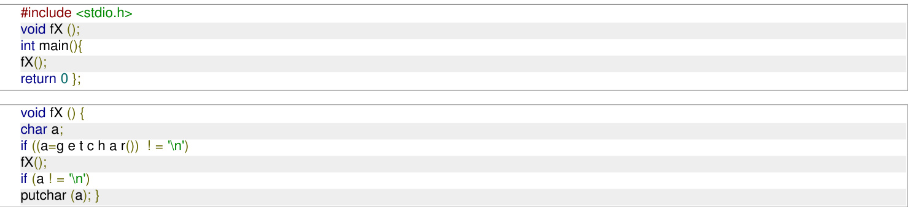

Assume that the input to the program from the command line is  followed by a newline character. Which one of the following statements is CORRECT?

A. The program will not terminate B. The program will terminate with no output C. The program will terminate with as output D. The program will terminate with as output

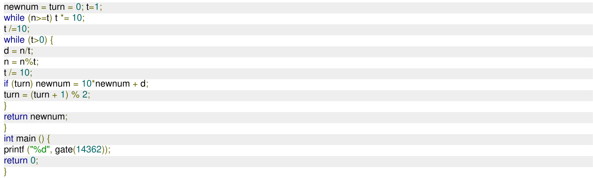

The value printed by the given $\boldsymbol { C }$ program is (Answer in integer)

5.7.6 Output: GATE CSE 2025 Set 2 Question: 23

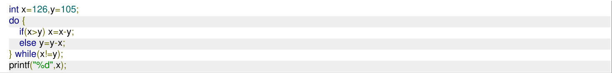

The output of the given C code segment is (Answer in integer)

gatecse2025-set2 programming-in-c output numerical-answers one-mark

Consider the following C program:

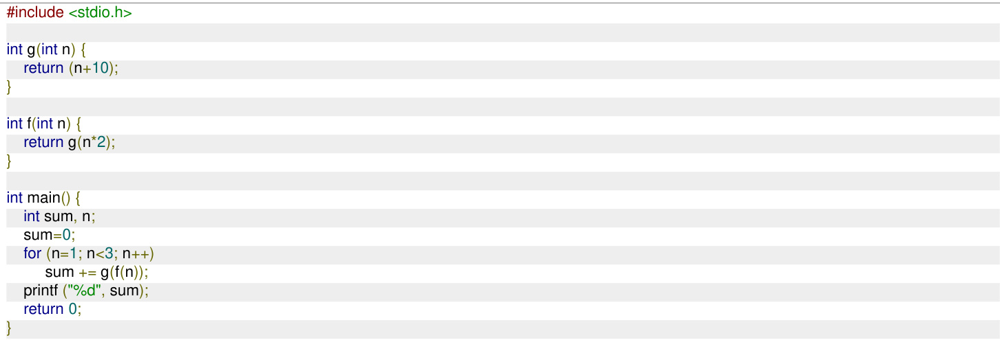

The output of the given C program is (Answer in integer)

gatecse202 5-set2 programming-in-c output numerical-answers two-marks

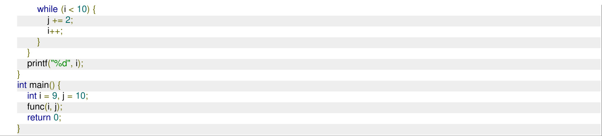

The output of the program is (answer in integer)

Note: Assume that the program compiles and runs successfully.

Show the activation records and the display structure just after the procedures called at lines marked $x$ and $y$ have started their execution. Be sure to indicate which of the two procedures named $A$ you are referring to.

Program Test; Procedure A; Procedure B; Procedure A; begin …… end A; begin y: A; end B; begin B; end A;   
begin x: A;   
end Test

gate1992 parameter-passing programming runtime-environment normal descriptive

# Answer key☟

In which of the following cases is it possible to obtain different results for call-by-reference and call-by-name parameter passing methods?

A. Passing a constant value as a B. Passing the address of an array as parameter a parameter C. Passing an array element as a D. Passing an array parameter

gate1994 programming parameter-passing easy

# 5.8.3 Parameter Passing: GATE CSE 2001 Question: 2.17 UGCNET-AUG2016-III: 21

What is printed by the print statements in the program $P 1$ assuming call by reference parameter passing?

Program P1() $\mathsf { x } = 1 0$ ; $\mathsf { y } = 3$ ; func1 $( { \tt y } , { \tt x } , { \tt x } )$ ; print $\mathsf { x }$ ;

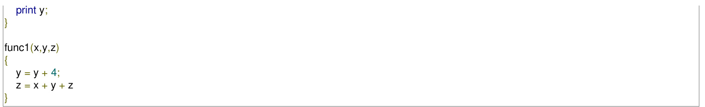

A. 10,3 B. 31,3 C. 27,7 D. None of the above gatecse-2001 programming-in-c parameter-passing normal ugcnetcse-aug2016-paper3

The following program fragment is written in a programming language that allows global variables and does not allow nested declarations of functions.

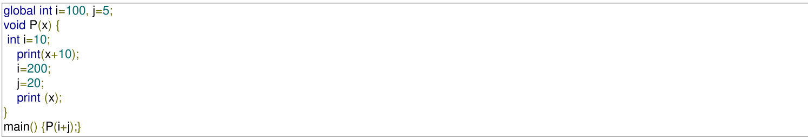

If the programming language uses static scoping and call by need parameter passing mechanism, the values printed by the above program are:

A. 115,220 B. 25,220 C. 25,15 D. 115,105 gatecse-2003 compiler- design normal runtime-environment parameter-passing

# What is printed by the following C program?

int f(int x, int \*py, int $\overline { { \star \star } } _ { \mathsf { p p z } }$ ) int y, z; $^ { \star \star } \mathsf { p p z } + = 1$ ; ${ \pmb z } = { \star } { \star } _ { \mathsf { p p z } } ;$ / corrected $z = \sqrt { p } p z$ ; to ${ \tt z } = { \tt ^ { \star \star } } { \tt p } { \tt p } { \tt z }$ ; \*py += 2; $\mathsf { y } = \mathsf { \Pi } ^ { \ast } \mathsf { p } \mathsf { y }$ ; $x + = 3$ ; return $x + y + z$ ;   
void main() int c, \*b, \*\*a; ${ \mathsf c } = 4$ ; $b = 8 c$ ; $a = 8 b$ ; printf("%d", f(c, b, a));

A. B. C. D. gatecse-2008 programming programming-in-c normal parameter-passing

# Answer key☟

int i=0, j=1;  
int main() {f(&i, &j);printf("%d %d\n", i,j);return 0;

A. B. C. D. gatecse-2010 programming programming-in-c easy parameter-passing

What is the return value of $f ( p , p )$ , if the value of $p$ is initialized to before the call? Note that the first parameter is passed by reference, whereas the second parameter is passed by value.

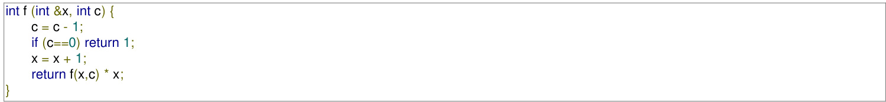

gatecse-2013 compiler-design normal marks-to-all numerical-answers parameter-passing runtime-environment

# Consider the following C program.

# include <stdio.h>   
void mystery (int \*ptra, int \*ptrb) { int \*temp; temp $\mathbf { \Sigma } = \mathbf { \Sigma }$ ptrb; ptrb $_ { \tt = p t r a }$ ; ptra $\mathbf { \Sigma } = \mathbf { \Sigma }$ temp;   
int main () { int $\mathsf { a } = 2 0 1 6$ , $\scriptstyle \mathtt { b = 0 }$ , $\mathtt { C } = 4$ , ${ \mathsf { d } } = 4 2$ ; mystery (&a, &b); if $( { \mathsf { a } } < { \mathsf { c } } )$ mystery (&c, &a); mystery (&a, &d); printf("%d\n", a);

The output of the program is gatecse-2016-set1 programming-in-c easy numerical-answers parameter-passing

#include<stdio.h>   
void fun1(char s1, char\* s2){ char\* temp; $\tan \mathsf { p } = \mathsf { s } 1$ ; $\mathsf { s } \mathsf { 1 } = \mathsf { s } \mathsf { 2 }$ ; $\mathbf { \boldsymbol { s } } \mathbf { \boldsymbol { 2 } } = \mathbf  \boldsymbol  \$ temp;   
void fun2(char\* s1, char\*\* s2){ char\* temp; temp ${ \bf \Pi } = { \bf \Pi } ^ { * } { \bf s } 1$ ; ${ { \bf { \dot { \tau } } } } _ { \bf { S } } 1 = { { \bf { \dot { \tau } } } } { \bf { S } } 2$ ; ${ } ^ { \star } \mathsf { s } 2 = { } $ temp;   
int main(){ char ${ } ^ { \star } \mathsf { s t r } 1 = \mathsf { " H i " }$ , ${ } ^ { \star } \mathsf { s t r } 2 = { } ^ { \mathsf { w } } \mathsf { B } \mathsf { y e } ^ { \mathsf { w } }$ ; fun1(str1, str2); printf $" \text{‰}$ , str1, str2); fun2(&str1, &str2); printf $" \% s$ %s", str1, str2); return 0;

The output of the program above is:

A. Hi Bye Bye Hi B. Hi Bye Hi Bye C. Bye Hi Hi Bye D. Bye Hi Bye Hi gatecse-2018 programming-in-c pointers parameter-passing normal programming two-marks

Which one of the choices given below would be printed when the following program is executed?

#include <stdio.h>   
void swap (int $^ { \star } \mathsf { X } ,$ int \*y) static int \*temp; $\tan { \mathsf { p } } = { \mathsf { X } }$ ; $\mathsf { X } = \mathsf { y }$ ; $\mathsf { y } =$ temp;   
void printab () static int i, $\mathtt { a } = - 3 , \mathtt { b } = - 6$ ; $\dot { \mathsf { I } } = 0$ ; while $( \mathfrak { i } < = 4 )$ ) if $( ( \mathsf { i } + + ) \% 2 = = 1$ ) continue; $\mathsf { a } = \mathsf { a } + \mathsf { i }$ ; ${ \mathsf { b } } = { \mathsf { b } } + { \mathsf { i } } ;$ ; } swap (&a, &b); printf( $\because a = \% d$ , $b = \% \mathsf { d } \mathsf { h } ^ { \prime \prime }$ , a, b);   
main() printab(); printab();

A. a=0,b=3 B. a=3,b=0 a=0,b=3 a=12,b=9 C. a=3,b=6 D. a=6,b=3 a=3,b=6 a= 15,b=12 gateit-2006 programming programming-in-c normal parameter-passing

# define swap1 (a, b) $\tan \rho = a$ ; $a = b$ ; ${ \mathsf b } =$ tmp   
void swap2 int a, int b) int tmp; $\tan \rho = \mathsf { a }$ ; $\mathtt { a } = \mathtt { b }$ ; $\mathsf { b } = \mathsf { t m p }$ ;   
}   
void swap3 (int\*a, int\*b) int tmp; $\mathrm { t m p } = { } ^ { \star } { \mathsf { a } }$ ; $\mathbf { \dot { a } } = \mathbf { \dot { b } }$ ; $^ { \star } \mathsf { b } = \mathsf { t m p }$ ;   
int main () int num1 $= 5$ , $\mathsf { n u m } 2 = 4$ tmp; if (num1 $<$ num2) {swap1 (num1, num2);} if (num1 $\prec$ num2) {swap2 (num1 $+ ~ 1$ , num2);} if (num1 $> =$ num2) {swap3 (&num1, &num2);} printf $" \% d$ , %d", num1, num2);

A. B. 5,4 C. 4,5 D. gateit-2008 programming programming-in-c easy parameter-passing

The most appropriate matching for the following pairs

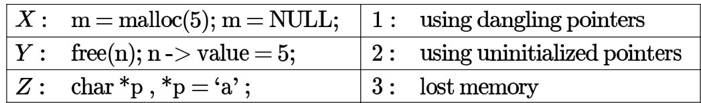

is:

A. $\begin{array} { c } { { X - 1 \ Y - 3 \ Z - 2 } } \\ { { X - 3 \ Y - 2 \ Z - 1 } } \end{array}$ $\begin{array} { c } { { 8 . \ X - 2 \ Y - 1 \ Z - 3 } } \\ { { \mathsf { D } . \ X - 3 \ Y - 1 \ Z - 2 } } \end{array}$ C.   
gatecse-2000 programming programming-in-c easy match-the-following pointers

# Answer key☟

Consider the following three C functions: $[ P 1 ]$

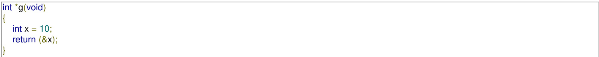

# [P2]

int \*g(void) int \*px; \*px = 10; return px;

# [P3]

int \*g(void) int \*px; $\mathsf { p } \mathsf { x } = ( \mathsf { i n t } ^ { \ast } )$ malloc (sizeof(int)); $\mathsf { ^ { * } p x } = 1 0$ ; return px;

Which of the above three functions are likely to cause problems with pointers?

A. Only B. Only $P 1$ and $P 3$ C. Only $P 1$ and $P 2$ D. $^ { P 1 , P 2 }$ and

gatecse-2001 programming programming-in-c normal pointers

Assume the following C variable declaration: int \*A[10], B[10][10];

Of the following expressions:

I. A[2] II. A[2][3] III. B[1] IV. B[2][3]

which will not give compile-time errors if used as left hand sides of assignment statements in a C program?

A. I, II, and IV only B. II, III, and IV only C. II and IV only D. IV only gatecse-2003 programming programming-in-c easy pointers

Consider the C program shown below:

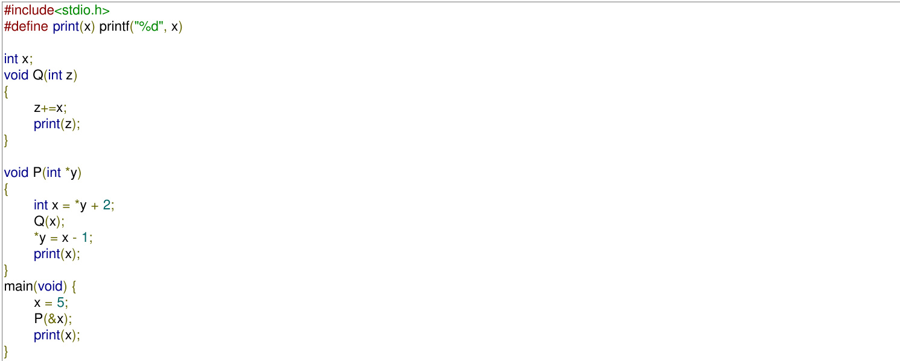

The output of this program is:

A. 1276 B. C. 1466 D. 766

gatecse-2003 programming programming-in-c normal pointers

# Answer key☟

D. A function that takes an integer pointer as argument and returns a function pointer

Consider this C code to swap two integers and these five statements: the code

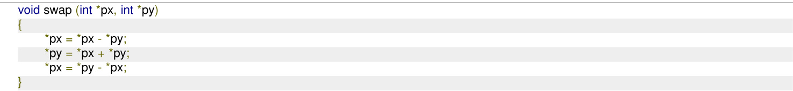

S1: will generate a compilation error

S2: may generate a segmentation fault at runtime depending on the arguments passed

S3: correctly implements the swap procedure for all input pointers referring to integers stored in memory locations accessible to the process

S4: implements the swap procedure correctly for some but not all valid input pointers

S5: may add or subtract integers and pointers

A. S1 B. S2 and S3 C. S2 and S4 D. S2 and S5

gatecse-2006 programming programming-in-c normal pointers

Consider the following program in C language:

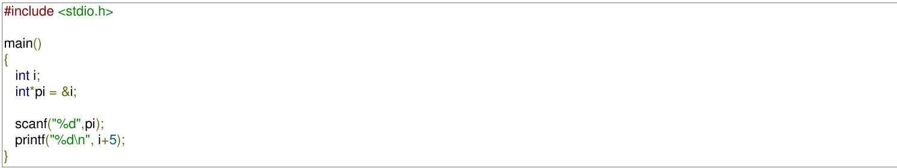

Which one of the following statements is TRUE?

A. Compilation fails.   
B. Execution results in a run-time error.   
C. On execution, the value printed is more than the address of variable $_ i$ .   
D. On execution, the value printed is more than the integer value entered.

# Consider the following C code:

#include<stdio.h>   
int \*assignval (int $^ { \star } \mathsf { X } ,$ int val) ${ { \bf { \dot { \tau } } } } _ { \bf { X } } = { \bf { v } } \mathsf { a l }$ ; return x;   
void main () { int ${ { \bf { \dot { x } } } } _ { \bf { X } } =$ malloc(sizeof(int)); if (NULL $\quad = = \mathbf { X }$ ) return; $\mathbf { \boldsymbol { x } } =$ assignval $( \mathsf { x } , 0 )$ ; if (x) $\pmb { x } =$ (int \*)malloc(sizeof(int)); if (NULL $\scriptstyle = = { \mathsf { X } }$ ) return; $\pmb { x } =$ assignval $( \mathsf { x } , 1 0 )$ ; } printf("%d\n", \*x); free $( { \pmb x } )$ ;

The code suffers from which one of the following problems:

A. compiler error as the return of  is not typecast appropriately.   
B. compiler error because the comparison should be made as $\scriptstyle { \dot { \mathbf { \phi } } } _ { \mathbf { \phi } } = = { \dot { \mathbf { \phi } } } _ { \mathbf { \phi } } { \mathrm { , } } \operatorname { \bar { \mathbf { \phi } } } _ { \mathbf { \phi } } \left( \mathbf { \phi } _ { \mathbf { \phi } } \right)$ and not as shown.   
C. compiles successfully but execution may result in dangling pointer.   
D. compiles successfully but execution may result in memory leak.

# Consider the following C program.

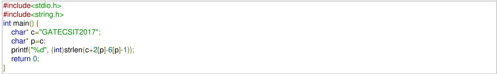

# The output of the program is

gatecse-2017-set2 programming-in-c numerical-answers array pointers

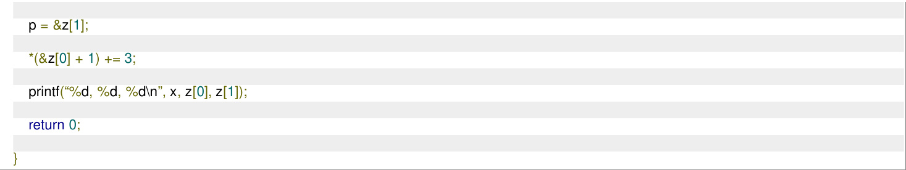

A. 1,10,11 B. 1,10,14 C. 10,14,11 D. 10,10,14 gatecse-2022 programming programming-in-c pointers output one-mark

# ​What is the output of the following program?

#include <stdio.h>   
int main()   
double a[2]={20.0,25.0},\* p,\* q;   
${ \mathsf p } { = } { \mathsf a }$ ;   
$\mathsf { q } = \mathsf { p } + 1$ ;   
printf $\because \% d , \% d ^ { \prime \prime }$ , (int) (q-p),( int)(\* q- p)); return 0;}

A. B. 1,5 C. 8,5 D. gatecse-2024-set2 programming programming-in-c pointers two-marks

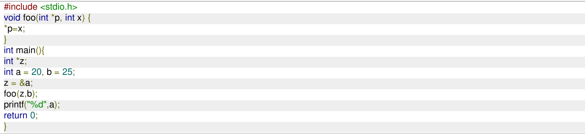

The output of the given program is (Answer in integer)

gatecse2025-set1 programming-in-c pointers output numerical-answers easy one-mark

# Consider the following ANSI-C program.

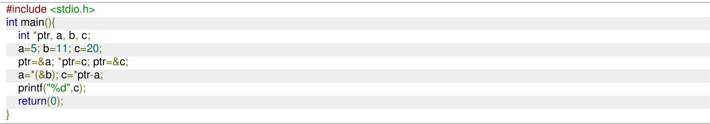

The output of this program is (answer in integer)

Note: Assume that the program compiles and runs successfully.

gatecse-2026-set2 programming-in-c pointers output numerical-answers two-marks

Given the programming constructs

i. assignment   
ii. for loops where the loop parameter cannot be changed within the loop   
iii. if-then-else   
iv. forward go to   
v. arbitrary go to   
vi. non-recursive procedure call   
vii. recursive procedure/function call   
viii. repeat loop,

which constructs will you not include in a programming language such that it should be possible to program the terminates (i.e., halting) function in the same programming language

A. (ii), (ii)， (iv) B. (v), (vii), (vii)C. (vi)， (vii), (vii) D. (imi)， (vii)，(vi)

gate1999 programming normal programming-constructs

A. B. 4 C. D. .7

gatecse-2000 programming programming-in-c easy

In the C language:

A. At most one activation record exists between the current activation record and the activation record for the main   
B. The number of activation records between the current activation record and the activation records from the main depends on the actual function calling sequence.   
C. The visibility of global variables depends on the actual function calling sequence   
D. Recursion requires the activation record for the recursive function to be saved in a different stack before the recursive function can be called.

gatecse-2002 programming programming-in-c easy descriptive

The C language is:

A. A context free language B. A context sensitive language C. A regular language D. Parsable fully only by a Turing machine

gatecse-2002 programming programming-in-c normal

Consider the following C program:

double foo (double); /\* Line 1 \*/   
int main() { double da, db; //input da db $\mathbf { \Sigma } = \mathbf { \Sigma }$ foo(da);   
double foo (double a) { return a;

The above code compiled without any error or warning. If Line is deleted, the above code will show:

A. no compile warning or error   
B. some compiler-warnings not leading to unintended results   
C. some compiler-warnings due to type-mismatch eventually leading to unintended results   
D. compiler errors

gatecse-2005 programming programming-in-c compiler-design easy

# Answer key☟

Choose the correct option to fill and $\boldsymbol { ? 2 } \mathsf { s o }$ that the program below prints an input string in reverse order.   
Assume that the input string is terminated by a new line character.   
void reverse(void) int c; if(?1) reverse(); ?2   
main() printf( "Enter text"); printf $( " \boldsymbol { \mathsf { n } } ^ { * } )$ ; reverse(); printf $( " \boldsymbol { \mathsf { n } } ^ { * } )$ ;   
A. is $( g e t c h a r ( ) ! = ^ { \prime } \backslash n ^ { \prime } )$ is $\cdot ( c )$ ；   
B. ?1 is $( c = g e t c h a r ( ) ) ! = ^ { \prime } \setminus n ^ { \prime } )$ is getchar $( c )$ ；   
C. is $( c ! = ^ { \prime } \backslash n ^ { \prime } )$ is $( c )$ ；   
D. is $( c = g e t c h a r ( ) ) ! = ^ { \prime } \backslash n ^ { \prime } )$ is $( c )$ ；

Consider the following C code segment.

int a, b, ${ \mathsf c } = 0$ ;   
void prtFun(void);   
main() static int $\mathsf { a } = 1$ ; $/ ^ { \star }$ Line 1 \*/ prtFun(); $\mathsf { a } + = 1$ ; prtFun(); printf(“ \n %d %d ”, a, b);   
void prtFun(void) static int $\mathtt { a } = 2$ ; $/ ^ { \star }$ Line 2 \*/ int ${ \mathsf b } = 1$ ; $a + = + + b$ ; printf(“ \n %d %d ”, a, b);

What output will be generated by the given code segment?

3 1 4 2 4 2 3 2 A. B. 1 C. D. 4 2 6 1 2 0 52