Consider the following C code segment.

int a, b, ${ \mathsf c } = 0$ ;   
void prtFun(void);   
main() static int $\mathsf { a } = 1$ ; $/ ^ { \ast }$ Line 1 \*/ prtFun(); a $\scriptstyle + = 1$ ; prtFun(); printf(“ \n %d %d ”, a, b);   
void prtFun(void) static int $\mathtt { a } = 2$ ; $/ ^ { \star }$ Line 2 \*/ int ${ \mathsf b } = 1$ ; $a + = + + b$ ; printf(“ \n %d %d ”, a, b);

What output will be generated by the given code segment if:

Line is replaced by auto int $a = 1$ ;   
Line 2 is replaced by register int $a = 2$ ;

31 42 42 42 A. B. C. D. 42 61 2 0 20

normal gatecse-2012 programming-in-c programming

# Answer key☟

# 5.11.9 Programming In C: GATE CSE 2014 Set 2 Question: 11

Suppose $n$ and $p$ are unsigned int variables in a C program. We wish to set $p$ to $^ n C _ { 3 }$ . If $n$ is large, which one of the following statements is most likely to set $p$ correctly?

A. $p { = } n { * ( n - 1 ) } * ( n - 2 ) / 6$ ； B. $p { = } n { * ( n - 1 ) } / 2 * ( n - 2 ) / 3 ;$   
C. $p { = } n { * ( n - 1 ) } / 3 { * ( n - 2 ) } / 2$ ； D. $p { = } n { * ( n - 1 ) } * ( n - 2 ) / 6 . 0 ;$

gatecse-2014-set2 programming programming-in-c normal

# Answer key☟

# 5.11.10 Programming In C: GATE CSE 2014 Set 2 Question: 42

Consider the C function given below.

int f(int j) static int $\dot { \mathsf { I } } = 5 0$ ; int k; if $( \mathfrak { i } = = \mathfrak { j } )$ { printf( "something"); k = f(i); return 0; else return 0;

Which one of the following is TRUE?

AB. The function returns  for all values of $j$ . The function prints the string something for all values of $j$ .   
C. The function returns  when $j = 5 0$ .   
D. The function will exhaust the runtime stack or run into an infinite loop when $j = 5 0$ .

The output of the following C program is

void f1 int a, int b) { int c; ${ \mathsf { c } } = { \mathsf { a } }$ ; $\mathtt { a } = \mathtt { b }$ ; ${ \mathfrak { b } } = { \mathfrak { c } }$ ;   
void f2 ( int $^ { \star }$ a, int \* b) { int $\mathtt { c }$ ; ${ \mathsf { C } } = { \mathsf { \Omega } } ^ { \star }$ a; $\mathbf { \dot { a } } = \mathbf { \dot { b } }$ ; ${ } ^ { \star } \mathsf { b } = \mathsf { c }$ ;   
int main () { int $\mathsf { a } = 4$ , ${ \mathsf b } = 5$ , ${ \mathsf c } = 6$ ; f1 ( a, b); f2 (&b, &c); printf ("%d", c - a - b);

Consider the following "C" program.

void f(int, short);   
void main() int $\dot { \mathbf { l } } = 1 0 0$ ; short $\mathsf { s } = 1 2$ ; short ${ { \bf { \dot { \mathbf { \rho } } } } } [ { \bf { \dot { \mathbf { p } } } } = 8 . 5$ ; / call to f()

Which one of the following expressions when placed in the blank above, will NOT result in a type checking error?

A. $f ( s , * s )$ ${ \mathsf { B } } . \ i = f ( i , s )$ C. $f ( i , * s )$ D. $f ( i , * p )$

The following function computes the maximum value contained in an integer array $P [ ]$ of size $n$ $( n > = 1 )$ .

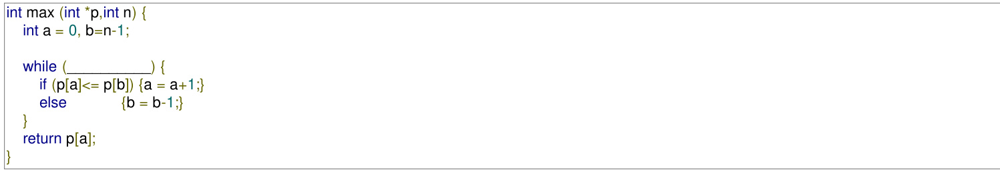

The missing loop condition is:

A. ${ \textit { a } } ! = n$ B.   
C. $b > ( a + 1 )$ D.

gatecse-2016-set1 programming-in-c normal

#include<string.h>   
void printlength(char $^ { \ast } { \mathsf { s } }$ , char $^ { \ast } \mathrm { t }$ ) { unsigned int $\mathtt { c } { = } 0$ ; int len $\mathbf { \Sigma } = \mathbf { \Sigma }$ ((strlen(s) strlen(t)) $> { 0 }$ c) ? strlen(s) $\because$ strlen(t); printf $" \% 0 \textcircled { \times } 1 1 \cdot$ , len);   
void main() char $\mathbf { \^ { * } x } = \mathbf { " a b c " }$ ; char $\mathbf { \dot { \bar { y } } } = \mathbf { \ " { d e f g h } } ^ { \prime \prime }$ ; printlength(x,y);

Recall that is defined in $h$ as returning a value of type , which is an unsigned int. The output of the program is

gatecse-2017-set1 programming programming-in-c normal numerical-answers

The output of executing the following C program is

# #include<stdio.h>

int total(int v) { static int count $= 0$ while(v) count $+ = \mathsf { v } \& \mathsf { 1 }$ ; $\mathsf { v } > > = 1$ ; } return count;   
void main() $\{$ static int $\scriptstyle x = 0$ ; int $\mathsf { i } = 5$ ; for(; i>0; i--) { $\mathsf { X } = \mathsf { X } +$ total(i); } printf("%d\n", x);

Match the following:

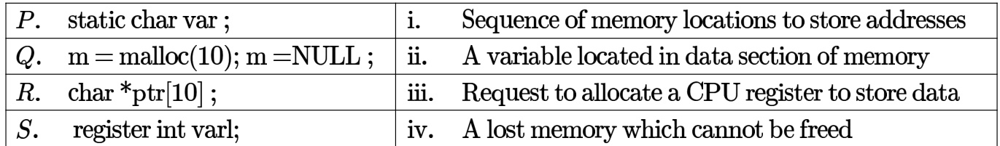

A. P-ii; Q-iv; R-i; S-iii B. P-ii; Q-i; R-iv; S-iii C. P-ii; Q-iv; R-iii; S-i D. P-iii; Q-iv; R-i; S-ii gatecse-2017-set2 programming programming-in-c match-the-following

$\mathsf { n } \mathsf { 1 } = \mathsf { m } + +$ ;   
n--;   
--n1;   
$\mathsf { n } - = \mathsf { n } 1$ ;   
printf(“%d”, n);   
return 0;

# The output of the program is

Consider the following C code. Assume that unsigned long int type length is  bits.

unsigned long int fun(unsigned long int n) { unsigned long int i, $\scriptstyle \mathbf { j = } 0$ , sum $= 0$ ; for( i=n; i>1; i=i/2) $\mathrm { j } { + } { + }$ ; for( ; j>1; j=j/2) sum $^ { + + }$ ; return sum;

The value returned when we call fun with the input is:

A. B. C. 6 D. 40

gatecse-2018 programming-in-c normal programming two-marks

5.11.19 Programming In C: GATE CSE 2019 Question: 27

# Consider the following C program:

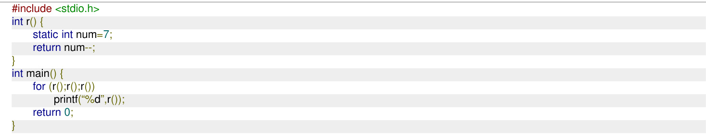

Which one of the following values will be displayed on execution of the programs?

A. B. C. 63 D. 630

gatecse-2019 programming-in-c programming two-marks

# Consider the following C program:

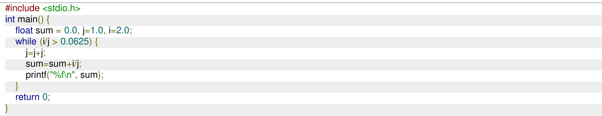

The number of times the variable sum will be printed, when the above program is executed, is

# Consider the following C program:

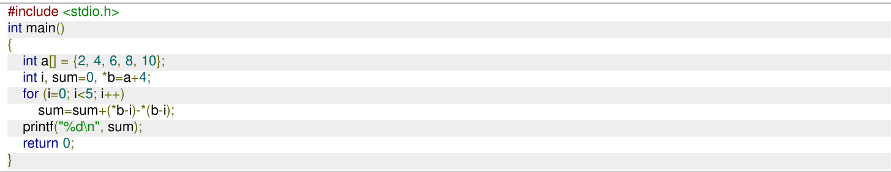

# The output of the above C program is

gatecse-2019 numerical-answers programming-in-c programming two-marks

# 5.11.22 Programming In C: GATE CSE 2021 Set 1 Question: 37

# ​Consider the following ANSI program.

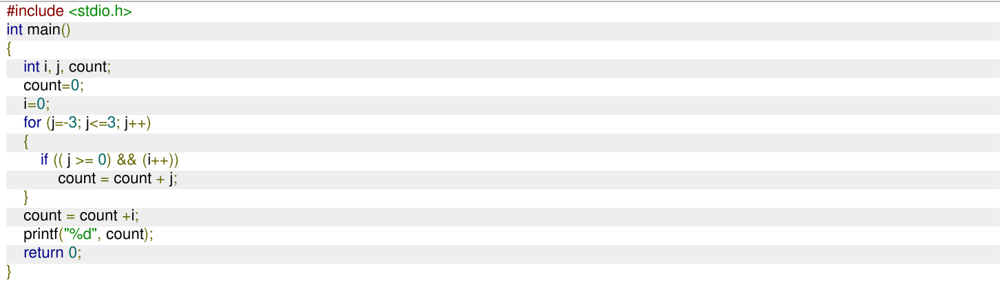

Which one of the following options is correct?

A. The program will not compile successfully B. The program will compile successfully and output  when executed C. The program will compile successfully and output  when executed D. The program will compile successfully and output when executed ​Consider the following function definition.

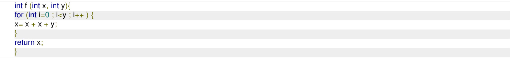

Which of the following statements is/are TRUE about the above function?

A. If the inputs are $\scriptstyle x = 2 0 , y = 1 0$ , then the return value is greater than B. If the inputs are $x = 2 0$ ， $y = 2 0$ , then the return value is greater than C. If the inputs are $\scriptstyle x = 2 0 , y = 1 0$ , then the return value is less than D. + f the inputs are $\scriptstyle x = 1 0 , y = 2 0$ , then the return value is greater than $2 ^ { 2 0 }$

Consider the following three ANSI-C programs, and .

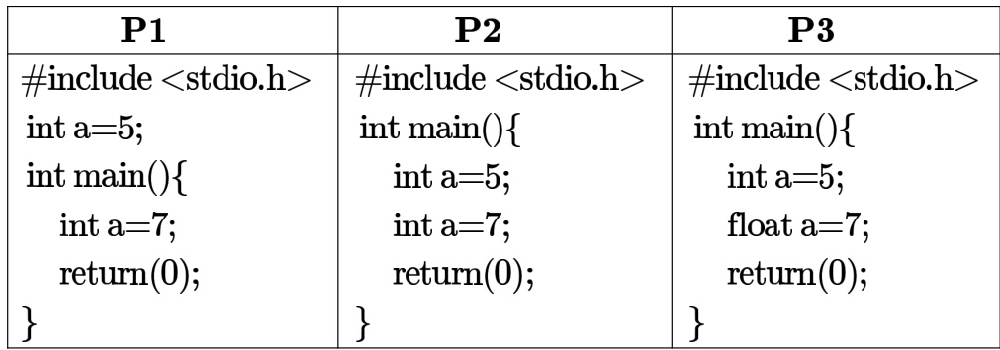

Which one of the following statements is true?

A. Only  will compile without any error   
B. Only  will compile without any error   
C. Only  will compile without any error   
D. All three programs and will compile without any error

What is the output of the following program?

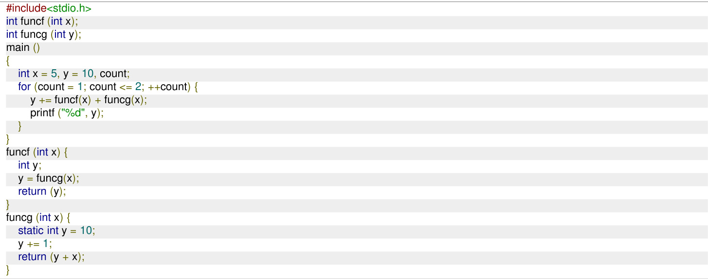

A. 43 80 B. 42 74 C. 33 37 D. 32 32

printf $( " \boldsymbol { \mathsf { n } } ^ { * } )$ ; wrt_it(); printf $( " \boldsymbol { \mathsf { n } } ^ { * } )$ ; return 0; void wrt_it (void) int c; if (?1) wrt_it(); ?2

A. is $g e t c h a r ( ) ! = \ " \mathrm { \textmu }$ is getchar(c);   
B. is $( c = g e t c h a r ( ) ) ; ! = \ " { \sf n } "$ is getchar(c);   
C. is $c ! = " \boldsymbol { \mathsf { n } } ^ { \prime }$ is putchar(c);   
D. is $( c = g e t c h a r ( ) ) ! = \ " { \mathsf { m } } ^ { \prime }$ is putchar $( c )$ ；

Let $a$ be an array containing $n$ integers in increasing order. The following algorithm determines whethe there are two distinct numbers in the array whose difference is a specified number $ { \boldsymbol { S } } > 0$ .

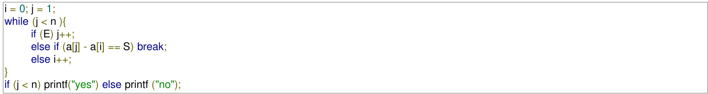

Choose the correct expression for E.

CA. $\begin{array} { r } { \mathsf { B . ~ } a [ j ] - a [ i ] < S } \\ { \mathsf { D . ~ } a [ i ] - a [ j ] > S } \end{array}$

gateit-2005 programming normal programming-in-c

Which one of the choices given below would be printed when the following program is executed?

#include <stdio.h>   
int a1[] $\mathbf { \Sigma } = \mathbf { \Sigma }$ {6, 7, 8, 18, 34, 67};   
int a2[] $\mathbf { \Sigma } = \mathbf { \Sigma }$ {23, 56, 28, 29};   
int a3[] $\mathbf { \Sigma } = \mathbf { \Sigma }$ {-12, 27, -31};   
int $^ { * } \mathbf { x } [ ] = \{ \mathsf { a } 1$ , a2, a3};   
void print(int $^ { * } { \mathsf { a } } [ ]$ ) printf $" \% d ,$ ", a[0][2]); printf("%d," $^ { * } { \mathsf { a } } [ 2 ] )$ ; printf $( " 9 \% ) ,$ ", $^ { \star } + + \mathsf { a } [ 0 ] )$ ; printf("%d," $^ { \star } ( + + \mathsf { a } ) [ 0 ] )$ ; printf("%d\n", a[-1][+1]);   
main() print(x);

A. B. 8,8,7,23,7   
C. −12,-12,27,-31,23 D. −12,-12,27,-31,56

gateit-2006 programming programming-in-c normal

# Consider the C program given below

#include <stdio.h>   
int main () 1 int $\mathsf { s u m } = 0$ , maxsum $= 0$ ,  i, ${ \mathsf { n } } = 6$ ; int a $[ ] = \{ 2 , - 2 ,$ -1, 3, 4, 2}; for $( \mathsf { i } = 0 ; \mathsf { i } < \mathsf { n } ; \mathsf { i } + +$ ) { if $( \mathfrak { i } = = 0 \ | |$ a [i] < 0  || a [i] < a [i - 1])  { if (sum $>$ maxsum) maxsum $\mathbf { \Sigma } = \mathbf { \Sigma }$ sum; sum = (a [i] > 0) ? a [i] : 0; } else sum $+ = a$ [i]; } if (sum $>$ maxsum) maxsum $\ c =$ sum printf $( " \% 0 \textcircled { \times } 1 1 "$ maxsum);

What is the value printed out when this program is executed?

A. B. C. D. 6

gateit-2007 programming programming-in-c normal

The goal of structured programming is to:

A. have well indented programs   
B. be able to infer the flow of control from the compiled code C. be able to infer the flow of control from the program text D. avoid the use of GOTO statements

gatecse-2004 programming easy programming-paradigms

Choose the best matching between the programming styles in Group and their characteristics in Group 2.

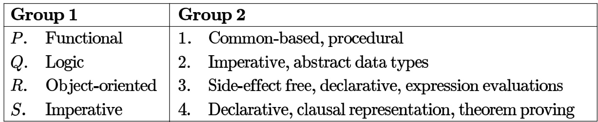

$\begin{array} { l l l l } { { \textsf { A . } P - 2 } } & { { Q - 3 } } & { { R - 4 } } & { { S - 1 } } \\ { { \textsf { C . } P - 3 } } & { { Q - 4 } } & { { R - 1 } } & { { S - 2 } } \end{array}$ B. Q-3 R-2 S-1   
D. 8-4 R-2 S-1

gatecse-2004 programming normal programming-paradigms match-the-following

The number of times is called (including the first call) for evaluation of $f i b ( 7 )$ is

Consider the following recursive function:

function fib (n:integer);integer; begin   
if $( \mathsf { n } { = } 0 )$ or $\scriptstyle ( \mathsf { n } = 1 )$ ) then fib $: = 1$ else fib $: = \mathbf { f i b } ( \mathsf { n } - 1 ) \ +$ fib(n-2) end;

The above function is run on a computer with a stack of bytes. Assuming that only return address and parameter are passed on the stack, and that an integer value and an address takes 2 bytes each, estimate the maximum value of $\boldsymbol { n }$ for which the stack will not overflow. Give reasons for your answer.

gate1994 programming recursion normal descriptive

A recursive program to compute Fibonacci numbers is shown below. Assume you are also given an array $f [ 0 \ldots m ]$ with all elements initialized to

fib(n) { if $( { \mathsf { n } } > { \mathsf { M } } )$ error $( )$ ; if $( \mathsf { n } = = 0 )$ 1 return 1; if $( \mathsf { n } = = 1$ )return 1; if $( \sqsubseteq )$ __(1) return ▭ (2) t = fib(n 1) + fib(n 2); ▭ _(3) return t;

A. Fill in the boxes with expressions/statement to make $f i b ( )$ store and reuse computed Fibonacci values. Write the box number and the corresponding contents in your answer book.   
B. What is the time complexity of the resulting program when computing $f i b ( n ) !$

Consider the following C program:

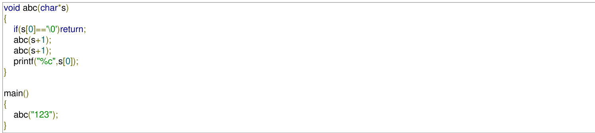

A. What will be the output of the program?   
B. I f $a b c ( s )$ is called with a null-terminated string $\pmb { s }$ of length $n$ characters (not counting the null $( " 1 0 " )$ character), how many characters will be printed by $a b c ( s ) ?$

# The following recursive function in C is a solution to the Towers of Hanoi problem.

void move(int n, char A, char B, char C) if move printf("Move disk %d from pole %c to pole %c\n", n, A, C); move (.....................);

# Fill in the dotted parts of the solution.

gatecse-2002 programming recursion descriptive

5.13.6 Recursion: GATE CSE 2004 Question: 31, ISRO2008-40

Consider the following C function:

int f(int n) static int $\dot { \mathsf { I } } = 1$ ; if $\cdot n > = 5 )$ return n; ${ \mathsf { n } } = { \mathsf { n } } + { \mathsf { i } }$ ; $\mathrm { i } \mathrm { + } \mathrm { + }$ ; return f(n);

The value returned by $f ( 1 )$ is:

A. B. 6 C. D. gatecse-2004 programming programming-in-c recursion easy isro2008

# Answer key☟

# 5.13.7 Recursion: GATE CSE 2005 Question: 81b

double foo(int n) int i; double sum; if $( \mathsf { n } = = 0 )$ return 1.0; else sum $= 0 . 0$ ; for(i = 0; i < n; i++) sum += foo(i); return sum;

Suppose we modify the above function $f o o ( )$ and stores the value of $f o o ( i ) 0 \leq i < n ,$ as and when they are computed. With this modification the time complexity for function $f o o ( )$ is significantly reduced. The space complexity of the modified function would be:

A. 0(1) B. 0(n) C. O(n2) D. n!

gatecse-2005 programming recursion normal

Consider the following C function:

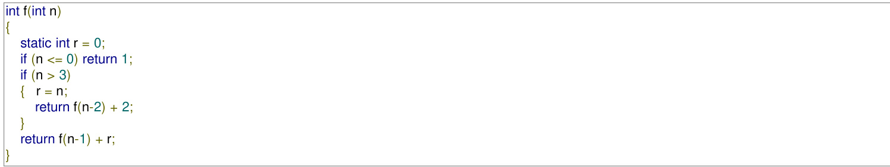

What is the value of $f ( 5 ) ?$

A. B. C. 9 D.

gatecse-2007 programming recursion normal

# Consider the following function.

double f(double x){ if( a ${ \sf b s } ( { \sf x } ^ { * } { \sf x } - 3 ) < 0 . 0 1$ ) return x; else return $\mathsf { f } ( \mathsf { x } / 2 + 1 . 5 / \mathsf { x } )$ ;

Give a value $q$ (to decimals) such that $f ( q )$ will return $q$ :

gatecse-2014-set2 programming recursion numerical-answers normal

Consider the following function written in the C programming langauge

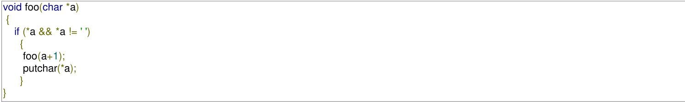

The output of the above function on input "ABCD EFGH" is

A. ABCD EFGH B. ABCD C. HGFE DCBA D. DCBA

gatecse-2015-set2 programming programming-in-c normal recursion

A. 312213444   
B. 312111222   
C. 3122134   
D. 3121112

# Consider the following program:

int f (int p, int n) if $( \mathsf { n } < = 1$ ) return 0; else return max (f $( p + 1 , \mathsf { n - 1 } )$ ), p[0] p[1]);   
int main () int a[] $\mathbf { \Sigma } = \mathbf { \Sigma }$ {3, 5, 2, 6, 4}; printf(" %d", f(a, 5));

Note: $\operatorname* { m a x } ( x , y )$ returns the maximum of $x$ and $y$ The value printed by this program is

gatecse-2016-set2 programming-in-c normal numerical-answers recursion

Consider the following two functions.

void fun1(int n) if $\mathsf { n } = = 0 \mathsf { \Omega }$ ) return; printf("%d", n); fun2(n 2); printf("%d" n);   
void fun2(int n) { if $\mathsf { n } = = 0 )$ ) return; printf("%d", n); fun1 $( + + \mathsf { n } )$ ; printf("%d", n);

The output printed when is called is

A. 53423122233445   
B. 53423120112233   
C. 53423122132435   
D. 53423120213243

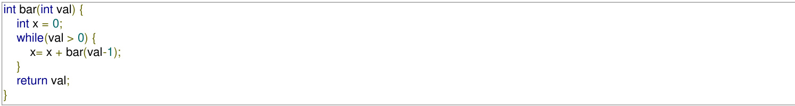

Invocations of $f o o ( 3 )$ and will result in:

A. Return of  and respectively. B. Infinite loop and abnormal termination respectively. C. Abnormal termination and infinite D. Both terminating abnormally. loop respectively.

gatecse-2017-set1 programming-in-c programming normal recursion

# Consider the following program:

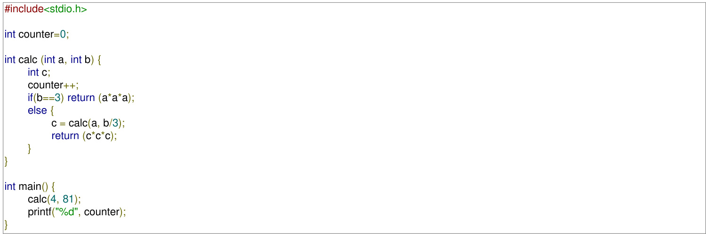

The output of this program is

Consider the following C functions.

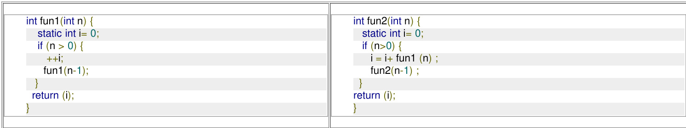

# The return value of is

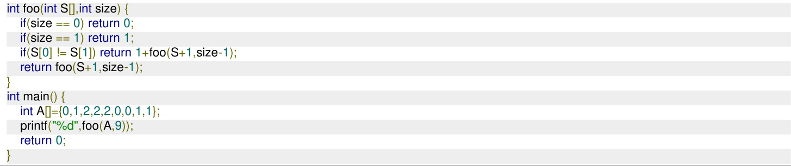

The value printed by the given $\boldsymbol { C }$ program is (Answer in integer)

# Consider the following ANSI-C function.

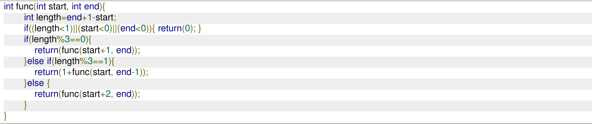

The maximum possible value that can be returned from this function is (answer in integer)

Note: Ignore syntax errors (if any) in the function.

# The function f is defined as follows:

int f (int n) { if $( \mathsf { n } < = 1 )$ ) return 1; else if $( \mathsf { n } \ \% \ 2 \ \mathrm { ~ = ~ } \ 0 )$ ) return $\mathfrak { f } ( \mathfrak { n } / 2 )$ else return $\mathfrak { f } ( 3 \mathfrak { n } \cdot 1 )$ ;

Assuming that arbitrarily large integers can be passed as a parameter to the function, consider the following statements.

i. The function $f$ terminates for finitely many different values of $n \geq 1$ .   
ii. The function $f$ terminates for infinitely many different values of $n \geq 1$ .   
iii. The function $f$ does not terminate for finitely many different values of $n \geq 1$ .   
iv. The function $f$ does not terminate for infinitely many different values of $n \geq 1$ .

Which one of the following options is true of the above?

A. i and iii B. and iv C. ii and iii D. ii and iv

gateit-2007 programming recursion normal

A. A static variable declared inside a function   
B. An array of integers declared inside a function   
C. dynamically allocated array of integers created using malloc() function call   
D. Return address of a function

Consider the following C program segment:

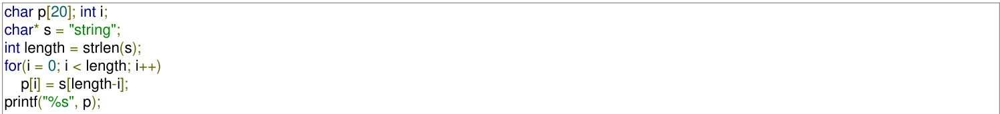

The output of the program is:

A. gnirts B. string C. gnirt D. no output is printed gatecse-2004 programming programming-in-c strings easy

# 5.15.2 Strings: GATE CSE 2025 Set 2 Question: 9

# ​Consider the following C program:

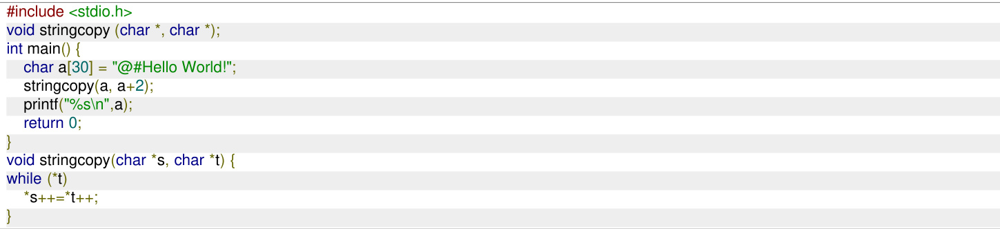

Which one of the following will be the output of the program?

A. $@$ #Hello World! B. Hello World! C. ello World! D. Hello World!d!

gatecse2025-set2 programming-in-c strings output one-mark

Consider the following C program:

#include<stdio.h>   
struct Ournode{ char x, y, z;   
};   
int main() { struct Ournode p={'1', '0', $\prime a \prime + 2 \}$ ; struct Ournode $\scriptstyle \mathbf { \hat { q } } = \mathbf { \& } |$ ; printf("%c, %c", \*((char\*)q+1), \*((char\*)q+2)); return 0;

The output of this program is:

A. 0, c B. 0, a+2 C. '0', 'a+2' D. '0', 'c' gatecse-2018 programming-in-c programming structure normal one-mark

# Consider the following ANSI program:

#include <stdio.h>   
#include <stdlib.h>   
struct Node{ int value; struct Node \*next;};   
int main( ) { struct Node \*boxE, \*head, \*boxN; int index $_ { = 0 }$ ; boxE=head= (struct Node \*) malloc(sizeof(struct Node)); head $$ value $\mathbf { \Sigma } = \mathbf { \Sigma }$ index; for (index $^ { = 1 }$ ; index $< = 3$ ; index $^ { + + }$ ){ boxN $\mathbf { \Sigma } = \mathbf { \Sigma }$ (struct Node malloc (sizeof(struct Node)); boxE $$ next $\ c =$ boxN; boxN $$ value $\mathbf { \Sigma } = \mathbf { \Sigma }$ index; boxE $\ c =$ boxN;   
for (index $_ { = 0 }$ ; index $< = 3$ ; index $^ { + + }$ ) { printf( “Value at index $\% 0$ is $\% 0 d \sin ^ { \prime \prime }$ , index, head $$ value); head $\mathbf { \Sigma } = \mathbf { \Sigma }$ head $$ next; printf( “Value at index $\% 0$ is $\% \mathsf { d } \backslash \mathsf { n } ^ { \prime \prime }$ index $+ 1$ , head $$ value); } }

Which one of the following statements below is correct about the program?

A. Upon execution, the program creates a linked-list of five nodes B. Upon execution, the program goes into an infinite loop C. It has a missing which will be reported as an error by the compiler D. It dereferences an uninitialized pointer that may result in a run-time error

static t s = {"A", "B"}; printf ("%s %s\n", s.a, s.b); f1(s); printf $" \text{‰}$ , s.a, s.b); f2(&s);   
void f1 (t s) $\mathsf { s } . \mathsf { a } = \ " \mathsf { U } ^ { \prime \prime }$ ; $\mathsf { s . b } = \mathsf { w } ^ { \prime \prime }$ ; printf $( " \% s \% s )$ , s.a, s.b); return;   
void $\mathsf { f } 2 ( \mathsf { t } ^ { \star } \mathsf { p } )$ $\mathsf { p } \to \mathsf { a } \ = \mathsf { " V " }$ ; $\mathsf { p } \to \mathsf { b } = \mathsf { " W " }$ ; $\mathsf { p r i n t f ( \mathsf { w o } / \mathsf { o S \mathsf { \ o S } } \mathsf { \circ \mathsf { S } } \mathsf { I n } ^ { \ast } , \mathsf { p } \to \mathsf { a } , \mathsf { p } \to \mathsf { b } ) ; }$ return;

What is the output generated by the program ?

A. B. UV UV VW AB V W VW   
C. D. AB UV UV UV VW v W UV   
gateit-2004 programming programming-in-c normal structure

Which one of the choices given below would be printed when the following program is executed ?

#include <stdio.h>   
struct test { int i; char $^ { \star } { \mathsf { c } }$ ;   
$\left. \left. \mathsf { s t } \right. \right. = \left\{ 5 \right.$ "become", 4, "better", 6, "jungle", 8, "ancestor", 7, "brother"};   
main () struct test ${ \bf { \dot { \tau } } } _ { \mathsf { P } } = \mathsf { s t }$ ; p += 1; $+ + p  0$ ; printf $( " 9 \% 5 ,$ ", $\mathsf { p } + + \mathsf { \Gamma } - > \mathsf { c }$ ); printf $( " \% c ,$ ", $A ^ { \star } + + { \mathsf { p } } \mathrel { \mathop {  } } { \mathsf { c } } )$ ; printf("%d," p[0].i); printf("%s \n", p -> c);

A. jungle, n, 8, nclastor B. etter, u, 6, ungle C. cetter, k, 6, jungle D. etter, u, 8, ncestor gateit-2006 programming programming-in-c normal structure

A. No Choice B. Choice A C. Choice A D. Program gives no output as it is Choice B No Choice erroneous

gatecse-2012 programming easy programming-in-c switch-case marks-to-all

# Consider the following C program:

#include<stdio.h>   
int main() int i, j, k = 0; j=2 \* 3 / 4 + 2.0 / 5 + 8 / 5; k-=--j; for (i=0; i<5; i++) switch $( \mathsf { i } { + } \mathsf { k } )$ case 1: case 2: printf("\n%d", $\mathbf { i } { + } \mathbf { k } )$ ; case 3: printf("\n%d", i+k); default: printf("\n%d", i+k); return 0;

The number of times printf statement is executed is gatecse-2015-set3 programming programming-in-c switch-case normal numerical-answers

Which of the following statements is FALSE?

A. In statically typed languages, each variable in a program has a fixed type   
B. In un-typed languages, values do not have any types   
C. In dynamically typed languages, variables have no types   
D. In all statically typed languages, each variable in a program is associated with values of only a single type during the execution of the program

# 5.20.1 Variable Binding: GATE IT 2007 Question: 34, UGCNET-Dec2012-III: 52

Consider the program below in a hypothetical programming language which allows global variables and a choice of static or dynamic scoping.

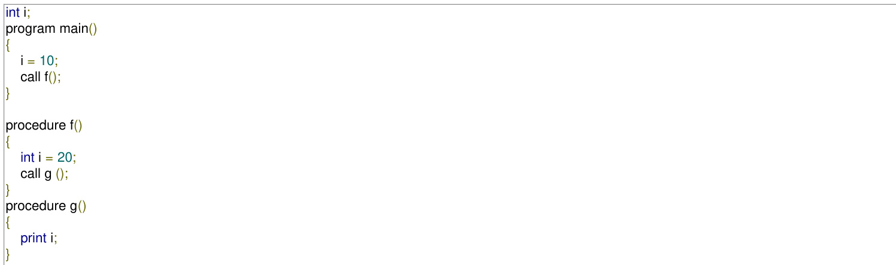

Let $x$ be the value printed under static scoping and $y$ be the value printed under dynamic scoping. Then, $x$ and $y$ are:

A. $\scriptstyle x = 1 0 , y = 2 0$ [ $3 . \ x = 2 0 , y = 1 0$ $\texttt { C } . \ x = 1 0 , y = 1 0 \qquad \texttt { D } . \ x = 2 0 , y = 2 0$

# Answer Keys

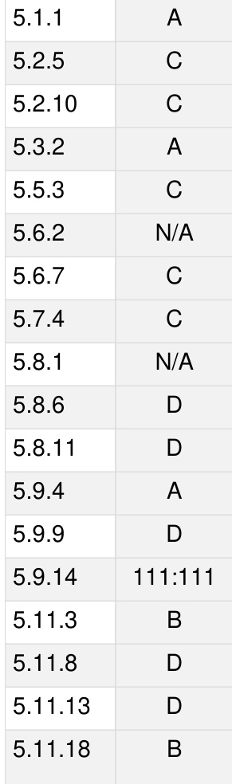

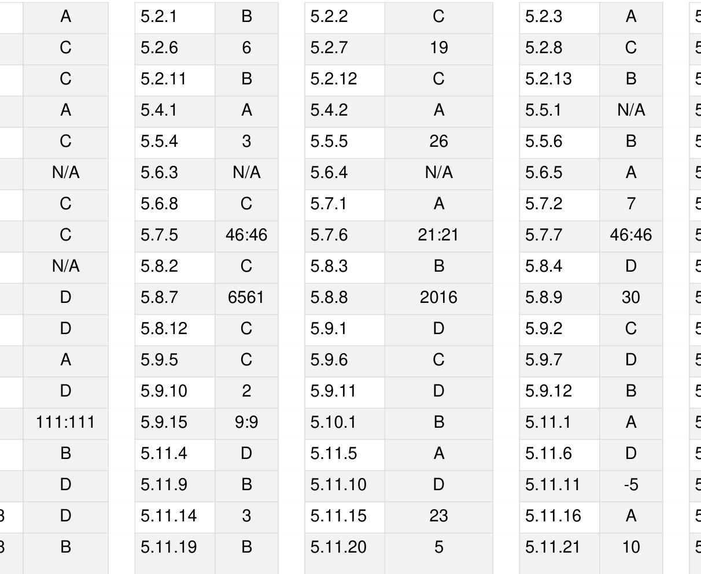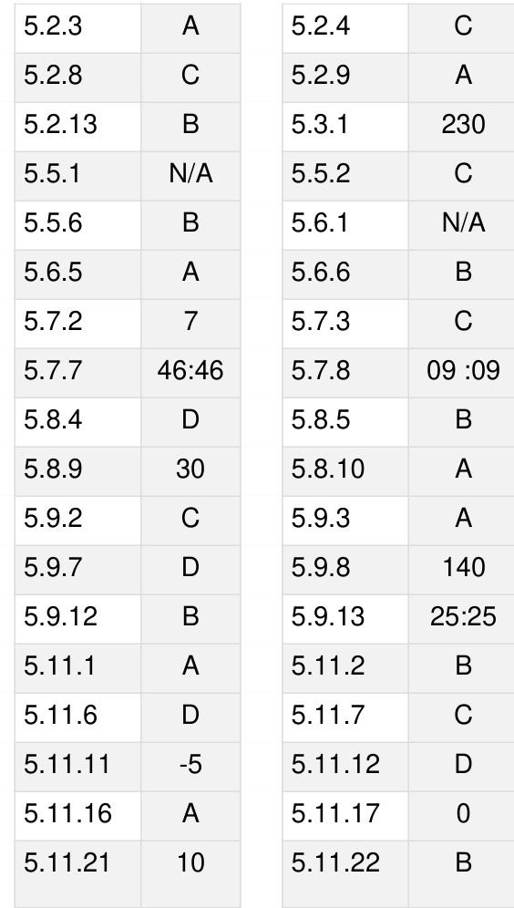

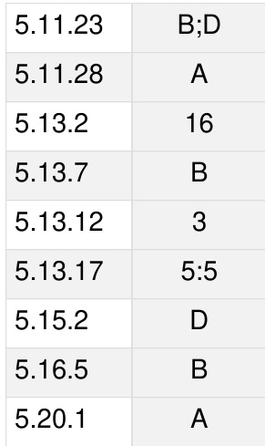

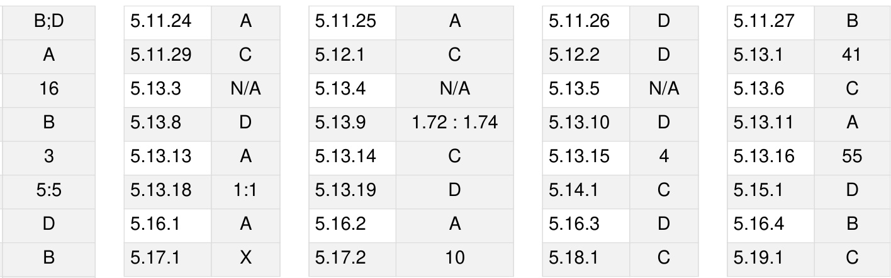

Regular expressions and finite automata, Context-free grammars and push-down automata, Regular and context-free languages, Pumping lemma, Turing machines and undecidability.

MarkDistributioninPrevious GATE   
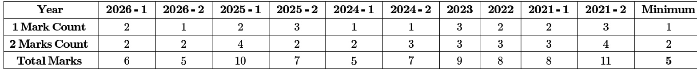

Welcome to the "Theory of Computation" chapter, a cornerstone of Computer Science that delves into the fundamental capabilities and limitations of computational models. This subject is crucial for the GATE CS exam as it builds a strong theoretical foundation for understanding algorithms, programming languages, and system design. It typically carries a weightage of 8-12 marks, with questions ranging from conceptual understanding of language classes and machine models to problem-solving involving the design of automata, grammar conversions, and decidability proofs. Expect a mix of Multiple Choice Questions (MCQs), Multiple Select Questions (MSQs), and Numerical Answer Type (NAT) questions, often requiring a deep grasp of definitions, properties, and theorems.

# Topic-wise Key Concepts

# Finite Automata (FA)

Finite Automata are the simplest computational models, used to recognize regular languages. They have a finite number of states and transitions based on input symbols, without any auxiliary memory. They are fundamental for lexical analysis in compilers and designing simple control systems.

Definition: A Deterministic Finite Automaton (DFA) is formally defined as a 5-tuple $M = ( Q , \Sigma , \delta , q _ { 0 } , F )$ , where:   
1. $Q$ is a finite set of states.   
2. $\Sigma$ is a finite set of input symbols (alphabet).   
3. $\delta : Q \times \Sigma  Q$ is the transition function.   
4. $q _ { 0 } \in Q$ is the initial state.   
5. $F \subseteq Q$ is the set of final (accepting) states.   
Key Properties: Every NFA has an equivalent DFA. DFA and NFA recognize the same class of languages (Regular Languages). DFA can be minimized to a unique (up to isomorphism) minimal state DFA.   
Common Pitfalls: Incorrectly handling epsilon transitions in NFA to DFA conversion; confusing acceptance criteria   
for NFA/DFA.   
Problem-Solving Techniques: Subset Construction: For converting NFA to DFA. Table Filling Algorithm Myhill-Nerode Theorem: For DFA minimization. State Elimination Method Arden's Theorem: For converting FA to Regular Expression.

# Finite State Machines (FSM)

Finite State Machines are mathematical models of computation used to design systems that can be in one of a finite number of states. While often used interchangeably with FA, FSMs typically include an output function, making them suitable for modeling sequential circuits and control logic.

# Definition:

Mealy Machine: $M = ( Q , \Sigma , \Delta , \delta , \lambda , q _ { 0 } )$ , where $\Delta$ is the output alphabet, and $\lambda \colon Q \times \Sigma \to \Delta$ is the output function. Output depends on current state and input. Moore Machine: $M = ( Q , \Sigma , \Delta , \delta , \lambda , q _ { 0 } )$ , where $\lambda : Q \to \Delta$ is the output function. Output depends only on the current state.   
Key Properties: Any Mealy machine can be converted to an equivalent Moore machine, and vice-versa. Moore machine output is delayed by one clock cycle compared to Mealy.   
Common Pitfalls: Incorrectly converting between Mealy and Moore machines, especially handling initial state   
outputs.   
Problem-Solving Techniques: State diagram construction, state table analysis, conversion algorithms between

Mealy and Moore.

# Regular Expression (RE)

Regular Expressions are a powerful notation for describing regular languages. They provide a concise way to specify patterns of strings, widely used in text processing, search engines, and lexical analysis.

Definition: A Regular Expression is built using basic symbols and three operations: Union: $R _ { 1 } + R _ { 2 }$ (or $R _ { 1 } | R _ { 2 } )$ represents strings in $L ( R _ { 1 } )$ or $L ( R _ { 2 } )$ . Concatenation: $R _ { 1 } R _ { 2 }$ represents strings formed by concatenating a string from $L ( R _ { 1 } )$ with one from $L ( R _ { 2 } )$ . Kleene Star: $R ^ { * }$ represents zero or more concatenations of strings from $L ( R )$ , including the empty string $\epsilon$ .

$$
\begin{array} { r l } & { \circ \ R + \varnothing = R } \\ & { \circ \ R \epsilon = \epsilon R = R } \\ & { \circ \ ( R ^ { * } ) ^ { * } = R ^ { * } } \\ & { \circ \ \varnothing ^ { * } = \epsilon } \\ & { \circ \ R ( S + T ) = R S + R T } \\ & { \circ \ ( R S ) ^ { * } R = R ( S R ) ^ { * } } \\ & { \circ \ ( R + S ) ^ { * } = ( R ^ { * } S ^ { * } ) ^ { * } = ( R ^ { * } + S ^ { * } ) ^ { * } } \end{array}
$$

Common Pitfalls: Operator precedence (Kleene star $>$ concatenation $>$ union); incorrect application of identities.   
Problem-Solving Techniques: Arden's Theorem: For solving equations of the form $R = Q + R P$ to get $R = Q P ^ { * }$ . State Elimination Method: For converting FA to RE.

# Regular Grammar (RG)

Regular Grammars are a type of formal grammar that generates exactly the class of regular languages. They are restricted in their production rules, making them less powerful than Context-Free Grammars but simpler to parse.

Definition: A grammar $G = ( V , \Sigma , P , S )$ is regular if all its production rules are of one of the following forms: Right-linear: $A  a B$ or $A \to a$ or $A \to \epsilon$ , where $A , B \in V$ (non-terminals), $a \in \Sigma$ (terminal). Left-linear: $A  B a$ or $A \to a$ or $A \to \epsilon$ , where $A , B \in V$ , $a \in \Sigma$ .   
Key Properties: A grammar cannot be both right-linear and left-linear simultaneously (unless it generates a finite language). Regular Grammars, Regular Expressions, and Finite Automata are all equivalent in terms of language recognition power.   
Common Pitfalls: Mixing right-linear and left-linear rules in the same grammar; incorrectly converting between FA   
and RG.   
Problem-Solving Techniques: Constructing an FA from a RG, and vice-versa, by mapping non-terminals to states   
and productions to transitions.

# Regular Language (RL)

Regular Languages are the simplest class of languages in the Chomsky Hierarchy, recognized by Finite Automata, described by Regular Expressions, or generated by Regular Grammars. They represent patterns that can be matched without requiring memory beyond the current state.

Definition: A language is regular if and only if it can be recognized by a Finite Automaton.   
Key Properties (Closure Properties): Regular languages are closed under: 。 Union $( L _ { 1 } \cup L _ { 2 } )$ Intersection $( L _ { 1 } \cap L _ { 2 } )$ 。 Complement $( \Sigma ^ { * } \setminus L )$ 。 Concatenation $( L _ { 1 } L _ { 2 } )$ 。 Kleene Star $( L ^ { * } )$ 。 Reversal $( L ^ { R } )$ 。 Homomorphism, Inverse Homomorphism   
Common Pitfalls: Misidentifying non-regular languages as regular; incorrectly applying closure properties.   
Problem-Solving Techniques: Pumping Lemma for Regular Languages: The primary tool to prove a language is NOT regular. Myhill-Nerode Theorem: Can be used to prove regularity or non-regularity, and for DFA minimization.

# Non Determinism

Non-determinism in automata allows for multiple possible transitions from a given state on a given input symbol, or transitions on an empty string (epsilon transitions). It often simplifies the design of automata, though it doesn't increase their computational power for regular languages.

Definition: A Non-deterministic Finite Automaton (NFA) is a 5-tuple $M = ( Q , \Sigma , \delta , q _ { 0 } , F )$ , where $\delta : Q \times ( \Sigma \cup \{ \epsilon \} )  \mathcal { P } ( Q )$ is the transition function, mapping to a set of states.

Key roperties: 9 Every NFA has an equivalent DFA (recognizes the same language). An NFA can be exponentially more concise than its equivalent DFA (e.g., an NFA with $n$ states might require up to $2 ^ { n }$ states in the equivalent DFA). Non-determinism is crucial for Pushdown Automata (NPDA is more powerful than DPDA).

Common Pitfalls: Incorrectly handling epsilon closures; missing possible paths in non-deterministic transitions.   
Problem-Solving Techniques: Subset Construction Algorithm: The standard method to convert an NFA (with or without epsilon transitions) to an equivalent DFA. 。 Understanding how to trace paths in an NFA to determine language acceptance.

# Number of States

The "number of states" refers to the cardinality of the set of states $Q$ in an automaton. This concept is critical for understanding the complexity and minimality of machine models, particularly for finite automata.

# Key Properties:

For an NFA with $\scriptstyle n$ states, the equivalent DFA can have up to $2 ^ { n }$ states. 。 A minimal DFA for a given regular language is unique (up to isomorphism) and has the fewest possible states. 。 The number of states in a minimal DFA is equal to the number of equivalence classes of the Myhill-Nerode relation.   
Common Pitfalls: Failing to identify redundant or unreachable states, which leads to non-minimal DFAs.   
Problem-Solving Techniques: 。 DFA Minimization Algorithms: Partitioning states into distinguishable/indistinguishable sets. 。 Myhill-Nerode Theorem: Using equivalence classes of strings to determine the minimum number of states.

# Minimal State Automata

A Minimal State Automaton (specifically, a Minimal DFA) is a Deterministic Finite Automaton that recognizes a given regular language using the smallest possible number of states. It is unique for any given regular language and is crucial for efficient implementation.

Definition: A DFA $M ^ { \prime }$ is minimal if there is no other DFA $M ^ { \prime \prime }$ such that $L ( M ^ { \prime \prime } ) = L ( M ^ { \prime } )$ and $\vert Q ^ { \prime \prime } \vert < \vert Q ^ { \prime } \vert$ .   
Key Properties: 。 Every regular language has a unique minimal DFA (up to isomorphism).   
。 All states in a minimal DFA must be reachable from the start state and must be distinguishable from each other.   
Common Pitfalls: Incorrectly merging distinguishable states; not removing unreachable states before minimization.

Problem-Solving Techniques: Table Filling Algorithm (or Partitioning Algorithm):

1. Initialize a table of all pairs of states $( p , q )$ . Mark all pairs $( p , q )$ where $p \in F$ and $q \not \in F$ (or vice versa) as distinguishable.   
2. Iteratively mark $( p , q )$ as distinguishable if for some input symbol $a$ , $( \delta ( p , a ) , \delta ( q , a ) )$ is already marked distinguishable.   
3. Repeat until no new pairs can be marked. All unmarked pairs are indistinguishable and can be merged.

Myhill-Nerode Theorem: States that a language $L$ is regular if and only if the number of equivalence classes of the Myhill-Nerode relation $\equiv _ { L }$ is finite. The number of states in the minimal DFA is equal to the number of these equivalence classes.

# Pumping Lemma (for Regular Languages)

The Pumping Lemma for Regular Languages is a fundamental theorem used to prove that a language is NOT regular. It states that all sufficiently long strings in a regular language can be "pumped" (i.e., a middle section of the string can be repeated any number of times) and the resulting string will still be in the language.

Theorem: If $L$ is a regular language, then there exists some integer $p \geq 1$ (the pumping length) such that for any string $\pmb { s } \in L$ with $| s | \geq p$ , $\pmb { s }$ can be divided into three parts $s = x y z$ satisfying the conditions:

1. $\vert y \vert > 0$ (the middle part cannot be empty).   
2. $| x y | \le p$ (the pumpable part must occur within the first $p$ symbols).   
3. For all $i \geq 0$ , the string $x y ^ { i } z \in L$ .

Key Properties: 0 It is a necessary condition for regularity, not a sufficient one. It can only be used to prove non-regularity. The proof strategy is usually by contradiction (an "adversary game").

Common Pitfalls:

Trying to prove regularity using the Pumping Lemma (it's impossible). Incorrectly choosing the string S or the partition $x y z$ to break the lemma Forgetting the condition $\vert y \vert > 0$ or $| x y | \leq p$ .

# Problem-Solving Techniques:

1. Assume $L$ is regular and let $p$ be the pumping length.   
2. Choose a "hard" string $\pmb { s } \in L$ such that $| s | \geq p$ , typically one that grows with $p \left( \mathsf { e . g . , } a ^ { p } b ^ { p } \right)$ ).   
3. Consider all possible ways to divide $\pmb { s }$ into  satisfying $\left. y \right. > 0$ and $| x y | \leq p$ .   
4. For each division, find an $i \geq 0$ such that $x y ^ { i } z \notin L$ . This contradicts the lemma, proving $L$ is not regular.

# Closure Property

Closure properties describe whether a class of languages remains within that class after applying certain operations. Understanding these properties is vital for classifying languages and proving relationships between language classes

Definition: A class of languages $\mathcal { C }$ is closed under an operation $\mathcal { O }$ if, for any language $L _ { 1 } , L _ { 2 } \in { \mathcal { C } }$ , the result of $\mathcal { O } ( L _ { 1 } , L _ { 2 } )$ (or $\mathcal { O } ( L _ { 1 } ) )$ is also in $\mathcal { C }$ .

Key Properties (to memorize):

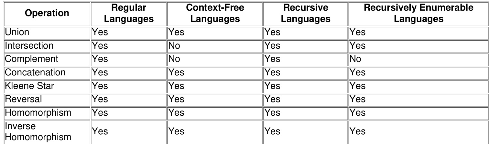

Common Pitfalls: Confusing closure properties between different language classes, especially for intersection and complement.   
Problem-Solving Techniques: Use closure properties to deduce the class of a new language based on known languages and operations. For non-closure, use counterexamples.

# Context Free Grammar (CFG)

Context-Free Grammars are more powerful than regular grammars and are used to describe Context-Free Languages. They are fundamental to defining the syntax of programming languages and parsing. Productions allow a non-terminal to be replaced by a string of terminals and non-terminals, regardless of its context.

Definition: A CFG is a 4-tuple $G = ( V , \Sigma , P , S )$ , where:   
1. $V$ is a finite set of non-terminal symbols.   
2. $\Sigma$ is a finite set of terminal symbols.   
3. $P$ is a finite set of production rules of the form $A \to \alpha$ , where $A \in V$ and $\alpha \in ( V \cup \Sigma ) ^ { * }$ .   
4. $S \in V$ is the start symbol.   
Key Forms: Chomsky Normal Form (CNF): All productions are of the form $A \to B C$ or $A  a ,$ where $A , B , C \in V$ and $a \in \Sigma$ . $\epsilon$ -productions are allowed only for the start symbol if it doesn't appear on the RHS. Greibach Normal Form (GNF): All productions are of the form $A \to a \alpha$ , where $A \in V$ , $a \in \Sigma$ and $\alpha \in V ^ { * }$ .   
Common Pitfalls: Detecting ambiguity (a string having more than one leftmost/rightmost derivation or parse tree);   
incorrect conversion to CNF/GNF.

Problem-Solving Techniques:

Simplification of CFG: Removing useless symbols, -productions, and unit productions. Conversion to CNF/GNF: Systematic procedures involving variable substitution and rule modification. 0 Derivation trees, leftmost/rightmost derivations.

# Context Free Language (CFL)

Context-Free Languages are recognized by Pushdown Automata and generated by Context-Free Grammars. They can describe languages with nested structures, such as balanced parentheses or properly nested HTML tags, which regular languages cannot handle.

Definition: A language is Context-Free if and only if it can be generated by a Context-Free Grammar.   
Key Properties: Closure Properties: Closed under union, concatenation, Kleene star, reversal, homomorphism, inverse homomorphism. Non-Closure Properties: NOT closed under intersection, complement. Deterministic CFLs (DCFLs) are a proper subset of CFLs and are closed under complement.   
Common Pitfalls: Misidentifying non-CFLs as CFLs; incorrectly applying closure properties.   
Problem-Solving Techniques: Pumping Lemma for CFLs: The primary tool to prove a language is NOT context-free. Designing CFGs or PDAs for given languages.

# Pushdown Automata (PDA)

Pushdown Automata are an extension of Finite Automata with an additional stack memory. This stack allows PDAs to recognize Context-Free Languages, which require memory to handle nested structures, unlike regular languages.

Definition: A Pushdown Automaton is formally defined as a 7-tuple $M = ( Q , \Sigma , \Gamma , \delta , q _ { 0 } , Z _ { 0 } , F )$ , where:   
1. $Q$ is a finite set of states.   
2. $\Sigma$ i the input alphabet.   
3. $\Gamma$ is the stack alphabet.   
4. $\delta : Q \times ( \Sigma \cup \{ \epsilon \} ) \times \Gamma  { \mathcal { P } } ( Q \times \Gamma ^ { * } )$ is the transition function.   
5. $q _ { 0 } \in Q$ is the initial state.   
6. $Z _ { 0 } \in \Gamma$ is the initial stack symbol.   
7. $F \subseteq Q$ is the set of final states.   
Key Properties: Non-deterministic PDAs (NPDAs) are more powerful than Deterministic PDAs (DPDAs). NPDAs recognize all CFLs, while DPDAs recognize only DCFLs (a proper subset of CFLs). 。 PDAs can accept languages either by final state or by empty stack. These two modes are equivalent for NPDAs.   
Common Pitfalls: Incorrectly handling stack operations (push/pop); confusing acceptance criteria; designing a   
DPDA when an NPDA is required.   
Problem-Solving Techniques: 。 Designing PDAs for given CFLs, focusing on how the stack is used to remember context. Converting CFG to PDA and vice-versa.

# Dpda (Deterministic Pushdown Automata)

A Deterministic Pushdown Automaton (DPDA) is a PDA where for any given state, input symbol (or epsilon), and stack top, there is at most one possible transition. DPDAs recognize Deterministic Context-Free Languages (DCFLs), which are a proper subset of CFLs.

Definition: A PDA is deterministic if its transition function $\delta$ satisfies:   
1. For any $( q , a , X ) \in Q \times ( \Sigma \cup \{ \epsilon \} ) \times \Gamma$ , $| \delta ( q , a , X ) | \leq 1$ .   
2. If $\delta ( q , \epsilon , X ) \neq \emptyset$ , then $\delta ( q , a , X ) = \emptyset$ for all $a \in \Sigma$ . (No conflict between epsilon and input transitions).   
Key Properties: DPDAs recognize DCFLs. All regular languages are DCFLs. 。 DCFLs are closed under complement (unlike general CFLs). 。 Not all CFLs are DCFLs (e.g., $\{ w w ^ { R } \mid w \in \{ a , b \} ^ { * } \}$ is a CFL but not a DCFL).   
Common Pitfalls: Failing to ensure determinism in all transition cases; confusing DCFLs with general CFLs.   
Problem-Solving Techniques: Designing DPDAs requires careful consideration to avoid non-deterministic choices.   
Often involves lookahead or specific stack symbol usage.

# Pumping Lemma (for CFLs)

The Pumping Lemma for Context-Free Languages is a more generalized version of the Pumping Lemma for Regular Languages. It's used to prove that certain languages are NOT context-free, by showing that sufficiently long strings in a CFL can be "pumped" in a specific way.

Theorem: If $L$ is a Context-Free Language, then there exists some integer $p \geq 1$ (the pumping length) such that for any string $\pmb { \mathscr { s } } \in L$ with $| s | \geq p$ , $\pmb { s }$ can be divided into five parts $s =$ satisfying the conditions:   
1. $| v x | > 0$ (at least one of $v$ or $x$ must be non-empty).   
2. $| v w x | \le p$ (the pumpable parts must occur relatively close to each other).   
3. For all $i \geq 0$ , the string $u v ^ { i } w x ^ { i } y \in L$ .

# Key Properties:

。 It is a necessary condition for context-freeness, not a sufficient one. It can only be used to prove non-contextfreeness. 。 The proof strategy is by contradiction (an "adversary game"), similar to the regular pumping lemma.

Common Pitfalls: Trying to prove context-freeness using the Pumping Lemma. Incorrectly choosing the string or the partition . Forgetting the conditions $| v x | > 0$ or $| v w x | \le p$ .

# Problem-Solving Techniques:

1. Assume $L$ is CFL and let $p$ be the pumping length.   
2. Choose a "hard" string $\pmb { s } \in L$ such that $| s | \geq p$ , typically one that involves three dependent counts (e.g.,   
$a ^ { p } b ^ { p } c ^ { p } )$ .   
3. Consider all possible ways to divide $s$ into  satisfying $| v x | > 0$ and $| v w x | \leq p$ .   
4. For each division, find an $i \geq 0$ such that $u v ^ { i } w x ^ { i } y \not \in L$ . This contradicts the lemma, proving $L$ is not CFL.

# Turing Machine (TM)

The Turing Machine is the most powerful and widely accepted model of computation, capable of simulating any algorithm. It consists of a finite control unit, a read/write head, and an infinite tape. It forms the basis of the ChurchTuring Thesis, which states that any effectively computable function can be computed by a Turing Machine.

Definition: A Turing Machine is formally defined as a 7-tuple $M = ( Q , \Sigma , \Gamma , \delta , q _ { 0 } , B , F )$ , where:   
1. $Q$ is a finite set of states.   
2. $\Sigma$ is the input alphabet (not containing $B )$ .   
3. $\Gamma$ is the tape alphabet $( \Sigma \subseteq \Gamma$ , and $B \in \Gamma$ ).   
4. $\delta : Q \times \Gamma \to Q \times \Gamma \times \{ L , R \}$ is the transition function (L for left, R for right).   
5. $q _ { 0 } \in Q$ is the initial state.   
6. $B \in \Gamma$ is the blank symbol.   
7. $F \subseteq Q$ is the set of final (halting) states.

# Key Properties:

Turing Machines can recognize Recursively Enumerable Languages.   
Variations of TMs (multi-tape, multi-head, non-deterministic) have equivalent computational power to the basic TM.   
。 The Halting Problem for Turing Machines is undecidable.   
Common Pitfalls: Designing complex TMs; understanding the implications of the halting problem; confusing   
decidability with recognizability.   
Problem-Solving Techniques: Designing TMs for various languages (e.g., $\{ a ^ { n } b ^ { n } c ^ { n } \}$ , palindrome recognition). Understanding the Church-Turing Thesis and its implications for computability.

# Recursive and Recursively Enumerable Languages

These two classes of languages represent the limits of what Turing Machines can compute. They are central to the study of computability and decidability.

Definition: Recursively Enumerable Language (RE Recognizable): A language $L$ is RE if there exists a Turing Machine $M$ that halts and accepts every string $w \in L$ , but may either halt and reject or loop indefinitely for strings $w \not \in L$ .

Recursive Language (Decidable): A language $L$ is Recursive if there exists a Turing Machine $M$ that halts on all inputs. For $w \in L$ , $M$ accepts; for $w \not \in L$ , $M$ rejects.

Key Properties:

Every Recursive Language is also Recursively Enumerable. A language $L$ is Recursive if and only if both $L$ and its complement $\bar { L }$ are Recursively Enumerable. RE languages are closed under union, intersection, concatenation, Kleene star, homomorphism, inverse homomorphism. They are NOT closed under complement. Recursive languages are closed under union, intersection, complement, concatenation, Kleene star, homomorphism, inverse homomorphism. Common Pitfalls: Confusing the definitions of "halts on all inputs" (decidable) vs. "halts and accepts" (recognizable); misinterpreting closure properties. Problem-Solving Techniques: Using closure properties to classify languages; applying reduction to prove undecidability/non-recognizability.

# Decidability

Decidability refers to whether an algorithm (a Turing Machine that always halts) exists to solve a given problem. A problem is decidable if there's an algorithm that can always give a "yes" or "no" answer in finite time for any instance of the problem.

Definition: A problem is decidable if the language representing all "yes" instances of the problem is a Recursive Language.

Key Properties (Examples of Decidable/Undecidable Problems): 。 Decidable:

Membership problem for Regular Languages (Is $w \in L ( F A ) \ ? )$ .   
Emptiness problem for Regular Languages (Is $L ( F A ) = \emptyset ? )$ ).   
Equivalence problem for Regular Languages (Is $\dot { L } ( F \dot { A } _ { 1 } ) = { L } ( F A _ { 2 } ) ? ,$ ).   
Membership problem for CFLs (Is $w \in L ( C F G ) \ ? )$ .   
Emptiness problem for CFLs (Is $L ( C F G ) = \varnothing ?$ ).

# Undecidable:

Halting Problem for TMs (Does TM $M$ halt on input $w ?$ ).   
Equivalence problem for CFLs (Is $L ( C F G _ { 1 } ) = L ( C F G _ { 2 } ) ? )$ .   
Ambiguity problem for CFGs (Is CFG $G$ ambiguous?).   
Membership problem for RE languages (Is $w \in L ( T M ) \colon$ - this is RE, but not Recursive).   
Emptiness problem for TMs (Is $L ( T M ) = \emptyset ?$ ).   
Post Correspondence Problem (PCP).

Common Pitfalls: Assuming all problems are decidable; misremembering the decidability status of common problems.

# Problem-Solving Techniques:

Reduction: The primary method to prove a problem is undecidable.   
Understanding Rice's Theorem (all non-trivial properties of RE languages are undecidable).

# Reduction

Reduction is a powerful technique used to prove the undecidability of problems. If problem A can be "reduced" to problem B, it means that an algorithm for solving B could be used to solve A. Therefore, if A is known to be undecidable, B must also be undecidable.

Definition: A problem $A$ is reducible to problem $B$ (denoted $A \leq _ { m } B$ for many-one reduction) if there exists computable function $f$ that transforms every instance $x$ of problem $A$ into an instance $f ( x )$ of problem $B$ such that $x$ is a "yes" instance of $A$ if and only if $f ( x )$ is a "yes" instance of $B$ .

Key Properties: If $A \leq _ { m } B$ and $A$ is undecidable, then $B$ is undecidable. If $A \leq _ { m } B$ and $B$ is decidable, then $A$ is decidable.   
If $A \leq _ { m } B$ and $A$ is non-RE, then $B$ is non-RE. If $A \leq _ { m } B$ and $B$ is RE, then $A$ is RE.

Common Pitfalls: Reducing in the wrong direction (e.g., trying to reduce an undecidable problem to a decidable one); constructing an incorrect transformation function $f$ .

Problem-Solving Techniques: 。 Identify a known undecidable problem (e.g., Halting Problem, Emptiness Problem for TMs) to reduce FROM.

。 Construct a transformation function $f$ that takes an instance of the known undecidable problem and converts it into an instance of the target problem.   
。 Prove that this transformation preserves the "yes/no" answer.

# Countable Uncountable Set

These concepts from set theory are crucial for understanding the limits of computation, particularly why there exist languages that are not recursively enumerable. It relates to the cardinality of sets.

# Definition:

Countable Set: A set is countable if it is finite or if its elements can be put into a one-to-one correspondence with the set of natural numbers $\mathbb { N }$ (i.e., it can be enumerated). Examples: integers $\mathbb { Z }$ , rational numbers $\mathbb { Q }$ , set of all finite strings $\Sigma ^ { * }$ .   
Uncountable Set: A set is uncountable if it is infinite but cannot be put into a one-to-one correspondence with . Examples: real numbers $\mathbb { R } .$ . power set of $\mathbb { N } .$ set of all languages over $\Sigma$ .

# Key Properties:

The set of all Turing Machines is countable.   
The set of all possible languages over any alphabet $\Sigma$ is uncountable.   
Since there are more languages than Turing Machines, there must exist languages that cannot be recognized by any Turing Machine (i.e., non-RE languages).

Common Pitfalls: Confusing finite sets with infinite countable sets; misapplying diagonalization.

Problem-Solving Techniques:

。 Diagonalization Argument: A standard technique to prove a set is uncountable (e.g., Cantor's diagonalization for real numbers).   
。 Understanding the implications for computability theory.

# Identify Class Language

This topic refers to the ability to correctly classify a given language within the Chomsky Hierarchy, which organizes formal languages by their generative power and the type of automaton that recognizes them.

Chomsky Hierarchy (from least to most powerful):

1. Type 3: Regular Languages (RL): Recognized by Finite Automata (FA). Generated by Regular Grammars (RG).   
2. Type 2: Context-Free Languages (CFL): Recognized by Pushdown Automata (PDA). Generated by ContextFree Grammars (CFG). (Deterministic CFLs (DCFLs) are a proper subset of CFLs, recognized by DPDAs).   
3. Type 1: Context-Sensitive Languages (CSL): Recognized by Linear Bounded Automata (LBA). Generated by Context-Sensitive Grammars (CSG). (Less common in GATE).   
4. Type 0: Recursively Enumerable Languages (RE): Recognized by Turing Machines (TM). Generated by Unrestricted Grammars. (Recursive Languages are a proper subset of RE languages, recognized by TMs that always halt).

Relationships: ${ \mathrm { R L } } \subset { \mathrm { D C F L } } \subset { \mathrm { C F L } } \subset { \mathrm { C S L } } \subset { \mathrm { R e c u r s i v e } } \subset { \mathrm { R E } } .$

Common Pitfalls: Incorrectly applying pumping lemmas; misjudging the memory requirements of a language;   
confusing closure properties.

Problem-Solving Techniques:

Pumping Lemma: First attempt to prove non-regularity or non-context-freeness.   
Closure Properties: Use them to combine or transform languages and deduce their class.   
Machine Models: Try to design the simplest machine (FA, PDA, TM) that can recognize the language.   
Grammar Rules: Analyze the structure of production rules if a grammar is given.

# Medium (Computational Models)

In the context of Theory of Computation, "Medium" refers to the abstract computational models or machines used to define and study computation. These models, such as Finite Automata, Pushdown Automata, and Turing Machines, represent different levels of computational power and memory capabilities.

Definition: Computational models are abstract machines that define the capabilities and limitations of algorithms.   
Each model specifies a set of operations and memory structures it can use. 。 Finite Automata (FA): No auxiliary memory. Recognizes Regular Languages. Simplest model.   
D Pushdown Automata (PDA): Finite control $^ +$ a stack (LIFO memory). Recognizes Context-Free Languages.   
More powerful than FA.

Turing Machine (TM): Finite control $^ +$ an infinite tape (random access memory). Recognizes Recursively Enumerable Languages. Most powerful model, equivalent to any real-world computer.

# Key Properties:

The hierarchy of computational power $\mathsf { ^ { \prime } F A } < \mathsf { P D A } < \mathsf { T M } .$ ) directly corresponds to the Chomsky Hierarchy of languages. Each model defines the class of languages it can recognize (its "computational power").

Common Pitfalls: Confusing the memory capabilities of different models; overestimating or underestimating the power of a specific model.

Problem-Solving Techniques:

Analyze the memory requirements of a language to determine the minimum computational model needed to recognize it.   
Understand how each model's memory structure (or lack thereof) limits its ability to recognize certain patterns (e.g., FA cannot count arbitrary numbers of symbols).

# Quick Formula Reference

DFA: $M = ( Q , \Sigma , \delta , q _ { 0 } , F )$   
NFA: $M = ( Q , \Sigma , \delta , q _ { 0 } , F )$ , where $\delta : Q \times ( \Sigma \cup \{ \epsilon \} )  \mathcal { P } ( Q )$   
Regular Expression Operations: Union $\left( R _ { 1 } + R _ { 2 } \right)$ Concatenation $( R _ { 1 } R _ { 2 } )$ , Kleene Star $( R ^ { * } )$   
Arden's Theorem: $\dot { R = Q } + R P$ , then $\mathbf { \dot { R } } = Q \mathbf { \dot { P } } ^ { * }$ .   
Regular Grammar (Right-linear): $A  a B$ or $A \to a$ or $A \to \epsilon$   
Pumping Lemma for Regular Languages: For $s = x y z \in L$ with $| s | \geq p ; | y | > 0 , | x y | \leq p , \forall i \geq 0 , x y ^ { i } z \in L .$ Context-Free Grammar (CFG): $G = ( V , \Sigma , P , S )$ , with productions $A \to \alpha$ .   
Chomsky Normal Form (CNF): $A  B C$ or $A \to a$ .   
Greibach Normal Form (GNF): $A \to a \alpha$ .   
Pushdown Automata (PDA): $M = ( Q , \Sigma , \Gamma , \delta , q _ { 0 } , Z _ { 0 } , F )$ , with transitions $\delta ( q , a , X ) = \{ ( q ^ { \prime } , Y _ { 1 } Y _ { 2 } \ldots Y _ { k } ) \}$ . Pumping Lemma for Context-Free Languages: For $\begin{array} { r } { s = u v w x y \in L } \end{array}$ with $| s | \geq p \colon | v x | > 0$ , $| v w x | \leq p ,$ $\forall i \geq 0$ ， $u v ^ { i } w x ^ { i } y \in L$ .   
Turing Machine (TM): $M = ( Q , \Sigma , \Gamma , \delta , q _ { 0 } , B , F )$ , with transitions $\delta ( q , X ) = ( q ^ { \prime } , Y , D )$ .   
Chomsky Hierarchy: C CFL'C CSL $\subset$ Recursive $\subset \mathbf { R E }$ .

Closure Properties (Summary):

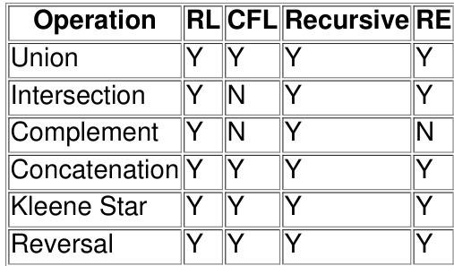

# Important Tips for GATE

1. Master the Chomsky Hierarchy: Understand the relationships between language classes (Regular, CFL, Recursive, RE) and their corresponding machine models (FA, PDA, TM). This is fundamental for classifying languages and solving many conceptual questions.

2. Memorize Closure Properties: Create a table and commit to memory which language classes are closed under which operations (union, intersection, complement, concatenation, Kleene star, reversal). This is a frequent sourc of direct questions.

3. Practice Pumping Lemma Proofs: The Pumping Lemma for both Regular and Context-Free Languages is a crucial tool. Practice choosing the "hard" string and demonstrating the contradiction for various non-regular/nonCFLs. Remember, it only proves non-membership.

4. Understand NFA to DFA Conversion and Minimization: Be proficient in subset construction for NFA to DFA conversion and the table-filling algorithm for DFA minimization. These are common problem-solving tasks.

5. Distinguish Decidability vs. Recognizability: Clearly understand the difference between Recursive (decidable) and Recursively Enumerable (recognizable) languages, especially regarding the halting behavior of Turing Machines. Know the decidability status of common problems (Halting Problem, Emptiness for TMs, Equivalence for CFLs, etc.).

6. Focus on Design Principles: While complex designs are rare, understand the core principles of designing simple FAs, PDAs, and TMs for basic languages. Pay attention to how memory (or lack thereof) is utilized.

7. Pay Attention to Formal Definitions: GATE questions often test your understanding of the precise formal

definitions of automata, grammars, and languages. Small details like epsilon transitions, initial stack symbols, or blank tape symbols can be critical. 8. Time Management for Tricky Questions: Some ToC problems, especially those involving complex reductions or intricate Pumping Lemma applications, can be time-consuming. Practice identifying these quickly and decide whether to attempt them or mark for review.

# 6.1 Closure Property (10)

✍ Practice Test: Test 1 (12Q)

# 6.1.1 Closure Property: GATE CSE 1989 Question: 3-ii

Context-free languages and regular languages are both closed under the operation (s) of :

A. Union B. Intersection C. Concatenation D. Complementation

gate1989 easy theory-of-computation closure-property multiple-selects

Which of the following three statements are true? Prove your answer.

i. The union of two recursive languages is recursive.   
ii. The language $\{ O ^ { n } \mid n$ is a prime} is not regular.   
iii. Regular languages are closed under infinite union.

gate1992 theory-of-computation normal closure-property proof descriptive

Which of the following is true?

A. The complement of a recursive language is recursive   
B. The complement of a recursively enumerable language is recursively enumerable   
C. The complement of a recursive language is either recursive or recursively enumerable   
D. The complement of a context-free language is context-free

gatecse-2002 theory-of-computation easy closure-property

Which of the following statements is/are FALSE?

1. For every non-deterministic Turing machine, there exists an equivalent deterministic Turing machine.   
2. Turing recognizable languages are closed under union and complementation.   
3. Turing decidable languages are closed under intersection and complementation.   
4. Turing recognizable languages are closed under union and intersection.

A. 1 and  only B. and only C. only D. only

gatecse-2013 theory-of-computation normal closure-property

# 6.1.5 Closure Property: GATE CSE 2016 Set 2 Question: 18

Consider the following types of languages: $L _ { 1 }$ : Regular, $L _ { 2 }$ : Context-free, $L _ { 3 }$ : Recursive, $L _ { 4 }$ : Recursively enumerable. Which of the following is/are TRUE ?

I. ${ \overline { { L _ { 3 } } } } \cup L _ { 4 }$ is recursively enumerable.

II. $\overline { { L _ { 2 } } } \cup L _ { 3 }$ is recursive.   
III. $L _ { 1 } ^ { * } \cap L _ { 2 }$ is context-free.   
IV. $L _ { 1 } \cup \overline { { L _ { 2 } } }$ is context-free.

A. I only. B. and III only. C. and IV only. D. I, II and III only.

gatecse-2016-set2 theory-of-computation regular-language context-free-language closure-property norma

Let $\scriptstyle L _ { 1 } , L _ { 2 }$ be any two context-free languages and $R$ be any regular language. Then which of the following is/are CORRECT?

I. $L _ { 1 } \cup L _ { 2 }$ is context-free II. $\overline { { L _ { 1 } } }$ is context-free III. $L _ { 1 } - R$ is context-free IV. $L _ { 1 } \cap L _ { 2 }$ is context-free

A. I, II and IV only B. I and III only C. II and IV only D. I only

gatecse-2017-set2 theory-of-computation closure-property

# Answer key☟

The set of all recursively enumerable languages is:

A. closed under complementation B. closed under intersection C. a subset of the set of all recursive D. an uncountable set languages

gatecse-2018 theory-of-computation closure-property easy one-mark

Consider the two lists List and List II given below:

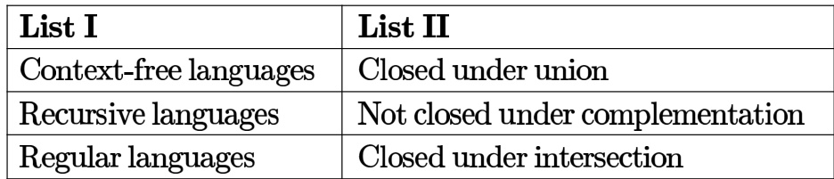

For matching of items in List with those in List II, which of the following option(s) is/are CORRECT?

A. (i) - (a), (ii) (b), and (iii) - (c) B. (i) - (b), (ii) - (a), and (iii) - (c) C. (i) - (b), (ii) (c), and (iii) (a) D. (i) - (a), (ii) - (c), and (iii) (b)

gatecse2025-set2 theory-of-computation closure-property match-the-following multiple-selects easy one-mark

Let $L$ be a context-free language and $M$ a regular language. Then the language $L \cap M$ is

A. always regular B. never regular C. always a deterministic context-free D. always a context-free language language

gateit-2006 theory-of-computation closure-property easy

Answer key☟

# 6.2.1 Context Free Grammar: GATE CSE 2025 Set 1 Question: 9

Consider the following context-free grammar $G$ , where $s , A$ , and $B$ are the variables (non-terminals), $a$ and $b$ are the terminal symbols, $\boldsymbol { S }$ is the start variable, and the rules of $G$ are described as:

$$
\begin{array} { l } { S  a a B \mid A b b } \\ { A  a \mid a A } \\ { B  b \mid b B } \end{array}
$$

Which ONE of the languages $L ( G )$ is accepted by $G$ ?

$$
\begin{array} { l } { L ( G ) = \left\{ a ^ { 2 } b ^ { n } \mid n \geq 1 \right\} \cup \left\{ a ^ { n } b ^ { 2 } \mid n \geq 1 \right\} } \\ { L ( G ) = \left\{ a ^ { n } b ^ { 2 n } \mid n \geq 1 \right\} \cup \left\{ a ^ { 2 n } b ^ { n } \mid n \geq 1 \right\} } \\ { L ( G ) = \left\{ a ^ { n } b ^ { n } \mid n \geq 1 \right\} } \\ { L ( G ) = \left\{ a ^ { 2 n } b ^ { 2 n } \mid n \geq 1 \right\} } \end{array}
$$

gatecse2025-set1 theory-of-computation context-free-grammar easy one-mark

Consider the following grammar where $\boldsymbol { S }$ is the start symbol, and $a$ and $b$ are terminal symbols.

$$
S \to a S b S | b S | \epsilon
$$

Which of the following statements is/are true?

A. The grammar is ambiguous B. The string has two distinct derivations in this grammar C. The string has only one rightmost derivation D. The language generated by the grammar is undecidable gatecse-2026-set1 theory-of-computation context-free-grammar multiple-selects one-mark

# Answer key☟

# The intersection of two CFL's is also a CFL.

gate1987 theory-of-computation context-free-language true-false

Context-free languages are:

A. closed under union B. closed under complementation C. closed under intersection D. closed under Kleene closure

gate1992 context-free-language theory-of-computation normal multiple-selects

# Answer key☟

Which of the following definitions below generate the same language as $L$ , where $L = \{ x ^ { n } y ^ { n }$ such that $n \geq 1 \}$ ?

I. $E \to x E y \mid x y$ II. xy $\mid ( x ^ { + } x y y ^ { + } )$ III. $x ^ { + } y ^ { + }$

A. only B. I and II C. II and III D. II only

gate1995 theory-of-computation easy context-free-language

# Answer key☟

If $L _ { 1 }$ and $L _ { 2 }$ are context free languages and $R$ a regular set, one of the languages below is not necessarily a context free language. Which one?

A. $\mathbf { { { L } } _ { 1 } . { { L } _ { 2 } } }$ B. $L _ { 1 } \cap L _ { 2 }$ C. LnR D. LUL2

gate1996 theory-of-computation context-free-language easy

# Answer key☟

# 6.3.5 Context Free Language: GATE CSE 1996 Question: 2.9

Define a context free languages $L \in \{ 0 , 1 \} ^ { * }$ , $\operatorname { i n i t } ( L ) = \{ u \mid u v \in L$ for some $v$ in $\{ 0 , 1 \} ^ { * } \}$ ( in other words, $\operatorname { i n i t } ( L )$ s i the set of prefixes of $L$ )

Let ${ \cal L } = \{ w \vert w$ is nonempty and has an equal number of O's and 1's} Then $( L )$ is:

A. the set of all binary strings with unequal number of ’s and ’s   
B. the set of all binary strings including null string   
C. the set of all binary strings with exactly one more  than the number of ’s or one more than the number of ’s   
D. None of the above

gate1996 theory-of-computation context-free-language normal

Show that the language

# $L = \{ x c x \mid x \in \{ 0 , 1 \} ^ { * }$ and $c$ is a terminal symbol}

is not context free. is not  or .

gate1999 theory-of-computation context-free-language normal proof

# Answer key☟

A. Construct as minimal finite state machine that accepts the language, over $\{ 0 , 1 \}$ , of all strings that contain neither the substring  nor the substring .   
B. Consider the grammar $\begin{array} { l } { \circ S  a S \bar { A } b } \\ { \circ S  \epsilon } \\ { \circ A  b A } \\ { \circ A  \epsilon } \end{array}$ where $\boldsymbol { S }$ , $A$ are non-terminal symbols with $\boldsymbol { S }$ being the start symbol; $^ { a , b }$ are terminal symbols and $\epsilon$ is the empty string. This grammar generates strings of the form $a ^ { i } b ^ { j }$ for some $i , j \geq 0$ , where $\mathbf { \chi } _ { i }$ and $j$ satisfy some condition. What is the condition on the values of $\mathbf { \chi } _ { i }$ and $j ?$

gatecse-2000 theory-of-computation descriptive regular-language context-free-language

Which of the following statements is true?

A. If a language is context free it can always be accepted by a deterministic push-down automaton   
B. The union of two context free languages is context free   
C. The intersection of two context free languages is a context free   
D. The complement of a context free language is a context free

gatecse-2001 theory-of-computation context-free-language easy

Let $G = ( \left\{ S \right\} , \left\{ a , b \right\} , R , S )$ be a context free grammar where the rule set $\mathsf { R }$ is $S \to a S b \mid S S \mid \epsilon$ Which of the following statements is true?

A. $G$ is not ambiguous   
B. There exist $x , y \in L ( G )$ such that $x y \not \in L ( G )$   
C. There is a deterministic pushdown automaton that accepts $L ( G )$   
D. We can find a deterministic finite state automaton that accepts $L ( G )$

gatecse-2003 theory-of-computation context-free-language normal

$L _ { 1 } = \{ w w ^ { R } \mid w \in \{ 0 , 1 \} ^ { * } \}$   
· $L _ { 2 } = \{ w \# w ^ { R } \ : | \ : w \in \{ 0 , 1 \} ^ { * } \}$ , where is a special symbol   
· ${ L _ { 3 } } = \{ w w \mid w \in \{ 0 , 1 \} ^ { * } \}$

Which one of the following is TRUE?

A. $L _ { 1 }$ is a deterministic CFL B. $L _ { 2 }$ is a deterministic CFL C. $\scriptstyle { L _ { 3 } }$ is a CFL, but not a deterministic CFL D. $\scriptstyle { L _ { 3 } }$ is a deterministic CFL gatecse-2005 theory-of-computation context-free-language easy

Let

$$
\begin{array} { l } { L _ { 1 } = \{ 0 ^ { n + m } 1 ^ { n } 0 ^ { m } \mid n , m \geq 0 \} , } \\ { L _ { 2 } = \{ 0 ^ { n + m } 1 ^ { n + m } 0 ^ { m } \mid n , m \geq 0 \} \mathrm { ~ a n d ~ } } \\ { L _ { 3 } = \{ 0 ^ { n + m } 1 ^ { n + m } 0 ^ { n + m } \mid n , m \geq 0 \} . } \end{array}
$$

Which of these languages are NOT context free?

A. $L _ { 1 }$ only B. $L _ { 3 }$ only C. $L _ { 1 }$ and $L _ { 2 }$ D. $L _ { 2 }$ and $L _ { 3 }$

gatecse-2006 theory-of-computation context-free-language normal

$$
S \to a S a \mid b S b \mid a \mid b
$$

The language generated by the above grammar over the alphabet $\{ a , b \}$ is the set of:

A. all palindromes B. all odd length palindromes C. strings that begin and end with the D. all even length palindromes same symbol

gatecse-2009 theory-of-computation context-free-language easy isro2016

# Answer key☟

Which of the following languages are context-free?

$$
\begin{array} { l } { L _ { 1 } : \{ a ^ { m } b ^ { n } a ^ { n } b ^ { m } \mid m , n \geq 1 \} } \\ { L _ { 2 } : \{ a ^ { m } b ^ { n } a ^ { m } b ^ { n } \mid m , n \geq 1 \} } \\ { L _ { 3 } : \{ a ^ { m } b ^ { n } \mid m = 2 n + 1 \} } \end{array}
$$

A. $L _ { 1 }$ and $L _ { 2 }$ only B. $L _ { 1 }$ and $L _ { 3 }$ only C. $L _ { 2 }$ and $L _ { 3 }$ only D. $L _ { 3 }$ only gatecse-2015-set3 theory-of-computation context-free-language normal

D. $\{ a , b \} ^ { * }$

Consider the following context-free grammars;

$G _ { 1 } : S  a S \mid B , B  b \mid b B$ $G _ { 2 } : S \to a A \mid b B , A \to a A \mid B \mid \varepsilon , B \to b B \mid \varepsilon$

Which one of the following pairs of languages is generated by $G _ { 1 }$ and $G _ { 2 }$ ,respectively?

A. $\{ a ^ { m } b ^ { n } \mid m > 0 \mathrm { o r } n > 0 \}$ and $\begin{array} { l c r } { \left\{ a ^ { m } b ^ { n } \mid m > 0 \mathrm { a n d } n > 0 \right\} } \\ { \operatorname { d } \left\{ a ^ { m } b ^ { n } \mid m > 0 \mathrm { o r } n \geq 0 \right\} } \\ { \left\{ a ^ { m } b ^ { n } \mid m > 0 \mathrm { a n d } n > 0 \right\} } \\ { \operatorname { d } \left\{ a ^ { m } b ^ { n } \mid m > 0 \mathrm { o r } n > 0 \right\} } \end{array}$   
B. $\{ a ^ { m } b ^ { n } \mid m > 0 { \mathrm { a n d } } n > 0 \}$ an   
C. $\{ a ^ { m } b ^ { n } \mid m \geq 0 \mathrm { o r } n > 0 \}$ and   
D. $\{ a ^ { m } b ^ { n } \mid m \geq 0 { \mathrm { ~ a n d } } n > 0 \}$ an

Consider the following languages:

$$
\begin{array} { l } { \cdot L _ { 1 } = \{ a ^ { n } b ^ { m } c ^ { n + m } : m , n \geq 1 \} } \\ { \cdot L _ { 2 } = \{ a ^ { n } b ^ { n } c ^ { 2 n } : n \geq 1 \} } \end{array}
$$

Which one of the following is TRUE?

A. Both $L _ { 1 }$ and $L _ { 2 }$ are context-free.   
B. $L _ { 1 }$ is context-free while $L _ { 2 }$ is not context-free.   
C. $L _ { 2 }$ is context-free while $L _ { 1 }$ is not context-free.   
D. Neither $L _ { 1 }$ nor $L _ { 2 }$ is context-free.

Consider the following context-free grammar over the alphabet $\Sigma = \{ a , b , c \}$ with $\boldsymbol { S }$ as the start symbol:

$$
\begin{array} { c } { { S  a b S c T \mid a b c T } } \\ { { { } } } \\ { { T  b T \mid b } } \end{array}
$$

Which one of the following represents the language generated by the above grammar?

$$
\begin{array} { l } { { \left\{ ( a b ) ^ { n } ( c b ) ^ { n } \mid n \geq 1 \right\} } } \\ { { \left\{ ( a b ) ^ { n } c b ^ { m _ { 1 } } c b ^ { m _ { 2 } } . . . c b ^ { m _ { n } } \mid n , m _ { 1 } , m _ { 2 } , . . . , m _ { n } \geq 1 \right\} } } \\ { { \left\{ ( a b ) ^ { n } ( c b ^ { m } ) ^ { n } \mid m , n \geq 1 \right\} } } \\ { { \left\{ ( a b ) ^ { n } ( c b ^ { n } ) ^ { m } \mid m , n \geq 1 \right\} } } \end{array}
$$

$S \to S a S \mid a S b \mid b S a \mid S S \mid \epsilon$ where $\boldsymbol { S }$ is the start variable, then which one of the following strings is not generated by $G ?$

A. abab B. aaab C. abbaa D. babba

gatecse-2017-set1 theory-of-computation context-free-language normal

# Answer key☟

Consider the following languages over the alphabet $\Sigma = \{ a , b , c \}$ . Let $L _ { 1 } = \{ a ^ { n } b ^ { n } c ^ { m } \mid m , n \geq 0 \}$ and $L _ { 2 } = \{ a ^ { m } b ^ { n } c ^ { n } \mid m , n \geq 0 \}$ .

Which of the following are context-free languages?

I. $. \ L _ { 1 } \cup L _ { 2 }$   
II. $L _ { 1 } \cap L _ { 2 }$

A. I only B. II only C. I and II D. Neither nor II

gatecse-2017-set1 theory-of-computation context-free-language normal

# Answer key☟

# 6.3.21 Context Free Language: GATE CSE 2017 Set 2 Question: 16

Identify the language generated by the following grammar, where $\boldsymbol { S }$ is the start variable.

$$
 { \begin{array} { l } { \bullet S  X Y } \\ { \bullet X  a X \mid a } \\ { \bullet Y  a Y b \mid \epsilon } \end{array} } 
$$

A. $\begin{array} { l } { \left\{ a ^ { m } b ^ { n } \mid m \geq n , n > 0 \right\} } \\ { \left\{ a ^ { m } b ^ { n } \mid m > n , n \geq 0 \right\} } \end{array}$ B. $\begin{array} { l } { \left\{ a ^ { m } b ^ { n } \mid m \geq n , n \geq 0 \right\} } \\ { \left\{ a ^ { m } b ^ { n } \mid m > n , n > 0 \right\} } \end{array}$   
C. D.

gatecse-2017-set2 theory-of-computation context-free-language

Answer key☟

Which one of the following languages over $\Sigma = \{ a , b \}$ is NOT context-free?

A. $\{ w w ^ { R } \mid w \in \{ a , b \} ^ { * } \}$   
B. $\{ w a ^ { n } b ^ { n } w ^ { R } \mid w \in \{ a , b \} ^ { * } , n \geq 0 \}$   
C. $\{ w a ^ { n } w ^ { R } b ^ { n } | w \in \{ a , b \} ^ { * } , n \geq 0 \}$   
D. $\{ a ^ { n } b ^ { i } \mid i \in \{ n , 3 n , 5 n \} , n \geq 0 \}$

gatecse-2019 theory-of-computation context-free-language two-marks

# 6.3.23 Context Free Language: GATE CSE 2021 Set 1 Question: L

Suppose that $L _ { 1 }$ is a regular language and $L _ { 2 }$ is a context-free language. Which one of the following languages is  necessarily context-free?

A. $L _ { 1 } \cap L _ { 2 }$ B $3 . \ L _ { 1 } \cdot L _ { 2 }$ C $. \ L _ { 1 } - L _ { 2 }$ D. LUL2

gatecse-2021-set1 context-free-language theory-of-computation one-mark

Which of the following languages is/are context-free?

A. $\{ w x w ^ { R } x ^ { R } \ : | \ : w , x \in \{ 0 , 1 \} ^ { * } \}$ B. $\{ w w ^ { R } x x ^ { R } \ : | \ : w , x \in \{ 0 , 1 \} ^ { * } \}$   
C. $\{ w x w ^ { R } \mid w , x \in \{ 0 , 1 \} ^ { * } \}$ D. $\{ w x x ^ { R } w ^ { R } \mid w , x \in \{ 0 , 1 \} ^ { * } \}$

gatecse-2021-set2 multiple-selects theory-of-computation context-free-language two-marks

Consider the following languages:

$$
\begin{array} { r l } & { \cdot L _ { 1 } = \{ w w | w \in \{ a , b \} ^ { * } \} } \\ & { \cdot L _ { 2 } = \{ a ^ { n } b ^ { n } c ^ { m } | m , n \geq 0 \} } \\ & { \cdot L _ { 3 } = \{ a ^ { m } b ^ { n } c ^ { n } | m , n \geq 0 \} } \end{array}
$$

Which of the following statements is/are FALSE?

A. $L _ { 1 }$ is not context-free but $L _ { 2 }$ and are deterministic context-free.   
B. Neither $L _ { 1 }$ nor $L _ { 2 }$ is context-free.   
C. $\scriptstyle L _ { 2 } , L _ { 3 }$ and $L _ { 2 } \cap L _ { 3 }$ all are context-free.   
D. Neither $L _ { 1 }$ nor its complement is context-free.

Consider the context-free grammar $G$ below

$$
\begin{array} { l } { { S  a S b \mid X } } \\ { { X  a X \mid X b \mid a \mid b , } } \end{array}
$$

where $\boldsymbol { S }$ and $X$ are non-terminals, and $\mathbf { \Delta } _ { a }$ and $b$ are terminal symbols. The starting non-terminal is $\boldsymbol { S }$ . Which one of the following statements is CORRECT?

A. The language generated by $G$ is $( a + b ) ^ { * }$ B. The language generated by $G$ is $a ^ { * } ( a + b ) b ^ { * }$ C. The language generated by $G$ is $a ^ { * } b ^ { * } ( a + b )$ D. The language generated by $G$ is not a regular language

Consider the following context-free grammar $G$ .

$$
\begin{array} { l } { S  a b a A B A b b a } \\ { A  a a B B A b \mid b B a b a a } \\ { B  a B b \mid a b } \end{array}
$$

In the above grammar, $\boldsymbol { S }$ is the start symbol, $a$ and $b$ are terminal symbols, and $A$ and $B$ are non-terminal symbols.

Let $L ( G )$ be the language generated by the grammar $G$ . For a string $s \in L ( G )$ , let $n _ { 1 } ( s )$ be the number of $a$ 's in $\pmb { s }$ and $n _ { 2 } ( s )$ be the number of $b _ { \textsf { S } }$ in $s$ .

Which of the following statements is/are true?

A. There is a string $s \in L ( G )$ such that $n _ { 1 } ( s ) < n _ { 2 } ( s )$ B. For every string $s \in L ( G ) , n _ { 1 } ( s ) \geq n _ { 2 } ( \dot { s } )$ C. There is a string $s \in L ( G )$ such that $n _ { 1 } ( s ) > 2 n _ { 2 } ( s )$ D. For every string $\pmb { \mathscr { s } } \in L ( G ) , n _ { 1 } ( \pmb { \mathscr { s } } ) \leq 2 n _ { 2 } ( \pmb { \mathscr { s } } )$

Let $\Sigma = \{ a , b , c , d \}$ and let $L = \big \{ a ^ { i } b ^ { j } c ^ { k } d ^ { \ell } \ : | \ : i , j , k , \ell \geq 0 \big \} .$

Which of the following constraints ensure(s) that the language $L$ is context-free?

A. $\scriptstyle i + k = j + \ell$ $\begin{array} { r } { \mathsf { B } . ~ i = k \mathsf { a n d } ~ j = \ell \qquad \mathsf { C } . ~ i = \ell \mathsf { a n d } ~ j = k \qquad \mathsf { D } . ~ i + j = k + \ell } \end{array}$ gatecse-2026-set2 theory-of-computation context-free-language multiple-selects two-marks

In the context-free grammar below, $\boldsymbol { S }$ is the start symbol, $\mathbf { \Delta } _ { a }$ and $b$ are terminals, and $\epsilon$ denotes the empty string.

$$
\frac { \cdot S \to a S A b \mid \epsilon } { \cdot A \to b A \mid \epsilon }
$$

The grammar generates the language

A. （a+b)\*6) B. $\{ a ^ { m } b ^ { n } \mid m \leq n \}$   
C. $\{ \dot { a } ^ { m } b ^ { n } | \dot { m } = n )$ D.

gateit-2006 theory-of-computation context-free-language normal

# Answer key☟

A. aaaa B. baba C. abba D. babaaabab

The two grammars given below generate a language over the alphabet $\{ x , y , z \}$

$$
\begin{array} { c } { { \cdot G 1 : S \to x \mid z \mid x S \mid z S \mid y B } } \\ { { B \to y \mid z \mid y B \mid z B } } \\ { { \cdot G 2 : S \to y \mid z \mid y S \mid z S \mid x B } } \\ { { B \to y \mid y S } } \end{array}
$$

Which one of the following choices describes the properties satisfied by the strings in these languages?

A. $G \mathbf { 1 } : \mathsf { N o } y$ appears before any $x$ $G 2$ Every $x$ is followed by at least one $y$ B. $G 1 : N o y$ appears before any $x$ $G 2 : N o x$ appears before any $y$ C. $G \mathbf { 1 } : \mathsf { N o } y$ appears after any $x$ $G 2$ Every $x$ is followed by at least one $y$ D. $G \mathbf { 1 } : \mathsf { N o } y$ appears after any $x$ $G 2$ : Every $y$ is followed by at least one $x$

Consider the grammar given below:

$$
\begin{array} { l } { S \to x B \mid y A } \\ { A \to x \mid x S \mid y A A } \\ { B \to y \mid y S \mid x B B } \end{array}
$$

Consider the following strings.

i. xxyyx ii. xxyyxy iii. xyxy iv. yxxy v. yxx vi. xyx

Which of the above strings are generated by the grammar ?

A. i, ii and iii B. ii, v and vi C. ii, iii and iv D. i, iii and iv gateit-2007 theory-of-computation context-free-language normal

C. Both $G _ { 1 }$ and $G _ { 2 }$ are regular D. Both $G _ { 1 }$ and $G _ { 2 }$ are context-free but neither of them is regular

Consider a CFG with the following productions.

$$
\begin{array} { l } { S  A A \mid B } \\ { A  0 A \mid A 0 \mid 1 } \\ { B  0 B 0 0 \mid 1 } \end{array}
$$

$\boldsymbol { S }$ is the start symbol, $A$ and $B$ are non-terminals and 0 and 1 are the terminals. The language generated by this grammar is:

A. $\{ 0 ^ { n } 1 0 ^ { 2 n } \mid n \geq 1 \}$ B. $\{ 0 ^ { i } 1 0 ^ { j } 1 0 ^ { k } \mid i , j , k \geq 0 \} \cup \{ 0 ^ { n } 1 0 ^ { 2 n } \mid n \geq 0 \}$ C. $\left\{ 0 ^ { i } 1 0 ^ { j } \mid i , j \geq 0 \right\} \cup \left\{ 0 ^ { n } 1 0 ^ { \hat { 2 } n } \mid n \geq 0 \right\}$ D. The set of all strings over $\{ 0 , 1 \}$ containing at least two 's

✍ Practice Test: Test 1 (9Q)

# 6.4.1 Countable Uncountable Set: GATE CSE 1997 Question: 3.4

Given $\Sigma = \{ a , b \}$ , which one of the following sets is not countable?

A. Set of all strings over $\Sigma$   
B. Set of all languages over $\Sigma$   
C. Set of all regular languages over $\Sigma$   
D. Set of all languages over $\Sigma$ accepted by Turing machines

gate1997 theory-of-computation normal countable-uncountable-set

Let $\Sigma$ be a finite non-empty alphabet and let be the power set of $\Sigma ^ { * }$ . Which one of the following is TRUE?

A. Both and $\Sigma ^ { * }$ are countable B. $2 ^ { \Sigma ^ { * } }$ is countable and $\Sigma ^ { * }$ is uncountable C. $2 ^ { \Sigma ^ { * } }$ is uncountable and $\Sigma ^ { * }$ is countable D. Both $2 ^ { \Sigma ^ { * } }$ and $\Sigma ^ { * }$ are uncountable

gatecse-2014-set3 theory-of-computation normal countable-uncountable-set

S2: Set of all syntactically valid C programs S3: Set of all languages over the alphabet $\{ 0 , 1 \}$ S4: Set of all non-regular languages over the alphabet $\{ 0 , 1 \}$ Which of the above sets are uncountable?

A. S1 and S2 B. S3 and S4 C. S2 and S3 D. S1 and S4 gatecse-2019 theory-of-computation countable-uncountable-set two-marks

# Answer key☟

State whether the following statement are TRUE or FALSE.

$A$ is recursive if both $A$ and its complement are accepted by Turing machines.

gate1987 theory-of-computation turing-machine decidability true-false

State whether the following statements are TRUE or FALSE:

The problem as to whether a Turing machine $M$ accepts input $w$ is undecidable.

gate1987 theory-of-computation turing-machine decidability true-false

# State the halting problem of the Turing machine.

gate1988 theory-of-computation descriptive decidability turing-machine

Which of the following problems are undecidable?

A. Membership problem in context-free languages.   
B. Whether a given context-free language is regular.   
C. Whether a finite state automation halts on all inputs.   
D. Membership problem for type languages.

gate1989 normal theory-of-computation decidability multiple-selects

Answer key☟

Let $L$ be a language over $\Sigma$ i.e., $L \subseteq \Sigma ^ { * }$ . Suppose $L$ satisfies the two conditions given below.

i. $L$ is in NP and ii. For every $n$ , there is exactly one string of length $n$ that belongs to $L$ . Let $L ^ { c }$ be the complement of $L$ over $\Sigma ^ { * }$ . Show that $L ^ { c }$ is also in NP.

gate1995 theory-of-computation normal decidability proof descriptive

Which of the following statements is false?

A. The Halting Problem of Turing machines is undecidable B. Determining whether a context-free grammar is ambiguous is undecidable C. Given two arbitrary context-free grammars $G _ { 1 }$ and $G _ { 2 }$ it is undecidable whether $L ( G _ { 1 } ) = L ( G _ { 2 } )$ D. Given two regular grammars $G _ { 1 }$ and $G _ { 2 }$ it is undecidable whether $L ( G _ { 1 } ) = L ( G _ { 2 } )$

gate1996 theory-of-computation decidability easy

Which one of the following is not decidable?

AB. Given a Turing machine $M$ , a string $s$ and an integer $k$ , $M$ accepts S within $k$ steps Equivalence of two given Turing machines C. Language accepted by a given finite state machine is not empty D. Language generated by a context free grammar is non-empty

gate1997 theory-of-computation decidability easy

Suppose we have a function HALTS which when applied to any arbitrary function $f$ and its arguments will say TRUE if function $f$ terminates for those arguments and FALSE otherwise. Example: Given the following function definition.

FACTORIAL $( N ) = I F$ $( N { = } 0 )$ ) THEN 1 ELSE N\*FACTORIAL (N-1) Then HALTS (FACTORIAL, 4) $\mathbf { \sigma } = \mathbf { \sigma }$ TRUE and HALTS (FACTORIAL, -5) $\mathbf { \sigma } = \mathbf { \sigma }$ FALSE Let us define the function FUNNY ${ ( \mathsf { f } ) = 1 } \mathsf { F }$ HALTS (f) THEN not (f) ELSE TRUE

a. Show that FUNNY terminates for all functions $f$ .   
b. use (a) to prove (by contradiction) that it is not possible to have a function like HALTS which for arbitrary functions and inputs says whether it will terminate on that input or not.

$( P 2 )$ Does a given context free grammar generate an infinite number of strings? Which of the following statements is true?

A. Both $( P 1 )$ and $\left( P 2 \right)$ are decidable B. N e i t h e r $( P 1 )$ nor $( P 2 )$ is decidable C. Only $( P 1 )$ is decidable D. Only $\left( P 2 \right)$ is decidable gatecse-2000 theory-of-computation decidability normal

Consider the following problem $X$ .

Given a Turing machine $M$ over the input alphabet $\Sigma .$ , any state $q$ of $M$ and a word $w \in \Sigma ^ { * }$ , does the computation of $M$ on $w$ visit the state of $q$ ?

Which of the following statements about $X$ is correct?

A. $X$ is decidable B. $X$ is undecidable but partially decidable   
C. $X$ is undecidable and not even D. $X$ is not ， decision problem partially decidable

gatecse-2001 theory-of-computation decidability normal

Let a decision problem $X$ be defined as follows:

$X$ : Given a Turing machine $M$ over $\Sigma$ and any word $w \in \Sigma$ , does $M$ loop forever on ?

You may assume that the halting problem of Turing machine is undecidable but partially decidable.

A. Show that $X$ is undecidable B. Show that $X$ is not even partially decidable gatecse-2001 theory-of-computation decidability turing-machine easy descriptive

The aim of the following question is to prove that the language $\{ M \mid M$ is the code of the Turing Machine which irrespective of the input, halts and outputs a $| 1 \}$ , is undecidable. This is to be done by reducing from the language $\{ M ^ { \prime } , x \mid M ^ { \prime }$ halts on $\boldsymbol { x } \}$ , which is known to be undecidable. In parts (a) and (b) describe the main steps in the construction of $M$ . In part (c) describe the key property which relates the behaviour of $M$ on its input w to the behaviour of $M ^ { \prime }$ on $x$ .

A. On input $w$ , what is the first step that $M$ must make? B. On input $w$ , based on the outcome of the first step, what is the second step $M$ must make? C. What key property relates the behaviour of $M$ on $w$ to the behaviour of $M ^ { \prime }$ on $x$ ?

gatecse-2002 theory-of-computation decidability normal turing-machine descriptive difficult

A. $\ b { L _ { 1 } } \in \ b { P }$ and L2 is finite B. $L _ { 1 } \in N P$ and $L _ { 2 } \in P$ C. $L _ { 1 }$ is undecidable and L2 is D. $L _ { 1 }$ is recursively enumerable and decidable $L _ { 2 }$ is recursive

gatecse-2003 theory-of-computation difficult decidability

A single tape Turing Machine $M$ has two states $q 0$ and $q 1$ , of which $q 0$ is the starting state. The tape alphabet of $M$ is $\{ 0 , 1 , B \}$ and its input alphabet is $\{ 0 , 1 \}$ . The symbol $B$ is the blank symbol used to indicate end of an input string. The transition function of $M$ is described in the following table.

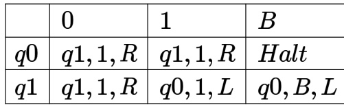

The table is interpreted as illustrated below.

The entry $( q 1 , 1 , R )$ in row $q 0$ and column signifies that if $M$ is in state $q 0$ and reads on the current page square, then it writes 1 on the same tape square, moves its tape head one position to the right and transitions to state $q 1$ .

Which of the following statements is true about $M ?$

A. $M$ does not halt on any string in B. $M$ does not halt on any string in $( 0 + 1 ) ^ { + }$ $( 0 0 + 1 ) ^ { * }$ C. $M$ halts on all strings ending in a D. $M$ halts on all strings ending in a

gatecse-2003 theory-of-computation decidability normal

# Answer key☟

Which of the following problems is undecidable?

A. Membership problem for CFGs B. Ambiguity problem for CFGs C. Finiteness problem for FSAs D. Equivalence problem for FSAs

gatecse-2007 theory-of-computation decidability normal

Which of the following are decidable?

I. Whether the intersection of two regular languages is infinite II. Whether a given context-free language is regular III. Whether two push-down automata accept the same language IV. Whether a given grammar is context-free

A. I and II B. I and IV C. II and III D. II and IV

gatecse-2008 theory-of-computation decidability easy

Which of the following is/are undecidable?

1. $G$ is a CFG. Is $L ( G ) = \phi ?$   
2. $G$ is a CFG. Is $L ( G ) = \Sigma ^ { * } ?$   
3. $M$ is a Turing machine. Is $L ( M )$ regular?   
4. $A$ is a DFA and $N$ is an NFA. Is $\dot { \boldsymbol { L } } ( \boldsymbol { A } ) = \boldsymbol { L } ( \boldsymbol { N } ) \boldsymbol { ? }$

A. only B. and only C. and 3 only D. and 3 only gatecse-2013 theory-of-computation decidability normal

Answer key☟

Which one of the following problems is undecidable?

A. Deciding if a given context-free grammar is ambiguous.   
B. Deciding if a given string is generated by a given context-free grammar.   
C. Deciding if the language generated by a given context-free grammar is empty.   
D. Deciding if the language generated by a given context-free grammar is finite.

gatecse-2014-set3 theory-of-computation context-free-language decidability normal

Consider the following statements.

I. The complement of every Turing decidable language is Turing decidable II. There exists some language which is in NP but is not Turing decidable III. If L is a language in NP, L is Turing decidable

Which of the above statements is/are true?

A. Only II B. Only III C. Only and II D. Only and III

gatecse-2015-set2 theory-of-computation decidability easy

Language $L _ { 1 }$ is polynomial time reducible to language $L _ { 2 }$ . Language $L _ { 3 }$ is polynomial time reducible to language $L _ { 2 }$ , which in turn polynomial time reducible to language $L _ { 4 }$ . Which of the following is/are true?

I. if $L _ { 4 } \in { \cal P }$ ， then $L _ { 2 } \in { \cal P }$ II. if $L _ { 1 } \in P$ or $L _ { 3 } \in P$ ， then $L _ { 2 } \in { \cal P }$ III. $L _ { 1 } \in P$ ： if and only if $L _ { 3 } \in P$ IV. if $L _ { 4 } \in P$ ， then $L _ { 3 } \in P$

A. II only B. III only C. and IV only D. I only

gatecse-2015-set3 theory-of-computation decidability normal

I. Given NFAs $N _ { 1 }$ and $N _ { 2 }$ is $L ( N _ { 1 } ) \cap L ( N _ { 2 } ) = \Phi$   
II. Given a CFG $G = ( N , \Sigma , P , \dot { S } )$ and a string $\ b { x } \in \Sigma ^ { * }$ , does $x \in L ( G ) { \mathrm { } } $ ?   
III. Given CFGs $G _ { 1 }$ and $G _ { 2 }$ , is $L ( \dot { G } _ { 1 } ) = L ( G _ { 2 } ) \ ?$   
IV. Given a TM $M$ , is ${ \cal L } ( M ) = \Phi$ ?

A. and IV only B. II and III only C. III and IV only D. II and IV only

Let $A$ and $B$ be finite alphabets and let  be a symbol outside both $A$ and $B _ { \cdot }$ . Let $f$ be a total function from $A ^ { * }$ to $B ^ { * }$ . We say $f$ is computable if there exists a Turing machine $M$ which given an input $x \in A ^ { * }$ , always halts with $f ( x )$ on its tape. Let $L _ { f }$ denote the language $\left\{ x \# f ( x ) \mid x \in A ^ { * } \right\}$ . Which of the following statements is true:

A. $f$ is computable if and only if $L _ { f }$ is recursive.   
B. $f$ is computable if and only if $L _ { f }$ is recursively enumerable.   
C. If $f$ is computable then $L _ { f }$ is recursive, but not conversely.   
D. If $f$ is computable then is recursively enumerable, but not conversely.

gatecse-2017-set1 theory-of-computation decidability difficult difficult

Let $L ( R )$ be the language represented by regular expression $R$ . Let $L ( G )$ be the language generated by a context free grammar $G$ . Let $L ( M )$ be the language accepted by a Turing machine $M$ . Which of the following decision problems are undecidable?

I. Given a regular expression $R$ and a string $w$ , is $w \in L ( R ) \colon$ II. Given a context-free grammar $G$ , is $L ( G ) = \emptyset$ III. Given a context-free grammar $G$ , is $L ( G ) = \Sigma ^ { * }$ for some alphabet $\Sigma ?$ IV. Given a Turing machine $M$ and a string $w$ , is $w \in L ( M ) \ ?$

A. and IV only B. II and III only C. II, III and IV only D. III and IV only

gatecse-2017-set2 theory-of-computation decidability

Consider the following problems. $L ( G )$ denotes the language generated by a grammar $G$ . L(M) denotes the language accepted by a machine $M$ .

I. For an unrestricted grammar $G$ and a string $w$ , whether $w \in L ( G )$   
II. Given a Turing machine $M$ , whether $L ( M )$ is regular   
III. Given two gramma ${ \bf \nabla } { G } _ { 1 }$ and $G _ { 2 }$ , whether $L \dot { ( { G _ { 1 } } ) } = L ( G _ { 2 } )$   
IV. Given an NFA $N$ , whether there is a deterministic PDA $P$ such that $N$ and $P$ accept the same language

Which one of the following statement is correct?

A. Only and II are undecidable B. Only II is undecidable C. Only II and IV are undecidable D. Only I, II and III are undecidable

Which of the following languages are undecidable? Note that $\langle M \rangle$ indicates encoding of the Turing machine M.

$\begin{array} { r l } & { , L _ { 1 } = \{ \langle M \rangle \mid L ( M ) = \emptyset \} } \\ & { , L _ { 2 } = \{ \langle M , w , q \rangle \mid M \mathrm { ~ o n ~ i n p u t ~ } w \mathrm { ~ r e a c h e s ~ s t a t e ~ } q \mathrm { ~ i n ~ e x a c t l } \} } \\ & { , L _ { 3 } = \{ \langle M \rangle \mid L ( M ) \mathrm { ~ i s ~ n o t r e c u r s i v e } \} } \\ & { , L _ { 4 } = \{ \langle M \rangle \mid L ( M ) \mathrm { c o n t a i n s ~ a t ~ l e a s t ~ 2 1 ~ m e m b e r s } \} } \end{array}$ y100 steps}

A. $L _ { 1 } , L _ { 3 }$ , and $L _ { 4 }$ only B. L1 and $\scriptstyle L _ { 3 }$ only C. $L _ { 2 }$ and $L _ { 3 }$ only D. $L _ { 2 }$ , $L _ { 3 }$ , and $L _ { 4 }$ only gatecse-2020 theory-of-computation decidability two-marks

Answer key☟

​Consider the following two statements about regular languages:

$S _ { 1 }$ : Every infinite regular language contains an undecidable language as a subset.   
$S _ { 2 }$ : Every finite language is regular.

Which one of the following choices is correct?

A. Only $S _ { 1 }$ is true B. Only $S _ { 2 }$ is true C. Both $S _ { 1 }$ and $S _ { 2 }$ are true D. Neither $S _ { 1 }$ nor $S _ { 2 }$ is true gatecse-2021-set2 theory-of-computation regular-language decidability two-marks

Answer key☟

Which of the following is/are undecidable?

A. Given two Turing machines $M _ { 1 }$ and $M _ { 2 }$ ， decide if $L ( M _ { 1 } ) = L ( M _ { 2 } )$ ·   
B. Given a Turing machine $M .$ ， decide if $L ( M )$ is regular.   
C. Given a Turing machine $M .$ ， decide if $M$ accepts all strings.   
D. Given a Turing machine $M .$ decide if $M$ takes more than  steps on every string.

gatecse-2022 theory-of-computation turing-machine decidability multiple-selects two-marks ​Let $G _ { 1 } , G _ { 2 }$ be Context Free Grammars (CFGs) and $R$ be a regular expression. For a grammar $G$ , let $L ( G )$ denote the language generated by $G$ .

Which ONE among the following questions is decidable?

A. Is $L \left( G _ { 1 } \right) = L \left( G _ { 2 } \right) ?$ B. Is $L \left( G _ { 1 } \right) \cap L \left( G _ { 2 } \right) = \emptyset$ ? C. s $L \left( G _ { 1 } \right) = L ( R ) \mathfrak { i }$ ？ D. Is $L ( G _ { 1 } ) = \emptyset$ ? gatecse2025-set2 theory-of-computation decidability easy one-mark

# Answer key☟

D. Any decidable language

Consider the DFA $M$ and NFA $M _ { 2 }$ as defined below. Let the language accepted by machine $M$ be $L$ What language machine $M _ { 2 }$ accepts, if

i. $F 2 = A ?$   
ii. $F 2 = B ?$   
iii. $F 2 = C ?$   
iv. $F 2 = D ?$ $\begin{array} { r l } { \mathbf { \delta } } & { { } \cdot M = ( Q , \Sigma , \delta , q _ { 0 } , F ) } \\ { \mathbf { \delta } } & { { } M _ { 2 } = ( Q 2 , \Sigma , \delta _ { 2 } , q _ { 0 0 } , F 2 ) } \end{array}$

Where,

$\begin{array} { r l } & { Q 2 = ( Q \times Q \times Q ) \cup \{ q _ { 0 0 } \} } \\ & { \delta _ { 2 } ( q _ { 0 0 } , \epsilon ) = \{ \langle q _ { 0 } , q , q \rangle \mid q \in Q \} } \\ & { \delta _ { 2 } ( \langle p , q , r \rangle , \sigma ) = \langle \delta ( p , \sigma ) , \delta ( q , \sigma ) , r \rangle } \end{array}$ for all $p , q , r \in Q$ and $\sigma \in \Sigma$ $\begin{array} { r l } & { A = \{ \langle p , q , r \rangle \ : | \ : p \in F ; q , r \in Q \} } \\ & { B = \{ \langle p , q , r \rangle \ : | \ : q \in F ; p , r \in Q \} } \\ & { C = \{ \langle p , q , r \rangle \ : | \ : p , q , r \in Q ; \exists s \in \Sigma ^ { * } , \delta ( p , s ) \in F \} } \\ & { D = \{ \langle p , q , r \rangle \ : | \ : p , q \in Q ; r \in F \} } \end{array}$ gate1988 descriptive theory-of-computation finite-automata difficult

Let $L$ be the language of all binary strings in which the third symbol from the right is a . Give a nondeterministic finite automaton that recognizes $L$ . How many states does the minimized equivalent deterministic finite automaton have? Justify your answer briefly?

gate1991 theory-of-computation finite-automata normal descriptive

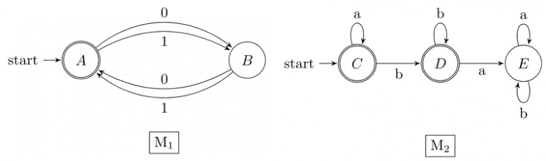

A. Display the transition diagram for a machine that recognizes $\boldsymbol { L } _ { 1 } . \boldsymbol { L } _ { 2 }$ , obtained from transition diagrams for $M _ { 1 }$ and $M _ { 2 }$ by adding only $\varepsilon$ transitions and no new states.   
B. Modify the transition diagram obtained in part (a) obtain a transition diagram for a machine that recognizes $( L _ { 1 } . L _ { 2 } ) ^ { * }$ by adding only $\varepsilon$ transitions and no new states. (Final states are enclosed double circles).

Given that $L$ is a language accepted by a finite state machine, show that and $L ^ { R }$ are also accepted by some finite state machines, where

$$
\begin{array} { l } { { L ^ { P } = \left\{ s \mid s s ^ { \prime } \in L \mathrm { s o m e ~ s t r i n g ~ } s ^ { \prime } \right\} } } \\ { { \ } } \\ { { L ^ { R } = \left\{ s \mid s \mathrm { o b t a i n e d ~ b y ~ r e v e r s i n g ~ s o m e ~ s t r i n g ~ i n ~ } L \right\} } } \end{array}
$$

gate1997 theory-of-computation finite-automata proof

Which of the following set can be recognized by a Deterministic Finite state Automaton?

A. The numbers $1 , 2 , 4 , 8 , \ldots 2 ^ { n }$ ， written in binary   
B. The numbers $1 , 2 , 4 , 8 , \ldots 2 ^ { n } , . .$ written in unary   
C. The set of binary string in which the number of zeros is the same as the number of ones. D. The set $\{ 1 , 1 0 1 , 1 1 0 1 1 , 1 1 1 0 1 1 1 , . . . \}$

gate1998 theory-of-computation finite-automata normal

Construct DFA's for the following languages:

A. $L = \{ w \mid w \in \{ a , b \} ^ { * }$ ， w has baab as a substring } B. ${ \cal L } = \{ w \mid w \in \{ a , b \} ^ { * }$ ， W has an odd number of a's and an odd number of b's } gatecse-2001 theory-of-computation easy descriptive finite-automata normal