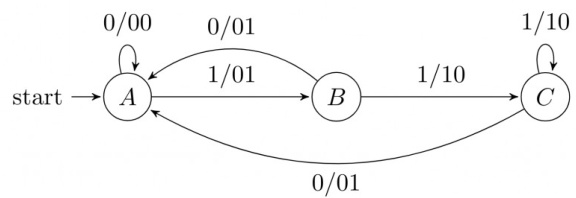

A. outputs the sum of the present and the previous bits of the input B. outputs whenever the input sequence contains C. outputs whenever the input sequence contains D. none of the above

We require a four state automaton to recognize the regular expression $( a \mid b ) ^ { * } a b b$

A. Give an NFA for this purpose B. Give a DFA for this purpose gatecse-2002 theory-of-computation finite-automata normal descriptive

Consider the following deterministic finite state automaton $M$ .

Let $\boldsymbol { S }$ denote the set of seven bit binary strings in which the first, the fourth, and the last bits are . The number of strings in $\boldsymbol { S }$ that are accepted by $M$ is

A. B. 5 C. D.

gatecse-2003 theory-of-computation finite-automata normal

Consider the NFA $M$ shown below.

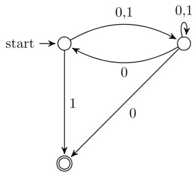

Let the language accepted by $M$ be $L$ . Let $L _ { 1 }$ be the language accepted by the NFA $M _ { 1 }$ obtained by changing the accepting state of $M$ to a non-accepting state and by changing the non-accepting states of $M$ to accepting states. Which of the following statements is true?

$$
\begin{array} { r } { \mathrm { ~  ~ \sigma ~ } _ { 1 } = \{ 0 , 1 \} ^ { * } - L ~ \mathrm { ~  ~ \mathsf ~ { ~ B ~ } ~ } . ~ L _ { 1 } = \{ 0 , 1 \} ^ { * } ~ \qquad \mathsf { C } . ~ L _ { 1 } \subseteq L ~ \mathrm { ~  ~ \mathsf ~ { ~ D ~ } ~ } . ~ L _ { 1 } = L } \end{array}
$$

gatecse-2003 theory-of-computation finite-automata normal

The following finite state machine accepts all those binary strings in which the number of ’s and ’s are respectively:

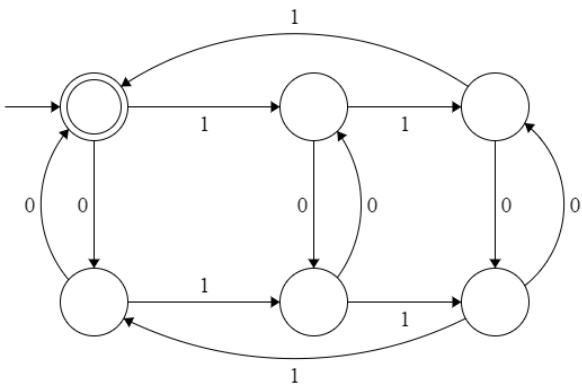

A. divisible by and B. odd and even C. even and odd D. divisible by and

Consider the machine $M$ :

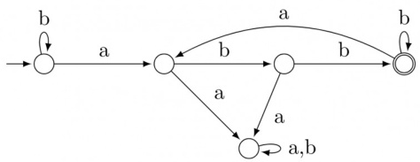

The language recognized by $M$ is:

A. $\{ w \in \{ a , b \} ^ { * }$ every a in $w$ is followed by exactly two b's} B. $\{ w \in \{ a , b \} ^ { * }$ every a in $w$ is followed by at least two b's} C. $\{ w \in \{ a , b \} ^ { * }$ $w$ contains the substring ‘abb'} D. $\{ w \in \{ a , b \} ^ { * } \mid w$ does not contain $^ { \ell } a a ^ { \prime }$ as a substring}

gatecse-2005 theory-of-computation finite-automata normal

B. It computes ’s complement of the input number C. It increments the input number D. it decrements the input number

Consider the following Finite State Automaton:

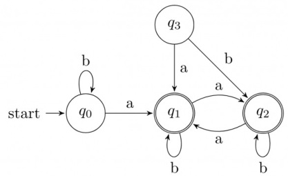

The language accepted by this automaton is given by the regular expression

A. b\*ab\*ab\* ab\* B. $( a + b ) ^ { * }$ $\complement . \ b ^ { * } a ( a + b ) ^ { * }$ D. b\*ab\*ab\*

gatecse-2007 theory-of-computation finite-automata normal

Given below are two finite state automata ( $$ indicates the start state and $F$ indicates a final state)

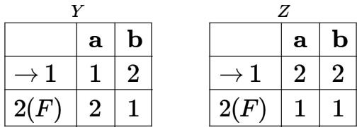

Which of the following represents the product automaton $Z \times Y ?$

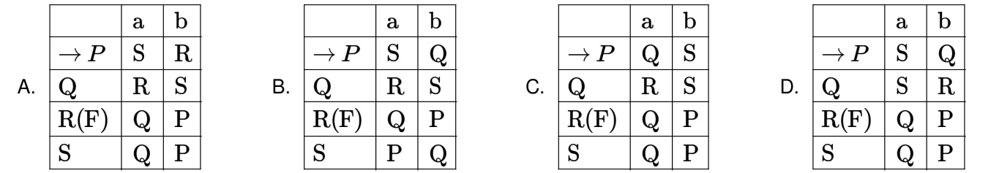

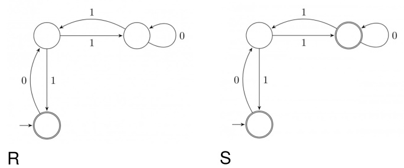

1. $\epsilon + 0 ( 0 1 ^ { * } 1 + 0 0 ) ^ { * } 0 1 ^ { * }$   
2 $\dots \epsilon + 0 ( 1 0 ^ { * } 1 + 0 0 ) ^ { * } 0$   
3. $\epsilon + 0 ( 1 0 ^ { * } 1 + 1 0 ) ^ { * } 1$   
4. $\epsilon + 0 ( 1 0 ^ { * } 1 + 1 0 ) ^ { * } 1 0 ^ { * }$

A. $P - 2 , Q - 1 , R - 3 , S - 4$ B. $P - 1 , Q - 3 , R - 2 , S - 4$   
C. $P - 1 , Q - 2 , R - 3 , S - 4$ D. $P - 3 , Q - 2 , R - 1 , S - 4$

gatecse-2008 theory-of-computation finite-automata normal

# Answer key☟

The above DFA accepts the set of all strings over $\{ 0 , 1 \}$ that

A. begin either with or . B. end with .   
C. end with . D. contain the substring .

gatecse-2009 theory-of-computation finite-automata easy

What is the complement of the language accepted by the NFA shown below? Assume ${ \boldsymbol { \Sigma } } = \{ { \boldsymbol { a } } \}$ and $\epsilon$ is the empty string.

OlO

A. $\phi$ B. C. a\* D. $\{ a , \epsilon \}$

# Answer key

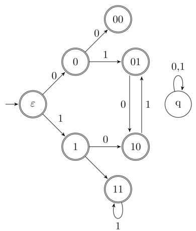

The missing arcs in the DFA are:

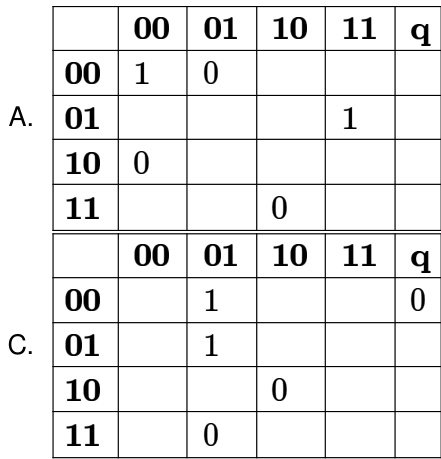

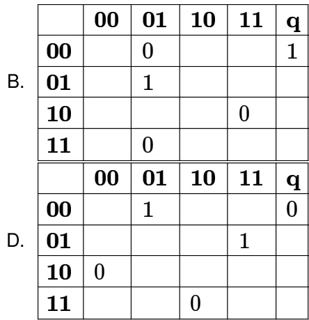

Consider the DFA $A$ given below.

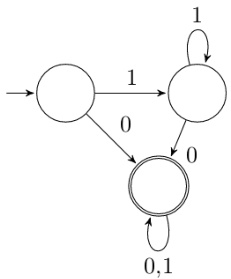

Which of the following are FALSE?

1. Complement of $L ( A )$ is context-free.   
2. $L ( A ) = L ( ( 1 1 ^ { * } 0 + 0 ) ( 0 + 1 ) ^ { * } 0 ^ { * } 1 ^ { * } )$   
3. For the language accepted by $A , A$ is the minimal DFA.   
4. $A$ accepts all strings over $\{ 0 , 1 \}$ of length at least .

A. 1 and 3 only B. 2 and 4 only C. 2 and 3 only D. 3 and 4 only

gatecse-2013 theory-of-computation finite-automata normal

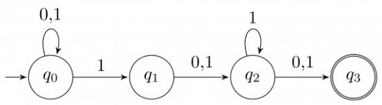

What is the set of reachable states for the input string ?

A. $\{ q _ { 0 } , q _ { 1 } , q _ { 2 } \}$ B. {q0,q1} C. {q0,q1,q2,q3} D. {q3}

gatecse-2014-set1 theory-of-computation finite-automata easy

# Answer key☟

Consider the following two statements:

I. If all states of an NFA are accepting states then the language accepted by the NFA is $\Sigma ^ { * }$ .   
II. There exists a regular language $A$ such that for all languages $B$ , $A \cap B$ is regular.

Which one of the following is CORRECT?

A. Only I is true B. Only II is true C. Both and II are true D. Both and II are false gatecse-2016-set2 theory-of-computation finite-automata normal

Let $\delta$ denote the transition function and $\hat { \delta }$ denote the extended transition function of the $\epsilon$ -NFA whose transition table is given below:

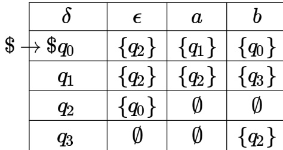

Then $\hat { \delta } ( q _ { 2 } , a b a )$ is

A. B. {q0,q1,q3} C. $\{ q _ { 0 } , q _ { 1 } , q _ { 2 } \}$ D. {q0,q2,q3} gatecse-2017-set2 theory-of-computation finite-automata

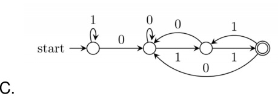

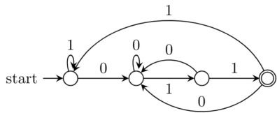

D.

Consider the following deterministic finite automaton (DFA)

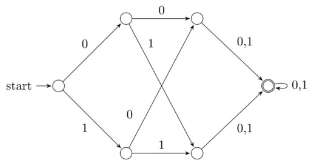

The number of strings of length accepted by the above automaton is gatecse-2021-set2 numerical-answers theory-of-computation finite-automata one-mark

Suppose we want to design a synchronous circuit that processes a string of ’s and ’s. Given a string, it produces another string by replacing the first in any subsequence of consecutive ’s by a . Consider the following example.

Input sequence: 00100011000011100   
Output sequence: 00000001000001100

A Mealy Machine is a state machine where both the next state and the output are functions of the present state and the current input.

The above mentioned circuit can be designed as a two-state Mealy machine. The states in the Mealy machine can be represented using Boolean values 0 and . We denote the current state, the next state, the next incoming bit, and the output bit of the Mealy machine by the variables $s , t , b$ and $y$ respectively.

Assume the initial state of the Mealy machine is .

What are the Boolean expressions corresponding to $t$ and $y$ in terms of $s$ and $b$ ?

A $\begin{array} { l } { t = s + b } \\ { \ . \begin{array} { l } { y = s b } \\ { t = b } \\ { y = s \bar { b } } \end{array} } \end{array}$ $\begin{array} { c } { { \tan } } \\ { { \ B . \begin{array} { l } { { t = b } } \\ { { y = s b } } \\ { { t = s + b } } \end{array} } } \\ { { \begin{array} { l } { { \begin{array} { r l } { { \scriptstyle 0 . } } & { { t = b } } \\ { { \scriptstyle y = s \bar { b } } } & { { } } \end{array} } } \end{array} } } \end{array}$   
C   
gatecse-2021-set2 theory-of-computation finite-automata two-marks

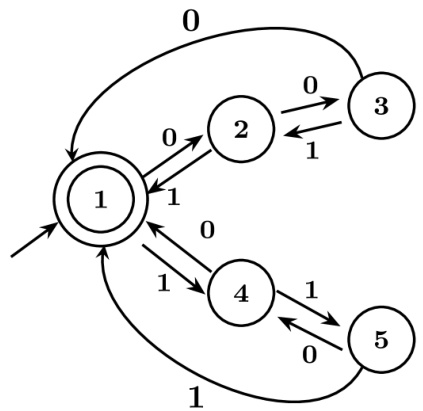

Which of the following statements is/are FALSE?

A. States and are distinguishable in $M$ B. States and  are distinguishable in $M$ C. States and are distinguishable in $M$ D. Any string $w$ with ${ n } _ { 0 } ( w ) = n _ { 1 } ( w )$ is in $L ( M )$

Which one of the following regular expressions is equivalent to the language accepted by the  given below?

A. $0 ^ { * } 1 ( 0 + 1 0 ^ { * } 1 ) ^ { * }$ B. $0 ^ { * } ( 1 0 ^ { * } 1 1 ) ^ { * } 0 ^ { * }$   
C. $0 ^ { * } 1 ( 0 1 0 ^ { * } 1 ) ^ { * } 0 ^ { * }$ D. $0 ( 1 + 0 ^ { * } 1 0 ^ { * } 1 ) ^ { * } 0 ^ { * }$

gatecse-2024-set2 theory-of-computation finite-automata one-mark ​Let be the -state with $\epsilon$ -transitions shown in the diagram below.

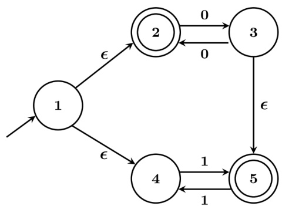

Which one of the following regular expressions represents the language accepted by ?

A. $( 0 0 ) ^ { * } + 1 ( 1 1 ) ^ { * }$ B. $0 ^ { * } + \left( 1 + 0 ( 0 0 ) ^ { * } \right) ( 1 1 ) ^ { * }$   
C. $( 0 0 ) ^ { * } + ( \mathrm { i } + ( 0 0 ) ^ { * } ) ( \mathbf { 1 1 } ) ^ { * }$ D. $0 ^ { + } + 1 ( 1 1 ) ^ { * } + 0 ( 1 1 ) ^ { * }$

Consider the following deterministic finite automaton (DFA) defined over the alphabet, $\Sigma = \{ a , b \}$ . Identify which of the following language(s) is/are accepted by the given DFA.

-6-0-6g $b$

A. The set of all strings containing an even number of $b$ 's.   
B. The set of all strings containing the pattern $b a b .$ .   
C. The set of all strings ending with the pattern .   
D. The set of all strings not containing the pattern .

Consider the following two finite automata $D _ { 1 }$ and $D _ { 2 }$ .

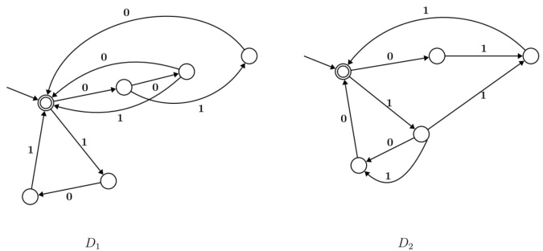

Which of the following statements is/are true?

A. $L \left( D _ { 1 } \right) = L \left( D _ { 2 } \right)$   
B. $L \left( D _ { 1 } \right)$ is a proper subset of $L \left( D _ { 2 } \right)$   
C. $L \left( D _ { 1 } \right) \cap L \left( D _ { 2 } \right) = \{ \epsilon \}$   
D. $\left( L \left( D _ { 1 } \right) \cup L \left( D _ { 2 } \right) \right) ^ { * }$ consists of all strings in $\{ 0 , 1 \} ^ { * }$ whose length is divisible by

$$
\begin{array} { c } { { \{ A  a A , A  b B , B  a B , B  b A , B  \epsilon \} } } \\ { { \{ A  b B , A  a B , B  a A , B  b A , B  \epsilon \} } } \\ { { \{ A  a A , A  b A , B  a B , B  b A , A  \epsilon \} } } \end{array}
$$

Consider the non-deterministic finite automaton (NFA) shown in the figure.

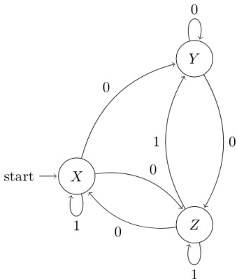

State $X$ is the starting state of the automaton. Let the language accepted by the NFA with $Y$ as the only accepting state be $L 1$ . Similarly, let the language accepted by the NFA with $Z$ as the only accepting state be $L 2$ . Which of the following statements about $L 1$ and $L 2$ is TRUE?

A. $L 1 = L 2$ B. $L 1 \subset L 2$ C. $L 2 \subset L 1$ D. None of the above

gateit-2005 theory-of-computation finite-automata normal

# Answer key☟

Consider the regular grammar:

$$
\begin{array} { l } { \cdot S  X a \mid Y a } \\ { \cdot X  Z a } \\ { \cdot Z  S a \mid \epsilon } \\ { \cdot Y  W a } \\ { \cdot W  S a } \end{array}
$$

where $\boldsymbol { S }$ is the starting symbol, the set of terminals is $\{ a \}$ and the set of non-terminals is $\{ S , W , X , Y , Z \}$ . We wish to construct a deterministic finite automaton (DFA) to recognize the same language. What is the minimum number of states required for the DFA?

A. B. C. D.

gateit-2005 theory-of-computation finite-automata normal

# Answer key☟

$a$ $b$ $S$ $t$ $b$ $a$ $a$

Consider the strings abbaba, $\scriptstyle v = b a b$ ， $\mathbf { a n d } w = a a b b$ . Which of the following statements is true?

A. The automaton accepts $u$ and $v$ B. The automaton accepts each of but not $w$ $_ { u , v }$ and $w$ C. The automaton rejects each of D. The automaton accepts $u$ but $u , v$ and $w$ rejects $v$ and $w$

gateit-2006 theory-of-computation finite-automata easy

For a state machine with the following state diagram the expression for the next state $S ^ { + }$ in terms of the current state $\boldsymbol { S }$ and the input variables $x$ and $y$ is

$$
\underset { \left( S = 1 \right) \underset { \mathbf { y } = 0 } { \overset { \mathrm { x } = 1 } { \left( \Delta \right) } } } { \overset { \mathrm { x } = 1 } { \underset { \mathbf { x } = 0 } { \overset { \mathrm { y } = 1 } { \left( \Delta \right) } } } } \underset { \mathbf { \zeta } = 0 } { \overset { \mathrm { y } = 1 } { \left( \Delta \right) } }
$$

A. $S ^ { + } = S ^ { \prime } . y ^ { \prime } + S . x$ B. $S ^ { + } = S . x . y ^ { \prime } + S ^ { \prime } . y . x ^ { \prime }$   
C. $S ^ { + } = x . y ^ { \prime }$ D. $S ^ { + } = S ^ { \prime } . y + S . x ^ { \prime }$

gateit-2006 theory-of-computation finite-automata normal

Consider the following DFA in which $S _ { 0 }$ is the start state and $S _ { 1 } , S _ { 3 }$ are the final states.

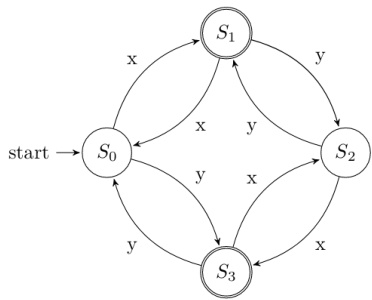

What language does this recognize?

A. All strings of $x$ and $y$   
B. All strings of $x$ and $y$ which have either even number of $x$ and even number of $y$ or odd number of $x$ and odd number of $y$   
C. All strings of $x$ and $y$ which have equal number of $x$ and $y$   
D. All strings of $x$ and $y$ with either even number of $x$ and odd number of $y$ or odd number of $x$ and even number of $y$

Consider the following finite automata $P$ and $Q$ over the alphabet $\{ a , b , c \}$ . The start states are indicated by a double arrow and final states are indicated by a double circle. Let the lang uages recognized by them be denoted by $L ( P )$ and $L ( Q )$ respectively.

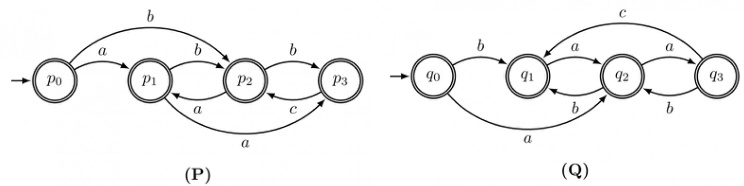

The automation which recognizes the language $L ( P ) \cap L ( Q )$ is :

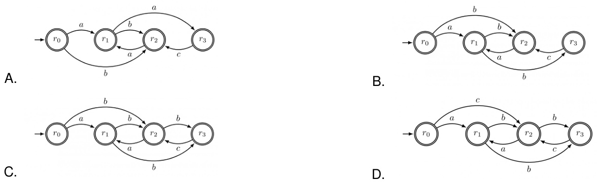

Consider the regular expression $R = ( a + b ) ^ { * } ( a a + b b ) ( a + b ) ^ { * }$

Which of the following non-deterministic finite automata recognizes the language defined by the regular expression $R ?$ Edges labeled $\lambda$ denote transitions on the empty string.

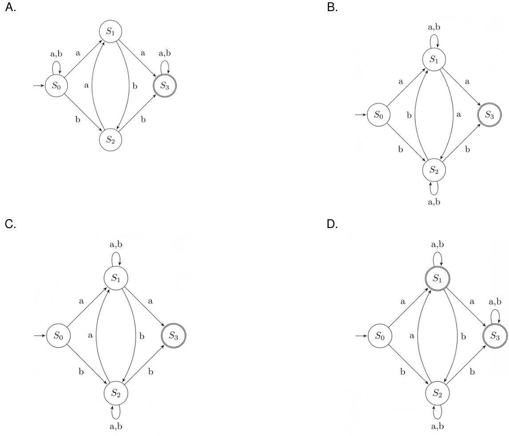

Consider the regular expression $R = ( a + b ) ^ { * } ( a a + b b ) ( a + b ) ^ { * }$

Which deterministic finite automaton accepts the language represented by the regular expression ?

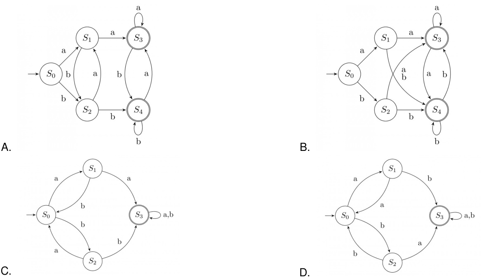

If the final states and non-final states in the DFA below are interchanged, then which of the following languages over the alphabet $\{ a , b \}$ will be accepted by the new DFA?

A. Set of all strings that do not end with B. Set of all strings that begin with either an $\mathbf { \Delta } _ { a }$ or a b C. Set of all strings that do not contain the substring $a b$ , D. The set described by the regular expression $b ^ { * } a a ^ { * } ( b a ) ^ { * } b ^ { * }$

M2

Which one of the following is TRUE?

A. $L _ { 1 } = L _ { 2 }$ B. $L _ { 1 } \subset L _ { 2 }$   
C. $L _ { 1 } \cap L _ { 2 } ^ { C } = \emptyset$ D. $L _ { 1 } \cup L _ { 2 } \neq L _ { 1 }$

gateit-2008 theor y-of-computation finite-automata normal

Consider a finite state machine (FSM) with one input $X$ and one output $f$ , represented by the given state transition table. The minimum number of states required to realize this FSM is (Answer in integer).

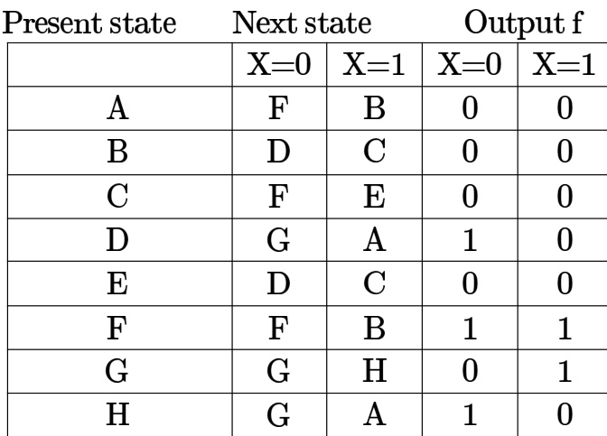

FORTRAN is a:

A. Regular language. B. Context-free language.   
C. Context-senstive language. D. None of the above.

gate1987 theory-of-computation identify-class-language

Show that the Turing machines, which have a read only input tape and constant size work tape, recognize precisely the class of regular languages.

gate1991 theory-of-computation descriptive identify-class-language proof

A. Given a set:

$S = \{ x \vert$ there is an x-block of 5's in the decimal expansion ofπ} (Note: $x$ - is a maximal block of $x$ successive 's) Which of the following statements is true with respect to $S ?$ No reason to be given for the answer.

i. $\boldsymbol { S }$ is regular   
ii. $\boldsymbol { S }$ is recursively enumerable   
iii. $\boldsymbol { S }$ is not recursively enumerable   
iv. $\boldsymbol { S }$ is recursive   
B. Given that a language $L _ { 1 }$ is regular and that the language $L _ { 1 } \cup L _ { 2 }$ is regular, is the language $L _ { 2 }$ always regular? Prove your answer.

gate1994 theory-of-computation identify-class-language normal descriptive

If $L 1$ is context free language and $L 2$ is a regular language which of the following is/are false?

A. $L 1 - L 2$ is not context free B. $L 1 \cap L 2$ is context free C. $\sim L 1$ is context free D. $\sim L 2$ is regular

gate1999 theory-of-computation identify-class-language normal multiple-selects

Let $L$ denote the languages generated by the grammar $S \to 0 S 0 \mid 0 0$ . Which of the following is TRUE?

A. $L = 0 ^ { + }$ B. $L$ is regular but not $0 ^ { + }$ C. $L$ is context free but not regular D. $L$ is not context free gatecse-2000 theory-of-computation easy identify-class-language

# 6.9.7 Identify Class Language: GATE CSE 2002 Question: 1.7

The language accepted by a Pushdown Automaton in which the stack is limited to items is best described as

A. Context free B. Regular C. Deterministic Context free D. Recursive

The language $\{ a ^ { m } b ^ { n } c ^ { m + n } \mid m , n \geq 1 \}$ is

A. regular B. context-free but not regular C. context-sensitive but not context free D. type-0 but not context sensitive

gatecse-2004 theory-of-computation normal identify-class-language

# Answer key☟

Consider the languages: ${ \cal L } _ { 1 } = \{ a ^ { n } b ^ { n } c ^ { m } \mid n , m > 0 \}$ and $L _ { 2 } = \{ a ^ { n } b ^ { m } c ^ { m } \mid n , m > 0 \}$ Which one of the following statements is FALSE?

A. $L _ { 1 } \cap L _ { 2 }$ is a context-free language B. $L _ { 1 } \cup L _ { 2 }$ is a context-free language C. $L _ { 1 }$ and $L _ { 2 }$ are context-free languages D. $L _ { 1 } \cap L _ { 2 }$ is a context sensitive language

For $\pmb { s } \in ( 0 + 1 ) ^ { * }$ let $d ( s )$ denote the decimal value of $s ( \Theta . \ 9 . \ d ( 1 0 1 ) = 5 )$ Let

$$
L = \{ s \in ( 0 + 1 ) ^ { * } \mid d ( s ) { \bmod { 5 } } = 2 { \mathrm { ~ a n d } } d ( s ) { \bmod { 7 } } \neq 4 \}
$$

Which one of the following statements is true?

A. $L$ is recursively enumerable, but B. $L$ is recursive, but not context-free not recursive C. $L$ is context-free, but not regular D. $L$ is regular

gatecse-2006 theory-of-computation normal identify-class-language

L e t $L _ { 1 }$ be a regular language, $L _ { 2 }$ be a deterministic context-free language and $L _ { 3 }$ a recursivel enumerable, but not recursive, language. Which one of the following statements is false?

A. $L _ { 1 } \cap L _ { 2 }$ is a deterministic CFL   
B. $L _ { 3 } \cap L _ { 1 }$ is recursive   
C. $L _ { 1 } \cup L _ { 2 }$ is context free   
D. $L _ { 1 } \cap L _ { 2 } \cap L _ { 3 }$ is recursively enumerable

gatecse-2006 theory-of-computation normal identify-class-language

Match the following:

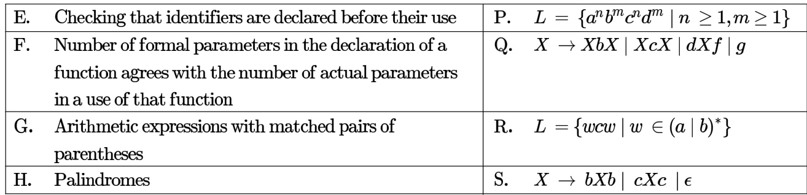

A. E-P, F-R,G-Q,H-S B. E-R,F-P,G-S, H-Q C. E-R,F-P,G-Q,H-S D. E-P,F-R, G-S,H-Q

Which of the following is true for the language

$$
\{ a ^ { p } \mid p { \mathrm { i s } } { \mathrm { a p r i m e } } \} ?
$$

A. It is not accepted by a Turing Machine   
B. It is regular but not context-free   
C. It is context-free but not regular   
D. It is neither regular nor context-free, but accepted by a Turing machine

gatecse-2008 theory-of-computation easy identify-class-language

Let $L = L _ { 1 } \cap L _ { 2 }$ , where $L _ { 1 }$ and $L _ { 2 }$ are languages as defined below:   
$\begin{array} { l } { { L _ { 1 } = \{ a ^ { m } b ^ { m } c a ^ { n } b ^ { n } \mid m , n \geq 0 \} } } \\ { { L _ { 2 } = \{ a ^ { i } b ^ { j } c ^ { k } \mid i , j , k \geq 0 \} } } \end{array}$   
Then $L$ is

A. Not recursive B. Regular C. Context free but not regular D. Recursively enumerable but not context free.

gatecse-2009 theory-of-computation easy identify-class-language

# Answer key☟

Consider the languages $L 1$ ， $L 2$ and $L 3$ as given below.

$L 1 = \{ 0 ^ { p } 1 ^ { q } \mid p , q \in N \} .$ ，$L 2 = \{ 0 ^ { p } 1 ^ { q } \mid p , q \in N a n d p = q \} a n d ,$ $L 3 = \{ 0 ^ { p } 1 ^ { q } 0 ^ { r } \mid p , q , r \in N a n d p = q = r \} .$

Which of the following statements is NOT TRUE?

A. Push Down Automata (PDA) can be used to recognize $L 1$ and $L 2$   
B. $L 1$ is a regular language   
C. All the three languages are context free   
D. Turing machines can be used to recognize all the languages

Consider the following languages.

$L _ { 1 } = \{ 0 ^ { p } 1 ^ { q } 0 ^ { r } \mid p , q , r \geq 0 \}$ $\begin{array} { l } { L 1 = \{ \mathbf { U } ^ { r } \mathbf { 1 } ^ { z } \mathbf { U } ~ | ~ p , q , r \geq \mathbf { U } \} } \\ { L _ { 2 } = \{ 0 ^ { p } \mathbf { 1 } ^ { q } 0 ^ { r } ~ | ~ p , q , r \geq 0 , p \neq r \} } \end{array}$

Which one of the following statements is FALSE?

A. L2 is context-free. B. $L _ { 1 } \cap L _ { 2 }$ is context-free. C. Complement of $L _ { 2 }$ is recursive. D. Complement of $L _ { 1 }$ is context-free but not regular.

gatecse-2013 theory-of-computation identify-class-language normal

# 6.9.19 Identify Class Language: GATE CSE 2014 Set 3 Question: 36

Consider the following languages over the alphabet $\Sigma = \{ 0 , 1 , c \}$

$\begin{array} { r l } & { L _ { 1 } = \{ 0 ^ { n } 1 ^ { n } \mid n \geq 0 \} } \\ & { L _ { 2 } = \{ w c w ^ { r } \mid w \in \{ 0 , 1 \} ^ { * } \} } \\ & { L _ { 3 } = \{ w w ^ { r } \mid w \in \{ 0 , 1 \} ^ { * } \} } \end{array}$ Here, $\boldsymbol { w } ^ { r }$ is the reverse of the string $w$ . Which of these languages are deterministic Context-free languages?

A. None of the languages B. Only $L _ { 1 }$ C. Only $L _ { 1 }$ and $L _ { 2 }$ D. All the three languages

gatecse-2014-set3 theory-of-computation identify-class-language context-free-language normal

Consider the following languages.

$$
\begin{array} { l } { { L _ { 1 } = \{ a ^ { r } \mid p \mathrm { { s a p r u m e n u m o e r } \} } } } \\ { { L _ { 2 } = \{ a ^ { n } b ^ { m } c ^ { 2 m } \mid n \geq 0 , m \geq 0 \} } } \\ { { L _ { 3 } = \{ a ^ { n } b ^ { n } c ^ { 2 n } \mid n \geq 0 \} } } \\ { { L _ { 4 } = \{ a ^ { n } b ^ { n } \mid n \geq 1 \} } } \end{array}
$$

Which of the following are CORRECT?

I. $L _ { 1 }$ is context free but not regular II. $L _ { 2 }$ is not context free III. $L _ { 3 }$ is not context free but recursive IV. $L _ { 4 }$ is deterministic context free

A. I, II and IV only B. II and III only C. and IV only D. III and IV only

gatecse-2017-set2 theory-of-computation identify-class-language

Consider the following languages:

$$
\begin{array} { r l } & { \left\{ a ^ { m } b ^ { n } c ^ { p } d ^ { q } \mid m + p = n + q , \mathrm { ~ w h e r e } m , n , p , q \geq 0 \right\} } \\ & { \left\{ a ^ { m } b ^ { n } c ^ { p } d ^ { q } \mid m = n \mathrm { a n d } p = q , \mathrm { ~ w h e r e } m , n , p , q \geq 0 \right\} } \\ & { \left\{ a ^ { m } b ^ { n } c ^ { p } d ^ { q } \mid m = n = p \mathrm { a n d } p \neq q , \mathrm { ~ w h e r e } m , n , p , q \geq 0 \right\} } \\ & { \left\{ a ^ { m } b ^ { n } c ^ { p } d ^ { q } \mid m n = p + q , \mathrm { ~ w h e r e } m , n , p , q \geq 0 \right\} } \end{array}
$$

Which of the above languages are context-free?

A. and IV only B. and II only C. II and III only D. II and IV only gatecse-2018 theory-of-computation identify-class-language context-free-language normal two-marks

# 6.9.23 Identify Class Language: GATE CSE 2020 Question: 10

Consider the language $L = \{ a ^ { n } \mid n \geq 0 \} \cup \{ a ^ { n } b ^ { n } \mid n \geq 0 \}$ and the following statements.

I. $L$ is deterministic context-free.   
II. $L$ is context-free but not deterministic context-free.   
III. $L$ is not $L L ( k )$ for any $k$ .

Which of the above statements is/are TRUE?

A. only B. only C. and Ⅲ only D. Ⅲ only

C. Neither $L _ { 1 }$ nor is context- free.   
D. $L _ { 1 }$ context- free but $L _ { 2 }$ is not context-free.

Let $L _ { 1 }$ be a regular language and $L _ { 2 }$ be a context-free language. Which of the following languages is/are context-free?

A. $L _ { 1 } \cap \overline { { L _ { 2 } } }$ $\begin{array} { r l } & { \mathsf { B } . \overline { { \overline { { L _ { 1 } } } } } \cup \overline { { { L _ { 2 } } } } } \\ & { \mathsf { D } . \left( { L _ { 1 } } \cap { L _ { 2 } } \right) \cup \left( \overline { { { L _ { 1 } } } } \cap { L _ { 2 } } \right) } \end{array}$   
C. $L _ { 1 } \cup ( L _ { 2 } \cup \overline { { L _ { 2 } } } )$

gatecse-2021-set2 multiple-selects theory-of-computation identify-class-language one-mark

# Answer key☟

Which of the following statements is/are TRUE?

A. Every subset of a recursively enumerable language is recursive.   
B. If a language $L$ and its complement $\overline { { L } }$ are both recursively enumerable, then $L$ must be recursive.   
C. Complement of a context-free language must be recursive.   
D. If $L _ { 1 }$ and $L _ { 2 }$ are regular, then $L _ { 1 } \cap L _ { 2 }$ must be deterministic context-free.

Consider the following languages:

$L _ { 1 } = \{ a ^ { n } w a ^ { n } | w \in \{ a , b \} ^ { * } \}$   
$L _ { 2 } = \{ w x w ^ { R } | w , x \in \{ a , b \} ^ { * } , | w | , | x | > 0 \}$   
Note tha t is the reversal of the string $w$ · Which of the following is/are

A. $L _ { 1 }$ and $L _ { 2 }$ are regular. B. $L _ { 1 }$ and $L _ { 2 }$ are context-free. C. $L _ { 1 }$ is regular and $L _ { 2 }$ is context- D. $L _ { 1 }$ and $L _ { 2 }$ are context-free but not free. regular.

gatecse-2022 theory-of-computation identify-class-language context-free-language multiple-selects two-marks

Which of the following statements is/are CORRECT?

A. The intersection of two regular languages is regular.   
B. The intersection of two context-free languages is context-free.   
C. The intersection of two recursive languages is recursive.   
D. The intersection of two recursively enumerable languages is recursively enumerable.

gatecse-2023 theory-of-computation identify-class-language multiple-selects one-mark

A. It is necessarily regular but not B. It is necessarily context-free. necessarily context-free. C. It is necessarily non-regular. D. None of the above

gateit-2005 theory-of-computation normal identify-class-language

The language $\{ 0 ^ { n } 1 ^ { n } 2 ^ { n } | 1 \leq n \leq 1 0 ^ { 6 } \}$ is

A. regular B. context-free but not regular C. context-free but its complement is D. not context-free not context-free

gateit-2005 theory-of-computation easy identify-class-language

Consider the following languages.

$$
\begin{array} { l } { { \pmb { \cdot L _ { 1 } } = \{ a ^ { i } b ^ { j } c ^ { k } \mid i = j , k \geq 1 \} } } \\ { { \pmb { \cdot L _ { 2 } } = \{ a ^ { i } b ^ { j } \mid j = 2 i , i \geq 0 \} } } \end{array}
$$

Which of the following is true?

A. $L _ { 1 }$ is not a CFL but $L _ { 2 }$ is   
B. $L _ { 1 } \cap L _ { 2 } = \emptyset$ and $L _ { 1 }$ is non-regular   
C. $L _ { 1 } \cup L _ { 2 }$ is not a CFL but $L _ { 2 }$ is   
D. There is a -state PDA that accepts $L _ { 1 }$ , but there is no DPDA that accepts $L _ { 2 }$

gateit-2008 theory-of-computation normal identify-class-language

If $s$ is a string over $( 0 + 1 ) ^ { * }$ then let $n _ { 0 } ( s )$ denote the number of ’s in $s$ and $n _ { 1 } ( s )$ the number of ’s in $s$ Which one of the following languages is not regular?

$$
\begin{array} { r l } & { L = \{ s \in ( 0 + 1 ) ^ { * } \mid n _ { 0 } ( s ) \mathrm { ~ i s ~ a 3 \mathrm { - } d i g j t ~ p r i m e } \} } \\ & { L = \{ s \in ( 0 + 1 ) ^ { * } \mid \mathrm { ~ f o r ~ e v e r y ~ p r e f i x ~ s ' ~ o f ~ s , } \mid n _ { 0 } ( s ^ { \prime } ) - n _ { 1 } ( s ^ { \prime } ) \mid \le 2 \} } \\ & { L = \{ s \in ( 0 + 1 ) ^ { * } \mid n _ { 0 } ( s ) - n _ { 1 } ( s ) \mid \le 4 \} } \\ & { L = \{ s \in ( 0 + 1 ) ^ { * } \mid n _ { 0 } ( s ) \mod 7 = n _ { 1 } ( s ) \mod 5 = 0 \} } \end{array}
$$

gatecse-2006 theory-of-computation medium regular-language

Construct a finite state machine with minimum number of states, accepting all strings over $( a , b )$ such that the number of 's is divisible by two and the number of 's is divisible by three.

gate1997 theory-of-computation finite-automata normal minimal-state-automata descriptive

Following is a state table for time finite state machine.

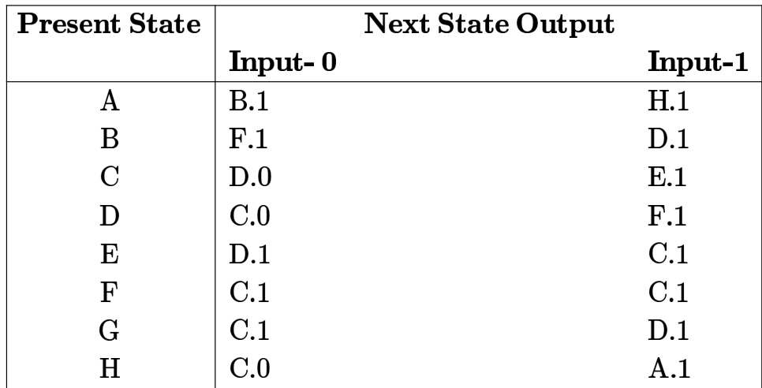

A. Find the equivalence partition on the states of the machine. B. Give the state table for the minimal machine. (Use appropriate names for the equivalent states. For example if states $X$ and $Y$ are equivalent then use $X Y$ as the name for the equivalent state in the minimal machine).

Let $L$ be the set of all binary strings whose last two symbols are the same. The number of states in the minimal state deterministic finite state automaton accepting $L$ is

A. B. C. D.

gate1998 theory-of-computation finite-automata normal minimal-state-automata

Design a deterministic finite state automaton (using minimum number of states) that recognizes the following language:

$L = \{ w \in \{ 0 , 1 \} ^ { * } \mid w$ interpreted as binary number (ignoring the leading zeros) is divisible by five

gate1998 theory-of-computation finite-automata normal minimal-state-automata descriptive

# 6.11.6 Minimal State Automata: GATE CSE 1999 Question: 1.4

Consider the regular expression $( 0 + 1 ) ( 0 + 1 ) \dots N$ times. The minimum state finite automaton that recognizes the language represented by this regular expression contains

A. states B. $^ { n + 1 }$ states C. $_ { n + 2 }$ states D. None of the above

Given an arbitrary non-deterministic finite automaton (NFA) with $N$ states, the maximum number of states in an equivalent minimized DFA at least

A. $N ^ { 2 }$ B. C. 2N D.

gatecse-2001 finite-automata theory-of-computation easy minimal-state-automata

# 6.11.8 Minimal State Automata: GATE CSE 2001 Question: 2.5

Consider a DFA over $\Sigma = \{ a , b \}$ accepting all strings which have number of a's divisible by  and number of 's divisible by . What i s the minimum number of states that the DFA will have?

A. B. C. D.

gatecse-2001 theory-of-computation finite-automata minimal-state-automata

# 6.11.9 Minimal State Automata: GATE CSE 2002 Question: 2.13

The smallest finite automaton which accepts the language $\{ x \vert$ length of $x$ is divisible by $\boldsymbol { 3 } \}$ has

A. states B. states C. 4 states D. states

gatecse-2002 theory-of-computation normal finite-automata minimal-state-automata

# 6.11.10 Minimal State Automata: GATE CSE 2006 Question: 34

Consider the regular language $L = ( 1 1 1 + 1 1 1 1 ) ^ { * }$ The minimum number of states in any DFA accepting this languages is:

A. 3 B. 5 C. 8 D. 9 gatecse-2006 theory-of-computation finite-automata normal minimal-state-automata

A minimum state deterministic finite automaton accepting the language $L = \{ w \mid w \in \{ 0 , 1 \} ^ { * }$ number of s and s in $w$ are divisible by and , respectively has

A. states B. 11 states C. 10 states D. 9 states gatecse-2007 theory-of-computation finite-automata normal minimal-state-automata

Let $w$ be any string of length $n$ in $\{ 0 , 1 \} ^ { * }$ . Let $L$ be the set of all substrings of $w$ . What is the minimum number of states in non-deterministic finite automation that accepts $L$ ?

A. B. n ${ \mathsf { C } } . \ n { + 1 }$ D.

gatecse-2010 theory-of-computation finite-automata normal minimal-state-automata

Definition of a language $L$ with alphabet $\{ a \}$ is given as following.

$$
L = \left\{ a ^ { n k } \mid k > 0 , \ a n d \ n { \mathrm { i s } } \ a { \mathrm { p o s i t i v e } } { \mathrm { i n t e g e r ~ c o n s t a n t } } \right\}
$$

What is the minimum number of states needed in a DFA to recognize ?

A. $k + 1$ $\mathsf { B } . \ n + 1 \qquad \mathsf { C } . \ 2 ^ { n + 1 }$ D. $2 ^ { k + 1 }$

gatecse-2011 theory-of-computation finite-automata normal minimal-state-automata

A deterministic finite automaton ( ) $D$ with alphabet $\Sigma = \{ a , b \}$ is given below.

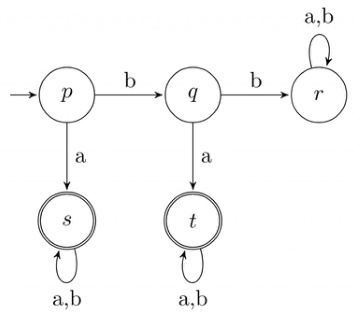

Which of the following finite state machines is a valid minimal  which accepts the same languages as ?

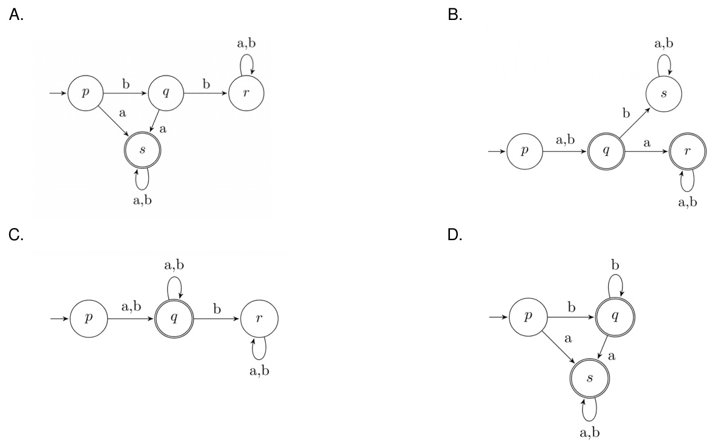

M: 88 N: 68

Consider the DFAs $M$ and $N$ given above. The number of states in a minimal DFA that accept the language $L ( M ) \cap L ( N )$ is

gatecse-2015-set1 theory-of-computation finite-automata easy numerical-answers minimal-state-automata

The number of states in the minimal deterministic finite automaton corresponding to the regular expression $( 0 + 1 ) ^ { * } ( 1 0 )$ is

gatecse-2015-set2 theory-of-computation finite-automata normal numerical-answers minimal-state-automata

# 6.11.18 Minimal State Automata: GATE CSE 2015 Set 3 Question: 18

Let $L$ be the language represented by the regular expression $\Sigma ^ { * } 0 0 1 1 \Sigma ^ { * }$ where $\Sigma = \{ 0 , 1 \}$ . What is the minimum number of states in a DFA that recognizes $\bar { L }$ (complement of $L$ )?

A. B. C. D.

gatecse-2015-set3 theory-of-computation finite-automata normal minimal-state-automata

# Answer key☟

# 6.11.19 Minimal State Automata: GATE CSE 2016 Set 2 Question: 16

The number of states in the minimum sized DFA that accepts the language defined by the regular expression.

$$
( 0 + 1 ) ^ { * } ( 0 + 1 ) ( 0 + 1 ) ^ { * }
$$

gatecse-2016-set2 theory-of-computation finite-automata normal numerical-answers minimal-state-autom

Let $N$ be an NFA with $\scriptstyle n$ states. Let $k$ be the number of states of a minimal DFA which is equivalent to $N$ Which one of the following is necessarily true?

A. $k \geq 2 ^ { n }$ $\mathtt { B } . \mathtt { \nabla } k \geq n$ $\mathsf { C } . \ k \le n ^ { 2 }$ D. gatecse-2018 theory-of-computation minimal-state-automata normal one-mark

Let $\Sigma$ be the set of all bijections from $\{ 1 , \ldots , 5 \}$ to $\{ 1 , \ldots , 5 \}$ , where  denotes the identity function, i.e. $i d ( j ) = j , \forall j$ . Let denote composition on functions. For a string $x = x _ { 1 } x _ { 2 } \ldots x _ { n } \in \Sigma ^ { n } , n \geq 0$ , let $\pi ( x ) = x _ { 1 } \circ x _ { 2 } \circ \cdot \cdot \cdot \circ x _ { n }$ . Consider the language $L = \{ x \in \Sigma ^ { * } \mid \pi ( x ) = i d \}$ . The minimum number of states in any DFA accepting $L$ is

gatecse-2019 numerical-answers theory-of-computation finite-automata minimal-state-automata difficult two-marks

Consider the language $L$ over the alphabet $\{ 0 , 1 \}$ , given below:

$$
L = \left\{ w \in \{ 0 , 1 \} ^ { * } \mid w \mathrm { { d o e s \ n o t \ c o n t a i n t h r e e \ o r m o r e \ c o n s e c u t i v e 1 \ s } } \right\} .
$$

The minimum number of states in a Deterministic Finite-State Automaton for $L$ is

gatecse-2023 theory-of-computation minimal-state-automata numerical-answers two-marks

# 6.11.25 Minimal State Automata: GATE IT 2008 Question: 6

Let $N$ be an NFA with $\scriptstyle n$ states and let $M$ be the minimized DFA with m states recognizing the same language. Which of the following in NECESSARILY true?

A. $m \leq 2 ^ { n }$ $\begin{array} { l } { { \mathsf { B . } n \leq m } } \\ { { \mathsf { D . } m = 2 ^ { n } } } \end{array}$ C. $M$ has one accept state gateit-2008 theory-of-computation finite-automata normal minimal-state-automata

# Answer key☟

# 6.12 Non Determinism (6)

✍ Practice Test: Test 1 (6Q)

In which of the cases stated below is the following statement true?   
"For every non-deterministic machine $M _ { 1 }$ there exists an equivalent deterministic machine $M _ { 2 }$ recognizing the same language". A. $M _ { 1 }$ is non-deterministic finite automaton.   
B. $M _ { 1 }$ is non-deterministic PDA.   
C. $M _ { 1 }$ is a non-deterministic Turing machine.   
D. For no machines $M _ { 1 }$ and $M _ { 2 }$ , the above statement true.

Which of the following conversions is not possible (algorithmically)?

A. Regular grammar to context free grammar   
B. Non-deterministic FSA to deterministic FSA   
C. Non-deterministic PDA to deterministic PDA   
D. Non-deterministic Turing machine to deterministic Turing machine

gate1994 theory-of-computation easy non-determinism

Answer key☟

# 6.12.3 Non Determinism: GATE CSE 1998 Question: 1.11

Regarding the power of recognition of languages, which of the following statements is false?

A. The non-deterministic finite-state automata are equivalent to deterministic finite-state automata.   
B. Non-deterministic Push-down automata are equivalent to deterministic Push-down automata.   
C. Non-deterministic Turing machines are equivalent to deterministic Turing machines.   
D. Multi-tape Turing machines are available are equivalent to Single-tape Turing machines.

gate1998 theory-of-computation easy non-determinism

Let $N _ { f }$ and denote the classes of languages accepted by non-deterministic finite automata and nondeterministic push-down automata, respectively. Let and denote the classes of languages accepted by deterministic finite automata and deterministic push-down automata respectively. Which one of the following is TRUE?

A. $D _ { f } \subset N _ { f }$ and $D _ { p } \subset N _ { p }$ $\begin{array} { r } { \mathsf { B . ~ } D _ { f } \subset N _ { f } \mathrm { ~ a n d ~ } D _ { p } = N _ { p } } \\ { \mathsf { D . ~ } D _ { f } = N _ { f } \mathrm { ~ a n d ~ } D _ { p } \subset N _ { p } } \end{array}$ C. $D _ { f } = N _ { f }$ and $D _ { p } = N _ { p }$

gatecse-2005 theory-of-computation easy non-determinism

# Answer key☟

Which of the following pairs have DIFFERENT expressive power?

A. Deterministic finite automata (DFA) and Non-deterministic finite automata (NFA) B. Deterministic push down automata (DPDA) and Non-deterministic push down automata (NPDA) C. Deterministic single tape Turing machine and Non-deterministic single tape Turing machine D. Single tape Turing machine and multi-tape Turing machine

gatecse-2011 theory-of-computation easy non-determinism

Answer key☟

Let $\Sigma = \{ 1 , 2 , 3 , 4 \}$ . For $\ b { x } \in \Sigma ^ { * }$ , l $\operatorname { e t } \operatorname { p r o d } ( x )$ be the product of symbols in $x$ modulo 7. We take $\mathbf { p r o d } ( \epsilon ) \stackrel { - } { = } 1$ , where $\epsilon$ is the null string.

For example, $\operatorname { p r o d } ( 1 2 4 ) = ( 1 \times 2 \times 4 ) \bmod { 7 } = 1 .$

The number of states in a minimum state DFA for $L$ is (Answer in integer)

gatecse2025-set2 theory-of-computation finite-automata number-of-states numerical-answers two-marks

Let $M$ be a nondeterministic finite automaton (NFA) with  states over a finite alphabet.

Which of the following options CANNOT be the number of states in the minimal deterministic finite automaton (DFA) that is equivalent to ?

A. B. 65 C. 1 D. 128 gatecse-2026-set1 theory-of-computation finite-automata number-of-states multiple-selects one-mark

For $\Sigma = \{ a , b \}$ , let us consider the regular language $L = \{ x \mid x = a ^ { 2 + 3 k } \mathrm { o r } x = b ^ { 1 0 + 1 2 k } , k \geq 0 \} .$ Which one of the following can be a pumping length (the constant guaranteed by the pumping lemma) for $\bar { L }$ ?

A. B. C. D.

gatecse-2019 theory-of-computation pumping-lemma one-mark

A language $L$ satisfies the Pumping Lemma for regular languages, and also the Pumping Lemma for context-free languages. Which of the following statements about $L$ is TRUE?

A. $L$ is necessarily a regular language.   
B. $L$ is necessarily a context-free language, but not necessarily a regular language. C. $L$ is necessarily a non-regular language.   
D. None of the above

specification of the transitions $\delta$ . Complete the specification. The top of the stack is assumed to be at the right end of the string representing stack contents.

1. $\delta ( q _ { 1 } , a , \perp ) = \{ ( q _ { 1 } , \perp a ) \}$   
2. $\delta ( q _ { 1 } , b , \bot ) = \bar { \{ ( q _ { 1 } , \bot b ) \} }$   
3. $\delta ( q _ { 1 } , a , a ) = \{ ( q _ { 1 } , a a ) \}$   
4. $\delta ( q _ { 1 } , b , a ) = \{ ( q _ { 1 } , a b ) \}$   
5. $\delta ( q _ { 1 } , a , b ) = \{ ( q _ { 1 } , b a ) \}$   
6. $\delta ( q _ { 1 } , b , b ) = \{ ( q _ { 1 } , b b ) \}$   
7. $\delta ( q _ { 1 } , a , a ) = \{ ( \dots , \dots ) \}$   
8. $\delta ( q _ { 1 } , b , b ) = \{ ( \dots , \dots ) \}$   
9. $\delta ( q _ { 2 } , a , a ) = \{ ( q _ { 2 } , \epsilon ) \}$   
10. $\delta ( q _ { 2 } , b , b ) = \{ ( q _ { 2 } , \epsilon ) \}$   
11. $\delta ( q _ { 2 } , \epsilon , \perp ) = \bar { \{ ( q _ { 2 } , \epsilon ) \} }$

Which of the following languages over $\{ a , b , c \}$ is accepted by a deterministic pushdown automata?

A. $\{ w c w ^ { R } \mid w \in \{ a , b \} ^ { * } \}$ B. $\{ w w ^ { R } | w \in \{ a , b , c \} ^ { * } \}$ C. $\{ a ^ { n } b ^ { n } c ^ { n } | n \geq 0 \}$ D. $\{ w \mid w$ is a palindrome over $\{ a , b , c \} \}$ Note : is the string obtained by reversing $^ { \prime } w ^ { \prime }$ .

# Answer key☟

Let ${ \cal M } = ( \{ q _ { 0 } , q _ { 1 } \} , \{ 0 , 1 \} , \{ z _ { 0 } , X \} , \delta , q _ { 0 } , z _ { 0 } , \phi )$ be a Pushdown automation where $\delta$ is given by $\begin{array} { r l } & { \delta ( q _ { 0 } , 1 , z _ { 0 } ) = \{ ( q _ { 0 } , X z _ { 0 } ) \} } \\ & { \delta ( q _ { 0 } , \epsilon , z _ { 0 } ) = \{ ( q _ { 0 } , \epsilon ) \} } \\ & { \delta ( q _ { 0 } , 1 , X ) = \{ ( q _ { 0 } , X X ) \} } \\ & { \delta ( q _ { 1 } , 1 , X ) = \{ ( q _ { 1 } , \epsilon ) \} } \\ & { \delta ( q _ { 0 } , 0 , X ) = \{ ( q _ { 1 } , X ) \} } \\ & { \delta ( q _ { 0 } , 0 , z _ { 0 } ) = \{ ( q _ { 0 } , z _ { 0 } ) \} } \end{array}$

a. What is the language accepted by this PDA by empty stack? b. Describe informally the working of the PDA

A push down automation (pda) is given in the following extended notation of finite state diagram:

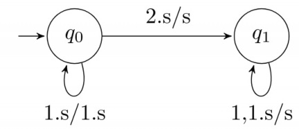

The nodes denote the states while the edges denote the moves of the pda. The edge labels are of the form $d$ , $\mathbf { \boldsymbol { s } } / s ^ { \prime }$ where d is the input symbol read and $s , s ^ { \prime }$ are the stack contents before and after the move. For example the edge labeled $1 , s / 1 . s$ denotes the move from state $q _ { 0 }$ to $q _ { 0 }$ in which the input symbol is read and pushed to the stack.

A. Introduce two edges with appropriate labels in the above diagram so that the resulting pda accepts the language $\{ x 2 x ^ { R } \mid x \in \{ 0 , 1 \} ^ { * }$ ， $x ^ { R }$ denotes reverse of $\mathbf { x } \}$ , by empty stack.   
B. Describe a non-deterministic pda with three states in the above notation that accept the language $\{ 0 ^ { n } 1 ^ { m } \mid n \leq m \leq 2 n \}$ by empty stack

Give a deterministic PDA for the language $L = \{ a ^ { n } c b ^ { 2 n } \mid n \geq 1 \}$ over the alphabet $\Sigma = \{ a , b , c \}$ . Specify the acceptance state.

gatecse-2001 theory-of-computation normal pushdown-automata descriptive

# 6.15.7 Pushdown Automata: GATE CSE 2009 Question: 16, ISRO2017-12

Which one of the following is FALSE?

A. There is a unique minimal DFA for every regular language   
B. Every NFA can be converted to an equivalent PDA.   
C. Complement of every context-free language is recursive.   
D. Every nondeterministic PDA can be converted to an equivalent deterministic PDA.

gatecse-2009 theory-of-computation easy isro2017 pushdown-automata

Consider the NPDA

$$
\langle Q = \left\{ q _ { 0 } , q _ { 1 } , q _ { 2 } \right\} , \Sigma = \left\{ 0 , 1 \right\} , \Gamma = \left\{ 0 , 1 , \bot \right\} , \delta , q _ { 0 } , \bot , F = \left\{ q _ { 2 } \right\} \rangle
$$

where (as per usual convention) $Q$ is the set of states, $\Sigma$ is the input alphabet, $\Gamma$ is the stack alphabet, $\delta$ is the state transition function $q _ { 0 }$ is the initial state, $\perp$ is the initial stack symbol, and $F$ is the set of accepting states. The state transition is as follows:

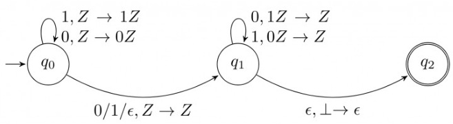

Which one of the following sequences must follow the string so that the overall string is accepted by the

automaton?

A. 10110 B. 10010 C. 01010 D. 01001

gatecse-2015-set1 theory-of-computation pushdown-automata normal

Consider the transition diagram of a PDA given below with input alphabet $\Sigma = \{ a , b \}$ and stack alphabe $\Gamma = \{ X , Z \}$ . $Z$ is the initial stack symbol. Let $L$ denote the language accepted by the PDA

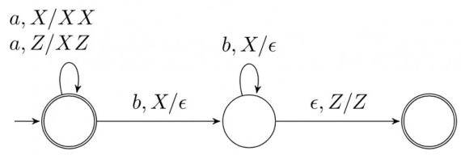

Which one of the following is TRUE?

A. $L = \{ a ^ { n } b ^ { n } \mid n \geq 0 \}$ and is not accepted by any finite automata B. $L = \{ a ^ { n } | n \geq 0 \} \cup \{ a ^ { n } b ^ { n } | n \geq 0 \}$ and is not accepted by any deterministic PDA C. $L$ is not accepted by any Turing machine that halts on every input D. $L = \{ a ^ { n } \mid n \geq 0 \} \cup \{ a ^ { n } b ^ { n } \mid n \geq 0 \}$ and is deterministic context-free

In a pushdown automaton $P = ( Q , \Sigma , \Gamma , \delta , q _ { 0 } , F )$ , a transition of the form,

$$
\textcircled { p } \xrightarrow { a , X  Y } \textcircled { q }
$$

where $p , q \in Q , a \in \Sigma \cup \{ \epsilon \}$ , and $X , Y \in \Gamma \cup \{ \epsilon \}$ , represents

$$
( q , Y ) \in \delta ( p , a , X ) .
$$

Consider the following pushdown automaton over the input alphabet $\Sigma = \{ a , b \}$ and stack alphabet $\Gamma = \{ \# , A \}$ .

$$
\begin{array} { c c } { { a , \varepsilon  A } } & { { b , A  \varepsilon } } \\ { { \mathrm { s t a r t }  \displaystyle \binom { q _ { 0 } } { q _ { 0 } } ^ { \varepsilon , \varepsilon  \# } \displaystyle \binom { \bigwedge } { q _ { 1 } } ^ { \varepsilon , \varepsilon  \varepsilon } \displaystyle \binom { \bigwedge } { q _ { 2 } } ^ { \varepsilon , A  A } \displaystyle \binom { q _ { 3 } } { \binom { q _ { 3 } } { q _ { 0 } } } } } \end{array}
$$

The number of strings of length accepted by the above pushdown automaton is

gatecse-2021-set1 theory-of-computation pushdown-automata numerical-answers two-marks

# Answer key☟

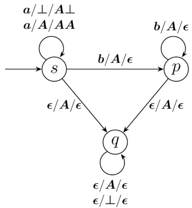

Which one of the following options correctly describes the language accepted by

$$
\begin{array} { l } { \{ a ^ { m } b ^ { n } \mid 1 \leq m \mathrm { a n d } n < m \} } \\ { \{ a ^ { m } b ^ { n } \mid 0 \leq n \leq m \} } \\ { \{ a ^ { m } b ^ { n } \mid 0 \leq m \mathrm { a n d } 0 \leq n \} } \\ { \{ a ^ { m } \mid 0 \leq m \} \cup \{ b ^ { n } \mid \overline { { 0 } } \leq n \} } \end{array}
$$

Let $M = ( K , \Sigma , \Gamma , \Delta , s , F )$ be a pushdown automaton, where   
$K = ( s , f ) , F = \{ f \} , \Sigma = \{ a , b \} , \Gamma = \{ a \}$ and $- \tilde  \{ ( ( \boldsymbol { s } , \boldsymbol { a } , \boldsymbol { \epsilon } ) , ( \boldsymbol { s } , \boldsymbol { a } ) \} , ( ( \boldsymbol { s } , \boldsymbol { \dot { b } } , \boldsymbol { \epsilon } ) , \tilde  \{ ( \boldsymbol { s } , \boldsymbol { a } ) \} , ( \boldsymbol { s } , \boldsymbol { a } ) \} , ( ( \boldsymbol { \dot { s } } , \boldsymbol { a } , \boldsymbol { a } ) , ( \boldsymbol { f } , \boldsymbol { \epsilon } ) ) , ( ( \boldsymbol { f } , \boldsymbol { a } , \boldsymbol { a } ) , ( \boldsymbol { f } , \boldsymbol { \epsilon } ) ) , ( ( \boldsymbol { f } , \boldsymbol { b } , \boldsymbol { a } ) , ( \boldsymbol { f } , \boldsymbol { \epsilon } ) ) \} .$   
Which one of the following strings is not a member of $L ( M ) ?$

A. aaa B. aabab C. baaba D. bab

gateit-2004 theory-of-computation pushdown-automata normal

# Answer key☟

Let $P$ be a non-deterministic push-down automaton (NPDA) with exactly one state, $q$ , and exactly symbol, $Z$ , in its stack alphabet. State $q$ is both the starting as well as the accepting state of the PDA. The stack is initialized with one $Z$ before the start of the operation of the PDA. Let the input alphabet of the PDA be $\Sigma$ . Let $L ( P )$ be the language accepted by the PDA by reading a string and reaching its accepting state. Let $N ( P )$ be the language accepted by the PDA by reading a string and emptying its stack.

Which of the following statements is TRUE?

A. $L ( P )$ is necessarily $\Sigma ^ { * }$ but $N ( P )$ is not necessarily $\Sigma ^ { * }$ . B. $N ( P )$ is necessarily $\Sigma ^ { * }$ but $L ( P )$ is not necessarily $\Sigma ^ { * }$ . C. Both $\dot { L } ( P )$ and $N ( P )$ are necessarily $\Sigma ^ { * }$ . D. Neither $\dot { \boldsymbol { L } } ( \boldsymbol { P } )$ nor $N ( P )$ are necessarily $\Sigma ^ { * }$

Consider the pushdown automaton (PDA) below which runs over the input alphabet $( a , b , c )$ . It has stack alphabet $\{ Z _ { 0 } , X \}$ where $Z _ { 0 }$ is the bottom-of-stack marker. The set of states of the PDA is $( s , t , u , f \}$ where $\pmb { s }$ is the start state and $f$ is the final state. The PDA accepts by final state. The transitions of the PDA given below are depicted in a standard manner. For example, the transition $( s , b , X ) \to ( t , X Z _ { 0 } )$ means that if the PDA is in state $\pmb { s }$ and the symbol on the top of the stack is $X$ , then it can read b from the input and move to state $t$ after popping the top of stack and pushing the symbols $Z _ { 0 }$ and $X$ (in that order) on the stack.

$$
\begin{array} { l } { { ( s , a , Z _ { 0 } ) \to ( s , X X Z _ { 0 } ) } } \\ { { ( s , \epsilon , Z _ { 0 } ) \to ( f , \epsilon ) } } \\ { { ( s , a , X ) \to ( s , X X X ) } } \\ { { ( s , b , X ) \to ( t , \epsilon ) } } \\ { { ( t , b , X ) \to ( t , \epsilon ) } } \\ { { ( t , c , X ) \to ( u , \epsilon ) } } \\ { { ( u , c , X ) \to ( u , \epsilon ) } } \\ { { ( u , \epsilon , Z _ { 0 } ) \to ( f , \epsilon ) } } \end{array}
$$

The language accepted by the PDA is

A. $\begin{array} { l } { \{ a ^ { l } b ^ { m } c ^ { n } | l = m = n \} } \\ { \{ a ^ { l } b ^ { m } c ^ { n } | 2 l = m + n \} } \end{array}$ B. $\begin{array} { l } { { \{ a ^ { l } b ^ { m } c ^ { n } | l = m \} } } \\ { { \{ a ^ { l } b ^ { m } c ^ { n } | m = n \} } } \end{array}$   
C. D.

gateit-2006 theo ry-of-computation pushdown-automata normal

# Answer key☟

# 6.16

# Recursive and Recursively Enumerable Languages (16)

✍ Practice Tests: Test 1 (15Q) Test 2 (11Q)

# 6.16.1 Recursive and Recursively Enumerable Languages: GATE CSE 1990 Question: 3-vi

Recursive languages are:

A. A proper superset of context free B. Always recognizable by pushdown languages. automata. C. Also called type languages. D. Recognizable by Turing machines.

gate1990 normal theory-of-computation turing-machine recursive-and-recursively-enumerable-languages multiple-selects

# Answer key☟

# 6.16.2 Recursive and Recursively Enumerable Languages: GATE CSE 2003 Question: 13

Nobody knows yet if $P = N P$ . Consider the language $L$ defined as follows.

$$
L = { \left\{ \begin{array} { l l } { ( 0 + 1 ) ^ { * } } & { { \mathrm { ~ i f ~ } } P = N P } \\ { \phi } & { o t h e r w i s e } \end{array} \right. }
$$

Which of the following statements is true?

A. $L$ is recursive   
B. $L$ is recursively enumerable but not recursive   
C. $L$ is not recursively enumerable   
D. Whether $L$ is recursively enumerable or not will be known after we find out if $P = N P$

If the strings of a language $L$ can be effectively enumerated in lexicographic (i.e., alphabetic) order, which o the following statements is true?

A. $L$ is necessarily finite B. $L$ is regular but not necessarily finite C. $L$ is context free but not necessarily regular D. $L$ is recursive but not necessarily context-free theory-of-computation gatecse-2003 normal recursive-and-recursively-enumerable-languages

# 6.16.4 Recursive and Recursively Enumerable Languages: GATE CSE 2003 Question: 54

Define languages $L _ { 0 }$ and $L _ { 1 }$ as follows

$$
\begin{array} { r l } & { \cdot \ L _ { 0 } = \{ \langle M , w , 0 \rangle \mid M \mathrm { h a l t s ~ o n } w \} } \\ & { \cdot \ L _ { 1 } = \{ \langle M , w , 1 \rangle \mid M \mathrm { d o e s ~ n o t h a l t s ~ o n } w \} } \end{array}
$$

Here $\langle M , w , i \rangle$ is a triplet, whose first component $M$ is an encoding of a Turing Machine, second component $w$ is a string, and third component $_ i$ is a bit.

Let $L = L _ { 0 } \cup L _ { 1 }$ . Which of the following is true?

A. $L$ is recursively enumerable, but $L ^ { \prime }$ is not B. $L ^ { \prime }$ is recursively enumerable, but $L$ is not C. Both $L$ and $L ^ { \prime }$ are recursive D. Neither $L$ nor $L ^ { \prime }$ is recursively enumerable

$L _ { 1 }$ is a recursively enumerable language over $\Sigma$ . An algorithm $A$ effectively enumerates its words as $\omega _ { 1 } , \omega _ { 2 } , \omega _ { 3 }$ ） ： Define another language $L _ { 2 }$ over $\Sigma \cup \{ \# \}$ as $\{ w _ { i } \# w _ { j } \mid w _ { i } , w _ { j } \in L _ { 1 } , i < j \}$ . Here # is new symbol. Consider the following assertions.

· $S _ { 1 } : L _ { 1 }$ is recursive implies $L _ { 2 }$ is recursive $S _ { 2 } : L _ { 2 }$ is recursive implies $L _ { 1 }$ is recursive

Which of the following statements is true?

A. Both $S _ { 1 }$ and $S _ { 2 }$ are true B. $S _ { 1 }$ is true but $S _ { 2 }$ is not necessarily true C. $S _ { 2 }$ is true but $S _ { 1 }$ is not necessarily true D. Neither is necessarily true

gatecse-2004 theory-of-computation recursive-and-recursively-enumerable-languages difficul

# 6.16.6 Recursive and Recursively Enumerable Languages: GATE CSE 2005 Question: 56

Let $L _ { 1 }$ be a recursive language, and let $L _ { 2 }$ be a recursively enumerable but not a recursive language. Which one of the following is TRUE?

A. ${ L } _ { 1 } ^ { \prime }$ is recursive and $L _ { 2 } ^ { \mathbf { \sigma } }$ ' is recursively enumerable B. $L _ { 1 } { ' }$ is recursive and $L _ { 2 } ^ { \prime }$ is not recursively enumerable C. $L _ { 1 } \mathbf { \cdot }$ and $L _ { 2 } ^ { \phantom { \dagger } }$ are recursively enumerable D. $L _ { 1 } { ' }$ is recursively enumerable and $L _ { 2 } ^ { \mathbf { \sigma } }$ is recursive

# If $L$ and $\overline { { L } }$ are recursively enumerable then $L$ is

A. regular B. context-free C. context-sensitive D. recursive

atecse-2008 theory-of-computation easy isro2016 recursive-and-recursively-enumerable-language

# Answer key☟

# 6.16.8 Recursive and Recursively Enumerable Languages: GATE CSE 2008 Question: 48

Which of the following statements is false?

A. Every NFA can be converted to an equivalent DFA   
B. Every non-deterministic Turing machine can be converted to an equivalent deterministic Turing machine   
C. Every regular language is also a context-free language   
D. Every subset of a recursively enumerable set is recursive

gatecse-2008 theory-of-computation easy recursive-and-recursively-enumerable-languages

# 6.16.9 Recursive and Recursively Enumerable Languages: GATE CSE 2010 Question: 17

Let $L _ { 1 }$ be the recursive language. Let $L _ { 2 }$ and $L _ { 3 }$ be languages that are recursively enumerable but no recursive. Which of the following statements is not necessarily true?

A. $L _ { 2 } - L _ { 1 }$ is recursively enumerable.   
B. $L _ { 1 } - L _ { 3 }$ is recursively enumerable.   
C. $L _ { 2 } \cap L _ { 3 }$ is recursively enumerable.   
D. $L _ { 2 } \cup L _ { 3 }$ is recursively enumerable.

gatecse-2010 theory-of-computation recursive-and-recursively-enumerable-languages decidability normal

# 6.16.10 Recursive and Recursively Enumerable Languages: GATE CSE 2014 Set 1 Question: 35

Let $L$ be a language and $\bar { L }$ be its complement. Which one of the following is NOT a viable possibility?

A. Neither $L$ nor $\bar { L }$ is recursively enumerable $( r . e . )$ .   
B. One of $L$ and $\bar { L }$ is r.e. but not recursive; the other is not r.e.   
C. Both $L$ and $\bar { L }$ are r.e. but not recursive.   
D. Both $L$ and $\bar { L }$ are recursive.

gatecse-2014-set1 theory-of-computation easy recursive-and-recursively-enumerable-languages

# 6.16.11 Recursive and Recursively Enumerable Languages: GATE CSE 2014 Set 2 Question: 16

Let $A \leq _ { m } B$ denotes that language $A$ is mapping reducible (also known as many-to-one reducible) to language $B$ . Which one of the following is FALSE?

A. If $A \leq _ { m } B$ and $B$ is recursive then $A$ is recursive.   
B. If $A \leq _ { m } B$ and $A$ is undecidable then $B$ is undecidable.   
C. If $A \leq _ { m } B$ and $B$ is recursively enumerable then $A$ is recursively enumerable.   
D. If $A \leq _ { m } B$ and $B$ is not recursively enumerable then $A$ is not recursively enumerable.

Let $\langle M \rangle$ be the encoding of a Turing machine as a string over $\Sigma = \{ 0 , 1 \}$ . Let

$L = \{ \langle M \rangle \mid M$ isa Turing machine that accepts a string of length 2014} .

Then $L$ is:

A. decidable and recursively B. undecidable but recursively enumerable enumerable   
C. undecidable and not recursively D. decidable but not recursively enumerable enumerable

gatecse-2014-set2 theory-of-computation recursive-and-recursively-enumerable-languages normal

# 6.16.13 Recursive and Recursively Enumerable Languages: GATE CSE 2015 Set 1 Question: 3

For any two languages $L _ { 1 }$ and $L _ { 2 }$ such that $L _ { 1 }$ is context-free and $L _ { 2 }$ is recursively enumerable but no recursive, which of the following is/are necessarily true?

I. ${ { \bar { L } } _ { 1 } }$ Complement o $L _ { 1 }$ ) is recursive II. $\bar { L } _ { 2 }$ Complement of $L _ { 2 }$ ) is recursive III. $\bar { L } _ { 1 }$ is context-free IV. $\bar { L } _ { 1 } \cup L _ { 2 }$ is recursively enumerable

A. I only B. III only C. III and IV only D. and IV only gatecse-2015-set1 theory-of-computation recursive-and-recursively-enumerable-languages normal

# 6.16.14 Recursive and Recursively Enumerable Languages: GATE CSE 2016 Set 2 Question: 44

Consider the following languages.

· $L _ { 1 } = \{ \langle M \rangle$ $M$ takes at least 2016 steps on some input}, · ${ L _ { 2 } = \{ \langle M \rangle } $ $M$ takes at least 2016 steps on all inputs} and · $L _ { 3 } = \{ \langle M \rangle \mid M \mathrm { a c c e p t s } \epsilon \} _ { }$ ,

where for each Turing machine $M$ ， $\langle M \rangle$ denotes a specific encoding of $M$ . Which one of the following is TRUE?

A. $L _ { 1 }$ is recursive and $\scriptstyle L _ { 2 } , L _ { 3 }$ are not recursive B. $L _ { 2 }$ is recursive and $\scriptstyle L _ { 1 } , L _ { 3 }$ are not recursive C. $\scriptstyle { L _ { 1 } , L _ { 2 } }$ are recursive and $L _ { 3 }$ is not recursive D. $ { L _ { 1 } } ,  { L _ { 2 } } ,  { L _ { 3 } }$ are recursive

gatecse-2016-set2 theory-of-computation recursive-and-recursively-enumerable-languages

# 6.16.15 Recursive and Recursively Enumerable Languages: GATE CSE 2021 Set 1 Question: 12

Let $\langle M \rangle$ denote an encoding of an automaton $M$ . Suppose that $\Sigma = \{ 0 , 1 \}$ . Which of the following languages is/are  recursive?

A. $L = \{ \langle M \rangle$ $M$ is a  such that $L ( M ) = \emptyset \}$ B. $L = \{ \langle M \rangle$ $M$ is a such that ${ \cal L } ( M ) = \Sigma ^ { * } \}$ C. $L = \{ \langle M \rangle$ $M$ is a such that $L ( M ) = \emptyset \}$ D. $L = \left\{ \langle M \rangle \mid M \right.$ is a such that ${ \cal L } ( M ) = \Sigma ^ { * } \}$

For a Turing machine $M$ , $\langle M \rangle$ denotes an encoding of $M$ . Consider the following two languages.

$$
\begin{array} { r l } & { L _ { 1 } = \left\{ \langle M \rangle \mid M \mathrm { ~ t a k e s ~ m o r e ~ t h a n ~ 2 0 2 1 ~ s t e p s ~ o n ~ a l l ~ i n p u t s } \right\} } \\ & { L _ { 2 } = \left\{ \langle M \rangle \mid M \mathrm { ~ t a k e s ~ m o r e ~ t h a n ~ 2 0 2 1 ~ s t e p s ~ o n ~ s o m e ~ i n p u t } \right\} } \end{array}
$$

Which one of the following options is correct?

A. Both $L _ { 1 }$ and $L _ { 2 }$ are decidable B. $L _ { 1 }$ is decidable and L2 is undecidable C. $L _ { 1 }$ is undecidable and $L _ { 2 }$ is D. Both $L _ { 1 }$ and $L _ { 2 }$ are undecidable decidable

gatecse-2021-set1 theory-of-computation recursive-and-recursively-enumerable-languages decidability easy two-marks

# Answer key☟

Consider three decision problems $P _ { 1 }$ , $P _ { 2 }$ and $P _ { 3 }$ . It is known that $P _ { 1 }$ is decidable and $P _ { 2 }$ is undecidable. Which one of the following is TRUE?

A. $P _ { 3 }$ is decidable if $P _ { 1 }$ is reducible to $P _ { 3 }$ B. $P _ { 3 }$ is undecidable if $P _ { 3 }$ is reducible to $P _ { 2 }$ C. $P _ { 3 }$ is undecidable if $P _ { 2 }$ is reducible to $P _ { 3 }$ D. $P _ { 3 }$ is decidable if $P _ { 3 }$ is reducible to $P _ { 2 }$ 's complement gatecse-2005 theory-of-computation decidability normal reduction

Let $X$ be a recursive language and $Y$ be a recursively enumerable but not recursive language. Let and $Z$ be two languages such that $\bar { Y }$ reduces to $W$ , and $Z$ reduces to $\overline { { \boldsymbol X } }$ (reduction means the standard manyone reduction). Which one of the following statements is TRUE?

A. $W$ can be recursively enumerable and $Z$ is recursive.   
B. can be recursive and $Z$ is recursively enumerable.   
C. is not recursively enumerable and $Z$ is recursive.   
D. is not recursively enumerable and $Z$ is not recursive.

gatecse-2016-set1 theory-of-computation easy recursive-and-recursively-enumerable-languages reduction

Let $r = 1 ( 1 + 0 ) ^ { * }$ ， $s = 1 1 ^ { * } 0$ and $t = 1 ^ { * } 0$ be three regular expressions. Which one of the following is true?

A. $L ( s ) \subseteq L ( r )$ and $L ( s ) \subseteq L ( t )$ B. $L ( r ) \subseteq L ( s )$ and $L ( s ) \subseteq L ( t )$ C. $L ( s ) \subseteq L ( t )$ and $L ( s ) \subseteq L ( r )$ D. $L ( t ) \subseteq L ( s )$ and $L ( s ) \subseteq L ( r )$ E. None of the above

gate1991 theory-of-computation regular-expression normal multiple-selects

# Answer key☟

Which of the following regular expression identities is/are TRUE?

A. $r ^ { ( ^ { * } ) } = r ^ { * }$ B. $( r ^ { * } s ^ { * } ) = ( r + s ) ^ { * }$   
C. $( r + s ) ^ { * } = r ^ { * } + s ^ { * }$ D. $r ^ { * } s ^ { * } = r ^ { * } + s ^ { * }$

The regular expression for the language recognized by the finite state automaton of figure is

gate1994 theory-of-computation finite-automata regular-expression easy fill-in-the-blanks

# Answer key☟

In some programming language, an identifier is permitted to be a letter followed by any number of letters or digits. If $L$ and $D$ denote the sets of letters and digits respectively, which of the following expressions defines an identifier?

A. $( L + D ) ^ { + }$ ${ \sf B } . \ ( L . D ) ^ { * }$ $\mathsf { C } . \ L ( L + D ) ^ { * }$ D. L(L.D)\*

gate1995 theory-of-computation regular-expression easy isro2017

# Answer key☟

Which two of the following four regular expressions are equivalent? $ { \varepsilon }$ is the empty string).

i. $( 0 0 ) ^ { * } ( \varepsilon + 0 )$ ii. (00)\*   
iii. ${ \dot { 0 } } ^ { * }$   
iv. $0 ( 0 0 ) ^ { * }$

A. (i) and (ii) B. (ii) and (iii) C. (i) and (iii) D. (iii) and (iv)

gate1996 theory-of-computation regular-expression easy

# Answer key☟

# The string 1101 does not belong to the set represented by

A. $1 1 0 ^ { * } ( 0 + 1 )$ $\begin{array} { c } { { \mathsf { B . ~ 1 } ( 0 + 1 ) ^ { \ast } \mathsf { 1 0 1 } } } \\ { { \mathsf { D . ~ ( 0 0 + ( 1 1 ) ^ { \ast } 0 ) ^ { \ast } } } } \end{array}$ C. $( 1 0 ) ^ { * } ( 0 1 ) ^ { * } ( 0 0 + 1 1 ) ^ { * }$   
gate1998 theory-of-computation regular-expression easy multiple-selects

If the regular set $A$ is represented by $A = ( 0 1 + 1 ) ^ { * }$ and the regular set $B$ is represented b $B = \left( ( 0 1 ) ^ { * } \mathbf { 1 } ^ { * } \right) ^ { * }$ , which of the following is true?

A. $A \subset B$ $\begin{array} { c } { { \mathsf { B . } B \subset A } } \\ { { \mathsf { D . } A = B } } \end{array}$ C. $A$ and $B$ are incomparable

gate1998 theory-of-computation regular-expression normal

Give a regular expression for the set of binary strings where every  is immediately followed by exactly $k$ 's and preceded by at least $k$ ’s ( $k$ is a fixed integer)

gate1998 theory-of-computation regular-expression easy descriptive

Let $\boldsymbol { S }$ and $T$ be languages over $\Sigma = \{ a , b \}$ represented by the regular expressions $( a + b ^ { * } ) ^ { * }$ and $( a + b ) ^ { * }$ , respectively. Which of the following is true?

A. $S \subset T$ $\mathsf { B } . \mathsf { \Delta } T \subset S \qquad \mathsf { C } . \mathsf { \Delta } S = T$ [ $) . \ S \cap T = \phi$

gatecse-2000 theory-of-computation regular-expression easy

Answer key☟

The regular expression $0 ^ { * } ( 1 0 ^ { * } ) ^ { * }$ denotes the same set as

A. $( 1 ^ { * } 0 ) ^ { * } 1 ^ { * }$ B. $0 + ( 0 + 1 0 ) ^ { * }$ C. $( 0 + 1 ) ^ { * } 1 0 ( 0 + 1 ) ^ { * }$ D. None of the above

gatecse-2003 theory-of-computation regular-expression easy

Let $L = \{ w \in ( 0 + 1 ) ^ { * } \mid w$ has even number of $| 1 s \}$ . i.e., $L$ is the set of all the bit strings with even numbers of s. Which one of the regular expressions below represents $L$ ?

A. $( 0 ^ { * } 1 0 ^ { * } 1 ) ^ { * }$ B. $0 ^ { * } ( 1 0 ^ { * } 1 0 ^ { * } ) ^ { * }$   
C. $\dot { 0 } ^ { * } ( 1 0 ^ { * } 1 \dot { ) } { ^ * 0 ^ { * } }$ D. $0 ^ { * } \mathrm { { 1 } ( 1 0 ^ { * } 1 ) ^ { * } 1 0 ^ { * } }$

gatecse-2010 theory-of-computation regular-expression normal

Answer key☟

# 6.18.15 Regular Expression: GATE CSE 2014 Set 1 Question: 36

Which of the regular expressions given below represent the following DFA?

I. $0 ^ { * } 1 ( 1 + 0 0 ^ { * } 1 ) ^ { * }$   
II. $0 ^ { * } 1 ^ { * } 1 + 1 1 ^ { * } 0 ^ { * } 1$   
III. $( 0 + 1 ) ^ { * } 1$

A. and II only B. and III only C. II and III only D. I, II and III

gatecse-2014-set1 theory-of-computation regular-expression finite-automata easy

The length of the shortest string NOT in the language (over $\Sigma = \{ a , b \} )$ of the following regular expression is

$$
a ^ { * } b ^ { * } ( b a ) ^ { * } a ^ { * }
$$

gatecse-2014-set3 theory-of-computation regular-expression numerical-answers easy

Which one of the following regular expressions represents the language: the set of all binary strings having two consecutive 's and two consecutive 's?

A. $( 0 + 1 ) ^ { * } 0 0 1 1 ( 0 + 1 ) ^ { * } + ( 0 + 1 ) ^ { * } 1 1 0 0 ( 0 + 1 ) ^ { * }$ B. $( 0 + 1 ) ^ { * } ( 0 0 ( 0 + 1 ) ^ { * } 1 1 + 1 1 ( 0 + 1 ) ^ { * } 0 0 ) ( 0 + 1 ) ^ { * }$   
C. $( 0 + 1 ) ^ { * } 0 0 ( 0 + 1 ) ^ { * } + ( 0 + 1 ) ^ { * } 1 1 ( 0 + 1 ) ^ { * }$ D. $0 0 ( 0 + 1 ) ^ { * } 1 1 + 1 1 ( 0 + 1 ) ^ { * } 0 0$

gatecse-2016-set1 theory-of-computation regular-expression normal

# 6.18.18 Regular Expression: GATE CSE 2020 Question: 7

Which one of the following regular expressions represents the set of all binary strings with an odd number o $\boldsymbol { 1 ^ { \prime } { \mathsf { s } } ? }$

A. $( ( 0 + 1 ) ^ { * } 1 ( 0 + 1 ) ^ { * } 1 ) ^ { * } 1 0 ^ { * }$ $\begin{array} { c } { { \mathsf { B . } \ ( 0 ^ { \ast } 1 0 ^ { \ast } 1 0 ^ { \ast } ) ^ { \ast } 0 ^ { \ast } 1 } } \\ { { \mathsf { D . } \ ( 0 ^ { \ast } 1 0 ^ { \ast } 1 0 ^ { \ast } ) ^ { \ast } 1 0 ^ { \ast } } } \end{array}$   
C. ${ \mathrm { i } } 0 ^ { * } ( 0 ^ { * } { \mathrm { i } } 0 ^ { * } { \mathrm { i } } 0 ^ { * } ) ^ { * }$

gatecse-2020 regular-expression normal theory-of-computation one-mark

Answer key☟

three? Assume that the string $\epsilon$ is divisible by three.

A. $( 0 + 1 ( 0 1 ^ { * } 0 ) ^ { * } 1 ) ^ { * }$ B. $( 0 + 1 1 + 1 0 ( 1 + 0 0 ) ^ { * } 0 1 ) ^ { * }$   
C. $( 0 ^ { * } ( { \bf 1 } ( \dot { 0 } { \bf 1 ^ { * } } 0 ) ^ { * } { \bf 1 } ) ^ { * } ) ^ { * }$ D. $( 0 + 1 1 + 1 1 ( 1 + 0 0 ) ^ { * } 0 0 ) ^ { * }$

gatecse-2021-set2 multiple-selects theory-of-computation regular-expression two-marks

Which one of the following regular expressions correctly represents the language of the finite automaton given below?

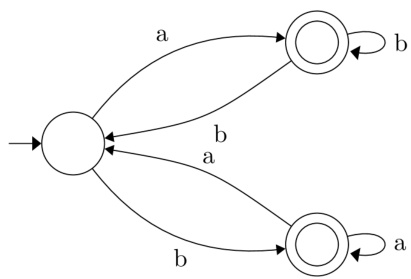

A. $a b ^ { * } b a b ^ { * } + b a ^ { * } a b a ^ { * }$   
B. $( a b ^ { * } b ) ^ { * } a b ^ { * } + ( b a ^ { * } a ) ^ { * } b a ^ { * }$   
C. $( a b ^ { * } b + b a ^ { * } a ) ^ { * } ( a ^ { * } + b ^ { * } )$   
D. $( b a ^ { * } a + a b ^ { * } b ) ^ { * } ( a b ^ { * } + b a ^ { * } )$

Consider the Deterministic Finite-state Automaton ( ) $A$ shown below. The runs on the alphabet $\{ 0 , 1 \}$ , and has the set of states $\{ s , p , q , r \}$ , with $s$ being the start state and $p$ being the only final state.

Which one of the following regular expressions correctly describes the language accepted by $\mathcal { A } ?$

A. ${ \bf 1 } ( 0 ^ { * } 1 1 ) ^ { * }$ ${ \mathsf { B } } . \ 0 ( 0 + 1 ) ^ { * }$ $\mathsf { C } . \ 1 ( 0 + 1 1 ) ^ { * }$ D. 1(110\*)\*

gatecse-2023 theory-of-computation regular-expression one-mark gatecse-2023 theory-of-computation regular-expression one-mark

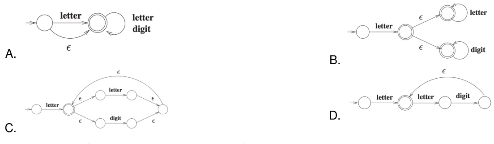

Consider the following two regular expressions over the alphabet $\{ 0 , 1 \}$ :

$$
\begin{array} { l } { r = 0 ^ { * } + 1 ^ { * } } \\ { s = 0 1 ^ { * } + 1 0 ^ { * } } \end{array}
$$

The total number of strings of length less than or equal to , which are neither in $r$ nor in $\pmb { s }$ , is gatecse-2024-set1 numerical-answers theory-of-computation regular-expression two-marks $\textsf { L e t } L _ { 1 }$ be the language represented by the regular expression $b ^ { * } a b ^ { * } ( a b ^ { * } a b ^ { * } ) ^ { * }$ and $L _ { 2 } = \{ w \in ( a + b ) ^ { * } | | w | \leq 4 \}$ , where $| w |$ denotes the length of string $w$ . The number of strings in which are also in $L _ { 1 }$ is

gatecse-2024-set2 numerical-answers theory-of-computation regular-expression two-marks

Which one of the following regular expressions is NOT equivalent to the regular expression $( a + b + c ) ^ { * } ?$

A. $( a ^ { * } + b ^ { * } + c ^ { * } ) ^ { * }$ $\begin{array} { l } { { { \sf B } . \ ( a ^ { * } b ^ { * } c ^ { * } ) ^ { * } } } \\ { { { \sf D } . \ ( a ^ { * } b ^ { * } + c ^ { * } ) ^ { * } } } \end{array}$   
C. $( ( a b ) ^ { * } + c ^ { * } ) ^ { * }$

gateit-2004 theory-of-computation regular-expression normal

Which of the following statements is TRUE about the regular expression $0 1 ^ { * } 0 ?$

A. It represents a finite set of finite strings.   
B. It represents an infinite set of finite strings.   
C. It represents a finite set of infinite strings.   
D. It represents an infinite set of infinite strings.

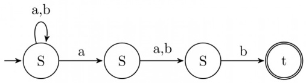

$( a + b ) ^ { * } a ( a + b ) b$ B. (abb)\* $( a + b ) ^ { * } a ( a + b ) ^ { * } b ( a + b ) ^ { * }$ D. (a+b)\* gateit-2006 theory-of-computation regular-expression normal

# Answer key☟

Consider the regular expression $R = ( a + b ) ^ { * } ( a a + b b ) ( a + b ) ^ { * }$

Which one of the regular expressions given below defines the same language as defined by the regular expression $R$ ?

A. $( a ( b a ) ^ { * } + b ( a b ) ^ { * } ) ( a + b ) ^ { + }$   
B. $( a ( b a ) ^ { * } + b ( a b ) ^ { * } ) ^ { * } ( a + b ) ^ { * }$   
C. $( a ( b a ) ^ { * } ( a + b b ) + b ( a b ) ^ { * } ( b + a a ) ) ( a + b ) ^ { * }$   
D. $( a ( b a ) ^ { * } ( a + b b ) + b ( a b ) ^ { * } ( b + a a ) ) ( a + b ) ^ { + }$

gateit-2007 theory-of-computation regular-expression normal

Which of the following regular expressions describes the language over $\{ 0 , 1 \}$ consisting of strings that contain exactly two 's?

A. $( 0 + 1 ) ^ { * } 1 1 ( 0 + 1 ) ^ { * }$ B. 0\* 110\* C. $0 ^ { * } 1 0 ^ { * } \mathrm { { 1 0 ^ { * } } }$ D $( 0 + 1 ) ^ { * } 1 ( 0 + 1 ) ^ { * } 1 ( 0 + 1 ) ^ { * }$

gateit-2008 theory-of-computation regular-expression easy

# Answer key☟

Is the language generated by the grammar regular? If so, give a regular expression for it, else prove otherwise

G: $\begin{array} { l } { \circ S  a B } \\ { \circ B  b C } \\ { \circ C  x B } \\ { \circ C  c } \end{array}$

gate1990 descriptive theory-of-computation regular-language regular-grammar

Which one of the following choices precisely represents the strings in $X _ { 0 } ?$

A. $1 0 ( 0 ^ { * } + ( 1 0 ) ^ { * } ) 1$ B. $1 0 ( 0 ^ { * } + ( 1 0 ) ^ { * } ) ^ { * } 1$   
C. ${ \bf 1 } ( 0 + { \bf 1 0 } ) ^ { * } { \bf 1 }$ D. $1 0 ( 0 + 1 0 ) ^ { * } 1 + 1 1 0 ( 0 + 1 0 ) ^ { * } 1$

gatecse-2015-set2 theory-of-computation regular-grammar normal

Consider the regular grammar below

$$
\begin{array} { l } { { S  b S \mid a A \mid \epsilon } } \\ { { A  a S \mid b A } } \end{array}
$$

The Myhill-Nerode equivalence classes for the language generated by the grammar are

A. $\{ w \in ( a + b ) ^ { * }$ $\# a ( w )$ is even) and{w ∈ (a+b)\* #a(w) is odd} B. $\{ w \in ( a + b ) ^ { * }$ $\# a ( w )$ is even) and $\{ w \in ( a + b ) ^ { * }$ #b(w) is odd} C. $\{ w \in ( a + b ) ^ { * }$ $\# a ( w ) = \# b ( w ) \mathrm { a n d }$ {w e (a+6)\* #a(w) ? #6(w)} D. {},{wa wE (a +b)\*and{wb $w \in ( a + b ) ^ { * } \}$

✍ Practice Tests: Test 1 (15Q) Test 2 (15Q) Test 3 (15Q) Test 4 (7Q)

State whether the following statements are TRUE or FALSE: Regularity is preserved under the operation of string reversal.

gate1987 theory-of-computation regular-language true-false

State whether the following statements are TRUE or FALSE:

All subsets of regular sets are regular.

gate1987 theory-of-computation regular-language true-false

Let $R _ { 1 }$ and $R _ { 2 }$ be regular sets defined over the alphabet $\Sigma$ Then:

A. $R _ { 1 } \cap R _ { 2 }$ is not regular. B. $R _ { 1 } \cup R _ { 2 }$ is regular.   
C. $\Sigma ^ { * } - R _ { 1 }$ is regular. D. $R _ { 1 } ^ { * }$ is not regular.

gate1990 normal theory- of -computation regular-language multiple-selects

Let $\Sigma = \{ 0 , 1 \} , L = \Sigma ^ { * }$ and $R = \{ 0 ^ { n } 1 ^ { n } \mid n > 0 \}$ then the languages $L \cup R$ and $R$ are respectively

A. regular, regular B. not regular, regular C. regular, not regular D. not regular, not regular

gate1995 theory-of-computation easy regular-language

# 6.20.6 Regular Language: GATE CSE 1996 Question: 1.10

Let $L \subseteq \Sigma ^ { * }$ where $\Sigma = \{ a , b \}$ . Which of the following is true?

a. $L = \{ x \mid x$ has an equal number of $a$ 's and $b \mathbf { \bar { s } } \mathbf  \}$ is regular b. $L = \{ a ^ { n } b ^ { n } \mid n \geq 1 \}$ is regular c. $L = \hat  \{ x \mid x \$ has more number of a's than $\displaystyle b _ { \mathbf { \nu } } \mathbf { s } \mathbf  \}$ is regular d. $L = \{ a ^ { m } b ^ { n } \mid m \geq 1 , n \geq 1 \}$ is regular

gate1996 theory-of-computation normal regular-language

Which of the following statements is false?

a. Every finite subset of a non-regular set is regular b. Every subset of a regular set is regular c. Every finite subset of a regular set is regular d. The intersection of two regular sets is regular

gate1998 theory-of-computation easy regular-language

A. Given that $A$ is regular and $( A \cup B )$ is regular, does it follow that $B$ is necessarily regular? Justify your answer. B. Given two finite automata $M 1 , M 2$ , outline an algorithm to decide if $L ( M 1 ) \subset L ( M 2 )$ . (note: strict subset)

gate1999 theory-of-computation normal regular-language descriptive

Consider the following two statements:

$S _ { 1 } : \{ 0 ^ { 2 n } \mid n \geq 1 \}$ is a regular language $S _ { 2 } : \{ 0 ^ { m } 1 ^ { n } 0 ^ { m + n } | m \geq 1 { \mathrm { ~ a n d } } n \geq 1 \}$ is a regular language

Which of the following statement is correct?

A. Only $S _ { 1 }$ is correct B. Only $S _ { 2 }$ is correct C. Both $S _ { 1 }$ and $S _ { 2 }$ are correct D. None of $S _ { 1 }$ and $S _ { 2 }$ is correct

gatecse-2001 theory-of-computation easy regular-language

Answer key☟

Consider the following languages:

$$
\begin{array} { r l } & { L 1 = \{ w w \mid w \in \{ a , b \} ^ { * } \} } \\ & { L 2 = \{ w w ^ { R } \mid w \in \{ a , b \} ^ { * } , w ^ { R } \mathrm { i s t h e r e v e r s e o f w } \} } \\ & { L 3 = \{ 0 ^ { 2 i } \mid \mathrm { i i s a n i n t e g e r } \} } \\ & { L 4 = \left\{ 0 ^ { i ^ { 2 } } \mid \mathrm { i i s a n i n t e g e r } \right\} } \end{array}
$$

Which of the languages are regular?

A. Only $L 1$ and $L 2$ B. Only $\scriptstyle { L 2 , L 3 }$ and $L 4$ C. Only $L 3$ and L4 D. Only

gatecse-2001 theory-of-computation normal regular-language

# Answer key☟

Which of the following languages is regular?

A. $\{ w w ^ { R } | w \in \{ 0 , 1 \} ^ { + } \}$ B. $\{ w w ^ { R } x \ : | \ : x , w \in \{ 0 , 1 \} ^ { + } \}$   
C. $\{ w x w ^ { R } \mid x , w \in \{ 0 , 1 \} ^ { + } \}$ D. $\{ x w w ^ { R } \mid x , w \in \{ 0 , 1 \} ^ { + } \}$

gatecse-2007 theory-of-computation normal regular-language

Answer key☟

Which of the following is TRUE?

A. Every subset of a regular set is regular B. Every finite subset of a non-regular set is regular C. The union of two non-regular sets is not regular D. Infinite union of finite sets is regular

gatecse-2007 theor y-of-computation easy regular-language

IV. $\{ x c y \mid x , y , \in \{ a , b \} ^ { * } \}$

A. I and IV only B. and III only C. only D. IV only

gatecse-2008 theory-of-computation normal regular-language

Let $P$ be a regular language and $Q$ be a context-free language such that $Q \subseteq P$ . (For example, let $P$ be the language represented by the regular expression $p ^ { * } q ^ { * }$ and $Q$ be $\{ p ^ { n } q ^ { n } | n \in N \}$ . Then which of the following is ALWAYS regular?

A. $P \cap Q$ ${ \mathsf { B } } . \ P - Q$ $\complement . \ \Sigma ^ { * } - P$ D.

gatecse-2011 theory-of-computation easy regular-language

# Answer key☟

Given the language $L = \{ a b , a a , b a a \}$ , which of the following strings are in $L ^ { * } ?$

1. abaabaaabaa   
2. aaaabaaaa   
3. baaaaabaaaab   
4. baaaaabaa

A. B. 2, 3 and 4 C. 1,2 and 4 D. 1, 3 and 4

gatecse-2012 theory-of-computation easy regular-language

Consider the languages $\scriptstyle L _ { 1 } = \phi$ and ${ \cal L } _ { 2 } = \{ a \}$ . Which one of the following represents $L _ { 1 } L _ { 2 } { ^ * \cup L _ { 1 } }  ^ *$ ?

A. B. $\phi$ C. $a ^ { * }$ D. {e,a}

gatecse-2013 theory-of-computation normal regular-language

Answer key☟

# 6.20.18 Regular Language: GATE CSE 2014 Set 1 Question: 15

Which one of the following is TRUE?

A. The language $L = \{ a ^ { n } b ^ { n } \mid n \geq 0 \}$ is regular.   
B. The language $L = \{ a ^ { n } \mid n$ is prime $\}$ is regular.   
C. The language ${ \cal L } = \{ w \vert w$ has $3 k + 1 b \prime s$ for some $k \in N$ with $\Sigma = \{ a , b \} \}$ is regular.   
D. The language $L = \{ w w \mid w \in \Sigma ^ { * }$ with $\Sigma = \{ 0 , 1 \} \}$ is regular.

gatecse-2014-set1 theory-of-computation regular-language normal

L e $\mathfrak { t } L _ { 1 } = \{ w \in \{ 0 , 1 \} ^ { * } \mid w$ has at least as many occurrences of $( \mathbf { 1 1 0 } ) ^ { \prime } \mathbf { s }$ as $( 0 1 1 ) ^ { \prime } { \bf s } \}$ . Let $L _ { 2 } = \{ w \in \{ 0 , 1 \} ^ { * } \mid w$ has at least as many occurrences of $( 0 0 0 ) ^ { \prime } { \bf s }$ as $( \mathrm { { i } 1 1 ) ^ { \prime } { s } } \}$ . Which one of the following is TRUE?

A. $L _ { 1 }$ is regular but not $L _ { 2 }$ B. $L _ { 2 }$ is regular but not $L _ { 1 }$ C. Both $L _ { 1 }$ and $L _ { 2 }$ are regular D. Neither $L _ { 1 }$ nor $L _ { 2 }$ are regular

gatecse-2014-set2 theory-of-computation normal regular-language

# 6.20.21 Regular Language: GATE CSE 2015 Set 2 Question: 51

Which of the following is/are regular languages?

$\begin{array} { r l } & { L _ { 1 } : \left\{ w x w ^ { R } \mid w , x \in \{ a , b \} ^ { * } \mathrm { ~ a n d ~ } | u \right. } \\ & { L _ { 2 } : \left\{ a ^ { n } b ^ { m } \mid m \neq n \mathrm { a n d } m , n \geq 0 \right\} } \\ & { L _ { 3 } : \left\{ a ^ { p } b ^ { q } c ^ { r } \mid p , q , r \geq 0 \right\} } \end{array}$ $| w | , | x | > 0 \}$ ， $w ^ { R }$ is the reverse of string w

A. $L _ { 1 }$ and $L _ { 3 }$ only B. $L _ { 2 }$ only C. $L _ { 2 }$ and $L _ { 3 }$ only D. $L _ { 3 }$ only

gatecse-2015-set2 theory-of-computation normal regular-language

# Answer key☟

# 6.20.22 Regular Language: GATE CSE 2016 Set 2 Question: 17

Language $L _ { 1 }$ is defined by the grammar: $S _ { 1 } \to a S _ { 1 } b \mid \varepsilon$ Language $L _ { 2 }$ is defined by the grammar: $S _ { 2 }  a b S _ { 2 } \mid \varepsilon$ Consider the following statements:

P: $L _ { 1 }$ is regular $\mathsf { Q } \colon \pmb { { L } } _ { 2 }$ is regular

Which one of the following is TRUE?

A. Both $P$ and $Q$ are true. B. $P$ is true and $Q$ is false.   
C. $P$ is false and $Q$ is true. D. Both $P$ and $Q$ are false.

gatecse-2016-set2 theory-of-computation easy regular-language

Given a language $L$ , define $L ^ { i }$ as follows:

$$
L ^ { 0 } = \{ \varepsilon \}
$$

$$
L ^ { i } = L ^ { i - 1 } \bullet L { \mathrm { f o r ~ a l l ~ } } I > 0
$$

The order of a language $L$ is defined as the smallest $k$ such that $L ^ { k } = L ^ { k + 1 }$ . Consider the language $L _ { 1 }$ over alphabet accepted by the following automaton.

The order of $L _ { 1 }$ is

If $L$ is a regular language over $\Sigma = \{ a , b \}$ , which one of the following languages is NOT regular?

A. L $L ^ { R } = \{ x y \mid x \in L , y ^ { R } \in L \}$ B. $\{ w w ^ { R } \mid w \in L \}$ C. Prefix $\langle L \rangle = \{ { \overline { { x } } } \in \Sigma ^ { * } \mid \exists y \in \Sigma ^ { * } { \mathrm { s u c h ~ t h a t } } x y \in L \}$ D. Suffix $( L ) = \left\{ y \in \Sigma ^ { * } \mid \exists x \in \Sigma ^ { * } \right.$ such that $x y \in L \}$ gatecse-2019 theory-of-computation regular-language one-mark

Consider the following language.

$L = \{ x \in \{ a , b \} ^ { * } \vert$ number of $\mathbf { \Delta } a _ { \mathbf { \alpha } } ^ { \mathrm { { : } } }$ s in $x$ divisible by but not divisible by The minimum number of states in DFA that accepts $L$ is

gatecse-2020 numerical-answers theory-of-computation regular-language two-marks

Consider the following statements.

I. If $L _ { 1 } \cup L _ { 2 }$ is regular, then both $L _ { 1 }$ and $L _ { 2 }$ must be regular.   
II. The class of regular languages is closed under infinite union.

Which of the above statements is/are TRUE?

A. Ⅰ only B. Ⅱ only C. Both and Ⅱ D. Neither nor Ⅱ gatecse-2020 theory-of-computation regular-language one-mark

# 6.20.27 Regular Language: GATE CSE 2021 Set 2 Question: 9

Let $L \subseteq \{ 0 , 1 \} ^ { * }$ be an arbitrary regular language accepted by a minimal with $k$ states. Which one of the following languages must necessarily be accepted by a minimal with $k$ states?

A. $L - \{ 0 1 \}$ ${ \mathsf { B } } . ~ L \cup \{ 0 1 \}$ $\mathsf { C } . \ \{ 0 , 1 \} ^ { * } { - \cal L }$ D. L·L

gatecse-2021-set2 theory-of-computation finite-automata regular-language one-mark

# 6.20.28 Regular Language: GATE CSE 2024 Set 1 Question: 13

​Let $\scriptstyle L _ { 1 } , L _ { 2 }$ be two regular languages and a language which is not regular. Which of the following statements is/are always TRUE?

A. $L _ { 1 } = L _ { 2 }$ if and only if B. $L _ { 1 } \cup L _ { 3 }$ is not regula ${ \cal L } _ { 1 } \cap \overline { { { \cal L } _ { 2 } } } = \phi$ C. is not regular D. $\overline { { L _ { 1 } } } \cup \overline { { L _ { 2 } } }$ is regular gatecse-2024-set1 multiple-selects theory-of-computation regular-language one-mark

A regular language $L$ is accepted by a non-deterministic finite automaton (NFA) with $n$ states. Which of the following statement(s) is/are FALSE?

A. $L$ may have an accepting NFA with $< n$ states.   
B. $L$ may have an accepting DFA with $< n$ states.   
C. There exists a DFA with $\leq 2 ^ { n }$ states that accepts $L$ .   
D. Every DFA that accepts $L$ has $> 2 ^ { n }$ states.

gatecse2025-set1 theory-of-computation finite-automata regular-language multiple-selects one-mark

Consider the following two languages over the alphabet $\{ a , b \}$ :

$$
\begin{array} { r l } & { L _ { 1 } = \{ \alpha \beta \alpha \mid \alpha \in \{ a , b \} ^ { + } \mathrm { A N D } \beta \in \{ a , b \} ^ { + } \} } \\ & { L _ { 2 } = \{ \alpha \beta \alpha \mid \alpha \in \{ a \} ^ { + } \mathrm { A N D } \beta \in \{ a , b \} ^ { + } \} } \end{array}
$$

Which ONE of the following statements is CORRECT?

A. Both $L _ { 1 }$ and $L _ { 2 }$ are regular languages.   
B. $L _ { 1 }$ is a regular language but $L _ { 2 }$ is not a regular language.   
C. $L _ { 1 }$ is not a regular language but $L _ { 2 }$ is a regular language.   
D. Neither $L _ { 1 }$ nor $L _ { 2 }$ is a regular language.

gatecse2025-set1 theory-of-computation regular-language two-marks

Let $\Sigma = \{ a , b , c \}$ . For $\boldsymbol { x } \in \Sigma ^ { * }$ , and $\alpha \in \Sigma$ , let $\# _ { \alpha } ( x )$ denote the number of occurrences of $\alpha$ in $x$ . Which one or more of the following option(s) define(s) regular language(s)?

A. $\{ a ^ { m } b ^ { n } \mid m , n \geq 0 \}$   
B. $\{ a , b \} ^ { * } \cap \{ a ^ { m } b ^ { n } c ^ { m - n } \mid m \geq n \geq 0 \}$   
C. $\{ w \mid \stackrel { \textstyle } { w } \in \{ a , b \} ^ { * } , \# _ { a } ( w ) \equiv 2 ( \mathrm { m o d } 7 )$ , and $\# _ { b } ( w ) \equiv 3 ( \bmod { 9 } ) \}$ D. $\{ w \mid w \in \{ a , b \} ^ { * }$ $\# a ( w ) \equiv 2 ( \bmod { 7 } )$ , and $\# _ { a } ( w ) = \# b ( w ) \}$

gatecse2025-set2 theory-of-computation regular-language multiple-selects two-marks