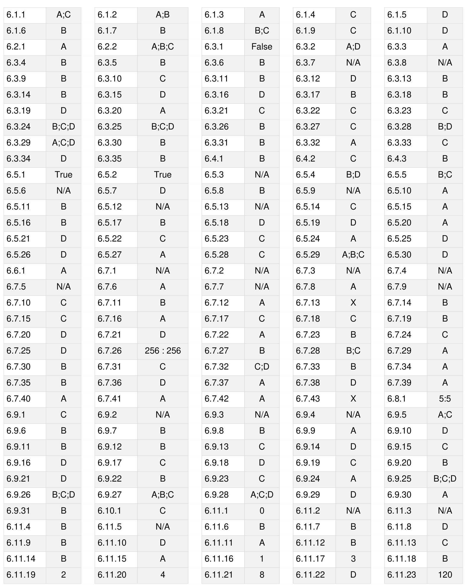
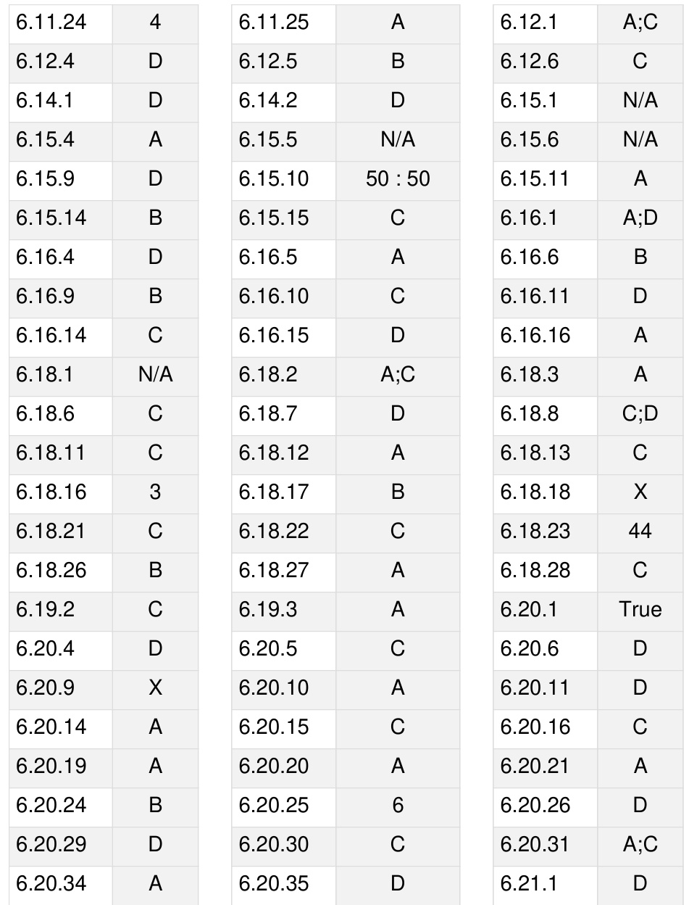
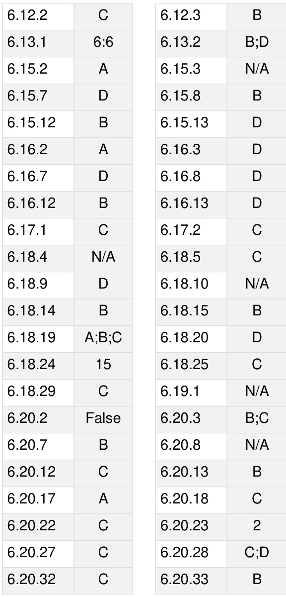

Let $L$ be a regular language. Consider the constructions on $L$ below:

I. repeat $( L ) = \{ w w \mid w \in L \}$ II. prefix $( L ) = \{ u \mid \exists v : u v \in L \}$ III. suffix $( L ) = \{ v \mid \exists u : u v \in L \}$ IV. half $( L ) = \{ u | \exists v : | v | = | u | { \mathrm { a n d } } u v \in L \}$

Which of the constructions could lead to a non-regular language?

A. Both I and IV B. Only C. Only IV D. Both II and III

gateit-2006 theory-of-computation normal regular-language

Let $L$ be a regular language. Consider the constructions on $L$ below:

I. ${ \mathrm { r e p e a t } } ( L ) = \{ w w \mid w \in L \}$ II. $\mathrm { p r e f i x } ( L ) = \{ u \mid \exists v : u v \in L \}$ III. SU $\mathbf { f f i x } ( L ) = \{ v \mid \exists u : u v \in L \}$ IV. ${ \mathrm { h a l f } } ( L ) = \{ u \mid \exists v : | v | = | u | { \mathrm { a n d } } u v \in L \}$

Which of the constructions could lead to a non-regular language?

a. Both and IV b. Only c. Only IV d. Both II and III

Which choice of $L$ is best suited to support your answer above?

A. $( a + b ) ^ { * }$ B. {e,a,ab,bab} C. $( a b ) ^ { * }$ D. $\{ a ^ { n } b ^ { n } | \stackrel { . } { n } \geq 0 \}$ gateit-2006 theory-of-computation normal regular-language

# Answer key☟

Which of the following languages is (are) non-regular?

· $L _ { 1 } = \{ 0 ^ { m } 1 ^ { n } \mid 0 \leq m \leq n \leq 1 0 0 0 0 \}$   
${ \cal L } _ { 2 } = \{ w \vert w$ reads the same forward and backward   
${ \cal L } _ { 3 } = \dot { \{ w \in \{ 0 , 1 \} ^ { * } \mid \tau } $ contains an even number of 0's and an even number of 1's

A. $L _ { 2 }$ and $L _ { 3 }$ only B. $L _ { 1 }$ and $L _ { 2 }$ only C. $\scriptstyle { L _ { 3 } }$ only D. $L _ { 2 }$ only

gateit-2008 theory-of-computation normal regular-language

# Answer key☟

# Answer Keys

