# Table of Contents

able of Contents   
Contributors 123   
1 CO & Architecture (251) Topic-wise Key Concepts 13 Addressing Modes 13 Important Formulas Concepts 131313 Key Properties & Identities Common Pitfalls Standard Problem-Solving Techniques 13 Average Memory Access Time (AMAT) Important Formulas Concepts 14 Key Properties & Identities 14 Common Pitfalls 14 Standard Problem-Solving Techniques 14 Bit Vector 4 Important Formulas & Concepts 14 Key Properties Common Pitfalls Identities 14 Standard Problem-Solving Techniques 14 CISC RISC Architecture 4 Important Formulas Concepts 14 Key Properties & Identities 15 Common Pitfalls 15 Standard Problem-Solving Techniques 15 Cache Memory 15 Important Formulas Key Properties & Identities Concepts 15 Common Pitfalls 16 Standard Problem-Solving Techniques 16 Conflict Misses 6 Important Formulas Concepts 16 Key Properties Identities 16 Common Pitfalls Standard Problem-Solving Techniques 16 Control Unit 16 Important Formulas Concepts 16 Key Properties & Identities 16 Common Pitfalls 16 Standard Problem-Solving Techniques 17 DMA (Direct Memory Access) 17 Important Formulas Concepts Key Properties & Identities 17 Common Pitfalls 17 Standard Problem-Solving Techniques 17 DRAM (Dynamic Random Access Memory) Important Formulas Concepts Key Properties & Identities 17 Common Pitfalls 17 Standard Problem-Solving Techniques 17 Data Dependency Important Formulas Concepts 17 Key Properties Identities 18 Common Pitfalls 18 Standard Problem-Solving Techniques 18 Data Hazards 18 Important Formulas Key Properties Identities Concepts 18 Common Pitfalls 18 Standard Problem-Solving Techniques Data Path 18 Important Formulas Concepts 1818191919 Key Properties & Identities Common Pitfalls Standard Problem-Solving Techniques Direct Mapping   
Common Pitfalls 19191919191920   
Standard Problem-Solving Techniques   
Dirty Bit   
Important Formulas Concepts   
Key Properties & Identities   
Common Pitfalls   
DiSstkandard Problem-Solving Techniques Important Formulas Concepts 202020202020202021212121212121212121212222222222222222222222222323232323232323232323242424242424242424242525252525252525   
Key Properties & Identities   
Common Pitfalls   
Standard Problem-Solving Techniques   
Hazards   
Important Formulas Concepts   
Key Properties & Identities   
Common Pitfalls   
Standard Problem-Solving Techniques   
IO Handling   
Important Formulas Concepts   
Key Properties & Identities   
Common Pitfalls   
Standard Problem-Solving Techniques   
Instruction Execution   
Important Formulas Concepts   
Key Properties & Identities   
Common Pitfalls   
Standard Problem-Solving Techniques   
Instruction Format   
Important Formulas Concepts   
Key Properties & Identities   
Common Pitfalls   
Standard Problem-Solving Techniques   
Instruction Set Architecture (ISA)   
Important Formulas Concepts   
Key Properties & Identities   
Common Pitfalls   
Standard Problem-Solving Techniques   
Interrupts   
Important Formulas Concepts   
Key Properties & Identities   
Common Pitfalls   
Standard Problem-Solving Techniques   
Machine Instruction   
Important Formulas Concepts   
Key Properties & Identities   
Common Pitfalls   
Standard Problem-Solving Techniques   
Memory Interfacing   
Important Formulas Concepts   
Key Properties & Identities   
Common Pitfalls   
Standard Problem-Solving Techniques   
Microprogramming   
Important Formulas Concepts   
Key Properties & Identities   
Common Pitfalls   
Standard Problem-Solving Techniques   
Pipelining   
Important Formulas Concepts   
Key Properties & Identities   
Common Pitfalls   
Standard Problem-Solving Techniques   
Runtime Environment   
Important Formulas Concepts   
Key Properties & Identities   
Common Pitfalls   
Standard Problem-Solving Techniques   
Key Properties Identities 262626262626262626262727272727283233343450   
Common Pitfalls   
Standard Problem-Solving Techniques   
Stall   
Important Formulas Concepts   
Key Properties & Identities   
Common Pitfalls   
Standard Problem-Solving Techniques   
Virtual Memory   
Important Formulas & Concepts   
Key Properties & Identities   
Common Pitfalls   
Standard Problem-Solving Techniques   
Quick Formula Reference   
Important Tips for GATE   
1.1 Addressing Modes (19)   
1.2 Average Memory Access Time (3)   
1.3 Bit Vector (1)   
1.4 CISC RISC Architecture (2)   
1.5 Cache Memory (69)   
1.6 Conflict Misses (1)   
1.7 Control Unit (1) 5050525253   
1.8 DMA (8)   
1.9 DRAM (1)   
1.10 Data Dependency (4)   
1.11 Data Hazards (1)   
1.12 Data Path (7) 54   
1.13 Direct Mapping (5) 57   
1.14 Disk (1) 58   
1.15 Hazards (1) 58   
1.16 IO Handling (8) 59   
1.17 Instruction Execution (7) 61   
1.18 Instruction Format (11) 62   
1.19 Instruction Set Architecture (1) 65   
1.20 Interrupts (10) 65   
1.21 Machine Instruction (21) 67   
1.22 Memory Interfacing (6) 756   
.23 Microprogramming (12)   
1.24 Pipelining (39) 80909192   
1.25 Runtime Environment (2)   
1.26 Speedup (6)   
1.27 Stall (1)   
1.28 Virtual Memory (3) 923   
Answer Keys   
2 Computer Networks (226) 95   
Topic-wise Key Concepts 95   
Application Layer Protocols 959595959596969696   
Key Concepts:   
Common Pitfalls and Problem-Solving Techniques:   
ARP (Address Resolution Protocol)   
Key Concepts:   
Common Pitfalls and Problem-Solving Techniques:   
Bit Stuffing   
Key Concepts:   
Common Pitfalls and Problem-Solving Techniques:   
Bridges 969696969696   
Key Concepts:   
Common Pitfalls and Problem-Solving Techniques:   
CRC Polynomial (Cyclic Redundancy Check)   
Important Formulas and Results:   
Key Properties and Identities:

Important Formulas and Results: 979797979798   
Key Properties and Identities:   
Common Pitfalls and Problem-Solving Techniques:   
Channel Utilization   
Important Formulas and Results:   
Common Pitfalls and Problem-Solving Techniques:   
Communication 98   
Key Concepts:   
Common Pitfalls and Problem-Solving Techniques:   
Congestion Control 98   
Key Concepts (TCP): 98   
Common Pitfalls and Problem -Solving Techniques:   
Data Communication 98   
Key Concepts: 99   
Common Pitfalls and Problem-Solving Techniques: 99   
Distance Vector Routing 99   
Key Concepts: 99   
Common Pitfalls and Problem-Solving Techniques: 99   
Error Detection 99   
Key Concepts: 99   
Important Formulas and Results: 99   
Common Pitfalls and Problem-Solving Techniques:   
Ethernet 99   
Key Concepts: 0   
Important Formulas and Results: 100   
Common Pitfalls and Problem-Solving Techniques: 100   
Fragmentation 00   
Important Formulas and Results: 00   
Key Properties and Identities: 00   
Common Pitfalls and Problem-Solving Techniques: 100   
Hamming Code 00   
Important Formulas and Results: 100   
Common Pitfalls and Problem-Solving Techniques: 0   
P Addressing   
Important Formulas and Results (IPv4): 0   
Key Properties and Identities: 101   
Common Pitfalls and Problem-Solving Techniques: 01   
IP Packet 0   
Key Concepts (IPv4 Header Fields): 0   
Common Pitfalls and Problem-Solving Techniques: 101   
ICMP (Internet Control Message Protocol) 02   
Key Concepts: 0   
Common Pitfalls and Problem-Solving Techniques: 02   
LAN Technologies 02   
Key Concepts: 0   
Common Pitfalls and Problem-Solving Techniques: 102   
MAC Protocol (Medium Access Control) 02   
Key Concepts: 02   
Important Formulas and Results:   
Common Pitfalls and Problem- Solving Techniques: 02   
Network Flow 03   
Key Concepts: 103   
Common Pitfalls and Problem-Solving Techniques: 103   
Network Layer 103   
Key Concepts: 03   
Common Pitfalls and Problem-Solving echniq 】   
Network Protocols 03   
Key Concepts: 103   
Common Pitfalls and Problem ing echni 103   
Network Switching 103   
Key Concepts: 104   
Common Pitfalls and Problem-Solving echniq 104   
OSI Model 104   
Key Concepts: 104   
Common Pitfalls and Problem-Solving Techniq 104   
Probability 104   
Key Concepts: 0   
Important Formulas and Results: 104   
Common Pitfalls and Problem-Solving Techniques:   
Pure Aloha 105   
Important Formulas and Results: 105   
Key Properties and Identities: 105   
Common Pitfalls and Problem-Solving echniques 105   
Routing 105   
Key Concepts: 105   
Common Pitfalls and Problem- Solvin echniques: 105   
Routing Protocols 105   
Key Concepts: 05   
Common Pitfalls and Problem -Solving Techniques: 】   
Sliding Window 06   
Important Formulas and Results: 106   
Key Properties and Identities: 106   
Common Pitfalls and Problem-Solving Techniques: 06   
Slotted Aloha 106   
Important Formulas and Results: 106   
Key Properties and Identities: 10   
Common Pitfalls and Problem-Solving Techniques: 1   
Sockets 107   
Key Concepts: 07   
Common Pitfalls and Problem-Solving Techniques: 107   
Stop and Wait 07   
Important Formulas and Results: 107   
Key Properties and Identities: 107   
Common Pitfalls and Problem-Solving echniques: 108   
Subnetting 108   
Important Formulas and Results: 08   
Common Pitfalls and Problem-Solving Techniques: 108   
TCP (Transmission Control Protocol) 108   
Key Concepts: 08   
Important Formulas and Results: 0   
Common Pitfalls and Problem-Solving Techniques: 108   
Token Bucket 08   
Key Concepts: 0   
Important Formulas and Results: 09   
Common Pitfalls and Problem-Solving Techniques: 0   
UDP (User Datagram Protocol) 109   
Key Concepts: 109   
Key Properties and Identities: 09   
Common Pitfalls and Problem-Solving Techniques:   
Wrap Around Time 109   
Important Formulas and Results: 09   
Key Properties and Identities: 11   
Common Pitfalls and Problem-Solving echniques: 11   
Quick Formula Reference 10   
Channe Utilization Throughput:   
Error Detection Correction: 10   
MAC Protocols:   
IP Fragmentation: 1   
IP Addressing & Subnetting: 1   
Sliding Window Sequence Numbers:   
Wrap Around Time: 110   
Important Tips for GATE 10   
2.1 Application Layer Protocols (13)   
2.2 Arp (1) 13   
2.3 Bit Stuffing (2)   
2.4 Bridges (3) 14   
2.5 CRC Polynomial (5) 116   
2.6 CSMA CD (6) 117   
2.7 Channel Utilization (1) 118   
2.8 Communication (4) 118   
2.9 Congestion Control (9) 119   
2.10 Data Communication (1) 121

2.12 Error Detection (8) 125   
2.13 Ethernet (7) 127   
2.14 Fragmentation (5) 129 2.15 Hamming Code (2) 130 2.16 IP Addressing (8) 131 2.17 P Packet (12) 32   
2.18 Icmp (1) 35   
2.19 LAN Technologies (7) 35 2.20 MAC Protocol (4) 36 2.21 Network Flow (4) 2.22 Network Layer (6) 38   
2.23 Network Protocols (11) 139 2.24 Network Switching (4) 2.25 Osi Model (1) 3 2.26 Probability (1) 43   
2.27 Pure Aloha (1) 2.28 Routing (14) 43 2.29 Routing Protocols (1) 48 2.30 Sliding Window (16) 48 2.31 Slotted Aloha (1) 2.32 Sockets (4)   
2.33 Stop and Wait (6)   
2.34 Subnetting (21) 53   
2.35 TCP (20) 5   
2.36 Token Bucket (2) 63 2.37 UDP (4) 63   
2.38 Wrap Around Time (2) 64 Answer Keys 65   
3 Databases (302) 67 Topic-wise Key Concepts 67   
Armstrong Axioms S Formulas/Theorems: 167 Key Properties/Identities: Common Pitfalls: 67 Problem-Solving Techniques: B Tree Formulas/Theorems: Key Properties/Identities: 168 Common Pitfalls: 68 Problem -Solving Techniques: 68 Candidate Key 68 Formulas/Theorems: 68 Key Properties/Identities: 68 Common Pitfalls: 68 Problem-Solving Techniques: 68 Conflict Serializable Formulas/ heorems: Key Properties/Identities: 69 Common Pitfalls: Problem-Solving Techniques: 69 Database Design 69 Formulas/Theorems: 69 Key Properties/Identities: 169 Common Pitfalls: 169 Problem -Solving Techniques: Database Normalization 69 Formulas/Theorems: Key Properties/Identities: 70 Common Pitfalls: Problem-Solving Techniques: 70 Database Schema 70 Formulas/T eorems: 170 Key Properties/Identities: 170   
Decomposition 170 Form las/Theorems: 170 Key Properties/Identities: 171 Common Pitfalls: 171 Problem-Solving Techniques: 171   
ER Diagram Form ulas/Theorems: Key Properties/Identities: 171 Common Pitfalls: 171 Problem-Solving Techniques:   
Functional Dependency Formulas/Theorems: Key Prop erties/Identities: Common Pitfalls: Problem-Solving Techniques:   
Indexing Formulas/Theorems: Key Properties/Identities: Common Pitfalls: Problem-Solving Techniques:   
Joins Formulas/Theorems: Key Properties/Identities: Common Pitfalls: Problem-Solving Techniques:   
Multivalued Dependency 4NF Form las/T eorems: Key Properties/Identities: 3 Common Pitfalls: 73 Problem-Solving Techniques:   
Natural Join Formulas/Theorems: Key Properties/Identities: Common Pitfalls: Problem-Solving Techniques:   
Normal Forms Formulas/ heorems: Key Properties/Identities: 74 Common Pitfalls: Problem-Solving Techniques:   
Query 5 Formulas/Theorems: 75 Key Properties/Identities: Common Pitfalls: 75 Problem-Solving Techniques:   
Referential Integrity Formulas/T heorems: Key Properties/Identities: Common Pitfalls: Problem-Solving Techniques:   
Relational Algebra Formulas/Theorems: Key Properties/Identities: Common Pitfalls: Problem-Solving Techniques   
Relational Calculus Formulas/Theorems: 76 Key Properties/Identities: 176 Common Pitfalls: 176 Problem-Solving Techniques 176   
Relational Model Formulas/Theorems: 177 Key Properties/Identities: 177 Common Pitfalls: 177 Problem-Solving Techniques: 177   
SQL 177 Formulas/Theorems: 177

Problem-Solving Common Pitfalls: Techniques: 177 177   
Safe Query   
Formulas/Theorems: 178   
Key Properties/Identities: 178   
Common Pitfalls: 178   
Problem-Solving Techniques: 178   
Super Key 178   
Formulas/Theorems:   
Key Properties/Identities: 178   
Common Pitfalls: 178   
Problem-Solving Techniques: 78   
Timestamp Ordering 78   
Formulas/Theorems:   
Key Properties/Identities:   
Common Pitfalls: 79   
Problem-Solving Techniques: 79   
Transaction and Concurrency   
Formulas/ eorems:   
Key Properties/Identities: 179   
Common Pitfalls: 79   
Problem -Solving Techniques: 7   
Tuple Relational Calculus 79   
Formulas/Theorems: 79   
Properties/Identities: 80   
Common Pitfalls: 80   
Problem-Solving Techniques: 180   
Two Phase Locking Protocol 80   
Formulas/ heorems: 180   
Key Properties/Identities: 180   
Common Pitfalls: 80   
Problem-Solving Techniques: 180   
Quick Formula Reference 180   
Important Tips for GATE 181   
3.1 Armstrong Axioms (1) 181   
3.2 B Tree (32) 182   
3.3 Candidate Key (7) 190   
3.4 Conflict Serializable (12) 91   
3.5 Database Design (1) 95   
3.6 Database Normalization (56) 95   
3.7 Database Schema (1) 208   
3.8 Decomposition (1) 208   
3.9 ER Diagram (12) 209   
3.10 Functional Dependency (3) 212   
3.11 Indexing (15) 13   
3.12 Joins (7) 216   
3.13 Multivalued Dependency 4nf (1) 218   
3.14 Natural Join (3) 18   
3.15 Normal Forms (1) 219   
3.16 Query (3) 219   
3.17 Referential Integrity (6) 221   
3.18 Relational Algebra (33)   
19 Relational Calculus (13)   
3.20 Relational Model (2)   
3.21 SQL (58) 237   
3.22 Safe Query (1) 260   
3.23 Super Key (1) 261   
3.24 Timestamp Ordering (1) 261   
3.25 Transaction and Concurr ency (27) 261   
3.26 Tuple Relational Calculus (3) 7   
3.27 Two Phase Locking Protocol (1) 272   
Answer Keys 272   
Digital Logic (313) 275   
Adder 275   
Array Multiplier 276   
Binary Codes 276   
Boolean Algebra 276   
Booths Algorithm 277   
Canonical Normal Form   
Carry Generator   
Circuit Output   
Combinational Circuit   
Conjunctive Normal Form 278   
Decoder 278   
Digital Circuits 79   
Digital Counter 79   
Dual Function 9   
Finite State Machines (FSM)   
Fixed Point Representation 280   
Flip Flop 280   
Floating Point Representation 281   
Functional Completeness 281   
IEEE Representation 281   
K Map (Karnaugh Map) 282   
Little Endian Big Endian 282   
Memory Interfacing 282   
Min No Gates 283   
Min Products of Sum Form (MPOS) 283   
Min Sum of Products Form (MSOP) 283   
Multiplexer (MUX) 283   
Number Representation 284   
Number System 284   
Prime Implicants 284   
ROM (Read-Only Memory)   
Reduction 285   
Ripple Counter Operation 285   
Shift Registers 285   
Static Hazard 286   
Synchronous Asynchronous Circuits 86   
Quick Formula Reference 86   
Important Tips for GATE   
4.1 Adder (9)   
4.2 Array Multiplier (2) 289   
4.3 Binary Codes (1) 290   
4.4 Boolean Algebra (34) 290   
4.5 Booths Algorithm (7) 296   
4.6 Canonical Normal Form (10) 297   
4.7 Carry Generator (2) 00   
4.8 Circuit Output (40)   
4.9 Combinational Circuit (2)   
4.10 Conjunctive Normal Form (1) 315   
4.11 Decoder (3) 316   
4.12 Digital Circuits (7) 316   
4.13 Digital Counter (18) 318   
4.14 Dual Function (1) 323   
4.15 Finite State Machines (4) 323   
4.16 Fixed Point Representation (2) 324   
4.17 Flip Flop (7) 325   
4.18 Floating Point Representation (8) 327   
4.19 Functional Completeness (7) 329   
4.20 IEEE Representation (14) 330   
4.21 K Map (17) 333   
4.23 Memory Interfacing (5) 339   
4.24 Min No Gates (6) 339   
4.25 Min Products of Sum Form (2) 341   
4.26 Min Sum of Products Form (16) 341   
4.27 Multiplexer (14) 345   
4.28 Number Representation (57) 348   
4.29 Number System (1) 358   
4.30 Prime Implicants (2) 358   
4.31 ROM (4) 358   
4.32 Reduction (1) 359   
4.33 Ripple Counter Operation (1) 359   
4.34 Shift Registers (2) 359   
4.35 Static Hazard (1) 360   
4.36 Synchronous Asynchronous Circuits (4) 360   
Answer Keys 361   
Operating System (343) 364   
Topic-wise Key Concepts 364   
Bankers Algorithm 364   
Best Fit 364   
Context Switch 365   
DMA (Direct Memory Access) 365   
Deadlock Prevention Avoidance Detection 365   
Demand Paging 366   
Disk 366   
Disk Scheduling 367   
File System 367   
Fork System Call 367   
IO Handling 368   
Input Output 368   
Inter Process Communication (IPC) 368   
Interrupts 369   
Least Recently Used (LRU) 369   
Linked Allocation 369   
Memory Management 369   
Multilevel Paging 370   
OS Protection 370   
Page Replacement 370   
Precedence Graph 371   
Process 371   
Process Scheduling 372   
Process Synchronization 372   
Resource Allocation 373   
Resource Allocation Graph (RAG) 373   
Round Robin Scheduling 373   
Semaphore 374   
SRTF (Shortest Remaining Time First) 374   
System Calls 375   
Threads 375   
Translation Lookaside Buffer (TLB) 375   
Virtual Memory 376   
Quick Formula Reference 376   
Important Tips for GATE 376   
5.1 Bankers Algorithm (2) 377   
5.2 Best Fit (1) 378   
5.3 Context Switch ( 4) 378   
5.4 DMA (1) 379   
5.5 Deadlock Prevention Avoidance Detection (4) 379   
5.6 Demand Paging (3) 380   
5.7 Disk (30) 381   
5.8 Disk Scheduling (16) 387   
5.9 File System (7) 390   
5.10 Fork System Call (8) 390392394395396396   
5.11 IO Handling (7)   
5.12 Input Output (1)   
5.13 Inter Process Communication (1)   
5.14 Interrupts (6)   
5.15 Least Recently Used (1) 397   
5.16 Linked Allocation (1) 398   
5.17 Memory Management (9) 398   
5.18 Multilevel Paging (1) 400   
5.19 OS Protection (3) 400   
5.20 Page Replacement (31) 4017   
5.21 Precedence Graph (3)   
5.22 Process (5) 408   
5.23 Process Scheduling (49) 4024912   
5.24 Process Synchronization (52)   
5.25 Resource Allocation (27)   
5.26 Resource Allocation Graph (1) 442451451451455455455458458467   
5.27 Round Robin Scheduling (1)   
5.28 Semaphore (11)   
5.29 Srtf (1)   
5.30 System Calls (1)   
5.31 Threads (10)   
5.32 Translation Lookaside Buffer (2)   
5.33 Virtual Memory (43)   
Answer Keys

# Contributors

User , Answers User Arjun Suresh 21202, 265 Kathleen Bankson Akash Kanase 3338, 44 Arjun Suresh Sachin Mittal 2663, 22 GO Editor Rajarshi Sarkar 2642, 46 Ishrat Jahan Digvijay 2546, 32 gatecse Amar Vashishth 2520, 30 Misbah Akhil Nadh PC 1796, 11 Rucha Shelke Vikrant Singh 1653, 18 admin Deepak Poonia 1557, 21 Sandeep Singh Praveen Saini 1432, 26 Akash Kanase Pooja Palod 1385, 20 Madhav kumar Sandeep Uniyal 1315, 14 khush tak Shaik Masthan 1223, 28 gatecse 1215, 18 Sankaranarayanan P.N 1181, 17 Ayush Upadhyaya 1132, 15 Manu Thakur 1128, 19 Gate Keeda 1084, 20 Prashant Singh 1003, 18 Aravind 940, 14 dd 909, 4 Himanshu Agarwal 890, 8 minal 871, 13 Sourav Roy 843, 13 neha pawar 842, 12 Abhilash Panicker 765, 9 Kalpish Singhal 760, 6 jayendra 711, 12 Mithlesh Upadhyay 616, 5 Vicky Bajoria 616, 9 Danish 548, 6 Hira 525, 21 Anurag Semwal 508, 7 Debasish Das 502, 5 Ahwan Mishra 492, 5 Anoop Sonkar 472, 7 srestha 459, 8

Added 4703022261941057734322722107   
470   
302   
226   
194   
105

User Done Lakshman Patel (GATE 639 And Tech)   
Arjun Suresh 331 kenzou 248 Milicevic3306 178 Pooja Khatri 151 Ajay kumar soni 110 Naveen Kumar 97921 Hira   
gatecse   
Shubham Sharma 69 GO Editor 59 Shri 1 56 Misbah 54 Shaik Masthan 4315 shadymademe   
Kavali Yedidyah Sagar 32 dj_1 30 Deepak Poonia 28 Pavan Singh 26 Akash Dinkar 26 GO Classes for GATE 23 CSE   
Sweta Kumari Rawani 212017161413131211 Krithiga2101   
jothee_new   
Sukanya Das   
Sachin Mittal   
soujanyareddy13   
Subarna Das   
Shikha Mallick   
Manoja Rajalakshmi   
Aravindakshan   
srestha 10 Abhrajyoti Kundu   
꧁༒☬Ŀọŗ 10 ☬༒꧂   
Satbir Prof Walter White Singh 109998887 KUSHAGRA गुता   
Umesh Shelke   
Pooja Palod   
Gyanendra Singh   
Shiva Sagar Rao   
Rajarshi Sarkar

Machine instructions and Addressing modes. ALU, data‐path and control unit. Instruction pipelining. Pipeline hazards, Memory hierarchy: cache, main memory and secondary storage; I/O interface (Interrupt and DMA mode)

MarkDistribution in Previous GATE   
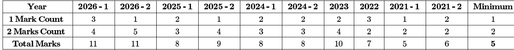

Welcome to the "Computer Organization & Architecture" chapter of your GATE Computer Science preparation. This crucial subject delves into the fundamental design and operational principles of a computer system, from the lowestlevel hardware components to how instructions are executed and data is managed. Understanding COA is vital for any computer scientist as it provides the bedrock knowledge for designing efficient systems, writing optimized code, and comprehending the performance implications of software choices. In the GATE CS exam, COA typically carries a weightage of 8-12 marks, with questions ranging from conceptual understanding of architectural principles (like CISC vs. RISC, control unit types) to numerical problems involving cache memory, pipelining performance, virtual memory, and disk access times. Expect a mix of Multiple Choice Questions (MCQs), Multiple Select Questions (MSQs), and Numerical Answer Type (NAT) questions, often requiring precise calculations and a deep grasp of underlying mechanisms.

# Topic-wise Key Concepts

# Addressing Modes

Addressing modes define how the effective address of an operand is calculated. They specify where the operand is located, whether in a register, memory, or as part of the instruction itself, enabling flexible and efficient memory access.

# Important Formulas & Concepts

Immediate: Operand is part of the instruction. $E A =$ Operand Value. No memory access for operand.   
Direct: $E A =$ (address field in instruction). One memory access to fetch operand.   
Indirect: $E A = M [ \mathrm { A d d r e s s } ]$ (address field points to memory location containing EA). Two memory accesses (one for EA, one for operand).   
Register: Operand is in a specified register. $E A = R$ . No memory access.   
Register Indirect: $E A = [ R ]$ (register contains EA). One memory access to fetch operand.   
Relative (PC-relative): $E { \bar { A } } { \bar { = } } P C + { \mathrm { O f f } }$ (offset from Program Counter). Used for branch instructions.   
Indexed: $E A = { \mathrm { B a s e } } \backslash { \mathrm { \_ A d d r e s s } } + { \mathrm { I n d e x } } \backslash .$ Register. Used for array access.   
Base-Register: $E A = \mathrm { B a s e } \backslash \mathrm { \mathrm { \mathrm { - } R e g i s t e r } + O f f s e t . } \cup$ sed for relocating programs.

# Key Properties & Identities

Trade-offs exist between instruction length, execution speed, and flexibility.   
Used to access data, implement control flow, and manage memory.

# Common Pitfalls

Confusing direct and indirect addressing, especially regarding the number of memory accesses.

# Standard Problem-Solving Techniques

Trace the instruction execution step-by-step to calculate the effective address for given register/memory contents.

# Average Memory Access Time (AMAT)

AMAT is the average time taken to access memory, considering the presence of a cache and its hit/miss rates. It quantifies the performance of the memory hierarchy.

# Important Formulas & Concepts

For a single-level cache:

$$
A M A T = T _ { h i t } + M R \times T _ { m i s s \_ p e n a l t y }
$$

where $T _ { h i t }$ is cache hit time, $M R$ is miss rate, and $T _ { m i s s \_ p e n a l t y }$ is the time to fetch data from the next level of memory (main memory).   
For a two-level cache (L1, L2):

$$
A M A T = T _ { L 1 . h i t } + M R _ { L 1 } \times ( T _ { L 2 . h i t } + M R _ { L 2 } \times T _ { m a i n . m e m o r y } )
$$

where is L1 hit time, $M R _ { L 1 }$ is L1 miss rate, $T _ { L 2 \_ h i t }$ is L2 hit time, $M R _ { L 2 }$ is L2 miss rate (local miss rate for L2), and $T _ { m a i n \_ m e m o r y }$ is main memory access time.

# Key Properties & Identities

Lower AMAT indicates better memory system performance.   
Affected by cache hit rate, miss penalty, and cache access times.

# Common Pitfalls

Forgetting to add the hit time to the miss penalty when calculating total miss time.   
Incorrectly applying local vs. global miss rates for multi-level caches.

# Standard Problem-Solving Techniques

Draw the memory hierarchy and clearly identify access times and miss rates for each level.

# Bit Vector

A bit vector (or bit array) is a data structure that efficiently stores a sequence of bits. Each bit typically represents a boolean flag or the presence/absence of an element in a set.

# Important Formulas & Concepts

Storage: $N$ bits require $\lceil N / 8 \rceil$ bytes of storage.   
Bitwise operations: AND, OR, XOR, NOT, SHIFT for efficient manipulation.

# Key Properties & Identities

Space-efficient for large sets of boolean flags.   
Fast bitwise operations for checking, setting, or clearing flags.

# Common Pitfalls

Misinterpreting bit positions or the effect of bitwise operations.

# Standard Problem-Solving Techniques

Use bit masks to isolate or modify specific bits.

# CISC RISC Architecture

CISC (Complex Instruction Set Computer) and RISC (Reduced Instruction Set Computer) are two contrasting philosophies for designing instruction sets. They represent different approaches to instruction complexity and hardware implementation.

# Important Formulas & Concepts

CISC Characteristics:

。 Many complex instructions, often performing multiple operations (e.g., memory access and arithmetic).   
。 Variable instruction length.   
。 Microprogrammed control unit. Fewer general-purpose registers, more memory-to-memory operations.   
Complex addressing modes.

# RISC Characteristics:

Few, simple, fixed-length instructions, typically one operation per instruction.   
。 Hardwired control unit.   
0 Many general-purpose registers, load/store architecture (only LOAD/STORE access memory).   
Simple addressing modes. Optimized for pipelining.

# Key Properties & Identities

RISC generally achieves higher CPI (Cycles Per Instruction) but lower clock cycle time due to simpler instructions, leading to better performance in many cases.   
CISC aims for fewer instructions per program but higher CPI.

# Common Pitfalls

Assuming one architecture is universally superior; their suitability depends on the application and compiler technology.

# Standard Problem-Solving Techniques

Compare and contrast features to identify the type of architecture described in a scenario.

# Cache Memory

Cache memory is a small, fast memory component that stores copies of data from frequently used main memory locations. Its purpose is to reduce the average time to access data, exploiting the principle of locality.

# Important Formulas & Concepts

Address Breakdown: For a memory address of $M$ bits, a cache with $B$ bytes per block, and $C$ cache lines (or   
sets): Block Offset bits: $\log _ { 2 } B$ Number of Blocks in Main Memory: $2 ^ { M } / B$ Number of Cache Lines: $C$

Direct Mapping: Index bits: $\log _ { 2 } C$ Tag bits: $M - ( \log _ { 2 } { C } + \log _ { 2 } { B } )$ Cache Line Index $\ b =$ (Main Memory. Block Number) (mod C)

Set-Associative Mapping (S-way): Number of Sets: $C / S$ Index bits: $\log _ { 2 } ( C / S )$ Tag bits: $M - \mathbf { \bar { ( } } \log _ { 2 } ( C / S ) + \log _ { 2 } B )$ Cache_Set Inde $x =$ (Main Memory_ Block_Number) (mod $( C / S )$ ）

Fully Associative Mapping: No Index bits. Tag bits: $M - \log _ { 2 } B$ 。 Any block can go into any cache line.   
Hit Rate $( H R )$ : NumbMerofCycheHits   
Miss Rate $( M R )$ : $1 - H R$

# Key Properties & Identities

Exploits temporal and spatial locality of reference.   
Mapping techniques (Direct, Set-Associative, Fully Associative) determine where a block can be placed.   
Write policies (Write-Through, Write-Back) determine when data is written to main memory.

Replacement policies (LRU, FIFO, LFU, Random) determine which block to evict on a miss.

# Common Pitfalls

Incorrectly calculating the number of bits for Tag, Index, and Offset.   
Confusing the total cache size with the number of cache lines.

# Standard Problem-Solving Techniques

Draw the cache structure and trace memory accesses to determine hits/misses and cache contents.

# Conflict Misses

Conflict misses occur in direct-mapped or set-associative caches when multiple memory blocks map to the same cache line or set, and these blocks are actively used, causing them to evict each other even if other cache lines are empty.

# Important Formulas & Concepts

These are a type of "capacity miss" specifically due to the mapping function.   
Increasing associativity reduces conflict misses.

# Key Properties & Identities

Occur when the cache is not full but the required block is evicted due to mapping constraints.   
Distinguished from compulsory (first-time access) and capacity (cache too small) misses.

# Common Pitfalls

Mistaking a conflict miss for a capacity miss or a compulsory miss.

# Standard Problem-Solving Techniques

Analyze the memory access pattern and the cache mapping scheme to identify if multiple active blocks map to the same location.

# Control Unit

The control unit is the part of the CPU that directs the operation of the processor. It interprets instructions and generates control signals to coordinate the activities of other components, such as the ALU, registers, and memory.

# Important Formulas & Concepts

Hardwired Control: Implemented using combinational logic gates. 。 Faster execution. 。 Complex to design and modify for large instruction sets. 。 Used in RISC processors.   
Microprogrammed Control: Implemented using a sequence of microinstructions stored in a control memory. 。 More flexible and easier to design/modify for complex instruction sets. Slower execution due to memory access for microinstructions. 。 Used in CISC processors.

# Key Properties & Identities

Determines the sequence of micro-operations for each machine instruction.   
Generates timing and control signals for the entire system.

# Common Pitfalls

Not understanding the trade-offs between hardwired and microprogrammed control in terms of speed, flexibility, and design complexity.

# Standard Problem-Solving Techniques

Relate the control unit type to the characteristics of CISC/RISC architectures.

# DMA (Direct Memory Access)

DMA is a hardware feature that allows I/O devices to transfer data directly to and from main memory without involving the CPU. This significantly reduces CPU overhead for data transfers, improving system performance.

# Important Formulas & Concepts

3 DMA controller manages the data transfer.   
Cycle Stealing: DMA controller takes control of the bus for one or more memory cycles to transfer data. Burst Mode: DMA controller takes control of the bus and transfers an entire block of data before releasing the bus.

# Key Properties & Identities

Frees the CPU to perform other tasks during I/O operations.   
Requires a DMA controller chip.

# Common Pitfalls

Misunderstanding that DMA completely bypasses the CPU; the CPU initiates and configures the DMA transfer.

# Standard Problem-Solving Techniques

Analyze scenarios to determine when DMA is most beneficial compared to programmed I/O or interrupt-driven I/O.

# DRAM (Dynamic Random Access Memory)

DRAM is the most common type of main memory used in computers. It stores each bit of data in a separate capacitor within an integrated circuit, requiring periodic refreshing to maintain the charge and thus the data.

# Important Formulas & Concepts

Data stored as charge in capacitors.   
Requires refresh cycles to prevent data loss.

# Key Properties & Identities

Volatile (data is lost when power is removed).   
Higher density and lower cost per bit compared to SRAM.   
Slower access times than SRAM due to refresh cycles and capacitor charging/discharging.

# Common Pitfalls

Confusing DRAM characteristics with SRAM (Static RAM), which uses latches and does not require refreshing.

# Standard Problem-Solving Techniques

Compare and contrast DRAM with SRAM based on cost, speed, density, and power consumption.

# Data Dependency

A data dependency exists between two instructions when the second instruction requires data produced by the first instruction, or when they both access the same memory location, potentially leading to incorrect results if executed out of order.

# Important Formulas & Concepts

RAW (Read After Write) / True Dependency: Instruction $J$ tries to read a source before instruction $I$ writes to it. $I \to J$ . This is the most common and critical dependency.   
WAR (Write After Read) Anti-dependency: Instruction $J$ tries to write to a destination before instruction $\boldsymbol { \mathit { I } }$ reads from it. $I  J$ . Can be resolved by renaming.   
WAW (Write After Write) Output Dependency: Instruction $J$ tries to write to a destination before instruction $\boldsymbol { \mathit { I } }$ writes to it. $I \Rightarrow J$ . Can be resolved by renaming.

# Key Properties & Identities

RAW dependencies are true data dependencies and must be preserved.   
WAR and WAW are name dependencies and can be eliminated by register renaming.

# Common Pitfalls

Incorrectly identifying the type of dependency or missing a dependency.

# Standard Problem-Solving Techniques

Analyze the read/write sets of instructions to identify dependencies.

# Data Hazards

Data hazards occur in pipelined processors when an instruction attempts to access data before a preceding instruction has made that data available. These hazards can lead to incorrect program execution if not handled.

# Important Formulas & Concepts

Caused by RAW, WAR, and WAW dependencies.   
Solutions: Stalling (Bubbles/NOPs): Insert NOP instructions to delay the dependent instruction. Forwarding (Bypassing): Route the result of an instruction directly from an internal pipeline register to the input of a subsequent instruction's functional unit, bypassing the register file. Compiler Scheduling: Reorder instructions at compile time to avoid hazards.

# Key Properties & Identities

Increase the CPI (Cycles Per Instruction) of a pipeline, reducing ideal speedup.   
Forwarding is the most common hardware solution to reduce stalls due to RAW hazards.

# Common Pitfalls

Calculating the number of stalls incorrectly, especially when forwarding is present.   
Not identifying all data dependencies in a given instruction sequence.

# Standard Problem-Solving Techniques

Draw pipeline diagrams to visualize instruction flow and identify where stalls or forwarding are needed.

# Data Path

The data path of a CPU consists of the functional units (like the ALU, registers, and multiplexers) and the buses that connect them, through which data flows during instruction execution. It performs the actual data processing operations.

# Important Formulas & Concepts

· Key components: Program Counter (PC), Instruction Register (IR), Memory Address Register (MAR), Memory Data Register (MDR), General Purpose Registers (GPRs), Arithmetic Logic Unit (ALU).

Key Properties & Identities

The data path is controlled by signals generated by the control unit.   
Its design impacts the clock cycle time and the number of cycles per instruction.

# Common Pitfalls

Not understanding how data moves between components for different instruction types.

# Standard Problem-Solving Techniques

Trace the flow of data for a specific instruction (e.g., LOAD, ADD) through the datapath components.

# Direct Mapping

Direct mapping is a cache organization technique where each block from main memory can only be placed into one specific line in the cache. This mapping is determined by a simple modular arithmetic function of the memory block address.

# Important Formulas & Concepts

Cache Line Index:   
Cache\ Line\_Index $\ c =$ (Main\ Memory _Block\ _Number) (mod Number\_of) Cache\_Lines)   
Address Breakdown: A memory address is divided into three fields: Tag, Index, and Block Offset. Block Offset bits: $\log _ { 2 }$ (Block Size in bytes) Index bits: $\log _ { 2 }$ (Number of Cache Lines) 。 Tag bits: Address Bits- Index Bits 一 Block Offset Bits

# Key Properties & Identities

Simplest to implement and fastest for cache lookup.   
Suffers from high conflict misses if frequently accessed blocks map to the same cache line.

# Common Pitfalls

Incorrectly calculating the number of bits for the Tag, Index, or Block Offset fields.

# Standard Problem-Solving Techniques

Given memory and cache parameters, determine the address breakdown and trace memory accesses to identify hits/misses.

# Dirty Bit

A dirty bit (or modified bit) is a flag associated with a cache line or a virtual memory page table entry. It indicates whether the corresponding data block in the cache/page has been modified since it was loaded from the next lower level of memory (main memory/disk).

# Important Formulas & Concepts

Set to '1' when data in the cache line or page is written to.   
Set to $" 0 "$ when the data is clean (matches the lower level memory).

# Key Properties & Identities

Crucial for write-back cache policies: if the dirty bit is set, the block must be written back to main memory upon eviction. Used in virtual memory page replacement algorithms to avoid unnecessary writes to disk.

# Common Pitfalls

Misunderstanding its role in write-through caches (where it's not typically needed) versus write-back caches.

# Standard Problem-Solving Techniques

Analyze cache write operations and page replacement scenarios to determine when the dirty bit is set or checked.

# Disk

A disk (hard disk drive) is a non-volatile secondary storage device that stores data magnetically on rotating platters. It is characterized by its large capacity and persistence, but significantly slower access times compared to RAM.

# Important Formulas & Concepts

Disk Access Time:

$$
A c c e s s \_ T i m e = S e e k \_ T i m e + R o t a t i o n a l \_ L a t e n c y + T r a n s f e r \_ T i m e
$$

Seek Time: Time taken for the read/write head to move to the correct track. (Often given as average or calculated based on number of tracks). Rotational Latency: Time taken for the desired sector to rotate under the read/write head.

$$
A v e r a g e \_ R o t a t i o n a l \_ L a t e n c y = \frac { 1 } { 2 } \times \frac { 6 0 \mathrm { s e c o n d s } } { \mathrm { R P M } }
$$

(where RPM is revolutions per minute).   
Transfer Time: Time taken to transfer the actual data once the head is positioned.

$$
T r a n s f e r \_ T i m e = \frac { \mathrm { N u m b e r \ o f \ S e c t o r s \ t o \ T r a n s f e r } } { \mathrm { S e c t o r s p e r T r a c k } } \times \frac { 6 0 \ { \mathrm { s e c o n d s } } } { \mathrm { R P M } }
$$

or Time $\ c =$ Amount of Data Transfer Rate

# Key Properties & Identities

Non-volatile storage.   
Mechanical components make it orders of magnitude slower than electronic memory.

# Common Pitfalls

Incorrectly calculating average rotational latency (using $_ { 1 / 2 }$ of a full rotation).   
Mixing units (e.g., milliseconds and seconds).

# Standard Problem-Solving Techniques

Break down the access time calculation into its three components and calculate each separately.

# Hazards

Hazards are situations in pipelined processors that prevent the next instruction in the instruction stream from executing in its designated clock cycle. They reduce the ideal speedup of a pipeline.

# Important Formulas & Concepts

Structural Hazards: Occur when two instructions require the same hardware resource at the same time (e.g., single memory port for both instruction fetch and data access).   
Data Hazards: Occur when an instruction depends on the result of a previous instruction that has not yet completed (RAW, WAR, WAW).   
Control Hazards (Branch Hazards): Occur when the pipeline makes a wrong guess about the next instruction to fetch (e.g., after a conditional branch).

# Key Properties & Identities

All hazards increase the effective CPI (Cycles Per Instruction) of the pipeline.

Solutions include stalling, forwarding, and branch prediction.

# Common Pitfalls

Confusing the different types of hazards or misidentifying the cause of a stall.

# Standard Problem-Solving Techniques

Analyze the instruction sequence and pipeline stage usage to identify potential conflicts.

# IO Handling

I/O handling refers to the mechanisms by which a CPU communicates and exchanges data with peripheral input/output devices. Efficient I/O handling is crucial for system performance.

# Important Formulas & Concepts

Programmed I/O (Polling): CPU continuously checks the status of an I/O device. High CPU overhead, simple to implement.   
Interrupt-Driven I/O: I/O device signals the CPU via an interrupt when it needs attention. Lower CPU overhead than polling, CPU can do other work. Requires interrupt service routines (ISRs).   
Direct Memory Access (DMA): I/O device transfers data directly to/from memory without CPU intervention. Lowest CPU overhead for large data transfers. Requires a DMA controller.

# Key Properties & Identities

Each method has trade-offs in terms of CPU utilization, response time, and complexity.   
Interrupts allow for asynchronous event handling.

# Common Pitfalls

Not understanding the CPU's involvement (or lack thereof) in data transfer for each method.

# Standard Problem-Solving Techniques

Evaluate scenarios to determine the most suitable I/O handling method based on data volume and CPU availability.

# Instruction Execution

Instruction execution is the process by which a CPU carries out a single machine instruction. In a pipelined processor, this process is broken down into several sequential stages, allowing multiple instructions to be processed concurrently.

# Important Formulas & Concepts

Typical 5-stage pipeline:

1. IF (Instruction Fetch): Fetch instruction from memory.   
2. ID (Instruction Decode): Decode instruction, read registers.   
3. EX (Execute): Perform ALU operation.   
4. MEM (Memory Access): Access data memory (load/store).   
5. WB (Write Back): Write result back to register file.

# Key Properties & Identities

Each stage ideally takes one clock cycle in a pipelined processor.   
The slowest stage determines the clock cycle time of the pipeline.

# Common Pitfalls

Misunderstanding the specific function of each pipeline stage.

# Standard Problem-Solving Techniques

Trace an instruction through each stage of the pipeline to understand its execution flow.

# Instruction Format

The instruction format defines the layout of bits within a machine instruction. It specifies how the opcode, operands, and addressing mode information are encoded, directly impacting the instruction set's flexibility and the CPU's decoding complexity.

# Important Formulas & Concepts

. An instruction typically consists of an opcode (operation code) and one or more operand fields.   
Operand fields can specify registers, memory addresses, or immediate values.   
Fixed-length instruction format: All instructions have the same length. Simplifies fetching and decoding, good for pipelining (RISC).   
Variable-length instruction format: Instructions can have different lengths. Allows for more complex instructions and addressing modes, but complicates fetching and decoding (CISC).

# Key Properties & Identities

+ The number of bits for the opcode determines the maximum number of unique operations.   
The number of bits for operand fields determines the number of registers or the addressable memory range.

# Common Pitfalls

Incorrectly calculating the maximum number of opcodes or addressable memory given a fixed instruction length.

# Standard Problem-Solving Techniques

Given instruction length and operand requirements, calculate the remaining bits for the opcode or vice-versa.

# Instruction Set Architecture (ISA)

The ISA is the abstract model of a computer that is visible to a programmer or compiler writer. It defines the set of instructions, registers, memory organization, data types, and the I/O model that the hardware supports.

# Important Formulas & Concepts

Includes the instruction set, register set, memory addressing modes, and interrupt handling mechanisms.   
Forms the interface between software and hardware.

# Key Properties & Identities

ISA defines what the processor does, while microarchitecture defines how it does it.   
CISC and RISC are two major ISA design philosophies.

# Common Pitfalls

Confusing ISA (the specification) with microarchitecture (the implementation).

# Standard Problem-Solving Techniques

Understand that ISA is the contract that allows software to run on different hardware implementations of the same ISA.

# Interrupts

An interrupt is a signal to the CPU indicating an event that requires immediate attention, causing the CPU to temporarily suspend its current task and execute a special routine (Interrupt Service Routine or ISR) to handle the event.

# Important Formulas & Concepts

Hardware Interrupts: Generated by I/O devices (e.g., keyboard press, disk completion). Asynchronous. Software Interrupts (Exceptions/Traps): Generated by program execution (e.g., division by zero, page fault, system call). Synchronous. Interrupt Vector Table: A table of addresses for ISRs, indexed by interrupt number.

# Key Properties & Identities

Enable efficient I/O handling and error management without constant CPU polling.   
Involve saving CPU state, executing ISR, and restoring CPU state.

# Common Pitfalls

Misunderstanding the sequence of events during interrupt handling (saving context, jumping to ISR, restoring context).

# Standard Problem-Solving Techniques

Trace the flow of control when an interrupt occurs, considering context saving and ISR execution.

# Machine Instruction

A machine instruction is a command or operation that a CPU can directly understand and execute. It is represented in binary code and forms the lowest-level programming language, specific to a particular processor's Instruction Set Architecture.

# Important Formulas & Concepts

Composed of an opcode and zero or more operands.   
Each instruction performs a basic operation (e.g., add, load, store, branch).

# Key Properties & Identities

Directly executable by the hardware.   
The fundamental unit of computation for the CPU.

# Common Pitfalls

Confusing machine instructions (binary) with assembly language instructions (mnemonic representation).

# Standard Problem-Solving Techniques

Understand how an assembly instruction translates into its binary machine code equivalent based on the instruction format.

# Memory Interfacing

Memory interfacing is the process of connecting memory devices (RAM, ROM) to the CPU. It involves designing the necessary address decoding logic, connecting data and address buses, and generating control signals to ensure proper communication and data transfer.

# Important Formulas & Concepts

Address Decoding: Logic gates (decoders, AND gates) used to select the correct memory chip based on the CPU's address lines.   
Chip Select (CS): A control signal that enables a specific memory chip.

Memory Map: The allocation of address ranges to different memory devices.

# Key Properties & Identities

Ensures that each memory location has a unique address and that the correct device responds to a CPU request. . Bus width (data and address) must match between CPU and memory.

# Common Pitfalls

Incorrectly designing address decoding logic, leading to address conflicts or unused address space.

# Standard Problem-Solving Techniques

Given CPU address lines and memory chip sizes, determine the address ranges and design the minimal decoding logic.

# Microprogramming

Microprog ramming is a technique for implementing the control unit of a CPU by storing a sequence of microinstructions in a special control memory. Each machine instruction is executed by a microprogram, which is a sequence of microinstructions.

# Important Formulas & Concepts

Microinstruction: A low-level instruction that controls the individual functional units of the CPU (e.g., enable ALU, load register).   
Control Store (CS): Memory where microprograms are stored.

# Key Properties & Identities

Offers flexibility: easier to design complex instruction sets and modify existing ones.   
Slower than hardwired control due to the overhead of fetching and decoding microinstructions.   
Commonly used in CISC processors.

# Common Pitfalls

Confusing microinstructions (internal CPU control) with machine instructions (user-level instructions).

# Standard Problem-Solving Techniques

Understand how a machine instruction is broken down into a sequence of micro-operations controlled by microinstructions.

# Pipelining

Pipelining is a technique that allows multiple instructions to be in different stages of execution simultaneously, improving the throughput of a processor. It does not reduce the execution time of a single instruction but increases the rate at which instructions complete.

# Important Formulas & Concepts

Number of stages: $K$   
Number of instructions: $N$   
Clock cycle time: (determined by the slowest stage).   
Execution time for $\pmb { \mathsf { N } }$ instructions (non-pipelined): $T _ { n o n - p i p e l i n e } = N \times K \times T _ { c y c l e }$ Execution time for N instructions (ideal pipelined): $T _ { p i p e l i n e } = ( K + N - 1 ) \times \bar { T } _ { c y c l e }$ . Ideal Speedup $( S )$ for large N: $\begin{array} { r } { S = \frac { N \times K \times T _ { c y c l e } } { ( K + N - 1 ) \times T _ { c y c l e } } \approx \dot { K } } \end{array}$   
Throughput (ideal): $\frac { 1 } { T _ { c y c l e } }$ instructions per cycle.   
CPI (Cycles Per Instruction):

Ideal $\mathsf { C P l } = 1$ . 。 Actual ${ \mathsf { C P l } } = \mathbf { 1 } + \mathbf { \beta }$ Stalls per instruction.

# Key Properties & Identities

Increases instruction throughput, not latency.   
Performance is limited by hazards (structural, data, control).

# Common Pitfalls

Incorrectly calculating execution time when stalls are present.   
Assuming pipelining reduces the execution time of a single instruction.

# Standard Problem-Solving Techniques

Draw pipeline diagrams to visualize instruction flow, identify hazards, and calculate stalls.

# Runtime Environment

The runtime environment refers to the state of a program during its execution, encompassing all resources and conditions necessary for the program to run. This includes the CPU's registers, memory (stack, heap, code, data segments), program counter, and operating system services.

# Important Formulas & Concepts

Includes CPU state (registers, PC, flags), memory layout (code, data, heap, stack), and OS resources.

# Key Properties & Identities

Managed by the operating system and supported by the hardware architecture.   
Defines how programs interact with the underlying system.

# Common Pitfalls

Not understanding the distinction between compile-time and run-time aspects of a program.

# Standard Problem-Solving Techniques

Understand how memory is organized and utilized by a program during execution (e.g., stack for function calls, heap for dynamic allocation).

# Speedup

Speedup is a measure of how much faster a task executes on an improved system compared to an original system. It quantifies the performance gain achieved by optimizations like pipelining, parallel processing, or using faster components.

# Important Formulas & Concepts

General Speedup:

$$
S p e e d u p = \frac { \mathrm { E x e c u t i o n T i m e _ { o l d } } } { \mathrm { E x e c u t i o n T i m e _ { n e w } } }
$$

Amdahl's Law: Calculates the theoretical maximum speedup for a system when only a portion of the task can be improved.

$$
S _ { o v e r a l l } = \frac { 1 } { ( 1 - P ) + \frac { P } { S _ { e n h a n c e d } } }
$$

where $P$ is the proportion of the program that can be enhanced, and Senhanced is the speedup of the enhanced part.   
Pipelining Speedup (for large N): $S \approx K$ (number of pipeline stages).

# Key Properties & Identities

Amdahl's Law highlights that the sequential portion of a program limits overall speedup.   
Speedup is a dimensionless quantity.

# Common Pitfalls

Incorrectly applying Amdahl's Law, especially regarding the value of $P$ .   
Forgetting to account for overheads or non-ideal conditions in pipelining.

# Standard Problem-Solving Techniques

Identify the parallelizable and sequential components of a task when using Amdahl's Law.

# Stall

A stall (also known as a bubble or NOP) is a delay introduced into a pipeline to resolve a hazard. When a hazard is detected, the pipeline is temporarily halted for one or more clock cycles, preventing the dependent instruction from proceeding until the hazard is cleared.

# Important Formulas & Concepts

Stalls increase the CPI (Cycles Per Instruction) of the pipeline.   
Number of stalls depends on the type of hazard and the pipeline's ability to forward data.

# Key Properties & Identities

Reduces the effective throughput and speedup of the pipeline.   
A common method to ensure correctness in the presence of data and control hazards.

# Common Pitfalls

Incorrectly calculating the number of stalls required for a given hazard, especially when forwarding is implemented.

# Standard Problem-Solving Techniques

Draw pipeline diagrams and mark the clock cycles where stalls are inserted to resolve dependencies.

# Virtual Memory

Virtual memory is a memory management technique that allows a computer to compensate for physical memory shortages by temporarily transferring data from RAM to disk storage. It provides the illusion of a larger, contiguous memory space to programs.

# Important Formulas & Concepts

Paging: Divides memory into fixed-size blocks (pages and frames). Page Table: Maps virtual page numbers to physical frame numbers. TLB (Translation Lookaside Buffer): A small, fast cache for page table entries. Effective Access Time (EAT) with TLB:

$$
E A T = T L B _ { h i \_ r a t e } \times ( T _ { T L B } + T _ { m e m o r y } ) + T L B _ { m i s s \_ r a t e } \times ( T _ { T L B } + 2 \times T _ { m e m o r y } )
$$

where is TLB access time and Tmemory is main memory access time. Effective Access Time (EAT) with Page Faults:

$$
E A T = ( 1 - P ) \times T _ { m e m o r y } + P \times T _ { p a g e \_ f a u l t }
$$

where $P$ is the page fault rate, Tmemory is memory access time, and $T _ { p a g e \_ f a u l t }$ is the time to handle a page fault (including disk I/O).

# Key Properties & Identities

Provides memory protection, allows multitasking, and enables programs larger than physical memory.   
Address translation involves converting virtual addresses to physical addresses.

# Common Pitfalls

Incorrectly calculating EAT, especially when considering both TLB misses and page faults.   
Confusing page table entries with TLB entries.

# Standard Problem-Solving Techniques

Trace the address translation process (TLB lookup, page table lookup, page fault handling).

# Quick Formula Reference

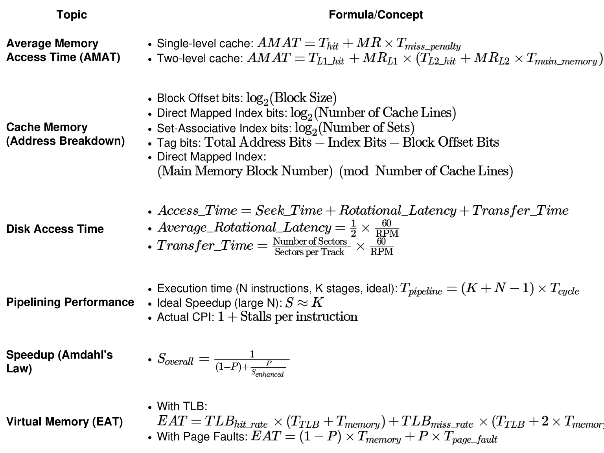

# Important Tips for GATE

Master Numerical Problems: A significant portion of COA questions are numerical, especially on Cache Memory (AMAT, address breakdown), Pipelining (execution time, speedup, stalls), Disk Access Time, and Virtual Memory (EAT). Practice these extensively.

Address Breakdown is Key: For cache and virtual memory, thoroughly understand how a logical/physical address is divided into Tag, Index/Page Number, and Offset. This is fundamental for many problems.

Pipeline Diagrams: Learn to draw and analyze pipeline diagrams for instruction sequences. This is the best way to identify data/control hazards and calculate the number of stalls or benefits of forwarding.

Conceptual Clarity: Don't just memorize definitions. Understand the "why" behind concepts. For example, why RISC is better for pipelining, why cache works (locality), or why DMA is used.   
. Distinguish Similar Concepts: Be clear on the differences between CISC/RISC, hardwired/microprogrammed control, various addressing modes, and different types of hazards (structural, data, control).   
. Read Questions Carefully: Pay close attention to units (ns, ms, cycles), specific assumptions (e.g., "no forwarding," "average rotational latency"), and what is being asked (e.g., total time vs. speedup).   
Amdahl's Law: This formula frequently appears in questions related to performance improvement. Understand how to apply it correctly, especially identifying the parallelizable portion $P$ .   
Time Management: Some numerical problems can be lengthy. If you get stuck or find a calculation too complex, consider moving on and returning later. Look for shortcuts or approximations if applicable.

# Addressing Modes (19)

✍ Practice Test: Test 1 (15Q)

# 1.1.1 Addressing Modes: GATE CSE 1987 Question: 1-V

The most relevant addressing mode to write position-independent codes is:

A. Direct mode B. Indirect mode C. Relative mode D. Indexed mode

gate1987 co-and-architecture addressing-modes easy

In the program scheme given below indicate the instructions containing any operand needing relocation for position independent behaviour. Justify your answer.

$Y = 1 0$   
MOV X(Ro),R1   
MOV X,R0   
MOV 2(R0), R1   
MOV Y(Ro), R5

X : WORD 0,0,0 gate1988 normal descriptive co-and-architecture addressing-modes

Match the pairs in the following questions:

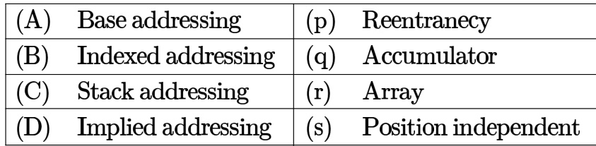

gate1989 match-the-following co-and-architecture addressing-modes easy

# Answer key☟

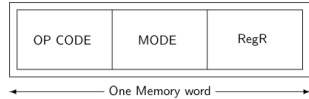

and  together specify the operand. specifies a CPU register and  specifies an addressing mode. In particular, $= 2$ specifies that ‘the register contains the address of the operand, after fetching the operand, the contents of are incremented by '.

An instruction at memory location specifies $= 2$ and the $\mathrm { R e g R }$ refers to program counter (PC).

A. What is the address of the operand? B. Assuming that is a non-jump instruction, what are the contents of PC after the execution of this instruction?

gate1993 co-and-architecture addressing-modes normal descriptive

Relative mode of addressing is most relevant to writing:

A. Co – routines B. Position – independent code C. Shareable code D. Interrupt Handlers

gate1996 co-and-architecture addressing-modes easy isro2016

# 1.1.6 Addressing Modes: GATE CSE 1998 Question: 1.19

Which of the following addressing modes permits relocation without any change whatsoever in the code?

A. Indirect addressing B. Indexed addressing C. Base register addressing D. PC relative addressing

gate1998 co-and-architecture addressing-modes easy

Answer key☟

# 1.1.7 Addressing Modes: GATE CSE 1999 Question: 2.23

A certain processor supports only the immediate and the direct addressing modes. Which of the following programming language features cannot be implemented on this processor?

A. Pointers B. Arrays   
C. Records D. Recursive procedures with local variable

gate1999 co-and-architecture addressing-modes normal multiple-selects

# Answer key☟

The most appropriate matching for the following pairs

X: Indirect addressing 1: Loops Y: Immediate addressing 2: Pointers Z: Auto decrement addressing 3: Constants

is

A. $X - 3 , Y - 2 , Z - 1$ B. $X - 1 , Y - 3 , Z - 2$   
C. $X - 2 , Y - 3 , Z - 1$ D. $X - 3 , Y - 1 , Z - 2$

gatecse-2000 co-and-architecture easy addressing-modes match-the-following

Which is the most appropriate match for the items in the first column with the items in the second column:

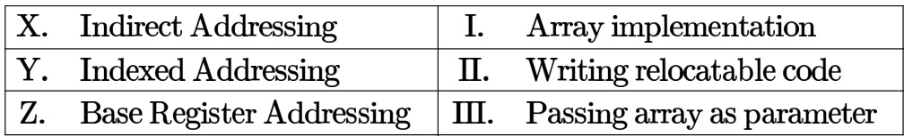

A. (X, III), (Y, I), (Z, II) B. (X, II), (Y, III), (Z, I) C. (X, III), (Y, II), (Z, I) D. (X, I), (Y, III), (Z, II)

gatecse-2001 co-and-architecture addressing-modes easy match-the-following

# Answer key☟

In the absolute addressing mode:

A. the operand is inside the instruction   
B. the address of the operand in inside the instruction   
C. the register containing the address of the operand is specified inside the instruction   
D. the location of the operand is implicit

gatecse-2002 co-and-architecture addressing-modes easy

# Answer key☟

Which of the following addressing modes are suitable for program relocation at run time?

I. Absolute addressing II. Based addressing III. Relative addressing IV. Indirect addressing

A. and IV B. and II C. II and III D. I, II and IV gatecse-2004 co-and-architecture addressing-modes easy

# Answer key☟

Consider a three word machine instruction

$\mathrm { A D D } A [ R _ { 0 } ] , @ E$

The first operand (destination) ${ } ^ { 6 6 } A [ R _ { 0 } ] { } ^ { 3 }$ uses indexed addressing mode with $R _ { 0 }$ as the index register. The second operand (source) ${ } ^ { 6 6 } @ B ^ { \mathfrak { P } }$ uses indirect addressing mode. $A$ and $B$ are memory addresses residing at the second and third words, respectively. The first word of the instruction specifies the opcode, the index register designation and the source and destination addressing modes. During execution of ADD instruction, the two operands are added and stored in the destination (first operand).

The number of memory cycles needed during the execution cycle of the instruction is:

A. B. C. D. 6

gatecse-2005 co-and-architecture addressing-modes normal (1) $\begin{array} { l } { A [ I ] = B [ J ] } \\ { \mathrm { ~ w h i l e ~ } ( ^ { \ast } A + + ) ; } \\ { \mathrm { ~ i n t ~ t e m p = ^ { \ast } ~ } x } \end{array}$ (a) Indirect addressing (2) (b) Indexed addressing (3) (c) Auto increment DB. $( 1 , c ) , ( 2 , c ) , ( 3 , b )$ $( 1 , a ) , ( 2 , b ) , ( 3 , c )$

A. $( 1 , c ) , ( 2 , b ) , ( 3 , a )$   
C. $( 1 , b ) , ( 2 , c ) , ( 3 , a )$

gatecse-2005 co-and-architecture addressing-modes match-the-following easy

Which of the following is/are true of the auto-increment addressing mode?

I. It is useful in creating self-relocating code   
II. If it is included in an Instruction Set Architecture, then an additional ALU is required for effective address calculation   
III. The amount of increment depends on the size of the data item accessed

A. I only B. II only C. III only D. II and III only

gatecse-2008 addressing-modes co-and-architecture normal isro2009

Consider a hypothetical processor with an instruction of type , which during execution reads a 32-bit word from memory and stores it in a register . The effective address of the memory location is obtained by the addition of a constant  and the contents of register . Which of the following best reflects the addressing mode implemented by this instruction for the operand in memory?

A. Immediate addressing B. Register addressing C. Register Indirect Scaled D. Base Indexed Addressing Addressing

gatecse-2011 co-and-architecture addressing-modes easy

Consider the $\boldsymbol { C }$ struct defined below:

struct data int marks [100]; char grade; int cnumber;   
};   
struct data student;

The base address of student is available in register $R 1$ . The field student.grade can be accessed efficiently using:

A. Post-increment addressing mode, $( R 1 ) +$   
B. Pre-decrement addressing mode, $- ( R 1 )$   
C. Register direct addressing mode, $R 1 \dot { }$   
D. Index addressing mode, $X ( R 1 )$ , where $X$ is an offset represented in $2 ^ { \prime } s$ complement  representation

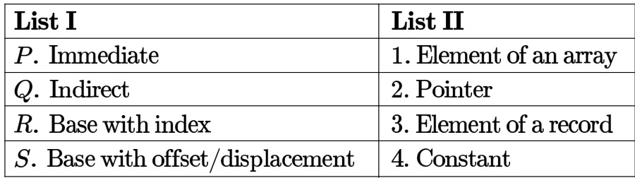

A. P-4,Q-3,R-1, S-2   
B.P-4,Q-2,R-1, S-3   
C.P-1,Q-4,R-3,S-2   
D.P-2,Q-3,R-1,S-4

Which of the following statements about relative addressing mode is FALSE?

A. It enables reduced instruction size   
B. It allows indexing of array element with same instruction   
C. It enables easy relocation of data   
D. It enables faster address calculation than absolute addressing

gateit-2006 co-and-architecture addressing-modes normal isro2009

The memory locations 1000,1001 and have data values and respectively before the following program is executed.

MOVI $R _ { s }$ ,1 ; Move immediate LOAD $R _ { d } , 1 0 0 0 ( R _ { s } )$ ; Load from memory ADDI $R _ { d }$ ,1000 ; Add immediate STOREI $0 ( R _ { d } )$ ,20 ; Store immediate

Which of the statements below is TRUE after the program is executed ?

A. Memory location has value B. Memory location has value 20 20   
C. Memory location 1021 has value D. Memory location 1001 has value 20 20

gateit-2006 co-and-architecture addressing-modes normal

# Answer key☟

A computer has a memory hierarchy consisting of two-level cache and  and a main memory. If the processor needs to access data from memory, it first looks into cache. If the data is not found in cache, it goes to  cache. If it fails to get the data from  cache, it goes to main memory, where the data is definitely available. Hit rates and access times of various memory units are shown in the figure. The average memory access time in nanoseconds $( n s )$ is (rounded off to two decimal places)

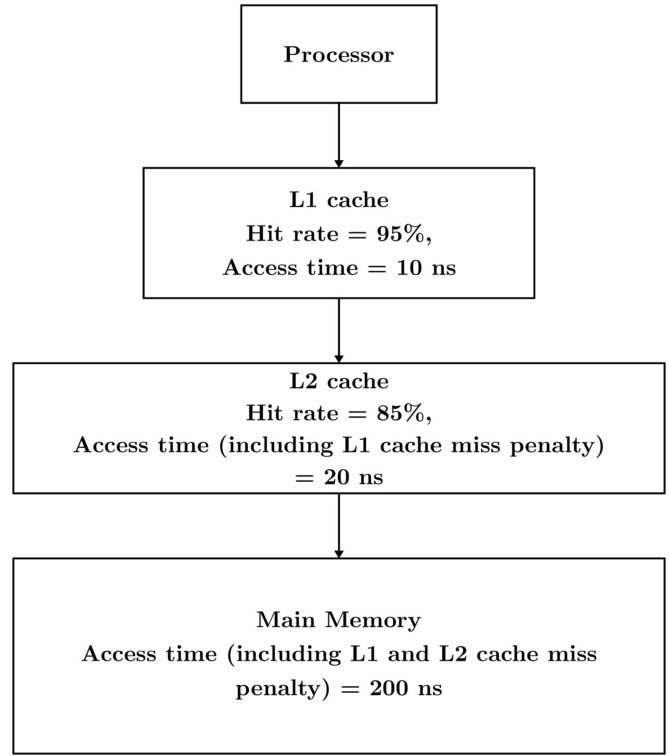

Given a computing system with two levels of cache (L1 and L2) and a main memory. The first level cache access time is nanosecond (ns) and the "hit rate" for L1 cache is $9 0 \%$ while the processor is accessing the data from L1 cache. Whereas, for the second level (L2) cache, the "hit rate" is $8 0 \%$ and the "miss penalty" for transferring data from L2 cache to L1 cache is ns The "miss penalty" for the data to be transferred from main memory to L2 cache is  ns

Then the average memory access time in this system in nanoseconds is (rounded off to one decimal place)

gatecse2025-set2 co-and-architecture cache-memory average-memory-access-time multilevel-cache numerical-answers two-marks

The main difference(s) between a CISC and a RISC processor is/are that a RISC processor typically

A. has fewer instructions B. has fewer addressing modes C. has more registers D. is easier to implement using hardwired logic

gate1999 co-and-architecture normal cisc-risc-architecture multiple-selects

Consider the following processor design characteristics:

I. Register-to-register arithmetic operations only II. Fixed-length instruction format III. Hardwired control unit

Which of the characteristics above are used in the design of a RISC processor?

A. and II only B. II and III only C. and III only D. I, II and III

gatecse-2018 co-and-architecture cisc-risc-architecture easy one-mark

What is cache memory? What is rationale of using cache memory?

gate1987 co-and-architecture cache-memory descriptive

A certain computer system was designed with cache memory of size Kbytes and main memory size of Kbytes. The cache implementation was fully associative cache with bytes per block. The CPU memory data path was  bits and the memory was way interleaved. Each memory read request presents two bit words. A program with the model shown below was run to evaluate the cache design.

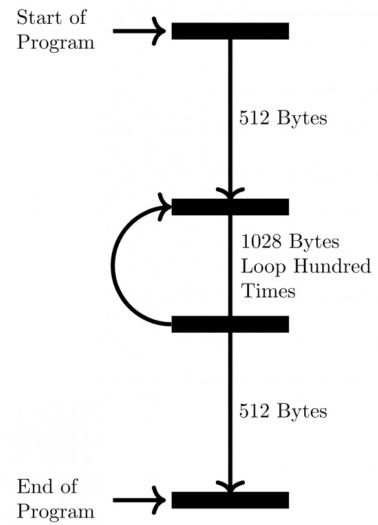

Answer the following questions:

i. What is the hit ratio? ii. Suggest a change in the program size of model to improve the hit ratio significantly.

gate1989 descriptive co-and-architecture cache-memory

A block-set associative cache memory consists of  blocks divided into four block sets. The main memory consists of  blocks and each block contains  eight bit words.

1. How many bits are required for addressing the main memory?   
2. How many bits are needed to represent the TAG, SET and WORD fields?

gate1990 descriptive co-and-architecture cache-memory

In the three-level memory hierarchy shown in the following table, $p _ { i }$ denotes the probability that an access request will refer to $M _ { i }$ .

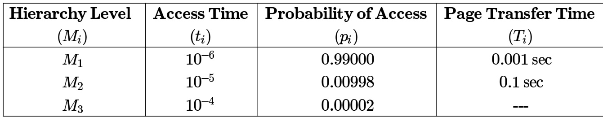

If a miss occurs at level $M _ { i }$ , a page transfer occurs from $M _ { i + 1 }$ to $M _ { i }$ and the average time required for such a page swap is $T _ { i }$ . Calculate the average time $t _ { A }$ required for a processor to read one word from this memory system.

gate1993 co-and-architecture cache-memory normal descriptive

The principle of locality justifies the use of:

A. Interrupts B. DMA C. Polling D. Cache Memory

Level 1 (Cache memory) Access time $=$ 50nsec/byte   
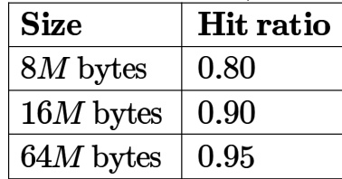

Level 2 (Main memory) Access time $=$ 200nsec/byte   
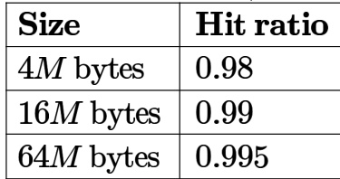

Level 3 Access time $=$ 5μsec/byte   
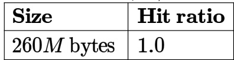

A. What should be the minimum sizes of level and memories to achieve an average access time of less than 100nsec? B. What is the average access time achieved using the chosen sizes of level and level memories?

For a set-associative Cache organization, the parameters are as follows:

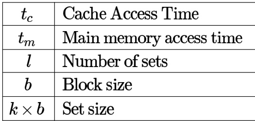

Calculate the hit ratio for a loop executed  times where the size of the loop is ${ \boldsymbol { n } } \times { \boldsymbol { b } }$ , and ${ \boldsymbol { n } } = { \boldsymbol { k } } \times { \boldsymbol { m } }$ is a nonzero integer and $1 \leq m \leq l$ .

Give the value of the hit ratio for $l = 1$ .

gate1998 co-and-architecture cache-memory descriptive

The main memory of a computer has $2 \mathrm { c m }$ blocks while the cache has  blocks. If the cache uses the set associative mapping scheme with blocks per set, then block $k$ of the main memory maps to the set:

A. mod m) of the cache B. $\begin{array} { l } { { ( k \mathrm { m o d } c ) \mathrm { o f } } } \\ { { ( k \mathrm { m o d } 2 c m } } \end{array}$ the cache C. $\dot { ( k \mod 2 c ) }$ 1 of the cache D. of the cache gate1999 co-and-architecture cache-memory normal

# .5.10 Cache Memory: GATE CSE 2001 Question: 1.7, ISRO2008-18

More than one word are put in one cache block to:

A. exploit the temporal locality of B. exploit the spatial locality of reference in a program reference in a program C. reduce the miss penalty D. none of the above

gatecse-2001 co-and-architecture easy cache-memory isro2008

C. What is the number and size of comparators required for tag matching? D. How many address bits are required to find the byte offset within a cache block? E. What is the total amount of extra memory (in bytes) required for the tag bits?

gatecse-2001 co-and-architecture cache-memory normal descriptive

In a C program, an array is declared as $A [ 2 0 4 8 ]$ . Each array element is in size, and the starting address of the array is $0 x 0 0 0 0 0 0 0 0$ . This program is run on a computer that has a direct mapped data cache of size 8 Kbytes, with block (line) size of .

A. Which elements of the array conflict with element $A [ 0 ]$ in the data cache? Justify your answer briefly. B. If the program accesses the elements of this array one by one in reverse order i.e., starting with the last element and ending with the first element, how many data cache misses would occur? Justify your answer briefly. Assume that the data cache is initially empty and that no other data or instruction accesses are to be considered.

gatecse-2002 co-and-architecture cache-memory normal descriptive

Consider a small two-way set-associative cache memory, consisting of four blocks. For choosing the block to be replaced, use the least recently used (LRU) scheme. The number of cache misses for the following sequence of block addresses is:   
8,12,0,12,8.

A. B. 3 C. D.

gatecse-2004 co-and-architecture cache-memory normal

Consider a direct mapped cache of size with block size  . The generates bit addresses. The number of bits needed for cache indexing and the number of tag bits are respectively,

A. 10,17 B. 10,22 C. 15,17 D.

gatecse-2005 co-and-architecture cache-memory easy

# Answer key☟

Consider two cache organizations. First one is $3 2 \mathsf { K B }$ 2-way set associative with  block size, the second is of same size but direct mapped. The size of an address is 32 bits in both cases A multiplexer has latency of while a $k$ comparator has latency of $\scriptstyle { \frac { k } { 1 0 } } \mathbf { n s }$ . The hit latency of the set associative organization is $h _ { 1 }$ while that of direct mapped is $h _ { 2 }$ .

The value of $h _ { 1 }$ is:

A. $\mathbf { 2 . 4 n s }$ B. 2.3 ns C. 1.8 ns D. 1.7 ns gatecse-2006 co-and-architecture cache-memory normal

multiplexer has latency of while a $k$ bit comparator has latency of $\textstyle { \frac { k } { 1 0 } } n s$ . The hit latency of the set associative organization is $h _ { 1 }$ while that of direct mapped is $h _ { 2 }$ .   
The value of $h _ { 2 }$ is:

A. $\mathbf { 2 . 4 } n s$ B. 2.3 ns C. 1.8 ns D. 1.7 ns

gatecse-2006 co-and-architecture cache-memory normal

A CPU has a $3 2 K B$ direct mapped cache with  byte-block size. Suppose A is two dimensional array of size $5 1 2 \times 5 1 2$ with elements that occupy -bytes each. Consider the following two C code segments, $P 1$ and $P 2$ .

P1:

P2:

$P 1$ and $P 2$ are executed independently with the same initial state, namely, the array $A$ is not in the cache and $i , j .$ , $x$ are in registers. Let the number of cache misses experienced by $P 1$ be $M _ { 1 }$ and that for $P 2$ be $M _ { 2 }$ . The value of $M _ { 1 }$ is:

A. 0 B. 2048 C. 16384 D. 262144

gatecse-2006 co-and-architecture cache-memory normal

A CPU has a $3 2 K B$ direct mapped cache with  byte-block size. Suppose $A$ is two dimensional array of size $5 1 2 \times 5 1 2$ with elements that occupy 1 each. Consider the following two $C$ code segments, $P 1$ and $P 2$ .

$P 1$

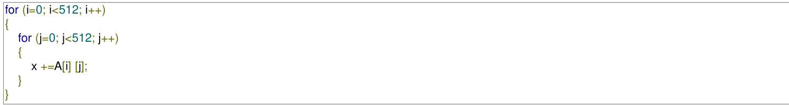

P2:

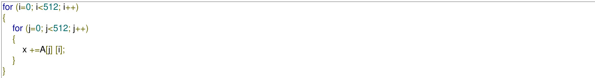

$P 1$ and $P 2$ are executed independently with the same initial state, namely, the array $A$ is not in the cache and , $j$ $x$ are in registers. Let the number of cache misses experienced by $P 1$ be $M 1$ and that for $P 2$ be $M 2$ . The value of the ratio $\frac { M _ { 1 } } { M _ { 2 } }$

A. B. $\scriptstyle { \frac { 1 } { 1 6 } }$ C. $\frac { 1 } { 8 }$ D.

co-and-architecture cache-memory normal gatecse-2006

# Answer key☟

Consider a -way set associative cache consisting of lines with a line size of words. The CPU generates a $2 0 - b i t$ address of a word in main memory. The number of bits in the TAG, LINE and WORD fields are respectively:

A. 9,6,5 B. 7,7,6 C. 7,5,8 D. 9,5,6

gatecse-2007 co-and-architecture cache-memory normal

# Answer key☟

Consider a machine with a byte addressable main memor y of bytes. Assume that a direct mapped data cache consisting of lines of bytes each is used in the system. A $5 0 \times 5 0$ two-dimensional array of bytes is stored in the main memory starting from memory location $1 1 0 0 H$ . Assume that the data cache is initially empty. The complete array is accessed twice. Assume that the contents of the data cache do not change in between the two accesses.

How many data misses will occur in total?

A. B. C. 56 D.

gatecse-2007 co-and-architecture cache-memory normal

Consider a machine with a byte addressable main memory of bytes. Assume that a direct mapped data cache consisting of lines of bytes each is used in the system. A $5 0 \times 5 0$ two-dimensional array of bytes is stored in the main memory starting from memory location $1 1 0 0 H$ . Assume that the data cache is initially empty. The complete array is accessed twice. Assume that the contents of the data cache do not change in between the two accesses.

Which of the following lines of the data cache will be replaced by new blocks in accessing the array for the second time?

A. line  to line B. line  to line C. line  to line D. line  to line

gatecse-2007 co-and-architecture cache-memory normal

Consider a machine with a -way set associative data cache of size  and block size . The cache is managed using virtual addresses and the page size is . A program to be run on this machine begins as follows:

double ARR[1024][1024]; int i, j; /\*Initialize array ARR to $0 . 0 { ^ { \star } } /$ $\mathsf { f o r } ( \mathsf { i } = 0 ; \mathsf { i } < 1 0 2 4 ; \mathsf { i } + + )$ $\mathsf { f o r } ( \mathrm { j } = 0 ; \mathrm { j } < 1 0 2 4 ; \mathrm { j } + + )$ + ARR[i][j] $= 0 . 0$ ;

The size of double is . Array ARR is located in memory starting at the beginning of virtual page and stored in row major order. The cache is initially empty and no pre-fetching is done. The only data memory references made by the program are those to array .

The total size of the tags in the cache directory is:

A. 32Kbits B. 34Kbits C. 64Kbits D. 68Kbits

gatecse-2008 co-and-architecture cache-memory normal

Consider a machine with a -way set associative data cache of size Kbytes and block size  bytes. The cache is managed using  bit virtual addresses and the page size is  Kbytes. A program to be run on this machine begins as follows:

double ARR[1024][1024]; int i, j; /\*Initialize array ARR to $0 . 0 { ^ { \star } } /$ f $\mathtt { \mathtt { M } } ( \mathsf { i } = 0 ; \mathsf { i } < 1 0 2 4 ; \mathsf { i } + + )$ $\mathsf { f o r } ( \mathrm { j } = 0 ; \mathrm { j } < 1 0 2 4 ; \mathrm { j } +$ +) ARR[i][j] $= 0 . 0$ ;

The size of double is bytes. Array is located in memory starting at the beginning of virtual page and stored in row major order. The cache is initially empty and no pre-fetching is done. The only data memory references made by the program are those to array .

Which of the following array elements have the same cache index as ?

A. ARR[0][4] B. ARR[4][0] C. ARR[0][5] D. ARR[5][0]

gatecse-2008 co-and-architecture cache-memory normal

Consider a machine with a -way set associative data cache of size Kbytes and block size bytes. The cache is managed using  bit virtual addresses and the page size is Kbytes. A program to be run on this machine begins as follows:

double ARR[1024][1024]; int i, j; /\*Initialize array ARR to $0 . 0 { ^ * } /$ $\mathsf { f o r } ( \mathsf { i } = 0 ; \mathsf { i } < 1 0 2 4 ; \mathsf { i } + + )$ $\mathsf { f o r } ( \mathrm { j } = 0 ; \mathrm { j } < 1 0 2 4 ; \mathrm { j } + +$ ) ARR[i][j] ${ \bf \omega } = 0 . 0 ;$

The size of double is bytes. Array is located in memory starting at the beginning of virtual page and stored in row major order. The cache is initially empty and no pre-fetching is done. The only data memory references made by the program are those to array .

The cache hit ratio for this initialization loop is:

A. $0 \%$ B. $2 5 \%$ C. $5 0 \%$ D. $7 5 \%$

gatecse-2008 co-and-architecture cache-memory normal

Consider a -way set associative cache (initially empty) with total cache blocks. The main memory consists of  blocks and the request for memory blocks are in the following order: 0,255,1,4,3,8,133,159,216,129,63,8,48,32,73,92,155.

Which one of the following memory block will NOT be in cache if LRU replacement policy is used?

A. B. C. 129 D. 216

gatecse-2009 co-and-architecture cache-memory normal

A computer system has an $L 1$ cache, an $L 2$ cache, and a main memory unit connected as shown below. The block size in $_ { L 1 }$ cache is  words. The block size in $L 2$ cache is  words. The memory access times are nanoseconds, nanoseconds and nanoseconds for $L 1$ cache, $L 2$ cache and the main memory unit respectively.

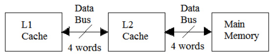

When there is a miss in $L 1$ cache and a hit in $L 2$ cache, a block is transferred from $L 2$ cache to $L 1$ cache. What is the time taken for this transfer?

A. nanoseconds B. nanoseconds C. 22 nanoseconds D. 88 nanoseconds gatecse-2010 co-and-architecture cache-memory normal barc2017

A computer system has an $L 1$ cache, an $L 2$ cache, and a main memory unit connected as shown The block size in $L 1$ cache is  words. The block size in $L 2$ cache is  words. The memory access times are nanoseconds, nanoseconds and nanoseconds for $L 1$ cache, $L 2$ cache and the main memory unit respectively.

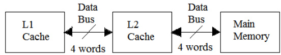

When there is a miss in both $L 1$ cache and $L 2$ cache, first a block is transferred from main memory to $L 2$ cache, and then a block is transferred from $L 2$ cache to $_ { L 1 }$ cache. What is the tota time taken for these transfers?

A. nanoseconds B. nanoseconds C. nanoseconds D. nanoseconds

gatecse-2010 co-and-architecture cache-memory normal

1 valid bit   
1 modified bit   
As many bits as the minimum needed to identify the memory block mapped in the cache.

What is the total size of memory needed at the cache controller to store meta-data (tags) for the cache?

A. bits B. bits C. bits D. bits

gatecse-2011 co-and-architecture cache-memory normal

A computer has a , 4-way set associative, write back data cache with block size of . The processor sends  addresses to the cache controller. Each cache tag directory entry contains, in addition to address tag, valid bits, modified bit and replacement bit.

The number of bits in the tag field of an address is

A. B. C. D.

gatecse-2012 co-and-architecture cache-memory normal

# Answer key☟

A computer has a - , 4-way set associative, write back data cache with block size of . The processor sends   addresses to the cache controller. Each cache tag directory entry contains, in addition to address tag, valid bits, modified bit and replacement bit.

The size of the cache tag directory is:

A. 160 Kbits B. 136 Kbits C. 40 Kbits D. 32 Kbits

normal gatecse-2012 co-and-architecture cache-memory

# Answer key☟

In a -way set associative cache, the cache is divided into $v$ sets, each of which consists of $k$ lines. lines of a set are placed in sequence one after another. The lines in set $\pmb { s }$ are sequenced before the lines in set $( s + 1 )$ . The main memory blocks are numbered 0 onwards. The main memory block numbered $j$ must be mapped to any one of the cache lines from

A. $( j { \bmod { v } } ) * k$ to $( j { \bmod { v } } ) * k + ( k - 1 )$ B. $( j \bmod v )$ to $( j { \bmod { v } } ) + ( k - 1 )$ C. $( j { \bmod { k } } )$ to $( j \operatorname { m o d } k ) + ( v - 1 )$ D. $( j { \bmod { k } } ) * v$ to $( j { \bmod { k } } ) * v + ( v - 1 )$

gatecse-2013 co-and-architecture cache-memory normal

In designing a computer's cache system, the cache block (or cache line) size is an important parameter. Which one of the following statements is correct in this context?

A. A smaller block size implies better spatial locality   
B. A smaller block size implies a smaller cache tag and hence lower cache tag overhead   
C. A smaller block size implies a larger cache tag and hence lower cache hit time   
D. A smaller block size incurs a lower cache miss penalty

gatecse-2014-set2 co-and-architecture cache-memory normal

If the associativity of a processor cache is doubled while keeping the capacity and block size unchanged, which one of the following is guaranteed to be NOT affected?

A. Width of tag comparator B. Width of set index decoder C. Width of way selection multiplexer D. Width of processor to main memory data bus

A -way set-associative cache memory unit with a capacity of $1 6 \mathsf { K B }$ is built using a block size of words. The word length is bits. The size of the physical address space is GB. The number of bits for the TAG field is

gatecse-2014-set2 co-and-architecture cache-memory numerical-answers normal

The memory access time is  nanosecond for a read operation with a hit in cache,  nanoseconds for a read operation with a miss in cache, nanoseconds for a write operation with a hit in cache and  nanoseconds for a write operation with a miss in cache. Execution of a sequence of instructions involves 100 instruction fetch operations, memory operand read operations and memory operand write operations. The cache hit-ratio is . The average memory access time (in nanoseconds) in executing the sequence of instructions is

gatecse-2014-set3 co-and-architecture cache-memory numerical-answers normal

# 1.5.38 Cache Memory: GATE CSE 2015 Set 2 Question: 24

Assume that for a certain processor, a read request takes 50 nanoseconds on a cache miss and 5 nanoseconds on a cache hit. Suppose while running a program, it was observed that $8 0 \%$ of the processor's read requests result in a cache hit. The average read access time in nanoseconds is

gatecse-2015-set2 co-and-architecture cache-memory easy numerical-answers

The width of the physical address on a machine is  bits. The width of the tag field in a  KB -way se associative cache is bits.

gatecse-2016-set2 co-and-architecture cache-memory normal numerical-answers

A file system uses an in-memory cache to cache disk blocks. The miss rate of the cache is shown in figure. The latency to read a block from the cache is ms and to read a block from the disk is $1 0 ~ \mathsf { m s }$ . Assume that the cost of checking whether a block exists in the cache is negligible. Available cache sizes are in multiples of  MB.

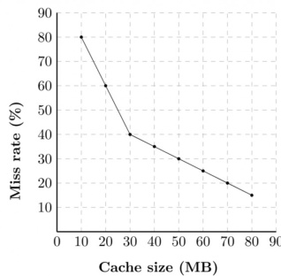

The smallest cache size required to ensure an average read latency of less than  ms is MB.

gatecse-2016-set2 co-and-architecture cache-memory normal numerical-answers

Consider a two-level cache hierarchy with $L 1$ and $L 2$ caches. An application incurs  memory accesses per instruction on average. For this application, the miss rate of $_ { L 1 }$ cache is ; the $L 2$ cache experiences, on average, 7 misses per instructions. The miss rate of $L 2$ expressed correct to two decimal places is

A cache memory unit with capacity of $N$ words and block size of $B$ words is to be designed. If it is designed as a direct mapped cache, the length of the  field is bits. If the cache unit is now designed as a - way set-associative cache, the length of the field is bits.

gatecse-2017-set1 co-and-architecture cache-memory normal numerical-answers

The read access times and the hit ratios for different caches in a memory hierarchy are as given below:

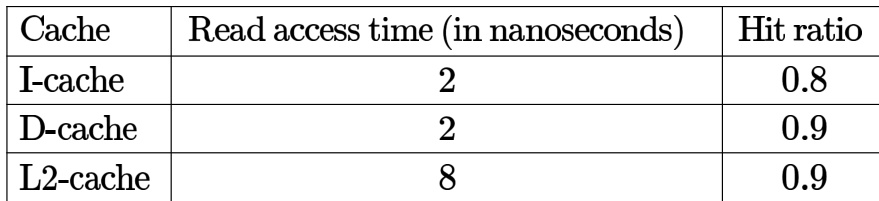

The read access time of main memory in nanoseconds. Assume that the caches use the referred-word-first read policy and the write-back policy. Assume that all the caches are direct mapped caches. Assume that the dirty bit is always 0 for all the blocks in the caches. In execution of a program, $6 0 \%$ of memory reads are for instruction fetch and $4 0 \%$ are for memory operand fetch. The average read access time in nanoseconds (up to decimal places) is

Consider a machine with a byte addressable main memory of $2 ^ { 3 2 }$ bytes divided into blocks of size  bytes. Assume that a direct mapped cache having cache lines is used with this machine. The size of the tag field in bits is

gatecse-2017-set2 co-and-architecture cache-memory numerical-answers

The size of the physical address space of a processor is $2 ^ { P }$ bytes. The word length is bytes. The capacity of cache memory is bytes. The size of each cache block is $2 ^ { M }$ words. For a $K$ -way setassociative cache memory, the length (in number of bits) of the tag field is

A. $P - N - \log _ { 2 } K$ $\begin{array} { l } { { 8 . \ P - N + \log _ { 2 } K } } \\ { { 0 . \ P - N - M - W + \log _ { 2 } K } } \end{array}$   
C. $P - N - M - W - \log _ { 2 } K$

gatecse-2018 co-and-architecture cache-memory normal two-marks

A certain processor uses a fully associative cache of size $1 6 \mathsf { k B }$ , The cache block size is bytes. Assume that the main memory is byte addressable and uses a -bit address. How many bits are required for the Tag and the Index fields respectively in the addresses generated by the processor?

A. bits and  bits B. bits and  bits C. bits and  bits D. bits and  bits gatecse-2019 co-and-architecture cache-memory normal one-mark

A direct mapped cache memory of  MB has a block size of  bytes. The cache has an access ns and a hit rate of $9 4 \%$ . During a cache miss, it takes 0 ns to bring the first word of a block from the main memory, while each subsequent word takes  ns. The word size is  bits. The average memory access time in ns (round off to  decimal place) is

gatecse-2020 numerical-answers co-and-architecture cache-memory one-mark

A computer system with a word length of  bits has a  MB byte- addressable main memory and $\mathsf { a } 6 4 \mathsf { K } \mathsf { B }$ , -way set associative cache memory with a block size of  bytes. Consider the following four physical addresses represented in hexadecimal notation.

$A 1 = 0 { \times } 4 2 \mathsf C 8 \mathsf A 4$ , $A 2 = 0 { \times } 5 4 6 8 8 8$ , $A 3 = 0 { \times } 6 { \mathsf { A } } 2 8 9 { \mathsf { C } }$ , $\boldsymbol { A 4 } = 0 \times 5 \mathsf { E 4 8 8 0 }$

Which one of the following is TRUE?

A. $A 1$ and $A 4$ are mapped to different cache sets.   
B. $A 2$ and $A 3$ are mapped to the same cache set.   
C. and $A 4$ are mapped to the same cache set.   
D. A1 and $A 3$ are mapped to the same cache set.

Consider a computer system with a byte-addressable primary memory of size bytes. Assume the computer system has a direct-mapped cache of size ( $\mathrm { 1 K B = 2 ^ { 1 0 } }$ bytes), and each cache block is of size  bytes.

The size of the tag field is bits.

gatecse-2021-set1 co-and-architecture cache-memory numerical-answers one-mark

Consider a set-associative cache of size $\mathrm { \Delta T K B = 2 ^ { 1 0 } }$ bytes with cache block size of bytes. Assume that the cache is byte-addressable and a -bit address is used for accessing the cache. If the width of the tag field is bits, the associativity of the cache is

gatecse-2021-set2 numerical-answers co-and-architecture cache-memory one-mark

Which of the following statements is correct?

A. $S _ { 1 }$ is true and $S _ { 2 }$ is false B. $S _ { 1 }$ is false and $S _ { 2 }$ is true C. $S _ { 1 }$ is true and $S _ { 2 }$ is true D. $S _ { 1 }$ is false and $S _ { 2 }$ is false gatecse-2021-set2 co-and-architecture cache-memory two-marks

Let and be two set associative cache organizations that use algorithm for cache block replacement. is a write back cache and  is a write through cache. Which of the following statements is/are

A. Each cache block in  and  has a dirty bit. B. Every write hit in WB leads to a data transfer from cache to main memory. C. Eviction of a block from will not lead to data transfer from cache to main memory. D. A read miss in  will never lead to eviction of a dirty block from

gatecse-2022 co-and-architecture cache-memory multiple-selects one-mark

A cache memory that has a hit rate of  has an access latency and miss penalty 100 ns. optimization is done on the cache to reduce the miss rate. However, the optimization results in an increase of cache access latency to 15 ns, whereas the miss penalty is not affected. The minimum hit rate (rounded off to two decimal places) needed after the optimization such that it should not increase the average memory access time is

gatecse-2022 numerical-answers co-and-architecture cache-memory one-mark

A n -way set associative cache of size $\mathbf { 1 } \mathbf { K } \mathbf { B } = 1 0 2 4$ bytes) is used in a system with -bit address. The address is sub-divided into  and OFFSET.

The number of bits in the is gatecse-2023 co-and-architecture cache-memory numerical-answers two-marks

Consider two set-associative cache memory architectures: , which uses the write back policy, and WTC, which uses the write through policy. Both of them use the (Least Recently Used) block replacement policy. The cache memory is connected to the main memory. Which of the following statements is/are TRUE?

A. A read miss in  never evicts a dirty block   
B. A read miss in  never triggers a write back operation of a cache block to main memory   
C. A write hit in  can modify the value of the dirty bit of a cache block   
D. A write miss in  always writes the victim cache block to main memory before loading the missed block to the cache

A given program has $2 5 \%$ load/store instructions. Suppose the ideal  (cycles per instruction) any memory stalls is . The program exhibits $2 \%$ miss rate on instruction cache and $8 \%$ miss rate on data cache. The miss penalty is  cycles. The speedup (rounded off to two decimal places) achieved with a perfect cache (i.e., with NO data or instruction cache misses) is

gatecse-2024-set1 numerical-answers co-and-architecture cache-memory two-marks

The size of the physical address space of a processor is $2 ^ { 3 2 }$ bytes. The capacity of a cache memory unit is $2 ^ { 2 3 }$ bytes. The cache block size is  bytes. The cache memory unit can be built as a direct mapped cache or as a $K$ -way set-associative cache, where $K = 2 ^ { L }$ and $L \in \{ 1 , 2 , 3 \}$ . Let the length of the TAG field be $M$ bits for the direct mapped cache, and $N$ bits for the set-associative cache.

Which one of the following options is true?

A. $N = M + L$ B $. \ N = M - L$ C. $. \ N = M + K$ D.

gatecse-2026-set1 co-and-architecture two-marks cache-memory

# 1.5.61 Cache Memory: GATE CSE 2026 Set 1 Question: 44

Consider a system that has a cache memory unit and a memory management unit (MMU). The address input to the cache memory is a physical address. The MMU has a translation lookaside buffer (TLB). Assume that when a page is evicted from the main memory, the corresponding blocks in the cache are marked as invalid.

For a given memory reference, which of the following sequences of events can NEVER happen?

A. TLB miss, Page table hit, Cache B. TLB hit, Page table miss, Cache hit hit   
C. TLB miss, Page table miss, Cache D. TLB miss, Page table miss, Cache hit miss

gatecse-2026-set1 co-and-architecture cache-memory two-marks multiple-selects

# Answer key☟

# 1.5.62 Cache Memory: GATE IT 2004 Question: 12, ISRO2016-77

Consider a system with level cache. Access times of Level cache, Level cache and main memory are 1 , 10 , and respectively. The hit rates of Level 1 and Level 2 caches are and , respectively. What is the average access time of the system ignoring the search time within the cache?

A. 13.0 B. 12.8 C. 12.6 D. 12.4

gateit-2004 co-and-architecture cache-memory normal isro2016

Consider a -way set associative cache memory with sets and total cache blocks $( 0 - 7 )$ and a   
memory with blocks $( 0 - 1 2 7 )$ . What memory blocks will be present in the cache after the following   
sequence of memory block references if LRU policy is used for cache block replacement. Assuming that initially the   
cache did not have any memory block from the current job?   
A. B.   
C. D.

gateit-2005 co-and-architecture cache-memory normal

A cache line is  bytes. The main memory has latency and bandwidth . The time required to fetch the entire cache line from the main memory is:

A. B. 64 ns C. 96 ns D. 128 ns

gateit-2006 co-and-architecture cache-memory normal

# Answer key☟

A computer system has a level- instruction cache ( $I$ -cache), a level- data cache $D$ -cache) and a levelcache $L 2$ -cache) with the following specifications:

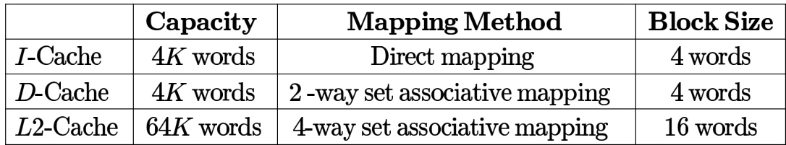

The length of the physical address of a word in the main memory is  bits. The capacity of the tag memory in the $I$ -cache, $D$ -cache and $L 2$ -cache is, respectively,

A. $1 \kappa \kappa 1 8$ -bit, $1 \ \mathsf { K } \ \mathsf { x } \ \mathsf { 1 9 }$ -bit,  K x B. $1 \ \mathsf { K } \times \mathsf { 1 6 }$ -bit, $1 \kappa \kappa 1 9$ -bit,  K x -bit -bit   
C. $1 \kappa \kappa 1 6$ -bit, $5 1 2 \times 1 8$ -bit, $1 \kappa \times$ D. $1 \kappa \kappa 1 8$ -bit, $5 1 2 \times 1 8$ -bit,  K x -bit -bit

gateit-2006 co-and-architecture cache-memory normal

Consider a Direct Mapped Cache with 8 cache blocks (numbered ). If the memory block requests are in the following order   
3,5,2,8,0,63,9,16,20,17,25,18,30,24,2,63,5,82,17,24.

Which of the following memory blocks will not be in the cache at the end of the sequence ?

A. B. C. 20 D.

gateit-2007 co-and-architecture cache-memory normal

# Answer key☟

A. 7,6,7 B. 8,5,7 C. 8,6,6 D. 9,4,7

gateit-2008 co-and-architecture cache-memory normal

Consider a computer with a -ways set-associative mapped cache of the following characteristics: a total of of main memory, a word size of , a block size of  words and a cache size of .

While accessing the memory location by the CPU, the contents of the TAG field of the corresponding cache line is:

A. 000011000 B. 110001111 C. 00011000 D. 110010101

gateit-2008 co-and-architecture cache-memory normal

Consider a -way set associative cache with  blocks and uses replacement. Initially the cache empty. Conflict misses are those misses which occur due to the contention of multiple blocks for the same cache set. Compulsory misses occur due to first time access to the block. The following sequence of access to memory blocks

$\{ 0 , 1 2 8 , 2 5 6 , 1 2 8 , 0 , 1 2 8 , 2 5 6 , 1 2 8 , 1 , 1 2 9 , 2 5 7 , 1 2 9 , 1 , 1 2 9 , 2 5 7 , 1 2 9 \}$ is repeated times. The number of conflict misses experienced by the cache is gatecse-2017-set1 co-and-architecture cache-memory conflict-misses normal numerical-answers

A microprogrammed control unit

A. Is faster than a hard-wired control unit.   
B. Facilitates easy implementation of new instruction.   
C. Is useful when very small programs are to be run.   
D. Usually refers to the control unit of a microprocessor.

gate1987 co-and-architecture control-unit microprogramming

# Answer key☟

# 1.8 DMA (8)

✍ Practice Test: Test 1 (12Q)

# 1.8.1 DMA: GATE CSE 2004 Question: 68

A hard disk with a transfer rate of  Mbytes/second is constantly transferring data to memory using DMA. The processor runs at $6 0 0 ~ \mathsf { M H z }$ , and takes  and  clock cycles to initiate and complete DMA transfer respectively. If the size of the transfer is Kbytes, what is the percentage o processor time consumed for the transfer operation?

A. $5 . 0 \%$ B. $1 . 0 \%$ C. $0 . 5 \%$ D. $0 . 1 \%$

gatecse-2004 dma normal co-and-architecture