Consider a disk drive with the following specifications:

surfaces, tracks/surface, sectors/track, KB/sector, rotation speed  rpm. The disk is operated in cycle stealing mode whereby whenever one byte word is ready it is sent to memory; similarly, for writing, the disk interface reads a  byte word from the memory in each DMA cycle. Memory cycle time is  nsec. The maximum percentage of time that the CPU gets blocked during DMA operation is:

A. B. C. 40 D. 50

gatecse-2005 co-and-architecture disk normal dma

The size of the data count register of a  controller is . The processor needs to transfer a file of kilobytes from disk to main memory. The memory is byte addressable. The minimum number of times the  controller needs to get the control of the system bus from the processor to transfer the file from the disk to main memory is

gatecse-2016-set1 co-and-architecture dma normal numerical-answers

Consider a computer system with support. The module is transferring one -bit character one CPU cycle from a device to memory through cycle stealing at regular intervals. Consider a processor. If $0 . 5 \%$ processor cycles are used for , the data transfer rate of the device is bits per second.

gatecse-2021-set2 numerical-answers co-and-architecture dma one-mark

Which one of the following facilitates transfer of bulk data from hard disk to main memory with the highest throughput?

A. DMA based  transfer B. Interrupt driven  transfer C. Polling based transfer D. Programmed transfer

gatecse-2022 co-and-architecture dma one-mark

# 1.8.6 DMA: GATE CSE 2024 Set 1 Question: 5

​Which one of the following statements is FALSE?

A. In the cycle stealing mode of DMA, one word of data is transferred between an I/O device and main memory in a stolen cycle   
B. For bulk data transfer, the burst mode of DMA has a higher throughput than the cycle stealing mode   
C. Programmed I/O mechanism has a better CPU utilization than the interrupt driven I/O mechanism   
D. The CPU can start executing an interrupt service routine faster with vectored interrupts than with non-vectored interrupts

gatecse-2024-set1 co-and-architecture dma one-mark

A. 2,56,000 B. 3,200 C. 25,60,000 D. 32,000

The storage area of a disk has the innermost diameter of  cm and outermost diameter of $2 0 \ \mathsf { c m }$ . maximum storage density of the disk is  bits/cm. The disk rotates at a speed of  RPM. The main memory of a computer has -bit word length and $1 \mu \ s$ cycle time. If cycle stealing is used for data transfer from the disk, the percentage of memory cycles stolen for transferring one word is

A. $0 . 5 \%$ B. $1 \%$ C. $5 \%$ D. $1 0 \%$

gateit-2004 co-and-architecture dma normal

# Answer key☟

The chip select logic for a certain DRAM chip in a memory system design is shown below. Assume that the memory system has  address lines denoted by $A _ { 1 5 }$ to $A _ { 0 }$ . What is the range of address (in hexadecimal) of the memory system that can get enabled by the chip select (CS) signal?

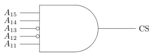

A. C800 to CFFF B. CA00 to CAFF C. C800 to C8FF D. DA00 to DFFF gatecse-2019 co-and-architecture dram memory-interfacing one-mark

A  stage pipelined CPU has the following sequence of stages:

IF – instruction fetch from instruction memory   
RD – Instruction decode and register read   
EX – Execute: ALU operation for data and address computation   
MA – Data memory access – for write access, the register read at RD state is used. WB – Register write back

Consider the following sequence of instructions:

$$
\begin{array} { r l } & { \bullet I _ { 1 } { : } L R 0 , l o c 1 ; R 0 \Leftarrow M [ l o c 1 ] } \\ & { \bullet I _ { 2 } { : } A R 0 , R 0 ; R 0 \Leftarrow R 0 + R 0 } \\ & { \bullet I _ { 3 } { : } S R 2 , R 0 ; R 2 \Leftarrow R 2 - R 0 } \end{array}
$$

Let each stage take one clock cycle.

What is the number of clock cycles taken to complete the above sequence of instructions starting from the fetch of $I _ { 1 }$ ?

A. B. C. D.

Which of the following are NOT true in a pipelined processor?

I. Bypassing can handle all RAW hazards II. Register renaming can eliminate all register carried WAR hazards III. Control hazard penalties can be eliminated by dynamic branch prediction

A. and II only B. and III only C. II and III only D. I, II and III

gatecse-2008 pipelining co-and-architecture normal data-dependency

Consider the following code sequence having five instructions from $I _ { 1 }$ to $I _ { 5 }$ . Each of these instructions has the following format.

OP Ri, Rj, Rk   
Where operation OP is performed on contents of registers Rj and Rk and the result is stored in register Ri. $I _ { 1 }$ : ADD R1, R2, R3   
$I _ { 2 }$ : MUL R7, R1, R3   
$I _ { 3 }$ : SUB R4, R1, R5   
$I _ { 4 }$ : ADD R3, R2, R4   
$I _ { 5 }$ : MUL R7, R8, R9   
Consider the following three statements.   
S1: There is an anti-dependence between instructions $I _ { 2 }$ and $I _ { 5 }$   
S2: There is an anti-dependence between instructions $I _ { 2 }$ and $I _ { 4 }$   
S3: Within an instruction pipeline an anti-dependence always creates one or more stalls   
Which one of the above statements is/are correct?

A. Only S1 is true B. Only S2 is true C. Only S1 and S3 are true D. Only S2 and S3 are true

Data forwarding techniques can be used to speed up the operation in presence of data dependencies.   
Consider the following replacements of LHS with RHS.

$$
{ \begin{array} { r l } { R 1  L o c , L o c  R 2 } & { \equiv R 1  R 2 , R 1  L o c } \\ { R 1  L o c , L o c  R 2 } & { \equiv R 1  R 2 } \\ { R 1  L o c , R 2  L o c } & { \equiv R 1  L o c } \\ { R 1  L o c , R 2  L o c } & { \equiv R 2  L o c } \end{array} }
$$

In which of the following options, will the result of executing the RHS be the same as executing the LHS irrespective of the instructions that follow ?

A. and iii B. and iv C. ii and iii D. ii and iv

A. Read-after-read B. Read-after-write C. Write-after-read D. Write-after-write gatecse-2026-set1 co-and-architecture data-hazards easy one-mark

A single bus CPU consists of four general purpose register, namely, $R 0 , . . . , { \mathrm { \bar { { R 3 } } } }$ ,ALU,MAR,MDR,PC,SP and (Instruction Register). Assuming suitable microinstructions, write a microroutine for the instruction, ADD $R 0 , R 1$ .

gate1990 descriptive co-and-architecture data-path

Consider the following data path of a simple non-pipelined CPU. The registers $A , B , A _ { 1 } , A _ { 2 }$ ,MDR, the and the are - wide. and are - registers. The is of size $8 \times ( 2 : 1 )$ and the DEMUX is of size $8 \times ( 1 : 2 )$ . Each memory operation takes clock cycles and uses (Memory Address Register) and (Memory Date Register). can be decremented locally.

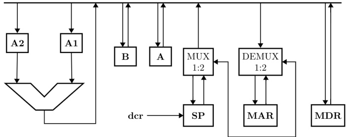

The instruction "push r" where, $r = A$ or $B$ has the specification

$$
\cdot \stackrel { M [ S P ] } { S P }  \stackrel {  } { S P } \_ 1
$$

How many  clock cycles are required to execute the "push r" instruction?

A. B. C. D. gatecse-2001 co-and-architecture data-path machine-instruction normal

Consider the following data path of a CPU.

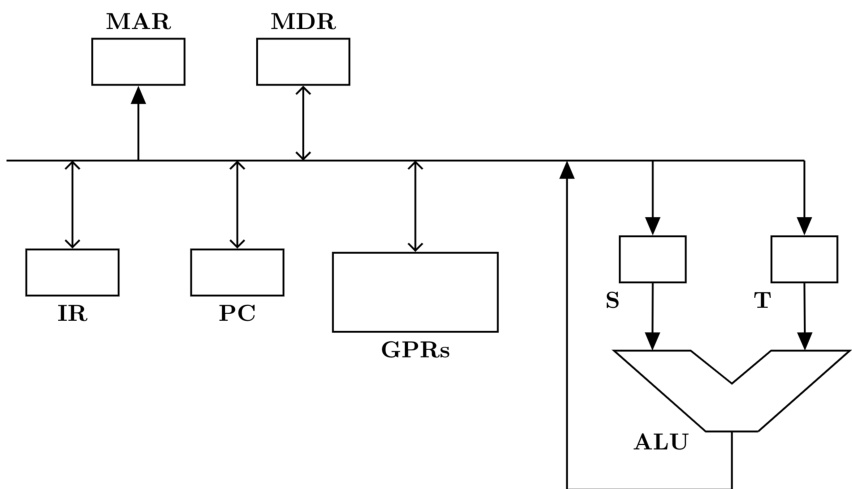

T h e the bus and all the registers in the data path are of identical size. All operations including incrementation of the and the are to be carried out in the Two clock cycles are needed for memory read operation – the first one for loading address in the  and the next one for loading data from the memory bus into the

The instruction  has the register transfer interpretation ${ \mathrm { R 0 } } \Leftarrow { \mathrm { R 0 } } + { \mathrm { R 1 } }$ The minimum number of clock cycles needed for execution cycle of this instruction is:

A. B. C. D.

Consider the following data path of a CPU.

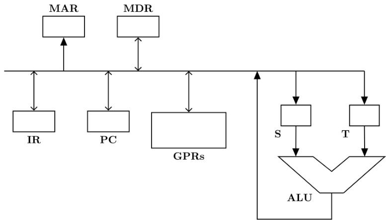

T h e the bus and all the registers in the data path are of identical size. All operations including incrementation of the  and the are to be carried out in the Two clock cycles are needed for memory read operation – the first one for loading address in the  and the next one for loading data from the memory bus into the

The instruction "call Rn, sub” is a two word instruction. Assuming that  is incremented during the fetch cycle of the first word of the instruction, its register transfer interpretation is   
$\mathrm { R n }  \mathrm { P C } + \bf { 1 }$ ;   
$\mathrm { P C } \gets \mathrm { M } [ \mathrm { P C } ] ;$   
The minimum number of CPU clock cycles needed during the execution cycle of this instruction is:

A. B. C. D.

Suppose the functions $F$ and $G$ can be computed in  and  nanoseconds by functional units $U _ { F }$ and $U _ { G }$ respectively. Given two instances of $U _ { F }$ and two instances of $U _ { G }$ , it is required to implement the computation $F ( G ( X _ { i } ) )$ for $1 \leq i \leq 1 0$ . Ignoring all other delays, the minimum time required to complete this computation is nanoseconds.

gatecse-2016-set2 co-and-architecture data-path normal numerical-answers

Consider the following data path diagram.

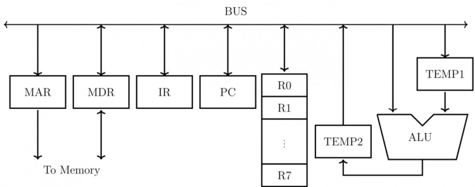

Consider an instruction: $R 0  R 1 + R 2$ . The following steps are used to execute it over the given data path. Assume that PC is incremented appropriately. The subscripts $r$ and $w$ indicate read and write operations, respectively.

1. $R 2 _ { r }$ ， $\mathrm { T E M P } 1 _ { r }$ ， $A L U _ { \mathrm { a d d } }$ ， TEMP2 ω   
2. R1r, $\mathrm { T E M P 1 } _ { w }$   
3. PCr, MARw , $\mathbf { M E M } _ { r }$   
45. ， ROw   
$\mathrm { M D R } _ { r }$ $\mathbb { R } _ { w }$

Which one of the following is the correct order of execution of the above steps?

A. 2,1,4,5,3 B. 1,2,4,3,5 C. 3,5,2,1,4 D. 3,5,1,2,4

A partial data path of a processor is given in the figure, where and  are -bit registers. Which option(s) is/are CORRECT related to arithmetic operations using the data path as shown?

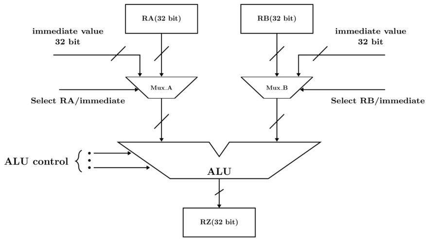

A. The data path can implement arithmetic operations involving two registers.   
B. The data path can implement arithmetic operations involving one register and one immediate value. C. The data path can implement arithmetic operations involving two immediate values.   
D. The data path can only implement arithmetic operations involving one register and one immediate value.

Consider a system with  direct mapped data cache with a block size of The system has physical address space of and a word length of During the execution of a program, four data words and are accessed in that order times ..） Hence, there are accesses to data cache altogether. Assume that the data cache is initially empty and no other data words are accessed by the program. The addresses of the first bytes of Q,R, and  are and $\mathrm { 0 x A 2 6 2 }$ respectively. For the execution of the above program, which of the following statements is/are with respect to the data cache?

A. Every access to is a hit.   
B. Once $\mathbf { P }$ is brought to the cache it is never evicted.   
C. At the end of the execution only  and  reside in the cache.   
D. Every access to evicts $\mathbf { Q }$ from the cache.

gatecse-2022 co-and-architecture direct-mapping multiple-selects two-marks cache-memory

Consider a memory system with  bytes of main memory and $1 6 \mathrm { K }$ bytes of cache memory. Assume that the processor generates -bit memory address, and the cache block size is  bytes. If the cache uses direct mapping, how many bits will be required to store all the values? [Assume memory is byte addressable, $1 \mathrm { K } = 2 ^ { 1 0 }$ , $1 \mathrm { M } = 2 ^ { 2 0 }$ .]

A. ${ \bf 6 } \times { \bf 2 ^ { 1 0 } }$ ${ \mathsf { B } } . \ { \mathsf { 8 } } \times 2 ^ { 1 0 }$ C. $2 ^ { 1 2 }$ D. gatecse2025-set1 co-and-architecture cache-memory direct-mapping easy two-marks

For a direct-mapped cache, bits are used for the tag field and  bits are used to index into a cache block. The size of each cache block is one byte. Assume that there is no other information stored for each cache block.

Which ONE of the following is the CORRECT option for the sizes of the main memory and the cache memory in this system (byte addressable), respectively?

A. KB and KB B. KB and  KB C. KB and  KB D. KB and KB gatecse2025-set2 co-and-architecture direct-mapping cache-memory two-marks

# 1.13.4 Direct Mapping: GATE CSE 2026 Set 2 Question: 42

Consider a system with a processor and ${ \tt a } 4 ~ \mathsf { K } { \tt B }$ direct mapped cache with block size of  bytes. system has a  MB physical memory. Four words $\mathbf { P } , \mathbf { Q } , \mathbf { R }$ , and S are accessed by the processor in the same order times. That is, there are a total of memory references in the sequence $\mathrm { P , Q , R , S , P , Q , R , S , . . . }$

Assume that the cache memory is initially empty. The physical addresses of the words are given below ( word $= 1$ byte).

P: Ox845B32, Q: Ox845B26 R: Ox845B36, S: Ox846B32

Which of the following statements is/are true? Note: $1 \mathrm { K } = 2 ^ { 1 0 }$ and $\mathrm { { 1 M } = 2 ^ { 2 0 } }$

A. Every access to $\mathrm { \bf P }$ results in a cache miss   
B. Every access to $\mathbf { R }$ results in a cache hit   
C. Every access to $\mathbf { Q }$ results in a cache miss   
D. Except the first access to , all subsequent accesses to  result in cache hits

gatecse-2026-set2 co-and-architecture direct-mapping cache-memory multiple-selects two-marks

Consider a system with MB physical memory and a word length of  byte. The system uses a mapped cache, with block numbers starting from . The word with physical address  is mapped to the cache block number . The maximum possible size of the cache (in KB for this configuration is (answer in integer)

gatecse-2026-set2 co-and-architecture direct-mapping cache-memory numerical-answers two-marks

Consider a hard disk with a rotational speed of  rpm. The time to move the read/write head from track to its adjacent track is millisecond. Initially, the head is on track . The number of sectors per track is . The sector size is  bytes. It is necessary to transfer data from  randomly located sectors in each of the following tracks in the order:  and .

The total time for the data transfer (in milliseconds) from the hard disk is (rounded off to one decimal place)

gatecse-2026-set1 numerical-answers operating-system two-marks disk

The EX stage of a pipelined processor performs the memory read operations for LOAD instructions, and the operations for the arithmetic and logic instructions. Let denote the time taken by the EX stage to perform the operation for an instruction. For each instruction type, the values of $t _ { E X }$ and $M$ (the number of instructions of that type in a sequence of  instructions for a program P ), are given in the table below.

The duration of the pipeline clock cycle is  nanosecond. Assume that the latch time for the interstage buffers in the pipeline is negligible.

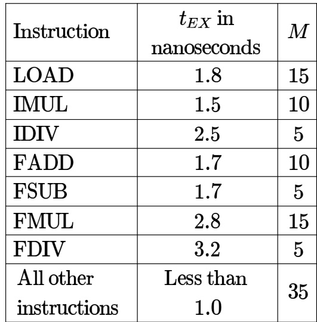

When program $\mathrm { \bf P }$ is executed, the number of clock cycles for which the pipeline is stalled due to structural hazards in the EX stage is (answer in integer)

gatecse-2026-set1 numerical-answers co-and-architecture pipelining hazards two-mark

State whether the following statements are TRUE or FALSE

In a microprocessor-based system, if a bus (DMA) request and an interrupt request arrive sumultaneously, the microprocessor attends first to the bus request.

gate1987 co-and-architecture interrupts io-handling true-false

State whether the following statements are TRUE or FALSE:

Data transfer between a microprocessor and an I/O device is usually faster in memory-mapped-I/O scheme than in I/O-mapped -I/O scheme.

State whether the following statements are TRUE or FALSE with reason:

The data transfer between memory and I/O devices using programmed I/O is faster than interrupt-driven I/O.

gate1990 true-false co-and-architecture io-handling interrupts

A hard disk is connected to a $5 0 ~ \mathsf { M H z }$ processor through a DMA controller. Assume that the initial set-up a DMA transfer takes clock cycles for the processor, and assume that the handling of the interrupt at DMA completion requires clock cycles for the processor. The hard disk has a transfer rate of  Kbytes/sec and average block transferred is $4 \kappa$ bytes. What fraction of the processor time is consumed by the disk, if the disk is actively transferring $1 0 0 \%$ of the time?

gate1996 co-and-architecture io-handling dma numerical-answers normal

The correct matching for the following pairs is:

(A) DMA I/O (1) High speed RAM (B) Cache (2) Disk (C) Interrupt I/O (3) Printer (D) Condition Code Register (4) ALU

A. B-3 C-1 D-2 B. B-1 C-3 D-4   
C. B-3 C-2 D-1 D. B-3 C-4 D-1

gate1997 co-and-architecture normal io-handling match-the-following

# Answer key☟

# 1.16.7 IO Handling: GATE CSE 2008 Question: 64, ISRO2009-13

Which of the following statements about synchronous and asynchronous I/O is NOT true?

A. An ISR is invoked on completion of I/O in synchronous I/O but not in asynchronous I/O   
B. In both synchronous and asynchronous $1 / \mathsf { O }$ , an ISR (Interrupt Service Routine) is invoked after completion of the I/O   
C. A process making a synchronous $1 / \mathsf { O }$ call waits until $1 / \mathsf { O }$ is complete, but a process making an asynchronous I/O call does not wait for completion of the I/O   
D. In the case of synchronous I/O, the process waiting for the completion of $1 / \mathsf { O }$ is woken up by the ISR that is invoked after the completion of I/O

What is the approximate speed up when the DMA controller based design is used in a place of the interrupt driven program based input-output?

A. B. 4.4 C. 5.1 D. 6.7

gatecse-2011 co-and-architecture dma normal io-handling ✍ Practice Test: Test 1 (7Q)

State whether the following statements are TRUE or FALSE with reason: The flags are affected when conditional CALL or JUMP instructions are executed.

gate1990 true-false co-and-architecture instruction-execution

# 1.17.2 Instruction Execution: GATE CSE 1992 Question: 01-iv

Many of the advanced microprocessors prefetch instructions and store it in an instruction buffer to speed up processing. This speed up is achieved because

gate1992 co-and-architecture easy instruction-execution fill-in-the-blanks

Which of the following statements is true?

A. ROM is a Read/Write memory B. PC points to the last instruction that was executed C. Stack works on the principle of LIFO D. All instructions affect the flags

gate1995 co-and-architecture normal instruction-execution

Which of the following is not a form of memory

A. instruction cache B. instruction register C. instruction opcode D. translation look-a-side buffer

gatecse-2002 co-and-architecture easy instruction-execution

Consider a new instruction named branch-on-bit-set (mnemonic bbs). The instruction “bbs reg, pos, label” jumps to label if bit in position pos of register operand reg is one. A register is -bits wide and the bits are numbered  to bit in position  being the least significant. Consider the following emulation of this instruction on a processor that does not have bbs implemented.

$$
t e m p \gets r e g \& m a s k
$$

Branch to label if temp is non-zero. The variable temp is a temporary register. For correct emulation, the variable mask must be generated by

A. $m a s k \gets 0 \mathbf { x } 1 < < p o s$ B. mask ← Oxffffffff $< < p o s$ C. $m a s k \gets p o s$ D. mask← Oxf

gatecse-2006 co-and-architecture normal instruction-execution

Consider a RISC machine where each instruction is exactly bytes long. Conditional and unconditional branch instructions use PC-relative addressing mode with Offset specified in bytes to the target location of the branch instruction. Further the Offset is always with respect to the address of the next instruction in the program sequence. Consider the following instruction sequence

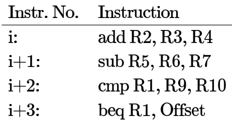

If the target of the branch instruction is $i$ then the decimal value of the Offset is gatecse-2017-set1 co-and-architecture normal numerical-answers instruction-execution

An application executes $6 . 4 \times 1 0 ^ { 8 }$ number of instructions in seconds. There are four types of instructions, the details of which are given in the table. The duration of a clock cycle in nanoseconds is (rounded off to one decimal place)

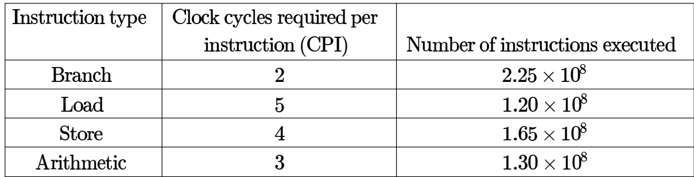

Using an expanding opcode encoding for instructions, is it possible to encode all of the following in an instruction format shown in the below figure. Justify your answer.

14 double address instructions   
127 single address instructions   
60 no address (zero address) instructions

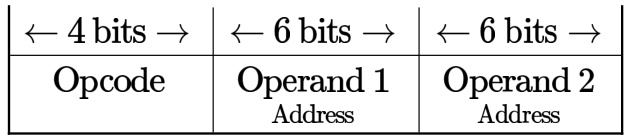

In an -bit computer instruction format, the size of address field is -bits. The computer uses expanding OP code technique and has two-address instructions and one-address instructions. The number of zero-address instructions it can support is

gate1992 co-and-architecture machine-instruction instruction-format normal numerical-answers

State True or False with one line explanation

Expanding opcode instruction formats are commonly employed in RISC. (Reduced Instruction Set Computers) machines.

gate1994 co-and-architecture machine-instruction instruction-format normal true-false

# 1.18.4 Instruction Format: GATE CSE 2014 Set 1 Question: 9

A machine has a architecture, with  long instructions. It has  registers, each of which is bits long. It needs to support instructions, which have an immediate operand in addition to two register operands. Assuming that the immediate operand is an unsigned integer, the maximum value of the immediate operand is

gatecse-2014-set1 co-and-architecture machine-instruction instruction-format numerical-answers normal

Consider a processor with  registers and an instruction set of size twelve. Each instruction has five distinct fields, namely, opcode, two source register identifiers, one destination register identifier, and twelve-bit immediate value. Each instruction must be stored in memory in a byte-aligned fashion. If a program has instructions, the amount of memory (in bytes) consumed by the program text is

gatecse-2016-set2 instruction-format machine-instruction co-and-architecture normal numerical-answers

A processor has integer registers and floating point registers (FO,F1,...,F63). It uses a instruction format. There are four categories of instructions: Type-1,Type-2,Type-3, and category consists of four instructions, each with integer register operands category consists of eight instructions, each with floating point register operands (2Fs). Type-3 category consists of fourteen instructions, each with one integer register operand and one floating point register operand $( \mathrm { { 1 R + 1 F } } )$ ). Type-4 category consists of  instructions, each with a floating point register operand

The maximum value of  is gatecse-2018 co-and-architecture machine-instruction instruction-format numerical-answers two-marks

A processor with general purpose registers uses a a -bit instruction format. The instruction consists of an opcode field, an addressing mode field, two register operand fields, and a -bit scalar field. If addressing modes are to be supported, the maximum number of unique opcodes possible for every addressing mode is

gatecse-2024-set2 numerical-answers co-and-architecture instruction-format two-marks

A processor uses a -bit instruction format and supports byte-addressable memory access. The of the processor has  distinct instructions. The instructions are equally divided into two types, namely -type and -type, whose formats are shown below.

R - type Instruction Format:

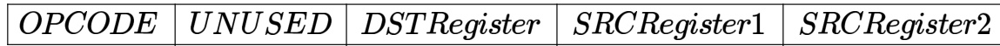

I - type Instruction Format:

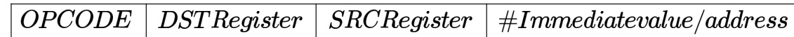

In the OPCODE, 1 bit is used to distinguish between -type and -type instructions and the remaining bits indicate the operation. The processor has  architectural registers, and all register fields in the instructions are of equal size.

Let be the number of bits used to encode the field,  be the number of bits used to encode the field, and be the number of bits used to encode the immediate value/address field. The value of $\mathrm { X + 2 Y + Z }$ is

gatecse-2024-set2 numerical-answers co-and-architecture instruction-format two-mark

Consider a processor whose instruction set architecture is the load-store architecture. The instruction format is such that the first operand of any instruction is the destination operand.

Which one of the following sequences of instructions corresponds to the high-level language statement $\begin{array} { r } { \mathbf { Z } = \mathbf { X } + \mathbf { Y } } \end{array}$ ?

Note: X, Y, and Z are memory operands. R , R , and R are registers.

A. ADD Z, X, Y B. LOAD R , X ADD Z, R , Y C. ADD R , X, Y STORE Z, R D. LOAD R , X LOAD R , Y ADD R , R , R STORE Z, R

gatecse-2026-set1 co-and-architecture instruction-format one-mark number of unique opcodes possible for C-type instructions?

A. B. C. 64 D. gatecse-2026-set2 co-and-architecture machine-instruction instruction-format two-marks

# 1.19.1 Instruction Set Architecture: GATE CSE 2025 Set 2 Question: 18

​Which of the following is/are part of an Instruction Set Architecture of a processor?

A. The size of the cache memory B. The clock frequency of the processor C. The number of cache memory D. The total number of registers levels

gatecse2025-set2 co-and-architecture instruction-set-architecture multiple-selects easy one-mark

# Answer key ☟

# 1.20 Interrupts (10)

✍ Practice Test: Test (11Q)

On receiving an interrupt from a I/O device the CPU:

A. Halts for a predetermined time.   
B. Hands over control of address bus and data bus to the interrupting device.   
C. Branches off to the interrupt service routine immediately.   
D. Branches off to the interrupt service routine after completion of the current instruction.

# Answer key☟

# 1.20.2 Interrupts: GATE CSE 1995 Question: 1.3

In a vectored interrupt:

A. The branch address is assigned to a fixed location in memory   
B. The interrupting source supplies the branch information to the processor through an interrupt vector   
C. The branch address is obtained from a register in the processor   
D. None of the above

gate1995 co-and-architecture interrupts normal

A device employing INTR line for device interrupt puts the CALL instruction on the data bus while:

A. INTA is active B. HOLD is active C. READY is inactive D. None of the above

gatecse-2002 co-and-architecture interrupts normal

A device with data transfer rate $1 0 \mathsf { K B / s e c }$ is connected to a CPU. Data is transferred byte-wise. interrupt overhead be sec. The byte transfer time between the device interface register and CPU or memory is negligible. What is the minimum performance gain of operating the device under interrupt mode over operating it under program-controlled mode?

A. B. C. D.

gatecse-2005 co-and-architecture interrupts

# Answer key☟

# .20.6 Interrupts: GATE CSE 2009 Question: 8, UGCNET-June2012-III: 58

A CPU generally handles an interrupt by executing an interrupt service routine:

A. As soon as an interrupt is raised.   
B. By checking the interrupt register at the end of fetch cycle.   
C. By checking the interrupt register after finishing the execution of the current instruction.   
D. By checking the interrupt register at fixed time intervals.

gatecse-2009 co-and-architecture interrupts normal ugcnetcse-june2012-paper3

Consider the following statements.

I. Daisy chaining is used to assign priorities in attending interrupts.   
II. When a device raises a vectored interrupt, the CPU does polling to identify the source of interrupt.   
III. In polling, the CPU periodically checks the status bits to know if any device needs its attention.   
IV. During DMA, both the CPU and DMA controller can be bus masters at the same time.

Which of the above statements is/are TRUE?

A. and Ⅱ only B. and Ⅳ only C. and Ⅲ only D. Ⅲ only

gatecse-2020 co-and-architecture interrupts one-mark

# 1.20.8 Interrupts: GATE CSE 2023 Question: 24

A keyboard connected to a computer is used at a rate of f1 keystroke per second. The computer system polls the keyboard every $1 0 \mathrm { m s }$ (milli seconds) to check for a keystroke and consumes $1 0 0 \mu \mathbf { s }$ (micro seconds) for each poll. If it is determined after polling that a key has been pressed, the system consumes an additional μs to process the keystroke. Let $T _ { 1 }$ denote the fraction of a second spent in polling and processing a keystroke.

In an alternative implementation, the system uses interrupts instead of polling. An interrupt is raised for every keystroke. It takes a total of $1 \mathrm { m s }$ for servicing an interrupt and processing a keystroke. Let $T _ { 2 }$ denote the fraction of a second spent in servicing the interrupt and processing a keystroke.

The ratio $\frac { T _ { 1 } } { T _ { 2 } }$ is (Rounded off to one decimal place)

Suppose a program is running on a non-pipelined single processor computer system. The computer connected to an external device that can interrupt the processor asynchronously. The processor needs to execute the interrupt service routine (ISR) to serve this interrupt. The following steps (not necessarily in order) are taken by the processor when the interrupt arrives:

i. The processor saves the content of the program counter.   
ii. The program counter is loaded with the start address of the ISR.   
iii. The processor finishes the present instruction.

Which ONE of the following is the CORRECT sequence of steps?

A. B.C. (i)，(i)， () D. ()，(i)，()

gatecse2025-set1 co-and-architecture interrupts easy one-mark

Consider the following two statements about interrupt handling mechanisms in a CPU.

: In non-vectored interrupt mechanism, it usually takes more time to start the Interrupt Service Routine (ISR) when compared to that in a vectored interrupt mechanism.

: In daisy-chain interrupt mechanism, the CPU polls all the input devices individually to determine the source of the interrupt.

Which one of the following options is correct with respect to and

A. Both  and  are true B. Both and  are false C. is true and is false D. S1 is false and  is true

gatecse-2026-set2 co-and-architecture interrupts one-mark

# 1.21 Machine Instruction (21)

✍ Practice Tests: Test 3 (15Q) Test 2 (8Q)

The following program fragment was written in an assembly language for a single address computer with one accumulator register:

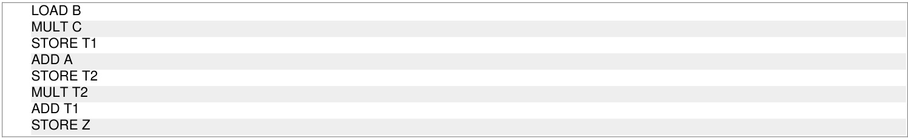

Give the arithmetic expression implemented by the fragment.

A. Assume that a CPU has only two registers $R _ { 1 }$ and $R _ { 2 }$ and that only the following instruction is available $X O R R _ { i } , R _ { j } ; \{ R _ { j }  R _ { i } \oplus R _ { j }$ ， for $\scriptstyle : i , j = 1 , 2 \}$ Using this XOR instruction, find an instruction sequence in order to exchange the contents of the registers $R _ { 1 }$ and $R _ { 2 }$   
B. The line p of the circuit shown in figure has stuck at  fault. Determine an input test to detect the fault.

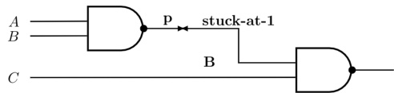

Consider the following program fragment in the assembly language of a certain hypothetical processor. The processor has three general purpose registers $R 1$ ， $R 2$ and $R \bar { 3 }$ . The meanings of the instructions are shown by comments (starting with ;) after the instructions.

X: CMP R1, 0; Compare R1 and 0, set flags appropriately in status register JZ  Z; Jump if zero to target Z MOV R2, R1; Copy contents of R1 to R2 SHR R1; Shift right R1 by 1 bit SHL R1; Shift left R1 by 1 bit CMP R2, R1; Compare R2 and R1 and set flag in status register JZ  Y; Jump if zero to target Y INC R3; Increment R3 by 1;   
Y: SHR R1; Shift right R1 by bit JMP X; Jump to target X   
Z:..   
A. Initially $R 1$ ， $R 2$ and $R 3$ contain the values ,  and  respectively, what are the final values of $R 1$ and $R 3$ when control reaches Z?   
B. In general, if $R 2$ and $R 3$ initially contain the values n, 0, and 0 respectively. What is the final value of $R 3$ when control reaches $Z ?$

Consider the following assembly language program for a hypothetical processor $^ { A , B }$ and $c$ are bit registers. The meanings of various instructions are shown as comments.

MOV B, #0 B←0 MOV C,#8 ； C↑8 Z: CMP C,#0 ； compare C with 0 JZ X ； jump to X if zero flag is set SUB C,#1 ； $C \gets C - 1$ RRC A,#1 right rotate A through carry by one bit. Thus: If the initial values of A and the carry flag are $a _ { 7 } \ldots a _ { 0 }$ and $c _ { 0 }$ respectively, their values after the execution of this instruction will be $c _ { 0 } a _ { 7 } \ldots a _ { 1 }$ and $a _ { 0 }$ respectively. JCY jump to $\mathbf { Y }$ if carry flag is set JMP Z ； jump to Z Y: ADD B,#1 $B \gets B + 1$ JMP Z jump to Z X:

If the initial value of register A is A0 the value of register B after the program execution will be

A. the number of  bits in $A _ { 0 }$ B. the number of  bits in $A _ { 0 }$ C. $A _ { 0 }$ D. 8

Consider the following assembly language program for a hypothetical processor $A , B$ and $c$ are  bit registers. The meanings of various instructions are shown as comments.

MOV #0 B, ; #8 MOV C, ;   
Z: CMP C, ; compare C with 0 #0 JZ X ; jump to X if zero flag is set SUB C, #1 ; $C \gets C - 1$ RRC A, #1 ; right rotate A through carry by one bit. Thus: ; If the initial values of A and the carry flag are $a _ { 7 } . . a _ { 0 }$ and ; $c _ { 0 }$ respectively, their values after the execution of this ; instruction will be $c _ { 0 } a _ { 7 } . . . a _ { 1 }$ and $a _ { 0 }$ respectively. JC Y ; jump to Y if carry flag is set JMP Z ; jump to Z   
Y: ADD B, #1 ; $B \gets B + 1$ JMP Z ; jump to Z

X:

Which of the following instructions when inserted at location $X$ will ensure that the value of the register $A$ after program execution is as same as its initial value?

A. RRC A,#1 B. NOP; no operation C. LRC A,#1; left rotate through D. ADD A,#1 carry flag by one bit

Consider the following program segment for a hypothetical CPU having three user registers $R _ { 1 } , R _ { 2 }$ and $R _ { 3 }$

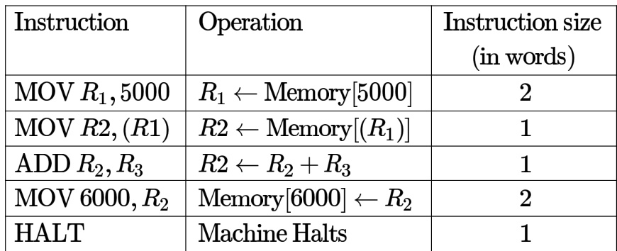

Consider that the memory is byte addressable with size  bits, and the program has been loaded starting from memory location (decimal). If an interrupt occurs while the CPU has been halted after executing the HALT instruction, the return address (in decimal) saved in the stack will be

A. 1007 B. 1020 C. 1024 D. 1028

gatecse-2004 co-and-architecture machine-instruction normal

Consider the following program segment for a hypothetical CPU having three user registers $R _ { 1 } , R _ { 2 }$ and $R _ { 3 }$

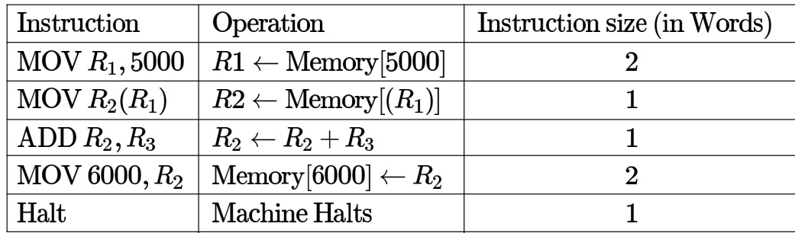

Let the clock cycles required for various operations be as follows:

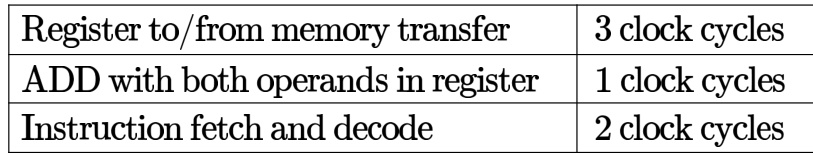

The total number of clock cycles required to execute the program is

A. B. C. D.

gatecse-2004 co-and-architecture machine-instruction normal

# Answer key☟

In a simplified computer the instructions are:

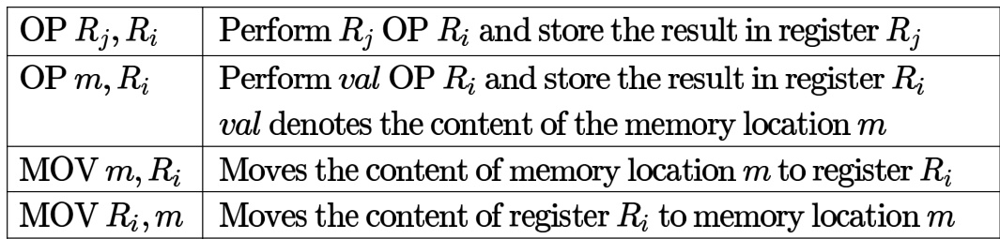

The computer has only two registers, and OP is either ADD or SUB. Consider the following basic block:

$$
\begin{array} { r } { \mathbf { \langle } t _ { 1 } = a + b } \\ { \mathbf { \langle } t _ { 2 } = c + d } \\ { \mathbf { \langle } t _ { 3 } = e - t _ { 2 } } \\ { \mathbf { \langle } t _ { 4 } = t _ { 1 } - t _ { 3 } } \end{array}
$$

Assume that all operands are initially in memory. The final value of the computation should be in memory. What is the minimum number of MOV instructions in the code generated for this basic block?

A. B. C. D. 6

gatecse-2007 co-and-architecture machine-instruction normal

Consider the following program segment. Here  and  are the general purpose registers.

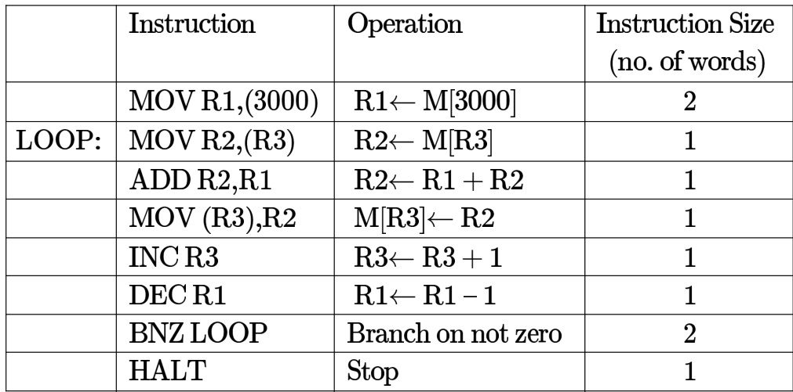

Assume that the content of memory location is  and the content of the register is . The content of each of the memory locations from to is . The program is loaded from the memory location . All the numbers are in decimal.

Assume that the memory is word addressable. The number of memory references for accessing the data in executing the program completely is

A. B. C. D.

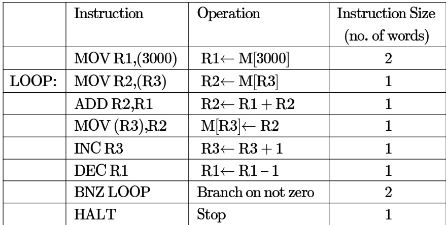

Assume that the content of memory location  is and the content of the register is . The content of each of the memory locations from to is . The program is loaded from the memory location . All the numbers are in decimal.

Assume that the memory is word addressable. After the execution of this program, the content of memory location is:

A. 100 B. 101 C. 102 D. 110

gatecse-2007 co-and-architecture machine-instruction interrupts normal

Consider the following program segment. Here  and  are the general purpose registers.

Assume that the content of memory location  is and the content of the register is 2000. The content of each of the memory locations from to is The program is loaded from the memory location All the numbers are in decimal.

Assume that the memory is byte addressable and the word size is bits. If an interrupt occurs during the execution of the instruction “INC R3”, what return address will be pushed on to the stack?

A. 1005 B. 1020 C. 1024 D. 1040

gatecse-2007 co-and-architecture machine-instruction interrupts normal

A. only B. II only C. and II only D. I, II and III only

gatecse-2008 co-and-architecture machine-instruction normal

# 1.21.14 Machine Instruction: GATE CSE 2015 Set 2 Question: 42

Consider a processor with byte-addressable memory. Assume that all registers, including program counter (PC) and Program Status Word (PSW), are size of two bytes. A stack in the main memory is implemented from memory location $( 0 1 0 0 ) _ { 1 6 }$ and it grows upward. The stack pointer (SP) points to the top element of the stack. The current value of SP is $( 0 1 6 E ) _ { 1 6 }$ . The CALL instruction is of two words, the first word is the op-code and the second word is the starting address of the subroutine (one word $= 2$ bytes). The CALL instruction is implemented as follows:

Store the current value of PC in the stack Store the value of PSW register in the stack Load the statring address of the subroutine in PC

The content of PC just before the fetch of a CALL instruction is $( 5 F A 0 ) _ { 1 6 }$ . After execution of the CALL instruction, the value of the stack pointer is:

A. (016A)16 B. (016C)16 C. (0170)16 D. (0172)16

A processor has distinct instruction and general purpose registers. A -bit instruction word has an opcode, two registers operands and an immediate operand. The number of bits available for the immediate operand field is

gatecse-2016-set2 machine-instruction co-and-architecture easy numerical-answers

Consider the following instruction sequence where registers and are general purpose and denotes the content at the memory location

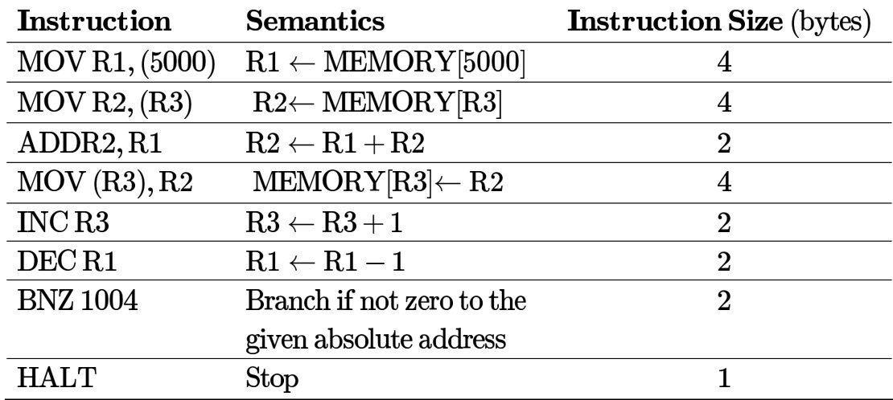

Assume that the content of the memory location is , and the content of the register is . The content of each of the memory locations from to is . The instruction sequence starts from the memory location . All the numbers are in decimal format. Assume that the memory is byte addressable.

After the execution of the program, the content of memory location is

Consider the given -code and its corresponding assembly code, with a few operands U1-U4 being unknown. Some useful information as well as the semantics of each unique assembly instruction is annotated as inline comments in the code. The memory is byte-addressable.

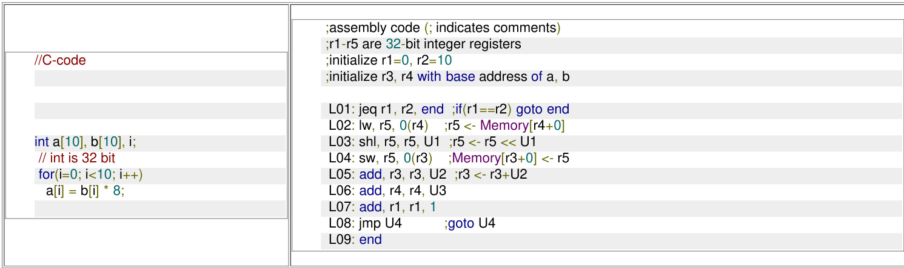

Which one of the following options is a CORRECT replacement for operands in the position n the above assembly code?

A. (8,4,1,L02) B. (3,4,4,L01) C. (8,1,1,L02) D. (3,1,1,L01)

gatecse-2023 co-and-architecture machine-instruction two-marks

A processor has  general-purpose registers and distinct instruction types. An instruction is encoded in -bits. What is the maximum number of bits that can be used to store the immediate operand for the given instruction?

ADD , / / R1=R1+25

A. B. C. 22 D. gatecse2025-set1 co-and-architecture machine-instruction easy two-marks

# Answer key☟

If we use internal data forwarding to speed up the performance of a CPU (R1, R2 and R3 are registers and M[100] is a memory reference), then the sequence of operations

$\mathsf { R 1 } \to \mathsf { M } [ 1 0 0 ]$ $\mathsf { M } [ 1 0 0 ] \to \mathsf { R } 2$ $\mathsf { M } [ 1 0 0 ] \to \mathsf { R } 3$ can be replaced by

A. $\mathsf { R 1 } \to \mathsf { R 3 }$ ${ \mathsf { R } } 2  { \mathsf { M } } [ 1 0 0 ]$ C. $\mathsf { R 1 } \to \mathsf { M } [ 1 0 0 ]$ ${ \mathsf { R } } 2 \to { \mathsf { R } } 3$

B. $\mathsf { M } [ 1 0 0 ] \to \mathsf { R } 2$ $\mathsf { R 1 } \to \mathsf { R 2 }$ $\mathsf { R 1 } \to \mathsf { R 3 }$   
D. $\mathsf { R 1 } \to \mathsf { R 2 }$ $\mathsf { R 1 } \to \mathsf { R 3 }$ $\mathsf { R 1 } \to \mathsf { M } [ 1 0 0 ]$

gateit-2004 co-and-architecture machine-instruction easy

# Answer key☟

instruction using the result.

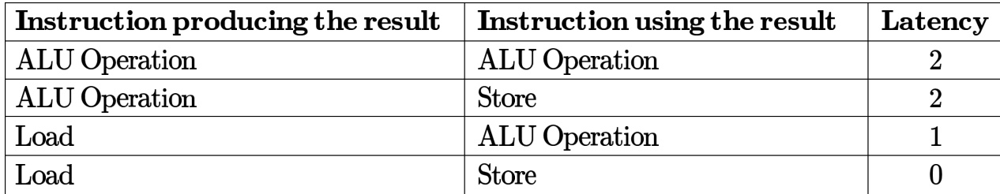

Consider the following code segment:

Load R1, Loc 1; Load R1 from memory location Loc1   
Load R2, Loc 2; Load R2 from memory location Loc 2   
Add R1, R2, R1; Add R1 and R2 and save result in R1   
Dec R2; Decrement R2   
Dec R1; Decrement R1   
Mpy R1, R2, R3; Multiply R1 and R2 and save result in R3   
Store R3, Loc 3; Store R3 in memory location Loc 3

What is the number of cycles needed to execute the above code segment assuming each instruction takes one cycle to execute?

A. B. C. D.

gateit-2007 co-and-architecture machine-instruction normal

Assume that $\mathsf { E A } = ( \mathsf { X } ) +$ is the effective address equal to the contents of location $\mathsf { X }$ , with $\mathsf { X }$ incremented by one word length after the effective address is calculated; $\mathsf E \mathsf E = - ( \mathsf X )$ is the effective address equal to the contents of location X, with X decremented by one word length before the effective address is calculated; $\mathsf E \mathsf E = ( \mathsf X ) -$ is the effective address equal to the contents of location $\mathsf { X }$ , with $\mathsf { x }$ decremented by one word length after the effective address is calculated. The format of the instruction is (opcode, source, destination), which means (destination $$ source op destination). Using $\mathsf { X }$ as a stack pointer, which of the following instructions can pop the top two elements from the stack, perform the addition operation and push the result back to the stack.

A. ADD (X)−, (X) B. ADD (X), (X)− C. ADD −(X), $( \mathsf { X } ) +$ D. ADD −(X), (X)

gateit-2008 co-and-architecture machine-instruction normal

# Answer key☟

State whether the following statements are TRUE or FALSE with reason:

Transferring data in blocks from the main memory to the cache memory enables an interleaved main memory unit to operate at its maximum speed.

gate1990 true-false co-and-architecture cache-memory memory-interfacing

A CPU has a cache with block size  bytes. The main memory has $k$ banks, each bank being $c$ bytes wide. Consecutive  − byte chunks are mapped on consecutive banks with wrap-around. All the $k$ banks can be accessed in parallel, but two accesses to the same bank must be serialized. A cache block access may involve multiple iterations of parallel bank accesses depending on the amount of data obtained by accessing all the $k$ banks in parallel. Each iteration requires decoding the bank numbers to be accessed in parallel and this takes ${ \frac { k } { 2 } } n s .$ .The latency of one bank access is  ns. If $c = 2$ and $k = 2 4 .$ , the latency of retrieving a cache block starting at address zero from main memory is:

A. ns B. ns C. ns D. ns gatecse-2006 co-and-architecture cache-memory memory-interfacing normal

A processor can support a maximum memory of , where the memory is word-addressable (a word consists of two bytes). The size of address bus of the processor is at least bits.

gatecse-2016-set1 co-and-architecture easy numerical-answers memory-interfacing

A 32-bit wide main memory unit with a capacity of is built using $2 5 6 N \times 4$ DRAM chips. number of rows of memory cells in the DRAM chip i s . The time taken to perform one refresh operation is 50 nanoseconds. The refresh period is The percentage (rounded to the closest integer) of the time available for performing the memory read/write operations in the main memory unit is

gatecse-2018 co-and-architecture memory-interfacing normal numerical-answers one-mark

A  kilobyte  byte-addressable memory is realized using four  memory blocks. Two input address lines  are connected to the chip select  port of these memory blocks through a decoder as shown in the figure. The remaining ten input address lines from  are connected to the address port of these blocks. The chip select  is active high.

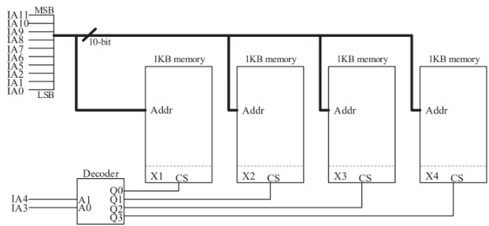

The input memory addresses in decimal, for the starting locations $( \mathbf { A d d r } = 0 )$ ） of each block (indicated as X1 in the figure) are among the options given below. Which one of the following options is

A. (0,1,2,3) B. (0,1024,2048,3072) C. (0,8,16,24) D. (0,0,0,0)

gatecse-2023 co-and-architecture memory-interfacing two-marks

# Answer key☟

Find out the width of the control memory of a horizontal microprogrammed control unit, given the following specifications:

control lines for the processor consisting of ALU and registers.   
Conditional branching facility by checking 4 status bits.   
Provision to hold words in the control memory.

gate1987 co-and-architecture microprogramming descriptive

A micro program control unit is required to generate a total of control signals. Assume that during any micro instruction, at most two control signals are active. Minimum number of bits required in the control word to generate the required control signals will be:

A. B. 2.5 C. 10 D.

gate1996 co-and-architecture microprogramming normal

# Answer key☟

A micro instruction is to be designed to specify: a. none or one of the three micro operations of one kind and b. none or upto six micro operations of another kind

The minimum number of bits in the micro-instruction is:

A. B. 5 C. 8 D. None of the above

gate1997 co-and-architecture microprogramming normal

Answer key☟

# 1.23.4 Microprogramming: GATE CSE 1999 Question: 2.19

Arrange the following configuration for CPU in decreasing order of operating speeds: Hard wired control, Vertical microprogramming, Horizontal microprogramming.

A. Hard wired control, Vertical microprogramming, Horizontal microprogramming.   
B. Hard wired control, Horizontal microprogramming, Vertical microprogramming.   
C. Horizontal microprogramming, Vertical microprogramming, Hard wired control.   
D. Vertical microprogramming, Horizontal microprogramming, Hard wired control.

gate1999 co-and-architecture microprogramming normal

The microinstructions stored in the control memory of a processor have a width of bits. Each microinstruction is divided into three fields: a micro-operation field of bits, a next address field $( X )$ and a MUX select field $( Y )$ There are status bits in the input of the MUX.

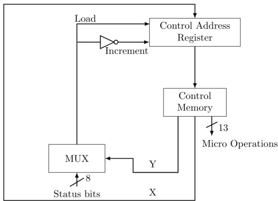

How many bits are there in the $X$ and $Y$ fields, and what is the size of the control memory in number of words?

A. 10,3,1024 B. 8,5,256 C. 5,8,2048 D. 10,3,512

gatecse-2004 co-and-architecture microprogramming normal

Consider the following sequence of micro-operations.

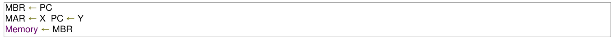

Which one of the following is a possible operation performed by this sequence?

A. Instruction fetch B. Operand fetch C. Conditional branch D. Initiation of interrupt service gatecse-2013 co-and-architecture microprogramming normal

A CPU has only three instructions $I 1 , I 2$ and $\mathbf { \nabla } _ { I 3 }$ ， which use the following signals in time steps $T 1 - T 5$ :

$I 1 : T 1$ Ain, Bout, Cin PCout, Bin $T 3$ Zout, Ain : Bin, Cout End   
I2 : T1 Cin, Bout, Din Aout, Bin $T 3$ Zout, Ain : Bin, Cout End   
$I 3 : T 1 : \mathsf { D i n }$ , Aout $\mathbf { \mathit { T 2 } }$ Ain, Bout $T 3 : Z \circ { \mathfrak { u } } { \mathfrak { t } }$ , Ain $T 4$ : Dout, Ain $T 5$ End

Which of the following logic functions will generate the hardwired control for the signal Ain ?

A. $T 1 . I 1 + T 2 . I 3 + T 4 . I 3 + T 3$ B. $( T 1 + T 2 + T 3 ) . I 3 + T 1 . I 1$   
C. $( T 1 + T 2 ) . I 1 + ( T 2 + T 4 ) . I 3 + T 3$ D. $( T 1 + T 2 ) . I 2 + ( T 1 + T 3 ) . I 1 + T 3$

gateit-2004 co-and-architecture microprogramming normal

A hardwired CPU uses control signals $S _ { 1 }$ to $S _ { 1 0 }$ , in various time steps $T _ { 1 }$ to $T _ { 5 }$ , to implement instructions $I _ { 1 }$ to $I _ { 4 }$ as shown below:

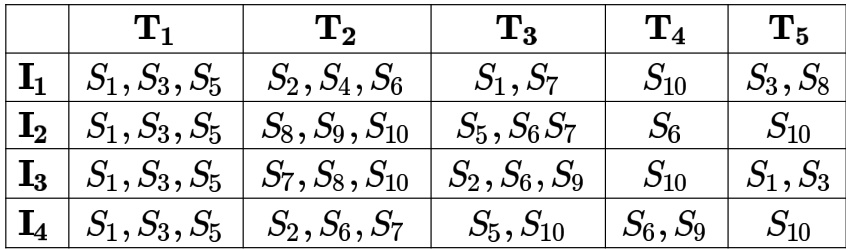

Which of the following pairs of expressions represent the circuit for generating control signals $S _ { 5 }$ and $S _ { 1 0 }$ respectively?   
$( ( I _ { j } + I _ { k } ) T _ { n }$ indicates that the control signal should be generated in time step $T _ { n }$ if the instruction being executed is $I _ { j }$ or $l _ { k }$ ）   
A. $S _ { 5 } = T _ { 1 } + I _ { 2 } \cdot T _ { 3 }$ and $S _ { 1 0 } = ( I _ { 1 } + I _ { 3 } ) \cdot T _ { 4 } + ( I _ { 2 } + I _ { 4 } ) \cdot T _ { 5 }$   
B. $S _ { 5 } = T _ { 1 } + ( I _ { 2 } + I _ { 4 } ) \cdot T _ { 3 }$ and $S _ { 1 0 } = ( I _ { 1 } + I _ { 3 } ) \cdot T _ { 4 } + ( I _ { 2 } + I _ { 4 } ) \cdot T _ { 5 }$   
C. $S _ { 5 } = T _ { 1 } + ( I _ { 2 } + I _ { 4 } ) \cdot T _ { 3 }$ and $S _ { 1 0 } = ( I _ { 2 } + I _ { 3 } + I _ { 4 } ) \cdot T _ { 2 } + ( I _ { 1 } + I _ { 3 } ) \cdot T _ { 4 } + ( I _ { 2 } + I _ { 4 } ) \cdot T _ { 5 }$   
D. $S _ { 5 } = T _ { 1 } + ( I _ { 2 } + I _ { 4 } ) \cdot T _ { 3 }$ and $S _ { 1 0 } = ( I _ { 2 } + I _ { 3 } ) \cdot T _ { 2 } + I _ { 4 } \cdot T _ { 3 } + ( I _ { 1 } + I _ { 3 } ) \cdot T _ { 4 } + ( I _ { 2 } + I _ { 4 } ) \cdot T _ { 5 }$

An instruction set of a processor has  signals which can be divided into  groups of mutually exclusive signals as follows:

Group $1 : 2 0$ signals, Group ： signals, Group $\ 3 : 2$ signals, Group ： signals, Group $5 : 2 3$ signals. How many bits of the control words can be saved by using vertical microprogramming over horizontal microprogramming?

A. B. 103 C. D.

gateit-2005 co-and-architecture microprogramming normal

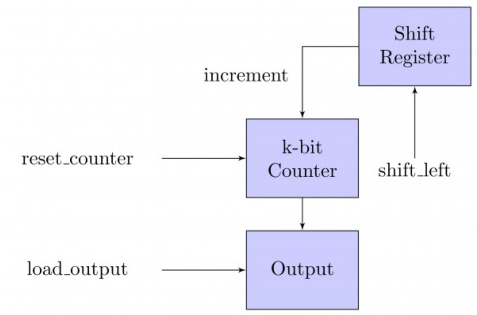

The microprogram for the control is shown in the table below with missing control words for microinstructions $I _ { 1 } , I _ { 2 } , \ldots I _ { n }$ ·

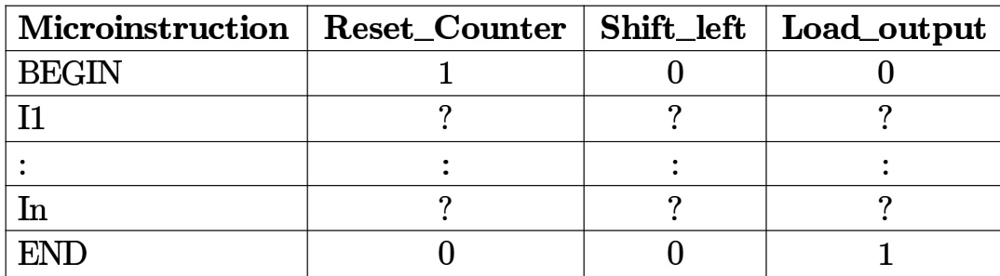

The counter width $( \mathsf { k } )$ , the number of missing microinstructions (n), and the control word for microinstructions $I _ { 1 } , I _ { 2 } , \ldots I _ { n }$ are, respectively,

A. 32,5,010 B. 5,32,010 C. 5,31,011 D. 5,31,010

gateit-2006 co-and-architecture microprogramming normal

# Answer key☟

Consider a CPU where all the instructions require clock cycles to complete execution. There instructions in the instruction set. It is found that control signals are needed to be generated by the control unit. While designing the horizontal microprogrammed control unit, single address field format is used for branch control logic. What is the minimum size of the control word and control address register?

A. 125,7 B. 125,10 C. 135,9 D. 135,10

gateit-2008 co-and-architecture microprogramming normal

# Answer key☟

# 1.24.1 Pipelining: GATE CSE 1999 Question: 13

An instruction pipeline consists of  stages – Fetch $( F )$ , Decode field $( D )$ , Execute $( E )$ and Result Write . The 5 instructions in a certain instruction sequence need these stages for the different number of clock cycles as shown by the table below

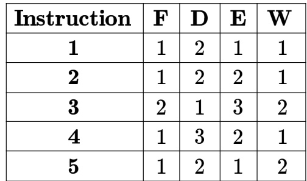

Find the number of clock cycles needed to perform the 5 instructions.

gate1999 co-and-architecture pipelining normal numerical-answers

Comparing the time T1 taken for a single instruction on a pipelined CPU with time T2 taken on a nonpipelined but identical CPU, we can say that

A. T1 ≤ T2 B. ${ \sf T } 1 \geq { \sf T } 2$ C. T1 < T2 D. T1 and T2 plus the time taken for one instruction fetch cycle

gatecse-2000 pipelining co-and-architecture easy

# 1.24.3 Pipelining: GATE CSE 2000 Question: 12

An instruction pipeline has five stages where each stage take 2 nanoseconds and all instruction use all five stages. Branch instructions are not overlapped. i.e., the instruction after the branch is not fetched till the branch instruction is completed. Under ideal conditions,

A. Calculate the average instruction execution time assuming that $20 \%$ of all instructions executed are branch instruction. Ignore the fact that some branch instructions may be conditional.   
B. If a branch instruction is a conditional branch instruction, the branch need not be taken. If the branch is not taken, the following instructions can be overlapped. When $80 \%$ of all branch instructions are conditional branch instructions, and $50 \%$ of the conditional branch instructions are such that the branch is taken, calculate the average instruction execution time.

gatecse-2000 co-and-architecture pipelining normal descriptive

Consider a stage pipeline - IF (Instruction Fetch), ID (Instruction Decode and register read), (Execute), MEM (memory), and WB (Write Back). All (memory or register) reads take place in the second phase of a clock cycle and all writes occur in the first phase. Consider the execution of the following instruction sequence:

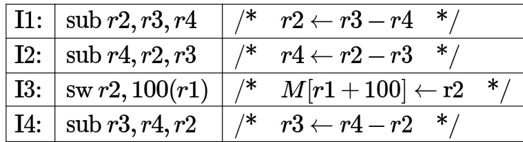

A. Show all data dependencies between the four instructions.   
B. Identify the data hazards.   
C. Can all hazards be avoided by forwarding in this case.

For a pipelined CPU with a single ALU, consider the following situations

I. Th e instruction uses the result o f the instruction as an operand II. The execution of a conditiona jump instruction III. The $j ^ { t h }$ and $\boldsymbol { j } + \mathbf { 1 } ^ { s t }$ instructions require the ALU at the same time.

Which of the above can cause a hazard

A. and II only B. II and III only C. III only D. All the three

gatecse-2003 co-and-architecture pipelining normal isrodec2017

A 4-stage pipeline has the stage delays as , , and nanoseconds, respectively. Registers that are used between the stages have a delay of   each. Assuming constant clocking rate, the total time taken to process data items on this pipeline will be:

A. 120.4 microseconds B. 160.5 microseconds C. 165.5 microseconds D. 590.0 microseconds

gatecse-2004 co-and-architecture pipelining normal

# Answer key☟

# 1.24.8 Pipelining: GATE CSE 2006 Question: 42

A CPU has a five-stage pipeline and runs at $1 \mathsf { G H z }$ frequency. Instruction fetch happens in the first stage of the pipeline. A conditional branch instruction computes the target address and evaluates the condition in the third stage of the pipeline. The processor stops fetching new instructions following a conditional branch until the branch outcome is known. A program executes $1 0 ^ { 9 }$ instructions out of which $2 0 \%$ are conditional branches. If each instruction takes one cycle to complete on average, the total execution time of the program is:

A. 1.0 second B. 1.2 seconds C. 1.4 seconds D. 1.6 seconds

gatecse-2006 co-and-architecture pipelining normal

# Answer key☟

# 1.24.9 Pipelining: GATE CSE 2007 Question: 37, ISRO2009-37

Consider a pipelined processor with the following four stages:

IF: Instruction Fetch   
ID: Instruction Decode and Operand Fetch   
EX: Execute   
WB: Write Back

The IF, ID and WB stages take one clock cycle each to complete the operation. The number of clock cycles for the EX stage depends on the instruction. The ADD and SUB instructions need clock cycle and the MUL instruction needs clock cycles in the EX stage. Operand forwarding is used in the pipelined processor. What is the number of clock cycles taken to complete the following sequence of instructions?

ADD R2, R1, R0 $\begin{array} { c } { { \mathrm { R 2 }  \mathrm { R 1 } \mathrm { + R 0 } } } \\ { { \mathrm { R 4 }  \mathrm { R 3 } \ast \mathrm { R 2 } } } \\ { { \mathrm { R 6 }  \mathrm { R 5 - R 4 } } } \end{array}$   
MUL R4, R3, R2   
SUB R6, R5, R4

A. B. C. D.

Delayed branching can help in the handling of control hazards

For all delayed conditional branch instructions, irrespective of whether the condition evaluates to true or false,

A. The instruction following the conditional branch instruction in memory is executed   
B. The first instruction in the fall through path is executed   
C. The first instruction in the taken path is executed   
D. The branch takes longer to execute than any other instruction

gatecse-2008 co-and-architecture pipelining normal

Delayed branching can help in the handling of control hazards

The following code is to run on a pipelined processor with one branch delay slot:

I1: ADD $R 2  R 7 + R 8$ I2: Sub $R 4  R 5 - R 6$ I3: ADD $R 1  R 2 + R 3$ I4: STORE Memory $[ R 4 ]  R 1$ BRANCH to Label if $R 1 = = 0$

Which of the instructions I1, I2, I3 or I4 can legitimately occupy the delay slot without any program modification?

A. I1 B. I2 C. I3 D. I4

gatecse-2008 co-and-architecture pipelining normal

Consider a  stage pipeline processor. The number of cycles needed by the four instructions $I 1 , I 2 , I 3 , I 4$ in stages $S 1 , S 2 , S 3 , S 4$ is shown below:

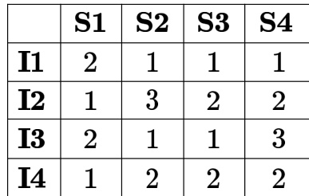

What is the number of cycles needed to execute the following loop? For ( $\mathrm { i } = 1$ to 2) {I1; I2; I3; I4;}

A. B. C. D.

gatecse-2009 co-and-architecture pipelining normal

each for any instruction. The PO stage takes clock cycle for ADD and SUB instructions, clock cycles for MUL instruction and 6 clock cycles for DIV instruction respectively. Operand forwarding is used in the pipeline. What is the number of clock cycles needed to execute the following sequence of instructions?

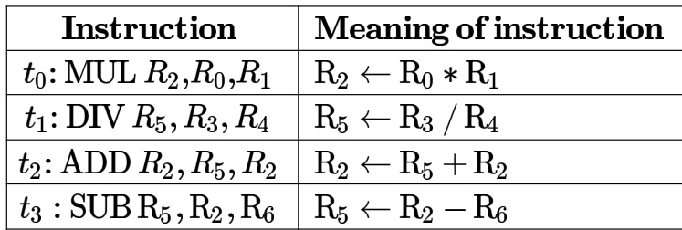

A. B. C. D.

gatecse-2010 co-and-architecture pipelining normal

# Answer key☟

Consider an instruction pipeline with four stages S3 and S4) each with combinational circuit only. The pipeline registers are required between each stage and at the end of the last stage. Delays for the stages and for the pipeline registers are as given in the figure.

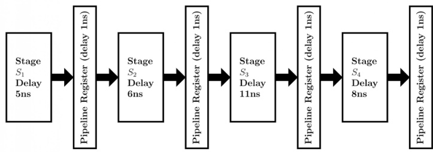

What is the approximate speed up of the pipeline in steady state under ideal conditions when compared to the corresponding non-pipeline implementation?

A. B. 2.5 C. 1.1 D. 3.0

gatecse-2011 co-and-architecture pipelining normal

# Answer key☟

Register renaming is done in pipelined processors:

A. as an alternative to register allocation at compile time   
B. for efficient access to function parameters and local variables   
C. to handle certain kinds of hazards   
D. as part of address translation

gatecse-2012 co-and-architecture pipelining easy isro2016

An instruction pipeline has five stages, namely, instruction fetch (IF), instruction decode and register (ID/RF), instruction execution (EX), memory access (MEM), and register writeback (WB) with stage latencies 1 ns,  ns,  ns, ns, and  ns, respectively (ns stands for nanoseconds). To gain in terms of frequency, the designers have decided to split the ID/RF stage into three stages (ID, RF1, RF2) each of latency $2 . 2 / 3$ ns. Also, the EX stage is split into two stages (EX1, EX2) each of latency  ns. The new design has a total of eight pipeline stages. A program has $2 0 \%$ branch instructions which execute in the EX stage and produce the next instruction pointer at the end of the EX stage in the old design and at the end of the EX2 stage in the new design. The IF stage stalls after fetching a branch instruction until the next instruction pointer is computed. All instructions other than the branch instruction have an average CPI of one in both the designs. The execution times of this program on the old and the new design are $P$ and $Q$ nanoseconds, respectively. The value of $P / Q$ is

gatecse-2014-set3 co-and-architecture pipelining numerical-answers normal

Consider the following processors (ns stands for nanoseconds). Assume that the pipeline registers have zero latency.

Four-stage pipeline with stage latencies 1 ns, 2 ns, 2 ns, 1 ns.   
Four-stage pipeline with stage latencies 1.5 ns, 1.5 ns.   
Five-stage pipeline with stage latencies 0.5 ns, 1 ns, 1 ns, 0.6 ns, 1 ns.   
Five-stage pipeline with stage latencies 1 ns, 1 ns, 1.1 ns.

Which processor has the highest peak clock frequency?

A. B. C. D.

gatecse-2014-set3 co-and-architecture pipelining normal

Consider a non-pipelined processor with a clock rate of  gigahertz and average cycles per instruction four. The same processor is upgraded to a pipelined processor with five stages; but due to the internal pipeline delay, the clock speed is reduced to 2 gigahertz. Assume that there are no stalls in the pipeline. The speedup achieved in this pipelined processor is

gatecse-2015-set1 co-and-architecture pipelining normal numerical-answers

Consider the sequence of machine instruction given below:

MUL R5, R0, R1   
DIV R6, R2, R3   
ADD R7, R5,R6   
SUB R8, R7, R4

In the above sequence, $R 0$ to $R 8$ are general purpose registers. In the instructions shown, the first register shows the result of the operation performed on the second and the third registers. This sequence of instructions is to be executed in a pipelined instruction processor with the following stages:  Instruction Fetch and Decode $( I F )$ , (2) Operand Fetch $( O F )$ , Perform Operation $( P O )$ and  Write back the result $( W B )$ . The $I F$ , $O \dot { F }$ and $\dot { W } B$ stages take clock cycle each for any instruction. The $P O$ stage takes clock cycle for ADD and SUB instruction,  clock cycles for MUL instruction and  clock cycles for DIV instruction. The pipelined processor uses operand forwarding from the PO stage to the OF stage. The number of clock cycles taken for the execution of the above sequence of instruction is

gatecse-2015-set2 co-and-architecture pipelining normal numerical-answers

Consider the following reservation table for a pipeline having three stages $S _ { 1 } , S _ { 2 }$ and .

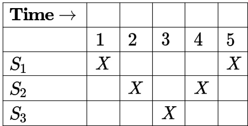

# The minimum average latency (MAL) is

gatecse-2015-set3 co-and-architecture pipelining difficult numerical-answers

The stage delays in a -stage pipeline are and  picoseconds. The first stage (with delay picoseconds) is replaced with a functionality equivalent design involving two stages with respective delays  and  picoseconds. The throughput increase of the pipeline is percent.

gatecse-2016-set1 co-and-architecture pipelining normal numerical-answers

Consider a $3 \mathrm { G H z }$ (gigahertz) processor with a three stage pipeline and stage latencies $\tau _ { 1 } , \tau _ { 2 }$ and $\tau _ { 3 }$ such that $\tau _ { 1 } = \frac { 3 \tau _ { 2 } } { 4 } = 2 \tau _ { 3 }$ . If the longest pipeline stage is split into two pipeline stages of equal latency the new frequency is $\mathrm { G H z }$ , ignoring delays in the pipeline registers.

gatecse-2016-set2 co-and-architecture pipelining normal numerical-answers

Instruction execution in a processor is divided into stages, Instruction Fetch ( I F ) , Instruction Decode (ID), Operand fetch (OF), Execute (EX), and Write Back (WB). These stages take 5, 4, 20, 10 and 3 nanoseconds (ns) respectively. A pipelined implementation of the processor requires buffering between each pair of consecutive stages with a delay of 2 ns. Two pipelined implementation of the processor are contemplated:

i. a naive pipeline implementation (NP) with stages and   
ii. an efficient pipeline (EP) where the OF stage is divided into stages  and  with execution times of 12 ns and 8 ns respectively.

The speedup (correct to two decimal places) achieved by EP over NP in executing independent instructions with no hazards is

The instruction pipeline of a RISC processor has the following stages: Instruction Fetch $( I F )$ , Instruction Decode $( I D )$ , Operand Fetch $( O F )$ , Perform Operation $( P O )$ and Writeback $( W B )$ , The $I F$ , $_ { I D }$ , OF and $W B$ stages take 1 clock cycle each for every instruction. Consider a sequence of  instructions. In the $P O$ stage,  instructions take clock cycles each, instructions take clock cycles each, and the remaining instructions take 1 clock cycle each. Assume that there are no data hazards and no control hazards.

The number of clock cycles required for completion of execution of the sequence of instruction is

gatecse-2018 co-and-architecture pipelining numerical-answers two-marks

Consider a non-pipelined processor operating at $2 . 5 \mathsf { G H z }$ . It takes 5 clock cycles to complete an instruction. You are going to make a - stage pipeline out of this processor. Overheads associated with pipelining force you to operate the pipelined processor at $2 G H z$ . In a given program, assume that $3 0 \%$ are memory instructions, $6 0 \%$ are ALU instructions and the rest are branch instructions. $5 \%$ of the memory instructions cause stalls of clock cycles each due to cache misses and $5 0 \%$ of the branch instructions cause stalls of  cycles each. Assume that there are no stalls associated with the execution of ALU instructions. For this program, the speedup achieved by the pipelined processor over the non-pipelined processor (round off to decimal places) is

gatecse-2020 numerical-answers co-and-architecture pipelining two-marks

A five-stage pipeline has stage delays of and  nanoseconds. The registers that are   
used between the pipeline stages have a delay of  nanoseconds each.   
The total time to execute independent instructions on this pipeline, assuming there are no pipeline stalls, is nanoseconds.

gatecse-2021-set1 co-and-architecture pipelining numerical-answers two-marks

Consider a pipelined processor with stages, , Instruction Decode(ID), , , and . Each stage of the pipeline, except the stage, takes one cycle. Assume that the stage merely decodes the instruction and the register read is performed in the  stage. The stage takes one cycle for  instruction and two cycles for instruction. Ignore pipeline register latencies.

Consider the following sequence of instructions:

ADD, MUL, ADD, MUL,ADD, MUL, ADD, MUL

Assume that every instruction is data-dependent on the instruction just before it and every instruction (except the first ) is data-dependent on the  instruction just before it. The  defined as follows.

$$
S p e e d u p = { \frac { \mathrm { E x e c u t i o n t i m e ~ w i t h o u t ~ o p e r a n d ~ f o r w a r d i n g } } { \mathrm { E x e c u t i o n ~ t i m e ~ w i t h ~ o p e r a n d ~ f o r e a r d i n g } } }
$$

The achieved in executing the given instruction sequence on the pipelined processor (rounded to decimal places) is

Consider a -stage pipelined processor having a delay of (nanoseconds), , and for the first, second, and the third stages, respectively. Assume that there is no other delay and the processor does not suffer from any pipeline hazards. Also assume that one instruction is fetched every cycle.

The total execution time for executing instructions on this processor is gatecse-2023 co-and-architecture pipelining numerical-answers one-mark

Consider a -stage pipelined processor with Instruction Fetch (IF), Instruction Decode (ID), Execute (EX), Memory Access (MEM), and Register Writeback (WB) stages. Which of the following statements about forwarding is/are CORRECT?

A. In a pipelined execution, forwarding means the result from a source stage of an earlier instruction is passed on to the destination stage of a later instruction   
B. In forwarding, data from the output of the MEM stage can be passed on to the input of the EX stage of the next instruction   
C. Forwarding cannot prevent all pipeline stalls   
D. Forwarding does not require any extra hardware to retrieve the data from the pipeline stages

gatecse-2024-set1 multiple-selects co-and-architecture pipelining one-mark ​An instruction format has the following structure:

Instruction Number: Opcode destination reg, source reg- , source reg

Consider the following sequence of instructions to be executed in a pipelined processor:

I 1: DIV R3, R1, R2   
I2: SUB R5, R3, R4   
13: ADD R3, R5, R6   
I 4: MUL R7, R3, R8

Which of the following statements is/are TRUE?

A. There is a RAW dependency on between and B. There is a WAR dependency on 3 between  and C. There is a RAW dependency on 3 between  and D. There is a WAW dependency on between  and gatecse-2024-set2 co-and-architecture multiple-selects pipelining one-mark

A -stage instruction pipeline has stage delays of , and , respectively, nanoseconds. The delay of an inter-stage latch is nanoseconds. Assume that there are no pipeline stalls due to branches and other hazards. The time taken to process instructions in microseconds is (rounded off to two decimal places)

gatecse2025-set2 co-and-architecture pipelining numerical-answers easy two-marks

Consider a pipeline processor with stages $S 1$ to $S 4$ . We want to execute the following loop:

where the time taken (in ns) by instructions $\pi$ to $I 4$ for stages $S 1$ to $S 4$ are given below:

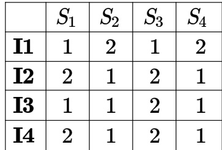

The output of $\pi$ for $i = 2$ will be available after

A. B. 12 ns C. 13 ns D. 28 ns

gateit-2004 co-and-architecture pipelining normal

We have two designs $D 1$ and $D 2$ for a synchronous pipeline processor. $D 1$ has pipeline stages with execution times of nsec, nsec, nsec, nsec and nsec while the design $D 2$ has  pipeline stages each with 2 nsec execution time How much time can be saved using design $D 2$ over design $D 1$ for executing instructions?

A. nsec B. nsec C. nsec D. nsec

gateit-2005 co-and-architecture pipelining normal

# 1.24.36 Pipelining: GATE IT 2006 Question: 78

A pipelined processor uses a stage instruction pipeline with the following stages: Instruction fetch (IF), Instruction decode (ID), Execute (EX) and Writeback (WB). The arithmetic operations as well as the load and store operations are carried out in the EX stage. The sequence of instructions corresponding to the statement $X = ( S - R * ( P + Q ) ) / T$ is given below. The values of variables $P , Q , R , S$ and $T$ are available in the registers $R 0 , R 1 , R 2 , { \ddot { R } } 3$ and $R \bar { 4 }$ respectively, before the execution of the instruction sequence.

$$
\begin{array} { l l l } { { \mathrm { A D D } } } & { { \mathrm { R 5 , R 0 , R 1 } } } & { { \mathrm { ; R 5  R 0 + R 1 } } } \\ { { \mathrm { M U L } } } & { { \mathrm { R 6 , R 2 , R 5 } } } & { { \mathrm { ; R 6  R 2 ^ { \ast } R 5 } } } \\ { { \mathrm { S U B } } } & { { \mathrm { R 5 , R 3 , R 6 } } } & { { \mathrm { ; R 5  R 3 - R 6 } } } \\ { { \mathrm { D I V } } } & { { \mathrm { R 6 , R 5 , R 4 } } } & { { \mathrm { ; R 6  R 5 / R 4 } } } \\ { { \mathrm { S T O R E } } } & { { \mathrm { R 6 , X } } } & { { \mathrm { ; X  R 6 } } } \end{array}
$$

The number of Read-After-Write (RAW) dependencies, Write-After-Read( WAR) dependencies, and Write-AfterWrite (WAW) dependencies in the sequence of instructions are, respectively,

A. B. 3,2,3 C. 4,2,2 D. 3,3,2

gateit-2006 co-and-architecture pipelining normal

# 1.24.37 Pipelining: GATE IT 2006 Question: 79

A pipelined processor uses a 4-stage instruction pipeline with the following stages: Instruction fetch (IF), Instruction decode (ID), Execute (EX) and Writeback (WB). The arithmetic operations as well as the load and store operations are carried out in the EX stage. The sequence of instructions corresponding to the statement $X = ( S - R * ( P + Q ) ) / T$ is given below. The values of variables $P , Q , R , S$ and $T$ are available in the registers $R 0 , R 1 , R 2 , R 3$ and $R 4$ respectively, before the execution of the instruction sequence.

$$
\begin{array} { l l l } { \mathrm { A D D } } & { R 5 , R 0 , R 1 } & { ; R 5 \gets \mathrm { R 0 + R 1 } } \\ { \mathrm { M U L } } & { R 6 , R 2 , R 5 } & { ; R 6 \gets \mathrm { R 2 } ^ { * } \mathrm { R 5 } } \\ { \mathrm { S U B } } & { R 5 , R 3 , R 6 } & { ; R 5 \gets \mathrm { R 3 - R 6 } } \\ { \mathrm { D I V } } & { R 6 , R 5 , R 4 } & { ; R 6 \gets \mathrm { R 5 / R 4 } } \\ { \mathrm { S T O R E } } & { R 6 , X } & { ; X \gets \mathrm { R 6 } } \end{array}
$$

The IF, ID and WB stages take 1 clock cycle each. The EX stage takes 1 clock cycle each for the ADD, SUB and STORE operations, and 3 clock cycles each for MUL and DIV operations. Operand forwarding from the EX stage to the ID stage is used. The number of clock cycles required to complete the sequence of instructions is

A. B. C. D.

gateit-2006 co-and-architecture pipelining normal

# Answer key☟

A processor takes cycles to complete an instruction I. The corresponding pipelined processor uses stages with the execution times of  and  cycles respectively. What is the asymptotic speedup assuming that a very large number of instructions are to be executed?

A. B. C. D. 6

gateit-2007 co-and-architecture pipelining normal isro2011

# Answer key☟

# 1.24.39 Pipelining: GATE IT 2008 Question: 40

A non pipelined single cycle processor operating at ${ \bf 1 0 0 M H z }$ is converted into a synchronous pipelined processor with five stages requiring 2.5 nsec,1.5 nsec,2 nsec,1.5 nsec and , respectively. The delay of the latches is . The speedup of the pipeline processor for a large number of instructions is:

A. B. 4.0 C. 3.33 D. 3.0

gateit-2008 co-and-architecture pipelining normal

# Answer key☟

The use of multiple register windows with overlap causes a reduction in the number of memory accesses for:

I. Function locals and parameters II. Register saves and restores III. Instruction fetches

A. only B. only C. only D. and

gatecse-2008 co-and-architecture normal isro2009 runtime-environment

# Answer key☟

✍ Practice Test: Test 1 (11Q)

Consider a -stage instruction pipeline, where all stages are perfectly balanced. Assume that there is cycle-time overhead of pipelining. When an application is executing on this -stage pipeline, the speedup achieved with respect to non-pipelined execution if $2 5 \%$ of the instructions incur pipeline stall cycles is

Consider two processors $P _ { 1 }$ and $P _ { 2 }$ executing the same instruction set. Assume that under identical conditions, for the same input, a program running on $P _ { 2 }$ takes $2 5 \%$ less time but incurs $2 0 \%$ more CPI (clock cycles per instruction) as compared to the program running on $P _ { 1 }$ . If the clock frequency of $P _ { 1 }$ is , then the clock frequency of $P _ { 2 }$ (in GHz) is

gatecse-2014-set1 co-and-architecture numerical-answers normal speedup

The baseline execution time of a program on a single core machine is  nanoseconds $( n s )$ code corresponding to $9 0 \%$ of the execution time can be fully parallelized. The overhead for using an additional core is when running on a multicore system. Assume that all cores in the multicore system run their share of the parallelized code for an equal amount of time.

The number of cores that minimize the execution time of the program is gatecse-2024-set1 numerical-answers co-and-architecture speedup two-marks

In an enhancement of a design of a CPU, the speed of a floating point unit has been increased by $2 0 \%$ the speed of a fixed point unit has been increased by $1 0 \%$ . What is the overall speedup achieved if the ratio of the number of floating point operations to the number of fixed point operations is $\mathbf { 2 : 3 }$ and the floating point operation used to take twice the time taken by the fixed point operation in the original design?

A. 1.155 B. 1.185 C. 1.255 D. 1.285

gateit-2004 normal co-and-architecture speedup

# Answer key☟

# 1.26.6 Speedup: GATE IT 2007 Question: 36

The floating point unit of a processor using a design $D$ takes $2 t$ cycles compared to $t$ cycles taken fixed point unit. There are two more design suggestions $D _ { 1 }$ and $D _ { 2 } . D _ { 1 }$ uses $3 0 \%$ more cycles for fixed point unit but $3 0 \%$ less cycles for floating point unit as compared to design $D$ . $D _ { 2 }$ uses $4 0 \%$ less cycles for fixed point unit but $1 0 \%$ more cycles for floating point unit as compared to design $D$ . For a given program which has $8 0 \%$ fixed point operations and $2 0 \%$ floating point operations, which of the following ordering reflects the relative performances of three designs?

$( D _ { i } > D _ { j }$ denotes that $D _ { i }$ is faster than $D _ { j }$ )

A. $D _ { 1 } > D > D _ { 2 }$ B. $D _ { 2 } > D > D _ { 1 }$   
C. $D > D _ { 2 } > D _ { 1 }$ D. $D > D _ { 1 } > D _ { 2 }$

gateit-2007 co-and-architecture normal speedup

# Answer key☟

# 1.27.1 Stall: GATE CSE 2022 Question: 51

A processor ${ \bf X } _ { 1 }$ operating at $2 \mathrm { G H z }$ has a standard stage instruction pipeline having a base CPI (cycles per instruction) of one without any pipeline hazards. For a given program $\mathrm { \bf P }$ that has $3 0 \%$ branch instructions, control hazards incur cycles stall for every branch. A new version of the processor ${ \bf X } _ { 2 }$ operating at same clock frequency has an additional branch predictor unit  that completely eliminates stalls for correctly predicted branches. There is neither any savings nor any additional stalls for wrong predictions. There are no structural hazards and data hazards for ${ \bf X } _ { 1 }$ and ${ \bf { X } } _ { 2 }$ ， If the has a prediction accuracy of $8 0 \%$ the speed up (rounded off to obtained by ${ \bf X } _ { 2 }$ over ${ \bf X } _ { 1 }$ in executing $\mathrm { \bf P }$ is

gatecse-2022 numerical-answers co-and-architecture pipelining stall two-marks

The total size of address space in a virtual memory system is limited by:

A. the length of MAR B. the available secondary storage C. the available main memory D. all of the above E. none of the above

gate1991 co-and-architecture virtual-memory normal multiple-selects

A. 645 nanoseconds B. 1050 nanoseconds C. 1215 nanoseconds D. 1230 nanoseconds

gatecse-2004 co-and-architecture virtual-memory normal

In an instruction execution pipeline, the earliest that the data TLB (Translation Lookaside Buffer) can be accessed is:

A. before effective address calculation has started B. during effective address calculation C. after effective address calculation has completed D. after data cache lookup has completed

# Answer Keys

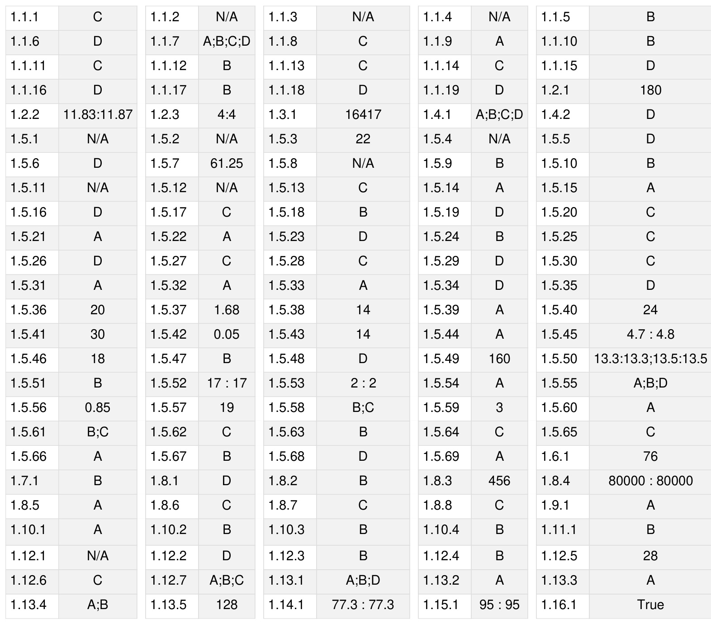

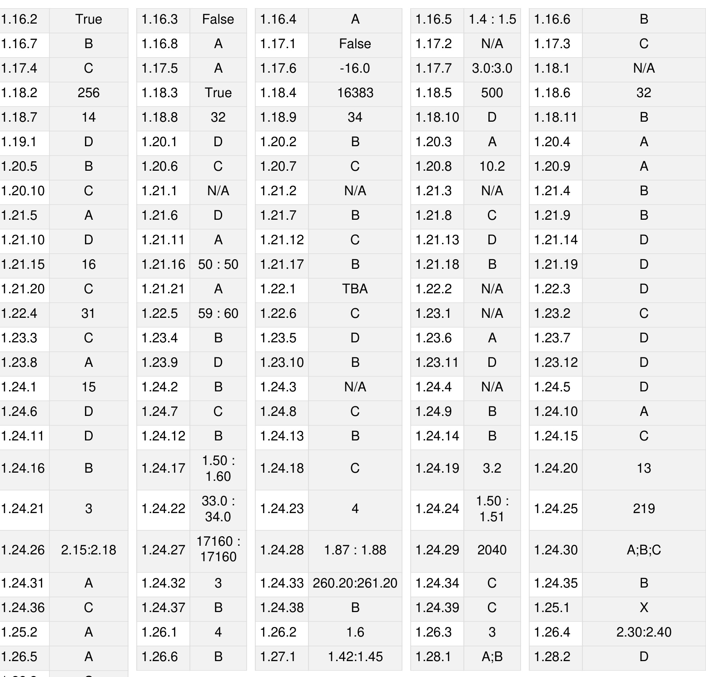

Concept of layering.OSI and TCP/IP Protocol Stacks; Basics of packet, circuit and virtual circuitswitching; Data link layer: framing, error detection, Medium Access Control, Ethernet bridging; Routing protocols: shortest path, flooding, distance vector and link state routing; Fragmentation and IP addressing, IPv4, CIDR notation, Basics of IP support protocols (ARP, DHCP, ICMP), Network Address Translation (NAT); Transport layer: flow control and congestion control, UDP, TCP, sockets; Application layer protocols: DNS, SMTP, HTTP, FTP, Email.

Mark Distribution in Previous GATE   
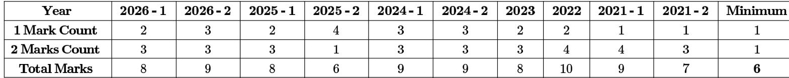

The Computer Networks chapter in GATE Computer Science is a fundamental and high-scoring area, essential for understanding how modern computing systems communicate and interact. It covers everything from the physical transmission of data to high-level application protocols, network architecture, and security principles. Mastery of this subject is crucial not only for the GATE exam but also for a career in software development, system administration, and network engineering. Typically, Computer Networks carries a weightage of 8-12 marks in the GATE CS exam, with questions ranging from conceptual understanding of protocols and layers to numerical problems involving network performance, addressing, and error control. Question patterns often include multiple-choice questions (MCQs), multipleselect questions (MSQs), and numerical answer type (NAT) questions, testing both theoretical knowledge and problemsolving skills.

# Topic-wise Key Concepts

# Application Layer Protocols

These protocols are at the highest layer of the TCP/IP model, providing services directly to user applications. They define how applications on different hosts communicate and exchange data.

# Key Concepts:

HTTP (Hypertext Transfer Protocol): Used for web browsing, client-server model, stateless. Default port 80. FTP (File Transfer Protocol): Used for file transfer, uses two connections (control and data). Default ports 20 (data) and 21 (control).   
DNS (Domain Name System): Translates domain names to IP addresses. UDP port 53 for queries, TCP port 53 for zone transfers.   
SMTP (Simple Mail Transfer Protocol): Used for sending emails. Default port 25.   
POP3 (Post Office Protocol v3): Used for retrieving emails. Default port 110.   
IMAP (Internet Message Access Protocol): More advanced email retrieval, allows managing mail on server. Default port 143.

# Common Pitfalls and Problem-Solving Techniques:

Pitfall: Confusing the functions and default port numbers of different protocols.   
Technique: Create a table mapping protocol to function and port number for quick recall.

# ARP (Address Resolution Protocol)

ARP is a protocol used to map an IP address (Network Layer) to a physical MAC address (Data Link Layer) on a local network. It is essential for IP packets to be encapsulated into Ethernet frames for local delivery.

# Key Concepts:

ARP Request: Broadcasts a query to all hosts on the local network asking for the MAC address corresponding to a specific IP.   
ARP Reply: The host with the matching IP address sends a unicast reply containing its MAC address.   
ARP Cache: Hosts maintain a cache of IP-to-MAC mappings to reduce ARP traffic.

# Common Pitfalls and Problem-Solving Techniques:

Pitfall: Assuming ARP works across routers; it's a local network protocol.   
Technique: Understand the ARP process step-by-step for tracing packet flows.

# Bit Stuffing

Bit stuffing is a technique used in the Data Link Layer to prevent the flag sequence from appearing in the data portion of a frame. It ensures that the receiver correctly identifies the start and end of a frame.

# Key Concepts:

Flag Sequence: A unique bit pattern (e.g., 01111110) used to mark frame boundaries.   
Stuffing Rule: Whenever five consecutive 1s appear in the data, an extra 0 bit is inserted (stuffed) by the sender.   
Destuffing Rule: The receiver removes a 0 bit after five consecutive 1s.

# Common Pitfalls and Problem- Solving Techniques:

Pitfall: Incorrectly stuffing/destuffing bits, especially at the end of the data or near the flag sequence.   
Technique: Practice with examples, carefully counting consecutive 1s.

# Bridges

Bridges are Data Link Layer devices that connect two or more LAN segments. They filter frames based on MAC addresses, forwarding only those frames destined for another segment, thus reducing collision domains and improving network performance.

# Key Concepts:

MAC Address Filtering: Bridges maintain a forwarding table (MAC address table) to decide whether to forward or filter frames. Learning: Bridges learn MAC addresses by inspecting the source MAC address of incoming frames. Spanning Tree Protocol (STP): Used to prevent loops in bridged networks by disabling redundant paths.

# Common Pitfalls and Problem-Solving Techniques:

Pitfall: Confusing bridges with routers (Layer 3) or hubs (Layer 1). Bridges operate at Layer 2.   
Technique: Trace frame paths in a bridged network, applying learning and forwarding rules.

# CRC Polynomial (Cyclic Redundancy Check)

CRC is a powerful error detection technique used in the Data Link Layer. It appends a checksum (FCS Frame Check Sequence) to the data, calculated using polynomial division.

# Important Formulas and Results:

Let $M ( x )$ be the data polynomial and $G ( x )$ be the generator polynomial of degree $r$ . To find the CRC remainder $R ( x )$ :

$$
{ \frac { x ^ { r } \cdot M ( x ) } { G ( x ) } } = Q ( x ) + { \frac { R ( x ) } { G ( x ) } }
$$

where $R ( x )$ is the remainder polynomial of degree less than $r$ .

The transmitted codeword $T ( x )$ is:

$$
T ( x ) = x ^ { r } \cdot M ( x ) + R ( x )
$$

This means the codeword is exactly divisible by $G ( x )$ .

# Key Properties and Identities:

CRC can detect all single-bit errors, all double-bit errors, any odd number of errors, and all burst errors of length less than or equal to $r$ .   
It can detect a high percentage of burst errors longer than $r$ .

# Common Pitfalls and Problem-Solving Techniques:

Pitfall: Performing binary division incorrectly (modulo-2 arithmetic, no borrows).   
Technique: Practice modulo-2 polynomial division. Remember to pad the data with $r$ zeros before division.

# CSMA/CD (Carrier Sense Multiple Access with Collision Detection)

CSMA/CD is a MAC protocol used in shared-medium networks like Ethernet. Stations listen before transmitting (carrier sense) and stop transmitting if a collision is detected (collision detection).

# Important Formulas and Results:

Slot Time: The maximum time it takes for a collision to be detected by all stations.

$$
\mathrm { S l o t T i m e } = 2 \times \mathrm { P r o p a g a t i o n D e l a y }
$$

Minimum Frame Size: To ensure a collision is detected before the sender finishes transmitting the frame.

Minimum Frame Size $\ b =$ Bandwidth $\times$ Slot Time $\ b =$ Bandwidth $\times 2 \times 1$ Propagation Delay

# Key Properties and Identities:

Uses binary exponential backoff algorithm to resolve collisions.   
Collision domain is the segment where collisions can occur.

# Common Pitfalls and Problem-Solving Techniques:

Pitfall: Confusing propagation delay with transmission delay. Propagation delay is time for a bit to travel, transmission delay is time to put all bits on wire. Technique: Ensure units are consistent (e.g., convert Mbps to bits/second, km to meters, ms to seconds).

# Channel Utilization

Channel utilization (or efficiency) measures the fraction of time the channel is actively transmitting data, rather than being idle or transmitting overhead. It's a key performance metric for network protocols.

# Important Formulas and Results:

General formula:

For Stop-and-Wait ARQ:

$$
U = \frac { 1 } { 1 + 2 a }
$$

where $\begin{array} { r } { a = \frac { \mathrm { P r o p a g a t i o n D e l a y } } { \mathrm { T r a n s m i s s i o n T i m e } } = \frac { T _ { p } } { T _ { t } } } \end{array}$ . This assumes no errors and negligible ACK transmission time. For Sliding Window (Go-Back-N or Selective Repeat) with window size $W$ :

$$
U = \operatorname* { m i n } \left( 1 , { \frac { W } { 1 + 2 a } } \right)
$$

This assumes no errors. If $W \geq { \bf 1 } + 2 a$ , utilization can be $100 \%$ .

For Pure Aloha:

$$
S = G \cdot e ^ { - 2 G }
$$

where $\boldsymbol { S }$ is throughput, $G$ is offered load. Max $S \approx 0 . 1 8 4$ at $G = 0 . 5$ . For Slotted Aloha:

$$
S = G \cdot e ^ { - G }
$$

Max $S \approx 0 . 3 6 8$ at $G = 1$ .

# Common Pitfalls and Problem-Solving Techniques:

Pitfall: Incorrectly calculating $a$ or not considering the full round-trip time. Technique: Clearly identify $T _ { t }$ and $T _ { p }$ from the problem statement. Remember $T _ { p }$ is one-way

# Communication

Communication in networks refers to the process of exchanging information between two or more entities. It involves various modes and fundamental concepts that define how data travels.

# Key Concepts:

Simplex: Data flows in one direction only (e.g., radio broadcast).   
Half-Duplex: Data flows in both directions, but not simultaneously (e.g., walkie-talkie).   
Full-Duplex: Data flows in both directions simultaneously (e.g., telephone call).   
Bandwidth: The maximum data transfer rate of a network path, typically measured in bits per second (bps).   
Latency (Delay): The time it takes for a data packet to travel from one point to another. Comprises transmission, propagation, processing, and queuing delays.

# Common Pitfalls and Problem-Solving Techniques:

Pitfall: Confusing bandwidth with throughput. Bandwidth is capacity, throughput is actual rate. Technique: Understand the implications of each communication mode on protocol design (e.g., collision detection in half-duplex).

# Congestion Control

Congestion control mechanisms aim to prevent network collapse by regulating the rate at which senders transmit data when the network is overloaded. TCP implements several strategies for this.

# Key Concepts (TCP):

Slow Start: Exponentially increases congestion window (cwnd) at the beginning of a connection or after a timeout. cwnd starts at 1 MSS (Maximum Segment Size) and doubles every RTT.   
Congestion Avoidance: After cwnd reaches ssthresh (slow start threshold), cwnd increases linearly (by MSS per RTT).   
Fast Retransmit: If the sender receives three duplicate ACKs, it retransmits the lost segment without waiting for a timeout.   
Fast Recovery: After Fast Retransmit, ssthresh is set to half of the current cwnd, and cwnd is set to ssthresh $+ 3$ MSS. It then enters congestion avoidance.

# Common Pitfalls and Problem-Solving Techniques:

Pitfall: Incorrectly applying the rules for cwnd and ssthresh changes during slow start, congestion avoidance, and   
recovery phases.   
Technique: Draw a graph of cwnd vs. RTT to visualize the changes. Remember the ssthresh value is halved upon loss.

# Data Communication

Data communication encompasses the processes, technologies, and methods involved in the electronic transmission of information. It covers the physical and logical aspects of moving data between devices.

# Key Concepts:

Signals: Electrical or electromagnetic waves used to transmit data. Can be analog or digital.   
Modulation: Converting digital data into analog signals for transmission over analog media.   
Demodulation: Converting analog signals back into digital data.   
Multiplexing: Combining multiple data streams into a single stream for transmission (e.g., TDM, FDM, WDM).   
Switching: Techniques for connecting communication paths (e.g., circuit, packet, message switching).

# Common Pitfalls and Problem-Solving Techniques:

Pitfall: Confusing modulation with encoding, or different multiplexing techniques.   
Technique: Understand the purpose and basic mechanism of each concept.

# Distance Vector Routing

Distance Vector Routing is a dynamic routing algorithm where each router maintains a routing table (distance vector) containing the best known distance to each destination and the next hop. Routers exchange their entire routing tables with directly connected neighbors.

# Key Concepts:

Bellman-Ford Algorithm: The underlying algorithm for distance vector routing.

$$
D _ { x } ( y ) = \operatorname* { m i n } _ { v } \{ c ( x , v ) + D _ { v } ( y ) \}
$$

where $D _ { x } ( y )$ is the cost from $x$ to , $\scriptstyle { c ( x , v ) }$ is cost from $x$ to neighbor $v$ , and $D _ { v } ( y )$ is 's reported cost to $y$ . Count-to-Infinity Problem: A major drawback where routing loops can cause costs to increase indefinitely. Poisoned Reverse: A mechanism to mitigate count-to-infinity by advertising infinite cost for routes learned from a neighbor back to that neighbor.

# Common Pitfalls and Problem- Solving Techniques:

Pitfall: Incorrectly updating routing tables or failing to identify routing loops.   
Technique: Simulate the routing table updates step-by-step for a given network topology and link cost changes.

# Error Detection

Error detection techniques are used to determine if errors have occurred during data transmission. They add redundant bits to the data, allowing the receiver to check for integrity.

# Key Concepts:

Parity Check: Adds a single parity bit to make the total number of 1s even (even parity) or odd (odd parity). Detects single-bit errors.   
Checksum: Divides data into segments, sums them (using one's complement arithmetic), and takes the one's complement of the sum as the checksum. Detects most errors, but not as robust as CRC.   
CRC (Cyclic Redundancy Check): Most powerful error detection technique, uses polynomial division. (See CRC Polynomial topic).

# Important Formulas and Results:

Internet Checksum: Sum all 16-bit words (or specified size) of the data. If sum exceeds 16 bits, wrap around the carry. Take one's complement of the final sum.

# Common Pitfalls and Problem- Solving Techniques:

Pitfall: Forgetting one's complement arithmetic for checksum calculations.   
Technique: Practice checksum calculations, especially with carry bits.

# Ethernet

Ethernet is the most widely used LAN technology, standardized by IEEE 802.3. It defines the physical and Data Link Layer specifications for wired networks, primarily using CSMA/CD.

# Key Concepts:

MAC Address: A 48-bit (6-byte) unique hardware identifier assigned to each network interface card (NIC). Ethernet Frame Format: Includes Preamble, SFD (Start Frame Delimiter), Destination MAC, Source MAC, Type/Length, Data, and FCS (Frame Check Sequence/CRC).   
Minimum/Maximum Frame Size: Standard Ethernet has a minimum frame size of 64 bytes (including header and FCS) and a maximum of 1518 bytes.   
CSMA/CD: The access method used for shared Ethernet segments.

# Important Formulas and Results:

Minimum Data Size: 46 bytes (to ensure minimum frame size of 64 bytes, considering 18 bytes of header/trailer).

# Common Pitfalls and Problem-Solving Techniques:

Pitfall: Confusing the total frame size with the data payload size.   
Technique: Memorize the Ethernet frame structure and minimum/maximum sizes.

# Fragmentation

Fragmentation is the process at the Network Layer (IP) where a large IP packet is divided into smaller fragments to traverse a network link with a smaller Maximum Transmission Unit (MTU).

# Important Formulas and Results:

Offset Field: In the IP header, indicates the position of the fragment's data relative to the original datagram's data, in units of 8 bytes.

$$
\mathrm { N e w ~ O f f s e t } = \frac { \mathrm { O r i g i n a l ~ O f f s e t } \times 8 + \mathrm { D a t a } \mathrm { L e n g t h ~ o f ~ F r a g m e n t } } { 8 }
$$

. Total Length Field: In the IP header, indicates the total length of the current fragment (header $^ +$ data).   
More Fragments (MF) Flag: Set to for all fragments except the last one.

# Key Properties and Identities:

Fragmentation can occur at any router along the path.   
Reassembly typically occurs only at the destination host.   
The data payload of each fragment (except possibly the last) must be a multiple of 8 bytes.

# Common Pitfalls and Problem- Solving Techniques:

Pitfall: Incorrectly calculating the offset field or the data length of fragments, especially when the original packet's data length is not a multiple of 8.   
Technique: Work through fragmentation problems step-by-step, ensuring each fragment's data length is a multiple of 8 (except the last) and updating the offset correctly.

# Hamming Code

Hamming code is an error-correcting code capable of detecting and correcting single-bit errors. It adds redundant parity bits at specific positions within the data.

# Important Formulas and Results:

. Number of Parity Bits $( p )$ : To correct single-bit errors in a message of $m$ data bits, the number of parity bits $p$ must satisfy:

$$
2 ^ { p } \geq m + p + 1
$$