Parity Bit Positions: Parity bits are placed at positions that are powers of 2 (1, 2, 4, 8, ...). Parity Check: Each parity bit checks specific data bit positions. For example, parity bit at position $2 ^ { k }$ checks all positions whose binary representation has the $k$ -th bit set.

# Common Pitfalls and Problem-Solving Techniques:

Pitfall: Incorrectly assigning parity bit positions or calculating parity values.   
Technique: Systematically determine parity bit positions, then calculate parity values based on the data bits they cover. For error detection/correction, calculate syndrome bits.

# IP Addressing

IP addressing (IPv4 and IPv6) is a fundamental concept in the Network Layer, providing unique logical addresses for devices on a network. IPv4 uses 32-bit addresses, while IPv6 uses 128-bit addresses.

# Important Formulas and Results $( \mathsf { I P } \mathsf { v } 4 )$

. Number of Hosts: For a given subnet mask, if $h$ bits are available for host IDs, then the number of usable hosts i $2 ^ { h } - 2$ (subtracting network and broadcast addresses).   
1 Number of Subnets: If $s$ bits are borrowed from the host portion for subnetting, the number of subnets created is $2 ^ { s }$ .   
CIDR (Classless Inter-Domain Routing): Uses a prefix length (e.g., /24) to specify the network portion of an IP address, replacing class-based addressing.

# Key Properties and Identities:

Network ID: All host bits are 0.   
Broadcast ID: All host bits are 1.   
Private IP Ranges: Reserved for private networks (e.g., 10.0.0.0/8, 172.16.0.0/12, 192. 168.0.0/16).

# Common Pitfalls and Problem-Solving Techniques:

Pitfall: Incorrectly calculating subnet masks, network IDs, or broadcast IDs, especially with CIDR notation. Technique: Convert IP addresses and subnet masks to binary for clear visualization. Practice subnetting problems extensively.

# IP Packet

An IP packet (or datagram) is the fundamental unit of data transfer in the Internet Protocol. It consists of an IP header and a data payload.

Key Concepts (IPv4 Header Fields):

Version (4 bits): Indicates IPv4 or IPv6.   
Header Length (IHL, 4 bits): Length of the IP header in 32-bit words. Minimum 5 (20 bytes), maximum 15 (60 bytes).   
Total Length (16 bits): Total length of the IP datagram (header $^ +$ data) in bytes. Max 65535 bytes.   
Identification (16 bits): Used for reassembling fragmented datagrams.   
Flags (3 bits): Includes DF (Don't Fragment) and MF (More Fragments).   
Fragment Offset (13 bits): Position of the fragment in the original datagram (in 8-byte units).   
Time To Live (TTL, 8 bits): Decremented by each router; packet is discarded if TTL reaches 0. Prevents infinite loops.   
Protocol (8 bits): Indicates the next-level protocol (e.g., 6 for TCP, 17 for UDP, 1 for ICMP).   
Header Checksum (16 bits): Used for error detection only on the header. Recalculated at each hop.   
Source IP Address (32 bits): Sender's IP address.   
Destination IP Address (32 bits): Receiver's IP address.

# Common Pitfalls and Problem-Solving Techniques:

Pitfall: Confusing header length (in 32-bit words) with total length (in bytes).

Technique: Memorize the key fields and their sizes. Practice calculating header checksums.

# ICMP (Internet Control Message Protocol)

ICMP is a Network Layer protocol used by network devices, like routers, to send error messages and operational information indicating, for example, that a requested service is not available or that a host or router could not be reached.

# Key Concepts:

3 Error Reporting: Reports errors such as "Destination Unreachable," "Time Exceeded," "Parameter Problem." Query Messages: Used for diagnostic purposes (e.g., Echo Request/Reply for ping, Timestamp Request/Reply). Traceroute: Uses ICMP Time Exceeded messages to map the path to a destination.

# Common Pitfalls and Problem-Solving Techniques:

Pitfall: Confusing ICMP's role with routing protocols or transport layer protocols. ICMP is for network diagnostics and error reporting.   
Technique: Understand the common ICMP message types and their uses (e.g., ping uses type $\ 8 / 0$ , traceroute uses type 11).

# LAN Technologies

LAN (Local Area Network) technologies define the standards and methods for connecting devices within a limited geographical area. Ethernet is the dominant LAN technology.

# Key Concepts:

Ethernet (IEEE 802.3): Dominant wired LAN technology, uses CSMA/CD (for shared media) or full-duplex switching. Various speeds (10 Mbps, 100 Mbps, Gbps, 10 Gbps, etc.).   
Token Ring (IEEE 802.5): Older LAN technology, uses a token-passing mechanism for media access. Devices form a logical ring.   
FDDI (Fiber Distributed Data Interface): High-speed token-passing LAN over fiber optics, uses dual rings for redundancy.   
Wi-Fi (IEEE 802.11): Wireless LAN technology, uses CSMA/CA (Collision Avoidance).

# Common Pitfalls and Problem-Solving Techniques:

Pitfall: Confusing the MAC access methods (CSMA/CD vs. Token Passing vs. CSMA/CA). Technique: Compare and contrast the characteristics, advantages, and disadvantages of different LAN technologies.

# MAC Protocol (Medium Access Control)

MAC protocols define how multiple stations share a common transmission medium to avoid collisions and ensure fair access. They are part of the Data Link Layer.

# Key Concepts:

Channel Partitioning Protocols: Divide the channel into smaller, independent channels (e.g., TDMA, FDMA, CDMA).   
Random Access Protocols: Allow stations to transmit whenever they have data, resolving collisions if they occur (e.g., Aloha, CSMA, CSMA/CD, CSMA/CA).   
Taking-Turns Protocols: Stations take turns accessing the channel (e.g., Token Ring, Polling).

# Important Formulas and Results:

(See Pure Aloha, Slotted Aloha, CSMA/CD for specific formulas).

# Common Pitfalls and Problem-Solving Techniques:

Pitfall: Misidentifying the type of MAC protocol or its collision resolution mechanism.   
Technique: Understand the trade-offs between different MAC protocols (efficiency, fairness, complexity).

# Network Flow

Network flow is a concept in graph theory used to model the movement of resources through a network. In computer networks, it can represent data traffic.

# Key Concepts:

Flow Network: A directed graph where each edge has a capacity and a flow.   
Source and Sink: Special nodes representing the origin and destination of the flow.   
Max-Flow Min-Cut Theorem: States that the maximum amount of flow passing from a source to a sink in a flow network is equal to the total capacity of the minimum cut.

# Common Pitfalls and Problem-Solving Techniques:

Pitfall: While Max-Flow Min-Cut is a core concept, GATE CS typically tests its conceptual understanding rather than complex numerical algorithms like Edmonds- Karp or Dinic. Technique: Focus on understanding the theorem and identifying cuts in simple networks.

# Network Layer

The Network Layer (Layer 3 of the OSI model) is responsible for logical addressing, routing, and forwarding packets across different networks. IP is the primary protocol at this layer.

# Key Concepts:

Logical Addressing: IP addresses provide unique identification for devices across the internet.   
Routing: Determining the best path for packets to travel from source to destination.   
Forwarding: Moving a packet from an incoming interface to an outgoing interface on a router.   
Protocols: IP, ICMP, IGMP, Routing Protocols (RIP, OSPF, BGP).

# Common Pitfalls and Problem-Solving Techniques:

. Pitfall: Confusing Network Layer functions with Data Link Layer (MAC addressing, framing) or Transport Layer (port numbers, reliability). Technique: Clearly distinguish the responsibilities of each layer in the OSI/TCP-IP model.

# Network Protocols

Network protocols are formal rules and standards that govern how devices communicate and exchange data over a network. They define the format, timing, sequencing, and error control of data transmission.

# Key Concepts:

TCP/IP Suite: The most widely used set of protocols, forming the basis of the internet. Includes TCP, UDP, IP, HTTP, FTP, etc.   
Layered Architecture: Protocols are organized into layers (e.g., OSI model, TCP/IP model), with each layer providing services to the layer above it.

# Common Pitfalls and Problem-Solving Techniques:

Pitfall: Not knowing which protocols operate at which layer or their specific functions.   
Technique: Create a mental map or table of protocols and their corresponding layers/functions.

# Network Switching

Network switching refers to the mechanisms used to establish connections between communicating devices in a network. Different switching techniques have varying characteristics regarding resource allocation and delay.

# Key Concepts:

Circuit Switching: A dedicated end-to-end communication path (circuit) is established before data transfer and maintained for the duration of the communication (e.g., traditional telephone networks). Guarantees bandwidth. Packet Switching: Data is broken into small, independent packets, each routed individually through the network. No dedicated path. More efficient use of bandwidth, but variable delay (e.g., Internet).   
Message Switching: Entire messages are stored and forwarded at each intermediate node. No dedicated path. High delay.

# Common Pitfalls and Problem-Solving Techniques:

Pitfall: Confusing the characteristics of circuit vs. packet switching, especially regarding setup time, resource reservation, and delay.   
Technique: Understand the trade-offs: Circuit switching for guaranteed QoS, Packet switching for efficiency and flexibility.

# OSI Model

The OSI (Open Systems Interconnection) model is a conceptual framework that standardizes the functions of a telecommunication or computing system into seven distinct layers. It helps in understanding network architecture and troubleshooting.

# Key Concepts:

1. Physical Layer (Layer 1): Deals with the physical transmission of raw bits over a medium (cables, connectors, voltage levels). PDU: Bit.   
2. Data Link Layer (Layer 2): Provides reliable data transfer between adjacent nodes, framing, MAC addressing, error detection/correction. PDU: Frame.   
3. Network Layer (Layer 3): Handles logical addressing (IP), routing, and forwarding packets across networks. PDU: Packet/Datagram.   
4. Transport Layer (Layer 4): Provides end-to-end communication, reliability (TCP), flow control, congestion control, port addressing. PDU: Segment (TCP), Datagram (UDP).   
5. Session Layer (Layer 5): Manages communication sessions, synchronization, dialog control.   
6. Presentation Layer (Layer 6): Handles data representation, encryption, decryption, compression.   
7. Application Layer (Layer 7): Provides network services directly to user applications (HTTP, FTP, DNS). PDU: Data/Message.

# Common Pitfalls and Problem-Solving Techniques:

Pitfall: Forgetting the order of layers or the primary function/PDU of each layer.   
Technique: Use mnemonics (e.g., "Please Do Not Throw Sausage Pizza Away") to remember the order. Focus on the first four layers, as they are most frequently tested.

# Probability

Probability theory is used in computer networks to model and analyze the performance of random access protocols (like Aloha) and to evaluate network reliability and queueing behavior.

# Key Concepts:

Poisson Distribution: Often used to model arrival rates of packets or frames in random access protocols.   
Throughput: The rate at which successful transmissions occur.   
Offered Load (G): The total number of frames generated per unit of time, including retransmissions.

# Important Formulas and Results:

(See Pure Aloha, Slotted Aloha for specific probability -based throughput formulas).

# Common Pitfalls and Problem-Solving Techniques:

Pitfall: Misinterpreting the meaning of offered load (G) vs. throughput (S).

Technique: Understand the assumptions behind probabilistic models (e.g., Poisson arrivals, infinite number of users).

# Pure Aloha

Pure Aloha is a simple random access MAC protocol where stations transmit frames whenever they have data. If a collision occurs, the stations wait a random amount of time and retransmit.

# Important Formulas and Results:

Throughput (S): The rate of successful transmissions.

$$
S = G \cdot e ^ { - 2 G }
$$

where $G$ is the offered load (total number of frames generated per frame transmission time, including retransmissions).   
Maximum Throughput $( S _ { m a x } )$ : Occurs when $G = 0 . 5$ .

$$
S _ { m a x } = 0 . 5 \cdot e ^ { - 2 \cdot 0 . 5 } = 0 . 5 \cdot e ^ { - 1 } = { \frac { 1 } { 2 e } } \approx 0 . 1 8 4
$$

# Key Properties and Identities:

Collision window is $2 \times T _ { f r a m e }$ Highly inefficient due to frequent collisions.

# Common Pitfalls and Problem-Solving Techniques:

Pitfall: Forgetting the factor of 2G in the exponent for pure Aloha.   
Technique: Understand the concept of the vulnerability period for collisions.

# Routing

Routing is the process of selecting paths in a network along which to send network traffic. It involves determining the best route for packets from a source to a destination.

# Key Concepts:

Static Routing: Routes are manually configured by an administrator. Simple for small networks.   
Dynamic Routing: Routers exchange routing information and update their tables automatically using routing protocols. Adaptable to network changes.   
Routing Table: A table stored in a router that maps destination network addresses to the next hop router and outgoing interface.

# Common Pitfalls and Problem-Solving Techniques:

Pitfall: Confusing routing (path selection) with forwarding (packet movement).   
Technique: Understand how a router uses its routing table to make forwarding decisions.

# Routing Protocols

Routing protocols are the algorithms and rules that routers use to exchange routing information and build their routing tables. They are classified by their operating scope and algorithm type.

# Key Concepts:

Interior Gateway Protocols (IGPs): Used within an Autonomous System (AS). RIP (Routing Information Protocol): Distance Vector, uses hop count as metric, max 15 hops. OSPF (Open Shortest Path First): Link State, uses Dijkstra's algorithm, builds a complete topology map.   
Exterior Gateway Protocols (EGPs): Used between Autonomous Systems. BGP (Border Gateway Protocol): Path Vector, used for inter-domain routing on the Internet.

Link State vs. Distance Vector:

Distance Vector: Routers share their entire routing tables with neighbors. (e.g., RIP) 。 Link State: Routers share information about their directly connected links with all other routers in the AS. (e.g., OSPF)

# Common Pitfalls and Problem-Solving Techniques:

. Pitfall: Confusing RIP with OSPF, or IGPs with EGPs.   
Technique: Know the key characteristics of each protocol (metric, algorithm type, scope). Practice Dijkstra's algorithm for OSPF-like problems.

# Sliding Window

Sliding Window protocols are flow control mechanisms that allow a sender to transmit multiple frames before receiving an acknowledgment, improving channel utilization. They use a window of sequence numbers.

# Important Formulas and Results:

Window Size $( \mathsf { W } )$ : The maximum number of unacknowledged frames a sender can transmit.   
Sequence Number Bits (n): For a window size $W$ , the minimum number of bits required for sequence numbers   
depends on the protocol. Go-Back-N: Sender window $W _ { S }$ , Receiver window $W _ { R } = 1$ . Sequence numbers range from 0 to $2 ^ { n } - 1$ . $W _ { S } + W _ { R } \le 2 ^ { n } \Longrightarrow W _ { S } \le 2 ^ { n } - 1$ . Selective Repeat: Sender window $W _ { S }$ , Receiver window $W _ { R } . W _ { S } = W _ { R } = 2 ^ { n - 1 }$

Channel Utilization (U) for Sliding Window:

$$
U = \operatorname* { m i n } \left( 1 , \frac { W _ { S } } { 1 + 2 a } \right)
$$

where $a = T _ { p } / T _ { t }$ .

# Key Properties and Identities:

Go-Back-N (GBN): If a frame is lost, the sender retransmits that frame and all subsequent frames already sent. Receiver discards out-of-order frames.   
Selective Repeat (SR): If a frame is lost, only that specific frame is retransmitted. Receiver buffers out-of-order frames. More efficient but complex.

# Common Pitfalls and Problem-Solving Techniques:

Pitfall: Incorrectly determining the maximum window size for Go-Back-N vs. Selective Repeat for a given number of sequence bits.   
Technique: Memorize the window size rules for GBN and SR. Practice calculating utilization with different window sizes and $\mathbf { \Delta } _ { a }$ values.

# Slotted Aloha

Slotted Aloha is an improvement over Pure Aloha where time is divided into discrete slots. Stations are only allowed to transmit at the beginning of a slot, reducing the collision window.

# Important Formulas and Results:

Throughput (S): $S = G \cdot e ^ { - G }$   
where $G$ is the offered load.   
Maximum Throughput $( S _ { m a x } )$ : Occurs when $G = 1$ .

$$
S _ { m a x } = 1 \cdot e ^ { - 1 } = \frac { 1 } { e } \approx 0 . 3 6 8
$$

# Key Properties and Identities:

Collision window is $1 \times T _ { f r a m e }$ Requires global time synchronization.

# Common Pitfalls and Problem-Solving Techniques:

Pitfall: Confusing the throughput formula with Pure Aloha (exponent is -G, not -2G).   
Technique: Understand how slotting reduces the vulnerability period for collisions.

# Sockets

Sockets provide an Application Programming Interface (API) for network communication, allowing applications to send and receive data over a network. They are the endpoints of communication.

# Key Concepts:

Socket Types: Stream Sockets (TCP): Connection-oriented, reliable, ordered data delivery. Datagram Sockets (UDP): Connectionless, unreliable, unordered data delivery.   
Common Socket Functions (for TCP server): socket(), bind(), listen(), accept(), send(), recv(), close().   
Common Socket Functions (for TCP client): socket(), connect(), send(), recv(), close().

# Common Pitfalls and Problem-Solving Techniques:

Pitfall: Confusing the sequence of system calls for client vs. server, or for TCP vs. UDP.   
Technique: Memorize the typical sequence of socket calls for both client and server applications.

# Stop and Wait

Stop and Wait is the simplest ARQ (Automatic Repeat Request) protocol for reliable data transfer. The sender transmits one frame and waits for an acknowledgment (ACK) before sending the next.

# Important Formulas and Results:

Transmission Time $( T _ { t } )$ : Time to put the entire frame on the link.

$$
T _ { t } = { \frac { { \mathrm { F r a m e } } { \mathrm { S i z e } } } { \mathrm { B a n d w i d t h } } }
$$

Propagation Delay $( T _ { p } )$ : Time for the first bit to travel from sender to receiver.

$$
T _ { p } = { \frac { \mathrm { D i s t a n c e } } { \mathrm { P r o p a g a t i o n S p e e d } } }
$$

Dimensionless Parameter $( a )$ : Ratio of propagation delay to transmission time.

$$
a = \frac { T _ { p } } { T _ { t } }
$$

Channel Utilization (Efficiency) $( U )$

$$
U = \frac { 1 } { 1 + 2 a }
$$

This assumes no errors and negligible ACK transmission time.

Key Properties and Identities:

Sender window size $= 1$ , Receiver window size $= 1$ .   
Uses 1-bit sequence numbers (0 and 1).   
Low utilization for high bandwidth-delay product links.

# Common Pitfalls and Problem-Solving Techniques:

. Pitfall: Forgetting to multiply $T _ { p }$ by 2 for the round-trip propagation delay in the denominator of the utilization formula. Technique: Always calculate $\textstyle { T _ { t } }$ and $T _ { p }$ first, then $a$ , then $U$ . Pay attention to units.

# Subnetting

Subnetting is the process of dividing a larger IP network into smaller, more manageable subnetworks (subnets). It improves network efficiency, security, and reduces broadcast traffic.

# Important Formulas and Results:

Number of Subnets: If $\pmb { s }$ bits are borrowed from the host portion of the IP address to create subnets, the number o subnets created is $2 ^ { s }$ .   
Number of Usable Hosts per Subnet: If $h$ bits remain for host IDs in a subnet, the number of usable hosts is $2 ^ { h } - 2$ (excluding the network and broadcast addresses for that subnet).   
Subnet Mask: A 32-bit number that distinguishes the network portion from the host portion of an IP address. All network/subnet bits are 1, all host bits are 0.

# Common Pitfalls and Problem-Solving Techniques:

Pitfall: Incorrectly identifying the network ID, broadcast ID, or valid host range for a given IP address and subnet mask.   
Technique: Convert IP addresses and subnet masks to binary. Draw out the network, subnet, and host portions. Practice finding the first/last usable IP.

# TCP (Transmission Control Protocol)

TCP is a reliable, connection-oriented, byte-stream Transport Layer protocol. It provides error control, flow control, and congestion control, making it suitable for applications requiring high data integrity.

# Key Concepts:

Connection-Oriented: Establishes a connection using a 3-way handshake before data transfer.   
Reliable: Uses sequence numbers, acknowledgments (ACKs), and retransmissions to ensure all data arrives correctly.   
Flow Control: Prevents a fast sender from overwhelming a slow receiver using a receive window (rwnd). Congestion Control: Prevents network congestion (see Congestion Control topic).   
Full-Duplex: Data can flow in both directions simultaneously.   
Header Fields: Source/Destination Port, Sequence Number, Acknowledgment Number, Window Size, Checksu Flags (SYN, ACK, FIN, RST, PSH, URG).

# Important Formulas and Results:

3-Way Handshake: SY $N > S Y N + A C K  A C K .$   
4-Way Handshake (Connection Termination): FIN $\because A C$ K $\displaystyle - >$ FIN $\mathrel { \mathop  }$ ACK.

# Common Pitfalls and Problem- Solving Techniques:

Pitfall: Confusing sequence numbers with acknowledgment numbers, or the purpose of different TCP flags. Technique: Trace the sequence and acknowledgment numbers during a TCP connection setup, data transfer, and termination. Understand the role of the advertised window.

# Token Bucket

The Token Bucket algorithm is a traffic shaping technique used to control the rate at which data is sent over a network.   
It smooths out bursty traffic and enforces a maximum average rate.

# Key Concepts:

Bucket Capacity (C): The maximum number of tokens the bucket can hold. Represents the maximum burst size allowed.   
Token Arrival Rate (r): The rate at which tokens are added to the bucket (e.g., tokens/second). Represents the average allowed transmission rate.   
Traffic Shaping: Packets can only be sent if there are enough tokens in the bucket. If not, packets are buffered or dropped.

# Important Formulas and Results:

Maximum Output Rate: Can be up to the link speed for a burst, but limited by the token rate  over time.   
Maximum Burst Size: Equal to the bucket capacity $C$ .

# Common Pitfalls and Problem- Solving Techniques:

Pitfall: Confusing token bucket with leaky bucket. Token bucket allows bursts up to capacity, leaky bucket smooths all traffic to a constant rate.   
Technique: Calculate the maximum burst duration or the time it takes for the bucket to fill given a token rate and capacity.

# UDP (User Datagram Protocol)

UDP is a simple, connectionless, unreliable Transport Layer protocol. It provides minimal services, primarily multiplexing/demultiplexing and basic error checking (optional checksum).

# Key Concepts:

Connectionless: No connection setup or teardown.   
Unreliable: No guarantees of delivery, order, or duplicate protection.   
No Flow Control, No Congestion Control: Applications must handle these if needed.   
Header Fields: Source Port, Destination Port, Length, Checksum (optional).

# Key Properties and Identities:

. Lower overhead and faster than TCP. Suitable for applications where speed is more critical than reliability (e.g., streaming media, DNS, VoIP).

# Common Pitfalls and Problem-Solving Techniques:

Pitfall: Attributing TCP features (reliability, flow control) to UDP.   
Technique: Understand the trade-offs between UDP and TCP and identify appropriate applications for each.

# Wrap Around Time

Wrap Around Time (WAT) refers to the time it takes for the sequence numbers used in a protocol (like TCP) to cycle through all possible values and return to the starting point. It's crucial for preventing ambiguity when old segments with duplicate sequence numbers arrive late.

# Important Formulas and Results:

If sequence numbers are in bytes and $N$ is the number of bits for the sequence number field:

(This formula might vary based on how sequence numbers are defined, e.g., per byte or per segment). A simpler form often seen:

$$
\mathrm { W A T = \frac { T o t a l S e q u e n c e N u m b e r S p a c e } { D a t a R a t e } }
$$

# Key Properties and Identities:

. WAT should ideally be greater than the maximum segment lifetime (MSL) to prevent old segments from being misinterpreted.   
For TCP, the sequence number field is 32 bits.

# Common Pitfalls and Problem-Solving Techniques:

1 Pitfall: Forgetting to account for the units of sequence numbers (bytes vs. segments) and bandwidth.   
Technique: Ensure consistent units. Understand the relationship between WAT and MSL.

# Quick Formula Reference

Channel Utilization & Throughput:

Stop-and-Wait ARQ: $\begin{array} { r } { U = \frac { 1 } { 1 + 2 a } } \end{array}$ where $a = T _ { p } / T _ { t }$   
Sliding Window ARQ (Go-Back-N/Selective Repeat): $\begin{array} { r } { U = \operatorname* { m i n } \left( 1 , \frac { W } { 1 + 2 a } \right) } \end{array}$   
Pure Aloha Throughput: $S = G \cdot e ^ { - 2 G }$ (Max $S = 1 / ( 2 e )$ at $G = 0 . 5$ )   
Slotted Aloha Throughput: $S = G \cdot e ^ { - G }$ (Max $S = 1 / e$ at $G = 1$ )   
Transmission Time: $\boldsymbol { T _ { t } } =$ Frame Size/Bandwidth   
Propagation Delay: $T _ { p } =$ Distance/Propagation Speed

Error Detection & Correction:

Hamming Code Parity Bits: $2 ^ { p } \geq m + p + 1$ CRC Codeword: $T ( x ) = x ^ { r } \cdot M ( x ) + { \bar { R } } ( x )$

# MAC Protocols:

CSMA/CD Slot Time: $\mathbf { 2 } \times \mathbf { P }$ ropagation Delay CSMA/CD Minimum Frame Size: Bandwidth $\times 2 \times$ Propagation Delay

IP Fragmentation:

Fragment Offset: Offset $\ c =$ Original Offset $^ { \cdot \times 8 + }$ Data Length of Fragment 8 (in 8-byte units)

IP Addressing & Subnetting:

Usable Hosts: $2 ^ { h } - 2$ (where $h$ is host bits) Number of Subnets: $2 ^ { s }$ (where $\pmb { s }$ is subnet bits)

Sliding Window Sequence Numbers:

Go-Back-N Sender Window $W _ { S } \colon W _ { S } \leq 2 ^ { n } - 1$ (where $n$ is sequence number bits) Selective Repeat Sender/Receiver Window $W _ { S } , W _ { R } \colon W _ { S } = W _ { R } = 2 ^ { n - 1 }$

# Wrap Around Time:

WAT (bytes): $\frac { 2 ^ { N } { \times } \mathrm { M S S } } { \mathrm { B a n d w i d t h } }$ (where $N$ is sequence number bits)

Important Tips for GATE

1. Master OSI/TCP-IP Layers: Understand the function of each layer, the protocols operating at each layer, and the PDU (Protocol Data Unit) names. This is foundational and frequently tested.

2. Practice Numerical Problems Extensively: Focus on channel utilization, throughput, propagation/transmission delay calculations, IP addressing, subnetting, and fragmentation. Pay close attention to units (bits vs. bytes, Mbps vs. Kbps, ms vs. seconds).

3. Differentiate Flow Control vs. Congestion Control: Understand their distinct goals, mechanisms, and the protocols that implement them (e.g., TCP's window mechanisms for both).

4. Know Protocol Headers: Be familiar with the key fields in Ethernet, IP, TCP, and UDP headers. Questions often test the purpose or size of specific fields.

5. Understand ARQ Protocols: Clearly distinguish Stop-and-Wait, Go-Back-N, and Selective Repeat in terms of window sizes, retransmission strategies, and efficiency.

6. Be Precise with IP Addressing and Subnetting: Convert to binary if needed. Don't confuse network ID, broadcast ID, and usable host addresses. Practice CIDR notation.

7. Read Questions Carefully: Look for keywords like "negligible ACK time," "error-free channel," "half-duplex," or "fullduplex" as they significantly impact formula application.

8. Time Management: Some numerical problems can be lengthy. If stuck, make an educated guess (if no negative marking) or move on and return if time permits.

# Application Layer Protocols (13)

# 2.1.1 Application Layer Protocols: GATE CSE 2008 Question: 14, ISRO2016-74

What is the maximum size of data that the application layer can pass on to the TCP layer below?

A. Any size B. $2 ^ { 1 6 }$ bytes size of TCP header C. $2 ^ { 1 6 }$ bytes D. bytes

gatecse-2008 easy computer-networks application-layer-protocols isro2016

Answer key☟

# 2.1.2 Application Layer Protocols: GATE CSE 2011 Question: 4

Consider the different activities related to email.

m1 Send an email from mail client to mail server m2 Download an email from mailbox server to a mail client m3 Checking email in a web browser

Which is the application level protocol used in each activity?

A. m1 ：HTTP m2 SMTP m3 POP B. m1 SMTP m2 :FTP m3 :HTTP C. m1 SMTP m2 : POP m3 : HTTP D. m1 POP m2 SMTP m3 IMAP

i. HTTP ii. FTP iii. TCP iv. POP3

A. (i) and only B. (ii) and (ii) only C. (ii) and only D. only

gatecse-2016-set1 computer-networks application-layer-protocols normal

# 2.1.5 Application Layer Protocols: GATE CSE 2019 Question: 16

Which of the following protocol pairs can be used to send and retrieve e-mails (in that order)?

A. IMAP, POP3 B. SMTP,POP3 C. SMTP, MIME D. IMAP SMTP

gatecse-2019 computer-networks application-layer-protocols one-mark

# 2.1.6 Application Layer Protocols: GATE CSE 2020 Question: 25

Assume that you have made a request for a web page through your web browser to a web server. Initially the browser cache is empty. Further, the browser is configured to send HTTP requests in non-persistent mode. The web page contains text and five very small images.The minimum number of  connections required to display the web page completely in your browser is

gatecse-2020 numerical-answers computer-networks application-layer-protocols one-mark

# 2.1.7 Application Layer Protocols: GATE CSE 2022 Question: 25

Consider the resolution of the domain name  by a  resolver. Assume that no resource records are cached anywhere across the servers and that iterative query mechanism is used in the resolution. The number of query- response pairs involved in completely resolving the domain name is

gatecse-2022 numerical-answers computer-networks one-mark application-layer-protocols

# 2.1.8 Application Layer Protocols: GATE CSE 2026 Set 1 Question: 9

Which of the following statements is/are true with respect to the interaction of a web browser with a web server using HTTP ?

A. HTTP facilitates downloading multiple objects of the same webpage over the same TCP connection, if the objects are stored in the same server   
B. HTTP facilitates downloading multiple objects of the same webpage over the same TCP connection, even if they are stored in different servers   
C. HTTP facilitates sending a request for downloading one object without waiting for a previously requested object to be downloaded completely   
D. HTTP facilitates downloading multiple webpages on the same server to be downloaded over a single TCP connection

gatecse-2026-set1 computer-networks application-layer-protocols multiple-selects one-mark

# 2.1.9 Application Layer Protocols: GATE CSE 2026 Set 2 Question: 12

Which one of the following protocols may need to broadcast some of its messages?

A. SMTP B. FTP C. DHCP D. HTTP gatecse-2026-set2 computer-networks application-layer-protocols one-mark

Consider the three commands PROMPT, HEAD and RCPT.   
Which of the following options indicate a correct association of these commands with protocols where these are used?

A. HTTP, SMTP, FTP B. FTP, HTTP, SMTP C. HTTP, FTP, SMTP D. SMTP, HTTP, FTP gateit-2005 computer-networks application-layer-protocols normal

Assume that "host1.mydomain.dom" has an IP address of . Which of the following options would be most appropriate as a subsequence of steps in performing the reverse lookup of ？ In the following options "NS" is an abbreviation of "nameserver".

A. Query a NS for the root domain and then NS for the "dom" domains B. Directly query a NS for "dom" and then a NS for "mydomain.dom" domains C. Query a NS for in-addr.arpa and then a NS for in-addr.arpa domains D. Directly query a NS for in-addr.arpa and then a NS for in-addr.arpa domains

gateit-2005 computer-networks normal application-layer-protocols

HELO and , respectively, are commands from the protocols:

A. and HTTP B. TELNET and POP3 C. HTTP and TELNET D. SMTP and

gateit-2006 computer-networks application-layer-protocols normal

# Answer key☟

Provide the best matching between the entries in the two columns given in the table below:

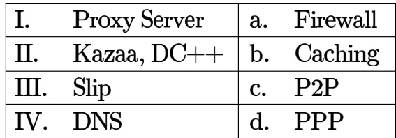

A. I-a, I-d, II-c,IV-b B. I-b,II-d, II-c,IV-a C. I-a,I-c,II-d,IV-b D. I-b,II-c, II-d, IV-a

gateit-2008 computer-networks normal application-layer-protocols

A. Both and are TRUE B. is TRUE and  is FALSE C. is FALSE and (ii) is TRUE D. Both and (ii) are FALSE

gatecse2025-set2 computer-networks tcp arp easy one-mark

A bit-stuffing based framing protocol uses an delimiter pattern of If the output bit-string after stuffing is  then the input bit-string is:

A. 0111110100 B. 0111110101 C. 0111111101 D. 0111111111

gatecse-2014-set3 computer-networks error-detection bit-stuffing

In a data link protocol, the frame delimiter flag is given by . Assuming that bit stuffing is employed, the transmitter sends the data sequence  as:

A. 01101011 B. 011010110 C. 011101100 D. 0110101100

gateit-2004 computer-networks network-flow normal bit-stuffing

# Answer key☟

# 2.4.1 Bridges: GATE CSE 2004 Question: 16

Which of the following is NOT true with respect to a transparent bridge and a router?

A. Both bridge and router selectively forward data packets B. A bridge uses IP addresses while a router uses MAC addresses C. A bridge builds up its routing table by inspecting incoming packets D. A router can connect between a LAN and a WAN

gatecse-2004 computer-networks bridges normal

Consider the diagram shown below where a number of LANs are connected by (transparent) bridges. order to avoid packets looping through circuits in the graph, the bridges organize themselves in a spanning tree. First, the root bridge is identified as the bridge with the least serial number. Next, the root sends out (on more) data units to enable the setting up of the spanning tree of shortest paths from the root bridge to each brid

Each bridge identifies a port (the root port) through which it will forward frames to the root bridge. Port conflicts are always resolved in favour of the port with the lower index value. When there is a possibility of multiple bridges forwarding to the same LAN (but not through the root port), ties are broken as follows: bridges closest to the root get preference and between such bridges, the one with the lowest serial number is preferred.

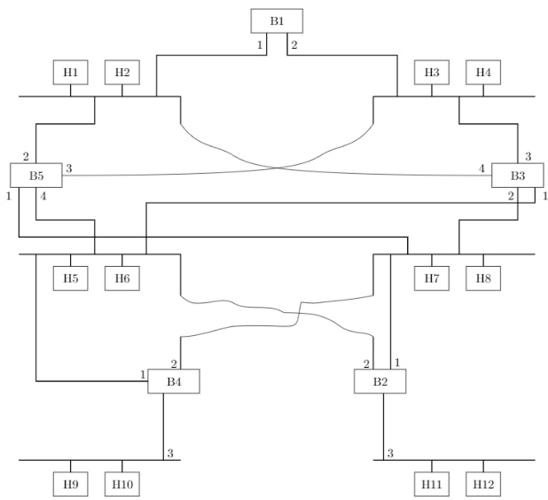

For the given connection of LANs by bridges, which one of the following choices represents the depth first traversal of the spanning tree of bridges?

A. B1,B5, B3, B4, B2 B. B1,B3,B5,B2,B4   
C. B1,B5, B2, B3,B4 D. B1,B3,B4,B5,B2

gatecse-2006 computer-networks bridges normal

# Answer key☟

Consider the diagram shown below where a number of LANs are connected by (transparent) bridges. order to avoid packets looping through circuits in the graph, the bridges organize themselves in a spanning tree. First, the root bridge is identified as the bridge with the least serial number. Next, the root sends out (one or more) data

nits to enable the setting up of the spanning tree of shortest paths from the root bridge to each bridge.

Each bridge identifies a port (the root port) through which it will forward frames to the root bridge. Port conflicts are always resolved in favour of the port with the lower index value. When there is a possibility of multiple bridges forwarding to the same LAN (but not through the root port), ties are broken as follows: bridges closest to the root get preference and between such bridges, the one with the lowest serial number is preferred.

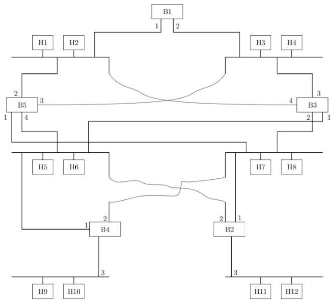

Consider the spanning tree $B 1 , B 5 , B 3 , B 4 , B 2$ for the given connection of LANs by bridges, that represents the depth first traversal of the spanning tree of bridges. Let host $H 1$ send out a broadcast ping packet. Which of the following options represents the correct forwarding table on $B 3 ?$

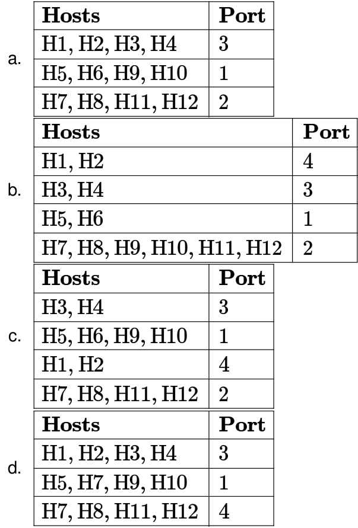

The message is to be transmitted using the CRC polynomial $x ^ { 3 } + 1$ to protect it from errors. The message that should be transmitted is:

A. 11001001000 B. 11001001011 C. 11001010 D. 110010010011 gatecse-2007 computer-networks error-detection crc-polynomial normal isro2016

A computer network uses polynomials over $G F ( 2 )$ for error checking with bits as information bits and uses ${ \pmb x } ^ { 3 } + { \pmb x } + { \pmb 1 }$ as the generator polynomial to generate the check bits. In this network, the message 01011011 is transmitted as:

A. 01011011010 B. 01011011011 C. 01011011101 D. 01011011100

gatecse-2017-set1 computer-networks crc-polynomial normal

A. 101 B. 110 C. 100 D. 111

Consider the transmission of data bits over a link that uses Cyclic Redundancy Check (CRC) code for error detection. If the generator bit pattern is given to be , which one of the following options shows the remainder bit pattern appended to the data bits before transmission?

A. 011 B. 101 C. 000 D. 100 gatecse-2026-set2 computer-networks crc-polynomial error-detection two-marks

Consider the following message $M = 1 0 1 0 0 0 1 1 0 1$ . The cyclic redundancy check (CRC) for this message using the divisor polynomial $x ^ { 5 } + x ^ { 4 } + x ^ { 2 } + 1$ is :

A. 01110 B. 01011 C. 10101 D. 10110

gateit-2005 computer-networks crc-polynomial normal

Answer key☟

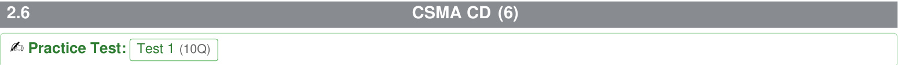

Consider a CSMA/CD network that transmits data at a rate of $\mathrm { 1 0 ^ { 8 } }$ per second) over a (kilometre) cable with no repeaters. If the minimum frame size required for this network is What is the signal speed $( k m / s e c )$ in the cable?

A. 8000 B. 10000 C. 16000 D. 20000 gatecse-2015-set3 computer-networks congestion-control csma-cd normal

A network has a data transmission bandwidth of $2 0 \times 1 0 ^ { 6 }$ bits per second. It uses CSMA/CD in the MAC layer. The maximum signal propagation time from one node to another node is microseconds. The minimum size of a frame in the network is bytes.

gatecse-2016-set2 computer-networks csma-cd numerical-answers normal

# 2.6.3 CSMA CD: GATE CSE 2018 Question: 55

Consider a simple communication system where multiple nodes are connected by a shared broadcast medium (like Ethernet or wireless). The nodes in the system use the following carrier-sense based medium access protocol. A node that receives a packet to transmit will carrier-sense the medium for units of time. If the node does not detect any other transmission, it starts transmitting its packet in the next time unit. If the node detects another transmission, it waits until this other transmission finishes, and then begins to carrier-sense for  time units again. Once they start to transmit, nodes do not perform any collision detection and continue transmission even if a collision occurs. All transmissions last for  units of time. Assume that the transmission signal travels at the speed of  meters per unit time in the medium.

Assume that the system has two nodes $P$ and $Q$ , located at a distance $d$ meters from each other. $P$ start transmitting a packet at time $t = 0$ after successfully completing its carrier-sense phase. Node $Q$ has a packet to transmit at time $t = 0$ and begins to carrier-sense the medium.

The maximum distance $d$ (in meters, rounded to the closest integer) that allows $Q$ to successfully avoid a collision between its proposed transmission and $P \mathsf { s }$ ongoing transmission is

gatecse-2018 computer-networks csma-cd numerical-answers two-marks

Which of the following statements is TRUE about CSMA/CD:

A. IEEE  wireless LAN runs CSMA/CD protocol   
B. Ethernet is not based on CSMA/CD protocol   
C. CSMA/CD is not suitable for a high propagation delay network like satellite network   
D. There is no contention in a CSMA/CD network

gateit-2005 computer-networks congestion-control csma-cd normal

A network with CSMA/CD protocol in the MAC layer is running at over a cable with no repeaters. The signal speed in the cable is $\mathbf { 2 } \times \mathbf { 1 0 ^ { 8 } m } / \mathrm { s e c }$ . The minimum frame size for this network should be:

A. 10000bits B. 10000bytes C. 5000 bits D. 5000bytes

gateit-2005 computer-networks congestion-control csma-cd normal

The minimum frame size required for a CSMA/CD based computer network running at on a $2 0 0 m$ cable with a link speed of $\mathbf { 2 } \times \mathbf { 1 0 ^ { 8 } m } / \mathrm { s e c }$ is:

A. 125bytes B. 250bytes C. 500bytes D. None of the above

gateit-2008 computer-networks csma-cd normal

# Answer key☟

# 2.7.1 Channel Utilization: GATE CSE 2025 Set 2 Question: 26

Suppose we are transmitting frames between two nodes using Stop-and-Wait protocol. The frame size is bits. The transmission rate of the channel is bps (bits/second) and the propagation delay between the two nodes is milliseconds. Assume that the processing times at the source and destination are negligible. Also, assume that the size of the acknowledgement packet is negligible. Which ONE of the following most accurately gives the channel utilization for the above scenario in percentage?

A. 88.23 B. 93.75 C. 85.44 D. 66.67 gatecse2025-set2 computer-networks stop-and-wait channel-utilization two-marks

# Answer key☟

network of two routers $( R _ { 1 } { \mathrm { a n d } } R _ { 2 } )$ and three links $( L _ { 1 } , L _ { 2 }$ ， and $L _ { 3 }$ . $L _ { 1 }$ connects $\boldsymbol { S }$ to $R _ { 1 } ; L _ { 2 }$ connects $R _ { 1 }$ to ; and $L _ { 3 }$ connects $\dot { R _ { 2 } }$ to $D$ . Let each link be of length $1 0 0 \mathrm { k m }$ . Assume signals travel over each link at a speed of $1 0 ^ { 8 }$ meters per second. Assume that the link bandwidth on each link is . Let the file be broken down into packets each of size bits. Find the total sum of transmission and propagation delays in transmitting the file from $\boldsymbol { S }$ to $D ?$

A. 1005 ms B. 1010 ms C. 3000 ms D. 3003 ms

gatecse-2012 computer-networks communication normal

Consider a  link between an earth station (sender) and a satellite (receiver) at an altitude $2 1 0 0 \mathrm { k m }$ · The signal propagates at a speed of $3 \times 1 0 ^ { 8 } \mathrm { m / s }$ The time taken (in milliseconds, rounded offto two decimal places) for the receiver to completely receive a packet of transmitted by the sender is

gatecse-2022 numerical-answers computer-networks two-marks communication

# 2.8.3 Communication: GATE IT 2007 Question: 62

Let us consider a statistical time division multiplexing of packets. The number of sources is . In a time unit, a source transmits a packet of  bits. The number of sources sending data for the first  time units is $6 , 9 , 3 , 7 , 2 , 2 , 2 , 3 , 4 , 6 , 1 , 1 0 , 7 , 5 , 8 , 3 , 6 , 2 , 9 , 5$ respectively. The output capacity of multiplexer is bits per time unit. Then the average number of backlogged of packets per time unit during the given period is

A. B. 4.45 C. 3.45 D.

gateit-2007 computer-networks communication normal

# 2.8.4 Communication: GATE IT 2007 Question: 64

A broadcast channel has  nodes and total capacity of  Mbps. It uses polling for medium access. Once node finishes transmission, there is a polling delay of $8 0 ~ \mu \ s$ to poll the next node. Whenever a node is polled, it is allowed to transmit a maximum of  bytes. The maximum throughput of the broadcast channel

A. Mbps B. Mbps C. Mbps D. Mbps

gateit-2007 computer-networks communication normal

# Answer key☟

✍ Practice Test: Test (14Q)

A. MSS B. MSS C. MSS D. MSS

Let the size of congestion window of a TCP connection be $3 2 \mathsf { K B }$ when a timeout occurs. The round trip time of the connection is  msec and the maximum segment size used is KB. The time taken (in msec) by the TCP connection to get back to $3 2 \mathsf { K B }$ congestion window is

gatecse-2014-set1 computer-networks tcp congestion-control numerical-answers normal

Consider the following statements regarding the slow start phase of the TCP congestion control algorithm. Note that cwnd stands for the TCP congestion window and MSS window denotes the Maximum Segments Size:

i. The cwnd increases by MSS on every successful acknowledgment ii. The cwnd approximately doubles on every successful acknowledgment iii. The cwnd increases by MSS every round trip time iv. The cwnd approximately doubles every round trip time

Which one of the following is correct?

A. Only and are true B. Only (i) and are true C. Only is true D. Only (i) and are true gatecse-2018 computer-networks tcp congestion-control normal one-mark

Consider a connection between a client and a server with the following specifications; the round time is $6 \mathrm { m s }$ , the size of the receiver advertised window is $5 0 \mathsf { K B }$ , slow-start threshold at the client is $3 2 \mathsf { K B }$ , and the maximum segment size is $2 \mathsf { K B }$ . The connection is established at time $t = 0$ . Assume that there are no timeouts and errors during transmission. Then the size of the congestion window (in ) at time $t + 6 0$ ms after all acknowledgements are processed is

gatecse-2020 numerical-answers computer-networks tcp congestion-control two-marks

Consider a connection operating at a point of time with the congestion window of size (Maximum Segment Size), when a timeout occurs due to packet loss. Assuming that all the segments transmitted in the next two  (Round Trip Time) are acknowledged correctly, the congestion window size ( in ) during the third  will be

gatecse-2024-set2 numerical-answers computer-networks tcp congestion-control two-marks

A. $9 \leq t < 1 0$ B.   
C. $1 1 \leq t < 1 2$ D. $1 2 \leq t < 1 3$

Consider a new TCP connection between a sender and a receiver. The receiver advertised window is constant at $^ { 4 8 }$ KB, the maximum segment size (MSS) is $2 \mathsf { \ K B }$ , and the slow start threshold for TCP congestion control is $1 6 \mathsf { \ K B }$ . Assume that there are no timeouts or duplicate acknowledgements. The number of rounds of transmission required for the congestion control algorithm of the TCP connection to reach the congestion avoidance phase is (answer in integer)

gatecse-2026-set2 computer-networks congestion-control tcp numerical-answers two-marks

On a TCP connection, current congestion window size is Congestion Window $= 4$ KB. The window advertised by the receiver is Advertise Window $= 6$ KB. The last byte sent by the sender is LastByteSent $\mathbf { \sigma } = \mathbf { \sigma }$ 10240 and the last byte acknowledged by the receiver is LastByteAcked $\mathbf { \tau } = 8 1 9 2$ . The current window size at the sender is:

A. 2048 bytes B. bytes C. bytes D. bytes

gateit-2005 computer-networks congestion-control normal

It is necessary to design a link-layer protocol between two hosts that are directly connected over a lossless link of length kilometers. Assume that the link bandwidth is $\mathtt { 1 0 ^ { 8 } }$ bits per second and that the propagation delay in the link is nanoseconds per meter. Every transmitted data byte is assigned a unique sequence number.

Let $N$ be the minimum number of bits needed for the sequence number field in the protocol header such that i. the sequence numbers do not wrap around before  seconds, and ii. the maximum utilization of the link is achieved.

The value of $N$ is (answer in integer)

gatecse-2026-set2 computer-networks data-communication numerical-answers two-marks

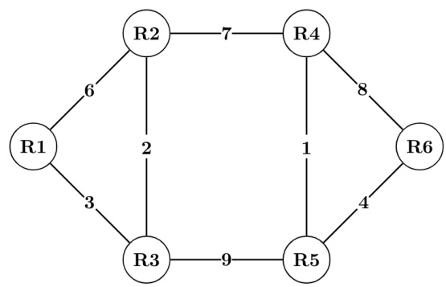

All the routers use the distance vector based routing algorithm to update their routing tables. Each router starts with its routing table initialized to contain an entry for each neighbor with the weight of the respective connecting link. After all the routing tables stabilize, how many links in the network will never be used for carrying any data?

A. B. C. D. gatecse-2010 computer-networks routing distance-vector-routing normal

Consider a network with  routers $R 1$ to $R 6$ connected with links having weights as shown in the following diagram.

Suppose the weights of all unused links are changed to  and the distance vector algorithm is used again until all routing tables stabilize. How many links will now remain unused?

A. B. C. D. gatecse-2010 computer-networks routing distance-vector-routing normal

Consider a network with five nodes, $N 1$ to $N 5$ , as shown as below.

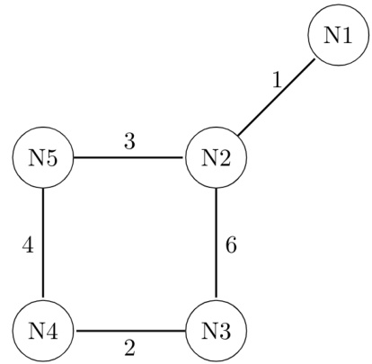

The network uses a Distance Vector Routing protocol. Once the routes have been stabilized, the distance vectors at different nodes are as follows.

N1:

N2: (1,0,6,7,3) N3: N4: N5: (4,3,6,4,0)

Each distance vector is the distance of the best known path at that instance to nodes, $N 1$ to $N 5$ , where the distance to itself is . Also, all links are symmetric and the cost is identical in both directions. In each round, all nodes exchange their distance vectors with their respective neighbors. Then all nodes update their distance vectors. In between two rounds, any change in cost of a link will cause the two incident nodes to change only that entry in their distance vectors.

The cost of link $N 2 - N 3$ reduces to (in both directions). After the next round of updates, what will be the new distance vector at node, $N 3 \ell$

A. (3,2,0,2,5) B. (3,2,0,2,6) C. (7,2,0,2,5) D. (7,2,0,2,6)

gatecse-2011 computer-networks routing distance-vector-routing normal

# Answer key☟

# 2.11.4 Distance Vector Routing: GATE CSE 2011 Question: 53

Consider a network with five nodes, $N 1$ to $N 5$ , as shown as below.

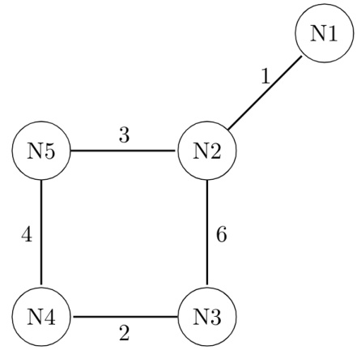

The network uses a Distance Vector Routing protocol. Once the routes have been stabilized, the distance vectors at different nodes are as follows.

N1: (0,1,7,8,4) N2: (1,0,6,7,3) N3: (7,6,0,2,6) N4: (8,7,2,0,4) N5: (4,3,6,4,0)

Each distance vector is the distance of the best known path at that instance to nodes, $N 1$ to $N 5$ , where the distance to itself is . Also, all links are symmetric and the cost is identical in both directions. In each round, all nodes exchange their distance vectors with their respective neighbors. Then all nodes update their distance vectors. In between two rounds, any change in cost of a link will cause the two incident nodes to change only that entry in their distance vectors.

The cost of link $N 2 - N 3$ reduces to  (in both directions). After the next round of updates, the link $N 1 - N 2$ goes down. $N 2$ will reflect this change immediately in its distance vector as cost, $\infty$ . After the NEXT ROUND of update, what will be the cost to $N 1$ in the distance vector of  ?

A. B. 9 C. D. 8

Consider a computer network using the distance vector routing algorithm in its network layer. The partial topology of the network is shown below.

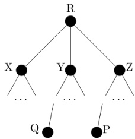

The objective is to find the shortest-cost path from the router $R$ to routers $P$ and $Q$ . Assume that $R$ does not initially know the shortest routes to $P$ and $Q$ . Assume that $R$ has three neighbouring routers denoted as $X$ , $Y$ and $Z$ . During one iteration, $R$ measures its distance to its neighbours $X , Y$ , and $Z$ as ,  and , respectively. Router $R$ gets routing vectors from its neighbours that indicate that the distance to router $P$ from routers $X$ , $Y$ and $Z$ are , an d , respectively. The routing vector also indicates that the distance to router $Q$ from routers $X$ , $Y$ and $Z$ are ,  and respectively. Which of the following statement(s) is/are correct with respect to the new routing table o $R$ , after updation during this iteration?

A. The distance from $R$ to $P$ will be stored as B. The distance from $R$ to $Q$ will be stored as C. The next hop router for a packet from $R$ to $P$ is $Y$ D. The next hop router for a packet from $R$ to $Q$ is $Z$

Consider a network with three routers  shown in the figure below. All the links have cost of unity.

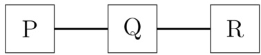

The routers exchange distance vector routing information and have converged on the routing tables, after which the link  fails. Assume that $\mathbf { P }$ and $\mathbf { Q }$ send out routing updates at random times, each at the same average rate. The probability of a routing loop formation (rounded off to one decimal place) between $\mathrm { \bf P }$ and $\mathbf { Q }$ ， leading to countto-infinity problem, is

gatecse-2022 numerical-answers computer-networks routing distance-vector-routing two-marks

Count to infinity is a problem associated with:

A. link state routing protocol. B. distance vector routing protocol C. DNS while resolving host name D. TCP for congestion control

gateit-2005 computer-networks routing distance-vector-routing normal

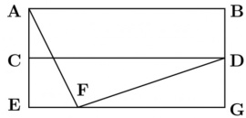

Routing Table of A   
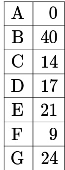

Routing Table of D   
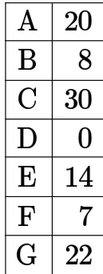

Routing Table ofE   
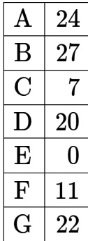

Routing Table of G   
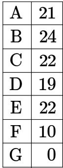

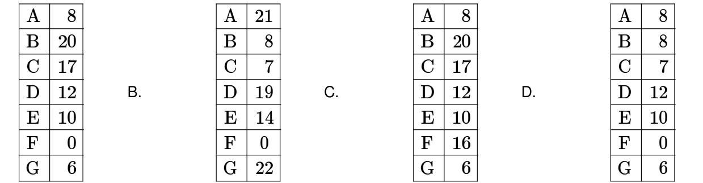

✍ Practice Test: Test 7 (9Q)

Consider a -bit error detection and -bit error correction hamming code for -bit data. The extra parity bits required would be and the -bit error detection is possible because the code has a minimum distance of

gate1992 computer-networks error-detection normal fill-in-the-blanks

What is the distance of the following code 000000 , 000111, , 111111?

A. B. C. D.

gate1995 computer-networks error-detection normal

Consider the binary code that consists of only four valid codewords as given below: 00000,01011,10101,11110

Let the minimum Hamming distance of the code $p$ and the maximum number of erroneous bits that can be corrected by the code be $q$ . Then the values of $p$ and $q$ are

A. $\scriptstyle { p = 3 }$ and $q = 1$ B. $\scriptstyle { p = 3 }$ and $q = 2$ $\mathtt { C . } \mathtt { \Delta p } = 4 \mathtt { a n d } q = 1 \qquad \mathtt { \Delta } \mathtt { \Gamma } \mathtt { \Gamma } \mathtt { \Gamma } \mathtt { \Gamma } \mathtt { \Gamma } \mathtt { \Gamma } \mathtt { \Gamma } \mathtt { \Gamma } \mathtt { \Gamma } \mathtt { \Gamma } \mathtt { \Gamma } \mathtt { \Gamma } \mathtt { \Gamma } \mathtt { \Gamma } \mathtt { \Gamma } \mathtt { \Gamma } \mathtt { \Gamma } \mathtt { \Gamma } \mathtt { \Gamma } \mathtt { \Gamma }$

gatecse-2017-set2 computer-networks error-detection

# Answer key ☟

# 2.12.5 Error Detection: GATE IT 2005 Question: 74

In a communication network, a packet of length $L$ bits takes link $L _ { 1 }$ with a probability of $p _ { 1 }$ or link $L _ { 2 }$ with a probability of $p _ { 2 }$ . Link $L _ { 1 }$ and L2 have bit error probability of $b _ { 1 }$ and $b _ { 2 }$ respectively. The probability that the packet will be received without error via either $L _ { 1 }$ or $L _ { 2 }$ is

A. $( 1 - b _ { 1 } ) ^ { L } p _ { 1 } + ( 1 - b _ { 2 } ) ^ { L } p _ { 2 }$ $\begin{array} { r l } & { \mathsf { B .  { \left[ 1 - ( b _ { 1 } + b _ { 2 } ) ^ { L } \right] } } p _ { 1 } p _ { 2 } } \\ & { \mathsf { D .  { \left. \mathsf { 1 } - ( b _ { 1 } ^ { L } p _ { 1 } + b _ { 2 } ^ { L } p _ { 2 } ) \right. } } } \end{array}$ C. $( 1 - b _ { 1 } ) ^ { L } ( 1 - b _ { 2 } ) ^ { L } p _ { 1 } p _ { 2 }$   
gateit-2005 computer-networks error-detection probability normal

# 2.12.6 Error Detection: GATE IT 2007 Question: 43

An error correcting code has the following code words: 00000000,00001111,01010101,10101010,11110000. What is the maximum number of bit errors that can be corrected?

A . B. C. D. 3

gateit-2007 computer-networks error-detection normal

Data transmitted on a link uses the following $2 D$ parity scheme for error detection:

Each sequence of  bits is arranged in a $4 \times 7$ matrix (rows $r _ { 0 }$ through $r _ { 3 }$ , and columns $d _ { 7 }$ through $d _ { 1 }$ ) and is padded with a column $d _ { 0 }$ and row $r _ { 4 }$ of parity bits computed using the Even parity scheme. Each bit of column $d _ { 0 }$ (respectively, row $r _ { 4 }$ ) gives the parity of the corresponding row (respectively, column). These bits are transmitted over the data link.

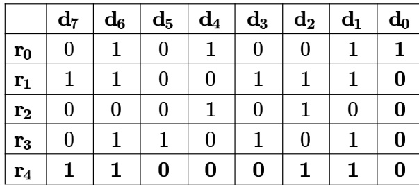

The table shows data received by a receiver and has $n$ corrupted bits. What is the mini​mum possible value of $n$ ?

A. B. C. D.

Match the pairs in the following questions:

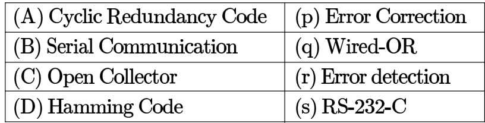

gate1989 descriptive computer-networks error-detection

Answer key☟

✍ Practice Test: Test (8Q)

$A$ and $B$ are the only two stations on an Ethernet. Each has a steady queue of frames to send. Both $A$ and $B$ attempt to transmit a frame, collide, and $A$ wins the first backoff race. At the end of this successful transmission by $A$ , both $A$ and $B$ attempt to transmit and collide. The probability that $A$ wins the second backoff race is:

A. B. 0.625 C. 0.75 D. 1.0

gatecse-2004 computer-networks ethernet probability normal

# 2.13.2 Ethernet: GATE CSE 2013 Question: 36

Determine the maximum length of the cable (in km) for transmitting data at a rate of Mbps in an Ethernet LAN with frames of size  bits. Assume the signal speed in the cable to be $0 0 0 \ k m / \bar { \rho }$ .

A. B.   
C. 2.5 D.

gatecse-2013 computer-networks ethernet normal

Answer key☟

# 2.13.3 Ethernet: GATE CSE 2016 | Set 2 Question: 24

In an Ethernet local area network, which one of the following statements is TRUE?

A. A station stops to sense the channel once it starts transmitting a frame.   
B. The purpose of the jamming signal is to pad the frames that are smaller than the minimum frame size.   
C. A station continues to transmit the packet even after the collision is detected.   
D. The exponential back off mechanism reduces the probability of collision on retransmissions.

gatecse-2016-set2 computer-networks ethernet normal

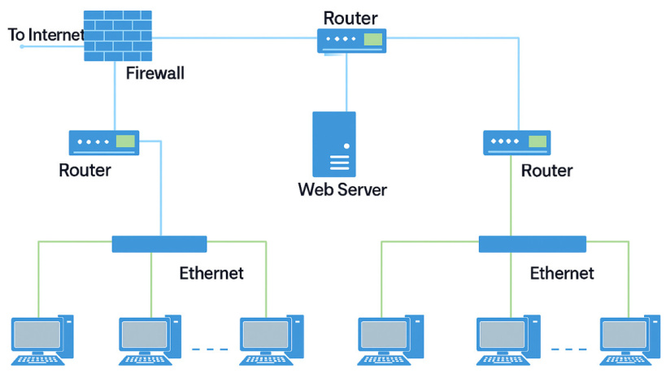

What is the number of subnets inside the enterprise network?

A. B. 12 C. 6 D. gatecse-2022 computer-networks ethernet one-mark

Node X has a connection open to node . The packets from to  go through an intermediate router . Ethernet switch is the first switch on the network path between  and . Consider a packet sent from to over this connection.

Which of the following statements is/are TRUE about the destination  and  addresses on this packet at the time it leaves ?

A. The destination  address is the  address of B. The destination address is the address of C. The destination address is the address of D. The destination address is the address of gatecse-2024-set2 computer-networks multiple-selects ethernet one-mark

Consider an Ethernet segment with a transmission speed of $1 0 ^ { 8 }$ and a maximum segment length of meters. If the speed of propagation of the signal in the medium is $2 \times 1 0 ^ { 8 }$ meters/sec, then the minimum frame size (in bits) required for collision detection is

gatecse-2024-set2 numerical-answers computer-networks ethernet two-marks

Consider three IP networks $A , B$ and $\boldsymbol { C }$ . Host $H _ { A }$ in network $A$ sends messages each containing bytes of application data to a host $H _ { C }$ in network $C$ . The layer prefixes byte header to the message.

This passes through an intermediate network $B$ .The maximum packet size, including 20 byte IP header, in each network is:

A: 1000 bytes B: bytes C: 1000 bytes

The network $A$ and $B$ are connected through a  Mbps link, while $B$ and $\boldsymbol { C }$ are connected by a Kbps link (bps $\mathbf { \sigma } = \mathbf { \sigma }$ bits per second).

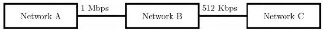

Assuming that the packets are correctly delivered, how many bytes, including headers, are delivered to the $I P$ layer at the destination for one application message, in the best case? Consider only data packets.

A. 200 B. 220 C. 240 D. 260 gatecse-2004 computer-networks ip-addressing fragmentation tcp normal

Consider three IP networks $A , B$ and $C$ . Host $H _ { A }$ in network $A$ sends messages each containing of application data to a host $H _ { C }$ in network $C$ . The TCP layer prefixes byte header to the message. This passes through an intermediate network $B$ . The maximum packet size, including byte IP header, in each network, is:

$A : 1 0 0 0$ bytes $B : 1 0 0$ $C : 1 0 0 0$

The network $A$ and $B$ are connected through a Mbps link, while $B$ and $C$ are connected by a link (bps $\mathbf { \sigma } = \mathbf { \sigma }$ bits per second).

1 Mbps 512Kbps Network A Network B Network C

What is the rate at which application data is transferred to host $H _ { C } ?$ Ignore errors, acknowledgments, and other overheads.

A. 325.5 Kbps B. 354.5 Kbps C. 409.6 Kbps D. 512.0 gatecse-2004 computer-networks ip-addressing fragmentation tcp normal

# Answer key☟

Suppose a message of size  bytes is transmitted from a source to a destination using IPv4 protocol via two routers as shown in the figure. Each router has a defined maximum transmission unit (MTU) as shown in the figure, including IP header. The number of fragments that will be delivered to the destination is (Answer in integer)

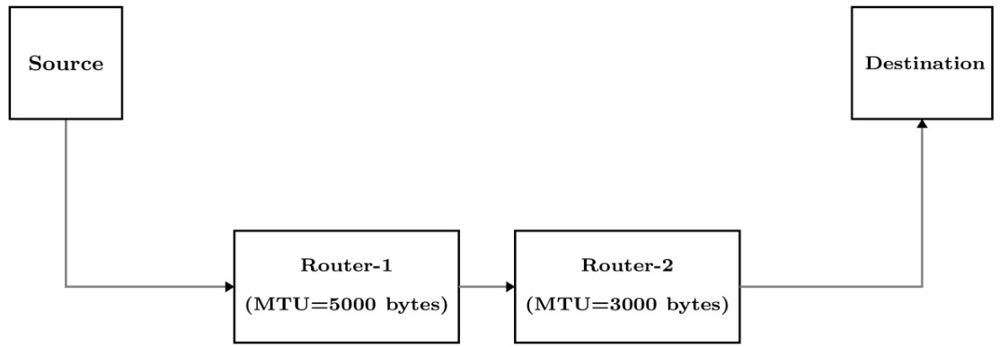

Consider a network that uses Ethernet and $I P v 4 .$ Assume that $I P v 4$ headers do not use any options field.   
Each Ethernet frame can carry a maximum of  bytes in its data field. A UDP segment is transmitted.   
The payload (data) in the UDPO segment is bytes.

Which ONE of the following choices has the CORRECT total number of fragments transmitted and the size of the last fragment including $I P v 4$ header?

A. fragments bytes B. fragments bytes C. fragments bytes D. fragments bytes gatecse2025-set2 computer-networks fragmentation ip-addressing one-mark

Following bit single error correcting hamming coded message is received.

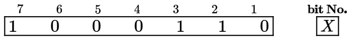

Determine if the message is correct (assuming that at most bit could be corrupted). If the message contains an error find the bit which is erroneous and gives correct message.

gate1994 computer-networks error-detection hamming-code normal descriptive

Which one of the following choices gives the correct values of $x$ and ?

A. $x$ is  and $y$ is B. $x$ is  and $y$ is C. $x$ is and $y$ is D. $x$ is and $y$ is gatecse-2021-set1 computer-networks hamming-code two-marks error-detection ✍ Practice Tests: Test 1 (15Q) Test 2 (2Q)

Which of the following assertions is FALSE about the Internet Protocol (IP)?

A. It is possible for a computer to have multiple IP addresses   
CB. IP packets from the same source to the same destination can take different routes in the network IP ensures that a packet is discarded if it is unable to reach its destination within a given number of hops   
D. The packet source cannot set the route of an outgoing packets; the route is determined only by the routing tables in the routers on the way

gatecse-2003 computer-networks ip-addressing normal

In the IPv4 addressing format, the number of networks allowed under Class $\boldsymbol { C }$ addresses is:

A. $2 ^ { 1 4 }$ B. C. $2 ^ { 2 1 }$ D. $2 ^ { 2 4 }$

gatecse-2012 computer-networks ip-addressing easy

The maximum number of  router addresses that can be listed in the record route (RR) option field of an header is

gatecse-2017-set2 computer-networks ip-addressing numerical-answers

Consider an IP packet with a length of  that includes a  header and a TCP header. The packet is forwarded to an  router that supports a Maximum Transmission Unit (MTU) o f . Assume that the length of the IP header in all the outgoing fragments of this packet is . Assume that the fragmentation offset value stored in the first fragment is .

The fragmentation offset value stored in the third fragment is gatecse-2018 computer-networks ip-addressing numerical-answers two-marks your web browser, which references equally small objects on the same web server.

Which of the following statements is/are CORRECT about the minimum elapsed time between clicking on the and your browser fully rendering it?

A. s, in case of non-persistent  with  parallel connections.   
B. 5 s, in case of persistent  with pipelining.   
C. s, in case of non-persistent  with  parallel connections.   
D. s, in case of persistent  with pipelining.

gatecse-2023 computer-networks ip-addressing multiple-selects two-marks

Which one of the following prefixes exactly represents the range of addresses 10.12.2.0 to 10.12.3.255?

A. 10.12.2.0/23 B. 10.12.2.0/24   
C. 10.12.0.0/22 D. 10.12.2.0/22

gatecse-2024-set2 computer-networks ip-addressing two-marks

A machine receives an  datagram. The protocol field of the $I P v 4$ header has the protocol number of a protocol $X$ .

Which ONE of the following is NOT a possible candidate for ?

A. Internet Control Message Protocol B. Internet Group Management (ICMP) (IGMP) C. Open Shortest Path First (OSPF) D. Routing Information Protocol (RIP)

gatecse2025-set2 computer-networks ip-addressing one-mark

Answer key☟

If an IP network uses a subnet mask of , the maximum number of IP addresses that can be assigned to network interfaces is (answer in integer)

gatecse-2026-set2 computer-networks ip-addressing numerical-answers one-mark ✍ Practice Tests: Test 1 (15Q) Test 2 (3Q)

One of the header fields in an IP datagram is the Time-to-Live (TTL) field. Which of the following statements best explains the need for this field?

A. It can be used to prioritize packets. B. It can be used to reduce delays. C. It can be used to optimize D. It can be used to prevent packe throughput. looping.

gatecse-2010 computer-networks ip-packet easy

Host A (on TCP/IP v4 network A) sends an IP datagram D to host B (also on TCP/IP v4 network B). Assume that no error occurred during the transmission of D. When D reaches B, which of the following IP header field(s) may be different from that of the original datagram D?

i. TTL ii. Checksum iii. Fragment Offset

A.  only B. 1 and  only C. and  only D. and

gatecse-2014-set3 computer-networks ip-packet normal

An $I P$ router with a Maximum Transmission Unit (MTU) of bytes has received an $I P$ packet of size  with an $I P$ header of length . The values of the relevant fields in the header of the third $I P$ fragment generated by the router for this packet are:

A. : Datagram Length: Offset 370   
B. MFbit: Datagram Length 1424; Offset 185   
C. MF : Datagram Length 1500; Offset 370   
D. MF : Datagram Length 1424; Offset 2960

gatecse-2014-set3 computer-networks fragmentation ip-packet normal

Which of the following fields of an IP header is NOT modified by a typical IP router?

A. Check sum B. Source address C. Time to Live (TTL) D. Length

gatecse-2015-set1 computer-networks ip-packet easy

An IP datagram of size  arrives at a router. The router has to forward this packet on a link whose MTU (maximum transmission unit) is Assume that the size of the IP header is

The number of fragments that the IP datagram will be divided into for transmission is gatecse-2016-set1 computer-networks fragmentation ip-packet normal numerical-answers

Which of the following fields is/are modified in the header of a packet going out of a network address translation  device from an internal network to an external network?

A. Source B. Destination C. Header Checksum D. Total Length gatecse-2024-set1 multiple-selects computer-networks ip-packet one-mark

Consider sending an  datagram of size  bytes (including  bytes of  header) from a sender to receiver over a path of two links with a router between them. The first link (sender to router) has an (Maximum Transmission Unit) size of  bytes, while the second link (router to receiver) has an  size of bytes. The number of fragments that would be delivered at the receiver is

gatecse-2024-set1 numerical-answers computer-networks ip-packet fragmentation two-marks ​Which of the following statements about fragmentation is/are TRUE?

A. The fragmentation of an  datagram is performed only at the source of the datagram   
B. The fragmentation of an datagram is performed at any router which finds that the size of the datagram to be transmitted exceeds the   
C. The reassembly of fragments is performed only at the destination of the datagram   
D. The reassembly of fragments is performed at all intermediate routers along the path from the source to the destination

gatecse-2024-set2 computer-networks multiple-selects ip-packet one-mark

Which of the following fields of an  header is/are always modified by any router before it forwards the packet?

A. Source Address B. Protocol C. Time to Live (TTL) D. Header Checksum gatecse-2024-set2 computer-networks multiple-selects ip-packet easy one-mark

Answer key☟

Traceroute reports a possible route that is taken by packets moving from some host $A$ to some other host $B$ . Which of the following options represents the technique used by traceroute to identify these hosts:

A. By progressively querying routers about the next router on the path to $B$ using  packets, starting with the first router   
B. By requiring each router to append the address to the packet as it is forwarded to $B$ . The list of all routers en-route to $B$ is returned by $B$ in an  reply packet   
C. By ensuring that an  reply packet is returned to $A$ by each router en-route to $B$ in the ascending order of their hop distance from $A$   
D. By locally computing the shortest path from $A$ to $B$

✍ Practice Test: Test (11Q)

# 2.19.1 LAN Technologies: GATE CSE 2003 Question: 83

A   long broadcast LAN has $1 0 ^ { 7 }$ bps bandwidth and uses CSMA/CD. The signal travels along the wire at $2 \times 1 0 ^ { 8 } ~ \mathrm { m } / \mathsf { s }$ . What is the minimum packet size that can be used on this network?

A. 50 bytes B. 100 bytes C. 200 bytes D. None of the above

gatecse-2003 computer-networks lan-technologies normal

There are $\scriptstyle n$ stations in slotted LAN. Each station attempts to transmit with a probability $p$ in each time slot. What is the probability that ONLY one station transmits in a given time slot?

A. $n p ( 1 - p ) ^ { n - 1 }$ B $\cdot \ ( 1 - p ) ^ { n - 1 }$ $\mathsf { C . ~ } p ( 1 - p ) ^ { n - 1 } \qquad \mathsf { D . ~ } 1 - ( 1 - p ) ^ { n - 1 }$

gatecse-2007 computer-networks lan-technologies probability normal

In the diagram shown below, $L 1$ is an Ethernet LAN and $L 2$ is a Token-Ring LAN. An $I P$ packet originates from sender $\boldsymbol { S }$ and traverses to $R$ , as shown. The links within each  and across the two $\mathrm { I S P s }$ , are all point-to-point optical links. The initial value of the field is . The maximum possible value of the  field when $R$ receives the datagram is

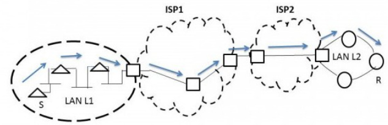

Consider that  machines need to be connected in a LAN using -port Ethernet switches. Assume tha these switches do not have any separate uplink ports. The minimum number of switches needed is

gatecse-2019 numerical-answers computer-networks lan-technologies two-marks

A host is connected to a Department network which is part of a University network. The University network, in turn, is part of the Internet. The largest network in which the Ethernet address of the host is unique is

A. the subnet to which the host B. the Department network belongs   
C. the University network D. the Internet   
gateit-2004 computer-networks lan-technologies ethernet normal

Which of the following statements is FALSE regarding a bridge?

A. Bridge is a layer device B. Bridge reduces collision domain C. Bridge is used to connect two or D. Bridge reduces broadcast domain more LAN segments

gateit-2005 computer-networks lan-technologies normal

A router has two full-duplex Ethernet interfaces each operating at $1 0 0 \mathrm { M b / s }$ . Ethernet frames are at least long (including the Preamble and the Inter-Packet-Gap). The maximum packet processing time at the router for wirespeed forwarding to be possible is (in micro​seconds)

A. 0.01 B. 3.36 C. 6.72 D. 8 gateit-2006 computer-networks lan-technologies ethernet normal ✍ Practice Test: Test 1 (6Q)

Suppose the round trip propagation delay for a  Ethernet having  jamming signal is $4 6 . 4 \mu s$ . The minimum frame size is:

A. B. 416 C. 464 D. 512

gatecse-2005 computer-networks mac-protocol ethernet

Consider a simplified time slotted MAC protocol, where each host always has data to send and transmits with probability $p = 0 . 2$ in every slot. There is no backoff and one frame can be transmitted in one slot. If more than one host transmits in the same slot, then the transmissions are unsuccessful due to collision. What is the maximum number of hosts which this protocol can support if each host has to be provided a minimum throughput of frames per time slot?

A. B. 2 C. 3 D. gateit-2004 computer-networks congestion-control mac-protocol normal

# 2.20.4 MAC Protocol: GATE IT 2005 Question: 75

In a TDM medium access control bus LAN, each station is assigned one time slot per cycle for transmission. Assume that the length of each time slot is the time to transmit   plus the end-to-end propagation delay. Assume a propagation speed of $2 \times 1 0 ^ { 8 } m / s e c$ . The length of the LAN is $1 \mathrm { k m }$ with a bandwidth of . The maximum number of stations that can be allowed in the LAN so that the throughput of each station can be   is

A. B. C. D.

gateit-2005 computer-networks mac-protocol normal

Answer key☟ ✍ Practice Test: Test (5Q)

# 2.21.1 Network Flow: GATE CSE 1992 Question: 01,v

A simple and reliable data transfer can be accomplished by using the 'handshake protocol'. It accomplishes reliable data transfer because for every data item sent by the transmitter

gate1992 computer-networks network-flow easy fill-in-the-blanks

# 2.21.2 Network Flow: GATE CSE 2017 Set 2 Question: 35

Consider two hosts $X$ and $Y$ , connected by a single direct link of rate $1 0 ^ { 6 }$ bits/sec. The distance between the two hosts is $0 0 0 { \mathrm { k m } }$ and the propagation speed along the link is $\mathbf { 2 } \times \mathrm { i } 0 ^ { 8 } \mathrm { m / s e c }$ . Host $X$ sends a file of  as one large message to host $Y$ continuously. Let the transmission and propagation delays be $p$ and $q$ respectively. Then the value of $p$ and $q$ are

A. $ { p } = 5 0$ and $q = 1 0 0$ B. $ { p } = 5 0$ and $q = 4 0 0$ C. $p = 1 0 0$ and q=50 D. $p = 4 0 0$ and q=50

gatecse-2017-set2 computer-networks network-flow

# 2.21.3 Network Flow: GATE IT 2004 Question: 87

A TCP message consisting of is passed to $| \mathsf { P }$ for delivery across two networks. The network can carry a maximum payload of bytes per frame and the second network can carry a maximum payload of   per frame, excluding network overhead. Assume that IP overhead per packet is 20 bytes. What is the total IP overhead in the second network for this transmission?

A. 40 bytes B. 80 bytes C. 120 bytes D. 160 bytes

A link of capacity is carrying traffic from a number of sources. Each source generates an traffic stream; when the source is on, the rate of traffic is , and when the source is off, the rate of traffic is zero. The duty cycle, which is the ratio of on-time to off-time, is $1 : 2$ . When there is no buffer at the link, the minimum number of sources that can be multiplexed on the link so that link capacity is not wasted and no data loss occurs is $S 1$ . Assuming that all sources are synchronized and that the link is provided with a large buffer, the maximum number of sources that can be multiplexed so that no data loss occurs is $S 2$ . The values of $S 1$ and $S 2$ are, respectively,

A. 10 and 30 B. C. D. 15 and

gateit-2006 computer-networks network-flow normal

Which of the following functionality must be implemented by a transport protocol over and above the network protocol?

A. Recovery from packet losses B. Detection of duplicate packets C. Packet delivery in the correct order D. End to end connectivity

gatecse-2003 computer-networks network-layer easy

Choose the best matching between Group 1 and Group 2

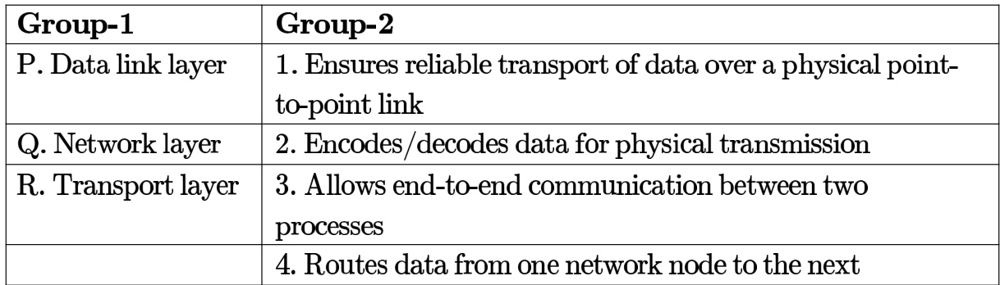

A. B. P-2, Q-4, R-1 C. P-2, Q-3, R-1 D. P-1, Q-3,R-2

gatecse-2004 computer-networks network-layer normal

# Answer key☟

Assume that source S and destination D are connected through two intermediate routers labeled R. Determine how many times each packet has to visit the network layer and the data link layer during a transmission from S to D.

A. Network layer $^ { - 4 }$ times and Data link layer $^ { - 4 }$ times B. Network layer – times and Data link layer –  times C. Network layer – times and Data link layer –  times D. Network layer – times and Data link layer – times

In the following pairs of OSI protocol layer/sub-layer and its functionality, the INCORRECT pair is

A. Network layer and Routing B. Data Link Layer and Bit synchronization C. Transport layer and End-to-end D. Medium Access Control sub-layer process communication and Channel sharing

gatecse-2014-set3 computer-networks network-layer easy

Answer key☟

Match the following:

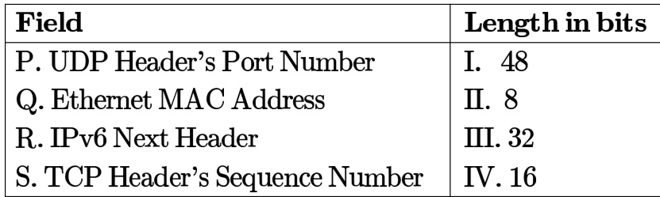

A. P-III, Q-IVR-II, S-I B. P-II, Q-IR-IV, S-II C. P-IV,Q-I,R-II, S-ⅢI D. P-IV,Q-I, R-II, S-II gatecse-2018 computer-networks network-layer match-the-following easy one-mark

# Answer key☟

# 2.22.6 Network Layer: GATE CSE 2026 Set 1 Question: 46

An ISP having an address block  assigns a block of $6 0 0 0 \mathsf { I P }$ addresses to a client, using the classless internet domain routing (CIDR) super- netting approach. Which of the following address blocks can be assigned by the ISP?

A. 202.16.0.0/19 B. 202.17.64.0/19   
C. 202.16.32.0/19 D. 202.17.24.0/19

gatecse-2026-set1 computer-networks two-marks network-layer multiple-selects

# Answer key☟

✍ Practice Test: Test 1 (15Q)

The address resolution protocol (ARP) is used for:

A. Finding the IP address from the DNS B. Finding the IP address of the default gateway C. Finding the IP address that corresponds to a MAC address D. Finding the MAC address that corresponds to an IP address gatecse-2005 computer-networks normal network-protocols

Match the following:

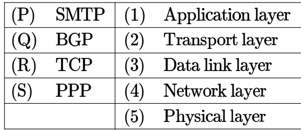

A. P-2,Q-1,R-3,S-5 B. P-1,Q-4,R-2,S-3   
C. P-1,Q-4,R-2,S-5 D. P-2,Q-4,R-1,S-3

gatecse-2007 computer-networks network-layer network-protocols easy match-the-following

# Answer key☟

In one of the pairs of protocols given below both the protocols can use multiple connections between the same client and the server. Which one is that?

A. HTTP,FTP B. HTTP,TELNET C. FTP, SMTP D. HTTP SMTP

gatecse-2015-set1 computer-networks network-protocols normal

# 2.23.5 Network Protocols: GATE CSE 2016 Set 1 Question: 24

Which one of the following protocols is NOT used to resolve one form of address to another one?

A. DNS B. ARP C. DHCP D. RARP

gatecse-2016-set1 computer-networks network-protocols easy

Suppose that in an IP-over-Ethernet network, a machine X wishes to find the MAC address of another machine Y in its subnet. Which one of the following techniques can be used for this?

A. X sends an ARP request packet to the local gateway’s IP address which then finds the MAC address of Y and sends to X   
B. X sends an ARP request packet to the local gateway’s MAC address which then finds the MAC address of Y and sends to X   
C. X sends an ARP request packet with broadcast MAC address in its local subnet   
D. X sends an ARP request packet with broadcast IP address in its local subnet

gatecse-2019 computer-networks network-protocols two-marks

The minimum value of the sender's window size in terms of the number of frames, (rounded to the nearest integer) needed to achieve a link utilization of $5 0 \%$ is

Consider the following two statements.

$S _ { 1 }$ : Destination address of an reply is a broadcast address.   
$S _ { 2 }$ : Destination address of an ARP request is a broadcast address.

Which one of the following choices is correct?

A. Both $S _ { 1 }$ and $S _ { 2 }$ are true B. $S _ { 1 }$ is true and $S _ { 2 }$ is false C. $S _ { 1 }$ is false and $S _ { 2 }$ is true D. Both $S _ { 1 }$ and $S _ { 2 }$ are false gatecse-2021 -set1 computer-networks network-protocols one-mark

# 2.23.9 Network Protocols: GATE CSE 2024 Set 1 Question: 6

A user starts browsing a webpage hosted at a remote server. The browser opens a single TCP connection to fetch the entire webpage from the server. The webpage consists of a top-level index page with multiple embedded image objects. Assume that all caches (e.g., DNS cache, browser cache) are all initially empty. The following packets leave the user's computer in some order.

i. HTTP GET request for the index page ii. DNS request to resolve the web server's name to its IP address iii. HTTP GET request for an image object iv. TCP SYN to open a connection to the web server

Which one of the following is the CORRECT chronological order (earliest in time to latest) of the packets leaving the computer?

A. (iv)， (ii), (ii), (i) B. (i)， (iv)， (i), ()C. (), (iv)，(i），(imi) D. (iv), (ii), (i), (ii)

gatecse-2024-set1 computer-networks network-protocols one-mark

Consider the following clauses:

i. Not inherently suitable for client authentication.   
ii. Not a state sensitive protocol.   
iii. Must be operated with more than one server.   
iv. Suitable for structured message organization.   
v. May need two ports on the serve side for proper operation.

The option that has the maximum number of correct matches is

A. IMAP-i; FTP-ii; HTTP-iii; DNS-iv; POP3-v B. FTP-i; POP3-ii; SMTP-iii; HTTP-iv; IMAP-v C. POP3-i; SMTP-ii; DNS-iii; IMAP-iv; HTTP-v D. SMTP-i; HTTP-ii; IMAP-iii; DNS-iv; FTP-v

Which of the following statements are TRUE?

S1: TCP handles both congestion and flow control   
S2: UDP handles congestion but not flow control   
S3: Fast retransmit deals with congestion but not flow control   
S4: Slow start mechanism deals with both congestion and flow control

A. $S 1$ , $S 2$ and $S 3$ only B. $S 1$ and $S 3$ only C. $S 3$ and $S 4$ only D. $\mathit { s 1 }$ , $S 3$ and $S 4$ only

gateit-2008 computer-networks network-protocols normal

# Answer key☟

# 2.24 Network Switching (4)

✍ Practice Test: Test 1 (6Q)

# 2.24.1 Network Switching: GATE CSE 2005 Question: 73

In a packet switching network, packets are routed from source to destination along a single path having two intermediate nodes. If the message size is bytes and each packet contains a header of  bytes, then the optimum packet size is:

A. B. 6 C. D. 9

gatecse-2005 computer-networks network-switching normal

# 2.24.2 Network Switching: GATE CSE 2014 Set 2 Question: 26

Consider the store and forward packet switched network given below. Assume that the bandwidth of each link is $1 0 ^ { 6 }$ bytes sec. A user on host $A$ sends a file of size $1 0 ^ { 3 }$ bytes to host $B$ through routers $R 1$ and $R 2$ in three different ways. In the first case a single packet containing the complete file is transmitted from $A$ to $B$ . In the second case, the file is split into equal parts, and these packets are transmitted from $A$ to $B$ . In the third case, the file is split into equal parts and these packets are sent from $A$ to $B$ . Each packet contains bytes of header information along with the user data. Consider only transmission time and ignore processing, queuing and propagation delays. Also assume that there are no errors during transmission. Let $T 1$ , $\scriptstyle { T 2 }$ and $T 3$ be the times taken to transmit the file in the first, second and third case respectively. Which one of the following is CORRECT?

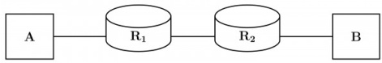

A. $T 1 < T 2 < T 3$ B.T1>T2>T3   
C. $_ { T 2 = T 3 , T 3 < T 1 }$ D. T1= T3,T3>T2

B. Packet switching results in less variation in delay than circuit switching C. Packet switching requires more per-packet processing than circuit switching D. Packet switching can lead to reordering unlike in circuit switching

Identify the ONE CORRECT matching between the OSI layers and their corresponding functionalities as shown.

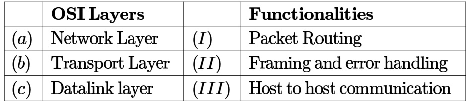

A. (a)-(I), (b)-(II), (c)-(Ⅲ) B. (a)-(I)，(b)-(II)， (c)-() C. (a)-(II), (b)-(1), (c)-(I) D. (a)-(III), (b)-(II), (c)-(I)

gatecse2025-set1 computer-networks osi-model easy one-mark

# Answer key☟

Suppose a -bit message is transmitted from a source to a destination through a noisy channel. probability that a bit of the message gets flipped during transmission is . Flipping of each bit is independent of one another. The probability that the message is delivered error-free to the destination is (rounded off to three decimal places)

gatecse2025-set1 computer-networks probability numerical-answers easy two-marks

Consider a network using the pure medium access control protocol, where each frame is of length 1,000 bits. The channel transmission rate is Mbps $( = 1 0 ^ { 6 }$ bits per second). The aggregate number of transmissions across all the nodes (including new frame transmissions and retransmitted frames due to collisions) is modelled as a Poisson process with a rate of  frames per second. Throughput is defined as the average number of frames successfully transmitted per second. The throughput of the network (rounded to the nearest integer) is

gatecse-2021-set2 computer-networks mac-protocol pure-aloha numerical-answers two-mark

C. For fault tolerance D. For minimizing collisions

Consider the following three statements about link state and distance vector routing protocols, for a large network with  network nodes and  links.

[S1]: The computational overhead in link state protocols is higher than in distance vector protocols.   
[S2]: A distance vector protocol (with split horizon) avoids persistent routing loops, but not a link state protocol.   
[S3]: After a topology change, a link state protocol will converge faster than a distance vector protocol.

Which one of the following is correct about $\mathit { s 1 }$ , $S 2$ , and $S 3 ?$

A. $S 1$ , $S 2$ , and $S 3$ are all true. B. $S 1 , S 2$ , and $S 3$ are all false. C. $S 1$ and $S 2$ are true, but $S 3$ is D. $S 1$ and $S 3$ are true, but $S 2$ is false. false.

Which of the following is TRUE about the interior gateway routing protocols Routing Information Protoco $( R I P )$ and Open Shortest Path First

A. RIP uses distance vector routing and OSPF uses link state routing B. OSPF uses distance vector routing and RIP uses link state routing C. Both RIP and OSPF use link state routing   
D. Both RIP and OSPF use distance vector routing

An IP router implementing Classless Inter-domain Routing (CIDR) receives a packet with address 131.23.151.76. The router's routing table has the following entries:

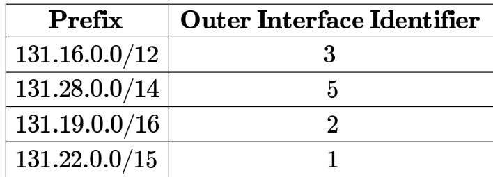

The identifier of the output interface on which this packet will be forwarded is gatecse-2014-set3 computer-networks routing normal numerical-answers

Which of the above statements are CORRECT?

A. and IV only B. I, II and III only C. I, II and IV only D. II, III and IV only

gatecse-2017-set2 computer-networks routing

Consider the following statements about the functionality of an  based router.

I. A router does not modify the  packets during forwarding.   
II. It is not necessary for a router to implement any routing protocol.   
III. A router should reassemble fragments if the  of the outgoing link is larger than the size of the incoming packet.

Which of the above statements is/are TRUE?

A. and II only B. I only C. II and III only D. II only gatecse-2020 computer-networks routing one-mark

Which of the following statements is/are about the OSPF (Open Shortest Path First) routing protocol used in the Internet?

A. implements Bellman-Ford algorithm to find shortest paths.   
B. uses Dijkstra's shortest path algorithm to implement least-cost path routing.   
C. is used as an inter-domain routing protocol.   
D. implements hierarchical routing.

gatecse-2023 computer-networks routing multiple-selects one-mark

Consider a network path $\mathbf { P } - \mathbf { Q } - \mathbf { R }$ between nodes $\mathrm { \bf P }$ and $\mathrm { \bf R }$ via router . Node $\mathrm { \bf P }$ sends a file of size $1 0 ^ { 6 }$ bytes to $\mathbf { R }$ via this path by splitting the file into chunks of $1 0 ^ { 3 }$ bytes each. Node sends these chunks one after the other without any wait time between the successive chunk transmissions. Assume that the size of extra headers added to these chunks is negligible, and that the chunk size is less than the .

Each of the links $\mathrm { { \bf P } - \bf { Q } }$ and $\mathbf { Q } - \mathbf { R }$ has a bandwidth of $1 0 ^ { 6 } \mathrm { b i t s / s e c }$ , and negligible propagation latency. Router $\mathsf { Q }$ immediately transmits every packet it receives from $\mathbf { P }$ to $\mathbf { R }$ , with negligible processing and queueing delays. Router $\mathbf { Q }$ can simultaneously receive on $\operatorname { l i n k P - Q }$ and transmit on $\mathsf { Q } - \mathsf { R }$ .

Assume $\mathbf { P }$ starts transmitting the chunks at time $t = 0$

Which one of the following options gives the time (in seconds, rounded off to  decimal places) at which R receives all the chunks of the file?

A. 8.000 B. 8.008 C. 15.992 D. 16.000

gatecse-2024-set1 computer-networks routing two-marks

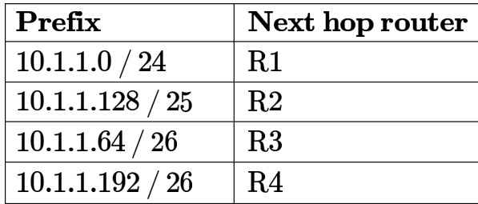

This router forwards packets each to hosts. The addresses of the hosts are 10.1.1.16,10.1.1.72,10.1.1.132,10.1.1.191, and 10.1.1.205. The number of packets forwarded via the next hop router is

gatecse-2024-set1 numerical-answers computer-networks routing two-marks

Consider a file of size million bytes being transferred between two hosts connected via a path consisting of three consecutive links of bandwidth 2 Mbps kbps and Mbps respectively. All processing delays and propagation delays are negligible. Assume that there is no other background traffic over the path and no other additional overhead to transfer the file.

Which one of the following is the total time (in seconds) to transfer the file? Note: $1 \mathrm { M } = 1 0 ^ { 6 }$ ， $1 \mathbf { k } = 1 0 ^ { 3 }$

A. 731 B. 64 C. 8 D.

gatecse-2026-set2 computer-networks routing one-mark

Consider a simple graph with unit edge costs. Each node in the graph represents a router. Each maintains a routing table indicating the next hop router to be used to relay a packet to its destination and the cost of the path to the destination through that router. Initially, the routing table is empty. The routing table is synchronously updated as follows. In each updated interval, three tasks are performed.

i. A node determines whether its neighbours in the graph are accessible. If so, it sets the tentative cost to each accessible neighbour as . Otherwise, the cost is set to $\infty$ .   
ii. From each accessible neighbour, it gets the costs to relay to other nodes via that neighbour (as the next hop).   
iii. Each node updates its routing table based on the information received in the previous two steps by choosing the minimum cost.

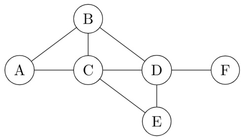

For the graph given above, possible routing tables for various nodes after they have stabilized, are shown in the following options. Identify the correct table.

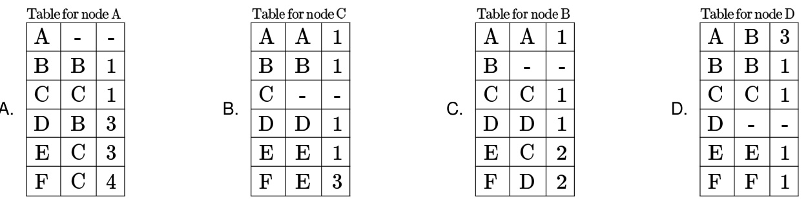

# Answer key☟

Consider a simple graph with unit edge costs. Each node in the graph represents a router. Each node maintains a routing table indicating the next hop router to be used to relay a packet to its destination and the cost of the path to the destination through that router. Initially, the routing table is empty. The routing table is synchronously updated as follows. In each updated interval, three tasks are performed.

i. A node determines whether its neighbors in the graph are accessible. If so, it sets the tentative cost to each accessible neighbor as . Otherwise, the cost is set to .   
ii. From each accessible neighbor, it gets the costs to relay to other nodes via that neighbor (as the next hop).   
iii. Each node updates its routing table based on the information received in the previous two steps by choosing the minimum cost.

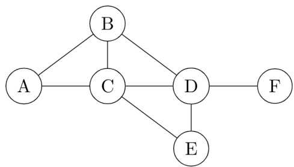

Continuing from the earlier problem, suppose at some time $t$ , when the costs have stabilized, node $A$ goes down. he cost from node $F$ to node $A$ at time $( t + 1 0 0 )$ is

A. $> 1 0 0$ but finite B. 8 C. 3 ${ \sf D } . > 3 \sf { a n d } \leq 1 0 0$

gateit-2005 computer-networks routing normal

A group of  routers is interconnected in a centralized complete binary tree with a router at each tree node. Router $i$ communicates with router $j$ by sending a message to the root of the tree. The root then sends the message back down to router $j$ . The mean number of hops per message, assuming all possible router pairs are equally likely is

A. B. 4.26 C. 4.53 D. 5.26

gateit-2007 computer-networks routing binary-tree normal

# Answer key☟

A. S1, S2 and S4 only B. S1, S3 and S4 only C. S2 and S3 only D. S1 and S4 only

gateit-2008 computer-networks routing normal

Consider the routing protocols given in List and the names given in List II:

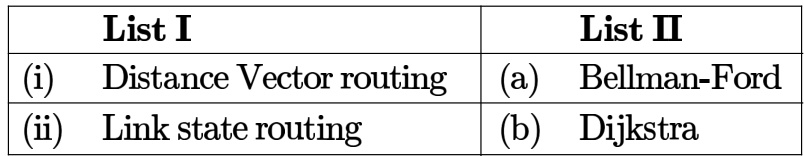

For matching of items in List I with those in List II, which ONE of the following options is CORRECT?

A. (i) - (a) and (ii) - (b) B. (i) - (a) and (ii) - (a) C. (i) - (b) and (ii) (a) D. (i) - (b) and (ii) - (b)

# Answer key☟

✍ Practice Tests: Test 1 (15Q) Test 2 (11Q)

Host $A$ is sending data to host $B$ over a full duplex link. $A$ and $B$ are using the sliding window protocol flow control. The send and receive window sizes are packets each. Data packets (sent only from $A$ to $B$ ) are all  bytes long and the transmission time for such a packet is $5 0 \mu s .$ . Acknowledgment packets (sent only from $B$ to $A$ ) are very small and require negligible transmission time. The propagation delay over the link is $\mu s$ . What is the maximum achievable throughput in this communication?

A. $7 . 6 9 \times 1 0 ^ { 6 }$ Bps B. $1 1 . 1 1 \times 1 0 ^ { 6 }$ Bps C. $1 2 . 3 3 \times 1 0 ^ { 6 }$ Bps D. $1 5 . 0 0 \times 1 0 ^ { 6 }$ Bps

gatecse-2003 computer-networks sliding-window normal

The maximum window size for data transmission using the selective reject protocol with $n$ frame sequence numbers is:

A. $2 ^ { n }$ B. C. D. 2n-2

gatecse-2005 computer-networks sliding-window easy

# Answer key☟

Station $A$ needs to send a message consisting of  packets to Station $B$ using a sliding window (window s i ze ) and go-back- $n$ error control strategy. All packets are ready and immediately available for transmission. If every th packet that $A$ transmits gets lost (but no acks from $B$ ever get lost), then what is the number of packets that $A$ will transmit for sending the message to $B ?$

A. B. C. D.

gatecse-2006 computer-networks sliding-window normal

The distance between two stations $M$ and $N$ is $L$ kilometers. All frames are $K$ bits long. The propagation delay per kilometer is $t$ seconds. Let $R$ bits/second be the channel capacity. Assuming that the processing delay is negligible, the  number of bits for the sequence number field in a frame for maximum utilization, when the  is used, is:

A. $\lceil \log _ { 2 } \frac { 2 L t R + 2 K } { K } \rceil$ $\begin{array} { r l } & { \mathsf { B . \ } \lceil \log _ { 2 } \frac { 2 L t R } { K } \rceil } \\ & { \mathsf { D . \ } \lceil \log _ { 2 } \frac { 2 L t R + 2 K } { 2 K } \rceil } \end{array}$   
C. $\lceil \log _ { 2 } \frac { 2 L t R + K } { K } \rceil$

gatecse-2007 computer-networks sliding-window normal

# 2.30.6 Sliding Window: GATE CSE 2009 Question: 57, ISRO2016-75

Frames of are sent over a 1 $1 0 ^ { 6 }$ duplex link between two hosts. The propagation time $\mathbf { 2 5 \mathrm { m s } }$ . Frames are to be transmitted into this link to maximally pack them in transit (within the link).

What is the minimum number of bits $( I )$ that will be required to represent the sequence numbers distinctly? Assume that no time gap needs to be given between transmission of two frames.

A. $I = 2$ B. $\scriptstyle { I = 3 }$ C. D.

gatecse-2009 computer-networks sliding-window normal isro2016

Frames of  are sent over a $1 0 ^ { 6 }$ bps duplex link between two hosts. The propagation time is .   
Frames are to be transmitted into this link to maximally pack them in transit (within the link).

Let $I$ be the minimum number of bits $( I )$ that will be required to represent the sequence numbers distinctly assuming that no time gap needs to be given between transmission of two frames.

Suppose that the sliding window protocol is used with the sender window size of $2 ^ { I }$ , where $\boldsymbol { \mathit { I } }$ is the numbers of bits as mentioned earlier and acknowledgements are always piggy backed. After sending $2 ^ { I }$ frames, what is the minimum time the sender will have to wait before starting transmission of the next frame? (Identify the closest choice ignoring the frame processing time)

A. 16ms B. 18ms C. 20ms D. 22ms

gatecse-2009 computer-networks sliding-window normal

Consider a network connecting two systems located $8 0 0 0 \mathrm { K m }$ apart. The bandwidth of the network is $5 0 0 \times 1 0 ^ { 6 }$ per second. The propagation speed of the media is $4 \times 1 0 ^ { 6 }$ per second. It needs to design a Go-Back- $N$ sliding window protocol for this network. The average packet size is $1 0 ^ { 7 }$ . The network is to be used to its full capacity. Assume that processing delays at nodes are negligible. Then, the minimum size in bits of the sequence number field has to be

gatecse-2015-set3 computer-networks sliding-window normal numerical-answers

# 2.30.10 Sliding Window: GATE CSE 2016 Set 2 Question: 55

Consider a $1 2 8 \times 1 0 ^ { 3 }$ bits/second satellite communication link with one way propagation delay milliseconds. Selective retransmission (repeat) protocol is used on this link to send data with a frame size of 1 kilobyte. Neglect the transmission time of acknowledgement. The minimum number of bits required for the sequence number field to achieve $1 0 0 \%$ utilization is

gatecse-2016-set2 computer-networks sliding-window normal numerical-answers

# 2.30.11 Sliding Window: GATE CSE 2026 Set 1 Question: 35

Consider the implementation of sliding window protocol over a lossless link, with a window size frames, where each frame is of size bits (including header). The bandwidth of the link is 100kbps ( $[ 1 \mathbf { k } = 1 0 ^ { 3 } ]$ and the one-way propagation delay is milliseconds. Assume that processing times at the sender and receiver are zero and the transmission time of acknowledgements is also zero. Which one of the following options gives the minimum size of  (in number of frames) required to achieve $1 0 0 \%$ link utilization?

A. B. C. 20 D.

gatecse-2026-set1 two-marks sliding-window computer-networks

In a sliding window $A R Q$ scheme, the transmitter's window size is $N$ and the receiver's window size is $M$ . The minimum number of distinct sequence numbers required to ensure correct operation of the $A R Q$ scheme is

A. $\operatorname* { m i n } ( M , N )$ $\mathsf { B . \ m a x } ( M , N ) \qquad \mathsf { C . \ } M + N$ D. MN

gateit-2004 computer-networks sliding-window normal

A   satellite link has a propagation delay of $4 0 0 \mathrm { m s }$ . The transmitter employs the "go back " scheme with $n$ set to . Assuming that each frame is long, what is the maximum data rate possible?

A. 5 Kbps B. 10 Kbps C. 15 Kbps D. 20 Kbps gateit-2004 computer-networks sliding-window normal