A. 4000 bytes B. 8000 bytes C. 10000 bytes D. 12000

gateit-2004 computer-networks sliding-window normal

Suppose that it takes unit of time to transmit a packet (of fixed size) on a communication link. The link layer uses a window flow control protocol with a window size of $N$ packets. Each packet causes an ack or a nak to be generated by the receiver, and ack/nak transmission times are negligible. Further, the round trip time on the link is equal to $N$ units. Consider time $i > N$ . If only acks have been received till time i(no naks), then the goodput evaluated at the transmitter at time i(in packets per unit time) is

$\mathfrak { A . 1 } - \frac { N } { i }$ ${ \mathsf { B } } . \ { \frac { i } { ( N + i ) } }$ C. $\mathsf { D } . \mathsf { \Omega } 1 - e ^ { ( \frac { i } { N } ) }$ gateit-2006 computer-networks sliding-window normal

# Answer key☟

A  satellite link connects two ground stations. The altitude of the satellite is $\mathbf { 5 0 4 k m }$ and speed of the signal is $\mathbf { 3 } \times \mathbf { 1 0 ^ { 8 } } \mathbf { m } / \mathbf { s }$ What should be the packet size for a channel utilization of $2 5 \%$ for a satellite link using go-back- sliding window protocol? Assume that the acknowledgment packets are negligible in size and that there are no errors during communication.

A. 120 bytes B. 60 bytes C. 240 bytes D. 90 bytes

gateit-2008 computer-networks sliding-window normal

Consider a LAN with four nodes $S _ { 1 } , S _ { 2 } , S _ { 3 }$ and $S _ { 4 }$ . Time is divided into fixed-size slots, and a node can begin its transmission only at the beginning of a slot. A collision is said to have occurred if more than one node transmits in the same slot. The probabilities of generation of a frame in a time slot by $S _ { 1 } , S _ { 2 } , S _ { 3 }$ and $S _ { 4 }$ are and  respectively. The probability of sending a frame in the first slot without any collision by any of these four stations is

gatecse-2015-set1 computer-networks normal numerical-answers slotted-aloha of the following events could take place?

A. connect() system call returns successfully B. connect() system call blocks C. connect() system call returns an error D. connect() system call results in a core dump gatecse-2008 computer-networks sockets normal

Which of the following socket API functions converts an unconnected active TCP socket into a passive socket?

A. connect B. bind C. listen D. accept

gatecse-2014-set2 computer-networks sockets easy

Identify the correct order in which a server process must invoke the function calls accept, bind, listen, and recv according to UNIX socket API.

A. listen, accept, bind, recv B. bind, listen,accept, recv C. bind, accept, listen, recv D. accept, listen, bind, recv

gatecse-2015-set2 computer-networks sockets easy

# Answer key☟

✍ Practice Test: Test 1 (13Q)

Suppose that the stop-and-wait protocol is used on a link with a bit rate of per second and milliseconds propagation delay. Assume that the transmission time for the acknowledgment and the processing time at nodes are negligible. Then the minimum frame size in bytes to achieve a link utilization of at least $5 0 \%$ is

gatecse-2015-set1 computer-networks stop-and-wait normal numerical-answers

A sender uses the Stop-and-Wait  protocol for reliable transmission of frames. Frames are of size bytes and the transmission rate at the sender is $8 0 \mathsf { K b p s } ( 1 \mathsf { K b p s } = 1 0 0 0$ bits/second). Size of an acknowledgment is  bytes and the transmission rate at the receiver is The one-way propagation delay is  milliseconds.

Assuming no frame is lost, the sender throughput is bytes/ second.

gatecse-2016-set1 computer-networks stop-and-wait normal numerical-answers

Time to process a frame $= 0 . 2 5$ ms.   
Number of bytes in the information frame $= 1 9 8 0$ .   
Number of bytes in the acknowledge frame $= 2 0$ .   
Number of overhead bytes in the information frame $= 2 0$ .

Assume there are no transmission errors. Then, the transmission efficiency (expressed in percentage) of the Stopand-Wait ARQ protocol for the above parameters is (correct to  decimal places).

gatecse-2017-set1 computer-networks stop-and-wait numerical-answers normal

Suppose two hosts are connected by a point-to-point link and they are configured to use protocol for reliable data transfer. Identify in which one of the following scenarios, the utilization of the link is the lowest.

A. Longer link length and lower transmission rate B. Longer link length and higher transmission rate C. Shorter link length and lower transmission rate D. Shorter link length and higher transmission rate gatecse-2023 computer-networks stop-and-wait one-mark

A channel has a bit rate of   and one-way propagation delay of $2 0 m s$ . The channel uses stop and wait protocol. The transmission time of the acknowledgment frame is negligible. To get a channel efficiency of at least $5 0 \%$ , the minimum frame size should be

A. 80 bytes B. 80 bits C. 160 bytes D. 160 bits

gateit-2005 computer-networks stop-and-wait normal

On a wireless link, the probability of packet error is . A stop-and-wait protocol is used to transfer data across the link. The channel condition is assumed to be independent of transmission to transmission. What is the average number of transmission attempts required to transfer  packets?

A. 100 B. 125 C. 150 D. 200 gateit-2006 computer-networks sliding-window stop-and-wait normal

Answer key☟

The routing table of a router is shown below:

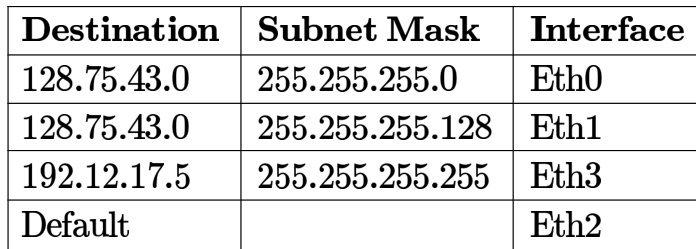

On which interface will the router forward packets addressed to destinations and respectively?

A. Eth and Eth B. Eth  and Eth C. Eth  and Eth D. Eth and Eth

gatecse-2004 computer-networks subnetting normal

# Answer key☟

An organization has a class $B$ network and wishes to form subnets for  departments. The subnet mask would be:

A. 255.255.0.0 B. 255.255.64.0 C. 255.255.128.0 D. 255.255.252.0

gatecse-2005 computer-networks subnetting normal

Two computers $\mathit { C 1 }$ and $C 2$ are configured as follows. $\mathit { C 1 }$ has IP address and netmask 255.255.128.0. has $| \mathsf { P } _ { }$ address and netmask . Which one of the following statements is true?

A. $\mathit { C 1 }$ and $C 2$ both assume they are on the same network   
B. $C 2$ assumes $\mathit { C 1 }$ is on same network, but $C 1$ assumes $C 2$ is on a different network C. $C 1$ assumes $C 2$ is on same network, but $C 2$ assumes $\mathit { C 1 }$ is on a different network D. $\mathit { C 1 }$ and $C 2$ both assume they are on different networks.

gatecse-2006 computer-networks subnetting normal

The address of a class  host is to be split into subnets with a  subnet number. What is the maximum number of subnets and the maximum number of hosts in each subnet?

A. subnets and  hosts. B. subnets and  hosts.   
C. 62 subnets and hosts. D. subnets and hosts.

gatecse-2007 computer-networks subnetting easy isro2016

# Answer key☟

# 2.34.6 Subnetting: GATE CSE 2008 Question: 57

If a class $B$ network on the Internet has a subnet mask of , what is the maximum number o hosts per subnet?

A. 1022 B. 1023 C. 2046 D. 2047

gatecse-2008 computer-networks subnetting easy

Suppose computers $A$ and $B$ have $I P$ addresses  and respectively and they both use same netmask $N$ . Which of the values of $N$ given below should not be used if $A$ and $B$ should belong to the same network?

A. 255.255.255.0 B. 255.255.255.128   
C. 255.255.255.192 D. 255.255.255.224

gatecse-2010 computer-networks subnetting easy

An Internet Service Provider (ISP) has the following chunk of CIDR-based IP addresses available with it: $2 4 5 . 2 4 8 . 1 2 8 . 0 / 2 0$ . The ISP wants to give half of this chunk of addresses to Organization $A$ , and a quarter to Organization $B$ , while retaining the remaining with itself. Which of the following is a valid allocation of addresses to $A$ and $B ?$

A. 245.248.136.0/21 and 245.248.128.0/22   
B. 245.248.128.0/21 and 245.248.128.0/22   
C. 245.248.132.0/22 and 245.248.132.0/21   
D. 245.248.136.0 /24 and 245.248.132.0/21

gatecse-2012 computer-networks subnetting normal isrodec2017

Consider the following routing table at an IP router:

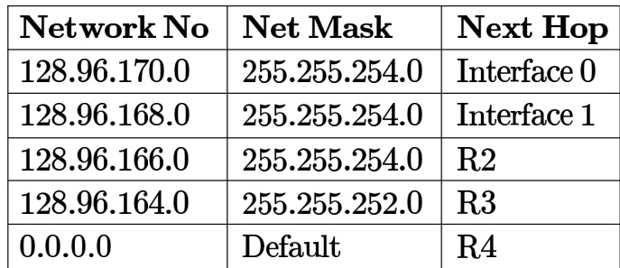

For each IP address in Group Identify the correct choice of the next hop from Group II using the entries from the routing table above.

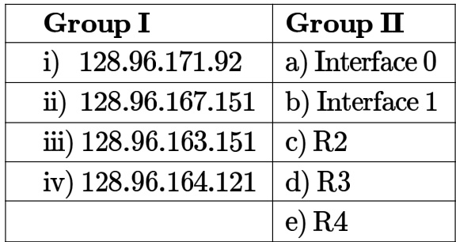

A. i-a,ii-c, ii-e, iv-d B. i-a,ii-d,i-b, iv-e C. i-b,ii-c,ii-d, iv-e D. i-b,ii-c,ii-e, iv-d

In the network , the octet (in decimal) of the last address of the network which can be assigned to a host is

gatecse-2015-set3 computer-networks subnetting normal numerical-answers

Consider three machines M, N, and P with IP addresses 100.10.5.5, and respectively. The subnet mask is set to 255.255.255.252 for all the three machines. Which one of the following is true?

A. M, N, and P all belong to the same B. Only M and N belong to the same subnet subnet C. Only N and P belong to the same D. M, N, and P belong to three subnet different subnets

gatecse-2019 computer-networks subnetting two-marks

# 2.34.12 Subnetting: GATE CSE 2020 Question: 38

An organization requires a range of IP address to assign one to each of its computers. organization has approached an Internet Service Provider (ISP) for this task. The ISP uses CIDR and serves the requests from the available IP address space . The ISP wants to assign an address space to the organization which will minimize the number of routing entries in the ISP’s router using route aggregation. Which of the following address spaces are potential candidates from which the ISP can allot any one of the organization?

I. 202.61.84.0/21   
II. 202.61.104.0/21   
III. 202.61.64.0/21   
IV. 202.61.144.0/21

A. and  only B. and only C. and  only D. and  only

gatecse-2020 computer-networks subnetting two-marks

# Answer key☟

Consider routing table of an organization’s router shown below:

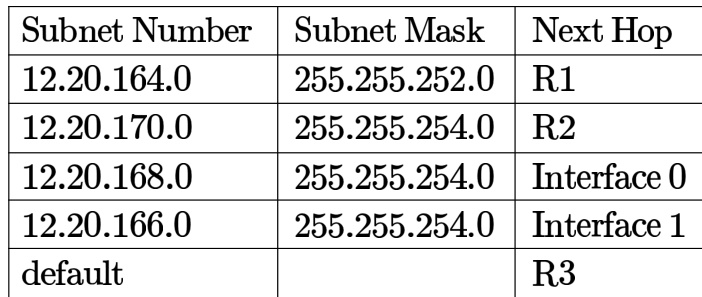

Which of the following prefixes in notation can be collectively used to correctly aggregate all of the subnets in the routing table?

A. 12.20.164.0/20 B. 12.20.164.0/22  
C. 12.20.164.0/21 D. 12.20.168.0/22

The forwarding table of a router is shown below.

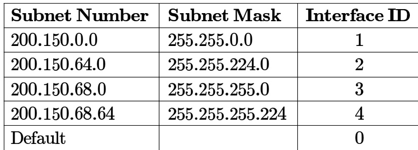

A packet addressed to a destination address  arrives at the router. It will be forwarded to the interface with D

A packet with the destination address 145.36.109.70 arrives at a router whose routing table is shown. Which interface will the packet be forwarded to?

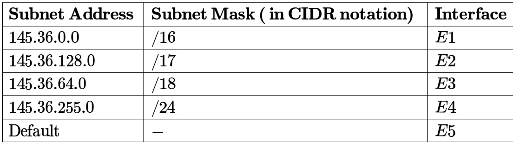

A. B. C. E2 D.

gatecse2025-set1 computer-networks subnetting two-marks

# Answer key☟

A subnet has been assigned a subnet mask of . What is the maximum number of hosts that can belong to this subnet?

A. B. C. 62 D. 126

gateit-2004 computer-networks subnetting normal

# Answer key☟

A router uses the following routing table:

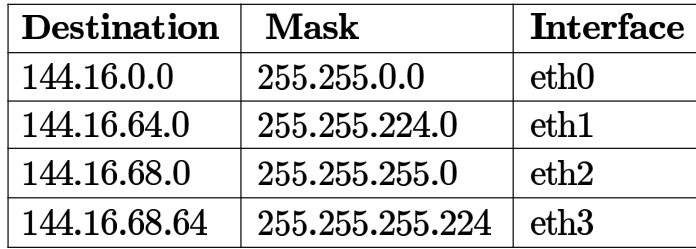

Packet bearing a destination address  arrives at the router. On which interface will it be forwarded?

A. eth B. eth C. eth D. eth

gateit-2006 computer-networks subnetting normal isro2015

# Answer key☟

A subnetted Class $B$ network has the following broadcast address: 144.16.95.255 Its subnet mask

A. is necessarily 255.255.224.0   
B. is necessarily 255.255.240.0   
C. is necessarily 255.255.248.0   
D. could be any one of , 255.255.240.0,255.255.248.0

Host $X$ has IP address 192.168.1.97 and is connected through two routers and $R 2$ to another host $Y$ with IP address . Router has IP addresses  and . $R 2$ has IP addresses and . The netmask used in the network is .

Given the information above, how many distinct subnets are guaranteed to already exist in the network?

A. B. C. D. 6

gateit-2008 computer-networks subnetting normal

D. 192.168.1.155 ✍ Practice Tests: Test 1 (15Q) Test 2 (15Q) Test 3 (4Q)

# 2.35.1 TCP: GATE CSE 2009 Question: 47

While opening a  connection, the initial sequence number is to be derived using a time-of-day (ToD) clock that keeps running even when the host is down. The low order bits of the counter of the ToD clock is to be used for the initial sequence numbers. The clock counter increments once per milliseconds. The maximum packet lifetime is given to be s.

Which one of the choices given below is closest to the minimum permissible rate at which sequence numbers used for packets of a connection can increase?

A. /s B. /s C. /s D. /s

gatecse-2009 computer-networks tcp difficult ambiguous

Which of the following transport layer protocols is used to support electronic mail?

A. SMTP B. C. TCP D. UDP

gatecse-2012 computer-networks tcp easy

Suppose two hosts use a TCP connection to transfer a large file. Which of the following statements is/are FALSE with respect to the TCP connection?

I. If the sequence number of a segment is $m$ then the sequence number of the subsequent segment is always $m + 1$ · II. If the estimated round trip time at any given point of time is $t$ sec, the value of the retransmission timeout is always set to greater than or equal to $t$ sec. III. The size of the advertised window never changes during the course of the TCP connection. IV. The number of unacknowledged bytes at the sender is always less than or equal to the advertised window.

A. III only B. and III only C. and IV only D. II and IV only

gatecse-2015-set1 computer-networks tcp normal

# 2.35.4 TCP: GATE CSE 2015 Set 2 Question: 34

Assume that the bandwidth for a connection is bits/sec. Let $\alpha$ be the value of RTT in milliseconds (rounded off to the nearest integer) after which the  window scale option is needed. Let $\beta$ be the maximum possible window size with window scale option. Then the values of $\alpha$ and $\beta$ are

A. milliseconds, $6 5 5 3 5 \times 2 ^ { 1 4 }$ B. 63 milliseconds, $6 5 5 3 5 \times 2 ^ { 1 6 }$ C. 500 milliseconds, $6 5 5 3 5 \times 2 ^ { 1 4 }$ D. milliseconds, $6 5 5 3 5 \times 2 ^ { 1 6 }$

gatecse-2015-set2 computer-networks difficult tcp

II. TCP has no option for selective acknowledgement III. TCP connections are message streams

A. Only I is correct B. Only and III are correct C. Only II and III are correct D. All of I, II and III are correct

Identify the correct sequence in which the following packets are transmitted on the network by a host when a browser requests a webpage from a remote server, assuming that the host has just been restarted.

A. HTTP GET request, DNS query, B. DNS query, HTTP GET request, TCP SYN TCP SYN C. DNS query, TCP SYN, HTTP GET D. TCP SYN, DNS query, HTTP GET request. request.

gatecse-2016-set2 computer-networks normal tcp

Consider a TCP client and a TCP server running on two different machines. After completing data transfer, the TCP client calls close to terminate the connection and a FIN segment is sent to the TCP server. Serverside TCP responds by sending an ACK, which is received by the client-side TCP. As per the TCP connection state diagram , in which state does the client-side TCP connection wait for the FIN from the server-side TCP?

A. LAST-ACK B. TIME-WAIT C. FIN-WAIT- D. FIN-WAIT-

A  server application is programmed to listen on port number $P$ on host $\boldsymbol { S }$ . A  client is connected to the  server over the network.

Consider that while the connection was active, the server machine $\boldsymbol { S }$ crashed and rebooted. Assume that the client does not use the  keepalive timer. Which of the following behaviors is/are possible?

A. If the client was waiting to receive a packet, it may wait indefinitely B. The server application on $\boldsymbol { S }$ can listen on $P$ after reboot C. If the client sends a packet after the server reboot, it will receive a  segment D. If the client sends a packet after the server reboot, it will receive a  segment

Consider the three-way handshake mechanism followed during connection establishment between hosts $P$ and $Q$ . Let $X$ and $Y$ be two random -bit starting sequence numbers chosen by $P$ and $Q$ respectively. Suppose $P$ sends a connection request message to $Q$ with a  segment having bit $= 1$ , number $= X$ , and bit $= 0$ . Suppose $Q$ accepts the connection request. Which one of the following choices represents the information present in the  segment header that is sent by $Q$ to $P ?$

A. bit $= 1$ , number $= X + 1$ , bit $= 0$ , number $= Y$ , bit $= 0$ B. bit $= 0$ , number $= X + 1$ , bit $= 0$ , number $= Y$ , bit ${ \bf \Phi } = { \bf 1 } { \bf \Phi }$ C. bit $= 1$ , number $= Y$ , bit $= 1$ ,  number $= X + 1$ , $\mathrm { F I N } \mathsf { b i t } = 0$ D. SYN bit $= 1$ ,  number $= Y$ , ACK bit $= 1$ , number $\ O = X$ , bit $= 0$

Consider the data transfer using  over a link. Assuming that the maximum segment (MSL) is set to the minimum number of bits required for the sequence number field of the TCP header, to prevent the sequence number space from wrapping around during the is

Suppose you are asked to design a new reliable byte-stream transport protocol like This protocol, named , runs over a network with Round Trip Time of milliseconds and the maximum segment lifetime of  minutes.

Which of the following is/are valid lengths of the Sequence Number field in the  header?

A. bits B. bits C. bits D. bits

gatecse-2023 computer-networks tcp multiple-selects two-marks

TCP client $\mathrm { \bf P }$ successfully establishes a connection to server . Let $\mathrm { N } _ { P }$ denote the sequence number in the  sent from $\mathrm { \bf P }$ to $\mathbf { Q }$ . Let $\mathrm { N } _ { Q }$ denote the acknowledgement number in the SYN ACK from $\mathsf { Q }$ to . Which of the following statements is/are CORRECT?

A. The sequence number $\mathrm { N } _ { P }$ is chosen randomly by B. The sequence number $\mathrm { N } _ { P }$ is always  for a new connection C. The acknowledgement number $\mathrm { N } _ { Q }$ is equal to $\mathbf { N } _ { P }$ D. The acknowledgement number $\mathrm { N } _ { Q }$ is equal to $\mathrm { N } _ { P } + 1$

gatecse-2024-set1 multiple-selects computer-networks tcp one-mark

A. $\mathrm { P 3 } : \mathrm { S Y N } = 1 , \mathrm { A C K } = 1$ B. $\mathrm { P 2 } : \mathrm { S Y N } = 1 , \mathrm { A C K } = 1$ C. : $\mathbf { S Y N } = 0$ ， $\mathbf { A C K } = \mathbf { 1 }$ D. P1: $\mathbf { S Y N } = 1$

gatecse2025-set1 computer-networks tcp multiple-selects one-mark

With respect to a TCP connection between a client and a server, which one of the following statements is true?

A. The client and server use a two-way handshake mechanism before the start of data transmission B. The server cannot initiate closing of the connection before the client initiates closing of the connection C. The TCP connection is half-duplex D. The client and server can initiate closing of the connection at the same time

gatecse-2026-set1 computer-networks tcp one-mark

Which one of the following statements is FALSE?

A. TCP guarantees a minimum communication rate B. TCP ensures in-order delivery C. TCP reacts to congestion by reducing sender window size D. TCP employs retransmission to compensate for packet loss

gateit-2004 computer-networks tcp normal

In TCP, a unique sequence number is assigned to each

A. byte B. word C. segment D. message

gateit-2004 computer-networks tcp easy

Consider the following statements about the timeout value used in TCP.

i. The timeout value is set to the RTT (Round Trip Time) measured during TCP connection establishment for the entire duration of the connection. ii. Appropriate RTT estimation algorithm is used to set the timeout value of a TCP connection. iii. Timeout value is set to twice the propagation delay from the sender to the receiver.

Which of the following choices hold?

A. is false, but $( i i )$ and (ii) are B. $( i )$ and $( i i i )$ are false, but $( i i )$ is true true   
C. and $( i i )$ are false, but $( i i i )$ is D. $( i ) , ( i i )$ and $( i i i )$ are false true

gateit-2007 computer-networks tcp normal

# 2.35.19 TCP: GATE IT 2007 Question: 14

Consider a connection in a state where there are no outstanding s. The sender sends two segments back to back. The sequence numbers of the first and second segments are and respectively. The first segment was lost, but the second segment was received correctly by the receiver. Let $X$ the amount of data carried in the first segment (in bytes), and $Y$ be the $A C K$ number sent by the receiver. The values of $X$ and $Y$ (in that order) are

A. and B. and C. and D. and

gateit-2007 computer-networks tcp normal

The three way handshake for connection establishment is shown below.

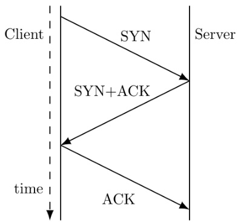

Which of the following statements are TRUE?

$S 1 : \mathsf { L o s s }$ of $\mathrm { S Y N + A C K }$ from the server will not establish a connection   
S2 Loss of  from the client cannot establish the connection   
The server moves LISTEN $$ SYN_RCVD $$ SYN_ _SENT $$ ESTABLISHED in the state machine   
on no packet loss   
$S 4$ The server moves LISTEN $$ SYN_RCVD $$ ESTABLISHED in the state machine on no packet loss

A. $S 2$ and $S 3$ only B. $S 1$ and $S 4$ only C. $S 1$ and $S 3$ only D. $S 2$ and $S 4$ only

A computer on a  network is regulated by a token bucket. The token bucket is filled at a rate of 2Mbps. It is initially filled to capacity with 16Megabits. What is the maximum duration for which the computer can transmit at the full ?

A. seconds B. 2 seconds C. seconds D. seconds

gatecse-2008 computer-networks token-bucket

Packets of the same session may be routed through different paths in:

A. TCP, but not UDP B. TCP and UDP C. UDP, but not TCP D. Neither TCP nor UDP

gatecse-2005 computer-networks tcp udp easy

The transport layer protocols used for real time multimedia, file transfer,  and email, respectively are

A. TCP, UDP, UDP and TCP B. UDP, TCP, TCP and UDP C. UDP, TCP, UDP and TCP D. TCP,UDP, TCP and UDP

gatecse-2013 computer-networks tcp udp easy

Consider socket API on a Linux machine that supports connected UDP sockets. A connected UDP socket is a UDP socket on which connect function has already been called. Which of the following statements is/are CORRECT?

I. A connected UDP socket can be used to communicate with multiple peers simultaneously. II. A process can successfully call connect function again for an already connected UDP socket

A.  only B. only C. Both  and D. Neither  nor

gatecse-2017-set2 computer-networks udp

A program on machine $X$ attempts to open a $U D P$ connection to port  on a machine , and a $\imath T C P$ connection to port on machine $Z$ . However, there are no applications listening at the corresponding ports on $Y$ and $Z$ . An  Port Unreachable error will be generated by

A.  but not $Z$ B. $Z$ but not $Y$ C. Neither $Y$ nor $Z$ D. Both and $Z$

gateit-2006 computer-networks tcp udp normal

Every host in an  network has a resolution real-time clock with battery backup. Each host needs to generate up to  unique identifiers per second. Assume that each host has a globally unique address. Design a  globally unique ID for this purpose. After what period (in seconds) will the identifiers generated by a host wrap around?

gatecse-2014-set3 computer-networks ip-addressing wrap-around-time numerical-answers normal

Answer Keys   
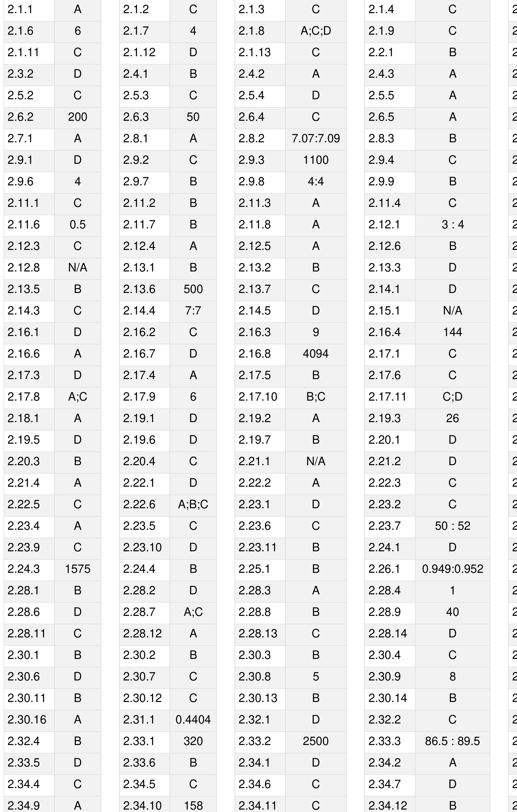

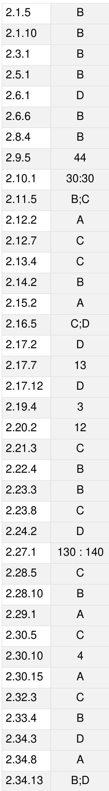

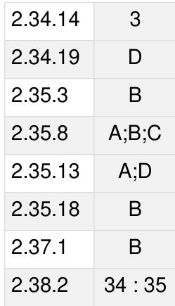

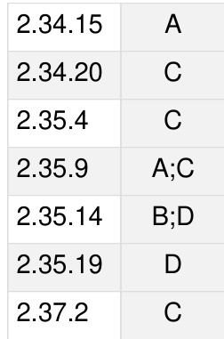

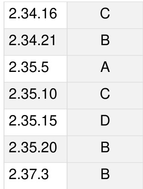

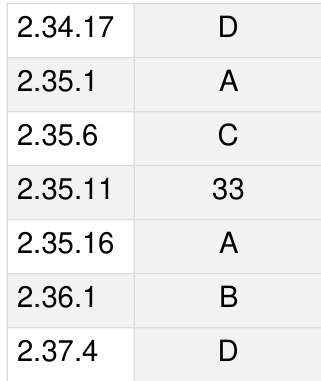

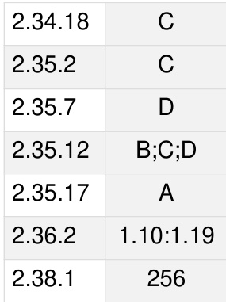

ER‐model. Relational model:Relational algebra, Tuple calculus, SQL. Integrity constraints, Normal forms. File organization, Indexing (e.g., B and $\textsf { B + }$ trees). Transactions and concurrency control.

MarkDistributioninPrevious GATE   
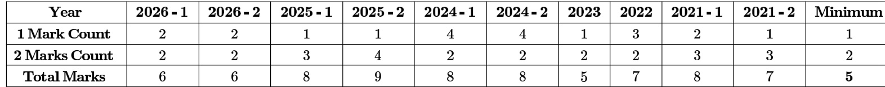

Welcome to the Databases chapter of your GATE Computer Science preparation. This crucial subject forms the backbone of modern data management and is indispensable for any computer science professional. In GATE, Databases typically carries a significant weightage, ranging from to 10 marks, often featuring a mix of conceptual questions, problem-solving scenarios, and direct application of formulas. You can expect questions on topics like relational algebra/calculus, SQL queries, functional dependencies, normal forms, B-trees, and concurrency control protocols. A strong grasp of these fundamentals is vital not just for the exam but also for practical applications in software development and data engineering.

# Topic-wise Key Concepts

# Armstrong Axioms

Armstrong Axioms are a set of inference rules used to derive all functional dependencies (FDs) implied by a given set of FDs. They are sound (do not generate incorrect FDs) and complete (can generate all correct FDs).

# Formulas/Theorems:

1. Reflexivity: If $B \subseteq A$ , then $A  B$ . (Trivial FD)   
2. Augmentation: If $A  B$ , then $A C  B C$ (where $C$ is any set of attributes).   
3. Transitivity: If $A  B$ and $B  C$ , then $A \to C$ .

# Derived Rules:

4. Union: If $A  B$ and $A  C$ , then $A \to B C$ .   
5. Decomposition: If $A \to B C$ , then $A  B$ and $A \to C$ .   
6. Pseudotransitivity: If $A  B$ and $B C  D$ , then $A C  D$ .

# Key Properties/Identities:

Used to find the closure of an attribute set $X ^ { + }$ .   
Fundamental for determining candidate keys and normal forms.

# Common Pitfalls:

Confusing derived rules with basic axioms.   
Incorrectly applying augmentation or transitivity.

# Problem-Solving Techniques:

To find $X ^ { + }$ : Start with $X$ . Repeatedly add attributes to $X ^ { + }$ if they are determined by any subset of $X ^ { + }$ using the given FDs.   
To check if $A  B$ is implied by a set of FDs $F$ : Check if $B \subseteq A ^ { + }$ .

# B Tree

A B-tree is a self-balancing tree data structure that maintains sorted data and allows searches, sequential access, insertions, and deletions in logarithmic time. It is optimized for systems that read and write large blocks of data, such as disk storage.

# Formulas/Theorems:

Order : Each node (except root) has at least $\lceil m / 2 \rceil$ children and at most $m$ children. Number of keys: A node with $k$ children has $k - 1$ keys.   
Minimum keys (non-root): $\lceil m / 2 \rceil - 1$ .   
Maximum keys: $m - 1$   
Maximum height $h$ : For $N$ keys and order $m$ $\begin{array} { r } { \imath , h \leq \log _ { \lceil m / 2 \rceil } \left( \frac { N + 1 } { 2 } \right) } \end{array}$   
Minimum height $h$ : For $N$ keys and order $m$ , $h \geq \log _ { m } ( N + 1 )$ .

# Key Properties/Identities:

All leaf nodes are at the same level.   
Keys within a node are sorted.   
Efficient for disk-based indexing due to high fan-out.

# Common Pitfalls:

Miscalculating minimum/maximum number of keys or children per node.   
Incorrectly performing split/merge operations during insertion/deletion.

# Problem-Solving Techniques:

Trace insertion/deletion operations step-by-step, paying attention to splits (when a node overflows) and merges (when a node underflows).   
Calculate disk I/Os by counting the number of nodes visited (including root and leaf) for search, insertion, or deletion.

# Candidate Key

A Candidate Key is a minimal Super Key. It is a set of attributes that uniquely identifies each tuple in a relation, and no proper subset of these attributes can uniquely identify tuples.

# Formulas/Theorems:

A set of attributes $K$ is a Candidate Key if: 1. $K  R$ (where $R$ is all attributes in the relation) Uniqueness property. 2. For no proper subset $K ^ { \prime } \subset K$ , $K ^ { \prime }  R$ - Minimality property.

# Key Properties/Identities:

Every relation must have at least one candidate key.   
One candidate key is chosen as the Primary Key.

# Common Pitfalls:

Confusing with Super Key (Super Key doesn't require minimality).   
Forgetting to check the minimality condition.

# Problem-Solving Techniques:

. Find the closure of various attribute sets. A set $K$ is a super key if $K ^ { + }$ contains all attributes of the relation.   
From the super keys, identify those that are minimal (i.e., no subset is also a super key) to find candidate keys.

# Conflict Serializable

A schedule is Conflict Serializable if it is conflict equivalent to some serial schedule. Two operations conflict if they are on the same data item, belong to different transactions, and at least one of them is a write operation (W-W, W-R, R-W conflicts).

# Formulas/Theorems:

# Precedence Graph (Serialization Graph):

Nodes represent transactions. 。 An edge $T _ { i } \to T _ { j }$ exists if $T _ { i }$ performs an operation that conflicts with an operation of $T _ { j }$ , and $T _ { i }$ 's operation occurs before $T _ { j } { \mathrm { ' s } }$ . Theorem: A schedule is conflict serializable if and only if its precedence graph contains no cycles.

# Key Properties/Identities:

Guarantees that the concurrent execution produces the same result as some sequential execution.   
A weaker condition than view serializability but easier to test.

# Common Pitfalls:

Incorrectly identifying conflicting operations (e.g., R-R operations do not conflict).   
Missing cycles in the precedence graph, especially in complex schedules.

# Problem-Solving Techniques:

. Construct the precedence graph by identifying all conflicting pairs of operations and drawing edges accordingly.   
. Use a cycle detection algorithm (e.g., DFS) on the graph to check for serializability.

# Database Design

Database design is the process of creating a detailed data model for a database. It involves translating conceptual requirements into a logical schema, and then into a physical schema, ensuring data integrity, efficiency, and scalability.

# Formulas/Theorems:

No direct formulas, but relies on principles of normalization and ER-to-Relational mapping rules.

# Key Properties/Identities:

Phases: Conceptual (ER Model), Logical (Relational Schema), Physical (Storage details).   
Goals: Minimize redundancy, maximize integrity, optimize performance.

# Common Pitfalls:

Poor choice of primary/foreign keys. Not adequately normalizing the schema, leading to update anomalies. Over-normalization, leading to complex queries and performance issues

# Problem-Solving Techniques:

Start with an ER diagram to capture requirements.   
. Apply ER-to-Relational mapping rules systematically.   
Normalize relations to an appropriate normal form (e.g., BCNF or 3NF) using functional dependencies.

# Database Normalization

Database Normalization is a systematic process of restructuring a relational database schema to minimize data redundancy and improve data integrity. It involves decomposing relations into smaller, well-structured relations based on functional dependencies.

# Formulas/Theorems:

1NF (First Normal Form): All attributes must be atomic (no multi-valued or composite attributes).   
2NF (Second Normal Form): In 1NF and no non-prime attribute is partially dependent on a candidate key.   
3NF (Third Normal Form): In 2NF and no non-prime attribute is transitively dependent on a candidate key.

. BCNF (Boyce-Codd Normal Form): For every non-trivial functional dependency $A  B$ , $A$ must be a super key.   
. 4NF (Fourth Normal Form): In BCNF and no non-trivial multi-valued dependencies exist.   
. 5NF (Fifth Normal Form): In 4NF and no non-trivial join dependencies exist.

# Key Properties/Identities:

Hierarchy: $1 N F \subset 2 N F \subset 3 N F \subset B C N F \subset 4 N F \subset 5 N F .$ Desirable properties of decomposition: Lossless Join and Dependency Preservation. BCNF decomposition is always lossless but not always dependency preserving. 3NF decomposition is always lossless and dependency preserving.

# Common Pitfalls:

Incorrectly identifying prime and non-prime attributes.   
Mistaking partial dependency for transitive dependency.   
Failing to check for both lossless join and dependency preservation after decomposition.

# Problem-Solving Techniques:

Identify all candidate keys and functional dependencies.   
Systematically check for violations of each normal form.   
If a violation exists, decompose the relation into smaller relations.

# Database Schema

A Database Schema is the logical structure or design of the entire database. It defines the tables, attributes, data types, relationships, and constraints that govern the data within the database. It is defined using Data Definition Language (DDL).

# Formulas/Theorems:

No specific formulas, but it's the blueprint for the database.

# Key Properties/Identities:

Internal Schema: Physical storage structure.   
Conceptual Schema: Logical structure of the entire database.   
External Schema (View): User-specific views of the database.   
Schema defines the intension, while data (instance) defines the extension.

# Common Pitfalls:

Confusing schema (structure) with database instance (actual data).   
Overlooking important constraints during schema design.

# Problem-Solving Techniques:

Understand the mapping from ER diagrams to relational schemas.   
Be familiar with DDL commands like CREATE TABLE, ALTER TABLE, DROP TABLE.

# Decomposition

Decomposition is the process of breaking down a relation (table) into two or more smaller relations. It is primarily used in normalization to eliminate redundancy and anomalies, ensuring that the resulting relations are in a higher normal form.

# Formulas/Theorems:

Lossless Join Decomposition: A decomposition of $R$ into $R _ { 1 }$ and $R _ { 2 }$ is lossless if $R = R _ { 1 } \bowtie R _ { 2 }$ . □ Condition: $( R _ { 1 } \cap R _ { 2 } ) \to R _ { 1 }$ or $( R _ { 1 } \cap R _ { 2 } ) \to R _ { 2 }$ must hold based on the FDs of $R$ . Dependency Preservation: A decomposition preserves dependencies if the union of FDs on the decomposed

relations is equivalent to the original set of FDs. Formally, if $F$ is the original set of FDs and $F _ { i }$ is the set of FDs on $R _ { i }$ , then $( F _ { 1 } \cup F _ { 2 } \cup \dots \cup F _ { k } ) ^ { + } = F ^ { + }$

# Key Properties/Identities:

Desirable properties for decomposition are lossless join and dependency preservation.   
BCNF decomposition is always lossless but not always dependency preserving.   
3NF decomposition is always lossless and dependency preserving.

# Common Pitfalls:

Incorrectly applying the lossless join test.   
Failing to check for dependency preservation, especially for BCNF.

# Problem-Solving Techniques:

. For lossless join: Check if the common attributes form a super key for at least one of the decomposed relations. For dependency preservation: For each original FD $A  B$ , check if it can be derived from the FDs of the decomposed relations.

# ER Diagram

An Entity-Relationship (ER) Diagram is a high-level conceptual data model that represents the entities, attributes, and relationships within a system. It is used during the conceptual design phase of database development.

# Formulas/Theorems:

No direct formulas, but specific rules for mapping to relational schema.

# Key Properties/Identities:

Entities: Represented by rectangles (e.g., Student, Course).   
Attributes: Represented by ovals (e.g., Name, ID). Key attributes are underlined.   
Relationships: Represented by diamonds (e.g., Enrolls, Teaches).   
Cardinality: (1:1, 1:N, M:N) specifies the number of instances of one entity that can be associated with another.   
Participation: (Total/Partial) specifies whether an entity instance must participate in a relationship.   
Weak Entity: An entity that cannot be uniquely identified by its own attributes and depends on a strong (owner) entity. Represented by double rectangles.

# Common Pitfalls:

. Incorrectly identifying cardinalities or participation constraints.   
Confusing strong and weak entities.   
Errors in mapping complex ER constructs (e.g., ternary relationships, generalization) to relational schema.

# Problem-Solving Techniques:

Carefully read the problem description to identify entities, attributes, and relationships.   
Pay close attention to cardinality and participation rules.   
Practice mapping ER diagrams to relational schemas using standard rules.

# Functional Dependency

A Functional Dependency (FD) $A  B$ means that the value of attribute set $A$ uniquely determines the value of attribute set $B$ . If two tuples have the same values for attributes in $A$ , they must also have the same values for attributes in $B$ .

# Formulas/Theorems:

Closure of an attribute set $X ^ { + }$ : The set of all attributes that are functionally determined by $X$ .

Algorithm: Start with $X ^ { + } = X$ . Repeatedly add attributes $Y$ to $X ^ { + }$ if there is an FD $W \to Y$ such that $W \subseteq X ^ { + }$ .

Minimal Cover (or Minimal Basis): A set of FDs Fm equivalent to $F$ such that:   
1. Every FD in has a single attribute on the right-hand side.   
2. No FD in $F _ { m }$ can be removed without changing $F _ { m } ^ { + }$ .   
3. No attribute can be removed from the left-hand side of any FD in $F _ { m }$ without changing $F _ { m } ^ { + }$ .

# Key Properties/Identities:

Fundamental for database normalization and identifying keys.   
Armstrong's Axioms are used to infer FDs.

# Common Pitfalls:

Incorrectly calculating attribute closure.   
Errors in finding a minimal cover.

# Problem-Solving Techniques:

Master the algorithm for finding $X ^ { + }$   
For minimal cover, systematically apply the three conditions: right-hand side single attribute, remove redundant FDs, remove redundant attributes from LHS.

# Indexing

Indexing is a technique used to optimize the performance of database queries by allowing the database server to quickly locate and retrieve specific rows without scanning the entire table. It creates a data structure (like B-tree or hash table) that stores a small, ordered subset of the data.

# Formulas/Theorems:

Disk I/O for B-tree index: For a search, typically $_ \mathrm { t r e e } + 1$ (for data block) disk accesses.   
Disk I/O for hash index: Typically 1-2 disk accesses for exact match, if no collision.

# Key Properties/Identities:

Primary Index: Index on the primary key, usually clustered.   
Secondary Index: Index on non-key attributes, usually unclustered.   
Clustered Index: Data rows are stored physically in the order of the index key. Only one per table.   
Unclustered Index: Index stores pointers to the data rows, which are not physically ordered by the index key.

# Common Pitfalls:

Misunderstanding the difference between clustered and unclustered indexes.   
Incorrectly calculating disk I/Os for different index types and query patterns.

# Problem-Solving Techniques:

Analyze the query type (equality search, range search) and index type to determine disk I/O.   
Remember that clustered indexes can retrieve multiple data records with fewer I/Os for range queries.

# Joins

Joins combine rows from two or more tables based on a related column between them. They are fundamental operations in relational algebra and SQL for retrieving data from multiple relations.

# Formulas/Theorems:

Cartesian Product (Cross Join): $R \times S$ . Combines every row of $R$ with every row of $\boldsymbol { S }$ . If $R$ has $\scriptstyle n$ tuples and $\boldsymbol { s }$

has $m$ tuples, $R \times S$ has $n \times m$ tuples.

Theta Join: $R \bowtie S = \sigma _ { \theta } ( R \times S )$ . Combines tuples from $R$ and $\boldsymbol { S }$ where the condition $\theta$ is true.   
Equijoin: A theta join where $\theta$ is an equality condition (e.g., $R$ · $A = S . B )$ .   
Natural Join: $R \bowtie S$ . An equijoin on all common attributes, with duplicate common columns removed from the result.   
Outer Joins (Left, Right, Full): Preserve tuples that do not have a match in the other relation, filling unmatched attributes with NULLs.

# Key Properties/Identities:

Result schema of join is the union of attributes from participating relations (with common attributes appearing once in natural join).   
Join operations are associative and commutative (for inner joins).

# Common Pitfalls:

Confusing different types of joins, especially natural join vs. equijoin.   
Misunderstanding how NULL values are handled in outer joins.   
Incorrectly calculating the number of tuples in the result.

# Problem-Solving Techniques:

For natural join, identify common attributes and their values.   
For outer joins, remember to include unmatched tuples from the specified side(s).   
Trace the operation step-by-step for small example relations.

# Multivalued Dependency 4NF

A Multivalued Dependency (MVD) $A \twoheadrightarrow B$ exists in a relation $R$ if, for a given value of $A$ , there is a set of values for $B$ , and this set is independent of the values of other attributes in $R$ . 4NF (Fourth Normal Form) requires that for every nontrivial MVD $A \twoheadrightarrow B$ in a relation, $A$ must be a super key.

# Formulas/Theorems:

Trivial MVD: $A \twoheadrightarrow B$ is trivial if $B \subseteq A$ or $A \cup B = R$ .   
MVD Inference Rules (some are similar to FDs): Reflexivity: If $B \subseteq A$ , then $A \twoheadrightarrow B$ . Augmentation: If $A \twoheadrightarrow B$ , then $A C \twoheadrightarrow B C$ . Transitivity: If $A \twoheadrightarrow B$ and $B \twoheadrightarrow C$ , then $A \twoheadrightarrow ( C - B )$ . Complementation: If $A \twoheadrightarrow B$ , then $A \to ( R - A - B )$ . Union: If $A \twoheadrightarrow B$ and $A \twoheadrightarrow C$ , then $A \twoheadrightarrow B C$ . Decomposition: If $A \twoheadrightarrow B$ and $A \twoheadrightarrow C$ , then $A \to ( B \cap C ) , A \to ( B - C )$ , and $A \to ( C - B )$ . Replication (FD to MVD): If $A  B$ , then $A \twoheadrightarrow B$ .

# Key Properties/Identities:

MVDs address redundancy arising from multi-valued facts that are independent of each other.   
4NF eliminates these MVDs by decomposition.

# Common Pitfalls:

Confusing MVDs with FDs. MVDs imply FDs, but not vice versa.   
Incorrectly identifying trivial MVDs.

# Problem-Solving Techniques:

Identify MVDs by looking for independent multi-valued facts.   
Decompose relations based on non-trivial MVDs to achieve 4NF. For $R ( A , B , C )$ with $A \twoheadrightarrow B$ , decompose into $R _ { 1 } ( A , B )$ and $R _ { 2 } ( A , C )$ .

# Natural Join

The Natural Join operation $( \Join )$ combines two relations based on equality of their common attributes. It implicitly creates an equijoin condition for all attributes that share the same name in both relations and projects out the duplicate common attributes.

# Formulas/Theorems:

Given relations $R$ and $\boldsymbol { S }$ , let $C =$ attributes $( R ) \cap$ attributes $( S )$ be the set of common attributes. $R \bowtie S = \pi _ { \mathrm { a t t r i b u t e s } ( R ) \cup \mathrm { a t t r i b u t e s } ( S ) } \ \big ( \sigma _ { R . c _ { 1 } = S . c _ { 1 } \wedge \cdot \cdot \wedge R . c _ { k } = S . c _ { k } } ( R \times S ) \big )$ where $c _ { i } \in C$ .

# Key Properties/Identities:

The resulting schema contains all attributes from both relations, with common attributes appearing only once.   
It is a special case of equijoin followed by projection.

# Common Pitfalls:

Misunderstanding the implicit join condition (all common attributes).   
Incorrectly determining the schema or number of tuples in the result.

# Problem-Solving Techniques:

. Identify all common attributes between the two relations.   
For each pair of tuples (one from each relation), check if their values for all common attributes are equal. If so, combine them into a single result tuple, keeping common attributes only once.

# Normal Forms

Normal Forms (1NF, 2NF, 3NF, BCNF, 4NF, 5NF) are a series of guidelines for designing relational database schemas to reduce data redundancy and improve data integrity. Each normal form builds upon the previous one, imposing stricter rules.

# Formulas/Theorems:

1NF: All attributes are atomic.   
2NF: In 1NF and no non-prime attribute is partially dependent on any candidate key.   
3NF: In 2NF and no non-prime attribute is transitively dependent on any candidate key.   
BCNF: For every non-trivial FD $A  B$ , $A$ is a super key.   
4NF: In BCNF and no non-trivial MVDs exist.   
5NF: In 4NF and no non-trivial join dependencies exist.

# Key Properties/Identities:

Higher normal forms generally reduce more redundancy but may require more joins for queries. BCNF is generally preferred, but 3NF is often a practical compromise as it guarantees lossless join and dependency preservation.

# Common Pitfalls:

Incorrectly identifying candidate keys, which is crucial for all normal forms.   
Confusing partial, transitive, and multi-valued dependencies.

# Problem-Solving Techniques:

First, find all candidate keys and the closure of all FDs.   
Then, systematically check the conditions for 1NF, 2NF, 3NF, and BCNF in order.

If a relation is not in a desired normal form, decompose it into smaller relations that satisfy the conditions.

# Query

A query is a request for data or information from a database. Queries are typically written using a query language like SQL, Relational Algebra, or Relational Calculus. They specify what data to retrieve, how to filter it, and how to present it.

# Formulas/Theorems:

No specific formulas, but relies on the syntax and semantics of query languages.

# Key Properties/Identities:

Selectivity: The fraction of tuples that satisfy a selection condition.   
Projection: Selecting specific columns.   
Join: Combining data from multiple tables.

# Common Pitfalls:

Syntax errors in SQL.   
Logical errors leading to incorrect results (e.g., wrong join conditions, incorrect aggregation).   
Inefficient queries that perform poorly.

# Problem-Solving Techniques:

Break down complex queries into smaller, manageable parts.   
Understand the order of operations in SQL (FROM, WHERE, GROUP BY, HAVING, SELECT, ORDER BY).   
Practice translating natural language requirements into formal query language expressions.

# Referential Integrity

Referential Integrity is a database concept that ensures that relationships between tables remain consistent. It is enforced using foreign key constraints, which dictate that a foreign key in one table must either match a primary key in another table or be NULL.

# Formulas/Theorems:

No specific formulas, but it's a constraint rule.

# Key Properties/Identities:

Prevents "dangling references" where a foreign key refers to a non-existent primary key.   
Actions on deletion/update of primary key: CASCADE, SET NULL, SET DEFAULT, RESTRICT (default).

# Common Pitfalls:

Violating referential integrity constraints during data modification.   
Misunderstanding the behavior of different ON DELETE/ON UPDATE actions.

# Problem-Solving Techniques:

Identify primary and foreign keys correctly during schema design.   
Choose appropriate ON DELETE/ON UPDATE actions based on business rules.   
Trace data modification operations to check for constraint violations.

# Relational Algebra

Relational Algebra is a procedural query language that takes relations as input and produces relations as output. It consists of a set of fundamental operations (selection, projection, union, set difference, Cartesian product, rename) and

derived operations (join, intersection, division).

# Formulas/Theorems:

Select: $\sigma _ { P } ( R )$ (selects tuples satisfying predicate $P$ ).   
Project: $\pi _ { A } ( R )$ (selects attributes $A$ ).   
Union: $R \cup { \bar { S } }$ (combines tuples from $R$ and $\boldsymbol { S }$ ; relations must be union-compatible).   
Set Difference: $R \backslash S$ (tuples in $R$ but not in $\boldsymbol { S }$ ; union-compatible).   
Cartesian Product: $R \times S$ (combines every tuple of $R$ with every tuple of $\boldsymbol { S }$ ).   
Rename: $\rho _ { S ( A _ { 1 } , . . . , A _ { n } ) } ( R )$ (renames relation to $\boldsymbol { S }$ and its attributes).   
Intersection: ${ \ddot { R } } \cap { \dot { S } } = R \setminus ( R \setminus S )$ (derived).   
Join: $R \bowtie _ { P } S = \sigma _ { P } ( R \times \dot { S } )$ (derived).

# Key Properties/Identities:

Closure property: The result of any operation is also a relation.   
Forms the theoretical basis for SQL.

# Common Pitfalls:

Incorrectly applying operators, especially for complex queries.   
Forgetting union compatibility requirements for set operations.   
Operator precedence issues.

# Problem-Solving Techniques:

Break down complex queries into a sequence of simpler relational algebra operations.   
Practice converting SQL queries to relational algebra and vice versa.

# Relational Calculus

Relational Calculus is a non-procedural (declarative) query language that describes what data to retrieve without specifying how to retrieve it. It comes in two forms: Tuple Relational Calculus (TRC) and Domain Relational Calculus (DRC).

# Formulas/Theorems:

Tuple Relational Calculus (TRC): $\{ t | P ( t ) \}$ where $t$ is a tuple variable and $P ( t )$ is a formula (predicate) involving   
$t$ . Example: $\{ t | t \in { \mathrm { S t u d e n t } } \land t . \mathrm { A g e } > 2 0 \}$   
Domain Relational Calculus (DRC): $\{ \langle x _ { 1 } , x _ { 2 } , \ldots , x _ { n } \rangle | P ( x _ { 1 } , x _ { 2 } , \ldots , x _ { n } ) \}$ where $x _ { i }$ are domain variables and   
$P$ is a formula. Example: $\{ \langle N , A \rangle \mid \exists I ( \langle I , N , A \rangle \in { \mathrm { S t u d e n t } } \land A > 2 0 ) \}$

# Key Properties/Identities:

Expressive power equivalent to Relational Algebra (Codd's Theorem).   
Uses quantifiers $\exists$ existential, $\forall$ - universal).

# Common Pitfalls:

Incorrectly using quantifiers, especially universal quantification.   
Formulating predicates that are not "safe" (may yield infinite results).

# Problem-Solving Techniques:

Translate natural language queries into logical predicates using tuple or domain variables.   
Pay close attention to the scope of quantifiers.   
Ensure queries are safe by bounding all variables.

# Relational Model

The Relational Model is a data model based on the concept of relations (tables). Data is organized into two-dimensional tables, where each table represents an entity or a relationship, and rows (tuples) represent records, while columns (attributes) represent fields.

# Formulas/Theorems:

No specific formulas, but defines the structure.

# Key Properties/Identities:

Relation (Table): A set of tuples.   
. Tuple (Row): A record in a relation. Attribute (Column): A named property of a relation. Domain: The set of permissible values for an attribute. Schema: The logical design of the database.   
： Instance: The actual data stored in the database at a particular time. Integrity Constraints: Entity Integrity (Primary Key not NULL), Referential Integrity (Foreign Key rules).

# Common Pitfalls:

Confusing the formal definitions of relation, tuple, and attribute.   
Not understanding the role of domains and integrity constraints.

# Problem-Solving Techniques:

Understand the basic terminology and how data is represented.   
Be able to identify components of a relational schema.

# SQL

SQL (Structured Query Language) is the standard language for managing and manipulating relational databases. It is used for defining database schemas (DDL), querying data (DML), controlling access (DCL), and managing transactions (TCL).

# Formulas/Theorems:

No specific formulas, but adheres to a strict syntax.

# Key Properties/Identities:

DDL (Data Definition Language): CREATE, ALTER, DROP (for schema objects).   
DML (Data Manipulation Language): SELECT, INSERT, UPDATE, DELETE (for data).   
DCL (Data Control Language): GRANT, REVOKE (for permissions).   
TCL (Transaction Control Language): COMMIT, ROLLBACK, SAVEPOINT.

# Common Pitfalls:

Complex queries involving subqueries, aggregate functions, GROUP BY, and HAVING clauses.   
Understanding the order of execution of SQL clauses.   
Differences in SQL dialects (though GATE usually sticks to standard SQL).

# Problem-Solving Techniques:

Practice writing queries for various scenarios, including joins, subqueries, and aggregation. Understand the logical processing order of a SELECT statement: FROM $\displaystyle - >$ WHERE $\mathrel { \mathop  }$ GROUP BY $\scriptscriptstyle - >$ HAVING -> SELECT $\displaystyle - >$ ORDER BY.

# Safe Query

A query in Relational Calculus is considered "safe" if it produces a finite number of tuples as its result for any valid database instance. Unsafe queries can potentially produce an infinite result set, which is undesirable in practice.

# Formulas/Theorems:

No direct formulas, but a conceptual property.

# Key Properties/Identities:

Every query expressible in Relational Algebra is safe.   
Safety typically requires that all variables are "bounded" – their values must come from the active domain of the database (values currently present in the tables).

# Common Pitfalls:

Queries with unbounded variables, especially those using universal quantifiers without proper restrictions.   
Example of unsafe query: $\{ t \mid \neg ( t \in R ) \}$ (all tuples not in R, potentially infinite).

# Problem-Solving Techniques:

Ensure that all variables in a relational calculus query are restricted to range over finite sets (e.g., relations in the database or active domain). For universal quantifiers, ensure they are used in a limited context (e.g., "for all X in Y...").

# Super Key

A Super Key is any set of attributes in a relation that, taken together, uniquely identifies each tuple in that relation. It guarantees uniqueness but does not necessarily imply minimality.

# Formulas/Theorems:

A set of attributes $K$ is a Super Key if $K  R$ (where $R$ is all attributes in the relation).

# Key Properties/Identities:

Every candidate key is a super key.   
A super key can contain redundant attributes (i.e., attributes not necessary for uniqueness).

# Common Pitfalls:

Confusing with Candidate Key (Candidate Key is a minimal super key).   
Forgetting that adding more attributes to a super key still results in a super key.

# Problem-Solving Techniques:

To find super keys, start with candidate keys and add any combination of remaining attributes. Alternatively, find the closure of attribute sets. Any set $X$ for which $X ^ { + }$ contains all attributes of the relation is a super key.

# Timestamp Ordering

Timestamp Ordering is a concurrency control protocol that ensures serializability by assigning a unique timestamp to each transaction. Transactions are executed in the order of their timestamps, and conflicts are resolved by rolling back transactions that violate this order.

# Formulas/Theorems:

Each transaction $T _ { i }$ is assigned a unique timestamp $T S ( T _ { i } )$ . Each data item $X$ has a $R \_ T S ( X )$ (read timestamp) and a $W _ { - } T S ( X )$ (write timestamp). Read Rule: If $T S ( T _ { i } ) < W \_ T \dot { S } ( X ) , \ i$ $T _ { i }$ must abort and restart with a new timestamp. Otherwise, read $X$ and set

$R \_ T S ( X ) = \operatorname* { m a x } ( R \_ T S ( X ) , T S ( T _ { i } ) )$ .   
Write Rule: If $T S ( T _ { i } ) < R _ { - } T S ( X )$ or ${ \mathrm { ~ \ddot { \it ~ { ~ T ~ S ( T _ { i } ) } ~ } } } < W \_ T S ( X ) , T _ { i }$ must abort and restart. Otherwise, write $X$ and set $W \_ T S ( X ) = { \mathrm { \dot { T } } } { \dot { S } } ( T _ { i } )$ .

# Key Properties/Identities:

Guarantees conflict serializability.   
Can lead to cascading rollbacks and starvation.   
Basic timestamp ordering is prone to aborts.

# Common Pitfalls:

Incorrectly applying the read/write rules, especially the abort conditions.   
Tracing complex schedules with multiple transactions.

# Problem-Solving Techniques:

. Assign timestamps to transactions.   
Maintain $R _ { - } T S ( X )$ and $W _ { - } T S ( X )$ for each data item.   
Step through the schedule, applying the read and write rules and determining if any transaction needs to abort.

# Transaction and Concurrency

A Transaction is a logical unit of work that accesses and possibly modifies the contents of a database. Concurrency Control is the management of simultaneous operations on a database to ensure data consistency and integrity, especially when multiple transactions execute concurrently.

# Formulas/Theorems:

No direct formulas, but concepts like serializability and isolation levels are key.

# Key Properties/Identities:

ACID Properties of Transactions:

Atomicity: All or nothing. Consistency: Transaction takes database from one consistent state to another. Isolation: Concurrent transactions appear to execute serially. Durability: Changes are permanent once committed.   
Concurrency Anomalies: Dirty Read, Lost Update, Unrepeatable Read, Phantom Read.   
Isolation Levels: Read Uncommitted, Read Committed, Repeatable Read, Serializable.

# Common Pitfalls:

Identifying which anomaly occurs in a given schedule.   
Understanding how different concurrency control mechanisms (locking, timestamping) prevent anomalies.

# Problem-Solving Techniques:

Analyze schedules to identify potential anomalies.   
Understand how each ACID property is maintained or violated.   
Relate isolation levels to the anomalies they prevent.

# Tuple Relationa Calculus

Tuple Relational Calculus (TRC) is a non-procedural query language where variables range over tuples. It allows users to specify the properties of the tuples they want in the result without detailing the exact steps to retrieve them.

# Formulas/Theorems:

General form: $\{ t | P ( t ) \}$ where $t$ is a tuple variable and $P ( t )$ is a formula (predicate) that $t$ must satisfy.

Predicates can involve: Membership: $t \in R$ Attribute access: 。 Comparison operators: $= , \neq , < , > , \leq , \geq$ Logical connectives: $\wedge , \vee , \lnot$ 0 Quantifiers: (exists), $\forall$ (for all)

# Key Properties/Identities:

Expressive power equivalent to Relational Algebra.   
More declarative than Relational Algebra.

# Common Pitfalls:

Incorrectly formulating complex predicates, especially with multiple tuple variables and quantifiers.   
Ensuring the query is "safe" (produces a finite result).

# Problem-Solving Techniques:

Break down the query into smaller logical conditions.   
Use a separate tuple variable for each relation involved in the query.   
Carefully use quantifiers, ensuring variables are appropriately bound.

# Two Phase Locking Protocol

The Two-Phase Locking (2PL) protocol is a concurrency control mechanism that ensures serializability by requiring transactions to acquire all necessary locks before releasing any. It divides a transaction's execution into two phases: a growing phase and a shrinking phase.

# Formulas/Theorems:

No direct formulas, but a protocol with rules for lock acquisition and release.

# Key Properties/Identities:

Growing Phase: Transaction can acquire new locks but cannot release any.   
Shrinking Phase: Transaction can release existing locks but cannot acquire new ones.   
Guarantees conflict serializability.   
Can lead to deadlocks.   
Strict 2PL: All exclusive (write) locks are held until commit/rollback, preventing cascading rollbacks.

# Common Pitfalls:

Incorrectly identifying the growing and shrinking phases.   
Detecting deadlocks in schedules using 2PL (e.g., using a wait-for graph).   
Understanding the difference between basic 2PL and strict 2PL.

# Problem-Solving Techniques:

Trace transaction execution, noting when locks are acquired and released.   
Construct a wait-for graph to detect deadlocks: an edge $T _ { i } \to T _ { j }$ exists if $T _ { i }$ is waiting for a lock held by $T _ { j }$ . A cycle indicates a deadlock.

# Quick Formula Reference

# Armstrong Axioms:

Reflexivity: If $B \subseteq A$ , then $A  B$ Augmentation: I f $A  B$ , then $A C  B C$ Transitivity: If $A  B$ and $B  C$ , then $A \to C$

B-Tree (Order $m _ { \iota }$ :

。 Min keys (non-root): $\lceil m / 2 \rceil - 1$   
。 Max keys: $m - 1$ 。 Min children (non-root): $\lceil m / 2 \rceil$ 。 Max children:   
Candidate Key: $K  R$ and $K$ is minimal.   
Conflict Serializable: Precedence graph has no cycles.   
Functional Dependency Closure: $X ^ { + }$ (algorithm based on Armstrong's axioms).   
Decomposition Lossless Join: For $R _ { 1 } , R _ { 2 } , ( R _ { 1 } \cap R _ { 2 } ) \to R _ { 1 }$ or $( R _ { 1 } \cap R _ { 2 } ) \to R _ { 2 }$ .   
Relational Algebra Operators: Select: $\sigma _ { P } ( R )$ Project: $\pi _ { A } ( R )$ 。 Union: $R \cup S$ Set Difference: $R \backslash S$ 。 Cartesian Product: $\mathbf { \boldsymbol { R } } \times \mathbf { \boldsymbol { S } }$ Natural Join: $R \bowtie S$   
Tuple Relational Calculus: $\{ t | P ( t ) \}$   
Timestamp Ordering Rules (for transaction $T _ { i }$ on data item $X$ ): C Read: If $T S ( T _ { i } ) < W \_ T S ( X )$ , abort $T _ { i }$ . Else, $R \_ T S ( X ) = \operatorname* { m a x } ( R \_ T S ( X ) , T S ( T _ { i } ) )$ . 。 Write: If $T S ( T _ { i } ) < R _ { - } T S ( X )$ or $T S ( T _ { i } ) < W \_ T S ( \dot { X } )$ , abort $T _ { i }$ . Else, $W \_ T S ( X ) = T S ( T _ { i } )$ .

# Important Tips for GATE

. Master Functional Dependencies and Normal Forms: These are high-yield topics. Practice finding candidate keys, attribute closures, and checking normal forms (especially 3NF and BCNF). Understand the implications of lossless join and dependency preservation.   
Hands-on with Relational Algebra/Calculus and SQL: Be proficient in writing queries in all three languages. Practice converting queries between them. Pay attention to operator precedence in RA and quantifier usage in RC. B-Tree Operations and I/O Calculation: Understand the structure, insertion, deletion, and search operations. Crucially, be able to calculate the number of disk I/Os for various scenarios, as this is a common numerical question.   
. Concurrency Control Protocols: Understand the ACID properties, common anomalies (dirty read, lost update, etc.), and how 2PL and Timestamp Ordering prevent them. Practice drawing precedence graphs for conflict serializability and wait-for graphs for deadlock detection.   
ER Diagram to Relational Schema Mapping: Know the standard rules for mapping entities, attributes (simple, composite, multi-valued), and relationships (1:1, 1:N, M:N, weak entities) to relational tables.   
Read Questions Carefully: Database questions often have subtle details. For example, in normalization, the given FDs are critical. In concurrency, the exact sequence of operations matters.   
Time Management: Some problems, like tracing B-tree operations or complex concurrency schedules, can be timeconsuming. Practice efficiently solving these to save time during the exam.   
Conceptual Clarity: While formulas are important, deep conceptual understanding of why certain rules exist (e.g. why BCNF is stricter than 3NF, why 2PL guarantees serializability) will help you tackle tricky theoretical questions.

# 3.1.1 Armstrong Axioms: GATE CSE 2026 Set 2 Question: 32

In the context of schema normalization in relational DBMS, consider a set $\mathbf { F }$ of functional dependencies. set of all functional dependencies implied by $\mathbf { F }$ is called the closure of $\mathbf { F }$ . To compute the closure of , Armstrong's Axioms can be applied. Consider $X , Y$ , and $Z$ as sets of attributes over a relational schema. The three rules of Armstrong's Axioms are described as follows.

Reflexivity: If $Y \subseteq X ,$ , then $X \to Y$ Augmentation: If $X \to Y$ , then $X Z  Y Z$ for any Z Transitivity: If $X \to Y$ and $Y  Z$ , then $X  Z$

The additional rule of Union is defined as follows.

Union: If $X \to Y$ and $X  Z$ , then $X \to Y Z$

It can be proved that the additional rule of Union is also implied by the three rules of Armstrong's Axioms. Listed below are four combinations of these three rules. Which one of these combinations is both necessary and sufficient for the proof?

A. Reflexivity, Augmentation, and B. Reflexivity and Augmentation Transitivity C. Transitivity D. Augmentation and Transitivity gatecse-2026-set2 databases database-normalization armstrong-axioms two-marks

# Answer key☟

✍ Practice Tests: Test 1 (15Q) Test 2 (15Q) Test 3 (9Q)

The below figure shows a $B ^ { + }$ tree where only key values are indicated in the records. Each block can hold upto three records. A record with a key value is inserted into the $B ^ { + }$ tree. Obtain the modified $B ^ { + }$ tree after insertion.

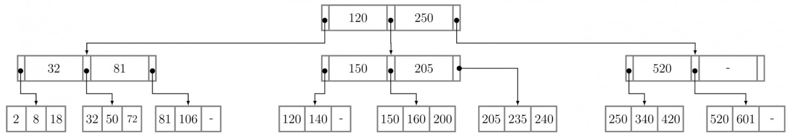

Consider $B ^ { + }$ tree of order $d$ shown in figure. (A $B ^ { + }$ tree of order $d$ contains between $d$ and $2 d$ keys in each node)

Draw the resulting $B ^ { + }$ tree after is inserted in the figure below.

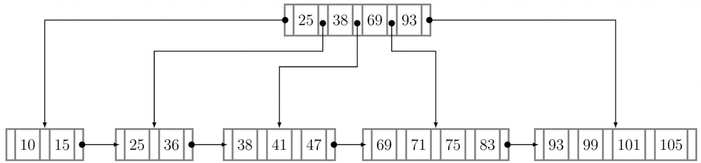

A. What is the total number of key values in the internal nodes of a $B ^ { + }$ -tree with $\boldsymbol { l }$ leaves $\left( l \geq 2 \right)$ ? B. What is the maximum number of internal nodes in a $B ^ { + }$ tree of order  with leaves? C. What is the minimum number of leaves in a $B ^ { + }$ -tree of order $d$ and height $h ( h \geq 1 ) ?$

gate1997 databases b-tree normal descriptive

Which of the following is correct?

A. B-trees are for storing data on disk and ${ \mathsf { B } } ^ { + }$ trees are for main memory.   
B. Range queries are faster on ${ \mathsf { B } } ^ { + }$ trees.   
C. B-trees are for primary indexes and ${ \mathsf { B } } ^ { + }$ trees are for secondary indexes.   
D. The height of a ${ \mathsf { B } } ^ { + }$ tree is independent of the number of records.

# 3.2.6 B Tree: GATE CSE 1999 Question: 21

Consider a B-tree with degree $m$ , that is, the number of children, $c _ { i }$ , of any internal node (except the root) is such that $m \leq c \leq 2 m - 1$ . Derive the maximum and minimum number of records in the leaf nodes for such a B-tree with height $h , h \geq 1$ Assume that the root of a tree is at height

gate1999 databases b-tree normal descriptive

# 3.2.7 B Tree: GATE CSE 2000 Question: 1.22, UGCNET-June2012-II: 11

B - trees are preferred to binary trees in databases because

A. Disk capacities are greater than memory capacities   
B. Disk access is much slower than memory access   
C. Disk data transfer rates are much less than memory data transfer rates   
D. Disks are more reliable than memory

gatecse-2000 databases b-tree normal ugcnetcse-june2012-paper2

# 3.2.8 B Tree: GATE CSE 2000 Question: 21

(a) Suppose you are given an empty $B ^ { + }$ tree where each node (leaf and internal) can store up to key values. Suppose values $1 , 2 , \ldots 1 0$ are inserted, in order, into the tree. Show the tree pictorially

i. after  insertions, and ii. after all insertions

Do NOT show intermediate stages.

(b) Suppose instead of splitting a node when it is full, we try to move a value to the left sibling. If there is no left sibling, or the left sibling is full, we split the node. Show the tree after values $1 , 2 , \ldots , 9$ have been inserted. Assume, as in (a) that each node can hold up to  keys.

(c) In general, suppose a $B ^ { + }$ tree node can hold a maximum of  keys,and you insert a long sequence of keys in increasing order. Then what approximately is the average number of keys in each leaf level node.

i. in the normal case, and ii. with the insertion as in (b).

We wish to construct a $B ^ { + }$ tree with fan-out (the number of pointers per node) equal to  for the following set of key values:

80,50,10,70,30,100,90

Assume that the tree is initially empty and the values are added in the order given.

a. Show the tree after insertion of , after insertion of , and after insertion of . Intermediate trees need not be shown. b. The key values  and  are now deleted from the tree in that order show the tree after each deletion.

a. The following table refers to search items for a key in $B$ -trees and $B ^ { + }$ trees.

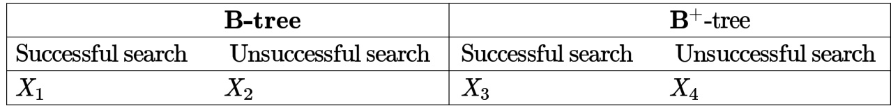

tAhesudccateasbsfausle.seEarach moefatnhse heanttrtihes $\dot { X _ { 1 } } , X _ { 2 } , X _ { 3 }$ thaend $X _ { 4 }$ acsaenahnadvuensaucvcaleuses uolf meietahners tChoatnisttiasntnotrprVeasrieanbt ien. Constant means that the search time is the same, independent of the specific key value, where variable means that it is dependent on the specific key value chosen for the search.   
Give the correct values for the entries $X _ { 1 } , X _ { 2 } , X _ { 3 }$ and (for example $X _ { 1 } = \mathrm { C o n s t a n t } .$ ， $X _ { 2 } = \mathrm { C o n s t a r }$ nt . $X _ { 3 } = \mathrm { C o n s t a n t }$ ， $X _ { 4 } = \mathrm { C o n s t a n t } )$

b. Relation $R ( A , B )$ has the following view defined on it:

CREATE VIEW V AS (SELECT R1.A,R2.B FROM R AS R1, R as R2 WHERE R1. $\scriptstyle { \mathsf { B } } = { \mathsf { R } } 2 . { \mathsf { A } } )$

i. The current contents of relation $R$ are shown below. What are the contents of the view $V ?$

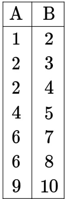

ii. The tuples  and are now inserted into $R$ What are the additional tuples that are inserted in ?

A A - tree index is to be built on the Name attribute of the relation STUDENT. Assume that all the student names are of length bytes, disk blocks are of size  bytes, and index pointers are of size bytes. Given the scenario, what would be the best choice of the degree (i.e. number of pointers per node) of the $B ^ { + }$ - tree?

A. B. C. D. 44 gatecse-2002 databases b-tree normal ugcnetcse-june2012-paper2

Consider the following $2 - 3 - 4$ tree (i.e., B-tree with a minimum degree of two) in which each data item is a letter. The usual alphabetical ordering of letters is used in constructing the tree.

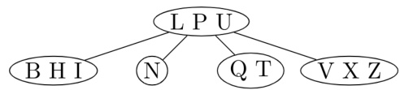

What is the result of inserting $G$ in the above tree?

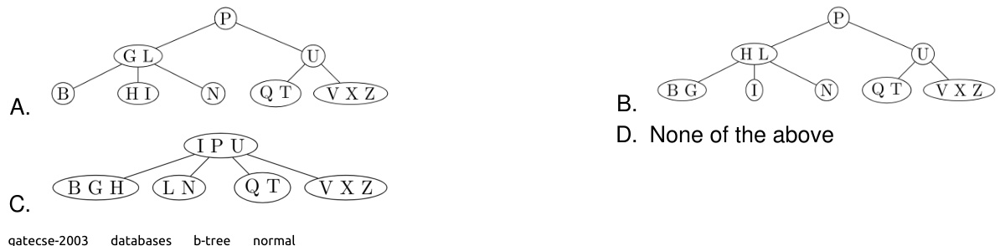

The order of an internal node in a $^ { B + }$ tree index is the maximum number of children it can have. Suppose that a child pointer takes 6 bytes, the search field value takes  bytes, and the block size is  bytes. What is the order of the internal node?

A. B. C. 26 D.

gatecse-2004 databases b-tree normal

# Answer key☟

# 3.2.14 B Tree: GATE CSE 2005 Question: 28

Which of the following is a key factor for preferring $B ^ { + }$ -trees to binary search trees for indexing database relations?

A. Database relations have a large number of records B. Database relations are sorted on the primary key C. $B ^ { + }$ -trees require less memory than binary search trees D. Data transfer from disks is in blocks

gatecse-2005 databases b-tree normal

# Answer key☟

A. B. 64 C. 67 D. 68

gatecse-2007 databases b-tree normal isro2016

A B-tree of order  is built from scratch by  successive insertions. What is the maximum number of node splitting operations that may take place?

A. B. C. D. 6

gatecse-2008 databases b-tree normal

# Answer key ☟

# 3.2.17 B Tree: GATE CSE 2009 Question: 44

The following key values are inserted into a $B ^ { + }$ - tree in which order of the internal nodes is , and that of the leaf nodes i s , in the sequence given below. The order of internal nodes is the maximum number of tree pointers in each node, and the order of leaf nodes is the maximum number of data items that can be stored in it. The $B ^ { + }$ tree is initially empty

# , , , , , ,

The maximum number of times leaf nodes would get split up as a result of these insertions is

A. B. C. D. 5

gatecse-2009 databases b-tree normal

# Answer key☟

# 3.2.18 B Tree: GATE CSE 2010 Question: 18

Consider a $B ^ { + }$ -tree in which the maximum number of keys in a node is . What is the minimum number of keys in any non-root node?

A. B. C. D.

gatecse-2010 databases b-tree easy

# Answer key☟

# 3.2.19 B Tree: GATE CSE 2015 Set 2 Question: 6

With reference to the $B ^ { + }$ tree index of order shown below, the minimum number of nodes (including the Root node) that must be fetched in order to satisfy the following query. "Get all records with a search key greater than or equal to 7 and less than $1 5 "$ is

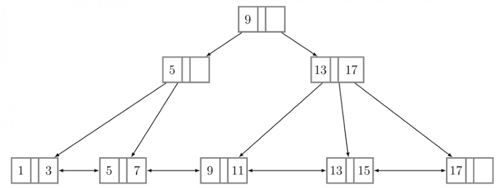

in each non-leaf node of the tree is gatecse-2015-set3 databases b-tree normal numerical-answers $\mathsf { B } +$ Trees are considered BALANCED because.

A. The lengths of the paths from the root to all leaf nodes are all equal.   
B. The lengths of the paths from the root to all leaf nodes differ from each other by at most .   
C. The number of children of any two non-leaf sibling nodes differ by at most .   
D. The number of records in any two leaf nodes differ by at most .

gatecse-2016-set2 databases b-tree normal

In a $B ^ { + }$ Tree , if the search-key value is bytes long the block size is  bytes and the pointer size is then the maximum order of the $B ^ { + }$ Tree is

gatecse-2017-set2 databases b-tree numerical-answers normal

Which one of the following statements is NOT correct about the $B ^ { + }$ tree data structure used for creating an index of a relational database table?

A. $B ^ { + }$ Tree is a height-balanced tree B. Non-leaf nodes have pointers to data records C. Key values in each node are kept in sorted order D. Each leaf node has a pointer to the next leaf node

In a tree, the requirement of at least half-full $( 5 0 \% )$ node occupancy is relaxed for which one of the following cases?

A. Only the root node B. All leaf nodes C. All internal nodes D. Only the leftmost leaf node

gatecse-2024-set1 databases b-tree one-mark

C. The total number of nodes will remain same.   
D. The height of the tree will increase.

In a $\mathrm { B ^ { + } }$ - tree where each node can hold at most four key values, a root to leaf path consists of the following nodes:

$$
\mathrm { A } = ( 4 9 , 7 7 , 8 3 , - ) , \mathrm { B } = ( 7 , 1 9 , 3 3 , 4 4 ) , \mathrm { C } = ( 2 0 ^ { \ast } , 2 2 ^ { \ast } , 2 5 ^ { \ast } , 2 6 ^ { \ast } )
$$

The $^ *$ -marked keys signify that these are data entries in a leaf.

Assume that a pointer between keys $k _ { 1 }$ and $k _ { 2 }$ points to a subtree containing keys in $[ k _ { 1 } , k _ { 2 } )$ , and that when a leaf is created, the smallest key in it is copied up into its parent.

A record with key value is inserted into the $\mathrm { B ^ { + } }$ - tree.

The smallest key value in the parent of the leaf that contains $2 5 ^ { * }$ is (Answer in integer)

gatecse2025-set2 databases b-tree numerical-answers two-marks

Consider a $\textsf { B + }$ Tree where the maximum number of key values in each leaf node is  and the maximum number of pointers in each non-leaf node is . Let the content of the $\textsf { B + }$ Tree be as shown in the figure.

Which of the following options denotes the key value(s) stored in the root node after inserting a key value  in the given $\mathsf { B } +$ Tree?

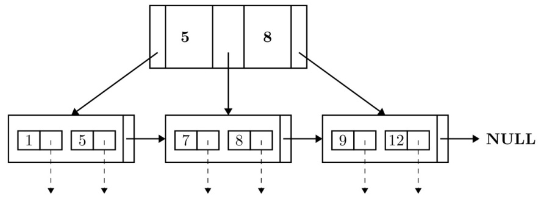

A. 5 B. 8 C. and D. and

gateda-2026 databases b-tree two-marks

# Answer key☟

# 3.2.28 B Tree: GATE IT 2004 Question: 79

Consider a table $T$ in a relational database with a key field $K$ . A $B$ -tree of order $p$ is used as an structure on $K$ , where $p$ denotes the maximum number of tree pointers in a B-tree index node. Assume that $K$ is   long; disk block size is  ; each data pointer $P _ { \mathsf { D } }$ is  bytes long and each block pointer $\mathsf { P } _ { \mathsf { B } }$ B is bytes long. In order for each $B$ -tree node to fit in a single disk block, the maximum value of $p$ is

A. B. C. D.

A B-Tree used as an index for a large database table has four levels including the root node. If a new key is inserted in this index, then the maximum number of nodes that could be newly created in the process are

A. B. C. D.

gateit-2005 databases b-tree normal isro2017

# 3.2.30 B Tree: GATE IT 2006 Question: 61

In a database file structure, the search key field is long, the block size is  , a record pointer i s bytes and a block pointer is  . The largest possible order of a non-leaf node in a $B ^ { + }$ tree implementing this file structure is

A. B. C. D.

gateit-2006 databases b-tree normal

Consider the $B ^ { + }$ tree in the adjoining figure, where each node has at most two keys and three links.

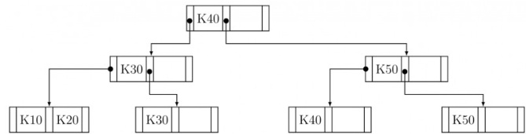

Keys $K 1 5$ and then $K 2 5$ are inserted into this tree in that order. Exactly how many of the following nodes (disregarding the links) will be present in the tree after the two insertions?

K30 K50 K25 K30 K20 K25 K15 K20

A. B. C. D.

gateit-2007 databases b-tree normal

Consider the $B ^ { + }$ tree in the adjoining figure, where each node has at most two keys and three links.

Keys $K 1 5$ and then $K 2 5$ are inserted into this tree in that order. Now the key $K 5 0$ is deleted from the $B ^ { + }$ tree resulting after the two insertions made earlier. Consider the following statements about the $B ^ { + }$ tree resulting after this deletion.

i. The height of the tree remains the same. K20   
ii. The node (disregarding the links) is present in the tree.   
iii. The root node remains unchanged (disregarding the links).

Which one of the following options is true?

A. Statements (i) and (ii) are true B. Statements (ii) and (iii) are true C. Statements (iii) and (i) are true D. All the statements are false

gateit-2007 databases b-tree normal

An instance of a relational scheme $R ( A , B , C )$ has distinct values for attribute . Can you conclude that $A$ is a candidate key for $R ?$

gate1994 databases easy database-normalization candidate-key descriptive

Consider a relation scheme $R = ( A , B , C , D , E , H )$ on which the following functional dependencies hold: $\{ A \to B$ , $B C  D$ , $E  C$ , $D  A \}$ . What are the candidate keys R?

A. B. AE,BE, DE C. AEH, BEH,BCH D. AEH, BEH,DEH

gatecse-2005 databases candidate-key easy

# 3.3.3 Candidate Key: GATE CSE 2011 Question: 12

Consider a relational table with a single record for each registered student with the following attributes:

1. Registration Unique registration number for each registered student   
2. Unique identity number, unique at the national level for each citizen   
3. BankAccount_Num: Unique account number at the bank. A student can have multiple accounts or joint   
accounts. This attribute stores the primary account number.   
4. Name of the student   
5. Hostel Room number of the hostel

Which of the following options is INCORRECT?

A. BankAccount is a candidate key   
B. Registration can be a primary key   
C. is a candidate key if all students are from the same country   
D. If $\boldsymbol { S }$ is a super key such that ${ \cal { S } } { \cap } \mathrm { { U I D } }$ is then $S \cup \mathbf { U } \mathbb { D }$ is also a superkey

The maximum number of superkeys for the relation schema $R ( E , F , G , H )$ with $E$ as the key is

gatecse-2014-set2 databases numerical-answers easy candidate-key

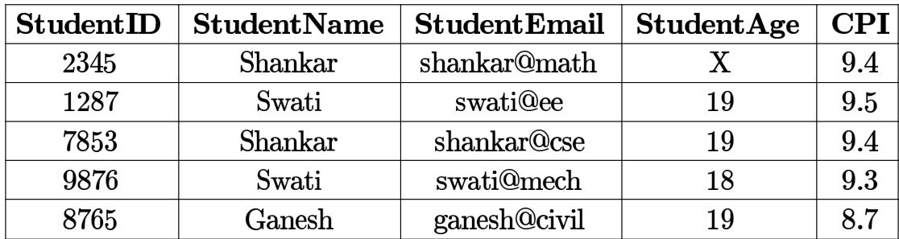

For (StudentName, to be a key for this instance, the value $X$ should NOT be equal to

gatecse-2014-set2 databases numerical-answers easy candidate-key

A prime attribute of a relation scheme $R$ is an attribute that appears

A. in all candidate keys of $R$ B. in some candidate key of $R$ C. in a foreign key of $R$ D. only in the primary key of $R$

gatecse-2014-set3 databases easy candidate-key

L e t be a relational schema with functional dependency se $\mathrm { F } = \{ \mathrm { A { \stackrel { . } { \to } B C } } , \mathrm { C D } \to \mathrm { E } , \mathrm { E } \to \mathrm { A } \} .$

Which of the following statements is correct?

A. and  are the only candidate keys of .   
B. and  are the only candidate keys of $\mathbf { R }$ .   
C. A,E and  are the only candidate keys of $\mathbf { R }$ .   
D. and  are the only candidate keys of $\mathbf { R }$ .

gateda-2026 databases functional-dependency candidate-key one-mark ✍ Practice Tests: Test 1 (15Q) Test 2 (4Q)

Consider the following schedules involving two transactions. Which one of the following statements is TRUE?

$$
\begin{array} { r l } & { S _ { 1 } : r _ { 1 } ( X ) ; r _ { 1 } ( Y ) ; r _ { 2 } ( X ) ; r _ { 2 } ( Y ) ; w _ { 2 } ( Y ) ; w _ { 1 } ( X ) } \\ & { S _ { 2 } : r _ { 1 } ( X ) ; r _ { 2 } ( X ) ; r _ { 2 } ( Y ) ; w _ { 2 } ( Y ) ; r _ { 1 } ( Y ) ; w _ { 1 } ( X ) } \end{array}
$$

A. Both $S _ { 1 }$ and $S _ { 2 }$ are conflict serializable.   
B. $S _ { 1 }$ is conflict serializable and $S _ { 2 }$ is not conflict serializable.   
C. $S _ { 1 }$ is not conflict serializable and $S _ { 2 }$ is conflict serializable.   
D. Both $S _ { 1 }$ and $S _ { 2 }$ are not conflict serializable.

Consider two transactions $T _ { 1 }$ and $T _ { 2 }$ , and four schedules $S _ { 1 } , S _ { 2 } , S _ { 3 } , S _ { 4 }$ , of $T _ { 1 }$ and $T _ { 2 }$ as given below:

$$
\begin{array} { r l } & { T _ { 1 } : R _ { 1 } [ x ] W _ { 1 } [ x ] W _ { 1 } [ y ] } \\ & { T _ { 2 } : R _ { 2 } [ x ] R _ { 2 } [ y ] W _ { 2 } [ y ] } \\ & { S _ { 1 } : R _ { 1 } [ x ] R _ { 2 } [ x ] R _ { 2 } [ y ] W _ { 1 } [ x ] W _ { 1 } [ y ] W _ { 2 } [ y ] } \\ & { S _ { 2 } : R _ { 1 } [ x ] R _ { 2 } [ x ] R _ { 2 } [ y ] W _ { 1 } [ x ] W _ { 2 } [ y ] W _ { 1 } [ y ] } \\ & { S _ { 3 } : R _ { 1 } [ x ] W _ { 1 } [ x ] R _ { 2 } [ x ] W _ { 1 } [ y ] R _ { 2 } [ y ] W _ { 2 } [ y ] } \\ & { S _ { 4 } : R _ { 2 } [ x ] R _ { 2 } [ y ] R _ { 1 } [ x ] W _ { 1 } [ x ] W _ { 1 } [ y ] W _ { 2 } [ y ] } \end{array}
$$

Which of the above schedules are conflict-serializable?

A. $S _ { 1 }$ and $S _ { 2 }$ B. $S _ { 2 }$ and $S _ { 3 }$ C. $S _ { 3 }$ only D. $S _ { 4 }$ only

gatecse-2009 databases transaction-and-concurrency normal conflict-serializable

# 3.4.3 Conflict Serializable: GATE CSE 2014 Set Question: 29

Consider the following four schedules due to three transactions (indicated by the subscript) using read and write on a data item $\mathsf { x }$ , denoted by $r ( x )$ and $w ( x )$ respectively. Which one of them is conflict serializable?

A. $r _ { 1 } ( x ) ; r _ { 2 } ( x ) ; w _ { 1 } ( x ) ; r _ { 3 } ( x ) ; w _ { 2 } ( x ) ;$   
B. $r _ { 2 } ( x ) ; r _ { 1 } ( x ) ; w _ { 2 } ( x ) ; r _ { 3 } ( x ) ; w _ { 1 } ( x ) ;$ ;   
C. $r _ { 3 } ( x ) ; r _ { 2 } ( x ) ; r _ { 1 } ( x ) ; w _ { 2 } ( x ) ; w _ { 1 } ( x )$ ;   
D. $r _ { 2 } ( x ) ; w _ { 2 } ( x ) ; r _ { 3 } ( x ) ; r _ { 1 } ( x ) ; w _ { 1 } ( x ) ;$ ;

Consider the following schedule S of transactions $T 1 , T 2 , T 3 , T 4$ :

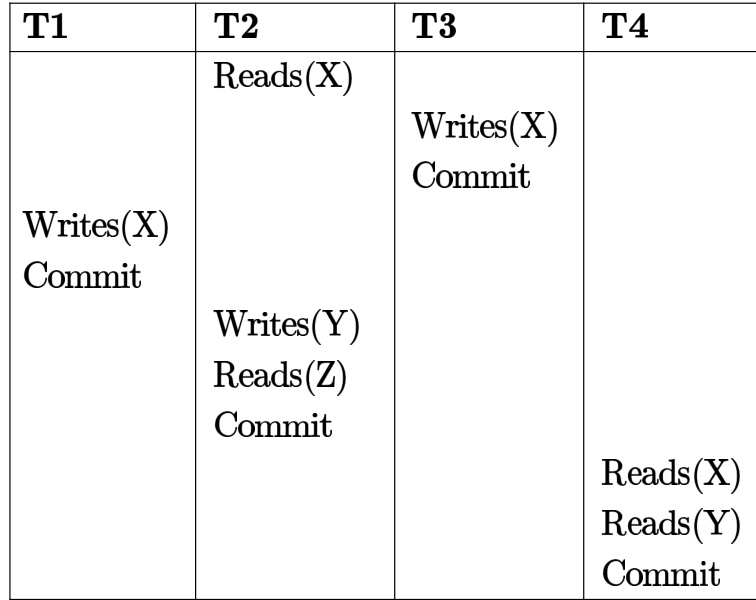

Which one of the following statements is CORRECT?

A. S is conflict-serializable but not recoverable B. S is not conflict-serializable but is recoverable C. S is both conflict-serializable and recoverable D. S is neither conflict-serializable not is it recoverable

Consider the transactions $T 1 , T 2$ ，and $T 3$ and the schedules $S 1$ and $S 2$ given below.

$$
\begin{array} { r l } & { \bullet \ { \cal T } 1 : r 1 ( X ) ; r 1 ( Z ) ; w 1 ( X ) ; w 1 ( Z ) } \\ & { \bullet \ { \cal T } 2 : r 2 ( Y ) ; r 2 ( Z ) ; w 2 ( Z ) } \\ & { \bullet \ { \cal T } 3 : r 3 ( Y ) ; r 3 ( X ) ; w 3 ( Y ) } \\ & { \bullet \ { \cal S } 1 : r 1 ( X ) ; r 3 ( Y ) ; r 3 ( X ) ; r 2 ( Y ) ; r 2 ( Z ) ; w 3 ( Y ) ; w 2 ( Z ) ; r 1 ( Z ) ; w 1 ( X ) ; w 1 ( Z ) } \\ & { \bullet \ { \cal S } 2 : r 1 ( X ) ; r 3 ( Y ) ; r 2 ( Y ) ; r 3 ( X ) ; r 1 ( Z ) ; r 2 ( Z ) ; w 3 ( Y ) ; w 1 ( X ) ; w 2 ( Z ) ; w 1 ( Z ) } \end{array}
$$

Which one of the following statements about the schedules is TRUE?

A. Only $S 1$ is conflict-serializable. B. Only $S 2$ is conflict-serializable. C. B o t h $S 1$ and $S 2$ are conflict- D. Neither $S 1$ nor $S 2$ is conflictserializable. serializable.

Two transactions $T _ { 1 }$ and $T _ { 2 }$ are given as

$$
\begin{array} { r l } & { T _ { 1 } : r _ { 1 } ( X ) w _ { 1 } ( X ) r _ { 1 } ( Y ) w _ { 1 } ( Y ) } \\ & { } \\ & { T _ { 2 } : r _ { 2 } ( Y ) w _ { 2 } ( Y ) r _ { 2 } ( Z ) w _ { 2 } ( Z ) } \end{array}
$$

where $r _ { i } ( V )$ denotes a  operation by transaction $T _ { i }$ on a variable $V$ and $w _ { i } ( V )$ denotes a  operation by transaction $T _ { i }$ on a variable $V$ . The total number of conflict serializable schedules that can be formed by $T _ { 1 }$ and $T _ { 2 }$ is

gatecse-2017-set2 databases transaction-and-concurrency numerical-answers conflict-serializable

Consider a schedule of transactions $T _ { 1 }$ and $T _ { 2 }$ :

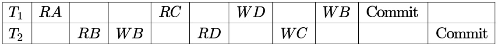

Here, RX stands for “Read(X)” and WX stands for “Write(X)”. Which one of the following schedules is conflict equivalent to the above schedule?

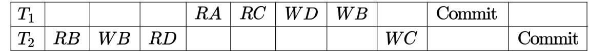

B.

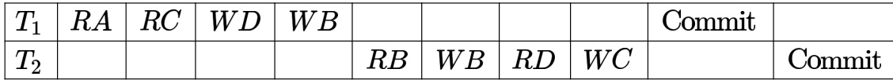

C.

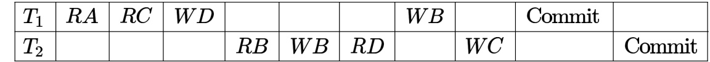

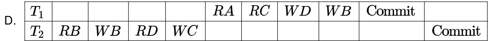

Let $r _ { i } ( z )$ and $w _ { i } ( z )$ denote read and write operations respectively on a data item $z$ by a transaction $T _ { i }$ .   
Consider the following two schedules.

$$
\begin{array} { r } { \bullet S _ { 1 } : r _ { 1 } ( x ) r _ { 1 } ( y ) r _ { 2 } ( x ) r _ { 2 } ( y ) w _ { 2 } ( y ) w _ { 1 } ( x ) } \\ { \bullet S _ { 2 } : r _ { 1 } ( x ) r _ { 2 } ( x ) r _ { 2 } ( y ) w _ { 2 } ( y ) r _ { 1 } ( y ) w _ { 1 } ( x ) } \end{array}
$$

Which one of the following options is correct?

A. $S _ { 1 }$ is conflict serializable, and $S _ { 2 }$ is not conflict serializable B. $S _ { 1 }$ is not conflict serializable, and $S _ { 2 }$ is conflict serializable C. Both $S _ { 1 }$ and $S _ { 2 }$ are conflict serializable D. Niether $S _ { 1 }$ nor $S _ { 2 }$ is conflict serializable

gatecse-2021-set1 databases transaction-and-concurrency conflict-serializable two-marks

Let $\boldsymbol { S }$ be the following schedule of operations of three transactions $T _ { 1 }$ , $T _ { 2 }$ and $T _ { 3 }$ in a relational database system:

$$
R _ { 2 } ( Y ) , R _ { 1 } ( X ) , R _ { 3 } ( Z ) , R _ { 1 } ( Y ) W _ { 1 } ( X ) , R _ { 2 } ( Z ) , W _ { 2 } ( Y ) , R _ { 3 } ( X ) , W _ { 3 } ( Z )
$$

Consider the statements $P$ and $Q$ below:

$P { : } S$ is conflict-serializable.   
$Q$ : If $T _ { 3 }$ commits before $T _ { 1 }$ finishes, then $\boldsymbol { S }$ is recoverable.

Which one of the following choices is correct?

A. Both $P$ and $Q$ are true B. $P$ is true and $Q$ is false C. $P$ is false and $Q$ is true D. Both and $Q$ are false

gatecse-2021-set2 databases transaction-and-concurrency conflict-serializable two-marks

# Answer key☟

L e t $R _ { i } ( z )$ and $W _ { i } ( z )$ denote read and write operations on a data element $z$ by a transaction $\boldsymbol { T _ { i } }$ ， respectively. Consider the schedule $\boldsymbol { S }$ with four transactions.

$$
S : \ R _ { 4 } ( x ) R _ { 2 } ( x ) R _ { 3 } ( x ) R _ { 1 } ( y ) W _ { 1 } ( y ) W _ { 2 } ( x ) W _ { 3 } ( y ) R _ { 4 } ( y )
$$

Which one of the following serial schedules is conflict equivalent to $\mathcal { S } ?$

A. $T _ { 1 }  T _ { 3 }  T _ { 4 }  T _ { 2 }$ $\begin{array} { r } { \mathsf { B } . \ T _ { 1 } \to T _ { 4 } \to T _ { 3 } \to T _ { 2 } } \\ { \mathsf { D } . \ T _ { 3 } \to T _ { 1 } \to T _ { 4 } \to T _ { 2 } } \end{array}$   
C. $T _ { 4 }  T _ { 1 }  T _ { 3 }  T _ { 2 }$

gatecse-2022 databases transaction-and-concurrency conflict-serializable two-marks

# Answer key☟

# 3.4.11 Conflict Serializable: GATE CSE 2024 Set 1 Question: 36

Consider the following read-write schedule  over three transactions $T _ { 1 } , T _ { 2 }$ , and $T _ { 3 }$ , where the subscripts i the schedule indicate transaction IDs:

$S : r _ { 1 } ( z ) ; w _ { 1 } ( z ) ; r _ { 2 } ( x ) ; r _ { 3 } ( y ) ; w _ { 3 } ( y ) ; r _ { 2 } ( y ) ; w _ { 2 } ( x ) ; w _ { 2 } ( y ) ;$ Which of the following transaction schedules is/are conflict equivalent to ?

A. $T _ { 1 } T _ { 2 } T _ { 3 }$ B. TTT2 C. TTT1 D. TTT2

Consider the database transactions T1 and T2 and data items X and Y Which of the schedule(s) is/are conflict serializable?

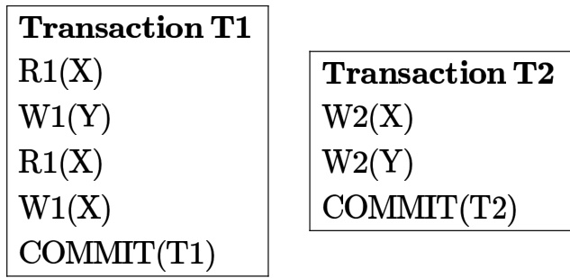

A. R1(X), W2(X), W1(Y), W2(Y), R1(X), W1(X), COMMIT(T2), COMMIT(T1) B. W2(X), R1(X), W2(Y), W1(Y), R1(X), COMMIT(T2), W1(X), COMMIT(T1) C. R1(X), W1(Y), W2(X), W2(Y), R1(X), W1(X), COMMIT(T1), COMMIT(T2) D. W2(X), R1(X), W1(Y), W2(Y), R1(X), COMMIT(T2), W1(X), COMMIT(T1)

State True or False with reason

Logical data independence is easier to achieve than physical data independence.

gate1994 databases normal database-design true-false Answer key☟

State whether the following statements are TRUE or FALSE:

A relation $r$ with schema $( X , Y )$ satisfies the function dependency $X \to Y$ , The tuples $\langle 1 , 2 \rangle$ and $\langle 2 , 2 \rangle$ can both be in $r$ simultaneously.

$\{ x \to y , x \to z \} \mid = x \to y z$ (Note: $x \to y$ denotes $y$ is functionally dependent on $x$ , $z \subseteq y$ denotes $z$ is subset of $y$ , and $\mid =$ means derives).

gate1988 easy descriptive databases database-normalization

Using Armstrong’s axioms of functional dependency derive the following rules:

$$
\{ x \to y , w y \to z \} \mid = x w \to z
$$

(Note: $x \to y$ denotes $y$ is functionally dependent on $x$ , $z \subseteq y$ denotes $z$ is subset of $y$ , and $\mid =$ means derives).

gate1988 normal descriptive databases database-normalization

Using Armstrong’s axioms of functional dependency derive the following rules:

$\{ x \to y , z \subset y \} \mid = x \to z$ (Note: $x \to y$ denotes $y$ is functionally dependent on $x$ , $z \subseteq y$ denotes $z$ is subset of $y$ , and $\mid =$ means derives).

gate1988 normal descriptive databases database-normalization

Match the pairs in the following questions:

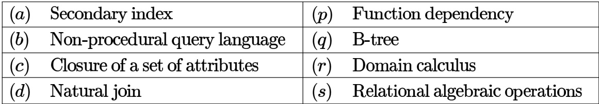

gate1990 match-the-following database-normalization databases

# Answer key☟

Indicate which of the following statements are true:

A relational database which is in NF may still have undesirable data redundancy because there may exist:

A. Transitive functional dependencies B. Non-trivial functional dependencies involving prime attributes on the right-side. C. Non-trivial functional dependencies involving prime attributes only on the left-side. D. Non-trivial functional dependencies involving only prime attributes.

gate1990 normal databases database-normalization multiple-selects

Consider the relation scheme $R ( A , B , C )$ with the following functional dependencies:

$$
\displaystyle { : _ { C \to A } ^ { A , B \to C , } }
$$

A. Show that the scheme $R$ is in $\mathrm { 3 N F }$ but not in .   
B. Determine the minimal keys of relation $R$ .

gate1995 databases database-normalization normal descriptive

For a database relation $R ( a , b , c , d )$ , where the domains $^ { a , b , c , d }$ include only atomic values, only the following functional dependencies and those that can be inferred from them hold

$$
\begin{array} { c } { { \cdot a  c } } \\ { { \cdot b  d } } \end{array}
$$

This relation is

A. in first normal form but not in second normal form B. in second normal form but not in first normal form C. in third normal form D. none of the above

gate1997 databases database-normalization normal

# 3.6.11 Database Normalization: GATE CSE 1998 Question: 1.34

Which normal form is considered adequate for normal relational database design?

A. 2NF B. 5NF C. 4NF D. 3NF

gate1998 databases database-normalization easy

Consider the following database relations containing the attributes

Book_id   
Subject Category_of book   
Name _of_Author   
Nationality _of_ Author

With Book id as the primary key.

a. What is the highest normal form satisfied by this relation?

b. Suppose the attributes Book_title and Author_address are added to the relation, and the primary key is changed to {Name of_Author, Book_title}, what will be the highest normal form satisfied by the relation?

$C  F , E  A , E C  D , A  B$ . Which one of the following is a key for ?

A. CD B. EC C. AE D. AC

# 3.6.14 Database Normalization: GATE CSE 1999 Question: 2.7, UGCNET-June2014-III: 25

Consider the schema $R = ( S , T , U , V )$ and the dependencies $S \to T , T \to U , U \to V$ and $V  S$ . Le $R = ( R 1 { \mathrm { a n d } } R 2 )$ be a decomposition such that $R 1 \cap R 2 \neq \phi$ . The decomposition is

A. not in B. in but not C. in  but not in D. in both and

gate1999 databases database-normalization normal ugcnetjune2014iii

Given the following relation instance.

$$
\begin{array} { r } { \left[ \begin{array} { l } { \mathbf { X } } \end{array} \right] \mathbf { \Sigma } \mathbf { Y } \left[ \begin{array} { l } { \mathbf { Z } } \\ { \mathbf { 1 } } \end{array} \right] } \\ { \left[ \begin{array} { l } { \mathbf { 1 } } \\ { \mathbf { 1 } } \end{array} \right] \mathbf { \Sigma } \mathbf { 5 } } \\ { \left[ \begin{array} { l } { \mathbf { 1 } } \\ { \mathbf { 3 } } \end{array} \right] \mathbf { \Sigma } \mathbf { 6 } } \end{array}
$$

Which of the following functiona dependencies are satisfied by the instance?

A. $X Y  Z$ and $Z \to Y$ B. $Y Z  X$ and $Y  Z$ C. $Y Z  X$ and $X  Z$ D. $X Z \to Y$ and $Y  X$

gatecse-2000 databases database-normalization easy

$R ( A , B , C , D )$ is a relation. Which of the following does not have a lossless join, dependency preserving $B C N F$ decomposition?

A. $A \to B , B \to C D$ $. \ A \to B , B \to C , C \to D$   
C. $A B  C , C  A D$ D. $A \to B C D$

gatecse-2001 databases database-normalization normal

Relation $R$ with an associated set of functional dependencies, $F$ , is decomposed into . The redundancy (arising out of functional dependencies) in the resulting set of relations is

A. Zero   
B. More than zero but less than that of an equivalent decomposition   
C. Proportional to the size o f   
D. Indeterminate

gatecse-2002 databases database-normalization normal

$M  O , N O  P , P  L$ and $L \to M N$ R is decomposed into $\mathsf { R 1 } = ( \mathsf { L } , \mathsf { M } , \mathsf { N } , \mathsf { P } )$ and $\mathsf { R } 2 = ( \mathsf { M } , \mathsf { O } )$ .

A. Is the above decomposition a lossless-join decomposition? Explain.   
B. Is the above decomposition dependency-preserving? If not, list all the dependencies that are not preserved. C. What is the highest normal form satisfied by the above decomposition?

gatecse-2002 databases database-normalization normal descriptive

# 3.6.19 Database Normalization: GATE CSE 2002 Question: 2.24

Relation $R$ is decomposed using a set of functional dependencies, $F$ , and relation $\boldsymbol { S }$ is decomposed using another set of functional dependencies, $G$ . One decomposition is definitely , the other is definitely $3 N F$ , but it is not known which is which. To make a guaranteed identification, which one of the following tests should be used on the decompositions? (Assume that the closures of $F$ and $G$ are available).

A. Dependency-preservation B. Lossless-join C. BCNF definition D. 3NF definition

gatecse-2002 databases database-normalization easy

From the following instance of a relation schema $R ( A , B , C )$ , we can conclude that:

$$
\begin{array} { r } { \left[ \begin{array} { l } { \mathbf { A } } \\ { \mathbf { 1 } } \\ { \mathbf { 1 } } \\ { \mathbf { 1 } } \\ { \mathbf { 2 } } \\ { \mathbf { 2 } } \end{array} \right] \left[ \begin{array} { l } { \mathbf { B } } \\ { \mathbf { 1 } } \\ { \mathbf { 1 } } \\ { \mathbf { 3 } } \\ { \mathbf { 3 } } \end{array} \right] \left[ \begin{array} { l } { \mathbf { C } } \\ { \mathbf { 1 } } \\ { \mathbf { 0 } } \\ { \mathbf { 2 } } \\ { \mathbf { 2 } } \end{array} \right] } \end{array}
$$

A. $A$ functionally determines $B$ and $B$ functionally determines $\boldsymbol { C }$ B. $A$ functionally determines $B$ and $B$ does not functionally determine $C$ C. $B$ does not functionally determine $C$ D. $A$ does not functionally determine $B$ and $B$ does not functionally determine $\boldsymbol { C }$

Consider the following functional dependencies in a database.

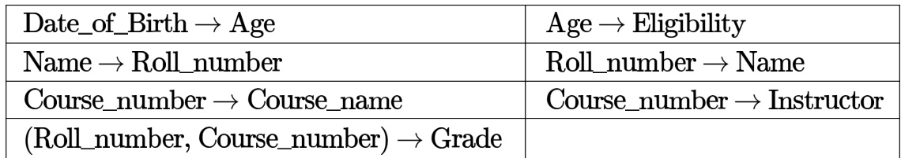

The relation (Roll number, Name, Date of birth, Age) is

A. in second normal form but not in B. in third normal form but not in third normal form BCNF C. in BCNF D. in none of the above

The relation scheme Student Performance (name, courseNo, rollNo, grade) has the following functional dependencies:

name, courseNo, $$ grade rollNo, courseNo $$ grade name $$ rollNo   
rollNo $$ name

The highest normal form of this relation scheme is

A. 2NF B. 3NF C. BCNF D. 4NF

gatecse-2004 databases database-normalization normal

Which one of the following statements about normal forms is

A. is stricter than   
B. Lossless, dependency-preserving decomposition into  is always possible C. Lossless, dependency-preserving decomposition into is always possible D. Any relation with two attributes is in

gatecse-2005 databases database-normalization easy ugcnetcse-june2015-paper3

The following functional dependencies are given:

$$
A B  C D , A F  D , D E  F , C  G , F  E , G  A
$$

Which one of the following options is false?

A. $\{ C F \} ^ { * } = \{ A C D E F G \}$ B. $\{ B G \} ^ { * } = \{ A B C D G \}$   
C. $\{ A F \} ^ { * } = \{ A C D E F G \}$ D. $\{ A B \} ^ { * } = \{ A B C D G \}$

gatecse-2006 databases database-normalization normal

Answer key☟

# 3.6.25 Database Normalization: GATE CSE 2007 Question: 62, UGCNET-June2014-II: 47

Which one of the following statements is ?

A. Any relation with two attributes is in B. A relation in which every key has only one attribute is in C. A prime attribute can be transitively dependent on a key in a  relation D. A prime attribute can be transitively dependent on a key in a relation gatecse-2007 databases database-normalization normal ugcnetcse-june2014-paper2