Consider the following database table named scorer

top_scorer   
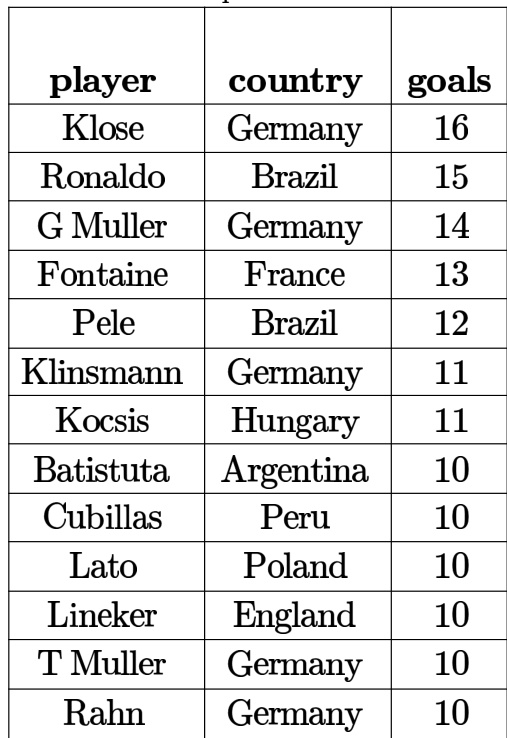

Consider the following SQL query:

SELECT ta.player FROM top _scorer AS ta   
WHERE ta.goals $> A L L$ (SELECT tb.goals FROM top_scorer AS tb WHERE tb.country = 'Spain')   
AND ta.goals $>$ ANY (SELECT tc.goals FROM top_ scorer AS tc WHERE tc.country 'Germany')

The number of tuples returned by the above SQL query is

Consider the following two tables and four queries in SQL.

Book (isbn, bname), Stock(isbn, copies)

Query 1:

SELECT B.isbn, S.copies FROM Book B INNER JOIN Stock S ON B.isbn=S.isbn;

Query 2:

SELECT B.isbn, S.copies FROM Book B LEFT OUTER JOIN Stock S ON B.isbn=S.isbn;

Query 3:

SELECT B.isbn, S,copies FROM Book B RIGHT OUTER JOIN Stock S ON B.isbn=S.isbn

Query 4: SELECT B.isbn, S.copies FROM Book B FULL OUTER JOIN Stock S ON B.isbn $\mathsf { \Omega } = \mathsf { S }$ .isbn

Which one of the queries above is certain to have an output that is a superset of the outputs of the other three queries?

A. Query 1 B. Query 2 C. Query 3 D. Query 4

A relational database contains two tables Student and Performance as shown below:

Table: student   
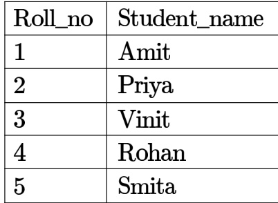

Table: Performance   
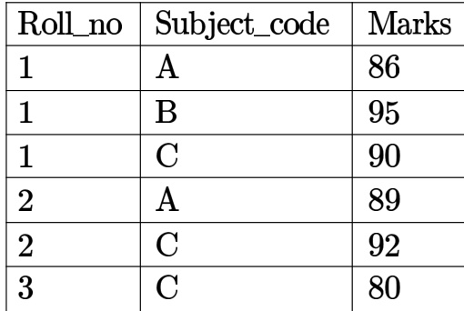

The primary key of the Student table is Roll no. For the performance table, the columns Roll no. and Subject _code together form the primary key. Consider the SQL query given below:

SELECT S.Student name, sum(P.Marks) FROM Student S, Performance P WHERE P.Marks ${ > } 8 4$ GROUP BY S.Student_name;

The number of rows returned by the above SQL query is

Consider a relational database containing the following schemas.

Catalogue   
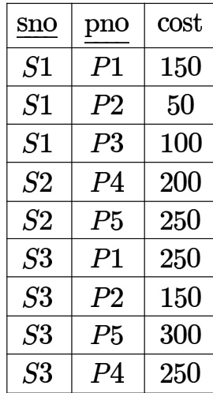

Suppliers   
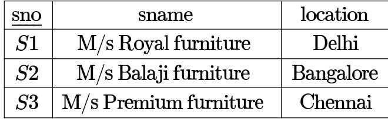

Parts   
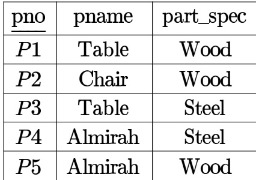

The primary key of each table is indicated by underlining the constituent fields.

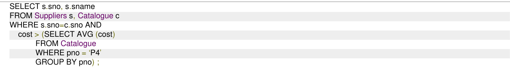

The number of rows returned by the above SQL query is

A. B. C. D. 2

A relation $r ( A , B )$ in a relational database has  tuples. The attribute $A$ has integer values ranging from to , and the attribute $B$ has integer values ranging from  to . Assume that the attributes $A$ and $B$ are independently distributed.

The estimated number of tuples in the output of $\sigma _ { ( A > 1 0 ) \vee ( B = 1 8 ) } ( r )$ is

gatecse-2021-set1 databases sql numerical-answers one-mark

The relation scheme given below is used to store information about the employees of a company, where is the key and indicates the department to which the employee is assigned. Each employee is assigned to exactly one department.

Consider the following  query:

select deptId, count(\*)   
from emp   
where gender $\mathbf { \Sigma } = \mathbf { \Sigma }$ “female” and salary $>$ (select avg(salary)from emp) group by deptId;

The above query gives, for each department in the company, the number of female employees whose salary is greater than the average salary of

A. employees in the department B. employees in the company C. female employees in the D. female employees in the company department

gatecse-2021-set2 databases sql easy two-marks

Consider the relational database with the following four schemas and their respective instances.

Student(sNo, sName, dNo) Dept(dNo, dName) Course(cNo, cName, dNo) Register(sNo, cNo)

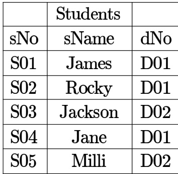

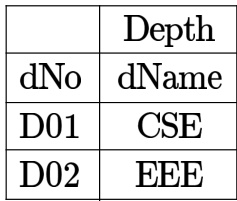

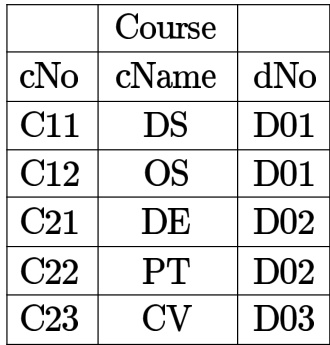

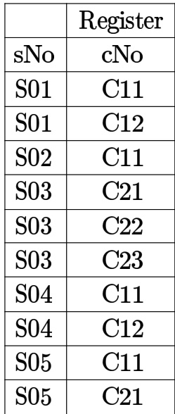

SQL query

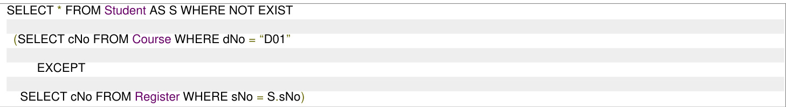

The number of rows returned by the above  query is

Consider the following table named in a relational database. The primary key of this table is rollNum.

Student   
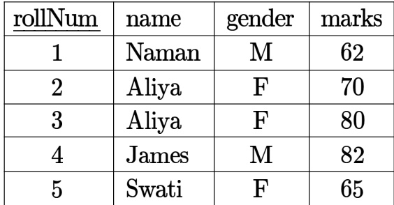

The  query below is executed on this database.

SELECT   
FROM Student   
WHERE gender $\mathbf { \Sigma } = \mathbf { \Sigma }$ 'F' AND marks $> 6 5$ ;

The number of rows returned by the query is

# Consider the following database tables of a sports league.

An instance of the table and an SQL query are given.

# player

members

coach   
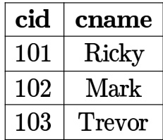

team   
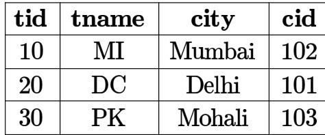

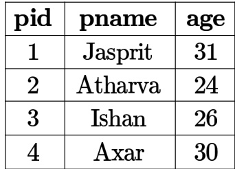

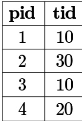

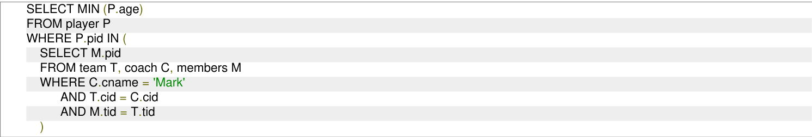

The value returned by the given SQL query is (Answer in integer)

Consider the following relationa schema: Students (rollno: integer name: string, age: integer, cgpa: real) Courses (courseno integer cname: string, credits: integer) Enrolled (rollno: integer courseno: integer grade: string)

Which of the following options is/are correct SQL query/queries to retrieve the names of the students enrolled in course number (i.e., courseno) ?

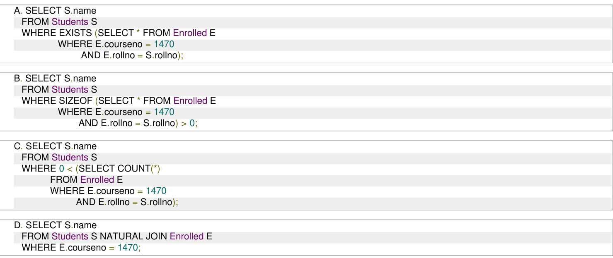

On a relation named Loan of a bank:

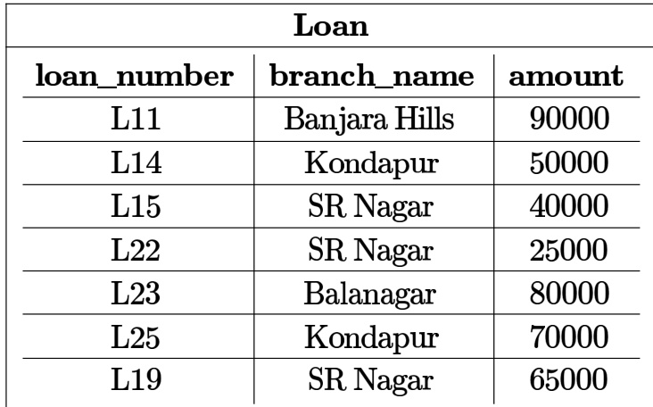

the following SQL query is executed.

SELECT L1.loan_number   
FROM Loan L1   
WHERE L1.amount $>$ (SELECT MAX (L2.amount) FROM Loan L2 WHERE L2.branch name $= \ \cdot \mathsf { S } \mathsf { R }$ Nagar');

The number of rows returned by the query is (Answer in integer).

Consider the following two tables named Raider and Team in a relational database maintained by a Kabaddi league. The attribute ID in table Team references the primary key of the Raider table, ID.

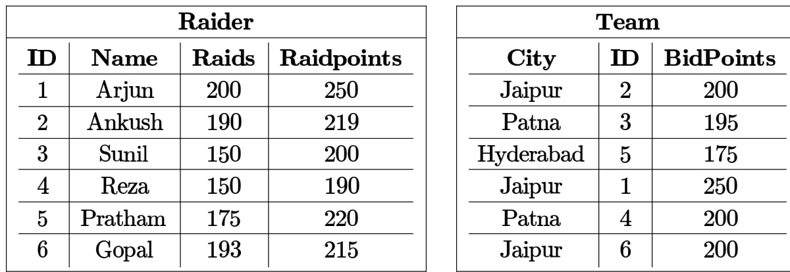

The SQL query described below is executed on this database:

SELECT   
FROM Raider, Team   
WHERE Raider. $\mathsf { I D } =$ Team.ID AND City="Jaipur" AND RaidPoints $> 2 0 0$ ;

The number of rows returned by this query is

An OTT company is maintaining a large disk-based relational database of different movies with the following schema:

Movie (ID, CustomerRating) Genre (ID, Name) Movie Genre (MovieID GenreID)

Consider the following SQL query on the relation database above:

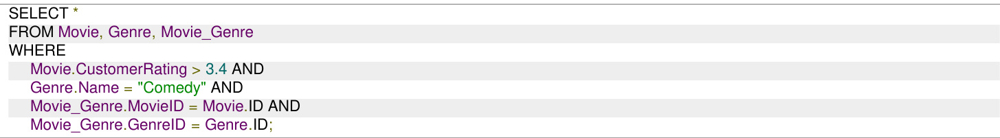

This SQL query can be sped up using which of the following indexing options?

A. $\mathrm { { \bf B } } ^ { + }$ tree on all the attributes.   
B. Hash index on Genre.Name and $\mathbf { B } ^ { + }$ tree on the remaining attributes.   
C. Hash index on Movie.CustomerRating and $\mathrm { { \bf B } ^ { + } }$ tree on the remaining attributes.   
D. Hash index on all the attributes.

A relational database contains two tables student and department in which student table has columns roll_no, name and dept_id and department table has columns dept_id and dept_name. The following insert statements were executed successfully to populate the empty tables:

Insert into department values (1, 'Mathematics') Insert into department values (2, 'Physics') Insert into student values (l, 'Navin', 1) Insert into student values (2, 'Mukesh', 2) Insert into student values (3, 'Gita', 1)

How many rows and columns will be retrieved by the following SQL statement? Select from student, department

A. 0 row and 4 columns B. 3 rows and 4 columns C. 3 rows and 5 columns D. 6 rows and 5 columns

gateit-2004 databases sql normal

Answer key☟

A table T1 in a relational database has the following rows and columns:

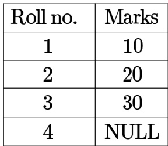

The following sequence of SQL statements was successfully executed on table T1.

Update T1 set marks $\ c =$ marks + 5   
Select avg(marks) from T1

What is the output of the select statement?

A. 18.75 B. C. 25 D. Null

Consider two tables in a relational database with columns and rows as follows:

Table: Student   
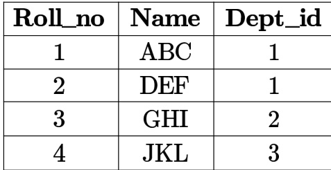

Table: Department   
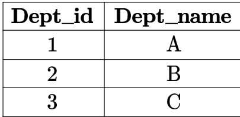

Roll_no is the primary key of the Student table, Dept_id is the primary key of the Department table and   
Student.Dept_id is a foreign key from Department.Dept_id   
What will happen if we try to execute the following two SQL statements?

i. update Student set Dept id $\mathbf { \sigma } = \mathbf { \sigma }$ Null where Roll on $= 1$ ii. update Department set Dept _id $\mathbf { \sigma } = \mathbf { \sigma }$ Null where Dept_id $= 1$

A. Both and ii will fail B. will fail but ii will succeed

D. Both and i will succeed

In an inventory management system implemented at a trading corporation, there are several tables designed to hold all the information. Amongst these, the following two tables hold information on which items are supplied by which suppliers, and which warehouse keeps which items along with the stock-level of these it

Supply $\mathbf { \sigma } = \mathbf { \sigma }$ (supplierid, itemcode)   
Inventory $\mathbf { \sigma } = \mathbf { \sigma }$ (itemcode, warehouse, stocklevel)   
For a specific information required by the management, following SQL query has been written   
Select distinct STMP.supplierid   
From Supply as STMP   
Where not unique (Select ITMP.supplierid From Inventory, Supply as ITMP Where STMP.supplierid $\mathbf { \Sigma } = \mathbf { \Sigma }$ ITMP.supplierid And ITMP.itemcode $\mathbf { \Sigma } = \mathbf { \Sigma }$ Inventory.itemcode And Inventory.warehouse $\mathbf { \Sigma } = \mathbf { \Sigma }$ 'Nagpur');

For the warehouse at Nagpur, this query will find all suppliers who

A. do not supply any item B. supply exactly one item C. supply one or more items D. supply two or more items

gateit-2005 databases sql normal

Consider a database with three relation instances shown below. The primary keys for the Drivers and Cars relation are did and cid respectively and the records are stored in ascending order of these primary keys as given in the tables. No indexing is available in the database.

D: Drivers relation   
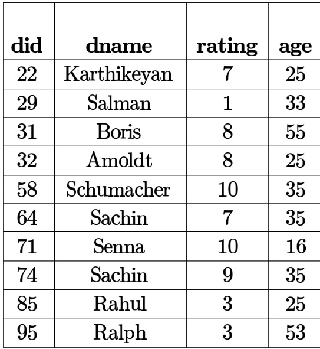

R:Reserves relation   
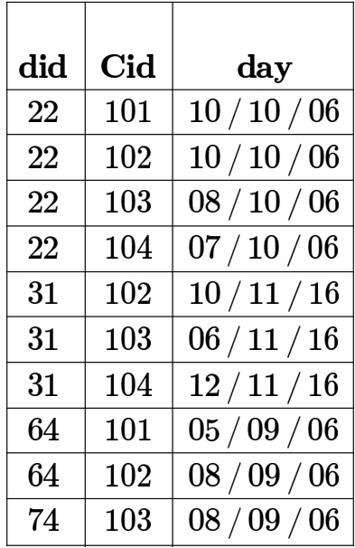

C: Cars relation   
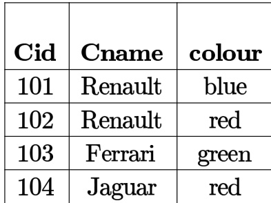

What is the output of the following SQL query?

select D.dname   
from Drivers D   
where D.did in select R.did from Cars C, Reserves R where R.cid ${ \mathsf { \Omega } } = { \mathsf { C } } .$ .cid and C.colour $\mathbf { \Sigma } = \mathbf { \Sigma }$ 'red' intersect select R.did from Cars C, Reserves R where R.cid $\mathbf { \Sigma } = \mathbf { \Sigma }$ C.cid and C.colour $\mathbf { \Sigma } = \mathbf { \Sigma }$ 'green'

A. Karthikeyan, Boris B. Sachin, Salman C. Karthikeyan, Boris, Sachin D. Schumacher, Senna

Consider a database with three relation instances shown below. The primary keys for the Drivers and Cars relation are did and cid respectively and the records are stored in ascending order of these primary keys as given in the tables. No indexing is available in the database.

D:Drivers relation   
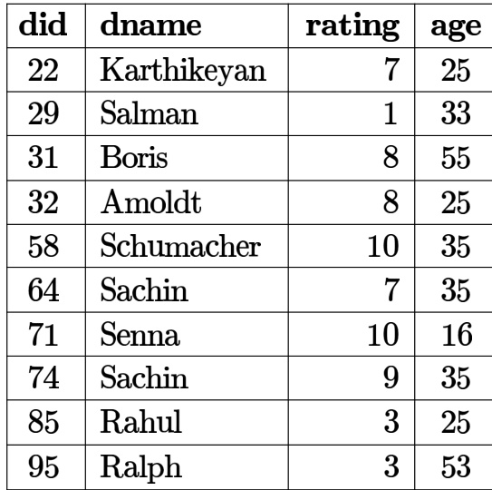

R:Reserves relation   
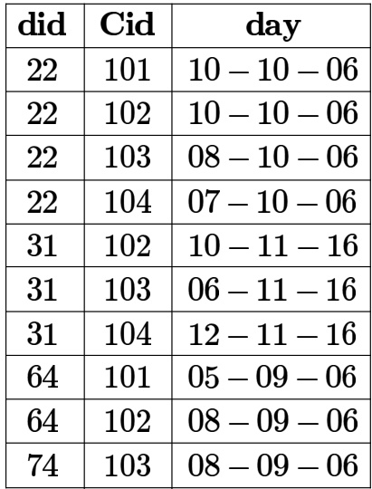

C: Cars relation   
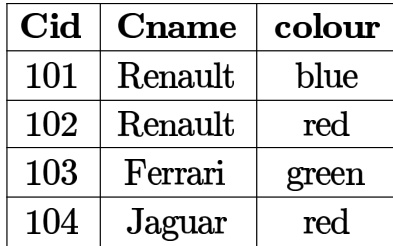

from Cars C, Reserves R   
where R.cid ${ \mathsf { \Omega } } = { \mathsf { C } } .$ .cid and C.colour $\mathbf { \Sigma } = \mathbf { \Sigma }$ 'red'   
intersect   
select R.did   
from Cars C, Reserves R   
where R.cid $\mathbf { \Sigma } = \mathbf { \Sigma }$ C.cid and C.colour $\mathbf { \Sigma } = \mathbf { \Sigma }$ 'green'

Let $n$ be the number of comparisons performed when the above SQL query is optimally executed. If linear search is used to locate a tuple in a relation using primary key, then $n$ lies in the range:

A. B. C. 60-64 D. 100－104

gateit-2006 databases sql normal

# Answer key☟

Consider the following relational schema:

Student(school-id, sch-roll-no sname, saddress) School(school-id sch-name,sch-address,sch-phone Enrolment (school-id,sch-roll-no erollno. examname) ExamResult(erollno examname marks)

What does the following SQL query output?

SELECT sch-name, COUNT (\*)   
FROM School C, Enrolment E, ExamResult R   
WHERE E.school-id $\mathbf { \Sigma } = \mathbf { \Sigma }$ C.school-id   
AND   
E.examname $\mathbf { \Sigma } = \mathbf { \Sigma }$ R.examname AND E.erollno $\mathbf { \Sigma } = \mathbf { \Sigma }$ R.erollno   
AND   
R.marks $= 1 0 0$ AND E.school-id IN (SELECT school-id FROM student GROUP BY school-id HAVING COUNT $( ^ { \star } ) > 2 0 0 ^ { \cdot }$ )   
GROUP By school-id   
A. for each school with more than  students appearing in exams, the name of the school and the number of $1 0 0 s$ scored by its students   
B. for each school with more than  students in it, the name of the school and the number of scored by its students   
C. for each school with more than students in it, the name of the school and the number of its students scoring in at least one exam   
D. nothing; the query has a syntax error

Consider a relational database schema with a relation $R ( A , B , C , D )$ . If $\{ A , B \}$ and $\{ A , C \}$ are the only two candidate keys of the relation $R$ , then the number of superkeys of relation $R$ is (answer in integer)

gatecse-2026-set1 numerical-answers databases super-key two-marks

In a database system, unique timestamps are assigned to each transaction using Lamport's logical Let $T S ( T _ { 1 } )$ and $T S ( T _ { 2 } )$ be the timestamps of transactions $T _ { 1 }$ and $T _ { 2 }$ respectively. Besides, $T _ { 1 }$ holds a lock on the resource $\scriptstyle { \vec { R } }$ and $T _ { 2 }$ has requested a conflicting lock on the same resource $R$ The following algorithm is used to prevent deadlocks in the database system assuming that a killed transaction is restarted with the same timestamp.

$T _ { 1 }$ is killed else $T _ { 2 }$ waits.

Assume any transaction that is not killed terminates eventually. Which of the following is TRUE about the database system that uses the above algorithm to prevent deadlocks?

A. The database system is both deadlock-free and starvation-free.   
B. The database system is deadlock-free, but not starvation-free.   
C. The database system is starvation-free, but not deadlock-free.   
D. The database system is neither deadlock-free nor starvation-free.

# 3.25.1 Transaction and Concurrency: GATE CS Practice Transaction Concurrency Control (DBMS)

We have a table Orders with a specific predicate range query

Q: SELECT FROM Orders WHERE Value $>$ 1000

Transaction $T _ { 1 }$ executes $Q$ and gets 5 rows.   
Transaction $T _ { 2 }$ inserts a new row with Value $= 1 5 0 0$ and Commits.   
Transaction $T _ { 1 }$ executes $Q$ again.   
Under which Isolation Level is it guaranteed that $T _ { 1 }$ will still see exactly 5 rows (i.e., prevent the Phantom Read)?

A. Read Committed B. Repeatable Read C. Serializable D. Both B and C

For the schedule given below, which of the following is correct:

1 Read A   
2 Read B   
3 Write A   
4 Read A   
5 Write A   
6 Write B   
7 Read B   
8 Write B

A. This schedule is serializable and can occur in a scheme using 2PL protocol B. This schedule is serializable but cannot occur in a scheme using 2PL protocol C. This schedule is not serializable but can occur in a scheme using 2PL protocol D. This schedule is not serializable and cannot occur in a scheme using 2PL protocol

gate1999 databases transaction-and-concurrency normal

# 3.25.3 Transaction and Concurrency: GATE CSE 2003 Question: 29, ISRO2009-73

Which of the following scenarios may lead to an irrecoverable error in a database system?

A. A transaction writes a data item after it is read by an uncommitted transaction B. A transaction reads a data item after it is read by an uncommitted transaction C. A transaction reads a data item after it is written by a committed transaction D. A transaction reads a data item after it is written by an uncommitted transaction gatecse-2003 databases transaction-and-concurrency easy isro2009

Consider three data items $D 1 , D 2$ ， and $D 3$ ， and the following execution schedule of transactions $_ { T 1 , T 2 }$ ， and $\mathbf { \delta } _ { T 3 }$ · In the diagram, $R ( D )$ and $W ( D )$ denote the actions reading and writing the data item $D$ respectively.

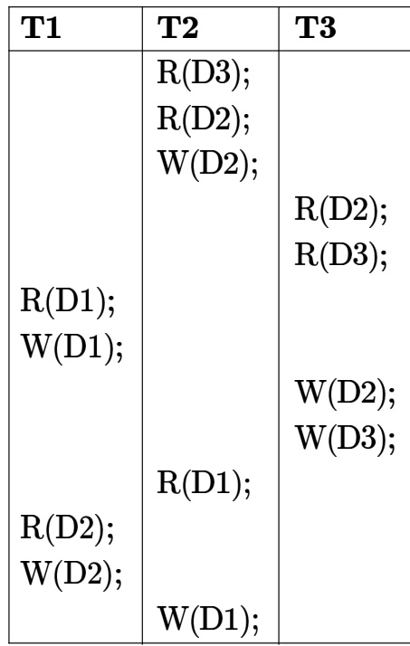

Which of the following statements is correct?

A. The schedule is serializable as $T 2 ; T 3 ; T 1$ B. The schedule is serializable as $T 2 ; T 1 ; T 3$ C. The schedule is serializable as $T 3 ; T 2 ; T 1$ D. The schedule is not serializable

Consider the following log sequence of two transactions on a bank account, with initial balance that transfer  to a mortgage payment and then apply a $5 \%$ interest.

1. T1 start   
2. T1 B old $= 1 2 0 0 0 \mathsf { n e w } = 1 0 0 0 0$   
3. T1 N $\Lambda \mathsf { o l d } = 0 \mathsf { n e w } = 2 0 0 0$   
4. T1 commit   
5. T2 start   
6. T2 B o $\mathsf { I d } = 1 0 0 0 0 \mathsf { n e w } = 1 0 5 0 0$   
7. T2 commit

Suppose the database system crashes just before log record is written. When the system is restarted, which one statement is true of the recovery procedure?

A. We must redo log record  to set B to 10500 B. We must undo log record to set B to and then redo log records and C. We need not redo log records 2 and 3 because transaction T1 has committed D. We can apply redo and undo operations in arbitrary order because they are idempotent

I. -phase locking II. Time-stamp ordering

A. only B. II only C. Both and II D. Neither nor II

gatecse-2010 databases transaction-and-concurrency normal

Consider the following schedule for transactions $T 1 , T 2$ and $\mathbf { \mathit { T 3 } }$

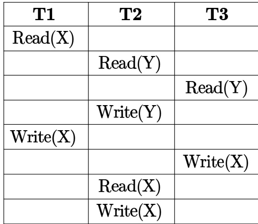

Which one of the schedules below is the correct serialization of the above?

A. $T 1  T 3  T 2$ B. $T 2  T 1  T 3$   
C. $T 2  T 3  T 1$ D. $T 3  T 1  T 2$

gatecse-2010 databases transaction-and-concurrency normal

Consider the following transactions with data items $P$ and $Q$ initialized to zero:

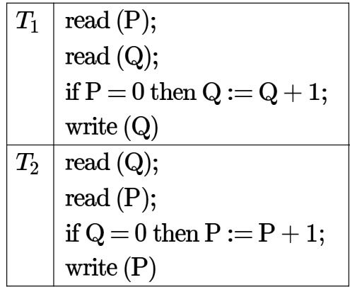

Any non-serial interleaving of T1 and T2 for concurrent execution leads to

A. a serializable schedule   
B. a schedule that is not conflict serializable   
C. a conflict serializable schedule   
D. a schedule for which a precedence graph cannot be drawn

The constraint that the sum of the accounts $x$ and $y$ should remain constant is that of

A. Atomicity B. Consistency C. Isolation D. Durability

gatecse-2015-set2 databases transaction-and-concurrency easy

# 3.25.10 Transaction and Concurrency: GATE CSE 2015 Set 2 Question: 46

Consider a simple checkpointing protocol and the following set of operations in the log.   
(start, T4); (write, T4, y, 2, 3); (start, T1); (commit, T4); (write, T1, z, 5, 7);   
(checkpoint);   
(start, T2); (write, T2, x, 1, 9); (commit, T2); (start, T3); (write, T3, z, 7, 2);   
If a crash happens now and the system tries to recover using both undo and redo operations, what are the contents of the undo list and the redo list?

A. Undo: T3, T1; Redo: T2 B. Undo: T3, T1; Redo: T2, T4   
C. Undo: none; Redo: T2, T4, T3, T1 D. Undo: T3, T1, T4; Redo: T2

gatecse-2015-set2 databases transaction-and-concurrency normal

Consider the partial Schedule $\boldsymbol { S }$ involving two transactions $T 1$ and $T 2$ . Only the and the operations have been shown. The operation on data item $P$ is denoted by $( P )$ and write operation on data item $P$ is denoted by $( P )$ .

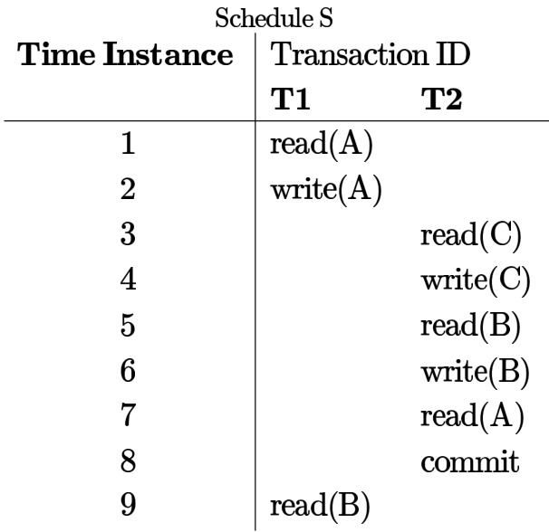

Suppose that the transaction $T 1$ fails immediately after time instance 9. Which of the following statements is correct?

A. $\scriptstyle { T 2 }$ must be aborted and then both $T 1$ and $\mathbf { \mathit { T 2 } }$ must be re-started to ensure transaction atomicity B. Schedule $\boldsymbol { S }$ is non-recoverable and cannot ensure transaction atomicity C. Only $\scriptstyle { T 2 }$ must be aborted and then re-started to ensure transaction atomicity D. Schedule $\boldsymbol { S }$ is recoverable and can ensure transaction atomicity and nothing else needs to be done

A. Atomicity B. Consistency C. Isolation D. Deadlock-freedom

Consider the following two phase locking protocol. Suppose a transaction $T$ accesses (for read or write operations), a certain set of objects $\{ O _ { 1 } , . . . , O _ { k } \}$ . This is done in the following manner:

Step 1. $T$ acquires exclusive locks to $O _ { 1 } , \ldots , O _ { k }$ in increasing order of their addresses. Step . The required operations are performed   
Step 3. All locks are released

This protocol will

A. guarantee serializability and deadlock-freedom B. guarantee neither serializability nor deadlock-freedom C. guarantee serializability but not deadlock-freedom D. guarantee deadlock-freedom but not serializability.

gatecse-2016-set1 databases transaction-and-concurrency normal

# 3.25.14 Transaction and Concurrency: GATE CSE 2016 Set 2 Question: 22

Suppose a database schedule $\boldsymbol { S }$ involves transactions $T _ { 1 } , \ldots , T _ { n }$ Construct the precedence graph of $\boldsymbol { s }$ with vertices representing the transactions and edges representing the conflicts. If $\boldsymbol { S }$ is serializable, which one of the following orderings of the vertices of the precedence graph is guaranteed to yield a serial schedule?

A. Topological order B. Depth-first order C. Breadth-first order D. Ascending order of the transaction indices

gatecse-2016-set2 databases transaction-and-concurrency normal

# 3.25.15 Transaction and Concurrency: GATE CSE 2016 Set 2 Question: 51

Consider the following database schedule with two transactions $T _ { 1 }$ and $T _ { 2 }$ .

$S = r _ { 2 } \left( X \right) ; r _ { 1 } \left( X \right) ; r _ { 2 } \left( Y \right) ; w _ { 1 } \left( X \right) ; r _ { 1 } \left( Y \right) ; w _ { 2 } \left( X \right) ; a _ { 1 } ; a _ { 2 }$   
Where $r _ { i } ( Z )$ denotes a read operation by transaction $T _ { i }$ on a variable $Z$ , $w _ { i } ( Z )$ denotes a write operation by $T _ { i }$ on a variable $Z$ and $a _ { i }$ denotes an abort by transaction $T _ { i }$ .

Which one of the following statements about the above schedule is TRUE?

A. $\boldsymbol { S }$ is non-recoverable. B. $\boldsymbol { s }$ is recoverable, but has a cascading abort.   
C. $\boldsymbol { s }$ does not have a cascading D. $\boldsymbol { S }$ is strict. abort.

gatecse-2016-set2 databases transaction-and-concurrency normal

# 3.25.16 Transaction and Concurrency: GATE CSE 2019 Question: 11

Consider the following two statements about database transaction schedules:

I. Strict two-phase locking protocol generates conflict serializable schedules that are also recoverable. II. Timestamp-ordering concurrency control protocol with Thomas’ Write Rule can generate view serializable schedules that are not conflict serializable

Which of the above statements is/are TRUE?

A. I only B. II only C. Both and II D. Neither nor II

Suppose a database system crashes again while recovering from a previous crash. Assume checkpointing s not done by the database either during the transactions or during recovery.

Which of the following statements is/are correct?

AB. The same undo and redo list will be used while recovering again The system cannot recover any further   
C. All the transactions that are already undone and redone will not be recovered again   
D. The database will become inconsistent

gatecse-2021-set1 multiple-selects databases transaction-and-concurrency one-mark

# 3.25.18 Transaction and Concurrency: GATE CSE 2024 Set 2 Question: 9

Once the  informs the user that a transaction has been successfully completed, its effect should persist even if the system crashes before all its changes are reflected on disk. This property is called

A. durability B. atomicity C. consistency D. isolation

gatecse-2024-set2 databases transaction-and-concurrency easy one-mark

# 3.25.19 Transaction and Concurrency: GATE CSE 2025 Set 1 Question: 5

A schedule of three database transactions $T _ { 1 } , T _ { 2 }$ , and $T _ { 3 }$ is shown. ${ \cal { R } } _ { i } ( A )$ and $W _ { i } ( A )$ denote read and write of data item $A$ by transaction $T _ { i } , i = 1 , 2 , 3$ . The transaction $T _ { 1 }$ aborts at the end. Which other transaction(s) will be required to be rolled back?

$$
R _ { 1 } ( X ) W _ { 1 } ( Y ) R _ { 2 } ( X ) R _ { 2 } ( Y ) R _ { 3 } ( Y ) \mathrm { A B O R T } ( T _ { 1 } )
$$

A. Only $T _ { 2 }$ B. Only $T _ { 3 }$ C. Both $T _ { 2 }$ and $T _ { 3 }$ D. Neither $T _ { 2 }$ nor $T _ { 3 }$

gatecse2025-set1 databases transaction-and-concurrency one-mark

# 3.25.20 Transaction and Concurrency: GATE CSE 2025 Set 2 Question: 17

An audit of a banking transactions system has found that on an earlier occasion, two joint holders of account $A$ attempted simultaneous transfers of Rs. each from account $A$ to account $B$ . Both transactions read the same value, Rs. , as the initial balance in $A$ and were allowed to go through. $B$ was credited Rs. twice. $A$ was debited only once and ended up with a balance of Rs. .

Which of the following properties is/are certain to have been violated by the system?

A. Atomicity B. Consistency C. Isolation D. Durability gatecse2025-set2 databases transaction-and-concurrency multiple-selects one-mark

# 3.25.21 Transaction and Concurrency: GATE CSE 2026 Set 2 Question: 10

Consider concurrent execution of two transactions $T 1$ and $\mathbf { \mathit { T 2 } }$ in a DBMS, both of which access a data object $A$ . For these two transactions to not conflict on $A$ , which one of the following statements must be true?

A. Both $_ { T 1 }$ and $\mathbf { \mathit { T 2 } }$ only read $A$ B. $_ { T 1 }$ reads $A$ and $\scriptstyle { T 2 }$ writes $A$ C. writes $A$ and $\mathbf { \mathit { T 2 } }$ reads $A$ D. Both $T 1$ and $\scriptstyle { T 2 }$ write $A$

gatecse-2026-set2 databases transaction-and-concurrency one-mark

Which level of locking provides the highest degree of concurrency in a relational database ?

A. Page   
B. Table   
C. Row   
D. Page, table and row level locking allow the same degree of concurrency

gateit-2004 databases normal transaction-and-concurrency

Consider the following schedule $\boldsymbol { S }$ of transactions $T 1$ and $T 2$

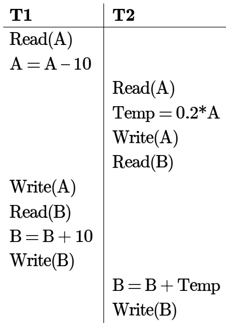

Which of the following is TRUE about the schedule $\boldsymbol { S }$ ?

A. $\boldsymbol { S }$ is serializable only as $T 1 , T 2$ B. $\boldsymbol { S }$ is serializable only as C. $\boldsymbol { S }$ is serializable both as $T 1$ ， $T 2$ and $T 2 , T 1$ D. $\boldsymbol { S }$ is not serializable either as $T 1 , T 2$ or as $T 2 , T 1$ gateit-2004 databases transaction-and-concurrency normal

A company maintains records of sales made by its salespersons and pays them commission based on each individual's total sales made in a year. This data is maintained in a table with following schema:

salesinfo $\mathbf { \sigma } = \mathbf { \sigma }$ (salespersonid, totalsales, commission)   
In a certain year, due to better business results, the company decides to further reward its salespersons by   
enhancing the commission paid to them as per the following formula:   
If commission $\leq 5 0 0 0 0$ ， enhance it by $2 \%$   
If $5 0 0 0 0 <$ commission $\leq 1 0 0 0 0 0$ enhance it by $4 \%$   
If commission $> 1 0 0 0 0 0$ ， enhance it by $6 \%$   
The IT staff has written three different SQL scripts to calculate enhancement for each slab, each of these scripts is   
to run as a separate transaction as follows:   
T1 Update salesinfo Set commission $\mathbf { \Sigma } = \mathbf { \Sigma }$ commission \* 1.02 Where commission $< = 5 0 0 0 0$ ;   
T2 Update salesinfo Set commission $\mathbf { \Sigma } = \mathbf { \Sigma }$ commission $^ { \star }$ 1.04 Where commission $> 5 0 0 0 0$ and commission is $< = 1 0 0 0 0 0$ ;   
T3 Update salesinfo Set commission $\mathbf { \Sigma } = \mathbf { \Sigma }$ commission $^ { \star }$ 1.06 Where commission > 100000;

Which of the following options of running these transactions will update the commission of all salespersons correctly

A. Execute T1 followed by T2 followed by T3 B. Execute T2, followed by T3; T1 running concurrently throughout C. Execute T3 followed by T2; T1 running concurrently throughout D. Execute T3 followed by T2 followed by T1

Consider the following two transactions $T 1$ and $T 2$ ：

T1: read (A); T2 : read (B); read (B); read (A); If $A = 0$ then $B \gets B + { \bf 1 }$ ； If $B \neq 0$ then $A  A { - } 1$ ； write (B)； write (A);

B.

S1: lock S(A); S2: lock S(B); read (A); read (B); lock S(B); lock S(A); read (B); read (A); If $A = 0$ If $B \neq 0$ then $B \gets B + { \bf 1 }$ ； then $A  A - 1$ ； write (B); write (A); commit; commit; unlock (A); unlock (B); unlock (B); unlock (A);   
S1: lock X(A); S2 : lock X(B); read (A); read (B); lock X(B); lock X(A); read (B); read (A); If $A = 0$ If $B \neq 0$ then $B \gets B + { \bf 1 }$ ； then $A  A - 1$ ； write (B); write (A); unlock (A); unlock (A); commit; commit; unlock (B); unlock (A);   
S1: lock S(A); S2: lock S(B); read (A); read (B); lock X(B); lock X(A); read (B); read (A); If $A = 0$ If $B \neq 0$ then $B \gets B + { \bf 1 }$ ； then $A  A - 1$ ； write (B); write (A); unlock (A); unlock (B); commit; commit; unlock (B); unlock (A);   
S1 : lock S(A); S2 : lock S(B); read (A); read (B); lock X(B); lock X(A); read (B); read (A); If $A = 0$ If $B \neq 0$ then $B \gets B + { \bf 1 }$ ； then $A  A - 1$ ； write (B); write (A); unlock (A); unlock (A); unlock (B); unlock (A); commit; commit;

C.

D.

Consider the following three schedules of transactions T1, T2 and T3. [Notation: In the following NYO represents the action Y (R for read, W for write) performed by transaction N on object O.]

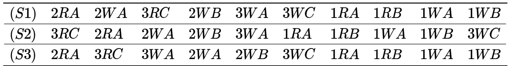

Which of the following statements is TRUE?

A. S1, S2 and S3 are all conflict equivalent to each other B. No two of S1, S2 and S3 are conflict equivalent to each other C. S2 is conflict equivalent to S3, but not to S1 D. S1 is conflict equivalent to S2, but not to S3

# 3.26.1 Tuple Relational Calculus: GATE CSE 2025 Set 1 Question: 29

Consider two relations describing teams and players in a sports league:

teams(tid, tname): tid, tname are team-id and team-name, respectively   
players(pid,pname,tid): pid, pname, and tid denote player-id, playername and the team-id of the player,   
respectively

Which ONE of the following tuple relational calculus queries returns the name of the players who play for the team having tname as MI' ?

$$
\begin{array} { r l } & { \mathsf { p n a m e } | p \in \mathsf { p l a y e r s } \land \exists t ( t \in \mathsf { t e a m s } \land p . t i d = t . t i d \land t . t n a m e = ^ { \prime } M I ^ { \prime } ) \} } \\ & { \mathsf { p n a m e } | p \in \mathsf { t e a m s } \land \exists t ( t \in \mathsf { p l a y e r s } \land p . t i d = t . t i d \land t . t n a m e = ^ { \prime } M I ^ { \prime } ) \} } \\ & { \mathsf { p n a m e } | p \in \mathsf { p l a y e r s } \land \exists t ( t \in \mathsf { t e a m s } \land t . \mathsf { t n a m e } = ^ { \prime } M I ^ { \prime } ) \} } \\ & { \mathsf { p n a m e } | p \in \mathsf { t e a m s } \land \exists t ( t \in \mathsf { p l a y e r s } \land t . \mathsf { t n a m e } = ^ { \prime } M I ^ { \prime } ) \} } \end{array}
$$

Consider a relational database schema with two relations $R ( P , Q )$ and $S ( X , Y )$ . Let $E = \{ \langle u \rangle \mid \exists v \exists w \langle u , v \rangle \in R \land \langle v , w \rangle \in S \}$ be a tuple relational calculus expression. Which one of the following relational algebraic expressions is equivalent to $E$ ?

A. $\Pi _ { P } \left( R \Join _ { R . P = S . X } S \right)$ $\begin{array} { r } { \mathsf { B } . ~ \Pi _ { P } \left( S \Join _ { S . X = R . Q } R \right) } \\ { \mathsf { D } . ~ \Pi _ { P } \left( S \Join _ { S . Y = R . Q } \ R \right) } \end{array}$   
C. $\bar { \Pi _ { P } } \dot { ( } R \Join$

gatecse-2026-set1 databases two-marks tuple-relational-calculus

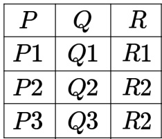

Y

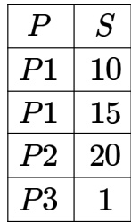

Consider that the following tuple relational calculus expression is evaluated.

$$
\{ t \mid t \in X \land \exists z \in X ( t [ P ] = z [ P ] ) \land \exists m \in Y ( m [ P ] = t [ P ] \land m [ S ] > 1 ) \}
$$

The number of tuples that will be returned is (Answer in integer)

​Which of the following statements about the Two Phase Locking ( ) protocol is/are TRUE?

A. permits only serializable schedules   
B. With , a transaction always locks the data item being read or written just before every operation and always releases the lock just after the operation   
C. With , once a lock is released on any data item inside a transaction, no more locks on any data item can be obtained inside that transaction   
D. A deadlock is possible with

# Answer Keys

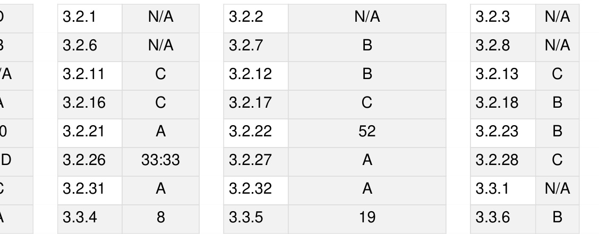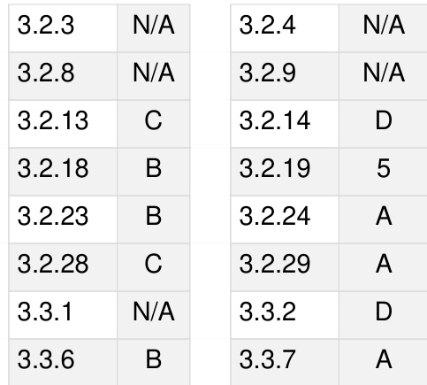

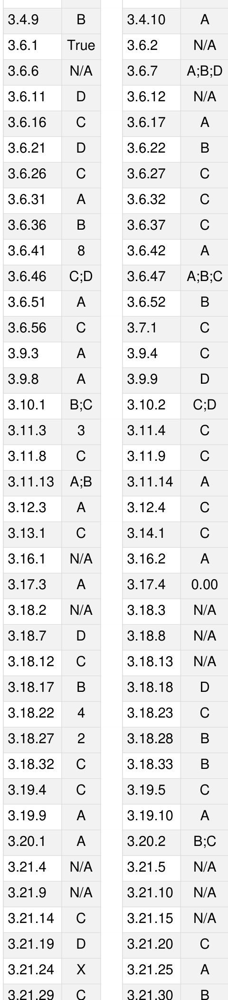

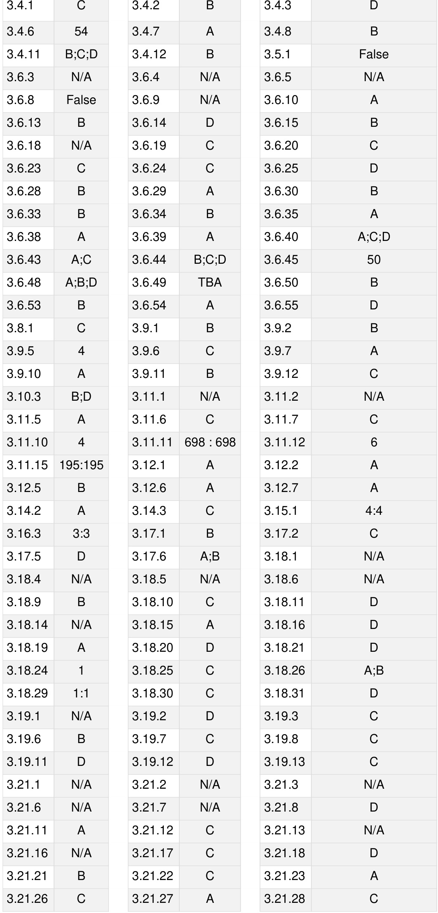

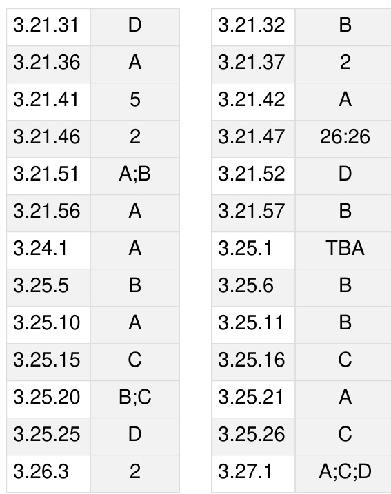

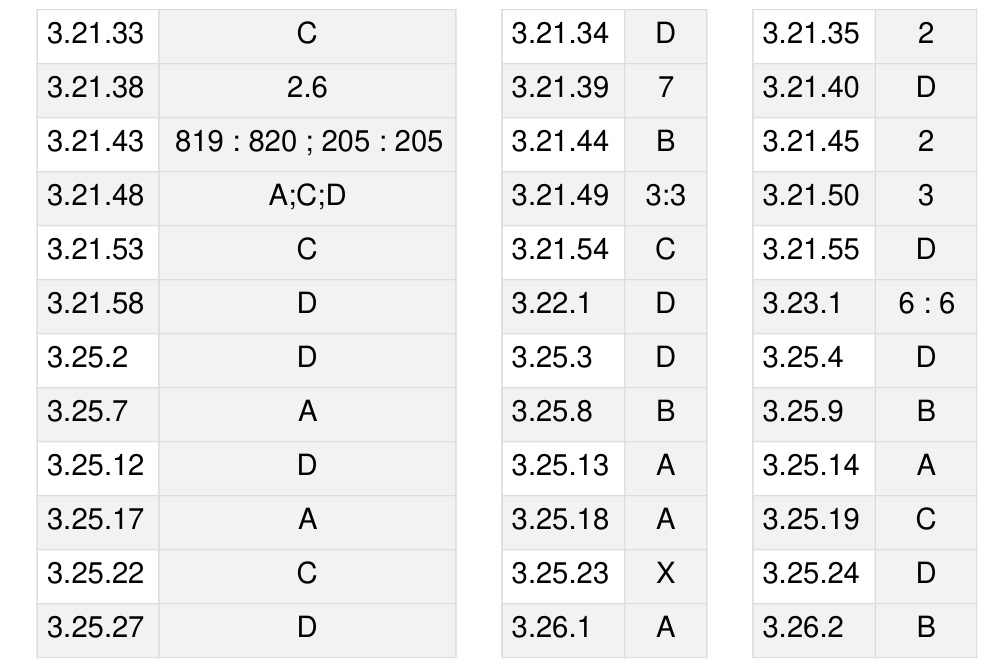

Boolean algebra. Combinational and sequential circuits. Minimization. Number representations and computer arithmetic (fixed and floating point)

MarkDistributioninPrevious GATE   
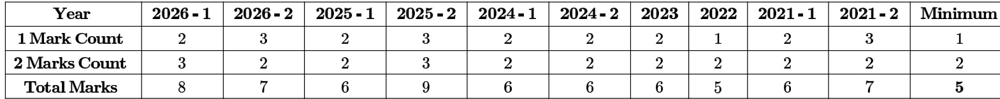

Welcome to the "Digital Logic" chapter of your GATE Computer Science exam preparation. This foundational subject is the bedrock of computer hardware, providing the essential understanding of how digital circuits process information, store data, and execute instructions. It delves into the fundamental building blocks of modern computing systems, from basic logic gates to complex sequential circuits and memory elements. A strong grasp of Digital Logic is crucial not only for direct questions in the GATE exam but also for understanding related concepts in Computer Architecture, Operating Systems, and even some aspects of programming. Typically, Digital Logic carries a weightage of 8-12 marks in the GATE CS paper, with questions ranging from conceptual understanding and circuit analysis to design problems involving minimization, number representation, and sequential circuit behavior. Questions often include Multiple Choice Questions (MCQs), Multiple Select Questions (MSQs), and Numerical Answer Type (NAT) questions, testing both theoretical knowledge and problem-solving skills.

# Topic-wise Key Concepts

# Adder

An adder is a digital circuit that performs the addition of numbers. It is a fundamental component in Arithmetic Logic Units (ALUs) of processors.

. Half Adder (HA): Adds two single-bit binary numbers. It produces a sum (S) and a carry-out (Cout). Formulas:

$$
\begin{array} { c } { { S = A \oplus B } } \\ { { C _ { o u t } = A \cdot B } } \end{array}
$$

Full Adder (FA): Adds three single-bit binary numbers (two input bits and a carry-in). It produces a sum (S) and a   
carry-out (Cout). Formulas:

$$
\begin{array} { c } { S = A \oplus B \oplus C _ { i n } } \\ { C _ { o u t } = ( A \cdot B ) + ( C _ { i n } \cdot ( A \oplus B ) ) } \\ { \gamma _ { o u t } = ( A \cdot B ) + ( B \cdot C _ { i n } ) + ( C _ { i n } \cdot A ) } \end{array}
$$

Ripple Carry Adder: An n-bit adder constructed by cascading $\mathsf { n }$ full adders, where the carry-out of one stage   
becomes the carry-in of the next. Propagation Delay: The total delay is proportional to n, as carry ripples through all stages. ${ T _ { r i p p l e } = n \times T _ { F A \_ c a r r y } }$   
Carry Look-Ahead Adder (CLA): A faster adder that generates carries in parallel, reducing propagation delay. It   
uses carry generate $( \mathsf { G } )$ and carry propagate (P) signals. Formulas for a single stage i:

$$
\begin{array} { c } { P _ { i } = A _ { i } \oplus B _ { i } } \\ { G _ { i } = A _ { i } \cdot B _ { i } } \\ { S _ { i } = P _ { i } \oplus C _ { i } } \\ { C _ { i + 1 } = G _ { i } + ( P _ { i } \cdot C _ { i } ) } \end{array}
$$

。 For a 4-bit CLA:

$$
C _ { 1 } = G _ { 0 } + P _ { 0 } C _ { 0 }
$$

$$
C _ { 2 } = G _ { 1 } + P _ { 1 } C _ { 1 } = G _ { 1 } + P _ { 1 } G _ { 0 } + P _ { 1 } P _ { 0 } C _ { 0 }
$$

$$
\begin{array} { r } { \begin{array} { r l } & { C _ { 3 } = G _ { 2 } + P _ { 2 } C _ { 2 } = G _ { 2 } + P _ { 2 } G _ { 1 } + P _ { 2 } P _ { 1 } G _ { 0 } + P _ { 2 } P _ { 1 } P _ { 0 } C _ { 0 } } \\ { \smallskip } & { \smallskip } \end{array} } \\ { C _ { 3 } = G _ { 2 } - C  { 2 } C _ { 2 } = G _ { 2 } + P _ { 2 }  { 2 } D  { 2 } C _ { 1 } \textsuperscript { \prime } D  { 2 } D  { 2 } C _ { 1 } \textsuperscript { \prime } D  { 2 } D  { 2 } D  { 2 } } \end{array}
$$

$$
C _ { 4 } = G _ { 3 } + P _ { 3 } C _ { 3 } = G _ { 3 } + P _ { 3 } G _ { 2 } + P _ { 3 } P _ { 2 } G _ { 1 } + P _ { 3 } P _ { 2 } P _ { 1 } G _ { 0 } + P _ { 3 } P _ { 2 } P _ { 1 } P _ { 0 } C _ { 0 }
$$

Common Pitfalls: Confusing half adder and full adder functionality. Incorrectly calculating propagation delay for ripple carry vs. CLA. Problem-solving: Be able to draw and analyze basic adder circuits. Calculate delays for different adder types.

# Array Multiplier

An array multiplier is a combinational circuit that performs multiplication of two binary numbers using an array of full adders and AND gates. It's a direct hardware implementation of the traditional "paper-and-pencil" multiplication method.

Core Idea: For two n-bit numbers, it requires n rows of partial products. Each partial product is generated by ANDing the multiplicand with one bit of the multiplier. These partial products are then summed using an array of adders (often full adders) in a staggered fashion.   
Structure: An n x m bit array multiplier typically uses $\mathsf { n } ^ { \star } \mathsf { m }$ AND gates to generate partial products and $( n - 1 ) ^ { \star } \mathsf { m }$ full adders (or similar) to sum them.   
Delay: The delay is proportional to $n { + } m$ , as carries propagate diagonally across the array.   
Problem-solving: Understand how partial products are formed and summed. Be able to trace the data flow for small examples.

# Binary Codes

Binary codes are systems used to represent numbers, characters, and instructions in digital systems using binary digits (bits).

Weighted Codes: Each bit position has a specific weight. BCD (8421): Each decimal digit is represented by its 4-bit binary equivalent. E.g., $( 9 ) _ { 1 0 } = ( 1 0 0 1 ) _ { B C D }$ . $( 2 5 ) _ { 1 0 } = ( 0 0 1 0 0 1 0 1 ) _ { B C D }$ . Excess-3: BCD code with 3 added to each digit. Self-complementing. 2421 Code: Another weighted code.

Non-Weighted Codes: Bit positions do not have fixed weights. Gray Code: Only one bit changes between successive numbers. Used to prevent glitches in ADCs and K-maps. Binary to Gray: $G _ { i } = B _ { i } \oplus B _ { i + 1 }$ (for MSB to LSB, $G _ { n - 1 } = B _ { n - 1 }$ , $G _ { i } = B _ { i } \oplus B _ { i + 1 }$ for $i < n - 1 )$ . More commonly: $G _ { i } = B _ { i } \oplus B _ { i + 1 }$ , with $B _ { n } = 0$ for the MSB. Correct: $G _ { M S B } = B _ { M S B }$ , $G _ { i } = B _ { i } \oplus B _ { i + 1 }$ for $i$ from MSB-1 down to 0. Alternative: $G _ { i } = B _ { i } \oplus B _ { i - 1 }$ for $i > 0$ , $G _ { 0 } = B _ { 0 }$ . Example: Binary 1011 $( 1 1 ) $ Gray: $G _ { 3 } = 1 , G _ { 2 } = 1 \oplus 0 = 1 , G _ { 1 } = 0 \oplus 1 = 1 ,$ ， $G _ { 0 } = { \bf 1 } \oplus { \bf 1 } = { \bf 0 }$ . So 1110. Gray to Binary: $B _ { M S B } = G _ { M S B }$ , $B _ { i } = G _ { i } \oplus B _ { i + 1 }$ (for MSB to LSB). Correct: $B _ { i } = G _ { i } \oplus B _ { i + 1 }$ for $_ i$ from MSB-1 down to 0, $B _ { M S B } = G _ { M S B }$ GMSB. Example: Gray 11 $1 0 $ Binary: $B _ { 3 } = 1 , B _ { 2 } = 1 \oplus 1 = 0 , B _ { 1 } = 1 \oplus 0 = 1 , B _ { 0 } = 0 \oplus 1 = 1$ . So 1011.

ASCII: 7-bit or 8-bit code for characters.

中 Error Detection Codes (Parity): Adds an extra bit to detect single-bit errors. 。 Even Parity: Total number of 1s (including parity bit) is even. Odd Parity: Total number of 1s (including parity bit) is odd.   
Error Correction Codes (Hamming Code): Can detect and correct multiple-bit errors.   
Common Pitfalls: Confusing BCD with pure binary. Incorrectly converting between binary and Gray code.   
Problem-solving: Perform conversions between different binary codes.

# Boolean Algebra

Boolean algebra is a mathematical system for analyzing and simplifying digital circuits. It deals with binary variables and logical operations.

# Basic Postulates:

1. Closure: $A + B$ and $A \cdot B$ are in $\{ 0 , 1 \}$ .   
2. Commutative: $A + B = B + A ,$ $\boldsymbol { A } \cdot \boldsymbol { B } = \boldsymbol { B } \cdot \boldsymbol { A }$ .   
3. Associative: $A + ( B + C ) = ( A + B ) + C , A \cdot ( B \cdot C ) = ( A \cdot B ) \cdot C .$   
4. Distributive: $A \cdot ( B + C ) = ( A \cdot B ) + ( A \cdot C ) , A + ( B \cdot C ) = ( A + B ) \cdot ( A + C ) .$   
5. Identity: $A + 0 = A$ , $A \cdot 1 = A$ .   
6. Complement: $A + { \bar { A } } = 1$ , $A \cdot { \bar { A } } = 0$ .

Theorems and Identities:

Idempotence: $A + A = A$ , $A \cdot A = A$ . Absorption: $A + ( A \cdot B ) = A , A \cdot ( A + B ) = A .$   
Consensus: $( A \cdot B ) + ( \bar { A } \cdot C ) + ( B \cdot C ) = ( A \cdot B ) + ( \bar { A } \cdot C )$ . (If $_ { B \cdot C }$ is redundant).   
。 De Morgan's Laws: ${ \overline { { A + B } } } = { \bar { A } } \cdot { \bar { B } }$ , ${ \overline { { A \cdot B } } } = { \bar { A } } + { \bar { B } }$ .   
Involution: ${ \overline { { \bar { A } } } } = A$ .   
Null Elements: $A + 1 = 1$ , $A \cdot 0 = 0$ . Common Pitfalls: Forgetting the dual of De Morgan's Law. Incorrectly applying consensus theorem.   
Problem-solving: Simplify Boolean expressions using theorems. Prove identities.

# Booths Algorithm

Booth's algorithm is a multiplication algorithm that multiplies two signed binary numbers in 2's complement representation. It is efficient for numbers with long sequences of 0s or 1s.

Core Idea: Instead of adding partial products for every '1' in the multiplier, it looks at pairs of bits in the multiplier. $0 0  \mathsf { N o }$ operation $0 ^ { \star }$ multiplicand). $0 1  \mathsf { A d d }$ multiplicand.   
C ${ \bf 1 0 } $ Subtract multiplicand (add 2's complement).   
r $. 1 1  \mathsf { N o }$ operation $0 ^ { \star }$ multiplicand).

Steps:

1. Initialize Product (P) to 0, Multiplicand (M), Multiplier $( \mathsf { Q } )$ , and an extra bit $Q _ { - 1 } = 0$ .

2. Repeat n times (where n is the number of bits in $\mathsf { Q }$ ): Examine $Q _ { 0 } Q _ { - 1 }$ : If : $P = P + M$ . If : $P = P - M$ (add 2's complement of M). If  or : No operation. Arithmetic Right Shift (ASHR) the combined registe

3. The final product is in $P Q$ .

Common Pitfalls: Incorrectly performing 2's complement subtraction. Errors in arithmetic right shift (especially for negative numbers). Forgetting the $Q _ { - 1 }$ bit.   
Problem-solving: Trace the algorithm step-by-step for given signed numbers.

# Canonical Normal Form

Canonical normal forms are standard forms for Boolean expressions, ensuring uniqueness for a given function. They are useful for comparison and synthesis.

Canonical Sum of Products (SOP) Minterm Canonical Form: A sum of minterms. Each minterm is a product   
term where all variables appear exactly once, either in true or complemented form. 。 A minterm is 1 for exactly one combination of inputs. Example: For $F ( A , B ) = A + B$ , minterms are ${ \bar { A } } B , A { \bar { B } }$ ， $A B$ . So $F ( A , B ) = \bar { A } B + A \bar { B } + A B .$ 。 Notation: $\sum m ( i , j , k , \dots )$ , where i, j, $\boldsymbol { \mathsf { k } }$ are decimal equivalents of minterms.   
Canonical Product of Sums (POS) Maxterm Canonical Form: A product of maxterms. Each maxterm is 5 sum   
term where all variables appear exactly once, either in true or complemented form. 。 A maxterm is 0 for exactly one combination of inputs. Example: For $F ( A , B ) = A \cdot B$ , maxterms are $A + B , A + \bar { B } , \bar { A } + B$ . So $F ( A , B ) = ( A + B ) \cdot ( A + \bar { B } ) \cdot ( \bar { A } + B )$ . 。 Notation: $\prod { \dot { M } } ( i , j , k , \dots )$ , where i, j, k are decimal equivalents of maxterms.   
Relationship: If $\begin{array} { r } { F = \sum m ( i , j , k ) } \end{array}$ , then $\scriptstyle { \bar { F } } = \sum m ( { \mathrm { o t h e r ~ i n d i c e s } } )$ . Also, $F { } = \prod { M } ( { \mathrm { o t h e r ~ i n d i c e s } } ) .$ .   
Common Pitfalls: Confusing minterms with maxterms, and their corresponding sum/product forms. Incorrectly   
converting between SOP and POS canonical forms.   
Problem-solving: Convert truth tables to canonical SOP/POS. Convert between canonical SOP and POS.

# Carry Generator

A carry generator is a combinational circuit used in adders, particularly in Carry Look-Ahead Adders, to quickly compute carry bits, thereby speeding up addition.

Core Idea: It uses generate $( \mathsf { G } )$ and propagate (P) signals to calculate carries in parallel, rather than waiting for   
them to ripple. $G _ { i } = A _ { i } \cdot B _ { i }$ (carry is generated if both input bits are 1). $, P _ { i } = A _ { i } \oplus B _ { i }$ (carry is propagated if one input bit is 1). $C _ { i + 1 } = G _ { i } + ( P _ { i } \cdot C _ { i } )$ (carry out is generated or propagated from carry in).   
Look-ahead Logic: For a 4-bit block, the carry out $C _ { 4 }$ can be expressed directly in terms of $C _ { 0 }$ and the $G _ { i } , P _ { i }$   
terms, as shown in the Adder section.   
Problem-solving: Derive carry equations for multi-bit carry look-ahead blocks.

# Circuit Output

The circuit output refers to the final value(s) produced by a digital circuit based on its inputs and internal logic. It can be a single bit or a multi-bit word.

Combinational Circuits: Output depends only on the present inputs.   
Sequential Circuits: Output depends on present inputs and past inputs (stored state).   
Analysis: For a given circuit diagram, determine the Boolean expression for the output(s) in terms of the inputs.   
Problem-solving: Derive truth tables or Boolean expressions from circuit diagr ams. Evaluate output for specific input combinations.

# Combinational Circuit

A combinational circuit is a type of digital circuit whose output depends solely on the current values of its inputs. It has no memory elements.

# Characteristics:

。 No feedback loops. Output changes instantaneously with input changes (after propagation delay). Examples: Adders, Subtractors, Decoders, Encoders, Multiplexers, Demultiplex

Design Steps:   
1. Define the problem (inputs, outputs).   
2. Derive the truth table.   
3. Obtain simplified Boolean expressions (K-map, Quine-McCluskey).   
4. Draw the logic diagram.   
Common Pitfalls: Confusing combinational with sequential circuits. Overlooking propagation delays in timing analysis.   
Problem-solving: Design circuits from specifications. Analyze existing circuits.

# Conjunctive Normal Form

Conjunctive Normal Form (CNF) is a standardized way of writing Boolean expressions as a conjunction (AND) of clauses, where each clause is a disjunction (OR) of literals.

Core Idea: A product of sums (POS) form where each sum term (clause) contains one or more literals. It is not necessarily canonical (i.e., not all variables need to be present in each clause).   
Example: $( A + { \bar { B } } ) \cdot ( { \bar { A } } + C )$ .   
Relationship to Canonical POS: Canonical POS (maxterm form) is a specific type of CNF where each clause is a maxterm (contains all variables).   
Problem-solving: Convert Boolean expressions to CNF.

# Decoder

A decoder is a combinational circuit that converts n input lines into $2 ^ { n }$ output lines. Only one output line is active (high or low) at any given time, corresponding to the binary value of the inputs.

Types: 。 Binary Decoder (n-to- $\cdot 2 ^ { n }$ ): E.g., 2-to-4 decoder, 3-to-8 decoder. 0 BCD-to-7 Segment Decoder: Converts BCD input to control a 7-segment display.   
Enable Input: Most decoders have an enable input (E). If E is inactive, all outputs are inactive.   
Applications: Memory address decoding, data demultiplexing, implementing Boolean functions. A n n-to- decoder can implement any n-variable Boolean function by ORing the appropriate minterms.   
Common Pitfalls: Incorrectly interpreting active-high vs. active-low outputs.   
Problem-solving: Design decoders. Use decoders to implement Boolean functions.

# Digital Circuits

Digital circuits are electronic circuits that operate on discrete voltage levels, typically representing binary 0 and 1. They form the basis of all modern digital systems.

# Categories:

Combinational Circuits: Output depends only on current inputs (e.g., gates, adders, decoders). Sequential Circuits: Output depends on current inputs and past inputs (memory elements) (e.g., flip-flops, counters, registers). Logic Gates: AND, OR, NOT, NAND, NOR, XOR, XNOR are the basic building blocks. Key Properties: Speed (propagation delay), Power Consumption, Fan-in/Fan-out, Noise Margin. Problem-solving: Analyze and design circuits using logic gates.

# Digital Counter

A digital counter is a sequential circuit that cycles through a predefined sequence of states upon receiving input clock pulses. It's essentially a register that increments or decrements its stored value.

# Types:

。 Asynchronous (Ripple) Counter: Flip-flops are cascaded, and the output of one FF clocks the next. Simple to design but suffers from propagation delay. Synchronous Counter: All flip-flops are clocked simultaneously by a common clock pulse. More complex design but faster and more reliable. Up/Down Counter: Can count in increasing or decreasing order. Mod-N Counter: Counts from 0 to N-1 and then resets. Design: Involves state diagrams, state tables, flip-flop excitation tables, and K-maps for logic minimization. Formulas: For an n-bit counter, it can count up to $2 ^ { n }$ states (0 to $2 ^ { n } - 1 )$ ). Common Pitfalls: Incorrectly determining the modulus of a counter. Errors in state table derivation or K-map minimization for synchronous counters. Problem-solving: Analyze existing counter circuits. Design synchronous counters for specific sequences.

# Dual Function

The dual of a Boolean expression is obtained by interchanging OR and AND operations, and 0s and 1s. Variables and their complements remain unchanged.

# Procedure:

1. Replace all $" + "$ with '.' (OR with AND).   
23. Replace all '.' with $" + "$ (AND with OR).   
Replace all $" 0 "$ with '1'.   
4. Replace all '1' with $" 0 "$ .   
Example: Dual of $F = A \cdot B + 0$ is $F ^ { D } = ( A + B ) \cdot 1 .$ .   
Principle of Duality: If a Boolean identity is true, its dual is also true.   
Common Pitfalls: Accidentally complementing variables when finding the dual.   
Problem-solving: Find the dual of a given Boolean expression.

# Finite State Machines (FSM)

Finite State Machines (FSMs) are mathematical models of computation used to design sequential circuits. They consist of a finite number of states, transitions between states, and actions based on inputs.

Components: States, Inputs, Outputs, Transitions.   
Types: 。 Mealy Machine: Output depends on the present state AND the present input. 0 Moore Machine: Output depends only on the present state.   
Representation: State diagrams, state tables.   
Design Steps: 1. State Diagram.   
2. State Table.   
3. State Assignment (binary encoding).   
4. Flip-flop excitation table.   
5. K-maps for input equations and output equations.   
6. Logic diagram.   
Common Pitfalls: Confusing Mealy and Moore outputs. Errors in state assignment or deriving excitation equations.   
Problem-solving: Design FSMs from specifications. Analyze given FSMs.

# Fixed Point Representation

Fixed-point representation is a method of representing real numbers where the position of the binary point (radix point) is fixed. It's used for numbers with a limited range and high precision.

Format: $I . F$ where I is the integer part and F is the fractional part. For an n-bit number with $\boldsymbol { \mathsf { k } }$ bits for the fractional part, the range is to $2 ^ { n - k - 1 } - 2 ^ { - k }$ (for signed 2's complement). Value: $\scriptstyle \sum _ { i = - ( k ) } ^ { n - k - 1 } b _ { i } 2 ^ { i }$ .   
Signed Fixed-Point: Typically uses 2's complement for negative numbers.   
Common Pitfalls: Incorrectly determining the range or precision for a given bit allocation.   
Problem-solving: Convert decimal numbers to fixed-point binary and vice-versa. Perform arithmetic operations.

# Flip Flop

A flip-flop is a basic 1-bit memory element (sequential circuit) that can store a binary value (0 or 1). It has two stable states and is often edge-triggered.

# Types and Characteristics:

SR Flip-Flop: Set-Reset. Characteristic Equation: $Q _ { n e x t } = S + \bar { R } Q$ , $S R = 0$ (forbidden state if $S R = 1$ ). Excitation Table: $\begin{array} { l } { { { Q } _ { n } } { { Q } _ { n + 1 } } \thinspace \mathsf { S } \thinspace \mathsf { R } } \\ { \mathrm { ~ 0 ~ } \mathrm { ~ 0 ~ } \mathrm { ~ 0 ~ } \mathrm { ~ X ~ } } \\ { \mathrm { ~ 0 ~ } \mathrm { ~ 1 ~ } \mathrm { ~ 1 ~ } \mathrm { ~ 0 ~ } } \\ { \mathrm { ~ 1 ~ } \mathrm { ~ 0 ~ } \mathrm { ~ 0 ~ 1 ~ } } \\ { \mathrm { ~ 1 ~ } \mathrm { ~ 1 ~ } \mathrm { ~ \thinspace ~ \times ~ 0 ~ } } \end{array}$

JK Flip-Flop: J-K. Overcomes SR's forbidden state (toggle if $\mathsf { J K } = 1 1$ ). Characteristic Equation: $Q _ { n e x t } = J \bar { Q } + \bar { K } Q$ . Excitation Table: $\begin{array} { l } { Q _ { n } Q _ { n + 1 } \ J \ltimes } \\ { \begin{array} { l l l l l } { 0 } & { 0 } & { 0 } & { \mathrm { ~ } } \\ { 0 } & { 1 } & { \mathrm { ~ } } & { 1 } \end{array} } \\ { \begin{array} { l l l l l } { 1 } & { 0 } & { } & { \mathrm { ~ } } & { \mathrm { ~ } \times 1 } \\ { 1 } & { 1 } & { } & { \mathrm { ~ } } & { \mathrm { ~ } \times 0 } \end{array} } \end{array}$

D Flip-Flop: Data. Stores the input D when clocked. Characteristic Equation: $Q _ { n e x t } = D$ . Excitation Table: $\begin{array} { l } { { { Q _ { n } } { Q _ { n + 1 } } { \bf { 0 } } } } \\ { { \mathrm { ~ 0 ~ 0 ~ 0 ~ } } } \\ { { \mathrm { ~ 0 ~ 1 ~ 1 ~ } } } \\ { { \mathrm { ~ 1 ~ } } } \\ { { \mathrm { ~ 1 ~ } } } \end{array}$

T Flip-Flop: Toggle. Toggles its state if $\mathsf { T } \mathop { = } 1$ , holds if $\scriptstyle { \mathsf { T } } = 0$ . Characteristic Equation: $Q _ { n e x t } = T \bar { Q } + \bar { T } Q = T \oplus Q$ . Excitation Table: $Q _ { n } Q _ { n + 1 } \bar { \mathbf { I } }$ 0 0 0 01

1 01 10

Edge-Triggered vs. Level-Triggered: Flip-flops are edge-triggered (positive or negative), latches are leveltriggered.   
Setup Time: Data must be stable before clock edge.   
+ Hold Time: Data must be stable after clock edge.   
Propagation Delay: Time for output to change after clock edge.   
Common Pitfalls: Confusing characteristic equations with excitation tables. Misinterpreting edge vs. level triggering.   
Problem-solving: Analyze flip-flop behavior. Use flip-flops to design sequential circuits.

# Floating Point Representation

Floating-point representation is a method to represent real numbers over a wider dynamic range than fixed-point, at the cost of precision. It uses a sign, exponent, and mantissa (significand).

Format: $\pm M \times B ^ { E }$ , where M is mantissa, B is base, E is exponent.   
Normalization: Mantissa is typically normalized to have a leading '1' (implicit in IEEE standard).   
Bias: Exponent is stored in biased form to allow representation of both positive and negative exponents without a separate sign bit. Biased exponent $\mathbf { \sigma } = \mathbf { \sigma }$ Actual exponent $^ +$ Bias.   
Common Pitfalls: Errors in converting between decimal and floating-point, especially with bias and normalization. Problem-solving: Convert numbers to/from floating-point format. Understand the implications of range and precision.

# Functional Completeness

A set of logic gates is functionally complete if any Boolean function can be implemented using only gates from that set.

Minimum Functionally Complete Sets: {AND, OR, NOT} {NAND} (NAND is universal) {NOR} (NOR is universal) {AND, NOT} {OR, NOT}

Properties: To be functionally complete, a set of gates must be able to implement NOT, AND, and OR (or   
NAND/NOR). This requires the ability to implement: Inversion (NOT) 0 AND (or OR) 。 The set must not be monotonic (cannot implement NOT). 。 The set must not be self-dual (cannot implement NOT). The set must not be linear (cannot implement AND/OR). 0 The set must not preserve 0 (cannot implement NOT). The set must not preserve (cannot implement NOT). Common Pitfalls: Incorrectly identifying functionally complete sets.   
Problem-solving: Determine if a given set of gates is functionally complete. Implement basic gates using a universal gate.

# IEEE Representation

The IEEE 754 standard defines formats for representing floating-point numbers in computers, ensuring consistency across different platforms.

# Single Precision (32-bit):

。 bit for Sign (S) 。 8 bits for Exponent (E) - biased by 127 。 23 bits for Mantissa (M) implicit leading '1' 0 Value: $( - 1 ) ^ { S } \times ( 1 . M ) _ { b a s e 2 } \times 2 ^ { ( E - 1 2 7 ) }$ D Range: Approx. $^ { \pm 1 . 1 7 \times 1 0 ^ { - 3 8 } }$ to $^ { \pm 3 . 4 \times 1 0 ^ { 3 8 } }$

Double Precision (64-bit): 1 bit for Sign (S) 11 bits for Exponent (E) biased by 1023 。 52 bits for Mantissa (M) implicit leading '1' 。 Value: $( - 1 ) ^ { S } \times ( 1 . M ) _ { b a s e 2 } \times 2 ^ { ( E - 1 0 2 3 ) }$

Special Values: Zero: $E = 0 , M = 0$ Denormalized Numbers: $\textstyle E = 0 , M \neq 0$ (for very small numbers, implicit leading '0') 。 Infinity: $E = \mathrm { a l l }$ 1s, $M = 0$ NaN (Not a Number): $E = \mathrm { a l l } 1 \mathrm { s } , M \neq 0$

Common Pitfalls: Forgetting the implicit leading '1' in the mantissa. Incorrectly applying the exponent bias.   
Handling special values.

Problem-solving: Convert decimal numbers to IEEE 754 format and vice-versa. Understand the representation of special values.

# K Map (Karnaugh Map)

A K-map is a graphical method for simplifying Boolean expressions. It provides a systematic way to find the minimal sum-of-products (SOP) or product-of-sums (POS) form.

Core Idea: Arranges minterms (or maxterms) in a grid such that adjacent cells differ by only one bit, allowing visual identification of adjacent terms for grouping.

Grouping Rules:

。 Groups must be powers of 2 (1, 2, 4, 8, ...).   
。 Groups must be rectangular or square.   
。 Groups can wrap around the edges.   
。 Groups should be as large as possible.   
0 Every '1' (for SOP) or $" 0 "$ (for POS) must be covered at least once. . Prime Implicant (PI): A product term obtained by combining the maximum possible number of adjacent cells in a Kmap.   
Essential Prime Implicant (EPI): A prime implicant that covers at least one minterm (or maxterm) that no other prime implicant covers. EPIs must be included in the minimal expression.   
Don't Cares $( { \pmb x } )$ : Input combinations that never occur or whose output doesn't matter. They can be grouped with 1s (for SOP) or 0s (for POS) to make larger groups.   
Common Pitfalls: Incorrect grouping (non-power of 2, non-rectangular). Not identifying all EPIs. Not finding the minimal set of PIs.   
Problem-solving: Simplify Boolean expressions using K-maps for up to 4-5 variables.

# Little Endian Big Endian

These terms refer to the byte ordering conventions used to store multi-byte data (like integers or floating-point numbers) in computer memory.

Big-Endian: The most significant byte (MSB) of a multi-byte data unit is stored at the lowest memory address. Example: For $( 0 x 1 2 3 4 5 6 7 8 ) _ { 1 6 }$ , at address 1000:

Address Value   
1000 12   
1001 34   
1002 56   
1003 78

Little-Endian: The least significant byte (LSB) of a multi-byte data unit is stored at the lowest memory address. Example: For $( 0 x 1 2 3 4 5 6 7 8 ) _ { 1 6 }$ , at address 1000:

Address Value   
1000 78   
1001 56   
1002 34   
1003 12

Common Pitfalls: Confusing the two, especially when dealing with memory dumps or network protocols. Problem-solving: Determine how a given multi-byte value would be stored in memory under both endianness conventions.

# Memory Interfacing

Memory interfacing involves connecting memory chips to a processor or other digital system, ensuring proper address decoding, data transfer, and control signaling.

中 Address Decoding: Logic circuitry that selects the correct memory chip (or block within a chip) based on the address provided by the processor.   
Full Decoding: Every unique address maps to a unique memory location.   
Partial Decoding: Multiple addresses map to the same memory location (simpler but less efficient). Chip Select (CS): An input pin on memory chips that, when active, enables the chip for read/write operations. Address decoders generate the CS signal.   
Output Enable (OE) Read (RD): Enables data output from memory.   
Write Enable (WE) / Write (WR): Enables data input to memory.   
Memory Map: A diagram showing how memory addresses are allocated to different memory devices. Formulas: For a memory chip with N address lines and M data lines, its capacit y is $2 ^ { N } \times M$ bits.   
Common Pitfalls: Incorrectly designing address decoding logic. Miscalculating memory capacity or address ran Problem-solving: Design address decoding circuits for given memory chips and address ranges. Calculate memory capacity.

# Min No Gates

Minimizing the number of gates refers to finding the simplest possible logic circuit to implement a given Boolean function, often after minimizing the Boolean expression.

Core Idea: Directly related to Boolean expression simplification (K-maps, Quine-McCluskey). Fewer terms and   
fewer literals generally mean fewer gates.   
Considerations: 。 Gate Type: NAND/NOR implementations often require fewer gates than AND/OR/NOT for universal logic. 。 Fan-in: Gates have a maximum number of inputs. 。 Gate Cost: Sometimes gates have different costs (e.g., XOR is more complex than AND).

Problem-solving: After K-map simplification, draw the circuit using the minimal SOP/POS. Then convert to universal gates (NAND/NOR) if specified, and count the gates.

# Min Products of Sum Form (MPOS)

The minimal Product of Sums (POS) form is the simplest Boolean expression representing a function as a product of sum terms (maxterms or sum literals).

# Derivation:

1. Identify the '0's in the truth table or K-map.   
2. Group the '0's in the K-map (following K-map rules).   
3. Each group corresponds to a sum term.   
4. The product of these sum terms is the minimal POS expression.   
Properties: Each sum term is an implicant of the complement of the function.   
Common Pitfalls: Incorrectly forming sum terms from K-map groups (e.g., $\bar { A }$ for $\mathsf { A } { = } 1$ ).   
Problem-solving: Use K-maps to find the minimal POS expression.

# Min Sum of Products Form (MSOP)

The minimal Sum of Products (SOP) form is the simplest Boolean expression representing a function as a sum of product terms (minterms or product literals).

# Derivation:

1. Identify the '1's in the truth table or K-map.   
2. Group the '1's in the K-map (following K-map rules).   
3. Each group corresponds to a product term.   
4. The sum of these product terms is the minimal SOP expression.   
Properties: Each product term is an implicant of the function.   
Common Pitfalls: Not identifying all essential prime implicants. Not selecting the minimal set of prime implicants to cover all 1s.   
Problem-solving: Use K-maps to find the minimal SOP expression.

# Multiplexer (MUX)

A multiplexer (MUX) is a combinational circuit that selects one of several input data lines and routes it to a single output line. The selection is controlled by a set of select lines.

Core Idea: An n-to-1 MUX has n data inputs, $\log _ { 2 } n$ select lines, and 1 output.   
Functionality: If there are 's' select lines, it can select from $2 ^ { s }$ data inputs.   
Applications: Data selection, parallel-to-serial conversion, implementing Boolean functions. An n-variable Boolean function can be implemented using a $( n - 1 )$ -variable MUX and external logic on the data inputs.   
Formulas: For a 2-to-1 MUX with select S, inputs $I _ { 0 } , I _ { 1 } \colon O u t p u t = \bar { S } I _ { 0 } + S I _ { 1 }$ .   
Common Pitfalls: Incorrectly mapping inputs to select lines when implementing functions.   
Problem-solving: Design MUX circuits. Use MUXes to implement Boolean functions.

# Number Representation

Number representation refers to the various ways in which numerical values (integers, real numbers) are stored and manipulated in digital systems.

Unsigned Binary: All bits represent magnitude. Range for n n bits: 0 to $2 ^ { n } - 1$ .   
Signed Magnitude: MSB is sign bit (0 for positive, 1 for negative), remaining bits are magnitude. Range for n bits: $- ( 2 ^ { n - 1 } - 1 )$ to $+ ( 2 ^ { n - 1 } - 1 )$ . Two representations for zero $( + 0 , - 0 )$ .   
1's Complement: Negative numbers are obtained by inverting all bits of the positive number. Range for n bits: $- ( 2 ^ { n - 1 } - 1 )$ to $+ ( 2 ^ { n - 1 } - 1 )$ . Two representations for zero $( + 0 , - 0 )$ . Addition: Add normally, then add end-around carry to the sum.   
2's Complement: Negative numbers are obtained by inverting all bits and adding 1 to the result. Most common   
representation for signed integers. Range for n bits: -2n-1 to $+ ( 2 ^ { n - 1 } - 1 )$ . Unique representation for zero. Addition/Subtraction: Perform binary addition directly. Overflow detection: if signs of inputs are same but sign o result is different.   
Fixed-Point and Floating-Point: Covered in their respective sections.   
Common Pitfalls: Errors in converting between signed representations. Incorrectly detecting overflow.   
Problem-solving: Convert numbers between different representations. Perform arithmetic operations and detect   
overflow.

# Number System

A number system is a set of symbols and rules for representing numerical quantities. Digital systems primarily use binary, but conversions to/from decimal, octal, and hexadecimal are common.

Decimal (Base 10): Digits 0-9.   
Binary (Base 2): Digits 0, 1.   
Octal (Base 8): Digits 0-7. Each octal digit corresponds to 3 binary bits.   
Hexadecimal (Base 16): Digits 0-9, A-F. Each hex digit corresponds to 4 binary bits.   
Conversions: Decimal to Binary/Octal/Hex: Repeated division by base, collecting remainders. Binary/Octal/Hex to Decimal: Sum of (digit base^position). Binary to Octal/Hex: Group bits (3 for octal, 4 for hex) and convert each group. Octal/Hex to Binary: Convert each digit to its $3 / 4$ -bit binary equivalent.   
Common Pitfalls: Errors in base conversions, especially with fractional parts.   
Problem-solving: Perform conversions between any two number systems.

# Prime Implicants

In Boolean algebra simplification (e.g., using K-maps), a prime implicant (PI) is a product term that cannot be combined with any other term to eliminate a literal.

. Core Idea: It represents a maximal group of adjacent 1s (or 0s for POS) in a K-map. Essential Prime Implicant (EPI): A prime implicant that covers at least one minterm (or maxterm) that no other prime implicant covers. All EPIs must be included in the minimal expression.

Redundant Prime Implicant: A prime implicant whose covered minterms are all covered by other prime implicants (including EPIs). Problem-solving: Identify all PIs and EPIs from a K-map. Use them to derive minimal SOP/POS expressions.

# ROM (Read-Only Memory)

ROM is a non-volatile memory device whose contents are programmed during manufacturing or by the user and cannot be easily changed during operation. It's used to store fixed programs or lookup tables.

# Types:

0 Mask ROM: Programmed during manufacturing.   
PROM (Programmable ROM): User-programmable once.   
EPROM (Erasable PROM): Erasable by UV light, reprogrammable.   
EEPROM (Electrically Erasable PROM): Electrically erasable, reprogrammable.   
。 Flash Memory: A type of EEPROM, block-erasable.   
Structure: Consists of an address decoder and an array of memory cells (fuses/transistors). An n-input, m-output ROM can implement m different n-variable Boolean functions.   
. Applications: Storing BIOS, lookup tables, implementing combinational logic functions.   
Problem-solving: Determine the size of ROM needed for a given function. Implement Boolean functions using   
ROM.

# Reduction

Reduction in digital logic refers to the process of simplifying Boolean expressions or minimizing the number of gates/components in a circuit while maintaining its functionality.

# Methods:

Boolean Algebra: Applying theorems and postulates. Karnaugh Maps (K-maps): Graphical method for up to 5-6 variables. Quine-McCluskey Algorithm: Tabular method for more variables, suitable for computer implementation. Goals: Reduce cost (fewer gates), reduce power consumption, increase speed (fewer gate delays). Common Pitfalls: Not finding the absolute minimal form. Errors in applying simplification rules. Problem-solving: Apply various reduction techniques to simplify Boolean expressions.

# Ripple Counter Operation

A ripple counter (asynchronous counter) is a sequential circuit where the output of one flip-flop serves as the clock input for the next flip-flop in the chain.

# Operation:

The first flip-flop (LSB) is clocked by the external clock.   
0 Its output $( \mathsf { Q } )$ then clocks the next flip-flop, and so on.   
。 This creates a "ripple" effect as the clock signal propagates through the stages.

Characteristics:

Simple Design: Easy to construct.   
Propagation Delay: The total delay accumulates through each flip-flop, leading to a maximum operating frequency limitation. $T _ { t o t a l } = n \times T _ { F F \_ d e l a y }$ .   
Glitches: Due to varying propagation delays, intermediate states may appear briefly, causing glitches. Modulus: An n-bit ripple counter counts $2 ^ { n }$ states (Mod- $2 ^ { n }$ ). To achieve Mod-N, external logic is needed to reset the counter at N.   
Common Pitfalls: Overlooking the cumulative propagation delay. Incorrectly determining the count sequence or modulus.   
Problem-solving: Analyze the timing and counting sequence of ripple counters. Calculate maximum operating frequency.

# Shift Registers

shift register is a sequential circuit capable of storing binary data and shifting it left or right by one or more bit positions on each clock pulse.

Types: 。 SISO (Serial-In, Serial-Out): Data enters and exits serially.

SIPO (Serial-In, Parallel-Out): Data enters serially, but all bits are available simultaneously at parallel outputs. PISO (Parallel-In, Serial-Out): Data enters in parallel, then shifts out serially. PIPO (Parallel-In, Parallel-Out): Data enters and exits in parallel. Bidirectional Shift Register: Can shift data both left and right. Universal Shift Register: Can perform all the above operations (SISO, SIPO, PISO, PIPO, load, hold). Applications: Data conversion (serial-to-parallel, parallel-to-serial), data manipulation, sequence generation, arithmetic operations (multiplication/division by powers of 2). Structure: Typically built using D flip-flops. Common Pitfalls: Incorrectly tracing data movement for different shift register types. Problem-solving: Analyze the operation of various shift registers. Design circuits using shift registers.

# Static Hazard

A static hazard is a momentary undesirable glitch (a brief 0 or 1 pulse) in the output of a combinational circuit when the input changes, even though the output should remain constant.

# Types:

Static-1 Hazard: Output should remain 1 but momentarily goes t o 0. Occurs when a K-map has two adjacent 1s that are covered by different prime implicants, and there's no overlapping prime implicant to cover the transition path. Static-0 Hazard: Output should remain 0 but momentarily goes to Occurs in POS implementations.   
Cause: Unequal propagation delays through different paths in the circuit.   
Detection: In a K-map for SOP, a static-1 hazard exists between two adjacent 1s if they are not covered by a   
common prime implicant.   
Elimination: Add redundant prime implicants to cover all adjacent pairs of 1s (for static-1 hazards) or 0s (for static-0   
hazards). This means adding an extra AND gate (for SOP) or OR gate (for POS).   
Common Pitfalls: Forgetting to check for hazards in minimal circuits. Incorrectly adding redundant terms.   
Problem-solving: Identify static hazards in a given circuit or K-map. Eliminate hazards by adding redundant terms.

# Synchronous Asynchronous Circuits

This distinction refers to how sequential circuits handle timing and state changes.

# Synchronous Circuits:

。 All memory elements (flip-flops) are controlled by a single, common clock signal.   
State changes occur only at discrete clock edges.   
0 Easier to design and debug due to predictable timing.   
Less prone to race conditions and hazards.   
Examples: Synchronous counters, shift registers, FSMs.

# Asynchronous Circuits:

。 Memory elements are not controlled by a common clock.   
State changes occur in response to changes in input signals, without a clock.   
。 Can be faster (no clock propagation delay) and consume less power.   
。 Much harder to design and verify due to potential for race conditions and hazards.   
Examples: Asynchronous (ripple) counters, latches, arbiters. Common Pitfalls: Confusing the characteristics and trade-offs of each type. Incorrectly identifying a circuit as synchronous or asynchronous.   
Problem-solving: Understand the timing behavior of both types of circuits.

# Quick Formula Reference

Half Adder: $\begin{array} { l } { \circ S = A \oplus B } \\ { \circ C _ { o u t } = A \cdot B } \end{array}$

Full Adder: $\circ C _ { o u t } = \bar { ( } A \cdot \bar { B } ) + \left( C _ { i n } \cdot ( A \oplus B ) \right)$ $\circ \ C _ { o u t } = ( A \cdot B ) + ( B \cdot C _ { i n } ) + ( C _ { i n } \cdot A )$

Carry Look-Ahead Adder (stage i): $\begin{array} { l } { \circ \ P _ { i } = A _ { i } \oplus B _ { i } } \\ { \circ \ G _ { i } = A _ { i } \cdot B _ { i } } \end{array}$

${ { S } _ { i } } = { { P } _ { i } } \oplus { { C } _ { i } }$ $C _ { i + 1 } = G _ { i } + ( P _ { i } \cdot C _ { i } )$

Binary to Gray Code: $G _ { i } { ' } = B _ { i } \oplus B _ { i + 1 }$ (with $B _ { n } = 0$ for MSB, or $G _ { M S B } = B _ { M S B } , G _ { i } = B _ { i } \oplus B _ { i + 1 }$ for $i < M S B )$ .

Gray to Binary Code: $B _ { i } = G _ { i } \oplus B _ { i + 1 }$ (with $B _ { M S B } = G _ { M S B } )$ .

De Morgan's Laws: $\begin{array} { l } { \displaystyle { \circ \begin{array} { l } { \overline { { A + B } } = \bar { A } \cdot \bar { B } } \\ { \overline { { A \cdot B } } = \bar { A } + \bar { B } } \end{array} } } \end{array}$

Absorption Law: $\begin{array} { l } { { \ O , A + ( A \cdot B ) = A } } \\ { { \ O , A \cdot ( A + B ) = A } } \end{array}$

Consensus Theorem: $( A \cdot B ) + ( \bar { A } \cdot C ) + ( B \cdot C ) = ( A \cdot B ) + ( \bar { A } \cdot C )$   
SR Flip-Flop Characteristic Equation: $Q _ { n e x t } = S + \bar { R } Q$ (with $S R = 0$ )   
JK Flip-Flop Characteristic Equation: $Q _ { n e x t } = J \bar { Q } + \bar { K } Q$   
D Flip-Flop Characteristic Equation: $Q _ { n e x t } = D$   
T Flip-Flop Characteristic Equation: $Q _ { n e x t } = T \oplus Q$   
IEEE 754 Single Precision (32-bit): $( - 1 ) ^ { S } \times ( 1 . M ) _ { b a s e 2 } \times 2 ^ { ( E - 1 2 7 ) }$   
IEEE 754 Double Precision (64-bit): $( - 1 ) ^ { S } \times ( 1 . M ) _ { b a s e 2 } \times 2 ^ { ( E - 1 0 2 3 ) }$   
Multiplexer (2-to-1): $\dot { \cdot } = \bar { S } I _ { 0 } \dot { + } \dot { S } \dot { I _ { 1 } }$   
Ripple Counter Delay (n-bit): $T _ { t o t a l } = n \times T _ { F F _ { - } }$ delay   
Memory Capacity (N address, M data): $2 ^ { N } \times M$ bits

# Important Tips for GATE

1. Master Boolean Algebra and K-Maps: These are fundamental. Practice simplification extensively for both SOP and POS forms. Be quick and accurate in identifying prime implicants and essential prime implicants.

2. Understand Number Representations Thoroughly: Pay close attention to signed magnitude, 1's complement, and especially 2's complement. Practice conversions, arithmetic operations (addition, subtraction), and overflow detection for different bit lengths. IEEE 754 floating-point is a recurring topic; know the format, bias, and special values.

3. Differentiate Combinational vs. Sequential Circuits: Clearly understand their definitions, characteristics, and design methodologies. Be able to identify memory elements (flip-flops, latches) that make a circuit sequential.

4. Memorize Flip-Flop Characteristic and Excitation Tables: For SR, JK, D, and T flip-flops, these tables are cruci for analyzing and designing sequential circuits (counters, shift registers, FSMs). Don't confuse them.

5. Practice FSM Design: Be comfortable with state diagrams, state tables, state assignment, and deriving next-state and output equations using K-maps. Pay attention to Mealy vs. Moore machine characteristics.

6. Beware of "Minimum Number of Gates" Questions: These often require not just Boolean simplification but also considering universal gate implementations (NAND-only or NOR-only logic) and gate fan-in/fan-out constraints.

7. Focus on Timing and Delays: Understand propagation delays in combinational circuits (e.g., adders) and sequential circuits (e.g., ripple counters). Be able to calculate critical path delays and maximum operating frequencies.

8. Don't Overlook Hazards: Static hazards are a common trap. Learn how to detect them using K-maps and eliminate them by adding redundant terms.

n the two bit full-adder/subtractor unit shown in below figure, when the switch is in position using arithmetic.

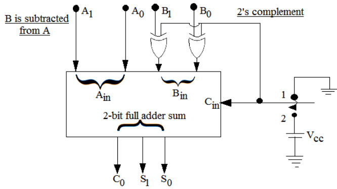

An N-bit carry lookahead adder, where $N$ is a multiple of , employs ICs  (  bit ALU) and  ( bit carry lookahead generator).

The minimum addition time using the best architecture for this adder is

A. proportional to $N$ B. proportional to C. a constant D. None of the above

gate1997 digital-logic normal adder

# Answer key☟

The number of full and half-adders required to add -bit numbers is

A. half-adders, full-adders B. half-adder, full-adders C. half-adders, full-adders D. half-adders, full-adders

gate1999 digital-logic normal adder

Consider the ALU shown below.

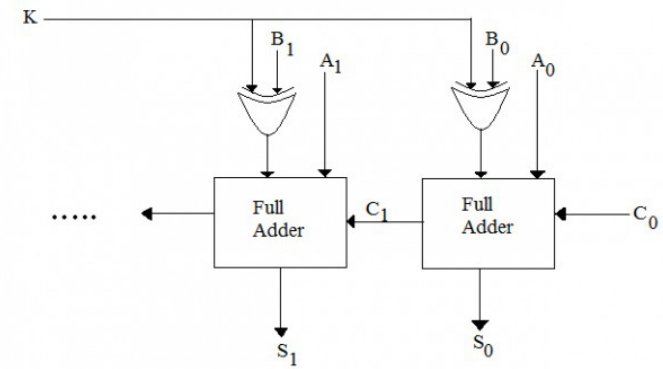

If the operands are in $\mathbf { 2 ^ { \prime } } \boldsymbol { s }$ complement representation, which of the following operations can be performed by suitably setting the control lines $K$ and $C _ { 0 }$ only ( $\cdot +$ and – denote addition and subtraction respectively)?

A. $A + B$ , and $A \mathrm { - } B$ , but not $A + 1$ B. $A + B$ , and $A + 1$ , but not $A { - } B$ C. $A + B$ , but not $A { - } B$ or $A + 1$ D. $A + B$ , and $A \mathrm { - } B$ , and $A + 1$

gatecse-2003 digital-logic normal adder

A 4-bit carry look ahead adder, which adds two 4-bit numbers, is designed using AND, OR, NOT, NAND, NOR gates only. Assuming that all the inputs are available in both complemented and uncomplemented forms and the delay of each gate is one time unit, what is the overall propagation delay of the adder? Assume that the carry network has been implemented using two-level AND-OR logic.

A. 4 time units B. 6 time units C. 10 time units D. 12 time units

gatecse-2004 digital-logic normal adder

# 4.1.7 Adder: GATE CSE 2015 Set 2 Question: 48

A half adder is implemented with XOR and AND gates. A full adder is implemented with two half adders and one OR gate. The propagation delay of an XOR gate is twice that of an AND/OR gate. The propagation delay of an AND/OR gate is  microseconds. A -bit-ripple-carry binary adder is implemented by using four full adders. The total propagation time of this -bit binary adder in microseconds is

gatecse-2015-set2 digital-logic adder normal numerical-answers

Consider a carry look ahead adder for adding two -bit integers, built using gates of fan-in at most two. The time to perform addition using this adder is

A. $\Theta ( 1 )$ $\begin{array} { l } { { \mathsf { B . ~ } \Theta ( \log ( n ) ) } } \\ { { \mathsf { D . ~ } \Theta ( n ) ) } } \end{array}$   
C. $\Theta ( { \sqrt { n } } )$

gatecse-2016-set1 digital-logic adder normal

# 4.1.9 Adder: GATE CSE 2016 Set 2 Question: 07

Consider an eight-bit ripple-carry adder for computing the sum of $A$ and $B _ { : }$ , where $A$ and $B$ are integers represented in 's complement form. If the decimal value of $A$ is one, the decimal value of $B$ that leads to the longest latency for the sum to stabilize is

gatecse-2016-set2 digital-logic adder normal numerical-answers

The maximum gate delay for any output to appear in an array multiplier for multiplying two $n$ bit numbers is

A. $O ( n ^ { 2 } )$ B. 0(n) ${ \mathsf { C } } . { \cal { O } } ( \log n )$ D. 0(1)

gate1999 digital-logic normal array-multiplier

Consider numbers represented in 4-bit Gray code. Let $h _ { 3 } h _ { 2 } h _ { 1 } h _ { 0 }$ be the Gray code representation of a number $n$ and let $g _ { 3 } g _ { 2 } g _ { 1 } g _ { 0 }$ be the Gray code of $( n + 1 )$ (modulo16) value of the number. Which one of the following functions is correct?

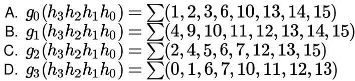

gatecse-2006 digital-logic number-representation binary-codes normal

# Answer key☟

✍ Practice Tests: Test (15Q) Test 2 (15Q) Test 3 (15Q) Test 4 (1Q) Weekly Quiz 1 (15Q) Weekly Quiz 2 (10Q) Weekly Quiz 3 (15Q) Weekly Quiz 4 (15Q)

The total number of Boolean functions which can be realised with four variables is:

A. B. C. 256 D. 65,536

gate1987 digital-logic boolean-algebra functions combinatory

The Boolean expression $A \oplus B \oplus A$ is equivalent to

A. $A B + { \overline { { A } } }$ B $\begin{array} { l } { { \mathsf { B . } } } \\ { { \mathsf { D . } } } \end{array} \overline { { { A } } } ^ { \overline { { { B } } } + A \overline { { { B } } } }$ C.

gate1987 digital-logic boolean-algebra easy

Let $^ *$ be defined as a Boolean operation given as $x * y = { \overline { { x } } }$ ${ \overline { { y } } } + x y$ and let $C = A * B$ . If $C = 1$ then prove that $A = B$ .

gate1988 digital-logic descriptive boolean-algebra

A + C = 1   
AB = 0

The operation which is commutative but not associative is:

A. AND B. OR C. EX-OR D. NAND

gate1992 easy digital-logic boolean-algebra multiple-selects

# Answer key☟

A. Let $^ *$ be a Boolean operation defined as $A * B = A B + \overline { { A } } \overline { { B } }$ . If $C = A * B$ then evaluate and fill in the blanks: i. $A * A =$ ii. $C * A =$   
B. Solve the following boolean equations for the values of $A , B$ and $c$ $\begin{array} { l } { A B + \overline { { A } } C = 1 } \\ { A C + B = 0 } \end{array}$

gate1994 digital-logic normal boolean-algebra descriptive

What values of $A , B , C$ and $D$ satisfy the following simultaneous Boolean equations?

$$
\overline { { A } } + A B = 0 , A B = A C , A B + A \overline { { C } } + C D = \overline { { C } } D
$$

A. $A = 1 , B = 0 , C = 0 , D = 1$ B. $A = 1 , B = 1 , C = 0 , D = 0$   
C. $A = 1 , B = 0 , C = 1 , D = 1$ D. $A = 1 , B = 0 , C = 0 , D = 0$

gate1995 digital-logic boolean-algebra easy

# Answer key☟

Let $^ *$ be defined as $x * y = \bar { x } + y$ . Let $z = x * y$ . Value of $z * x$ is

A. B. $x$ C. 0 D.

gate1997 digital-logic normal boolean-algebra

Which of the following operations is commutative but not associative?

A. AND B. OR C. NAND D. EXOR

gate1998 digital-logic easy boolean-algebra

# Answer key☟

Which of the following expressions is not equivalent to $\bar { x } ?$

A. x NAND $x$ B. x NOR $x$ C. x NAND1 D. x NOR 1

gate1999 digital-logic easy boolean-algebra

# Answer key☟

The simultaneous equations on the Boolean variables $x , y , z$ and $w$ ,

$$
\begin{array} { l } { { \cdot { x } + { y } + { z } = 1 } } \\ { { \cdot { x } { y } = 0 } } \\ { { \cdot { x } { z } + { w } = 1 } } \\ { { \cdot { x } { y } + { \bar { z } } { \bar { w } } = 0 } } \end{array}
$$

have the following solution for $x , y , z$ and $w$ ， respectively:

A. B. C. D. 1000

gatecse-2000 digital-logic boolean-algebra easy

Answer key☟

# 4.4.14 Boolean Algebra: GATE CSE 2002 Question: 2-3

Let $f ( A , B ) = A ^ { \prime } + B$ . Simplified expression for function $f ( f ( x + y , y ) , z )$ is

A. $x ^ { \prime } + z$ B. xyz $\complement . \ x y ^ { \prime } + z$ D. None of the above

gatecse-2002 digital-logic boolean-algebra normal

# Answer key☟

A Boolean function $x ^ { \prime } y ^ { \prime } + x y + x ^ { \prime } y$ is equivalent to

A. $\boldsymbol { x ^ { \prime } + y ^ { \prime } }$ B. $x + y$ C. x+y D.

gatecse-2004 digital-logic easy boolean-algebra

# Answer key☟

# 4.4.16 Boolean Algebra: GATE CSE 2007 Question: 32

Let $\begin{array} { r } { f ( w , x , y , z ) = \sum { ( 0 , 4 , 5 , 7 , 8 , 9 , 1 3 , 1 5 ) } . } \end{array}$ . Which of the following expressions are NOT equivalent to $f ?$

P $x ^ { \prime } y ^ { \prime } z ^ { \prime } + w ^ { \prime } x y ^ { \prime } + w y ^ { \prime } z + x z$ $\ \mathfrak { Q } { : } w ^ { \prime } y ^ { \prime } z ^ { \prime } + w x ^ { \prime } y ^ { \prime } + x z$ $\mathbf { R } { : } w ^ { \prime } y ^ { \prime } z ^ { \prime } + w x ^ { \prime } y ^ { \prime } + x y z + x y ^ { \prime } z$ ： $\mathfrak { s } \colon x ^ { \prime } y ^ { \prime } z ^ { \prime } + w x ^ { \prime } y ^ { \prime } + w ^ { \prime } y$

A. P only B. Q and S C. R and S D. S only

gatecse-2007 digital-logic normal boolean-algebra

Define the connective $^ *$ for the Boolean variables $X$ and $Y$ as:

$$
X * Y = X Y + X ^ { \prime } Y ^ { \prime } .
$$

Let $Z = X * Y$ . Consider the following expressions $P , Q$ and $R$ .

$$
\begin{array} { c } { { P : X = Y * Z , } } \\ { { Q : Y = X * Z , } } \\ { { R : X * Y * Z = 1 } } \end{array}
$$

Which of the following is TRUE?

A. Only $P$ and $Q$ are valid. B. Only $Q$ and $R$ are valid.   
C. Only $P$ and $R$ are valid. D. All $P$ , $Q$ , $R$ are valid.

gatecse-2007 digital-logic normal boolean-algebra

Answer key☟

I ${ \mathfrak { f } } P , Q , R$ are Boolean variables, then $( P + \bar { Q } ) ( P . \bar { Q } + P . R ) ( \bar { P } . \bar { R } + \bar { Q } )$ simplifies to

A. $\bar { Q }$ B. $\complement . P . \bar { Q } + R \complement . P . \bar { R } + Q$

gatecse-2008 easy digital-logic boolean-algebra

# Answer key☟

represents the Boolean function

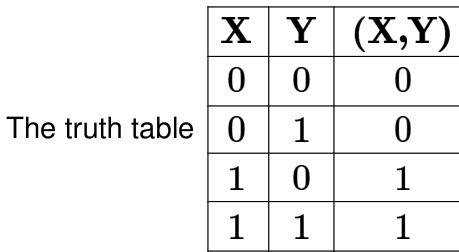

A. B. C. D.

gatecse-2012 digital-logic easy boolean-algebra

# Answer key☟

The equivalent expression for $F$ is

A. $P + Q$ B. $\overline { { P + Q } }$ C. $P \oplus Q$ D. PQ

gatecse-2014-set3 digital-logic normal boolean-algebra

The number of min-terms after minimizing the following Boolean expression is

$$
[ D ^ { \prime } + A B ^ { \prime } + A ^ { \prime } C + A C ^ { \prime } D + A ^ { \prime } C ^ { \prime } D ] ^ { \prime }
$$

gatecse-2015-set2 digital-logic boolean-algebra normal numerical-answers

Consider the Boolean operator # with the following properties $x \# 0 = x , x \# 1 = { \overline { { x } } } , x \# x = 0$ and $x \# { \overline { { x } } } = 1$ ： Then $x \# y$ is equivalent to

A. $x { \overline { { y } } } + { \overline { { x } } } y$ $\begin{array} { c } { { \mathsf { B . } x \overline { { { y } } } + \overline { { { x } } } \overline { { { y } } } } } \\ { { \mathsf { D . } x y + \overline { { { x } } } \overline { { { y } } } } } \end{array}$   
C.

gatecse-2016-set1 digital-logic boolean-algebra easy

Answer key☟

Let, $x _ { 1 } \oplus x _ { 2 } \oplus x _ { 3 } \oplus x _ { 4 } = 0$ where $x _ { 1 } , x _ { 2 } , x _ { 3 } , x _ { 4 }$ are Boolean variables, and $\oplus$ is the XOR operator. Which one of the following must always be TRUE?

A. $x _ { 1 } x _ { 2 } x _ { 3 } x _ { 4 } = 0$   
B. $x _ { 1 } x _ { 3 } + x _ { 2 } = 0$   
C. $\bar { x } _ { 1 } \oplus \bar { x } _ { 3 } = \bar { x } _ { 2 } \oplus \bar { x } _ { 4 }$   
D. $x _ { 1 } + x _ { 2 } + x _ { 3 } + x _ { 4 } = 0$

gatecse-2016-set2 digital-logic boolean-algebra normal

Answer key☟

If $w , x , y , z$ are Boolean variables, then which one of the following is INCORRECT?

A. $w x + w ( x + y ) + x ( x + y ) = x + w y$ B. $\overline { { w \bar { x } ( y + \bar { z } ) } } + \bar { w } x = \bar { w } + x + \bar { y } z$   
C. $( w \bar { x } ( y + x \bar { z } ) + \bar { w } \bar { x } ) y = x \bar { y }$ D. $( w + y ) ( w x y + w y z ) = w x y + w y z$

gatecse-2017-set2 digital-logic boolean-algebra normal

Answer key☟

Which one of the following is NOT a valid identity?

A. $( x \oplus y ) \oplus z = x \oplus ( y \oplus z )$ B. $( x + y ) \oplus z = x \oplus ( y + z )$   
C. ${ \pmb x } \oplus { \pmb y } = { \pmb x } + { \pmb y }$ ,if $x y = 0$ D. $\pmb { x } \oplus \pmb { y } = ( \pmb { x } \pmb { y } + \pmb { x } ^ { \prime } \pmb { y } ^ { \prime } ) ^ { \prime }$

gatecse-2019 digital-logic boolean-algebra one-mark

Answer key☟

Consider the following Boolean expression.

$$
F = ( X + Y + Z ) ( \overline { { { X } } } + Y ) ( \overline { { { Y } } } + Z )
$$

Which of the following Boolean expressions is/are equivalent to $\overline { { F } }$ (complement of $F$ )?

A. $( \overline { { { X } } } + \overline { { { Y } } } + \overline { { { Z } } } ) ( X + \overline { { { Y } } } ) ( Y + \overline { { { Z } } } )$   
B. $X { \overline { { Y } } } + { \overline { { Z } } }$   
C. $( X + { \overline { { Z } } } ) ( { \overline { { Y } } } + { \overline { { Z } } } )$   
D. $X \overline { { Y } } + Y \overline { { Z } } + \overline { { X } } \overline { { Y } } \overline { { Z } }$

gatecse-2021-set1 multiple-selects digital-logic boolean-algebra two-marks ​For a Boolean variable $x$ , which of the following statements is/are FALSE?

A. $\scriptstyle { x . 1 = x }$ $\mathbf { B } . \ { \pmb { x } } + \mathbf { 1 } = { \pmb { x } }$ C $. \ x \cdot x = 0$ D $) , \ x + \bar { x } = 1$ gatecse-2024-set2 digital-logic boolean-algebra easy multiple-selects one-mark

# Answer key☟

# 4.4.30 Boolean Algebra: GATE CSE 2025 Set 1 Question: 14

Let $X$ be a -variable Boolean function that produces output as $' 1 ^ { \prime }$ when at least two of the input variables are $' 1 ^ { \prime }$ . Which of the following statement(s) is/are CORRECT, where $a , b , c , d , e$ are Boolean variables?

A. $X ( a , b , X ( c , d , e ) ) = X ( X ( a , b , c ) , d , e )$ B. $X ( a , b , X ( a , b , c ) ) = X ( a , b , c )$ C. $X ( a , b , X ( a , c , d ) ) = ( X ( a , b , a )$ AND D. $X ( a , b , c ) = X ( a , X ( a , b , c ) , X ( a , c , c ) )$

gatecse2025-set1 digital-logic boolean-algebra multiple-selects one-mark

# Answer key☟

Which one of the following options is not a property of Boolean Algebra? Note: $+$ is OR operation, $\cdot$ is AND operation, and $\prime$ is NOT operation

A. $a + b = b + a$ $\begin{array} { l } { { \textsf { B . } a \cdot a ^ { \prime } = 1 } } \\ { { \textsf { D . } a \cdot b = b \cdot a } } \end{array}$   
C. $\pmb { a } + \pmb { a } ^ { \prime } = \pmb { 1 }$

gatecse-2026-set2 digital-logic boolean-algebra easy one-mark

Answer key☟

The function $A { \bar { B } } C + { \bar { A } } B C + A B { \bar { C } } + { \bar { A } } { \bar { B } } C + A { \bar { B } } { \bar { C } }$ is equivalent to

A. $A { \bar { C } } + A B + { \bar { A } } C$ B. $A { \bar { B } } + A { \bar { C } } + { \bar { A } } C$   
C. $\bar { A } B + A \bar { C } + A \bar { B }$ D. $\bar { A } B + A C + A \bar { B }$

gateit-2004 digital-logic boolean-algebra easy

# Answer key☟

# 4.4.34 Boolean Algebra: GATE IT 2005 Question: 7

Which of the following expressions is equivalent to $( A \oplus B ) \oplus C$

A. $( A + B + C ) ( \bar { A } + \bar { B } + \bar { C } )$ B. $( A + B + C ) ( \bar { A } + \bar { B } + C )$ C. $A B C + \bar { A } ( B \oplus C ) + \bar { B } ( A \oplus C )$ D. None of these

gateit-2005 digital-logic normal boolean-algebra

# Answer key☟

# 4.5

# Booths Algorithm (7)

✍ Practice Test: Test 1 (6Q)

State the Booth's algorithm for multiplication of two numbers. Draw a block diagram for the implementation of the Booth's algorithm for determining the product of two -bit signed numbers.

gate1990 descriptive digital-logic booths-algorithm

Booth’s algorithm for integer multiplication gives worst performance when the multiplier pattern is

A. 101010...1010 B. 100000...0001   
C. 111111...1111 D. 011111...1110

gate1996 digital-logic booths-algorithm normal

The following two signed 's complement numbers (multiplicand M and multiplier $\mathsf { Q }$ ) are being multiplied using Booth's algorithm:

# M: 1100110111101101 and Q: 1010010010101010

The total number of addition and subtraction operations to be performed is (Answer in integer)

gatecse2025-set2 digital-logic booths-algorithm numerical-answers one-mark

Using Booth's Algorithm for multiplication, the multiplier $- 5 7$ will be recoded as

A.  -      - B. C. - D. -

gateit-2005 digital-logic booths-algorithm normal

When multiplicand $Y$ is multiplied by multiplier $X = x _ { n - 1 } x _ { n - 2 } \dots x _ { 0 }$ using bit-pair recoding in Booth's algorithm, partial products are generated according to the following table.

The partial products for rows 5 and are

A. and B. $- 2 Y$ and C. $- 2 Y$ and D. and

gateit-2006 digital-logic booths-algorithm difficult

Three switching functions $f _ { 1 } , f _ { 2 }$ and $f _ { 3 }$ are expressed below as sum of minterms.

$$
\begin{array} { l } { \cdot ~ f _ { 1 } ( w , x , y , z ) = \sum _ { } 0 , 1 , 2 , 3 , 5 , 1 2 } \\ { \cdot ~ f _ { 2 } ( w , x , y , z ) = \sum _ { } 0 , 1 , 2 , 1 0 , 1 3 , 1 4 , 1 5 } \\ { \cdot ~ f _ { 3 } ( w , x , y , z ) = \sum _ { } 2 , 4 , 5 , 8 } \end{array}
$$

Express the function $f$ realised by the circuit shown in the below figure as the sum of minterms (in decimal notation).

Consider the following logic circuit whose inputs are functions $f _ { 1 } , f _ { 2 } , f _ { 3 }$ and output is $f$

Given that

· $f _ { 1 } ( x , y , z ) = \Sigma ( 0 , 1 , 3 , 5 )$ $f _ { 2 } ( x , y , z ) = \Sigma ( 6 , 7 )$ and $f ( x , y , z ) = \Sigma ( 1 , 4 , 5 )$

$f _ { 3 }$ is

A. $\Sigma ( 1 , 4 , 5 )$ B. $\Sigma ( 6 , 7 )$ C. $\Sigma ( 0 , 1 , 3 , 5 )$ D. None of the above

gatecse-2002 digital-logic normal canonical-normal-form circuit-output

# Answer key☟

Given $f _ { 1 } , f _ { 3 }$ and $f$ in canonical sum of products form (in decimal) for the circuit

$\begin{array} { l } { f _ { 1 } = \Sigma m ( 4 , 5 , 6 , 7 , 8 ) } \\ { f _ { 3 } = \Sigma m ( 1 , 6 , 1 5 ) } \\ { f = \Sigma m ( 1 , 6 , 8 , 1 5 ) } \end{array}$ then $f _ { 2 }$ is

A. $\Sigma m ( 4 , 6 )$ B. $\Sigma m ( 4 , 8 )$ C. $\Sigma m ( 6 , 8 )$ D. Σm(4,6,8)

gatecse-2008 digital-logic canonical-normal-form easy

# Answer key☟

The minterm expansion of $f ( P , Q , R ) = P Q + Q \bar { R } + P \bar { R }$ is

A. $m _ { 2 } + m _ { 4 } + m _ { 6 } + m _ { 7 }$ B. $m _ { 0 } + m _ { 1 } + m _ { 3 } + m _ { 5 }$   
C. $m _ { 0 } + m _ { 1 } + m _ { 6 } + m _ { 7 }$ D. $m _ { 2 } + m _ { 3 } + m _ { 4 } + m _ { 5 }$

gatecse-2010 digital-logic canonical-normal-form normal

The total number of prime implicants of the function $\begin{array} { r } { f ( w , x , y , z ) = \sum ( 0 , 2 , 4 , 5 , 6 , 1 0 ) } \end{array}$ is

gatecse-2015-set3 digital-logic canonical-normal-form normal numerical-answers

# Answer key☟

# 4.6.6 Canonical Normal Form: GATE CSE 2015 Set 3 Question: 44

Given the function $F = P ^ { \prime } + Q R ,$ where $F$ is a function in three Boolean variables $P , Q$ and $R$ and $P ^ { \prime } { = } ! P$ , consider the following statements.

$$
\begin{array} { l } { { ( S 1 ) F = \sum ( 4 , 5 , 6 ) } } \\ { { ( S 2 ) F = \sum ( 0 , 1 , 2 , 3 , 7 ) } } \\ { { ( S 3 ) F = \Pi ( 4 , 5 , 6 ) } } \\ { { ( S 4 ) F = \Pi ( 0 , 1 , 2 , 3 , 7 ) } } \end{array}
$$

Which of the following is true?

A. (S1)-False, (S2)-True, (S3)-True, (S4)-False B. (S1)-True, (S2)-False, (S3)-False, (S4)-True C. (S1)-False, (S2)-False, (S3)-True, (S4)-True D. (S1)-True, (S2)-True, (S3)-False, (S4)-False

Consider three -variable functions $f _ { 1 } , f _ { 2 }$ , and $f _ { 3 }$ , which are expressed in sum-of-minterms as

$f _ { 1 } = \Sigma ( 0 , 2 , 5 , 8 , 1 4 ) .$ .$f _ { 2 } = \Sigma ( 2 , 3 , 6 , 8 , 1 4 , 1 5 ) .$ ，$f _ { 3 } = \Sigma ( 2 , 7 , 1 1 , 1 4 )$

For the following circuit with one AND gate and one XOR gate the output function $f$ can be expressed as:

A. $\Sigma ( 7 , 8 , 1 1 )$ B. ∑(2,7,8,11,14) C. $\Sigma ( 2 , 1 4 )$ D. £(0,2,3,5,6,7,8,11,14,15)

gatecse-2019 digital-logic digital-circuits two-marks canonical-normal-form

# Answer key☟

Consider the Boolean function $z ( a , b , c )$ .

Which one of the following minterm lists represents the circuit given above?

A. $\begin{array} { l } { z = \sum ( 0 , 1 , 3 , 7 ) } \\ { z = \sum ( 2 , 4 , 5 , 6 , 7 . } \end{array}$ B. $\begin{array} { l } { z = \sum ( 1 , 4 , 5 , 6 , 7 ) } \\ { z = \sum ( 2 , 3 , 5 ) } \end{array}$   
C. ） D.

gatecse-2020 digital-logic canonical-normal-form two-marks

Consider -variable functions $f 1 , f 2 , f 3 , f 4$ expressed in sum-of-minterms form as given below.

$$
\begin{array} { l } { f 1 = \sum ( 0 , 2 , 3 , 5 , 7 , 8 , 1 1 , 1 3 ) } \\ { f 2 = \sum ( 1 , 3 , 5 , 7 , 1 1 , 1 3 , 1 5 ) } \\ { f 3 = \sum ( 0 , 1 , 4 , 1 1 ) } \\ { f 4 = \sum ( 0 , 2 , 6 , 1 3 ) } \end{array}
$$

With respect to the circuit given above, which of the following options is/are CORRECT?

A. $\begin{array} { r } { Y = \sum ( 0 , 1 , 2 , 1 1 , 1 3 ) } \end{array}$ B. $Y = \Pi ( 3 , 4 , 5 , 6 , 7 , 8 , 9 , 1 0 , 1 2 , 1 4 , 1 5 )$   
C. $\begin{array} { r } { Y = \sum ( 0 , 1 , 2 , 3 , 4 , 5 , 6 , 7 ) } \end{array}$ D. $Y = \Pi ( 8 , 9 , 1 0 , 1 1 , 1 2 , 1 3 , 1 4 , 1 5 )$

gatecse-2024-set2 digital-logic canonical-normal-form multiple-selects two-marks