In look-ahead carry generator, the carry generate function $G _ { i }$ and the carry propagate function $P _ { i }$ for inputs $A _ { i }$ and $B _ { i }$ are given by:

$$
P _ { i } = A _ { i } \oplus B _ { i } { \mathrm { ~ a n d } } G _ { i } = A _ { i } B _ { i }
$$

The expressions for the sum bit $S _ { i }$ and the carry bit $C _ { i + 1 }$ of the look ahead carry adder are given by:

$S _ { i } = P _ { i } \oplus C _ { i } { \mathrm { a n d } } C _ { i + 1 } = G _ { i } + P _ { i } C _ { i }$ ， where $C _ { 0 }$ is the input carry.

Consider a two-level logic implementation of the look-ahead carry generator. Assume that all $P _ { i }$ and $G _ { i }$ are available for the carry generator circuit and that the AND and OR gates can have any number of inputs. The number of AND gates and OR gates needed to implement the look-ahead carry generator for a -bit adder with $S _ { 3 } , S _ { 2 } , S _ { 1 } , S _ { 0 }$ and $C _ { 4 }$ as its outputs are respectively:

A. B. 10,4 C. 6,4 D. 10,5

gatecse-2007 digital-logic normal carry-generator adder

# Answer key☟

✍ Practice Tests: Test 1 (15Q) Test 2 (15Q) Test 3 (8Q)

The output $F$ of the below multiplexer circuit can be represented by

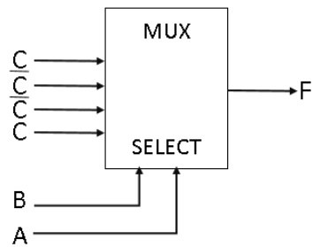

A. $A B + B \bar { C } + \bar { C } A + \bar { B } \bar { C }$ B. $A \oplus B \oplus C$   
C. $A \oplus B$ D. ${ \bar { A } } { \bar { B } } C + { \bar { A } } B { \bar { C } } + A { \bar { B } } { \bar { C } }$

gate1987 digital-logic combinational-circuit multiplexer circuit-output

Explain the behaviour of the following logic circuit with level input $A$ and output $B$ .

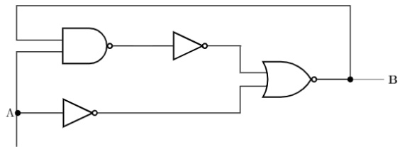

Two NAND gates having open collector outputs are tied together as shown in below figure.

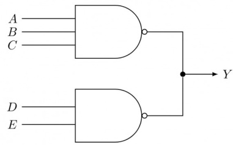

The logic function $Y$ implemented by the circuit is,

A. $Y = A B C + D E$ B. $Y = { \overline { { A B C + D E } } }$   
C. $Y = A B C . D E$ D. $Y = { \overline { { A B C . D E } } }$

gate1990 normal digital-logic circuit-output

# Answer key☟

Analyse the circuit in Fig below and complete the following table

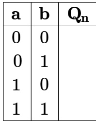

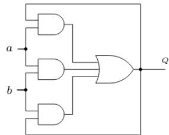

A control algorithm is implemented by the NAND – gate circuitry given in figure below, where $A$ and $B$ are state variable implemented by $D$ flip-flops, and $P$ is control input. Develop the state transition table for this controller.

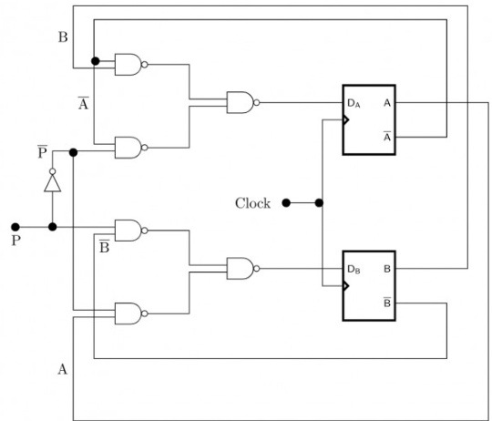

For the initial state of , the function performed by the arrangement of the  flip-flops in figure is:

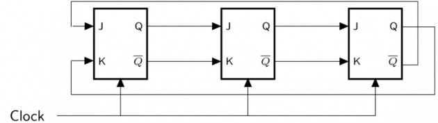

A. Shift Register B. Mod- 3 Counter C. Counter D. Mod- 2 Counter E. None of the above

gate1993 digital-logic sequential-circuit flip-flop digital-counter circuit-output multiple-selects

Identify the logic function performed by the circuit shown in figure.

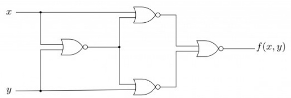

A. exclusive OR B. exclusive NOR C. NAND D. NOR E. None of the above

gate1993 digital-logic combinational-circuit circuit-output normal

# Answer key☟

If the state machine described in figure should have a stable state, the restriction on the inputs is given by

$$
\mathrm { ( a = 1 ) / o u t ~ 1 \subset { \bigoplus _ { ( b = 0 ) / o u t ~ 1 } ^ { ( a = 0 ) / o u t ~ 2 } } } \sqrt { _ { S _ { 2 } } } ) \supset ( b = 1 ) / o u t \ 2
$$

A. $a . b { = } 1$ $\begin{array} { l } { { \mathsf { B } . \displaystyle \frac { a + b = 1 } { a . b } } } \\ { { \mathsf { D } . \displaystyle \frac { a - b } { a . b } = 1 } } \end{array}$   
C. ${ \bar { \boldsymbol { a } } } + { \bar { \boldsymbol { b } } } = 0$   
E. ${ \overline { { a + b } } } = 1$

gate1993 digital-logic normal circuit-output sequential-circuit

# Answer key☟

A. $\overline { { A C } } + \overline { { B C } } + C D$ B. $\overline { { A } } C + \overline { { B } } C + C D$   
C. $A B C + { \overline { { C } } } { \overline { { D } } }$ D. $\overline { { A } } \overline { { B } } + \overline { { B } } \overline { { C } } + C D$

Find the contents of the flip-flop $Q _ { 2 } , Q _ { 1 }$ and $Q _ { 0 }$ in the circuit of figure, after giving four clock pulses to the clock terminal. Assume $Q _ { 2 } Q _ { 1 } Q _ { 0 } = 0 0 0$ initially.

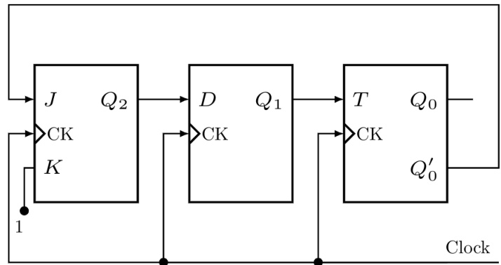

Consider the circuit in below figure which has a four bit binary number $b _ { 3 } b _ { 2 } b _ { 1 } b _ { 0 }$ as input and a five bit binary number, $d _ { 4 } d _ { 3 } d _ { 2 } d _ { 1 } d _ { 0 }$ as output.

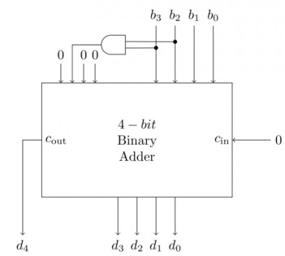

A. Binary to Hex conversion B. Binary to BCD conversionC. Binary to Gray code conversion D. Binary to radix 一 conversion

gate1996 digital-logic circuit-output normal

Consider the synchronous sequential circuit in the below figure

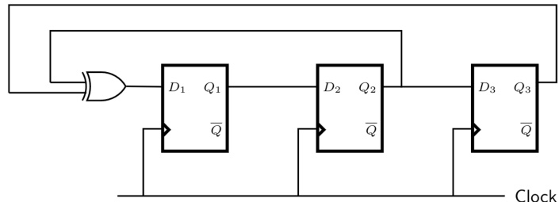

Draw a state diagram, which is implemented by the circuit. Use the following names for the states corresponding to the values of flip-flops as given below.

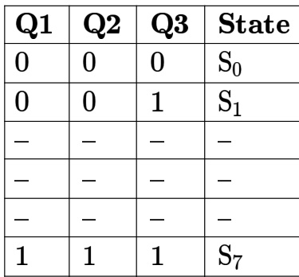

Consider the synchronous sequential circuit in the below figure

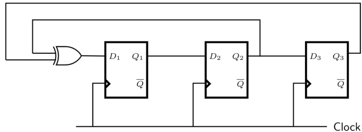

Given that the initial state of the circuit is identify the set of states, which are not reachable.

gate1996 normal digital-logic circuit-output descriptive

# Answer key☟

$f _ { 1 }$   
$f _ { 2 }$ I $f$ f3=？—

The function $f _ { 3 }$ is

A. $\Sigma ^ { 9 , 1 0 }$ B. £9 C. ∑1,8,9 D. ∑8,10,15

gate1997 digital-logic circuit-output normal

# Answer key☟

Consider the circuit shown below. In a certain steady state, the line $Y$ is at $' 1 ^ { \prime }$ . What are the possible values of $A , B$ and $\boldsymbol { C }$ in this state?

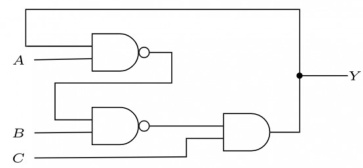

A. $A = 0 , B = 0 , C = 1$ B. $A = 0 , B = 1 , C = 1$   
C. $A = 1 , B = 0 , C = 1$ D. $A = 1 , B = 1 , C = 1$

gate1999 digital-logic circuit-output normal

# Answer key☟

The following arrangement of master-slave flip flops

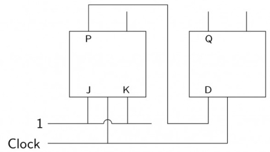

has the initial state of $P , Q$ as $^ { 0 , 1 }$ (respectively). After three clock cycles the output state $P , Q$ s i (respectively),

A. B. C. 0,0 D. 0,1

gatecse-2000 digital-logic circuit-output normal flip-flop

# Answer key☟

$c$   
$X$

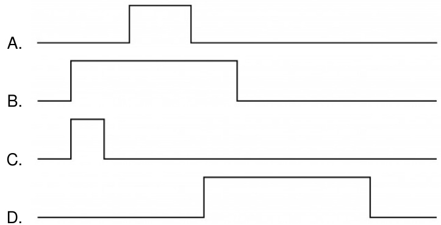

Consider the following multiplexer where $I 0 , I 1 , I 2 , I 3$ are four data input lines selected by two address line combinations $A 1 A 0 = 0 0$ ,01,10,11 respectively and $f$ is the output of the multiplexor. EN is the Enable input.

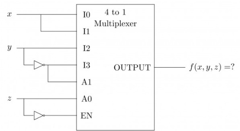

The function $f ( x , y , z )$ implemented by the above circuit is

A. B. xy+z C. $x + y$ D. None of the above

gatecse-2002 digital-logic circuit-output normal

Consider the partial implementation of $\mathsf { a } 2 - b i t$ counter using $T$ flip-flops following the sequence $0 - 2 - 3 - 1 - 0$ as shown below.

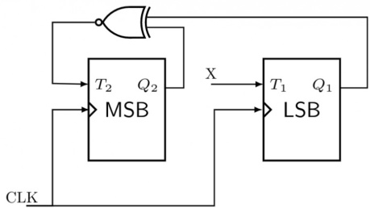

To complete the circuit, the input should be

A. $Q _ { 2 } ^ { c }$ B. $Q _ { 2 } + Q _ { 1 }$ C. (Q1+Q2)c D. $Q _ { 1 } \oplus Q _ { 2 }$

gatecse-2004 digital-logic circuit-output normal

Consider the following circuit.

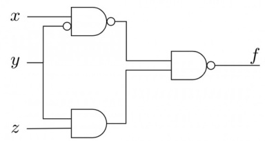

Which one of the following is TRUE?

A. $f$ is independent of $x$ B. $f$ is independent of C. $f$ is independent of $z$ D. None of $x , y , z$ is redundant

gatecse-2005 digital-logic circuit-output normal

Consider the following circuit involving a positive edge triggered D FF.

C TD $Q ^ { \prime }$

Consider the following timing diagram. Let $A _ { i }$ represents the logic level on the line $A$ in the $_ i$ -th clock period.

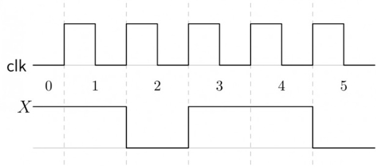

Let $A ^ { \prime }$ represent the complement of $A$ . The correct output sequence on $Y$ over the clock periods through  is:

A. $A _ { 0 } A _ { 1 } A _ { 1 } ^ { \prime } A _ { 3 } A _ { 4 }$ B. $A _ { 0 } A _ { 1 } A _ { 2 } ^ { \prime } A _ { 3 } A _ { 4 }$   
C. $A _ { 1 } A _ { 2 } A _ { 2 } ^ { \prime } A _ { 3 } A _ { 4 }$ D. $A _ { 1 } A _ { 2 } ^ { \prime } A _ { 3 } ^ { - } A _ { 4 } A _ { 5 } ^ { \prime }$

gatecse-2005 digital-logic circuit-output normal

Consider the following circuit:

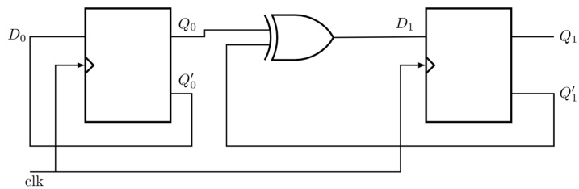

The flip-flops are positive edge triggered $D$ s. Each state is designated as a two-bit string $Q _ { 0 } Q _ { 1 }$ . Let the initial state be  The state transition sequence is

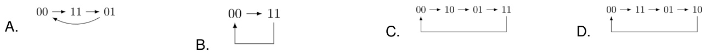

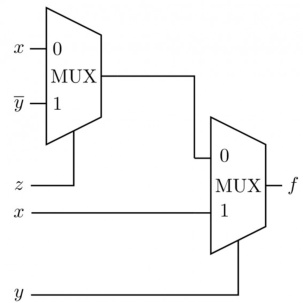

Consider the circuit above. Which one of the following options correctly represents $f ( x , y , z )$

A. $\pmb { x } \bar { z } + \pmb { x } y + \bar { y } z$ B. $x \bar { z } + x y + \overline { { y z } }$   
C. $x z + x y + { \overline { { y z } } }$ D. $x z + x { \bar { y } } + { \bar { y } } z$

gatecse-2006 digital-logic circuit-output normal

# Answer key☟

Consider the circuit in the diagram. The $\oplus$ operator represents Ex-OR. The D flip-flops are initialized to zeroes (cleared).

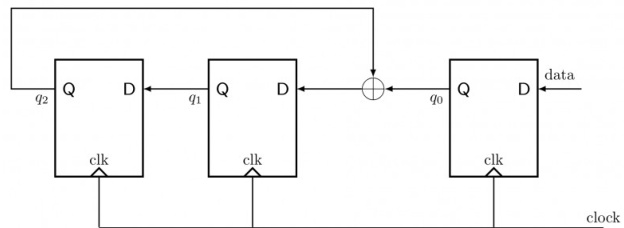

The following data: is supplied to the “data” terminal in nine clock cycles. After that the values of $q _ { 2 } q _ { 1 } q _ { 0 }$ are:

A. 000 B. 001 C. 010 D. 101

gatecse-2006 digital-logic circuit-output easy

You are given a free running clock with a duty cycle of $5 0 \%$ and a digital waveform $f$ which changes only at the negative edge of the clock. Which one of the following circuits (using clocked D flip-flops) will delay the phase of $f$ by $1 8 0 ^ { \circ } ?$

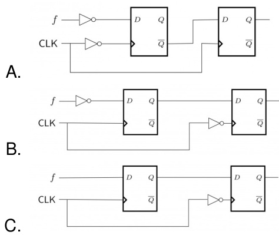

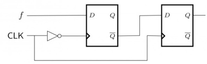

D.

The control signal functions of a - binary counter are given below (where $X$ is “don’t care”):

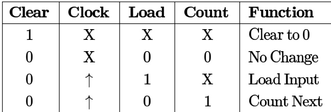

The counter is connected as follows:

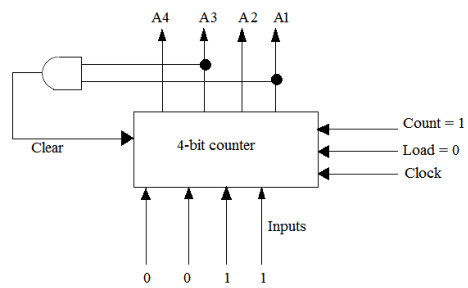

Assume that the counter and gate delays are negligible. If the counter starts at then it cycles through the following sequence:

A. 0,3,4 B. 0,3,4,5 C. 0,1,2,3,4 D. 0,1,2,3,4,5

gatecse-2007 digital-logic circuit-output normal

What is the boolean expression for the output $f$ of the combinational logic circuit of NOR gates given below?

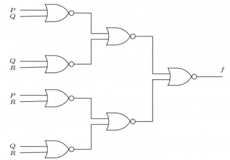

A. $\overline { { Q + R } }$ B. P+Q C. $\overline { { P + R } }$ D. $\overline { { P + Q + R } }$

# Answer key☟

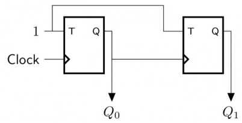

A. , , , B. , , , C. , , , D. , , ,

gatecse-2010 digital-logic circuit-output normal

The Boolean expression of the output $f$ of the multiplexer shown below is

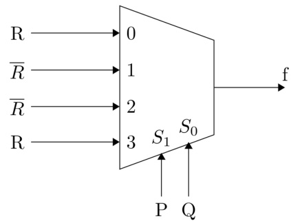

A. $\overline { { P \oplus Q \oplus R } }$ B. $P \oplus Q \oplus R$   
C. $P + Q + R$ D. $\overline { { P + Q + R } }$

gatecse-2010 digital-logic circuit-output easy multiplexer

Consider the following circuit involving three D-type flip-flops used in a certain type of counter configuration.

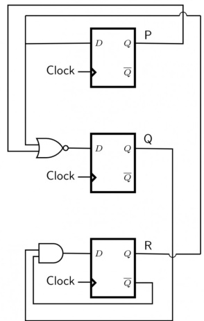

If at some instance prior to the occurrence of the clock edge, $P , Q$ and $R$ have a value , and  respectively, what shall be the value of $P Q R$ after the clock edge?

A. 000 B. 001 C. 010 D. 011

gatecse-2011 digital-logic circuit-output flip-flop normal

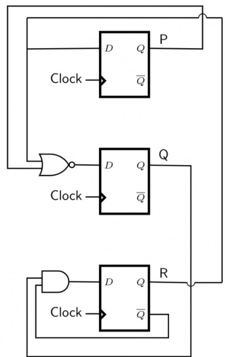

If all the flip-flops were reset to at power on, what is the total number of distinct outputs (states) represented by $P Q R$ generated by the counter?

A. B. 4 C. D. 6

gatecse-2011 digital-logic circuit-output normal

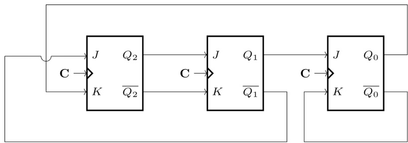

The above synchronous sequential circuit built using JK flip-flops is initialized with $Q _ { 2 } Q _ { 1 } Q _ { 0 } = 0 0 0$ . The state sequence for this circuit for the next  clock cycles is

A. 001,010,011 B. 111,110,101   
C. 100,110,111 D. 100,011,001

gatecse-2014-set3 digital-logic circuit-output normal

Consider the following logic circuit diagram.

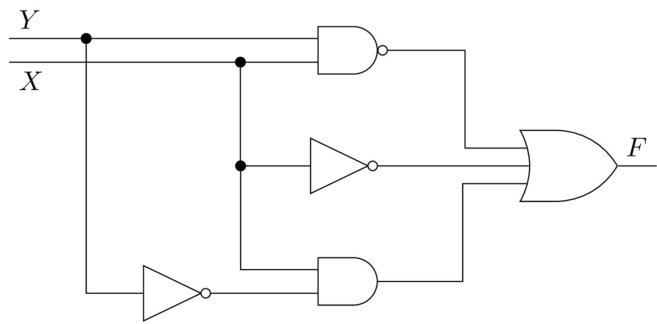

Which is/are the CORRECT option(s) for the output function $F$ ?

A. B. ${ \overline { { X } } } + { \overline { { Y } } } + X { \overline { { Y } } }$   
C. ${ \overline { { X Y } } } + { \overline { { X } } } + X { \overline { { Y } } }$ D. $X + { \overline { { Y } } }$

gatecse2025-set2 digital-logic circuit-output multiple-selects easy one-mark

A two-way switch has three terminals $^ { a , b }$ and $c$ · In ON position (logic value ), $\mathbf { \Delta } _ { a }$ is connected to and in OFF position, $a$ is connected to $c$ . Two of these two-way switches $S 1$ and $S 2$ are connected to a bulb as shown below.

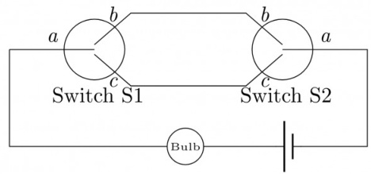

Which of the following expressions, if true, will always result in the lighting of the bulb ?

A. S1.S2 B. $S 1 + S 2$   
C. $\overline { { S 1 \oplus S 2 } }$ D. $S 1 \oplus S 2$

gateit-2005 digital-logic circuit-output normal

# Answer key☟

Which of the following input sequences will always generate a  at the output $z$ at the end of the third cycle?

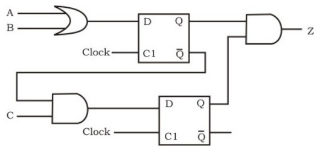

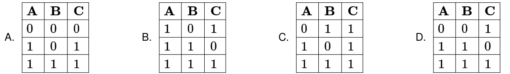

The majority function is a Boolean function $f ( x , y , z )$ that takes the value whenever a majority of the variables $x , y , z$ are In the circuit diagram for the majority function shown below, the logic gates for the boxes labeled $P$ and $Q$ are, respectively,

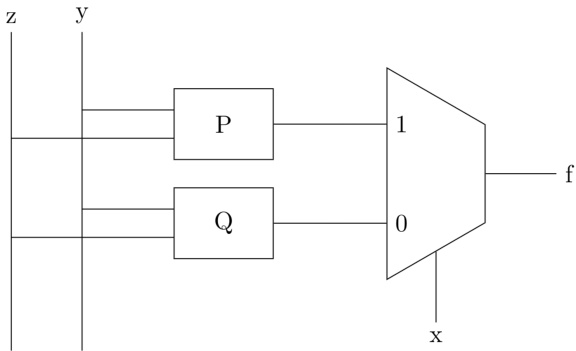

A. XOR, AND B. XOR,XOR C. OR,OR D. OR,AND

The following expression was to be realized using -input AND and OR gates. However, during the fabrication all -input AND gates were mistakenly substituted by -input NAND gates. $( a . b ) . c + ( a ^ { \prime } . c ) . d + ( b . c ) . d + a . d$

What is the function finally realized ?

A. B. $a ^ { \prime } + b ^ { \prime } + c ^ { \prime } + d ^ { \prime }$   
C. $a ^ { \prime } + b + c ^ { \prime } + d ^ { \prime }$ D. $\pmb { a } ^ { \prime } + \pmb { b } ^ { \prime } + \pmb { c } + \pmb { d } ^ { \prime }$

gateit-2007 digital-logic circuit-output normal

# 4.8.39 Circuit Output: GATE IT 2007 Question: 40

What is the final value stored in the linear feedback shift register if the input is ?

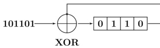

A. 0110 B. 1011 C. 1101 D. 1111

gateit-2007 digital-logic circuit-output normal

# Answer key☟

The line $T$ in the following figure is permanently connected to the ground.

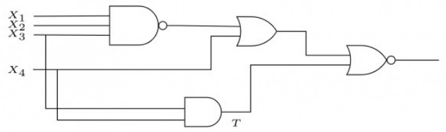

Which of the following inputs $( X _ { 1 } X _ { 2 } X _ { 3 } X _ { 4 } )$ will detect the fault ?

A. 0000 B. 0111 C. 1111 D. None of these

gateit-2007 digital-logic circuit-output normal

# Answer key☟

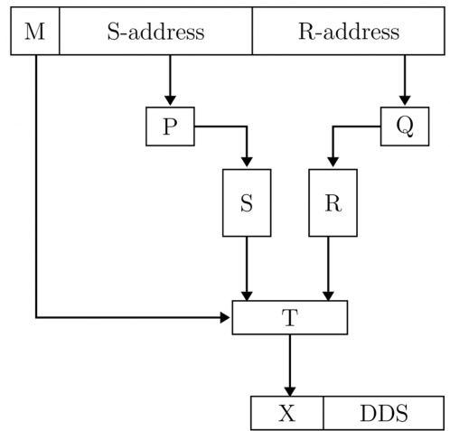

A. $\mathrm { \bf P }$ is $1 0 : 1$ multiplexer $\mathbf { Q }$ is $5 : 1$ multiplexer $\mathrm { \Delta T }$ is $2 : 1$ multiplexer B. $\mathbf { P }$ is $1 0 : 2 ^ { 1 0 }$ decoder $\mathbf { Q }$ is $5 : 2 ^ { 5 }$ decoder $\mathrm { \Delta T }$ is $2 : 1$ encoder C. $\mathrm { \bf P }$ is $1 0 : 2 ^ { 1 0 }$ decoder $\mathbf { Q }$ is $5 : 2 ^ { 5 }$ decoder $\mathrm { \Delta T }$ is $2 : 1$ multiplexer D. $\mathbf { P }$ is $1 : 1 0$ de-multiplexer $\mathbf { Q }$ is $\mathbf { 1 : 5 }$ de-multiplexer is $2 : 1$ multiplexer

Consider the circuit shown below where the gates may have propagation delays. Assume that all signal transitions occur instantaneously and that wires have no delays. Which of the following statements about the circuit is/are CORRECT?

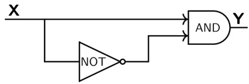

A. With no propagation delays, the output $Y$ is always logic Zero   
B. With no propagation delays, the output $Y$ is always logic One   
C. With propagation delays, the output can have a transient logic One after $X$ transitions from logic Zero to logic One   
D. With propagation delays, the output $Y$ can have a transient logic Zero after $X$ transitions from logic One to logic Zero

How many -to-  line decoders with an enable input are needed to construct a -to- line decoder without using any other logic gates?

A. B. C. D.

gatecse-2007 digital-logic normal isro2011 decoder

# 4.11.2 Decoder: GATE CSE 2020 Question: 20

If there are $m$ input lines and $n$ output lines for a decoder that is used to uniquely address a byte addressable KB RAM, then the minimum value of $m + n$ is

gatecse-2020 numerical-answers digital-logic decoder one-mark

# 4.11.3 Decoder: GATE IT 2008 Question: C

What Boolean function does the circuit below realize?

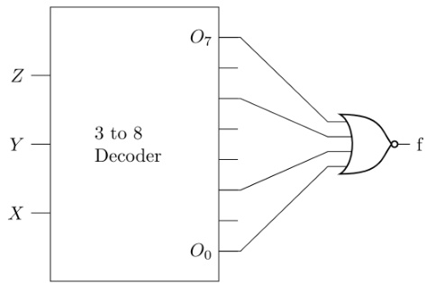

A. $x z + { \overline { { x } } } { \overline { { z } } }$ B. $x \bar { z } + \bar { x } z$   
C. D. $x y + { \overline { { y } } } { \overline { { z } } }$

# Answer key☟

✍ Practice Test: Test (8Q)

A logic network has two data inputs $A$ and $B$ , and two control inputs $C _ { 0 }$ and $C _ { 1 }$ . It implements the function F： $F$ according to the following table.

$$
\left[ \begin{array} { l l } { C _ { 1 } } & { C _ { 0 } } \\ { 0 } & { 0 } \\ { 0 } & { 1 } \\ { 1 } & { 0 } \end{array} \right] \frac { \mathbf { F } } { A + B }
$$

Implement the circuit using one to Multiplexer, one input Exclusive OR gate, one input AND gate, one input OR gate and one Inverter.

A. Express the function $f ( x , y , z ) = x y ^ { \prime } + y z ^ { \prime }$ with only one complement operation and one or more AND/OR operations. Draw the logic circuit implementing the expression obtained, using a single NOT gate and one or more AND/OR gates.   
B. Transform the following logic circuit (without expressing its switching function) into an equivalent logic circuit that employs only  NAND gates each with -inputs.

Consider the following circuit composed of XOR gates and non-inverting buffers.

The non-inverting buffers have delays $\delta _ { 1 } = 2 n s$ and $\delta _ { 2 } = 4 n s$ as shown in the figure. Both XOR gates and all wires have zero delays. Assume that all gate inputs, outputs, and wires are stable at logic level at time . If the following waveform is applied at input $A$ , how many transition(s) (change of logic levels) occur(s) at $B$ during the interval from  to  ns?

Logic1 Time0 2 3 4 5 6 7 9 10 11ns

A. B. C. D.

gatecse-2003 digital-logic digital-circuits

# Answer key☟

Which one of the following circuits is NOT equivalent to a -input (exclusive ) gate?

LDIV B. Y Y D.

In the following truth table, $V = 1$ if and only if the input is valid.

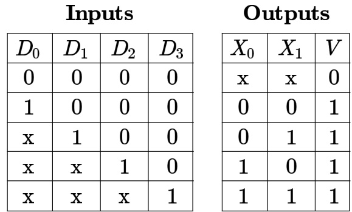

What function does the truth table represent?

A. Priority encoder B. Decoder C. Multiplexer D. Demultiplexer gatecse-2013 digital-logic normal digital-circuits

Consider the following combinational function block involving four Boolean variables $x$ $, y , a , b$ where $x , a , b$ are inputs and $y$ is the output.

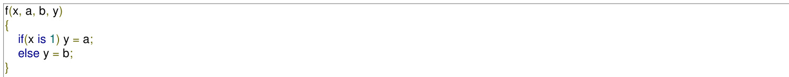

Which one of the following digital logic blocks is the most suitable for implementing this function?

A. Full adder B. Priority encoder C. Multiplexor D. Flip-flop

gatecse-2014-set3 digital-logic easy digital-circuits

# Answer key☟

Consider the digital circuit shown below with two input lines and , two select lines  and , and output line . The blocks $\mathbf { Q }$ and  represent active high $2 : 4$ decoder and -to-  multiplexer, respectively. Out of possible input combinations, the number of combinations that produce ${ \bf Y } = { \bf 1 }$ is (answer in integer)

Note: One input combination is an instance of [ ].

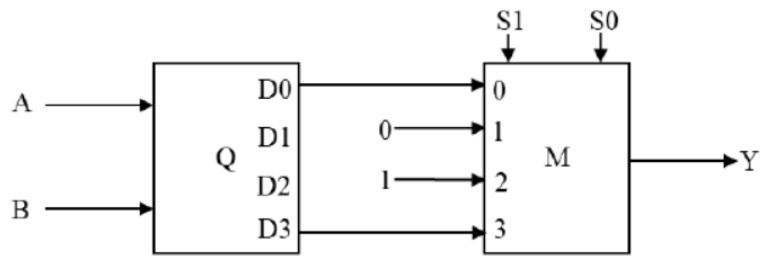

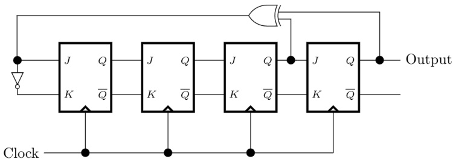

The above circuit produces the output sequence:

A. 1111 1111 0000 0000 B. 1111 0000 1111 0000 C. 1111 0001 0011 0101 D. 1010 1010 1010 1010 gate1987 digital-logic sequential-circuit flip-flop digital-counter

Give a minimal DFA that performs as a mod 13, 's counter, i.e. outputs a  each time the number o 's in the input sequence is a multiple of .

gate1987 digital-logic digital-counter descriptive

For the synchronous counter shown in Fig write the truth table of $Q _ { 0 } , Q _ { 1 }$ , and $Q _ { 2 }$ after each pulse, starting from $Q _ { 0 } = Q _ { 1 } = Q _ { 2 } = 0$ and determine the counting sequence and also the modulus of the counter.

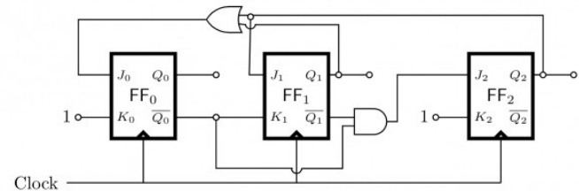

gate1990 descriptive digital-logic sequential-circuit flip-flop digital-counter

Find the maximum clock frequency at which the counter in the figure below can be operated. Assume that the propagation delay through each flip flop and each AND gate is ${ \bf 1 0 n s }$ . Also, assume that the setup time for the $J K$ inputs of the flip flops is negligible.

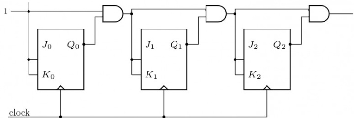

# The number of flip-flops required to construct a binary modulo $N$ counter is

gate1994 digital-logic sequential-circuit flip-flop digital-counter fill-in-the-blanks

Consider the following circuit. $A = a _ { 2 } a _ { 1 } a _ { 0 }$ and $B = b _ { 2 } b _ { 1 } b _ { 0 }$ are three bit binary numbers input to the circuit. The output is $Z = z _ { 3 } z _ { 2 } z _ { 1 } z _ { 0 }$ . R0, R1 and R2 are registers with loading clock shown. The registers are loaded with their input data with the falling edge of a clock pulse (signal CLOCK shown) and appears as shown. The bits of input number A, B and the full adders are as shown in the circuit. Assume Clock period is greater than the settling time of all circuits.

a. For 8 clock pulses on the CLOCK terminal and the inputs $A , B$ as shown, obtain the output $Z$ (sequence of values $Z$ Assume initial contents of $R _ { 0 } , R _ { 1 }$ and $R _ { 2 }$ as all zeros.

# b. What does the circuit implement?

gatecse-2002 digital-logic normal descriptive digital-counter

The minimum number of  flip-flops needed to design a mod-258 counter is

A. 9 B. 8 C. 512 D. 258

gatecse-2011 digital-logic easy digital-counter

Consider a -bit Johnson counter with an initial value of The counting sequence of this counter is

A. 0,1,3,7,15,14,12,8,0 B. 0,1,3,5,7,9,11,13,15,0   
C. 0,2,4,6,8,10,12,14,0 D. 0,8,12,14,15,7,3,1,0

gatecse-2015-set1 digital-logic digital-counter easy

The minimum number of  flip-flops required to construct a synchronous counter with the count sequence $( 0 , 0 , 1 , 1 , 2 , 2 , 3 , 3 , 0 , 0 , . . . )$ is

gatecse-2015-set2 digital-logic digital-counter normal numerical-answers

We want to design a synchronous counter that counts the sequence $0 - 1 - 0 - 2 - 0 - 3$ and then repeats. The minimum number of  flip-flops required to implement this counter is

gatecse-2016-set1 digital-logic digital-counter flip-flop normal numerical-answers

# 4.13.12 Digital Counter: GATE CSE 2017 Set 2 Question: 42

The next state table of a bit saturating up-counter is given below.

$$
\begin{array} { r l } { \underbrace { Q _ { 1 } } _ { 0 } } & { { } Q _ { 0 } \ \middle | \ Q _ { 1 } ^ { + } } & { { } Q _ { 0 } ^ { + } } \\ { \begin{array} { r } { 0 } & { { } 0 } \\ { 0 } & { { } 1 } \end{array} \} \ \mathbf { 0 } } & { { } 1 } \\ { \mathbf { 1 } } & { { } \ 0 } \\ { \mathbf { 1 } } & { { } \ 1 } \end{array}
$$

The counter is built as a synchronous sequential circuit using $T$ flip-flops. The expressions for $T _ { 1 }$ and $T _ { 0 }$ are

$$
\begin{array} { l l } { { T _ { 1 } = Q _ { 1 } Q _ { 0 } , } } & { { T _ { 0 } = \bar { Q } _ { 1 } \bar { Q } _ { 0 } } } \\ { { T _ { 1 } = \bar { Q } _ { 1 } Q _ { 0 } , } } & { { T _ { 0 } = \bar { Q } _ { 1 } + \bar { Q } _ { 0 } } } \\ { { T _ { 1 } = Q _ { 1 } + Q _ { 0 } , } } & { { T _ { 0 } = \bar { Q } _ { 1 } \bar { Q } _ { 0 } } } \\ { { T _ { 1 } = \bar { Q } _ { 1 } Q _ { 0 } , } } & { { T _ { 0 } = Q _ { 1 } + Q _ { 0 } } } \end{array}
$$

A. 011,101,000 B. 001,010,111 C. 011,101,111 D. 001,010,000

Consider a sequential digital circuit consisting of  flip-flops and  flip-flops as shown in the figure.   
is the clock input to the circuit. At the beginning, and  have values  and respectively.

Which one of the given values of Q3) can NEVER be obtained with this digital circuit?

A. (0,0,1) B. (1,0,0) C. (1,0,1) D. (1,1,1)

gatecse-2023 digital-logic flip-flop two-marks digital-counter

# Answer key☟

Consider a -bit saturating up/down counter that performs the saturating up count when the input $P$ is , and the saturating down count when $P$ is . The Next State table of the counter is as shown. The counter is built as a synchronous sequential circuit using $\mathsf { D }$ flip-flops.

Which one of the following options corresponds to the expressions for the inputs of the D flip-flops, $D _ { 1 }$ and $D _ { 0 }$ ?

A. $D _ { 1 } = P Q _ { 1 } + \bar { P } Q _ { 0 } + Q _ { 1 } Q _ { 0 }$ $\begin{array} { r l } & { D _ { 0 } = P Q _ { 0 } + \hat { P } Q _ { 1 } + Q _ { 1 } \overline { { Q _ { 0 } } } } \\ & { D _ { 0 } = \hat { P } \overline { { Q _ { 0 } } } + \hat { P } \hat { Q } _ { 1 } + Q _ { 1 } \overline { { Q _ { 0 } } } } \\ & { D _ { 0 } = \hat { P } Q _ { 0 } + \hat { P } Q _ { 1 } + Q _ { 1 } \overline { { Q _ { 0 } } } } \\ & { D _ { 0 } = P \overline { { Q _ { 0 } } } + \hat { P } Q _ { 1 } + Q _ { 1 } \overline { { Q _ { 0 } } } } \end{array}$   
B. $D _ { 1 } = \bar { P } Q _ { 1 } + \bar { P } Q _ { 0 } + Q _ { 1 } Q _ { 0 }$   
C. $D _ { 1 } = \bar { P } \overline { { Q _ { 1 } } } + \bar { P } Q _ { 0 } + Q _ { 1 } Q _ { 0 }$   
D. $D _ { 1 } = { \cal P } \overline { { { Q _ { 1 } } } } + \bar { \cal P } Q _ { 0 } + Q _ { 1 } Q _ { 0 }$

Consider the following state diagram and its realization by a JK flip flop

00,11 00,11   
8.\*8 Combinational Circuit 01.10 Clock

The combinational circuit generates J and K in terms of x, y and Q. The Boolean expressions for J and K are

A. $\overline { { x \oplus y } }$ and $\overline { { x \oplus y } }$ B. $\overline { { { \boldsymbol { x } } \oplus { \boldsymbol { y } } } }$ and $\boldsymbol { x } \oplus \boldsymbol { y }$ C. $\ b { x } \oplus \ b { y }$ and $\overline { { x \oplus y } }$ D. $\ b { x } \oplus \ b { y }$ and $x \oplus y$ gateit-2008 digital-logic boolean-algebra normal digital-counter

Design a -bit counter using D-flip flops such that not more than one flip-flop changes state between any two consecutive states.

gate1992 digital-logic sequential-circuit flip-flop digital-counter normal descriptive

The dual of a Boolean function $F ( x _ { 1 } , x _ { 2 } , \ldots , x _ { n } , + , \ldots ^ { \prime } )$ , written as $F ^ { D }$ is the same expression as that of $F$ with $+$ and $\cdot$ swapped. $F$ is said to be self-dual if $F = F ^ { D }$ . The number of self-dual functions with $n$ Boolean variables is

A. $2 ^ { n }$ B. $2 ^ { n - 1 }$ C. $2 ^ { 2 ^ { n } }$ D. 22m-1 gatecse-2014-set2 digital-logic normal dual-function boolean-algebra

State True or False with one line explanation

A FSM (Finite State Machine) can be designed to add two integers of any arbitrary length (arbitrary number of digits).

gate1994 digital-logic normal true-false finite-state-machines

If the initial state is unknown, then the shortest input sequence to reach the final state $C$ is:

A. B. 10 C. 101 D. 110

gate1995 digital-logic normal finite-state-machines

Consider the following state table for a sequential machine. The number of states in the minimized machine will be

A. B. C. D.

gate1996 normal digital-logic finite-state-machines

# Answer key☟

Given the following state table of an FSM with two states $A$ and $B$ ,one input and one output.

If the initial state is $A = 0 , B = 0$ what is the minimum length of an input string which will take the machine to the state $A = 0 , B = 1$ with output ${ \bf \Psi } = { \bf 1 } { \bf \Psi }$ .

A. B. C. D. 6

gatecse-2009 digital-logic normal finite-state-machines

Consider the unsigned 8-bit fixed point binary number representation, below,

$$
b _ { 7 } \ b _ { 6 } \ b _ { 5 } \ b _ { 4 } \ b _ { 3 } \ \cdot b _ { 2 } \ b _ { 1 } \ b _ { 0 }
$$

where the position of the primary point is between $b _ { 3 }$ and $b _ { 2 }$ Assume $b _ { 7 }$ is the most significant bit. Some of the decimal numbers listed below cannot be represented exactly in the above representation:

i. 31.500   
ii. 0.875   
iii. 12.100   
iv. 3.001

Which one of the following statements is true?

A. None of  can be exactly represented B. Only cannot be exactly represented C. Only  and cannot be exactly represented D. Only $\textit { i }$ and $\romannumeral 2$ cannot be exactly represented

gatecse-2018 digital-logic number-representation fixed-point-representation normal two-marks ✍ Practice Tests: Test 1 (15Q) Test 2 (6Q)

A sequential circuit takes an input stream of $0 ^ { \prime } s$ and $\mathbf { \Delta } _ { \mathbf { 1 ^ { \prime } } s }$ and produces an output stream of $0 \%$ and $1 ^ { \prime } s .$ Initially it replicates the input on its output until two consecutive $0 ^ { \prime } s$ are encountered on the input. From then onward, it produces an output stream, which is the bit-wise complement of input stream until it encounters two consecutive 1's, whereupon the process repeats. An example input and output stream is shown below.

The input stream: 101100|01001011|011   
The desired output: 101100|10110100|011

J-K master-slave flip-flops are to be used to design the circuit.

a. Give the state transition diagram b. Give the minimized sum-of-product expression for  and $\mathrm { \bf K }$ inputs of one of its state flip-flops output of the $D$ flip-flop is connected to both the I $J$ and $K$ inputs of the $J K$ flip-flop, while the $Q$ output of the $J K$ flip-flop is connected to the input of the $D$ flip-flop. Initially, the output of the $D$ flip-flop S set to logic one and the output of the $J K$ flip-flop is cleared. Which one of the following is the bit sequence (including the initial state) generated at the $Q$ output of the $J K$ flip-flop when the flip-flops are connected to a free-running common clock? Assume that $J = K = 1$ is the toggle mode and $J = K = 0$ is the state holding mode of the $J K$ flip-flops. Both the flip-flops have non-zero propagation delays.

A. 0110110 B. 0100100   
C. 011101110. D. 011001100

gatecse-2015-set1 digital-logic flip-flop normal

Consider a combination of  and  flip-flops connected as shown below. The output of the flip-flop is connected to the input of the $\mathrm { \Delta T }$ flip-flop and the output of the  flip-flop is connected to the input of the flip-flop.

Clock

Initially, both $Q _ { 0 }$ and $Q _ { 1 }$ are set to (before the $1 ^ { \mathrm { s t } }$ clock cycle). The outputs

A. $Q _ { 1 } Q _ { 0 }$ after the $3 ^ { \mathrm { r d } }$ cycle are and after the $4 ^ { \mathrm { t h } }$ cycle are  respectively.   
B. $Q _ { 1 } Q _ { 0 }$ after the $3 ^ { \mathrm { r d } }$ cycle are and after the $4 ^ { \mathrm { t h } }$ cycle are respectively.   
C. $Q _ { 1 } Q _ { 0 }$ after the $3 ^ { \mathrm { r d } }$ cycle are  and after the $4 ^ { \mathrm { t h } }$ cycle are respectively.   
D. $Q _ { 1 } Q _ { 0 }$ after the $3 ^ { \mathrm { r d } }$ cycle are and after the $4 ^ { \mathrm { t h } }$ cycle are  respectively.

Consider the sequential circuit shown in the figure, where both flip-flops used are positive edge-triggered flip-flops.

The number of states in the state transition diagram of this circuit that have a transition back to the same state on some value of "in" is

gatecse-2018 digital-logic flip-flop numerical-answers normal one-mark

Which of the following input sequences for a cross-coupled $R - S$ flip-flop realized with two  gates may lead to an oscillation?

A. 11,00 B. 01,10 C. 10,01 D. 00,11

gateit-2007 digital-logic normal flip-flop

# 4.18.1 Floating Point Representation: GATE CSE 1987 Question: 1-vii

The exponent of a floating-point number is represented in excess- code so that:

A. The dynamic range is large. B. The precision is high.   
C. The smallest number is D. Overflow is avoided. represented by all zeros.

gate1987 digital-logic number-representation floating-point-representation

Consider an excess - representation for floating point numbers with  BCD digit mantissa and BCD digit exponent in normalised form. The minimum and maximum positive numbers that can be represented are and respectively.

descriptive gate1989 digital-logic number-representation floating-point-representation

The base of the scale factor is The range of the exponent is if the scale factor is represented in excess- format.

Following floating point number format is given

$f$ is a fraction represented by ${ \mathsf { a } } 6 - b i t$ mantissa (includes sign bit) in sign magnitude form, $e$ is a exponent (includes sign hit) in sign magnitude form and $n = ( f , e ) = f . 2 ^ { e }$ is a floating point number. Let $A = 5 4 . 7 5$ in decimal and $B = 9 . 7 5$ in decimal

a. Represent $A$ and $B$ as floating point numbers in the above format.   
b. Show the steps involved in floating point addition of $A$ and $B$ ·   
c. What is the percentage error (up to one position beyond decimal point) in the addition operation in (b)?

The following is a scheme for floating point number representation using bits.

Let $s , e$ and $m$ be the numbers represented in binary in the sign, exponent, and mantissa fields respectively. Then the floating point number represented is:

$\left\{ \begin{array} { l l } { ( - 1 ) ^ { s } \left( 1 + m \times 2 ^ { - 9 } \right) 2 ^ { e - 3 1 } , } & { { \mathrm { ~ i f ~ t h e ~ e x p o n e n t ~ } } \neq 1 1 1 1 1 1 1 } \\ { 0 , } & { { \mathrm { ~ o t h e r w i s e } } } \end{array} \right.$ What is the maximum difference between two successive real numbers representable in this system?

A. 2-40 B. 2-9 C. $2 ^ { 2 2 }$ D.

gatecse-2003 digital-logic number-representation floating-point-representation normal

# Answer key☟

Consider the following floating-point format.

Mantissa is a pure fraction in sign-magnitude form.

The decimal number $0 . 2 3 9 \times 2 ^ { 1 3 }$ has the following hexadecimal representation (without normalization and rounding off):

A. OD 24 B. 0D4D C. 4D 0D D. 4D 3D gatecse-2005 digital-logic number-representation floating-point-representation normal

Mantissa is a pure fraction in sign-magnitude form.

The normalized representation for the above format is specified as follows. The mantissa has an implicit 1 preceding the binary (radix) point. Assume that only $0 \mathit { s }$ are padded in while shifting a field.

The normalized representation of the above number $( 0 . 2 3 9 \times 2 ^ { 1 3 } )$ is:

A. 0A20 B. C. 49 D0 D. 4A E8 gatecse-2005 digital-logic number-representation floating-point-representation normal

Show that {NOR} is a functionally complete set of Boolean operations.

gate1989 descriptive digital-logic functional-completeness Answer key☟

All digital circuits can be realized using only

A. Ex-OR gates B. Multiplexers C. Half adders D. OR gates gate1992 normal digital-logic digital-circuits multiple-selects functional-completeness combinational-circuit

Assume that only half adders are available in your laboratory. Show that any binary function can be implemented using half adders only.

gate1993 digital-logic combinational-circuit adder descriptive functional-completeness

The implication gate, shown below has two inputs $( x \operatorname { a n d } y )$ ; the output is 1 except when $x = 1$ and $y = 0$ , realize $\begin{array} { r } { f = \bar { x } y + x \bar { y } } \end{array}$ using only four implication gates.

Show that the implication gate is functionally complete.

gate1998 digital-logic functional-completeness descriptive

A. XOR gates, NOT gates   
B. to 1 multiplexers   
C. AND gates, XOR gates   
D. Three-input gates that output $( A . B ) + C$ for the inputs $A , B$ and $C$ .

gate1999 digital-logic normal functional-completeness multiple-selects

Consider the operations   
$f \left( X , Y , Z \right) = X ^ { \prime } Y Z + X Y ^ { \prime } + Y ^ { \prime } Z ^ { \prime } { \mathrm { a n d ~ } } g \left( X , Y , Z \right) = X ^ { \prime } Y Z + X ^ { \prime } Y Z ^ { \prime } + X Y$   
Which one of the following is correct?

A. Both $\{ f \}$ and $\{ g \}$ are functionally complete B. Only $\{ f \}$ is functionally complete C. Only $\{ g \}$ is functionally complete D. Neither $\{ f \}$ nor $\{ g \}$ is functionally complete gatecse-2015-set1 boolean-algebra difficult functional-completeness

A set of Boolean connectives is functionally complete if all Boolean functions can be synthesized using those. Which of the following sets of connectives is NOT functionally complete?

A. EX-NOR B. implication, negation C. OR, negation D. NAND

gateit-2008 digital-logic easy functional-completeness

Answer key☟

In the IEEE floating point representation the hexadecimal value corresponds to

A. The normalized value B. The normalized value C. The normalized value $+ 0$ D. The special value $+ 0$

gatecse-2008 digital-logic floatin g-point-representation ieee-representation easy

The value of a  type variable is represented using the single-precision floating point format of standard that uses 1 for sign, 8 bits for biased exponent and for the mantissa. A type variable $X$ is assigned the decimal value of -14.25. The representation of $X$ in hexadecimal notat

A. C1640000H B. 416C0000H C. 41640000H D. C16C0000H gatecse-2014-set2 digital-logic number-representation normal ieee-representation

Given the following binary number in -bit (single precision) format

# 00111110011011010000000000000000

The decimal value closest to this floating-point number is :

A. $1 . 4 5 * 1 0 ^ { 1 }$ $\mathsf { B } . \ 1 . 4 5 * 1 0 ^ { - 1 }$ $\complement . \ 2 . 2 7 * 1 0 ^ { - 1 }$ D. $2 . 2 7 * 1 0 ^ { 1 }$

gatecse-2017-set2 digital-logic ieee-representation number-representation floating -point-representation

Consider three registers $R 1$ , $R 2$ , and $R 3$ that store numbers in single precision floating point format. Assume that $R 1$ and $R 2$ contain the values (in hexadecimal notation) and $0 \times 0 . 1 2 0 0 0 0 0$ ， respectively.

If $\begin{array} { r } { R 3 = { \frac { R 1 } { R 2 } } } \end{array}$ what is the value stored in ?

A. 0x40800000 B. OxC0800000 C. 0x83400000 D. 0xC8500000

gatecse-2020 digital-logic ieee-representation floating-point-representation two-marks

# 4.20.6 IEEE Representation: GATE CSE 2021 Set 1 Question: 24

Consider the following representation of a number in IEEE 754 single-precision floating point format with a bias of .

S:1 E: 10000001 F: 11110000000000000000000

Here $\boldsymbol { S }$ ， $E$ and $F$ denote the sign, exponent, and fraction components of the floating point representation. The decimal value corresponding to the above representation (rounded to decimal places) is

gatecse-2021-set1 digital-logic number-representation ieee-representation numerical-answers one-mark floating-point-representation

Consider three floating point numbers $A$ ， $B$ and $\boldsymbol { C }$ stored in registers $\mathrm { R _ { A } }$ ， $\mathrm { \mathbf { R } _ { B } }$ and $\mathrm { R _ { C } }$ respectively as per IEEE-754 single precision floating point format. The content stored in these registers (in hexadecimal form) are as follows.

Which one of the following is

A. $A + C = 0$ E $\ d s _ { \mathrm { ~ \normalfont ~ 3 ~ . ~ } } \ d C = \ d A + \ d B$ C. $B = \beta C$ D. $( B - C ) > 0$

gatecse-2022 digital-logic ieee-representation number-representation two-marks floating-point-representation

Consider the  single precision floating point numbers $\mathbf { P } = 0 { \times } \mathsf { C } 1 8 0 0 0 0 0$ and $\mathsf { Q } = 0 { \times } 3 \mathsf { F } 5 \mathsf { C } 2 \mathsf { E } \mathsf { F } 4$ Which one of the following corresponds to the product of these numbers $\mathbf { P } \times \mathbf { Q } )$ represented in the single precision format?

A. 0x404C2EF4 B. 0x405C2EF4 C. 0xC15C2EF4 D. 0xC14C2EF4

gatecse-2023 digital-logic number-representation ieee-representation two-marks floating-point-representation

​The format of a single-precision floating-point number as per the standard is:

Choose the largest floating-point number among the following options.

Which of the following option(s) is/are CORRECT?

A. $4 ( X + Y ) + Z = 0$ B. $2 Y - Z = 0$ $\complement . \ 4 X + 3 Z = 0 \qquad \ \mathsf { D } . \ X + Y + Z = 0$

gatecse2025-set2 digital-logic number-representation ieee-representation multiple-selects two-marks

Consider the real valued variables $X , Y$ and $Z$ represented using the IEEE  singleprecision floatingpoint format. The binary representations of $X$ and $Y$ in hexadecimal notation are as follows:

Let $Z = X + Y$ .

Which one of the following is the binary representation of $Z$ , in hexadecimal notation?

A. 35C80000 B. 35CC0000 C. 35E80000 D. 35EC0000

gatecse-2026-set1 digital-logic ieee-rep resentation floating-point-representation two-marks

# The -bit   single precision representation of a number is OxC2710000. The number in decimal representation is (rounded off to two decimal places)

gatecse-2026-set2 digital-logic ieee-representation numerical-answers one-mark

The following bit pattern represents floating point number in IEEE  single precision format   
1 10000011 101000000000000000000000   
The value of the number in decimal form is

A. B. -13 C. -26 D. None of the above

ateit-2008 digital-logic ieee-representation number-representation floating-point-representation normal

Answer key☟

A Boolean function $f$ is to be realized only by  gates. Its $K$ -map is given below:

The realization is

C

D.

The Karnaugh map of a function of $( A , B , C )$ is shown on the left hand side of the above figure. The reduced form of the same map is shown on the right hand side, in which the variable $\boldsymbol { C }$ is entered in the map itself. Discuss,

a. The methodology by which the reduced map has been derived and b. the rules (or steps) by which the boolean function can be derived from the entries in the reduced map.

The Boolean function in sum of products form where K-map is given below (figure) is

gate1992 digital-logic k-map normal fill-in-the-blanks

What is the equivalent minimal Boolean expression (in sum of products form) for the Karnaugh map given below?

# What is the equivalent Boolean expression in product-of-sums form for the Karnaugh map given in Fig

A. $B \overline { { D } } + \overline { { B } } D$ B. $( B + \overline { { C } } + D ) ( \overline { { B } } + C + \overline { { D } } )$   
C. $( B + D ) ( \overline { { B } } + \overline { { D } } )$ D. $( B + \overline { { D } } ) ( \overline { { B } } + D )$

gate1996 digital-logic k-map easy

# Answer key☟

The function represented by the Karnaugh map given below is

A. B. AB+BC+CA C. BC D. A.BC

gate1998 digital-logic k-map normal

# Answer key☟

# Which of the following functions implements the Karnaugh map shown below?

A. $\bar { A } B + C D$ B. $D ( C + A )$   
C. $A D + { \bar { A } } B$ D. $( C + D ) ( \bar { C } + D ) + ( A + B )$

gate1999 digital-logic k-map easy

# Answer key☟

C. $( w + x ) ( \bar { w } + y ) ( \bar { x } + y )$

D. None of the above

# Answer key☟

Given the following karnaugh map, which one of the following represents the minimal Sum-Of-Products of the map?

A. $X Y + Y ^ { \prime } Z$ B. $W X ^ { \prime } Y ^ { \prime } + X Y + X Z$ C. $W ^ { \prime } X + Y ^ { \prime } Z + X Y$ D. $X Z + Y$

gatecse-2001 k-map digital-logic normal

# Answer key ☟

Minimum sum of product expression for $f ( w , x , y , z )$ shown in Karnaugh-map below

A. $x z + y ^ { \prime } z$ B. $x z ^ { \prime } + z x ^ { \prime }$ C. $x ^ { \prime } y + z x ^ { \prime }$ D. None of the above

gatecse-2002 digital-logic k-map normal

# Answer key☟

The literal count of a Boolean expression is the sum of the number of times each literal appears in expression. For example, the literal count of $( x y + x z ^ { \prime } )$ is What are the minimum possible literal counts of the product-of-sum and sum-of-product representations respectively of the function given by the following Karnaugh map? Here, $X$ denotes "don't care"

A. (11,9) B. (9,13) C. (9,10) D. (11,11)

In the Karnaugh map shown below, $X$ denotes a don’t care term. What is the minimal form of the function represented by the Karnaugh map?

A. $\bar { b } . \bar { d } + \bar { a } . \bar { d }$ B. $\bar { a } . \bar { b } + \bar { b } . \bar { d } + \bar { a } . b . \bar { d }$   
C. $\bar { b } . \bar { d } + \bar { a } . b . \bar { d }$ D. $\bar { a } . \bar { b } + \bar { b } . \bar { d } + \bar { a } . \bar { d }$

gatecse-2008 digital-logic k-map easy

# Answer key☟

# What is the minimal form of the Karnaugh map shown below? Assume that $X$ denotes a don’t care term

A. B.   
C. D. $\bar { b } \bar { d } + \bar { b } \bar { c } + \bar { c } \bar { d }$

gatecse-2012 digital-logic k-map easy

# Answer key☟

​Given the following Karnaugh Map for a Boolean function $F ( w , x , y , z )$ :

Which one or more of the following Boolean expression(s) represent(s)  ? ？

A. $\bar { w } \bar { x } \bar { y } \bar { z } + w \bar { x } \bar { y } \bar { z } + \bar { w } \bar { x } y \bar { z } + w \bar { x } y \bar { z } + x z$   
B. $\bar { w } \bar { x } \bar { y } \bar { z } + \bar { w } \bar { x } y \bar { z } + w \bar { x } y z + x z$   
C. $\bar { w } \bar { x } \bar { y } \bar { z } + w \bar { x } \bar { y } \bar { z } + w \bar { x } \bar { y } z + x z$   
D. $\overline { { x } } \overline { { z } } + x z$

The boolean function for a combinational circuit with four inputs is represented by the following Karnaugh map.

Which of the product terms given below is an essential prime implicant of the function?

A. QRS B. PQS C. PQ'S' D.

gateit-2006 digital-logic k-map normal

Consider the following expression   
$a \bar { d } + \bar { a } \bar { c } + b \bar { c } d$   
Which of the following Karnaugh Maps correctly represents the expression?

gateit-2007 digital-logic k-map normal

Consider the following expression

$a \bar { d } + \bar { a } \bar { c } + b \bar { c } d$ Which of the following expressions does not correspond to the Karnaugh Map obtained for the given expression?

A. $\bar { c } \bar { d } + a \bar { d } + a b \bar { c } + \bar { a } \bar { c } d$   
B. $\bar { a } \bar { c } + \bar { c } \bar { d } + a \bar { d } + a b \bar { c } d$   
C. $\bar { a } \bar { c } + a \bar { d } + a b \bar { c } + \bar { c } d$   
D. $\bar { b } \bar { c } \bar { d } + a c \bar { d } + \bar { a } \bar { c } + a b \bar { c }$

gateit-2007 digital-logic k-map normal

# 4.23.1 Memory Interfacing: GATE CSE 1995 Question: 2.2

The capacity of a memory unit is defined by the number of words multiplied by the number of bits/word. How many separate address and data lines are needed for a memory of $4 K \times 1 6 ?$

A. address, data lines B. address, data lines C. address,  data lines D. address, data lines

gate1995 digital-logic memory-interfacing normal

# 4.23.2 Memory Interfacing: GATE CSE 2009 Question: 7, ISRO2015-3

How many $3 2 K \times 1$ RAM chips are needed to provide a memory capacity of $2 5 6 K$ bytes?

A. B. 32 C. 64 D. 128   
gatecse-2009 digital-logic memory-interfacing easy isro2015

# 4.23.3 Memory Interfacing: GATE CSE 2010 Question: 7

The main memory unit with a capacity of   is built using $1 \mathrm { M } \times 1$ DRAM chips. Each DRAM chip has rows of cells with cells in each row. The time taken for a single refresh operation is 100 nanoseconds. The time required to perform one refresh operation on all the cells in the memory unit is

A. nanoseconds B. $1 0 0 \times 2 ^ { 1 0 }$ nanoseconds C. $1 0 0 \times 2 ^ { 2 0 }$ nanoseconds D. $3 2 0 0 \times 2 ^ { 2 0 }$ nanoseconds

gatecse-2010 digital-logic memory-interfacing normal

A RAM chip has a capacity of 1024 words of 8 bits each $( 1 \mathsf { K } \times 8 )$ . The number of $2 \times 4$ decoders with enable line needed to construct a $1 6 \mathsf { K } \times 1 6$ RAM from $1 \mathsf { K } \times \mathsf { 8 }$ RAM is

(A) 4 (B) 5 (C) 6 (D) 7

gatecse-2013 digital-logic normal memory-interfacing

# 4.23.5 Memory Interfacing: GATE IT 2005 Question: 9

A dynamic RAM has a memory cycle time of  . It has to be refreshed times per msec and each refresh takes . What percentage of the memory cycle time is used for refreshing?

A. B. 6.4 C. D. 0.64

gateit-2005 digital-logic memory-interfacing normal

Answer key☟

Implement a circuit having the following output expression using an inverter and a nand gate

$$
Z = { \overline { { A } } } + { \overline { { B } } } + C
$$

gate1995 digital-logic normal descriptive min-no-gates digital-circuits boolean-algebra

# Answer key☟

Design a logic circuit to convert a single digit BCD number to the number modulo six as follows (Do not detect illegal input):

A. Write the truth table for all bits. Label the input bits $I _ { 1 } , I _ { 2 } , \ldots$ with $I _ { 1 }$ as the least significant bit. Label the output bits $R _ { 1 }$ ， $R _ { 2 }$ with $R _ { 1 }$ as the least significant bit. Use  to signify truth.   
B. Draw one circuit for each output bit using, altogether, two two-input AND gates, one two-input OR gate and two NOT gates.

gatecse-2000 digital-logic min-no-gates descriptive

A circuit outputs a digit in the form of bits. is represented by by $_ { 0 0 0 1 , \ldots , 9 }$ by . A combinational circuit is to be designed which takes these bits as input and outputs if the digit $\geq 5$ , and otherwise. If only  and  gates may be used, what is the minimum number of gates required?

A. B. 3 C. 4 D. 5 gatecse-2004 digital-logic normal min-no-gates

# 4.24.4 Min No Gates: GATE CSE 2009 Question: 6

What is the minimum number of gates required to implement the Boolean function $\mathrm { \underline { { A B } } + C } )$ if we have to use only gates?

A. B. 3 C. D. gatecse-2009 digital-logic min-no-gates normal

Consider the Karnaugh map given below, where $X$ represents "don't care" and blank represents .

Assume for all inputs $( a , b , c , d )$ , the respective complements $( \bar { a } , \bar { b } , \bar { c } , \bar { d } )$ are also available. The above logic is implemented using -input gates only. The minimum number of gates required is

What is the minimum number of gates required to implement a EXCLUSIVE-OR function without using any other logic gate?

A. B. C. D.

gateit-2004 digital-logic min-no-gates normal

Find the minimum product of sums of the following expression

$$
f = A B C + { \overline { { A } } } { \overline { { B } } } { \overline { { C } } }
$$

gate1990 digital-logic boolean-algebra min-products-of-sum-form canonical-normal-form descriptive

# 4.25.2 Min Products of Sum Form: GATE CSE 2017 Set 2 Question: 28

Given $f ( w , x , y , z ) = \Sigma _ { m } ( 0 , 1 , 2 , 3 , 7 , 8 , 1 0 ) + \Sigma _ { d } ( 5 , 6 , 1 1 , 1 5 )$ ; where $d$ represents the 'don't-care' condition in Karnaugh maps. Which of the following is a minimum product-of-sums (POS) form of $f ( w , x , y , z ) ?$

A. $f = ( \bar { w } + \bar { z } ) ( \bar { x } + z )$ B $\begin{array} { c } { { \dots f = ( \bar { w } + z ) ( x + z ) } } \\ { { \dots f = ( w + \bar { z } ) ( \bar { x } + z ) } } \end{array}$ C. $f = ( w + z ) ( \bar { x } + z )$ D

gatecse-2017-set2 digital-logic min-products-of-sum-form

# Answer key☟

# 4.26

# Min Sum of Products Form (16)

✍ Practice Tests: Test 1 (15Q) Test 2 (1Q)

# 4.26.1 Min Sum of Products Form: GATE CSE 1991 Question: 5-b

Find the minimum sum of products form of the logic function $f ( A , B , C , D ) = \Sigma _ { m } ( 0 , 2 , 8 , 1 0 , 1 5 ) + \Sigma _ { d } ( 3 , 1 1 , 1 2 , 1 4 )$ where $m$ and $d$ represent minterm and don't care term respectively.

gate1991 digital-logic boolean-algebra min-sum-of-products-form descriptive

A. Express $f$ as the minimal sum of products. Write only the answer. B. If the output line is stuck at , for how many input combinations will the value of $f$ be correct?

gate1997 digital-logic min-sum-of-products-form numerical-answers

三 Excess -3 $b _ { 8 }$ $b _ { 4 }$ toBCD $b _ { 2 }$   
$e _ { 1 }$ $b _ { 1 }$

# Answer key☟

The switching expression corresponding to $f ( A , B , C , D ) = \Sigma ( 1 , 4 , 5 , 9 , 1 1 , 1 2 )$ is:

A. $B C ^ { \prime } D ^ { \prime } + A ^ { \prime } C ^ { \prime } D + A B ^ { \prime } D$ B. $A B C ^ { \prime } + A C D + B ^ { \prime } C ^ { \prime } D$   
C. $A C D ^ { \prime } + A ^ { \prime } B C ^ { \prime } + A C ^ { \prime } D ^ { \prime }$ D. $A ^ { \prime } B D + A C D ^ { \prime } + B C D ^ { \prime }$

gatecse-2005 digital-logic normal min-sum-of-products-form

Consider the following Boolean function of four variables:

$$
f ( w , x , y , z ) = \Sigma ( 1 , 3 , 4 , 6 , 9 , 1 1 , 1 2 , 1 4 )
$$

The function is

A. independent of one variables. B. independent of two variables C. independent of three variables. D. dependent on all variables

gatecse-2007 digital-logic normal min-sum-of-products-form k-map

The simplified SOP (Sum of Product) from the Boolean expression

$$
( P + { \bar { Q } } + { \bar { R } } ) . ( P + { \bar { Q } } + R ) . ( P + Q + { \bar { R } } )
$$

is

A. $( { \bar { P } } . Q + { \bar { R } } )$ B $. \ ( P + { \bar { Q } } . { \bar { R } } )$ ${ \sf C } . \left( \bar { P } . Q + R \right)$ D. (P.Q+R)

gatecse-2011 digital-logic normal min-sum-of-products-form

# 4.26.7 Min Sum of Products Form: GATE CSE 2014 Set 1 Question: 45

Consider the 4-to-1 multiplexer with two select lines $S _ { 1 }$ and $S _ { 0 }$ given below

The minimal sum-of-products form of the Boolean expression for the output $F$ of the multiplexer is

A. $\bar { P } Q + Q \bar { R } + P \bar { Q } R$ B. $\bar { P } Q + \bar { P } Q \bar { R } + P Q \bar { R } + P \bar { Q } R$ C. $\bar { P } Q R + \bar { P } Q \bar { R } + Q \bar { R } + P \bar { Q } R$ D. PQR

gatecse-2014-set1 digital-logic normal multiplexer min-sum-of-products-form

Consider the following Boolean expression for F: $F ( P , Q , R , S ) = P Q + \bar { P } Q R + \bar { P } Q \bar { R } S$ The minimal sum of products form of $F$ is

A. $P Q + Q R + Q S$ B. $P + Q + R + S$   
C. $\bar { P } + \bar { Q } + \bar { R } + \bar { S }$ D. $\bar { P } R + \bar { R } \bar { P } S + P$

Consider the following minterm expression for $F$ :

$$
F ( P , Q , R , S ) = \sum 0 , 2 , 5 , 7 , 8 , 1 0 , 1 3 , 1 5
$$

The minterms , , 8 and  are 'do not care' terms. The minimal sum-of-products form for $F$ is

A. $Q \bar { S } + \bar { Q } S$ B. $\bar { Q } \bar { S } + Q S$   
C. $\bar { Q } \bar { R } \bar { S } + \bar { Q } R \bar { S } + Q \bar { R } S + Q R S$ D. $\bar { P } \bar { Q } \bar { S } + \bar { P } Q S + P Q S + P \bar { Q } \bar { S }$

gatecse-2014-set3 digital-logic min-sum-of-products-form normal

Consider the minterm list form of a Boolean function $F$ given below.

$$
F ( P , Q , R , S ) = \Sigma m ( 0 , 2 , 5 , 7 , 9 , 1 1 ) + d ( 3 , 8 , 1 0 , 1 2 , 1 4 )
$$

Here, m denotes a minterm and $d$ denotes a don't care term. The number of essential prime implicants of the function is

gatecse-2018 digital-logic min-sum-of-products-form k-map numerical-answers two-marks

Consider a Boolean function $f ( w , x , y , z )$ such that

$$
\begin{array} { l c l } { f ( w , 0 , 0 , z ) } & { = } & { 1 } \\ { f ( 1 , x , 1 , z ) } & { = } & { x + z } \\ { f ( w , 1 , y , z ) } & { = } & { w z + y } \end{array}
$$

The number of literals in the minimal sum-of-products expression of $f$ is

gatecse-2021-set2 digital-logic boolean-algebra min-sum-of-products-form numerical-answers two-mark

# .26.12 Min Sum of Products Form: GATE CSE 2024 Set 1 Question: 37

Consider a Boolean expression given by $\operatorname { F } ( \mathrm { X } , \mathrm { Y } , \mathrm { Z } ) = \sum ( 3 , 5 , 6 , 7 )$ . Which of the following statements is/are CORRECT?

A. $\operatorname { F } ( \mathrm { X } , \mathrm { Y } , \mathrm { Z } ) = \Pi ( 0 , 1 , 2 , 4 )$ B. $\scriptstyle \mathbf { F } ( \mathbf { X } , \mathbf { Y } , \mathbf { Z } ) = \mathbf { X } \mathbf { Y } + \mathbf { Y } \mathbf { Z } + \mathbf { X } \mathbf { Z }$ C. $\mathrm { F } ( \mathrm { X } , \mathrm { Y } , \mathrm { Z } )$ is independent of input D. $_ { \mathrm { ~ X ~ } } ^ { \mathrm { ~ F ( X , Y , Z ) ~ } }$ is independent of input V

gatecse-2024-set1 multiple-selects digital-logic min-sum-of-products-form two-marks

Consider the following four variable Boolean function in sum-of-product form

$$
F \left( b _ { 3 } , b _ { 2 } , b _ { 1 } , b _ { 0 } \right) = \sum ( 0 , 2 , 4 , 8 , 1 0 , 1 1 , 1 2 )
$$

where the value of the function is computed by considering $b _ { 3 } b _ { 2 } b _ { 1 } b _ { 0 }$ as a -bit binary number, where $b _ { 3 }$ denotes the most significant bit and $b _ { 0 }$ denotes the least significant bit. Note that there are no don't care terms. Which ONE of the following options is the CORRECT minimized Boolean expression for $F$ ?

A. $\bar { b } _ { 1 } \bar { b } _ { 0 } + \bar { b } _ { 2 } \bar { b } _ { 0 } + b _ { 1 } \bar { b } _ { 2 } b _ { 3 }$ $\begin{array} { l } { { \mathsf { B . } \ \bar { b } _ { 1 } \bar { b } _ { 0 } + \bar { b } _ { 2 } \bar { b } _ { 0 } } } \\ { { \mathsf { D . } \ \bar { b } _ { 0 } \bar { b } _ { 2 } + \bar { b } _ { 3 } } } \end{array}$   
C. $\bar { b } _ { 2 } \bar { b } _ { 0 } + b _ { 1 } b _ { 2 } b _ { 3 }$

gatecse2025-set1 digital-logic min-sum-of-products-form easy two-marks

Consider a Boolean function $F$ with the following minterm expression:

$$
F ( P , Q , R , S ) = \sum m ( 1 , 2 , 3 , 4 , 5 , 7 , 1 0 , 1 2 , 1 3 , 1 4 )
$$

Which of the following options is/are the minimal sum-of-products expression(s) of $F$ ?

A. $\bar { P } S + Q \bar { R } + \bar { P } \bar { Q } R + \bar { Q } R \bar { S }$   
B. $\bar { P } S + Q \bar { R } + \bar { P } \bar { Q } R + P R \bar { S }$   
C. $\bar { P } S + Q \bar { R } + P Q \bar { S } + P R \bar { S }$   
D. $\bar { P } S + Q \bar { R } + P Q \bar { S } + \bar { Q } R \bar { S }$

gatecse-2026-set1 two-marks digital-logic min-sum-of-products-form k-map multiple-selects

Consider the following -variable Boolean function

$$
F ( A , B , C , D ) = \Sigma m ( 0 , 1 , 2 , 3 , 8 , 9 , 1 0 , 1 1 )
$$

Consider $A$ as MSB, $D$ as LSB. Which one of the following options represents the minimal sum of products form for the above function?

Note: $+$ is OR operation, $\cdot$ is AND operation, $^ \prime$ is NOT operation

A. $A ^ { \prime } + B ^ { \prime } + C ^ { \prime } + D ^ { \prime }$ B. $B ^ { \prime }$   
C. $\boldsymbol { A ^ { \prime } \cdot B ^ { \prime } + A \cdot B }$ D. $A ^ { \prime }$

gatecse-2026-set2 digital-logic min-sum-of-products-form k-map two-marks

# 4.26.16 Min Sum of Products Form: GATE IT 2008 Question: 8

Consider the following Boolean function of four variables $f ( A , B , C , D ) = \Sigma ( 2 , 3 , 6 , 7 , 8 , 9 , 1 0 , 1 1 , 1 2 , 1 3 )$ The function is

A. independent of one variable B. independent of two variables C. independent of three variable D. dependent on all the variables

gateit-2008 digital-logic normal min-sum-of-products-form

✍ Practice Tests: Test 1 (15Q) Test 2 (13Q) Weekly Quiz 4 (15Q)

Show with the help of a block diagram how the Boolean function

$$
\scriptstyle f = A B + B C + C A
$$

can be realised using only a $4 { : } 1$ multiplexer.

gate1990 descriptive digital-logic combinational-circuit multiplexer

# Answer key☟

A multiplexer with a 一 data select input is a

A. 4:1 multiplexer B. ${ \bf 2 } : { \bf 1 }$ multiplexer C. 16:1 multiplexer D. multiplexer gate1998 digital-logic multiplexer easy

Consider the circuit shown below. The output of ${ \mathsf { a } } 2 : 1$ MUX is given by the function $( a c ^ { \prime } + b c )$ .

Which of the following is true?

A. $f = X _ { 1 } ^ { \prime } + X _ { 2 }$ B. $f = X _ { 1 } ^ { \prime } X _ { 2 } + X _ { 1 } X _ { 2 } ^ { \prime }$   
C. $f = X _ { 1 } ^ { \cdot } X _ { 2 } + X _ { 1 } ^ { \prime } X _ { 2 } ^ { \prime }$ D. $f = X _ { 1 } ^ { - } + X _ { 2 } ^ { \prime }$

gatecse-2001 digital-logic normal multiplexer

Consider a multiplexer with $X$ and $Y$ as data inputs and $Z$ the as the control input. $Z = 0$ selects input $X$ and $Z = 1$ selects input $Y$ . What are the connections required to realize the 2-variable Boolean function $f = T + R$ , without using any additional hardware?

A.R to X,1 toY,T to Z B. TtoX,RtoY,TtoZ C. T to X,R to Y,0 to Z D. R to X,0 to Y,T to Z

gatecse-2004 digital-logic normal multiplexer

# 4.27.5 Multiplexer: GATE CSE 2007 Question: 34

Suppose only one multiplexer and one inverter are allowed to be used to implement any Boolean function o $n$ variables. What is the minimum size of the multiplexer needed?

A. $2 ^ { n }$ line to line B. line to line C. $2 ^ { n - 1 }$ line to line D. $2 ^ { n - 2 }$ line to line

gatecse-2007 digital-logic normal multiplexer

Consider the two cascade to multiplexers as shown in the figure

The minimal sum of products form of the output $X$ is

A. $\overline { { P } } \overline { { Q } } + P Q R$ $\begin{array} { l } { { \mathsf { B . } \displaystyle \overline { { P } } Q + Q R } } \\ { { \mathsf { D . } \displaystyle \overline { { Q } } \overline { { R } } + P Q R } } \end{array}$   
C. $P Q + { \overline { { P } } } { \overline { { Q } } } R$

gatecse-2016-set1 digital-logic multiplexer normal

A multiplexer is placed between a group of registers and an accumulator to regulate data movement such that at any given point in time the content of only one register will move to the accumulator. The number of select lines needed for the multiplexer is

gatecse-2020 numerical-answers digital-logic multiplexer one-mark

Which one of the following circuits implements the Boolean function given below? $f ( x , y , z ) = m _ { 0 } + m _ { 1 } + m _ { 3 } + m _ { 4 } + m _ { 5 } + m _ { 6 }$ , where $m _ { i }$ is the $i ^ { \mathrm { t h } }$ minterm.

B. D. $X$   
A. B. $X ^ { \prime }$   
$\boldsymbol { X } ^ { \prime }$ $X$   
C. D.

gatecse-2021-set2 digital-logic combinational-circuit multiplexer one-mark

A Boolean digital circuit is composed using two -input multiplexers and one -input multiplexer (M3) as shown in the figure.  are the inputs of the multiplexers and could be connected to either  or The select lines of the multiplexers are connected to Boolean variables as shown.

Which one of the following set of values of will realise the Boolean function $\overline { { { \bf A } } } + \overline { { { \bf A } } } \cdot \overline { { { \bf C } } } + { \bf A } \cdot \overline { { { \bf B } } } \cdot { \bf C } \mathrm { ? }$

A. $\mathbf { \Phi } _ { ( 1 , 1 , 0 , 1 , 1 , 1 , 0 , 0 ) } ^ { ( 1 , 1 , 0 , 0 , 1 , 1 , 1 , 0 ) }$ B. (1,1,0,0,1,1,0,1) C. D. (0,0,1,1,0,1,1,1)

gatecse-2023 digital-logic combinational-circuit multiplexer two-marks

Consider a digital logic circuit consisting of three -to-  multiplexers , and  as shown below. and  are inputs of .  and  are inputs of . , and  are select lines of , and , respectively.

For an instance of inputs $\mathbf { X 1 } = \mathbf { 1 } , \mathbf { X 2 } = \mathbf { 1 } , \mathbf { X 3 } = \mathbf { 0 }$ , and $\mathbf { X 4 } = \mathbf { 0 }$ , the number of combinations of  that give the output $\mathbf { Y } = \mathbf { 1 }$ is

A. 1,0,B B. 1,0,A C. 0,1,B D. 0,1,A

gateit-2005 digital-logic normal multiplexer

The following circuit implements a two-input AND gate using two 一 1 multiplexers.

What are the values of $X _ { 1 } , X _ { 2 } , X _ { 3 } ?$

A. $X _ { 1 } = b , X _ { 2 } = 0 , X _ { 3 } = a$ B. $X _ { 1 } = b , X _ { 2 } = 1 , X _ { 3 } = b$   
C. $X _ { 1 } = a , X _ { 2 } = b , X _ { 3 } = 1$ D. $X _ { 1 } = a , X _ { 2 } = 0 , X _ { 3 } = b$

gateit-2007 digital-logic normal multiplexer

# 4.27.14 Multiplexer: GATE1992-04-b

A priority encoder accepts three input signals and produces a two-bit output $( X _ { 1 } , X _ { 0 } )$ corresponding to the highest priority active input signal. Assume $A$ has the highest priority followed by $B$ and $C$ has the lowest priority. If none of the inputs are active the output should be , design the priority encoder using $4 { : } 1$ multiplexers as the main components.

gate1992 digital-logic combinational-circuit multiplexer descriptive ✍ Practice Tests: Test 1 (15Q) Test 2 (15Q) Test 3 (15Q) Test 4 (15Q) Test 5 (9Q)

When two -bit numbers $A = a _ { 3 } a _ { 2 } a _ { 1 } a _ { 0 }$ and $B = b _ { 3 } b _ { 2 } b _ { 1 } b _ { 0 }$ are multiplied, the bit $c _ { 1 }$ of the product $\boldsymbol { C }$ is given by

gate1991 digital-logic normal number-representation fill-in-the-blanks

Consider addition in two's complement arithmetic. A carry from the most significant bit does not always correspond to an overflow. Explain what is the condition for overflow in two's complement arithmetic.

gate1992 digital-logic normal number-representation descriptive

Convert the following numbers in the given bases into their equivalents in the desired bases:

A. $( 1 1 0 . 1 0 1 ) _ { 2 } = ( x ) _ { 1 0 }$   
B. $( 1 1 1 8 ) _ { 1 0 } = ( y ) _ { H }$

gate1993 digital-logic number-representation normal descriptive

Consider $n$ -bit (including sign bit) $2 ^ { \prime } s$ complement representation of integer numbers. The range of integer values, $N$ , that can be represented is $\leq N \leq \_$

gate1994 digital-logic number-representation easy fill-in-the-blanks

# 4.28.7 Number Representation: GATE CSE 1995 Question: 18

The following is an incomplete Pascal function to convert a given decimal integer (in the range $^ { - 8 }$ to $+ 7 )$ ) into a binary integer in ’s complement representation. Determine the expressions $_ { A , B , C }$ that complete program.

The number of 's in the binary representation of $( 3 * 4 0 9 6 + 1 5 * 2 5 6 + 5 * 1 6 + 3 )$ are:

A. B. C. 10 D.

gate1995 digital-logic number-representation normal isro2015

Consider the following floating-point number representation.

The exponent is in $2 ^ { \prime } s$ complement representation and the mantissa is in the sign-magnitude representation. The range of the magnitude of the normalized numbers in this representation is

A. to B. to C. $2 ^ { - 2 3 }$ to D. to $\left( 1 - 2 ^ { - 2 3 } \right)$

gate1996 digital-logic number-representation normal

# 4.28.10 Number Representation: GATE CSE 1997 Question: 5.4

Given $\sqrt { ( 2 2 4 ) _ { r } } = ( 1 3 ) _ { r }$ . The value of the radix $r$ is:

A. B. C. D. 6

gate1997 digital-logic number-representation normal

# 4.28.11 Number Representation: GATE CSE 1998 Question: 1.17

The octal representation of an integer is . If this were to be treated as an eight-bit integer in an based computer, its decimal equivalent is

A. 226 B. C. D.

gate1998 digital-logic number-representation normal

# 4.28.12 Number Representation: GATE CSE 1998 Question: 2.20

Suppose the domain set of an attribute consists of signed four digit numbers. What is the percentage o reduction in storage space of this attribute if it is stored as an integer rather than in character form?

A. $8 0 \%$ B. 20\% C. 60\% D. 40\%

gate1998 digital-logic number-representation normal

# 4.28.13 Number Representation: GATE CSE 1999 Question: 2.17

Zero has two representations in

A. Sign-magnitude B. complement C. complement D. None of the above

gate1999 digital-logic number-representation easy multiple-selects