# The number in $2 ^ { \prime } s$ complement representation is

A. 01010101 B. 11010101 C. 00101011 D. 10101011

gatecse-2000 digital-logic number-representation easy

Consider the values of $A = 2 . 0 \times 1 0 ^ { 3 0 }$ $B = - 2 . 0 \times 1 0 ^ { 3 0 }$ $C = 1 . 0$ and the sequence

$$
\begin{array} { r l } { { \mathsf { X } } { : = } \mathsf { A } + \mathsf { B } \qquad } & { { } \mathsf { Y } { : = } \mathsf { A } + \mathsf { C } } \\ { { \mathsf { X } } { : = } { \mathsf { X } } + \mathsf { C } \qquad } & { { } \mathsf { Y } { : = } { \mathsf { Y } } + \mathsf { B } } \end{array}
$$

executed on a computer where floating point numbers are represented with  bits. The values for $X$ and $Y$ will be

A. $X = 1 . 0 , Y = 1 . 0$ $\begin{array} { l l } { { 3 . } } & { { X = 1 . 0 , Y = 0 . 0 } } \\ { { ) . } } & { { X = 0 . 0 , Y = 0 . 0 } } \end{array}$ C. $X = 0 . 0 \dot { , } Y = 1 . 0$ [

gatecse-2000 digital-logic number-representation normal

# 4.28.16 Number Representation: GATE CSE 2001 Question: 2.10

The $2 ^ { \prime } s$ complement representation of $( - 5 3 9 ) _ { 1 0 }$ in hexadecimal is

A. ABE B. DBC C. DE5 D. 9E7

gatecse-2001 digital-logic number-representation easy

The decimal value

A. is equivalent to the binary value B. is equivalent to the binary value C. is equivalent to the binary value D. cannot be represented precisely in binary gatecse-2002 digital-logic number-representation easy

# 4.28.18 Number Representation: GATE CSE 2002 Question: 1.15

The $2 ^ { \prime } s$ complement representation of the decimal value $- 1 5$ is

A. 1111 B. 11111 C. 111111 D. 10001

gatecse-2002 digital-logic number-representation easy

Answer key☟

In $2 ^ { \prime } s$ complement addition, overflow

A. is flagged whenever there is carry from sign bit addition B. cannot occur when a positive value is added to a negative value C. is flagged when the carries from sign bit and previous bit match D. None of the above

gatecse-2002 digital-logic number-representation normal

Consider the following  floating-point representation scheme as shown in the format below. A value is specified by  fields, a one bit sign field (with for positive and  for negative values), a  fraction field (with the binary point is at the left end of the fraction bits), and a  exponent field (in  signed integer representation, with is the base of exponentiation). The sign bit is the most significant bit.

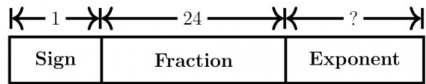

A. It is required to represent the decimal value $- 7 . 5$ as a normalized floating point number in the given format. Derive the values of the various fields. Express your final answer in the hexadecimal. B. What is the largest value that can be represented using this format? Express your answer as the nearest power of .

gatecse-2002 digital-logic number-representation normal descriptive

Assuming all numbers are in $2 ^ { \prime } s$ complement representation, which of the following numbers is divisible by 11111011?

A. 11100111 B. 11100100 C. 11010111 D. 11011011

gatecse-2003 digital-logic number-representation normal

# 4.28.23 Number Representation: GATE CSE 2004 Question: 19

If $7 3 _ { x }$ (in base-x number system) is equal to $5 4 _ { y }$ (in base $y$ -number system), the possible values of $x$ and $y$ are

A. B. 10,12 C. 9,13 D.

gatecse-2004 digital-logic number-representation easy

Let $A = 1 1 1 1 1 0 1 0$ and $B = 0 0 0 0 1 0 1 0$ be two 一 bit $\mathbf { 2 ^ { \prime } } \boldsymbol { s }$ complement numbers. Their product in $\mathbf { 2 } ^ { \prime } \boldsymbol { s }$ complement is

A. 11000100 B. 10011100 C. 10100101 D. 11010101

gatecse-2004 digital-logic number-representation easy

# .28.26 Number Representation: GATE CSE 2005 Question: 16, ISRO2009-18, ISRO2015-2

The range of integers that can be represented by an $n$ bit $2 ^ { \prime } s$ complement number system is:

A. $- 2 ^ { n - 1 }$ to $( 2 ^ { n - 1 } - 1 )$ B. $- ( 2 ^ { n - 1 } - 1 )$ to $( 2 ^ { n - 1 } - 1 )$ C. $- 2 ^ { n - 1 }$ to 2n-1 D. $- ( 2 ^ { n - 1 } + 1 )$ to $( 2 ^ { n - 1 } - 1 )$

gatecse-2005 digital-logic number-representation easy isro2009 isro2015

Answer key☟

# 4.28.27 Number Representation: GATE CSE 2005 Question: 17

The hexadecimal representation of $( 6 5 7 ) _ { 8 }$ is:

A. B. D78 C. D. 32F

gatecse-2005 digital-logic number-representation easy

# 4.28.28 Number Representation: GATE CSE 2006 Question: 39

We consider the addition of two $2 ^ { \prime } s$ complement numbers $b _ { n - 1 } b _ { n - 2 } \ldots b _ { 0 }$ and $a _ { n - 1 } a _ { n - 2 } \dots a _ { 0 }$ . A binary adder for adding unsigned binary numbers is used to add the two numbers. The sum is denoted by $c _ { n - 1 } c _ { n - 2 } \ldots c _ { 0 }$ and the carry-out by $c _ { o u t }$ . Which one of the following options correctly identifies the overflow condition?

A. $\begin{array} { l } { c _ { o u t } \left( \overline { { a _ { n - 1 } \oplus b _ { n - 1 } } } \right) } \\ { c _ { o u t } \oplus c _ { n - 1 } } \end{array}$ $\mathsf { B . } \ a _ { n - 1 } b _ { n - 1 } \overline { { c _ { n - 1 } } } + \overline { { a _ { n - 1 } } } \overline { { b _ { n - 1 } } } c _ { n - 1 }$   
C. D. $a _ { n - 1 } \oplus b _ { n - 1 } \oplus c _ { n - 1 }$

gatecse-2006 digital-logic number-representation normal

Answer key ☟

# 4.28.29 Number Representation: GATE CSE 2008 Question: 6

Let $r$ denote number system radix. The only value(s) of $r$ that satisfy the equation ${ \sqrt { 1 2 1 _ { r } } } = 1 1 _ { r }$ is/are

A. decimal B. decimal C. decimal and D. any value $> 2$

gatecse-2008 digital-logic number-representation normal

# .28.30 Number Representation: GATE CSE 2009 Question: 5, ISRO2017-57

(1217)8 is equivalent to

A. $( 1 2 1 7 ) _ { 1 6 }$ B. $( 0 2 8 F ) _ { 1 6 }$ C. (2297)10 D. $( 0 B 1 7 ) _ { 1 6 }$

gatecse-2009 digital-logic number-representation isro2017

representation of $8 \times P$ is

A. $( C 3 D 8 ) _ { 1 6 }$ B. (187B)16 C. (F878)16 D. (987B)16

gatecse-2010 digital-logic number-representation normal

The smallest integer that can be represented by an number in $2 ^ { \prime } s$ complement form is

A. -256 B. -128 C. -127 D. 0

gatecse-2013 digital-logic number-representation easy

The base (or radix) of the number system such that the following equation holds is

$$
\textstyle { \frac { 3 1 2 } { 2 0 } } = 1 3 . 1
$$

gatecse-2014-set1 digital-logic number-representation numerical-answers normal

Answer key☟

Consider the equation $( 1 2 3 ) _ { 5 } = ( x 8 ) _ { y }$ with $x$ and $y$ as unknown. The number of possible solutions is

gatecse-2014-set2 digital-logic number-representation numerical-answers normal

Consider the equation $( 4 3 ) _ { x } = ( y 3 ) _ { 8 }$ where $x$ and $y$ are unknown. The number of possible solutions is

gatecse-2015-set3 digital-logic number-representation normal numerical-answers

T h e $2 ^ { \prime } s$ complement representation of an integer is 1111 1111 0101; its decimal representation is

gatecse-2016-set1 digital-logic number-representation normal numerical-answers

B. all the carry bits $( C _ { 7 } , \cdots , C _ { 0 } )$ are C $\left( A _ { 7 } \cdot B _ { 7 } \cdot { \overline { { S _ { 7 } } } } + { \overline { { A _ { 7 } } } } \cdot { \overline { { B _ { 7 } } } } \cdot S _ { 7 } \right)$ is D. .7 $\left( A _ { 0 } \cdot B _ { 0 } \cdot { \overline { { S _ { 0 } } } } + { \overline { { A _ { 0 } } } } \cdot { \overline { { B _ { 0 } } } } \cdot S _ { 0 } \right)$ is

The representation of the value of a unsigned integer $X$ in hexadecimal number system is . The representation of the value of $X$ in octal number system is

A. 571244 736251 C. 571247 D. 136251

Two numbers are chosen independently and uniformly at random from the set $\{ 1 , 2 , \ldots , 1 3 \}$ The probability (rounded off to 3 decimal places) that their (unsigned) binary representations have the same most significant bit is

gatecse-2019 numerical-answers digital-logic number-representation probability one-mark

In -bit ’s complement representation, the decimal number is:

A. 11111111 00011100 B. 0000 0000 1110 0100   
C. 1111 1111 1110 0100 D. 1000 000011100100

gatecse-2019 digital-logic number-representation one-mark

# 4.28.42 Number Representation: GATE CSE 2019 Question: 8

Consider $Z = X - Y$ where $X , Y$ and Z are all in sign-magnitude form. X and Y are each represented in bits. To avoid overflow, the representation of $Z$ would require a minimum of:

A. bits B. $n - 1$ bits C. $^ { n + 1 }$ bits D. $n + 2$ bits

gatecse-2019 digital-logic number-representation one-mark

# 4.28.43 Number Representation: GATE CSE 2021 Set 1 Question: 6

Let the representation of a number in base be . What is the hexadecimal representation of the number?

A. B. C. D. 528

gatecse-2021-set1 digital-logic number-representation normal one-mark

Let and be two registers that store numbers in $\mathbf { 2 ^ { \circ } s }$ complement form. For the operation $\mathrm { R 1 + R 2 }$ which one of the following values of and  gives an arithmetic overflow?

A. $\mathbf { R 1 } = \mathbf { 1 0 1 1 }$ and $\mathrm { R 2 } = \mathrm { 1 1 1 0 }$ B. ${ \mathrm { R 1 } } = 1 1 0 0$ and $\mathrm { R 2 } = 1 0 1 0$ C. $\mathbf { R 1 } = 0 0 1 1$ and ${ \mathrm { R 2 } } = 0 1 0 0$ D. $\mathrm { R 1 } = 1 0 0 1$ and $\mathrm { R 2 } = 1 1 1 1$

gatecse-2022 digital-logic number-representation one-mark

A particular number is written as  in radix- representation. The same number in radix- representation is

gatecse-2023 digital-logic number-representation numerical-answers one-mark

# 4.28.47 Number Representation: GATE CSE 2024 Set Question: 3

Consider a system that uses bits for representing signed integers in 's complement format. In this system, two integers $A$ and $B$ are represented as $\scriptstyle A = 0 1 0 1 0$ and $B { = } 1 1 0 1 0$ . Which one of the following operations will result in either an arithmetic overflow or an arithmetic underflow?

A. $A + B$ $\begin{array} { r } { \mathsf { B } . ~ A - B \qquad \mathsf { C } . ~ B - A } \end{array}$ D. 2\*B

gatecse-2024-set1 digital-logic number-representation one-mark

Which of the following is/are EQUAL to  in radix (i.e., base ) notation?

A. in radix -10 B. in radix -8   
C. in radix -16 D. 121 in radix -7

gatecse-2024-set2 digital-logic number-representation easy multiple-selects two-marks

The number $- 6$ can be represented as in -bit 's complement representation. Which of the following is/are CORRECT  's complement representation(s) of ?

A. in  -bits B. in -bits C. 1000 0000 0000 1010 in -bits D. in -bits

gatecse2025-set1 digital-logic number-representation multiple-selects easy one-mark

In a system, numbers are represented using -bit two's complement form. Consider four numbers $N 1 = \mathrm { \bar { 1 0 1 1 } } , N 2 = 1 1 0 1 , N 3 = 1 0 1 0$ and $N \bar { 4 } = 1 0 0 1$ in the system. Which of the following operations will result in arithmetic overflow?

A. $N 1 + N 2$ B. N2+N3 C. N3-N4 D. N1+N4

gatecse-2026-set2 digital-logic number-representation multiple-selects one-mark

Using a bit $2 ^ { \prime } s$ complement arithmetic, which of the following additions will result in an overflow?

i. $1 1 0 0 + 1 1 0 0$   
ii. $\mathbf { 0 0 1 1 + 0 1 1 1 }$   
iii. ${ \bf 1 1 1 1 + 0 1 1 1 }$

A. i only B. ii only C. iii only D. 1 and iii only

gateit-2004 digital-logic number-representation normal

The number $( 1 2 3 4 5 6 ) _ { 8 }$ is equivalent to

A. $\left( \mathrm { A 7 2 E } \right) _ { 1 6 }$ and $( 2 2 1 3 0 2 3 2 ) _ { 4 }$ B. $\left( \mathrm { A 7 2 E } \right) _ { 1 6 }$ and (22131122)4 C. $\left( \mathrm { A 7 3 E } \right) _ { 1 6 } ^ { - \mathrm { ~ } }$ and $( 2 2 1 3 0 2 3 2 ) _ { 4 }$ D. $\left( \mathrm { A 6 2 E } \right) _ { 1 6 } ^ { - \mathrm { ~ } }$ and $( 2 2 1 2 0 2 3 2 ) _ { 4 }$

gateit-2004 digital-logic number-representation normal

Answer key☟

(34.4 $) _ { 8 } \times ( 2 3 . 4 ) _ { 8 }$ evaluates to

A. $( 1 0 5 3 . 6 ) _ { 8 }$ B. (1053.2)8 C. (1024.2)8 D. None of these

gateit-2005 digital-logic number-representation normal

Answer key☟

# .28.55 Number Representation: GATE IT 2006 Question: 7, ISRO2009-41

The addition of $4 - b i t$ , two's complement, binary numbers and  results in

A. 0001 and an overflow B. 1001 and no overflow C. 0001 and no overflow D. 1001 and an overflow

gateit-2006 digital-logic number-representation normal isro2009

addition operation, the status of the carry, overflow and sign flags, respectively will be:

A. 1,1,0 B. 1,0,0 C. 0,1,0 D. 1,0,1

gateit-2008 digital-logic number-representation normal co-and-architecture

Define the value of $r$ in the following: ${ \sqrt { ( 4 1 ) _ { r } } } = ( 7 ) _ { 1 0 }$

gate1988 digital-logic normal number-representation descriptive number-system Answer key☟

# 4.30

# Prime Implicants (2)

✍ Practice Test: Test 1 (5Q)

# 4.30.1 Prime Implicants: GATE CSE 1997 Question: 5.1

Let $f ( x , y , z ) = { \bar { x } } + { \bar { y } } x + x z$ be a switching function. Which one of the following is valid?

A. $\bar { y } x$ is a prime implicant of $f$ B. is a minterm of $f$ C. $x z$ is an implicant of $f$ D. $y$ is a prime implicant of $f$

gate1997 digital-logic normal k-map prime-implicants

Which are the essential prime implicants of the following Boolean function?

$$
f ( a , b , c ) = a ^ { \prime } c + a c ^ { \prime } + b ^ { \prime } c
$$

A. and B. $\boldsymbol { a ^ { \prime } c }$ and $b ^ { \prime } c$ C. only. D. and

# Answer key☟

# 4.31.1 ROM: GATE CSE 1993 Question: 6.6

A ROM is used to store the Truth table for binary multiple units that will multiply two -bit numbers. The size of the ROM (number of words $\times$ number of bits) that is required to accommodate the Truth table is M words $\times \mathrm { ~ N ~ }$ . Write the values of  and .

gate1993 digital-logic normal rom descriptive

# 4.31.2 ROM: GATE CSE 1996 Question: 1.21

A ROM is used to store the table for multiplication of two -bit unsigned integers. The size of ROM required is

A. $2 5 6 \times 1 6$ B. $6 4 K \times 8$   
C. $4 K \times 1 6$ D. $6 4 K \times 1 6$

The amount of ROM needed to implement a multiplier is

A. bits B. bits C. 1 Kbits D. Kbits

gatecse-2012 digital-logic normal rom

What is the minimum size of ROM required to store the complete truth table of an $8 - b i t \times 8 - b i t$ multiplier?

A. $3 2 K \times 1 6$ bits B. $6 4 K \times 1 6$ bits C. $1 6 K \times 3 2$ bits D. $6 4 K \times 3 2$ bits

gateit-2004 digital-logic normal rom

Consider the following Boolean expression of a function $F$

$$
F ( P , Q ) = ( \bar { P } + Q ) \oplus ( \bar { P } Q )
$$

Which of the following expressions is/are equivalent to $F$ ?

A. $\overline { { P \oplus Q } }$ $\begin{array} { c } { { 8 . ~ P \oplus Q } } \\ { { { \sf D . } ~ \bar { P } \oplus \bar { Q } } } \end{array}$   
C. ${ \bar { P } } \oplus Q$

gatecse-2026-set1 digital-logic boolean-algebra reduction multiple-selects one-mark

# 4.33.1 Ripple Counter Operation: GATE CSE 2025 Set 2 Question: 24

In a -bit ripple counter, if the period of the waveform at the last flip-flop is microseconds, then the frequency of the ripple counter in kHz is . (Answer in integer)

gatecse2025-set2 digital-logic ripple-counter-operation numerical-answers one-mark

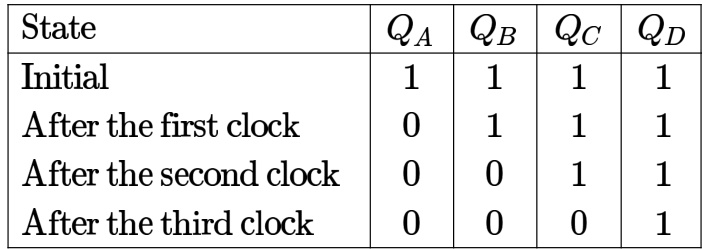

The state $Q _ { A } Q _ { B } Q _ { C } Q _ { D }$ after the fourth clock pulse is

A. 0000 B. 1111 C. 1001 D. 1000 gate1987 digital-logic circuit-output sequential-circuit digital-counter shift-registers

Using  flip-flop gates, design a parallel-in/serial-out shift register that shifts data from left to right with the following input lines:

i. Clock CLK   
ii. Three parallel data inputs ${ } _ { A , B , C }$ iii. Serial input $\boldsymbol { s }$   
iv. Control input SHIFT.

gate1991 digital-logic difficult sequential-circuit flip-flop shift-registers descriptive

Consider a Boolean function $f ( w , x , y , z )$ . Suppose that exactly one of its inputs is allowed to change at time. If the function happens to be true for two input vectors $i _ { 1 } = \langle w _ { 1 } , x _ { 1 } , y _ { 1 } , z _ { 1 } \rangle$ and $i _ { 2 } = \langle w _ { 2 } , x _ { 2 } , y _ { 2 } , z _ { 2 } \rangle$ we would like the function to remain true as the input changes from $i _ { 1 }$ to $i _ { 2 }$ $( i _ { 1 }$ and $i _ { 2 }$ differ in exactly one bit position) without becoming false momentarily. Let $\begin{array} { r } { f ( w , x , y , z ) = \sum ( 5 , 7 , 1 1 , 1 2 , 1 3 , 1 5 ) } \end{array}$ Which of the following cube covers of $f$ will ensure that the required property is satisfied?

A. wxz, wxy,xyz, xyz, wyz   
B. wxy,wxz, wyz   
C. wxyz, $x z$ ,wxyz   
D. wxy,wyz,wxz,wxz, xyz, xyz

gatecse-2006 digital-logic min-sum-of-products-form difficult static-hazard

Design a synchronous counter to go through the following states:

gate1998 digital-logic normal descriptive synchronous-asynchronous-circuits

# Answer key☟

# .36.3 Synchronous Asynchronous Circuits: GATE CSE 2001 Question: 2.12

Consider the circuit given below with initial state $Q _ { 0 } = 1 , Q _ { 1 } = Q _ { 2 } = 0$ . The state of the circuit is given by the value $4 Q _ { 2 } + 2 Q _ { 1 } + Q _ { 0 }$

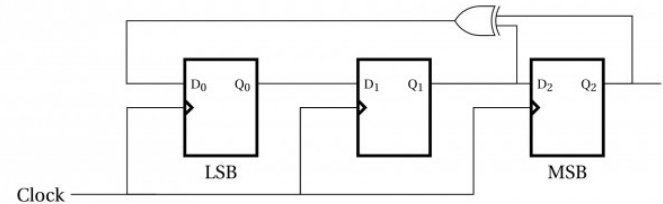

Which one of the following is correct state sequence of the circuit?

A. 1,3,4,6,7,5,2 B. 1,2,5,3,7,6,4   
C. 1,2,7,3,5,6,4 D. 1,6,5,7,2,3,4

gatecse-2001 digital-logic normal synchronous-asynchronous-circuits

# Answer key☟

# 4.36.4 Synchronous Asynchronous Circuits: GATE CSE 2003 Question: 44

A ,  synchronous sequential circuit behaves as follows: Let $z _ { k } , n _ { k }$ denote the number of $0 \mathit { ^ { \prime } s }$ and $\mathbf { \Delta } _ { \mathbf { 1 ^ { \prime } } s }$ respectively in initial $k$ bits of the input $( z _ { k } + n _ { k } = k )$ . The circuit outputs until one of the following conditions holds. · $z _ { k } - n _ { k } = 2$ . In this case, the output at the $\mathsf { k }$ -th and all subsequent clock ticks is . · $n _ { k } - z _ { k } = 2$ . In this case, the output at the $k$ -th and all subsequent clock ticks is .

What is the minimum number of states required in the state transition graph of the above circuit?

A. B. 6 C. D. 8 gatecse-2003 digital-logic synchronous-asynchronous-circuits normal

# Answer Keys

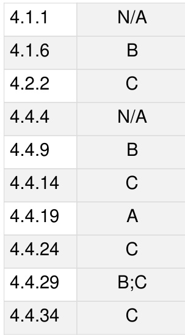

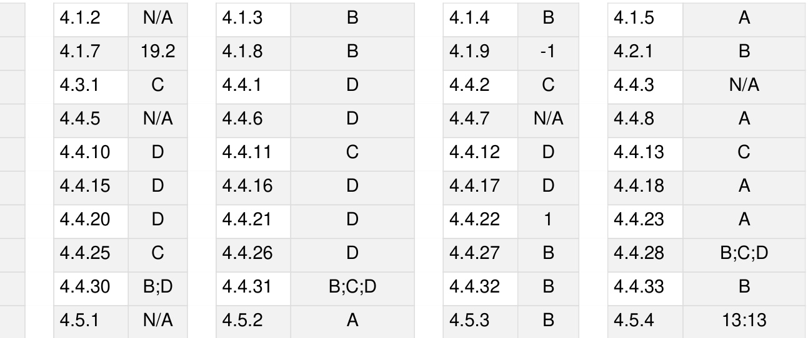

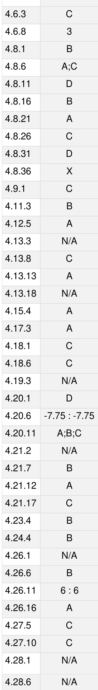

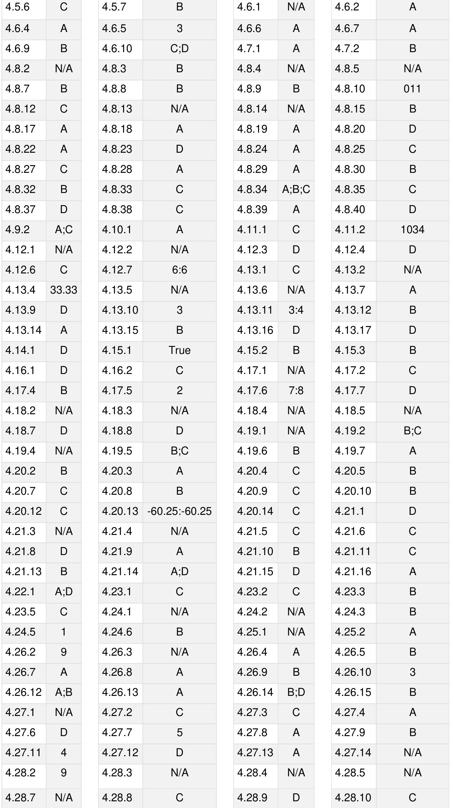

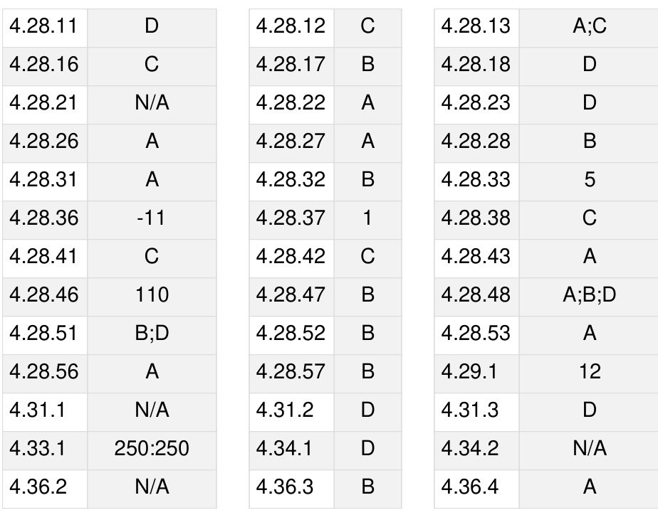

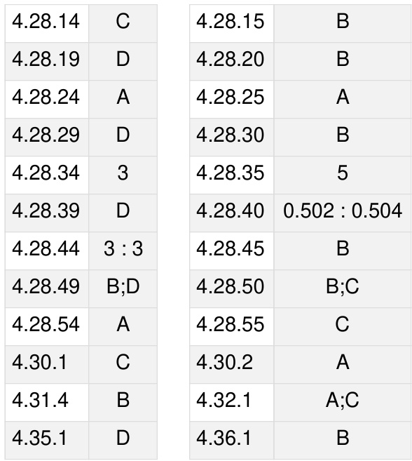

System calls, Processes, Threads, Inter‐process communication, Concurrency and synchronization. Deadlock. CPU scheduling. Memory management and Virtual memory. File systems. Disks is also under thi

MarkDistributioninPrevious GATE   
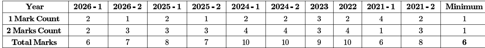

Welcome to the Operating System (OS) chapter of your GATE Computer Science preparation! This section is designed as a comprehensive, exam-focused reference to help you master the core concepts, formulas, and problem-solving techniques essential for excelling in the GATE exam. Operating Systems form the bedrock of computing, managing hardware and software resources to provide a stable and efficient environment for applications. For GATE CS, OS is a high-scoring subject, typically carrying a weightage of 8-12 marks. Questions range from conceptual understanding of OS principles, numerical problems on scheduling, memory management, and disk I/O, to analytical questions on deadlock and synchronization. A strong grasp of this subject is crucial not only for GATE but also for a fundamental understanding of computer science.

# Topic-wise Key Concepts

# Bankers Algorithm

The Banker's Algorithm is a deadlock avoidance algorithm that checks for a safe state before granting a resource request. It ensures that the system can always find a sequence of processes that can complete their execution without leading to a deadlock.

# Important Formulas/Theorems:

1. Need Matrix: For each process $P _ { i }$ and resource type $R _ { j } , N e e d [ i ] [ j ] = M a x [ i ] [ j ] - A l l o c a t i o n [ i ] [ j ]$ . This represents the remaining resources $P _ { i }$ may still request.

# 2. Safety Algorithm:

Initialize $W o r k = A v a i l a b l$ e and $F i n i s h [ i ] = f a l s e$ for all processes. Find an $\mathbf { \chi } _ { i }$ such that $i ] = = f a l s e$ and $N e e d [ i ] \leq W o r k .$ If such an $i$ exists, then $W \bar { o r k } = W o r k + A l l o c a t i o n [ i ]$ and $F i n i s h [ i ] = t r u e . \mathsf { G o t o s t e p } 2 .$ - If no such $i$ exists, the system is in a safe state if $F i n i s \bar { h } [ i ] = = t$ for all $_ i$ .

# 3. Resource-Request Algorithm:

If $R e q u e s t _ { i } \leq N e e d _ { i }$ , proceed to step 2. Otherwise, error.   
If Requesti ≤ Available proceed to step 3. Otherwise, $P _ { i }$ must wait.   
Pretend to allocate resources: $A v a i l a b l e = A v a i l a b l e - R e q u e s t _ { i }$ , $A l l o c a t i o n _ { i } = A l l o c a t i o n _ { i } + R e q u e s t _ { i }$ , $N e e d _ { i } = N e e d _ { i } - R e q u e s t _ { i }$ .   
Run Safety Algorithm. If safe, grant request. If unsafe, revert allocation and $P _ { i }$ waits.

# Key Properties:

。 Ensures deadlock avoidance by maintaining the system in a safe state. 。 Requires prior knowledge of maximum resource needs for each process. 0 Less conservative than deadlock prevention, allowing higher resource utili

# Common Pitfalls:

Confusing safe state with deadlock-free state (safe implies deadlock-free, but unsafe doesn't necessarily imply deadlock).   
。 Incorrectly calculating the Need matrix or updating Available/Allocation vectors.   
。 Not checking all conditions in the Safety Algorithm or Resource-Request Algorithm.

# Standard Problem-Solving Techniques:

Systematically trace the Safety Algorithm step-by-step, updating  and  arrays. For resource requests, first check against  and then against Available, then temporarily allocate and run the Safety Algorithm.

# Best Fit

Best Fit is a dynamic memory allocation algorithm that allocates the smallest available memory hole (partition) that is large enough to satisfy a request. Its goal is to minimize the amount of internal fragmentation.

# Key Properties:

Tends to produce the smallest leftover hole, which might be useful for future small requests.   
Suffers from external fragmentation, where total free memory is sufficient but not contiguous.   
Requires searching the entire list of free partitions to find the best fit, making it slower than First Fit.

# Common Pitfalls:

Confusing it with First Fit or Worst Fit.   
Incorrectly identifying the "smallest" suitable hole, especially when multiple holes have the same size.

# Standard Problem-Solving Techniques:

Maintain a sorted list of free memory blocks (or iterate through all) and select the one with the smallest size greater than or equal to the request.   
Draw memory maps to visualize allocation and fragmentation.

# Context Switch

A context switch is the mechanism by which the CPU saves the state of the currently executing process or thread and restores the state of another process or thread. This allows multiple processes/threads to share a single CPU.

# Key Properties:

。 Involves saving the Process Control Block (PCB) of the current process and loading the PCB of the next process.   
。 An overhead operation, as the CPU is not performing useful work during the switch.   
。 Latency is the time taken for a context switch.   
c More frequent context switches (e.g., small time quantum in Round Robin) increase overhead.

Common Pitfalls: Underestimating the overhead of context switching in performance calculations. Not understanding \*what\* exactly is saved (CPU registers, program counter, stack pointer, etc.).

# DMA (Direct Memory Access)

DMA is a feature of computer systems that allows certain hardware subsystems (like disk drive controllers or network cards) to access main system memory (RAM) independently of the central processing unit (CPU). This significantly improves I/O performance by offloading data transfer from the CPU.

# Key Properties:

。 Reduces CPU overhead for large data transfers, allowing the CPU to perform other tasks.   
。 DMA controller manages the transfer, initiating an interrupt only upon completion.   
"Cycle stealing" occurs when the DMA controller temporarily takes control of the system bus from the CPU to transfer data.   
Requires careful setup by the CPU (source, destination, size).

# Common Pitfalls:

。 Thinking DMA eliminates CPU involvement entirely (CPU still initiates and handles completion). Not understanding the concept of cycle stealing and its impact on CPU performance.

# Deadlock Prevention Avoidance Detection

These are strategies to deal with deadlocks. Prevention aims to ensure that at least one of the four necessary conditions for deadlock never holds. Avoidance dynamically grants resources only if the system remains in a safe state. Detection allows deadlocks to occur and then finds and resolves them.

Important Formulas/Theorems:

1. Necessary Conditions for Deadlock (Coffman Conditions):

$C _ { 1 }$ Mutual Exclusion: At least one resource must be held in a non-sharable mode.   
: Hold and Wait: A process holding at least one resource is waiting to acquire additional resources held by other processes.   
$\dot { C } _ { 3 }$ No Preemption: Resources cannot be preempted; they can only be released voluntarily by the process holding them.   
$C _ { 4 }$ : Circular Wait: A set of processes $\{ P _ { 0 } , P _ { 1 } , \ldots , P _ { n } \}$ exists such that $P _ { 0 }$ is waiting for a resource held by $P _ { 1 } , P _ { 1 }$ is waiting for a resource held by $P _ { 2 } , . . . , P _ { n - 1 }$ is waiting for a resource held by $P _ { n }$ , and $P _ { n }$ is waiting for a resource held by $P _ { 0 }$ .

2. Deadlock Prevention: Break one or more of the four conditions.

Break $C _ { 1 }$ : Spooling (for printers), virtualizing resources.   
Break $C _ { 2 }$ : Request all resources at once, or release all resources before requesting new ones.   
Break $C _ { 3 }$ : Allow preemption of resources (e.g., CPU, memory).

Break $C _ { 4 }$ : Impose a total ordering of resource types; processes must request resources in increasing order.

3. Deadlock Avoidance: Banker's Algorithm (for multiple instances of resources), Resource-Allocation Graph Algorithm (for single instances).

# 4. Deadlock Detection:

If resources have single instances, use a Wait-For Graph. A cycle implies deadlock.   
If resources have multiple instances, use an algorithm similar to Banker's Safety Algorithm.

# Key Properties:

Prevention is conservative, often leading to low resource utilization. Avoidance is more flexible but requires future knowledge of resource requests. Detection allows higher concurrency but incurs overhead for detection and recove

# Common Pitfalls:

Confusing which condition each prevention strategy addresses.   
Incorrectly applying RAG for multiple instance resources (a cycle in RAG with multiple instances does not necessarily imply deadlock).   
Not understanding the trade-offs between the three strategies.

# Standard Problem-Solving Techniques:

0 For prevention, identify which condition is being broken.   
。 For avoidance, apply Banker's Algorithm.   
。 For detection, draw the RAG or Wait-For Graph and look for cycles.

# Demand Paging

Demand Paging is a virtual memory technique where pages are loaded into main memory only when they are referenced (demanded) by the CPU. This allows for larger virtual address spaces than physical memory and reduces $1 / \mathsf { O }$ overhead by not loading unused pages.

Important Formulas/Theorems: 1. Effective Access Time (EAT):

$E A T = ( 1 - p ) \times M e m o r y A c c e s s T i m e + p \times ( P a g e F a u l t O v e r h e a d + M e m o r y A d c o s s ) , t h e m o l , \mu = 3 . 2 5 6$ cessTime)

Where $p$ is the page fault rate. includes time for interrupt, saving process state, reading page from disk, updating page table, restoring process state.

# Key Properties:

Leverages locality of reference to achieve good performance. Reduces physical memory requirements for processes.   
Introduces page faults, which are expensive operations.   
0 Can lead to thrashing if the page fault rate becomes too high.

# Common Pitfalls:

Incorrectly calculating EAT, especially the components of page fault overhead.   
Misunderstanding the concept of locality of reference.   
Confusing demand paging with simple paging.

# Standard Problem-Solving Techniques:

0 Calculate EAT by plugging in given values for page fault rate, memory access time, and page fault overhead.   
。 Analyze scenarios for thrashing.

# Disk

disk (hard disk drive) is a non-volatile storage device that stores data on rotating platters. It is characterized by its hysical structure and the time it takes to access data.

# Important Formulas/Theorems:

1. Disk Access Time:

$$
A c c e s s T i m e = S e e k T i m e + R o t a t i o n a l L a t e n c y + T r a n s f e r T i m e
$$

Seek Time: Time taken for the disk arm to move the read/write heads to the correct track.   
Rotational Latency: Time taken for the desired sector to rotate under the read/write head (average is half a rotation).   
Transfer Time: Time taken to transfer the actual data.

$$
T r a n s f e r T i m e = \frac { N u m b e r O f S e c t o r s } { S e c t o r s P e r T r a c k } \times R o t a t i o n T i m e
$$

# Key Properties:

。 Data is stored in sectors, which are grouped into tracks, and tracks are stacked into cylinders 。 Seek time is typically the most significant component of disk access time. Mechanical components make disk access orders of magnitude slower than RAM access.

# Common Pitfalls:

0 Incorrectly calculating average rotational latency (usually half a rotation).   
C Forgetting to include all three components of access time.

。 Break down the problem into calculating each component (seek, rotational, transfer) and then sum them up.

# Disk Scheduling

Disk scheduling algorithms aim to minimize the total head movement of the disk arm, thereby reducing the average disk access time and improving I/O throughput. They reorder pending disk I/O requests.

Important Formulas/Theorems:

1. Total Head Movement: Sum of absolute differences between consecutive track numbers accessed.   
Algorithms: FCFS (First-Come, First-Served): Processes requests in the order they arrive. Simple but inefficient. SSTF (Shortest Seek Time First): Selects the request with the minimum seek time from the current head position. Can lead to starvation. SCAN (Elevator Algorithm): The disk arm moves from one end of the disk to the other, servicing requests along the way. When it reaches an end, it reverses direction. C-SCAN (Circular SCAN): Similar to SCAN, but when the arm reaches one end, it immediately returns to the other end without servicing requests on the return trip. Provides more uniform wait times. LOOK: Similar to SCAN, but the arm only goes as far as the last request in each direction, then reverses. C-LOOK: Similar to C-SCAN, but the arm only goes as far as the last request in each direction, then returns to the first request in the other direction without going to the absolute end. SSTF is optimal for average seek time but can cause starvation.   
SCAN/C-SCAN/LOOK/C-LOOK provide better fairness and prevent starvation.   
C-SCAN/C-LOOK are preferred for heavy loads as they provide more uniform service.

Common Pitfalls:

Incorrectly calculating head movement, especially for SCAN/C-SCAN/LOOK/C-LOOK where direction matters 。 Forgetting to include the initial head position in the calculation.   
Confusing SCAN with C-SCAN or LOOK with C-LOOK.

# Standard Problem-Solving Techniques:

。 Draw a number line representing tracks and mark request positions. Trace the head movement for each algorithm.   
。 Carefully track the current head position and the direction of movement.

# File System

A file system is an OS component that controls how data is stored and retrieved. It organizes files into a hierarchical structure, manages file attributes, and provides mechanisms for accessing and protecting files.

# Key Properties:

File Attributes: Name, type, location, size, protection, time/date, user ID.   
File Operations: Create, write, read, reposition, delete, truncate.   
Directory Structure: Single-level, two-level, tree-structured, acyclic-graph, general graph.   
Allocation Methods: Contiguous, Linked, Indexed.   
Free Space Management: Bit vector, linked list, grouping, counting.

# Common Pitfalls:

Confusing file allocation methods (e.g., linked vs. indexed).   
Not understanding the trade-offs of different directory structures (e.g., sharing, path length).

# Fork System Call

The fork() system call creates a new process (child process) that is a duplicate of the calling process (parent process).   
Both processes then execute concurrently from the point of the fork() call.

Key Properties:

。 The child process receives a copy of the parent's address space, including code, data, and stack segments (often implemented using copy-on-write).   
The child process gets a unique Process ID (PID).   
fork() returns 0 to the child process, the child's PID to the parent process, and -1 on failure.   
Child process inherits open file descriptors, signals, etc.

# Common Pitfalls:

Incorrectly predicting the output of programs involving multiple fork() calls due to confusion about which process is executing which part of the code.   
。 Not understanding the return values of fork() in parent vs. child.   
Assuming parent and child share memory directly (they get copies, though copy-on-write optimizes this).

# Standard Problem-Solving Techniques:

Trace the execution path for both parent and child processes separately after each ork(). 。 Keep track of the number of processes created. For $N$ fork() calls in a sequence , processes are created. If fork() is in a loop, it's more complex.

# IO Handling

I/O handling refers to the mechanisms and techniques used by the operating system to manage data transfer between the CPU/memory and peripheral devices. Efficient I/O handling is crucial for system performance.

Key Properties:

Polling: CPU repeatedly checks the status of an I/O device. Simple but inefficient, wastes CPU cycles. Interrupt-driven I/O: Device notifies the CPU via an interrupt when I/O is complete or ready. More efficient for sporadic I/O.   
DMA (Direct Memory Access): Device controller transfers data directly to/from memory without CPU intervention. Most efficient for large data transfers.   
Buffering: Using temporary memory areas to hold data during transfer, smoothing out speed differences. Spooling: Holding data for a device (e.g., printer) in a buffer until the device is ready.

Common Pitfalls: Confusing the efficiency and use cases of polling vs. interrupts vs. DMA. Not understanding the role of device controllers.

# Input Output

Input/Output $( 1 / \mathsf { O } )$ refers to the communication between an information processing system (like a computer) and the outside world, possibly a human or another information processing system. involves the transfer of data to and from peripheral devices.

# Key Properties:

Can be synchronous (CPU waits for I/O completion) or asynchronous (CPU continues processing while I/O operates in background).   
Managed by device controllers and device drivers.   
Performance is often a bottleneck in overall system performance.

# Inter Process Communication (IPC)

PC refers to mechanisms provided by the operating system that allow independent processes to communicate and synchronize their actions. This is essential for cooperative processes and distributed systems.

# Key Properties:

。 Shared Memory: Processes share a region of memory for direct data exchange. Fastest IPC, but requires explicit synchronization.   
。 Message Passing: Processes communicate by sending and receiving messages. Simpler to implement for small data transfers, easier to use in distributed systems.   
。 Pipes: Unidirectional (ordinary pipes) or bidirectional (named pipes/FIFOs) communication channels. 0 Sockets: For network communication, allowing processes on different machines to communicate.   
。 Semaphores/Mutexes/Monitors: Primarily for synchronization, but can indirectly facilitate communication by coordinating access to shared resources.

# Common Pitfalls:

r Confusing shared memory with message passing (shared memory requires explicit synchronization, message passing often has built-in synchronization).   
。 Not understanding the difference between pipes and named pipes.

# Interrupts

An interrupt is a signal to the CPU from a hardware device or a software program that indicates an event has occurred and requires immediate attention. It causes the CPU to temporarily suspend its current task and execute a special routine called an interrupt handler.

Key Properties:

Hardware Interrupts: Generated by I/O devices (e.g., disk completion, keyboard input).   
Software Interrupts (Traps/Exceptions): Generated by programs (e.g., system calls, division by zero, page fault).   
Interrupt Vector: A table containing the addresses of interrupt service routines (ISRs) for various interrupt types.   
Maskable Interrupts: Can be temporarily ignored by the CPU.   
。 Non-maskable Interrupts (NMI): Critical events that cannot be ignored (e.g., memory parity error). Involves saving the CPU's context (registers, PC) before executing the ISR and restoring it afterward.

# Common Pitfalls:

Confusing hardware interrupts with software interrupts (traps).   
0 Not understanding the role of the interrupt vector. Forgetting the context saving/restoring overhead.

# Least Recently Used (LRU)

LRU is a page replacement algorithm that replaces the page that has not been used for the longest period of time. It is based on the principle of temporal locality, assuming that pages recently used are likely to be used again soon.

# Key Properties:

Generally performs well, approximating the optimal algorithm.   
Does not suffer from Belady's anomaly (increasing page faults with more frames).   
Difficult to implement efficiently in hardware, as it requires tracking the exact usage time of each page.   
Approximations like Second Chance or Clock algorithm are often used in practice.

# Common Pitfalls:

。 Incorrectly identifying the "least recently used" page, especially in complex sequences.   
Confusing it with FIFO or LFU.

# Standard Problem-Solving Techniques:

Maintain a "time stamp" or "counter" for each page, or conceptually keep a stack where the most recently used page is at the top. When a page is referenced, move it to the top. When a page fault occurs, remove the page at the bottom.   
Trace the page references and page frames step-by-step.

# Linked Allocation

Linked allocation is a file allocation method where each file is stored as a linked list of disk blocks. Each block contains a pointer to the next block in the file.

# Key Properties:

。 No external fragmentation, as any free block can be used.   
Files can grow dynamically.   
Sequential access is efficient, but direct access (random access) is very slow due to pointer traversal.   
Pointer overhead: a portion of each disk block is used for the pointer, reducing data storage capacity.   
0 Reliability issue: a lost or damaged pointer can lead to the loss of the rest of the file.

# Common Pitfalls:

0 Confusing it with contiguous or indexed allocation. Overlooking the performance impact on random access or the pointer overhead.

# Memory Management

Memory management is the operating system's function of handling primary memory. It allocates memory to processes, protects processes from each other, and provides an abstraction of a large, uniform memory space.

Key Properties:

Relocation: Mapping logical addresses to physical addresses.   
Protection: Preventing processes from accessing each other's memory. Sharing: Allowing processes to share memory regions.   
Logical Organization: Segmentation, paging.   
Physical Organization: Contiguous allocation, non-contiguous allocation.   
Techniques: Paging, segmentation, virtual memory.

# Common Pitfalls:

Confusing internal vs. externa fragmentation.   
Not understanding the difference between logical and physical addresses.

# Multilevel Paging

Multilevel paging (or hierarchical paging) is a technique used in virtual memory systems to reduce the size of the page table. Instead of a single, large page table, it uses a tree-like structure of page tables, where the outer page table points to inner page tables, which then point to physical frames.

# Important Formulas/Theorems:

1. Effective Access Time (EAT) for N-level Paging:

$$
E A T = ( N + 1 ) \times M e m o r y A c c e s s T i m e
$$

(Assuming no TLB and page tables are in memory).

2. Number of Bits for Page Number: If a logical address is $m$ bits and page size is $2 ^ { k }$ bytes, then page offset is $k$ bits, and page number is $( m - k )$ bits.

3. Number of Entries in Page Table: 2page number bits

4. Size of Page Table: 2page number bits $\times$ size of page table .

# Key Properties:

。 Reduces the amount of physical memory required for page tables, especially for sparse address spaces. Increases memory access time because multiple memory accesses are needed to find a physical address (one for each level of page table).   
Can be combined with TLB to mitigate increased access time.

# Common Pitfalls:

。 Incorrectly calculating the number of bits for each level of the page table. Forgetting to account for all memory accesses when calculating EAT without TLB.

# Standard Problem-Solving Techniques:

。 Break down the virtual address into segments corresponding to each level of the page table and the page offset.   
Calculate the number of page table entries and the size of each page table level.

# OS Protection

OS protection mechanisms ensure that system resources (CPU, memory, files, I/O devices) are used only in ways authorized by the operating system. This prevents malicious or erroneous programs from harming the system or other programs.

Key Properties:

Dual-Mode Operation: User mode (restricted privileges) and Kernel mode (full privileges). A mode bit indicates the current mode.   
Privileged Instructions: Instructions that can only be executed in kernel mode (e.g., I/O instructions, setting timer).   
System Calls: User programs request OS services, transitioning from user to kernel mode.   
Memory Protection: Base and limit registers, paging, segmentation.   
Access Control Lists (ACLs): For files and other resources, specifying who can access what and how. Capabilities: Tokens that grant specific access rights to a resource.

# Common Pitfalls:

0 Confusing the purpose of dual-mode operation with memory protection.   
Not understanding how system calls facilitate a controlled transition to kernel mode.

# Page Replacement

Page replacement algorithms decide which page to remove from main memory when a page fault occurs and no free frames are available. The goal is to minimize the number of page faults.

# Important Formulas/Theorems:

Number of Page Hits 1. Hit Ratio: Total Page References Number of Page Faults 2. Miss Ratio (Page Fault Rate): Total Page References 3. HitRatio + MissRatio =1

Algorithms:

FIFO (First-In, First-Out): Replaces the page that has been in memory the longest. Simple but can suffer from Belady's anomaly.   
Optimal (OPT/MIN): Replaces the page that will not be used for the longest period of time in the future. Impossible to implement in practice, used as a benchmark.   
。 LRU (Least Recently Used): Replaces the page that has not been used for the longest time. Generally good performance, does not suffer from Belady's anomaly, but complex to implement.   
LFU (Least Frequently Used): Replaces the page with the smallest count of references.   
MFU (Most Frequently Used): Replaces the page with the largest count of references (less common). Second "second chance" if its bit is set.

Chance (Clock): A FIFO variant that gives a page a reference

# Key Properties:

Belady's anomaly: For some algorithms (like FIFO), increasing the number of available page frames can increase the number of page faults.   
Optimal algorithm provides the theoretical minimum number of page faults.

# Common Pitfalls:

Incorrectly applying the rules for each algorithm, especially for LRU and Optimal.   
Forgetting to count the initial page loads as page faults.   
Misinterpreting Belady's anomaly.

# Standard Problem-Solving Techniques:

Trace the page reference string through the page frames for each algorithm, step-by-step, marking hits and faults. 。 Keep track of the state of each page (e.g., arrival time for FIFO, last used time for LRU, future use for Optimal)

# Precedence Graph

A precedence graph (or process graph) is a directed acyclic graph (DAG) used to represent the execution order and dependencies among a set of tasks or processes. An edge from task A to task B means task A must complete before task B can start.

# Key Properties:

。 Nodes represent tasks/processes, edges represent dependencie 。 Helps in identifying potential parallelism and critical paths. 。 Used in scheduling to ensure correct execution order. 。 Must be acyclic to represent a valid execution sequence.

# Common Pitfalls:

Drawing cycles, which implies an impossible dependency.   
Misinterpreting the meaning of an edge $( A  B$ means A must finish before B starts, not just that B follows A).

# Process

A process is a program in execution. It is an active entity, unlike a program, which is a passive entity. Each process has its own address space, resources, and execution context.

Key Properties:

Process Control Block (PCB): Contains all information about a process (state, PC, registers, memory limits,   
open files, etc.).   
Process States: New: Process being created. Ready: Waiting to be assigned to a processor. Running: Instructions are being executed. Waiting (Blocked): Waiting for some event (e.g., I/O completion, signal). Terminated: Process has finished execution.

。 Each process has its own virtual address space, including code, data, and stack segments. Processes are typically heavy-weight compared to threads.

# Common Pitfalls:

Confusing a process with a program or a thread.   
Incorrectly identifying transitions between process states.

# Process Scheduling

Process scheduling is the activity of the operating system that selects which process to run next from the ready queue and allocates the CPU to it. The goal is to optimize various performance metrics.

# Important Formulas/Theorems:

1. Turnaround Time (TAT): CompletionTime 一 ArrivalTime   
2. Waiting Time (WT): 一 BurstTime   
3. Response Time (RT): 1 ArrivalTime   
4. Throughput: Number of processes completed per unit time.   
5. CPU Utilization: Percentage of time the CPU is busy.

Algorithms:

FCFS (First-Come, First-Served): Non-preemptive. Simple, but can have high average waiting time (convoy effect).   
SJF (Shortest Job First): Non-preemptive. Optimal for minimum average waiting time. Requires knowing future burst times.   
SRTF (Shortest Remaining Time First): Preemptive version of SJF. Optimal for minimum average waiting time.   
Priority Scheduling: Can be preemptive or non-preemptive. Processes with higher priority run first. Can lead to starvation (low-priority processes never run).   
Round Robin (RR): Preemptive. Each process gets a small unit of CPU time (time quantum). Fair, good for interactive systems.

Key Properties:

Preemptive: CPU can be taken away from a running process.   
Non-preemptive: CPU is held until process completes or blocks.   
。 Starvation: A process may wait indefinitely.   
Aging: Gradually increasing the priority of processes that wait for a long time to prevent starvation.

# Common Pitfalls:

Incorrectly drawing Gantt charts, especially for preemptive algorithms 。 Mistakes in calculating TAT, WT, or RT. 。 Confusing preemptive vs. non-preemptive versions of algorithms. 。 Not handling arrival times correctly.

# Standard Problem-Solving Techniques:

。 Draw a Gantt chart for each algorithm, carefully marking arrival, start, and completion times. Systematically calculate TAT, WT, and RT for each process and then their averages.   
For preemptive algorithms, check for preemption at every arrival or completion event.

# Process Synchronization

Process synchronization refers to the coordination of multiple processes to ensure that they access shared resources or critical sections in a controlled manner, preventing race conditions and maintaining data consistency.

# Important Formulas/Theorems:

1. Critical Section Problem Requirements:

■ Mutual Exclusion: Only one process can be in its critical section at any time. ■ Progress: If no process is in its critical section and some processes want to enter, only those not in their remainder section can participate in the decision, and this decision cannot be postponed indefinitely. ■ Bounded Waiting: There is a limit on the number of times other processes can enter their critical sections after a process has made a request to enter its critical section and before that request is granted.

# Mechanisms:

Semaphores: Integer variables accessed only through atomic wait() (P) and signal() (V) operations. Can be binary (mutex) or counting.   
Mutex Locks: A simpler binary semaphore, used for mutual exclusion.   
Monitors: High-level synchronization construct that encapsulates shared data and procedures that operate o the data, ensuring mutual exclusion and providing condition variables for waiting.

Hardware Solutions: TestAndSet, Swap instructions.

# Key Properties:

Race Condition: When multiple processes access and modify shared data concurrently, and the final result depends on the order of execution.   
Deadlock: Can occur with improper use of synchronization primitives (e.g., two processes waiting for each other's resources).

Common Pitfalls:

Incorrectly using wait() and signal() operations, leading to deadlock or starvation.   
。 Not ensuring atomicity of synchronization primitives.   
Confusing mutexes with counting semaphores.

# Standard Problem-Solving Techniques:

Trace the execution flow of multiple processes accessing shared resources, observing the values of semaphores or mutexes.   
Identify potential race conditions and propose synchronization solutions.   
Analyze classic synchronization problems (Producer-Consumer, Readers-Writers, Dining Philosophers).

# Resource Allocation

Resource allocation is the process by which the operating system assigns available resources (CPU, memory, I/O devices, files) to processes. This is a fundamental task of the OS, impacting system performance and stability.

# Key Properties:

Resources can be preemptable (e.g., CPU) or non-preemptable (e.g., printer).   
Proper resource allocation is critical to prevent deadlocks and ensure fairness.   
Involves policies for granting requests and reclaiming resources.

# Resource Allocation Graph (RAG)

A Resource Allocation Graph is a directed graph used to depict the state of a system regarding resources and processes. It helps in visualizing resource allocation and detecting deadlocks.

Key Properties:

Nodes: Processes (circles) and Resource types (rectangles).   
Edges: Request Edge: From process to resource type (e.g., $P _ { i } \to R _ { j } \mathrm { , }$ ), indicating $P _ { i }$ is requesting an instance of . Assignment Edge: From resource type to process (e.g., $R _ { j }  P _ { i } ^ { \cdot }$ ), indicating an instance of Rj has been allocated to $P _ { i }$ .

。 If the RAG contains a cycle, and each resource type has only one instance, then a deadlock exists.

If the RAG contains a cycle, and some resource types have multiple instances, a deadlockmay exist (further analysis needed).

# Common Pitfalls:

Incorrectly drawing request vs. assignment edges.   
Assuming a cycle always implies deadlock, especially for multiple-instance resources.   
Not understanding the difference between RAG and Wait-For Graph.

# Standard Problem-Solving Techniques:

。 Draw the RAG based on the given process and resource states.   
。 Identify cycles in the graph.   
If cycles exist, determine if they lead to deadlock based on resource instance counts.

# Round Robin Scheduling

Round Robin (RR) is a preemptive process scheduling algorithm designed for time-sharing systems. Each process is given a small unit of CPU time, called a time quantum (or time slice). When the quantum expires, the process is preempted and added to the end of the ready queue.

Important Formulas/Theorems:

1. Turnaround Time (TAT): CompletionTime 一 ArrivalTime   
2. Waiting Time (WT):   
3. Number of Context Switches: Depends on the number of processes and the time quantum.

# Key Properties:

。 Fair scheduling, as every process gets a chance to run.   
Good for interactive systems, providing quick response times.   
Performance heavily depends on the time quantum: Small quantum: High context switch overhead, good response time. Large quantum: Approaches FCFS, lower overhead, potentially poor response time.

# Common Pitfalls:

Incorrectly handling the time quantum and preemption points.   
Mistakes in calculating TAT or WT, especially when processes arrive at different times.

Forgetting to account for context switch overhead if specified in the problem.

Standard Problem-Solving Techniques:

Draw a Gantt chart, carefully allocating CPU time in quantum chunks and moving processes to the end of the ready queue upon preemption.   
。 Keep track of remaining burst times for each process.

# Semaphore

A semaphore is a synchronization primitive, a protected integer variable that can only be accessed and modified by two atomic operations: wait() (also known as $\mathsf { P }$ or down) and signal() (also known as or up).

Important Formulas/Theorems:

1. wait(S) operation: wait(S) while $( \mathsf { S } < = 0 )$ ); $/ /$ busy wait $\mathsf { S } ^ { \mathrm { - } }$ ; } (Alternatively, block the process if $\begin{array} { r } { S \le 0 } \end{array}$ ).

2. signal(S) operation: signal(S) { $^ { \mathsf { S } + + }$ ; } (Alternatively, wake up a blocked process if any).

Key Properties:

Counting Semaphore: Can range over an unrestricted domain. Used to control access to a resource with multiple instances.   
Binary Semaphore (Mutex): Can only be 0 or 1. Used for mutual exclusion (like a lock).   
Can be used for both mutual exclusion and process synchronization (ordering of events).   
Improper use can lead to deadlock or starvation.

Common Pitfalls:

Swapping the order of wait() and signal() operations, leading to incorrect synchronization.   
。 Using busy-waiting semaphores in a single-processor system (wastes CPU cycles).   
。 Not initializing semaphores correctly.

# Standard Problem-Solving Techniques:

Trace the values of semaphores as processes execute wait() and signal() operations.   
。 Identify critical sections and shared resources to determine appropriate semaphore usage.   
Solve classic synchronization problems using semaphores.

# SRTF (Shortest Remaining Time First)

SRTF is a preemptive version of the Shortest Job First (SJF) scheduling algorithm. The CPU is allocated to the process with the smallest remaining burst time. If a new process arrives with a shorter burst time than the currently running process's remaining time, the current process is preempted.

# Important Formulas/Theorems:

1. Turnaround Time (TAT): CompletionTime 一 ArrivalTime   
2. Waiting Time (WT): 一 BurstTime

Key Properties:

Optimal for minimizing average waiting time. Requires knowing the remaining burst time of all processes, which is difficult in practice.   
。 High overhead due to frequent context switches, especially with many short jobs or frequent arrivals. Can suffer from starvation if a continuous stream of short jobs keeps arriving.

Common Pitfalls:

。 Incorrectly determining when preemption occurs (at every arrival or when a shorter job becomes ready).   
。 Mistakes in calculating remaining burst times.   
Overlooking processes that arrive later but have very short burst times.

# Standard Problem-Solving Techniques:

。 Create a Gantt chart, carefully tracking the remaining burst time of all ready processes at each time unit.   
At each time unit, check for new arrivals and select the process with the minimum remaining burst time.

# System Calls

System calls provide an interface between a running program and the operating system. They allow user-level programs to request services from the OS kernel, such as file I/O, process creation, memory allocation, and device access.

# Key Properties:

Transition from user mode to kernel mode (privileged mode).   
Typically invoked through a software interrupt (trap).   
Provide a controlled and secure way for user programs to access protected resources.   
Examples: fork(), exec(), read(), write(), open(), close(), wait(), exit().

# Common Pitfalls:

Confusing system calls with library calls (library calls are user-level functions that may or may not invoke system calls).   
Not understanding the mode switch involved.

# Threads

A thread (or lightweight process) is a basic unit of CPU utilization within a process. Multiple threads within the same process share the same code section, data section, and other OS resources (like open files, signals), but each has its own program counter, register set, and stack.

Key Properties:

Faster Context Switching: Switching between threads in the same process is faster than switching between processes. Resource Sharing: Threads within a process share memory and resources, facilitating communication.   
Concurrency: Multiple threads can execute concurrently, improving application responsiveness and throughpu on multi-core systems.   
。 User-level Threads: Managed by a user-level library, faster to create/manage, but if one thread blocks, the   
entire process blocks.   
。 Kernel-level Threads: Managed by the OS kernel, slower to create/manage, but if one thread blocks, others can still run.   
Many-to-One, One-to-One, Many-to-Many models: Different mappings between user and kernel threads.

# Common Pitfalls:

Confusing threads with processes (threads share memory, processes do not).   
Forgetting that synchronization is still required for shared data among threads.   
Misunderstanding the implications of user-level vs. kernel-level threads.

# Translation Lookaside Buffer (TLB)

The TLB is a small, fast hardware cache that stores recent virtual-to-physical address translations. It is used to speed up memory access in paged virtual memory systems by avoiding multiple memory accesses to the page table.

# Important Formulas/Theorems:

1. Effective Access Time (EAT) with TLB:

$$
E A T = T L B _ { - } H i t \_ R a t i o \times ( T L B _ { - } A c c e s s _ { - } T i m e + M e m o r y \_ A c c e s s _ { - } T i m e ) + ( 1 - T A T )
$$

Where Access_Time is the time to access the page table in main memory. If the page table is also in memory, this is another Access_Time.

Key Properties:

Significantly reduces the average memory access time if the hit ratio is high.   
A TLB miss requires a page table walk (accessing the page table in main memory).   
TLB entries are flushed on context switches between processes (though some TLBs support ASIDs to avoid this).

# Common Pitfalls:

。 Incorrectly calculating EAT, especially the components for a TLB miss (TLB access $^ +$ memory access for page table $^ +$ memory access for data).   
。 Forgetting to include TLB access time even on a hit.

# Standard Problem-Solving Techniques:

Carefully plug values into the EAT formula, ensuring all access times are accounted for.   
Understand how a TLB miss impacts the total access time.

# Virtual Memory

Virtual memory is a memory management technique that provides an application with an illusion of a contiguous, large address space, even if the physical memory is fragmented or smaller than the virtual address space. It separates logical memory from physical memory.

# Key Properties:

。 Allows programs to be larger than physical memory.   
Enables efficient sharing of memory among multiple processes. Provides memory protection. Commonly implemented using paging (demand paging) and swapping.   
0 Introduces the concept of page faults.

Important Formulas/Theorems:

1. Effective Access Time (EAT): (See Demand Paging and TLB sections for detailed formulas).

Common Pitfalls: Confusing virtual memory with physical memory. Not understanding the role of the MMU (Memory Management Unit) in address translation. Misinterpreting the benefits and overheads of virtual memory.

# Quick Formula Reference

Banker's Algorithm: 。 Need Matrix: $N e e d [ i ] [ j ] = M a x [ i ] [ j ] - A l l o c a t i o n [ i ] [ j ]$

Demand Paging $/$ Virtual Memory EAT (without TLB):

$E A T = ( 1 - p ) \times M e m o r y A c c e s s T i m e + p \times ( P a g e F a u l t O v e r h e a d + M e m o r y A c c e s s T r i m e ) . T h e t a r e$ essTime)

where $p$ is page fault rate.

Disk Access Time:

$$
A c c e s s T i m e = S e e k T i m e + R o t a t i o n a l L a t e n c y + T r a n s f e r T i m e
$$

$$
A v e r a g e R o t a t i o n a l L a t e n c y = \frac { 1 } { 2 } \times R o t a t i o n T i m e
$$

$$
T r a n s f e r T i m e = \frac { N u m b e r O f S e c t o r s } { S e c t o r s P e r T r a c k } \times R o t a t i o n T i m e
$$

Multilevel Paging EAT (without TLB):

$$
E A T = ( N + 1 ) \times M e m o r y A c c e s s T i m e
$$

for $N$ -level paging, assuming page tables are in memory.

Page Replacement: 0 Hit Ratio: TotalPrg Page nts Number of Page Faults 。 Miss Ratio (Page Fault Rate): Total Page References HitRatio+ MissRatio =1

Process Scheduling Metrics: Turnaround Time (TAT): 一 ArrivalTime Waiting Time (WT): 一 BurstTime Response Time (RT): ArrivalTime

TLB EAT:

EAT=TLB_Hit Ratio × (TLB_Access_Time+ Memory_Access_Time) +(1-TLB_Hit_Ratio) X

# Important Tips for GATE

1. Master Numerical Problems: A significant portion of OS questions in GATE are numerical, especially from Process Scheduling (FCFS, SJF, SRTF, RR), Memory Management (Paging, Page Replacement, TLB EAT), and Disk Scheduling. Practice drawing Gantt charts and calculating metrics meticulously. 2. Understand Preemption: Pay close attention to whether a scheduling algorithm is preemptive or non-preemptive.

This is a common source of error in Gantt chart construction. For preemptive algorithms, always check for new arrivals at each time unit.

3. Trace Algorithms Systematically: For complex algorithms like Banker's, Page Replacement, or Disk Scheduling, trace the steps methodically. Draw diagrams (RAG, memory maps, Gantt charts) to visualize the state changes.

4. Differentiate Similar Concepts: Be clear on the distinctions between processes and threads, mutexes and semaphores, internal and external fragmentation, logical and physical addresses, and different deadlock strategies (prevention, avoidance, detection).

5. Read Questions Carefully: Look for keywords like "average," "minimum," "maximum," "at least, "at most," "preemptive," "non-preemptive," and specific units (ms, ns). A small detail can change the entire answer.

6. Focus on Trade-offs: Many OS concepts involve trade-offs (e.g., performance vs. fairness in scheduling, memory usage vs. access time in paging). Understand why certain design choices are made and their implications.

7. Review Formulas Regularly: Keep the key formulas for EAT, scheduling metrics, and disk access time handy and review them frequently. Understand the components of each formula.

8. Practice with GATE Previous Year Questions: This will help you understand the common question patterns, difficulty levels, and time management strategies specific to the GATE exam.

# 5.1 Bankers Algorithm (2)

✍ Practice Test: Test 1 (8Q)

In a system, there are three types of resources: $\scriptstyle { E , F }$ and $G$ . Four processes $P _ { 0 } , P _ { 1 } , P _ { 2 }$ and $P _ { 3 }$ execute concurrently. At the outset, the processes have declared their maximum resource requirements using a matrix named Max as given below. For example, Max[ $P _ { 2 } , F ]$ is the maximum number of instances of that $P _ { 2 }$ would require. The number of instances of the resources allocated to the various processes at any given state is given by a matrix named Allocation.

Consider a state of the system with the Allocation matrix as shown below, and in which instances of $E$ and instances of $F$ are only resources available.

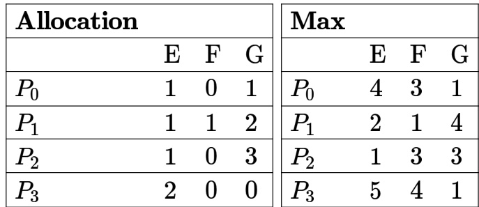

From the perspective of deadlock avoidance, which one of the following is true?

A. The system is in  state B. The system is not in  state, but would be if one more instance of $E$ were available C. The system is not in  state, but would be  if one more instance of $F$ were available D. The system is not in  state, but would be  if one more instance of $G$ were available

Consider contiguous allocation of physical memory to processes using variable partitioning scheme. Suppose there are holes in the memory of sizes , 25 KB,18 KB, 7 KB,9 KB,15 KB, and $1 2 \mathsf { K B }$ . Assume that no two holes are adjacent. Two processes of size $1 6 \mathsf { K B }$ and of size 9 KB arrive in that order, and they are allocated memory using the best-fit technique. After allocating space to  and , the number of holes of size less than $8 \mathsf { K B }$ is (answer in integer)

gatecse-2026-set2 operating-system memory-management best-fit numerical-answers two-marks

✍ Practice Test: Test (6Q)

Which of the following actions is/are typically not performed by the operating system when switching context from process $A$ to process $B ?$

A. Saving current register values and restoring saved register values for process $B$ .   
B. Changing address translation tables.   
C. Swapping out the memory image of process $A$ to the disk.   
D. Invalidating the translation look-aside buffer.

Which of the following need not necessarily be saved on a context switch between processes?

A. General purpose registers B. Translation look-aside buffer C. Program counter D. All of the above

gatecse-2000 operating-system easy isro2008 context-switch

# 5.3.3 Context Switch: GATE CSE 2011 Question: 6, UGCNET-June2013-III: 62

Let the time taken to switch from user mode to kernel mode of execution be $T 1$ while time taken to switch between two user processes be $T 2$ . Which of the following is correct?

A. $T 1 > T 2$ B. $T 1 = T 2$ C. $T 1 < T 2$ D. Nothing can be said about the relation between $T 1$ and $\scriptstyle { T 2 }$

gatecse-2011 operating-system context-switch easy ugcnetcse-june2013-paper3

Consider a disk with the following specifications: 20 surfaces, 1000 tracks/surface, 16 sectors/track, density 1 KB/sector, rotation speed 3000 rpm. The operating system initiates the transfer between the disk and the memory sector-wise. Once the head has been placed on the right track, the disk reads a sector in a single scan. It reads bits from the sector while the head is passing over the sector. The read bits are formed into bytes in a serial-in-parallel-out buffer and each byte is then transferred to memory. The disk writing is exactly a complementary process.

For parts (C) and (D) below, assume memory read-write time $= 0 . 1$ microseconds/byte, interrupt driven transfer has an interrupt overhead $= 0 . 4$ microseconds, the DMA initialization, and termination overhead is negligible compared to the total sector transfer time. DMA requests are always granted.

A. What is the total capacity of the desk?   
B. What is the data transfer rate?   
C. What is the percentage of time the CPU is required for this disk $1 / \mathsf { O }$ for byte-wise interrupts driven transfer? D. What is the maximum percentage of time the CPU is held up for this disk $1 / \mathsf { O }$ for cycle-stealing DMA transfer?

Consider a system with 3 processes that share instances of the same resource type. Each process can request a maximum of $K$ instances. Resources can be requested and releases only one at a time. The largest value of $K$ that will always avoid deadlock is

gatecse-2018 operating-system deadlock-prevention-avoidance-detection easy numerical-answers one-mark

Consider a computer system with multiple shared resource types, with one instance per resource type. Each instance can be owned by only one process at a time. Owning and freeing of resources are done by holding a global lock $( L )$ . The following scheme is used to own a resource instance:

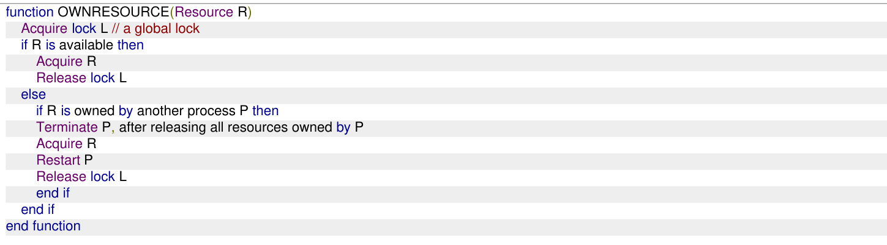

Which of the following choice(s) about the above scheme is/are correct?

A. The scheme ensures that deadlocks will not occur B. The scheme may lead to live-lock C. The scheme may lead to starvation D. The scheme violates the mutual exclusion property

Consider a system consisting of $k$ instances of a resource $R ,$ being shared by  processes. Assume that each process requires a maximum of two instances of resource $R$ and a process can request or release only one instance at a time. Further, a process can request the second instance of the resource only after acquiring the first instance.

The minimum value of $k$ for the system to be deadlock-free is (answer in integer)

gatecse-2026-set1 operating-system deadlock-prevention-avoidance-detection numerical-answers one-mark

# 5.5.4 Deadlock Prevention Avoidance Detection: GATE IT 2004 Question: 63

In a certain operating system, deadlock prevention is attempted using the following scheme. Each process is assigned a unique timestamp, and is restarted with the same timestamp if killed. Let $P _ { h }$ be the process holding a resource $R , P _ { r }$ be a process requesting for the same resource $R$ ， and $T ( P _ { h } )$ and $T ( P _ { r } )$ be their timestamps respectively. The decision to wait or preempt one of the processes is based on the following algorithm.

Which one of the following is TRUE?

A. The scheme is deadlock-free, but not starvation-free B. The scheme is not deadlock-free, but starvation-free C. The scheme is neither deadlock-free nor starvation-free D. The scheme is both deadlock-free and starvation-free

Consider a demand paging system with four page frames (initially empty) and page replacement policy. For the following page reference string

the page fault rate, defined as the ratio of number of page faults to the number of memory accesses (rounded off to one decimal place)is

gatecse-2022 numerical-answers operating-system page-replacement demand-paging two-marks

Consider a demand paging system with three frames, and the following page reference string: 2 3 4 5 4 6 4 5 1 3 2 . The contents of the frames are as follows initially and after each reference (from left to right):

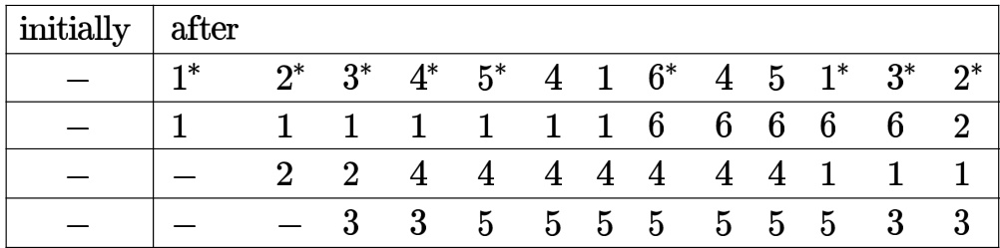

The \*-marked references cause page replacements. Which one or more of the following could be the page replacement policy/policies in use?

A. Least Recently Used page replacement policy B. Least Frequently Used page replacement policy C. Most Frequently Used page replacement policy D. Optimal page replacement policy

gatecse2025-set2 operating-system page-replacement demand-paging multiple-selects two-marks ✍ Practice Tests: Test 1 (15Q) Test 2 (15Q) Test 3 (2Q)

A certain moving arm disk-storage device has the following specifications:

Number of tracks per surface $\ l = 4 0 4$ Track storage capacity $= 1 3 0 0 3 0$ bytes. Disk speed $= 3 6 0 0$ rpm Average seek time $= 3 0$ m secs.

Estimate the average latency, the disk storage capacity, and the data transfer rate.

gate1990 operating-system disk descriptive

A certain moving arm disk storage, with one head, has the following specifications:

Number of tracks/recording surface $= 2 0 0$ Disk rotation spee ${ \mathsf { d } } = 2 4 0 0$ rpm Track storage capacity $= 6 2$ bits

The average latency of this device is $\mathrm { \bf P }$ ms and the data transfer rate is $\mathbf { Q }$ bits/sec. Write the values of  and $\mathbf { Q }$ .

gate1993 operating-system disk normal descriptive

# E. anywhere on the system disk

gate1993 operating-system disk normal

If the overhead for formatting a disk is  bytes for a 4000 byte sector,

A. Compute the unformatted capacity of the disk for the following parameters: 。 Number of surfaces: ， Outer diameter of the disk:  cm 。 Inner diameter of the disk: cm 。 Inner track space:  mm 。 Number of sectors per track:

B. If the disk in (A) is rotating at rpm, determine the effective data transfer rate which is defined as the number of bytes transferred per second between disk and memory.

A file system with a one-level directory structure is implemented on a disk with disk block size of  bytes. The disk is used as follows:

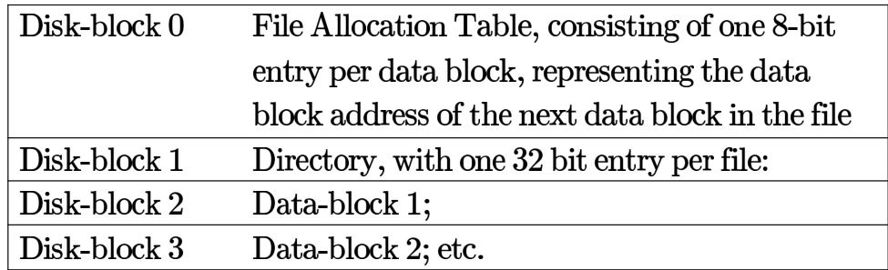

a. What is the maximum possible number of files? b. What is the maximum possible file size in blocks

A program $P$ reads and processes consecutive records from a sequential file $F$ stored on device without using any file system facilities. Given the following

Size of each record $= 3 2 0 0$ bytes Access time of $D = 1 0$ msecs Data transfer rate of $D = 8 0 0 \times 1 0 ^ { 3 }$ bytes/second CPU time to process each record $= 3$ msecs

What is the elapsed time of $P$ if

A. $F$ contains unblocked records and $P$ does not use buffering?   
B. $F$ contains unblocked records and $P$ uses one buffer (i.e., it always reads ahead into the buffer)?   
C. records of $F$ are organized using a blocking factor of  (i.e., each block on $D$ contains two records of $F$ ) and $P$ uses one buffer?

Formatting for a floppy disk refers to

A. arranging the data on the disk in contiguous fashion   
B. writing the directory   
C. erasing the system data   
D. writing identification information on all tracks and sectors

gate1998 operating-system disk normal

# 5.7.8 Disk: GATE CSE 1998 Question: 25-a

Free disk space can be used to keep track of using a free list or a bit map. Disk addresses require $d$ bits. For a disk with $B$ blocks, $F$ of which are free, state the condition under which the free list uses less space than the bit map.

gate1998 operating-system disk descriptive

# 5.7.9 Disk: GATE CSE 1998 Question: 25b

Consider a disk with $c$ cylinders, $t$ tracks per cylinder, sectors per track and a sector length $s _ { l }$ . file $d _ { l }$ with fixed record length $r _ { l }$ is stored continuously on this disk starting at location $( c _ { L } , t _ { L } , s _ { L } )$ , where $\boldsymbol { c } _ { L } , t _ { L }$ and $S _ { L }$ are the cylinder, track and sector numbers, respectively. Derive the formula to calculate the disk address (i.e. cylinder, track and sector) of a logical record n assuming that $\boldsymbol { r } _ { l } = \boldsymbol { s } _ { l }$ .

gate1998 operating-system disk descriptive

Raid configurations of the disks are used to provide

A. Fault-tolerance B. High speed C. High data density D. (A) & (B)

gate1999 operating-system disk easy isro2008

Answer key☟

# 5.7.11 Disk: GATE CSE 2001 Question: 1.22

Which of the following requires a device driver?

A. Register B. Cache C. Main memory D. Disk

gatecse-2001 operating-system disk easy

Answer key☟

A unix-style I-nodes has  direct pointers and one single, one double and one triple indirect pointers. Disk block size is Kbyte, disk block address is bits, and -bit integers are used. What is the maximum possible file size?

A. $2 ^ { 2 4 }$ bytes B. $2 ^ { 3 2 }$ bytes C. $2 ^ { 3 4 }$ bytes D. $2 ^ { 4 8 }$ bytes

gatecse-2004 operating-system disk normal

# Answer key☟

What is the swap space in the disk used for?

A. Saving temporary html pages B. Saving process data C. Storing the super-block D. Storing device drivers

gatecse-2005 operating-system disk easy

# 5.7.15 Disk: GATE CSE 2007 Question: 11, ISRO2009-36, ISRO2016-21

Consider a disk pack with  surfaces,  tracks per surface and  sectors per track. bytes of data are stored in a bit serial manner in a sector. The capacity of the disk pack and the number of bits required to specify a particular sector in the disk are respectively:

A. Mbyte, bits B. Mbyte,  bits C. Mbyte, bits D. Gbyte,  bits

gatecse-2007 operating-system disk normal isro2016

Answer key☟

# 5.7.16 Disk: GATE CSE 2008 Question: 32

For a magnetic disk with concentric circular tracks, the seek latency is not linearly proportional to the seek distance due to

A. non-uniform distribution of requests B. arm starting and stopping inertia C. higher capacity of tracks on the periphery of the platter D. use of unfair arm scheduling policies

gatecse-2008 operating-system disk normal

A hard disk has sectors per track,  platters each with recording surfaces and  cylinders. The address of a sector is given as a triple $\langle c , h , s \rangle$ , where $c$ is the cylinder number, $h$ is the surface number and is the sector number. Thus, the $0 ^ { t h }$ sector is addresses as $\langle 0 , 0 , 0 \rangle$ , the $1 ^ { s t }$ sector as $\left. 0 , 0 , 1 \right.$ , and so on The address corresponds to sector number:

A. 505035 B. 505036 C. 505037 D. 505038

gatecse-2009 operating-system disk normal

# Answer key☟

# 5.7.18 Disk: GATE CSE 2009 Question: 52

A hard disk has sectors per track, platters each with  recording surfaces and  cylinders. The address of a sector is given as a triple $\langle c , h , s \rangle$ , where $c$ is the cylinder number, $h$ is the surface number and $s$ is the sector number. Thus, the $0 ^ { t h }$ sector is addresses as $\langle 0 , 0 , 0 \rangle$ , the $1 ^ { s t }$ sector as $\left. 0 , 0 , 1 \right.$ , and so on

The address of the $1 0 3 9 ^ { t h }$ sector is

A. (0,15,31) B. (0,16,30) C. $\langle 0 , 1 6 , 3 1 \rangle$ D. (0,17,31)

gatecse-2009 operating-system disk normal

An application loads libraries at startup. Loading each library requires exactly one disk access. seek time of the disk to a random location is given as  ms. Rotational speed of disk is  rpm. If all libraries are loaded from random locations on the disk, how long does it take to load all libraries? (The time to transfer data from the disk block once the head has been positioned at the start of the block may be neglected.)

A. 0.50 s B. 1.50 s C. 1.25 s D. 1.00 s

gatecse-2011 operating-system disk normal

# 5.7.20 Disk: GATE CSE 2012 Question: 41

A file system with GByte disk uses a file descriptor with direct block addresses, indirect block address and doubly indirect block address. The size of each disk block is Bytes and the size of each disk block address is Bytes. The maximum possible file size in this file system is

A. KBytes B. KBytes C. KBytes D. dependent on the size of the disk

gatecse-2012 operating-system disk normal

# 5.7.21 Disk: GATE CSE 2013 Question: 29

Consider a hard disk with  recording surfaces $( 0 - 1 5 )$ having cylinders $( 0 - 1 6 3 8 3 )$ and each cylinder contains sectors $( 0 - 6 3 )$ . Data storage capacity in each sector is bytes. Data are organized cylinder-wise and the addressing format is (cylinder no.,surface no., sector no.) . A file of size KB is stored in the disk and the starting disk location of the file is $\langle 1 2 0 0 , 9 , 4 0 \rangle$ . What is the cylinder number of the last sector of the file, if it is stored in a contiguous manner?

A. 1281 B. 1282 C. 1283 D. 1284

gatecse-2013 operating-system disk normal

A FAT (file allocation table) based file system is being used and the total overhead of each entry in the FAT is  bytes in size. Given a $1 0 0 \times 1 0 ^ { 6 }$ bytes disk on which the file system is stored and data block size is $1 0 ^ { 3 }$ bytes, the maximum size of a file that can be stored on this disk in units of $1 0 ^ { 6 }$ bytes is

gatecse-2014-set2 operating-system disk numerical-answers normal file-system

Consider a typical disk that rotates at  rotations per minute (RPM) and has a transfer rate of $5 0 \times 1 0 ^ { 6 }$ bytes/sec. If the average seek time of the disk is twice the average rotational delay and the controller's transfer time is  times the disk transfer time, the average time (in milliseconds) to read or write a -byte sector of the disk is

Consider a  GB hard disk with  storage surfaces. There are  sectors per track and each sector holds bytes of data. The number of cylinders in the hard disk is

gatecse-2024-set1 numerical-answers operating-system disk two-marks

Consider a disk with the following specifications: rotation speed of RPM, average seek time milliseconds, sectors/track, -byte sectors. A file has content stored in sectors located randomly on the disk. Assuming average rotational latency, the total time (in seconds, rounded off to decimal places) to read the entire file from the disk is

gatecse-2024-set2 numerical-answers operating-system disk two-marks

# 5.7.27 Disk: GATE IT 2005 Question: 63

In a computer system, four files of size bytes, bytes,  bytes and bytes need to be stored. For storing these files on disk, we can use either  byte disk blocks or byte disk blocks (but can't mix block sizes). For each block used to store a file, bytes of bookkeeping information also needs to be stored on the disk. Thus, the total space used to store a file is the sum of the space taken to store the file and the space taken to store the book keeping information for the blocks allocated for storing the file. A disk block can store either bookkeeping information for a file or data from a file, but not both.   
What is the total space required for storing the files using 100 byte disk blocks and byte disk blocks respectively?

A. and bytes B. and bytes C. and  bytes D. and bytes

gateit-2005 operating-system disk normal

A disk has  equidistant tracks. The diameters of the innermost and outermost tracks are cm and c respectively. The innermost track has a storage capacity of MB.

What is the total amount of data that can be stored on the disk if it is used with a drive that rotates it with

I. Constant Linear Velocity II. Constant Angular Velocity?

A. I. ; II. 2040 MB B. I. ; II 80MB C. I. ; II. 360MB D. I. ; II. 80 MB

gateit-2005 operating-system disk normal

If the disk has  sectors per track and is currently at the end of th e sector of the inner-most track and the head can move at a speed of meters/sec and it is rotating at constant angular velocity of RPM, how much time will it take to read 1 MB contiguous data starting from the sector  of the outer-most track?

A. 13.5 ms B. 10 ms C. 9.5 ms D. 20 ms

gateit-2005 operating-system disk normal

A hard disk system has the following parameters

Number of tracks $= 5 0 0$   
Number of sectors/track $= 1 0 0$   
Number of bytes /sector $= 5 0 0$   
Time taken by the head to move from one track to adjacent track $= 1$ ms Rotation speed $= 6 0 0$ .

What is the average time taken for transferring bytes from the disk ?

A. 300.5 ms B. 255.5 ms C. 255 ms D. 300 ms

gateit-2007 operating-system disk normal isro2015

# Answer key☟

# 5.8

# Disk Scheduling (16)

Disk requests come to disk driver for cylinders ,2, and , in that order at a time when the disk drive is reading from cylinder . The seek time is msec per cylinder. Compute the total seek time if the disk arm scheduling algorithm is.

A. First come first served.   
B. Closest cylinder next.

gate1989 descriptive operating-system disk-scheduling

Assuming the current disk cylinder to be and the sequence for the cylinders to be 1,36,49,65,53,12,3,20,55,16, 65 and find the sequence of servicing using

1. Shortest seek time first (SSTF) and   
2. Elevator disk scheduling policies.

The correct matching for the following pairs is:

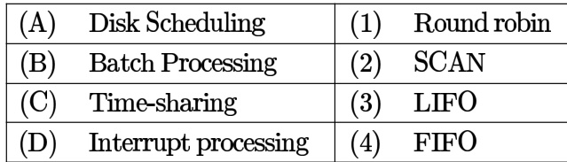

A. A-3 B-4 C-2 D-1 B. A-4 B-3 C-2 D-1 C. A-2 B-4 C-1 D-3 D. A-3 B-4 C-3 D-2

gate1997 operating-system normal disk-scheduling match-the-following

# Answer key☟

Which of the following disk scheduling strategies is likely to give the best throughput?

A. Farthest cylinder next B. Nearest cylinder next C. First come first served D. Elevator algorithm

gate1999 operating-system disk-scheduling normal

# Answer key☟

# 5.8.6 Disk Scheduling: GATE CSE 2001 Question: 20

Consider a disk with the  tracks numbered from  to rotating at  rpm. The number of sectors per track is  and the time to move the head between two successive tracks is  millisecond.

A. Consider a set of disk requests to read data from tracks 7,45,5 and . Assuming that the elevator algorithm is used to schedule disk requests, and the head is initially at track  moving up (towards larger track numbers), what is the total seek time for servicing the requests?   
B. Consider an initial set of arbitrary disk requests and assume that no new disk requests arrive while servicing these requests. If the head is initially at track and the elevator algorithm is used to schedule disk requests, what is the worse case time to complete all the requests?

gatecse-2001 operating-system disk disk-scheduling normal descriptive

Consider an operating system capable of loading and executing a single sequential user process at a time. The disk head scheduling algorithm used is First Come First Served (FCFS). If FCFS is replaced by Shortest Seek Time First (SSTF), claimed by the vendor to give $5 0 \%$ better benchmark results, what is th expected improvement in the I/O performance of user programs?

A. $5 0 \%$ B. $4 0 \%$ C. $2 5 \%$ D. $0 \%$

gatecse-2004 operating-system disk-scheduling normal

A. B. 119 ms C. 233 ms D. 276 ms

Suppose a disk has cylinders, numbered from to . At some time the disk arm is at cylinder , and there is a queue of disk access requests for cylinders and . If Shortest-Seek Time First (SSTF) is being used for scheduling the disk access, the request for cylinder is serviced after servicing number of requests.

gatecse-2014-set1 operating-system disk-scheduling numerical-answers normal

Suppose the following disk request sequence (track numbers) for a disk with  tracks is given:

Assume that the initial position of the R/W head is on track . The additional distance that will be traversed by the R/W head when the Shortest Seek Time First (SSTF) algorithm is used compared to the SCAN (Elevator) algorithm (assuming that SCAN algorithm moves towards  when it starts execution) is tracks.

gatecse-2015-set1 operating-system disk-scheduling normal numerical-answers

Cylinder a disk queue with requests for $I / O$ to blocks on cylinders  The CLOOK scheduling algorithm is used. The head is initially at cylinder number , moving towards larger cylinder numbers on its servicing pass. The cylinders are numbered from  to . The total head movement (in number of cylinders) incurred while servicing these requests is

gatecse-2016-set1 operating-system disk-scheduling normal numerical-answers

Consider a storage disk with platters (numbered as and ) cylinders (numbered as $\mathbf { 0 , 1 , . . . , 1 9 9 } )$ , and  sectors per track (numbered as $_ { 0 , 1 , . . . 2 5 5 }$ ). The following  disk requests of the form [sector number, cylinder number, platter number] are received by the disk controller at the same time:

Currently head is positioned at sector number of cylinder , and is moving towards higher cylinder numbers. The average power dissipation in moving the head over cylinders is milliwatts and for reversing the direction of the head movement once is milliwatts. Power dissipation associated with rotational latency and switching of head between different platters is negligible.

The total power consumption in milliwatts to satisfy all of the above disk requests using the Shortest Seek Time First disk scheduling algorithm is

gatecse-2018 operating-system disk-scheduling numerical-answers two-marks

Assume the head is positioned at cylinder . The scheduler follows Shortest Seek Time First scheduling to service the requests.

Which one of the following statements is FALSE?

A. $T$ is serviced before $P$ .   
B. $Q$ is serviced after $\boldsymbol { S }$ ,but before $T$ .   
C. The head reverses its direction of movement between servicing of $Q$ and $P$ .   
D. $R$ is serviced before $P$ .

gatecse-2020 operating-system disk-scheduling two-marks

A disk has tracks (numbered through ). At a given time, it was servicing the request of reading data from track , and at the previous request, service was for track . The pending requests (in order of their arrival) are for track numbers.

30 70 115 130 110 80 20 25.

How many times will the head change its direction for the disk scheduling policies SSTF(Shortest Seek Time First) and FCFS (First Come First Serve)?

A. and B. and C. and D. and

gateit-2004 operating-system disk-scheduling normal

The head of a hard disk serves requests following the shortest seek time first  policy. The head is initially positioned at track number .

Which of the request sets will cause the head to change its direction after servicing every request assuming that the head does not change direction if there a tie in and all the requests arrive before the servicing starts?

A. 11,139,170,178,181,184,201,265 B. 10,138,170,178,181,185,201,265   
C. 10,139,169,178,181,184,201,265 D. 10,138,170,178,181,185,200,265

gateit-2007 operating-system disk-scheduling normal

The head of a hard disk serves requests following the shortest seek time first (SSTF) policy. What is the maximum cardinality of the request set, so that the head changes its direction after servicing every request if the total number of tracks are  and the head can start from any track?

A. B. C. D.

gateit-2007 operating-system disk-scheduling normal

# Answer key☟

The data blocks of a very large file in the Unix file system are allocated using

A. continuous allocation B. linked allocation C. indexed allocation D. an extension of indexed allocation gatecse-2008 file-system operating-system normal

In a file allocation system, which of the following allocation scheme(s) can be used if no externa fragmentation is allowed?

1. Contiguous   
2. Linked   
3. Indexed

A. and  only B. only C. only D. and  only

gatecse-2017-set2 operating-system file-system normal

The index node (inode) of a Unix -like file system has direct, one single-indirect and one double-indirect pointers. The disk block size is $4 \kappa \mathsf { B }$ , and the disk block address is -bits long. The maximum possible file size is (rounded off to decimal place) GB

gatecse-2019 numerical-answers operating-system file-system two-marks

Consider a linear list based directory implementation in a file system. Each directory is a list of nodes, where each node contains the file name along with the file metadata, such as the list of pointers to the data blocks. Consider a given directory .

Which of the following operations will necessarily require a full scan of  for successful completion?

A. Creation of a new file in foo B. Deletion of an existing file from foo C. Renaming of an existing file in D. Opening of an existing file in foo

gatecse-2021-set1 multiple-selects operating-system file-system one-mark

# 5.9.6 File System: GATE CSE 2022 Question: 53

Consider two files systems A and , that use contiguous allocation and linked allocation, respectively. A file of size blocks is already stored in and also in . Now, consider inserting a new block in the middle of the file (between and $5 1 ^ { s t }$ block), whose data is already available in the memory. Assume that there are enough free blocks at the end of the file and that the file control blocks are already in memory. Let the number of disk accesses required to insert a block in the middle of the file in and $\mathbf { B }$ are $n _ { A }$ and $n _ { B }$ , respectively, then the value of $n _ { A } + n _ { B }$ is

gatecse-2022 numerical-answers operating-system file-system two-marks

addresses and three additional addresses: one for single indirect block, one for double indirect block and one for triple indirect block. Also, each block can contain addresses for blocks. Which one of the following is approximately the maximum size of a file in the file system?

A. MB B. GB C. GB D. GB

gateit-2004 operating-system file-system normal

# Answer key☟

✍ Practice Test: Test (14Q)

# 5.10.1 Fork System Call: GATE CSE 2005 Question: 72

Consider the following code fragment:   
P $( \mathsf { f o r k } ( ) = = 0 )$ $\mathtt { a } = \mathtt { a } + 5$ ; printf("%d, %p n", a, &a);   
else   
$a = a - 5$ ; printf ("%d, %p n", a,& a);

Let $u , v$ be the values printed by the parent process and $x , y$ be the values printed by the child process. Which one of the following is TRUE?

A. $\boldsymbol { u } = \boldsymbol { x } + 1 0$ and v=y B. $\boldsymbol { u } = \boldsymbol { x } + 1 0$ and $v ! = y$ C. $u + 1 0 = x $ and $v = y$ D. $u + 1 0 = x $ and $v ! = y$

gatecse-2005 operating-system fork-system-call normal

Answer key☟

A process executes the following code

$\mathsf { f o r } ( \mathsf { i } { = } 0 ; \mathsf { i } { < } \mathsf { n } ; \mathsf { i } { + } + ) \mathsf { f o r k } ($ ();

The total number of child processes created is

A. n B. C. 2n D. 2n+1 -1

gatecse-2008 operating-system fork-system-call normal

A process executes the code

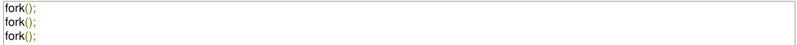

The total number of child processes created is

A. B. C. D.

gatecse-2012 operating-system easy fork-system-call

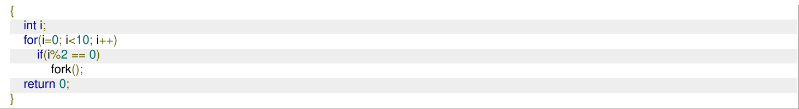

The total number of child processes created is gatecse-2019 numerical-answers operating-system fork-system-call one-mark

Which one or more of the following options guarantee that computer system will transition from user mode to kernel mode?

A. Function Call B. malloc Call C. Page Fault D. System Call gatecse-2023 operating-system fork-system-call multiple-selects one-mark

Consider the following code snippet using the fork () and wait () system calls. Assume that the code compiles and runs correctly, and that the system calls run successfully without any errors.

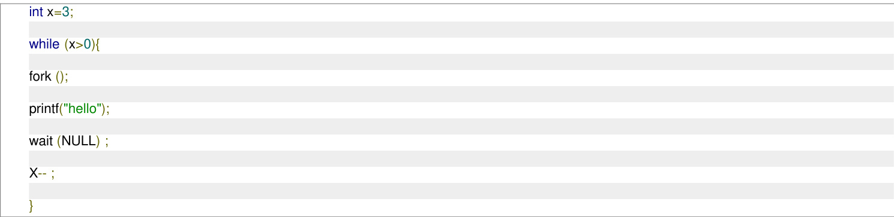

The total number of times the printf statement is executed is gatecse-2024-set1 numerical-answers operating-system fork-system-call two-marks

Consider the following program snippet. Assume that the program compiles and runs successfully. Further, assume that the fork() system call is always successful in creating a process.

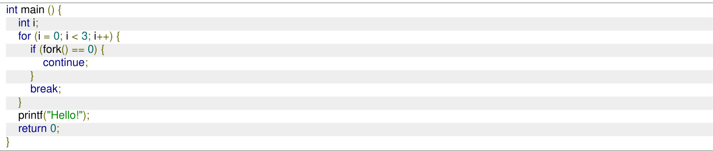

The total number of times that the printf statement gets executed is (answer in integer)

A process executes the following segment of code

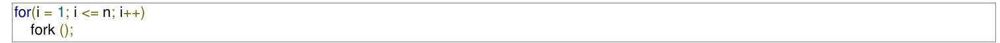

The number of new processes created is

A. n B. $( ( n ( n + 1 ) ) / 2 )$ C. D.

gateit-2004 operating-system fork-system-call easy

# Answer key☟

# 5.11

# IO Handling (7)

✍ Practice Test: Test (8Q)

# 5.11.1 IO Handling: GATE CSE 1996 Question: 1.20, ISRO2008-56

Which of the following is an example of spooled device?

A. A line printer used to print the output of a number of jobs B. A terminal used to enter input data to a running program C. A secondary storage device in a virtual memory system D. A graphic display device

gate1996 operating-system io-handling normal isro2008

Which of the following is an example of a spooled device?

A. The terminal used to enter the input data for the C program being executed B. An output device used to print the output of a number of jobs C. The secondary memory device in a virtual storage system D. The swapping area on a disk used by the swapper

gate1998 operating-system io-handling easy

Which one of the following is true for a CPU having a single interrupt request line and a single interrupt grant line?

A. Neither vectored interrupt nor multiple interrupting devices are possible B. Vectored interrupts are not possible but multiple interrupting devices are possible C. Vectored interrupts and multiple interrupting devices are both possible D. Vectored interrupts are possible but multiple interrupting devices are not possible

gatecse-2005 operating-system io-handling normal

CPU with memory mapped I/O, there is no explicit I/O instruction. Which one of the following is true for a CPU with memory mapped I/O?

A. I/O protection is ensured by operating system routine(s) B. I/O protection is ensured by a hardware trap C. I/O protection is ensured during system configuration D. I/O protection is not possible

gatecse-2005 operating-system io-handling normal

The following are some events that occur after a device controller issues an interrupt while process $L$ is under execution.

The processor pushes the process status of $L$ onto the control stack Q. The processor finishes the execution of the current instruction R. The processor executes the interrupt service routine S. The processor pops the process status of $L$ from the control stack T. The processor loads the new PC value based on the interrupt

Which of the following is the correct order in which the events above occur?

A. QPTRS B. PTRSQ C. TRPQS D. QTPRS gatecse-2018 operating-system interrupts normal one-mark co-and-architecture io-handling

What is the bit rate of a video terminal unit with characters/line, and horizontal sweep time of $1 0 0 \mu \mathbf { s }$ (including $2 0 \mu \mathrm { s }$ of retrace time)?

A. 8 Mbps B. 6.4 Mbps C. Mbps D. 0.64 Mbps

gateit-2004 operating-system io-handling easy isro2011

# 5.11.7 IO Handling: GATE IT 2006 Question: 8

Which of the following DMA transfer modes and interrupt handling mechanisms will enable the highest I/O band-width?

A. Transparent DMA and Polling B. Cycle-stealing and Vectored interrupts interrupts C. Block transfer and Vectored D. Block transfer and Polling interrupts interrupts

gateit-2006 operating-system io-handling dma normal gatecse2025-set1 operating-system process-scheduling input-output numerical-answers one-mark

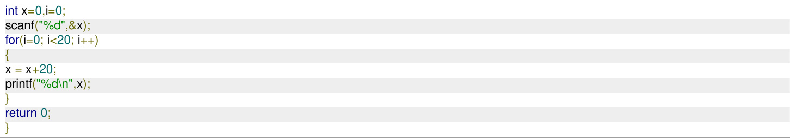

# Answer key☟

# 5.13.1 Inter Process Communication: GATE CSE 1997 Question: 3.7

I/O redirection

A. implies changing the name of a file   
B. can be employed to use an existing file as input file for a program   
C. implies connecting programs through a pipe   
D. None of the above

gate1997 operating-system normal inter-process-communication

# Answer key☟

✍ Practice Test: Test (6Q)

The details of an interrupt cycle are shown in figure.

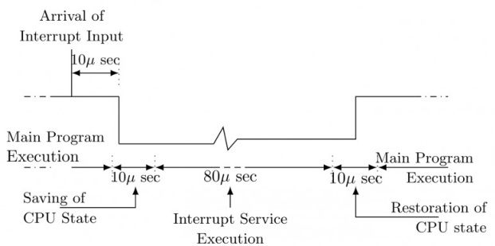

Given that an interrupt input arrives every msec, what is the percentage of the total time that the CPU devotes for the main program execution.

gate1993 operating-system interrupts normal descriptive

Which of the following devices should get higher priority in assigning interrupts?

A. Hard disk B. Printer C. Keyboard D. Floppy disk

gate1998 operating-system interrupts normal

Listed below are some operating system abstractions (in the left column) and the hardware components (in the right column)

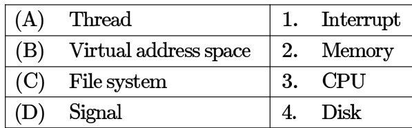

A. (A) – 2 (B) – 4 (C) – 3 (D) – 1   
B. (A) – 1 (B) – 2 (C) – 3 (D) – 4   
C. (A) – 3 (B) – 2 (C) – 4 (D) – 1   
D. (A) – 4 (B) – 1 (C) – 2 (D) – 3

gate1999 operating-system easy interrupts virtual-memory disk

A processor needs software interrupt to

A. test the interrupt system of the processor   
B. implement co-routines   
C. obtain system services which need execution of privileged instructions   
D. return from subroutine

gatecse-2001 operating-system interrupts easy

# 5.14.6 Interrupts: GATE CSE 2011 Question: 11

A computer handles several interrupt sources of which of the following are relevant for this question.

Interrupt from CPU temperature sensor (raises interrupt if CPU temperature is too high) Interrupt from Mouse (raises Interrupt if the mouse is moved or a button is pressed) Interrupt from Keyboard (raises Interrupt if a key is pressed or released) Interrupt from Hard Disk (raises Interrupt when a disk read is completed)

Which one of these will be handled at the HIGHEST priority?

1. Interrupt from Hard Disk   
2. Interrupt from Mouse   
3. Interrupt from Keyboard   
4. Interrupt from CPU temperature sensor

Consider the following two-dimensional array in the  programming language, which is stored in rowmajor order:

# int D[128][128];

Demand paging is used for allocating memory and each physical page frame holds elements of the array The Least Recently Used  page-replacement policy is used by the operating system. A total of physical page frames are allocated to a process which executes the following code snippet:

The number of page faults generated during the execution of this code snippet is gatecse-2023 operating-system page-replacement least-recently-used page-faults numerical-answers two-marks

A disk of size $\mathrm { 5 1 2 M }$ bytes is divided into blocks of $6 4 \mathrm { K }$ bytes. A file is stored in the disk using allocation. In linked allocation, each data block reserves bytes to store the pointer to the next data block. The link part of the last data block contains a NULL pointer (also of  bytes). Suppose a file of $^ { 1 \mathrm { M } }$ bytes needs to be stored in the disk. Assume, $1 \mathrm { K } = 2 ^ { 1 0 }$ and $1 \mathrm { M } = 2 ^ { 2 0 }$ . The amount of space in bytes that will be wasted due to internal fragmentation is (Answer in integer)

gatecse2025-set1 operating-system linked-allocation internal-fragmentation numerical-answers two-marks ✍ Practice Tests: Test 1 (15Q) Test 2 (2Q)

Let the page reference and the working set window beccdbcecea $d$ and , respectively. The initial working set at time $t = 0$ contains the pages $\{ a , d , e \}$ , where $a$ was referenced at time $t = 0$ , $d$ was referenced at time $t = - 1$ , and $e$ was referenced at time $t = - 2$ . Determine the total number of page faults and the average number of page frames used by computing the working set at each reference.

gate1992 operating-system memory-management normal descriptive

A computer installation has $1 0 0 0 k$ of main memory. The jobs arrive and finish in the following sequences.

Job requiring 200k arrives Job 2 requiring 350k arrives Job 3 requiring 300k arrives Job finishes Job 4 requiring 120k arrives Job 5 requiring 150k arrives Job 6 requiring $8 0 \mathsf { k }$ arrives

A. Draw the memory allocation table using Best Fit and First Fit algorithms. B. Which algorithm performs better for this sequence?

A 1000 Kbyte memory is managed using variable partitions but no compaction. It currently has two partitions of sizes   and respectively. The smallest allocation request in  that could be denied is for

A. B. 181 C. 231 D. 541

gate1996 operating-system memory-management normal

# Answer key☟

The overlay tree for a program is as shown below:

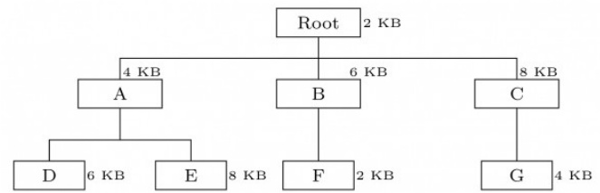

What will be the size of the partition (in physical memory) required to load (and run) this program?

A. 12 KB B. 14KB C. 10 KB D. 8KB

gate1998 operating-system normal memory-management

# 5.17.5 Memory Management: GATE CSE 2014 Set 2 Question: 55

Consider the main memory system that consists of  memory modules attached to the system bus, which s one word wide. When a write request is made, the bus is occupied for nanoseconds (ns) by the data, address, and control signals. During the same  ns, and for ns thereafter, the addressed memory module executes one cycle accepting and storing the data. The (internal) operation of different memory modules may overlap in time, but only one request can be on the bus at any time. The maximum number of stores (of one word each) that can be initiated in  millisecond is

gatecse-2014-set2 operating-system memory-management numerical-answers normal

Consider  memory partitions of sizes  , , , , and  , where refers to . These partitions need to be allotted to four processes of sizes  , , 468 , KB in that order. If the best-fit algorithm is used, which partitions are NOT allotted to any process?

A. and 300 KB B. and C. and D. and 400 KB gatecse-2015-set2 operating-system memory-management easy

For each of the four processes $P _ { 1 } , P _ { 2 } , P _ { 3 }$ and $P _ { 4 }$ . The total size in kilobytes $( K B )$ and the number of segments are given below.

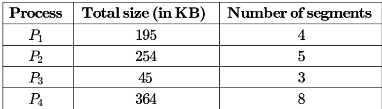

The page size is $1 \mathrm { K B }$ . The size of an entry in the page table is  . The size of an entry in the segment table i s  . The maximum size of a segment is  . The paging method for memory management uses twolevel paging, and its storage overhead is $P$ . The storage overhead for the segmentation method is $\boldsymbol { S }$ . The storage overhead for the segmentation and paging method is $T$ . What is the relation among the overheads for the different methods of memory management in the concurrent execution of the above four processes?

A. $\mathbf { P < S < T }$ $\begin{array} { c } { { \mathsf { B . ~ S < P < T } } } \\ { { \mathsf { D . ~ T < S < P } } } \end{array}$   
C. $\mathbf { S } < \mathbf { T } < \mathbf { P }$

gateit-2006 operating-system memory-management difficult

# Answer key☟

Let a memory have four free blocks of sizes $4 k$ $\ell , 8 k , 2 0 k , 2$ . These blocks are allocated following the best-fit strategy. The allocation requests are stored in a queue as shown below.

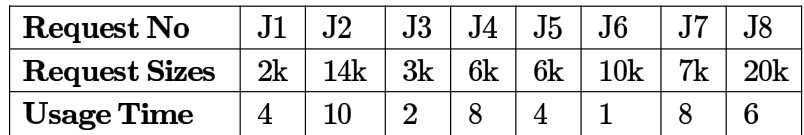

The time at which the request for $J 7$ will be completed will be

A. B. C. D.

gateit-2007 operating-system memory-management normal

# Answer key☟

A computer system supports a logical address space of bytes. It uses two-level hierarchical paging with a page size of  bytes. A logical address is divided into $\mathsf { a } b$ -bit index to the outer page table, an offset within the page of the inner page table, and an offset within the desired page. Each entry of the inner page table uses eight bytes. All the pages in the system have the same size.

The value of $b$ is (Answer in integer)

gatecse2025-set2 operating-system paging multilevel-paging numerical-answers two-marks