A. a software interrupt B. polling C. an indirect jump D. a privileged instruction gate1999 operating-system normal ugcnetcse-dec2015-paper2 os-protection

A CPU has two modes -- privileged and non-privileged. In order to change the mode from privileged to nonprivileged

A. a hardware interrupt is needed   
B. a software interrupt is needed   
C. a privileged instruction (which does not generate an interrupt) is needed   
D. a non-privileged instruction (which does not generate an interrupt) is needed

gatecse-2001 operating-system normal os-protection

# 5.19.3 OS Protection: GATE IT 2005 Question: 19, UGCNET-June2012-III: 57

A user level process in Unix traps the signal sent on a Ctrl-C input, and has a signal handling routine that saves appropriate files before terminating the process. When a Ctrl-C input is given to this process, what is the mode in which the signal handling routine executes?

A. User mode B. Kernel mode C. Superuser mode D. Privileged mode

gateit-2005 operating-system os-protection normal ugcnetcse-june2012-paper3

The following page addresses, in the given sequence, were generated by a program: 12341352154323

This program is run on a demand paged virtual memory system, with main memory size equal to  pages. Indicate the page references for which page faults occur for the following page replacement algorithms.

A. LRU   
B. FIFO   
Assume that the main memory is initially empty.

gate1993 operating-system page-replacement normal descriptive

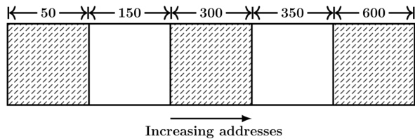

The sequence of requests for blocks of sizes  can be satisfied if we use

A. either first fit or best fit policy (any one) B. first fit but not best fit policy C. best fit but not first fit policy D. None of the above

gate1994 operating-system page-replacement normal

Which of the following page replacement algorithms suffers from Belady’s anamoly?

A. Optimal replacement B. LRU C. FIFO D. Both (A) and (C)

gate1995 operating-system page-replacement normal

The address sequence generated by tracing a particular program executing in a pure demand based paging system with records per page with free main memory frame is recorded as follows. What is the number of page faults?

0100,0200,0430,0499,0510,0530,0560,0120,0220,0240,0260,0320,0370

A. B. C. D.

gate1995 operating-system page-replacement normal

# 5.20.6 Page Replacement: GATE CSE 1997 Question: 3.10, ISRO2008-57, ISRO2015-64

Dirty bit for a page in a page table

A. helps avoid unnecessary writes on B. helps maintain LRU information a paging device C. allows only read on a page D. None of the above

gate1997 operating-system page-replacement easy isro2008 isro2015

Locality of reference implies that the page reference being made by a process

A. will always be to the page used in the previous page reference B. is likely to be to one of the pages used in the last few page references C. will always be to one of the pages existing in memory D. will always lead to a page fault

gate1997 operating-system page-replacement easy

multiprogramming D. improve the system performance

Consider a virtual memory system with FIFO page replacement policy. For an arbitrary page access pattern, increasing the number of page frames in main memory will

A. always decrease the number of B. always increase the number of page faults page faults C. sometimes increase the number of D. never affect the number of page page faults faults

gatecse-2001 operating-system page-replacement normal

The optimal page replacement algorithm will select the page that

A. Has not been used for the longest time in the past B. Will not be used for the longest time in the future C. Has been used least number of times D. Has been used most number of times

The minimum number of page frames that must be allocated to a running process in a virtual memory environment is determined by

A. the instruction set architecture B. page size C. number of processes in memory D. physical memory size gatecse-2004 operating-system virtual-memory page-replacement normal isro2007

Answer key☟

# 5.20.12 Page Replacement: GATE CSE 2005 Question: 22, ISRO2015-36

Increasing the RAM of a computer typically improves performance because:

A. Virtual Memory increases B. Larger RAMs are faster C. Fewer page faults occur D. Fewer segmentation faults occur

gatecse-2005 operating-system page-replacement easy isro2015

# 5.20.13 Page Replacement: GATE CSE 2007 Question: 56

A virtual memory system uses First In First Out (FIFO) page replacement policy and allocates a fixed number of frames to a process. Consider the following statements:   
P: Increasing the number of page frames allocated to a process sometimes increases the page fault rate. Q: Some programs do not exhibit locality of reference.

Which one of the following is TRUE?

A. Both P and Q are true, and Q is the reason for P B. Both P and Q are true, but Q is not the reason for P.   
C. P is false but Q is true D. Both P and Q are false.

A process has been allocated page frames. Assume that none of the pages of the process are available in the memory initially. The process makes the following sequence of page references (reference string): 1,2,1,3,7,4,5,6,3,1

If optimal page replacement policy is used, how many page faults occur for the above reference string?

A. B. C. D.

gatecse-2007 operating-system page-replacement easy

A process, has been allocated page frames. Assume that none of the pages of the process are available in the memory initially. The process makes the following sequence of page references (reference string): $1 , 2 , 1 , 3 , 7 , 4 , 5 , 6 , 3 , 1$

Least Recently Used (LRU) page replacement policy is a practical approximation to optimal page replacement. For the above reference string, how many more page faults occur with LRU than with the optimal page replacement policy?

A. B. C. 2 D.

gatecse-2007 normal operating-system page-replacement

# 5.20.16 Page Replacement: GATE CSE 2009 Question: 9, ISRO2016-52

In which one of the following page replacement policies, Belady's anomaly may occur?

A. FIFO B. Optimal C. LRU D. MRU

gatecse-2009 operating-system page-replacement easy isro2016

# 5.20.17 Page Replacement: GATE CSE 2010 Question: 24

A system uses FIFO policy for system replacement. It has  page frames with no pages loaded to begin with. The system first accesses  distinct pages in some order and then accesses the same pages but now in the reverse order. How many page faults will occur?

A. 196 B. 192 C. 197 D. 195

gatecse-2010 operating-system page-replacement normal

# 5.20.18 Page Replacement: GATE CSE 2012 Question: 42

Consider the virtual page reference string

on a demand paged virtual memory system running on a computer system that has main memory size of   page frames which are initially empty. Let , and denote the number of page faults under the corresponding page replacement policy. Then

A. OPTIMAL ${ \bf < L R U < F I F O }$ $\mathsf { B . { O P T I M A L } < F I F O < L R U }$ C. OPTIMAL $\ b =$ LRU D. OPTIMAL $\ b =$ FIFO

gatecse-2012 operating-system page-replacement normal

1, 2,3, 4,2, 1,5,3,2,4, 6 the number of page faults using the optimal replacement policy is

gatecse-2014-set1 operating-system page-replacement numerical-answers

A computer has twenty physical page frames which contain pages numbered through . Now program accesses the pages numbered 100 in that order, and repeats the access sequence THRICE. Which one of the following page replacement policies experiences the same number of page faults as the optimal page replacement policy for this program?

A. Least-recently-used B. First-in-first-out C. Last-in-first-out D. Most-recently-used gatecse-2014-set2 operating-system page-replacement ambiguous

# 5.20.21 Page Replacement: GATE CSE 2014 Set 3 Question: 20

A system uses page frames for storing process pages in main memory. It uses the Least Recently Used (LRU) page replacement policy. Assume that all the page frames are initially empty. What is the total number of page faults that will occur while processing the page reference string given below? 4,7,6,1,7,6,1,2,7, 2

gatecse-2014-set3 operating-system page-replacement numerical-answers normal

Consider a main memory with five-page frames and the following sequence of page references: 3, 8,2,3, 9, 1,6,3, 8, 9,3,6, 2, 1, . Which one of the following is true with respect to page replacement policies First In First Out (FIFO) and Least Recently Used (LRU)?

A. Both incur the same number of page faults B. FIFO incurs  more page faults than LRU C. LRU incurs more page faults than FIFO D. FIFO incurs more page faults than LRU gatecse-2015-set1 operating-system page-replacement normal

Consider a computer system with ten physical page frames. The system is provided with an sequence $( a _ { 1 } , a _ { 2 } , \ldots , a _ { 2 0 } , a _ { 1 } , a _ { 2 } , \ldots a _ { 2 0 } )$ , where each $a _ { i }$ is a distinct virtual page number. The difference in the number of page faults between the last-in-first-out page replacement policy and the optimal page replacement policy is

gatecse-2016-set1 operating-system page-replacement normal numerical-answers

Recall that Belady's anomaly is that the page-fault rate may increase as the number of allocated frames increases. Now, consider the following statements:

$S _ { 1 }$ : Random page replacement algorithm (where a page chosen at random is replaced) suffers from Belady's anomaly.   
$S _ { 2 }$ : LRU page replacement algorithm suffers from Belady's anomaly.

Which of the following is CORRECT?

A. $S _ { 1 }$ is true, $S _ { 2 }$ is true B. $S _ { 1 }$ is true, $S _ { 2 }$ is false C. $S _ { 1 }$ is false, $S _ { 2 }$ is true D. $S _ { 1 }$ is false, $S _ { 2 }$ is false gatecse-2017-set1 page-replacement operating-system normal

# 5.20.26 Page Replacement: GATE CSE 2021 Set 1 Question: 11

In the context of operating systems, which of the following statements is/are correct with respect to paging?

A. Paging helps solve the issue of external fragmentation B. Page size has no impact on internal fragmentation C. Paging incurs memory overheads D. Multi-level paging is necessary to support pages of different sizes gatecse-2021-set1 multiple-selects operating-system page-replacement one-mark

Consider a three-level page table to translate a bit virtual address to a physical address as shown below:

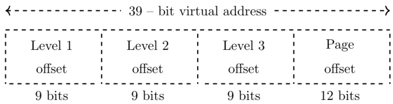

The page size is $( \mathrm { 1 K B } = 2 ^ { 1 0 }$ bytes and page table entry size at every level is  bytes. A process $P$ is currently using $( 1 { \dot { \mathrm { G B } } } = 2 ^ { 3 0 }$ bytes virtual memory which is mapped to of physical memory. The minimum amount of memory required for the page table of $P$ across all levels is .

gatecse-2021-set2 numerical-answers operating-system memory-management page-replacement two-marks

The address sequence generated by tracing a particular program executing in a pure demand paging system with bytes per page is 0100,0200,0430,0499, 0510,0530,0560,0120, 0220,0240,0260, 0320,0410.

Suppose that the memory can store only one page and if $x$ is the address which causes a page fault then the bytes from addresses $x$ to ${ \bf x } + 9 9 { \bf \\xi }$ are loaded on to the memory.   
How many page faults will occur?

A. B . C. D. gateit-2007 operating-system virtual-memory page-replacement normal

# 5.20.30 Page Replacement: GATE IT 2007 Question: 58

A demand paging system takes  time units to service a page fault and  time units to replace page. Memory access time is  time unit. The probability of a page fault is $p$ . In case of a page fault, the probability of page being dirty is also $p$ . It is observed that the average access time is  time units. Then the value of $p$ is

A. 0.194 B. 0.233 C. 0.514 D. 0.981 gateit-2007 operating-system page-replacement probability normal

# 5.20.31 Page Replacement: GATE IT 2008 Question: 41

Assume that a main memory with only  pages, each of  bytes, is initially empty. The CPU generates the following sequence of virtual addresses and uses the Least Recently Used (LRU) page replacement policy. 0, 4,8,20,24,36,44,12,68,72,80,84,28,32,88, 92   
How many page faults does this sequence cause? What are the page numbers of the pages present in the main memory at the end of the sequence?

A. and B. and C. and D. and

gateit-2008 operating-system page-replacement normal

Consider the following precedence graph of processes where a node denotes a process and directed edge from node $P _ { i }$ to node $P _ { j }$ implies; that $P _ { i }$ must complete before $P _ { j }$ commences. Implement the graph using FORK and JOIN constructs. The actual computation done by a process may be indicated by a comment line.

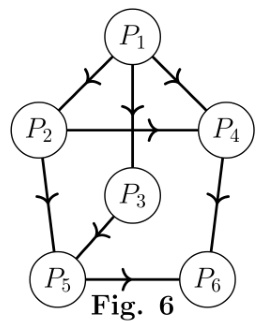

# A given set of processes can be implemented by using only parbegin/parend statement, if the precedence graph of these processes is

gate1991 operating-system normal precedence-graph fill-in-the-blanks

Draw the precedence graph for the concurrent program given below

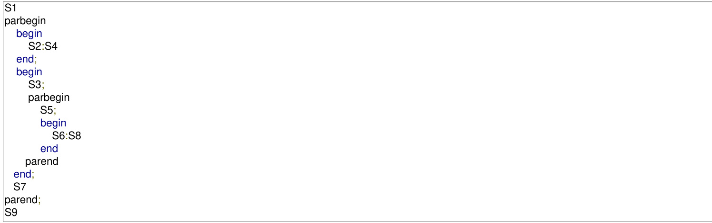

gate1992 operating-system normal concurrency precedence-graph descriptive

# Answer key☟

✍ Practice Test: Test (7Q)

The process state transition diagram in the below figure is representative of

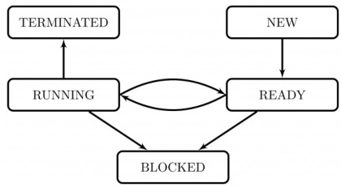

A. a batch operating system B. an operating system with a preemptive scheduler C. an operating system with a non-preemptive scheduler D. a uni-programmed operating system

gate1996 operating-system normal process

Which combination of the following features will suffice to characterize an OS as a multi-programmed OS?

a. More than one program may be loaded into main memory at the same time for execution b. If a program waits for certain events such as I/O, another program is immediately scheduled for execution c. If the execution of a program terminates, another program is immediately scheduled for execution.

A. (a) B. (a) and (b) C. (a) and (c) D. (a), (b) and (c)

gatecse-2002 operating-system normal process

Which one or more of the following need to be saved on a context switch from one thread  of a process to another thread of the same process?

A. Page table base register B. Stack pointer C. Program counter D. General purpose registers gatecse-2023 operating-system process multiple-selects one-mark

The process state transition diagram of an operating system is as given below. Which of the following must be FALSE about the above operating system?

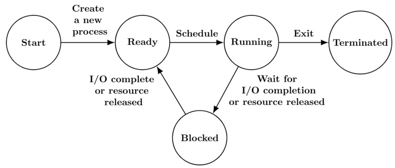

A. It is a multiprogrammed operating B. It uses preemptive scheduling system C. It uses non-preemptive scheduling D. It is a multi-user operating syste

gateit-2006 operating-system normal process

# Answer key☟

State any undesirable characteristic of the following criteria for measuring performance of an operating system:

# Waiting time

gate1988 normal descriptive operating-system process-scheduling

The highest-response ratio next scheduling policy favours jobs, but it also limits the waiting time of jobs.

gate1990 operating-system process-scheduling fill-in-the-blanks

Assume that the following jobs are to be executed on a single processor system

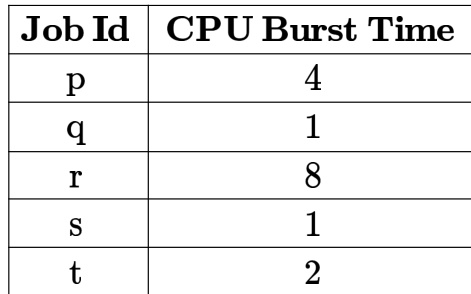

The jobs are assumed to have arrived at time $0 ^ { + }$ and in the order $p , q , r , s , t$ . Calculate the departure time (completion time) for job $p$ scheduling is round robin with time slice

A. B. C. D.

# E. None of the above

gate1993 operating-system process-scheduling normal

Which scheduling policy is most suitable for a time shared operating system?

A. Shortest Job First B. Round Robin C. First Come First Serve D. Elevator

gate1995 operating-system process-scheduling easy

# Answer key☟

Four jobs to be executed on a single processor system arrive at time  in the order $A , B , C , D$ . Their burs CPU time requirements are $^ { 4 , 1 , 8 , 1 }$ time units respectively. The completion time of $A$ under round robin scheduling with time slice of one time unit is

A. B. C. D. 9

gate1996 operating-system process-scheduling normal isro2008

# 5.23.8 Process Scheduling: GATE CSE 1998 Question: 2.17, UGCNET-Dec2012-III: 43

Consider $n$ processes sharing the CPU in a round-robin fashion. Assuming that each process switch takes seconds, what must be the quantum size $q$ such that the overhead resulting from process switching is minimized but at the same time each process is guaranteed to get its turn at the CPU at least every $t$ seconds?

A. $\begin{array} { r } { q \leq \frac { t - n s } { n - 1 } } \end{array}$ $\begin{array} { r } { \mathsf { B . ~ } q \ge \frac { t - n s } { n - 1 } } \\ { \mathsf { D . ~ } q \ge \frac { t - n s } { n + 1 } } \end{array}$   
C. $\textstyle q \leq { \frac { t - n s } { n + 1 } }$

gate1998 operating-system process-scheduling normal ugcnetcse-dec2012-paper3

# Answer key☟

a. Four jobs are waiting to be run. Their expected run times are 6,3,5 and $x$ ： In what order should they be run to minimize the average response time? b. Write a concurrent program using par to represent the precedence graph shown below.

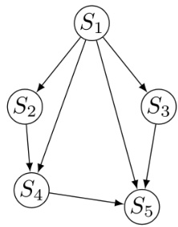

In a computer system where the ‘best-fit’ algorithm is used for allocating ‘jobs’ to ‘memory partitions’, the following situation was encountered:

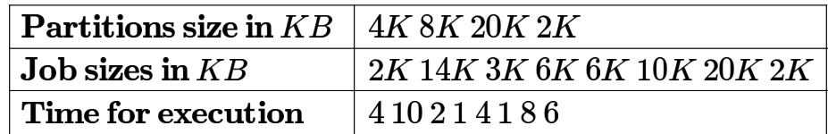

When will the $2 0 K$ job complete?

gate1998 operating-system process-scheduling normal

A. Round Robin B. First-In First-Out C. Multilevel Queue Scheduling D. Multilevel Queue Scheduling with Feedback

A uni-processor computer system only has two processes, both of which alternate $1 0 \mathrm { m s }$ CPU bursts with I/O bursts. Both the processes were created at nearly the same time. The $1 / \mathsf { O }$ of both processes can proceed in parallel. Which of the following scheduling strategies will result in the least CPU utilization (over a long period of time) for this system?

A. First come first served scheduling   
B. Shortest remaining time first scheduling   
C. Static priority scheduling with different priorities for the two processes   
D. Round robin scheduling with a time quantum of

Consider the following set of processes, with the arrival times and the CPU-burst times gives in milliseconds.

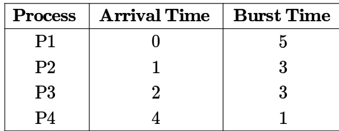

What is the average turnaround time for these processes with the preemptive shortest remaining processing time first (SRPT) algorithm?

A. 5.50 B. 5.75 C. 6.00 D. 6.25

gatecse-2004 operating-system process-scheduling normal

Consider three CPU-intensive processes, which require , 20 and time units and arrive at times , 2 and , respectively. How many context switches are needed if the operating system implements a shortest remaining time first scheduling algorithm? Do not count the context switches at time zero and at the end.

A. B. 2 C. 3 D. 4   
gatecse-2006 operating-system process-scheduling normal isro2009

Consider three processes, all arriving at time zero, with total execution time of , and respectively. Each process spends the first $2 0 \%$ of execution time doing $1 / \mathsf { O }$ , the next $7 0 \%$ of time doing computation, and the last $1 0 \%$ of time doing $1 / \mathsf { O }$ again. The operating system uses a shortest remaining compute time first scheduling algorithm and schedules a new process either when the running process gets blocked on I/O or when the running process finishes its compute burst. Assume that all $1 / \mathsf { O }$ operations can be overlapped as much as possible. For what percentage of time does the CPU remain idle?

A. $0 \%$ B. $1 0 . 6 \%$ C. $3 0 . 0 \%$ D. 89.4%

gatecse-2006 operating-system process-scheduling normal

# Answer key☟

Group contains some CPU scheduling algorithms and Group 2 contains some applications. Match entries in Group to entries in Group 2.

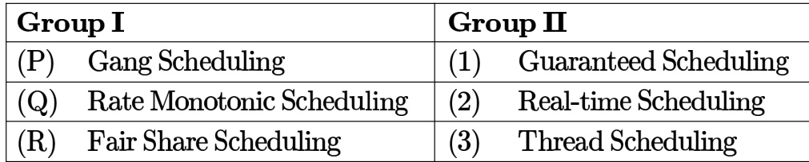

A. $P - 3 ; Q - 2 ; R - 1$ B. $P - 1 ; Q - 2 ; R - 3$ C. P-2;Q-3;R-1 D. P-1;Q-3;R-2

gatecse-2007 operating-system process-scheduling normal

# Answer key☟

An operating system used Shortest Remaining System Time first (SRT) process scheduling algorithm. Consider the arrival times and execution times for the following processes:

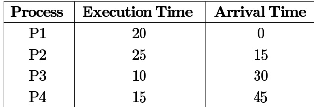

What is the total waiting time for process ?

A. B. C. 40 D.

gatecse-2007 operating-system process-scheduling normal

# Answer key☟

Now consider the following statements:

I. If a process makes a transition $D$ , it would result in another process making transition $A$ immediately.   
II. A process $P _ { 2 }$ in blocked state can make transition E while another process $P _ { 1 }$ is in running state.   
III. The OS uses preemptive scheduling.   
IV. The OS uses non-preemptive scheduling.

Which of the above statements are TRUE?

A. I and II B. I and III C. II and III D. II and IV

gatecse-2009 operating-system process-scheduling normal

# Answer key☟

Which of the following statements are true?

I. Shortest remaining time first scheduling may cause starvation II. Preemptive scheduling may cause starvation III. Round robin is better than FCFS in terms of response time

A. only B. I and III only C. II and III only D. I, II and III

gatecse-2010 operating-system process-scheduling easy

Consider the following table of arrival time and burst time for three processes $P 0$ ， $P 1$ and $P 2$ ·

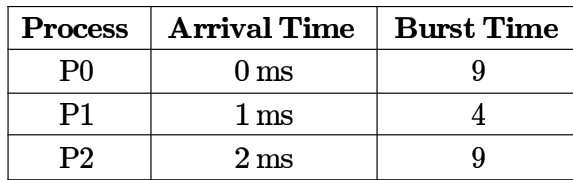

The pre-emptive shortest job first scheduling algorithm is used. Scheduling is carried out only at arrival or completion of processes. What is the average waiting time for the three processes?

A. ms B. 4.33 ms C. ms D. 7.33 ms

gatecse-2011 operating-system process-scheduling normal

# Answer key☟

Consider the processes, $P 1 , P 2$ and $P 3$ shown in the table.

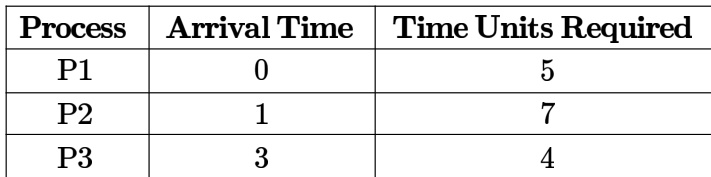

The completion order of the processes under the policies FCFS and RR (round robin scheduling with CPU quantum of  time units) are

A. FCFS: $P 1 , P 2 , P 3$ RR2: $P 1$ ,P2,P3B. FCFS: $P 1$ ， $P 3$ ， $P 2$ RR2: $P 1$ ， $P 3$ ， $P 2$ C. FCFS: $P 1$ ， $P 2$ ， $P 3$ RR2: $P 1$ ， $P 3$ ， $P 2$ D. FCFS: $P 1 , P 3 , P 2$ RR2: $P 1 , P 2 , P 3$

A scheduling algorithm assigns priority proportional to the waiting time of a process. Every process starts with zero (the lowest priority). The scheduler re-evaluates the process priorities every $T$ time units and decides the next process to schedule. Which one of the following is TRUE if the processes have no $1 / \mathsf { O }$ operations and all arrive at time zero?

A. This algorithm is equivalent to the first-come-first-serve algorithm.   
B. This algorithm is equivalent to the round-robin algorithm.   
C. This algorithm is equivalent to the shortest-job-first algorithm.   
D. This algorithm is equivalent to the shortest-remaining-time-first algorithm.

Consider the following set of processes that need to be scheduled on a single CPU. All the times are given in milliseconds.

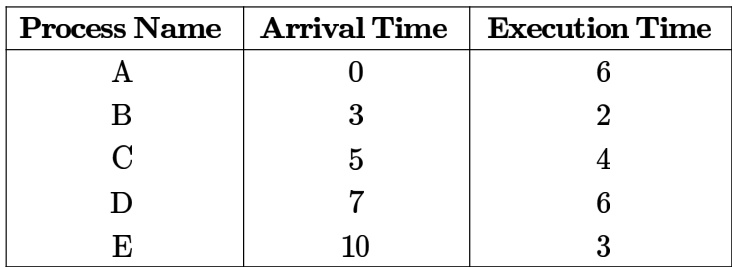

Using the shortest remaining time first scheduling algorithm, the average process turnaround time (in msec) is

Three processes $A$ , $B$ and $c$ each execute a loop of iterations. In each iteration of the loop, a process performs a single computation that requires $t _ { c }$ CPU milliseconds and then initiates a single I/O operation that lasts for $t _ { i o }$ milliseconds. It is assumed that the computer where the processes execute has sufficient number of $1 / \mathsf { O }$ devices and the OS of the computer assigns different $1 / \mathsf { O }$ devices to each process. Also, the scheduling overhead of the OS is negligible. The processes have the following characteristics:

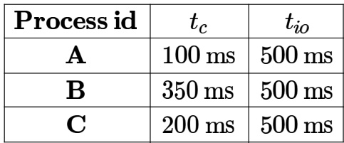

The processes $A , B$ , and $c$ are started at times , and milliseconds respectively, in a pure time sharing system (round robin scheduling) that uses a time slice of milliseconds. The time in milliseconds at which process C would complete its first $1 / \mathsf { O }$ operation is

milliseconds):

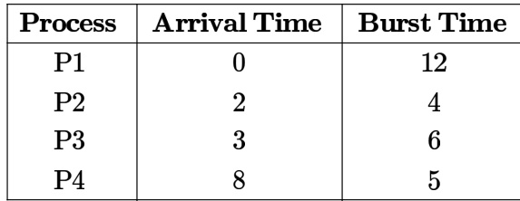

The average waiting time (in milliseconds) of the processes is gatecse-2014-set3 operating-system process-scheduling numerical-answers normal

Consider a uniprocessor system executing three tasks $T _ { 1 } , T _ { 2 }$ and $T _ { 3 }$ each of which is composed infinite sequence of jobs (or instances) which arrive periodically at intervals of and milliseconds, respectively. The priority of each task is the inverse of its period, and the available tasks are scheduled in order of priority, which is the highest priority task scheduled first. Each instance of $T _ { 1 } , T _ { 2 }$ and $T _ { 3 }$ requires an execution time of  and  milliseconds, respectively. Given that all tasks initially arrive at the beginning of the $1 ^ { \mathrm { s t } }$ millisecond and task preemptions are allowed, the first instance of $T _ { 3 }$ completes its execution at the end of _milliseconds.

gatecse-2015-set1 operating-system process-scheduling normal numerical-answers

The maximum number of processes that can be in Ready state for a computer system with $\scriptstyle n$ CPUs is :

A. n B. $n ^ { 2 }$ C. 2n D. Independent of $n$

gatecse-2015-set3 operating-system process-scheduling easy

For the processes listed in the following table, which of the following scheduling schemes will give the lowest average turnaround time?

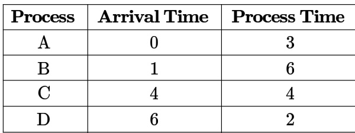

A. First Come First Serve B. Non-preemptive Shortest job first C. Shortest Remaining Time D. Round Robin with Quantum value two

gatecse-2015-set3 operating-system process-scheduling normal

Consider the following processes, with the arrival time and the length of the CPU burst given in milliseconds.   
The scheduling algorithm used is preemptive shortest remaining-time first.

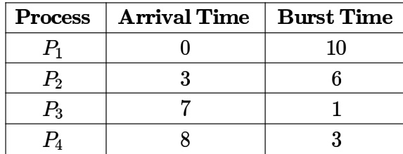

The average turn around time of these processes is milliseconds.

gatecse-2016-set2 operating-system process-scheduling normal numerical-answers

Consider the following CPU processes with arrival times (in milliseconds) and length of CPU bursts (in milliseconds) as given below:

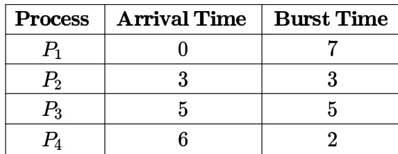

If the pre-emptive shortest remaining time first scheduling algorithm is used to schedule the processes, then the average waiting time across all processes is milliseconds.

gatecse-2017-set1 operating-system process-scheduling numerical-answers

Consider the set of process with arrival time (in milliseonds), CPU burst time (in millisecods) and priority (  is the highest priority) shown below. None of the process have $1 / \mathsf { O }$ burst time

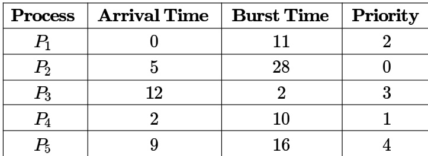

The average waiting time (in milli seconds) of all the process using premtive priority scheduling algorithm is

gatecse-2017-set2 operating-system process-scheduling numerical-answers

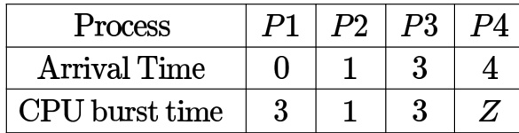

These processes are run on a single processor using preemptive Shortest Remaining Time First scheduling algorithm. If the average waiting time of the processes is 1 millisecond, then the value of $Z$ is

gatecse-2019 numerical-answers operating-system process-scheduling two-marks

Consider the following statements about process state transitions for a system using preemptive scheduling.

I. A running process can move to ready state.   
II. A ready process can move to running state.   
III. A blocked process can move to running state.   
IV. A blocked process can move to ready state.

Which of the above statements are TRUE?

A. I, II, and III only B. II and III only C. I, II, and IV only D. I, II, III and IV only gatecse-2020 operating-system process-scheduling one-mark easy

Consider the following set of processes, assumed to have arrived at time . Consider the CPU scheduling algorithms Shortest Job First (SJF) and Round Robin (RR). For RR, assume that the processes are scheduled in the order $P _ { 1 } , P _ { 2 } , P _ { 3 } , P _ { 4 }$ .

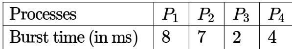

If the time quantum for RR is  ms, then the absolute value of the difference between the average turnaround times (in ms) of SJF and RR (round off to decimal places is

gatecse-2020 numerical-answers operating-system process-scheduling two-marks

Three processes arrive at time zero with bursts of 20 and milliseconds. If the scheduler has prior knowledge about the length of the bursts, the minimum achievable average waiting time for these three processes in a non-preemptive scheduler (rounded to nearest integer) is milliseconds.

gatecse-2021-set1 operating-system process-scheduling numerical-answers one-mark

Which one or more of the following  scheduling algorithms can potentially cause starvation?

A. First-in First-Out B. Round Robin C. Priority Scheduling D. Shortest Job First gatecse-2023 operating-system process-scheduling multiple-selects one-mark

# 5.23.40 Process Scheduling: GATE CSE 2024 Set 1 Question: 15

Which of the following process state transitions is/are NOT possible?

A. Running to Ready B. Waiting to Running C. Ready to Waiting D. Running to Terminated gatecse-2024-set1 operating-system process-scheduling multiple-selects one-mark

Consider a single processor system with four processes C, and , represented as given below where for each process the first value is its arrival time, and the second value is its burst time.

Which one of the following options gives the average waiting times when preemptive Shortest Remaining Time First (SRTF) and Non-Preemptive Shortest Job First scheduling algorithms are applied to the processes?

A. $\mathrm { S R T F } = 6 , \mathrm { N P } - \mathrm { S J F } = 7$   
B. $\mathrm { S R T F } = 6 , \mathrm { N P } - \mathrm { S J F } = 7 . 5$   
C. $\mathrm { S R T F { = } 7 , N P - S J F = 7 . 5 }$   
D. $\mathrm { S R T F } = 7 , \mathrm { N P } - \mathrm { S J F } = 8 . 5$

A computer has two processors, $M _ { 1 }$ and $M _ { 2 }$ . Four processes $P _ { 1 } , P _ { 2 } , P _ { 3 } , P _ { 4 }$ with CPU bursts of 20,16,25, and  milliseconds, respectively, arrive at the same time and these are the only processes in the system. The scheduler uses non-preemptive priority scheduling, with priorities decided as follows:

$M _ { 1 }$ uses priority of execution for the processes as, $P _ { 1 } > P _ { 3 } > P _ { 2 } > P _ { 4 }$ , i.e., $P _ { 1 }$ and $P _ { 4 }$ have highest and lowest priorities, respectively.   
$M _ { 2 }$ uses priority of execution for the processes as, $P _ { 2 } > P _ { 3 } > P _ { 4 } > P _ { 1 }$ , i.e., $P _ { 2 }$ and $P _ { 1 }$ have highest and lowest priorities, respectively.

A process $P _ { i }$ is scheduled to a processor $M _ { k }$ , if the processor is free and no other process $P _ { j }$ is waiting with higher priority. At any given point of time, a process can be allocated to any one of the free processors without violating the execution priority rules. Ignore the context switch time. What will be the average waiting time of the processes in milliseconds?

A. 9.00 B. 8.75 C. 6.50 D. 7.50

Consider a CPU that has to execute two types of processes. The first type, Actuators (A), requires a burst of  seconds. The second type, Controllers (C), requires a CPU burst of  seconds. A new process of type A arrives at time $t = 1 0$ , , and  (in seconds). Similarly, a new process of type C arrives at time $t = 1 1$ ,22,33, $^ { 4 4 , }$ and (in seconds). The CPU scheduling policy is First Come First Serve (FCFS). The first process of type A starts running at $t = 1 0$ seconds. The average waiting time (in seconds) for the  processes is (rounded off to one decimal place)

gatecse-2026-set1 numerical-answers operating-system process-scheduling two-marks

Which one of the following CPU scheduling algorithms cannot be preemptive?

A. Shortest Remaining Time First B. First Come First Serve (FCFS) (SRTF) Scheduling Scheduling C. Round Robin Scheduling D. Priority Scheduling

gatecse-2026-set2 operating-system process-scheduling one-mark

We wish to schedule three processes $P 1$ , $P 2$ and $P 3$ on a uniprocessor system. The priorities, CPU time requirements and arrival times of the processes are as shown below.

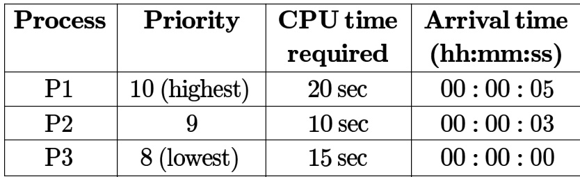

We have a choice of preemptive or non-preemptive scheduling. In preemptive scheduling, a late-arriving higher priority process can preempt a currently running process with lower priority. In non-preemptive scheduling, a latearriving higher priority process must wait for the currently executing process to complete before it can be scheduled on the processor.

What are the turnaround times (time from arrival till completion) of $P 2$ using preemptive and non-preemptive scheduling respectively?

A.  sec, sec B. sec, sec C. sec,  sec D. sec, sec gateit-2005 operating-system process-scheduling normal

# Answer key☟

CPU burst. Assume that each process has its own $1 / \mathsf { O }$ resource.

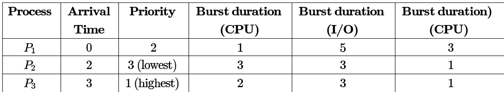

The multi-programmed operating system uses preemptive priority scheduling. What are the finish times of the processes $P _ { 1 } , P _ { 2 }$ and $P _ { 3 }$ ?

A. B. 10, 15, 9 C. 11,16,10 D. 12, 17, 11

gateit-2006 operating-system process-scheduling normal

Consider $n$ jobs $J _ { 1 } , J _ { 2 } \ldots J _ { n }$ such that job $J _ { i }$ has execution time $t _ { i }$ and a non-negative integer weight $w _ { i }$ The weighted mean completion time of the jobs is defined to be $\frac { \sum _ { i = 1 } ^ { n } w _ { i } T _ { i } } { \sum _ { i = 1 } ^ { n } w _ { i } }$ where $\boldsymbol { T _ { i } }$ is the completion time of job $J _ { i }$ . Assuming that there is only one processor available, in what order must the jobs be executed in order to minimize the weighted mean completion time of the jobs?

A. Non-decreasing order of $t _ { i }$ B. Non-increasing order of $w _ { i }$ C. Non-increasing order of $w _ { i } t _ { i }$ D. Non-increasing order of $w _ { i } / t _ { i }$

gateit-2007 operating-system process-scheduling normal

If the time-slice used in the round-robin scheduling policy is more than the maximum time required to execute any process, then the policy will

A. degenerate to shortest job first B. degenerate to priority scheduling C. degenerate to first come first serve D. none of the above

gateit-2008 operating-system process-scheduling easy

# Answer key☟

# 5.24

# Process Synchronization (52)

✍ Practice Tests: Test (15Q) Test 2 (15Q) Test 3 (11Q) Weekly Quiz (16Q)

# 5.24.1 Process Synchronization: GATE CSE 1987 Question: 1-xvi

A critical region is

A. One which is enclosed by a pair of $P$ and $V$ operations on semaphores.   
B. A program segment that has not been proved bug-free.   
C. A program segment that often causes unexpected system crashes.   
D. A program segment where shared resources are accessed.

gate1987 operating-system process-synchronization

# Answer key☟

# 5.24.2 Process Synchronization: GATE CSE 1987 Question: 8a

Consider the following proposal to the "readers and writers problem." Shared variables and semaphores:

aw, ar, rw, rr : interger; mutex, reading, writing: semaphore: initial values of variables and states of semaphores:

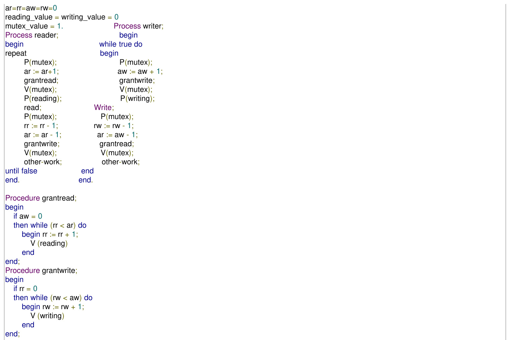

a. Give the value of the shared variables and the states of semaphores when  readers are reading and writers are writing.   
b. Can a group of readers make waiting writers starve? Can writers starve readers?   
c. Explain in two sentences why the solution is incorrect.

Given below is solution for the critical section problem of two processes $P _ { 0 }$ and $P _ { 1 }$ sharing the following variables:

var flag :array [0..1] of boolean; (initially false) turn: 0 .. 1;

The program below is for process $P _ { i } ( i = 0 \mathrm { o r } 1 )$ where process $P _ { j } ( j = 1 \mathrm { o r } 0 )$ being the other one.

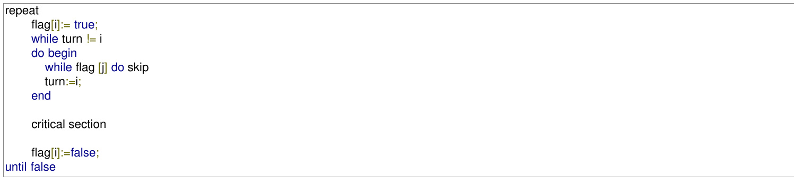

Determine of the above solution is correct. If it is incorrect, demonstrate with an example how it violates the conditions.

Match the pairs:

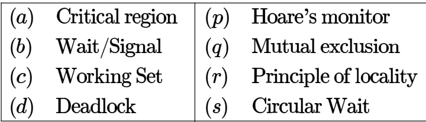

match-the-following gate1990 operating-system process-synchronization

Consider the following scheme for implementing a critical section in a situation with three processes $P _ { i }$ ， $P _ { j }$ and .

Pi;   
repeat flag[i] $: =$ true; while flag $[ \dot { \bf l } ]$ or flag[k] do case turn of j: if flag [j] then begin flag $[ \dot { \bf l } ] : =$ false; while turn $\mathsf { l } = \mathsf { i }$ do skip; flag [i] $: =$ true; end; k: if flag [k] then begin flag [i] $: =$ false, while turn $\mathbf { \eta } _ { ! = } \mathbf { \dot { I } }$ do skip; flag [i] $: =$ true end end critical section if turn ${ \bf \tau } = \dot { \bf l }$ then turn $: =$ j; flag $[ \dot { \bf l } ] : =$ false non-critical section   
until false;

a. Does the scheme ensure mutual exclusion in the critical section? Briefly explain.

Consider the following scheme for implementing a critical section in a situation with three processes and $P _ { k }$ .

Pi;

repeat flag[i] $: =$ true; while flag $[ \dot { \bf l } ]$ or flag[k] do case turn of j: if flag [j] then begin flag [i] $: =$ false; while turn $\mathsf { l } = \mathsf { i }$ do skip; flag [i] $: =$ true; end; k: if flag [k] then begin flag $[ \mathfrak { i } ] : =$ false, while turn $\mathsf { l } = \mathsf { i }$ do skip; flag [i] $: =$ true end end

critical section if turn ${ \bf \tau } = \dot { \bf l }$ then turn $: =$ j; flag [i] $: =$ false non-critical section until false;

Is there a situation in which a waiting process can never enter the critical section? If so, explain and suggest modifications to the code to solve this problem

gate1991 process-synchronization normal operating-system descriptive

Write a concurrent program using and semaphores to represent the precedence constraints of the statements $S _ { 1 }$ to $S _ { 6 }$ , as shown in figure below.

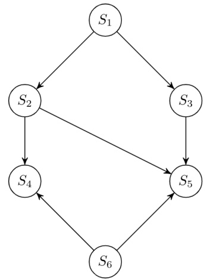

A. a precedence graph for the following sequential code. The statements are numbered from $S _ { 1 }$ to $S _ { 6 }$

$S _ { 1 }$ read n $S _ { 2 }$ $\dot { \mathsf { I } } : = 1$ $S _ { 3 }$ if $\mathsf { i } > \mathsf { n }$ next $S _ { 4 }$ $a ( i ) : = \dot { 1 } + 1$ $S _ { 5 }$ i := i+1 $S _ { 6 }$ next write a(i) B. Can this graph be converted to a concurrent program using parbegin-parend construct only?

begin P(b); S3; $\mathsf { V } ( \mathsf { g } )$ ; V(h) end; begin ${ \sf P } ( { \sf g } )$ ; S6; $\mathsf { V } ( \mathsf { i } )$ end; begin P(h); P(i); S8; V(j) end; begin ${ \mathsf { P } } ( { \mathsf { j } } )$ ; $\mathsf { P } ( \mathsf { k } )$ ; S9 end; coend end;

gate1995 operating-system process-synchronization normal descriptive

# 5.24.10 Process Synchronization: GATE CSE 1996 Question: 1.19, ISRO2008-61

A critical section is a program segment

A. which should run in a certain amount of time   
B. which avoids deadlocks   
C. where shared resources are accessed   
D. which must be enclosed by a pair of semaphore operations, $P$ and $V$

gate1996 operating-system process-synchronization easy isro2008

# Answer key☟

# 5.24.11 Process Synchronization: GATE CSE 1996 Question: 2.19

A solution to the Dining Philosophers Problem which avoids deadlock is to

A. ensure that all philosophers pick up the left fork before the right fork   
B. ensure that all philosophers pick up the right fork before the left fork   
C. ensure that one particular philosopher picks up the left fork before the right fork, and that all other philosophers pick up the right fork before the left fork   
D. None of the above

The concurrent programming constructs fork and join are as below:

Fork <label> which creates a new process executing from the specified label

Join <variable> which decrements the specified synchronization variable (by ) and terminates the process if the new value is not .

Show the precedence graph for $S 1 , S 2 , S 3 , S 4$ , and $S 5$ of the concurrent program below.

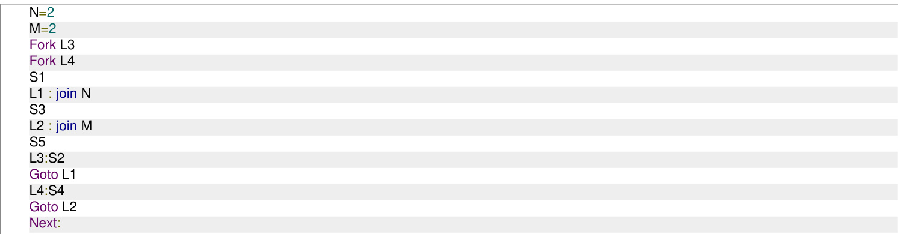

Each Process $P _ { i } , i = 1 \ldots 9$ is coded as follows

repeat P(mutex) {Critical section} V(mutex)   
forever

The code for $P _ { 1 0 }$ is identical except it uses V(mutex) in place of P(mutex). What is the largest number of processes that can be inside the critical section at any moment?

A. B. 2 C. 3 D. None

gate1997 operating-system process-synchronization normal

A concurrent system consists of  processes using a shared resource $R$ in a non-preemptible and mutually exclusive manner. The processes have unique priorities in the range 1...3, being the highest priority. It is required to synchronize the processes such that the resource is always allocated to the highest priority requester. The pseudo code for the system is as follows.

# Shared data

mutex:semaphore $\overline { { = 1 : / ^ { \star } } }$ initialized to $\overline { { 1 ^ { \star } / } }$ process[3]:semaphore $= 0$ ; /\*all initialized to $0 ^ { \star } /$ R_requested [3]:boolean $\mathbf { \Sigma } = \mathbf { \Sigma }$ false; $/ ^ { \star }$ all initialized to flase $^ { \star } /$ busy: boolean $\mathbf { \Sigma } = \mathbf { \Sigma }$ false; /\*initialized to false $^ { \star } /$

# Code for processes

begin process   
my-priority:integer;   
my-priority $: =$ /\*in the range $1 . . 3 ^ { \star } /$   
repeat request _R(my- priority); P (proceed [my-priority]); {use shared resource R} release_R (my- priority);   
forever   
end process;

# Procedures

procedure request _R(priority);   
P(mutex);   
if busy $\mathbf { \Sigma } = \mathbf { \Sigma }$ true then R_requested [priority] $: =$ true;   
else   
begin V(proceed [priority]); busy: =true;   
end   
V(mutex)

Give the pseudo code for the procedure release_R.

gate1997 operating-system process-synchronization descriptive

A certain processor provides a 'test and set' instruction that is used as follows:

TSET register, flag

This instruction atomically copies flag to register and sets flag to . Give pseudo-code for implementing the entry and exit code to a critical region using this instruction.

gate1999 operating-system process-synchronization normal descriptive

Consider the following solution to the producer-consumer problem using a buffer of size 1. Assume that the initial value of count is 0. Also assume that the testing of count and assignment to count are atomic operations.

Producer:   
Repeat Produce an item; if count $= 1$ then sleep; place item in buffer. count $= 1$ ; Wakeup(Consumer);   
Forever   
Consumer:   
Repeat if count $= 0$ then sleep; Remove item from buffer; count $= 0$ ; Wakeup(Producer); Consume item;   
Forever;

Show that in this solution it is possible that both the processes are sleeping at the same time.

Let $m [ 0 ] \ldots m [ 4 ]$ be mutexes (binary semaphores) and $P [ 0 ] \ldots P [ 4 ]$ be processes. Suppose each process $P [ i ]$ executes the following:

wait (m[i]); wait $( \mathsf { m } ( \mathsf { i } + 1 )$ mod 4]);   
...........   
release $( \mathsf { m } [ \mathsf { i } ] )$ ; release $( \mathsf { m } ( \mathsf { i } + 1 )$ mod 4]);

This could cause

A. Thrashing B. Deadlock C. Starvation, but not deadlock D. None of the above gatecse-2000 operating-system process-synchronization normal

int $\overline { { \mathsf { R } = 0 } }$ , $\overline { { \boldsymbol { \mathsf { W } } = \boldsymbol { 0 } } }$ ;   
Reader () {   
L1: wait (mutex); if $( \mathsf { W } = = 0 )$ ) { $\mathsf { R } = \mathsf { R } + 1$ ; ▭ (1) else ▭ (2) goto L1; } ..../\* do the read\*/ wait (mutex); $\mathsf { R } = \mathsf { R } - \mathsf { 1 }$ ; signal (mutex);

# Writer () {

L2: wait (mutex); if (▭) { (3) signal (mutex); goto L2; } $W = 1$ ; signal (mutex); ...../\*do the write\*/ wait( mutex); $\scriptstyle { \mathsf { W } } = 0$ ; signal (mutex);

b. Can the above solution lead to starvation of writers?

Consider Peterson's algorithm for mutual exclusion between two concurrent processes and j. The program executed by process is shown below.

repeat flag[i] $\mathbf { \Sigma } = \mathbf { \Sigma }$ true; turn $= \mathbf { j }$ ; while (P) do no-op; Enter critical section, perform actions, then exit critical section Flag[i] $\mathbf { \Sigma } = \mathbf { \Sigma }$ false; Perform other non-critical section actions.   
Until false;

For the program to guarantee mutual exclusion, the predicate P in the while loop should be

A. flag[j] $\mathbf { \sigma } = \mathbf { \sigma }$ true and turn $\mathbf { \tau } = \dot { \mathbf { l } }$ B. flag[j] $\mathbf { \tau } = \mathbf { \tau }$ true and turn $\mathbf { \sigma } = \mathbf { \sigma }$ j C. flag[i] $\mathbf { \sigma } = \mathbf { \sigma }$ true and turn $\mathbf { \sigma } = \mathbf { \sigma }$ j D. flag[i] $\mathbf { \sigma } = \mathbf { \sigma }$ true and turn $\mathbf { \tau } = \dot { \mathbf { l } }$ gatecse-2001 operating-system process-synchronization normal

The functionality of atomic TEST-AND-SET assembly language instruction is given by the following function

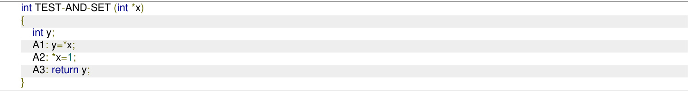

i. Complete the following C functions for implementing code for entering and leaving critical sections on the above TEST-AND-SET instruction.

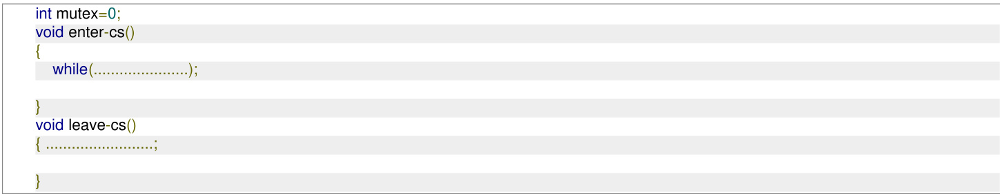

ii. Is the above solution to the critical section problem deadlock free and starvation-free?

iii. For the above solution, show by an example that mutual exclusion is not ensured if TEST-AND-SET instruction is not atomic?

The following solution to the single producer single consumer problem uses semaphores fo synchronization.

#define BUFFSIZE 100   
buffer buf[BUFFSIZE];   
int first $= { \mathsf { l a s t } } = 0$ ;   
semaphore b_full $= 0$ ;   
semaphore b_empty $\mathbf { \Sigma } = \mathbf { \Sigma }$ BUFFSIZE   
void producer()   
while(1) { produce an item; p1: .................; put the item into buff (first); first $\mathbf { \Sigma } = \mathbf { \Sigma }$ (first+1)%BUFFSIZE; p2: ...............;   
void consumer()   
while(1) { c1: take the item from buf[last]; $1 2 \mathsf { s t } = ( 1 \mathsf { a s t } + 1 ) \%$ BUFFSIZE; c2:............; consume the item;   
A. Complete the dotted part of the above solution.   
B. Using another semaphore variable, insert one line statement each immediately after $p \mathbf { 1 }$ , immediately before $p 2$ , immediately after and immediately before $c 2$ so that the program works correctly for multiple producers and consumers. Suppose we want to synchronize two concurrent processes $P$ and $Q$ using binary semaphores $\boldsymbol { s }$ and $T$ .   
The code for the processes $P$ and $Q$ is shown below.

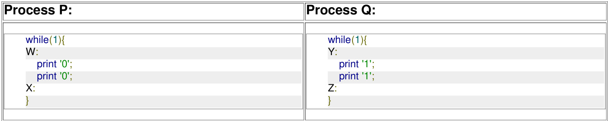

Synchronization statements can be inserted only at points $W , X , Y$ ， and $Z$ Which of the following will always lead to an output staring with '001100110011'?

A. $P ( S )$ at $W , V ( S )$ at $X , P ( { \boldsymbol { T } } )$ at $Y , V ( T )$ at $z , s$ and $T$ initially B. $P ( S )$ at $W , V ( T )$ at $X , P ( { \cal T } )$ at $Y , V ( S )$ at $z , s$ initially  and $T$ initially C. $P ( S )$ at $W$ ， $V ( T )$ at $X , P ( { \cal T } )$ at $Y , V ( S )$ at $z , s$ and $T$ initially D. $P ( S )$ at $W , V ( S )$ at $X , P ( { \cal T } )$ at $Y , V ( T )$ at $z , s$ initially and $T$ initially

Suppose we want to synchronize two concurrent processes $P$ and $Q$ using binary semaphores $\boldsymbol { s }$ and $T$ The code for the processes $P$ and $Q$ is shown below.

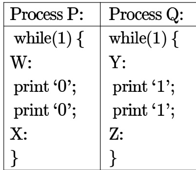

Synchronization statements can be inserted only at points $W , X , Y$ and $Z$   
Which of the following will ensure that the output string never contains a substring of the form $0 1 ^ { n } 0$ and $1 0 ^ { n } 1$   
where $n$ is odd?

A. $P ( S )$ at $W , V ( S )$ at $X , P ( { \boldsymbol { T } } )$ at $Y$ ， $V ( T )$ at $z , s$ and $T$ initially B. $P ( S )$ at $W$ ， $V ( T )$ at $X , P ( { \boldsymbol { T } } )$ at $Y$ ， $V ( S )$ at $z , s$ and $T$ initially C. $P ( S )$ at $W$ ， $V ( S )$ at $X , P ( S )$ at $Y$ ， $V ( \bar { S } )$ at $Z$ ， $\boldsymbol { S }$ initially D. $V ( S )$ at $W$ ， $V ( T )$ at $X , P ( { \vec { S } } )$ at $Y , P ( { \vec { T } } )$ at $z , s$ and $T$ initially semaphores $S _ { X }$ and $S _ { Y }$ respectively, both initialized to 1. $P$ and $V$ denote the usual semaphore operators, where $P$ decrements the semaphore value, and $V$ increments the semaphore value. The pseudo-code of $P _ { 1 }$ and $P _ { 2 }$ is as follows:

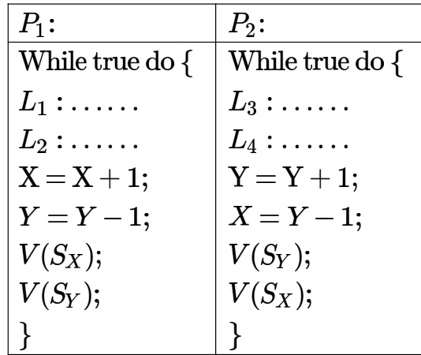

In order to avoid deadlock, the correct operators at $L _ { 1 } , L _ { 2 } , L _ { 3 }$ and $L _ { 4 }$ are respectively.

A. $P ( S _ { Y } ) , P ( S _ { X } ) ; P ( S _ { X } ) , P ( S _ { Y } )$ B. $P ( S _ { X } ) , P ( S _ { Y } ) ; P ( S _ { Y } ) , P ( S _ { X } )$   
C. $P ( S _ { X } ) , P ( S _ { X } ) ; P ( S _ { Y } ) , P ( S _ { Y } )$ D. $P ( S _ { X } ) , P ( S _ { Y } ) ; P ( S _ { X } ) , P ( S _ { Y } )$

gatecse-2004 operating-system process-synchronization normal

The atomic fetch-and-set $x , y$ instruction unconditionally sets the memory location $x$ to and fetches the old value of $x$ in $y$ without allowing any intervening access to the memory location $x$ . Consider the following implementation of $P$ and $V$ functions on a binary semaphore $\boldsymbol { S }$ .

void P (binary semaphore $^ { \ast } { \mathsf { s } }$ ) { unsigned y; unsigned $^ { \star } \mathsf { X } = \mathsf { \& } ( \mathsf { s } \mathsf { \mathrm { - } } \mathsf { > } \mathsf { v a l u e } )$ ; do $\{$ fetch-and-set x, y; while (y);   
void V (binary_semaphore $^ { \star } \mathsf { s }$ ) { S->value $= 0$ ;

Which one of the following is true?

A. The implementation may not work if context switching is disabled in $P$ B. Instead of using fetch-and –set, a pair of normal load/store can be used C. The implementation of $V$ is wrong   
D. The code does not implement a binary semaphore

4: while (process_arrived $\scriptstyle ! = 3$ );   
5: P(S);   
6: process_left $^ { + + }$ ;   
7: if (process lef $\scriptstyle = = 3$ )   
8: process_arrived $= 0$ ;   
9: process_left $= 0$ ;   
10: }   
11: V(S);

The variables process arrived and process left are shared among all processes and are initialized to zero. In a concurrent program all the three processes call the barrier function when they need to synchronize globally.

The above implementation of barrier is incorrect. Which one of the following is true?

A. The barrier implementation is wrong due to the use of binary semaphore $\boldsymbol { S }$   
B. The barrier implementation may lead to a deadlock if two barrier in invocations are used in immediate succession.   
C. Lines  to  need not be inside a critical section   
D. The barrier implementation is correct if there are only two processes instead of three.

Barrier is a synchronization construct where a set of processes synchronizes globally i.e., each process the set arrives at the barrier and waits for all others to arrive and then all processes leave the barrier. Let the number of processes in the set be three and $\boldsymbol { S }$ be a binary semaphore with the usual $P$ and $V$ functions. Consider the following $C$ implementation of a barrier with line numbers shown on left.

void barrier (void)

1 P(S);   
2 process arrived $^ { + + }$ ;   
3 V(S);   
4 while (process_arrived !=3);   
5 P(S);   
6 process_left $^ { + + }$ ;   
7 if (process_left $\scriptstyle = = 3$ ) {   
8 process_arrived $= 0$ ;   
9 process_left $= 0$ ;   
10 }   
11 V(S);

The variables process _arrived and process left are shared among all processes and are initialized to zero. In a concurrent program all the three processes call the barrier function when they need to synchronize globally.

Which one of the following rectifies the problem in the implementation?

A. Lines  to  are simply replaced by process_arrived--   
B. At the beginning of the barrier the first process to enter the barrier waits until process arrived becomes zero before proceeding to execute $P ( S )$ .   
C. Context switch is disabled at the beginning of the barrier and re-enabled at the end.   
D. The variable process left is made private instead of shared

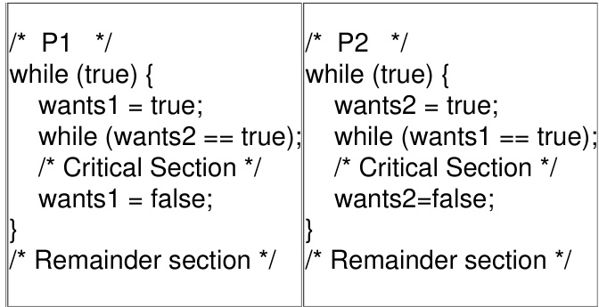

Here, wants and wants are shared variables, which are initialized to false. Which one of the following statements is TRUE about the construct?

A. It does not ensure mutual exclusion.   
B. It does not ensure bounded waiting.   
C. It requires that processes enter the critical section in strict alteration.   
D. It does not prevent deadlocks, but ensures mutual exclusion.

The enter _CS() and leave_CS() functions to implement critical section of a process are realized using testand-set instruction as follows:

void enter CS(X)   
{ while(test-and-set(X));   
}   
void leave CS(X)   
{ $\mathsf { X } = 0$ ;   
}

In the above solution, $X$ is a memory location associated with the $C S$ and is initialized to . Now consider the following statements:

I. The above solution to $\mathit { C S }$ problem is deadlock-free II. The solution is starvation free III. The processes enter $\boldsymbol { C S }$ in FIFO order IV. More than one process can enter $\boldsymbol { C S }$ at the same time

Which of the above statements are TRUE?

A. (I) only B. (I) and (II) C. (II) and (III) D. (IV) only

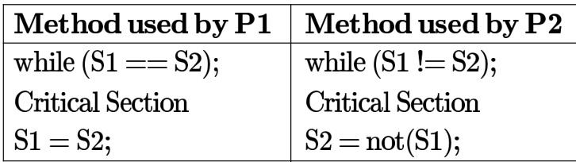

Which one of the following statements describes the properties achieved?

A. Mutual exclusion but not progress B. Progress but not mutual exclusion C. Neither mutual exclusion nor D. Both mutual exclusion and progress progress

gatecse-2010 operating-system process-synchronization normal

# Answer key☟

The following program consists of  concurrent processes and binary semaphores. The semaphores are initialized as $\bar { S } 0 \bar { = } 1 , S 1 = 0$ and $S 2 = 0$ .

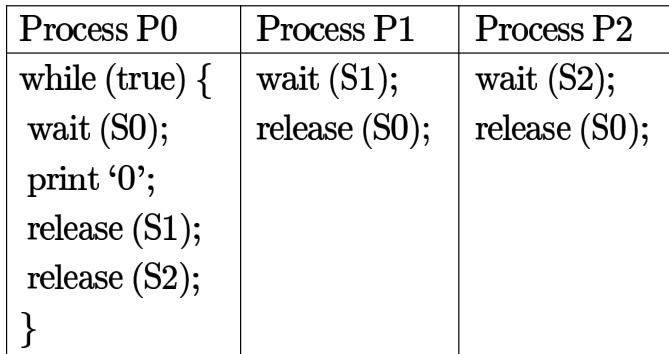

How many times will process $P 0$ print ' '?

A. At least twice B. Exactly twice C. Exactly thrice D. Exactly once gatecse-2010 operating-system process-synchronization normal

# 5.24.34 Process Synchronization: GATE CSE 2012 Question: 32

Fetch_And_ $A d d ( X , I )$ is an atomic Read-Modify-Write instruction that reads the value of memory location $X$ increments it by the value $_ i$ , and returns the old value of $X$ . It is used in the pseudocode shown below to implement a busy-wait lock. $L$ is an unsigned integer shared variable initialized to . The value of  corresponds to lock being available, while any non-zero value corresponds to the lock being not available.

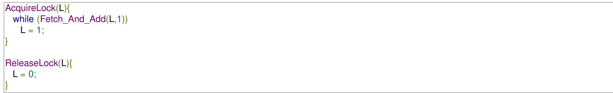

This implementation

A. fails as $L$ can overflow   
B. fails as $L$ can take on a non-zero value when the lock is actually available   
C. works correctly but may starve some processes   
D. works correctly without starvation

A shared variable $x$ , initialized to zero, is operated on by four concurrent processes $W , X , Y , Z$ as follows. Each of the processes $W$ and $X$ reads $x$ from memory, increments by one, stores it to memory, and then terminates. Each of the processes $Y$ and $Z$ reads $x$ from memory, decrements by two, stores it to memory, and then terminates. Each process before reading $x$ invokes the $P$ operation (i.e., wait) on a counting semaphore $\boldsymbol { S }$ and invokes the $V$ operation (i.e., signal) on the semaphore $\boldsymbol { S }$ after storing $x$ to memory. Semaphore $\boldsymbol { S }$ is initialized to two. What is the maximum possible value of $x$ after all processes complete execution?

A. B. C. D.

gatecse-2013 operating-system process-synchronization normal

# 5.24.36 Process Synchronization: GATE CSE 2013 Question: 39

A certain computation generates two arrays a and b such that $\boldsymbol { \mathbf { \mathit { 1 } } } [ i ] = f ( i )$ for $0 \leq i < n$ annd $b [ i ] = g ( a [ i ] )$ for $0 \leq i < n$ . Suppose this computation is decomposed into two concurrent processes $X$ $Y$ such that $X$ computes the array $a$ and $Y$ computes the array $b$ . The processes employ two binary semaphores $R$ and $\boldsymbol { S }$ , both initialized to zero. The array $\textbf { \em a }$ is shared by the two processes. The structures of the processes are shown below.

Process X:

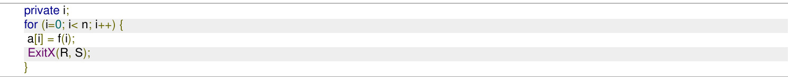

# Process Y:

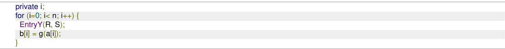

Which one of the following represents the CORRECT implementations of ExitX and EntryY?

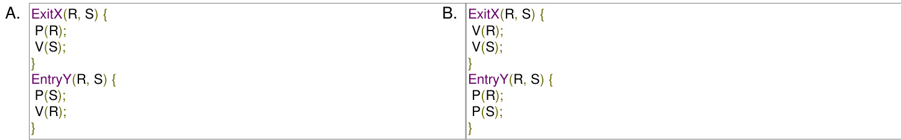

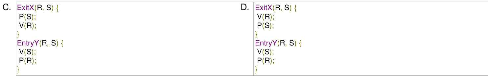

gatecse-2013 operating-system process-synchronization normal

# Answer key☟

# 5.24.37 Process Synchronization: GATE CSE 2014 Set 2 Question: 31

Consider the procedure below for the Producer-Consumer problem which uses semaphores:

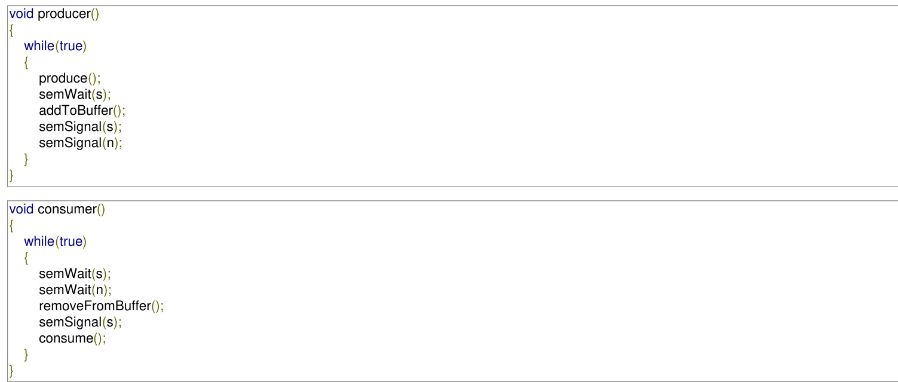

Which one of the following is TRUE?

A. The producer will be able to add an item to the buffer, but the consumer can never consume it.   
B. The consumer will remove no more than one item from the buffer.   
C. Deadlock occurs if the consumer succeeds in acquiring semaphore s when the buffer is empty.   
D. The starting value for the semaphore $\scriptstyle n$ must be 1 and not  for deadlock-free operation.

The following two functions $P 1$ and $P 2$ that share a variable $B$ with an initial value of execute concurrently.

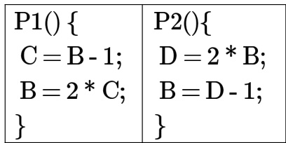

The number of distinct values that $B$ can possibly take after the execution is gatecse-2015-set1 operating-system process-synchronization normal numerical-answers

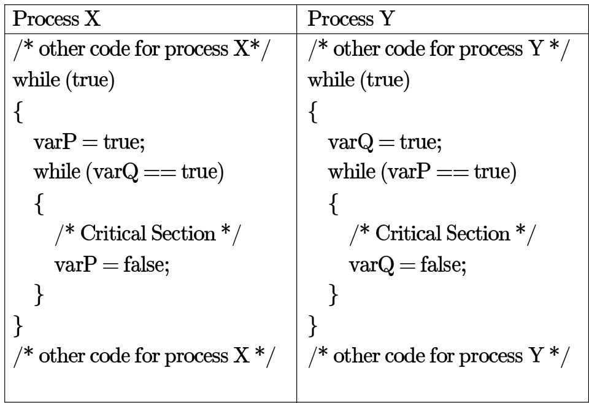

Here varP and varQ are shared variables and both are initialized to false. Which one of the following statements is true?

A. The proposed solution prevents deadlock but fails to guarantee mutual exclusion B. The proposed solution guarantees mutual exclusion but fails to prevent deadlock C. The proposed solution guarantees mutual exclusion and prevents deadlock D. The proposed solution fails to prevent deadlock and fails to guarantee mutual exclusion

Consider the following proposed solution for the critical section problem. There are $n$ processes $P _ { 0 } . . . . P _ { n - 1 }$ . In the code, function returns an integer not smaller than any of its arguments .For all $i , t [ i ]$ is initialized to zero.

Code for $P _ { i }$

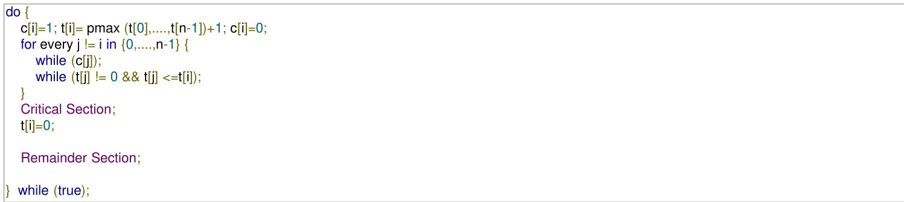

Which of the following is TRUE about the above solution?

A. At most one process can be in the critical section at any time   
B. The bounded wait condition is satisfied   
C. The progress condition is satisfied   
D. It cannot cause a deadlock

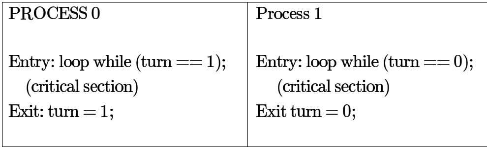

The shared variable turn is initialized to zero. Which one of the following is TRUE?

A. This is a correct two- process synchronization solution.   
B. This solution violates mutual exclusion requirement.   
C. This solution violates progress requirement.   
D. This solution violates bounded wait requirement.

A multithreaded program $P$ executes with $x$ number of threads and uses $y$ number of locks for ensuring mutual exclusion while operating on shared memory locations. All locks in the program are non-reentrant, i.e., if a thread holds a lock $l$ , then it cannot re-acquire lock $\mathbf { \xi } _ { l }$ without releasing it. If a thread is unable to acquire a lock, it blocks until the lock becomes available. The minimum value of $x$ and the minimum value of $y$ together for which execution of $P$ can result in a deadlock are:

A. $\scriptstyle x = 1 , y = 2$ $\begin{array} { c } { { \mathsf { B . ~ } x = 2 , y = 1 } } \\ { { \mathsf { D . ~ } x = 1 , y = 1 } } \end{array}$   
C. $\scriptstyle x = 2 , y = 2$

# 5.24.43 Process Synchronization: GATE CSE 2018 Question: 40

Consider the following solution to the producer-consumer synchronization problem. The shared buffer size is $N$ . Three semaphores , and are defined with respective initial values of $0 , N$ and . Semaphore  denotes the number o available slots in the buffer, for the consumer to read from. Semaphore denotes the number of available slots in the buffer, for the producer to write to. The placeholder variables, denoted by $P$ , $Q$ , $R$ and $\boldsymbol { S }$ , in the code below can be assigned either o r . The valid semaphore operations are:  and .

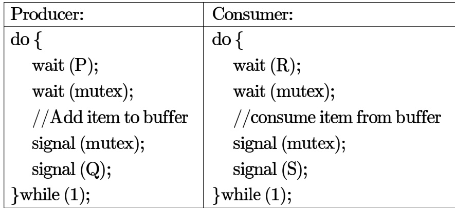

Which one of the following assignments tp $P , Q , R$ and $\boldsymbol { S }$ will yield the correct solution?

A. $P : f u l l$ ， $Q : f u l l$ ， $R$ empty, $\boldsymbol { S }$ empty B. $P$ ： empty, $Q$ : empty, $R : f u l l$ ， $S : f u l l$ C. $P : f u { \bar { l } }$ ， $Q$ empty, $R$ empty, $S : f u l l$ D. $P$ empty, $Q : f u l l$ ， $R : f u l l$ ， $\boldsymbol { S }$ empty

Consider three concurrent processes $P _ { 1 } , P _ { 2 }$ and $P _ { 3 }$ as shown below, which access a shared variable $D$ that has been initialized to

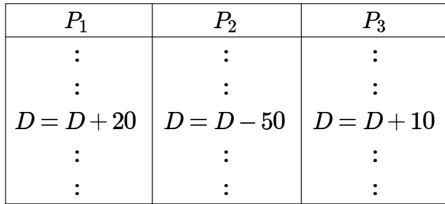

The processes are executed on a uniprocessor system running a time-shared operating system. If the minimum and maximum possible values of $D$ after the three processes have completed execution are $X$ and $Y$ respectively, then the value of $Y - X$ is

gatecse-2019 numerical-answers operating-system process-synchronization one-mark

Consider a multi-threaded program with two threads and . The threads share two semaphores: (initialized to ) and $s 2$ (initialized to ). The threads also share a global variable (initialized to ). The threads execute the code shown below.

Which of the following outcomes is/are possible when threads  and execute concurrently?

A. T1 runs first and prints runs next and prints B. runs first and prints 1, T1 runs next and prints C. T1 runs first and prints T 2 does not print anything (deadlock) D. runs first and prints T1 does not print anything (deadlock)

while (1) { K; P(mutex); P1 Add an item to the buffer; V(mutex);

while (1) { M; P(mutex); P2 Remove an item from the buffer; V(mutex); N;

The statements $K , L , M$ and $N$ are respectively

A. P(full), V(empty), P(full), V(empty) B. P(full), V(empty), P(empty), V(full) C. P(empty), V(full), P(empty), V(full) D. P(empty), V(full), P(full), V(empty)

gateit-2004 operating-system process-synchronization normal

Given below is a program which when executed spawns two concurrent processes semaphore $X { : = } 0$ ；   
$/ ^ { \star }$ Process now forks into concurrent processes & $P 2 ^ { \star } /$

Consider the following statements about processes $P 1$ and $P 2$

I. It is possible for process $P 1$ to starve.   
II. It is possible for process $P 2$ to starve.

Which of the following holds?

A. Both (I) and (II) are true. B. (I) is true but (II) is false. C. (II) is true but (I) is false D. Both (I) and (II) are false

gateit-2005 operating-system process-synchronization normal

Two concurrent processes $P 1$ and $P 2$ use four shared resources $R 1 , R 2 , R 3$ and $R 4$ , as shown below.

Both processes are started at the same time, and each resource can be accessed by only one process at a time The following scheduling constraints exist between the access of resources by the processes:

$P 2$ must complete use of $R 1$ before $P 1$ gets access to $R 1$ . $P 1$ must complete use of $R 2$ before $P 2$ gets access to $R 2$ . $P 2$ must complete use of $R 3$ before $P 1$ gets access to $R 3$ . $P 1$ must complete use of $R 4$ before $P 2$ gets access to $R 4 .$

There are no other scheduling constraints between the processes. If only binary semaphores are used to enforce the above sch eduling constraints, what is the minimum number of binary semaphores needed?

A. B. C. D. 4

gateit-2005 operating-system process-synchronization normal

Consider the solution to the bounded buffer producer/consumer problem by using general semaphores ${ \mathbf { } } S , F { \mathbf { } }$ ， and $E$ . The semaphore $\boldsymbol { S }$ is the mutual exclusion semaphore initialized to . The semaphore $F$ corresponds to the number of free slots in the buffer and is initialized to $N$ . The semaphore $E$ corresponds to the number of elements in the buffer and is initialized to .

Which of the following interchange operations may result in a deadlock?

I. Interchanging Wait $( F )$ and Wait $( S )$ in the Producer process II. Interchanging Signal $( { \bar { S } } )$ and Signal $( F )$ in the Consumer process

A. (I) only B. (II) only C. Neither (I) nor (II) D. Both (I) and (II)

gateit-2006 operating-system process-synchronization normal

Processes $P 1$ and $P 2$ use critical _flag in the following routine to achieve mutual exclusion. Assume that critical _flag is initialized to FALSE in the main program.

get_ exclusive access ( ) if (critical $\underline { { \mathsf { f l a g } } } = = \mathsf { F A L S E } )$ critical _flag $\mathbf { \Sigma } = \mathbf { \Sigma }$ TRUE critical _region () critical_flag $\mathbf { \Sigma } = \mathbf { \Sigma }$ FALSE;

Consider the following statements.

i. It is possible for both $P 1$ and $P 2$ to access critical region concurrently.   
ii. This may lead to a deadlock.

Which of the following holds?

A. (i) is false (ii) is true B. Both (i) and (ii) are false C. (i) is true (ii) is false D. Both (i) and (ii) are true

gateit-2007 operating-system process-synchronization normal

Synchronization in the classical readers and writers problem can be achieved through use of semaphores. In the following incomplete code for readers-writers problem, two binary semaphores mutex and wrt are used to obtain synchronization

wait (wrt)   
writing is performed   
signal (wrt)   
wait (mutex)   
readcount $\mathbf { \Sigma } = \mathbf { \Sigma }$ readcount $^ + 1$   
if readcount $= 1$ then S1   
S2   
reading is performed   
S3   
readcount $\mathbf { \Sigma } = \mathbf { \Sigma }$ readcount 1   
if readcount $= 0$ then S4   
signal (mutex)

The values of $S 1 , S 2 , S 3 , S 4$ (in that order) are

A. signal (mutex), wait (wrt), signal (wrt), wait (mutex) B. signal (wrt), signal (mutex), wait (mutex), wait (wrt) C. wait (wrt), signal (mutex), wait (mutex), signal (wrt) D. signal (mutex), wait (mutex), signal (mutex), wait (mutex)

The following is a code with two threads, producer and consumer, that can run in parallel. Further, $\boldsymbol { s }$ and $Q$ are binary semaphores quipped with the standard $P$ and $V$ operations.

Which of the following is TRUE about the program above?

A. The process can deadlock   
B. One of the threads can starve   
C. Some of the items produced by the producer may be lost   
D. Values generated and stored in $\cdot _ { x ^ { \prime } }$ by the producer will always be consumed before the producer can generate a new value

the system.

Allocation. A $5 \times 4$ matrix defining the number of each type currently allocated to each process. If Allocation $[ i , j ] = k$ then process $p _ { i }$ is currently allocated $k$ instances of resource type .

Max. A $5 \times 4$ matrix indicating the maximum resource need of each process. If $M a x [ i , j ] = k$ then process $p _ { i }$ , may need a maximum of $k$ instances of resource type $r _ { j }$ in order to complete the task.

Assume that system allocated resources only when it does not lead into an unsafe state such that resource requirements in future never cause a deadlock state. Now consider the following snapshot of the system.

Is the system currently in a safe state? If yes, explain why.

i. A system of four concurrent processes, $P , Q , R$ and $\boldsymbol { S }$ , use shared resources $A , B$ and $C$ . The sequences in which processes, $P , Q , R$ and $\boldsymbol { S }$ request and release resources are as follows:

Process P: 1. P requests A 2. P requests B 3. P releases A 4. P releases B   
Process Q: 1. Q requests C 2. Q requests A 3. Q releases C 4. P releases A   
Process R: 1. R requests B 2. R requests C 3. R releases B 4. R releases C   
Process S: 1. S requests A 2. S requests C 3. S releases A 4. S releases C If a resource is free, it is granted to a requesting process immediately. There is no preemption of granted resources.   
A resource is taken back from a process only when the process explicitly releases it.

Can the system of four processes get into a deadlock? If yes, give a sequence (ordering) of operations (for requesting and releasing resources) of these processes which leads to a deadlock.

ii. Will the processes always get into a deadlock? If your answer is no, give a sequence of these operations which leads to completion of all processes. iii. What strategies can be used to prevent deadlocks in a system of concurrent processes using shared resources

if preemption of granted resources is not allowed?

A computer system has tape devices, with n processes competing for them. Each process may need tape drives. The maximum value of n for which the system is guaranteed to be deadlock-free is:

A. B. C. D. gate1992 operating-system resource-allocation normal multiple-selects

# Answer key☟

# 5.25.4 Resource Allocation: GATE CSE 1993 Question: 7.9, UGCNET-Dec2012-III: 41

Consider a system having $m$ resources of the same type. These resources are shared by processes $A , B$ , and $C$ which have peak demands of , and respectively. For what value of m deadlock will not occur?

A. B. C. 10 D.

gate1993 operating-system resource-allocation normal ugcnetcse-dec2012-paper3 multiple-selects

Consider the resource allocation graph in the figure.

A. Find if the system is in a deadlock state B. Otherwise, find a safe sequence

# Answer key☟

An operating system contains user processes each requiring  units of resource $R$ . The minimum number of units of $R$ such that no deadlocks will ever arise is

A. B. C. D. 6

gate1997 operating-system resource-allocation normal

An operating system handles requests to resources as follows.

A process (which asks for some resources, uses them for some time and then exits the system) is assigned a unique timestamp are when it starts. The timestamps are monotonically increasing with time. Let us denote the timestamp of a process $P$ by $T S ( P )$ .

When a process $P$ requests for a resource the $o s$ does the following:

i. If no other process is currently holding the resource, the $O S$ awards the resource to $P$ . ii. If some process $Q$ with $T S ( Q ) < T S ( P )$ is holding the resource, the $o s$ makes $P$ wait for the resources. iii. If some process $Q$ with $T S ( Q ) > T S ( P )$ is holding the resource, the $o s$ restarts $Q$ and awards the resources t o $P$ . (Restarting means taking back the resources held by a process, killing it and starting it again with the same timestamp)

When a process releases a resource, the process with the smallest timestamp (if any) amongst those waiting for the resource is awarded the resource.

A. Can a deadlock over arise? If yes, show how. If not prove it.   
B. Can a process P ever starve? If yes, show how. If not prove it.

gate1997 operating-system resource-allocation normal descriptive

A computer has six tape drives, with $n$ processes competing for them. Each process may need two drives. What is the maximum value of $n$ for the system to be deadlock free?

A. B. C. D.

gate1998 operating-system resource-allocation normal

# Answer key☟

Two concurrent processes $P 1$ and $P 2$ want to use resources $R 1$ and $R 2$ in a mutually exclusive manner.   
Initially, $R 1$ and $\mathbf { \hat { \mathit { R 2 } } }$ are free. The programs executed by the two processes are given below.   
A. Is mutual exclusion guaranteed for $R 1$ and $R 2 ?$ If not show a possible interleaving of the statements of $P 1$ and $P 2$ such mutual exclusion is violated (i.e., both $P 1$ and $P 2$ use $R 1$ and $R 2$ at the same time).   
B. Can deadlock occur in the above program? If yes, show a possible interleaving of the statements of $P 1$ and $P 2$ leading to deadlock.   
C. Exchange the statements $Q 1$ and $Q 3$ and statements $Q 2$ and $Q 4 .$ Is mutual exclusion guaranteed now? Can deadlock occur?

Suppose $n$ processes, $P _ { 1 } , \ldots . P _ { n }$ share $m$ identical resource units, which can be reserved and released one at a time. The maximum resource requirement of process $P _ { i }$ is $s _ { i }$ , where $s _ { i } > 0$ . Which one of the following is a sufficient condition for ensuring that deadlock does not occur?

A. $s _ { i } , < m$   
B. $\forall i$ ， $s _ { i } < n$   
$\begin{array} { l } { { \displaystyle \complement . \sum _ { i = 1 } ^ { n } s _ { i } < ( m + n ) } } \\ { { \displaystyle \sf D . \sum _ { i = 1 } ^ { n } s _ { i } < ( m \times n ) } } \end{array}$

gatecse-2005 operating-system resource-allocation normal

# Answer key☟

A single processor system has three resource types $X , Y$ and $Z$ , which are shared by three processes. There are 5 units of each resource type. Consider the following scenario, where the column alloc denotes the number of units of each resource type allocated to each process, and the column request denotes the number of units of each resource type requested by a process in order to complete execution. Which of these processes will finish LAST?

A. B. C. D. None of the above, since the system is in a deadlock

gatecse-2007 operating-system resource-allocation normal

# Answer key☟

# 5.25.15 Resource Allocation: GATE CSE 2008 Question: 65

Which of the following is NOT true of deadlock prevention and deadlock avoidance schemes?

A. In deadlock prevention, the request for resources is always granted if the resulting state is safe B. In deadlock avoidance, the request for resources is always granted if the resulting state is safe C. Deadlock avoidance is less restrictive than deadlock prevention D. Deadlock avoidance requires knowledge of resource requirements apriori..

Consider a system with  types of resources $R 1$ ( units), $R 2$ ( units), $R 3$ (  units), ( units). A nonpreemptive resource allocation policy is used. At any given instance, a request is not entertained if it cannot be completely satisfied. Three processes $P 1$ , $P 2$ , $P 3$ request the resources as follows if executed independentl

Which one of the following statements is TRUE if all three processes run concurrently starting at time $t = 0 ?$

A. All processes will finish without any deadlock B. Only $P 1$ and $P 2$ will be in deadlock C. Only $P 1$ and $P 3$ will be in deadlock D. All three processes will be in deadlock

A system has $\scriptstyle n$ resources $R _ { 0 } , . . . , R _ { n - 1 }$ and $k$ processes $P _ { 0 } , . . . , P _ { k - 1 }$ . The implementation of the resource request logic of each process $P _ { i }$ is as follows:

$$
\begin{array} { l } { { \mathrm { i f } ( i \% 2 { = } 0 ) \{ } } \\ { { \mathrm { i f } ( i < n ) \mathrm { r e q u e s t } R _ { i } ; } } \\  { \mathrm { i f } ( i + 2 < n ) \mathrm { r e q u e s t } R _ { i + 2 } ; \} } \\ { { \mathrm { e l s e } \{ } } \\ { { \mathrm { i f } ( i < n ) \mathrm { r e q u e s t } R _ { n - i } ; } } \\  { \mathrm { i f } ( i + 2 < n ) \mathrm { r e q u e s t } R _ { n - i - 2 } ; \} } \end{array}
$$

In which of the following situations is a deadlock possible?

A. $n = 4 0$ ， $k = 2 6$ $\mathrm { ~ \mathsf ~ { ~ B ~ } ~ } \ i = 2 1 , k = 1 2 \qquad \mathrm { ~ \mathsf ~ { ~ C ~ } ~ } \ i = 2 0 , k = 1 0 \qquad \mathrm { ~ \mathsf ~ { ~ D ~ } ~ } \ i = 4 1 , k = 1 9$

gatecse-2010 operating-system resource-allocation normal

# 5.25.18 Resource Allocation: GATE CSE 2013 Question: 16

Three concurrent processes $X , Y$ , and $Z$ execute three different code segments that access and update certain shared variables. Process $X$ executes the $P$ operation (i.e., ) on semaphores $a , b$ ， and $c$ ; process $Y$ executes the $P$ operation on semaphores $b$ , $\scriptstyle { c . }$ ， and $d$ ; process $Z$ executes the $P$ operation on semaphores , $d _ { \ i }$ and $a$ before entering the respective code segments. After completing the execution of its code segment, each process invokes the $V$ operation (i.e., ) on its three semaphores. All semaphores are binary semaphores initialized to one. Which one of the following represents a deadlock-free order of invoking the $P$ operations by the processes?

A. $X : P ( a ) P ( b ) P ( c ) Y : P ( b ) P ( c ) P ( d ) Z : P ( c ) P ( d ) P ( a )$   
B. $X : P ( b ) P ( a ) P ( c ) Y : P ( b ) P ( c ) P ( d ) Z : P ( a ) P ( c ) P ( d )$   
C. $X : P ( b ) P ( a ) P ( c ) Y : P ( c ) P ( b ) P ( d ) Z : P ( a ) P ( c ) P ( d )$   
D. $X : P ( a ) P ( b ) P ( c ) Y : P ( c ) P ( b ) P ( d ) Z : P ( c ) P ( d ) P ( a )$

An operating system uses the Banker's algorithm for deadlock avoidance when managing the allocation three resource types $X , Y$ ， and $Z$ to three processes $P 0 , P 1$ and $P 2$ ： The table given below presents the current system state. Here, the Allocation matrix shows the current number of resources of each type allocated to each process and the Max matrix shows the maximum number of resources of each type required by each process during its execution.

There are units of type $X , 2$ units of type $Y$ and units of type $Z$ still available. The system is currently in a safe state. Consider the following independent requests for additional resources in the current state:

REQ1: $P 0$ requests 0 units of $\scriptstyle { X , 0 }$ units of $Y$ and units of $Z$ REQ2: $P 1$ requests units of $X , 0$ units of $Y$ and units of $Z$

Which one of the following is TRUE?

A. Only REQ1 can be permitted. B. Only REQ2 can be permitted. C. Both REQ1 and REQ2 can be D. Neither REQ1 nor REQ2 can be

permitted.

A system contains three programs and each requires three tape units for its operation. The minimum number of tape units which the system must have such that deadlocks never arise is

gatecse-2014-set3 operating-system resource-allocation numerical-answers easy

# 5.25.21 Resource Allocation: GATE CSE 2015 Set 2 Question: 23

A system has identical resources and $N$ processes competing for them. Each process can request at most resources. Which one of the following values of $N$ could lead to a deadlock?

A. B. 2 C. D. 4

gatecse-2015-set2 operating-system resource-allocation easy

# 5.25.22 Resource Allocation: GATE CSE 2015 Set 3 Question: 52

Consider the following policies for preventing deadlock in a system with mutually exclusive resources.

I. Process should acquire all their resources at the beginning of execution. If any resource is not available, all resources acquired so far are released.   
II. The resources are numbered uniquely, and processes are allowed to request for resources only in increasing resource numbers   
III. The resources are numbered uniquely, and processes are allowed to request for resources only in deccreasing resource numbers   
IV. The resources are numbered uniquely. A processes is allowed to request for resources only for a resource with resource number larger than its currently held resources

Which of the above policies can be used for preventing deadlock?

A. Any one of (I) and (III) but not (II) B. Any one of (I), (III) and (IV) but not or (IV) (II)   
C. Any one of (II) and (III) but not (I) D. Any one of (I), (II), (III) and (IV) or (IV)

A system shares  tape drives. The current allocation and maximum requirement of tape drives for that processes are shown below:

Which of the following best describes current state of the system?

A. Safe, Deadlocked B. Safe, Not Deadlocked C. Not Safe, Deadlocked D. Not Safe, Not Deadlocked

Consider the following snapshot of a system running $n$ concurrent processes. Process $i$ is holding $X _ { i }$ instances of a resource $R$ $\dot { 1 } \le \dot { \imath } \le n$ . Assume that all instances of $R$ are currently in use. Further, for all , process $i$ can place a request for at most $Y _ { i }$ additional instances of while holding the $X _ { i }$ instances it already has. Of the $\scriptstyle n$ processes, there are exactly two processes $p$ and $q$ such that $Y _ { p } = Y _ { q } = 0$ Which one of the following conditions guarantees that no other process apart from $p$ and $q$ can complete execution?

A. $X _ { p } + X _ { q } < \operatorname* { M i n } \{ Y _ { k } \mid 1 \leq k \leq n , k \neq p , k \neq q \}$   
B. $\hat { X _ { p } } + \hat { X _ { q } } < \mathrm { M a x } \{ Y _ { k } \mid 1 \leq k \leq n , k \neq p , k \neq q \} \quad$   
C. $\mathrm { { M i n } } ( X _ { o } , X _ { a } ) \geq \mathrm { { M i n } } \{ Y _ { k } \mid 1 \leq k \leq n , k \neq p , k \neq q \} $   
D. $\operatorname { M i n } ( X _ { p } , X _ { q } ) \leq \operatorname { M a x } \{ Y _ { k } \mid 1 \leq k \leq n , k \neq p , k \neq q \}$

gatecse-2019 operating-system two-marks resource-allocation

# Answer key☟

Which of the following statements is/are TRUE with respect to deadlocks?

A. Circular wait is a necessary condition for the formation of deadlock.   
B. In a system where each resource has more than one instance, a cycle in its wait-for graph indicates the presence of a deadlock.   
C. If the current allocation of resources to processes leads the system to unsafe state, then deadlock will necessarily occur.   
D. In the resource-allocation graph of a system, if every edge is an assignment edge, then the system is not in deadlock state.

Two shared resources $R _ { 1 }$ and $R _ { 2 }$ are used by processes $P _ { 1 }$ and $P _ { 2 }$ . Each process has a certain priority for accessing each resource. Let $T _ { i j }$ denote the priority of $P _ { i }$ for accessing . A process $P _ { i }$ can snatch a resource $\scriptstyle { R _ { k } }$ from process $P _ { j }$ if is greater than .

Given the following

I. $T _ { 1 1 } > T _ { 2 1 }$   
II. $T _ { 1 2 } > T _ { 2 2 }$   
III. $T _ { 1 1 } < T _ { 2 1 }$   
IV. $T _ { 1 2 } < T _ { 2 2 }$

Which of the following conditions ensures that $P _ { 1 }$ and $P _ { 2 }$ can never deadlock?

A. (I) and (IV) B. (II) and (III) C. (I) and (II) D. None of the above

gateit-2005 operating-system resource-allocation normal