# 5.26.1 Resource Allocation Graph: GATE CSE 2025 Set 2 Question: 38

$P = \{ P _ { 1 } , P _ { 2 } , P _ { 3 } , P _ { 4 } \}$ consists of all active processes in an operating system.   
$R = \{ R _ { 1 } , R _ { 2 } , R _ { 3 } , R _ { 4 } \}$ consists of single instances of distinct types of resources in the system.   
The resource allocation graph has the following assignment and claim edges.   
Assignment edges: $R _ { 1 }  P _ { 1 } , R _ { 2 }  P _ { 2 } , R _ { 3 }  P _ { 3 } , R _ { 4 }  P _ { 4 }$ (the assignment edge $R _ { 1 }  P _ { 1 }$ means resource $R _ { 1 }$ is assigned to process $P _ { 1 }$ , and so on for others)   
Claim edges: $P _ { 1 }  R _ { 2 } , P _ { 2 }  R _ { 3 } , P _ { 3 }  R _ { 1 } , P _ { 2 }  R _ { 4 } , P _ { 4 }  R _ { 2 }$ (the claim edge $P _ { 1 }  R _ { 2 }$ means process $P _ { 1 }$ is waiting for resource , and so on for others)   
Which of the following statement(s) is/are CORRECT? A. Aborting $P _ { 1 }$ makes the system deadlock free.   
B. Aborting $P _ { 3 }$ makes the system deadlock free.   
C. Aborting $P _ { 2 }$ makes the system deadlock free.   
D. Aborting $P _ { 1 }$ and $P _ { 4 }$ makes the system deadlock free.

Consider four processes and  scheduled on a  as per round robin algorithm with a time quantum of The processes arrive in the order $\mathbf { P }$ ， $\mathrm { Q } , \mathrm { R } , \mathrm { S }$ ， all at time $\mathbf { t } = 0$ . There is exactly one context switch from to $\mathbf { Q }$ ， exactly one context switch from $\mathrm { \bf R }$ to $\mathbf { Q } ,$ and exactly two context switches from $\mathbf { Q }$ to There is no context switch from  to $\mathrm { \bf P }$ · Switching to a ready process after the termination of another process is also considered a context switch. Which one of the following is  possible as  burst time of these processes?

A. $\mathbf { P } = 4$ ， $\mathbf Q = \mathbf 1 0$ $\mathbf { R } = 6 , \mathbf { S } = 2$ ${ \bf 8 . \mathrm { ~ P = 2 , Q = 9 , R = 5 , S = 1 } }$ C. $\mathbf { P } = 4$ ， ${ \bf Q } = { \bf 1 2 }$ ,R=5, $\mathbf { S } = 4$ $\begin{array} { c } { { \vartriangle } { \vartriangle } { \vartriangle } { \models } , \ { \ v F } = { \angle } , \ { \boldsymbol { \mathsf Q } \bumpeq } = { \boldsymbol { \mathsf 5 } } , \ { \boldsymbol { \mathsf n } } = { \boldsymbol { \mathsf 5 } } , \ { \boldsymbol { \mathsf 0 } } = { \boldsymbol { \mathsf 1 } } } \\ { { \boldsymbol { \mathsf D } } . \ { \boldsymbol { \mathsf P } } = { 3 } , { \boldsymbol { \mathsf Q } } = { 7 } , { \boldsymbol { \mathrm R } } = { 7 } , { \boldsymbol { \mathsf S } } = { 3 } } \end{array}$ gatecse-2022 operating-system process-scheduling round-robin-scheduling two-marks

# 5.28 Semaphore (11)

✍ Practice Tests: Test 1 (15Q) Test 2 (3Q)

Semaphore operations are atomic because they are implemented within the OS gate1990 operating-system semaphore process-synchronization fill-in-the-blanks

A counting semaphore was initialized to . Then $6 P$ (wait) operations and (signal) operations were completed on this semaphore. The resulting value of the semaphore is

A. B. C. D. gate1998 operating-system process-synchronization semaphore easy

The $P$ and $V$ operations on counting semaphores, where s is a counting semaphore, are defined as follows:

$\begin{array} { r } { s = s - 1 } \end{array}$ ；  
If then wait;  
$V ( s ) : _ { \nparallel s } ^ { s = s + 1 }$ ：hen wake up process waiting on s;

Assume that $P _ { b }$ and $V _ { b }$ the wait and signal operations on binary semaphores are provided. Two binary semaphores $x _ { b }$ and $y _ { b }$ are used to implement the semaphore operations $P ( s )$ and $V ( s )$ as follows:

$$
\begin{array} { r l r } & { } & { P _ { b } ( \boldsymbol { x } _ { b } ) ; } \\ & { } & { s = s - 1 ; } \\ & { } & { \mathrm { i f ~ } ( s < 0 ) } \\ & { } & { \begin{array} { r l } { V _ { b } ( \boldsymbol { x } _ { b } ) ; } & { } \\ { P _ { b } ( y _ { b } ) ; } & { } \end{array} } \\ & { } & { \begin{array} { r l } { \boldsymbol { \mathrm { e } } } & { } \\ { \mathrm { e l s e ~ } V _ { b } ( \boldsymbol { x } _ { b } ) } & { } \end{array} } \end{array}
$$

$P ( s )$ ：

V(s) :

$$
\begin{array} { r l } & { P _ { b } ( x _ { b } ) ; } \\ & { s = s + 1 ; } \\ & { \operatorname { i f } \big ( s \leq 0 \big ) V _ { b } ( y _ { b } ) ; } \\ & { V _ { b } ( x _ { b } ) ; } \end{array}
$$

The initial values of $x _ { b }$ and $y _ { b }$ are respectively

A. and B. and C. and D. 1 and

Consider a non-negative counting semaphore $\boldsymbol { S }$ . The operation $P ( S )$ decrements $\boldsymbol { S }$ , and $V ( S )$ increments $\boldsymbol { S }$ . During an execution, $2 0 P ( S )$ operations and $V ( S )$ operations are issued in some order. The largest initial value of $\boldsymbol { S }$ for which at least one $P ( S )$ operation will remain blocked is

gatecse-2016-set2 operating-system semaphore normal numerical-answers

A. It ensures that no process executes CODE SECTION Q before every process has finished CODE SECTION P.   
B. It ensures that atmost two processes are in CODE SECTION Q at any time.   
C. It ensures that all processes execute CODE SECTION P mutually exclusively.   
D. It ensures that at most $n - 1$ processes are in CODE SECTION P at any time.

Consider the following pseudocode, where  is a semaphore initialized to  in line $\# 2$ and is a shared variable initialized to  in line $\# 1$ . Assume that the increment operation in line $\# 7$ is atomic.

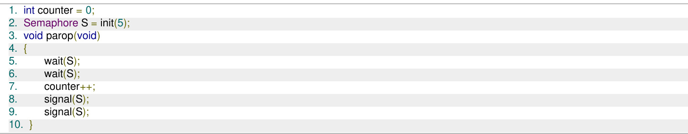

If five threads execute the function  concurrently, which of the following program behavior(s) is/are possible?

A. The value of is after all the threads successfully complete the execution of B. The value of is after all the threads successfully complete the execution of C. The value of is after all the threads successfully complete the execution of parop D. There is a deadlock involving all the threads

Consider the following threads, $\mathrm { T } _ { 1 } , \mathrm { T } _ { 2 }$ and $\mathrm { T } _ { 3 }$ executing on a single processor, synchronized using three binary semaphore variables, $\mathrm { S _ { 1 } , S _ { 2 } }$ and ${ \bf S } _ { 3 }$ operated upon using standard and The threads can be context switched in any order and at any time.

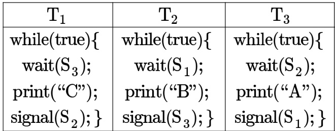

Which initialization of the semaphores would print the sequence BCABCABCA...?

A. $\mathbf { S } _ { 1 } = 1 ; \mathbf { S } _ { 2 } = 1 ; \mathbf { S } _ { 3 } = 1$ B. $\mathbf { S } _ { 1 } = 1 ; \mathbf { S } _ { 2 } = 1 ; \mathbf { S } _ { 3 } = 0$   
C. $\mathbf { S } _ { 1 } = \mathbf { 1 } ; \mathbf { S } _ { 2 } = 0 ; \mathbf { S } _ { 3 } = 0$ D. $\mathbf { S } _ { 1 } = 0 ; \mathbf { S } _ { 2 } = \mathbf { 1 } ; \mathbf { S } _ { 3 } = \mathbf { 1 }$

gatecse-2022 operating-system process-synchronization semaphore one-mark

There are threads each invoking once, and  threads each invoking  once, on the same shared variable . The initial value of  is 10.

Suppose there are two implementations of the semaphore as follows:

I-1: s is a binary semaphore initialized to I-2: S is a counting semaphore initialized to

L e t be the values of at the end of execution of all the threads with implementations respectively.

Which one of the following choices corresponds to the minimum possible values of  respectively?

A. B. C. 12,7 D. 12,8

gatecse-2023 operating-system semaphore two-marks

Consider three processes , and  running identical code, as shown in the pseudocode below. A and are two binary semaphores initialized to and , respectively. is a shared variable initialized to . Each line in the pseudocode is executed atomically.

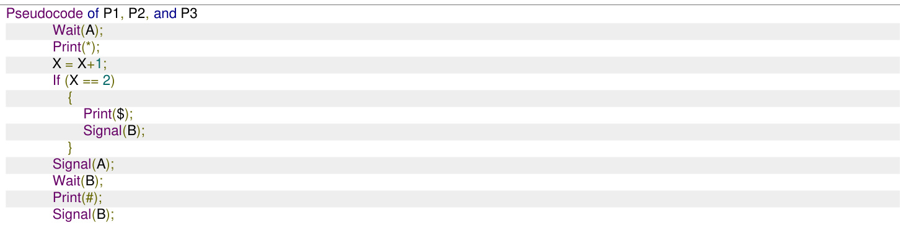

Assume that any of the three processes can start to execute first and context switching can happen between these processes at any arbitrary time and in any arbitrary order.

Which of the following patterns is/are possible to be generated as an outcome of the execution of these three processes?

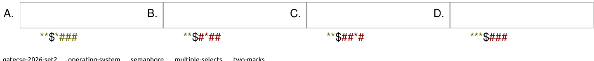

operating-system

The wait and signal operations of a monitor are implemented using semaphores as follows. In the following,

$x$ is a condition variable,   
mutex is a semaphore initialized to ,   
$x$ sem is a semaphore initialized to ,   
$x$ _count is the number of processes waiting on semaphore _sem, initially , next is a semaphore initialized to ,   
next count is the number of processes waiting on semaphore next, initially .

The body of each procedure that is visible outside the monitor is replaced with the following:

P(mutex);   
...   
body of procedure ...   
if (next_count $> 0$ )

Each occurrence of $x$ .wait is replaced with the following:

$\mathsf { x \_ c o u n t } = \mathsf { x \_ c o u n t } + 1$ (next_count $> 0$ ) V(next);   
else V(mutex); E1;   
x_count $\ l =$ x_count

Each occurrence of $x$ .signal is replaced with the following:

if (x _count > 0) next _count $\ c =$ next count + 1; E2; P(next); next_count $\mathbf { \Sigma } = \mathbf { \Sigma }$ next count 1;

For correct implementation of the monitor, statements $E 1$ and $E 2$ are, respectively,

A. $P ( x _ { - } s e m ) , V ( n e x t )$ $\begin{array} { l } { { \mathsf { B . } \ V ( n e x t ) , P ( x \_ s e m ) } } \\ { { \mathsf { D . } \ P ( x \_ s e m ) , V ( x \_ s e m ) } } \end{array}$   
C. $P ( n e x t ) , \dot { V } ( x \_ s e m )$

gateit-2006 operating-system process-synchronization semaphore normal

Processes $P 1 , P 2 , P 3 , P 4$ arrive in that order at times , and 8 milliseconds respectively, and have execution times of , and 9 milliseconds respectively. Shortest Remaining Time First (SRTF) algorithm is used as the CPU scheduling policy. Ignore context switching times.

Which ONE of the following correctly gives the average turnaround time of the four processes in milliseconds?

A. B. C. D. gatecse2025-set2 operating-system srtf process-scheduling average-turnaround-time one-mark

Consider the following statements with respect to user-level threads and kernel-supported threads

I. context switch is faster with kernel-supported threads II. for user-level threads, a system call can block the entire process III. Kernel supported threads can be scheduled independently IV. User level threads are transparent to the kernel

Which of the above statements are true?

A. (II), (III) and (IV) only B. (II) and (III) only C. (I) and (III) only D. (I) and (II) only gatecse-2004 operating-system threads normal

# 5.31.2 Threads: GATE CSE 2007 Question: 17

Consider the following statements about user level threads and kernel level threads. Which one of the following statements is FALSE?

A. Context switch time is longer for kernel level threads than for user level threads.   
B. User level threads do not need any hardware support.   
C. Related kernel level threads can be scheduled on different processors in a multi-processor system.   
D. Blocking one kernel level thread blocks all related threads.

gatecse-2007 operating-system threads normal

# 5.31.3 Threads: GATE CSE 2011 Question: 16, UGCNET-June2013-III: 65

A thread is usually defined as a "light weight process" because an Operating System (OS) maintains smaller data structure for a thread than for a process. In relation to this, which of the following statement is TRUE?

AB. On per- thread basis the OS maintains only CPU register state The OS does not maintain a separate stack for each thread C. On per- thread basis the OS does not maintain virtual memory state D. On per- thread basis the OS maintains only scheduling and accounting information gatecse-2011 operating-system threads normal ugcnetcse-june2013-paper3

Which one of the following is FALSE?

A. User level threads are not scheduled by the kernel.   
B. When a user level thread is blocked, all other threads of its process are blocked.   
C. Context switching between user level threads is faster than context switching between kernel level threads.   
D. Kernel level threads cannot share the code segment.

gatecse-2014-set1 operating-system threads normal

Which of the following is/are shared by all the threads in a process?

I. Program counter II. Stack III. Address space IV. Registers

A. (I) and (II) only B. (III) only C. (IV) only D. (III) and (IV) only

gatecse-2017-set2 operating-system threads

# 5.31.7 Threads: GATE CSE 2021 Set 2 Question: 42

Consider the following multi-threaded code segment (in a mix of C and pseudo-code), invoked by two processes $P _ { 1 }$ and $P _ { 2 }$ , and each of the processes spawns two threads $T _ { 1 }$ and $T _ { 2 }$ :

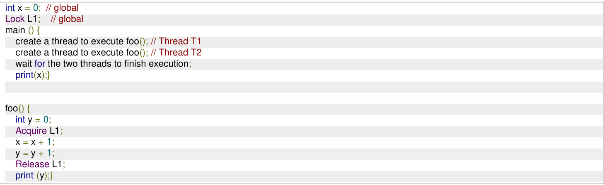

Which of the following statement(s) is/are correct?

A. Both $P _ { 1 }$ and $P _ { 2 }$ will print the value of $x$ as B. At least of $P _ { 1 }$ and $P _ { 2 }$ will print the value of $x$ as C. At least one of the threads will print the value of $y$ as D. Both $T _ { 1 }$ and $T _ { 2 }$ , in both the processes, will print the value of $y$ as gatecse-2021-set2 multiple-selects operating-system threads two-marks

Which of the following statements about threads is/are TRUE?

A. Threads can only be implemented in kernel space B. Each thread has its own file descriptor table for open files C. All the threads belonging to a process share a common stack D. Threads belonging to a process are by default not protected from each other gatecse-2024-set1 multiple-selects operating-system threads one-mark

$$
\begin{array} { c c } { { \mathbf { 1 1 } } } & { { } } \\ { { \mathbf { a } = \mathbf { a } + \mathbf { 1 } ; } } & { { } } \\ { { \mathbf { b } = \mathbf { b } + \mathbf { 1 } ; } } & { { } } \end{array} \begin{array} { c c } { { \mathbf { 1 } 2 } } & { { } } \\ { { \mathbf { b } = \mathbf { 2 } * \mathbf { b } ; } } & { { } } \\ { { \mathbf { a } = \mathbf { 2 } * a ; } } & { { } } \end{array}
$$

Which one of the following options lists all the possible combinations of values of a and b after both T1 and T2 finish execution?

$$
\begin{array} { l c l } { \displaystyle ( { \bf a } = { 4 } , { \bf b } = { 4 } ) ; ( { \bf a } = { 3 } , { \mathrm { b } } = { 3 } ) ; ( { \bf a } = { 4 } , { \mathrm { b } } = { 3 } ) } \\ { \displaystyle ( { \bf a } = { 3 } , { \mathrm { b } } = { 4 } ) ; ( { \bf a } = { 4 } , { \mathrm { b } } = { 3 } ) ; ( { \bf a } = { 3 } , { \mathrm { b } } = { 3 } ) } \\ { \displaystyle ( { \bf a } = { 4 } , { \mathrm { b } } = { 4 } ) ; ( { \bf a } = { 4 } , { \mathrm { b } } = { 3 } ) ; ( { \bf a } = { 3 } , { \mathrm { b } } = { 4 } ) } \\ { \displaystyle ( { \bf a } = { 2 } , { \mathrm { b } } = { 2 } ) ; ( { \bf a } = { 2 } , { \mathrm { b } } = { 3 } ) ; ( { \bf a } = { 3 } , { \mathrm { b } } = { 4 } ) } \end{array}
$$

gatecse-2024-set1 operating-system threads two-marks

Which one of the following is NOT shared by the threads of the same process ?

A. Stack B. Address Space C. File Descriptor Table D. Message Queue

gateit-2004 operating-system easy threads

Answer key☟

#

# 5.32.1 Translation Lookaside Buffer: GATE CSE 2022 Question: 28

Which one of the following statements is

A. The  performs an associative search in parallel on all its valid entries using page number of incoming virtual address.   
B. If the virtual address of a word given by  has a  hit, but the subsequent search for the word results in a cache miss, then the word will always be present in the main memory.   
C. The memory access time using a given inverted page table is always same for all incoming virtual addresses.   
D. In a system that uses hashed page tables, if two distinct virtual addresses and  map to the same value while hashing, then the memory access time of these addresses will not be the same.

A system has a Translation Lookaside Buffer (TLB) that has a reach of  MB. TLB reach is defined as the total amount of physical memory that can be accessed through the TLB entries. The paging system uses pages of size $4 \mathsf { K B }$ . The virtual address space is  GB and physical address space is GB. If each TLB entry stores a -bit process id, page number, frame number, and a -bit control field, then the size of the TLB (in bytes) is (answer in integer)

gatecse-2026-set2 operating-system translation-lookaside-buffer paging numerical-answers two-marks

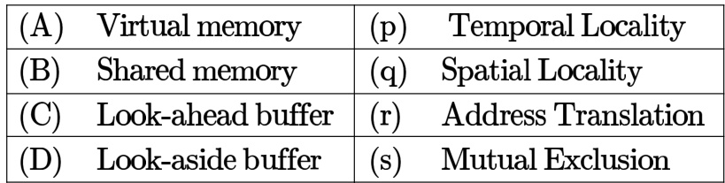

Under paged memory management scheme, simple lock and key memory protection arrangement may stil be required if the processors do not have address mapping hardware.

gate1990 operating-system virtual-memory fill-in-the-blanks

In a two-level virtual memory, the memory access time for main memory, $t _ { M } = 1 0 ^ { - 8 }$ sec, and the memory access time for the secondary memory, $t _ { D } = 1 0 ^ { - 3 }$ sec. What must be the hit ratio, $H$ such that the access efficiency is within percent of its maximum value?

gate1990 descriptive operating-system virtual-memory

Indicate all the false statements from the statements given below:

A. The amount of virtual memory available is limited by the availability of the secondary memory   
B. Any implementation of a critical section requires the use of an indivisible machine- instruction ,such as test-andset.   
C. The use of monitors ensure that no dead-locks will be caused   
D. The LRU page-replacement policy may cause thrashing for some type of programs.   
E. The best fit techniques for memory allocation ensures that memory will never be fragmented.

gate1991 operating-system virtual-memory normal multiple-selects

Which one of the following statements is true?

A. Macro definitions cannot appear within other macro definitions in assembly language programs B. Overlaying is used to run a program which is longer than the address space of a computer C. Virtual memory can be used to accommodate program which is longer than the address space of a computer D. It is not possible to write interrupt service routines in a high level language

gate1994 operating-system normal virtual-memory

C. Segment tables point to page tables and not to the physical locations of the segment D. The processor’s description base register points to a page table

In a virtual memory system the address space specified by the address lines of the CPU must be than the physical memory size and than the secondary storage size.

A. smaller, smaller B. smaller, larger C. larger, smaller D. larger, larger

gate1995 operating-system virtual-memory normal

# Answer key☟

A demand paged virtual memory system uses bit virtual address, page size of bytes, and has 1 Kbyte of main memory. page replacement is implemented using the list, whose current status (page number is decimal) is

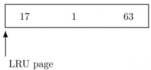

For each hexadecimal address in the address sequence given below,   
OOFF 010D, 10FF ,11B0   
indicate

i. the new status of the list ii. page faults, if any, and iii. page replacements, if any.

gate1996 operating-system virtual-memory normal descriptive

# 5.33.9 Virtual Memory: GATE CSE 1998 Question: 2.18, UGCNET-June2012-III: 48

If an instruction takes $\mathbf { \chi } _ { i }$ microseconds and a page fault takes an additional $j$ microseconds, the effective instruction time if on the average a page fault occurs every $k$ instruction is:

A. $8 . \ i + ( j \times k ) \qquad \mathtt { C . } \ \frac { i + j } { k }$ ${ \mathsf { D } } . \ ( i + j ) \times k$

gate1998 operating-system virtual-memory easy ugcnetcse-june2012-paper3

# Answer key☟

recently referenced virtual pages, in a fast cache that will use the direct mapping scheme. What is the number of tag bits that will need to be associated with each cache entry?

c. Assume that each page table entry contains (besides other information) valid bit, 3 bits for page protection and dirty bit. How many bits are available in page table entry for storing the aging information for the page? Assume that the page size is  bytes.

A multi-user, multi-processing operating system cannot be implemented on hardware that does not support

A. Address translation   
B. DMA for disk transfer   
C. At least two modes of CPU execution (privileged and non-privileged)   
D. Demand paging

gate1999 operating-system normal virtual-memory multiple-selects

Which of the following is/are advantage(s) of virtual memory?

A. Faster access to memory on an average.   
B. Processes can be given protected address spaces.   
C. Linker can assign addresses independent of where the program will be loaded in physical memory.   
D. Program larger than the physical memory size can be run.

gate1999 operating-system virtual-memory easy multiple-selects

Suppose the time to service a page fault is on the average  milliseconds, while a memory access takes microsecond. Then a $9 9 . 9 9 \%$ hit ratio results in average memory access time of

A. 1.9999 milliseconds B. millisecond C. microseconds D. 1.9999 microseconds

gatecse-2000 operating-system easy virtual-memory

Where does the swap space reside?

A. RAM B. Disk C. ROM D. On-chip cache

gatecse-2001 operating-system easy virtual- memory

Consider a machine with  MB physical memory and a -bit virtual address space. If the page size is KB, what is the approximate size of the page table?

A. 16MB B. 8MB C. 2MB D. 24MB

gatecse-2001 operating-system virtual-memory normal

# 5.33.17 Virtual Memory: GATE CSE 2002 Question: 19

A computer uses virtual address, and physical address. The physical memory is addressable, and the page size is It is decided to use two level page tables to translate from virtual address to physical address. Equal number of bits should be used for indexing first level and second leve page table, and the size of each table entry is  bytes.

A. Give a diagram showing how a virtual address would be translated to a physical address. B. What is the number of page table entries that can be contained in each page? C. How many bits are available for storing protection and other information in each page table entry?

gatecse-2002 operating-system virtual-memory normal descriptive

In a system with virtual addresses and page size, use of one-level page tables for virtual to physical address translation is not practical because of

A. the large amount of internal fragmentation B. the large amount of external fragmentation C. the large memory overhead in maintaining page tables D. the large computation overhead in the translation process gatecse-2003 operating-system virtual-memory normal

# Answer key☟

# 5.33.19 Virtual Memory: GATE CSE 2003 Question: 78

A processor uses page tables for virtual to physical address translation. Page tables for levels are stored in the main memory. Virtual and physical addresses are both bits wide. The memory is byte addressable. For virtual to physical address translation, the most significant bits of the virtual address are used as index into the first level page table while the next bits are used as index into the second level page table. The  least significant bits of the virtual address are used as offset within the page. Assume that the page table entries in both levels of page tables are bytes wide. Further, the processor has a translation look-aside buffer (TLB), with a hit rate of $9 6 \%$ . The TLB caches recently used virtual page numbers and the corresponding physical page numbers. The processor also has a physically addressed cache with a hit rate of $9 0 \%$ . Main memory access time is  ns, cache access time is  ns, and TLB access time is also 1 ns.

Assuming that no page faults occur, the average time taken to access a virtual address is approximately (to the nearest  ns)

A. ns B. ns C. ns D. ns

A processor uses page tables for virtual to physical address translation. Page tables for both levels are stored in the main memory. Virtual and physical addresses are both  bits wide. The memory is byte addressable. For virtual to physical address translation, the most significant bits of the virtual address are used as index into the first level page table while the next bits are used as index into the second level page table. The least significant bits of the virtual address are used as offset within the page. Assume that the page table entries in both levels of page tables are  bytes wide. Further, the processor has a translation look-aside buffer (TLB), with a hit rate of $9 6 \%$ . The TLB caches recently used virtual page numbers and the corresponding physical page numbers. The processor also has a physically addressed cache with a hit rate of $9 0 \%$ . Main memory access time is  ns, cache access time is  ns, and TLB access time is also ns.

Suppose a process has only the following pages in its virtual address space: two contiguous code pages starting at virtual address $0 x 0 0 0 0 0 0 0 0$ , two contiguous data pages starting at virtual address , and a stack page starting at virtual address . The amount of memory required for storing the page tables of this process is

A. 8KB B. 12KB C. 16KB D. 20KB

gatecse-2003 operating-system normal virtual-memory

A CPU generates -bit virtual addresses. The page size is  KB. The processor has a translation lookaside buffer (TLB) which can hold a total of page table entries and is -way set associative. The minimum size of the TLB tag is:

A. B. 13 bits C. 15 bits D. 20 bits

gatecse-2006 operating-system virtual-memory normal isro2016

# Answer key☟

# 5.33.22 Virtual Memory: GATE CSE 2006 Question: 63, UGCNET-June2012-III: 45

A computer system supports -bit virtual addresses as well as -bit physical addresses. Since the virtual address space is of the same size as the physical address space, the operating system designers decide to get rid of the virtual memory entirely. Which one of the following is true?

A. Efficient implementation of multi-user support is no longer possible B. The processor cache organization can be made more efficient now C. Hardware support for memory management is no longer needed D. CPU scheduling can be made more efficient now

The essential content(s) in each entry of a page table is are

A. Virtual page number B. Page frame number C. Both virtual page number and page frame number D. Access right information

gatecse-2009 operating-system virtual-memory easy

A multilevel page table is preferred in comparison to a single level page table for translating virtual address to physical address because

A. It reduces the memory access time to read or write a memory location.   
B. It helps to reduce the size of page table needed to implement the virtual address space of a process C. It is required by the translation lookaside buffer.   
D. It helps to reduce the number of page faults in page replacement algorithms.

gatecse-2009 operating-system virtual-memory easy

Let the page fault service time be  milliseconds(ms) in a computer with average memory access time being  nanoseconds (ns). If one page fault is generated every $1 0 ^ { 6 }$ memory accesses, what is the effective access time for memory?

A.  ns B. ns C. ns D. ns gatecse-2011 operating-system virtual-memory normal ugcnetcse-june2013-paper2

# Answer key☟

# 5.33.27 Virtual Memory: GATE CSE 2013 Question: 52

A computer uses virtual address, 32-bit physical address, and a three–level paged page organization. The page table base register stores the base address of the first-level table , which occupies exactly one page. Each entry of stores the base address of a page of the second-level table . Each entry of  stores the base address of a page of the third-level table Each entry of  stores a page table entry The is bits in size. The processor used in the computer has a way set associative virtually indexed physically tagged cache. The cache block size is bytes.

What is the size of a page in  in this computer?

A. B. C. D.

gatecse-2013 operating-system virtual-memory normal the processor cache of this computer?

A. B. C. D.

gatecse-2013 normal operating-system virtual-memory

Consider a paging hardware with a . Assume that the entire page table and all the pages are in the physical memory. It takes milliseconds to search the and  milliseconds to access the physical memory. If the $T L B$ hit ratio is , the effective memory access time (in milliseconds) is

gatecse-2014-set3 operating-system virtual-memory numerical-answers normal

Consider a system with byte-addressable memory, logical addresses, page size and page table entries of 4 each. The size of the page table in the system in  is

gatecse-2015-set1 operating-system virtual-memory easy numerical-answers

A computer system implements a virtual address, page size of , and a translation look-aside buffer (TLB) organized into sets each having  ways. Assume that the  tag does not store any process id. The minimum length of the  tag in bits is

gatecse-2015-set2 operating-system virtual-memory easy numerical-answers

A computer system implements  pages and a physical address space. Each page table entry contains a valid bit, a dirty bit, three permission bits, and the translation. If the maximum size of the page table of a process is , the length of the virtual address supported by the system is bits.

gatecse-2015-set2 operating-system virtual-memory normal numerical-answers

# 5.33.33 Virtual Memory: GATE CSE 2016 Set 1 Question: 47

Consider a computer system with -bit virtual addressing and page size of sixteen kilobytes. If the computer system has a one-level page table per process and each page table entry requires 48 bits, then the size of the per-process page table is megabytes.

gatecse-2016-set1 operating-system virtual-memory easy numerical-answers

Assume that in a certain computer, the virtual addresses are  bits long and the physical addresses are bits long. The memory is word addressible. The page size s $8 ~ \mathsf { k B }$ and the word size is  bytes. The Translation Look-aside Buffer (TLB) in the address translation path has valid entries. At most how many distinct virtual addresses can be translated without any TLB miss?

A. $1 6 \times 2 ^ { 1 0 }$ $\begin{array} { l } { \mathsf { B . ~ 2 5 6 \times 2 ^ { 1 0 } } } \\ { \mathsf { D . ~ 8 \times 2 ^ { 2 0 } } } \end{array}$   
C. $4 \times 2 ^ { 2 0 }$

gatecse-2019 operating-system virtual-memory two-marks

Consider a paging system that uses -level page table residing in main memory and a  for address translation. Each main memory access takes ns and lookup takes ns. Each page transfer to/from the disk takes  ns. Assume that the hit ratio is $9 5 \%$ , page fault rate is $1 0 \%$ . Assume that for $2 0 \%$ of the total page faults, a dirty page has to be written back to disk before the required page is read from disk. update time is negligible. The average memory access time in ns (round off to decimal places) is

Consider a computer system with -bit virtual addressing using multi-level tree-structured page tables with levels for virtual to physical address translation. The page size is $4 \mathrm { K B } ( 1 \mathrm { K B } = 1 0 2 4 \mathrm { B } )$ and a page table entry at any of the levels occupies 8 bytes.

The value of  is gatecse-2023 operating-system virtual-memory numerical-answers two-marks

Consider a memory management system that uses a page size of . Assume that both the physical and virtual addresses start from . Assume that the pages , and are stored in the page frames , and , respectively. The physical address (in decimal format) corresponding to the virtual address (in decimal format) is

gatecse-2024-set1 numerical-answers operating-system virtual-memory two-marks

# 5.33.39 Virtual Memory: GATE CSE 2024 Set 2 Question: 14

Which of the following tasks is/are the responsibility/responsibilities of the memory management uni in a system with paging-based memory management?

A. Allocate a new page table for a newly created process   
B. Translate a virtual address to a physical address using the page table   
C. Raise a trap when a virtual address is not found in the page table   
D. Raise a trap when a process tries to write to a page marked with read-only permission in the page table

Consider a -bit system with page size and page table entries of size bytes each. Assume $1 \mathrm { K B } = 2 ^ { 1 0 }$ bytes. The OS uses a -level page table for memory management, with the page table containing an outer page directory and an inner page table. The  allocates a page for the outer page directory upon process creation. The  uses demand paging when allocating memory for the inner page table, i.e., a page of the inner page table is allocated only if it contains at least one valid page table entry.

An active process in this system accesses  unique pages during its execution, and none of the pages are swapped out to disk. After it completes the page accesses, let  denote the minimum and  denote the maximum number of pages across the two levels of the page table of the process.

The value of $\mathbf { X } { + } \mathbf { Y }$ is gatecse-2024-set2 numerical-answers operating-system virtual-memory two-marks

In a virtual memory system, size of the virtual address is -bit, size of the physical address is -bit, page size is  Kbyte and size of each page table entry is -bit. The main memory is byte addressable. Which one of the following is the maximum number of bits that can be used for storing protection and other information in each page table entry?

A. B. C. D.

gateit-2004 operating-system virtual-memory normal

A paging scheme uses a Translation Look-aside Buffer (TLB). A TLB-access takes ns and the main memory access takes  ns. What is the effective access time(in ns) if the TLB hit ratio is $9 0 \%$ and there is no page-fault?

A. B. 60 C. 65 D.

gateit-2008 operating-system virtual-memory normal

# Answer key☟

Match the following flag bits used in the context of virtual memory management on the left side with the different purposes on the right side of the table below.

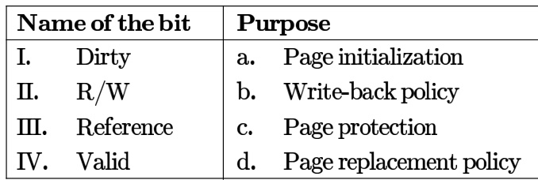

A. I-d,I-a, II-b,IV-c B. I-b, II-c,II-a, IV-d C. I-c,I-d, Ⅲ-a,IV-b D. I-b,II-c,II-d,IV-a

gateit-2008 operating-system virtual-memory easy match-the-following

# Answer Keys

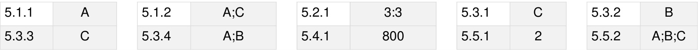

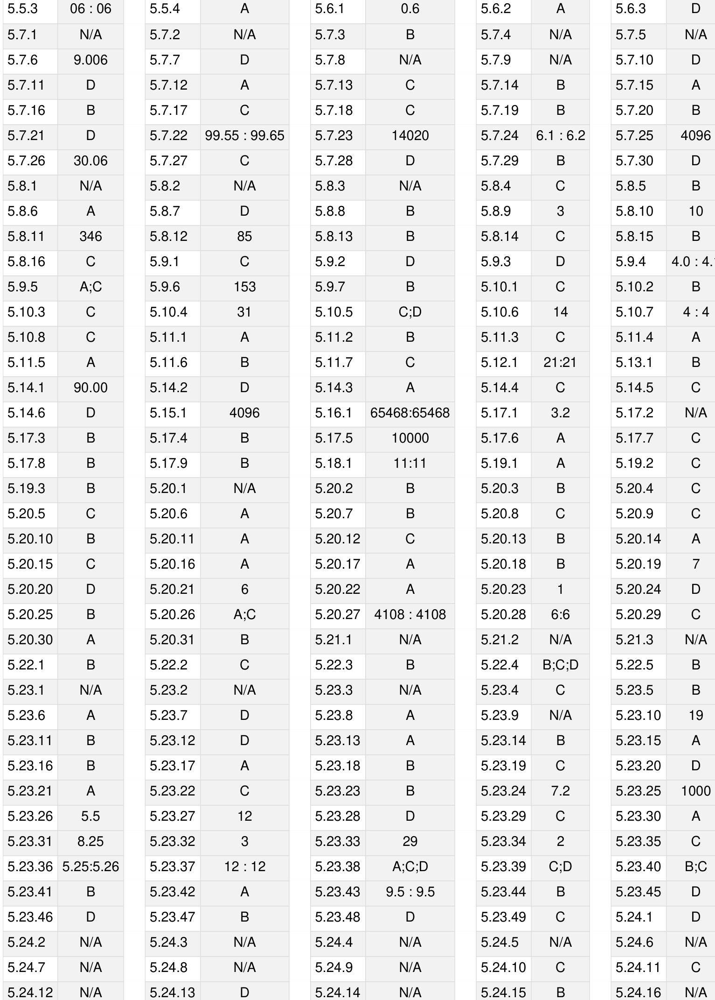

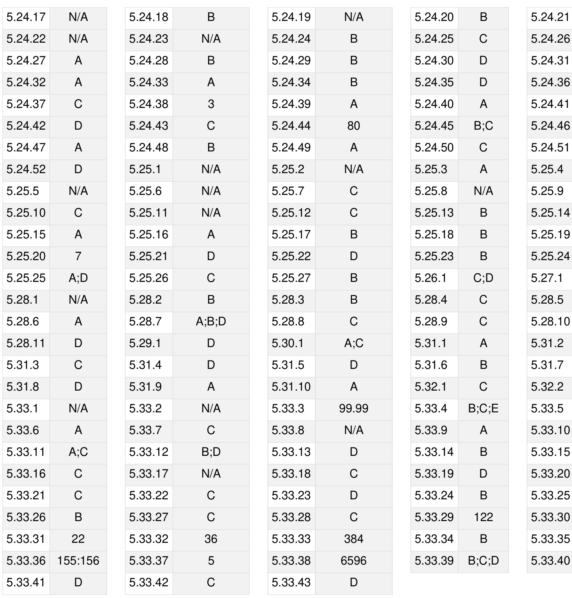